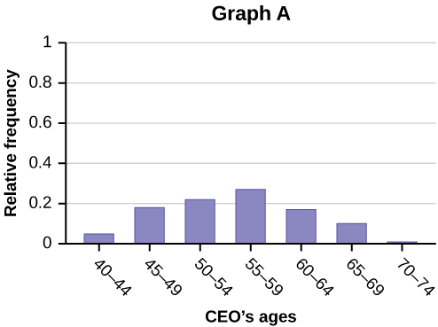
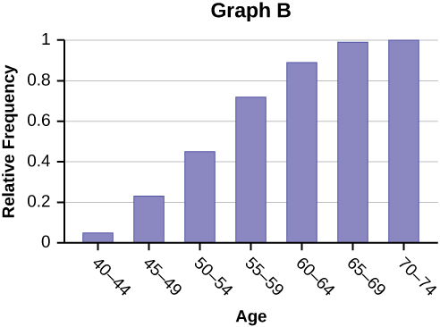

Once you have a set of data, you will need to organize it so that you can analyze how frequently each datum occurs in the set. However, when calculating the frequency, you may need to round your answers so that they are as precise as possible.

### Answers and Rounding Off

A simple way to round off answers is to carry your final answer one more decimal place than was present in the original data. Round off only the final answer. Do not round off any intermediate results, if possible. If it becomes necessary to round off intermediate results, carry them to at least twice as many decimal places as the final answer. For example, the average of the three quiz scores four, six, and nine is 6.3, rounded off to the nearest tenth, because the data are whole numbers. Most answers will be rounded off in this manner.

It is not necessary to reduce most fractions in this course. Especially in [Probability Topics](/m46938), the chapter on probability, it is more helpful to leave an answer as an unreduced fraction.

### Levels of Measurement   {#eip-109}

The way a set of data is measured is called its **level of measurement**{: data-type="term"}. Correct statistical procedures depend on a researcher being familiar with levels of measurement. Not every statistical operation can be used with every set of data. Data can be classified into four levels of measurement. They are (from lowest to highest level):

* **Nominal scale level**
* **Ordinal scale level**
* **Interval scale level**
* **Ratio scale level**

Data that is measured using a **nominal scale**{: data-type="term"} is **qualitative(categorical)**. Categories, colors, names, labels and favorite foods along with yes or no responses are examples of nominal level data. Nominal scale data are not ordered. For example, trying to classify people according to their favorite food does not make any sense. Putting pizza first and sushi second is not meaningful.

Smartphone companies are another example of nominal scale data. The data are the names of the companies that make smartphones, but there is no agreed upon order of these brands, even though people may have personal preferences. Nominal scale data cannot be used in calculations.

Data that is measured using an **ordinal scale**{: data-type="term"} is similar to nominal scale data but there is a big difference. The ordinal scale data can be ordered. An example of ordinal scale data is a list of the top five national parks in the United States. The top five national parks in the United States can be ranked from one to five but we cannot measure differences between the data.

Another example of using the ordinal scale is a cruise survey where the responses to questions about the cruise are “excellent,” “good,” “satisfactory,” and “unsatisfactory.” These responses are ordered from the most desired response to the least desired. But the differences between two pieces of data cannot be measured. Like the nominal scale data, ordinal scale data cannot be used in calculations.

Data that is measured using the **interval scale**{: data-type="term"} is similar to ordinal level data because it has a definite ordering but there is a difference between data. The differences between interval scale data can be measured though the data does not have a starting point.

Temperature scales like Celsius (C) and Fahrenheit (F) are measured by using the interval scale. In both temperature measurements, 40° is equal to 100° minus 60°. Differences make sense. But 0 degrees does not because, in both scales, 0 is not the absolute lowest temperature. Temperatures like -10° F and -15° C exist and are colder than 0.

Interval level data can be used in calculations, but one type of comparison cannot be done. 80° C is not four times as hot as 20° C (nor is 80° F four times as hot as 20° F). There is no meaning to the ratio of 80 to 20 (or four to one).

Data that is measured using the **ratio scale**{: data-type="term"} takes care of the ratio problem and gives you the most information. Ratio scale data is like interval scale data, but it has a 0 point and ratios can be calculated. For example, four multiple choice statistics final exam scores are 80, 68, 20 and 92 (out of a possible 100 points). The exams are machine-graded.

The data can be put in order from lowest to highest: 20, 68, 80, 92.

The differences between the data have meaning. The score 92 is more than the score 68 by 24 points. Ratios can be calculated. The smallest score is 0. So 80 is four times 20. The score of 80 is four times better than the score of 20.

### Frequency   {#eip-959}

Twenty students were asked how many hours they worked per day. Their responses, in hours, are as follows: 56332475235654435253.

[\[link\]](#id10383738) lists the different data values in ascending order and their frequencies.

<table id="id10383738" summary="This table presents the values provided in the previously given data set in the first column, and the frequency of each value in the second column."><caption>Frequency Table of Student Work Hours</caption><thead>
            <tr>
              <th>DATA VALUE</th>
              <th>FREQUENCY</th>
            </tr>
</thead><tbody>
            <tr>
              <td>2</td>
              <td>3</td>
            </tr>
            <tr>
              <td>3</td>
              <td>5</td>
            </tr>
            <tr>
              <td>4</td>
              <td>3</td>
            </tr>
            <tr>
              <td>5</td>
              <td>6</td>
            </tr>
            <tr>
              <td>6</td>
              <td>2</td>
            </tr>
            <tr>
              <td>7</td>
              <td>1</td>
            </tr>
          </tbody></table>

A **frequency**{: data-type="term"} is the number of times a value of the data occurs. According to [\[link\]](#id10383738), there are three students who work two hours, five students who work three hours, and so on. The sum of the values in the frequency column, 20, represents the total number of students included in the sample.

A **relative frequency**{: data-type="term"} is the ratio (fraction or proportion) of the number of times a value of the data occurs in the set of all outcomes to the total number of outcomes. To find the relative frequencies, divide each frequency by the total number of students in the sample–in this case, 20. Relative frequencies can be written as fractions, percents, or decimals.

<table id="id11177380" summary="Frequency Table of Student Work Hours with Relative Frequencies"><caption>Frequency Table of Student Work Hours with Relative Frequencies</caption><thead>
<tr>
<th>DATA VALUE</th>
<th>FREQUENCY</th>
<th>RELATIVE FREQUENCY</th>

</tr>
</thead><tbody>
<tr>
<td>2</td>
<td>3</td>
<td><math xmlns="http://www.w3.org/1998/Math/MathML">
 <mrow>
  <mfrac>
   <mn>3</mn>
   <mrow>
    <mn>20</mn>
   </mrow>
  </mfrac>
 </mrow>
</math> or 0.15</td>

</tr>
<tr>
<td>3</td>
<td>5</td>
<td><math xmlns="http://www.w3.org/1998/Math/MathML">
 <mrow>
  <mfrac>
   <mn>5</mn>
   <mrow>
    <mn>20</mn>
   </mrow>
  </mfrac>
</mrow>
</math> or 0.25 </td>

</tr>
<tr>
<td>4</td>
<td>3</td>
<td><math xmlns="http://www.w3.org/1998/Math/MathML"><mrow>
  <mfrac>
   <mn>3</mn>
   <mrow>
    <mn>20</mn>
   </mrow>
  </mfrac>
 </mrow>
</math> or 0.15 </td>

</tr>
<tr>
<td>5</td>
<td>6</td>
<td><math xmlns="http://www.w3.org/1998/Math/MathML"><mrow>
  <mfrac>
   <mn>6</mn>
   <mrow>
    <mn>20</mn>
   </mrow>
  </mfrac>
 </mrow>
</math> or 0.30 </td>

</tr>
<tr>
<td>6</td>
<td>2</td>
<td><math xmlns="http://www.w3.org/1998/Math/MathML">
 <mrow>
  <mfrac>
   <mn>2</mn>
   <mrow>
    <mn>20</mn>
   </mrow>
  </mfrac>
 </mrow>
</math> or 0.10</td>
</tr>

<tr>
<td>7</td>
<td>1</td>
<td><math xmlns="http://www.w3.org/1998/Math/MathML"><mrow>
  <mfrac>
   <mn>1</mn>
   <mrow>
    <mn>20</mn>
   </mrow>
  </mfrac>
 </mrow>
</math> or 0.05</td>
</tr>
</tbody></table>

The sum of the values in the relative frequency column of [\[link\]](#id11177380) is <math xmlns="http://www.w3.org/1998/Math/MathML"> <mrow> <mfrac> <mrow> <mn>20</mn> </mrow> <mrow> <mn>20</mn> </mrow> </mfrac> </mrow> </math>

 , or 1.

**Cumulative relative frequency**{: data-type="term"} is the accumulation of the previous relative frequencies. To find the cumulative relative frequencies, add all the previous relative frequencies to the relative frequency for the current row, as shown in [\[link\]](#id10564302).

<table id="id10564302" summary="Table shows data, frequency, relative frequency and cumulative relative frequency."><caption>Frequency Table of Student Work Hours with Relative and Cumulative Relative Frequencies</caption><thead>
<tr>
<th>DATA VALUE</th>
<th>FREQUENCY</th>
<th>RELATIVE 
FREQUENCY</th>
<th>CUMULATIVE RELATIVE 
FREQUENCY</th>
</tr>
</thead><tbody>
<tr>
<td>2</td>
<td>3</td>
<td><math xmlns="http://www.w3.org/1998/Math/MathML">
 <mrow>
  <mfrac>
   <mn>3</mn>
   <mrow>
    <mn>20</mn>
   </mrow>
  </mfrac>

 </mrow>
</math>
 or 0.15</td>
<td>0.15</td>
</tr>

<tr>
<td>3</td>
<td>5</td>
<td><math xmlns="http://www.w3.org/1998/Math/MathML">
 <mrow>
  <mfrac>
   <mn>5</mn>
   <mrow>
    <mn>20</mn>
   </mrow>
  </mfrac>

 </mrow>
</math>
 or 0.25</td>
<td>0.15 + 0.25 = 0.40</td>
</tr>

<tr>
<td>4</td>
<td>3</td>
<td><math xmlns="http://www.w3.org/1998/Math/MathML">
 <mrow>
  <mfrac>
   <mn>3</mn>
   <mrow>
    <mn>20</mn>
   </mrow>
  </mfrac>

 </mrow>
</math>
 or 0.15</td>
<td>0.40 + 0.15 = 0.55</td>
</tr>

<tr>
<td>5</td>
<td>6</td>
<td><math xmlns="http://www.w3.org/1998/Math/MathML">
 <mrow>
  <mfrac>
   <mn>6</mn>
   <mrow>
    <mn>20</mn>
   </mrow>
  </mfrac>

 </mrow>
</math>
 or 0.30</td>
<td>0.55 + 0.30 = 0.85</td>
</tr>

<tr>
<td>6</td>
<td>2</td>
<td><math xmlns="http://www.w3.org/1998/Math/MathML">
 <mrow>
  <mfrac>
   <mn>2</mn>
   <mrow>
    <mn>20</mn>
   </mrow>
  </mfrac>

 </mrow>
</math>
 or 0.10</td>
<td>0.85 + 0.10 = 0.95</td>
</tr>

<tr>
<td>7</td>
<td>1</td>
<td><math xmlns="http://www.w3.org/1998/Math/MathML">
 <mrow>
  <mfrac>
   <mn>1</mn>
   <mrow>
    <mn>20</mn>
   </mrow>
  </mfrac>

 </mrow>
</math>
 or 0.05</td>
<td>0.95 + 0.05 = 1.00</td>
</tr>
</tbody></table>

The last entry of the cumulative relative frequency column is one, indicating that one hundred percent of the data has been accumulated.

NOTE

Because of rounding, the relative frequency column may not always sum to one, and the last entry in the cumulative relative frequency column may not be one. However, they each should be close to one.

[\[link\]](#id9703284) represents the heights, in inches, of a sample of 100 male semiprofessional soccer players.

<table id="id9703284" summary="This table presents a range of heights in inches in the first column, the number of students whose height falls within that range in the second column, the relative frequency of students in this range (expressed as both a fraction and a decimal) in the third column, and the cumulative relative frequency (expressed as a sum of current and previous relative frequency values) in the fourth column."><caption>Frequency Table of Soccer Player Height</caption><thead>
<tr>
<th>HEIGHTS 
(INCHES)</th>
<th>FREQUENCY</th>
<th>RELATIVE 
FREQUENCY</th>
<th>CUMULATIVE 
RELATIVE 
FREQUENCY</th>
</tr>
</thead><tbody>
<tr>
<td>59.95–61.95</td>
<td>5</td>
<td>
<math xmlns="http://www.w3.org/1998/Math/MathML">
 <mrow>
  <mfrac>
   <mn>5</mn>
   <mrow>
    <mn>100</mn>
   </mrow>
  </mfrac>
 </mrow>
</math>
 = 0.05
</td>
<td>0.05</td>
</tr>

<tr>
<td>61.95–63.95</td>
<td>3</td>
<td>
<math xmlns="http://www.w3.org/1998/Math/MathML">
 <mrow>
  <mfrac>
   <mn>3</mn>
   <mrow>
    <mn>100</mn>
   </mrow>
  </mfrac>
  </mrow></math>
 = 0.03
</td>
<td>0.05 + 0.03 = 0.08</td>
</tr>

<tr>
<td>63.95–65.95</td>
<td>15</td>
<td>
<math xmlns="http://www.w3.org/1998/Math/MathML">
 <mrow>
  <mfrac>
   <mrow>
    <mn>15</mn>
   </mrow>
   <mrow>
    <mn>100</mn>
   </mrow>
  </mfrac>
 </mrow>
</math>
 = 0.15
</td>
<td>0.08 + 0.15 = 0.23</td>
</tr>

<tr>
<td>65.95–67.95</td>
<td>40</td>
<td>
<math xmlns="http://www.w3.org/1998/Math/MathML">
 <mrow>
  <mfrac>
   <mrow>
    <mn>40</mn>
   </mrow>
   <mrow>
    <mn>100</mn>
   </mrow>
  </mfrac>

 </mrow>
</math>
 = 0.40
</td>
<td>0.23 + 0.40 = 0.63</td>
</tr>

<tr>
<td>67.95–69.95</td>
<td>17</td>
<td>
<math xmlns="http://www.w3.org/1998/Math/MathML">
 <mrow>
  <mfrac>
   <mrow>
    <mn>17</mn>
   </mrow>
   <mrow>
    <mn>100</mn>
   </mrow>
  </mfrac>

 </mrow>
</math>
 = 0.17
</td>
<td>0.63 + 0.17 = 0.80</td>
</tr>

<tr>
<td>69.95–71.95</td>
<td>12</td>
<td>
<math xmlns="http://www.w3.org/1998/Math/MathML">
 <mrow>
  <mfrac>
   <mrow>
    <mn>12</mn>
   </mrow>
   <mrow>
    <mn>100</mn>
   </mrow>
  </mfrac>

 </mrow>
</math>
 = 0.12
</td>
<td>0.80 + 0.12 = 0.92</td>
</tr>

<tr>
<td>71.95–73.95</td>
<td>7</td>
<td>
<math xmlns="http://www.w3.org/1998/Math/MathML">
 <mrow>
  <mfrac>
   <mn>7</mn>
   <mrow>
    <mn>100</mn>
   </mrow>
  </mfrac>
 </mrow>
</math>
 = 0.07
</td>
<td>0.92 + 0.07 = 0.99</td>
</tr>

<tr>
<td>73.95–75.95</td>
<td>1</td>
<td>
<math xmlns="http://www.w3.org/1998/Math/MathML">
 <mrow>
  <mfrac>
   <mn>1</mn>
   <mrow>
    <mn>100</mn>
   </mrow>
  </mfrac>
 </mrow>
</math>
 = 0.01
</td>
<td>0.99 + 0.01 = 1.00</td>
</tr>

<tr>
<td />
<td><strong>Total = 100</strong></td>
<td><strong>Total = 1.00</strong></td>
<td />
</tr>

</tbody></table>

The data in this table have been **grouped** into the following intervals:

* 59\.95 to 61.95 inches
* 61\.95 to 63.95 inches
* 63\.95 to 65.95 inches
* 65\.95 to 67.95 inches
* 67\.95 to 69.95 inches
* 69\.95 to 71.95 inches
* 71\.95 to 73.95 inches
* 73\.95 to 75.95 inches

Note

This example is used again in [Descriptive Statistics](/m46925), where the method used to compute the intervals will be explained.

In this sample, there are **five** players whose heights fall within the interval 59.95–61.95 inches, **three** players whose heights fall within the interval 61.95–63.95 inches, **15** players whose heights fall within the interval 63.95–65.95 inches, **40** players whose heights fall within the interval 65.95–67.95 inches, **17** players whose heights fall within the interval 67.95–69.95 inches, **12** players whose heights fall within the interval 69.95–71.95, **seven** players whose heights fall within the interval 71.95–73.95, and **one** player whose heights fall within the interval 73.95–75.95. All heights fall between the endpoints of an interval and not at the endpoints.

From [[link]](#id9703284), find the percentage of heights that are less than 65.95 inches.

If you look at the first, second, and third rows, the heights are all less than 65.95 inches. There are 5 + 3 + 15 = 23 players whose heights are less than 65.95 inches. The percentage of heights less than 65.95 inches is then <math xmlns="http://www.w3.org/1998/Math/MathML"> <mrow> <mfrac> <mrow> <mn>23</mn> </mrow> <mrow> <mn>100</mn> </mrow> </mfrac> </mrow> </math>

 or 23%. This percentage is the cumulative relative frequency entry in the third row.

Try It

<!--1-->

[[link]](#fs-idm82680048) shows the amount, in inches, of annual rainfall in a sample of towns.

| Rainfall (Inches) | Frequency | Relative Frequency | Cumulative Relative Frequency |
|----------
| 2.95–4.97 | 6 | <math xmlns="http://www.w3.org/1998/Math/MathML"> <mrow> <mfrac> <mn>6</mn> <mrow> <mn>50</mn> </mrow> </mfrac> </mrow> </math>

 = 0.12 | 0.12 |
| 4.97–6.99 | 7 | <math xmlns="http://www.w3.org/1998/Math/MathML"> <mrow> <mfrac> <mn>7</mn> <mrow> <mn>50</mn> </mrow> </mfrac> </mrow> </math>

 = 0.14 | 0.12 + 0.14 = 0.26 |
| 6.99–9.01 | 15 | <math xmlns="http://www.w3.org/1998/Math/MathML"> <mrow> <mfrac> <mrow> <mn>15</mn> </mrow> <mrow> <mn>50</mn> </mrow> </mfrac> </mrow> </math>

 = 0.30 | 0.26 + 0.30 = 0.56 |
| 9.01–11.03 | 8 | <math xmlns="http://www.w3.org/1998/Math/MathML"> <mrow> <mfrac> <mn>8</mn> <mrow> <mn>50</mn> </mrow> </mfrac> </mrow> </math>

 = 0.16 | 0.56 + 0.16 = 0.72 |
| 11.03–13.05 | 9 | <math xmlns="http://www.w3.org/1998/Math/MathML"> <mrow> <mfrac> <mn>9</mn> <mrow> <mn>50</mn> </mrow> </mfrac> </mrow> </math>

 = 0.18 | 0.72 + 0.18 = 0.90 |
| 13.05–15.07 | 5 | <math xmlns="http://www.w3.org/1998/Math/MathML"> <mrow> <mfrac> <mn>5</mn> <mrow> <mn>50</mn> </mrow> </mfrac> </mrow> </math>

 = 0.10 | 0.90 + 0.10 = 1.00 |
|  | Total = 50 | Total = 1.00 |  |
{: summary="Table shows the amount in inches, of annual rainfallin a sample towns"}

From [[link]](#fs-idm82680048), find the percentage of rainfall that is less than 9.01 inches.

From [[link]](#id9703284), find the percentage of heights that fall between 61.95 and 65.95 inches.

Add the relative frequencies in the second and third rows: 0.03 + 0.15 = 0.18 or 18%.

Try It

From [[link]](#fs-idm82680048), find the percentage of rainfall that is between 6.99 and 13.05 inches.

Use the heights of the 100 male semiprofessional soccer players in [[link]](#id9703284). Fill in the blanks and check your answers.

1.  The percentage of heights that are from 67.95 to 71.95 inches is: \_\_\_\_.
2.  The percentage of heights that are from 67.95 to 73.95 inches is: \_\_\_\_.
3.  The percentage of heights that are more than 65.95 inches is: \_\_\_\_.
4.  The number of players in the sample who are between 61.95 and 71.95 inches tall is: \_\_\_\_.
5.  What kind of data are the heights?
6.  Describe how you could gather this data (the heights) so that the data are characteristic of all male semiprofessional soccer players.
{: type="a"}

Remember, you **count frequencies**. To find the relative frequency, divide the frequency by the total number of data values. To find the cumulative relative frequency, add all of the previous relative frequencies to the relative frequency for the current row.

1.  29%
2.  36%
3.  77%
4.  87
5.  quantitative continuous
6.  get rosters from each team and choose a simple random sample from each
{: type="a"}

Try It

From [[link]](#fs-idm82680048), find the number of towns that have rainfall between 2.95 and 9.01 inches.

Collaborative Exercise

In your class, have someone conduct a survey of the number of siblings (brothers and sisters) each student has. Create a frequency table. Add to it a relative frequency column and a cumulative relative frequency column. Answer the following questions:

     
1.  What percentage of the students in your class have no siblings?
2.  What percentage of the students have from one to three siblings?
3.  What percentage of the students have fewer than three siblings?

Nineteen people were asked how many miles, to the nearest mile, they commute to work each day. The data are as follows: 2 5 7 3 2 10 18 15 20 7 10 18 5 12 13 12 4 5 10. [\[link\]](#id9833287) was produced:

<table id="id9833287" summary="This table presents the number of miles driven by survey respondents in the first column, the frequency of each response in the second column, the relative frequency (expressed as a fraction) in the third column, and the cumulative relative frequency (expressed as a decimal) in the fourth column."><caption>Frequency of Commuting Distances</caption><thead>
<tr>
<th>DATA</th>
<th>FREQUENCY</th>
<th>RELATIVE 
FREQUENCY</th>
<th>CUMULATIVE 
RELATIVE 
FREQUENCY</th>
</tr>
</thead><tbody>
<tr>
<td>3</td>
<td>3</td>
<td><math xmlns="http://www.w3.org/1998/Math/MathML">
<mfrac>
<mn>3</mn>
<mn>19</mn>
</mfrac>
</math></td>
<td>0.1579</td>
</tr>
<tr>
              <td>4</td>
              <td>1</td>
              <td><math xmlns="http://www.w3.org/1998/Math/MathML">
  <mfrac>
    <mn>1</mn>
    <mn>19</mn>
  </mfrac>
</math></td>
              <td>0.2105</td>
            </tr>
            <tr>
              <td>5</td>
              <td>3</td>
              <td><math xmlns="http://www.w3.org/1998/Math/MathML">
  <mfrac>
    <mn>3</mn>
    <mn>19</mn>
  </mfrac>
</math></td>
              <td>0.1579</td>
            </tr>
            <tr>
              <td>7</td>
              <td>2</td>
              <td><math xmlns="http://www.w3.org/1998/Math/MathML">
  <mfrac>
    <mn>2</mn>
    <mn>19</mn>
  </mfrac>
</math></td>
              <td>0.2632</td>
            </tr>
            <tr>
              <td>10</td>
              <td>3</td>
              <td><math xmlns="http://www.w3.org/1998/Math/MathML">
  <mfrac>
    <mn>4</mn>
    <mn>19</mn>
  </mfrac>
</math></td>
              <td>0.4737</td>
            </tr>
            <tr>
              <td>12</td>
              <td>2</td>
              <td><math xmlns="http://www.w3.org/1998/Math/MathML">
  <mfrac>
    <mn>2</mn>
    <mn>19</mn>
  </mfrac>
</math></td>
              <td>0.7895</td>
            </tr>
            <tr>
              <td>13</td>
              <td>1</td>
              <td><math xmlns="http://www.w3.org/1998/Math/MathML">
  <mfrac>
    <mn>1</mn>
    <mn>19</mn>
  </mfrac>
</math></td>
              <td>0.8421</td>
            </tr>
            <tr>
              <td>15</td>
              <td>1</td>
              <td><math xmlns="http://www.w3.org/1998/Math/MathML">
  <mfrac>
    <mn>1</mn>
    <mn>19</mn>
  </mfrac>
</math></td>
              <td>0.8948</td>
            </tr>
            <tr>
              <td>18</td>
              <td>1</td>
              <td><math xmlns="http://www.w3.org/1998/Math/MathML">
  <mfrac>
    <mn>1</mn>
    <mn>19</mn>
  </mfrac>
</math></td>
              <td>0.9474</td>
            </tr>
            <tr>
              <td>20</td>
              <td>1</td>
              <td>
<math xmlns="http://www.w3.org/1998/Math/MathML">
  <mfrac>
    <mn>1</mn>
    <mn>19</mn>
  </mfrac>
</math>
</td>
              <td>1.0000</td>
            </tr>
          </tbody></table>

1.  Is the table correct? If it is not correct, what is wrong?
2.  True or False: Three percent of the people surveyed commute three miles. If the statement is not correct, what should it be? If the table is incorrect, make the corrections.
3.  What fraction of the people surveyed commute five or seven miles?
4.  What fraction of the people surveyed commute 12 miles or more? Less than 12 miles? Between five and 13 miles (not including five and 13 miles)?
{: type="a"}

1.  No. The frequency column sums to 18, not 19. Not all cumulative relative frequencies are correct.
2.  False. The frequency for three miles should be one; for two miles (left out), two. The cumulative relative frequency column should read: 0.1052, 0.1579, 0.2105, 0.3684, 0.4737, 0.6316, 0.7368, 0.7895, 0.8421, 0.9474, 1.0000.
3.  <math xmlns="http://www.w3.org/1998/Math/MathML"><mfrac><mn>5</mn><mn>19</mn></mfrac></math>

4.  <math xmlns="http://www.w3.org/1998/Math/MathML"> <mfrac><mn>7</mn><mn>19</mn></mfrac></math>
    
    ,
    <math xmlns="http://www.w3.org/1998/Math/MathML"><mfrac><mn>12</mn><mn>19</mn></mfrac></math>
    
    ,
    <math xmlns="http://www.w3.org/1998/Math/MathML"><mfrac><mn>7</mn><mn>19</mn></mfrac></math>
{: type="a"}

Try It

[[link]](#fs-idm82680048) represents the amount, in inches, of annual rainfall in a sample of towns. What fraction of towns surveyed get between 11.03 and 13.05 inches of rainfall each year?

[\[link\]](#fs-idm52810848) contains the total number of deaths worldwide as a result of earthquakes for the period from 2000 to 2012.

| Year | Total Number of Deaths |
|----------
| 2000 | 231 |
| 2001 | 21,357 |
| 2002 | 11,685 |
| 2003 | 33,819 |
| 2004 | 228,802 |
| 2005 | 88,003 |
| 2006 | 6,605 |
| 2007 | 712 |
| 2008 | 88,011 |
| 2009 | 1,790 |
| 2010 | 320,120 |
| 2011 | 21,953 |
| 2012 | 768 |
| Total | 823,856 |
{: summary="This table represents the total number of deaths worldwide as a result of earthquakes for the period from 2000 to 2012."}

Answer the following questions.

1.  What is the frequency of deaths measured from 2006 through 2009?
2.  What percentage of deaths occurred after 2009?
3.  What is the relative frequency of deaths that occurred in 2003 or earlier?
4.  What is the percentage of deaths that occurred in 2004?
5.  What kind of data are the numbers of deaths?
6.  The Richter scale is used to quantify the energy produced by an earthquake. Examples of Richter scale numbers are 2.3, 4.0, 6.1, and 7.0. What kind of data are these numbers?
{: type="a"}

1.  97,118 (11.8%)
2.  41\.6%
3.  67,092/823,356 or 0.081 or 8.1 %
4.  27\.8%
5.  Quantitative discrete
6.  Quantitative continuous
{: type="a"}

Try It

[[link]](#fs-idm74902768) contains the total number of fatal motor vehicle traffic crashes in the United States for the period from 1994 to 2011.

| Year | Total Number of Crashes | Year | Total Number of Crashes |
|----------
| 1994 | 36,254 | 2004 | 38,444 |
| 1995 | 37,241 | 2005 | 39,252 |
| 1996 | 37,494 | 2006 | 38,648 |
| 1997 | 37,324 | 2007 | 37,435 |
| 1998 | 37,107 | 2008 | 34,172 |
| 1999 | 37,140 | 2009 | 30,862 |
| 2000 | 37,526 | 2010 | 30,296 |
| 2001 | 37,862 | 2011 | 29,757 |
| 2002 | 38,491 | Total | 653,782 |
| 2003 | 38,477 |  |  |
{: summary=""}

Answer the following questions.

1.  What is the frequency of deaths measured from 2000 through 2004?
2.  What percentage of deaths occurred after 2006?
3.  What is the relative frequency of deaths that occurred in 2000 or before?
4.  What is the percentage of deaths that occurred in 2011?
5.  What is the cumulative relative frequency for 2006? Explain what this number tells you about the data.
{: type="a"}

### References   {#eip-137}

“State &amp; County QuickFacts,” U.S. Census Bureau. http://quickfacts.census.gov/qfd/download\\\_data.html (accessed May 1, 2013).

“State &amp; County QuickFacts: Quick, easy access to facts about people, business, and geography,” U.S. Census Bureau. http://quickfacts.census.gov/qfd/index.html (accessed May 1, 2013).

“Table 5: Direct hits by mainland United States Hurricanes (1851-2004),” National Hurricane Center, http://www.nhc.noaa.gov/gifs/table5.gif (accessed May 1, 2013).

“Levels of Measurement,” http://infinity.cos.edu/faculty/woodbury/stats/tutorial/Data\\\_Levels.htm (accessed May 1, 2013).

Courtney Taylor, “Levels of Measurement,” about.com, http://statistics.about.com/od/HelpandTutorials/a/Levels-Of-Measurement.htm (accessed May 1, 2013).

David Lane. “Levels of Measurement,” Connexions, http://cnx.org/content/m10809/latest/ (accessed May 1, 2013).

### Chapter Review

Some calculations generate numbers that are artificially precise. It is not necessary to report a value to eight decimal places when the measures that generated that value were only accurate to the nearest tenth. Round off your final answer to one more decimal place than was present in the original data. This means that if you have data measured to the nearest tenth of a unit, report the final statistic to the nearest hundredth.

In addition to rounding your answers, you can measure your data using the following four levels of measurement.

* **Nominal scale level:** data that cannot be ordered nor can it be used in calculations
* **Ordinal scale level:** data that can be ordered; the differences cannot be measured
* **Interval scale level:** data with a definite ordering but no starting point; the differences can be measured, but there is no such thing as a ratio.
* **Ratio scale level:** data with a starting point that can be ordered; the differences have meaning and ratios can be calculated.

When organizing data, it is important to know how many times a value appears. How many statistics students study five hours or more for an exam? What percent of families on our block own two pets? Frequency, relative frequency, and cumulative relative frequency are measures that answer questions like these.

<section data-depth="1" id="eip-206" class="practice">

What type of measure scale is being used? Nominal, ordinal, interval or ratio.

1.  High school soccer players classified by their athletic ability: Superior, Average, Above average
2.  Baking temperatures for various main dishes: 350, 400, 325, 250, 300
3.  The colors of crayons in a 24-crayon box
4.  Social security numbers
5.  Incomes measured in dollars
6.  A satisfaction survey of a social website by number: 1 = very satisfied, 2 = somewhat satisfied, 3 = not satisfied
7.  Political outlook: extreme left, left-of-center, right-of-center, extreme right
8.  Time of day on an analog watch
9.  The distance in miles to the closest grocery store
10. The dates 1066, 1492, 1644, 1947, and 1944
11. The heights of 21–65 year-old women
12. Common letter grades: A, B, C, D, and F
{: data-element-type="enumerated" type="a"}

1.  ordinal
2.  interval
3.  nominal
4.  nominal
5.  ratio
6.  ordinal
7.  nominal
8.  interval
9.  ratio
10. interval
11. ratio
12. ordinal
{: data-element-type="enumerated" type="a"}

</section>

### HOMEWORK

Fifty part-time students were asked how many courses they were taking this term. The (incomplete) results are shown below:

<table id="element-795" summary="This incomplete table will be completed by the student as an exercise using the values provided. Fifty students were asked how many courses they were taking; for every value in the first column, students are given or must calculate the frequency of responses in the second column, the relative frequency in the third column, and the cumulative relative frequency in the fourth column."><caption>Part-time Student Course Loads</caption><thead>
<tr>
<th>
# of Courses
</th>
<th>
Frequency
</th>
<th>
Relative Frequency
</th>
<th>
Cumulative Relative Frequency
</th>
</tr>
</thead><tbody>
<tr>
<td>1</td>
<td>30</td>
<td>0.6</td>
<td />
</tr>
<tr>
<td>2</td>
<td>15</td>
<td />
<td />
</tr>
<tr>
<td>3</td>
<td />
<td />
<td />
</tr>
</tbody></table>
1.  Fill in the blanks in [\[link\]](#element-795).
2.  What percent of students take exactly two courses?
3.  What percent of students take one or two courses?
{: data-mark-suffix="." type="a"}

<!-- <solution id="eip-idm84865280">
<list id="eip-idm84865024" mark-suffix="." list-type="enumerated" number-style="lower-alpha"><item><table id="eip-idm19957776" summary="...">
<tgroup cols="4">
<colspec colnum="1" colname="header_c1" colwidth="*"/>
<colspec colnum="2" colname="c2"/>
<colspec colnum="3" colname="c3"/>
<colspec colnum="4" colname="c4"/>

<thead>
<row>
<entry># of Courses</entry>
<entry>Frequency</entry>
<entry>Relative Frequency</entry>
<entry>Cumulative Relative Frequency</entry>
</row>
</thead>

<tbody>
<row>
<entry>1</entry>
<entry>30</entry>
<entry>0.6</entry>
<entry>0.6</entry>
</row>

<row>
<entry>2</entry>
<entry>15</entry>
<entry>0.3</entry>
<entry>0.9</entry>
</row>
<row>
<entry>3</entry>
<entry>5</entry>
<entry>0.1</entry>
<entry>1.0</entry>
</row>
</tbody>
</tgroup>
</table>

</item>
<item>30%</item>
<item>90%</item>
</list>
</solution> -->

Sixty adults with gum disease were asked the number of times per week they used to floss before their diagnosis. The (incomplete) results are shown in [[link]](#element-619).

<table id="element-619" summary="Flossing Frequency for Adults with Gum Disease"><caption>Flossing Frequency for Adults with Gum Disease</caption><thead>
<tr>
<th>
# Flossing per Week
</th>
<th>
Frequency
</th>
<th>
Relative Frequency
</th>
<th>
Cumulative Relative Freq.
</th>
</tr>
</thead><tbody>
<tr>
<td>0</td>
<td>27</td>
<td>0.4500</td>
<td />
</tr>
<tr>
<td>1</td>
<td>18</td>
<td />
<td />
</tr>
<tr>
<td>3</td>
<td />
<td />
<td>0.9333</td>
</tr>
<tr>
<td>6</td>
<td>3</td>
<td>0.0500</td>
<td />
</tr>
<tr>
<td>7</td>
<td>1</td>
<td>0.0167</td>
<td />
</tr>
</tbody></table>
1.  Fill in the blanks in [[link]](#element-619).
2.  What percent of adults flossed six times per week?
3.  What percent flossed at most three times per week?
{: data-mark-suffix="." type="a"}

1.  * * *
    {: data-type="newline"}
    
    | # Flossing per Week | Frequency | Relative Frequency | Cumulative Relative Frequency |
    |----------
    | 0 | 27 | 0.4500 | 0.4500 |
    | 1 | 18 | 0.3000 | 0.7500 |
    | 3 | 11 | 0.1833 | 0.9333 |
    | 6 | 3 | 0.0500 | 0.9833 |
    | 7 | 1 | 0.0167 | 1 |
    {: #eip-93 summary="Filled Flossing Frequency for Adults with Gum Disease"}

2.  5\.00%
3.  93\.33%
{: data-mark-suffix="." type="a"}

Nineteen immigrants to the U.S were asked how many years, to the nearest year, they have lived in the U.S. The data are as follows: 2 5 7 2 2 10 20 15 0 7 0 20 5 12 15 12 4 5 10 .

[\[link\]](#element-9) was produced.

<table id="element-9" summary="This table presents the frequencies associated with the given data set, with the first column containing the data value, the second column containing the frequency, the third column containing the relative frequency (expressed as a fraction), and the fourth column expressing the cumulative relative frequency (expressed as a decimal)."><caption>Frequency of Immigrant Survey Responses</caption><thead>
<tr>
<th>
Data
</th>
<th>
Frequency
</th>
<th>
Relative Frequency
</th>
<th>
Cumulative Relative Frequency
</th>
</tr>
</thead><tbody>
<tr>
<td>0</td>
<td>2</td>
<td>
<math xmlns="http://www.w3.org/1998/Math/MathML">
<mfrac>
<mn>2</mn>
<mn>19</mn>
</mfrac>
</math>
</td>
<td>0.1053</td>
</tr>
<tr>
<td>2</td>
<td>3</td>
<td>
<math xmlns="http://www.w3.org/1998/Math/MathML">
<mfrac>
<mn>3</mn>
<mn>19</mn>
</mfrac>
</math>
</td>
<td>0.2632</td>
</tr>
<tr>
<td>4</td>
<td>1</td>
<td>
<math xmlns="http://www.w3.org/1998/Math/MathML">
<mfrac>
<mn>1</mn>
<mn>19</mn>
</mfrac>
</math>
</td>
<td>0.3158</td>
</tr>
<tr>
<td>5</td>
<td>3</td>
<td>
<math xmlns="http://www.w3.org/1998/Math/MathML">
<mfrac>
<mn>3</mn>
<mn>19</mn>
</mfrac>
</math>
</td>
<td>0.4737</td>
</tr>
<tr>
<td>7</td>
<td>2</td>
<td>
<math xmlns="http://www.w3.org/1998/Math/MathML">
<mfrac>
<mn>2</mn>
<mn>19</mn>
</mfrac>
</math>
</td>
<td>0.5789</td>
</tr>
<tr>
<td>10</td>
<td>2</td>
<td>
<math xmlns="http://www.w3.org/1998/Math/MathML">
<mfrac>
<mn>2</mn>
<mn>19</mn>
</mfrac>
</math>
</td>
<td>0.6842</td>
</tr>
<tr>
<td>12</td>
<td>2</td>
<td>
<math xmlns="http://www.w3.org/1998/Math/MathML">
<mfrac>
<mn>2</mn>
<mn>19</mn>
</mfrac>
</math>
</td>
<td>0.7895</td>
</tr>
<tr>
<td>15</td>
<td>1</td>
<td>
<math xmlns="http://www.w3.org/1998/Math/MathML">
<mfrac>
<mn>1</mn>
<mn>19</mn>
</mfrac>
</math>
</td>
<td>0.8421</td>
</tr>
<tr>
<td>20</td>
<td>1</td>
<td>
<math xmlns="http://www.w3.org/1998/Math/MathML">
<mfrac>
<mn>1</mn>
<mn>19</mn>
</mfrac>
</math>
</td>
<td>1.0000</td>
</tr>
</tbody></table>
1.  Fix the errors in [\[link\]](#element-9). Also, explain how someone might have arrived at the incorrect number(s).
2.  Explain what is wrong with this statement: “47 percent of the people surveyed have lived in the U.S. for 5 years.”
3.  Fix the statement in **b** to make it correct.
4.  What fraction of the people surveyed have lived in the U.S. five or seven years?
5.  What fraction of the people surveyed have lived in the U.S. at most 12 years?
6.  What fraction of the people surveyed have lived in the U.S. fewer than 12 years?
7.  What fraction of the people surveyed have lived in the U.S. from five to 20 years, inclusive?
{: data-mark-suffix="." type="a"}

<!-- <solution id="eip-idm81790048">
<list id="eip-idm81789792" list-type="enumerated" number-style="lower-alpha"><item>The Frequencies for 15 and 20 should both be two and the Relative Frequencies should both be <m:math>
 <m:mrow>
  <m:mfrac>
   <m:mn>2</m:mn>
   <m:mrow>
    <m:mn>19</m:mn>
   </m:mrow>
  </m:mfrac>
</m:mrow>
</m:math>. The mistake could be due to copying the data down wrong. The Cumulative Relative Frequency for five years should be 0.4737. The mistake is due to calculating the Relative Frequency instead of the Cumulative Relative Frequency. The Cumulative Relative Frequency for 15 years should be 0.8947</item>
<item>The 47% is the Cumulative Relative Frequency, not the Relative Frequency.</item>
<item>47% of the people surveyed have lived in the U.S. for five years or less.</item>
<item><m:math>
 <m:mrow>
  <m:mfrac>
   <m:mn>5</m:mn>
   <m:mrow>
    <m:mn>19</m:mn>
   </m:mrow>
  </m:mfrac>
</m:mrow>
</m:math>
</item>
<item><m:math>
 <m:mrow>
  <m:mfrac>
   <m:mrow>
    <m:mn>15</m:mn>
   </m:mrow>
   <m:mrow>
    <m:mn>19</m:mn>
   </m:mrow>
  </m:mfrac>

 </m:mrow>
</m:math>
</item>
<item><m:math>
 <m:mrow>
  <m:mfrac>
   <m:mrow>
    <m:mn>13</m:mn>
   </m:mrow>
   <m:mrow>
    <m:mn>19</m:mn>
   </m:mrow>
  </m:mfrac>

 </m:mrow>
</m:math>
</item>
<item><m:math>
 <m:mrow>
  <m:mfrac>
   <m:mrow>
    <m:mn>13</m:mn>
   </m:mrow>
   <m:mrow>
    <m:mn>19</m:mn>
   </m:mrow>
  </m:mfrac>

 </m:mrow>
</m:math>
</item>
</list></solution> -->

How much time does it take to travel to work? [[link]](#fs-idm68779488) shows the mean commute time by state for workers at least 16 years old who are not working at home. Find the mean travel time, and round off the answer properly.

| 24.0 | 24.3 | 25.9 | 18.9 | 27.5 | 17.9 | 21.8 | 20.9 | 16.7 | 27.3 |
| 18.2 | 24.7 | 20.0 | 22.6 | 23.9 | 18.0 | 31.4 | 22.3 | 24.0 | 25.5 |
| 24.7 | 24.6 | 28.1 | 24.9 | 22.6 | 23.6 | 23.4 | 25.7 | 24.8 | 25.5 |
| 21.2 | 25.7 | 23.1 | 23.0 | 23.9 | 26.0 | 16.3 | 23.1 | 21.4 | 21.5 |
| 27.0 | 27.0 | 18.6 | 31.7 | 23.3 | 30.1 | 22.9 | 23.3 | 21.7 | 18.6 |
{: summary=""}

The sum of the travel times is 1,173.1. Divide the sum by 50 to calculate the mean value: 23.462. Because each state’s travel time was measured to the nearest tenth, round this calculation to the nearest hundredth: 23.46.

*Forbes* magazine published data on the best small firms in 2012. These were firms which had been publicly traded for at least a year, have a stock price of at least $5 per share, and have reported annual revenue between $5 million and $1 billion. [\[link\]](#fs-idm84109040) shows the ages of the chief executive officers for the first 60 ranked firms.

<table summary="Table shows the ages of the chief executive officers for the first 60 ranked firms"><colgroup><col /><col data-align="right" /><col /><col /></colgroup><thead>
<tr>
<th>Age</th>	<th>Frequency</th>	<th>Relative Frequency</th>	<th>Cumulative Relative Frequency</th></tr></thead><tbody>
<tr><td>40–44</td>	<td>3</td><td />	<td /></tr>
<tr><td>45–49</td>	<td>11</td>	<td /><td /></tr>
<tr><td>50–54</td>	<td>13</td>	<td /><td /></tr>
<tr><td>55–59</td>	<td>16</td>	<td /><td /></tr>
<tr><td>60–64</td>	<td>10</td>	<td /><td /></tr>
<tr><td>65–69</td>	<td>6</td>	<td /><td /></tr>
<tr><td>70–74</td>	<td>1</td>	<td /><td /></tr>
</tbody></table>
1.  What is the frequency for CEO ages between 54 and 65?
2.  What percentage of CEOs are 65 years or older?
3.  What is the relative frequency of ages under 50?
4.  What is the cumulative relative frequency for CEOs younger than 55?
5.  Which graph shows the relative frequency and which shows the cumulative relative frequency?
{: type="a"}

<figure markdown="1" id="eip-idp25576880" data-orient="horizontal">
{: #eip-idp23821424}

{: #eip-idm16871488}

</figure>

<!-- <solution id="eip-idp30968976">
<list id="eip-idp30969232" list-type="enumerated" number-style="lower-alpha"><item>26 (This is the count of CEOs in the 55 to 59 and 60 to 64 categories.)</item>
<item>12% (number of CEOs age 65 or older &#247; total number of CEOs)</item>
<item>14/60; 0.23; 23%</item>
<item>0.45</item>
<item>Graph A represents the cumulative relative frequency, and Graph B shows the relative frequency.</item>
</list></solution> -->

*Use the following information to answer the next two exercises:* [\[link\]](#id9247047) contains data on hurricanes that have made direct hits on the U.S. Between 1851 and 2004. A hurricane is given a strength category rating based on the minimum wind speed generated by the storm.

<table id="id9247047" summary="This incomplete table presents frequency data related to hurricane activity. The first column displays the hurricane category, the second column displays the frequency of direct hits, the third column presents the relative frequency (expressed as a decimal), and the fourth column presents the cumulative relative frequency (expressed as a decimal). The two missing values are to be caluculated by the students in the upcoming exercises."><caption>Frequency of Hurricane Direct Hits</caption><thead>
 <tr>
              <th>Category</th>
              <th>Number of Direct Hits</th>
              <th>Relative Frequency</th>
              <th>Cumulative Frequency</th>
            </tr>
          </thead><tfoot><tr>
              <td />
              <td>Total = 273</td>
              <td />
              <td />
</tr></tfoot><tbody>

            <tr>
              <td>1</td>
              <td>109</td>
              <td>0.3993</td>
              <td>0.3993</td>
            </tr>
            <tr>
              <td>2</td>
              <td>72</td>
              <td>0.2637</td>
              <td>0.6630</td>
            </tr>
            <tr>
              <td>3</td>
              <td>71</td>
              <td>0.2601</td>
              <td />
            </tr>
            <tr>
              <td>4</td>
              <td>18</td>
              <td />
              <td>0.9890</td>
            </tr>
            <tr>
              <td>5</td>
              <td>3</td>
              <td>0.0110</td>
              <td>1.0000</td>
            </tr>
          </tbody></table>

What is the relative frequency of direct hits that were category 4 hurricanes?

1.  0\.0768
2.  0\.0659
3.  0\.2601
4.  Not enough information to calculate
{: data-mark-suffix="." type="a"}

b

What is the relative frequency of direct hits that were AT MOST a category 3 storm?

1.  0\.3480
2.  0\.9231
3.  0\.2601
4.  0\.3370
{: data-mark-suffix="." type="a"}

<!-- <solution id="id30104819">
<para id="element-3564">b</para>
</solution> -->

### Glossary
{: data-type="glossary-title"}

Cumulative Relative Frequency
: {: #id19883082} The term applies to an ordered set of observations from smallest to largest. The cumulative relative frequency is the sum of the relative frequencies for all values that are less than or equal to the given value.
{: #cumrelfreq}

Frequency
: {: #id19849552} the number of times a value of the data occurs
{: #freq}

Relative Frequency
: {: #id5747717} the ratio of the number of times a value of the data occurs in the set of all outcomes to the number of all outcomes to the total number of outcomes
{: #relfreq}

