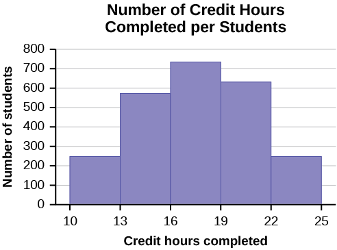
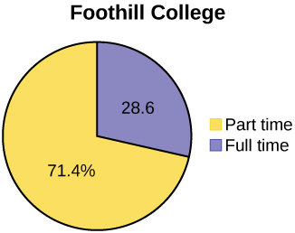
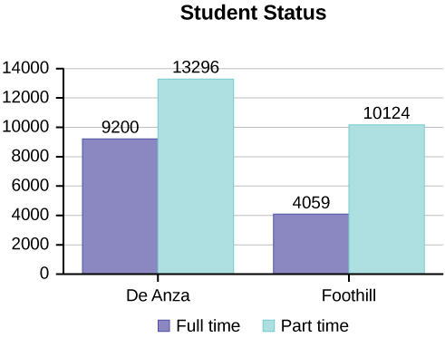
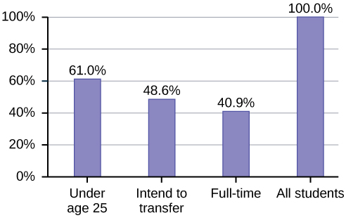
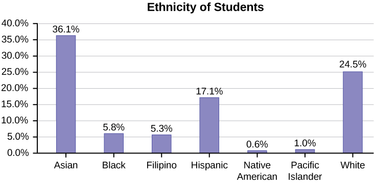
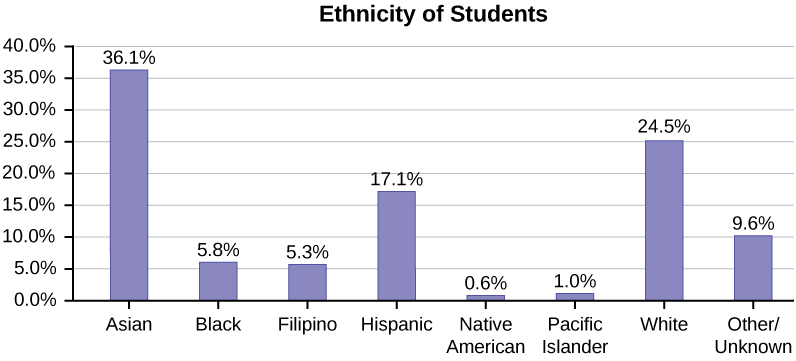
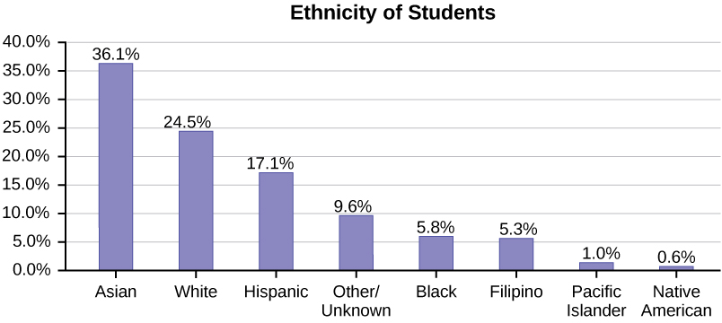
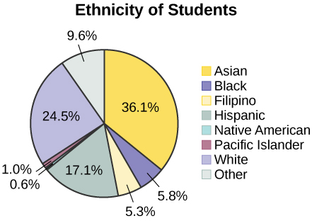
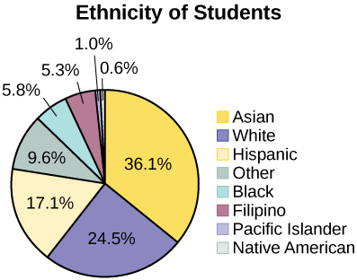

Data may come from a population or from a sample. Small letters like <math xmlns="http://www.w3.org/1998/Math/MathML"> <mi>x</mi> </math>

 or <math xmlns="http://www.w3.org/1998/Math/MathML"> <mi>y</mi> </math>

 generally are used to represent data values. Most data can be put into the following categories:

* Qualitative
* Quantitative

**Qualitative data**{: data-type="term"} are the result of categorizing or describing attributes of a population. Hair color, blood type, ethnic group, the car a person drives, and the street a person lives on are examples of qualitative data. Qualitative data are generally described by words or letters. For instance, hair color might be black, dark brown, light brown, blonde, gray, or red. Blood type might be AB+, O-, or B+. Researchers often prefer to use quantitative data over qualitative data because it lends itself more easily to mathematical analysis. For example, it does not make sense to find an average hair color or blood type.

**Quantitative data**{: data-type="term"} are always numbers. Quantitative data are the result of **counting** or **measuring** attributes of a population. Amount of money, pulse rate, weight, number of people living in your town, and number of students who take statistics are examples of quantitative data. Quantitative data may be either **discrete**{: data-type="term"} or **continuous**{: data-type="term"}.

All data that are the result of counting are called **quantitative discrete data**{: data-type="term"}. These data take on only certain numerical values. If you count the number of phone calls you receive for each day of the week, you might get values such as zero, one, two, or three.

All data that are the result of measuring are **quantitative continuous data**{: data-type="term"} assuming that we can measure accurately. Measuring angles in radians might result in such numbers as <math xmlns="http://www.w3.org/1998/Math/MathML"><mrow><mfrac><mi>π</mi> <mn>6</mn></mfrac></mrow></math>

, <math xmlns="http://www.w3.org/1998/Math/MathML"><mrow> <mfrac><mi>π</mi><mn>3</mn></mfrac></mrow></math>

, <math xmlns="http://www.w3.org/1998/Math/MathML"><mrow><mfrac><mi>π</mi><mn>2</mn></mfrac></mrow></math>

, <math xmlns="http://www.w3.org/1998/Math/MathML"><mi>π</mi></math>

, <math xmlns="http://www.w3.org/1998/Math/MathML"><mrow><mfrac><mrow><mn>3</mn><mi>π</mi></mrow><mn>4</mn></mfrac></mrow></math>

, and so on. If you and your friends carry backpacks with books in them to school, the numbers of books in the backpacks are discrete data and the weights of the backpacks are continuous data.

Data Sample of Quantitative Discrete Data

The data are the number of books students carry in their backpacks. You sample five students. Two students carry three books, one student carries four books, one student carries two books, and one student carries one book. The numbers of books (three, four, two, and one) are the quantitative discrete data.

Try It

The data are the number of machines in a gym. You sample five gyms. One gym has 12 machines, one gym has 15 machines, one gym has ten machines, one gym has 22 machines, and the other gym has 20 machines. What type of data is this?

Try It Solutions

quantitative discrete data

Data Sample of Quantitative Continuous Data

The data are the weights of backpacks with books in them. You sample the same five students. The weights (in pounds) of their backpacks are 6.2, 7, 6.8, 9.1, 4.3. Notice that backpacks carrying three books can have different weights. Weights are quantitative continuous data because weights are measured.

Try It

<!-- 2-->

The data are the areas of lawns in square feet. You sample five houses. The areas of the lawns are 144 sq. feet, 160 sq. feet, 190 sq. feet, 180 sq. feet, and 210 sq. feet. What type of data is this?

Try It Solutions

quantitative continuous data

You go to the supermarket and purchase three cans of soup (19 ounces) tomato bisque, 14.1 ounces lentil, and 19 ounces Italian wedding), two packages of nuts (walnuts and peanuts), four different kinds of vegetable (broccoli, cauliflower, spinach, and carrots), and two desserts (16 ounces Cherry Garcia ice cream and two pounds (32 ounces chocolate chip cookies).

Name data sets that are quantitative discrete, quantitative continuous, and qualitative.

One Possible Solution:

* The three cans of soup, two packages of nuts, four kinds of vegetables and two desserts are quantitative discrete data because you count them.
* The weights of the soups (19 ounces, 14.1 ounces, 19 ounces) are quantitative continuous data because you measure weights as precisely as possible.
* Types of soups, nuts, vegetables and desserts are qualitative data because they are categorical.

Try to identify additional data sets in this example.

The data are the colors of backpacks. Again, you sample the same five students. One student has a red backpack, two students have black backpacks, one student has a green backpack, and one student has a gray backpack. The colors red, black, black, green, and gray are qualitative data.

Try It

The data are the colors of houses. You sample five houses. The colors of the houses are white, yellow, white, red, and white. What type of data is this?

Try It Solutions

qualitative data

Note

You may collect data as numbers and report it categorically. For example, the quiz scores for each student are recorded throughout the term. At the end of the term, the quiz scores are reported as A, B, C, D, or F.

Work collaboratively to determine the correct data type (quantitative or qualitative). Indicate whether quantitative data are continuous or discrete. Hint: Data that are discrete often start with the words "the number of."

1.  the number of pairs of shoes you own
2.  the type of car you drive
3.  where you go on vacation
4.  the distance it is from your home to the nearest grocery store
5.  the number of classes you take per school year.
6.  the tuition for your classes
7.  the type of calculator you use
8.  movie ratings
9.  political party preferences
10. weights of sumo wrestlers
11. amount of money (in dollars) won playing poker
12. number of correct answers on a quiz
13. peoples’ attitudes toward the government
14. IQ scores (This may cause some discussion.)
{: data-number-style="lower-alpha"}

Items a, e, f, k, and l are quantitative discrete; items d, j, and n are quantitative continuous; items b, c, g, h, i, and m are qualitative.

Try It

Determine the correct data type (quantitative or qualitative) for the number of cars in a parking lot. Indicate whether quantitative data are continuous or discrete.

Try It Solutions

quantitative discrete

A statistics professor collects information about the classification of her students as freshmen, sophomores, juniors, or seniors. The data she collects are summarized in the pie chart [[link]](#ch01_mod02_fig001). What type of data does this graph show?

{: #ch01_mod02_fig001}

This pie chart shows the students in each year, which is **qualitative data**.

Try It

The registrar at State University keeps records of the number of credit hours students complete each semester. The data he collects are summarized in the histogram. The class boundaries are 10 to less than 13, 13 to less than 16, 16 to less than 19, 19 to less than 22, and 22 to less than 25. * * *
{: data-type="newline"}

 {: #ch01_mod02_fig002}

* * *
{: data-type="newline"}

 What type of data does this graph show?

Try It Solutions

A histogram is used to display quantitative data: the numbers of credit hours completed. Because students can complete only a whole number of hours (no fractions of hours allowed), this data is quantitative discrete.

# Qualitative Data Discussion   {#eip-312}

Below are tables comparing the number of part-time and full-time students at De Anza College and Foothill College enrolled for the spring 2010 quarter. The tables display counts (frequencies) and percentages or proportions (relative frequencies). The percent columns make comparing the same categories in the colleges easier. Displaying percentages along with the numbers is often helpful, but it is particularly important when comparing sets of data that do not have the same totals, such as the total enrollments for both colleges in this example. Notice how much larger the percentage for part-time students at Foothill College is compared to De Anza College.

<table id="eip-953" summary="Fall Term 2007 (Census day)"><caption>Fall Term 2007 (Census day)</caption><thead>
  <tr>
    <th colspan="3" data-align="center">De Anza College</th>
    <th />
    <th colspan="3" data-align="center">Foothill College</th>
  </tr>
</thead><tbody>
  <tr>
    <td />
    <td>Number</td>
    <td>Percent</td>
    <td />
    <td />
    <td>Number</td>
    <td>Percent</td>
  </tr>
  <tr>
    <td>Full-time</td>
    <td>9,200</td>
    <td>40.9%</td>
    <td />
    <td>Full-time</td>
    <td>4,059</td>
    <td>28.6%</td>
  </tr>
  <tr>
    <td>Part-time</td>
    <td>13,296</td>
    <td>59.1%</td>
    <td />
    <td>Part-time</td>
    <td>10,124</td>
    <td>71.4%</td>
  </tr>
  <tr>
    <td>Total</td>
    <td>22,496</td>
    <td>100%</td>
    <td />
    <td>Total</td>
    <td>14,183</td>
    <td>100%</td>
  </tr>
</tbody></table>

Tables are a good way of organizing and displaying data. But graphs can be even more helpful in understanding the data. There are no strict rules concerning which graphs to use. Two graphs that are used to display qualitative data are pie charts and bar graphs.

In a **pie chart**{: data-type="term"}, categories of data are represented by wedges in a circle and are proportional in size to the percent of individuals in each category.

In a **bar graph**{: data-type="term"}, the length of the bar for each category is proportional to the number or percent of individuals in each category. Bars may be vertical or horizontal.

A **Pareto chart**{: data-type="term"} consists of bars that are sorted into order by category size (largest to smallest).

Look at [\[link\]](#ch01_mod02_fig003) and [\[link\]](#ch01_mod02_fig004) and determine which graph (pie or bar) you think displays the comparisons better.

It is a good idea to look at a variety of graphs to see which is the most helpful in displaying the data. We might make different choices of what we think is the “best” graph depending on the data and the context. Our choice also depends on what we are using the data for.

<figure markdown="1" id="ch01_mod02_fig003" data-orient="horizontal">
{: #eip-idp58600416}

{: #eip-idm57620352}

</figure>

 {: #ch01_mod02_fig004}

## Percentages That Add to More (or Less) Than 100%   {#eip-558}

Sometimes percentages add up to be more than 100% (or less than 100%). In the graph, the percentages add to more than 100% because students can be in more than one category. A bar graph is appropriate to compare the relative size of the categories. A pie chart cannot be used. It also could not be used if the percentages added to less than 100%.

<table id="eip-451" summary="De Anza College Spring 2010"><caption>De Anza College Spring 2010</caption><thead>
  <tr>
    <th>Characteristic/Category</th>
    <th>Percent</th>
  </tr>
</thead><tbody>
  <tr>
    <td>Full-Time Students</td>
    <td>40.9%</td>
  </tr>
  <tr>
    <td>Students who intend to transfer to a 4-year educational institution</td>
    <td>48.6%</td>
  </tr>
  <tr>
    <td>Students under age 25</td>
    <td>61.0%</td>
  </tr>
  <tr>
    <td>TOTAL</td>
    <td>150.5%</td>
  </tr>
</tbody></table>

 {: #ch01_mod02_fig005}

## Omitting Categories/Missing Data   {#eip-993}

The table displays Ethnicity of Students but is missing the \"Other/Unknown\" category. This category contains people who did not feel they fit into any of the ethnicity categories or declined to respond. Notice that the frequencies do not add up to the total number of students. In this situation, create a bar graph and not a pie chart.

<table id="eip-251" summary="The table displays Ethnicity of Students"><caption>Ethnicity of Students at De Anza College Fall Term 2007 (Census Day)</caption><thead>
  <tr>
    <th />
    <th>Frequency</th>
    <th>Percent</th>
  </tr>
</thead><tbody>
  <tr>
    <td>Asian</td>
    <td>8,794</td>
    <td>36.1%</td>
  </tr>
  <tr>
    <td>Black</td>
    <td>1,412</td>
    <td>5.8%</td>
  </tr>
  <tr>
    <td>Filipino</td>
    <td>1,298</td>
    <td>5.3%</td>
  </tr>
  <tr>
    <td>Hispanic</td>
    <td>4,180</td>
    <td>17.1%</td>
  </tr>
  <tr>
    <td>Native American</td>
    <td>146</td>
    <td>0.6%</td>
  </tr>
  <tr>
    <td>Pacific Islander</td>
    <td>236</td>
    <td>1.0%</td>
  </tr>
  <tr>
    <td>White</td>
    <td>5,978</td>
    <td>24.5%</td>
  </tr>
  <tr>
    <td>TOTAL</td>
    <td>22,044 out of 24,382</td>
    <td>90.4% out of 100%</td>
  </tr>
</tbody></table>

{: #ch01_mod02_fig006}

The following graph is the same as the previous graph but the “Other/Unknown” percent (9.6%) has been included. The “Other/Unknown” category is large compared to some of the other categories (Native American, 0.6%, Pacific Islander 1.0%). This is important to know when we think about what the data are telling us.

This particular bar graph in [\[link\]](#ch01_mod02_fig007) can be difficult to understand visually. The graph in [\[link\]](#ch01_mod02_fig008) is a Pareto chart. The Pareto chart has the bars sorted from largest to smallest and is easier to read and interpret.

{: #ch01_mod02_fig007 data-title="Bar Graph with Other/Unknown Category"}

{: #ch01_mod02_fig008 data-title="Pareto Chart With Bars Sorted by Size"}

## Pie Charts: No Missing Data   {#eip-47}

The following pie charts have the “Other/Unknown” category included (since the percentages must add to 100%). The chart in [\[link\]](#ch01_mod02_fig009b) is organized by the size of each wedge, which makes it a more visually informative graph than the unsorted, alphabetical graph in [\[link\]](#ch01_mod02_fig009a).

<figure markdown="1" id="ch01_mod02_fig009" data-orient="horizontal">
{: #ch01_mod02_fig009a}

{: #ch01_mod02_fig009b}

</figure>

# Sampling   {#eip-49}

Gathering information about an entire population often costs too much or is virtually impossible. Instead, we use a sample of the population. **A sample should have the same characteristics as the population it is representing.** Most statisticians use various methods of random sampling in an attempt to achieve this goal. This section will describe a few of the most common methods. There are several different methods of **random sampling**. In each form of random sampling, each member of a population initially has an equal chance of being selected for the sample. Each method has pros and cons. The easiest method to describe is called a **simple random sample**. Any group of *n* individuals is equally likely to be chosen by any other group of *n* individuals if the simple random sampling technique is used. In other words, each sample of the same size has an equal chance of being selected. For example, suppose Lisa wants to form a four-person study group (herself and three other people) from her pre-calculus class, which has 31 members not including Lisa. To choose a simple random sample of size three from the other members of her class, Lisa could put all 31 names in a hat, shake the hat, close her eyes, and pick out three names. A more technological way is for Lisa to first list the last names of the members of her class together with a two-digit number, as in [\[link\]](#element-621)\:

<table id="element-621" summary="This table presents a class roster arranged in alphabetical order.  The first column lists a unique two-digit ID number for each student, with the second column displaying the student's last name."><caption>Class Roster</caption><thead>
<tr>
<th>ID</th>
<th>Name</th>
<th>ID</th>
<th>Name</th>
<th>ID</th>
<th>Name</th>
</tr>
</thead><tbody>
<tr>
<td>00</td>
<td>Anselmo</td>
<td>11</td>
<td>King</td>
<td>21</td>
<td>Roquero</td>
</tr>
<tr>
<td>01</td>
<td>Bautista</td>
<td>12</td>
<td>Legeny</td>
<td>22</td>
<td>Roth</td>
</tr>
<tr>
<td>02</td>
<td>Bayani</td>
<td>13</td>
<td>Lundquist</td>
<td>23</td>
<td>Rowell</td>
</tr>
<tr>
<td>03</td>
<td>Cheng</td>
<td>14</td>
<td>Macierz</td>
<td>24</td>
<td>Salangsang</td>
</tr>
<tr>
<td>04</td>
<td>Cuarismo</td>
<td>15</td>
<td>Motogawa</td>
<td>25</td>
<td>Slade</td>
</tr>
<tr>
<td>05</td>
<td>Cuningham</td>
<td>16</td>
<td>Okimoto</td>
<td>26</td>
<td>Stratcher</td>
</tr>
<tr>
<td>06</td>
<td>Fontecha</td>
<td>17</td>
<td>Patel</td>
<td>27</td>
<td>Tallai</td>
</tr>
<tr>
<td>07</td>
<td>Hong</td>
<td>18</td>
<td>Price</td>
<td>28</td>
<td>Tran</td>
</tr>
<tr>
<td>08</td>
<td>Hoobler</td>
<td>19</td>
<td>Quizon</td>
<td>29</td>
<td>Wai</td>
</tr>
<tr>
<td>09</td>
<td>Jiao</td>
<td>20</td>
<td>Reyes</td>
<td>30</td>
<td>Wood</td>
</tr>
<tr>
<td>10</td>
<td>Khan</td>
<td />
<td />
<td />
<td />
</tr>
</tbody></table>

Lisa can use a table of random numbers (found in many statistics books and mathematical handbooks), a calculator, or a computer to generate random numbers. For this example, suppose Lisa chooses to generate random numbers from a calculator. The numbers generated are as follows:

 0.94360 0.99832 0.14669 0.51470 0.40581 0.73381 0.04399 

Lisa reads two-digit groups until she has chosen three class members (that is, she reads 0.94360 as the groups 94, 43, 36, 60). Each random number may only contribute one class member. If she needed to, Lisa could have generated more random numbers.

The random numbers 0.94360 and 0.99832 do not contain appropriate two digit numbers. However the third random number, 0.14669, contains 14 (the fourth random number also contains 14), the fifth random number contains 05, and the seventh random number contains 04. The two-digit number 14 corresponds to Macierz, 05 corresponds to Cuningham, and 04 corresponds to Cuarismo. Besides herself, Lisa’s group will consist of Marcierz, Cuningham, and Cuarismo.

To generate random numbers:

* Press MATH.
* Arrow over to PRB.
* Press 5:randInt(. Enter 0, 30).
* Press ENTER for the first random number.
* Press ENTER two more times for the other 2 random numbers. If there is a repeat press ENTER again.

Note: randInt(0, 30, 3) will generate 3 random numbers.

{: #eip-idm20794224}

Besides simple random sampling, there are other forms of sampling that involve a chance process for getting the sample. **Other well-known random sampling methods are the stratified sample, the cluster sample, and the systematic sample.**

To choose a **stratified sample**, divide the population into groups called strata and then take a **proportionate** number from each stratum. For example, you could stratify (group) your college population by department and then choose a proportionate simple random sample from each stratum (each department) to get a stratified random sample. To choose a simple random sample from each department, number each member of the first department, number each member of the second department, and do the same for the remaining departments. Then use simple random sampling to choose proportionate numbers from the first department and do the same for each of the remaining departments. Those numbers picked from the first department, picked from the second department, and so on represent the members who make up the stratified sample.

To choose a **cluster sample**, divide the population into clusters (groups) and then randomly select some of the clusters. All the members from these clusters are in the cluster sample. For example, if you randomly sample four departments from your college population, the four departments make up the cluster sample. Divide your college faculty by department. The departments are the clusters. Number each department, and then choose four different numbers using simple random sampling. All members of the four departments with those numbers are the cluster sample.

To choose a **systematic sample**, randomly select a starting point and take every *n*th piece of data from a listing of the population. For example, suppose you have to do a phone survey. Your phone book contains 20,000 residence listings. You must choose 400 names for the sample. Number the population 1–20,000 and then use a simple random sample to pick a number that represents the first name in the sample. Then choose every fiftieth name thereafter until you have a total of 400 names (you might have to go back to the beginning of your phone list). Systematic sampling is frequently chosen because it is a simple method.

A type of sampling that is non-random is convenience sampling. **Convenience sampling** involves using results that are readily available. For example, a computer software store conducts a marketing study by interviewing potential customers who happen to be in the store browsing through the available software. The results of convenience sampling may be very good in some cases and highly biased (favor certain outcomes) in others.

Sampling data should be done very carefully. Collecting data carelessly can have devastating results. Surveys mailed to households and then returned may be very biased (they may favor a certain group). It is better for the person conducting the survey to select the sample respondents.

True random sampling is done **with replacement**. That is, once a member is picked, that member goes back into the population and thus may be chosen more than once. However for practical reasons, in most populations, simple random sampling is done **without replacement**. Surveys are typically done without replacement. That is, a member of the population may be chosen only once. Most samples are taken from large populations and the sample tends to be small in comparison to the population. Since this is the case, sampling without replacement is approximately the same as sampling with replacement because the chance of picking the same individual more than once with replacement is very low.

In a college population of 10,000 people, suppose you want to pick a sample of 1,000 randomly for a survey. **For any particular sample of 1,000**, if you are sampling **with replacement**,

* the chance of picking the first person is 1,000 out of 10,000 (0.1000);
* the chance of picking a different second person for this sample is 999 out of 10,000 (0.0999);
* the chance of picking the same person again is 1 out of 10,000 (very low).

If you are sampling **without replacement**,

* the chance of picking the first person for any particular sample is 1000 out of 10,000 (0.1000);
* the chance of picking a different second person is 999 out of 9,999 (0.0999);
* you do not replace the first person before picking the next person.

Compare the fractions 999/10,000 and 999/9,999. For accuracy, carry the decimal answers to four decimal places. To four decimal places, these numbers are equivalent (0.0999).

Sampling without replacement instead of sampling with replacement becomes a mathematical issue only when the population is small. For example, if the population is 25 people, the sample is ten, and you are sampling **with replacement for any particular sample**, then the chance of picking the first person is ten out of 25, and the chance of picking a different second person is nine out of 25 (you replace the first person).

If you sample **without replacement**, then the chance of picking the first person is ten out of 25, and then the chance of picking the second person (who is different) is nine out of 24 (you do not replace the first person).

Compare the fractions 9/25 and 9/24. To four decimal places, 9/25 = 0.3600 and 9/24 = 0.3750. To four decimal places, these numbers are not equivalent.

When you analyze data, it is important to be aware of **sampling errors** and nonsampling errors. The actual process of sampling causes sampling errors. For example, the sample may not be large enough. Factors not related to the sampling process cause **nonsampling errors**. A defective counting device can cause a nonsampling error.

In reality, a sample will never be exactly representative of the population so there will always be some sampling error. As a rule, the larger the sample, the smaller the sampling error.

In statistics, **a sampling bias** is created when a sample is collected from a population and some members of the population are not as likely to be chosen as others (remember, each member of the population should have an equally likely chance of being chosen). When a sampling bias happens, there can be incorrect conclusions drawn about the population that is being studied.

A study is done to determine the average tuition that San Jose State undergraduate students pay per semester. Each student in the following samples is asked how much tuition he or she paid for the Fall semester. What is the type of sampling in each case?

1.  A sample of 100 undergraduate San Jose State students is taken by organizing the students’ names by classification (freshman, sophomore, junior, or senior), and then selecting 25 students from each.
2.  A random number generator is used to select a student from the alphabetical listing of all undergraduate students in the Fall semester. Starting with that student, every 50th student is chosen until 75 students are included in the sample.
3.  A completely random method is used to select 75 students. Each undergraduate student in the fall semester has the same probability of being chosen at any stage of the sampling process.
4.  The freshman, sophomore, junior, and senior years are numbered one, two, three, and four, respectively. A random number generator is used to pick two of those years. All students in those two years are in the sample.
5.  An administrative assistant is asked to stand in front of the library one Wednesday and to ask the first 100 undergraduate students he encounters what they paid for tuition the Fall semester. Those 100 students are the sample.
{: data-number-style="lower-alpha"}

a. stratified; b. systematic; c. simple random; d. cluster; e. convenience

Try It

You are going to use the random number generator to generate different types of samples from the data.

This table displays six sets of quiz scores (each quiz counts 10 points) for an elementary statistics class.

| #1 | #2 | #3 | #4 | #5 | #6 |
|----------
| 5 | 7 | 10 | 9 | 8 | 3 |
| 10 | 5 | 9 | 8 | 7 | 6 |
| 9 | 10 | 8 | 6 | 7 | 9 |
| 9 | 10 | 10 | 9 | 8 | 9 |
| 7 | 8 | 9 | 5 | 7 | 4 |
| 9 | 9 | 9 | 10 | 8 | 7 |
| 7 | 7 | 10 | 9 | 8 | 8 |
| 8 | 8 | 9 | 10 | 8 | 8 |
| 9 | 7 | 8 | 7 | 7 | 8 |
| 8 | 8 | 10 | 9 | 8 | 7 |
{: summary=""}

<u data-effect="underline">Instructions:</u> Use the Random Number Generator to pick samples.

1.  Create a stratified sample by column. Pick three quiz scores randomly from each column.
    * Number each row one through ten.
    * On your calculator, press Math and arrow over to PRB.
    * For column 1, Press 5:randInt( and enter 1,10). Press ENTER. Record the number. Press ENTER 2 more times (even the repeats). Record these numbers. Record the three quiz scores in column one that correspond to these three numbers.
    * Repeat for columns two through six.
    * These 18 quiz scores are a stratified sample.

2.  Create a cluster sample by picking two of the columns. Use the column numbers: one through six.
    * Press MATH and arrow over to PRB.
    * Press 5:randInt( and enter 1,6). Press ENTER. Record the number. Press ENTER and record that number.
    * The two numbers are for two of the columns.
    * The quiz scores (20 of them) in these 2 columns are the cluster sample.

3.  Create a simple random sample of 15 quiz scores.
    * Use the numbering one through 60.
    * Press MATH. Arrow over to PRB. Press 5:randInt( and enter 1, 60).
    * Press ENTER 15 times and record the numbers.
    * Record the quiz scores that correspond to these numbers.
    * These 15 quiz scores are the systematic sample.

4.  Create a systematic sample of 12 quiz scores.
    * Use the numbering one through 60.
    * Press MATH. Arrow over to PRB. Press 5:randInt( and enter 1, 60).
    * Press ENTER. Record the number and the first quiz score. From that number, count ten quiz scores and record that quiz score. Keep counting ten quiz scores and recording the quiz score until you have a sample of 12 quiz scores. You may wrap around (go back to the beginning).
{: data-number-style="arabic"}

Determine the type of sampling used (simple random, stratified, systematic, cluster, or convenience).

1.  A soccer coach selects six players from a group of boys aged eight to ten, seven players from a group of boys aged 11 to 12, and three players from a group of boys aged 13 to 14 to form a recreational soccer team.
2.  A pollster interviews all human resource personnel in five different high tech companies.
3.  A high school educational researcher interviews 50 high school female teachers and 50 high school male teachers.
4.  A medical researcher interviews every third cancer patient from a list of cancer patients at a local hospital.
5.  A high school counselor uses a computer to generate 50 random numbers and then picks students whose names correspond to the numbers.
6.  A student interviews classmates in his algebra class to determine how many pairs of jeans a student owns, on the average.
{: data-number-style="lower-alpha"}

a. stratified; b. cluster; c. stratified; d. systematic; e. simple random; f.convenience

Try It

<!-- 1-->

Determine the type of sampling used (simple random, stratified, systematic, cluster, or convenience).

A high school principal polls 50 freshmen, 50 sophomores, 50 juniors, and 50 seniors regarding policy changes for after school activities.

stratified

If we were to examine two samples representing the same population, even if we used random sampling methods for the samples, they would not be exactly the same. Just as there is variation in data, there is variation in samples. As you become accustomed to sampling, the variability will begin to seem natural.

Suppose ABC College has 10,000 part-time students (the population). We are interested in the average amount of money a part-time student spends on books in the fall term. Asking all 10,000 students is an almost impossible task.

Suppose we take two different samples.

First, we use convenience sampling and survey ten students from a first term organic chemistry class. Many of these students are taking first term calculus in addition to the organic chemistry class. The amount of money they spend on books is as follows:

 $128 $87 $173 $116 $130 $204 $147 $189 $93 $153 

The second sample is taken using a list of senior citizens who take P.E. classes and taking every fifth senior citizen on the list, for a total of ten senior citizens. They spend:

 $50 $40 $36 $15 $50 $100 $40 $53 $22 $22 

It is unlikely that any student is in both samples.

a. Do you think that either of these samples is representative of (or is characteristic of) the entire 10,000 part-time student population?

a. No. The first sample probably consists of science-oriented students. Besides the chemistry course, some of them are also taking first-term calculus. Books for these classes tend to be expensive. Most of these students are, more than likely, paying more than the average part-time student for their books. The second sample is a group of senior citizens who are, more than likely, taking courses for health and interest. The amount of money they spend on books is probably much less than the average parttime student. Both samples are biased. Also, in both cases, not all students have a chance to be in either sample.

b. Since these samples are not representative of the entire population, is it wise to use the results to describe the entire population?

b. No. For these samples, each member of the population did not have an equally likely chance of being chosen.

Now, suppose we take a third sample. We choose ten different part-time students from the disciplines of chemistry, math, English, psychology, sociology, history, nursing, physical education, art, and early childhood development. (We assume that these are the only disciplines in which part-time students at ABC College are enrolled and that an equal number of part-time students are enrolled in each of the disciplines.) Each student is chosen using simple random sampling. Using a calculator, random numbers are generated and a student from a particular discipline is selected if he or she has a corresponding number. The students spend the following amounts:

 $180 $50 $150 $85 $260 $75 $180 $200 $200 $150 

c. Is the sample biased?

c. The sample is unbiased, but a larger sample would be recommended to increase the likelihood that the sample will be close to representative of the population. However, for a biased sampling technique, even a large sample runs the risk of not being representative of the population.

Students often ask if it is \"good enough\" to take a sample, instead of surveying the entire population. If the survey is done well, the answer is yes.

Try It

<!-- 2-->

A local radio station has a fan base of 20,000 listeners. The station wants to know if its audience would prefer more music or more talk shows. Asking all 20,000 listeners is an almost impossible task.

The station uses convenience sampling and surveys the first 200 people they meet at one of the station’s music concert events. 24 people said they’d prefer more talk shows, and 176 people said they’d prefer more music.

Do you think that this sample is representative of (or is characteristic of) the entire 20,000 listener population?

Try It Solutions

The sample probably consists more of people who prefer music because it is a concert event. Also, the sample represents only those who showed up to the event earlier than the majority. The sample probably doesn’t represent the entire fan base and is probably biased towards people who would prefer music.

Collaborative Exercise

As a class, determine whether or not the following samples are representative. If they are not, discuss the reasons.

1.  To find the average GPA of all students in a university, use all honor students at the university as the sample.
2.  To find out the most popular cereal among young people under the age of ten, stand outside a large supermarket for three hours and speak to every twentieth child under age ten who enters the supermarket.
3.  To find the average annual income of all adults in the United States, sample U.S. congressmen. Create a cluster sample by considering each state as a stratum (group). By using simple random sampling, select states to be part of the cluster. Then survey every U.S. congressman in the cluster.
4.  To determine the proportion of people taking public transportation to work, survey 20 people in New York City. Conduct the survey by sitting in Central Park on a bench and interviewing every person who sits next to you.
5.  To determine the average cost of a two-day stay in a hospital in Massachusetts, survey 100 hospitals across the state using simple random sampling.

# Variation in Data   {#eip-624}

**Variation**{: data-type="term"} is present in any set of data. For example, 16-ounce cans of beverage may contain more or less than 16 ounces of liquid. In one study, eight 16 ounce cans were measured and produced the following amount (in ounces) of beverage:

 15.8 16.1 15.2 14.8 15.8 15.9 16.0 15.5 

Measurements of the amount of beverage in a 16-ounce can may vary because different people make the measurements or because the exact amount, 16 ounces of liquid, was not put into the cans. Manufacturers regularly run tests to determine if the amount of beverage in a 16-ounce can falls within the desired range.

Be aware that as you take data, your data may vary somewhat from the data someone else is taking for the same purpose. This is completely natural. However, if two or more of you are taking the same data and get very different results, it is time for you and the others to reevaluate your data-taking methods and your accuracy.

# Variation in Samples   {#eip-735}

It was mentioned previously that two or more **samples**{: data-type="term"} from the same **population**{: data-type="term"}, taken randomly, and having close to the same characteristics of the population will likely be different from each other. Suppose Doreen and Jung both decide to study the average amount of time students at their college sleep each night. Doreen and Jung each take samples of 500 students. Doreen uses systematic sampling and Jung uses cluster sampling. Doreen\'s sample will be different from Jung\'s sample. Even if Doreen and Jung used the same sampling method, in all likelihood their samples would be different. Neither would be wrong, however.

Think about what contributes to making Doreen’s and Jung’s samples different.

If Doreen and Jung took larger samples (i.e. the number of data values is increased), their sample results (the average amount of time a student sleeps) might be closer to the actual population average. But still, their samples would be, in all likelihood, different from each other. This **variability in samples** cannot be stressed enough.

## Size of a Sample   {#id-191351579127}

The size of a sample (often called the number of observations) is important. The examples you have seen in this book so far have been small. Samples of only a few hundred observations, or even smaller, are sufficient for many purposes. In polling, samples that are from 1,200 to 1,500 observations are considered large enough and good enough if the survey is random and is well done. You will learn why when you study confidence intervals.

Be aware that many large samples are biased. For example, call-in surveys are invariably biased, because people choose to respond or not.

Collaborative Exercise

Divide into groups of two, three, or four. Your instructor will give each group one six-sided die. Try this experiment twice. Roll one fair die (six-sided) 20 times. Record the number of ones, twos, threes, fours, fives, and sixes you get in [\[link\]](#element-497) and [\[link\]](#fs-idm76511248) (“frequency” is the number of times a particular face of the die occurs):

<table id="element-497" summary="This table provides a blank template for recording the results of an experimental trial involving the roll of a die.  The first column contains the values 1 through 6, representing the possible outcomes of a single throw of a die.  The second column is to be used by the student to tally the number of times the die lands on that value during the experiment."><caption>First Experiment (20 rolls)</caption><thead>
<tr>
<th>Face on Die</th>
<th>Frequency</th>
</tr>
</thead><tbody>
<tr>
<td>1</td>
<td />
</tr>
<tr>
<td>2</td>
<td />
</tr>
<tr>
<td>3</td>
<td />
</tr>
<tr>
<td>4</td>
<td />
</tr>
<tr>
<td>5</td>
<td />
</tr>
<tr>
<td>6</td>
<td />
</tr>
</tbody></table>
<table summary="A duplicate of the previous table, this table provides a blank template for recording the results of an experimental trial involving the roll of a die.  The first column contains the values 1 through 6, representing the possible outcomes of a single throw of a die.  The second column is to be used by the student to tally the number of times the die lands on that value during the experiment."><caption>Second Experiment (20 rolls)</caption><thead>
<tr>
<th>Face on Die</th>
<th>Frequency</th>
</tr>
</thead><tbody>
<tr>
<td>1</td>
<td />
</tr>
<tr>
<td>2</td>
<td />
</tr>
<tr>
<td>3</td>
<td />
</tr>
<tr>
<td>4</td>
<td />
</tr>
<tr>
<td>5</td>
<td />
</tr>
<tr>
<td>6</td>
<td />
</tr>
</tbody></table>
Did the two experiments have the same results? Probably not. If you did the experiment a third time, do you expect the results to be identical to the first or second experiment? Why or why not?

Which experiment had the correct results? They both did. The job of the statistician is to see through the variability and draw appropriate conclusions.

# Critical Evaluation   {#eip-415}

We need to evaluate the statistical studies we read about critically and analyze them before accepting the results of the studies. Common problems to be aware of include

* Problems with samples: A sample must be representative of the population. A sample that is not representative of the population is biased. Biased samples that are not representative of the population give results that are inaccurate and not valid.
* Self-selected samples: Responses only by people who choose to respond, such as call-in surveys, are often unreliable.
* Sample size issues: Samples that are too small may be unreliable. Larger samples are better, if possible. In some situations, having small samples is unavoidable and can still be used to draw conclusions. Examples: crash testing cars or medical testing for rare conditions
* Undue influence:  collecting data or asking questions in a way that influences the response
* Non-response or refusal of subject to participate:  The collected responses may no longer be representative of the population.  Often, people with strong positive or negative opinions may answer surveys, which can affect the results.
* Causality: A relationship between two variables does not mean that one causes the other to occur. They may be related (correlated) because of their relationship through a different variable.
* Self-funded or self-interest studies: A study performed by a person or organization in order to support their claim. Is the study impartial? Read the study carefully to evaluate the work. Do not automatically assume that the study is good, but do not automatically assume the study is bad either. Evaluate it on its merits and the work done.
* Misleading use of data: improperly displayed graphs, incomplete data, or lack of context
* Confounding:  When the effects of multiple factors on a response cannot be separated.  Confounding makes it difficult or impossible to draw valid conclusions about the effect of each factor.

# References   {#eip-787}

Gallup-Healthways Well-Being Index. http://www.well-beingindex.com/default.asp (accessed May 1, 2013).

Gallup-Healthways Well-Being Index. http://www.well-beingindex.com/methodology.asp (accessed May 1, 2013).

Gallup-Healthways Well-Being Index. http://www.gallup.com/poll/146822/gallup-healthways-index-questions.aspx (accessed May 1, 2013).

Data from http://www.bookofodds.com/Relationships-Society/Articles/A0374-How-George-Gallup-Picked-the-President

Dominic Lusinchi, “’President’ Landon and the 1936 *Literary Digest* Poll: Were Automobile and Telephone Owners to Blame?” Social Science History 36, no. 1: 23-54 (2012), http://ssh.dukejournals.org/content/36/1/23.abstract (accessed May 1, 2013).

“The Literary Digest Poll,” Virtual Laboratories in Probability and Statistics http://www.math.uah.edu/stat/data/LiteraryDigest.html (accessed May 1, 2013).

“Gallup Presidential Election Trial-Heat Trends, 1936–2008,” Gallup Politics http://www.gallup.com/poll/110548/gallup-presidential-election-trialheat-trends-19362004.aspx#4 (accessed May 1, 2013).

The Data and Story Library, http://lib.stat.cmu.edu/DASL/Datafiles/USCrime.html (accessed May 1, 2013).

LBCC Distance Learning (DL) program data in 2010-2011, http://de.lbcc.edu/reports/2010-11/future/highlights.html#focus (accessed May 1, 2013).

Data from San Jose Mercury News

# Chapter Review

Data are individual items of information that come from a population or sample. Data may be classified as qualitative, quantitative continuous, or quantitative discrete.

Because it is not practical to measure the entire population in a study, researchers use samples to represent the population. A random sample is a representative group from the population chosen by using a method that gives each individual in the population an equal chance of being included in the sample. Random sampling methods include simple random sampling, stratified sampling, cluster sampling, and systematic sampling. Convenience sampling is a nonrandom method of choosing a sample that often produces biased data.

Samples that contain different individuals result in different data. This is true even when the samples are well-chosen and representative of the population. When properly selected, larger samples model the population more closely than smaller samples. There are many different potential problems that can affect the reliability of a sample. Statistical data needs to be critically analyzed, not simply accepted.

# Practice

“Number of times per week” is what type of data?

 a. qualitative b. quantitative discrete c. quantitative continuous 

<!-- <solution id="fs-idm10326544">
<para id="fs-idp12057024">b</para>
</solution> -->

*Use the following information to answer the next four exercises:* A study was done to determine the age, number of times per week, and the duration (amount of time) of residents using a local park in San Antonio, Texas. The first house in the neighborhood around the park was selected randomly, and then the resident of every eighth house in the neighborhood around the park was interviewed.

The sampling method was

 a. simple random b. systematic c. stratified d. cluster 

b

“Duration (amount of time)” is what type of data?

 a. qualitative b. quantitative discrete c. quantitative continuous 

<!-- <solution id="fs-idm45140400">
<para id="fs-idm40645520">c</para></solution> -->

The colors of the houses around the park are what kind of data?

 a. qualitative b. quantitative discrete c. quantitative continuous 

a

The population is \_\_\_\_\_\_\_\_\_\_\_\_\_\_\_\_\_\_\_\_\_\_

[[link]](#fs-idm39599824) contains the total number of deaths worldwide as a result of earthquakes from 2000 to 2012.

| Year | Total Number of Deaths |
|----------
| 2000 | 231 |
| 2001 | 21,357 |
| 2002 | 11,685 |
| 2003 | 33,819 |
| 2004 | 228,802 |
| 2005 | 88,003 |
| 2006 | 6,605 |
| 2007 | 712 |
| 2008 | 88,011 |
| 2009 | 1,790 |
| 2010 | 320,120 |
| 2011 | 21,953 |
| 2012 | 768 |
| **Total** | **823,856** |
{: summary=""}

Use [[link]](#fs-idm39599824) to answer the following questions.

1.  What is the proportion of deaths between 2007 and 2012?
2.  What percent of deaths occurred before 2001?
3.  What is the percent of deaths that occurred in 2003 or after 2010?
4.  What is the fraction of deaths that happened before 2012?
5.  What kind of data is the number of deaths?
6.  Earthquakes are quantified according to the amount of energy they produce (examples are 2.1, 5.0, 6.7). What type of data is that?
7.  What contributed to the large number of deaths in 2010? In 2004? Explain.
{: data-number-style="lower-alpha"}

1.  0\.5242
2.  0\.03%
3.  6\.86%
4.  <math xmlns="http://www.w3.org/1998/Math/MathML"> <mrow> <mfrac> <mrow> <mn>823,088</mn> </mrow> <mrow> <mn>823,856</mn> </mrow> </mfrac> </mrow> </math>

5.  quantitative discrete
6.  quantitative continuous
7.  In both years, underwater earthquakes produced massive tsunamis.
{: data-number-style="lower-alpha"}

*For the following four exercises, determine the type of sampling used (simple random, stratified, systematic, cluster, or convenience).*

A group of test subjects is divided into twelve groups; then four of the groups are chosen at random.

<!-- <solution id="fs-idm70924672">
<para id="fs-idm74169280">cluster</para>
</solution> -->

A market researcher polls every tenth person who walks into a store.

systematic

The first 50 people who walk into a sporting event are polled on their television preferences.

<!-- <solution id="fs-idm40774544">
<para id="fs-idm43595984">convenience</para>
</solution> -->

A computer generates 100 random numbers, and 100 people whose names correspond with the numbers on the list are chosen.

simple random

* * *
{: data-type="newline"}

*Use the following information to answer the next seven exercises:* Studies are often done by pharmaceutical companies to determine the effectiveness of a treatment program. Suppose that a new AIDS antibody drug is currently under study. It is given to patients once the AIDS symptoms have revealed themselves. Of interest is the average (mean) length of time in months patients live once starting the treatment. Two researchers each follow a different set of 40 AIDS patients from the start of treatment until their deaths. The following data (in months) are collected. * * *
{: data-type="newline"}

**Researcher A:** 3; 4; 11; 15; 16; 17; 22; 44; 37; 16; 14; 24; 25; 15; 26; 27; 33; 29; 35; 44; 13; 21; 22; 10; 12; 8; 40; 32; 26; 27; 31; 34; 29; 17; 8; 24; 18; 47; 33; 34

**Researcher B:** 3; 14; 11; 5; 16; 17; 28; 41; 31; 18; 14; 14; 26; 25; 21; 22; 31; 2; 35; 44; 23; 21; 21; 16; 12; 18; 41; 22; 16; 25; 33; 34; 29; 13; 18; 24; 23; 42; 33; 29

Complete the tables using the data provided:

<table id="id6060586" summary="This table provides a blank template for calculating the results of a study using the data set provided. For each survival length range provided in the first column, students are to calculate and write down the frequency (second column), relative frequency (third column), and cumulative relative frequency (fourth column)."><caption>Researcher A</caption><colgroup><col /><col data-width="4*" /><col data-width="4*" /><col data-width="4*" /></colgroup><thead>
<tr>
<th>Survival Length (in months)</th>
<th>Frequency</th>
<th>Relative Frequency</th>
<th>Cumulative Relative Frequency</th>
</tr>

</thead><tbody>
<tr>
<td>0.5–6.5</td>
<td />
<td />
<td />
</tr>
<tr>
<td>6.5–12.5</td>
<td />
<td />
<td />
</tr>
<tr>
<td>12.5–18.5</td>
<td />
<td />
<td />
</tr>
<tr>
<td>18.5–24.5</td>
<td />
<td />
<td />
</tr>
<tr>
<td>24.5–30.5</td>
<td />
<td />
<td />
</tr>
<tr>
<td>30.5–36.5</td>
<td />
<td />
<td />
</tr>
<tr>
<td>36.5–42.5</td>
<td />
<td />
<td />
</tr>
<tr>
<td>42.5–48.5</td>
<td />
<td />
<td />
</tr>
</tbody></table>
<table id="id6990964" summary="A duplicate of the previous table, this table provides a blank template for calculating the results of a study using the data set provided. For each survival length range provided in the first column, students are to calculate and write down the frequency (second column), relative frequency (third column), and cumulative relative frequency (fourth column)."><caption>Researcher B</caption><colgroup><col data-width="2*" /><col data-width="1*" /><col data-width="2*" /><col data-width="2*" /></colgroup><thead>
<tr>
<th>Survival Length (in months)</th>
<th>Frequency</th>
<th>Relative Frequency</th>
<th>Cumulative Relative  Frequency</th>
</tr>

</thead><tbody>
<tr>
<td>0.5–6.5</td>
<td />
<td />
<td />
</tr>
<tr>
<td>6.5–12.5</td>
<td />
<td />
<td />
</tr>
<tr>
<td>12.5–18.5</td>
<td />
<td />
<td />
</tr>
<tr>
<td>18.5–24.5</td>
<td />
<td />
<td />
</tr>
<tr>
<td>24.5–30.5</td>
<td />
<td />
<td />
</tr>
<tr>
<td>30.5–36.5</td>
<td />
<td />
<td />
</tr>
<tr>
<td>36.5-45.5</td>
<td />
<td />
<td />
</tr>
</tbody></table>

Determine what the key term data refers to in the above example for Researcher A.

values for *X*, such as 3, 4, 11, and so on

List two reasons why the data may differ.

<!-- <solution id="eip-666">
  <para id="eip-99">Answers will vary. Sample answer: One reason may be the average age of the individuals in the two samples. Or, perhaps the drug affects men and women differently. If the ratio of men and women aren't the same in both sample groups, then the data would differ.</para></solution> -->

Can you tell if one researcher is correct and the other one is incorrect? Why?

No, we do not have enough information to make such a claim.

Would you expect the data to be identical? Why or why not?

<!-- <solution id="eip-669">
<para id="eip-894">Since the treatment is not the same the data might be different unless neither treatment has an effect.</para>
</solution> -->

How might the researchers gather random data?

Take a simple random sample from each group. One way is by assigning a number to each patient and using a random number generator to randomly select patients.

Suppose that the first researcher conducted his survey by randomly choosing one state in the nation and then randomly picking 40 patients from that state. What sampling method would that researcher have used?

<!-- <solution id="eip-863">
  <para id="eip-171">
    He has used a simple random sample method.
  </para>
</solution> -->

Suppose that the second researcher conducted his survey by choosing 40 patients he knew. What sampling method would that researcher have used? What concerns would you have about this data set, based upon the data collection method?

This would be convenience sampling and is not random.

*Use the following data to answer the next five exercises:* Two researchers are gathering data on hours of video games played by school-aged children and young adults. They each randomly sample different groups of 150 students from the same school. They collect the following data.

<table summary="Researcher A Table"><caption>Researcher A</caption><thead>
<tr>
<th>Hours Played per Week</th>
<th>Frequency</th>
<th>Relative Frequency</th>
<th>Cumulative Relative Frequency</th>
</tr>
</thead><tbody>
<tr>
<td>0–2</td>
<td>26</td>
<td>0.17</td>
<td>0.17</td>
</tr>
<tr>
<td>2–4</td>
<td>30</td>
<td> 0.20</td>
<td>0.37</td>
</tr>
<tr>
<td>4–6</td>
<td>49</td>
<td>0.33</td>
<td>0.70</td>
</tr>
<tr>
<td>6–8</td>
<td>25</td>
<td>0.17</td>
<td>0.87</td>
</tr>
<tr>
<td>8–10</td>
<td>12</td>
<td>0.08</td>
<td>0.95</td>
</tr>
<tr>
<td>10–12</td>
<td>8</td>
<td>0.05</td>
<td>1</td>
</tr>
</tbody></table>

<table summary="Researcher B Table"><caption>Researcher B</caption><thead>
<tr>
<th>Hours Played per Week</th>
<th>Frequency</th>
<th>Relative Frequency</th>
<th>Cumulative Relative Frequency</th>
</tr>
</thead><tbody>
<tr>
<td>0–2</td>
<td>48</td>
<td>0.32</td>
<td>0.32</td>
</tr>
<tr>
<td>2–4</td>
<td>51</td>
<td>0.34</td>
<td>0.66</td>
</tr>
<tr>
<td>4–6</td>
<td>24</td>
<td>0.16</td>
<td>0.82</td>
</tr>
<tr>
<td>6–8</td>
<td>12</td>
<td>0.08</td>
<td>0.90</td>
</tr>
<tr>
<td>8–10</td>
<td>11</td>
<td>0.07</td>
<td>0.97</td>
</tr>
<tr>
<td>10–12</td>
<td>4</td>
<td>0.03</td>
<td>1</td>
</tr>
</tbody></table>

Give a reason why the data may differ.

<!-- <solution id="fs-idm14461056">
<para id="fs-idp9537392">The researchers are studying different groups, so there will be some variation in the data.</para>
</solution> -->

Would the sample size be large enough if the population is the students in the school?

Yes, the sample size of 150 would be large enough to reflect a population of one school.

Would the sample size be large enough if the population is school-aged children and young adults in the United States?

<!-- <solution id="fs-idm18086128">
<para id="fs-idm10412448">There are many school-aged children and young adults in the United States, and the study was done at only one school, so the sample size is not large enough to reflect the population.</para>
</solution> -->

Researcher A concludes that most students play video games between four and six hours each week. Researcher B concludes that most students play video games between two and four hours each week. Who is correct?

Even though the specific data support each researcher’s conclusions, the different results suggest that more data need to be collected before the researchers can reach a conclusion.

As part of a way to reward students for participating in the survey, the researchers gave each student a gift card to a video game store. Would this affect the data if students knew about the award before the study?

<!-- <solution id="fs-idp9660624">
<para id="fs-idp7198448">Yes, people who play games more might be more likely to participate, since they would want the gift card more than a student who does not play video games. This would leave out many students who do not play games at all and skew the data.</para>
</solution> -->

*Use the following data to answer the next five exercises:* A pair of studies was performed to measure the effectiveness of a new software program designed to help stroke patients regain their problem-solving skills. Patients were asked to use the software program twice a day, once in the morning and once in the evening. The studies observed 200 stroke patients recovering over a period of several weeks. The first study collected the data in [\[link\]](#fs-idp19719008). The second study collected the data in [\[link\]](#fs-idp79550096).

| Group | Showed improvement | No improvement | Deterioration |
|----------
| Used program | 142 | 43 | 15 |
| Did not use program | 72 | 110 | 18 |
{: summary=""}

| Group | Showed improvement | No improvement | Deterioration |
|----------
| Used program | 105 | 74 | 19 |
| Did not use program | 89 | 99 | 12 |
{: summary=""}

Given what you know, which study is correct?

There is not enough information given to judge if either one is correct or incorrect.

The first study was performed by the company that designed the software program. The second study was performed by the American Medical Association. Which study is more reliable?

<!-- <solution id="fs-idm21022864">
<para id="fs-idp42701232">The second study is more reliable, because the company would be interested in showing results that favored a higher rate of improvement from patients using their software. The data may be skewed; however, the American Medical Association is not concerned with the success of the software and so should be objective.</para>
</solution> -->

Both groups that performed the study concluded that the software works. Is this accurate?

The software program seems to work because the second study shows that more patients improve while using the software than not. Even though the difference is not as large as that in the first study, the results from the second study are likely more reliable and still show improvement.

The company takes the two studies as proof that their software causes mental improvement in stroke patients. Is this a fair statement?

<!-- <solution id="fs-idm13135952">
<para id="fs-idp50843200">No, the data suggest the two are correlated, but more studies need to be done to prove that using the software causes improvement in stroke patients.</para>
</solution> -->

Patients who used the software were also a part of an exercise program whereas patients who did not use the software were not. Does this change the validity of the conclusions from [[link]](#eip-297)?

Yes, because we cannot tell if the improvement was due to the software or the exercise; the data is confounded, and a reliable conclusion cannot be drawn. New studies should be performed.

Is a sample size of 1,000 a reliable measure for a population of 5,000?

<!-- <solution id="fs-idm3061024">
<para id="fs-idp10055584">Yes, 1,000 represents 20% of the population and should be representative, if the population of the sample is chosen at random.</para>
</solution> -->

Is a sample of 500 volunteers a reliable measure for a population of 2,500?

No, even though the sample is large enough, the fact that the sample consists of volunteers makes it a self-selected sample, which is not reliable.

A question on a survey reads: \"Do you prefer the delicious taste of Brand X or the taste of Brand Y?\" Is this a fair question?

<!-- <solution id="fs-idp61148464">
<para id="fs-idm9756368">No, the question is creating undue influence by adding the word "delicious" to describe Brand X. The wording may influence responses.</para>
</solution> -->

Is a sample size of two representative of a population of five?

No, even though the sample is a large portion of the population, two responses are not enough to justify any conclusions. Because the population is so small, it would be better to include everyone in the population to get the most accurate data.

Is it possible for two experiments to be well run with similar sample sizes to get different data?

<!-- <solution id="fs-idp10359280">
<para id="fs-idm30413008">Yes, there will most likely be a degree of variation between any two studies, even if they are set up and run the same way. Each study may be affected differently by unknown factors such as location, mood of the subjects, or time of year.</para>
</solution> -->

# HOMEWORK

*For the following exercises, identify the type of data that would be used to describe a response (quantitative discrete, quantitative continuous, or qualitative), and give an example of the data.*

number of tickets sold to a concert

quantitative discrete, 150

percent of body fat

<!-- <solution id="eip-534">
<para id="eip-idm47031008">quantitative continuous, 19.2%</para>
</solution> -->

favorite baseball team

qualitative, Oakland A’s

time in line to buy groceries

<!-- <solution id="eip-664">
<para id="eip-idm134493168">quantitative continuous, 7.2 minutes</para>
</solution> -->

number of students enrolled at Evergreen Valley College

quantitative discrete, 11,234 students

most-watched television show

<!-- <solution id="eip-191">
<para id="eip-idm129427040">qualitative, Dancing with the Stars</para>
</solution> -->

brand of toothpaste

qualitative, Crest

distance to the closest movie theatre

<!-- <solution id="eip-525">
<para id="eip-idp2175456">quantitative continuous, 8.32 miles</para>
</solution> -->

age of executives in Fortune 500 companies

quantitative continuous, 47.3 years

number of competing computer spreadsheet software packages

<!-- <solution id="eip-856">
<para id="eip-idp160569536">quantitative discrete, three</para>
</solution> -->

*Use the following information to answer the next two exercises:* A study was done to determine the age, number of times per week, and the duration (amount of time) of resident use of a local park in San Jose. The first house in the neighborhood around the park was selected randomly and then every 8th house in the neighborhood around the park was interviewed.

“Number of times per week” is what type of data?

1.  qualitative
2.  quantitative discrete
3.  quantitative continuous
{: data-mark-suffix="." data-number-style="lower-alpha"}

b

“Duration (amount of time)” is what type of data?

1.  qualitative
2.  quantitative discrete
3.  quantitative continuous
{: data-mark-suffix="." data-number-style="lower-alpha"}

<!-- <solution id="fs-idm43848544">
<para id="fs-idm48110784">c</para></solution> -->

Airline companies are interested in the consistency of the number of babies on each flight, so that they have adequate safety equipment. Suppose an airline conducts a survey. Over Thanksgiving weekend, it surveys six flights from Boston to Salt Lake City to determine the number of babies on the flights. It determines the amount of safety equipment needed by the result of that study.

1.  Using complete sentences, list three things wrong with the way the survey was conducted.
2.  Using complete sentences, list three ways that you would improve the survey if it were to be repeated.
{: data-mark-suffix="." data-number-style="lower-alpha"}

1.  The survey was conducted using six similar flights.
    * * *
    {: data-type="newline"}
    
    The survey would not be a true representation of the entire population of air travelers.
    * * *
    {: data-type="newline"}
    
    Conducting the survey on a holiday weekend will not produce representative results.
2.  Conduct the survey during different times of the year.
    * * *
    {: data-type="newline"}
    
    Conduct the survey using flights to and from various locations.
    * * *
    {: data-type="newline"}
    
    Conduct the survey on different days of the week.
{: data-number-style="lower-alpha"}

Suppose you want to determine the mean number of students per statistics class in your state. Describe a possible sampling method in three to five complete sentences. Make the description detailed.

<!-- <solution id="eip-14">
  <para id="eip-235">Answers will vary. Sample Answer: Randomly choose 25 colleges in the state. Use all statistics classes from each of the chosen colleges in the sample. This can be done by listing all the colleges together with a two-digit number starting with 00 then 01, etc. The list of colleges can be found on Wikipedia. <link url="http://en.wikipedia.org/wiki/List_of_colleges_and_universities_in_California">http://en.wikipedia.org/wiki/List_of_colleges_and_universities_in_California</link> Use a random number generator to pick 25 colleges.</para></solution> -->

Suppose you want to determine the mean number of cans of soda drunk each month by students in their twenties at your school. Describe a possible sampling method in three to five complete sentences. Make the description detailed.

Answers will vary. Sample Answer: You could use a systematic sampling method. Stop the tenth person as they leave one of the buildings on campus at 9:50 in the morning. Then stop the tenth person as they leave a different building on campus at 1:50 in the afternoon.

List some practical difficulties involved in getting accurate results from a telephone survey.

<!-- <solution id="eip-665">
<para id="eip-idp123394480">Answers will vary. Sample Answer: Not all people have a listed phone number. Many people hang up or do not respond to phone surveys.</para></solution> -->

List some practical difficulties involved in getting accurate results from a mailed survey.

Answers will vary. Sample Answer: Many people will not respond to mail surveys. If they do respond to the surveys, you can’t be sure who is responding. In addition, mailing lists can be incomplete.

With your classmates, brainstorm some ways you could overcome these problems if you needed to conduct a phone or mail survey.

<!-- <solution id="eip-900">
<para id="eip-idp186517840">Ask everyone to include their age then take a random sample from the data. Include in the report how the survey was conducted and why the results may not be accurate.</para>
</solution> -->

The instructor takes her sample by gathering data on five randomly selected students from each Lake Tahoe Community College math class. The type of sampling she used is

1.  cluster sampling
2.  stratified sampling
3.  simple random sampling
4.  convenience sampling
{: data-mark-suffix="." data-number-style="lower-alpha"}

b

A study was done to determine the age, number of times per week, and the duration (amount of time) of residents using a local park in San Jose. The first house in the neighborhood around the park was selected randomly and then every eighth house in the neighborhood around the park was interviewed. The sampling method was:

1.  simple random
2.  systematic
3.  stratified
4.  cluster
{: data-number-style="lower-alpha"}

<!-- <solution id="id30105067">
<para id="element-3114">b</para>
</solution> -->

Name the sampling method used in each of the following situations: 

A woman in the airport is handing out questionnaires to travelers asking them to evaluate the airport’s service. She does not ask travelers who are hurrying through the airport with their hands full of luggage, but instead asks all travelers who are sitting near gates and not taking naps while they wait.

A teacher wants to know if her students are doing homework, so she randomly selects rows two and five and then calls on all students in row two and all students in row five to present the solutions to homework problems to the class.

The marketing manager for an electronics chain store wants information about the ages of its customers. Over the next two weeks, at each store location, 100 randomly selected customers are given questionnaires to fill out asking for information about age, as well as about other variables of interest.

The librarian at a public library wants to determine what proportion of the library users are children. The librarian has a tally sheet on which she marks whether books are checked out by an adult or a child. She records this data for every fourth patron who checks out books.

A political party wants to know the reaction of voters to a debate between the candidates. The day after the debate, the party’s polling staff calls 1,200 randomly selected phone numbers. If a registered voter answers the phone or is available to come to the phone, that registered voter is asked whom he or she intends to vote for and whether the debate changed his or her opinion of the candidates.

convenience cluster stratified  systematic simple random 

A “random survey” was conducted of 3,274 people of the “microprocessor generation” (people born since 1971, the year the microprocessor was invented). It was reported that 48% of those individuals surveyed stated that if they had $2,000 to spend, they would use it for computer equipment. Also, 66% of those surveyed considered themselves relatively savvy computer users.

1.  Do you consider the sample size large enough for a study of this type? Why or why not?
2.  Based on your “gut feeling,” do you believe the percents accurately reflect the U.S. population for those individuals born since 1971? If not, do you think the percents of the population are actually higher or lower than the sample statistics? Why?
    * * *
    {: data-type="newline"}
    
    Additional information: The survey, reported by Intel Corporation, was filled out by individuals who visited the Los Angeles Convention Center to see the Smithsonian Institute\'s road show called “America’s Smithsonian.”
3.  With this additional information, do you feel that all demographic and ethnic groups were equally represented at the event? Why or why not?
4.  With the additional information, comment on how accurately you think the sample statistics reflect the population parameters.
{: data-mark-suffix="." data-number-style="lower-alpha"}

<!-- <solution id="eip-379">
<list id="eip-idp46350368" list-type="enumerated" number-style="lower-alpha"><item>Yes, in polling, samples that are from 1,200 to 1,500 observations are considered large enough and good enough if the survey is random and is well done.</item> 
<item>We do not have enough information to decide if this is a random sample from the U.S. population.</item>
<item>No, this is a convenience sample taken from individuals who visited an exhibition in the Angeles Convention Center. This sample is not representative of the U.S. population.</item>
<item>It is possible that the two sample statistics, 48% and 66% are larger than the true parameters in the population at large. In any event, no conclusion about the population proportions can be inferred from this convenience sample.</item>
</list></solution> -->

The Gallup-Healthways Well-Being Index is a survey that follows trends of U.S. residents on a regular basis. There are six areas of health and wellness covered in the survey: Life Evaluation, Emotional Health, Physical Health, Healthy Behavior, Work Environment, and Basic Access. Some of the questions used to measure the Index are listed below.

Identify the type of data obtained from each question used in this survey: qualitative, quantitative discrete, or quantitative continuous.

1.  Do you have any health problems that prevent you from doing any of the things people your age can normally do?
2.  During the past 30 days, for about how many days did poor health keep you from doing your usual activities?
3.  In the last seven days, on how many days did you exercise for 30 minutes or more?
4.  Do you have health insurance coverage?
{: data-mark-suffix="." data-number-style="lower-alpha"}

1.  qualitative
2.  quantitative discrete
3.  quantitative discrete
4.  qualitative
{: data-mark-suffix="." data-number-style="lower-alpha"}

In advance of the 1936 Presidential Election, a magazine titled Literary Digest released the results of an opinion poll predicting that the republican candidate Alf Landon would win by a large margin. The magazine sent post cards to approximately 10,000,000 prospective voters. These prospective voters were selected from the subscription list of the magazine, from automobile registration lists, from phone lists, and from club membership lists. Approximately 2,300,000 people returned the postcards.

1.  Think about the state of the United States in 1936. Explain why a sample chosen from magazine subscription lists, automobile registration lists, phone books, and club membership lists was not representative of the population of the United States at that time.
2.  What effect does the low response rate have on the reliability of the sample?
3.  Are these problems examples of sampling error or nonsampling error?
4.  During the same year, George Gallup conducted his own poll of 30,000 prospective voters. His researchers used a method they called \"quota sampling\" to obtain survey answers from specific subsets of the population. Quota sampling is an example of which sampling method described in this module?
{: data-number-style="lower-alpha"}

<!-- <solution id="eip-idp38427792">
<list id="eip-idp23385456" list-type="enumerated" number-style="lower-alpha">
<item>The country was in the middle of the Great Depression and many people could not afford these &#8220;luxury&#8221; items and therefore not able to be included in the survey.</item>
<item>Samples that are too small can lead to sampling bias.</item>
<item>sampling error</item>
<item>stratified</item>
</list>
</solution> -->

Crime-related and demographic statistics for 47 US states in 1960 were collected from government agencies, including the FBI's *Uniform Crime Report*. One analysis of this data found a strong connection between education and crime indicating that higher levels of education in a community correspond to higher crime rates.

Which of the potential problems with samples discussed in [[link]](/m46885) could explain this connection?

Causality: The fact that two variables are related does not guarantee that one variable is influencing the other. We cannot assume that crime rate impacts education level or that education level impacts crime rate.

Confounding: There are many factors that define a community other than education level and crime rate. Communities with high crime rates and high education levels may have other lurking variables that distinguish them from communities with lower crime rates and lower education levels. Because we cannot isolate these variables of interest, we cannot draw valid conclusions about the connection between education and crime. Possible lurking variables include police expenditures, unemployment levels, region, average age, and size.

YouPolls is a website that allows anyone to create and respond to polls. One question posted April 15 asks:

“Do you feel happy paying your taxes when members of the Obama administration are allowed to ignore their tax liabilities?”[1](#footnote1){: data-type="footnote-number" name="footnote-ref1"}

As of April 25, 11 people responded to this question. Each participant answered “NO!”

Which of the potential problems with samples discussed in this module could explain this connection?

<!-- <solution id="eip-353">
<para id="eip-idp44132528">Self-Selected Samples: Only people who are interested in the topic are choosing to respond.
Sample Size Issues: A sample with only 11 participants will not accurately represent the opinions of a nation.</para>
<para id="eip-idp44133136">Undue Influence: The question is wording in a specific way to generate a specific response.
Self-Funded or Self-Interest Studies: This question was generated to support one person&#8217;s claim and it was designed to get the answer that the person desires.</para>
</solution> -->

A scholarly article about response rates begins with the following quote:

“Declining contact and cooperation rates in random digit dial (RDD) national telephone surveys raise serious concerns about the validity of estimates drawn from such research.”[2](#footnote2){: data-type="footnote-number" name="footnote-ref2"}

The Pew Research Center for People and the Press admits:

“The percentage of people we interview – out of all we try to interview – has been declining over the past decade or more.”[3](#footnote3){: data-type="footnote-number" name="footnote-ref3"}

1.  What are some reasons for the decline in response rate over the past decade?
2.  Explain why researchers are concerned with the impact of the declining response rate on public opinion polls.
{: data-number-style="lower-alpha"}

1.  Possible reasons: increased use of caller id, decreased use of landlines, increased use of private numbers, voice mail, privacy managers, hectic nature of personal schedules, decreased willingness to be interviewed
2.  When a large number of people refuse to participate, then the sample may not have the same characteristics of the population. Perhaps the majority of people willing to participate are doing so because they feel strongly about the subject of the survey.
{: data-number-style="lower-alpha"}

# Bringing It Together   {#eip-166}

Seven hundred and seventy-one distance learning students at Long Beach City College responded to surveys in the 2010-11 academic year. Highlights of the summary report are listed in [\[link\]](#fs-idp27381216).

<table summary="This table presents a list of survey responses by Long Beach City College students in the first column, with percentages in the second column."><caption>LBCC Distance Learning Survey Results</caption><tbody>
<tr>
<td>Have computer at home</td>
<td>96%</td>
</tr>
<tr>
<td>Unable to come to campus for classes</td>
<td>65%</td>
</tr>
<tr>
<td>Age 41 or over</td>
<td>24%</td>
</tr>
<tr>
<td>Would like LBCC to offer more DL courses</td>
<td>95%</td>
</tr>
<tr>
<td>Took DL classes due to a disability</td>
<td>17%</td>
</tr>
<tr>
<td>Live at least 16 miles from campus</td>
<td>13%</td>
</tr>
<tr>
<td>Took DL courses to fulfill transfer requirements</td>
<td>71%</td>
</tr>
</tbody></table>
1.  What percent of the students surveyed do not have a computer at home?
2.  About how many students in the survey live at least 16 miles from campus?
3.  If the same survey were done at Great Basin College in Elko, Nevada, do you think the percentages would be the same? Why?
{: data-number-style="lower-alpha"}

<!-- <solution id="eip-618">
<list id="eip-idm38026352" list-type="enumerated" number-style="lower-alpha">
<item>4%</item>
<item>13%</item>
<item>Not necessarily. Long beach City is the seventh largest in California the college has an enrollment of approximately 27,000 students. On the other hand, Great Basin College has its campuses in rural northeastern Nevada, and its enrollment of about 3,500 students.</item>
</list></solution> -->

Several online textbook retailers advertise that they have lower prices than on-campus bookstores. However, an important factor is whether the Internet retailers actually have the textbooks that students need in stock. Students need to be able to get textbooks promptly at the beginning of the college term. If the book is not available, then a student would not be able to get the textbook at all, or might get a delayed delivery if the book is back ordered.

* * *
{: data-type="newline"}

A college newspaper reporter is investigating textbook availability at online retailers. He decides to investigate one textbook for each of the following seven subjects: calculus, biology, chemistry, physics, statistics, geology, and general engineering. He consults textbook industry sales data and selects the most popular nationally used textbook in each of these subjects. He visits websites for a random sample of major online textbook sellers and looks up each of these seven textbooks to see if they are available in stock for quick delivery through these retailers. Based on his investigation, he writes an article in which he draws conclusions about the overall availability of all college textbooks through online textbook retailers.* * *
{: data-type="newline"}

Write an analysis of his study that addresses the following issues: Is his sample representative of the population of all college textbooks? Explain why or why not. Describe some possible sources of bias in this study, and how it might affect the results of the study. Give some suggestions about what could be done to improve the study.

Answers will vary. Sample answer: The sample is not representative of the population of all college textbooks. Two reasons why it is not representative are that he only sampled seven subjects and he only investigated one textbook in each subject. There are several possible sources of bias in the study. The seven subjects that he investigated are all in mathematics and the sciences; there are many subjects in the humanities, social sciences, and other subject areas, (for example: literature, art, history, psychology, sociology, business) that he did not investigate at all. It may be that different subject areas exhibit different patterns of textbook availability, but his sample would not detect such results.

He also looked only at the most popular textbook in each of the subjects he investigated. The availability of the most popular textbooks may differ from the availability of other textbooks in one of two ways:

* the most popular textbooks may be more readily available online, because more new copies are printed, and more students nationwide are selling back their used copies OR
* the most popular textbooks may be harder to find available online, because more student demand exhausts the supply more quickly.

In reality, many college students do not use the most popular textbook in their subject, and this study gives no useful information about the situation for those less popular textbooks.

He could improve this study by:

* expanding the selection of subjects he investigates so that it is more representative of all subjects studied by college students, and
* expanding the selection of textbooks he investigates within each subject to include a mixed representation of both the most popular and less popular textbooks.

## Footnotes
{: data-type="footnote-title"}

1.  [1](#footnote-ref1){: data-type="footnote-ref" name="footnote1"} lastbaldeagle. 2013. On Tax Day, House to Call for Firing Federal Workers Who Owe Back Taxes. Opinion poll posted online at: http://www.youpolls.com/details.aspx?id=12328 (accessed May 1, 2013).
2.  [2](#footnote-ref2){: data-type="footnote-ref" name="footnote2"} Scott Keeter et al., “Gauging the Impact of Growing Nonresponse on Estimates from a National RDD Telephone Survey,” Public Opinion Quarterly 70 no. 5 (2006), [http://poq.oxfordjournals.org/content/70/5/759.full][1] (accessed May 1, 2013).
3.  [3](#footnote-ref3){: data-type="footnote-ref" name="footnote3"} Frequently Asked Questions, Pew Research Center for the People &amp; the Press, http://www.people-press.org/methodology/frequently-asked-questions/#dont-you-have-trouble-getting-people-to-answer-your-polls (accessed May 1, 2013).

## Glossary
{: data-type="glossary-title"}

Cluster Sampling
: a method for selecting a random sample and dividing the population into groups (clusters); use simple random sampling to select a set of clusters. Every individual in the chosen clusters is included in the sample.
{: .definition}

Continuous Random Variable
: {: #id20531650} a random variable (RV) whose outcomes are measured; the height of trees in the forest is a continuous RV.
{: .definition #continrv}

Convenience Sampling
: a nonrandom method of selecting a sample; this method selects individuals that are easily accessible and may result in biased data.
{: .definition}

Discrete Random Variable
: {: #id18678019} a random variable (RV) whose outcomes are counted
{: .definition #discrrv}

Nonsampling Error
: an issue that affects the reliability of sampling data other than natural variation; it includes a variety of human errors including poor study design, biased sampling methods, inaccurate information provided by study participants, data entry errors, and poor analysis.
{: .definition}

Qualitative Data
: {: #id14429967} See [Data](/m46909#id15539900).
{: .definition #qual}

Quantitative Data
: {: #id14429999} See [Data](/m46909#id15539900).
{: .definition #quant}

Random Sampling
: a method of selecting a sample that gives every member of the population an equal chance of being selected.
{: .definition}

Sampling Bias
: not all members of the population are equally likely to be selected
{: .definition}

Sampling Error
: the natural variation that results from selecting a sample to represent a larger population; this variation decreases as the sample size increases, so selecting larger samples reduces sampling error.
{: .definition}

Sampling with Replacement
: Once a member of the population is selected for inclusion in a sample, that member is returned to the population for the selection of the next individual.
{: .definition}

Sampling without Replacement
: A member of the population may be chosen for inclusion in a sample only once. If chosen, the member is not returned to the population before the next selection.
{: .definition}

Simple Random Sampling
: a straightforward method for selecting a random sample; give each member of the population a number. Use a random number generator to select a set of labels. These randomly selected labels identify the members of your sample.
{: .definition}

Stratified Sampling
: a method for selecting a random sample used to ensure that subgroups of the population are represented adequately; divide the population into groups (strata). Use simple random sampling to identify a proportionate number of individuals from each stratum.
{: .definition}

Systematic Sampling
: a method for selecting a random sample; list the members of the population. Use simple random sampling to select a starting point in the population. Let k = (number of individuals in the population)/(number of individuals needed in the sample). Choose every kth individual in the list starting with the one that was randomly selected. If necessary, return to the beginning of the population list to complete your sample.
{: .definition}

[1]: http://poq.oxfordjournals.org/content/70/5/759.full
