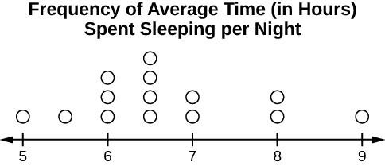

The science of **statistics**{: data-type="term"} deals with the collection, analysis, interpretation, and presentation of **data**{: data-type="term"}. We see and use data in our everyday lives.

Collaborative Exercise

In your classroom, try this exercise. Have class members write down the average time (in hours, to the nearest half-hour) they sleep per night. Your instructor will record the data. Then create a simple graph (called a **dot plot**) of the data. A dot plot consists of a number line and dots (or points) positioned above the number line. For example, consider the following data:

 5 5.5 6 6 6 6.5 6.5 6.5 6.5 7 7 8 8 9

The dot plot for this data would be as follows:

{: #eip-idp25549888 data-longdesc="m16020_DotPlot_description.html"}

Does your dot plot look the same as or different from the example? Why? If you did the same example in an English class with the same number of students, do you think the results would be the same? Why or why not?

Where do your data appear to cluster? How might you interpret the clustering?

The questions above ask you to analyze and interpret your data. With this example, you have begun your study of statistics.

In this course, you will learn how to organize and summarize data. Organizing and summarizing data is called **descriptive statistics**{: data-type="term"}. Two ways to summarize data are by graphing and by using numbers (for example, finding an average). After you have studied probability and probability distributions, you will use formal methods for drawing conclusions from \"good\" data. The formal methods are called **inferential statistics**{: data-type="term"}. Statistical inference uses probability to determine how confident we can be that our conclusions are correct.

Effective interpretation of data (inference) is based on good procedures for producing data and thoughtful examination of the data. You will encounter what will seem to be too many mathematical formulas for interpreting data. The goal of statistics is not to perform numerous calculations using the formulas, but to gain an understanding of your data. The calculations can be done using a calculator or a computer. The understanding must come from you. If you can thoroughly grasp the basics of statistics, you can be more confident in the decisions you make in life.

### Probability   {#eip-177}

**Probability**{: data-type="term"} is a mathematical tool used to study randomness. It deals with the chance (the likelihood) of an event occurring. For example, if you toss a **fair** coin four times, the outcomes may not be two heads and two tails. However, if you toss the same coin 4,000 times, the outcomes will be close to half heads and half tails. The expected theoretical probability of heads in any one toss is <math xmlns="http://www.w3.org/1998/Math/MathML"> <mrow> <mfrac> <mn>1</mn> <mn>2</mn> </mfrac> </mrow> </math>

 or 0.5. Even though the outcomes of a few repetitions are uncertain, there is a regular pattern of outcomes when there are many repetitions. After reading about the English statistician Karl **Pearson**{: data-type="term"} who tossed a coin 24,000 times with a result of 12,012 heads, one of the authors tossed a coin 2,000 times. The results were 996 heads. The fraction <math xmlns="http://www.w3.org/1998/Math/MathML"> <mrow> <mfrac> <mrow> <mn>996</mn> </mrow> <mrow> <mn>2000</mn> </mrow> </mfrac> </mrow> </math>

 is equal to 0.498 which is very close to 0.5, the expected probability.

The theory of probability began with the study of games of chance such as poker. Predictions take the form of probabilities. To predict the likelihood of an earthquake, of rain, or whether you will get an A in this course, we use probabilities. Doctors use probability to determine the chance of a vaccination causing the disease the vaccination is supposed to prevent. A stockbroker uses probability to determine the rate of return on a client\'s investments. You might use probability to decide to buy a lottery ticket or not. In your study of statistics, you will use the power of mathematics through probability calculations to analyze and interpret your data.

### Key Terms   {#eip-159}

In statistics, we generally want to study a **population**{: data-type="term"}. You can think of a population as a collection of persons, things, or objects under study. To study the population, we select a **sample**{: data-type="term"}. The idea of **sampling**{: data-type="term"} is to select a portion (or subset) of the larger population and study that portion (the sample) to gain information about the population. Data are the result of sampling from a population.

Because it takes a lot of time and money to examine an entire population, sampling is a very practical technique. If you wished to compute the overall grade point average at your school, it would make sense to select a sample of students who attend the school. The data collected from the sample would be the students\' grade point averages. In presidential elections, opinion poll samples of 1,000–2,000 people are taken. The opinion poll is supposed to represent the views of the people in the entire country. Manufacturers of canned carbonated drinks take samples to determine if a 16 ounce can contains 16 ounces of carbonated drink.

From the sample data, we can calculate a statistic. A **statistic**{: data-type="term"} is a number that represents a property of the sample. For example, if we consider one math class to be a sample of the population of all math classes, then the average number of points earned by students in that one math class at the end of the term is an example of a statistic. The statistic is an estimate of a population parameter. A **parameter**{: data-type="term"} is a numerical characteristic of the whole population that can be estimated by a statistic. Since we considered all math classes to be the population, then the average number of points earned per student over all the math classes is an example of a parameter.

One of the main concerns in the field of statistics is how accurately a statistic estimates a parameter. The accuracy really depends on how well the sample represents the population. The sample must contain the characteristics of the population in order to be a **representative sample**{: data-type="term"}. We are interested in both the sample statistic and the population parameter in inferential statistics. In a later chapter, we will use the sample statistic to test the validity of the established population parameter.

A **variable**{: data-type="term"}, usually notated by capital letters such as *X* and *Y*, is a characteristic or measurement that can be determined for each member of a population. Variables may be **numerical** or **categorical**. **Numerical variables**{: data-type="term"} take on values with equal units such as weight in pounds and time in hours. **Categorical variables**{: data-type="term"} place the person or thing into a category. If we let *X* equal the number of points earned by one math student at the end of a term, then *X* is a numerical variable. If we let *Y* be a person\'s party affiliation, then some examples of *Y* include Republican, Democrat, and Independent. *Y* is a categorical variable. We could do some math with values of *X* (calculate the average number of points earned, for example), but it makes no sense to do math with values of *Y* (calculating an average party affiliation makes no sense).

**Data**{: data-type="term"} are the actual values of the variable. They may be numbers or they may be words. **Datum** is a single value.

Two words that come up often in statistics are **mean**{: data-type="term"} and **proportion**{: data-type="term"}. If you were to take three exams in your math classes and obtain scores of 86, 75, and 92, you would calculate your mean score by adding the three exam scores and dividing by three (your mean score would be 84.3 to one decimal place). If, in your math class, there are 40 students and 22 are men and 18 are women, then the proportion of men students is <math xmlns="http://www.w3.org/1998/Math/MathML"><mrow><mfrac><mrow><mn>22</mn></mrow><mrow><mn>40</mn></mrow></mfrac></mrow></math>

 and the proportion of women students is <math xmlns="http://www.w3.org/1998/Math/MathML"><mrow><mfrac><mrow><mn>18</mn></mrow><mrow><mn>40</mn></mrow></mfrac></mrow></math>

. Mean and proportion are discussed in more detail in later chapters.

NOTE

The words \"**mean**{: data-type="term"}\" and \"**average**{: data-type="term"}\" are often used interchangeably. The substitution of one word for the other is common practice. The technical term is \"arithmetic mean,\" and \"average\" is technically a center location. However, in practice among non-statisticians, \"average\" is commonly accepted for \"arithmetic mean.\"

Determine what the key terms refer to in the following study. We want to know the average (mean) amount of money first year college students spend at ABC College on school supplies that do not include books. We randomly surveyed 100 first year students at the college. Three of those students spent $150, $200, and $225, respectively.

The **population** is all first year students attending ABC College this term.

The **sample** could be all students enrolled in one section of a beginning statistics course at ABC College (although this sample may not represent the entire population).

The **parameter** is the average (mean) amount of money spent (excluding books) by first year college students at ABC College this term.

The **statistic** is the average (mean) amount of money spent (excluding books) by first year college students in the sample.

The **variable** could be the amount of money spent (excluding books) by one first year student. Let *X* = the amount of money spent (excluding books) by one first year student attending ABC College.

The **data** are the dollar amounts spent by the first year students. Examples of the data are $150, $200, and $225.

Try It

Determine what the key terms refer to in the following study. We want to know the average (mean) amount of money spent on school uniforms each year by families with children at Knoll Academy. We randomly survey 100 families with children in the school. Three of the families spent $65, $75, and $95, respectively.

Try It Solutions

The **population** is all families with children attending Knoll Academy.

The **sample** is a random selection of 100 families with children attending Knoll Academy.

The **parameter** is the average (mean) amount of money spent on school uniforms by families with children at Knoll Academy.

The **statistic** is the average (mean) amount of money spent on school uniforms by families in the sample.

The **variable** is the amount of money spent by one family. Let X = the amount of money spent on school uniforms by one family with children attending Knoll Academy.

The **data** are the dollar amounts spent by the families. Examples of the data are $65, $75, and $95.

Determine what the key terms refer to in the following study.

A study was conducted at a local college to analyze the average cumulative GPA’s of students who graduated last year. Fill in the letter of the phrase that best describes each of the items below.

1\. Population\_\_\_\_\_ 2. Statistic \_\_\_\_\_ 3. Parameter \_\_\_\_\_ 4. Sample \_\_\_\_\_ 5. Variable \_\_\_\_\_ 6. Data \_\_\_\_\_

* a) all students who attended the college last year
* b) the cumulative GPA of one student who graduated from the college last year
* c) 3.65, 2.80, 1.50, 3.90
* d) a group of students who graduated from the college last year, randomly selected
* e) the average cumulative GPA of students who graduated from the college last year
* f) all students who graduated from the college last year
* g) the average cumulative GPA of students in the study who graduated from the college last year
{: data-labeled-item="true"}

 1. f 2. g 3. e 4. d 5. b 6. c 

Determine what the key terms refer to in the following study.

As part of a study designed to test the safety of automobiles, the National Transportation Safety Board collected and reviewed data about the effects of an automobile crash on test dummies. Here is the criterion they used:

| Speed at which Cars Crashed | Location of “drive” (i.e. dummies) |
| 35 miles/hour | Front Seat |
{: #ch01_mod01_tbl003 summary=""}

Cars with dummies in the front seats were crashed into a wall at a speed of 35 miles per hour. We want to know the proportion of dummies in the driver’s seat that would have had head injuries, if they had been actual drivers. We start with a simple random sample of 75 cars.

The **population** is all cars containing dummies in the front seat.

The **sample** is the 75 cars, selected by a simple random sample.

The **parameter** is the proportion of driver dummies (if they had been real people) who would have suffered head injuries in the population.

The **statistic** is proportion of driver dummies (if they had been real people) who would have suffered head injuries in the sample.

The **variable** *X* = the number of driver dummies (if they had been real people) who would have suffered head injuries.

The **data** are either: yes, had head injury, or no, did not.

Determine what the key terms refer to in the following study.

An insurance company would like to determine the proportion of all medical doctors who have been involved in one or more malpractice lawsuits. The company selects 500 doctors at random from a professional directory and determines the number in the sample who have been involved in a malpractice lawsuit.

The **population** is all medical doctors listed in the professional directory.

The **parameter** is the proportion of medical doctors who have been involved in one or more malpractice suits in the population.

The **sample** is the 500 doctors selected at random from the professional directory.

The **statistic** is the proportion of medical doctors who have been involved in one or more malpractice suits in the sample.

The **variable** *X* = the number of medical doctors who have been involved in one or more malpractice suits.

The **data** are either: yes, was involved in one or more malpractice lawsuits, or no, was not.

Collaborative Exercise

Do the following exercise collaboratively with up to four people per group. Find a population, a sample, the parameter, the statistic, a variable, and data for the following study: You want to determine the average (mean) number of glasses of milk college students drink per day. Suppose yesterday, in your English class, you asked five students how many glasses of milk they drank the day before. The answers were 1, 0, 1, 3, and 4 glasses of milk.

### References   {#eip-525}

The Data and Story Library, http://lib.stat.cmu.edu/DASL/Stories/CrashTestDummies.html (accessed May 1, 2013).

### Chapter Review

The mathematical theory of statistics is easier to learn when you know the language. This module presents important terms that will be used throughout the text.

### Practice

*Use the following information to answer the next five exercises.* Studies are often done by pharmaceutical companies to determine the effectiveness of a treatment program. Suppose that a new AIDS antibody drug is currently under study. It is given to patients once the AIDS symptoms have revealed themselves. Of interest is the average (mean) length of time in months patients live once they start the treatment. Two researchers each follow a different set of 40 patients with AIDS from the start of treatment until their deaths. The following data (in months) are collected.

Researcher A:3 4 11 15 16 17 22 44 37 16 14 24 25 15 26 27 33 29 35 44 13 21 22 10 12 8 40 32 26 27 31 34 29 17 8 24 18 47 33 34 

Researcher B:3 14 11 5 16 17 28 41 31 18 14 14 26 25 21 22 31 2 35 44 23 21 21 16 12 18 41 22 16 25 33 34 29 13 18 24 23 42 33 29 

Determine what the key terms refer to in the example for Researcher A.

population

AIDS patients.

sample

<!-- <solution id="eip-idm6874896">
<para id="eip-idm86460448">AIDS  patients sampled from researcher A and researcher B.</para>
</solution> -->

parameter

The average length of time (in months) AIDS patients live after treatment.

statistic

<!-- <solution id="eip-idp68684304">
<para id="eip-idp10558736">The average length of time (in months) AIDS patients from the sample live after treatment.</para>
</solution> -->

variable

*X* = the length of time (in months) AIDS patients live after treatment

### HOMEWORK

*For each of the following eight exercises, identify: a. the population, b. the sample, c. the parameter, d. the statistic, e. the variable, and f. the data. Give examples where appropriate.*

A fitness center is interested in the mean amount of time a client exercises in the center each week.

<!-- <solution id="eip-idm31021440">
<list id="eip-idm31021184" mark-suffix="." list-type="enumerated" number-style="lower-alpha"><item>The population is all of the clients of the fitness center.</item>
<item>A sample of the clients that use the fitness center for a given week.</item>
<item>The average amount of time that all clients exercise in one week.</item>
<item>The average amount of time that a sample of clients exercises in one week.</item>
<item>The amount of time that a client exercises in one week.</item>
<item>Examples are: 2 hours, 5 hours, and 7.5 hours</item>
</list></solution> -->

Ski resorts are interested in the mean age that children take their first ski and snowboard lessons. They need this information to plan their ski classes optimally.

1.  all children who take ski or snowboard lessons
2.  a group of these children
3.  the population mean age of children who take their first snowboard lesson
4.  the sample mean age of children who take their first snowboard lesson
5.  *X* = the age of one child who takes his or her first ski or snowboard lesson
6.  values for *X*, such as 3, 7, and so on
{: data-mark-suffix="." type="a"}

A cardiologist is interested in the mean recovery period of her patients who have had heart attacks.

<!-- <solution id="eip-idm18256448">
<list id="eip-idm26972912" mark-suffix="." list-type="enumerated" number-style="lower-alpha"><item>the cardiologist&#8217;s patients</item>
<item>a group of the cardiologist&#8217;s patients</item>
<item>the mean recovery period of all of the cardiologist&#8217;s patients</item>
<item>the mean recovery period of the group of the cardiologist&#8217;s patients</item>
<item><emphasis effect="italics">X</emphasis> = the mean recovery period of one patient</item>
<item>values for <emphasis effect="italics">X</emphasis>, such as 10 days, 14 days, 20 days, and so on</item>
</list></solution> -->

Insurance companies are interested in the mean health costs each year of their clients, so that they can determine the costs of health insurance.

1.  the clients of the insurance companies
2.  a group of the clients
3.  the mean health costs of the clients
4.  the mean health costs of the sample
5.  *X* = the health costs of one client
6.  values for *X*, such as 34, 9, 82, and so on
{: data-mark-suffix="." type="a"}

A politician is interested in the proportion of voters in his district who think he is doing a good job.

<!-- <solution id="eip-idm40279024">
<list id="eip-idm64896032" mark-suffix="." list-type="enumerated" number-style="lower-alpha"><item>all voters in the politician&#8217;s district</item>
<item>a random selection of voters in the politician&#8217;s district</item>
<item>the proportion of voters in this district who think this politician is doing a good job</item>
<item>the proportion of voters in this district who think this politician is doing a good job in the sample</item>
<item><emphasis effect="italics">X</emphasis> = the number of voters in the district who think this politician is doing a good job</item>
<item>Yes, he is doing a good job. No, he is not doing a good job.</item>
</list></solution> -->

A marriage counselor is interested in the proportion of clients she counsels who stay married.

1.  all the clients of this counselor
2.  a group of clients of this marriage counselor
3.  the proportion of all her clients who stay married
4.  the proportion of the sample of the counselor’s clients who stay married
5.  *X* = the number of couples who stay married
6.  yes, no
{: data-mark-suffix="." type="a"}

Political pollsters may be interested in the proportion of people who will vote for a particular cause.

<!-- <solution id="eip-idm168008800">
<list id="eip-idm4083712" mark-suffix="." list-type="enumerated" number-style="lower-alpha"><item>all voters (in a certain geographic area)</item>
<item>a random selection of all the voters</item>
<item>the proportion of voters who are interested in this particular cause</item>
<item>the proportion of voters who are interested in this particular cause in the sample</item>
<item><emphasis effect="italics">X</emphasis> = the number of voters who are interested in this particular cause</item>
<item>yes, no</item></list></solution> -->

A marketing company is interested in the proportion of people who will buy a particular product.

1.  all people (maybe in a certain geographic area, such as the United States)
2.  a group of the people
3.  the proportion of all people who will buy the product
4.  the proportion of the sample who will buy the product
5.  *X* = the number of people who will buy it
6.  buy, not buy
{: data-mark-suffix="." type="a"}

* * *
{: data-type="newline"}

 *Use the following information to answer the next three exercises:* A Lake Tahoe Community College instructor is interested in the mean number of days Lake Tahoe Community College math students are absent from class during a quarter. * * *
{: data-type="newline"}

What is the population she is interested in?

1.  all Lake Tahoe Community College students
2.  all Lake Tahoe Community College English students
3.  all Lake Tahoe Community College students in her classes
4.  all Lake Tahoe Community College math students
{: data-mark-suffix="." type="a"}

<!-- <solution id="id30103802">
<para id="element-356234">d</para></solution> -->

Consider the following:

<math xmlns="http://www.w3.org/1998/Math/MathML"> <mi>X</mi> </math>

 = number of days a Lake Tahoe Community College math student is absent

In this case, *X* is an example of a:

1.  variable.
2.  population.
3.  statistic.
4.  data.
{: data-mark-suffix="." type="a"}

a

The instructor’s sample produces a mean number of days absent of 3.5 days. This value is an example of a:

1.  parameter.
2.  data.
3.  statistic.
4.  variable.
{: data-mark-suffix="." type="a"}

<!-- <solution id="id30104192">
<para id="element-3562324">c</para></solution> -->

### Glossary
{: data-type="glossary-title"}

Average
: {: #id16316921} also called mean; a number that describes the central tendency of the data
{: #average}

Categorical Variable
: variables that take on values that are names or labels
^

Data
: {: #id15539900} a set of observations (a set of possible outcomes); most data can be put into two groups: **qualitative** (an attribute whose value is indicated by a label) or **quantitative** (an attribute whose value is indicated by a number). Quantitative data can be separated into two subgroups: **discrete** and **continuous**. Data is discrete if it is the result of counting (such as the number of students of a given ethnic group in a class or the number of books on a shelf). Data is continuous if it is the result of measuring (such as distance traveled or weight of luggage)
{: #data}

Numerical Variable
: variables that take on values that are indicated by numbers
^

Parameter
: a number that is used to represent a population characteristic and that generally cannot be determined easily
^

Population
: all individuals, objects, or measurements whose properties are being studied
^

Probability
: {: #id17934331} a number between zero and one, inclusive, that gives the likelihood that a specific event will occur
{: #prob}

Proportion
: {: #id15701010} the number of successes divided by the total number in the sample
{: #proportion}

Representative Sample
: a subset of the population that has the same characteristics as the population
^

Sample
: a subset of the population studied
^

Statistic
: {: #id17366233} a numerical characteristic of the sample; a statistic estimates the corresponding population parameter.
{: #stat}

Variable
: a characteristic of interest for each person or object in a population

