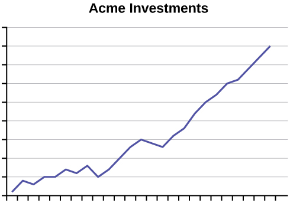
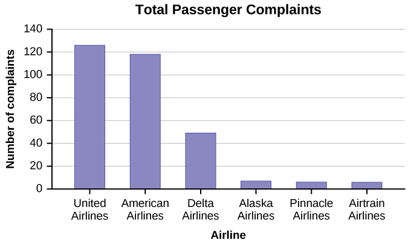

Does aspirin reduce the risk of heart attacks? Is one brand of fertilizer more effective at growing roses than another? Is fatigue as dangerous to a driver as the influence of alcohol? Questions like these are answered using randomized experiments. In this module, you will learn important aspects of experimental design. Proper study design ensures the production of reliable, accurate data.

The purpose of an experiment is to investigate the relationship between two variables. When one variable causes change in another, we call the first variable the **explanatory variable**{: data-type="term"}. The affected variable is called the **response variable**{: data-type="term"}. In a randomized experiment, the researcher manipulates values of the explanatory variable and measures the resulting changes in the response variable. The different values of the explanatory variable are called **treatments**{: data-type="term"}. An **experimental unit**{: data-type="term"} is a single object or individual to be measured.

You want to investigate the effectiveness of vitamin E in preventing disease. You recruit a group of subjects and ask them if they regularly take vitamin E. You notice that the subjects who take vitamin E exhibit better health on average than those who do not. Does this prove that vitamin E is effective in disease prevention? It does not. There are many differences between the two groups compared in addition to vitamin E consumption. People who take vitamin E regularly often take other steps to improve their health: exercise, diet, other vitamin supplements, choosing not to smoke. Any one of these factors could be influencing health. As described, this study does not prove that vitamin E is the key to disease prevention.

Additional variables that can cloud a study are called **lurking variables**{: data-type="term"}. In order to prove that the explanatory variable is causing a change in the response variable, it is necessary to isolate the explanatory variable. The researcher must design her experiment in such a way that there is only one difference between groups being compared: the planned treatments. This is accomplished by the **random assignment**{: data-type="term"} of experimental units to treatment groups. When subjects are assigned treatments randomly, all of the potential lurking variables are spread equally among the groups. At this point the only difference between groups is the one imposed by the researcher. Different outcomes measured in the response variable, therefore, must be a direct result of the different treatments. In this way, an experiment can prove a cause-and-effect connection between the explanatory and response variables.

The power of suggestion can have an important influence on the outcome of an experiment. Studies have shown that the expectation of the study participant can be as important as the actual medication. In one study of performance-enhancing drugs, researchers noted:

*Results showed that believing one had taken the substance resulted in \[*performance*\] times almost as fast as those associated with consuming the drug itself. In contrast, taking the drug without knowledge yielded no significant performance increment.*[1](#footnote1){: data-type="footnote-number" name="footnote-ref1"}

When participation in a study prompts a physical response from a participant, it is difficult to isolate the effects of the explanatory variable. To counter the power of suggestion, researchers set aside one treatment group as a **control group**{: data-type="term"}. This group is given a **placebo**{: data-type="term"} treatment–a treatment that cannot influence the response variable. The control group helps researchers balance the effects of being in an experiment with the effects of the active treatments. Of course, if you are participating in a study and you know that you are receiving a pill which contains no actual medication, then the power of suggestion is no longer a factor. **Blinding**{: data-type="term"} in a randomized experiment preserves the power of suggestion. When a person involved in a research study is blinded, he does not know who is receiving the active treatment(s) and who is receiving the placebo treatment. A **double-blind experiment**{: data-type="term"} is one in which both the subjects and the researchers involved with the subjects are blinded.

Researchers want to investigate whether taking aspirin regularly reduces the risk of heart attack. Four hundred men between the ages of 50 and 84 are recruited as participants. The men are divided randomly into two groups: one group will take aspirin, and the other group will take a placebo. Each man takes one pill each day for three years, but he does not know whether he is taking aspirin or the placebo. At the end of the study, researchers count the number of men in each group who have had heart attacks.

Identify the following values for this study: population, sample, experimental units, explanatory variable, response variable, treatments.

The *population* is men aged 50 to 84. * * *
{: data-type="newline" data-count="1"}

The *sample* is the 400 men who participated. * * *
{: data-type="newline" data-count="1"}

The *experimental units* are the individual men in the study. * * *
{: data-type="newline" data-count="1"}

The *explanatory variable* is oral medication. * * *
{: data-type="newline" data-count="1"}

The *treatments* are aspirin and a placebo. * * *
{: data-type="newline" data-count="1"}

The *response variable* is whether a subject had a heart attack.

The Smell &amp; Taste Treatment and Research Foundation conducted a study to investigate whether smell can affect learning. Subjects completed mazes multiple times while wearing masks. They completed the pencil and paper mazes three times wearing floral-scented masks, and three times with unscented masks. Participants were assigned at random to wear the floral mask during the first three trials or during the last three trials. For each trial, researchers recorded the time it took to complete the maze and the subject’s impression of the mask’s scent: positive, negative, or neutral. 

Describe the explanatory and response variables in this study.

What are the treatments?

Identify any lurking variables that could interfere with this study.

Is it possible to use blinding in this study?

1.  The explanatory variable is scent, and the response variable is the time it takes to complete the maze.
2.  There are two treatments: a floral-scented mask and an unscented mask.
3.  All subjects experienced both treatments. The order of treatments was randomly assigned so there were no differences between the treatment groups. Random assignment eliminates the problem of lurking variables.
4.  Subjects will clearly know whether they can smell flowers or not, so subjects cannot be blinded in this study. Researchers timing the mazes can be blinded, though. The researcher who is observing a subject will not know which mask is being worn.
{: data-number-style="lower-alpha"}

A researcher wants to study the effects of birth order on personality. Explain why this study could not be conducted as a randomized experiment. What is the main problem in a study that cannot be designed as a randomized experiment?

The explanatory variable is birth order. You cannot randomly assign a person’s birth order. Random assignment eliminates the impact of lurking variables. When you cannot assign subjects to treatment groups at random, there will be differences between the groups other than the explanatory variable.

Try It

You are concerned about the effects of texting on driving performance. Design a study to test the response time of drivers while texting and while driving only. How many seconds does it take for a driver to respond when a leading car hits the brakes?

1.  Describe the explanatory and response variables in the study.
2.  What are the treatments?
3.  What should you consider when selecting participants?
4.  Your research partner wants to divide participants randomly into two groups: one to drive without distraction and one to text and drive simultaneously. Is this a good idea? Why or why not?
5.  Identify any lurking variables that could interfere with this study.
6.  How can blinding be used in this study?
{: data-number-style="lower-alpha"}

Try It Solutions

1.  Explanatory: presence of distraction from texting; response: response time measured in seconds
2.  Driving without distraction and driving while texting
3.  Answers will vary. Possible responses: Do participants regularly send and receive text messages? How long has the subject been driving? What is the age of the participants? Do participants have similar texting and driving experience?
4.  This is not a good plan because it compares drivers with different abilities. It would be better to assign both treatments to each participant in random order.
5.  Possible responses include: texting ability, driving experience, type of phone.
6.  The researchers observing the trials and recording response time could be blinded to the treatment being applied.
{: data-number-style="lower-alpha"}

# Ethics   {#eip-165}

The widespread misuse and misrepresentation of statistical information often gives the field a bad name. Some say that “numbers don’t lie,” but the people who use numbers to support their claims often do.

A recent investigation of famous social psychologist, Diederik Stapel, has led to the retraction of his articles from some of the world’s top journals including *Journal of Experimental Social Psychology, Social Psychology, Basic and Applied Social Psychology, British Journal of Social Psychology,* and the magazine *Science*. Diederik Stapel is a former professor at Tilburg University in the Netherlands. Over the past two years, an extensive investigation involving three universities where Stapel has worked concluded that the psychologist is guilty of fraud on a colossal scale. Falsified data taints over 55 papers he authored and 10 Ph.D. dissertations that he supervised.

*Stapel did not deny that his deceit was driven by ambition. But it was more complicated than that, he told me. He insisted that he loved social psychology but had been frustrated by the messiness of experimental data, which rarely led to clear conclusions. His lifelong obsession with elegance and order, he said, led him to concoct sexy results that journals found attractive. “It was a quest for aesthetics, for beauty—instead of the truth,” he said. He described his behavior as an addiction that drove him to carry out acts of increasingly daring fraud, like a junkie seeking a bigger and better high.[2](#footnote2){: data-type="footnote-number" name="footnote-ref2"}*

The committee investigating Stapel concluded that he is guilty of several practices including:

* creating datasets, which largely confirmed the prior expectations,
* altering data in existing datasets,
* changing measuring instruments without reporting the change, and
* misrepresenting the number of experimental subjects.

Clearly, it is never acceptable to falsify data the way this researcher did. Sometimes, however, violations of ethics are not as easy to spot.

Researchers have a responsibility to verify that proper methods are being followed. The report describing the investigation of Stapel’s fraud states that, “statistical flaws frequently revealed a lack of familiarity with elementary statistics.”[3](#footnote3){: data-type="footnote-number" name="footnote-ref3"} Many of Stapel’s co-authors should have spotted irregularities in his data. Unfortunately, they did not know very much about statistical analysis, and they simply trusted that he was collecting and reporting data properly.

Many types of statistical fraud are difficult to spot. Some researchers simply stop collecting data once they have just enough to prove what they had hoped to prove. They don’t want to take the chance that a more extensive study would complicate their lives by producing data contradicting their hypothesis.

Professional organizations, like the American Statistical Association, clearly define expectations for researchers. There are even laws in the federal code about the use of research data.

When a statistical study uses human participants, as in medical studies, both ethics and the law dictate that researchers should be mindful of the safety of their research subjects. The U.S. Department of Health and Human Services oversees federal regulations of research studies with the aim of protecting participants. When a university or other research institution engages in research, it must ensure the safety of all human subjects. For this reason, research institutions establish oversight committees known as **Institutional Review Boards (IRB)**{: data-type="term"}. All planned studies must be approved in advance by the IRB. Key protections that are mandated by law include the following:

* Risks to participants must be minimized and reasonable with respect to projected benefits.
* Participants must give **informed consent**{: data-type="term"}. This means that the risks of participation must be clearly explained to the subjects of the study. Subjects must consent in writing, and researchers are required to keep documentation of their consent.
* Data collected from individuals must be guarded carefully to protect their privacy.

These ideas may seem fundamental, but they can be very difficult to verify in practice. Is removing a participant’s name from the data record sufficient to protect privacy? Perhaps the person’s identity could be discovered from the data that remains. What happens if the study does not proceed as planned and risks arise that were not anticipated? When is informed consent really necessary? Suppose your doctor wants a blood sample to check your cholesterol level. Once the sample has been tested, you expect the lab to dispose of the remaining blood. At that point the blood becomes biological waste. Does a researcher have the right to take it for use in a study?

It is important that students of statistics take time to consider the ethical questions that arise in statistical studies. How prevalent is fraud in statistical studies? You might be surprised—and disappointed. There is a website [(www.retractionwatch.com)][1] dedicated to cataloging retractions of study articles that have been proven fraudulent. A quick glance will show that the misuse of statistics is a bigger problem than most people realize.

Vigilance against fraud requires knowledge. Learning the basic theory of statistics will empower you to analyze statistical studies critically.

Describe the unethical behavior in each example and describe how it could impact the reliability of the resulting data. Explain how the problem should be corrected.

A researcher is collecting data in a community.

1.  She selects a block where she is comfortable walking because she knows many of the people living on the street.
2.  No one seems to be home at four houses on her route. She does not record the addresses and does not return at a later time to try to find residents at home.
3.  She skips four houses on her route because she is running late for an appointment. When she gets home, she fills in the forms by selecting random answers from other residents in the neighborhood.
{: data-number-style="lower-alpha"}

1.  By selecting a convenient sample, the researcher is intentionally selecting a sample that could be biased. Claiming that this sample represents the community is misleading. The researcher needs to select areas in the community at random.
2.  Intentionally omitting relevant data will create bias in the sample. Suppose the researcher is gathering information about jobs and child care. By ignoring people who are not home, she may be missing data from working families that are relevant to her study. She needs to make every effort to interview all members of the target sample.
3.  It is never acceptable to fake data. Even though the responses she uses are “real” responses provided by other participants, the duplication is fraudulent and can create bias in the data. She needs to work diligently to interview everyone on her route.
{: data-number-style="lower-alpha"}

Try It

Describe the unethical behavior, if any, in each example and describe how it could impact the reliability of the resulting data. Explain how the problem should be corrected.

A study is commissioned to determine the favorite brand of fruit juice among teens in California.

1.  The survey is commissioned by the seller of a popular brand of apple juice.
2.  There are only two types of juice included in the study: apple juice and cranberry juice.
3.  Researchers allow participants to see the brand of juice as samples are poured for a taste test.
4.  Twenty-five percent of participants prefer Brand X, 33% prefer Brand Y and 42% have no preference between the two brands. Brand X references the study in a commercial saying “Most teens like Brand X as much as or more than Brand Y.”
{: data-number-style="lower-alpha"}

1.  This is not necessarily a problem. The study should be monitored carefully, however, to ensure that the company is not pressuring researchers to return biased results.
2.  If the researchers truly want to determine the favorite brand of juice, then researchers should ask teens to compare different brands of the same type of juice. Choosing a sweet juice to compare against a sharp-flavored juice will not lead to an accurate comparison of brand quality.
3.  Participants could be biased by the knowledge. The results may be different from those obtained in a blind taste test.
4.  The commercial tells the truth, but not the whole truth. It leads consumers to believe that Brand X was preferred by more participants than Brand Y while the opposite is true.
{: data-number-style="lower-alpha"}

# References   {#eip-568}

“Vitamin E and Health,” Nutrition Source, Harvard School of Public Health, http://www.hsph.harvard.edu/nutritionsource/vitamin-e/ (accessed May 1, 2013).

Stan Reents. “Don’t Underestimate the Power of Suggestion,” athleteinme.com, http://www.athleteinme.com/ArticleView.aspx?id=1053 (accessed May 1, 2013).

Ankita Mehta. “Daily Dose of Aspiring Helps Reduce Heart Attacks: Study,” International Business Times, July 21, 2011. Also available online at http://www.ibtimes.com/daily-dose-aspirin-helps-reduce-heart-attacks-study-300443 (accessed May 1, 2013).

The Data and Story Library, http://lib.stat.cmu.edu/DASL/Stories/ScentsandLearning.html (accessed May 1, 2013).

M.L. Jacskon et al., “Cognitive Components of Simulated Driving Performance: Sleep Loss effect and Predictors,” Accident Analysis and Prevention Journal, Jan no. 50 (2013), http://www.ncbi.nlm.nih.gov/pubmed/22721550 (accessed May 1, 2013).

“Earthquake Information by Year,” U.S. Geological Survey. http://earthquake.usgs.gov/earthquakes/eqarchives/year/ (accessed May 1, 2013).

“Fatality Analysis Report Systems (FARS) Encyclopedia,” National Highway Traffic and Safety Administration. http://www-fars.nhtsa.dot.gov/Main/index.aspx (accessed May 1, 2013).

Data from www.businessweek.com (accessed May 1, 2013).

Data from www.forbes.com (accessed May 1, 2013).

“America’s Best Small Companies,” http://www.forbes.com/best-small-companies/list/ (accessed May 1, 2013).

U.S. Department of Health and Human Services, Code of Federal Regulations Title 45 Public Welfare Department of Health and Human Services Part 46 Protection of Human Subjects revised January 15, 2009. Section 46.111:Criteria for IRB Approval of Research.

“April 2013 Air Travel Consumer Report,” U.S. Department of Transportation, April 11 (2013), http://www.dot.gov/airconsumer/april-2013-air-travel-consumer-report (accessed May 1, 2013).

Lori Alden, “Statistics can be Misleading,” econoclass.com, http://www.econoclass.com/misleadingstats.html (accessed May 1, 2013).

Maria de los A. Medina, “Ethics in Statistics,” Based on “Building an Ethics Module for Business, Science, and Engineering Students” by Jose A. Cruz-Cruz and William Frey, Connexions, http://cnx.org/content/m15555/latest/ (accessed May 1, 2013).

# Chapter Review

A poorly designed study will not produce reliable data. There are certain key components that must be included in every experiment. To eliminate lurking variables, subjects must be assigned randomly to different treatment groups. One of the groups must act as a control group, demonstrating what happens when the active treatment is not applied. Participants in the control group receive a placebo treatment that looks exactly like the active treatments but cannot influence the response variable. To preserve the integrity of the placebo, both researchers and subjects may be blinded. When a study is designed properly, the only difference between treatment groups is the one imposed by the researcher. Therefore, when groups respond differently to different treatments, the difference must be due to the influence of the explanatory variable.

“An ethics problem arises when you are considering an action that benefits you or some cause you support, hurts or reduces benefits to others, and violates some rule.”[4](#footnote4){: data-type="footnote-number" name="footnote-ref4"} Ethical violations in statistics are not always easy to spot. Professional associations and federal agencies post guidelines for proper conduct. It is important that you learn basic statistical procedures so that you can recognize proper data analysis.

<section data-depth="1" class="practice">

Design an experiment. Identify the explanatory and response variables. Describe the population being studied and the experimental units. Explain the treatments that will be used and how they will be assigned to the experimental units. Describe how blinding and placebos may be used to counter the power of suggestion.

<!-- <solution id="fs-idm46346208"><para id="fs-idm28764928">Answers will vary.</para></solution> -->

Discuss potential violations of the rule requiring informed consent.

1.  Inmates in a correctional facility are offered good behavior credit in return for participation in a study.
2.  A research study is designed to investigate a new children’s allergy medication.
3.  Participants in a study are told that the new medication being tested is highly promising, but they are not told that only a small portion of participants will receive the new medication. Others will receive placebo treatments and traditional treatments.
{: data-number-style="lower-alpha"}

1.  Inmates may not feel comfortable refusing participation, or may feel obligated to take advantage of the promised benefits. They may not feel truly free to refuse participation.
2.  Parents can provide consent on behalf of their children, but children are not competent to provide consent for themselves.
3.  All risks and benefits must be clearly outlined. Study participants must be informed of relevant aspects of the study in order to give appropriate consent.
{: data-number-style="lower-alpha"}

</section>

# HOMEWORK

How does sleep deprivation affect your ability to drive? A recent study measured the effects on 19 professional drivers. Each driver participated in two experimental sessions: one after normal sleep and one after 27 hours of total sleep deprivation. The treatments were assigned in random order. In each session, performance was measured on a variety of tasks including a driving simulation.

Use key terms from this module to describe the design of this experiment.

Explanatory variable: amount of sleep * * *
{: data-type="newline" data-count="1"}

Response variable: performance measured in assigned tasks * * *
{: data-type="newline" data-count="1"}

Treatments: normal sleep and 27 hours of total sleep deprivation * * *
{: data-type="newline" data-count="1"}

Experimental Units: 19 professional drivers * * *
{: data-type="newline" data-count="1"}

Lurking variables: none – all drivers participated in both treatments * * *
{: data-type="newline" data-count="1"}

Random assignment: treatments were assigned in random order; this eliminated the effect of any “learning” that may take place during the first experimental session * * *
{: data-type="newline" data-count="1"}

Control/Placebo: completing the experimental session under normal sleep conditions * * *
{: data-type="newline" data-count="1"}

Blinding: researchers evaluating subjects’ performance must not know which treatment is being applied at the time

An advertisement for Acme Investments displays the two graphs in [\[link\]](#fs-idp81996208) to show the value of Acme’s product in comparison with the Other Guy’s product. Describe the potentially misleading visual effect of these comparison graphs. How can this be corrected?

<figure markdown="1" data-orient="horizontal">
<figcaption>
As the graphs show, Acme consistently outperforms the Other Guys!
</figcaption>
{:}

{:}

</figure>

<!-- <solution id="eip-idm37639696">
<para id="eip-idp9699152">The graphs do not show scales of values. We do not know the period of time each graph represents; they may show data from different years. We also do not know if the vertical scales on each graph are equivalent. The scales may have been adjusted to exaggerate or minimize trends. There is no reliable information to be gleaned from these graphs, and setting them up as examples of performance is misleading.</para>
</solution> -->

The graph in [[link]](#fs-idm43124592) shows the number of complaints for six different airlines as reported to the US Department of Transportation in February 2013. Alaska, Pinnacle, and Airtran Airlines have far fewer complaints reported than American, Delta, and United. Can we conclude that American, Delta, and United are the worst airline carriers since they have the most complaints?

{:}

You cannot assume that the numbers of complaints reflect the quality of the airlines. The airlines shown with the greatest number of complaints are the ones with the most passengers. You must consider the appropriateness of methods for presenting data; in this case displaying totals is misleading.

## Footnotes
{: data-type="footnote-title"}

1.  [1](#footnote-ref1){: data-type="footnote-ref" name="footnote1"} McClung, M. Collins, D. “Because I know it will!”: placebo effects of an ergogenic aid on athletic performance. Journal of Sport &amp; Exercise Psychology. 2007 Jun. 29(3):382-94. Web. April 30, 2013.
2.  [2](#footnote-ref2){: data-type="footnote-ref" name="footnote2"} Yudhijit Bhattacharjee, “The Mind of a Con Man,” Magazine, New York Times, April 26, 2013. Available online at: http://www.nytimes.com/2013/04/28/magazine/diederik-stapels-audacious-academic-fraud.html?src=dayp&amp;\\\_r=2&amp; (accessed May 1, 2013).
3.  [3](#footnote-ref3){: data-type="footnote-ref" name="footnote3"} “Flawed Science: The Fraudulent Research Practices of Social Psychologist Diederik Stapel,” Tillburg University, November 28, 2012, http://www.tilburguniversity.edu/upload/064a10cd-bce5-4385-b9ff-05b840caeae6\\\_120695\\\_Rapp\\\_nov\\\_2012\\\_UK\\\_web.pdf (accessed May 1, 2013).
4.  [4](#footnote-ref4){: data-type="footnote-ref" name="footnote4"} Andrew Gelman, “Open Data and Open Methods,” Ethics and Statistics, http://www.stat.columbia.edu/~gelman/research/published/ChanceEthics1.pdf (accessed May 1, 2013).

## Glossary
{: data-type="glossary-title"}

Explanatory Variable
: the independent variable in an experiment; the value controlled by researchers
{: .definition}

Treatments
: different values or components of the explanatory variable applied in an experiment
{: .definition}

Response Variable
: the dependent variable in an experiment; the value that is measured for change at the end of an experiment
{: .definition}

Experimental Unit
: any individual or object to be measured
{: .definition}

Lurking Variable
: a variable that has an effect on a study even though it is neither an explanatory variable nor a response variable
{: .definition}

Random Assignment
: the act of organizing experimental units into treatment groups using random methods
{: .definition}

Control Group
: a group in a randomized experiment that receives an inactive treatment but is otherwise managed exactly as the other groups
{: .definition}

Informed Consent
: Any human subject in a research study must be cognizant of any risks or costs associated with the study. The subject has the right to know the nature of the treatments included in the study, their potential risks, and their potential benefits. Consent must be given freely by an informed, fit participant.
{: .definition}

Institutional Review Board
: a committee tasked with oversight of research programs that involve human subjects
{: .definition}

Placebo
: an inactive treatment that has no real effect on the explanatory variable
{: .definition}

Blinding
: not telling participants which treatment a subject is receiving
{: .definition}

Double-blinding
: the act of blinding both the subjects of an experiment and the researchers who work with the subjects
{: .definition}

[1]: http://www.retractionwatch.com
