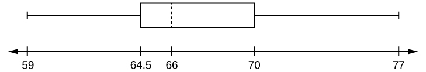
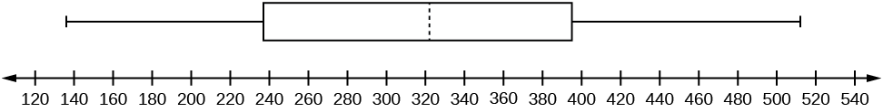
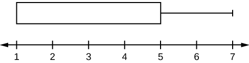
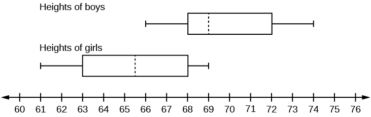
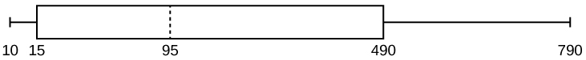
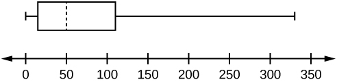
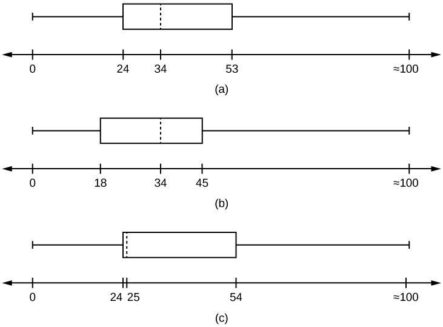

**Box plots**{: data-type="term"} (also called **box-and-whisker plots**{: data-type="term"} or **box-whisker plots**{: data-type="term"}) give a good graphical image of the concentration of the data. They also show how far the extreme values are from most of the data. A box plot is constructed from five values: the minimum value, the first quartile, the median, the third quartile, and the maximum value. We use these values to compare how close other data values are to them.

To construct a box plot, use a horizontal or vertical number line and a rectangular box. The smallest and largest data values label the endpoints of the axis. The first quartile marks one end of the box and the third quartile marks the other end of the box. Approximately **the middle 50 percent of the data fall inside the box.** The \"whiskers\" extend from the ends of the box to the smallest and largest data values. The median or second quartile can be between the first and third quartiles, or it can be one, or the other, or both. The box plot gives a good, quick picture of the data.

NOTE

You may encounter box-and-whisker plots that have dots marking outlier values. In those cases, the whiskers are not extending to the minimum and maximum values.

Consider, again, this dataset.

 1 1 2 2 4 6 6.8 7.2 8 8.3 9 10 10 11.5 

The first quartile is two, the median is seven, and the third quartile is nine. The smallest value is one, and the largest value is 11.5. The following image shows the constructed box plot.

NOTE

See the calculator instructions on the [TI web site][1] or in the appendix.

 {:}

The two whiskers extend from the first quartile to the smallest value and from the third quartile to the largest value. The median is shown with a dashed line.

NOTE

It is important to start a box plot with a **scaled number line**. Otherwise the box plot may not be useful.

The following data are the heights of 40 students in a statistics class.

 59 60 61 62 62 63 63 64 64 64 65 65 65 65 65 65 65 65 65 66 66 67 67 68 68 69 70 70 70 70 70 71 71 72 72 73 74 74 75 77 

Construct a box plot with the following properties; the calculator intructions for the minimum and maximum values as well as the quartiles follow the example.

* Minimum value = 59
* Maximum value = 77
* *Q*1: First quartile = 64.5
* *Q*2: Second quartile or median= 66
* *Q*3: Third quartile = 70

{:}

1.  Each quarter has approximately 25% of the data.
2.  The spreads of the four quarters are 64.5 – 59 = 5.5 (first quarter), 66 – 64.5 = 1.5 (second quarter), 70 – 66 = 4 (third quarter), and 77 – 70 = 7 (fourth quarter). So, the second quarter has the smallest spread and the fourth quarter has the largest spread.
3.  Range = maximum value – the minimum value = 77 – 59 = 18
4.  Interquartile Range: *IQR* = *Q*3 – *Q*1 = 70 – 64.5 = 5.5.
5.  The interval 59–65 has more than 25% of the data so it has more data in it than the interval 66 through 70 which has 25% of the data.
6.  The middle 50% (middle half) of the data has a range of 5.5 inches.
{: data-mark-suffix="." type="a"}

To find the minimum, maximum, and quartiles:

Enter data into the list editor (Pres STAT 1:EDIT). If you need to clear the list, arrow up to the name L1, press CLEAR, and then arrow down.

Put the data values into the list L1.

Press STAT and arrow to CALC. Press 1:1-VarStats. Enter L1.

Press ENTER.

Use the down and up arrow keys to scroll.

Smallest value = 59.

Largest value = 77.

*Q*1\: First quartile = 64.5.

*Q*2\: Second quartile or median = 66.

*Q*3\: Third quartile = 70.* * *
{: data-type="newline" data-count="2"}

To construct the box plot:

Press 4:Plotsoff. Press ENTER.

Arrow down and then use the right arrow key to go to the fifth picture, which is the box plot. Press ENTER.

Arrow down to Xlist: Press 2nd 1 for L1

Arrow down to Freq: Press ALPHA. Press 1.

Press Zoom. Press 9: ZoomStat.

Press TRACE, and use the arrow keys to examine the box plot.

Try It

The following data are the number of pages in 40 books on a shelf. Construct a box plot using a graphing calculator, and state the interquartile range.

 136 140 178 190 205 215 217 218 232 234 240 255 270 275 290 301 303 315 317 318 326 333 343 349 360 369 377 388 391 392 398 400 402 405 408 422 429 450 475 512 

{:}

*IQR* = 158

For some sets of data, some of the largest value, smallest value, first quartile, median, and third quartile may be the same. For instance, you might have a data set in which the median and the third quartile are the same. In this case, the diagram would not have a dotted line inside the box displaying the median. The right side of the box would display both the third quartile and the median. For example, if the smallest value and the first quartile were both one, the median and the third quartile were both five, and the largest value was seven, the box plot would look like:

 {:}

In this case, at least 25% of the values are equal to one. Twenty-five percent of the values are between one and five, inclusive. At least 25% of the values are equal to five. The top 25% of the values fall between five and seven, inclusive.

Test scores for a college statistics class held during the day are:

 99 56 78 55.5 32 90 80 81 56 59 45 77 84.5 84 70 72 68 32 79 90 

Test scores for a college statistics class held during the evening are:

 98 78 68 83 81 89 88 76 65 45 98 90 80 84.5 85 79 78 98 90 79 81 25.5 

1.  Find the smallest and largest values, the median, and the first and third quartile for the day class.
2.  Find the smallest and largest values, the median, and the first and third quartile for the night class.
3.  For each data set, what percentage of the data is between the smallest value and the first quartile? the first quartile and the median? the median and the third quartile? the third quartile and the largest value? What percentage of the data is between the first quartile and the largest value?
4.  Create a box plot for each set of data. Use one number line for both box plots.
5.  Which box plot has the widest spread for the middle 50% of the data (the data between the first and third quartiles)? What does this mean for that set of data in comparison to the other set of data?
{: type="a"}

1.  <!--<title>First Data Set</title>-->
    
    * Min = 32
    * *Q*1 = 56
    * *M* = 74.5
    * *Q*3 = 82.5
    * Max = 99
    {: data-labeled-item="true"}

2.  <!--<title>Second Data Set</title>-->
    
    * Min = 25.5
    * *Q*1 = 78
    * *M* = 81
    * *Q*3 = 89
    * Max = 98
    {: data-labeled-item="true"}

3.  Day class: There are six data values ranging from 32 to 56: 30%. There are six data values ranging from 56 to 74.5: 30%. There are five data values ranging from 74.5 to 82.5: 25%. There are five data values ranging from 82.5 to 99: 25%. There are 16 data values between the first quartile, 56, and the largest value, 99: 75%. Night class:
4.  {:}

5.  The first data set has the wider spread for the middle 50% of the data. The *IQR* for the first data set is greater than the *IQR* for the second set. This means that there is more variability in the middle 50% of the first data set.
{: type="a"}

Try It

The following data set shows the heights in inches for the boys in a class of 40 students.

66; 66; 67; 67; 68; 68; 68; 68; 68; 69; 69; 69; 70; 71; 72; 72; 72; 73; 73; 74 * * *
{: data-type="newline"}

The following data set shows the heights in inches for the girls in a class of 40 students. * * *
{: data-type="newline"}

61; 61; 62; 62; 63; 63; 63; 65; 65; 65; 66; 66; 66; 67; 68; 68; 68; 69; 69; 69 * * *
{: data-type="newline"}

Construct a box plot using a graphing calculator for each data set, and state which box plot has the wider spread for the middle 50% of the data.

{:}

*IQR* for the boys = 4

*IQR* for the girls = 5

The box plot for the heights of the girls has the wider spread for the middle 50% of the data.

Graph a box-and-whisker plot for the data values shown.

 1010101535759095100175420490515515790 

The five numbers used to create a box-and-whisker plot are:

* Min: 10
* *Q*1\: 15
* Med: 95
* *Q*3\: 490
* Max: 790
{: data-labeled-item="true"}

The following graph shows the box-and-whisker plot.

{:}

Try It

Follow the steps you used to graph a box-and-whisker plot for the data values shown.

 0551530304550506075110140240330 

The data are in order from least to greatest. There are 15 values, so the eighth number in order is the median: 50. There are seven data values written to the left of the median and 7 values to the right. The five values that are used to create the boxplot are:

* Min: 0
* *Q*1: 15
* Med: 50
* *Q*3: 110
* Max: 330
{: data-labeled-item="true"}

{: #figtry}

### References

Data from *West Magazine*.

### Chapter Review

Box plots are a type of graph that can help visually organize data. To graph a box plot the following data points must be calculated: the minimum value, the first quartile, the median, the third quartile, and the maximum value. Once the box plot is graphed, you can display and compare distributions of data.

<section data-depth="1" class="practice" markdown="1">
Use the following information to answer the next two exercises. Sixty-five randomly selected car salespersons were asked the number of cars they generally sell in one week. Fourteen people answered that they generally sell three cars; nineteen generally sell four cars; twelve generally sell five cars; nine generally sell six cars; eleven generally sell seven cars.

Construct a box plot below. Use a ruler to measure and scale accurately.

Looking at your box plot, does it appear that the data are concentrated together, spread out evenly, or concentrated in some areas, but not in others? How can you tell?

More than 25% of salespersons sell four cars in a typical week. You can see this concentration in the box plot because the first quartile is equal to the median. The top 25% and the bottom 25% are spread out evenly; the whiskers have the same length.

</section>

### Homework

In a survey of 20-year-olds in China, Germany, and the United States, people were asked the number of foreign countries they had visited in their lifetime. The following box plots display the results.

{:}

1.  In complete sentences, describe what the shape of each box plot implies about the distribution of the data collected.
2.  Have more Americans or more Germans surveyed been to over eight foreign countries?
3.  Compare the three box plots. What do they imply about the foreign travel of 20-year-old residents of the three countries when compared to each other?
{: type="a"}

Given the following box plot, answer the questions.

{:}

1.  Think of an example (in words) where the data might fit into the above box plot. In 2–5 sentences, write down the example.
2.  What does it mean to have the first and second quartiles so close together, while the second to third quartiles are far apart?
{: data-mark-suffix="." type="a"}

1.  Answers will vary. Possible answer: State University conducted a survey to see how involved its students are in community service. The box plot shows the number of community service hours logged by participants over the past year.
2.  Because the first and second quartiles are close, the data in this quarter is very similar. There is not much variation in the values. The data in the third quarter is much more variable, or spread out. This is clear because the second quartile is so far away from the third quartile.
{: type="a"}

Given the following box plots, answer the questions.

![This shows two boxplots graphed over number lines from 0 to 7. The first whisker in the data 1 boxplot extends from 0 to 2. The box begins at the firs quartile, 2, and ends at the third quartile, 5. A vertical, dashed line marks the median at 4. The second whisker extends from the third quartile to the largest value, 7. The first whisker in the data 2 box plot extends from 0 to 1.3. The box begins at the first quartile, 1.3, and ends at the third quartile, 2.5. A vertical, dashed line marks the medial at 2. The second whisker extends from the third quartile to the largest value, 7.](../resources/fig-ch02_13_06.jpg){:}

1.  In complete sentences, explain why each statement is false.
    1.  **Data 1** has more data values above two than **Data 2** has above two.
    2.  The data sets cannot have the same mode.
    3.  For **Data 1**, there are more data values below four than there are above four.
    {: data-mark-suffix="." type="i"}

2.  For which group, Data 1 or Data 2, is the value of “7” more likely to be an outlier? Explain why in complete sentences.
{: data-mark-suffix="." type="a"}

A survey was conducted of 130 purchasers of new BMW 3 series cars, 130 purchasers of new BMW 5 series cars, and 130 purchasers of new BMW 7 series cars. In it, people were asked the age they were when they purchased their car. The following box plots display the results.

![This shows three boxplots graphed over a number line from 25 to 80.  The first whisker on the BMW 3 plot extends from 25 to 30. The box begins at the firs quartile, 30 and ends at the thir quartile, 41. A verical, dashed line marks the median at 34. The second whisker extends from the third quartile to 66. The first whisker on the BMW 5 plot extends from 31 to 40. The box begins at the firs quartile, 40, and ends at the third quartile, 55. A vertical, dashed line marks the median at 41. The second whisker extends from 55 to 64. The first whisker on the BMW 7 plot extends from 35 to 41. The box begins at the first quartile, 41, and ends at the third quartile, 59. A vertical, dashed line marks the median at 46. The second whisker extends from 59  to 68.](../resources/fig-ch02_13_07.jpg){:}

1.  In complete sentences, describe what the shape of each box plot implies about the distribution of the data collected for that car series.
2.  Which group is most likely to have an outlier? Explain how you determined that.
3.  Compare the three box plots. What do they imply about the age of purchasing a BMW from the series when compared to each other?
4.  Look at the BMW 5 series. Which quarter has the smallest spread of data? What is the spread?
5.  Look at the BMW 5 series. Which quarter has the largest spread of data? What is the spread?
6.  Look at the BMW 5 series. Estimate the interquartile range (IQR).
7.  Look at the BMW 5 series. Are there more data in the interval 31 to 38 or in the interval 45 to 55? How do you know this?
8.  Look at the BMW 5 series. Which interval has the fewest data in it? How do you know this?
    1.  31–35
    2.  38–41
    3.  41–64
    {: data-mark-suffix="." type="i"}
{: type="a"}

1.  Each box plot is spread out more in the greater values. Each plot is skewed to the right, so the ages of the top 50% of buyers are more variable than the ages of the lower 50%.
2.  The BMW 3 series is most likely to have an outlier. It has the longest whisker.
3.  Comparing the median ages, younger people tend to buy the BMW 3 series, while older people tend to buy the BMW 7 series. However, this is not a rule, because there is so much variability in each data set.
4.  The second quarter has the smallest spread. There seems to be only a three-year difference between the first quartile and the median.
5.  The third quarter has the largest spread. There seems to be approximately a 14-year difference between the median and the third quartile.
6.  *IQR* ~ 17 years
7.  There is not enough information to tell. Each interval lies within a quarter, so we cannot tell exactly where the data in that quarter is concentrated.
8.  The interval from 31 to 35 years has the fewest data values. Twenty-five percent of the values fall in the interval 38 to 41, and 25% fall between 41 and 64. Since 25% of values fall between 31 and 38, we know that fewer than 25% fall between 31 and 35.
{: type="a"}

Twenty-five randomly selected students were asked the number of movies they watched the previous week. The results are as follows:

| # of movies | Frequency |
|----------
| 0 | 5 |
| 1 | 9 |
| 2 | 6 |
| 3 | 4 |
| 4 | 1 |
{: summary="The table presents the number of movies 25 students watched in the previous week. The first column lists the number of movies from 0-4, the second column lists the frequency with the values of 5, 9, 6, 4, 1, the third column is for relative frequency and is blank, and the fourth column is for cumulative relative frequency and is blank."}

Construct a box plot of the data.

### Bringing It Together

Santa Clara County, CA, has approximately 27,873 Japanese-Americans. Their ages are as follows:

| Age Group | Percent of Community |
|----------
| 0–17 | 18.9 |
| 18–24 | 8.0 |
| 25–34 | 22.8 |
| 35–44 | 15.0 |
| 45–54 | 13.1 |
| 55–64 | 11.9 |
| 65+ | 10.3 |
{: summary="This table presents Japanese-Americans and their ages from Santa Clara County. The first column lists the age group and the second column lists the percent of the community. There are 7 rows."}

1.  Construct a histogram of the Japanese-American community in Santa Clara County, CA. The bars will **not** be the same width for this example. Why not? What impact does this have on the reliability of the graph?
2.  What percentage of the community is under age 35?
3.  Which box plot most resembles the information above?
{: type="a"}

{:}

1.  For graph, check student's solution.
2.  49\.7% of the community is under the age of 35.
3.  Based on the information in the table, graph (a) most closely represents the data.
{: data-mark-suffix="." type="a"}

### Glossary
{: data-type="glossary-title"}

Box plot
: a graph that gives a quick picture of the middle 50% of the data
^

First Quartile
: the value that is the median of the of the lower half of the ordered data set
^

Frequency Polygon
: looks like a line graph but uses intervals to display ranges of large amounts of data
^

Interval
: also called a class interval; an interval represents a range of data and is used when displaying large data sets
^

Paired Data Set
: two data sets that have a one to one relationship so that:
  * both data sets are the same size, and
  * each data point in one data set is matched with exactly one point from the other set.
^

Skewed
: used to describe data that is not symmetrical; when the right side of a graph looks “chopped off” compared the left side, we say it is “skewed to the left.” When the left side of the graph looks “chopped off” compared to the right side, we say the data is “skewed to the right.” Alternatively: when the lower values of the data are more spread out, we say the data are skewed to the left. When the greater values are more spread out, the data are skewed to the right.

[1]: http://education.ti.com/educationportal/sites/US/sectionHome/support.html
