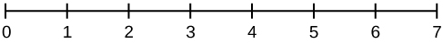
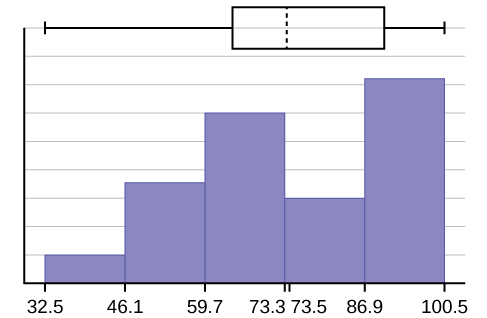
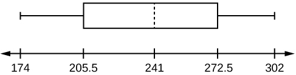

An important characteristic of any set of data is the variation in the data. In some data sets, the data values are concentrated closely near the mean; in other data sets, the data values are more widely spread out from the mean. The most common measure of variation, or spread, is the standard deviation. The **standard deviation**{: data-type="term"} is a number that measures how far data values are from their mean.

# The standard deviation

* provides a numerical measure of the overall amount of variation in a data set, and
* can be used to determine whether a particular data value is close to or far from the mean.

## The standard deviation provides a measure of the overall variation in a data set

The standard deviation is always positive or zero. The standard deviation is small when the data are all concentrated close to the mean, exhibiting little variation or spread. The standard deviation is larger when the data values are more spread out from the mean, exhibiting more variation.

Suppose that we are studying the amount of time customers wait in line at the checkout at supermarket *A* and supermarket *B*. the average wait time at both supermarkets is five minutes. At supermarket *A*, the standard deviation for the wait time is two minutes; at supermarket *B* the standard deviation for the wait time is four minutes.

Because supermarket *B* has a higher standard deviation, we know that there is more variation in the wait times at supermarket *B*. Overall, wait times at supermarket *B* are more spread out from the average; wait times at supermarket *A* are more concentrated near the average.

## The standard deviation can be used to determine whether a data value is close to or far from the mean.

Suppose that Rosa and Binh both shop at supermarket *A*. Rosa waits at the checkout counter for seven minutes and Binh waits for one minute. At supermarket *A*, the mean waiting time is five minutes and the standard deviation is two minutes. The standard deviation can be used to determine whether a data value is close to or far from the mean.

**Rosa waits for seven minutes:**

* Seven is two minutes longer than the average of five; two minutes is equal to one standard deviation.
* Rosa\'s wait time of seven minutes is **two minutes longer than the average** of five minutes.
* Rosa\'s wait time of seven minutes is **one standard deviation above the average** of five minutes.

**Binh waits for one minute.**

* One is four minutes less than the average of five; four minutes is equal to two standard deviations.
* Binh\'s wait time of one minute is **four minutes less than the average** of five minutes.
* Binh\'s wait time of one minute is **two standard deviations below the average** of five minutes.
* A data value that is two standard deviations from the average is just on the borderline for what many statisticians would consider to be far from the average. Considering data to be far from the mean if it is more than two standard deviations away is more of an approximate \"rule of thumb\" than a rigid rule. In general, the shape of the distribution of the data affects how much of the data is further away than two standard deviations. (You will learn more about this in later chapters.)

The number line may help you understand standard deviation. If we were to put five and seven on a number line, seven is to the right of five. We say, then, that seven is **one** standard deviation to the **right** of five because 5 + (1)(2) = 7.

If one were also part of the data set, then one is **two** standard deviations to the **left** of five because 5 + (–2)(2) = 1.

{: data-media-type="image/jpg" data-print-width="2.5in"}

* In general, a **value = mean + (#ofSTDEV)(standard deviation)**
* where #ofSTDEVs = the number of standard deviations
* \#ofSTDEV does not need to be an integer
* One is **two standard deviations less than the mean** of five because: 1 = 5 + (–2)(2).

The equation **value = mean + (#ofSTDEVs)(standard deviation)** can be expressed for a sample and for a population. **sample:** <math xmlns="http://www.w3.org/1998/Math/MathML"> <mrow> <mi>x</mi><mtext> = </mtext><mover accent="true"> <mi>x</mi> <mo>¯</mo> </mover> <mtext> + </mtext><mo stretchy="false">(</mo><mo>#</mo><mi>o</mi><mi>f</mi><mi>S</mi><mi>T</mi><mi>D</mi><mi>E</mi><mi>V</mi><mo stretchy="false">)</mo><mo stretchy="false">(</mo><mi>s</mi><mo stretchy="false">)</mo> </mrow> </math>
 **Population:** <math xmlns="http://www.w3.org/1998/Math/MathML"> <mrow> <mi>x</mi><mo>=</mo><mi>μ</mi><mo>+</mo><mo stretchy="false">(</mo><mo>#</mo><mi>o</mi><mi>f</mi><mi>S</mi><mi>T</mi><mi>D</mi><mi>E</mi><mi>V</mi><mo stretchy="false">)</mo><mo stretchy="false">(</mo><mi>σ</mi><mo stretchy="false">)</mo> </mrow> </math>
   The lower case letter *s* represents the sample standard deviation and the Greek letter *σ* (sigma, lower case) represents the population standard deviation. * * *
{: data-type="newline"}

 * * *
{: data-type="newline"}

 The symbol <math xmlns="http://www.w3.org/1998/Math/MathML"> <apply> <conjugate /> <ci>x</ci> </apply> </math>

 is the sample mean and the Greek symbol <math xmlns="http://www.w3.org/1998/Math/MathML"><mi>μ</mi></math>

 is the population mean.

## Calculating the Standard Deviation

If *x* is a number, then the difference \"*x* – mean\" is called its **deviation**. In a data set, there are as many deviations as there are items in the data set. The deviations are used to calculate the standard deviation. If the numbers belong to a population, in symbols a deviation is *x* – *μ*. For sample data, in symbols a deviation is *x* – <math xmlns="http://www.w3.org/1998/Math/MathML"> <mover accent="true"> <mi>x</mi> <mo>¯</mo> </mover> </math>

.

The procedure to calculate the standard deviation depends on whether the numbers are the entire population or are data from a sample. The calculations are similar, but not identical. Therefore the symbol used to represent the standard deviation depends on whether it is calculated from a population or a sample. The lower case letter s represents the sample standard deviation and the Greek letter *σ* (sigma, lower case) represents the population standard deviation. If the sample has the same characteristics as the population, then s should be a good estimate of *σ*.

To calculate the standard deviation, we need to calculate the variance first. The **variance**{: data-type="term"} is the **average of the squares of the deviations** (the *x* – <math xmlns="http://www.w3.org/1998/Math/MathML"> <mover accent="true"> <mi>x</mi> <mo>¯</mo> </mover> </math>

 values for a sample, or the *x* – *μ* values for a population). The symbol *σ*2 represents the population variance; the population standard deviation *σ* is the square root of the population variance. The symbol *s*2 represents the sample variance; the sample standard deviation *s* is the square root of the sample variance. You can think of the standard deviation as a special average of the deviations.

If the numbers come from a census of the entire **population** and not a sample, when we calculate the average of the squared deviations to find the variance, we divide by *N*, the number of items in the population. If the data are from a **sample** rather than a population, when we calculate the average of the squared deviations, we divide by ***n* – 1**, one less than the number of items in the sample.

## Formulas for the Sample Standard Deviation

* <math xmlns="http://www.w3.org/1998/Math/MathML"> <mrow> <mi>s</mi><mo>=</mo><msqrt> <mrow> <mfrac> <mrow> <mi>Σ</mi><msup> <mrow> <mo stretchy="false">(</mo><mi>x</mi> <mo>−</mo> <mover accent="true"> <mi>x</mi> <mo>¯</mo> </mover> <mo stretchy="false">)</mo> </mrow> <mn>2</mn> </msup> </mrow> <mrow> <mi>n</mi><mo>−</mo><mn>1</mn> </mrow> </mfrac> </mrow> </msqrt> </mrow> </math>
  
  or
  <math xmlns="http://www.w3.org/1998/Math/MathML"> <mrow> <mi>s</mi><mo>=</mo><msqrt> <mrow> <mfrac> <mrow> <mi>Σ</mi><mi>f</mi><msup> <mrow> <mo stretchy="false">(</mo><mi>x</mi><mo>−</mo><mover accent="true"> <mi>x</mi> <mo>¯</mo> </mover> <mo stretchy="false">)</mo> </mrow> <mn>2</mn> </msup> </mrow> <mrow> <mi>n</mi><mo>−</mo><mn>1</mn> </mrow> </mfrac> </mrow> </msqrt> </mrow> </math>

* For the sample standard deviation, the denominator is ***n* - 1**, that is the sample size MINUS 1.

## Formulas for the Population Standard Deviation

* <math xmlns="http://www.w3.org/1998/Math/MathML"> <mrow> <mi>σ</mi> <mo> </mo><mo>=</mo><mo> </mo><msqrt> <mrow> <mfrac> <mrow> <mi>Σ</mi><msup> <mrow> <mo stretchy="false">(</mo><mi>x</mi><mo>−</mo><mi>μ</mi><mo stretchy="false">)</mo> </mrow> <mn>2</mn> </msup> </mrow> <mi>N</mi> </mfrac> </mrow> </msqrt> </mrow> </math>
  
  or
  <math xmlns="http://www.w3.org/1998/Math/MathML"> <mrow> <mi>σ</mi> <mo> </mo><mo>=</mo><mo> </mo><msqrt> <mrow> <mfrac> <mrow> <mi>Σ</mi><mi>f</mi><msup> <mrow> <mo stretchy="false">(</mo><mi>x</mi><mo>–</mo><mi>μ</mi><mo stretchy="false">)</mo> </mrow> <mn>2</mn> </msup> </mrow> <mi>N</mi> </mfrac> </mrow> </msqrt> </mrow> </math>

* For the population standard deviation, the denominator is *N*, the number of items in the population.

In these formulas, *f* represents the frequency with which a value appears. For example, if a value appears once, *f* is one. If a value appears three times in the data set or population, *f* is three.

# Sampling Variability of a Statistic

The statistic of a sampling distribution was discussed in [Descriptive Statistics: Measuring the Center of the Data](/m46928). How much the statistic varies from one sample to another is known as the **sampling variability of a statistic**{: data-type="term"}. You typically measure the sampling variability of a statistic by its standard error. The **standard error of the mean** is an example of a standard error. It is a special standard deviation and is known as the standard deviation of the sampling distribution of the mean. You will cover the standard error of the mean in the chapter [The Central Limit Theorem](/m46983) (not now). The notation for the standard error of the mean is <math xmlns="http://www.w3.org/1998/Math/MathML"> <mrow> <mfrac> <mi>σ</mi> <mrow> <msqrt> <mi>n</mi> </msqrt> </mrow> </mfrac> </mrow> </math>

 where *σ* is the standard deviation of the population and n is the size of the sample.

NOTE

**In practice, USE A CALCULATOR OR COMPUTER SOFTWARE TO CALCULATE THE STANDARD DEVIATION. If you are using a TI-83, 83+, 84+ calculator, you need to select the appropriate standard deviation *σx* or *sx* from the summary statistics.** We will concentrate on using and interpreting the information that the standard deviation gives us. However you should study the following step-by-step example to help you understand how the standard deviation measures variation from the mean. (The calculator instructions appear at the end of this example.)

In a fifth grade class, the teacher was interested in the average age and the sample standard deviation of the ages of her students. The following data are the ages for a SAMPLE of *n* = 20 fifth grade students. The ages are rounded to the nearest half year:

9; 9.5; 9.5; 10; 10; 10; 10; 10.5; 10.5; 10.5; 10.5; 11; 11; 11; 11; 11; 11; 11.5; 11.5; 11.5;

<math xmlns="http://www.w3.org/1998/Math/MathML"> <mrow> <mover accent="true"> <mi>x</mi> <mo>¯</mo> </mover> <mo>=</mo><mfrac> <mrow> <mtext>9 + 9</mtext><mtext>.5(2) + 10(4) + 10</mtext><mtext>.5(4) + 11(6) + 11</mtext><mtext>.5(3)</mtext> </mrow> <mrow> <mn>20</mn> </mrow> </mfrac> <mo>=</mo><mn>10.525</mn> </mrow> </math>

The average age is 10.53 years, rounded to two places.

The variance may be calculated by using a table. Then the standard deviation is calculated by taking the square root of the variance. We will explain the parts of the table after calculating *s*.

| Data | Freq. | Deviations | *Deviations*2 | (Freq.)(*Deviations*2) |
|----------
| *x* | *f* | (*x* – <math xmlns="http://www.w3.org/1998/Math/MathML"> <mover accent="true"> <mi>x</mi> <mo>¯</mo> </mover> </math>

) | (*x* – <math xmlns="http://www.w3.org/1998/Math/MathML"> <mover accent="true"> <mi>x</mi> <mo>¯</mo> </mover> </math>

)2 | (*f*)(*x* – <math xmlns="http://www.w3.org/1998/Math/MathML"> <mover accent="true"> <mi>x</mi> <mo>¯</mo> </mover> </math>

)2 |
| 9 | 1 | 9 – 10.525 = –1.525 | (–1.525)2 = 2.325625 | 1 × 2.325625 = 2.325625 |
| 9.5 | 2 | 9.5 – 10.525 = –1.025 | (–1.025)2 = 1.050625 | 2 × 1.050625 = 2.101250 |
| 10 | 4 | 10 – 10.525 = –0.525 | (–0.525)2 = 0.275625 | 4 × 0.275625 = 1.1025 |
| 10.5 | 4 | 10.5 – 10.525 = –0.025 | (–0.025)2 = 0.000625 | 4 × 0.000625 = 0.0025 |
| 11 | 6 | 11 – 10.525 = 0.475 | (0.475)2 = 0.225625 | 6 × 0.225625 = 1.35375 |
| 11.5 | 3 | 11.5 – 10.525 = 0.975 | (0.975)2 = 0.950625 | 3 × 0.950625 = 2.851875 |
|  |  |  |  | The total is 9.7375 |
{: #element-978 summary="This table presents the formulas and calculations of various values. The first column has the data, second column has frequency, third column has deviations, fourth column has deviations squared, fifth column has frequency times deviations squared. There are 6 rows of values."}

The sample variance, *s*2, is equal to the sum of the last column (9.7375) divided by the total number of data values minus one (20 – 1):

<math xmlns="http://www.w3.org/1998/Math/MathML"> <mrow> <msup> <mi>s</mi> <mn>2</mn> </msup> <mo>=</mo><mfrac> <mrow> <mn>9.7375</mn> </mrow> <mrow> <mn>20</mn><mo>−</mo><mn>1</mn> </mrow> </mfrac> <mo>=</mo><mn>0.5125</mn> </mrow> </math>

The **sample standard deviation** *s* is equal to the square root of the sample variance:

<math xmlns="http://www.w3.org/1998/Math/MathML"> <mrow> <mi>s</mi><mo>=</mo><msqrt> <mrow> <mn>0.5125</mn> </mrow> </msqrt> <mo>=</mo><mn>0.715891</mn><mo>,</mo> </mrow> </math>

 which is rounded to two decimal places, *s* = 0.72.

**Typically, you do the calculation for the standard deviation on your calculator or computer**. The intermediate results are not rounded. This is done for accuracy.

For the following problems, recall that **value = mean + (#ofSTDEVs)(standard deviation)**. Verify the mean and standard deviation or a calculator or computer. For a sample: *x* = <math xmlns="http://www.w3.org/1998/Math/MathML"> <mover accent="true"> <mi>x</mi> <mo>¯</mo> </mover> </math>
 + (#ofSTDEVs)(*s*) For a population: *x* = *μ* + (#ofSTDEVs)(*σ*) For this example, use *x* = <math xmlns="http://www.w3.org/1998/Math/MathML"> <mover accent="true"> <mi>x</mi> <mo>¯</mo> </mover> </math>
 + (#ofSTDEVs)(*s*) because the data is from a sample 

1.  Verify the mean and standard deviation on your calculator or computer.
2.  Find the value that is one standard deviation above the mean. Find (
    <math xmlns="http://www.w3.org/1998/Math/MathML"> <mover accent="true"> <mi>x</mi> <mo>¯</mo> </mover> </math>
    
    \+ 1s).
3.  Find the value that is two standard deviations below the mean. Find (
    <math xmlns="http://www.w3.org/1998/Math/MathML"> <mover accent="true"> <mi>x</mi> <mo>¯</mo> </mover> </math>
    
    – 2s).
4.  Find the values that are 1.5 standard deviations **from** (below and above) the mean.
{: data-number-style="lower-alpha"}

1.  

    * Clear lists L1 and L2. Press STAT 4:ClrList. Enter 2nd 1 for L1, the comma (,), and 2nd 2 for L2.
    * Enter data into the list editor. Press STAT 1:EDIT. If necessary, clear the lists by arrowing up into the name. Press CLEAR and arrow down.
    * Put the data values (9, 9.5, 10, 10.5, 11, 11.5) into list L1 and the frequencies (1, 2, 4, 4, 6, 3) into list L2. Use the arrow keys to move around.
    * Press STAT and arrow to CALC. Press 1:1-VarStats and enter L1 (2nd 1), L2 (2nd 2). Do not forget the comma. Press ENTER.
    * <math xmlns="http://www.w3.org/1998/Math/MathML"> <mover accent="true"> <mi>x</mi> <mo>¯</mo> </mover> </math>
      
      = 10.525
    * Use Sx because this is sample data (not a population): Sx=0.715891
    
    

2.  (
    <math xmlns="http://www.w3.org/1998/Math/MathML"> <mover accent="true"> <mi>x</mi> <mo>¯</mo> </mover> </math>
    
    \+ 1s) = 10.53 + (1)(0.72) = 11.25
3.  (
    <math xmlns="http://www.w3.org/1998/Math/MathML"> <mover accent="true"> <mi>x</mi> <mo>¯</mo> </mover> </math>
    
    – 2*s*) = 10.53 – (2)(0.72) = 9.09
4.  * (
      <math xmlns="http://www.w3.org/1998/Math/MathML"> <mover accent="true"> <mi>x</mi> <mo>¯</mo> </mover> </math>
      
      – 1.5*s*) = 10.53 – (1.5)(0.72) = 9.45
    * (
      <math xmlns="http://www.w3.org/1998/Math/MathML"> <mover accent="true"> <mi>x</mi> <mo>¯</mo> </mover> </math>
      
      \+ 1.5*s*) = 10.53 + (1.5)(0.72) = 11.61
{: data-number-style="lower-alpha"}

Try It

On a baseball team, the ages of each of the players are as follows:

21; 21; 22; 23; 24; 24; 25; 25; 28; 29; 29; 31; 32; 33; 33; 34; 35; 36; 36; 36; 36; 38; 38; 38; 40

* * *
{: data-type="newline"}

Use your calculator or computer to find the mean and standard deviation. Then find the value that is two standard deviations above the mean.

*μ* = 30.68

*s* = 6.09 * * *
{: data-type="newline"}

(<math xmlns="http://www.w3.org/1998/Math/MathML"> <mover accent="true"> <mi>x</mi> <mo>¯</mo> </mover> </math>

 + 2*s*) = 30.68 + (2)(6.09) = 42.86.

## Explanation of the standard deviation calculation shown in the table

The deviations show how spread out the data are about the mean. The data value 11.5 is farther from the mean than is the data value 11 which is indicated by the deviations 0.97 and 0.47. A positive deviation occurs when the data value is greater than the mean, whereas a negative deviation occurs when the data value is less than the mean. The deviation is –1.525 for the data value nine. **If you add the deviations, the sum is always zero**. (For [\[link\]](#element-655), there are *n* = 20 deviations.) So you cannot simply add the deviations to get the spread of the data. By squaring the deviations, you make them positive numbers, and the sum will also be positive. The variance, then, is the average squared deviation.

The variance is a squared measure and does not have the same units as the data. Taking the square root solves the problem. The standard deviation measures the spread in the same units as the data.

Notice that instead of dividing by *n* = 20, the calculation divided by *n* – 1 = 20 – 1 = 19 because the data is a sample. For the **sample** variance, we divide by the sample size minus one (*n* – 1). Why not divide by *n*? The answer has to do with the population variance. **The sample variance is an estimate of the population variance.** Based on the theoretical mathematics that lies behind these calculations, dividing by (*n* – 1) gives a better estimate of the population variance.

NOTE

Your concentration should be on what the standard deviation tells us about the data. The standard deviation is a number which measures how far the data are spread from the mean. Let a calculator or computer do the arithmetic.

The standard deviation, *s* or *σ*, is either zero or larger than zero. When the standard deviation is zero, there is no spread; that is, the all the data values are equal to each other. The standard deviation is small when the data are all concentrated close to the mean, and is larger when the data values show more variation from the mean. When the standard deviation is a lot larger than zero, the data values are very spread out about the mean; outliers can make *s* or *σ* very large.

The standard deviation, when first presented, can seem unclear. By graphing your data, you can get a better \"feel\" for the deviations and the standard deviation. You will find that in symmetrical distributions, the standard deviation can be very helpful but in skewed distributions, the standard deviation may not be much help. The reason is that the two sides of a skewed distribution have different spreads. In a skewed distribution, it is better to look at the first quartile, the median, the third quartile, the smallest value, and the largest value. Because numbers can be confusing, **always graph your data**. Display your data in a histogram or a box plot.

Use the following data (first exam scores) from Susan Dean's spring pre-calculus class:

33; 42; 49; 49; 53; 55; 55; 61; 63; 67; 68; 68; 69; 69; 72; 73; 74; 78; 80; 83; 88; 88; 88; 90; 92; 94; 94; 94; 94; 96; 100

1.  Create a chart containing the data, frequencies, relative frequencies, and cumulative relative frequencies to three decimal places.
2.  {: .finger} Calculate the following to one decimal place using a TI-83+ or TI-84 calculator:
    1.  The sample mean
    2.  The sample standard deviation
    3.  The median
    4.  The first quartile
    5.  The third quartile
    6.  *IQR*
    {: data-number-style="lower-roman"}

3.  Construct a box plot and a histogram on the same set of axes. Make comments about the box plot, the histogram, and the chart.
{: data-number-style="lower-alpha"}

1.  See [[link]](#id6947804)
2.  1.  The sample mean = 73.5
    2.  The sample standard deviation = 17.9
    3.  The median = 73
    4.  The first quartile = 61
    5.  The third quartile = 90
    6.  *IQR* = 90 – 61 = 29
    {: data-number-style="lower-roman"}

3.  The *x*-axis goes from 32.5 to 100.5; *y*-axis goes from –2.4 to 15 for the histogram. The number of intervals is five, so the width of an interval is (100.5 – 32.5) divided by five, is equal to 13.6. Endpoints of the intervals are as follows: the starting point is 32.5, 32.5 + 13.6 = 46.1, 46.1 + 13.6 = 59.7, 59.7 + 13.6 = 73.3, 73.3 + 13.6 = 86.9, 86.9 + 13.6 = 100.5 = the ending value; No data values fall on an interval boundary.
{: data-number-style="lower-alpha"}

{: #id6380826 data-media-type="image/jpg"}

The long left whisker in the box plot is reflected in the left side of the histogram. The spread of the exam scores in the lower 50% is greater (73 – 33 = 40) than the spread in the upper 50% (100 – 73 = 27). The histogram, box plot, and chart all reflect this. There are a substantial number of A and B grades (80s, 90s, and 100). The histogram clearly shows this. The box plot shows us that the middle 50% of the exam scores (*IQR* = 29) are Ds, Cs, and Bs. The box plot also shows us that the lower 25% of the exam scores are Ds and Fs.

| Data | Frequency | Relative Frequency | Cumulative Relative Frequency |
|----------
| 33 | 1 | 0.032 | 0.032 |
| 42 | 1 | 0.032 | 0.064 |
| 49 | 2 | 0.065 | 0.129 |
| 53 | 1 | 0.032 | 0.161 |
| 55 | 2 | 0.065 | 0.226 |
| 61 | 1 | 0.032 | 0.258 |
| 63 | 1 | 0.032 | 0.29 |
| 67 | 1 | 0.032 | 0.322 |
| 68 | 2 | 0.065 | 0.387 |
| 69 | 2 | 0.065 | 0.452 |
| 72 | 1 | 0.032 | 0.484 |
| 73 | 1 | 0.032 | 0.516 |
| 74 | 1 | 0.032 | 0.548 |
| 78 | 1 | 0.032 | 0.580 |
| 80 | 1 | 0.032 | 0.612 |
| 83 | 1 | 0.032 | 0.644 |
| 88 | 3 | 0.097 | 0.741 |
| 90 | 1 | 0.032 | 0.773 |
| 92 | 1 | 0.032 | 0.805 |
| 94 | 4 | 0.129 | 0.934 |
| 96 | 1 | 0.032 | 0.966 |
| 100 | 1 | 0.032 | 0.998 (Why isn\'t this value 1?) |
{: #id6947804 summary="This table presents the values listed above arranged with the data in the first column, frequency in the second column, relative frequency in the third column, and cumulative relative frequency in the fourth column."}

Try It

The following data show the different types of pet food stores in the area carry. * * *
{: data-type="newline"}

6; 6; 6; 6; 7; 7; 7; 7; 7; 8; 9; 9; 9; 9; 10; 10; 10; 10; 10; 11; 11; 11; 11; 12; 12; 12; 12; 12; 12; * * *
{: data-type="newline"}

Calculate the sample mean and the sample standard deviation to one decimal place using a TI-83+ or TI-84 calculator.

*μ* = 9.3

*s* = 2.2

# Standard deviation of Grouped Frequency Tables

Recall that for grouped data we do not know individual data values, so we cannot describe the typical value of the data with precision. In other words, we cannot find the exact mean, median, or mode. We can, however, determine the best estimate of the measures of center by finding the mean of the grouped data with the formula: <math xmlns="http://www.w3.org/1998/Math/MathML"><mrow><mi>M</mi><mi>e</mi><mi>a</mi><mi>n</mi><mtext> </mtext><mi>o</mi><mi>f</mi><mtext> </mtext><mi>F</mi><mi>r</mi><mi>e</mi><mi>q</mi><mi>u</mi><mi>e</mi><mi>n</mi><mi>c</mi><mi>y</mi><mtext> </mtext><mi>T</mi><mi>a</mi><mi>b</mi><mi>l</mi><mi>e</mi><mo>=</mo><mfrac><mrow> <mstyle displaystyle="true"> <mo>∑</mo> <mrow> <mi>f</mi><mi>m</mi> </mrow></mstyle></mrow><mrow> <mstyle displaystyle="true"> <mo>∑</mo> <mi>f</mi> </mstyle></mrow></mfrac></mrow> </math>

 * * *
{: data-type="newline"}

where <math xmlns="http://www.w3.org/1998/Math/MathML"> <mrow><mi>f</mi><mo>=</mo></mrow></math>

 interval frequencies and *m* = interval midpoints.

Just as we could not find the exact mean, neither can we find the exact standard deviation. Remember that standard deviation describes numerically the expected deviation a data value has from the mean. In simple English, the standard deviation allows us to compare how “unusual” individual data is compared to the mean.

Find the standard deviation for the data in [\[link\]](#fs-idm67330768).

| Class | Frequency, *f* | Midpoint, *m* | *m*2 | <math xmlns="http://www.w3.org/1998/Math/MathML"><mrow><mover accent="true"><mi>x</mi><mo stretchy="true">¯</mo> </mover></mrow> </math>

2 | *fm*2 | Standard Deviation |
|----------
| 0–2 | 1 | 1 | 1 | 7.58 | 1 | 3.5 |
| 3–5 | 6 | 4 | 16 | 7.58 | 96 | 3.5 |
| 6–8 | 10 | 7 | 49 | 7.58 | 490 | 3.5 |
| 9–11 | 7 | 10 | 100 | 7.58 | 700 | 3.5 |
| 12–14 | 0 | 13 | 169 | 7.58 | 0 | 3.5 |
| 15–17 | 2 | 16 | 256 | 7.58 | 512 | 3.5 |
{: summary=""}

For this data set, we have the mean, <math xmlns="http://www.w3.org/1998/Math/MathML"><mover accent="true"> <mi>x</mi> <mo>¯</mo> </mover></math>

 = 7.58 and the standard deviation, *sx* = 3.5. This means that a randomly selected data value would be expected to be 3.5 units from the mean. If we look at the first class, we see that the class midpoint is equal to one. This is almost two full standard deviations from the mean since 7.58 – 3.5 – 3.5 = 0.58. While the formula for calculating the standard deviation is not complicated, <math xmlns="http://www.w3.org/1998/Math/MathML"> <mrow> <msub> <mi>s</mi> <mi>x</mi> </msub> <mo>=</mo><msqrt> <mrow> <mfrac> <mrow> <mi>f</mi><msup> <mrow> <mo stretchy="false">(</mo><mi>m</mi><mo>−</mo><mover accent="true"> <mi>x</mi> <mo>¯</mo> </mover> <mo stretchy="false">)</mo> </mrow> <mn>2</mn> </msup> </mrow> <mrow> <mi>n</mi><mo>−</mo><mn>1</mn> </mrow> </mfrac> </mrow> </msqrt> </mrow> </math>

 where *sx* = sample standard deviation, <math xmlns="http://www.w3.org/1998/Math/MathML"> <mover accent="true"> <mi>x</mi> <mo>¯</mo> </mover> </math>

 = sample mean, the calculations are tedious. It is usually best to use technology when performing the calculations.

Try It

Find the standard deviation for the data from the previous example

| Class | Frequency, *f* |
|----------
| 0–2 | 1 |
| 3–5 | 6 |
| 6–8 | 10 |
| 9–11 | 7 |
| 12–14 | 0 |
| 15–17 | 2 |
{: summary=""}

First, press the **STAT** key and select **1:Edit**

{: data-media-type="image/jpg"}

Input the midpoint values into **L1** and the frequencies into **L2**

{: data-media-type="image/jpg"}

Select **STAT**, **CALC**, and **1: 1-Var Stats**

{: data-media-type="image/jpg"}

Select **2nd** then **1** then , **2nd** then **2 Enter**

{: data-media-type="image/jpg"}

You will see displayed both a population standard deviation, *σx*, and the sample standard deviation, *sx*.

# Comparing Values from Different Data Sets

The standard deviation is useful when comparing data values that come from different data sets. If the data sets have different means and standard deviations, then comparing the data values directly can be misleading.

* For each data value, calculate how many standard deviations away from its mean the value is.
* Use the formula: value = mean + (#ofSTDEVs)(standard deviation); solve for #ofSTDEVs.
* <math xmlns="http://www.w3.org/1998/Math/MathML"> <mrow> <mo>#</mo><mi>o</mi><mi>f</mi><mi>S</mi><mi>T</mi><mi>D</mi><mi>E</mi><mi>V</mi><mi>s</mi><mo>=</mo><mfrac> <mrow> <mtext>value – mean</mtext> </mrow> <mrow> <mtext>standard deviation</mtext> </mrow> </mfrac> </mrow> </math>

* Compare the results of this calculation.

\#ofSTDEVs is often called a \"*z*-score\"; we can use the symbol *z*. In symbols, the formulas become:

| Sample | <math xmlns="http://www.w3.org/1998/Math/MathML"><mi>x</mi></math>

 = <math xmlns="http://www.w3.org/1998/Math/MathML"> <apply> <conjugate /> <ci>x</ci> </apply> </math>

 + *zs* | <math xmlns="http://www.w3.org/1998/Math/MathML"> <mrow> <mi>z</mi><mo>=</mo><mfrac> <mrow> <mi>x</mi><mtext> </mtext><mo>−</mo><mtext> </mtext><mover accent="true"> <mi>x</mi> <mo>¯</mo> </mover> </mrow> <mi>s</mi> </mfrac> </mrow> </math>

 |
| Population | <math xmlns="http://www.w3.org/1998/Math/MathML"><mi>x</mi></math>

 = <math xmlns="http://www.w3.org/1998/Math/MathML"> <mi>μ</mi> </math>

 + *zσ* | <math xmlns="http://www.w3.org/1998/Math/MathML"> <mrow> <mi>z</mi><mo>=</mo><mfrac> <mrow> <mi>x</mi><mtext> </mtext><mo>−</mo><mtext> </mtext><mi>μ</mi> </mrow> <mi>σ</mi> </mfrac> </mrow> </math>

 |
{: #eip-329 summary="The table shows the z-score formula."}

Two students, John and Ali, from different high schools, wanted to find out who had the highest GPA when compared to his school. Which student had the highest GPA when compared to his school? | Student | GPA | School Mean GPA | School Standard Deviation |
|----------
| John | 2.85 | 3.0 | 0.7 |
| Ali | 77 | 80 | 10 |
{: #element-798 summary="This table provides two students and their GPAs. The first row represents John and the second row represents Ali. The first column lists students, second column lists GPA, third column lists school mean GPA, and the fourth column list the school standard deviation."}

For each student, determine how many standard deviations (#ofSTDEVs) his GPA is away from the average, for his school. Pay careful attention to signs when comparing and interpreting the answer.

<math xmlns="http://www.w3.org/1998/Math/MathML"> <mrow><mi>z</mi><mo>=</mo> <mo># of STDEVs</mo><mo>=</mo><mfrac> <mrow> <mtext>value </mtext><mo>–</mo><mtext>mean</mtext> </mrow> <mrow> <mtext>standard deviation</mtext> </mrow> </mfrac> <mo>=</mo><mfrac> <mrow> <mi>x</mi><mo>+</mo><mi>μ</mi> </mrow> <mi>σ</mi> </mfrac> </mrow> </math>

For John, <math xmlns="http://www.w3.org/1998/Math/MathML" display=""> <mrow> <mi>z</mi><mo>=</mo><mo>#</mo><mi>o</mi><mi>f</mi><mi>S</mi><mi>T</mi><mi>D</mi><mi>E</mi><mi>V</mi><mi>s</mi><mo>=</mo><mfrac> <mrow> <mn>2.85</mn><mo>–</mo><mn>3.0</mn> </mrow> <mrow> <mn>0.7</mn> </mrow> </mfrac> <mo>=</mo><mo>–</mo><mn>0.21</mn> </mrow> </math>

For Ali, <math xmlns="http://www.w3.org/1998/Math/MathML"> <mrow> <mi>z</mi><mo>=</mo><mo>#</mo><mi>o</mi><mi>f</mi><mi>S</mi><mi>T</mi><mi>D</mi><mi>E</mi><mi>V</mi><mi>s</mi><mo>=</mo><mfrac> <mrow> <mn>77</mn><mo>−</mo><mn>80</mn> </mrow> <mrow> <mn>10</mn> </mrow> </mfrac> <mo>=</mo><mo>−</mo><mn>0.3</mn> </mrow> </math>

John has the better GPA when compared to his school because his GPA is 0.21 standard deviations **below** his school's mean while Ali's GPA is 0.3 standard deviations **below** his school's mean.

John's *z*-score of –0.21 is higher than Ali's *z*-score of –0.3. For GPA, higher values are better, so we conclude that John has the better GPA when compared to his school.

Try It

Two swimmers, Angie and Beth, from different teams, wanted to find out who had the fastest time for the 50 meter freestyle when compared to her team. Which swimmer had the fastest time when compared to her team?

| Swimmer | Time (seconds) | Team Mean Time | Team Standard Deviation |
|----------
| Angie | 26.2 | 27.2 | 0.8 |
| Beth | 27.3 | 30.1 | 1.4 |
{: summary=""}

For Angie: *z* = <math xmlns="http://www.w3.org/1998/Math/MathML"> <mrow><mfrac><mrow> <mtext>26</mtext><mtext>.2 – 27</mtext><mtext>.2</mtext> </mrow><mrow><mtext>0</mtext><mtext>.8</mtext></mrow></mfrac> </mrow></math>

 = –1.25

For Beth: *z* = <math xmlns="http://www.w3.org/1998/Math/MathML"> <mrow> <mfrac> <mrow> <mtext>27</mtext><mtext>.3</mtext><mo>–</mo><mtext>30</mtext><mtext>.1</mtext> </mrow> <mrow> <mn>1.</mn><mtext>4</mtext> </mrow> </mfrac> </mrow> </math>

 = –2

The following lists give a few facts that provide a little more insight into what the standard deviation tells us about the distribution of the data.

For ANY data set, no matter what the distribution of the data is:

* At least 75% of the data is within two standard deviations of the mean.
* At least 89% of the data is within three standard deviations of the mean.
* At least 95% of the data is within 4.5 standard deviations of the mean.
* This is known as Chebyshev\'s Rule.

For data having a distribution that is BELL-SHAPED and SYMMETRIC:

* Approximately 68% of the data is within one standard deviation of the mean.
* Approximately 95% of the data is within two standard deviations of the mean.
* More than 99% of the data is within three standard deviations of the mean.
* This is known as the Empirical Rule.
* It is important to note that this rule only applies when the shape of the distribution of the data is bell-shaped and symmetric. We will learn more about this when studying the \"Normal\" or \"Gaussian\" probability distribution in later chapters.

# References

Data from Microsoft Bookshelf.

King, Bill.“Graphically Speaking.” Institutional Research, Lake Tahoe Community College. Available online at http://www.ltcc.edu/web/about/institutional-research (accessed April 3, 2013).

# Chapter Review

The standard deviation can help you calculate the spread of data. There are different equations to use if are calculating the standard deviation of a sample or of a population.

* The Standard Deviation allows us to compare individual data or classes to the data set mean numerically.
* *s* =
  <math xmlns="http://www.w3.org/1998/Math/MathML"> <mrow> <msqrt> <mrow> <mfrac> <mrow> <msup> <mstyle mathsize="140%" displaystyle="true"><mo>∑</mo></mstyle> <mtext>​</mtext> </msup> <msup> <mrow> <mo stretchy="false">(</mo><mi>x</mi><mo>−</mo><mover accent="true"> <mi>x</mi> <mo>¯</mo> </mover> <mo stretchy="false">)</mo> </mrow> <mn>2</mn> </msup> </mrow> <mrow> <mi>n</mi><mo>−</mo><mn>1</mn> </mrow> </mfrac> </mrow> </msqrt> </mrow> </math>
  
  or *s* =
  <math xmlns="http://www.w3.org/1998/Math/MathML"> <mrow> <msqrt> <mrow> <mfrac> <mrow> <msup> <mstyle mathsize="140%" displaystyle="true"><mo>∑</mo></mstyle> <mtext>​</mtext> </msup> <mi>f</mi><msup> <mrow> <mo stretchy="false">(</mo><mi>x</mi><mo>−</mo><mover accent="true"> <mi>x</mi> <mo>¯</mo> </mover> <mo stretchy="false">)</mo> </mrow> <mn>2</mn> </msup> </mrow> <mrow> <mi>n</mi><mo>−</mo><mn>1</mn> </mrow> </mfrac> </mrow> </msqrt> </mrow> </math>
  
  is the formula for calculating the standard deviation of a sample. To calculate the standard deviation of a population, we would use the population mean, *μ*, and the formula *σ* =
  <math xmlns="http://www.w3.org/1998/Math/MathML"> <mrow> <msqrt> <mrow> <mfrac> <mrow> <msup> <mstyle mathsize="140%" displaystyle="true"><mo>∑</mo></mstyle> <mtext>​</mtext> </msup> <msup> <mrow> <mo stretchy="false">(</mo><mi>x</mi><mo>−</mo><mi>μ</mi><mo stretchy="false">)</mo> </mrow> <mn>2</mn> </msup> </mrow> <mi>N</mi> </mfrac> </mrow> </msqrt> </mrow> </math>
  
  or *σ* =
  <math xmlns="http://www.w3.org/1998/Math/MathML"> <mrow> <msqrt> <mrow> <mfrac> <mrow> <msup> <mstyle mathsize="140%" displaystyle="true"><mo>∑</mo></mstyle> <mtext>​</mtext> </msup> <mi>f</mi><msup> <mrow> <mo stretchy="false">(</mo><mi>x</mi><mo>−</mo><mi>μ</mi><mo stretchy="false">)</mo> </mrow> <mn>2</mn> </msup> </mrow> <mi>N</mi> </mfrac> </mrow> </msqrt> </mrow> </math>
  
  .

# Formula Review

<math xmlns="http://www.w3.org/1998/Math/MathML"><mrow><msub><mi>s</mi> <mi>x</mi></msub><mo>=</mo><msqrt><mrow> <mfrac><mrow><mstyle displaystyle="true"><mo>∑</mo> <mrow> <mi>f</mi><msup><mi>m</mi><mn>2</mn> </msup></mrow></mstyle></mrow><mi>n</mi> </mfrac><mo>−</mo><msup><mrow> <mover accent="true"><mi>x</mi> <mo stretchy="true">¯</mo></mover></mrow> <mn>2</mn></msup></mrow> </msqrt></mrow></math>

 where <math xmlns="http://www.w3.org/1998/Math/MathML"><mtable columnalign="left"><mtr><mtd> <msub><mi>s</mi><mi>x</mi></msub> <mo>=</mo><mtext> sample standard deviation</mtext> </mtd></mtr><mtr><mtd><mover accent="true"><mi>x</mi> <mo stretchy="true">¯</mo> </mover><mtext> = sample mean</mtext> </mtd></mtr></mtable></math>

# 

*Use the following information to answer the next two exercises*\: The following data are the distances between 20 retail stores and a large distribution center. The distances are in miles. * * *
{: data-type="newline"}

29; 37; 38; 40; 58; 67; 68; 69; 76; 86; 87; 95; 96; 96; 99; 106; 112; 127; 145; 150

Use a graphing calculator or computer to find the standard deviation and round to the nearest tenth.
{: .finger}

*s* = 34.5

Find the value that is one standard deviation below the mean.

Two baseball players, Fredo and Karl, on different teams wanted to find out who had the higher batting average when compared to his team. Which baseball player had the higher batting average when compared to his team?

| Baseball Player | Batting Average | Team Batting Average | Team Standard Deviation |
|----------
| Fredo | 0.158 | 0.166 | 0.012 |
| Karl | 0.177 | 0.189 | 0.015 |
{: summary=""}

For Fredo: *z* = <math xmlns="http://www.w3.org/1998/Math/MathML"> <mrow> <mfrac> <mrow> <mn>0.158</mn><mtext> – </mtext><mn>0.166</mn> </mrow> <mrow> <mn>0.012</mn> </mrow> </mfrac> </mrow> </math>

 = –0.67

For Karl: *z* = <math xmlns="http://www.w3.org/1998/Math/MathML"> <mrow> <mfrac> <mrow> <mn>0.177</mn><mtext> – </mtext><mn>0.189</mn> </mrow> <mrow> <mn>0.015</mn> </mrow> </mfrac> </mrow> </math>

 = –0.8

Fredo’s *z*-score of –0.67 is higher than Karl’s *z*-score of –0.8. For batting average, higher values are better, so Fredo has a better batting average compared to his team.

Use [[link]](#fs-idm133764640) to find the value that is three standard deviations:

* {: data-label="a"} above the mean
* {: data-label="b"} below the mean
{: data-labeled-item="true" data-mark-suffix="."}

* * *
{: data-type="newline"}

*Find the standard deviation for the following frequency tables using the formula. Check the calculations with the TI 83/84*.
{: .finger}

Find the standard deviation for the following frequency tables using the formula. Check the calculations with the TI 83/84.

1.  | Grade | Frequency |
    |----------
    | 49.5–59.5 | 2 |
    | 59.5–69.5 | 3 |
    | 69.5–79.5 | 8 |
    | 79.5–89.5 | 12 |
    | 89.5–99.5 | 5 |
    {: summary=""}

2.  | Daily Low Temperature | Frequency |
    |----------
    | 49.5–59.5 | 53 |
    | 59.5–69.5 | 32 |
    | 69.5–79.5 | 15 |
    | 79.5–89.5 | 1 |
    | 89.5–99.5 | 0 |
    {: summary=""}

3.  | Points per Game | Frequency |
    |----------
    | 49.5–59.5 | 14 |
    | 59.5–69.5 | 32 |
    | 69.5–79.5 | 15 |
    | 79.5–89.5 | 23 |
    | 89.5–99.5 | 2 |
    {: summary=""}
{: data-number-style="lower-alpha"}

1.  <math xmlns="http://www.w3.org/1998/Math/MathML"> <mrow><msub><mi>s</mi><mi>x</mi></msub> <mo>=</mo><msqrt><mrow><mfrac><mrow><mstyle displaystyle="true"><mo>∑</mo> <mrow> <mi>f</mi><msup><mi>m</mi><mn>2</mn></msup></mrow> </mstyle></mrow><mi>n</mi></mfrac><mo>−</mo><msup><mrow> <mover accent="true"><mi>x</mi><mo stretchy="true">¯</mo> </mover></mrow><mn>2</mn></msup></mrow></msqrt><mo>=</mo><msqrt><mrow> <mfrac><mrow><mn>193157.45</mn></mrow><mrow><mn>30</mn></mrow> </mfrac><mo>−</mo><msup><mrow><mn>79.5</mn></mrow><mn>2</mn> </msup></mrow></msqrt><mo>=</mo><mn>10.88</mn></mrow> </math>

2.  <math xmlns="http://www.w3.org/1998/Math/MathML"> <mrow><msub><mi>s</mi><mi>x</mi> </msub><mo>=</mo><msqrt><mrow><mfrac><mrow><mstyle displaystyle="true"><mo>∑</mo> <mrow><mi>f</mi><msup><mi>m</mi><mn>2</mn></msup></mrow></mstyle></mrow> <mi>n</mi></mfrac><mo>−</mo><msup><mrow> <mover accent="true"><mi>x</mi><mo stretchy="true">¯</mo></mover></mrow> <mn>2</mn></msup></mrow></msqrt> <mo>=</mo><msqrt><mrow><mfrac><mrow><mn>380945.3</mn></mrow><mrow> <mn>101</mn></mrow></mfrac><mo>−</mo><msup> <mrow><mn>60.94</mn></mrow><mn>2</mn></msup></mrow></msqrt><mo>=</mo><mn>7.62</mn></mrow></math>

3.  <math xmlns="http://www.w3.org/1998/Math/MathML"> <mrow><msub><mi>s</mi><mi>x</mi></msub> <mo>=</mo><msqrt><mrow><mfrac><mrow><mstyle displaystyle="true"> <mo>∑</mo> <mrow><mi>f</mi><msup><mi>m</mi> <mn>2</mn></msup></mrow></mstyle></mrow><mi>n</mi> </mfrac><mo>−</mo><msup><mrow><mover accent="true"> <mi>x</mi><mo stretchy="true">¯</mo></mover></mrow><mn>2</mn> </msup></mrow></msqrt><mo>=</mo><msqrt><mrow><mfrac><mrow><mn>440051.5</mn> </mrow><mrow><mn>86</mn></mrow></mfrac> <mo>−</mo><msup><mrow> <mn>70.66</mn></mrow><mn>2</mn></msup></mrow> </msqrt><mo>=</mo><mn>11.14</mn></mrow></math>
{: data-number-style="lower-alpha"}

# Homework

* * *
{: data-type="newline"}

 *Use the following information to answer the next nine exercises:* The population parameters below describe the full-time equivalent number of students (FTES) each year at Lake Tahoe Community College from 1976–1977 through 2004–2005.

* *μ* = 1000 FTES
* median = 1,014 FTES
* *σ* = 474 FTES
* first quartile = 528.5 FTES
* third quartile = 1,447.5 FTES
* *n* = 29 years

A sample of 11 years is taken. About how many are expected to have a FTES of 1014 or above? Explain how you determined your answer.

The median value is the middle value in the ordered list of data values. The median value of a set of 11 will be the 6th number in order. Six years will have totals at or below the median.

75% of all years have an FTES: at or below: \_\_\_\_\_ at or above: \_\_\_\_\_ 

The population standard deviation = \_\_\_\_\_

474 FTES

What percent of the FTES were from 528.5 to 1447.5? How do you know?

What is the *IQR*? What does the *IQR* represent?

919

How many standard deviations away from the mean is the median?

*Additional Information:* The population FTES for 2005–2006 through 2010–2011 was given in an updated report. The data are reported here.

| **Year** | 2005–06 | 2006–07 | 2007–08 | 2008–09 | 2009–10 | 2010–11 |
| **Total FTES** | 1,585 | 1,690 | 1,735 | 1,935 | 2,021 | 1,890 |
{: #eip-395 summary="This is a table of FTES for 2005-06 through 2010-2011."}

Calculate the mean, median, standard deviation, the first quartile, the third quartile and the *IQR*. Round to one decimal place.

* mean = 1,809.3
* median = 1,812.5
* standard deviation = 151.2
* first quartile = 1,690
* third quartile = 1,935
* *IQR* = 245

Construct a box plot for the FTES for 2005–2006 through 2010–2011 and a box plot for the FTES for 1976–1977 through 2004–2005.

Compare the *IQR* for the FTES for 1976–77 through 2004–2005 with the *IQR* for the FTES for 2005-2006 through 2010–2011. Why do you suppose the *IQR*s are so different?

Hint: Think about the number of years covered by each time period and what happened to higher education during those periods.

Three students were applying to the same graduate school. They came from schools with different grading systems. Which student had the best GPA when compared to other students at his school? Explain how you determined your answer.

| Student | GPA | School Average GPA | School Standard Deviation |
|----------
| Thuy | 2.7 | 3.2 | 0.8 |
| Vichet | 87 | 75 | 20 |
| Kamala | 8.6 | 8 | 0.4 |
{: #element-814 summary="This table presents three students and their GPAs. The first column lists the students, the second column lists the GPA, the third column lists the school average GPA, and the fourth column lists the school standard deviations. The first row represents Thuy, the second row represents Vichet, and the third row represents Kamala."}

A music school has budgeted to purchase three musical instruments. They plan to purchase a piano costing $3,000, a guitar costing $550, and a drum set costing $600. The mean cost for a piano is $4,000 with a standard deviation of $2,500. The mean cost for a guitar is $500 with a standard deviation of $200. The mean cost for drums is $700 with a standard deviation of $100. Which cost is the lowest, when compared to other instruments of the same type? Which cost is the highest when compared to other instruments of the same type. Justify your answer.

For pianos, the cost of the piano is 0.4 standard deviations BELOW the mean. For guitars, the cost of the guitar is 0.25 standard deviations ABOVE the mean. For drums, the cost of the drum set is 1.0 standard deviations BELOW the mean. Of the three, the drums cost the lowest in comparison to the cost of other instruments of the same type. The guitar costs the most in comparison to the cost of other instruments of the same type.

An elementary school class ran one mile with a mean of 11 minutes and a standard deviation of three minutes. Rachel, a student in the class, ran one mile in eight minutes. A junior high school class ran one mile with a mean of nine minutes and a standard deviation of two minutes. Kenji, a student in the class, ran 1 mile in 8.5 minutes. A high school class ran one mile with a mean of seven minutes and a standard deviation of four minutes. Nedda, a student in the class, ran one mile in eight minutes.

1.  Why is Kenji considered a better runner than Nedda, even though Nedda ran faster than he?
2.  Who is the fastest runner with respect to his or her class? Explain why.
{: data-mark-suffix="." data-number-style="lower-alpha"}

The most obese countries in the world have obesity rates that range from 11.4% to 74.6%. This data is summarized in [Table 14](#fs-idm115378592).

| Percent of Population Obese | Number of Countries |
|----------
| 11.4–20.45 | 29 |
| 20.45–29.45 | 13 |
| 29.45–38.45 | 4 |
| 38.45–47.45 | 0 |
| 47.45–56.45 | 2 |
| 56.45–65.45 | 1 |
| 65.45–74.45 | 0 |
| 74.45–83.45 | 1 |
{: summary=""}

What is the best estimate of the average obesity percentage for these countries? What is the standard deviation for the listed obesity rates? The United States has an average obesity rate of 33.9%. Is this rate above average or below? How “unusual” is the United States’ obesity rate compared to the average rate? Explain.

* <math xmlns="http://www.w3.org/1998/Math/MathML"> <mrow> <mover accent="true"> <mi>x</mi> <mo stretchy="true">¯</mo> </mover> <mo>=</mo><mn>23.32</mn> </mrow> </math>

* {: .finger} Using the TI 83/84, we obtain a standard deviation of:
  <math xmlns="http://www.w3.org/1998/Math/MathML"> <mrow> <msub> <mi>s</mi> <mi>x</mi> </msub> <mo>=</mo><mn>12.95.</mn> </mrow> </math>

* The obesity rate of the United States is 10.58% higher than the average obesity rate.
* Since the standard deviation is 12.95, we see that 23.32 + 12.95 = 36.27 is the obesity percentage that is one standard deviation from the mean. The United States obesity rate is slightly less than one standard deviation from the mean. Therefore, we can assume that the United States, while 34% obese, does not hav e an unusually high percentage of obese people.

[[link]](#fs-idm116546656) gives the percent of children under five considered to be underweight.

| Percent of Underweight Children | Number of Countries |
|----------
| 16–21.45 | 23 |
| 21.45–26.9 | 4 |
| 26.9–32.35 | 9 |
| 32.35–37.8 | 7 |
| 37.8–43.25 | 6 |
| 43.25–48.7 | 1 |
{: summary=""}

What is the best estimate for the mean percentage of underweight children? What is the standard deviation? Which interval(s) could be considered unusual? Explain.

# Bringing It Together

Twenty-five randomly selected students were asked the number of movies they watched the previous week. The results are as follows:

| # of movies | Frequency |
|----------
| 0 | 5 |
| 1 | 9 |
| 2 | 6 |
| 3 | 4 |
| 4 | 1 |
{: #element-681 summary="The table presents the number of movies 25 students watched in the previous week. The first column lists the number of movies from 0-4, the second column lists the frequency with the values of 5, 9, 6, 4, 1, the third column is for relative frequency and is blank, and the fourth column is for cumulative relative frequency and is blank."}

1.  Find the sample mean
    <math xmlns="http://www.w3.org/1998/Math/MathML"> <apply> <conjugate /> <ci>x</ci> </apply> </math>
    
    .
2.  Find the approximate sample standard deviation, *s*.
{: data-number-style="lower-alpha"}

1.  1\.48
2.  1\.12
{: data-number-style="lower-alpha"}

Forty randomly selected students were asked the number of pairs of sneakers they owned. Let *X* = the number of pairs of sneakers owned. The results are as follows:

| *X* | Frequency |
|----------
| 1 | 2 |
| 2 | 5 |
| 3 | 8 |
| 4 | 12 |
| 5 | 12 |
| 6 | 0 |
| 7 | 1 |
{: #element-130 summary="The table presents the number of pairs of sneakers forty students own. The first column lists the number of pairs of sneakers owned from 0-7, the second column lists the frequency, the third column is relative frequency and is blank, and the fourth column is cumulative relative frequency and is blank."}

1.  Find the sample mean
    <math xmlns="http://www.w3.org/1998/Math/MathML"><apply><conjugate /><ci>x</ci></apply></math>

2.  Find the sample standard deviation, *s*
3.  Construct a histogram of the data.
4.  Complete the columns of the chart.
5.  Find the first quartile.
6.  Find the median.
7.  Find the third quartile.
8.  Construct a box plot of the data.
9.  What percent of the students owned at least five pairs?
10. Find the 40th percentile.
11. Find the 90th percentile.
12. Construct a line graph of the data
13. Construct a stemplot of the data
{: data-mark-suffix="." data-number-style="lower-alpha"}

Following are the published weights (in pounds) of all of the team members of the San Francisco 49ers from a previous year.

177; 205; 210; 210; 232; 205; 185; 185; 178; 210; 206; 212; 184; 174; 185; 242; 188; 212; 215; 247; 241; 223; 220; 260; 245; 259; 278; 270; 280; 295; 275; 285; 290; 272; 273; 280; 285; 286; 200; 215; 185; 230; 250; 241; 190; 260; 250; 302; 265; 290; 276; 228; 265

1.  Organize the data from smallest to largest value.
2.  Find the median.
3.  Find the first quartile.
4.  Find the third quartile.
5.  Construct a box plot of the data.
6.  The middle 50% of the weights are from \_\_\_\_\_\_\_ to \_\_\_\_\_\_\_.
7.  If our population were all professional football players, would the above data be a sample of weights or the population of weights? Why?
8.  If our population included every team member who ever played for the San Francisco 49ers, would the above data be a sample of weights or the population of weights? Why?
9.  Assume the population was the San Francisco 49ers. Find:
    1.  the population mean, *μ*.
    2.  the population standard deviation, *σ*.
    3.  the weight that is two standard deviations below the mean.
    4.  When Steve Young, quarterback, played football, he weighed 205 pounds. How many standard deviations above or below the mean was he?
    {: data-mark-suffix="." data-number-style="lower-roman"}

10. That same year, the mean weight for the Dallas Cowboys was 240.08 pounds with a standard deviation of 44.38 pounds. Emmit Smith weighed in at 209 pounds. With respect to his team, who was lighter, Smith or Young? How did you determine your answer?
{: data-number-style="lower-alpha"}

1.  174; 177; 178; 184; 185; 185; 185; 185; 188; 190; 200; 205; 205; 206; 210; 210; 210; 212; 212; 215; 215; 220; 223; 228; 230; 232; 241; 241; 242; 245; 247; 250; 250; 259; 260; 260; 265; 265; 270; 272; 273; 275; 276; 278; 280; 280; 285; 285; 286; 290; 290; 295; 302
2.  241
3.  205\.5
4.  272\.5
5.   {: data-media-type="image/jpg" data-print-width="2.5in"} 
6.  205\.5, 272.5
7.  sample
8.  population
9.  1.  236\.34
    2.  37\.50
    3.  161\.34
    4.  0\.84 std. dev. below the mean
    {: data-mark-suffix="." data-number-style="lower-roman"}

10. Young
{: data-number-style="lower-alpha"}

One hundred teachers attended a seminar on mathematical problem solving. The attitudes of a representative sample of 12 of the teachers were measured before and after the seminar. A positive number for change in attitude indicates that a teacher's attitude toward math became more positive. The 12 change scores are as follows:

3 8–12 05–31–16 5–2

1.  What is the mean change score?
2.  What is the standard deviation for this population?
3.  What is the median change score?
4.  Find the change score that is 2.2 standard deviations below the mean.
{: data-mark-suffix="." data-number-style="lower-alpha"}

Refer to [[link]](#fs-idm70725344) determine which of the following are true and which are false. Explain your solution to each part in complete sentences.

![This shows three graphs. The first is a histogram with a mode of 3 and fairly symmetrical distribution between 1 (minimum value) and 5 (maximum value). The second graph is a histogram with peaks at 1 (minimum value) and 5 (maximum value) with 3 having the lowest frequency. The third graph is a box plot. The first whisker extends from 0 to 1. The box begins at the firs quartile, 1, and ends at the third quartile,6. A vertical, dashed line marks the median at 3. The second whisker extends from 6 on. ](../resources/fig-ch02_13_05.jpg){: data-media-type="image/jpg"}

1.  The medians for all three graphs are the same.
2.  We cannot determine if any of the means for the three graphs is different.
3.  The standard deviation for graph b is larger than the standard deviation for graph a.
4.  We cannot determine if any of the third quartiles for the three graphs is different.
{: data-number-style="lower-alpha"}

 True True True False

In a recent issue of the <cite>IEEE Spectrum</cite>, 84 engineering conferences were announced. Four conferences lasted two days. Thirty-six lasted three days. Eighteen lasted four days. Nineteen lasted five days. Four lasted six days. One lasted seven days. One lasted eight days. One lasted nine days. Let *X* = the length (in days) of an engineering conference.

1.  Organize the data in a chart.
2.  Find the median, the first quartile, and the third quartile.
3.  Find the 65th percentile.
4.  Find the 10th percentile.
5.  Construct a box plot of the data.
6.  The middle 50% of the conferences last from \_\_\_\_\_\_\_ days to \_\_\_\_\_\_\_ days.
7.  Calculate the sample mean of days of engineering conferences.
8.  Calculate the sample standard deviation of days of engineering conferences.
9.  Find the mode.
10. If you were planning an engineering conference, which would you choose as the length of the conference: mean; median; or mode? Explain why you made that choice.
11. Give two reasons why you think that three to five days seem to be popular lengths of engineering conferences.
{: data-mark-suffix="." data-number-style="lower-alpha"}

A survey of enrollment at 35 community colleges across the United States yielded the following figures:

6414; 1550; 2109; 9350; 21828; 4300; 5944; 5722; 2825; 2044; 5481; 5200; 5853; 2750; 10012; 6357; 27000; 9414; 7681; 3200; 17500; 9200; 7380; 18314; 6557; 13713; 17768; 7493; 2771; 2861; 1263; 7285; 28165; 5080; 11622

1.  Organize the data into a chart with five intervals of equal width. Label the two columns "Enrollment" and "Frequency."
2.  Construct a histogram of the data.
3.  If you were to build a new community college, which piece of information would be more valuable: the mode or the mean?
4.  Calculate the sample mean.
5.  Calculate the sample standard deviation.
6.  A school with an enrollment of 8000 would be how many standard deviations away from the mean?
{: data-mark-suffix="." data-number-style="lower-alpha"}

1.  | Enrollment | Frequency |
    |----------
    | 1000-5000 | 10 |
    | 5000-10000 | 16 |
    | 10000-15000 | 3 |
    | 15000-20000 | 3 |
    | 20000-25000 | 1 |
    | 25000-30000 | 2 |
    {: summary=""}

2.  Check student’s solution.
3.  mode
4.  8628\.74
5.  6943\.88
6.  –0.09
{: data-number-style="lower-alpha"}

* * *
{: data-type="newline"}

 *Use the following information to answer the next two exercises.* *X* = the number of days per week that 100 clients use a particular exercise facility.

| *x* | Frequency |
|----------
| 0 | 3 |
| 1 | 12 |
| 2 | 33 |
| 3 | 28 |
| 4 | 11 |
| 5 | 9 |
| 6 | 4 |
{: #element-813 summary="This table presents the number of days a week clients use a particular exercise facility. The first column lists the number of days from 0-6 and the second column lists the frequency."}

The 80th percentile is \_\_\_\_\_

1.  5
2.  80
3.  3
4.  4
{: data-mark-suffix="." data-number-style="lower-alpha"}

The number that is 1.5 standard deviations BELOW the mean is approximately \_\_\_\_\_

1.  0\.7
2.  4\.8
3.  –2.8
4.  Cannot be determined
{: data-mark-suffix="." data-number-style="lower-alpha"}

a

Suppose that a publisher conducted a survey asking adult consumers the number of fiction paperback books they had purchased in the previous month. The results are summarized in the [[link]](#table23).

| # of books | Freq. | Rel. Freq. |
|----------
| 0 | 18 |  |
| 1 | 24 |  |
| 2 | 24 |  |
| 3 | 22 |  |
| 4 | 15 |  |
| 5 | 10 |  |
| 7 | 5 |  |
| 9 | 1 |  |
{: #table23 summary="Publisher B is the table with number of books in the first column, from 0-5, 7, 9, frequency in the second column, and relative frequency in the third column which is blank."}

1.  Are there any outliers in the data? Use an appropriate numerical test involving the *IQR* to identify outliers, if any, and clearly state your conclusion.
2.  If a data value is identified as an outlier, what should be done about it?
3.  Are any data values further than two standard deviations away from the mean? In some situations, statisticians may use this criteria to identify data values that are unusual, compared to the other data values. (Note that this criteria is most appropriate to use for data that is mound-shaped and symmetric, rather than for skewed data.)
4.  Do parts a and c of this problem give the same answer?
5.  Examine the shape of the data. Which part, a or c, of this question gives a more appropriate result for this data?
6.  Based on the shape of the data which is the most appropriate measure of center for this data: mean, median or mode?
{: data-mark-suffix="." data-number-style="lower-alpha"}

