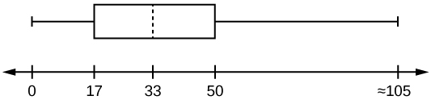

The common measures of location are **quartiles**{: data-type="term"} and **percentiles**{: data-type="term"}

Quartiles are special percentiles. The first quartile, *Q*1, is the same as the 25th percentile, and the third quartile, *Q*3, is the same as the 75th percentile. The median, *M*, is called both the second quartile and the 50th percentile.

To calculate quartiles and percentiles, the data must be ordered from smallest to largest. Quartiles divide ordered data into quarters. Percentiles divide ordered data into hundredths. To score in the 90th percentile of an exam does not mean, necessarily, that you received 90% on a test. It means that 90% of test scores are the same or less than your score and 10% of the test scores are the same or greater than your test score.

Percentiles are useful for comparing values. For this reason, universities and colleges use percentiles extensively. One instance in which colleges and universities use percentiles is when SAT results are used to determine a minimum testing score that will be used as an acceptance factor. For example, suppose Duke accepts SAT scores at or above the 75th percentile. That translates into a score of at least 1220.

Percentiles are mostly used with very large populations. Therefore, if you were to say that 90% of the test scores are less (and not the same or less) than your score, it would be acceptable because removing one particular data value is not significant.

The **median**{: data-type="term"} is a number that measures the \"center\" of the data. You can think of the median as the \"middle value,\" but it does not actually have to be one of the observed values. It is a number that separates ordered data into halves. Half the values are the same number or smaller than the median, and half the values are the same number or larger. For example, consider the following data. * * *
{: data-type="newline"}

1; 11.5; 6; 7.2; 4; 8; 9; 10; 6.8; 8.3; 2; 2; 10; 1 * * *
{: data-type="newline"}

Ordered from smallest to largest: * * *
{: data-type="newline"}

1; 1; 2; 2; 4; 6; 6.8; 7.2; 8; 8.3; 9; 10; 10; 11.5

Sincere there are 14 observations, the median is between the seventh value, 6.8, and the eighth value, 7.2. To find the median, add the two values together and divide by two.

<math xmlns="http://www.w3.org/1998/Math/MathML"> <apply> <eq /> <apply> <divide /> <apply> <plus /> <cn>6.8</cn> <cn>7.2</cn> </apply> <cn>2</cn> </apply> <cn>7</cn> </apply> </math>

The median is seven. Half of the values are smaller than seven and half of the values are larger than seven.

**Quartiles**{: data-type="term"} are numbers that separate the data into quarters. Quartiles may or may not be part of the data. To find the quartiles, first find the median or second quartile. The first quartile, *Q*1, is the middle value of the lower half of the data, and the third quartile, *Q*3, is the middle value, or median, of the upper half of the data. To get the idea, consider the same data set: * * *
{: data-type="newline"}

1; 1; 2; 2; 4; 6; 6.8; 7.2; 8; 8.3; 9; 10; 10; 11.5

The median or **second quartile** is seven. The lower half of the data are 1, 1, 2, 2, 4, 6, 6.8. The middle value of the lower half is two. * * *
{: data-type="newline"}

1; 1; 2; 2; 4; 6; 6.8

The number two, which is part of the data, is the **first quartile**{: data-type="term"}. One-fourth of the entire sets of values are the same or less than two and three-fourths of the values are more than two.

The upper half of the data is 7.2, 8, 8.3, 9, 10, 10, 11.5. The middle value of the upper half is nine.

The **third quartile**{: data-type="term"}, *Q*3, is nine. Three-fourths (75%) of the ordered data set are less than nine. One-fourth (25%) of the ordered data set are greater than nine. The third quartile is part of the data set in this example.

The **interquartile range**{: data-type="term"} is a number that indicates the spread of the middle half or the middle 50% of the data. It is the difference between the third quartile (*Q*3) and the first quartile (*Q*1).

*IQR* = *Q*3 – *Q*1

The *IQR* can help to determine potential **outliers**. **A value is suspected to be a potential outlier if it is less than (1.5)(*IQR*) below the first quartile or more than (1.5)(*IQR*) above the third quartile**. Potential outliers always require further investigation.

NOTE

A potential outlier is a data point that is significantly different from the other data points. These special data points may be errors or some kind of abnormality or they may be a key to understanding the data.

For the following 13 real estate prices, calculate the *IQR* and determine if any prices are potential outliers. Prices are in dollars. * * *
{: data-type="newline"}

389,950; 230,500; 158,000; 479,000; 639,000; 114,950; 5,500,000; 387,000; 659,000; 529,000; 575,000; 488,800; 1,095,000

Order the data from smallest to largest. * * *
{: data-type="newline"}

114,950; 158,000; 230,500; 387,000; 389,950; 479,000; 488,800; 529,000; 575,000; 639,000; 659,000; 1,095,000; 5,500,000

*M* = 488,800

*Q*1 = <math xmlns="http://www.w3.org/1998/Math/MathML"> <mrow> <mfrac> <mrow> <mtext>230,500 + 387,000</mtext> </mrow> <mn>2</mn> </mfrac> </mrow> </math>

 = 308,750

*Q*3 = <math xmlns="http://www.w3.org/1998/Math/MathML"> <mrow> <mfrac> <mrow> <mtext>639,000 + 659,000</mtext> </mrow> <mn>2</mn> </mfrac> </mrow> </math>

 = 340,250

*IQR* = 649,000 – 308,750 = 340,250

(1.5)(*IQR*) = (1.5)(340,0250) = 510,375

*Q*1 – (1.5)(*IQR*) = 308,750 – 510,375 = –201,625

*Q*3 + (1.5)(*IQR*) = 649,000 + 510,375 = 1,159,375

No house price is less than –201,625. However, 5,500,000 is more than 1,159,375. Therefore, 5,500,000 is a potential **outlier**{: data-type="term"}.

Try It

For the following 11 salaries, calculate the *IQR* and determine if any salaries are outliers. The salaries are in dollars.

 $33,000 $64,500 $28,000 $54,000 $72,000 $68,500 $69,000 $42,000 $54,000 $102,000 $40,500 

Order the data from smallest to largest.

 $28,000$33,000$40,500$42,000$54,000 $54,000$64,500$68,500$69,000$72,000 $120,000 

Median = $54,000

*Q*1 = $40,500

*Q*3 = $69,000

*IQR* = $69,000 – $40,500 = $28,500

(1.5)(*IQR*) = (1.5)($28,500) = $42,750

*Q*1 – (1.5)(*IQR*) = 28,000 – $42,750 = –$14,750

*Q*3 + (1.5)(*IQR*) = $69,000 + $42,750 = $111,750

No salary is less than –$14,750. However, $120,000 is more than $11,750, so $120,000 is a potential outlier.

For the two data sets in the [test scores example](#element-583), find the following:

1.  The interquartile range. Compare the two interquartile ranges.
2.  Any outliers in either set.
{: data-mark-suffix="." data-number-style="lower-alpha"}

The five number summary for the day and night classes is

|  | Minimum | *Q*1 | Median | *Q*3 | Maximum |
|----------
| **Day** | 32 | 56 | 74.5 | 82.5 | 99 |
| **Night** | 25.5 | 78 | 81 | 89 | 98 |
{: summary=""}

1.  The IQR for the day group is *Q*3 – *Q*1 = 82.5 – 56 = 26.5
    The IQR for the night group is *Q*3 – *Q*1 = 89 – 78 = 11
    
    The interquartile range (the spread or variability) for the day class is larger than the night class *IQR*. This suggests more variation will be found in the day class’s class test scores.

2.  Day class outliers are found using the IQR times 1.5 rule. So,
    * *Q*1 - *IQR*(1.5) = 56 – 26.5(1.5) = 16.25
    * *Q*3 + *IQR*(1.5) = 82.5 + 26.5(1.5) = 122.25
    {: data-labeled-item="true"}
    
    Since the minimum and maximum values for the day class are greater than 16.25 and less than 122.25, there are no outliers.
    
    Night class outliers are calculated as:
    
    * *Q*1 – *IQR* (1.5) = 78 – 11(1.5) = 61.5
    * *Q*3 + IQR(1.5) = 89 + 11(1.5) = 105.5
    {: data-labeled-item="true"}
    
    For this class, any test score less than 61.5 is an outlier. Therefore, the scores of 45 and 25.5 are outliers. Since no test score is greater than 105.5, there is no upper end outlier.
{: data-number-style="lower-alpha"}

Try It

Find the interquartile range for the following two data sets and compare them.

Test Scores for Class *A* * * *
{: data-type="newline"}

69; 96; 81; 79; 65; 76; 83; 99; 89; 67; 90; 77; 85; 98; 66; 91; 77; 69; 80; 94 * * *
{: data-type="newline"}

Test Scores for Class *B* * * *
{: data-type="newline"}

90; 72; 80; 92; 90; 97; 92; 75; 79; 68; 70; 80; 99; 95; 78; 73; 71; 68; 95; 100

Class *A*

Order the data from smallest to largest.

 65 66 67 69 69 76 77 77 79 80 81 83 85 89 90 91 94 96 98 99 

<math xmlns="http://www.w3.org/1998/Math/MathML"> <mrow> <mtext>Median</mtext><mo>=</mo><mfrac> <mrow> <mn>80</mn><mo>+</mo><mn>81</mn> </mrow> <mn>2</mn> </mfrac> <mo>=</mo><mn>80.5</mn> </mrow> </math>

<math xmlns="http://www.w3.org/1998/Math/MathML"> <mrow> <msub> <mi>Q</mi> <mn>1</mn> </msub> <mo>=</mo><mfrac> <mrow> <mn>69</mn><mo>+</mo><mn>76</mn> </mrow> <mn>2</mn> </mfrac> <mo>=</mo><mn>72.5</mn> </mrow> </math>

<math xmlns="http://www.w3.org/1998/Math/MathML"> <mrow> <msub> <mi>Q</mi> <mn>3</mn> </msub> <mo>=</mo><mfrac> <mrow> <mn>90</mn><mo>+</mo><mn>91</mn> </mrow> <mn>2</mn> </mfrac> <mo>=</mo><mn>90.5</mn> </mrow> </math>

*IQR* = 90.5 – 72.5 = 18

Class *B*

Order the data from smallest to largest.

 68 68 70 71 72 73 75 78 79 80 80 90 90 92 92 95 95 97 99 100 

<math xmlns="http://www.w3.org/1998/Math/MathML"> <mrow> <mtext>Median</mtext><mo>=</mo><mfrac> <mrow> <mn>80</mn><mo>+</mo><mn>80</mn> </mrow> <mn>2</mn> </mfrac> <mo>=</mo><mn>80</mn> </mrow> </math>

<math xmlns="http://www.w3.org/1998/Math/MathML"> <mrow> <msub> <mi>Q</mi> <mn>1</mn> </msub> <mo>=</mo><mfrac> <mrow> <mn>72</mn><mo>+</mo><mn>73</mn> </mrow> <mn>2</mn> </mfrac> <mo>=</mo><mn>72.5</mn> </mrow> </math>

<math xmlns="http://www.w3.org/1998/Math/MathML"> <mrow> <msub> <mi>Q</mi> <mn>3</mn> </msub> <mo>=</mo><mfrac> <mrow> <mn>92</mn><mo>+</mo><mn>95</mn> </mrow> <mn>2</mn> </mfrac> <mo>=</mo><mn>93.5</mn> </mrow> </math>

*IQR* = 93.5 – 72.5 = 21

The data for Class *B* has a larger *IQR*, so the scores between *Q*3 and *Q*1 (middle 50%) for the data for Class *B* are more spread out and not clustered about the median.

Fifty statistics students were asked how much sleep they get per school night (rounded to the nearest hour). The results were:

| AMOUNT OF SLEEP PER SCHOOL NIGHT (HOURS) | FREQUENCY | RELATIVE FREQUENCY | CUMULATIVE RELATIVE FREQUENCY |
|----------
| 4 | 2 | 0.04 | 0.04 |
| 5 | 5 | 0.10 | 0.14 |
| 6 | 7 | 0.14 | 0.28 |
| 7 | 12 | 0.24 | 0.52 |
| 8 | 14 | 0.28 | 0.80 |
| 9 | 7 | 0.14 | 0.94 |
| 10 | 3 | 0.06 | 1.00 |
{: #id4431204 summary="This table presents the amount of sleep per school night in hours in the first column, from 4-10 hours, frequency in the second column, relative frequency in the third column, and cumulative relative frequency in the fourth column."}

**Find the 28th percentile**. Notice the 0.28 in the \"cumulative relative frequency\" column. Twenty-eight percent of 50 data values is = 14. There are 14 values less than the 28th percentile. They include the two 4s, the five 5s, and the seven 6s. The 28th percentile is between the last six and the first seven. **The 28th percentile is 6.5.**

**Find the median**. Look again at the \"cumulative relative frequency\" column and find 0.52. The median is the 50th percentile or the second quartile. 50% of 50 is 25. There are 25 values less than the median. They include the two 4s, the five 5s, the seven 6s, and eleven of the 7s. The median or 50th percentile is between the 25th, or seven, and 26th, or seven, values. **The median is seven.**

**Find the third quartile**. The third quartile is the same as the 75th percentile. You can \"eyeball\" this answer. If you look at the \"cumulative relative frequency\" column, you find 0.52 and 0.80. When you have all the fours, fives, sixes and sevens, you have 52% of the data. When you include all the 8s, you have 80% of the data. **The 75th percentile, then, must be an eight**. Another way to look at the problem is to find 75% of 50, which is 37.5, and round up to 38. The third quartile, *Q*3, is the 38th value, which is an eight. You can check this answer by counting the values. (There are 37 values below the third quartile and 12 values above.)

Try it

Forty bus drivers were asked how many hours they spend each day running their routes (rounded to the nearest hour). Find the 65th percentile.

| Amount of time spent on route (hours) | Frequency | Relative Frequency | Cumulative Relative Frequency |
|----------
| 2 | 12 | 0.30 | 0.30 |
| 3 | 14 | 0.35 | 0.65 |
| 4 | 10 | 0.25 | 0.90 |
| 5 | 4 | 0.10 | 1.00 |
{: summary=""}

The 65th percentile is between the last three and the first four.

The 65th percentile is 3.5.

Using [[link]](#id4431204):

1.  Find the 80th percentile.
2.  Find the 90th percentile.
3.  Find the first quartile. What is another name for the first quartile?
4.  Construct a box plot of the data.

Using the data from the frequency table, we have:

1.  The 80th percentile will be the 40th data value and the 40th data value is eight. However, there are 14 eights; therefore, we need to take the mean of the 40th and 41st values.
    <math xmlns="http://www.w3.org/1998/Math/MathML"> <mrow> <msub> <mi>P</mi> <mrow> <mn>80</mn> </mrow> </msub> <mo>=</mo><mfrac> <mrow> <mn>8</mn><mo>+</mo><mn>9</mn> </mrow> <mn>2</mn> </mfrac> <mo>=</mo><mn>8.5</mn> </mrow> </math>

2.  The 90th percentile will be the 45th data value and the 45th data value is nine.
3.  *Q*1 is also the 25th percentile. The 25th percentile will be: *P*25 = 0.25(50) = 12.5 ≈ 13 the 13th data value. Thus, *P*25 = 6.
4.  A box plot of the data looks like:

{: #eip-idm43496304 data-media-type="image/jpg"}

Try It

Refer to the [[link]](#fs-idm24649760). Find the third quartile. What is another name for the third quartile?

The third quartile is the 75th percentile, which is four. The 65th percentile is between three and four, and the 90th percentile is between four and 5.75. The third quartile is between 65 and 90, so it must be four.

Collaborative Statistics

Your instructor or a member of the class will ask everyone in class how many sweaters they own. Answer the following questions:  How many students were surveyed? What kind of sampling did you do? Construct two different histograms. For each, starting value = \_\_\_\_\_ ending value = \_\_\_\_.  Find the median, first quartile, and third quartile. Construct a table of the data to find the following:  the 10th percentile the 70th percentile the percent of students who own less than four sweaters   

# A Formula for Finding the *k*th Percentile

If you were to do a little research, you would find several formulas for calculating the *k*th percentile. Here is one of them.

*k* = the *kth* percentile. It may or may not be part of the data.

*i* = the index (ranking or position of a data value)

*n* = the total number of data

* Order the data from smallest to largest.
* Calculate
  <math xmlns="http://www.w3.org/1998/Math/MathML"> <mrow> <mi>i</mi><mo>=</mo><mfrac> <mi>k</mi> <mrow> <mn>100</mn> </mrow> </mfrac> <mo stretchy="false">(</mo><mi>n</mi><mo>+</mo><mn>1</mn><mo stretchy="false">)</mo> </mrow> </math>

* If *i* is a positive integer, then the *kth* percentile is the data value in the *ith* position in the ordered set of data.
* If *i* is not a positive integer, then round *i* up and round *i* down to the nearest integers. Average the two data values in these two positions in the ordered data set. This is easier to understand in an example.

Listed are 29 ages for Academy Award winning best actors *in order from smallest to largest.* * * *
{: data-type="newline"}

18; 21; 22; 25; 26; 27; 29; 30; 31; 33; 36; 37; 41; 42; 47; 52; 55; 57; 58; 62; 64; 67; 69; 71; 72; 73; 74; 76; 77

1.  Find the 70th percentile.
2.  Find the 83rd percentile.
{: data-number-style="lower-alpha"}

1.  * *k* = 70
    * *i* = the index
    * *n* = 29
    {: data-labeled-item="true"}
    
    *i* =
    <math xmlns="http://www.w3.org/1998/Math/MathML"> <mrow> <mfrac> <mi>k</mi> <mrow> <mn>100</mn> </mrow> </mfrac> </mrow> </math>
    
    (*n* + 1) =
    <math xmlns="http://www.w3.org/1998/Math/MathML"> <mrow> <mfrac> <mrow> <mn>70</mn> </mrow> <mrow> <mn>100</mn> </mrow> </mfrac> </mrow> </math>
    
    = (29 + 1 = 21). Twenty-one is an integer, and the data value in the 21st position in the ordered data set is 64. The 70th percentile is 64 years.
2.  * *k* = 83rd percentile
    * *i* = the index
    * *n* = 29
    {: data-labeled-item="true"}
    
    *i*  =
    <math xmlns="http://www.w3.org/1998/Math/MathML"> <mrow> <mfrac> <mi>k</mi> <mrow> <mn>100</mn> </mrow> </mfrac> </mrow> </math>
    
    (*n* + 1) =
    <math xmlns="http://www.w3.org/1998/Math/MathML"> <mrow> <mfrac> <mrow> <mn>83</mn> </mrow> <mrow> <mn>100</mn> </mrow> </mfrac> </mrow> </math>
    
    = (29 + 1) = 24.9, which is NOT an integer. Round it down to 24 and up to 25. The age in the 24th position is 71 and the age in the 25th position is 72. Average 71 and 72. The 83rd percentile is 71.5 years.
{: data-number-style="lower-alpha"}

Try It

Listed are 29 ages for Academy Award winning best actors *in order from smallest to largest.*

18; 21; 22; 25; 26; 27; 29; 30; 31; 33; 36; 37; 41; 42; 47; 52; 55; 57; 58; 62; 64; 67; 69; 71; 72; 73; 74; 76; 77 * * *
{: data-type="newline"}

Calculate the 20th percentile and the 55th percentile.

*k* = 20. Index = *i* = <math xmlns="http://www.w3.org/1998/Math/MathML"> <mrow> <mfrac> <mi>k</mi> <mrow> <mn>100</mn> </mrow> </mfrac> <mo stretchy="false">(</mo><mi>n</mi><mo>+</mo><mn>1</mn><mo stretchy="false">)</mo><mo>=</mo><mfrac> <mrow> <mn>20</mn> </mrow> <mrow> <mn>100</mn> </mrow> </mfrac> </mrow> </math>

(29 + 1) = 6. The age in the sixth position is 27. The 20th percentile is 27 years.

*k* = 55. Index = *i* = <math xmlns="http://www.w3.org/1998/Math/MathML"> <mrow> <mfrac> <mi>k</mi> <mrow> <mn>100</mn> </mrow> </mfrac> <mo stretchy="false">(</mo><mi>n</mi><mo>+</mo><mn>1</mn><mo stretchy="false">)</mo><mo>=</mo><mfrac> <mrow> <mn>55</mn> </mrow> <mrow> <mn>100</mn> </mrow> </mfrac> </mrow> </math>

(29 + 1) = 16.5. Round down to 16 and up to 17. The age in the 16th position is 52 and the age in the 17th position is 55. The average of 52 and 55 is 53.5. The 55th percentile is 53.5 years.

NOTE

You can calculate percentiles using calculators and computers. There are a variety of online calculators.

# A Formula for Finding the Percentile of a Value in a Data Set

* Order the data from smallest to largest.
* *x* = the number of data values counting from the bottom of the data list up to but not including the data value for which you want to find the percentile.
* *y* = the number of data values equal to the data value for which you want to find the percentile.
* *n* = the total number of data.
* Calculate
  <math xmlns="http://www.w3.org/1998/Math/MathML"><mrow><mfrac><mrow> <mi>x</mi><mo>+</mo><mn>0.5</mn><mi>y</mi> </mrow><mi>n</mi></mfrac></mrow></math>
  
  (100). Then round to the nearest integer.

Listed are 29 ages for Academy Award winning best actors *in order from smallest to largest.* * * *
{: data-type="newline"}

18; 21; 22; 25; 26; 27; 29; 30; 31; 33; 36; 37; 41; 42; 47; 52; 55; 57; 58; 62; 64; 67; 69; 71; 72; 73; 74; 76; 77

1.  Find the percentile for 58.
2.  Find the percentile for 25.
{: data-number-style="lower-alpha"}

1.  Counting from the bottom of the list, there are 18 data values less than 58. There is one value of 58.
    *x* = 18 and *y* = 1.<math xmlns="http://www.w3.org/1998/Math/MathML"> <mrow> <mfrac> <mrow> <mi>x</mi><mo>+</mo><mn>0.5</mn><mi>y</mi> </mrow> <mi>n</mi> </mfrac> </mrow> </math>
    
    (100) = <math xmlns="http://www.w3.org/1998/Math/MathML"> <mrow> <mfrac> <mrow> <mn>18</mn><mo>+</mo><mn>0.5</mn><mo stretchy="false">(</mo><mn>1</mn><mo stretchy="false">)</mo> </mrow> <mrow> <mn>29</mn> </mrow> </mfrac> </mrow> </math>
    
    (100) = 63.80. 58 is the 64th percentile.

2.  Counting from the bottom of the list, there are three data values less than 25. There is one value of 25.
    *x* = 3 and *y* = 1.<math xmlns="http://www.w3.org/1998/Math/MathML"> <mrow> <mfrac> <mrow> <mi>x</mi><mo>+</mo><mn>0.5</mn><mi>y</mi> </mrow> <mi>n</mi> </mfrac> </mrow> </math>
    
    (100) = <math xmlns="http://www.w3.org/1998/Math/MathML"> <mrow> <mfrac> <mrow> <mn>3</mn><mo>+</mo><mn>0.5</mn><mo stretchy="false">(</mo><mn>1</mn><mo stretchy="false">)</mo> </mrow> <mrow> <mn>29</mn> </mrow> </mfrac> </mrow> </math>
    
    (100) = 12.07. Twenty-five is the 12th percentile.
{: data-number-style="lower-alpha"}

Try It

Listed are 30 ages for Academy Award winning best actors <u data-effect="underline">in order from smallest to largest.</u>

18; 21; 22; 25; 26; 27; 29; 30; 31, 31; 33; 36; 37; 41; 42; 47; 52; 55; 57; 58; 62; 64; 67; 69; 71; 72; 73; 74; 76; 77 * * *
{: data-type="newline"}

Find the percentiles for 47 and 31.

Percentile for 47: Counting from the bottom of the list, there are 15 data values less than 47. There is one value of 47.

*x* = 15 and *y* = 1.<math xmlns="http://www.w3.org/1998/Math/MathML"> <mrow> <mfrac> <mrow> <mi>x</mi><mo>+</mo><mn>0.5</mn><mi>y</mi> </mrow> <mi>n</mi> </mfrac> </mrow> </math>

(100) = <math xmlns="http://www.w3.org/1998/Math/MathML"> <mrow> <mfrac> <mrow> <mn>15</mn><mo>+</mo><mn>0.5</mn><mo stretchy="false">(</mo><mn>1</mn><mo stretchy="false">)</mo> </mrow> <mrow> <mn>29</mn> </mrow> </mfrac> </mrow> </math>

(100) = 53.45. 47 is the 53rd percentile.

Percentile for 31: Counting from the bottom of the list, there are eight data values less than 31. There are <u data-effect="underline">two</u>

 values of 31.

*x* = 15 and *y* = 2.<math xmlns="http://www.w3.org/1998/Math/MathML"> <mrow> <mfrac> <mrow> <mi>x</mi><mo>+</mo><mn>0.5</mn><mi>y</mi> </mrow> <mi>n</mi> </mfrac> </mrow> </math>

(100) = <math xmlns="http://www.w3.org/1998/Math/MathML"> <mrow> <mfrac> <mrow> <mn>15</mn><mo>+</mo><mn>0.5</mn><mo stretchy="false">(</mo><mn>2</mn><mo stretchy="false">)</mo> </mrow> <mrow> <mn>29</mn> </mrow> </mfrac> </mrow> </math>

(100) = 31.03. 31 is the 31st percentile.

# Interpreting Percentiles, Quartiles, and Median

A percentile indicates the relative standing of a data value when data are sorted into numerical order from smallest to largest. Percentages of data values are less than or equal to the pth percentile. For example, 15% of data values are less than or equal to the 15th percentile.

* Low percentiles always correspond to lower data values.
* High percentiles always correspond to higher data values.
{: data-bullet-style="bullet"}

A percentile may or may not correspond to a value judgment about whether it is \"good\" or \"bad.\" The interpretation of whether a certain percentile is \"good\" or \"bad\" depends on the context of the situation to which the data applies. In some situations, a low percentile would be considered \"good;\" in other contexts a high percentile might be considered \"good\". In many situations, there is no value judgment that applies.

Understanding how to interpret percentiles properly is important not only when describing data, but also when calculating probabilities in later chapters of this text.

Guideline

When writing the interpretation of a percentile in the context of the given data, the sentence should contain the following information.

* information about the context of the situation being considered
* the data value (value of the variable) that represents the percentile
* the percent of individuals or items with data values below the percentile
* the percent of individuals or items with data values above the percentile.

On a timed math test, the first quartile for time it took to finish the exam was 35 minutes. Interpret the first quartile in the context of this situation.

* Twenty-five percent of students finished the exam in 35 minutes or less.
* Seventy-five percent of students finished the exam in 35 minutes or more.
* A low percentile could be considered good, as finishing more quickly on a timed exam is desirable. (If you take too long, you might not be able to finish.)

Try It

For the 100-meter dash, the third quartile for times for finishing the race was 11.5 seconds. Interpret the third quartile in the context of the situation.

Twenty-five percent of runners finished the race in 11.5 seconds or more. Seventy-five percent of runners finished the race in 11.5 seconds or less. A lower percentile is good because finishing a race more quickly is desirable.

On a 20 question math test, the 70th percentile for number of correct answers was 16. Interpret the 70th percentile in the context of this situation.

* Seventy percent of students answered 16 or fewer questions correctly.
* Thirty percent of students answered 16 or more questions correctly.
* A higher percentile could be considered good, as answering more questions correctly is desirable.

Try It

On a 60 point written assignment, the 80th percentile for the number of points earned was 49. Interpret the 80th percentile in the context of this situation.

Eighty percent of students earned 49 points or fewer. Twenty percent of students earned 49 or more points. A higher percentile is good because getting more points on an assignment is desirable.

At a community college, it was found that the 30th percentile of credit units that students are enrolled for is seven units. Interpret the 30th percentile in the context of this situation.

* Thirty percent of students are enrolled in seven or fewer credit units.
* Seventy percent of students are enrolled in seven or more credit units.
* In this example, there is no "good" or "bad" value judgment associated with a higher or lower percentile. Students attend community college for varied reasons and needs, and their course load varies according to their needs.

Try It

During a season, the 40th percentile for points scored per player in a game is eight. Interpret the 40th percentile in the context of this situation.

Forty percent of players scored eight points or fewer. Sixty percent of players scored eight points or more. A higher percentile is good because getting more points in a basketball game is desirable.

Sharpe Middle School is applying for a grant that will be used to add fitness equipment to the gym. The principal surveyed 15 anonymous students to determine how many minutes a day the students spend exercising. The results from the 15 anonymous students are shown.

0 minutes; 40 minutes; 60 minutes; 30 minutes; 60 minutes

10 minutes; 45 minutes; 30 minutes; 300 minutes; 90 minutes;

30 minutes; 120 minutes; 60 minutes; 0 minutes; 20 minutes

Determine the following five values.

* Min = 0
* *Q*1 = 20
* Med = 40
* *Q*3 = 60
* Max = 300
{: data-labeled-item="true"}

If you were the principal, would you be justified in purchasing new fitness equipment? Since 75% of the students exercise for 60 minutes or less daily, and since the *IQR* is 40 minutes (60 – 20 = 40), we know that half of the students surveyed exercise between 20 minutes and 60 minutes daily. This seems a reasonable amount of time spent exercising, so the principal would be justified in purchasing the new equipment.

However, the principal needs to be careful. The value 300 appears to be a potential outlier.

*Q*3 + 1.5(*IQR*) = 60 + (1.5)(40) = 20.

The value 300 is greater than 120 so it is a potential outlier. If we delete it and calculate the five values, we get the following values:

* Min = 0
* *Q*1 = 20
* *Q*3 = 60
* Max = 120
{: data-labeled-item="true"}

We still have 75% of the students exercising for 60 minutes or less daily and half of the students exercising between 20 and 60 minutes a day. However, 15 students is a small sample and the principal should survey more students to be sure of his survey results.

# References

Cauchon, Dennis, Paul Overberg. “Census data shows minorities now a majority of U.S. births.” USA Today, 2012. Available online at http://usatoday30.usatoday.com/news/nation/story/2012-05-17/minority-birthscensus/55029100/1 (accessed April 3, 2013).

Data from the United States Department of Commerce: United States Census Bureau. Available online at http://www.census.gov/ (accessed April 3, 2013).

“1990 Census.” United States Department of Commerce: United States Census Bureau. Available online at http://www.census.gov/main/www/cen1990.html (accessed April 3, 2013).

Data from *San Jose Mercury News*.

Data from *Time Magazine*; survey by Yankelovich Partners, Inc.

# Chapter Review

The values that divide a rank-ordered set of data into 100 equal parts are called percentiles. Percentiles are used to compare and interpret data. For example, an observation at the 50th percentile would be greater than 50 percent of the other obeservations in the set. Quartiles divide data into quarters. The first quartile (*Q*1) is the 25th percentile,the second quartile (*Q*2 or median) is 50th percentile, and the third quartile (*Q*3) is the the 75th percentile. The interquartile range, or *IQR*, is the range of the middle 50 percent of the data values. The *IQR* is found by subtracting *Q*1 from *Q*3, and can help determine outliers by using the following two expressions.

* *Q*3 + *IQR*(1.5)
* *Q*3 – *IQR*(1.5)

# Formula Review

<math xmlns="http://www.w3.org/1998/Math/MathML"> <mrow> <mi>i</mi><mo>=</mo><mrow><mo>(</mo> <mrow> <mfrac> <mi>k</mi> <mrow> <mn>100</mn> </mrow> </mfrac> </mrow> <mo>)</mo></mrow><mrow><mo>(</mo> <mrow> <mi>n</mi><mo>+</mo><mn>1</mn> </mrow> <mo>)</mo></mrow> </mrow> </math>

where *i* = the ranking or position of a data value,

*k* = the kth percentile,

*n* = total number of data.

Expression for finding the percentile of a data value: <math xmlns="http://www.w3.org/1998/Math/MathML"> <mrow> <mrow><mo>(</mo> <mrow> <mfrac> <mrow> <mrow> <mi>x</mi><mtext> + </mtext><mn>0.5</mn><mi>y</mi> </mrow> </mrow> <mi>n</mi> </mfrac> </mrow> <mo>)</mo></mrow> </mrow> </math>

(100)

where *x* = the number of values counting from the bottom of the data list up to but not including the data value for which you want to find the percentile,

*y* = the number of data values equal to the data value for which you want to find the percentile,

*n* = total number of data

<section data-depth="1" class="practice" markdown="1">

Listed are 29 ages for Academy Award winning best actors *in order from smallest to largest.*

18; 21; 22; 25; 26; 27; 29; 30; 31; 33; 36; 37; 41; 42; 47; 52; 55; 57; 58; 62; 64; 67; 69; 71; 72; 73; 74; 76; 77

1.  Find the 40th percentile.
2.  Find the 78th percentile.
{: data-number-style="lower-alpha"}

1.  The 40th percentile is 37 years.
2.  The 78th percentile is 70 years.
{: data-number-style="lower-alpha"}

Listed are 32 ages for Academy Award winning best actors *in order from smallest to largest.*

18; 18; 21; 22; 25; 26; 27; 29; 30; 31; 31; 33; 36; 37; 37; 41; 42; 47; 52; 55; 57; 58; 62; 64; 67; 69; 71; 72; 73; 74; 76; 77

1.  Find the percentile of 37.
2.  Find the percentile of 72.
{: data-number-style="lower-alpha"}

Jesse was ranked 37th in his graduating class of 180 students. At what percentile is Jesse’s ranking?

Jesse graduated 37th out of a class of 180 students. There are 180 – 37 = 143 students ranked below Jesse. There is one rank of 37.

*x* = 143 and *y* = 1. <math xmlns="http://www.w3.org/1998/Math/MathML"> <mrow> <mfrac> <mrow> <mi>x</mi><mo>+</mo><mn>0.5</mn><mi>y</mi> </mrow> <mi>n</mi> </mfrac> </mrow> </math>

(100) = <math xmlns="http://www.w3.org/1998/Math/MathML"> <mrow> <mfrac> <mrow> <mn>143</mn><mo>+</mo><mn>0.5</mn><mo stretchy="false">(</mo><mn>1</mn><mo stretchy="false">)</mo> </mrow> <mrow> <mn>180</mn> </mrow> </mfrac> </mrow> </math>

(100) = 79.72. Jesse’s rank of 37 puts him at the 80th percentile.

1.  For runners in a race, a low time means a faster run. The winners in a race have the shortest running times. Is it more desirable to have a finish time with a high or a low percentile when running a race?
2.  The 20th percentile of run times in a particular race is 5.2 minutes. Write a sentence interpreting the 20th percentile in the context of the situation.
3.  A bicyclist in the 90th percentile of a bicycle race completed the race in 1 hour and 12 minutes. Is he among the fastest or slowest cyclists in the race? Write a sentence interpreting the 90th percentile in the context of the situation.
{: data-mark-suffix="." data-number-style="lower-alpha"}

1.  For runners in a race, a higher speed means a faster run. Is it more desirable to have a speed with a high or a low percentile when running a race?
2.  The 40th percentile of speeds in a particular race is 7.5 miles per hour. Write a sentence interpreting the 40th percentile in the context of the situation.
{: data-mark-suffix="." data-number-style="lower-alpha"}

1.  For runners in a race it is more desirable to have a high percentile for speed. A high percentile means a higher speed which is faster.
2.  40% of runners ran at speeds of 7.5 miles per hour or less (slower). 60% of runners ran at speeds of 7.5 miles per hour or more (faster).
{: data-mark-suffix="." data-number-style="lower-alpha"}

On an exam, would it be more desirable to earn a grade with a high or low percentile? Explain.

Mina is waiting in line at the Department of Motor Vehicles (DMV). Her wait time of 32 minutes is the 85th percentile of wait times. Is that good or bad? Write a sentence interpreting the 85th percentile in the context of this situation.

When waiting in line at the DMV, the 85th percentile would be a long wait time compared to the other people waiting. 85% of people had shorter wait times than Mina. In this context, Mina would prefer a wait time corresponding to a lower percentile. 85% of people at the DMV waited 32 minutes or less. 15% of people at the DMV waited 32 minutes or longer.

In a survey collecting data about the salaries earned by recent college graduates, Li found that her salary was in the 78th percentile. Should Li be pleased or upset by this result? Explain.

In a study collecting data about the repair costs of damage to automobiles in a certain type of crash tests, a certain model of car had $1,700 in damage and was in the 90th percentile. Should the manufacturer and the consumer be pleased or upset by this result? Explain and write a sentence that interprets the 90th percentile in the context of this problem.

The manufacturer and the consumer would be upset. This is a large repair cost for the damages, compared to the other cars in the sample. INTERPRETATION: 90% of the crash tested cars had damage repair costs of $1700 or less; only 10% had damage repair costs of $1700 or more.

The University of California has two criteria used to set admission standards for freshman to be admitted to a college in the UC system:

1.  Students' GPAs and scores on standardized tests (SATs and ACTs) are entered into a formula that calculates an "admissions index" score. The admissions index score is used to set eligibility standards intended to meet the goal of admitting the top 12% of high school students in the state. In this context, what percentile does the top 12% represent?
2.  Students whose GPAs are at or above the 96th percentile of all students at their high school are eligible (called eligible in the local context), even if they are not in the top 12% of all students in the state. What percentage of students from each high school are "eligible in the local context"?
{: data-mark-suffix="" data-number-style="lower-alpha"}

Suppose that you are buying a house. You and your realtor have determined that the most expensive house you can afford is the 34th percentile. The 34th percentile of housing prices is $240,000 in the town you want to move to. In this town, can you afford 34% of the houses or 66% of the houses?

You can afford 34% of houses. 66% of the houses are too expensive for your budget. INTERPRETATION: 34% of houses cost $240,000 or less. 66% of houses cost $240,000 or more.

Use [Exercise 12](#fs-idp30887728) to calculate the following values:

First quartile = _______

Second quartile = median = 50th percentile = _______

4

Third quartile = _______

Interquartile range (*IQR*) = _____ – _____ = _____

6 – 4 = 2

10th percentile = _______

70th percentile = _______

6

</section>

# Homework

The median age for U.S. blacks currently is 30.9 years; for U.S. whites it is 42.3 years.  Based upon this information, give two reasons why the black median age could be lower than the white median age. Does the lower median age for blacks necessarily mean that blacks die younger than whites? Why or why not? How might it be possible for blacks and whites to die at approximately the same age, but for the median age for whites to be higher? 

Six Hundred adult Americans were asked by telephone poll, "What do you think constitutes a middle-class income?" The results are in [[link]](#element-588). Also, include left endpoint, but not the right endpoint.

| Salary ($) | Relative Frequency |
|----------
| &lt; 20,000 | 0.02 |
| 20,000–25,000 | 0.09 |
| 25,000–30,000 | 0.19 |
| 30,000–40,000 | 0.26 |
| 40,000–50,000 | 0.18 |
| 50,000–75,000 | 0.17 |
| 75,000–99,999 | 0.02 |
| 100,000+ | 0.01 |
{: #element-588 summary="This table presents the results from a poll on what Americans thought constituted middle class. The first column lists the salary and the second column lists the relative frequency. There are 8 rows."}

1.  What percentage of the survey answered "not sure"?
2.  What percentage think that middle-class is from $25,000 to $50,000?
3.  Construct a histogram of the data.
    1.  Should all bars have the same width, based on the data? Why or why not?
    2.  How should the &lt;20,000 and the 100,000+ intervals be handled? Why?
    {: data-mark-suffix="." data-number-style="lower-roman"}

4.  Find the 40th and 80th percentiles
5.  Construct a bar graph of the data
{: data-number-style="lower-alpha"}

1.  1 – (0.02+0.09+0.19+0.26+0.18+0.17+0.02+0.01) = 0.06
2.  0\.19+0.26+0.18 = 0.63
3.  Check student’s solution.
4.  40th percentile will fall between 30,000 and 40,000
    
    80th percentile will fall between 50,000 and 75,000

5.  Check student’s solution.
{: data-number-style="lower-alpha"}

Given the following box plot:

{: data-media-type="image/jpg"}

1.  which quarter has the smallest spread of data? What is that spread?
2.  which quarter has the largest spread of data? What is that spread?
3.  find the interquartile range (*IQR*).
4.  are there more data in the interval 5–10 or in the interval 10–13? How do you know this?
5.  which interval has the fewest data in it? How do you know this?
    1.  0–2
    2.  2–4
    3.  10–12
    4.  12–13
    5.  need more information
    {: data-mark-suffix="." data-number-style="lower-roman"}
{: data-number-style="lower-alpha"}

The following box plot shows the U.S. population for 1990, the latest available year.

{: data-media-type="image/jpg"}

1.  Are there fewer or more children (age 17 and under) than senior citizens (age 65 and over)? How do you know?
2.  12\.6% are age 65 and over. Approximately what percentage of the population are working age adults (above age 17 to age 65)?
{: data-number-style="lower-alpha"}

1.  more children
2.  62\.4%
{: data-mark-suffix="." data-number-style="lower-alpha"}

