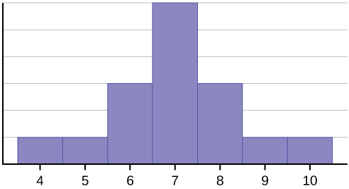
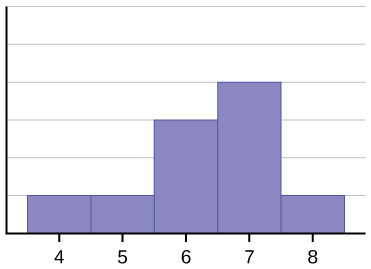
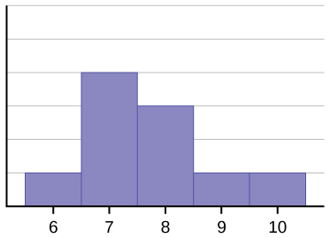
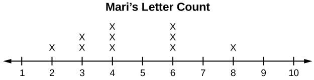
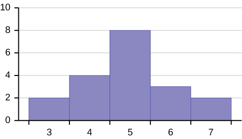
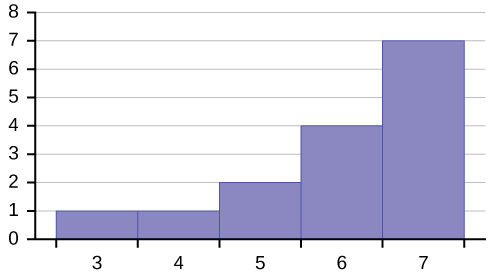

Consider the following data set. * * *
{: data-type="newline"}

4; 5; 6; 6; 6; 7; 7; 7; 7; 7; 7; 8; 8; 8; 9; 10

This data set can be represented by following histogram. Each interval has width one, and each value is located in the middle of an interval.

 {: #M06_Ch02_fig001}

The histogram displays a **symmetrical** distribution of data. A distribution is symmetrical if a vertical line can be drawn at some point in the histogram such that the shape to the left and the right of the vertical line are mirror images of each other. The mean, the median, and the mode are each seven for these data. **In a perfectly symmetrical distribution, the mean and the median are the same.** This example has one mode (unimodal), and the mode is the same as the mean and median. In a symmetrical distribution that has two modes (bimodal), the two modes would be different from the mean and median.

The histogram for the data:  4566677778 is not symmetrical. The right-hand side seems \"chopped off\" compared to the left side. A distribution of this type is called **skewed to the left** because it is pulled out to the left.

{: #M06_Ch02_fig002}

The mean is 6.3, the median is 6.5, and the mode is seven. **Notice that the mean is less than the median, and they are both less than the mode.** The mean and the median both reflect the skewing, but the mean reflects it more so.

The histogram for the data:  67777888910, is also not symmetrical. It is **skewed to the right**.

 {: #M06_Ch02_fig003}

The mean is 7.7, the median is 7.5, and the mode is seven. Of the three statistics, **the mean is the largest, while the mode is the smallest**. Again, the mean reflects the skewing the most.

To summarize, generally if the distribution of data is skewed to the left, the mean is less than the median, which is often less than the mode. If the distribution of data is skewed to the right, the mode is often less than the median, which is less than the mean.

Skewness and symmetry become important when we discuss probability distributions in later chapters.

Statistics are used to compare and sometimes identify authors. The following lists shows a simple random sample that compares the letter counts for three authors.

Terry: 7; 9; 3; 3; 3; 4; 1; 3; 2; 2

Davis: 3; 3; 3; 4; 1; 4; 3; 2; 3; 1

Maris: 2; 3; 4; 4; 4; 6; 6; 6; 8; 3

1.  Make a dot plot for the three authors and compare the shapes.
2.  Calculate the mean for each.
3.  Calculate the median for each.
4.  Describe any pattern you notice between the shape and the measures of center.
{: data-number-style="lower-alpha"}

1.   skew."){:}

 skew"){:}

{:}

2.  Terry’s mean is 3.7, Davis’ mean is 2.7, Maris’ mean is 4.6.
3.  Terry’s median is three, Davis’ median is three. Maris’ median is four.
4.  It appears that the median is always closest to the high point (the mode), while the mean tends to be farther out on the tail. In a symmetrical distribution, the mean and the median are both centrally located close to the high point of the distribution.
{: data-number-style="lower-alpha"}

Try It

Discuss the mean, median, and mode for each of the following problems. Is there a pattern between the shape and measure of the center?

a. {:}

b. <table id="eip-idp39390048" summary="The ages former U.S. presidents died"><thead>
<tr>
<th colspan="2">The Ages Former U.S Presidents Died</th>
</tr>
</thead><tbody>
<tr>
<td>4</td>
<td>6 9</td>
</tr>
<tr>
<td>5</td>
<td>3 6 7 7 7 8</td>
</tr>
<tr>
<td>6</td>
<td>0 0 3 3 4 4 5 6 7 7 7 8</td>
</tr>
<tr>
<td>7</td>
<td>0 1 1 2 3 4 7 8 8 9</td>
</tr>
<tr>
<td>8</td>
<td>0 1 3 5 8</td>
</tr>
<tr>
<td>9</td>
<td>0 0 3 3</td>
</tr>
  <tr>
    <td colspan="2">Key: 8\|0 means 80.</td>
  </tr>
</tbody></table>

c. {:}

1.  mean = 4.25, median = 3.5, mode = 1; The mean &gt; median &gt; mode which indicates skewness to the right. (data are 0, 1, 2, 3, 4, 5, 6, 9, 10, 14 and respective frequencies are 2, 4, 3, 1, 2, 2, 2, 2, 1, 1)
2.  mean = 70.1 , median = 68, mode = 57, 67 bimodal; the mean and median are close but there is a little skewness to the right which is influenced by the data being bimodal. (data are 46, 49, 53, 56, 57, 57, 57, 58, 60, 60, 63, 63, 64, 64, 65, 66, 67, 67, 67, 68, 70, 71, 71, 72, 73, 74, 77, 78, 78, 79, 80, 81, 83, 85, 88, 90, 90 93, 93).
3.  These are estimates: mean =16.095, median = 17.495, mode = 22.495 (there may be no mode); The mean &lt; median &lt; mode which indicates skewness to the left. (data are the midponts of the intervals: 2.495, 7.495, 12.495, 17.495, 22.495 and respective frequencies are 2, 3, 4, 7, 9).
{: data-number-style="lower-alpha"}

# Chapter Review

Looking at the distribution of data can reveal a lot about the relationship between the mean, the median, and the mode. There are <u data-effect="underline">three types of distributions. A **right (or positive) skewed** </u>distribution has a shape like [\[link\]](#M06_Ch02_fig002). A **left (or negative) skewed** distribution has a shape like [\[link\]](#M06_Ch02_fig003). A **symmetrical** distrubtion looks like [\[link\]](#M06_Ch02_fig001).

<section data-depth="1" class="practice" markdown="1">
*Use the following information to answer the next three exercises:* State whether the data are symmetrical, skewed to the left, or skewed to the right.

11122223333333344455

The data are symmetrical. The median is 3 and the mean is 2.85. They are close, and the mode lies close to the middle of the data, so the data are symmetrical.

161719222222222223

87878787878889899091

The data are skewed right. The median is 87.5 and the mean is 88.2. Even though they are close, the mode lies to the left of the middle of the data, and there are many more instances of 87 than any other number, so the data are skewed right.

When the data are skewed left, what is the typical relationship between the mean and median?

When the data are symmetrical, what is the typical relationship between the mean and median?

When the data are symmetrical, the mean and median are close or the same.

What word describes a distribution that has two modes?

Describe the shape of this distribution.

{:}

The distribution is skewed right because it looks pulled out to the right.

Describe the relationship between the mode and the median of this distribution.

{:}

Describe the relationship between the mean and the median of this distribution.

{:}

The mean is 4.1 and is slightly greater than the median, which is four.

Describe the shape of this distribution.

{:}

Describe the relationship between the mode and the median of this distribution.

{:}

The mode and the median are the same. In this case, they are both five.

Are the mean and the median the exact same in this distribution? Why or why not?

{:}

Describe the shape of this distribution.

{:}

The distribution is skewed left because it looks pulled out to the left.

Describe the relationship between the mode and the median of this distribution.

{:}

Describe the relationship between the mean and the median of this distribution.

{:}

The mean and the median are both six.

The mean and median for the data are the same.

345566667777777

Is the data perfectly symmetrical? Why or why not?

Which is the greatest, the mean, the mode, or the median of the data set?

 111112121212131517222222

The mode is 12, the median is 13.5, and the mean is 15.1. The mean is the largest.

Which is the least, the mean, the mode, and the median of the data set?

5656565859606264646567

Of the three measures, which tends to reflect skewing the most, the mean, the mode, or the median? Why?

The mean tends to reflect skewing the most because it is affected the most by outliers.

In a perfectly symmetrical distribution, when would the mode be different from the mean and median?

</section>

# Homework

The median age of the U.S. population in 1980 was 30.0 years. In 1991, the median age was 33.1 years.

1.  What does it mean for the median age to rise?
2.  Give two reasons why the median age could rise.
3.  For the median age to rise, is the actual number of children less in 1991 than it was in 1980? Why or why not?
{: data-number-style="lower-alpha"}

