One simple graph, the **stem-and-leaf graph** or **stemplot**, comes from the field of exploratory data analysis. It is a good choice when the data sets are small. To create the plot, divide each observation of data into a stem and a leaf. The leaf consists of a **final significant digit**. For example, 23 has stem two and leaf three. The number 432 has stem 43 and leaf two. Likewise, the number 5,432 has stem 543 and leaf two. The decimal 9.3 has stem nine and leaf three. Write the stems in a vertical line from smallest to largest. Draw a vertical line to the right of the stems. Then write the leaves in increasing order next to their corresponding stem.

For Susan Dean\'s spring pre-calculus class, scores for the first exam were as follows (smallest to largest): * * *
{: data-type="newline"}

 334249495355556163676868696972737478808388888890929494949496100 

<table id="element-185" summary="Table displaying stem in first column and leaf in second column for the values listed above."><caption>Stem-and-Leaf Graph</caption><thead>
<tr>
<th>Stem</th>
<th>Leaf</th>
</tr>
</thead><tbody>
<tr>
<td>3</td><td>3</td>
</tr>
<tr>
<td>4</td><td>2 9 9</td>
</tr>
<tr>
<td>5</td><td>3 5 5</td>
</tr>
<tr>
<td>6</td><td>1 3 7 8 8 9 9</td>
</tr>
<tr>
<td>7</td><td>2 3 4 8</td>
</tr>
<tr>
<td>8</td><td>0 3 8 8 8</td>
</tr>
<tr>
<td>9</td><td>0 2 4 4 4 4 6</td>
</tr>
<tr>
<td>10</td><td>0</td>
</tr>
</tbody></table>
The stemplot shows that most scores fell in the 60s, 70s, 80s, and 90s. Eight out of the 31 scores or approximately 26% <math xmlns="http://www.w3.org/1998/Math/MathML"> <mrow> <mrow><mo>(</mo> <mrow> <mfrac> <mn>8</mn> <mrow> <mn>31</mn> </mrow> </mfrac> </mrow> <mo>)</mo></mrow> </mrow> </math>

 were in the 90s or 100, a fairly high number of As.

Try It

For the Park City basketball team, scores for the last 30 games were as follows (smallest to largest): * * *
{: data-type="newline"}

 323233343840424243444647474848484950505152525253545657576061 * * *
{: data-type="newline"}

Construct a stem plot for the data.

| Stem | Leaf |
|----------
| 3 | 2 2 3 4 8 |
| 4 | 0 2 2 3 4 6 7 7 8 8 8 9 |
| 5 | 0 0 1 2 2 2 3 4 6 7 7 |
| 6 | 0 1 |
{: summary=""}

The stemplot is a quick way to graph data and gives an exact picture of the data. You want to look for an overall pattern and any outliers. An **outlier**{: data-type="term"} is an observation of data that does not fit the rest of the data. It is sometimes called an **extreme value.** When you graph an outlier, it will appear not to fit the pattern of the graph. Some outliers are due to mistakes (for example, writing down 50 instead of 500) while others may indicate that something unusual is happening. It takes some background information to explain outliers, so we will cover them in more detail later.

The data are the distances (in kilometers) from a home to local supermarkets. Create a stemplot using the data: * * *
{: data-type="newline"}

1.1; 1.5; 2.3; 2.5; 2.7; 3.2; 3.3; 3.3; 3.5; 3.8; 4.0; 4.2; 4.5; 4.5; 4.7; 4.8; 5.5; 5.6; 6.5; 6.7; 12.3 * * *
{: data-type="newline"}

Do the data seem to have any concentration of values?

Do the data seem to have any concentration of values?

The leaves are to the right of the decimal.

The value 12.3 may be an outlier. Values appear to concentrate at three and four kilometers.

| Stem | Leaf |
|----------
| 1 | 1 5 |
| 2 | 3 5 7 |
| 3 | 2 3 3 5 8 |
| 4 | 0 2 5 5 7 8 |
| 5 | 5 6 |
| 6 | 5 7 |
| 7 |  |
| 8 |  |
| 9 |  |
| 10 |  |
| 11 |  |
| 12 | 3 |
{: #element-533 summary="This is a Stem-Leaf graph with stems 1, 2, 3, 4, 5, 6, 12 and leaves to the right of the decimal point."}

Try It

The following data show the distances (in miles) from the homes of off-campus statistics students to the college. Create a stem plot using the data and identify any outliers:

 0.50.71.11.21.21.31.31.51.51.71.71.81.92.02.22.52.62.82.82.83.53.84.44.84.95.25.55.75.88.0 

| Stem | Leaf |
|----------
| 0 | 5 7 |
| 1 | 1 2 2 3 3 5 5 7 7 8 9 |
| 2 | 0 2 5 6 8 8 8 |
| 3 | 5 8 |
| 4 | 4 8 9 |
| 5 | 2 5 7 8 |
| 6 |  |
| 7 |  |
| 8 | 0 |
{: summary=""}

The value 8.0 may be an outlier. Values appear to concentrate at one and two miles.

A **side-by-side stem-and-leaf plot** allows a comparison of the two data sets in two columns. In a side-by-side stem-and-leaf plot, two sets of leaves share the same stem. The leaves are to the left and the right of the stems. [[link]](#M01_Ch02_tbl005) and [[link]](#M01_Ch02_tbl006) show the ages of presidents at their inauguration and at their death. Construct a side-by-side stem-and-leaf plot using this data.

<table id="M01_Ch02_tbl005" summary=""><caption>Presidential Ages at Inauguration</caption><thead>
<tr><th>President</th><th>Age</th><th>President</th><th>Age</th><th>President</th><th>Age</th></tr>
</thead><tbody>
<tr><td>Washington</td><td>57</td><td>Lincoln</td><td>52</td><td>Hoover</td><td>54</td></tr>
<tr><td>J. Adams</td><td>61</td><td>A. Johnson</td><td>56</td><td>F. Roosevelt</td><td>51</td></tr>
<tr><td>Jefferson</td><td>57</td><td>Grant</td><td>46</td><td>Truman</td><td>60</td></tr>
<tr><td>Madison</td><td>57</td><td>Hayes</td><td>54</td><td>Eisenhower</td><td>62</td></tr>
<tr><td>Monroe</td><td>58</td><td>Garfield</td><td>49</td><td>Kennedy</td><td>43</td></tr>
<tr><td>J. Q. Adams</td><td>57</td><td>Arthur</td><td>51</td><td>L. Johnson</td><td>55</td></tr>
<tr><td>Jackson</td><td>61</td><td>Cleveland</td><td>47</td><td>Nixon</td><td>56</td></tr>
<tr><td>Van Buren</td><td>54</td><td>B. Harrison</td><td>55</td><td>Ford</td><td>61</td></tr>
<tr><td>W. H. Harrison</td><td>68</td><td>Cleveland</td><td>55</td><td>Carter</td><td>52</td></tr>
<tr><td>Tyler</td><td>51</td><td>McKinley</td><td>54</td><td>Reagan</td><td>69</td></tr>
<tr><td>Polk</td><td>49</td><td>T. Roosevelt</td><td>42</td><td>G.H.W. Bush</td><td>64</td></tr>
<tr><td>Taylor</td><td>64</td><td>Taft</td><td>51</td><td>Clinton</td><td>47</td></tr>
<tr><td>Fillmore</td><td>50</td><td>Wilson</td><td>56</td><td>G. W. Bush</td><td>54</td></tr>
<tr><td>Pierce</td><td>48</td><td>Harding</td><td>55</td><td>Obama</td><td>47</td></tr>
<tr><td>Buchanan</td><td>65</td><td>Coolidge</td><td>51</td><td /><td /></tr>	 	 
</tbody></table>
<table id="M01_Ch02_tbl006" summary=""><caption>Presidential Age at Death</caption><thead>
<tr><th>President</th><th>Age</th><th>President</th><th>Age</th><th>President</th><th>Age</th></tr>
</thead><tbody>
<tr><td>Washington</td><td>67</td><td>Lincoln</td><td>56</td><td>Hoover</td><td>90</td></tr>
<tr><td>J. Adams</td><td>90</td><td>A. Johnson</td><td>66</td><td>F. Roosevelt</td><td>63</td></tr>
<tr><td>Jefferson</td><td>83</td><td>Grant</td><td>63</td><td>Truman</td><td>88</td></tr>
<tr><td>Madison</td><td>85</td><td>Hayes</td><td>70</td><td>Eisenhower</td><td>78</td></tr>
<tr><td>Monroe</td><td>73</td><td>Garfield</td><td>49</td><td>Kennedy</td><td>46</td></tr>
<tr><td>J. Q. Adams</td><td>80</td><td>Arthur</td><td>56</td><td>L. Johnson</td><td>64</td></tr>
<tr><td>Jackson</td><td>78</td><td>Cleveland</td><td>71</td><td>Nixon</td><td>81</td></tr>
<tr><td>Van Buren</td><td>79</td><td>B. Harrison</td><td>67</td><td>Ford</td><td>93</td></tr>
<tr><td>W. H. Harrison</td><td>68</td><td>Cleveland</td><td>71</td><td>Reagan</td><td>93</td></tr>
<tr><td>Tyler</td><td>71</td><td>McKinley</td><td>58</td><td /><td /></tr>
<tr><td>Polk</td><td>53</td><td>T. Roosevelt</td><td>60</td><td /><td /></tr>
<tr><td>Taylor</td><td>65</td><td>Taft</td><td>72</td><td /><td /></tr>
<tr><td>Fillmore</td><td>74</td><td>Wilson</td><td>67</td><td /><td /></tr>
<tr><td>Pierce</td><td>64</td><td>Harding</td><td>57</td><td /><td /></tr>
<tr><td>Buchanan</td><td>77</td><td>Coolidge</td><td>60</td><td /><td /></tr>
</tbody></table>

| Ages at Inauguration |  | Ages at Death |
|----------
| 9 9 8 7 7 7 6 3 2 | 4 | 6 9 |
| 8 7 7 7 7 6 6 6 5 5 5 5 4 4 4 4 4 2 1 1 1 1 1 0 | 5 | 3 6 6 7 7 8 |
| 9 5 4 4 2 1 1 1 0 | 6 | 0 0 3 3 4 4 5 6 7 7 7 8 |
|  | 7 | 0 0 1 1 1 4 7 8 8 9 |
|  | 8 | 0 1 3 5 8 |
|  | 9 | 0 0 3 3 |
{: #M01_Ch02_tbl007 summary=""}

The table shows the number of wins and losses the Atlanta Hawks have had in 42 seasons. Create a side-by-side stem-and-leaf plot of these wins and losses.

<table summary=".."><caption></caption><thead>
<tr>
<th>Losses</th>
<th>Wins</th>
<th>Year</th>
<th>Losses </th>
<th>Wins</th>
<th>Year</th>
</tr>
</thead><tbody>
<tr>
<td>34</td>
<td>48</td>
<td>1968–1969</td>
<td>41</td>
<td>41</td>
<td>1989–1990</td>
</tr>
<tr>
<td>34</td>
<td>48</td>
<td>1969–1970</td>
<td>39</td>
<td>43</td>
<td>1990–1991</td>
</tr>
<tr>
<td>46</td>
<td>36</td>
<td>1970–1971</td>
<td>44</td>
<td>38</td>
<td>1991–1992</td>
</tr>
<tr>
<td>46</td>
<td>36</td>
<td>1971–1972</td>
<td>39</td>
<td>43</td>
<td>1992–1993</td>
</tr>
<tr>
<td>36</td>
<td>46</td>
<td>1972–1973</td>
<td>25</td>
<td>57</td>
<td>1993–1994</td>
</tr>
<tr>
<td>47</td>
<td>35</td>
<td>1973–1974</td>
<td>40</td>
<td>42</td>
<td>1994–1995</td>
</tr>
<tr>
<td>51</td>
<td>31</td>
<td>1974–1975</td>
<td>36</td>
<td>46</td>
<td>1995–1996</td>
</tr>
<tr>
<td>53</td>
<td>29</td>
<td>1975–1976</td>
<td>26</td>
<td>56</td>
<td>1996–1997</td>
</tr>
<tr>
<td>51</td>
<td>31</td>
<td>1976–1977</td>
<td>32</td>
<td>50</td>
<td>1997–1998</td>
</tr>
<tr>
<td>41</td>
<td>41</td>
<td>1977–1978</td>
<td>19</td>
<td>31</td>
<td>1998–1999</td>
</tr>
<tr>
<td>36</td>
<td>46</td>
<td>1978–1979</td>
<td>54</td>
<td>28</td>
<td>1999–2000</td>
</tr>
<tr>
<td>32</td>
<td>50</td>
<td>1979–1980</td>
<td>57</td>
<td>25</td>
<td>2000–2001</td>
</tr>
<tr>
<td>51</td>
<td>31</td>
<td>1980–1981</td>
<td>49</td>
<td>33</td>
<td>2001–2002</td>
</tr>
<tr>
<td>40</td>
<td>42</td>
<td>1981–1982</td>
<td>47</td>
<td>35</td>
<td>2002–2003</td>
</tr>
<tr>
<td>39</td>
<td>43</td>
<td>1982–1983</td>
<td>54</td>
<td>28</td>
<td>2003–2004</td>
</tr>
<tr>
<td>42</td>
<td>40</td>
<td>1983–1984</td>
<td>69</td>
<td>13</td>
<td>2004–2005</td>
</tr>
<tr>
<td>48</td>
<td>34</td>
<td>1984–1985</td>
<td>56</td>
<td>26</td>
<td>2005–2006</td>
</tr>
<tr>
<td>32</td>
<td>50</td>
<td>1985–1986</td>
<td>52</td>
<td>30</td>
<td>2006–2007</td>
</tr>
<tr>
<td>25</td>
<td>57</td>
<td>1986–1987</td>
<td>45</td>
<td>37</td>
<td>2007–2008</td>
</tr>
<tr>
<td>32</td>
<td>50</td>
<td>1987–1988</td>
<td>35</td>
<td>47</td>
<td>2008–2009</td>
</tr>
<tr>
<td>30</td>
<td>52</td>
<td>1988–1989</td>
<td>29</td>
<td>53</td>
<td>2009–2010</td>
</tr>
</tbody></table>

<table summary=".."><thead>
<tr>
<th colspan="3">Atlanta Hawks Wins and Losses</th>
</tr>
<tr>
<th>Number of Wins</th>
<th />
<th>Number of Losses</th>
</tr>
</thead><tbody>
<tr>
<td>3</td>
<td>1</td>
<td>9</td>
</tr>
<tr>
<td>9  8  8  6  5 </td>
<td>2</td>
<td>5  5  9</td>
</tr>
<tr>
<td>8  7  6  6  5  5  4  3  1  1  1  1  0</td>
<td>3</td>
<td>0  2  2  2  2  4  4  5  6  6  6  9  9  9</td>
</tr>
<tr>
<td>8  8  7  6  6  6  3  3  3  2  2  1  1  0</td>
<td>4</td>
<td>0  0  1  1  2  4  5  6  6  7  7  8  9</td>
</tr>
<tr>
<td>7  7  6  3  2  0  0  0  0</td>
<td>5</td>
<td>1  1  1  2  3  4  4  6  7</td>
</tr>
<tr>
<td />
<td>6</td>
<td>9</td>
</tr>
</tbody></table>

Another type of graph that is useful for specific data values is a **line graph**. In the particular line graph shown in [\[link\]](#example4), the ***x*-axis** (horizontal axis) consists of **data values** and the ***y*-axis** (vertical axis) consists of **frequency points**. The frequency points are connected using line segments.

In a survey, 40 mothers were asked how many times per week a teenager must be reminded to do his or her chores. The results are shown in [\[link\]](#M01_Ch02_tbl008) and in [\[link\]](#M01_Ch02_fig001).

| Number of times teenager is reminded | Frequency |
|----------
| 0 | 2 |
| 1 | 5 |
| 2 | 8 |
| 3 | 14 |
| 4 | 7 |
| 5 | 4 |
{: #M01_Ch02_tbl008 summary="The first column of the table consists of the number of times a teenager must be reminded to do his/her chores and the second column consists of frequency."}

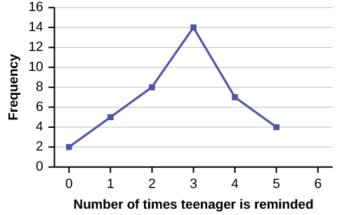{: #M01_Ch02_fig001 data-media-type="image/jpg" data-print-width="4in"}

Try It

In a survey, 40 people were asked how many times per year they had their car in the shop for repairs. The results are shown in [[link]](#M01_Ch02_tbl009). Construct a line graph.

| Number of times in shop | Frequency |
|----------
| 0 | 7 |
| 1 | 10 |
| 2 | 14 |
| 3 | 9 |
{: #M01_Ch02_tbl009 summary=""}

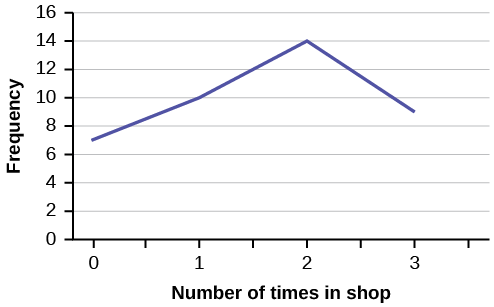{: #eip-idp32593792 data-media-type="image/png"}

**Bar graphs** consist of bars that are separated from each other. The bars can be rectangles or they can be rectangular boxes (used in three-dimensional plots), and they can be vertical or horizontal. The **bar graph** shown in [\[link\]](#example5) has age groups represented on the ***x*-axis** and proportions on the ***y*-axis**.

By the end of 2011, Facebook had over 146 million users in the United States. [[link]](#M01_Ch02_tbl010) shows three age groups, the number of users in each age group, and the proportion (%) of users in each age group. Construct a bar graph using this data.

| Age groups | Number of Facebook users | Proportion (%) of Facebook users |
|----------
| 13–25 | 65,082,280 | 45% |
| 26–44 | 53,300,200 | 36% |
| 45–64 | 27,885,100 | 19% |
{: #M01_Ch02_tbl010 summary="The information is from Facebook. The first row of the table displays age groups, the second row displays number of Facebook users and the third row displays percentages."}

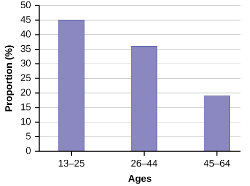{: data-media-type="image/jpg"}

Try It

The population in Park City is made up of children, working-age adults, and retirees. [[link]](#M01_Ch02_tbl011) shows the three age groups, the number of people in the town from each age group, and the proportion (%) of people in each age group. Construct a bar graph showing the proportions.

| Age groups | Number of people | Proportion of population |
|----------
| Children | 67,059 | 19% |
| Working-age adults | 152,198 | 43% |
| Retirees | 131,662 | 38% |
{: #M01_Ch02_tbl011 summary=""}

{: #eip-idm94855488 data-media-type="image/png"}

The columns in [[link]](#M01_Ch02_tbl012) contain: the race or ethnicity of students in U.S. Public Schools for the class of 2011, percentages for the Advanced Placement examine population for that class, and percentages for the overall student population. Create a bar graph with the student race or ethnicity (qualitative data) on the *x*-axis, and the Advanced Placement examinee population percentages on the *y*-axis.

| Race/Ethnicity | AP Examinee Population | Overall Student Population |
|----------
| 1 = Asian, Asian American or Pacific Islander | 10.3% | 5.7% |
| 2 = Black or African American | 9.0% | 14.7% |
| 3 = Hispanic or Latino | 17.0% | 17.6% |
| 4 = American Indian or Alaska Native | 0.6% | 1.1% |
| 5 = White | 57.1% | 59.2% |
| 6 = Not reported/other | 6.0% | 1.7% |
{: #M01_Ch02_tbl012 summary="The table shows Race and Ethnicity in the first column, Advanced Placement Examinee Population in the second column and Overall Student Population in the third column."}

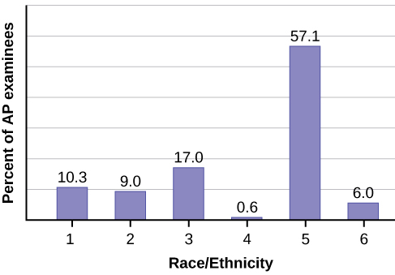{: #M01_Ch02_fig003 data-media-type="image/jpg"}

Try It

Park city is broken down into six voting districts. The table shows percent of the total registered voter population that lives in each district as well as the percent total of the entire population that lives in each district. Construct a bar graph that shows the registered voter population by district.

| District | Registered voter population | Overall city population |
|----------
| 1 | 15.5% | 19.4% |
| 2 | 12.2% | 15.6% |
| 3 | 9.8% | 9.0% |
| 4 | 17.4% | 18.5% |
| 5 | 22.8% | 20.7% |
| 6 | 22.3% | 16.8% |
{: #M01_Ch02_tbl013 summary=""}

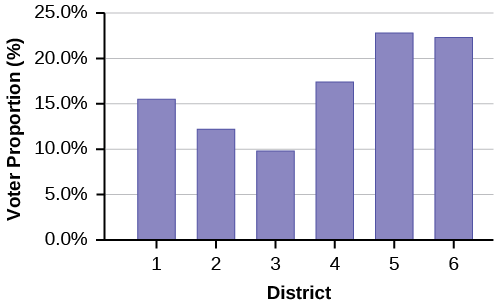{: #M01_Ch02_fig004 data-media-type="image/png"}

# References

Burbary, Ken. *Facebook Demographics Revisited – 2001 Statistics,* 2011. Available online at http://www.kenburbary.com/2011/03/facebook-demographics-revisited-2011-statistics-2/ (accessed August 21, 2013).

“9th Annual AP Report to the Nation.” CollegeBoard, 2013. Available online at http://apreport.collegeboard.org/goals-and-findings/promoting-equity (accessed September 13, 2013).

“Overweight and Obesity: Adult Obesity Facts.” Centers for Disease Control and Prevention. Available online at http://www.cdc.gov/obesity/data/adult.html (accessed September 13, 2013).

# Chapter Review

A **stem-and-leaf plot** is a way to plot data and look at the distribution. In a stem-and-leaf plot, all data values within a class are visible. The advantage in a stem-and-leaf plot is that all values are listed, unlike a histogram, which gives classes of data values. A **line graph** is often used to represent a set of data values in which a quantity varies with time. These graphs are useful for finding trends. That is, finding a general pattern in data sets including temperature, sales, employment, company profit or cost over a period of time. A **bar graph** is a chart that uses either horizontal or vertical bars to show comparisons among categories. One axis of the chart shows the specific categories being compared, and the other axis represents a discrete value. Some bar graphs present bars clustered in groups of more than one (grouped bar graphs), and others show the bars divided into subparts to show cumulative effect (stacked bar graphs). Bar graphs are especially useful when categorical data is being used.

# 

*For each of the following data sets, create a stem plot and identify any outliers.*

The miles per gallon rating for 30 cars are shown below (lowest to highest). * * *
{: data-type="newline"}

19, 19, 19, 20, 21, 21, 25, 25, 25, 26, 26, 28, 29, 31, 31, 32, 32, 33, 34, 35, 36, 37, 37, 38, 38, 38, 38, 41, 43, 43

| Stem | Leaf |
|----------
| 1 | 9 9 9 |
| 2 | 0 1 1 5 5 5 6 6 8 9 |
| 3 | 1 1 2 2 3 4 5 6 7 7 8 8 8 8 |
| 4 | 1 3 3 |
{: summary="The miles per gallon rating for 30 cars"}

The height in feet of 25 trees is shown below (lowest to highest). * * *
{: data-type="newline"}

25, 27, 33, 34, 34, 34, 35, 37, 37, 38, 39, 39, 39, 40, 41, 45, 46, 47, 49, 50, 50, 53, 53, 54, 54

The data are the prices of different laptops at an electronics store. Round each value to the nearest ten. create a stem plot using the hundreds digits as the stems and the tens digits as the leaves. Identify any outliers.* * *
{: data-type="newline"}

249, 249, 260, 265, 265, 280, 299, 299, 309, 319, 325, 326, 350, 350, 350, 365, 369, 389, 409, 459, 489, 559, 569, 570, 610

| Stem | Leaf |
|----------
| 2 | 5 5 6 7 7 8 |
| 3 | 0 0 1 2 3 3 5 5 5 7 9 |
| 4 | 1 6 9 |
| 5 | 5 7 7 |
| 6 | 1 |
{: #M01_Ch02_tbl016 summary="The data are the prices of different laptops at an electronics store."}

The data are daily high temperatures in a town for one month. Create a stem plot using the data and identify any outliers. * * *
{: data-type="newline"}

61, 61, 62, 64, 66, 67, 67, 67, 68, 69, 70, 70, 70, 71, 71, 72, 74, 74, 74, 75, 75, 75, 76, 76, 77, 78, 78, 79, 79, 95

* * *
{: data-type="newline"}

*For the next three exercises, use the data to construct a line graph.*

In a survey, 40 people were asked how many times they visited a store before making a major purchase. The results are shown in the [[link]](#M01_Ch02_tbl018).

| Number of times in store | Frequency |
|----------
| 1 | 4 |
| 2 | 10 |
| 3 | 16 |
| 4 | 6 |
| 5 | 4 |
{: #M01_Ch02_tbl018 summary=""}

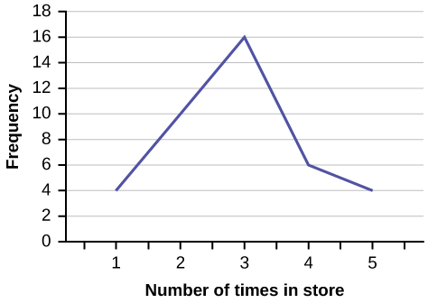{: data-media-type="image/png"}

In a survey, several people were asked how many years it has been since they purchased a mattress. The results are shown in the [[link]](#M01_Ch02_tbl019).

| Years since last purchase | Frequency |
|----------
| 0 | 2 |
| 1 | 8 |
| 2 | 13 |
| 3 | 22 |
| 4 | 16 |
| 5 | 9 |
{: #M01_Ch02_tbl019 summary=""}

Several children were asked how many TV shows they watch each day. The results of the survey are shown in [[link]](#M01_Ch02_tbl020).

| Number of TV Shows | Frequency |
|----------
| 0 | 12 |
| 1 | 18 |
| 2 | 36 |
| 3 | 7 |
| 4 | 2 |
{: #M01_Ch02_tbl020 summary=""}

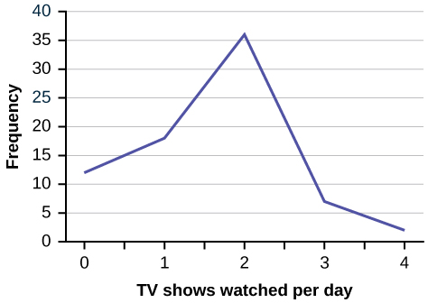{: data-media-type="image/png"}

The students in Ms. Ramirez’s math class have birthdays in each of the four seasons. [[link]](#M01_Ch02_tbl021) shows the four seasons, the number of students who have birthdays in each season, and the percentage (%) of students in each group. Construct a bar graph showing the number of students.

| Seasons | Number of students | Proportion of population |
|----------
| Spring | 8 | 24% |
| Summer | 9 | 26% |
| Autumn | 11 | 32% |
| Winter | 6 | 18% |
{: #M01_Ch02_tbl021 summary=""}

Using the data from Mrs. Ramirez’s math class supplied in [[link]](#exercise8), construct a bar graph showing the percentages.

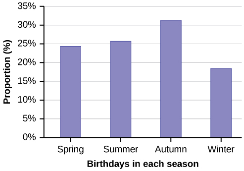{: data-media-type="image/jpg"}

David County has six high schools. Each school sent students to participate in a county-wide science competition. [[link]](#M01_Ch02_tbl022) shows the percentage breakdown of competitors from each school, and the percentage of the entire student population of the county that goes to each school. Construct a bar graph that shows the population percentage of competitors from each school.

| High School | Science competition population | Overall student population |
|----------
| Alabaster | 28.9% | 8.6% |
| Concordia | 7.6% | 23.2% |
| Genoa | 12.1% | 15.0% |
| Mocksville | 18.5% | 14.3% |
| Tynneson | 24.2% | 10.1% |
| West End | 8.7% | 28.8% |
{: #M01_Ch02_tbl022 summary=""}

Use the data from the David County science competition supplied in [[link]](#exercise10). Construct a bar graph that shows the county-wide population percentage of students at each school.

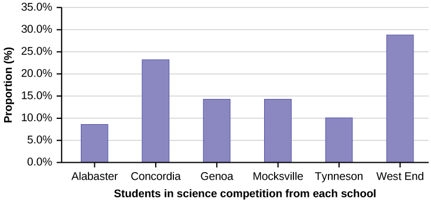{: data-media-type="image/jpg"}

# Homework

Student grades on a chemistry exam were: 77, 78, 76, 81, 86, 51, 79, 82, 84, 99

1.  Construct a stem-and-leaf plot of the data.
2.  Are there any potential outliers? If so, which scores are they? Why do you consider them outliers?
{: data-number-style="lower-alpha"}

[[link]](#M01_Ch02_tbl024) contains the 2010 obesity rates in U.S. states and Washington, DC.

| State | Percent (%) | State | Percent (%) | State | Percent (%) |
|----------
| Alabama | 32.2 | Kentucky | 31.3 | North Dakota | 27.2 |
| Alaska | 24.5 | Louisiana | 31.0 | Ohio | 29.2 |
| Arizona | 24.3 | Maine | 26.8 | Oklahoma | 30.4 |
| Arkansas | 30.1 | Maryland | 27.1 | Oregon | 26.8 |
| California | 24.0 | Massachusetts | 23.0 | Pennsylvania | 28.6 |
| Colorado | 21.0 | Michigan | 30.9 | Rhode Island | 25.5 |
| Connecticut | 22.5 | Minnesota | 24.8 | South Carolina | 31.5 |
| Delaware | 28.0 | Mississippi | 34.0 | South Dakota | 27.3 |
| Washington, DC | 22.2 | Missouri | 30.5 | Tennessee | 30.8 |
| Florida | 26.6 | Montana | 23.0 | Texas | 31.0 |
| Georgia | 29.6 | Nebraska | 26.9 | Utah | 22.5 |
| Hawaii | 22.7 | Nevada | 22.4 | Vermont | 23.2 |
| Idaho | 26.5 | New Hampshire | 25.0 | Virginia | 26.0 |
| Illinois | 28.2 | New Jersey | 23.8 | Washington | 25.5 |
| Indiana | 29.6 | New Mexico | 25.1 | West Virginia | 32.5 |
| Iowa | 28.4 | New York | 23.9 | Wisconsin | 26.3 |
| Kansas | 29.4 | North Carolina | 27.8 | Wyoming | 25.1 |
{: #M01_Ch02_tbl024 summary="The tables represents United States states and Obesity Rates. The first column and third columns list the names of the states and the second and fourth columns list Obesity Rates."}

1.  Use a random number generator to randomly pick eight states. Construct a bar graph of the obesity rates of those eight states.
2.  Construct a bar graph for all the states beginning with the letter "A."
3.  Construct a bar graph for all the states beginning with the letter "M."
{: data-number-style="lower-alpha"}

1.  Example solution for using the random number generator for the TI-84+ to generate a simple random sample of 8 states. Instructions are as follows.
    * Number the entries in the table 1–51 (Includes Washington, DC; Numbered vertically)
    * Press MATH
    * Arrow over to PRB
    * Press 5:randInt(
    * Enter 51,1,8)
    {: data-labeled-item="true"}
    
    Eight numbers are generated (use the right arrow key to scroll through the numbers). The numbers correspond to the numbered states (for this example: {47 21 9 23 51 13 25 4}. If any numbers are repeated, generate a different number by using 5:randInt(51,1)). Here, the states (and Washington DC) are {Arkansas, Washington DC, Idaho, Maryland, Michigan, Mississippi, Virginia, Wyoming}.
    
    Corresponding percents are {30.1, 22.2, 26.5, 27.1, 30.9, 34.0, 26.0, 25.1}.
    
    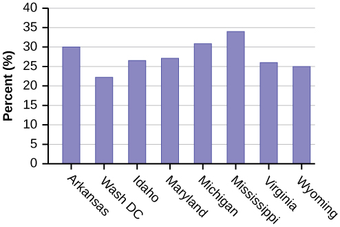{: #eip-idp38340544 data-media-type="image/jpg"}

2.  {: #eip-idp3788400 data-media-type="image/png"}

3.  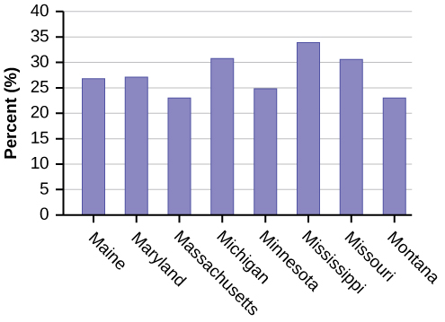{: #eip-idp2189920 data-media-type="image/png"}

{: data-number-style="lower-alpha"}

