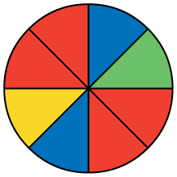

Probability is a measure that is associated with how certain we are of outcomes of a particular experiment or activity. An **experiment**{: data-type="term"} is a planned operation carried out under controlled conditions. If the result is not predetermined, then the experiment is said to be a **chance** experiment. Flipping one fair coin twice is an example of an experiment.

A result of an experiment is called an **outcome**{: data-type="term"}. The **sample space**{: data-type="term"} of an experiment is the set of all possible outcomes. Three ways to represent a sample space are: to list the possible outcomes, to create a tree diagram, or to create a Venn diagram. The uppercase letter *S* is used to denote the sample space. For example, if you flip one fair coin, *S* = \{*H*, *T*} where *H* = heads and *T* = tails are the outcomes.

An **event**{: data-type="term"} is any combination of outcomes. Upper case letters like *A* and *B* represent events. For example, if the experiment is to flip one fair coin, event *A* might be getting at most one head. The probability of an event *A* is written *P*(*A*).

The **probability**{: data-type="term"} of any outcome is the **long-term relative frequency**{: data-type="term"} of that outcome. **Probabilities are between zero and one, inclusive** (that is, zero and one and all numbers between these values). *P*(*A*) = 0 means the event *A* can never happen. *P*(*A*) = 1 means the event *A* always happens. *P*(*A*) = 0.5 means the event *A* is equally likely to occur or not to occur. For example, if you flip one fair coin repeatedly (from 20 to 2,000 to 20,000 times) the relative frequency of heads approaches 0.5 (the probability of heads).

**Equally likely**{: data-type="term"} means that each outcome of an experiment occurs with equal probability. For example, if you toss a **fair**{: data-type="term"}, six-sided die, each face (1, 2, 3, 4, 5, or 6) is as likely to occur as any other face. If you toss a fair coin, a Head (*H*) and a Tail (*T*) are equally likely to occur. If you randomly guess the answer to a true/false question on an exam, you are equally likely to select a correct answer or an incorrect answer.

**To calculate the probability of an event *A* when all outcomes in the sample space are equally likely**, count the number of outcomes for event *A* and divide by the total number of outcomes in the sample space. For example, if you toss a fair dime and a fair nickel, the sample space is \{*HH*, *TH*, *HT*, *TT*} where *T* = tails and *H* = heads. The sample space has four outcomes. *A* = getting one head. There are two outcomes that meet this condition \{*HT*, *TH*}, so *P*(*A*) = <math xmlns="http://www.w3.org/1998/Math/MathML"> <mrow> <mfrac> <mn>2</mn> <mn>4</mn> </mfrac> </mrow> </math>

 = 0.5.

Suppose you roll one fair six-sided die, with the numbers \{1, 2, 3, 4, 5, 6} on its faces. Let event *E* = rolling a number that is at least five. There are two outcomes \{5, 6}. *P*(*E*) = <math xmlns="http://www.w3.org/1998/Math/MathML"> <mrow> <mfrac> <mn>2</mn> <mn>6</mn> </mfrac> </mrow> </math>

. If you were to roll the die only a few times, you would not be surprised if your observed results did not match the probability. If you were to roll the die a very large number of times, you would expect that, overall, <math xmlns="http://www.w3.org/1998/Math/MathML"><mrow><mfrac><mn>2</mn><mn>6</mn></mfrac></mrow></math>

 of the rolls would result in an outcome of \"at least five\". You would not expect exactly <math xmlns="http://www.w3.org/1998/Math/MathML"><mrow><mfrac><mn>2</mn><mn>6</mn></mfrac></mrow></math>

. The long-term relative frequency of obtaining this result would approach the theoretical probability of <math xmlns="http://www.w3.org/1998/Math/MathML"><mrow><mfrac><mn>2</mn><mn>6</mn></mfrac></mrow></math>

 as the number of repetitions grows larger and larger.

This important characteristic of probability experiments is known as the **law of large numbers**{: data-type="term"} which states that as the number of repetitions of an experiment is increased, the relative frequency obtained in the experiment tends to become closer and closer to the theoretical probability. Even though the outcomes do not happen according to any set pattern or order, overall, the long-term observed relative frequency will approach the theoretical probability. (The word **empirical** is often used instead of the word observed.)

It is important to realize that in many situations, the outcomes are not equally likely. A coin or die may be **unfair**{: data-type="term"}, or **biased**. Two math professors in Europe had their statistics students test the Belgian one Euro coin and discovered that in 250 trials, a head was obtained 56% of the time and a tail was obtained 44% of the time. The data seem to show that the coin is not a fair coin; more repetitions would be helpful to draw a more accurate conclusion about such bias. Some dice may be biased. Look at the dice in a game you have at home; the spots on each face are usually small holes carved out and then painted to make the spots visible. Your dice may or may not be biased; it is possible that the outcomes may be affected by the slight weight differences due to the different numbers of holes in the faces. Gambling casinos make a lot of money depending on outcomes from rolling dice, so casino dice are made differently to eliminate bias. Casino dice have flat faces; the holes are completely filled with paint having the same density as the material that the dice are made out of so that each face is equally likely to occur. Later we will learn techniques to use to work with probabilities for events that are not equally likely.* * *
{: data-type="newline" data-count="2"}

\"OR\" Event:An outcome is in the event *A* OR *B* if the outcome is in *A* or is in *B* or is in both *A* and *B*. For example, let *A* = \{1, 2, 3, 4, 5} and *B* = \{4, 5, 6, 7, 8}. *A* OR *B* = \{1, 2, 3, 4, 5, 6, 7, 8}. Notice that 4 and 5 are NOT listed twice.* * *
{: data-type="newline" data-count="2"}

\"AND\" Event:An outcome is in the event *A* AND *B* if the outcome is in both *A* and *B* at the same time. For example, let *A* and *B* be \{1, 2, 3, 4, 5} and \{4, 5, 6, 7, 8}, respectively. Then *A* AND *B* = \{4, 5}.

The **complement**{: data-type="term"} of event *A* is denoted *A′* (read \"*A* prime\"). *A′* consists of all outcomes that are **NOT** in *A*. Notice that *P*(*A*) + *P*(*A′*) = 1. For example, let *S* = \{1, 2, 3, 4, 5, 6} and let *A* = \{1, 2, 3, 4}. Then, *A′* = \{5, 6}. *P*(*A*) = <math xmlns="http://www.w3.org/1998/Math/MathML"><mrow><mfrac><mn>4</mn><mn>6</mn></mfrac></mrow></math>

, *P*(*A′*) = <math xmlns="http://www.w3.org/1998/Math/MathML"><mrow><mfrac><mn>2</mn><mn>6</mn></mfrac></mrow></math>

, and *P*(*A*) + *P*(*A′*) = <math xmlns="http://www.w3.org/1998/Math/MathML"> <mrow> <mfrac> <mn>4</mn> <mn>6</mn> </mfrac> <mo> + </mo><mfrac> <mn>2</mn> <mn>6</mn> </mfrac> </mrow> </math>

 = 1

The **conditional probability**{: data-type="term"} of *A* given *B* is written *P*(*A*\\\|*B*). *P*(*A*\\\|*B*) is the probability that event *A* will occur given that the event *B* has already occurred. **A conditional reduces the sample space**. We calculate the probability of *A* from the reduced sample space *B*. The formula to calculate *P*(*A*\\\|*B*) is *P*(*A*\\\|*B*) = <math xmlns="http://www.w3.org/1998/Math/MathML"> <mrow> <mfrac> <mrow> <mi>P</mi><mo stretchy="false">(</mo><mi>A</mi><mtext> AND </mtext><mi>B</mi><mo stretchy="false">)</mo> </mrow> <mrow> <mi>P</mi><mo stretchy="false">(</mo><mi>B</mi><mo stretchy="false">)</mo> </mrow> </mfrac> </mrow> </math>

 where *P*(*B*) is greater than zero.

For example, suppose we toss one fair, six-sided die. The sample space *S* = \{1, 2, 3, 4, 5, 6}. Let *A* = face is 2 or 3 and *B* = face is even (2, 4, 6). To calculate *P*(*A*\\\|*B*), we count the number of outcomes 2 or 3 in the sample space *B* = \{2, 4, 6}. Then we divide that by the number of outcomes *B* (rather than *S*).

We get the same result by using the formula. Remember that *S* has six outcomes.

*P*(*A*\\\|*B*) = <math xmlns="http://www.w3.org/1998/Math/MathML"> <mrow> <mfrac> <mrow> <mi>P</mi><mo stretchy="false">(</mo><mi>A</mi><mspace width="2pt" /><mtext>AND</mtext><mspace width="2pt" /><mi>B</mi><mo stretchy="false">)</mo> </mrow> <mrow> <mi>P</mi><mo stretchy="false">(</mo><mi>B</mi><mo stretchy="false">)</mo> </mrow> </mfrac> <mo>=</mo><mfrac> <mrow> <mfrac> <mrow> <mo stretchy="false">(</mo><mtext>the number of outcomes that are 2 or 3 and even in </mtext><mspace width="2pt" /><mi>S</mi><mo stretchy="false">)</mo> </mrow> <mn>6</mn> </mfrac> </mrow> <mrow> <mfrac> <mrow> <mo stretchy="false">(</mo><mtext>the number of outcomes that are even in </mtext><mspace width="2pt" /><mi>S</mi><mo stretchy="false">)</mo> </mrow> <mn>6</mn> </mfrac> </mrow> </mfrac> <mo>=</mo><mfrac> <mrow> <mfrac> <mn>1</mn> <mn>6</mn> </mfrac> </mrow> <mrow> <mfrac> <mn>3</mn> <mn>6</mn> </mfrac> </mrow> </mfrac> <mo>=</mo><mfrac> <mn>1</mn> <mn>3</mn> </mfrac> </mrow> </math>

Understanding Terminology and SymbolsIt is important to read each problem carefully to think about and understand what the events are. Understanding the wording is the first very important step in solving probability problems. Reread the problem several times if necessary. Clearly identify the event of interest. Determine whether there is a condition stated in the wording that would indicate that the probability is conditional; carefully identify the condition, if any.

The sample space *S* is the whole numbers starting at one and less than 20.

1.  *S* = \_\_\_\_\_\_\_\_\_\_\_\_\_\_\_\_\_\_\_\_\_\_\_\_\_\_\_\_\_
    Let event *A* = the even numbers and event *B* = numbers greater than 13.

2.  *A* = \_\_\_\_\_\_\_\_\_\_\_\_\_\_\_\_\_\_\_\_\_, *B* = \_\_\_\_\_\_\_\_\_\_\_\_\_\_\_\_\_\_\_\_\_
3.  *P*(*A*) = \_\_\_\_\_\_\_\_\_\_\_\_\_, *P*(*B*) = \_\_\_\_\_\_\_\_\_\_\_\_\_\_\_\_
4.  *A* AND *B* = \_\_\_\_\_\_\_\_\_\_\_\_\_\_\_\_\_\_\_\_, *A* OR *B* = \_\_\_\_\_\_\_\_\_\_\_\_\_\_\_\_
5.  *P*(*A* AND *B*) = \_\_\_\_\_\_\_\_\_, *P*(*A* OR *B*) = \_\_\_\_\_\_\_\_\_\_\_\_\_
6.  *A′* = \_\_\_\_\_\_\_\_\_\_\_\_\_, *P*(*A′*) = \_\_\_\_\_\_\_\_\_\_\_\_\_
7.  *P*(*A*) + *P*(*A′*) = \_\_\_\_\_\_\_\_\_\_\_\_
8.  *P*(*A*\|*B*) = \_\_\_\_\_\_\_\_\_\_\_, *P*(*B*\|*A*) = \_\_\_\_\_\_\_\_\_\_\_\_\_; are the probabilities equal?
{: type="a"}

1.  *S* = {1, 2, 3, 4, 5, 6, 7, 8, 9, 10, 11, 12, 13, 14, 15, 16, 17, 18, 19}
2.  *A* = {2, 4, 6, 8, 10, 12, 14, 16, 18}, *B* = {14, 15, 16, 17, 18, 19}
3.  *P*(*A*) =
    <math xmlns="http://www.w3.org/1998/Math/MathML"><mrow><mfrac><mn>9</mn><mrow><mn>19</mn></mrow></mfrac> </mrow></math>
    
    , *P*(*B*) =
    <math xmlns="http://www.w3.org/1998/Math/MathML"><mrow><mfrac> <mn>6</mn> <mrow> <mn>19</mn> </mrow> </mfrac> </mrow> </math>

4.  *A* AND *B* = {14,16,18}, *A* OR *B* = {2, 4, 6, 8, 10, 12, 14, 15, 16, 17, 18, 19}
5.  *P*(*A* AND *B*) =
    <math xmlns="http://www.w3.org/1998/Math/MathML"><mrow><mfrac><mn>3</mn><mrow><mn>19</mn></mrow> </mfrac></mrow></math>
    
    , *P*(*A* OR *B*) =
    <math xmlns="http://www.w3.org/1998/Math/MathML"> <mrow> <mfrac> <mn>12</mn> <mrow> <mn>19</mn> </mrow> </mfrac> </mrow> </math>

6.  *A′* = 1, 3, 5, 7, 9, 11, 13, 15, 17, 19; *P*(*A′*) =
    <math xmlns="http://www.w3.org/1998/Math/MathML"> <mrow><mfrac><mrow><mn>10</mn></mrow><mrow><mn>19</mn></mrow></mfrac> </mrow></math>

7.  *P*(*A*) + *P*(*A′*) = 1 (
    <math xmlns="http://www.w3.org/1998/Math/MathML"> <mrow><mfrac><mrow><mn>9</mn></mrow><mrow><mn>19</mn></mrow></mfrac> </mrow></math>
    
    +
    <math xmlns="http://www.w3.org/1998/Math/MathML"> <mrow><mfrac><mrow><mn>10</mn></mrow><mrow><mn>19</mn></mrow></mfrac> </mrow></math>
    
    = 1)
8.  *P*(*A*\|*B*) =
    <math xmlns="http://www.w3.org/1998/Math/MathML"> <mrow> <mfrac> <mrow> <mi>P</mi><mo stretchy="false">(</mo><mi>A</mi><mtext> AND </mtext><mi>B</mi><mo stretchy="false">)</mo> </mrow> <mrow> <mi>P</mi><mo stretchy="false">(</mo><mi>B</mi><mo stretchy="false">)</mo> </mrow> </mfrac> </mrow> </math>
    
    =
    <math xmlns="http://www.w3.org/1998/Math/MathML"> <mrow> <mfrac> <mn>3</mn> <mn>6</mn> </mfrac> </mrow> </math>
    
    , *P*(*B*\|*A*) =
    <math xmlns="http://www.w3.org/1998/Math/MathML"> <mrow> <mfrac> <mrow> <mi>P</mi><mo stretchy="false">(</mo><mi>A</mi><mtext> AND </mtext><mi>B</mi><mo stretchy="false">)</mo> </mrow> <mrow> <mi>P</mi><mo stretchy="false">(</mo><mi>A</mi><mo stretchy="false">)</mo> </mrow> </mfrac> </mrow> </math>
    
    =
    <math xmlns="http://www.w3.org/1998/Math/MathML"> <mrow> <mfrac> <mn>3</mn> <mn>9</mn> </mfrac> </mrow> </math>
    
    , No
{: type="a"}

Try It

The sample space *S* is all the ordered pairs of two whole numbers, the first from one to three and the second from one to four (Example: (1, 4)).* * *
{: data-type="newline" data-count="2"}

1.  *S* = \_\_\_\_\_\_\_\_\_\_\_\_\_\_\_\_\_\_\_\_\_\_\_\_\_\_\_\_\_
    * * *
    {: data-type="newline" data-count="2"}
    
    Let event *A* = the sum is even and event *B* = the first number is prime.
2.  *A* = \_\_\_\_\_\_\_\_\_\_\_\_\_\_\_\_\_\_\_\_\_, *B* = \_\_\_\_\_\_\_\_\_\_\_\_\_\_\_\_\_\_\_\_\_
3.  *P*(*A*) = \_\_\_\_\_\_\_\_\_\_\_\_\_, *P*(*B*) = \_\_\_\_\_\_\_\_\_\_\_\_\_\_\_\_
4.  *A* AND *B* = \_\_\_\_\_\_\_\_\_\_\_\_\_\_\_\_\_\_\_\_, *A* OR *B* = \_\_\_\_\_\_\_\_\_\_\_\_\_\_\_\_
5.  *P*(*A* AND *B*) = \_\_\_\_\_\_\_\_\_, *P*(*A* OR *B*) = \_\_\_\_\_\_\_\_\_\_\_\_\_
6.  *B′* = \_\_\_\_\_\_\_\_\_\_\_\_\_, *P*(*B′*) = \_\_\_\_\_\_\_\_\_\_\_\_\_
7.  *P*(*A*) + *P*(*A′*) = \_\_\_\_\_\_\_\_\_\_\_\_
8.  *P*(*A*\|*B*) = \_\_\_\_\_\_\_\_\_\_\_, *P*(*B*\|*A*) = \_\_\_\_\_\_\_\_\_\_\_\_\_; are the probabilities equal?
{: type="a"}

A fair, six-sided die is rolled. Describe the sample space *S*, identify each of the following events with a subset of *S* and compute its probability (an outcome is the number of dots that show up).

1.  Event *T* = the outcome is two.
2.  Event *A* = the outcome is an even number.
3.  Event *B* = the outcome is less than four.
4.  The complement of *A*.
5.  *A* GIVEN *B*
6.  *B* GIVEN *A*
7.  *A* AND *B*
8.  *A* OR *B*
9.  *A* OR *B′*
10. Event *N* = the outcome is a prime number.
11. Event *I* = the outcome is seven.
{: type="a"}

1.  *T* = {2}, *P*(*T*) =
    <math xmlns="http://www.w3.org/1998/Math/MathML"><mrow><mfrac><mn>1</mn><mn>6</mn></mfrac></mrow></math>

2.  *A* = {2, 4, 6}, *P*(*A*) =
    <math xmlns="http://www.w3.org/1998/Math/MathML"><mrow><mfrac><mn>1</mn><mn>2</mn></mfrac></mrow></math>

3.  *B* = {1, 2, 3}, *P*(*B*) =
    <math xmlns="http://www.w3.org/1998/Math/MathML"><mrow><mfrac><mn>1</mn><mn>2</mn></mfrac></mrow></math>

4.  *A′* = {1, 3, 5}, *P*(*A′*) =
    <math xmlns="http://www.w3.org/1998/Math/MathML"><mrow><mfrac><mn>1</mn><mn>2</mn></mfrac></mrow></math>

5.  *A*\|*B* = {2}, *P*(*A*\|*B*) =
    <math xmlns="http://www.w3.org/1998/Math/MathML"><mrow><mfrac><mn>1</mn><mn>3</mn></mfrac></mrow></math>

6.  *B*\|*A* = {2}, *P*(*B*\|*A*) =
    <math xmlns="http://www.w3.org/1998/Math/MathML"><mrow><mfrac><mn>1</mn><mn>3</mn></mfrac></mrow></math>

7.  *A* AND *B* = {2}, *P*(*A* AND *B*) =
    <math xmlns="http://www.w3.org/1998/Math/MathML"><mrow><mfrac><mn>1</mn><mn>6</mn></mfrac></mrow></math>

8.  *A* OR *B* = {1, 2, 3, 4, 6}, *P*(*A* OR *B*) =
    <math xmlns="http://www.w3.org/1998/Math/MathML"><mrow><mfrac><mn>5</mn><mn>6</mn></mfrac></mrow></math>

9.  *A* OR *B′* = {2, 4, 5, 6}, *P*(*A* OR *B′*) =
    <math xmlns="http://www.w3.org/1998/Math/MathML"><mrow><mfrac><mn>2</mn><mn>3</mn></mfrac></mrow></math>

10. *N* = {2, 3, 5}, *P*(*N*) =
    <math xmlns="http://www.w3.org/1998/Math/MathML"><mrow><mfrac><mn>1</mn><mn>2</mn></mfrac></mrow></math>

11. A six-sided die does not have seven dots. *P*(7) = 0.
{: type="a"}

[\[link\]](#ch03_M02-tbl001) describes the distribution of a random sample *S* of 100 individuals, organized by gender and whether they are right- or left-handed.

|  | Right-handed | Left-handed |
|----------
| Males | 43 | 9 |
| Females | 44 | 4 |
{: #ch03_M02-tbl001 summary="Example 3 Table"}

Let’s denote the events *M* = the subject is male, *F* = the subject is female, *R* = the subject is right-handed, *L* = the subject is left-handed. Compute the following probabilities:

1.  *P*(*M*)
2.  *P*(*F*)
3.  *P*(*R*)
4.  *P*(*L*)
5.  *P*(*M* AND *R*)
6.  *P*(*F* AND *L*)
7.  *P*(*M* OR *F*)
8.  *P*(*M* OR *R*)
9.  *P*(*F* OR *L*)
10. *P*(*M'*)
11. *P*(*R*\|*M*)
12. *P*(*F*\|*L*)
13. *P*(*L*\|*F*)
{: type="a"}

1.  *P*(*M*) = 0.52
2.  *P*(*F*) = 0.48
3.  *P*(*R*) = 0.87
4.  *P*(*L*) = 0.13
5.  *P*(*M* AND *R*) = 0.43
6.  *P*(*F* AND *L*) = 0.04
7.  *P*(*M* OR *F*) = 1
8.  *P*(*M* OR *R*) = 0.96
9.  *P*(*F* OR *L*) = 0.57
10. *P*(*M'*) = 0.48
11. *P*(*R*\|*M*) = 0.8269 (rounded to four decimal places)
12. *P*(*F*\|*L*) = 0.3077 (rounded to four decimal places)
13. *P*(*L*\|*F*) = 0.0833
{: type="a"}

### References

“Countries List by Continent.” Worldatlas, 2013. Available online at http://www.worldatlas.com/cntycont.htm (accessed May 2, 2013).

### Chapter Review

In this module we learned the basic terminology of probability. The set of all possible outcomes of an experiment is called the sample space. Events are subsets of the sample space, and they are assigned a probability that is a number between zero and one, inclusive.

### Formula Review

*A* and *B* are events

*P*(*S*) = 1 where *S* is the sample space

0 ≤ *P*(*A*) ≤ 1

*P*(*A*\\\|*B*) = <math xmlns="http://www.w3.org/1998/Math/MathML"> <mrow> <mfrac> <mrow> <mi>P</mi><mtext>(</mtext><mi>A</mi><mtext> AND </mtext><mi>B</mi><mtext>)</mtext> </mrow> <mrow> <mi>P</mi><mtext>(</mtext><mi>B</mi><mtext>)</mtext> </mrow> </mfrac> </mrow> </math>

<section data-depth="1" id="eip-99" class="practice" markdown="1">

In a particular college class, there are male and female students. Some students have long hair and some students have short hair. Write the **symbols** for the probabilities of the events for parts a through j. (Note that you cannot find numerical answers here. You were not given enough information to find any probability values yet; concentrate on understanding the symbols.)

* Let *F* be the event that a student is female.
* Let *M* be the event that a student is male.
* Let *S* be the event that a student has short hair.
* Let *L* be the event that a student has long hair.

1.  The probability that a student does not have long hair.
2.  The probability that a student is male or has short hair.
3.  The probability that a student is a female and has long hair.
4.  The probability that a student is male, given that the student has long hair.
5.  The probability that a student has long hair, given that the student is male.
6.  Of all the female students, the probability that a student has short hair.
7.  Of all students with long hair, the probability that a student is female.
8.  The probability that a student is female or has long hair.
9.  The probability that a randomly selected student is a male student with short hair.
10. The probability that a student is female.
{: type="a"}

1.  *P*(*L′*) = *P*(*S*)
2.  *P*(*M* OR *S*)
3.  *P*(*F* AND *L*)
4.  *P*(*M*\|*L*)
5.  *P*(*L*\|*M*)
6.  *P*(*S*\|*F*)
7.  *P*(*F*\|*L*)
8.  *P*(*F* OR *L*)
9.  *P*(*M* AND *S*)
10. *P*(*F*)
{: type="a"}

*Use the following information to answer the next four exercises.* A box is filled with several party favors. It contains 12 hats, 15 noisemakers, ten finger traps, and five bags of confetti. * * *
{: data-type="newline"}

Let *H* = the event of getting a hat. * * *
{: data-type="newline"}

Let *N* = the event of getting a noisemaker. * * *
{: data-type="newline"}

Let *F* = the event of getting a finger trap. * * *
{: data-type="newline"}

Let *C* = the event of getting a bag of confetti.

Find *P*(*H*).

Find *P*(*N*).

*P*(*N*) = <math xmlns="http://www.w3.org/1998/Math/MathML"> <mrow> <mfrac> <mrow> <mn>15</mn> </mrow> <mrow> <mn>42</mn> </mrow> </mfrac> </mrow> </math>

 = <math xmlns="http://www.w3.org/1998/Math/MathML"> <mrow> <mfrac> <mn>5</mn> <mrow> <mn>14</mn> </mrow> </mfrac> </mrow> </math>

 = 0.36

Find *P*(*F*).

Find *P*(*C*).

*P*(*C*) = <math xmlns="http://www.w3.org/1998/Math/MathML"> <mrow> <mfrac> <mn>5</mn> <mrow> <mn>42</mn> </mrow> </mfrac> </mrow> </math>

 = 0.12

* * *
{: data-type="newline"}

*Use the following information to answer the next six exercises.* A jar of 150 jelly beans contains 22 red jelly beans, 38 yellow, 20 green, 28 purple, 26 blue, and the rest are orange. * * *
{: data-type="newline"}

Let *B* = the event of getting a blue jelly bean * * *
{: data-type="newline"}

Let *G* = the event of getting a green jelly bean. * * *
{: data-type="newline"}

Let *O* = the event of getting an orange jelly bean. * * *
{: data-type="newline"}

Let *P* = the event of getting a purple jelly bean. * * *
{: data-type="newline"}

Let *R* = the event of getting a red jelly bean. * * *
{: data-type="newline"}

Let *Y* = the event of getting a yellow jelly bean.

Find *P*(*B*).

Find *P*(*G*).

*P*(*G*) = <math xmlns="http://www.w3.org/1998/Math/MathML"> <mrow> <mfrac> <mrow> <mn>20</mn> </mrow> <mrow> <mn>150</mn> </mrow> </mfrac> </mrow> </math>

 = <math xmlns="http://www.w3.org/1998/Math/MathML"> <mrow> <mfrac> <mn>2</mn> <mrow> <mn>15</mn> </mrow> </mfrac> </mrow> </math>

 = 0.13

Find *P*(*P*).

Find *P*(*R*).

*P*(*R*) = <math xmlns="http://www.w3.org/1998/Math/MathML"> <mrow> <mfrac> <mrow> <mn>22</mn> </mrow> <mrow> <mn>150</mn> </mrow> </mfrac> </mrow> </math>

 = <math xmlns="http://www.w3.org/1998/Math/MathML"> <mrow> <mfrac> <mrow> <mn>11</mn> </mrow> <mrow> <mn>75</mn> </mrow> </mfrac> </mrow> </math>

 = 0.15

Find *P*(*Y*).

Find *P*(*O*).

*P*(*O*) = <math xmlns="http://www.w3.org/1998/Math/MathML"> <mrow> <mfrac> <mrow> <mn>150</mn><mo>-</mo><mn>22</mn><mo>-</mo><mn>38</mn><mo>-</mo><mn>20</mn><mo>-</mo><mn>28</mn><mo>-</mo><mn>26</mn> </mrow> <mrow> <mn>150</mn> </mrow> </mfrac> </mrow> </math>

 = <math xmlns="http://www.w3.org/1998/Math/MathML"> <mrow> <mfrac> <mrow> <mn>16</mn> </mrow> <mrow> <mn>150</mn> </mrow> </mfrac> </mrow> </math>

 = <math xmlns="http://www.w3.org/1998/Math/MathML"> <mrow> <mfrac> <mn>8</mn> <mrow> <mn>75</mn> </mrow> </mfrac> </mrow> </math>

 = 0.11

* * *
{: data-type="newline"}

*Use the following information to answer the next six exercises.* There are 23 countries in North America, 12 countries in South America, 47 countries in Europe, 44 countries in Asia, 54 countries in Africa, and 14 in Oceania (Pacific Ocean region). * * *
{: data-type="newline"}

Let *A* = the event that a country is in Asia. * * *
{: data-type="newline"}

Let *E* = the event that a country is in Europe. * * *
{: data-type="newline"}

Let *F* = the event that a country is in Africa. * * *
{: data-type="newline"}

Let *N* = the event that a country is in North America. * * *
{: data-type="newline"}

Let *O* = the event that a country is in Oceania. * * *
{: data-type="newline"}

Let *S* = the event that a country is in South America.

Find *P*(*A*).

Find *P*(*E*).

*P*(*E*) = <math xmlns="http://www.w3.org/1998/Math/MathML"> <mrow> <mfrac> <mrow> <mn>47</mn> </mrow> <mrow> <mn>194</mn> </mrow> </mfrac> </mrow> </math>

 = 0.24

Find *P*(*F*).

Find *P*(*N*).

*P*(*N*) = <math xmlns="http://www.w3.org/1998/Math/MathML"> <mrow> <mfrac> <mrow> <mn>23</mn> </mrow> <mrow> <mn>194</mn> </mrow> </mfrac> </mrow> </math>

 = 0.12

Find *P*(*O*).

Find *P*(*S*).

*P*(*S*) = <math xmlns="http://www.w3.org/1998/Math/MathML"> <mrow> <mfrac> <mrow> <mn>12</mn> </mrow> <mrow> <mn>194</mn> </mrow> </mfrac> </mrow> </math>

 = <math xmlns="http://www.w3.org/1998/Math/MathML"> <mrow> <mfrac> <mn>6</mn> <mrow> <mn>97</mn> </mrow> </mfrac> </mrow> </math>

 = 0.06

What is the probability of drawing a red card in a standard deck of 52 cards?

What is the probability of drawing a club in a standard deck of 52 cards?

<math xmlns="http://www.w3.org/1998/Math/MathML"> <mrow> <mfrac> <mrow> <mn>13</mn> </mrow> <mrow> <mn>52</mn> </mrow> </mfrac> </mrow> </math>

 = <math xmlns="http://www.w3.org/1998/Math/MathML"> <mrow> <mfrac> <mn>1</mn> <mn>4</mn> </mfrac> </mrow> </math>

 = 0.25

What is the probability of rolling an even number of dots with a fair, six-sided die numbered one through six?

What is the probability of rolling a prime number of dots with a fair, six-sided die numbered one through six?

<math xmlns="http://www.w3.org/1998/Math/MathML"> <mrow> <mfrac> <mn>3</mn> <mn>6</mn> </mfrac> </mrow> </math>

 = <math xmlns="http://www.w3.org/1998/Math/MathML"> <mrow> <mfrac> <mn>1</mn> <mn>2</mn> </mfrac> </mrow> </math>

 = 0.5

* * *
{: data-type="newline"}

*Use the following information to answer the next two exercises.* You see a game at a local fair. You have to throw a dart at a color wheel. Each section on the color wheel is equal in area.

{: #eip-idp31502288}

* * *
{: data-type="newline" data-count="1"}

Let *B* = the event of landing on blue. * * *
{: data-type="newline" data-count="1"}

Let *R* = the event of landing on red. * * *
{: data-type="newline" data-count="1"}

Let *G* = the event of landing on green. * * *
{: data-type="newline" data-count="1"}

Let *Y* = the event of landing on yellow.

If you land on *Y*, you get the biggest prize. Find *P*(*Y*).

If you land on red, you don’t get a prize. What is *P*(*R*)?

<math xmlns="http://www.w3.org/1998/Math/MathML"> <mrow> <mi>P</mi><mo stretchy="false">(</mo><mi>R</mi><mo stretchy="false">)</mo><mo>=</mo><mfrac> <mn>4</mn> <mn>8</mn> </mfrac> <mo>=</mo><mn>0.5</mn> </mrow> </math>

* * *
{: data-type="newline"}

*Use the following information to answer the next ten exercises.* On a baseball team, there are infielders and outfielders. Some players are great hitters, and some players are not great hitters. * * *
{: data-type="newline" data-count="1"}

Let *I* = the event that a player in an infielder. * * *
{: data-type="newline" data-count="1"}

Let *O* = the event that a player is an outfielder. * * *
{: data-type="newline" data-count="1"}

Let *H* = the event that a player is a great hitter. * * *
{: data-type="newline" data-count="1"}

Let *N* = the event that a player is not a great hitter.

Write the symbols for the probability that a player is not an outfielder.

Write the symbols for the probability that a player is an outfielder or is a great hitter.

*P*(*O* OR *H*)

Write the symbols for the probability that a player is an infielder and is not a great hitter.

Write the symbols for the probability that a player is a great hitter, given that the player is an infielder.

*P*(*H*\|*I*)

Write the symbols for the probability that a player is an infielder, given that the player is a great hitter.

Write the symbols for the probability that of all the outfielders, a player is not a great hitter.

*P*(*N*\|*O*)

Write the symbols for the probability that of all the great hitters, a player is an outfielder.

Write the symbols for the probability that a player is an infielder or is not a great hitter.

*P*(*I* OR *N*)

Write the symbols for the probability that a player is an outfielder and is a great hitter.

Write the symbols for the probability that a player is an infielder.

*P*(*I*)

What is the word for the set of all possible outcomes?

What is conditional probability?

The likelihood that an event will occur given that another event has already occurred.

A shelf holds 12 books. Eight are fiction and the rest are nonfiction. Each is a different book with a unique title. The fiction books are numbered one to eight. The nonfiction books are numbered one to four. Randomly select one book * * *
{: data-type="newline" data-count="1"}

Let *F* = event that book is fiction * * *
{: data-type="newline" data-count="1"}

Let *N* = event that book is nonfiction * * *
{: data-type="newline" data-count="1"}

What is the sample space?

What is the sum of the probabilities of an event and its complement?

1

* * *
{: data-type="newline"}

*Use the following information to answer the next two exercises.* You are rolling a fair, six-sided number cube. Let *E* = the event that it lands on an even number. Let *M* = the event that it lands on a multiple of three.

What does *P*(*E*\|*M*) mean in words?

What does *P*(*E* OR *M*) mean in words?

the probability of landing on an even number or a multiple of three

</section>

### Homework

{: #ch03_M02-fig001}

The graph in [[link]](#ch03_M02-fig001) displays the sample sizes and percentages of people in different age and gender groups who were polled concerning their approval of Mayor Ford’s actions in office. The total number in the sample of all the age groups is 1,045.

1.  Define three events in the graph.
2.  Describe in words what the entry 40 means.
3.  Describe in words the complement of the entry in question 2.
4.  Describe in words what the entry 30 means.
5.  Out of the males and females, what percent are males?
6.  Out of the females, what percent disapprove of Mayor Ford?
7.  Out of all the age groups, what percent approve of Mayor Ford?
8.  Find *P*(Approve\|Male).
9.  Out of the age groups, what percent are more than 44 years old?
10. Find *P*(Approve\|Age &lt; 35).
{: type="a"}

Explain what is wrong with the following statements. Use complete sentences.

1.  If there is a 60% chance of rain on Saturday and a 70% chance of rain on Sunday, then there is a 130% chance of rain over the weekend.
2.  The probability that a baseball player hits a home run is greater than the probability that he gets a successful hit.
{: type="a"}

1.  You can't calculate the joint probability knowing the probability of both events occurring, which is not in the information given; the probabilities should be multiplied, not added; and probability is never greater than 100%
2.  A home run by definition is a successful hit, so he has to have at least as many successful hits as home runs.
{: type="a"}

### Glossary
{: data-type="glossary-title"}

Conditional Probability
: {: #id3663808} the likelihood that an event will occur given that another event has already occurred
{: #condprob}

Equally Likely
: {: #id3651637} Each outcome of an experiment has the same probability.
{: #eqlikly}

Event
: {: #id19906185} a subset of the set of all outcomes of an experiment; the set of all outcomes of an experiment is called a **sample space** and is usually denoted by *S*. An event is an arbitrary subset in *S*. It can contain one outcome, two outcomes, no outcomes (empty subset), the entire sample space, and the like. Standard notations for events are capital letters such as *A*, *B*, *C*, and so on.
{: #event}

Experiment
: {: #id3579725} a planned activity carried out under controlled conditions
{: #experiment}

Outcome
: {: #id3610906} a particular result of an experiment
{: #outcome}

Probability
: {: #id17934331} a number between zero and one, inclusive, that gives the likelihood that a specific event will occur; the foundation of statistics is given by the following 3 axioms (by A.N. Kolmogorov, 1930’s): Let *S* denote the sample space and *A* and *B* are two events in *S*. Then:
  * 0 ≤ *P*(*A*) ≤ 1
  * If *A* and *B* are any two mutually exclusive events, then *P*(*A* OR *B*) = *P*(*A*) + *P*(B).
  * *P*(*S*) = 1
{: #prob}

Sample Space
: {: #id3455189} the set of all possible outcomes of an experiment
{: #samplesp}

The AND Event
: An outcome is in the event *A* AND *B* if the outcome is in both *A* AND *B* at the same time.
^

The Complement Event
: The complement of event *A* consists of all outcomes that are NOT in *A*.
^

The Conditional Probability of *A* GIVEN *B*
: *P*(*A*\\\|*B*) is the probability that event *A* will occur given that the event *B* has already occurred.
^

The Or Event
: An outcome is in the event *A* OR *B* if the outcome is in *A* or is in *B* or is in both *A* and *B*.

