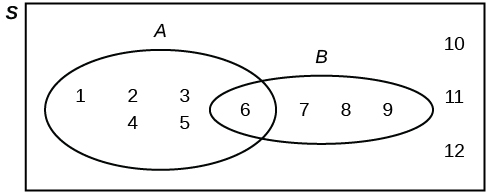
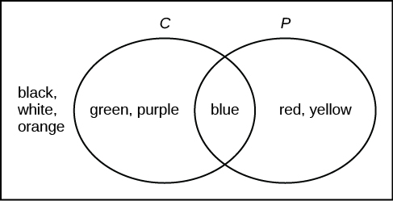
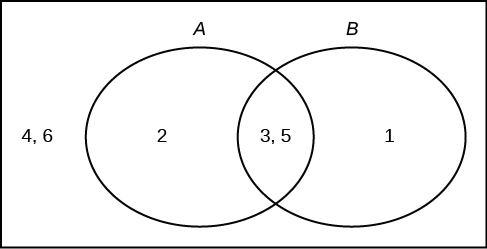
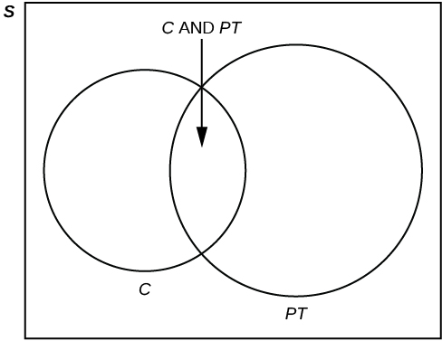
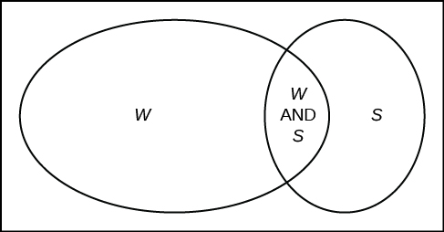
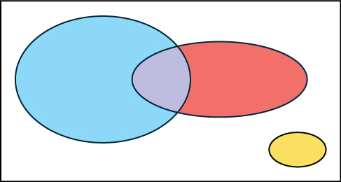
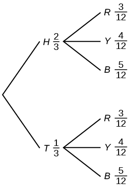
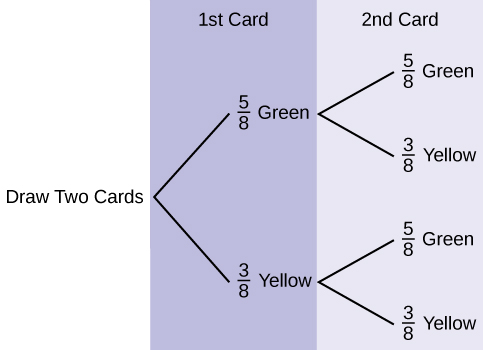
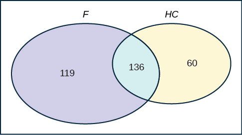

Sometimes, when the probability problems are complex, it can be helpful to graph the situation. Tree diagrams and Venn diagrams are two tools that can be used to visualize and solve conditional probabilities.

# Tree Diagrams

A **tree diagram**{: data-type="term"} is a special type of graph used to determine the outcomes of an experiment. It consists of \"branches\" that are labeled with either frequencies or probabilities. Tree diagrams can make some probability problems easier to visualize and solve. The following example illustrates how to use a tree diagram.

In an urn, there are 11 balls. Three balls are red (*R*) and eight balls are blue (*B*). Draw two balls, one at a time, **with replacement**. \"With replacement\" means that you put the first ball back in the urn before you select the second ball. The tree diagram using frequencies that show all the possible outcomes follows.

{: #element-325 data-print-width="4in"}

The first set of branches represents the first draw. The second set of branches represents the second draw. Each of the outcomes is distinct. In fact, we can list each red ball as *R*1, *R*2, and *R*3 and each blue ball as *B*1, *B*2, *B*3, *B*4, *B*5, *B*6, *B*7, and *B*8. Then the nine *RR* outcomes can be written as:

 *R*1*R*1 *R*1*R*2 *R*1*R*3 *R*2*R*1 *R*2*R*2 *R*2*R*3 *R*3*R*1 *R*3*R*2 *R*3*R*3 

The other outcomes are similar.

There are a total of 11 balls in the urn. Draw two balls, one at a time, with replacement. There are 11(11) = 121 outcomes, the size of the **sample space**{: data-type="term"}.* * *
{: data-type="newline" data-count="2"}

a. List the 24 *BR* outcomes: *B*1*R*1, *B*1*R*2, *B*1*R*3, ...

a.  *B*1*R*1 *B*1*R*2 *B*1*R*3 *B*2*R*1 *B*2*R*2 *B*2*R*3 *B*3*R*1 *B*3*R*2 *B*3*R*3 *B*4*R*1 *B*4*R*2 *B*4*R*3 *B*5*R*1 *B*5*R*2 *B*5*R*3 *B*6*R*1 *B*6*R*2 *B*6*R*3 *B*7*R*1 *B*7*R*2 *B*7*R*3 *B*8*R*1 *B*8*R*2 *B*8*R*3 * * *
{: data-type="newline" data-count="2"}

b. Using the tree diagram, calculate *P*(*RR*).

b. *P*(*RR*) = <math xmlns="http://www.w3.org/1998/Math/MathML"> <mrow> <mrow><mo>(</mo> <mrow> <mfrac> <mn>3</mn> <mrow> <mn>11</mn> </mrow> </mfrac> </mrow> <mo>)</mo></mrow><mrow><mo>(</mo> <mrow> <mfrac> <mn>3</mn> <mrow> <mn>11</mn> </mrow> </mfrac> </mrow> <mo>)</mo></mrow> </mrow> </math>

 = <math xmlns="http://www.w3.org/1998/Math/MathML"> <mrow> <mfrac> <mn>9</mn> <mrow> <mn>121</mn> </mrow> </mfrac> </mrow> </math>

* * *
{: data-type="newline" data-count="2"}

c. Using the tree diagram, calculate *P*(*RB* OR *BR*).

c. *P*(*RB* OR *BR*) = <math xmlns="http://www.w3.org/1998/Math/MathML"> <mrow> <mrow><mo>(</mo> <mrow> <mfrac> <mn>3</mn> <mrow> <mn>11</mn> </mrow> </mfrac> </mrow> <mo>)</mo></mrow><mrow><mo>(</mo> <mrow> <mfrac> <mn>8</mn> <mrow> <mn>11</mn> </mrow> </mfrac> </mrow> <mo>)</mo></mrow> </mrow> </math>

 + <math xmlns="http://www.w3.org/1998/Math/MathML"> <mrow> <mrow><mo>(</mo> <mrow> <mfrac> <mn>8</mn> <mrow> <mn>11</mn> </mrow> </mfrac> </mrow> <mo>)</mo></mrow><mrow><mo>(</mo> <mrow> <mfrac> <mn>3</mn> <mrow> <mn>11</mn> </mrow> </mfrac> </mrow> <mo>)</mo></mrow> </mrow> </math>

 = <math xmlns="http://www.w3.org/1998/Math/MathML"> <mrow> <mfrac> <mrow> <mn>48</mn> </mrow> <mrow> <mn>121</mn> </mrow> </mfrac> </mrow> </math>

* * *
{: data-type="newline" data-count="2"}

d. Using the tree diagram, calculate *P*(*R* on 1st draw AND *B* on 2nd draw).

d. *P*(*R* on 1st draw AND *B* on 2nd draw) = *P*(*RB*) = <math xmlns="http://www.w3.org/1998/Math/MathML"> <mrow> <mrow><mo>(</mo> <mrow> <mfrac> <mn>3</mn> <mrow> <mn>11</mn> </mrow> </mfrac> </mrow> <mo>)</mo></mrow><mrow><mo>(</mo> <mrow> <mfrac> <mn>8</mn> <mrow> <mn>11</mn> </mrow> </mfrac> </mrow> <mo>)</mo></mrow> </mrow> </math>

 = <math xmlns="http://www.w3.org/1998/Math/MathML"> <mrow> <mfrac> <mrow> <mn>24</mn> </mrow> <mrow> <mn>121</mn> </mrow> </mfrac> </mrow> </math>

* * *
{: data-type="newline" data-count="2"}

e. Using the tree diagram, calculate *P*(*R* on 2nd draw GIVEN *B* on 1st draw).

e. *P*(*R* on 2nd draw GIVEN *B* on 1st draw) = *P*(*R* on 2nd\|*B* on 1st) = <math xmlns="http://www.w3.org/1998/Math/MathML"> <mrow> <mfrac> <mrow> <mn>24</mn> </mrow> <mrow> <mn>88</mn> </mrow> </mfrac> </mrow> </math>

 = <math xmlns="http://www.w3.org/1998/Math/MathML"> <mrow> <mfrac> <mrow> <mn>3</mn> </mrow> <mrow> <mn>11</mn> </mrow> </mfrac> </mrow> </math>

This problem is a conditional one. The sample space has been reduced to those outcomes that already have a blue on the first draw. There are 24 + 64 = 88 possible outcomes (24 *BR* and 64 *BB*). Twenty-four of the 88 possible outcomes are *BR*. <math xmlns="http://www.w3.org/1998/Math/MathML"> <mrow> <mfrac> <mrow> <mn>24</mn> </mrow> <mrow> <mn>88</mn> </mrow> </mfrac> </mrow> </math>

 = <math xmlns="http://www.w3.org/1998/Math/MathML"> <mrow> <mfrac> <mrow> <mn>3</mn> </mrow> <mrow> <mn>11</mn> </mrow> </mfrac> </mrow> </math>

.* * *
{: data-type="newline" data-count="2"}

f. Using the tree diagram, calculate *P*(*BB*).

f. *P*(*BB*) = <math xmlns="http://www.w3.org/1998/Math/MathML"> <mrow> <mfrac> <mrow> <mn>64</mn> </mrow> <mrow> <mn>121</mn> </mrow> </mfrac> </mrow> </math>

* * *
{: data-type="newline" data-count="2"}

g. Using the tree diagram, calculate *P*(*B* on the 2nd draw given *R* on the first draw).

g. *P*(*B* on 2nd draw\|*R* on 1st draw) = <math xmlns="http://www.w3.org/1998/Math/MathML"> <mrow> <mfrac> <mn>8</mn> <mrow> <mn>11</mn> </mrow> </mfrac> </mrow> </math>

There are 9 + 24 outcomes that have *R* on the first draw (9 *RR* and 24 *RB*). The sample space is then 9 + 24 = 33. 24 of the 33 outcomes have *B* on the second draw. The probability is then <math xmlns="http://www.w3.org/1998/Math/MathML"><mfrac> <mn>24</mn> <mn>33</mn> </mfrac></math>

.

Try It

In a standard deck, there are 52 cards. 12 cards are face cards (event *F*) and 40 cards are not face cards (event *N*). Draw two cards, one at a time, with replacement. All possible outcomes are shown in the tree diagram as frequencies. Using the tree diagram, calculate *P*(*FF*).

{: #eip-idp41385280}

Total number of outcomes is 144 + 480 + 480 + 1600 = 2,704.

*P*(*FF*) = <math xmlns="http://www.w3.org/1998/Math/MathML"> <mrow> <mfrac> <mrow> <mn>144</mn> </mrow> <mrow> <mtext>144 + 480 + 480 + 1,600</mtext> </mrow> </mfrac> <mo>=</mo><mfrac> <mrow> <mn>144</mn> </mrow> <mrow> <mn>2</mn><mo>,</mo><mn>704</mn> </mrow> </mfrac> <mo>=</mo><mfrac> <mn>9</mn> <mrow> <mn>169</mn> </mrow> </mfrac> </mrow> </math>

An urn has three red marbles and eight blue marbles in it. Draw two marbles, one at a time, this time without replacement, from the urn. **\"Without replacement\"** means that you do not put the first ball back before you select the second marble. Following is a tree diagram for this situation. The branches are labeled with probabilities instead of frequencies. The numbers at the ends of the branches are calculated by multiplying the numbers on the two corresponding branches, for example, <math xmlns="http://www.w3.org/1998/Math/MathML"> <mrow> <mrow><mo>(</mo> <mrow> <mfrac> <mn>3</mn> <mrow> <mn>11</mn> </mrow> </mfrac> </mrow> <mo>)</mo></mrow><mrow><mo>(</mo> <mrow> <mfrac> <mn>2</mn> <mrow> <mn>10</mn> </mrow> </mfrac> </mrow> <mo>)</mo></mrow><mo>=</mo><mfrac> <mn>6</mn> <mrow> <mn>110</mn> </mrow> </mfrac> </mrow> </math>

.

{: #element-325a}

NOTE

If you draw a red on the first draw from the three red possibilities, there are two red marbles left to draw on the second draw. You do not put back or replace the first marble after you have drawn it. You draw **without replacement**, so that on the second draw there are ten marbles left in the urn.

* * *
{: data-type="newline"}

Calculate the following probabilities using the tree diagram.* * *
{: data-type="newline" data-count="2"}

a. *P*(*RR*) = \_\_\_\_\_\_\_\_

a. *P*(*RR*) = <math xmlns="http://www.w3.org/1998/Math/MathML"> <mrow> <mrow><mo>(</mo> <mrow> <mfrac> <mn>3</mn> <mrow> <mn>11</mn> </mrow> </mfrac> </mrow> <mo>)</mo></mrow><mrow><mo>(</mo> <mrow> <mfrac> <mn>2</mn> <mrow> <mn>10</mn> </mrow> </mfrac> </mrow> <mo>)</mo></mrow><mo>=</mo><mfrac> <mn>6</mn> <mrow> <mn>110</mn> </mrow> </mfrac> </mrow> </math>

* * *
{: data-type="newline" data-count="2"}

b. Fill in the blanks:

*P*(*RB* OR *BR*) = <math xmlns="http://www.w3.org/1998/Math/MathML"> <mrow> <mrow><mo>(</mo> <mrow> <mfrac> <mn>3</mn> <mrow> <mn>11</mn> </mrow> </mfrac> </mrow> <mo>)</mo></mrow><mrow><mo>(</mo> <mrow> <mfrac> <mn>8</mn> <mrow> <mn>10</mn> </mrow> </mfrac> </mrow> <mo>)</mo></mrow><mtext> </mtext><mo>+</mo><mtext> (\_\_\_)(\_\_\_) </mtext><mo>=</mo><mtext> </mtext><mfrac> <mrow> <mn>48</mn> </mrow> <mrow> <mn>110</mn> </mrow> </mfrac> </mrow> </math>

b. *P*(*RB* OR *BR*) = <math xmlns="http://www.w3.org/1998/Math/MathML"> <mrow> <mrow><mo>(</mo> <mrow> <mfrac> <mn>3</mn> <mrow> <mn>11</mn> </mrow> </mfrac> </mrow> <mo>)</mo></mrow><mrow><mo>(</mo> <mrow> <mfrac> <mn>8</mn> <mrow> <mn>10</mn> </mrow> </mfrac> </mrow> <mo>)</mo></mrow> </mrow> </math>

 + <math xmlns="http://www.w3.org/1998/Math/MathML"> <mrow> <mrow><mo>(</mo> <mrow> <mfrac> <mn>8</mn> <mrow> <mn>11</mn> </mrow> </mfrac> </mrow> <mo>)</mo></mrow><mrow><mo>(</mo> <mrow> <mfrac> <mn>3</mn> <mrow> <mn>10</mn> </mrow> </mfrac> </mrow> <mo>)</mo></mrow> </mrow> </math>

 = <math xmlns="http://www.w3.org/1998/Math/MathML"> <mrow> <mfrac> <mrow> <mn>48</mn> </mrow> <mrow> <mn>110</mn> </mrow> </mfrac> </mrow> </math>

* * *
{: data-type="newline" data-count="2"}

c. *P*(*R* on 2nd\|*B* on 1st) =

c. *P*(*R* on 2nd\|*B* on 1st) = <math xmlns="http://www.w3.org/1998/Math/MathML"> <mrow> <mfrac> <mn>3</mn> <mrow> <mn>10</mn> </mrow> </mfrac> </mrow> </math>

* * *
{: data-type="newline" data-count="2"}

d. Fill in the blanks.

*P*(*R* on 1st AND *B* on 2nd) = *P*(*RB*) = (\_\_\_)(\_\_\_) = <math xmlns="http://www.w3.org/1998/Math/MathML"> <mrow> <mfrac> <mrow> <mn>24</mn> </mrow> <mrow> <mn>100</mn> </mrow> </mfrac> </mrow> </math>

d. *P*(*R* on 1st AND *B* on 2nd) = *P*(*RB*) = <math xmlns="http://www.w3.org/1998/Math/MathML"> <mrow> <mrow><mo>(</mo> <mrow> <mfrac> <mn>3</mn> <mrow> <mn>11</mn> </mrow> </mfrac> </mrow> <mo>)</mo></mrow><mrow><mo>(</mo> <mrow> <mfrac> <mn>8</mn> <mrow> <mn>10</mn> </mrow> </mfrac> </mrow> <mo>)</mo></mrow> </mrow> </math>

 = <math xmlns="http://www.w3.org/1998/Math/MathML"> <mrow> <mfrac> <mrow> <mn>24</mn> </mrow> <mrow> <mn>100</mn> </mrow> </mfrac> </mrow> </math>

* * *
{: data-type="newline" data-count="2"}

e. Find *P*(*BB*).

e. *P*(*BB*) = <math xmlns="http://www.w3.org/1998/Math/MathML"> <mrow> <mrow><mo>(</mo> <mrow> <mfrac> <mn>8</mn> <mrow> <mn>11</mn> </mrow> </mfrac> </mrow> <mo>)</mo></mrow><mrow><mo>(</mo> <mrow> <mfrac> <mn>7</mn> <mrow> <mn>10</mn> </mrow> </mfrac> </mrow> <mo>)</mo></mrow> </mrow> </math>

* * *
{: data-type="newline" data-count="2"}

f. Find *P*(*B* on 2nd\|*R* on 1st).

f. Using the tree diagram, *P*(*B* on 2nd\|*R* on 1st) = *P*(*R*\|*B*) = <math xmlns="http://www.w3.org/1998/Math/MathML"> <mrow> <mfrac> <mn>8</mn> <mrow> <mn>10</mn> </mrow> </mfrac> </mrow> </math>

.

If we are using probabilities, we can label the tree in the following general way.

 
* *P*(*R*\\\|*R*) here means *P*(*R* on 2nd\\\|*R* on 1st)
* *P*(*B*\\\|*R*) here means *P*(*B* on 2nd\\\|*R* on 1st)
* *P*(*R*\\\|*B*) here means *P*(*R* on 2nd\\\|*B* on 1st)
* *P*(*B*\\\|*B*) here means *P*(*B* on 2nd\\\|*B* on 1st)

Try It

In a standard deck, there are 52 cards. Twelve cards are face cards (*F*) and 40 cards are not face cards (*N*). Draw two cards, one at a time, without replacement. The tree diagram is labeled with all possible probabilities.

{: #eip-idm127200928 data-print-width="4in"}

1.  Find *P*(*FN* OR *NF*).
2.  Find *P*(*N*\|*F*).
3.  Find *P*(at most one face card).
    * * *
    {: data-type="newline"}
    
    Hint: "At most one face card" means zero or one face card.
4.  Find *P*(at least on face card).
    * * *
    {: data-type="newline"}
    
    Hint: "At least one face card" means one or two face cards.
{: data-number-style="lower-alpha"}

1.  *P*(*FN* OR *NF*) =
    <math xmlns="http://www.w3.org/1998/Math/MathML"> <mrow> <mfrac> <mrow> <mtext>480</mtext> </mrow> <mrow> <mtext>2,652</mtext> </mrow> </mfrac> <mtext> + </mtext><mfrac> <mrow> <mtext>480</mtext> </mrow> <mrow> <mtext>2,652</mtext> </mrow> </mfrac> <mtext> = </mtext><mfrac> <mrow> <mtext>960</mtext> </mrow> <mrow> <mtext>2,652</mtext> </mrow> </mfrac> <mtext> = </mtext><mfrac> <mrow> <mtext>80</mtext> </mrow> <mrow> <mtext>221</mtext> </mrow> </mfrac> </mrow> </math>

2.  *P*(*N*\|*F*) =
    <math xmlns="http://www.w3.org/1998/Math/MathML"> <mrow> <mfrac> <mrow> <mn>40</mn> </mrow> <mrow> <mn>51</mn> </mrow> </mfrac> </mrow> </math>

3.  *P*(at most one face card) =
    <math xmlns="http://www.w3.org/1998/Math/MathML"> <mrow> <mfrac> <mrow> <mtext>(480  +  480  +  1,560)</mtext> </mrow> <mrow> <mtext>2,652</mtext> </mrow> </mfrac> </mrow> </math>
    
    =
    <math xmlns="http://www.w3.org/1998/Math/MathML"> <mrow> <mfrac> <mrow> <mn>2</mn><mo>,</mo><mn>520</mn> </mrow> <mrow> <mn>2</mn><mo>,</mo><mn>652</mn> </mrow> </mfrac> </mrow> </math>

4.  *P*(at least one face card) =
    <math xmlns="http://www.w3.org/1998/Math/MathML"> <mrow> <mfrac> <mrow> <mtext>(132 + 480 + 480)</mtext> </mrow> <mrow> <mtext>2,652</mtext> </mrow> </mfrac> </mrow> </math>
    
    =
    <math xmlns="http://www.w3.org/1998/Math/MathML"> <mrow> <mfrac> <mrow> <mtext>1,092</mtext> </mrow> <mrow> <mtext>2,652</mtext> </mrow> </mfrac> </mrow> </math>
{: data-number-style="lower-alpha"}

A litter of kittens available for adoption at the Humane Society has four tabby kittens and five black kittens. A family comes in and randomly selects two kittens (without replacement) for adoption.

{: data-print-width="4in"}

1.  What is the probability that both kittens are tabby?
    * * *
    {: data-type="newline" data-count="2"}
    
    a.
    <math xmlns="http://www.w3.org/1998/Math/MathML"> <mrow> <mrow><mo>(</mo> <mrow> <mfrac> <mn>1</mn> <mn>2</mn> </mfrac> </mrow> <mo>)</mo></mrow><mrow><mo>(</mo> <mrow> <mfrac> <mn>1</mn> <mn>2</mn> </mfrac> </mrow> <mo>)</mo></mrow> </mrow> </math>
    
    b.
    <math xmlns="http://www.w3.org/1998/Math/MathML"> <mrow> <mrow><mo>(</mo> <mrow> <mstyle scriptlevel="+1"> <mfrac> <mn>4</mn> <mn>9</mn> </mfrac> </mstyle> </mrow> <mo>)</mo></mrow><mrow><mo>(</mo> <mrow> <mstyle scriptlevel="+1"> <mfrac> <mn>4</mn> <mn>9</mn> </mfrac> </mstyle> </mrow> <mo>)</mo></mrow> </mrow> </math>
    
    c.
    <math xmlns="http://www.w3.org/1998/Math/MathML"> <semantics> <mrow> <mrow><mo>(</mo> <mrow> <mstyle scriptlevel="+1"> <mfrac> <mn>4</mn> <mn>9</mn> </mfrac> </mstyle> </mrow> <mo>)</mo></mrow><mrow><mo>(</mo> <mrow> <mstyle scriptlevel="+1"> <mfrac> <mn>3</mn> <mn>8</mn> </mfrac> </mstyle> </mrow> <mo>)</mo></mrow> </mrow> </semantics> </math>
    
    d.
    <math xmlns="http://www.w3.org/1998/Math/MathML"> <semantics> <mrow> <mrow><mo>(</mo> <mrow> <mstyle scriptlevel="+1"> <mfrac> <mn>4</mn> <mn>9</mn> </mfrac> </mstyle> </mrow> <mo>)</mo></mrow><mrow><mo>(</mo> <mrow> <mstyle scriptlevel="+1"> <mfrac> <mn>5</mn> <mn>9</mn> </mfrac> </mstyle> </mrow> <mo>)</mo></mrow> </mrow> </semantics> </math>

2.  What is the probability that one kitten of each coloring is selected?
    * * *
    {: data-type="newline" data-count="2"}
    
    a.
    <math xmlns="http://www.w3.org/1998/Math/MathML"> <mrow> <mrow><mo>(</mo> <mrow> <mstyle scriptlevel="+1"> <mfrac> <mn>4</mn> <mn>9</mn> </mfrac> </mstyle> </mrow> <mo>)</mo></mrow><mrow><mo>(</mo> <mrow> <mstyle scriptlevel="+1"> <mfrac> <mn>5</mn> <mn>9</mn> </mfrac> </mstyle> </mrow> <mo>)</mo></mrow> </mrow> </math>
    
    b.
    <math xmlns="http://www.w3.org/1998/Math/MathML"> <mrow> <mrow><mo>(</mo> <mrow> <mstyle scriptlevel="+1"> <mfrac> <mn>4</mn> <mn>9</mn> </mfrac> </mstyle> </mrow> <mo>)</mo></mrow><mrow><mo>(</mo> <mrow> <mstyle scriptlevel="+1"> <mfrac> <mn>5</mn> <mn>8</mn> </mfrac> </mstyle> </mrow> <mo>)</mo></mrow> </mrow> </math>
    
    c.
    <math xmlns="http://www.w3.org/1998/Math/MathML"> <mrow> <mrow><mo>(</mo> <mrow> <mstyle scriptlevel="+1"> <mfrac> <mn>4</mn> <mn>9</mn> </mfrac> </mstyle> </mrow> <mo>)</mo></mrow><mrow><mo>(</mo> <mrow> <mstyle scriptlevel="+1"> <mfrac> <mn>5</mn> <mn>9</mn> </mfrac> </mstyle> </mrow> <mo>)</mo></mrow><mo>+</mo><mrow><mo>(</mo> <mrow> <mstyle scriptlevel="+1"> <mfrac> <mn>5</mn> <mn>9</mn> </mfrac> </mstyle> </mrow> <mo>)</mo></mrow><mrow><mo>(</mo> <mrow> <mstyle scriptlevel="+1"> <mfrac> <mn>4</mn> <mn>9</mn> </mfrac> </mstyle> </mrow> <mo>)</mo></mrow> </mrow> </math>
    
    d.
    <math xmlns="http://www.w3.org/1998/Math/MathML"> <mrow> <mrow><mo>(</mo> <mrow> <mstyle scriptlevel="+1"> <mfrac> <mn>4</mn> <mn>9</mn> </mfrac> </mstyle> </mrow> <mo>)</mo></mrow><mrow><mo>(</mo> <mrow> <mstyle scriptlevel="+1"> <mfrac> <mn>5</mn> <mn>8</mn> </mfrac> </mstyle> </mrow> <mo>)</mo></mrow><mo>+</mo><mrow><mo>(</mo> <mrow> <mstyle scriptlevel="+1"> <mfrac> <mn>5</mn> <mn>9</mn> </mfrac> </mstyle> </mrow> <mo>)</mo></mrow><mrow><mo>(</mo> <mrow> <mstyle scriptlevel="+1"> <mfrac> <mn>4</mn> <mn>8</mn> </mfrac> </mstyle> </mrow> <mo>)</mo></mrow> </mrow> </math>

3.  What is the probability that a tabby is chosen as the second kitten when a black kitten was chosen as the first?
4.  What is the probability of choosing two kittens of the same color?
{: data-number-style="lower-alpha"}

a. c, b. d, c. <math xmlns="http://www.w3.org/1998/Math/MathML"> <mrow> <mfrac> <mn>4</mn> <mn>8</mn> </mfrac> </mrow> </math>

, d. <math xmlns="http://www.w3.org/1998/Math/MathML"> <mrow> <mfrac> <mrow> <mn>32</mn> </mrow> <mrow> <mn>72</mn> </mrow> </mfrac> </mrow> </math>

Try It

Suppose there are four red balls and three yellow balls in a box. Three balls are drawn from the box without replacement. What is the probability that one ball of each coloring is selected?

<math xmlns="http://www.w3.org/1998/Math/MathML"> <mrow> <mrow><mo>(</mo> <mrow> <mfrac> <mn>4</mn> <mn>7</mn> </mfrac> </mrow> <mo>)</mo></mrow><mrow><mo>(</mo> <mrow> <mfrac> <mn>3</mn> <mn>6</mn> </mfrac> </mrow> <mo>)</mo></mrow> </mrow> </math>

 + <math xmlns="http://www.w3.org/1998/Math/MathML"> <mrow> <mrow><mo>(</mo> <mrow> <mfrac> <mn>3</mn> <mn>7</mn> </mfrac> </mrow> <mo>)</mo></mrow><mrow><mo>(</mo> <mrow> <mfrac> <mn>4</mn> <mn>6</mn> </mfrac> </mrow> <mo>)</mo></mrow> </mrow> </math>

# Venn Diagram   {#eip-922}

A **Venn diagram**{: data-type="term"} is a picture that represents the outcomes of an experiment. It generally consists of a box that represents the sample space S together with circles or ovals. The circles or ovals represent events.

Suppose an experiment has the outcomes 1, 2, 3, ... , 12 where each outcome has an equal chance of occurring. Let event *A* = \{1, 2, 3, 4, 5, 6} and event *B* = \{6, 7, 8, 9}. Then *A* AND *B* = \{6} and *A* OR *B* = \{1, 2, 3, 4, 5, 6, 7, 8, 9}. The Venn diagram is as follows:

{: #eip-idm17287840}

Try It

Suppose an experiment has outcomes black, white, red, orange, yellow, green, blue, and purple, where each outcome has an equal chance of occurring. Let event *C* = {green, blue, purple} and event *P* = {red, yellow, blue}. Then *C* AND *P* = {blue} and *C* OR *P* = {green, blue, purple, red, yellow}. Draw a Venn diagram representing this situation.

{: #eip-idp39366912}

Flip two fair coins. Let *A* = tails on the first coin. Let *B* = tails on the second coin. Then *A* = \{*TT*, *TH*} and *B* = \{*TT*, *HT*}. Therefore, *A* AND *B* = \{*TT*}. *A* OR *B* = \{*TH*, *TT*, *HT*}.

The sample space when you flip two fair coins is *X* = \{*HH*, *HT*, *TH*, *TT*}. The outcome *HH* is in NEITHER *A* NOR *B*. The Venn diagram is as follows:

{: #eip-idm154602320}

Try It

Roll a fair, six-sided die. Let *A* = a prime number of dots is rolled. Let *B* = an odd number of dots is rolled. Then *A* = {2, 3, 5} and *B* = {1, 3, 5}. Therefore, *A* AND *B* = {3, 5}. *A* OR *B* = {1, 2, 3, 5}. The sample space for rolling a fair die is *S* = {1, 2, 3, 4, 5, 6}. Draw a Venn diagram representing this situation.

{: #eip-idm11530608}

**Forty percent** of the students at a local college belong to a club and **50%** work part time. **Five percent** of the students work part time and belong to a club. Draw a Venn diagram showing the relationships. Let *C* = student belongs to a club and *PT* = student works part time.

{:}

If a student is selected at random, find

* the probability that the student belongs to a club. *P*(*C*) = 0.40
* the probability that the student works part time. *P*(*PT*) = 0.50
* the probability that the student belongs to a club AND works part time. *P*(*C* AND *PT*) = 0.05
* the probability that the student belongs to a club **given** that the student works part time.
  <math xmlns="http://www.w3.org/1998/Math/MathML"> <mrow> <mi>P</mi><mtext>(</mtext><mi>C</mi><mtext>\|</mtext><mi>P</mi><mi>T</mi><mtext>)</mtext><mo> </mo><mo>=</mo><mo> </mo><mfrac> <mrow> <mi>P</mi><mtext>(</mtext><mi>C</mi><mtext> AND </mtext><mi>P</mi><mi>T</mi><mtext>)</mtext> </mrow> <mrow> <mi>P</mi><mtext>(</mtext><mi>P</mi><mi>T</mi><mtext>)</mtext> </mrow> </mfrac> <mo> </mo><mo>=</mo><mo> </mo><mfrac> <mrow> <mn>0.05</mn> </mrow> <mrow> <mn>0.50</mn> </mrow> </mfrac> <mo> </mo><mo>=</mo><mo> </mo><mn>0.1</mn> </mrow> </math>

* the probability that the student belongs to a club **OR** works part time. *P*(*C* OR *PT*) = *P*(*C*) + *P*(*PT*) - *P*(*C* AND *PT*) = 0.40 + 0.50 - 0.05 = 0.85

Try It

Fifty percent of the workers at a factory work a second job, 25% have a spouse who also works, 5% work a second job and have a spouse who also works. Draw a Venn diagram showing the relationships. Let *W* = works a second job and *S* = spouse also works.

{:}

A person with type O blood and a negative Rh factor (Rh-) can donate blood to any person with any blood type. Four percent of African Americans have type O blood and a negative RH factor, 5−10% of African Americans have the Rh- factor, and 51% have type O blood.

{:}

The “O” circle represents the African Americans with type O blood. The “Rh-“ oval represents the African Americans with the Rh- factor.

We will take the average of 5% and 10% and use 7.5% as the percent of African Americans who have the Rh- factor. Let *O* = African American with Type O blood and *R* = African American with Rh- factor.

1.  *P*(*O*) = \_\_\_\_\_\_\_\_\_\_\_
2.  *P*(*R*) = \_\_\_\_\_\_\_\_\_\_\_
3.  *P*(*O* AND *R*) = \_\_\_\_\_\_\_\_\_\_\_
4.  *P*(*O* OR *R*) = \_\_\_\_\_\_\_\_\_\_\_\_
5.  In the Venn Diagram, describe the overlapping area using a complete sentence.
6.  In the Venn Diagram, describe the area in the rectangle but outside both the circle and the oval using a complete sentence.
{: data-number-style="lower-alpha"}

a. 0.51; b. 0.075; c. 0.04; d. 0.545; e. The area represents the African Americans that have type O blood and the Rh- factor. f. The area represents the African Americans that have neither type O blood nor the Rh- factor.

Try It

In a bookstore, the probability that the customer buys a novel is 0.6, and the probability that the customer buys a non-fiction book is 0.4. Suppose that the probability that the customer buys both is 0.2.

1.  Draw a Venn diagram representing the situation.
2.  Find the probability that the customer buys either a novel or anon-fiction book.
3.  In the Venn diagram, describe the overlapping area using a complete sentence.
4.  Suppose that some customers buy only compact disks. Draw an oval in your Venn diagram representing this event.
{: data-number-style="lower-alpha"}

a. and d. In the following Venn diagram below, the blue oval represent customers buying a novel, the red oval represents customer buying non-fiction, and the yellow oval customer who buy compact disks.

{: data-print-width="4in"}

b. *P*(novel or non-fiction) = *P*(Blue OR Red) = *P*(Blue) + *P*(Red) - *P*(Blue AND Red) = 0.6 + 0.4 - 0.2 = 0.8. * * *
{: data-type="newline"}

c. The overlapping area of the blue oval and red oval represents the customers buying both a novel and a nonfiction book.

# References

Data from Clara County Public H.D.

Data from the American Cancer Society.

Data from The Data and Story Library, 1996. Available online at http://lib.stat.cmu.edu/DASL/ (accessed May 2, 2013).

Data from the Federal Highway Administration, part of the United States Department of Transportation.

Data from the United States Census Bureau, part of the United States Department of Commerce.

Data from USA Today.

“Environment.” The World Bank, 2013. Available online at http://data.worldbank.org/topic/environment (accessed May 2, 2013).

“Search for Datasets.” Roper Center: Public Opinion Archives, University of Connecticut., 2013. Available online at http://www.ropercenter.uconn.edu/data\\\_access/data/search\\\_for\\\_datasets.html (accessed May 2, 2013).

# Chapter Review

A tree diagram use branches to show the different outcomes of experiments and makes complex probability questions easy to visualize.

A Venn diagram is a picture that represents the outcomes of an experiment. It generally consists of a box that represents the sample space *S* together with circles or ovals. The circles or ovals represent events. A Venn diagram is especially helpful for visualizing the OR event, the AND event, and the complement of an event and for understanding conditional probabilities.

# 

The probability that a man develops some form of cancer in his lifetime is 0.4567. The probability that a man has at least one false positive test result (meaning the test comes back for cancer when the man does not have it) is 0.51. Let: *C* = a man develops cancer in his lifetime; *P* = man has at least one false positive. Construct a tree diagram of the situation.

{: #eip-idm83918928}

# Homework

*Use the following information to answer the next two exercises.* This tree diagram shows the tossing of an unfair coin followed by drawing one bead from a cup containing three red (*R*), four yellow (*Y*) and five blue (*B*) beads. For the coin, *P*(*H*) = <math xmlns="http://www.w3.org/1998/Math/MathML"> <mrow> <mfrac> <mn>2</mn> <mn>3</mn> </mfrac> </mrow> </math>

 and *P*(*T*) = <math xmlns="http://www.w3.org/1998/Math/MathML"> <mrow> <mfrac> <mn>1</mn> <mn>3</mn> </mfrac> </mrow> </math>

 where *H* is heads and *T* is tails.

{: #id43573084}

Find *P*(tossing a Head on the coin AND a Red bead)

1.  <math xmlns="http://www.w3.org/1998/Math/MathML"> <mrow> <mfrac> <mn>2</mn> <mn>3</mn> </mfrac> </mrow> </math>

2.  <math xmlns="http://www.w3.org/1998/Math/MathML"> <mrow> <mfrac> <mn>5</mn> <mn>15</mn> </mfrac> </mrow> </math>

3.  <math xmlns="http://www.w3.org/1998/Math/MathML"> <mrow> <mfrac> <mn>6</mn> <mn>36</mn> </mfrac> </mrow> </math>

4.  <math xmlns="http://www.w3.org/1998/Math/MathML"> <mrow> <mfrac> <mn>5</mn> <mn>36</mn> </mfrac> </mrow> </math>
{: data-number-style="lower-alpha"}

Find *P*(Blue bead).

1.  <math xmlns="http://www.w3.org/1998/Math/MathML"> <mrow> <mfrac> <mrow> <mn>15</mn> </mrow> <mrow> <mn>36</mn> </mrow> </mfrac> </mrow> </math>

2.  <math xmlns="http://www.w3.org/1998/Math/MathML"> <mrow> <mfrac> <mrow> <mn>10</mn> </mrow> <mrow> <mn>36</mn> </mrow> </mfrac> </mrow> </math>

3.  <math xmlns="http://www.w3.org/1998/Math/MathML"> <mrow> <mfrac> <mrow> <mn>10</mn> </mrow> <mrow> <mn>12</mn> </mrow> </mfrac> </mrow> </math>

4.  <math xmlns="http://www.w3.org/1998/Math/MathML"> <mrow> <mfrac> <mrow> <mn>6</mn> </mrow> <mrow> <mn>36</mn> </mrow> </mfrac> </mrow> </math>
{: data-number-style="lower-alpha"}

a

A box of cookies contains three chocolate and seven butter cookies. Miguel randomly selects a cookie and eats it. Then he randomly selects another cookie and eats it. (How many cookies did he take?)

1.  Draw the tree that represents the possibilities for the cookie selections. Write the probabilities along each branch of the tree.
2.  Are the probabilities for the flavor of the SECOND cookie that Miguel selects independent of his first selection? Explain.
3.  For each complete path through the tree, write the event it represents and find the probabilities.
4.  Let S be the event that both cookies selected were the same flavor. Find *P*(*S*).
5.  Let *T* be the event that the cookies selected were different flavors. Find *P*(*T*) by two different methods: by using the complement rule and by using the branches of the tree. Your answers should be the same with both methods.
6.  Let *U* be the event that the second cookie selected is a butter cookie. Find *P*(*U*).
{: data-number-style="lower-alpha"}

# Bringing It Together

*Use the following information to answer the next two exercises.* Suppose that you have eight cards. Five are green and three are yellow. The cards are well shuffled.

Suppose that you randomly draw two cards, one at a time, **with replacement**. * * *
{: data-type="newline" data-count="1"}

Let *G*1 = first card is green * * *
{: data-type="newline" data-count="1"}

Let *G*2 = second card is green

1.  Draw a tree diagram of the situation.
2.  Find *P*(*G*1 AND *G*2).
3.  Find *P*(at least one green).
4.  Find *P*(*G*2\|*G*1).
5.  Are *G*2 and *G*1 independent events? Explain why or why not.
{: data-number-style="lower-alpha"}

1.  {: #eip-idp101566032}

2.  *P*(*GG*) =
    <math xmlns="http://www.w3.org/1998/Math/MathML"> <mrow> <mrow><mo>(</mo> <mrow> <mfrac> <mn>5</mn> <mn>8</mn> </mfrac> </mrow> <mo>)</mo></mrow><mrow><mo>(</mo> <mrow> <mfrac> <mn>5</mn> <mn>8</mn> </mfrac> </mrow> <mo>)</mo></mrow> </mrow> </math>
    
    =
    <math xmlns="http://www.w3.org/1998/Math/MathML"> <mrow> <mfrac> <mrow> <mn>25</mn> </mrow> <mrow> <mn>64</mn> </mrow> </mfrac> </mrow> </math>

3.  *P*(at least one green) = *P*(*GG*) + *P*(*GY*) + *P*(*YG*) =
    <math xmlns="http://www.w3.org/1998/Math/MathML"> <mrow> <mfrac> <mrow> <mn>25</mn> </mrow> <mrow> <mn>64</mn> </mrow> </mfrac> </mrow> </math>
    
    +
    <math xmlns="http://www.w3.org/1998/Math/MathML"> <mrow> <mfrac> <mrow> <mn>15</mn> </mrow> <mrow> <mn>64</mn> </mrow> </mfrac> </mrow> </math>
    
    +
    <math xmlns="http://www.w3.org/1998/Math/MathML"> <mrow> <mfrac> <mrow> <mn>15</mn> </mrow> <mrow> <mn>64</mn> </mrow> </mfrac> </mrow> </math>
    
    =
    <math xmlns="http://www.w3.org/1998/Math/MathML"> <mrow> <mfrac> <mrow> <mn>55</mn> </mrow> <mrow> <mn>64</mn> </mrow> </mfrac> </mrow> </math>

4.  *P*(*G*\|*G*) =
    <math xmlns="http://www.w3.org/1998/Math/MathML"> <mrow> <mfrac> <mn>5</mn> <mn>8</mn> </mfrac> </mrow> </math>

5.  Yes, they are independent because the first card is placed back in the bag before the second card is drawn; the composition of cards in the bag remains the same from draw one to draw two.
{: data-number-style="lower-alpha"}

Suppose that you randomly draw two cards, one at a time, **without replacement**. * * *
{: data-type="newline" data-count="1"}

*G1* = first card is green * * *
{: data-type="newline" data-count="1"}

*G2* = second card is green

1.  Draw a tree diagram of the situation.
2.  Find *P*(*G1* AND *G2*).
3.  Find *P*(at least one green).
4.  Find *P*(*G2*\|*G1*).
5.  Are *G2* and *G1* independent events? Explain why or why not.
{: data-number-style="lower-alpha"}

*Use the following information to answer the next two exercises.* The percent of licensed U.S. drivers (from a recent year) that are female is 48.60. Of the females, 5.03% are age 19 and under; 81.36% are age 20–64; 13.61% are age 65 or over. Of the licensed U.S. male drivers, 5.04% are age 19 and under; 81.43% are age 20–64; 13.53% are age 65 or over.

Complete the following.

1.  Construct a table or a tree diagram of the situation.
2.  Find *P*(driver is female).
3.  Find *P*(driver is age 65 or over\|driver is female).
4.  Find *P*(driver is age 65 or over AND female).
5.  In words, explain the difference between the probabilities in part c and part d.
6.  Find *P*(driver is age 65 or over).
7.  Are being age 65 or over and being female mutually exclusive events? How do you know?
{: data-number-style="lower-alpha"}

1.  |  | &lt;20 | 20–64 | &gt;64 | Totals |
    |----------
    | **Female** | 0.0244 | 0.3954 | 0.0661 | 0.486 |
    | **Male** | 0.0259 | 0.4186 | 0.0695 | 0.514 |
    | **Totals** | 0.0503 | 0.8140 | 0.1356 | 1 |
    {: summary=""}

2.  *P*(*F*) = 0.486
3.  *P*(&gt;64\|*F*) = 0.1361
4.  *P*(&gt;64 and *F*) = *P*(*F*) *P*(&gt;64\|*F*) = (0.486)(0.1361) = 0.0661
5.  *P*(&gt;64\|*F*) is the percentage of female drivers who are 65 or older and *P*(&gt;64 and *F*) is the percentage of drivers who are female and 65 or older.
6.  *P*(&gt;*64*) = *P*(&gt;64 and *F*) + *P*(&gt;64 and *M*) = 0.1356
7.  No, being female and 65 or older are not mutually exclusive because they can occur at the same time P(&gt;64 and *F*) = 0.0661.
{: data-number-style="lower-alpha"}

Suppose that 10,000 U.S. licensed drivers are randomly selected.

1.  How many would you expect to be male?
2.  Using the table or tree diagram, construct a contingency table of gender versus age group.
3.  Using the contingency table, find the probability that out of the age 20–64 group, a randomly selected driver is female.
{: data-number-style="lower-alpha"}

Approximately 86.5% of Americans commute to work by car, truck, or van. Out of that group, 84.6% drive alone and 15.4% drive in a carpool. Approximately 3.9% walk to work and approximately 5.3% take public transportation.

1.  Construct a table or a tree diagram of the situation. Include a branch for all other modes of transportation to work.
2.  Assuming that the walkers walk alone, what percent of all commuters travel alone to work?
3.  Suppose that 1,000 workers are randomly selected. How many would you expect to travel alone to work?
4.  Suppose that 1,000 workers are randomly selected. How many would you expect to drive in a carpool?
{: data-number-style="lower-alpha"}

1.  |  | Car, Truck or Van | Walk | Public Transportation | Other | Totals |
    |----------
    | **Alone** | 0.7318 |  |  |  |  |
    | **Not Alone** | 0.1332 |  |  |  |  |
    | **Totals** | 0.8650 | 0.0390 | 0.0530 | 0.0430 | 1 |
    {: summary=""}

2.  If we assume that all walkers are alone and that none from the other two groups travel alone (which is a big assumption) we have: *P*(Alone) = 0.7318 + 0.0390 = 0.7708.
3.  Make the same assumptions as in (b) we have: (0.7708)(1,000) = 771
4.  (0.1332)(1,000) = 133
{: data-number-style="lower-alpha"}

When the Euro coin was introduced in 2002, two math professors had their statistics students test whether the Belgian one Euro coin was a fair coin. They spun the coin rather than tossing it and found that out of 250 spins, 140 showed a head (event *H*) while 110 showed a tail (event *T*). On that basis, they claimed that it is not a fair coin.

1.  Based on the given data, find *P*(*H*) and *P*(*T*).
2.  Use a tree to find the probabilities of each possible outcome for the experiment of tossing the coin twice.
3.  Use the tree to find the probability of obtaining exactly one head in two tosses of the coin.
4.  Use the tree to find the probability of obtaining at least one head.
{: data-number-style="lower-alpha"}

*Use the following information to answer the next two exercises.* The following are real data from Santa Clara County, CA. As of a certain time, there had been a total of 3,059 documented cases of AIDS in the county. They were grouped into the following categories: <table id="element-436" summary="This table presents data of documented cases of AIDS with risk factor by gender. The first row lists the female values and the second row lists the male values. The first column lists the gender, the second column lists homosexual/bisexual, the third column lists IV drug user, the fourth column lists heterosexual contact, and the fifth column lists other."><caption>* includes homosexual/bisexual IV drug users</caption><thead>
  <tr>
    <th />
    <th>Homosexual/Bisexual</th>
    <th>IV Drug User*</th>
    <th>Heterosexual Contact</th>
    <th>Other</th>
    <th>Totals</th>
  </tr>
</thead><tbody>
  <tr>
    <td>Female</td>
    <td>0</td>
    <td>70</td>
    <td>136</td>
    <td>49</td>
    <td>\_\_\_\_</td>
  </tr>
  <tr>
    <td>Male</td>
    <td>2,146</td>
    <td>463</td>
    <td>60</td>
    <td>135</td>
    <td>\_\_\_\_</td>
  </tr>
  <tr>
    <td>Totals</td>
    <td>\_\_\_\_</td>
    <td>\_\_\_\_</td>
    <td>\_\_\_\_</td>
    <td>\_\_\_\_</td>
    <td>\_\_\_\_</td>
  </tr>
</tbody></table>

Suppose a person with AIDS in Santa Clara County is randomly selected.

1.  Find *P*(Person is female).
2.  Find *P*(Person has a risk factor heterosexual contact).
3.  Find *P*(Person is female OR has a risk factor of IV drug user).
4.  Find *P*(Person is female AND has a risk factor of homosexual/bisexual).
5.  Find *P*(Person is male AND has a risk factor of IV drug user).
6.  Find *P*(Person is female GIVEN person got the disease from heterosexual contact).
7.  Construct a Venn diagram. Make one group females and the other group heterosexual contact.
{: data-number-style="lower-alpha"}

The completed contingency table is as follows:

<table id="element-436s" summary="This table is similar to above except all blank values are now filled in."><caption>* includes homosexual/bisexual IV drug users</caption><thead>
  <tr>
    <th />
    <th>Homosexual/Bisexual</th>
    <th>IV Drug User*</th>
    <th>Heterosexual Contact</th>
    <th>Other</th>
    <th>Totals</th>
  </tr>
</thead><tbody>
  <tr>
    <td>Female</td>
    <td>0</td>
    <td>70</td>
    <td>136</td>
    <td>49</td>
    <td><strong>255</strong></td>
  </tr>
  <tr>
    <td>Male</td>
    <td>2,146</td>
    <td>463</td>
    <td>60</td>
    <td>135</td>
    <td><strong>2,804</strong></td>
  </tr>
  <tr>
    <td>Totals</td>
    <td><strong>2,146</strong></td>
      <td><strong>533</strong></td>
    <td><strong>196</strong></td>
    <td><strong>184</strong></td>
    <td><strong>3,059</strong></td>
  </tr>
</tbody></table>
1.  <math xmlns="http://www.w3.org/1998/Math/MathML"> <mfrac> <mn>255</mn> <mn>3059</mn> </mfrac> </math>

2.  <math xmlns="http://www.w3.org/1998/Math/MathML"> <mfrac> <mn>196</mn> <mn>3059</mn> </mfrac> </math>

3.  <math xmlns="http://www.w3.org/1998/Math/MathML"> <mfrac> <mn>718</mn> <mn>3059</mn> </mfrac> </math>

4.  0
5.  <math xmlns="http://www.w3.org/1998/Math/MathML"><mfrac> <mn>463</mn> <mn>3059</mn> </mfrac></math>

6.  <math xmlns="http://www.w3.org/1998/Math/MathML"><mfrac> <mn>136</mn> <mn>196</mn> </mfrac></math>

7.  {: #eip-idp75092976}

{: data-number-style="lower-alpha"}

Answer these questions using probability rules. Do NOT use the contingency table. Three thousand fifty-nine cases of AIDS had been reported in Santa Clara County, CA, through a certain date. Those cases will be our population. Of those cases, 6.4% obtained the disease through heterosexual contact and 7.4% are female. Out of the females with the disease, 53.3% got the disease from heterosexual contact.

1.  Find *P*(Person is female).
2.  Find *P*(Person obtained the disease through heterosexual contact).
3.  Find *P*(Person is female GIVEN person got the disease from heterosexual contact)
4.  Construct a Venn diagram representing this situation. Make one group females and the other group heterosexual contact. Fill in all values as probabilities.
{: data-number-style="lower-alpha"}

## Glossary
{: data-type="glossary-title"}

Tree Diagram
: {: #id18749941} the useful visual representation of a sample space and events in the form of a “tree” with branches marked by possible outcomes together with associated probabilities (frequencies, relative frequencies)
{: .definition #treediagram}

Venn Diagram
: {: #id18154967} the visual representation of a sample space and events in the form of circles or ovals showing their intersections
{: .definition #vendiagram}

