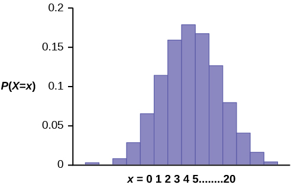
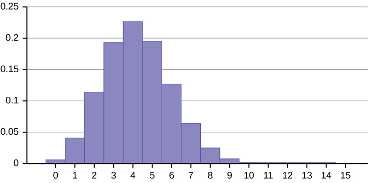

There are three characteristics of a binomial experiment. There are a fixed number of trials. Think of trials as repetitions of an experiment. The letter *n* denotes the number of trials. There are only two possible outcomes, called \"success\" and \"failure,\" for each trial. The letter *p* denotes the probability of a success on one trial, and *q* denotes the probability of a failure on one trial. *p* + *q* = 1. The *n* trials are independent and are repeated using identical conditions. Because the *n* trials are independent, the outcome of one trial does not help in predicting the outcome of another trial. Another way of saying this is that for each individual trial, the probability, *p*, of a success and probability, *q*, of a failure remain the same. For example, randomly guessing at a true-false statistics question has only two outcomes. If a success is guessing correctly, then a failure is guessing incorrectly. Suppose Joe always guesses correctly on any statistics true-false question with probability *p* = 0.6. Then, *q* = 0.4. This means that for every true-false statistics question Joe answers, his probability of success (*p* = 0.6) and his probability of failure (*q* = 0.4) remain the same. 

The outcomes of a binomial experiment fit a **binomial probability distribution**{: data-type="term"}. The random variable *X* = the number of successes obtained in the *n* independent trials.

The mean, *μ*, and variance, *σ*2, for the binomial probability distribution are *μ* = *np* and *σ*2 = *npq*. The standard deviation, *σ*, is then *σ* = <math xmlns="http://www.w3.org/1998/Math/MathML"> <mrow> <msqrt> <mrow> <mi>n</mi><mi>p</mi><mi>q</mi> </mrow> </msqrt> </mrow> </math>

.

Any experiment that has characteristics two and three and where *n* = 1 is called a **Bernoulli Trial**{: data-type="term"} (named after Jacob Bernoulli who, in the late 1600s, studied them extensively). A binomial experiment takes place when the number of successes is counted in one or more Bernoulli Trials.

At ABC College, the withdrawal rate from an elementary physics course is 30% for any given term. This implies that, for any given term, 70% of the students stay in the class for the entire term. A \"success\" could be defined as an individual who withdrew. The random variable *X* = the number of students who withdraw from the randomly selected elementary physics class.

Try It

The state health board is concerned about the amount of fruit available in school lunches. Forty-eight percent of schools in the state offer fruit in their lunches every day. This implies that 52% do not. What would a "success" be in this case?

a school that offers fruit in their lunch every day

Suppose you play a game that you can only either win or lose. The probability that you win any game is 55%, and the probability that you lose is 45%. Each game you play is independent. If you play the game 20 times, write the function that describes the probability that you win 15 of the 20 times. Here, if you define *X* as the number of wins, then *X* takes on the values 0, 1, 2, 3, ..., 20. The probability of a success is *p* = 0.55. The probability of a failure is *q* = 0.45. The number of trials is *n* = 20. The probability question can be stated mathematically as *P*(*x* = 15).

Try It

A trainer is teaching a dolphin to do tricks. The probability that the dolphin successfully performs the trick is 35%, and the probability that the dolphin does not successfully perform the trick is 65%. Out of 20 attempts, you want to find the probability that the dolphin succeeds 12 times. State the probability question mathematically.

*P*(*x* = 12)

A fair coin is flipped 15 times. Each flip is independent. What is the probability of getting more than ten heads? Let *X* = the number of heads in 15 flips of the fair coin. *X* takes on the values 0, 1, 2, 3, ..., 15. Since the coin is fair, *p* = 0.5 and *q* = 0.5. The number of trials is *n* = 15. State the probability question mathematically.

*P*(*x* &gt; 10)

Try It

A fair, six-sided die is rolled ten times. Each roll is independent. You want to find the probability of rolling a one more than three times. State the probability question mathematically.

*P*(*x* &gt; 3)

Approximately 70% of statistics students do their homework in time for it to be collected and graded. Each student does homework independently. In a statistics class of 50 students, what is the probability that at least 40 will do their homework on time? Students are selected randomly.* * *
{: data-type="newline" data-count="2"}

a. This is a binomial problem because there is only a success or a \_\_\_\_\_\_\_\_\_\_, there are a fixed number of trials, and the probability of a success is 0.70 for each trial.

a. failure* * *
{: data-type="newline" data-count="2"}

b. If we are interested in the number of students who do their homework on time, then how do we define *X*?

b. *X* = the number of statistics students who do their homework on time* * *
{: data-type="newline" data-count="2"}

c. What values does *x* take on?

c. 0, 1, 2, …, 50* * *
{: data-type="newline" data-count="2"}

d. What is a "failure," in words?

d. Failure is defined as a student who does not complete his or her homework on time.

The probability of a success is *p* = 0.70. The number of trials is *n* = 50.* * *
{: data-type="newline" data-count="2"}

e. If *p* + *q* = 1, then what is *q*?

e. *q* = 0.30* * *
{: data-type="newline" data-count="2"}

f. The words "at least" translate as what kind of inequality for the probability question *P*(*x* \_\_\_\_ 40).

f. greater than or equal to (≥) * * *
{: data-type="newline" data-count="1"}

The probability question is *P*(*x* ≥ 40).

Try It

Sixty-five percent of people pass the state driver’s exam on the first try. A group of 50 individuals who have taken the driver’s exam is randomly selected. Give two reasons why this is a binomial problem.

This is a binomial problem because there is only a success or a failure, and there are a definite number of trials. The probability of a success stays the same for each trial.

# Notation for the Binomial: *B* = Binomial Probability Distribution Function   {#element-501}

*X* ~ *B*(*n*, *p*)

Read this as \"*X* is a random variable with a binomial distribution.\" The parameters are *n* and *p*; *n* = number of trials, *p* = probability of a success on each trial.

It has been stated that about 41% of adult workers have a high school diploma but do not pursue any further education. If 20 adult workers are randomly selected, find the probability that at most 12 of them have a high school diploma but do not pursue any further education. How many adult workers do you expect to have a high school diploma but do not pursue any further education?

Let *X* = the number of workers who have a high school diploma but do not pursue any further education.

*X* takes on the values 0, 1, 2, ..., 20 where *n* = 20, *p* = 0.41, and *q* = 1 – 0.41 = 0.59. *X* ~ *B*(20, 0.41)

Find *P*(*x* ≤ 12). *P*(*x* ≤ 12) = 0.9738. (calculator or computer)
{: .finger}

Go into 2nd DISTR. The syntax for the instructions are as follows:

**To calculate (*x* = value): binompdf(*n*, *p*, number)** if \"number\" is left out, the result is the binomial probability table. * * *
{: data-type="newline"}

**To calculate *P*(*x* ≤ value): binomcdf(*n*, *p*, number)** if \"number\" is left out, the result is the cumulative binomial probability table. * * *
{: data-type="newline"}

**For this problem: After you are in 2nd DISTR, arrow down to binomcdf. Press ENTER. Enter 20,0.41,12). The result is *P*(*x* ≤ 12) = 0.9738.**

NOTE

If you want to find *P*(*x* = 12), use the pdf (binompdf). If you want to find *P*(*x* &gt; 12), use 1 - binomcdf(20,0.41,12).

The probability that at most 12 workers have a high school diploma but do not pursue any further education is 0.9738.

The graph of *X* ~ *B*(20, 0.41) is as follows:

{:}

The *y*-axis contains the probability of *x*, where *X* = the number of workers who have only a high school diploma.

The number of adult workers that you expect to have a high school diploma but not pursue any further education is the mean, *μ* = *np* = (20)(0.41) = 8.2.

The formula for the variance is σ2 = *npq*. The standard deviation is *σ* = <math xmlns="http://www.w3.org/1998/Math/MathML"> <mrow> <msqrt> <mrow> <mi>n</mi><mi>p</mi><mi>q</mi> </mrow> </msqrt> </mrow> </math>

. * * *
{: data-type="newline" data-count="1"}

*σ* = <math xmlns="http://www.w3.org/1998/Math/MathML"> <mrow> <msqrt> <mrow> <mrow><mo>(</mo> <mrow> <mn>20</mn> </mrow> <mo>)</mo></mrow><mrow><mo>(</mo> <mrow> <mn>0.41</mn> </mrow> <mo>)</mo></mrow><mrow><mo>(</mo> <mrow> <mn>0.59</mn> </mrow> <mo>)</mo></mrow> </mrow> </msqrt> </mrow> </math>

 = 2.20.

Try It

About 32% of students participate in a community volunteer program outside of school. If 30 students are selected at random, find the probability that at most 14 of them participate in a community volunteer program outside of school. Use the TI-83+ or TI-84 calculator to find the answer.

*P*(*x* ≤ 12) = 0.9695

In the 2013 *Jerry’s Artarama* art supplies catalog, there are 560 pages. Eight of the pages feature signature artists. Suppose we randomly sample 100 pages. Let *X* = the number of pages that feature signature artists.

1.  What values does *x* take on?
2.  What is the probability distribution? Find the following probabilities:
    1.  the probability that two pages feature signature artists
    2.  the probability that at most six pages feature signature artists
    3.  the probability that more than three pages feature signature artists.
    {: data-number-style="lower-roman"}

3.  Using the formulas, calculate the (i) mean and (ii) standard deviation.
{: data-number-style="lower-alpha"}

1.  *x* = 0, 1, 2, 3, 4, 5, 6, 7, 8
2.  *X* ~ *B*
    <math xmlns="http://www.w3.org/1998/Math/MathML"> <mrow> <mrow><mo>(</mo> <mrow> <mn>100</mn><mo>,</mo><mfrac> <mn>8</mn> <mrow> <mn>560</mn> </mrow> </mfrac> </mrow> <mo>)</mo></mrow> </mrow> </math>
    
    1.  *P*(*x* = 2) = binompdf
        <math xmlns="http://www.w3.org/1998/Math/MathML"> <mrow> <mrow><mo>(</mo> <mrow> <mn>100</mn><mo>,</mo><mfrac> <mn>8</mn> <mrow> <mn>560</mn> </mrow> </mfrac> <mo>,</mo><mn>2</mn> </mrow> <mo>)</mo></mrow> </mrow> </math>
        
        = 0.2466
    2.  *P*(*x* ≤ 6) = binomcdf
        <math xmlns="http://www.w3.org/1998/Math/MathML"> <mrow> <mrow><mo>(</mo> <mrow> <mn>100</mn><mo>,</mo><mfrac> <mn>8</mn> <mrow> <mn>560</mn> </mrow> </mfrac> <mo>,</mo><mn>6</mn> </mrow> <mo>)</mo></mrow> </mrow> </math>
        
        = 0.9994
    3.  *P*(*x* &gt; 3) = 1 – *P*(*x* ≤ 3) = 1 – binomcdf
        <math xmlns="http://www.w3.org/1998/Math/MathML"> <mrow> <mrow><mo>(</mo> <mrow> <mn>100</mn><mo>,</mo><mfrac> <mn>8</mn> <mrow> <mn>560</mn> </mrow> </mfrac> <mo>,</mo><mn>3</mn> </mrow> <mo>)</mo></mrow> </mrow> </math>
        
        = 1 – 0.9443 = 0.0557
    {: data-number-style="lower-roman"}

3.  1.  Mean = *np* = (100)
        <math xmlns="http://www.w3.org/1998/Math/MathML"> <mrow> <mrow><mo>(</mo> <mrow> <mfrac> <mn>8</mn> <mrow> <mn>560</mn> </mrow> </mfrac> </mrow> <mo>)</mo></mrow> </mrow> </math>
        
        =
        <math xmlns="http://www.w3.org/1998/Math/MathML"> <mrow> <mfrac> <mn>800</mn> <mrow> <mn>560</mn> </mrow> </mfrac> </mrow> </math>
        
        ≈ 1.4286
    2.  Standard Deviation =
        <math xmlns="http://www.w3.org/1998/Math/MathML"> <mrow> <msqrt> <mrow> <mi>n</mi><mi>p</mi><mi>q</mi> </mrow> </msqrt> </mrow> </math>
        
        =
        <math xmlns="http://www.w3.org/1998/Math/MathML"> <mrow> <msqrt> <mrow> <mo stretchy="false">(</mo><mn>100</mn><mo stretchy="false">)</mo><mrow><mo>(</mo> <mrow> <mfrac> <mn>8</mn> <mrow> <mn>560</mn> </mrow> </mfrac> </mrow> <mo>)</mo></mrow><mrow><mo>(</mo> <mrow> <mfrac> <mrow> <mn>552</mn> </mrow> <mrow> <mn>560</mn> </mrow> </mfrac> </mrow> <mo>)</mo></mrow> </mrow> </msqrt> </mrow> </math>
        
        ≈ 1.1867
    {: data-number-style="lower-roman"}
{: data-number-style="lower-alpha"}

Try It

According to a Gallup poll, 60% of American adults prefer saving over spending. Let *X* = the number of American adults out of a random sample of 50 who prefer saving to spending.

1.  What is the probability distribution for *X*?
2.  Use your calculator to find the following probabilities:
    1.  the probability that 25 adults in the sample prefer saving over spending
    2.  the probability that at most 20 adults prefer saving
    3.  the probability that more than 30 adults prefer saving
    {: data-number-style="lower-roman"}

3.  Using the formulas, calculate the (i) mean and (ii) standard deviation of *X*.
{: data-number-style="lower-alpha"}

1.  *X* ∼ *B*(50, 0.6)
2.  Using the TI-83, 83+, 84 calculator with instructions as provided in [[link]](#example5):
    1.  *P*(*x* = 25) = binompdf(50, 0.6, 25) = 0.0405
    2.  *P*(*x* ≤ 20) = binomcdf(50, 0.6, 20) = 0.0034
    3.  *P*(*x* &gt; 30) = 1 - binomcdf(50, 0.6, 30) = 1 – 0.5535 = 0.4465
    {: data-number-style="lower-roman"}

3.  1.  Mean = *np* = 50(0.6) = 30
    2.  Standard Deviation =
        <math xmlns="http://www.w3.org/1998/Math/MathML"> <mrow> <msqrt> <mrow> <mi>n</mi><mi>p</mi><mi>q</mi> </mrow> </msqrt> </mrow> </math>
        
        =
        <math xmlns="http://www.w3.org/1998/Math/MathML"> <mrow> <msqrt> <mrow> <mn>50</mn><mrow><mo>(</mo> <mrow> <mn>0.6</mn> </mrow> <mo>)</mo></mrow><mrow><mo>(</mo> <mrow> <mn>0.4</mn> </mrow> <mo>)</mo></mrow> </mrow> </msqrt> </mrow> </math>
        
        ≈ 3.4641
    {: data-number-style="lower-roman"}
{: data-number-style="lower-alpha"}

The lifetime risk of developing pancreatic cancer is about one in 78 (1.28%). Suppose we randomly sample 200 people. Let *X* = the number of people who will develop pancreatic cancer.

1.  What is the probability distribution for *X*?
2.  Using the formulas, calculate the (i) mean and (ii) standard deviation of *X*.
3.  {: .finger} Use your calculator to find the probability that at most eight people develop pancreatic cancer
4.  Is it more likely that five or six people will develop pancreatic cancer? Justify your answer numerically.
{: data-number-style="lower-alpha"}

1.  *X* ∼ *B*(200, 0.0128)
2.  1.  Mean = *np* = 200(0.0128) = 2.56
    2.  Standard Deviation =
        <math xmlns="http://www.w3.org/1998/Math/MathML"> <mrow> <msqrt> <mrow> <mi>n</mi><mi>p</mi><mi>q</mi> </mrow> </msqrt> <mtext> =  </mtext><msqrt> <mrow> <mtext>(200)(0</mtext><mtext>.0128)(0</mtext><mtext>.9853)</mtext> </mrow> </msqrt> <mo>≈</mo><mn>1.</mn><mtext>5897</mtext> </mrow> </math>
    {: data-number-style="lower-roman"}

3.  {: .finger} Using the TI-83, 83+, 84 calculator with instructions as provided in [[link]](#example5):
    * * *
    {: data-type="newline"}
    
    *P*(*x* ≤ 8) = binomcdf(200, 0.0128, 8) = 0.9988
4.  *P*(*x* = 5) = binompdf(200, 0.0128, 5) = 0.0707
    * * *
    {: data-type="newline"}
    
    *P*(*x* = 6) = binompdf(200, 0.0128, 6) = 0.0298
    * * *
    {: data-type="newline"}
    
    So *P*(*x* = 5) &gt; *P*(*x* = 6); it is more likely that five people will develop cancer than six.
{: data-number-style="lower-alpha"}

Try It

During the 2013 regular NBA season, DeAndre Jordan of the Los Angeles Clippers had the highest field goal completion rate in the league. DeAndre scored with 61.3% of his shots. Suppose you choose a random sample of 80 shots made by DeAndre during the 2013 season. Let *X* = the number of shots that scored points.

1.  What is the probability distribution for *X*?
2.  Using the formulas, calculate the (i) mean and (ii) standard deviation of *X*.
3.  {: .finger} Use your calculator to find the probability that DeAndre scored with 60 of these shots.
4.  Find the probability that DeAndre scored with more than 50 of these shots.
{: data-number-style="lower-alpha"}

1.  *X* ~ *B*(80, 0.613)
2.  1.  Mean = *np* = 80(0.613) = 49.04
    2.  Standard Deviation =
        <math xmlns="http://www.w3.org/1998/Math/MathML"> <mrow> <msqrt> <mrow> <mi>n</mi><mi>p</mi><mi>q</mi> </mrow> </msqrt> <mo>=</mo><msqrt> <mrow> <mn>80</mn><mo stretchy="false">(</mo><mn>0.613</mn><mo stretchy="false">)</mo><mo stretchy="false">(</mo><mn>0.387</mn><mo stretchy="false">)</mo> </mrow> </msqrt> <mo>≈</mo><mn>4.3564</mn> </mrow> </math>
    {: data-number-style="lower-roman"}

3.  Using the TI-83, 83+, 84 calculator with instructions as provided in [[link]](#example5):
    * * *
    {: data-type="newline"}
    
    *P*(*x* = 60) = binompdf(80, 0.613, 60) = 0.0036
4.  *P*(*x* &gt; 50) = 1 – *P*(*x* ≤ 50) = 1 – binomcdf(80, 0.613, 50) = 1 – 0.6282 = 0.3718
{: data-number-style="lower-alpha"}

The following example illustrates a problem that is **not** binomial. It violates the condition of independence. ABC College has a student advisory committee made up of ten staff members and six students. The committee wishes to choose a chairperson and a recorder. What is the probability that the chairperson and recorder are both students? The names of all committee members are put into a box, and two names are drawn **without replacement**. The first name drawn determines the chairperson and the second name the recorder. There are two trials. However, the trials are not independent because the outcome of the first trial affects the outcome of the second trial. The probability of a student on the first draw is <math xmlns="http://www.w3.org/1998/Math/MathML"> <mrow> <mfrac> <mn>6</mn> <mrow> <mn>16</mn> </mrow> </mfrac> </mrow> </math>

. The probability of a student on the second draw is <math xmlns="http://www.w3.org/1998/Math/MathML"> <mrow> <mfrac> <mn>5</mn> <mrow> <mn>15</mn> </mrow> </mfrac> </mrow> </math>

, when the first draw selects a student. The probability is <math xmlns="http://www.w3.org/1998/Math/MathML"> <mrow> <mfrac> <mn>6</mn> <mrow> <mn>15</mn> </mrow> </mfrac> </mrow> </math>

, when the first draw selects a staff member. The probability of drawing a student\'s name changes for each of the trials and, therefore, violates the condition of independence.

Try It

A lacrosse team is selecting a captain. The names of all the seniors are put into a hat, and the first three that are drawn will be the captains. The names are not replaced once they are drawn (one person cannot be two captains). You want to see if the captains all play the same position. State whether this is binomial or not and state why.

This is not binomial because the names are not replaced, which means the probability changes for each time a name is drawn. This violates the condition of independence.

# References

“Access to electricity (% of population),” The World Bank, 2013. Available online at http://data.worldbank.org/indicator/EG.ELC.ACCS.ZS?order=wbapi\\\_data\\\_value\\\_2009%20wbapi\\\_data\\\_value%20wbapi\\\_data\\\_value-first&amp;sort=asc (accessed May 15, 2015).

“Distance Education.” Wikipedia. Available online at http://en.wikipedia.org/wiki/Distance\\\_education (accessed May 15, 2013).

“NBA Statistics – 2013,” ESPN NBA, 2013. Available online at http://espn.go.com/nba/statistics/\\\_/seasontype/2 (accessed May 15, 2013).

Newport, Frank. “Americans Still Enjoy Saving Rather than Spending: Few demographic differences seen in these views other than by income,” GALLUP® Economy, 2013. Available online at http://www.gallup.com/poll/162368/americans-enjoy-saving-rather-spending.aspx (accessed May 15, 2013).

Pryor, John H., Linda DeAngelo, Laura Palucki Blake, Sylvia Hurtado, Serge Tran. *The American Freshman: National Norms Fall 2011*. Los Angeles: Cooperative Institutional Research Program at the Higher Education Research Institute at UCLA, 2011. Also available online at http://heri.ucla.edu/PDFs/pubs/TFS/Norms/Monographs/TheAmericanFreshman2011.pdf (accessed May 15, 2013).

“The World FactBook,” Central Intelligence Agency. Available online at https://www.cia.gov/library/publications/the-world-factbook/geos/af.html (accessed May 15, 2013).

“What are the key statistics about pancreatic cancer?” American Cancer Society, 2013. Available online at http://www.cancer.org/cancer/pancreaticcancer/detailedguide/pancreatic-cancer-key-statistics (accessed May 15, 2013).

# Chapter Review

A statistical experiment can be classified as a binomial experiment if the following conditions are met:

1.  There are a fixed number of trials, *n*.
2.  There are only two possible outcomes, called \"success\" and, \"failure\" for each trial. The letter *p* denotes the probability of a success on one trial and *q* denotes the probability of a failure on one trial.
3.  The *n* trials are independent and are repeated using identical conditions.

The outcomes of a binomial experiment fit a binomial probability distribution. The random variable *X* = the number of successes obtained in the *n* independent trials. The mean of *X* can be calculated using the formula *μ* = *np*, and the standard deviation is given by the formula σ = <math xmlns="http://www.w3.org/1998/Math/MathML"> <mrow> <mtext> </mtext><msqrt> <mrow> <mi>n</mi><mi>p</mi><mi>q</mi> </mrow> </msqrt> </mrow> </math>

.

# Formula Review

*X* ~ *B*(*n*, *p*) means that the discrete random variable *X* has a binomial probability distribution with *n* trials and probability of success *p*.

*X* = the number of successes in *n* independent trials

*n* = the number of independent trials

*X* takes on the values *x* = 0, 1, 2, 3, ..., *n*

*p* = the probability of a success for any trial

*q* = the probability of a failure for any trial

*p* + *q* = 1

*q* = 1 – *p*

The mean of *X* is *μ* = *np*. The standard deviation of *X* is *σ* = <math xmlns="http://www.w3.org/1998/Math/MathML"> <mrow> <msqrt> <mrow> <mi>n</mi><mi>p</mi><mi>q</mi> </mrow> </msqrt> </mrow> </math>

.

<section data-depth="1" class="practice" markdown="1">
*Use the following information to answer the next eight exercises:* The Higher Education Research Institute at UCLA collected data from 203,967 incoming first-time, full-time freshmen from 270 four-year colleges and universities in the U.S. 71.3% of those students replied that, yes, they believe that same-sex couples should have the right to legal marital status. Suppose that you randomly pick eight first-time, full-time freshmen from the survey. You are interested in the number that believes that same sex-couples should have the right to legal marital status.

In words, define the random variable *X*.

*X* = the number that reply “yes”

*X* ~ \\\_\\\_\\\_\\\_\\\_(\\\_\\\_\\\_\\\_\\\_,\\\_\\\_\\\_\\\_\\\_)

<!-- <solution id="id7617599">
<para id="element-887582334"><emphasis effect="italics">B</emphasis>(8,0.713)</para>
</solution> -->

What values does the random variable *X* take on?

0, 1, 2, 3, 4, 5, 6, 7, 8

Construct the probability distribution function (PDF).

| *x* | *P*(*x*) |
|----------
|  |  |
|  |  |
|  |  |
|  |  |
|  |  |
|  |  |
|  |  |
|  |  |
|  |  |
{: #id7383862 summary="PDF table with number of full-time freshmen that believes that same sex-couples should have the right to legal marital status and probabilities."}

<!-- <solution id="fs-idm163794480">
<table id="fs-idm129196976" summary="">
<tgroup cols="2">
        <colspec colnum="1" colname="c1"/>
        <colspec colnum="2" colname="c2"/>
<thead>
<row>
            <entry><emphasis effect="italics">x</emphasis></entry>
            <entry><emphasis effect="italics">P</emphasis>(<emphasis effect="italics">x</emphasis>)</entry>
          </row>
</thead>
        <tbody>
          
          <row>
            <entry>0</entry>
            <entry>0.00005</entry>
          </row>
          <row>
            <entry>1</entry>
            <entry>0.0009</entry>
          </row>
          <row>
            <entry>2</entry>
            <entry>0.0080</entry>
          </row>
          <row>
            <entry>3</entry>
            <entry>0.0395</entry>
          </row>
          <row>
            <entry>4</entry>
            <entry>0.1227</entry>
          </row>
          <row>
            <entry>5</entry>
            <entry>0.2439</entry>
          </row>
          <row>
            <entry>6</entry>
            <entry>0.3030</entry>
          </row>
          <row>
            <entry>7</entry>
            <entry>0.2151</entry>
          </row>
          <row>
            <entry>8</entry>
            <entry>0.0668</entry>
          </row>
        </tbody>
  </tgroup>

</table>
</solution> -->

On average (*μ*), how many would you expect to answer yes?

5\.7

What is the standard deviation (*σ*)?

<!-- <solution id="id8562245">
<para id="element-88758232434">1.2795</para>
</solution> -->

What is the probability that at most five of the freshmen reply “yes”?

0\.4151

What is the probability that at least two of the freshmen reply “yes”?

<!-- <solution id="id8562331">
<para id="element-88758233244">0.9990</para></solution> -->

</section>

# HOMEWORK

According to a recent article the average number of babies born with significant hearing loss (deafness) is approximately two per 1,000 babies in a healthy baby nursery. The number climbs to an average of 30 per 1,000 babies in an intensive care nursery.

Suppose that 1,000 babies from healthy baby nurseries were randomly surveyed. Find the probability that exactly two babies were born deaf.

<!-- <solution id="eip-idm92090528">
<para id="eip-idm92090272">0.2709</para>
</solution> -->

Use the following information to answer the next four exercises. Recently, a nurse commented that when a patient calls the medical advice line claiming to have the flu, the chance that he or she truly has the flu (and not just a nasty cold) is only about 4%. Of the next 25 patients calling in claiming to have the flu, we are interested in how many actually have the flu.

Define the random variable and list its possible values.

*X* = the number of patients calling in claiming to have the flu, who actually have the flu.

*X* = 0, 1, 2, ...25

State the distribution of *X*.

<!-- <solution id="eip-idm5232336">
<para id="eip-idm5232080"><emphasis effect="italics">B</emphasis>(25,0.04)</para>
</solution> -->

Find the probability that at least four of the 25 patients actually have the flu.

0\.0165

On average, for every 25 patients calling in, how many do you expect to have the flu?

<!-- <solution id="eip-idm142934512">
<para id="eip-idm142934256">one</para>
</solution> -->

People visiting video rental stores often rent more than one DVD at a time. The probability distribution for DVD rentals per customer at Video To Go is given [[link]](#M04_Ch04_tbl005). There is five-video limit per customer at this store, so nobody ever rents more than five DVDs.

| *x* | *P*(*x*) |
|----------
| 0 | 0.03 |
| 1 | 0.50 |
| 2 | 0.24 |
| 3 |  |
| 4 | 0.07 |
| 5 | 0.04 |
{: #M04_Ch04_tbl005 summary="The table lists the number of video rentals (1, 2, 3, 4, 5) and the respective probabilities."}

1.  Describe the random variable *X* in words.
2.  Find the probability that a customer rents three DVDs.
3.  Find the probability that a customer rents at least four DVDs.
4.  Find the probability that a customer rents at most two DVDs.
{: data-mark-suffix="." data-number-style="lower-alpha"}

1.  *X* = the number of DVDs a Video to Go customer rents
2.  0\.12
3.  0\.11
4.  0\.77
{: data-number-style="lower-alpha"}

A school newspaper reporter decides to randomly survey 12 students to see if they will attend Tet (Vietnamese New Year) festivities this year. Based on past years, she knows that 18% of students attend Tet festivities. We are interested in the number of students who will attend the festivities.

1.  In words, define the random variable *X*.
2.  List the values that *X* may take on.
3.  Give the distribution of *X*. *X ~ \\\_\\\_\\\_\\\_\\\_(\\\_\\\_\\\_\\\_\\\_,\\\_\\\_\\\_\\\_\\\_)*
4.  How many of the 12 students do we expect to attend the festivities?
5.  Find the probability that at most four students will attend.
6.  Find the probability that more than two students will attend.
{: data-number-style="lower-alpha"}

<!-- <solution id="id17988422">
  <list id="element-567" list-type="enumerated" number-style="lower-alpha"><item><emphasis effect="italics">X</emphasis> = the number of students who will attend Tet.</item>
<item>0, 1, 2, 3, 4, 5, 6, 7, 8, 9, 10, 11, 12</item>
<item><emphasis effect="italics">X</emphasis> ~ <emphasis effect="italics">B</emphasis>(12,0.18)</item>
<item>2.16</item>
<item>0.9511</item>
<item>0.3702</item></list></solution> -->

*Use the following information to answer the next two exercises:* The probability that the San Jose Sharks will win any given game is 0.3694 based on a 13-year win history of 382 wins out of 1,034 games played (as of a certain date). An upcoming monthly schedule contains 12 games.

The expected number of wins for that upcoming month is:

1.  1\.67
2.  12
3.  <math xmlns="http://www.w3.org/1998/Math/MathML"> <mrow> <mfrac> <mrow> <mn>382</mn> </mrow> <mrow> <mn>1043</mn> </mrow> </mfrac> </mrow> </math>

4.  4\.43
{: data-number-style="lower-alpha"}

d. 4.43

Let *X* = the number of games won in that upcoming month.

What is the probability that the San Jose Sharks win six games in that upcoming month?

1.  0\.1476
2.  0\.2336
3.  0\.7664
4.  0\.8903
{: data-number-style="lower-alpha"}

<!-- <solution id="id17994552">
  <para id="element-162">a</para>
</solution> -->

What is the probability that the San Jose Sharks win at least five games in that upcoming month

1.  0\.3694
2.  0\.5266
3.  0\.4734
4.  0\.2305
{: data-number-style="lower-alpha"}

c

A student takes a ten-question true-false quiz, but did not study and randomly guesses each answer. Find the probability that the student passes the quiz with a grade of at least 70% of the questions correct.

<!-- <solution id="eip-id1171731523478">
<list id="eip-id1171734875106" list-type="bulleted"><item><emphasis effect="italics">X</emphasis> = number of questions answered correctly</item>
<item><emphasis effect="italics">X</emphasis> ~ <emphasis effect="italics">B</emphasis>(10, 0.5)</item>
<item>We are interested in AT LEAST 70% of ten questions correct. 70% of ten is seven. We want to find the probability that <emphasis effect="italics">X</emphasis> is greater than or equal to seven. The event "at least seven" is the complement of "less than or equal to six".</item>
<item>Using your calculator's distribution menu: 1 &#8211; binomcdf(10, .5, 6) gives 0.171875</item>
<item>The probability of getting at least 70% of the ten questions correct when randomly guessing is approximately 0.172.</item></list></solution> -->

A student takes a 32-question multiple-choice exam, but did not study and randomly guesses each answer. Each question has three possible choices for the answer. Find the probability that the student guesses **more than** 75% of the questions correctly.

* *X* = number of questions answered correctly
* *X* ~ *B*
  <math xmlns="http://www.w3.org/1998/Math/MathML"> <mrow> <mrow><mo>(</mo> <mrow> <mtext>32, </mtext><mfrac> <mtext>1</mtext> <mtext>3</mtext> </mfrac> </mrow> <mo>)</mo></mrow> </mrow> </math>

* We are interested in MORE THAN 75% of 32 questions correct. 75% of 32 is 24. We want to find *P*(*x* &gt; 24). The event "more than 24" is the complement of "less than or equal to 24."
* Using your calculator's distribution menu: 1 – binomcdf
  <math xmlns="http://www.w3.org/1998/Math/MathML"> <mrow> <mrow><mo>(</mo> <mrow> <mtext>32, </mtext><mfrac> <mtext>1</mtext> <mtext>3</mtext> </mfrac> <mo>,</mo><mtext> 24</mtext> </mrow> <mo>)</mo></mrow> </mrow> </math>

* *P*(*x* &gt; 24) = 0
* The probability of getting more than 75% of the 32 questions correct when randomly guessing is very small and practically zero.

Six different colored dice are rolled. Of interest is the number of dice that show a one.

1.  In words, define the random variable *X*.
2.  List the values that *X* may take on.
3.  Give the distribution of *X*. *X* ~ \\\_\\\_\\\_\\\_\\\_(\\\_\\\_\\\_\\\_\\\_,\\\_\\\_\\\_\\\_\\\_)
4.  On average, how many dice would you expect to show a one?
5.  Find the probability that all six dice show a one.
6.  Is it more likely that three or that four dice will show a one? Use numbers to justify your answer numerically.
{: data-number-style="lower-alpha"}

<!-- <solution id="id17531763">
  <list id="element-39" list-type="enumerated" number-style="lower-alpha"><item><emphasis effect="italics">X</emphasis> = the number of dice that show a one</item>
<item>0, 1, 2, 3, 4, 5, 6</item>
<item><emphasis effect="italics">X</emphasis> ~ <emphasis effect="italics">B</emphasis><m:math>
 <m:mrow>
  <m:mrow><m:mo>(</m:mo>
   <m:mrow>
    <m:mn>6</m:mn><m:mo>,</m:mo><m:mfrac>
     <m:mn>1</m:mn>
     <m:mn>6</m:mn>
    </m:mfrac>
    
   </m:mrow>
  <m:mo>)</m:mo></m:mrow>
 </m:mrow>
</m:math></item>
<item>1</item>
<item>0.00002</item>
<item>three dice</item></list></solution> -->

More than 96 percent of the very largest colleges and universities (more than 15,000 total enrollments) have some online offerings. Suppose you randomly pick 13 such institutions. We are interested in the number that offer distance learning courses.

1.  In words, define the random variable *X*.
2.  List the values that *X* may take on.
3.  Give the distribution of *X*. *X* ~ \_\_\_\_\_(\_\_\_\_\_,\_\_\_\_\_)
4.  On average, how many schools would you expect to offer such courses?
5.  Find the probability that at most ten offer such courses.
6.  Is it more likely that 12 or that 13 will offer such courses? Use numbers to justify your answer numerically and answer in a complete sentence.
{: data-number-style="lower-alpha"}

1.  *X* = the number of college and universities that offer online offerings.
2.  0, 1, 2, …, 13
3.  *X* ~ *B*(13, 0.96)
4.  12\.48
5.  0\.0135
6.  *P*(*x* = 12) = 0.3186 *P*(*x* = 13) = 0.5882 More likely to get 13.
{: data-number-style="lower-alpha"}

Suppose that about 85% of graduating students attend their graduation. A group of 22 graduating students is randomly chosen.

1.  In words, define the random variable *X*.
2.  List the values that *X* may take on.
3.  Give the distribution of *X*. *X* ~ \\\_\\\_\\\_\\\_\\\_(\\\_\\\_\\\_\\\_\\\_,\\\_\\\_\\\_\\\_\\\_)
4.  How many are expected to attend their graduation?
5.  Find the probability that 17 or 18 attend.
6.  Based on numerical values, would you be surprised if all 22 attended graduation? Justify your answer numerically.
{: data-number-style="lower-alpha"}

<!-- <solution id="fs-idm62699008">
<list id="fs-idm62698752" list-type="enumerated" number-style="lower-alpha"><item><emphasis effect="italics">X</emphasis> = the number of students who attend their graduation</item>
<item>0, 1, 2, &#8230;, 22</item>
<item><emphasis effect="italics">X</emphasis> ~ <emphasis effect="italics">B</emphasis>(22, 0.85)</item>
<item>18.7</item>
<item>0.3249</item>
<item><emphasis effect="italics">P</emphasis>(<emphasis effect="italics">x</emphasis> = 22) = 0.0280 (less than 3%) which is unusual</item>
</list></solution> -->

At The Fencing Center, 60% of the fencers use the foil as their main weapon. We randomly survey 25 fencers at The Fencing Center. We are interested in the number of fencers who do **not** use the foil as their main weapon.

1.  In words, define the random variable *X*.
2.  List the values that *X* may take on.
3.  Give the distribution of *X*. *X* ~ \_\_\_\_\_(\_\_\_\_\_,\_\_\_\_\_)
4.  How many are expected to **not** to use the foil as their main weapon?
5.  Find the probability that six do **not** use the foil as their main weapon.
6.  Based on numerical values, would you be surprised if all 25 did **not** use foil as their main weapon? Justify your answer numerically.
{: data-number-style="lower-alpha"}

1.  *X* = the number of fencers who do **not** use the foil as their main weapon
2.  0, 1, 2, 3,... 25
3.  *X* ~ *B*(25,0.40)
4.  10
5.  0\.0442
6.  The probability that all 25 not use the foil is almost zero. Therefore, it would be very surprising.
{: data-number-style="lower-alpha"}

Approximately 8% of students at a local high school participate in after-school sports all four years of high school. A group of 60 seniors is randomly chosen. Of interest is the number who participated in after-school sports all four years of high school.

1.  In words, define the random variable *X*.
2.  List the values that *X* may take on.
3.  Give the distribution of *X*. *X* ~ \\\_\\\_\\\_\\\_\\\_(\\\_\\\_\\\_\\\_\\\_,\\\_\\\_\\\_\\\_\\\_)
4.  How many seniors are expected to have participated in after-school sports all four years of high school?
5.  Based on numerical values, would you be surprised if none of the seniors participated in after-school sports all four years of high school? Justify your answer numerically.
6.  Based upon numerical values, is it more likely that four or that five of the seniors participated in after-school sports all four years of high school? Justify your answer numerically.
{: data-number-style="lower-alpha"}

<!-- <solution id="fs-idm58938512">
<list id="fs-idm58938256" list-type="enumerated" number-style="lower-alpha"><item><emphasis effect="italics">X</emphasis> = the number of high school students who participate in after school sports all four years of high school.</item>
<item>0, 1, 2, &#8230;, 60</item>
<item><emphasis effect="italics">X</emphasis> ~ <emphasis effect="italics">B</emphasis>(60, 0.08)</item>
<item>4.8</item>
<item>Yes, <emphasis effect="italics">P</emphasis>(<emphasis effect="italics">x</emphasis> = 0) = 0.0067, which is a small probability</item>
<item><emphasis effect="italics">P</emphasis>(<emphasis effect="italics">x</emphasis> = 4) = 0.1873, <emphasis effect="italics">P</emphasis>(<emphasis effect="italics">x</emphasis> = 5) = 0.1824. More likely to get four.</item>
</list></solution> -->

The chance of an IRS audit for a tax return with over $25,000 in income is about 2% per year. We are interested in the expected number of audits a person with that income has in a 20-year period. Assume each year is independent.

1.  In words, define the random variable *X*.
2.  List the values that *X* may take on.
3.  Give the distribution of *X*. *X* ~ \_\_\_\_\_(\_\_\_\_\_,\_\_\_\_\_)
4.  How many audits are expected in a 20-year period?
5.  Find the probability that a person is not audited at all.
6.  Find the probability that a person is audited more than twice.
{: data-number-style="lower-alpha"}

1.  *X* = the number of audits in a 20-year period
2.  0, 1, 2, …, 20
3.  *X* ~ *B*(20, 0.02)
4.  0\.4
5.  0\.6676
6.  0\.0071
{: data-number-style="lower-alpha"}

It has been estimated that only about 30% of California residents have adequate earthquake supplies. Suppose you randomly survey 11 California residents. We are interested in the number who have adequate earthquake supplies.

1.  In words, define the random variable *X*.
2.  List the values that *X* may take on.
3.  Give the distribution of *X*. *X* ~ \\\_\\\_\\\_\\\_\\\_(\\\_\\\_\\\_\\\_\\\_,\\\_\\\_\\\_\\\_\\\_)
4.  What is the probability that at least eight have adequate earthquake supplies?
5.  Is it more likely that none or that all of the residents surveyed will have adequate earthquake supplies? Why?
6.  How many residents do you expect will have adequate earthquake supplies?
{: data-number-style="lower-alpha"}

<!-- <solution id="id16028424">
  <list id="element-395" list-type="enumerated" number-style="lower-alpha">
<item><emphasis effect="italics">X</emphasis> = the number of California residents who do have adequate earthquake supplies.</item>
<item>0, 1, 2, 3, 4, 5, 6, 7, 8, 9, 10, 11</item>
<item><emphasis effect="italics">B</emphasis>(11, 0.30)</item>
<item>0.0043</item>
<item><emphasis effect="italics">P</emphasis>(<emphasis effect="italics">x</emphasis> = 0) = 0.0198. <emphasis effect="italics">P</emphasis>(<emphasis effect="italics">x</emphasis> = 11) = 0 or none</item>
<item>3.3</item></list></solution> -->

There are two similar games played for Chinese New Year and Vietnamese New Year. In the Chinese version, fair dice with numbers 1, 2, 3, 4, 5, and 6 are used, along with a board with those numbers. In the Vietnamese version, fair dice with pictures of a gourd, fish, rooster, crab, crayfish, and deer are used. The board has those six objects on it, also. We will play with bets being $1. The player places a bet on a number or object. The “house” rolls three dice. If none of the dice show the number or object that was bet, the house keeps the $1 bet. If one of the dice shows the number or object bet (and the other two do not show it), the player gets back his or her $1 bet, plus $1 profit. If two of the dice show the number or object bet (and the third die does not show it), the player gets back his or her $1 bet, plus $2 profit. If all three dice show the number or object bet, the player gets back his or her $1 bet, plus $3 profit. Let *X* = number of matches and *Y* = profit per game.

1.  In words, define the random variable *X*.
2.  List the values that *X* may take on.
3.  Give the distribution of *X*. *X* ~ \_\_\_\_\_(\_\_\_\_\_,\_\_\_\_\_)
4.  List the values that *Y* may take on. Then, construct one PDF table that includes both *X* and *Y* and their probabilities.
5.  Calculate the average expected matches over the long run of playing this game for the player.
6.  Calculate the average expected earnings over the long run of playing this game for the player.
7.  Determine who has the advantage, the player or the house.
{: data-number-style="lower-alpha"}

1.  *X* = the number of matches
2.  0, 1, 2, 3
3.  *X* ~ *B*
    <math xmlns="http://www.w3.org/1998/Math/MathML"> <mrow> <mrow><mo>(</mo> <mrow> <mn>3</mn><mo>,</mo><mfrac> <mn>1</mn> <mn>6</mn> </mfrac> </mrow> <mo>)</mo></mrow> </mrow> </math>

4.  In dollars: −1, 1, 2, 3
5.  <math xmlns="http://www.w3.org/1998/Math/MathML" display=""> <mrow> <mfrac> <mn>1</mn> <mn>2</mn> </mfrac> </mrow> </math>

6.  Multiply each *Y* value by the corresponding *X* probability from the PDF table. The answer is −0.0787. You lose about eight cents, on average, per game.
7.  The house has the advantage.

According to The World Bank, only 9% of the population of Uganda had access to electricity as of 2009. Suppose we randomly sample 150 people in Uganda. Let *X* = the number of people who have access to electricity.

1.  What is the probability distribution for *X*?
2.  Using the formulas, calculate the mean and standard deviation of *X*.
3.  Use your calculator to find the probability that 15 people in the sample have access to electricity.
4.  Find the probability that at most ten people in the sample have access to electricity.
5.  Find the probability that more than 25 people in the sample have access to electricity.
{: data-number-style="lower-alpha"}

<!-- <solution id="fs-idm37905376">
<list id="fs-idm76226176" list-type="enumerated" number-style="lower-alpha"><item><emphasis effect="italics">X ~ B</emphasis>(150,0.09)</item>
<item>
<list id="fs-idp43276192" list-type="enumerated" number-style="lower-roman">
<item>Mean = <emphasis effect="italics">np</emphasis> = 150(0.09) = 13.5</item>
<item>	Standard Deviation = <m:math>
 <m:mrow>
  <m:msqrt>
   <m:mrow>
    <m:mi>n</m:mi><m:mi>p</m:mi><m:mi>q</m:mi>
   </m:mrow>
  </m:msqrt>
  
 </m:mrow>
</m:math> = <m:math>
 <m:mrow>
  <m:mtext>&#160;</m:mtext><m:msqrt>
   <m:mrow>
    <m:mn>150</m:mn><m:mo stretchy="false">(</m:mo><m:mn>0.09</m:mn><m:mo stretchy="false">)</m:mo><m:mo stretchy="false">(</m:mo><m:mn>0.91</m:mn><m:mo stretchy="false">)</m:mo>
   </m:mrow>
  </m:msqrt>
  
 </m:mrow>
</m:math> &#8776; 3.5050</item></list>
</item>
<item><emphasis effect="italics">P</emphasis>(<emphasis effect="italics">x</emphasis> = 15) = binompdf(150, 0.09, 15) = 0.0988</item>
<item><emphasis effect="italics">P</emphasis>(<emphasis effect="italics">x</emphasis> &#8804; 10) = binomcdf(150, 0.09, 10) = 0.1987</item>
<item><emphasis effect="italics">P</emphasis>(<emphasis effect="italics">x</emphasis> &gt; 25) = 1 &#8211; <emphasis effect="italics">P</emphasis>(<emphasis effect="italics">x</emphasis> &#8804; 25) = 1 &#8211; binomcdf(150, 0.09, 25) = 1 &#8211; 0.9991 = 0.0009</item>
</list></solution> -->

The literacy rate for a nation measures the proportion of people age 15 and over that can read and write. The literacy rate in Afghanistan is 28.1%. Suppose you choose 15 people in Afghanistan at random. Let *X* = the number of people who are literate.

1.  Sketch a graph of the probability distribution of *X*.
2.  Using the formulas, calculate the (i) mean and (ii) standard deviation of *X*.
3.  Find the probability that more than five people in the sample are literate. Is it is more likely that three people or four people are literate.
{: data-number-style="lower-alpha"}

1.  *X* ~ *B*(15, 0.281) {:}

2.  1.  Mean = *μ* = *np* = 15(0.281) = 4.215
    2.  Standard Deviation = *σ* =
        <math xmlns="http://www.w3.org/1998/Math/MathML"> <mrow> <msqrt> <mrow> <mi>n</mi><mi>p</mi><mi>q</mi> </mrow> </msqrt> </mrow> </math>
        
        =
        <math xmlns="http://www.w3.org/1998/Math/MathML"> <mrow> <msqrt> <mrow> <mn>15</mn><mo stretchy="false">(</mo><mn>0.281</mn><mo stretchy="false">)</mo><mo stretchy="false">(</mo><mn>0.719</mn><mo stretchy="false">)</mo> </mrow> </msqrt> </mrow> </math>
        
        = 1.7409
    {: data-number-style="lower-roman"}

3.  *P*(*x* &gt; 5) = 1 – *P*(*x* ≤ 5) = 1 – binomcdf(15, 0.281, 5) = 1 – 0.7754 = 0.2246
    * * *
    {: data-type="newline"}
    
    *P*(*x* = 3) = binompdf(15, 0.281, 3) = 0.1927
    * * *
    {: data-type="newline"}
    
    *P*(*x* = 4) = binompdf(15, 0.281, 4) = 0.2259
    * * *
    {: data-type="newline"}
    
    It is more likely that four people are literate that three people are.
{: data-number-style="lower-alpha"}

