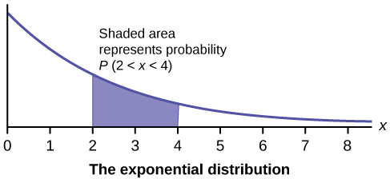
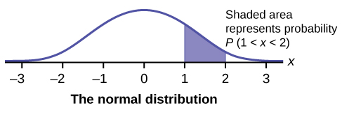

<?cnx.eoc class="summary" title="Chapter Review"?>

<?cnx.eoc class="formula-review" title="Formula Review"?>

<?cnx.eoc class="practice" title="Practice"?>

<?cnx.eoc class="bring-together-exercises" title="Bringing It Together : Practice"?>

<?cnx.eoc class="free-response" title="Homework"?>

<?cnx.eoc class="bring-together-homework" title="Bringing It Together : Homework"?>

<?cnx.eoc class="references" title="References"?>

 "){: data-media-type="image/jpeg"}

Chapter Objectives

By the end of this chapter, the student should be able to:

* Recognize and understand continuous probability density functions in general.
* Recognize the uniform probability distribution and apply it appropriately.
* Recognize the exponential probability distribution and apply it appropriately.

Continuous random variables have many applications. Baseball batting averages, IQ scores, the length of time a long distance telephone call lasts, the amount of money a person carries, the length of time a computer chip lasts, and SAT scores are just a few. The field of reliability depends on a variety of continuous random variables.

Note

The values of discrete and continuous random variables can be ambiguous. For example, if *X* is equal to the number of miles (to the nearest mile) you drive to work, then *X* is a discrete random variable. You count the miles. If *X* is the distance you drive to work, then you measure values of *X* and *X* is a continuous random variable. For a second example, if *X* is equal to the number of books in a backpack, then *X* is a discrete random variable. If *X* is the weight of a book, then *X* is a continuous random variable because weights are measured. How the random variable is defined is very important.

# Properties of Continuous Probability Distributions   {#eip-606}

The graph of a continuous probability distribution is a curve. Probability is represented by area under the curve.

The curve is called the **probability density function**{: data-type="term"} (abbreviated as **pdf**). We use the symbol *f*(*x*) to represent the curve. *f*(*x*) is the function that corresponds to the graph; we use the density function *f*(*x*) to draw the graph of the probability distribution.

**Area under the curve** is given by a different function called the <strong>cumulative distribution function </strong> (abbreviated as **cdf**). The cumulative distribution function is used to evaluate probability as area.

The outcomes are measured, not counted. The entire area under the curve and above the x-axis is equal to one. Probability is found for intervals of *x* values rather than for individual *x* values. *P(c &lt; x &lt; d)* is the probability that the random variable *X* is in the interval between the values *c* and *d*. *P(c &lt; x &lt; d)* is the area under the curve, above the *x*-axis, to the right of *c* and the left of *d*. *P(x = c) =* 0 The probability that *x* takes on any single individual value is zero. The area below the curve, above the *x*-axis, and between *x* = *c* and *x* = *c* has no width, and therefore no area (area = 0). Since the probability is equal to the area, the probability is also zero. *P(c &lt; x &lt; d)* is the same as *P(c ≤ x ≤ d)* because probability is equal to area. 

We will find the area that represents probability by using geometry, formulas, technology, or probability tables. In general, calculus is needed to find the area under the curve for many probability density functions. When we use formulas to find the area in this textbook, the formulas were found by using the techniques of integral calculus. However, because most students taking this course have not studied calculus, we will not be using calculus in this textbook.

There are many continuous probability distributions. When using a continuous probability distribution to model probability, the distribution used is selected to model and fit the particular situation in the best way.

In this chapter and the next, we will study the uniform distribution, the exponential distribution, and the normal distribution. The following graphs illustrate these distributions.

{: #id4131243 data-media-type="image/jpg"}

{: #id3243513 data-media-type="image/jpg"}

{: #eip-id1164898429541 data-media-type="image/jpg"}

