The **exponential distribution**{: data-type="term"} is often concerned with the amount of time until some specific event occurs. For example, the amount of time (beginning now) until an earthquake occurs has an exponential distribution. Other examples include the length, in minutes, of long distance business telephone calls, and the amount of time, in months, a car battery lasts. It can be shown, too, that the value of the change that you have in your pocket or purse approximately follows an exponential distribution.

Values for an exponential random variable occur in the following way. There are fewer large values and more small values. For example, the amount of money customers spend in one trip to the supermarket follows an exponential distribution. There are more people who spend small amounts of money and fewer people who spend large amounts of money.

Exponential distributions are commonly used in calculations of product reliability, or the length of time a product lasts.

Let *X* = amount of time (in minutes) a postal clerk spends with his or her customer. The time is known to have an exponential distribution with the average amount of time equal to four minutes.

*X* is a **continuous random variable**{: data-type="term"} since time is measured. It is given that *μ* = 4 minutes. To do any calculations, you must know *m*, the decay parameter.

<math xmlns="http://www.w3.org/1998/Math/MathML"> <mrow> <mi>m</mi><mo>=</mo><mfrac> <mn>1</mn> <mi>μ</mi> </mfrac> </mrow> </math>

. Therefore, <math xmlns="http://www.w3.org/1998/Math/MathML"> <mrow> <mi>m</mi><mo>=</mo><mfrac> <mn>1</mn> <mn>4</mn> </mfrac> <mo>=</mo><mn>0.25.</mn> </mrow> </math>

The standard deviation, *σ*, is the same as the mean. *μ* = *σ*

The distribution notation is *X* ~ *Exp*(*m*). Therefore, *X* ~ *Exp*(0.25).

The probability density function is *f*(*x*) = *me*-*mx*. The number *e* = 2.71828182846... It is a number that is used often in mathematics. Scientific calculators have the key \"*ex*.\" If you enter one for *x*, the calculator will display the value *e*.
{: .finger}

The curve is:

*f*(*x*) = 0.25*e*–0.25*x* where *x* is at least zero and *m* = 0.25.

For example, *f*(5) = 0.25*e*(-0.25)(5) = 0.072. The probability that the postal clerk spends five minutes with the customers is 0.072.

The graph is as follows:

{:}

Notice the graph is a declining curve. When *x* = 0,

*f*(*x*) = 0.25*e*(−0.25)(0) = (0.25)(1) = 0.25 = *m*. The maximum value on the *y*-axis is *m*.

Try It

The amount of time spouses shop for anniversary cards can be modeled by an exponential distribution with the average amount of time equal to eight minutes. Write the distribution, state the probability density function, and graph the distribution.

*X* ~ *Exp*(0.125); *f*(*x*) = 0.125e–0.125*x*;

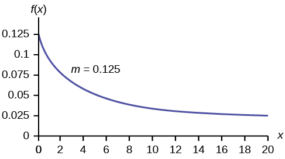{:}

a. Using the information in [[link]](#fs-idp58220144), find the probability that a clerk spends four to five minutes with a randomly selected customer.

a. Find *P*(4 &lt; *x* &lt; 5). * * *
{: data-type="newline"}

The **cumulative distribution function (CDF)**{: data-type="term"} gives the area to the left. * * *
{: data-type="newline"}

*P*(*x* &lt; *x*) = 1 – *e–mx* * * *
{: data-type="newline"}

*P*(*x* &lt; 5) = 1 – *e*(−0.25)(5) = 0.7135 and *P*(*x* &lt; 4) = 1 – *e*(–0.25)(4) = 0.6321

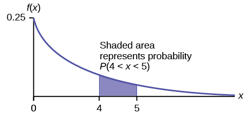{:}

NOTE

You can do these calculations easily on a calculator.

* * *
{: data-type="newline"}

 The probability that a postal clerk spends four to five minutes with a randomly selected customer is *P*(4 &lt; *x* &lt; 5) = *P*(*x* &lt; 5) – *P*(*x* &lt; 4) = 0.7135 − 0.6321 = 0.0814.

On the home screen, enter (1 – e^(–0.25*5))–(1–e^(–0.25*4)) or enter e^(–0.25*4) – e^(–0.25*5).

b. Half of all customers are finished within how long? (Find the 50th percentile)* * *
{: data-type="newline" data-count="2"}

b. Find the 50th percentile.

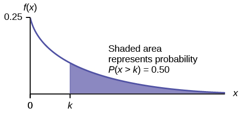{:}

*P*(*x* &lt; *k*) = 0.50, *k* = 2.8 minutes (calculator or computer)
{: .finger}

Half of all customers are finished within 2.8 minutes.

You can also do the calculation as follows:

*P*(*x* &lt; *k*) = 0.50 and *P*(*x* &lt; *k*) = 1 –*e*–0.25*k*

Therefore, 0.50 = 1 − *e*−0.25*k* and *e*−0.25*k* = 1 − 0.50 = 0.5

Take natural logs: *ln*(*e*–0.25*k*) = *ln*(0.50). So, –0.25*k* = *ln*(0.50)

Solve for *k*:<math xmlns="http://www.w3.org/1998/Math/MathML"> <mrow> <mi>k</mi><mo>=</mo><mfrac> <mrow> <mi>l</mi><mi>n</mi><mo stretchy="false">(</mo><mn>0.50</mn><mo stretchy="false">)</mo> </mrow> <mrow> <mo>-</mo><mn>0.25</mn> </mrow> </mfrac> <mo>=</mo><mn>2.8</mn> </mrow> </math>

 minutes. The calculator simplifies the calculation for percentile *k*. See the following two notes.

Note

A formula for the percentile *k* is <math xmlns="http://www.w3.org/1998/Math/MathML"> <mrow> <mi>k</mi><mo>=</mo><mfrac> <mrow> <mi>l</mi><mi>n</mi><mo stretchy="false">(</mo><mn>1</mn><mo>−</mo><mi>A</mi><mi>r</mi><mi>e</mi><mi>a</mi><mi>T</mi><mi>o</mi><mi>T</mi><mi>h</mi><mi>e</mi><mi>L</mi><mi>e</mi><mi>f</mi><mi>t</mi><mo stretchy="false">)</mo> </mrow> <mrow> <mo>−</mo><mi>m</mi> </mrow> </mfrac> </mrow> </math>

 where *ln* is the natural log.

Collaborative Exercise

On the home screen, enter ln(1 – 0.50)/–0.25. Press the (-) for the negative.

c. Which is larger, the mean or the median?* * *
{: data-type="newline" data-count="2"}

c. From part b, the median or 50th percentile is 2.8 minutes. The theoretical mean is four minutes. The mean is larger.

Try It

The number of days ahead travelers purchase their airline tickets can be modeled by an exponential distribution with the average amount of time equal to 15 days. Find the probability that a traveler will purchase a ticket fewer than ten days in advance. How many days do half of all travelers wait?

*P*(*x* &lt; 10) = 0.4866

50th percentile = 10.40

Collaborative Exercise

Have each class member count the change he or she has in his or her pocket or purse. Your instructor will record the amounts in dollars and cents. Construct a histogram of the data taken by the class. Use five intervals. Draw a smooth curve through the bars. The graph should look approximately exponential. Then calculate the mean.

Let *X* = the amount of money a student in your class has in his or her pocket or purse.

The distribution for *X* is approximately exponential with mean, *μ* = \\\_\\\_\\\_\\\_\\\_\\\_\\\_ and *m* = \\\_\\\_\\\_\\\_\\\_\\\_\\\_. The standard deviation, *σ* = \\\_\\\_\\\_\\\_\\\_\\\_\\\_\\\_.

Draw the appropriate exponential graph. You should label the x– and y–axes, the decay rate, and the mean. Shade the area that represents the probability that one student has less than $.40 in his or her pocket or purse. (Shade *P*(*x* &lt; 0.40)).

On the average, a certain computer part lasts ten years. The length of time the computer part lasts is exponentially distributed.* * *
{: data-type="newline"}

a. What is the probability that a computer part lasts more than 7 years?* * *
{: data-type="newline" data-count="2"}

a. Let *x* = the amount of time (in years) a computer part lasts. * * *
{: data-type="newline"}

*μ* = 10 so <math xmlns="http://www.w3.org/1998/Math/MathML"> <mrow> <mi>m</mi><mo>=</mo><mfrac> <mn>1</mn> <mi>μ</mi> </mfrac> <mo>=</mo><mfrac> <mn>1</mn> <mrow> <mn>10</mn> </mrow> </mfrac> <mo>=</mo><mn>0.1</mn> </mrow> </math>

 * * *
{: data-type="newline"}

Find *P*(*x* &gt; 7). Draw the graph. * * *
{: data-type="newline"}

*P*(*x* &gt; 7) = 1 – *P*(*x* &lt; 7). * * *
{: data-type="newline"}

Since *P*(*X* &lt; *x*) = 1 –*e–mx* then *P*(*X* &gt; *x*) = 1 –(1 –*e–mx*) = *e-mx* * * *
{: data-type="newline"}

*P*(*x* &gt; 7) = *e*(–0.1)(7) = 0.4966. The probability that a computer part lasts more than seven years is 0.4966.

On the home screen, enter e^(-.1\*7).

{:}

b. On the average, how long would five computer parts last if they are used one after another?* * *
{: data-type="newline" data-count="2"}

b. On the average, one computer part lasts ten years. Therefore, five computer parts, if they are used one right after the other would last, on the average, (5)(10) = 50 years.* * *
{: data-type="newline" data-count="2"}

c. Eighty percent of computer parts last at most how long?

c. Find the 80th percentile. Draw the graph. Let *k* = the 80th percentile.

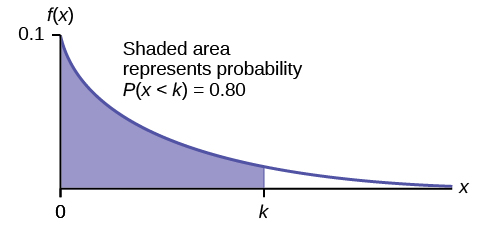{:}

Solve for *k*: <math xmlns="http://www.w3.org/1998/Math/MathML"> <mrow> <mi>k</mi><mo>=</mo><mfrac> <mrow> <mi>l</mi><mi>n</mi><mo stretchy="false">(</mo><mn>1</mn><mo>–</mo><mn>0.80</mn><mo stretchy="false">)</mo> </mrow> <mrow> <mo>–</mo><mn>0.1</mn> </mrow> </mfrac> <mo>=</mo><mn>16.1</mn> </mrow> </math>

 years

Eighty percent of the computer parts last at most 16.1 years.

On the home screen, enter <math xmlns="http://www.w3.org/1998/Math/MathML"> <mrow> <mfrac> <mrow> <mi>ln</mi><mo stretchy="false">(</mo><mn>1</mn><mo>–</mo><mn>0.80</mn><mo stretchy="false">)</mo> </mrow> <mrow> <mo>–</mo><mn>0.1</mn> </mrow> </mfrac> </mrow> </math>

d. What is the probability that a computer part lasts between nine and 11 years?

d. Find *P*(9 &lt; *x* &lt; 11). Draw the graph.

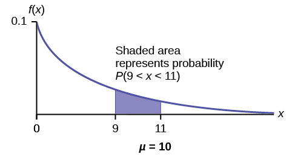{:}

*P*(9 &lt; *x* &lt; 11) = *P*(*x* &lt; 11) – *P*(*x* &lt; 9) = (1 – *e*(–0.1)(11)) – (1 – *e*(–0.1)(9)) = 0.6671 – 0.5934 = 0.0737. The probability that a computer part lasts between nine and 11 years is 0.0737.

On the home screen, enter *e*^(–0.1\*9) – *e*^(–0.1\*11).

Try It

On average, a pair of running shoes can last 18 months if used every day. The length of time running shoes last is exponentially distributed. What is the probability that a pair of running shoes last more than 15 months? On average, how long would six pairs of running shoes last if they are used one after the other? Eighty percent of running shoes last at most how long if used every day?

*P*(*x* &gt; 15) = 0.4346

Six pairs of running shoes would last 108 months on average.

80th percentile = 28.97 months

Suppose that the length of a phone call, in minutes, is an exponential random variable with decay parameter <math xmlns="http://www.w3.org/1998/Math/MathML"> <mrow> <mfrac> <mn>1</mn> <mrow> <mn>12</mn> </mrow> </mfrac> </mrow> </math>

. If another person arrives at a public telephone just before you, find the probability that you will have to wait more than five minutes. Let *X* = the length of a phone call, in minutes.

What is *m*, *μ*, and *σ*? The probability that you must wait more than five minutes is \_\_\_\_\_\_\_ .

* *m* =
  <math xmlns="http://www.w3.org/1998/Math/MathML"> <mrow> <mfrac> <mn>1</mn> <mrow> <mn>12</mn> </mrow> </mfrac> </mrow> </math>

* *μ* = 12
* *σ* = 12

*P*(*x* &gt; 5) = 0.6592

Try It

Suppose that the distance, in miles, that people are willing to commute to work is an exponential random variable with a decay parameter <math xmlns="http://www.w3.org/1998/Math/MathML"> <mrow> <mfrac> <mn>1</mn> <mrow> <mn>20</mn> </mrow> </mfrac> </mrow> </math>

. Let *X* = the distance people are willing to commute in miles. What is *m*, *μ*, and *σ*? What is the probability that a person is willing to commute more than 25 miles?

*m* = <math xmlns="http://www.w3.org/1998/Math/MathML"> <mrow> <mfrac> <mn>1</mn> <mrow> <mn>20</mn> </mrow> </mfrac> </mrow> </math>

; *μ* = 20; *σ* = 20; *P*(*x* &gt; 25) = 0.2865

The time spent waiting between events is often modeled using the exponential distribution. For example, suppose that an average of 30 customers per hour arrive at a store and the time between arrivals is exponentially distributed.

1.  On average, how many minutes elapse between two successive arrivals?
2.  When the store first opens, how long on average does it take for three customers to arrive?
3.  After a customer arrives, find the probability that it takes less than one minute for the next customer to arrive.
4.  After a customer arrives, find the probability that it takes more than five minutes for the next customer to arrive.
5.  Seventy percent of the customers arrive within how many minutes of the previous customer?
6.  Is an exponential distribution reasonable for this situation?
{: type="a"}

1.  Since we expect 30 customers to arrive per hour (60 minutes), we expect on average one customer to arrive every two minutes on average.
2.  Since one customer arrives every two minutes on average, it will take six minutes on average for three customers to arrive.
3.  Let *X* = the time between arrivals, in minutes. By part a, *μ* = 2, so *m* =
    <math xmlns="http://www.w3.org/1998/Math/MathML"> <mrow> <mfrac> <mn>1</mn> <mn>2</mn> </mfrac> </mrow> </math>
    
    = 0.5.
    * * *
    {: data-type="newline"}
    
    Therefore, *X* ∼ *Exp*(0.5).
    * * *
    {: data-type="newline"}
    
    The cumulative distribution function is *P*(*X* &lt; *x*) = 1 – *e*(-0.5)(x).
    * * *
    {: data-type="newline"}
    
    **Therefore** *P*(*X* &lt; 1) = 1 – e(–0.5)(1) ≈ 0.3935.
    

    1 - *e*^(–0.5) ≈ 0.3935
    
    

    
    {:}

4.  *P*(*X* &gt; 5) = 1 – *P*(*X* &lt; 5) = 1 – (1 – *e*(-0.50)(5)) = e–2.5 ≈ 0.0821. 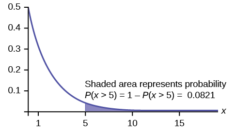{:}

    

    1 – (1 – e^((-0.50)(5))) or e^( – 5*0.5)
    
    

5.  We want to solve 0.70 = *P*(*X* &lt; *x*) for *x*.
    * * *
    {: data-type="newline"}
    
    Substituting in the cumulative distribution function gives 0.70 = 1 – *e*–0.5*x*, so that *e*–0.5x = 0.30. Converting this to logarithmic form gives –0.5*x* = *ln*(0.30), or
    <math xmlns="http://www.w3.org/1998/Math/MathML"> <mrow> <mi>x</mi><mo>=</mo><mfrac> <mrow> <mi>l</mi><mi>n</mi><mrow><mo>(</mo> <mrow> <mn>0.30</mn> </mrow> <mo>)</mo></mrow> </mrow> <mrow> <mo>–</mo><mn>0.5</mn> </mrow> </mfrac> <mo>≈</mo><mn>2.41</mn> </mrow> </math>
    
    minutes.
    * * *
    {: data-type="newline"}
    
    Thus, seventy percent of customers arrive within 2.41 minutes of the previous customer.
    * * *
    {: data-type="newline"}
    
    You are finding the 70th percentile *k* so you can use the formula *k* =
    <math xmlns="http://www.w3.org/1998/Math/MathML"> <mrow> <mfrac> <mrow> <mi>l</mi><mi>n</mi><mo stretchy="false">(</mo><mn>1</mn><mo>–</mo><mi>A</mi><mi>r</mi><mi>e</mi><mi>a</mi><mo>\_</mo><mi>T</mi><mi>o</mi><mo>\_</mo><mi>T</mi><mi>h</mi><mi>e</mi><mo>\_</mo><mi>L</mi><mi>e</mi><mi>f</mi><mi>t</mi><mo>\_</mo><mi>O</mi><mi>f</mi><mo>\_</mo><mi>k</mi><mo stretchy="false">)</mo> </mrow> <mrow> <mo stretchy="false">(</mo><mo>–</mo><mi>m</mi><mo stretchy="false">)</mo> </mrow> </mfrac> </mrow> </math>
    
    * * *
    {: data-type="newline"}
    
    *k* =
    <math xmlns="http://www.w3.org/1998/Math/MathML" display=""> <mrow> <mfrac> <mrow> <mi>l</mi><mi>n</mi><mo stretchy="false">(</mo><mn>1</mn><mo>–</mo><mn>0.70</mn><mo stretchy="false">)</mo> </mrow> <mrow> <mo stretchy="false">(</mo><mo>–</mo><mn>0.5</mn><mo stretchy="false">)</mo> </mrow> </mfrac> <mo>≈</mo><mn>2.41</mn> </mrow> </math>
    
    minutes 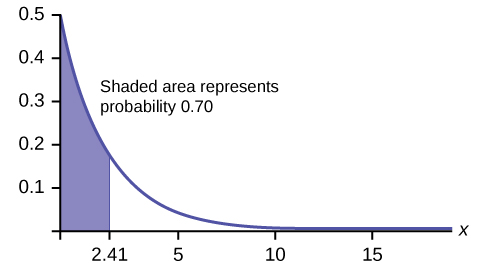{:}

6.  This model assumes that a single customer arrives at a time, which may not be reasonable since people might shop in groups, leading to several customers arriving at the same time. It also assumes that the flow of customers does not change throughout the day, which is not valid if some times of the day are busier than others.
{: type="a"}

Try It

Suppose that on a certain stretch of highway, cars pass at an average rate of five cars per minute. Assume that the duration of time between successive cars follows the exponential distribution.

1.  On average, how many seconds elapse between two successive cars?
2.  After a car passes by, how long on average will it take for another seven cars to pass by?
3.  Find the probability that after a car passes by, the next car will pass within the next 20 seconds.
4.  Find the probability that after a car passes by, the next car will not pass for at least another 15 seconds.
{: type="a"}

1.  At a rate of five cars per minute, we expect
    <math xmlns="http://www.w3.org/1998/Math/MathML"> <mrow> <mfrac> <mrow> <mn>60</mn> </mrow> <mn>5</mn> </mfrac> </mrow> </math>
    
    = 12 seconds to pass between successive cars on average.
2.  Using the answer from part a, we see that it takes (12)(7) = 84 seconds for the next seven cars to pass by.
3.  Let *T* = the time (in seconds) between successive cars.
    * * *
    {: data-type="newline"}
    
    The mean of *T* is 12 seconds, so the decay parameter is
    <math xmlns="http://www.w3.org/1998/Math/MathML"> <mrow> <mfrac> <mn>1</mn> <mrow> <mn>12</mn> </mrow> </mfrac> </mrow> </math>
    
    and *T* ∼ *Exp*
    <math xmlns="http://www.w3.org/1998/Math/MathML"> <mrow> <mfrac> <mn>1</mn> <mrow> <mn>12</mn> </mrow> </mfrac> </mrow> </math>
    
    . The cumulative distribution function of *T* is *P*(*T* &lt; *t*) = 1 – *e*<math xmlns="http://www.w3.org/1998/Math/MathML"> <mrow> <mo>-</mo><mfrac> <mi>t</mi> <mrow> <mn>12</mn> </mrow> </mfrac> </mrow> </math>
    . Then *P*(*T* &lt; 20) = 1 –e<math xmlns="http://www.w3.org/1998/Math/MathML"> <mrow> <mo>-</mo><mfrac> <mrow> <mn>20</mn> </mrow> <mrow> <mn>12</mn> </mrow> </mfrac> </mrow> </math>
     ≈ 0.8111. 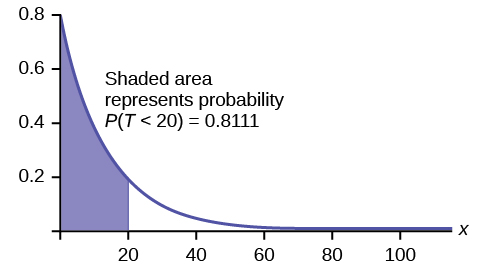{:}

    * * *
    {: data-type="newline"}
    
    *P*(*T* &gt; 15) = 1 – *P*(*T* &lt; 15) = 1 – (1 – e<math xmlns="http://www.w3.org/1998/Math/MathML"> <mrow> <mo>-</mo><mfrac> <mrow> <mn>15</mn> </mrow> <mrow> <mn>12</mn> </mrow> </mfrac> </mrow> </math>
    ) = *e*<math xmlns="http://www.w3.org/1998/Math/MathML"> <mrow> <mo>-</mo><mfrac> <mrow> <mn>15</mn> </mrow> <mrow> <mn>12</mn> </mrow> </mfrac> </mrow> </math>
     ≈ 0.2865.
{: type="a"}

### Memorylessness of the Exponential Distribution

In [\[link\]](#fs-idp58220144) recall that the amount of time between customers is exponentially distributed with a mean of two minutes (*X* ~ *Exp* (0.5)). Suppose that five minutes have elapsed since the last customer arrived. Since an unusually long amount of time has now elapsed, it would seem to be more likely for a customer to arrive within the next minute. With the exponential distribution, this is not the case–the additional time spent waiting for the next customer does not depend on how much time has already elapsed since the last customer. This is referred to as the **memoryless property**. Specifically, the **memoryless property** says that

*P* (*X* &gt; *r* + *t* \\\| *X* &gt; *r*) = *P* (*X* &gt; *t*) for all *r* ≥ 0 and *t* ≥ 0

For example, if five minutes have elapsed since the last customer arrived, then the probability that more than one minute will elapse before the next customer arrives is computed by using *r* = 5 and *t* = 1 in the foregoing equation.

*P*(*X* &gt; 5 + 1 \\\| *X* &gt; 5) = *P*(*X* &gt; 1) = <math xmlns="http://www.w3.org/1998/Math/MathML"> <mrow> <msup> <mi>e</mi> <mrow> <mrow><mo>(</mo> <mrow> <mo>–</mo><mn>0.5</mn> </mrow> <mo>)</mo></mrow><mrow><mo>(</mo> <mn>1</mn> <mo>)</mo></mrow> </mrow> </msup> </mrow> </math>

 ≈ 0.6065.

*This is the same* probability as that of waiting more than one minute for a customer to arrive after the previous arrival.

The exponential distribution is often used to model the longevity of an electrical or mechanical device. In [\[link\]](#fs-idp51839440), the lifetime of a certain computer part has the exponential distribution with a mean of ten years (*X* ~ *Exp*(0.1)). The **memoryless property** says that knowledge of what has occurred in the past has no effect on future probabilities. In this case it means that an old part is not any more likely to break down at any particular time than a brand new part. In other words, the part stays as good as new until it suddenly breaks. For example, if the part has already lasted ten years, then the probability that it lasts another seven years is *P*(*X* &gt; 17\\\|*X* &gt; 10) = *P*(*X* &gt; 7) = 0.4966.

Refer to [\[link\]](#fs-idp58220144) where the time a postal clerk spends with his or her customer has an exponential distribution with a mean of four minutes. Suppose a customer has spent four minutes with a postal clerk. What is the probability that he or she will spend at least an additional three minutes with the postal clerk?* * *
{: data-type="newline" data-count="2"}

The decay parameter of *X* is *m* = <math xmlns="http://www.w3.org/1998/Math/MathML"> <mrow> <mfrac> <mn>1</mn> <mn>4</mn> </mfrac> </mrow> </math>

 = 0.25, so *X* ∼ *Exp*(0.25).

The cumulative distribution function is *P*(*X* &lt; *x*) = 1 – *e*–0.25*x*.

We want to find *P*(*X* &gt; 7\\\|*X* &gt; 4). The **memoryless property** says that *P*(*X* &gt; 7\\\|*X* &gt; 4) = *P* (*X* &gt; 3), so we just need to find the probability that a customer spends more than three minutes with a postal clerk.

This is *P*(*X* &gt; 3) = 1 – *P* (*X* &lt; 3) = 1 – (1 – *e*–0.25⋅3) = *e*–0.75 ≈ 0.4724.

{:}

1–(1–e^(–0.25\*3)) = e^(–0.25\*3).

Try It

Suppose that the longevity of a light bulb is exponential with a mean lifetime of eight years. If a bulb has already lasted 12 years, find the probability that it will last a total of over 19 years.

Let *T* = the lifetime of the light bulb. Then *T* ∼ *Exp*<math xmlns="http://www.w3.org/1998/Math/MathML"> <mrow> <mrow><mo>(</mo> <mrow> <mfrac> <mn>1</mn> <mn>8</mn> </mfrac> </mrow> <mo>)</mo></mrow> </mrow> </math>

.

The cumulative distribution function is *P* (*T* &lt; *t*) = 1 − <math xmlns="http://www.w3.org/1998/Math/MathML"> <mrow> <msup> <mi>e</mi> <mrow> <mo>-</mo><mfrac> <mi>t</mi> <mn>8</mn> </mfrac> </mrow> </msup> </mrow> </math>

We need to find *P*(*T* &gt; 19\|*T* = 12). By the **memoryless property**,

*P*(*T*&gt;19\|*T* = 12) = *P*(*T* &gt; 7) = 1 – *P*(*T* &lt; 7) = 1 – (1 – e–7/8)= e-7/8 ≈ 0.4169.

1 – (1 – e^(–7/8)) = e^(–7/8).

### Relationship between the Poisson and the Exponential Distribution

There is an interesting relationship between the exponential distribution and the Poisson distribution. Suppose that the time that elapses between two successive events follows the exponential distribution with a mean of *μ* units of time. Also assume that these times are independent, meaning that the time between events is not affected by the times between previous events. If these assumptions hold, then the number of events per unit time follows a Poisson distribution with mean *λ* = 1/μ. Recall from the chapter on [Discrete Random Variables](/m46955) that if *X* has the Poisson distribution with mean *λ*, then <math xmlns="http://www.w3.org/1998/Math/MathML"> <mrow> <mi>P</mi><mo stretchy="false">(</mo><mi>X</mi><mo>=</mo><mi>k</mi><mo stretchy="false">)</mo><mo>=</mo><mfrac> <mrow> <msup> <mi>λ</mi> <mi>k</mi> </msup> <msup> <mi>e</mi> <mrow> <mo>−</mo><mi>λ</mi> </mrow> </msup> </mrow> <mrow> <mi>k</mi><mo>!</mo> </mrow> </mfrac> </mrow> </math>

. Conversely, if the number of events per unit time follows a Poisson distribution, then the amount of time between events follows the exponential distribution. (*k*! = *k*\*(*k*–1\*)(*k*–2)\*(*k*–3)\*…3\*2\*1)

Suppose *X* has the Poisson distribution with mean *λ*. Compute *P*(*X* = *k*) by entering 2nd, VARS(DISTR), C: poissonpdf(*λ*, *k*). To compute *P*(*X* ≤ *k*), enter 2nd, VARS (DISTR), D:poissoncdf(*λ*, *k*).

At a police station in a large city, calls come in at an average rate of four calls per minute. Assume that the time that elapses from one call to the next has the exponential distribution. Take note that we are concerned only with the rate at which calls come in, and we are ignoring the time spent on the phone. We must also assume that the times spent between calls are independent. This means that a particularly long delay between two calls does not mean that there will be a shorter waiting period for the next call. We may then deduce that the total number of calls received during a time period has the Poisson distribution.

1.  Find the average time between two successive calls.
2.  Find the probability that after a call is received, the next call occurs in less than ten seconds.
3.  Find the probability that exactly five calls occur within a minute.
4.  Find the probability that less than five calls occur within a minute.
5.  Find the probability that more than 40 calls occur in an eight-minute period.
{: type="a"}

1.  On average there are four calls occur per minute, so 15 seconds, or
    <math xmlns="http://www.w3.org/1998/Math/MathML"> <mrow> <mfrac> <mrow> <mn>15</mn> </mrow> <mrow> <mn>60</mn> </mrow> </mfrac> </mrow> </math>
    
    = 0.25 minutes occur between successive calls on average.
2.  Let *T* = time elapsed between calls. From part a, *μ* = 0.25, so *m* =
    <math xmlns="http://www.w3.org/1998/Math/MathML"> <mrow> <mfrac> <mn>1</mn> <mrow> <mn>0.25</mn> </mrow> </mfrac> </mrow> </math>
    
    = 4. Thus, *T* ∼ *Exp*(4).
    * * *
    {: data-type="newline"}
    
    The cumulative distribution function is *P*(*T* &lt; *t*) = 1 – *e*–4*t*.
    * * *
    {: data-type="newline"}
    
    The probability that the next call occurs in less than ten seconds (ten seconds = 1/6 minute) is
    <math xmlns="http://www.w3.org/1998/Math/MathML"> <mrow> <mi>P</mi><mrow><mo>(</mo> <mrow> <mi>T</mi><mtext> &lt; </mtext><mfrac> <mn>1</mn> <mn>6</mn> </mfrac> </mrow> <mo>)</mo></mrow><mo>=</mo><mn>1</mn><mo>–</mo><msup> <mi>e</mi> <mrow> <mo>(</mo><mo>–</mo><mn>4</mn><mo>)</mo><mo>(</mo><mfrac> <mn>1</mn> <mn>6</mn> </mfrac><mo>)</mo> </mrow> </msup> <mo>≈</mo><mn>0.4866.</mn> </mrow> </math>
    
    {:}

3.  Let *X* = the number of calls per minute. As previously stated, the number of calls per minute has a Poisson distribution, with a mean of four calls per minute.
    * * *
    {: data-type="newline"}
    
    Therefore, *X* ∼ *Poisson*(4), and so *P*(*X* = 5) =
    <math xmlns="http://www.w3.org/1998/Math/MathML"> <mrow> <mfrac> <mrow> <msup> <mn>4</mn> <mn>5</mn> </msup> <msup> <mi>e</mi> <mrow> <mo>−</mo><mn>4</mn> </mrow> </msup> </mrow> <mrow> <mn>5</mn><mo>!</mo> </mrow> </mfrac> </mrow> </math>
    
    ≈ 0.1563. (5! = (5)(4)(3)(2)(1))
    

    poissonpdf(4, 5) = 0.1563.
    
    

4.  Keep in mind that *X* must be a whole number, so *P*(*X* &lt; 5) = *P*(*X* ≤ 4).
    * * *
    {: data-type="newline"}
    
    To compute this, we could take *P*(*X* = 0) + *P*(*X* = 1) + *P*(*X* = 2) + *P*(*X* = 3) + *P*(*X* = 4).
    * * *
    {: data-type="newline"}
    
    Using technology, we see that *P*(*X* ≤ 4) = 0.6288.
    

    poisssoncdf(4, 4) = 0.6288
    
    

5.  Let *Y* = the number of calls that occur during an eight minute period.
    * * *
    {: data-type="newline"}
    
    Since there is an average of four calls per minute, there is an average of (8)(4) = 32 calls during each eight minute period.
    * * *
    {: data-type="newline"}
    
    Hence, *Y* ∼ *Poisson*(32). Therefore, *P*(*Y* &gt; 40) = 1 – *P* (*Y* ≤ 40) = 1 – 0.9294 = 0.0707.
    

    1 – poissoncdf(32, 40). = 0.0707
    
    

{: type="a"}

Try It

In a small city, the number of automobile accidents occur with a Poisson distribution at an average of three per week.

1.  Calculate the probability that there are at most 2 accidents occur in any given week.
2.  What is the probability that there is at least two weeks between any 2 accidents?
{: type="a"}

1.  Let *X* = the number of accidents per week, so that *X* ∼ *Poisson*(3). We need to find *P*(*X* ≤ 2) ≈ 0.4232
    

    poissoncdf(3, 2)
    
    

2.  Let *T* = the time (in weeks) between successive accidents.
    * * *
    {: data-type="newline"}
    
    Since the number of accidents occurs with a Poisson distribution, the time between accidents follows the exponential distribution.
    * * *
    {: data-type="newline"}
    
    If there are an average of three per week, then on average there is *μ* =
    <math xmlns="http://www.w3.org/1998/Math/MathML"> <mrow> <mfrac> <mn>1</mn> <mn>3</mn> </mfrac> </mrow> </math>
    
    of a week between accidents, and the decay parameter is *m* =
    <math xmlns="http://www.w3.org/1998/Math/MathML"> <mrow> <mfrac> <mn>1</mn> <mrow> <mrow><mo>(</mo> <mrow> <mfrac> <mn>1</mn> <mn>3</mn> </mfrac> </mrow> <mo>)</mo></mrow> </mrow> </mfrac> </mrow> </math>
    
    = 3.
    * * *
    {: data-type="newline"}
    
    To find the probability that there are at least two weeks between two accidents, *P*(*T* &gt; 2) = 1 – *P*(*T* &lt; 2) = 1 – (1 – *e*(–3)(2)) = *e*–6 ≈ 0.0025.
    

    e^(-3*2).
    
    

{: type="a"}

### Chapter Review

If *X* has an **exponential distribution** with mean *μ*, then the **decay parameter** is *m* = <math xmlns="http://www.w3.org/1998/Math/MathML"> <mrow> <mfrac> <mn>1</mn> <mi>μ</mi> </mfrac> </mrow> </math>

, and we write *X* ∼ *Exp*(*m*) where *x* ≥ 0 and *m* &gt; 0 . The probability density function of *X* is *f*(*x*) = *me-mx* (or equivalently <math xmlns="http://www.w3.org/1998/Math/MathML"> <mrow> <mi>f</mi><mo stretchy="false">(</mo><mi>x</mi><mo stretchy="false">)</mo><mo>=</mo><mfrac> <mn>1</mn> <mi>μ</mi> </mfrac> <msup> <mi>e</mi> <mrow> <mo>−</mo><mi>x</mi><mo>/</mo><mi>μ</mi> </mrow> </msup> </mrow> </math>

. The cumulative distribution function of *X* is *P*(*X* ≤ *x*) = 1 – *e*–*mx*.

The exponential distribution has the **memoryless property**, which says that future probabilities do not depend on any past information. Mathematically, it says that *P*(*X* &gt; *x* + *k*\\\|*X* &gt; *x*) = *P*(*X* &gt; *k*).

If *T* represents the waiting time between events, and if *T* ∼ *Exp*(*λ*), then the number of events *X* per unit time follows the Poisson distribution with mean *λ*. The probability density function of *X* is <math xmlns="http://www.w3.org/1998/Math/MathML"><mo>P</mo> <mrow> <mo stretchy="false">(</mo><mi>X</mi><mo>=</mo><mi>k</mi><mo stretchy="false">)</mo><mo>=</mo><mfrac> <mrow> <msup> <mi>λ</mi> <mi>k</mi> </msup> <msup> <mi>e</mi> <mrow> <mo>−</mo><mi>k</mi> </mrow> </msup> </mrow> <mrow> <mi>k</mi><mo>!</mo> </mrow> </mfrac> </mrow> </math>

. This may be computed using a TI-83, 83+, 84, 84+ calculator with the command poissonpdf(*λ*, *k*). The cumulative distribution function *P*(*X* ≤ *k*) may be computed using the TI-83, 83+,84, 84+ calculator with the command poissoncdf(*λ*, *k*).

### Formula Review

Exponential: *X* ~ *Exp*(*m*) where *m* = the decay parameter

* pdf: *f*(*x*) = *me*(–*mx*) where *x* ≥ 0 and *m* &gt; 0
* cdf: *P*(*X* ≤ *x*) = 1 – *e*(–*mx*)
* mean *µ* =
  <math xmlns="http://www.w3.org/1998/Math/MathML"> <mrow> <mfrac> <mn>1</mn> <mi>m</mi> </mfrac> </mrow> </math>

* standard deviation *σ* = *µ*
* percentile *k*\: *k* =
  <math xmlns="http://www.w3.org/1998/Math/MathML" display=""> <mrow> <mfrac> <mrow> <mi>l</mi><mi>n</mi><mo stretchy="false">(</mo><mn>1</mn><mo>−</mo><mi>A</mi><mi>r</mi><mi>e</mi><mi>a</mi><mi>T</mi><mi>o</mi><mi>T</mi><mi>h</mi><mi>e</mi><mi>L</mi><mi>e</mi><mi>f</mi><mi>t</mi><mi>O</mi><mi>f</mi><mi>k</mi><mo stretchy="false">)</mo> </mrow> <mrow> <mo stretchy="false">(</mo><mo>−</mo><mi>m</mi><mo stretchy="false">)</mo> </mrow> </mfrac> </mrow> </math>

* Additionally
  * *P*(*X* &gt; *x*) = *e*(–*mx*)
  * *P*(*a* &lt; *X* &lt; *b*) = *e*(–*ma*) – *e*(–*mb*)

* Memoryless Property: *P*(*X* &gt; *x* + *k*\\\|*X* &gt; *x*) = *P* (*X* &gt; *k*)
* Poisson probability:
  <math xmlns="http://www.w3.org/1998/Math/MathML"> <mrow> <mo> </mo><mi>P</mi><mo stretchy="false">(</mo><mi>X</mi><mo>=</mo><mi>k</mi><mo stretchy="false">)</mo><mo>=</mo><mfrac> <mrow> <msup> <mi>λ</mi> <mi>k</mi> </msup> <msup> <mi>e</mi> <mrow> <mo>−</mo><mi>k</mi> </mrow> </msup> </mrow> <mrow> <mi>k</mi><mo>!</mo> </mrow> </mfrac> </mrow> </math>
  
  with mean *λ*
* *k*! = *k*\*(*k*-1)\*(*k*-2)\*(*k*-3)\*…3\*2\*1

### References   {#eip-568}

Data from the United States Census Bureau.

Data from World Earthquakes, 2013. Available online at http://www.world-earthquakes.com/ (accessed June 11, 2013).

“No-hitter.” Baseball-Reference.com, 2013. Available online at http://www.baseball-reference.com/bullpen/No-hitter (accessed June 11, 2013).

Zhou, Rick. “Exponential Distribution lecture slides.” Available online at www.public.iastate.edu/~riczw/stat330s11/lecture/lec13.pdf‎ (accessed June 11, 2013).

<section data-depth="1" class="practice" markdown="1">
*Use the following information to answer the next ten exercises.* A customer service representative must spend different amounts of time with each customer to resolve various concerns. The amount of time spent with each customer can be modeled by the following distribution: *X* ~ *Exp*(0.2)

What type of distribution is this?

Are outcomes equally likely in this distribution? Why or why not?

No, outcomes are not equally likely. In this distribution, more people require a little bit of time, and fewer people require a lot of time, so it is more likely that someone will require less time.

What is *m*? What does it represent?

What is the mean?

five

What is the standard deviation?

State the probability density function.

*f*(*x*) = 0.2e-0.2*x*

Graph the distribution.

Find *P*(2 &lt; *x* &lt; 10).

0\.5350

Find *P*(*x* &gt; 6).

Find the 70th percentile.

6\.02

* * *
{: data-type="newline"}

*Use the following information to answer the next seven exercises.* A distribution is given as *X* ~ *Exp*(0.75).

What is *m*?

What is the probability density function?

*f*(*x*) = 0.75*e*-0.75*x*

What is the cumulative distribution function?

Draw the distribution.

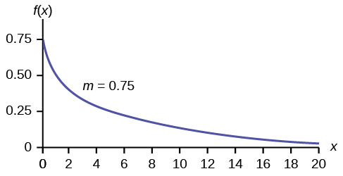{:}

Find *P*(*x* &lt; 4).

Find the 30th percentile.

0\.4756

Find the median.

Which is larger, the mean or the median?

The mean is larger. The mean is <math xmlns="http://www.w3.org/1998/Math/MathML"> <mrow> <mfrac> <mn>1</mn> <mi>m</mi> </mfrac> <mo>=</mo><mfrac> <mn>1</mn> <mrow> <mn>0.75</mn> </mrow> </mfrac> <mo>≈</mo><mn>1.33</mn> </mrow> </math>

, which is greater than 0.9242.

*Use the following information to answer the next 16 exercises.* Carbon-14 is a radioactive element with a half-life of about 5,730 years. Carbon-14 is said to decay exponentially. The decay rate is 0.000121. We start with one gram of carbon-14. We are interested in the time (years) it takes to decay carbon-14.

What is being measured here?

Are the data discrete or continuous?

continuous

In words, define the random variable *X*.

What is the decay rate (*m*)?

*m* = 0.000121

The distribution for *X* is \_\_\_\_\_\_.

Find the amount (percent of one gram) of carbon-14 lasting less than 5,730 years. This means, find *P*(*x* &lt; 5,730).

1.  Sketch the graph, and shade the area of interest. {:}

2.  Find the probability. *P*(*x* &lt; 5,730) = \_\_\_\_\_\_\_\_\_\_
{: type="a"}

1.  Check student's solution
2.  *P*(*x* &lt; 5,730) = 0.5001
{: type="a"}

Find the percentage of carbon-14 lasting longer than 10,000 years.

1.  Sketch the graph, and shade the area of interest. {:}

2.  Find the probability. *P*(*x* &gt; 10,000) = \_\_\_\_\_\_\_\_
{: type="a"}

Thirty percent (30%) of carbon-14 will decay within how many years?

1.  Sketch the graph, and shade the area of interest. {:}

2.  Find the value *k* such that *P*(*x* &lt; *k*) = 0.30.
{: type="a"}

1.  Check student's solution.
2.  *k* = 2947.73
{: type="a"}

</section>

### Homework

Suppose that the length of long distance phone calls, measured in minutes, is known to have an exponential distribution with the average length of a call equal to eight minutes.

1.  Define the random variable. *X* = \_\_\_\_\_\_\_\_\_\_\_\_\_\_\_\_.
2.  Is *X* continuous or discrete?
3.  *X* ~ \_\_\_\_\_\_\_\_
4.  *μ* = \_\_\_\_\_\_\_\_
5.  *σ* = \_\_\_\_\_\_\_\_
6.  Draw a graph of the probability distribution. Label the axes.
7.  Find the probability that a phone call lasts less than nine minutes.
8.  Find the probability that a phone call lasts more than nine minutes.
9.  Find the probability that a phone call lasts between seven and nine minutes.
10. If 25 phone calls are made one after another, on average, what would you expect the total to be? Why?
{: type="a"}

Suppose that the useful life of a particular car battery, measured in months, decays with parameter 0.025. We are interested in the life of the battery.

1.  Define the random variable. *X* = \_\_\_\_\_\_\_\_\_\_\_\_\_\_\_\_\_\_\_\_\_\_\_\_\_\_\_\_\_\_\_\_\_.
2.  Is *X* continuous or discrete?
3.  *X* ~ \_\_\_\_\_\_\_\_
4.  On average, how long would you expect one car battery to last?
5.  On average, how long would you expect nine car batteries to last, if they are used one after another?
6.  Find the probability that a car battery lasts more than 36 months.
7.  Seventy percent of the batteries last at least how long?
{: type="a"}

1.  *X* = the useful life of a particular car battery, measured in months.
2.  *X* is continuous.
3.  *X* ~ *Exp*(0.025)
4.  40 months
5.  360 months
6.  0\.4066
7.  14\.27
{: type="a"}

The percent of persons (ages five and older) in each state who speak a language at home other than English is approximately exponentially distributed with a mean of 9.848. Suppose we randomly pick a state.

1.  Define the random variable. *X* = \_\_\_\_\_\_\_\_\_\_\_\_\_\_\_\_\_\_\_\_\_\_\_\_\_\_\_\_\_\_\_\_\_.
2.  Is *X* continuous or discrete?
3.  *X* ~ \_\_\_\_\_\_\_\_
4.  *μ* = \_\_\_\_\_\_\_\_
5.  *σ* = \_\_\_\_\_\_\_\_
6.  Draw a graph of the probability distribution. Label the axes.
7.  Find the probability that the percent is less than 12.
8.  Find the probability that the percent is between eight and 14.
9.  The percent of all individuals living in the United States who speak a language at home other than English is 13.8.
    1.  Why is this number different from 9.848%?
    2.  What would make this number higher than 9.848%?
    {: type="i"}
{: type="a"}

The time (in years) **after** reaching age 60 that it takes an individual to retire is approximately exponentially distributed with a mean of about five years. Suppose we randomly pick one retired individual. We are interested in the time after age 60 to retirement.

1.  Define the random variable. *X* = \_\_\_\_\_\_\_\_\_\_\_\_\_\_\_\_\_\_\_\_\_\_\_\_\_\_\_\_\_\_\_\_\_.
2.  Is *X* continuous or discrete?
3.  *X* ~ = \_\_\_\_\_\_\_\_
4.  *μ* = \_\_\_\_\_\_\_\_
5.  *σ* = \_\_\_\_\_\_\_\_
6.  Draw a graph of the probability distribution. Label the axes.
7.  Find the probability that the person retired after age 70.
8.  Do more people retire before age 65 or after age 65?
9.  In a room of 1,000 people over age 80, how many do you expect will NOT have retired yet?
{: type="a"}

1.  *X* = the time (in years) after reaching age 60 that it takes an individual to retire
2.  *X* is continuous.
3.  *X* ~ *Exp*
    <math xmlns="http://www.w3.org/1998/Math/MathML"> <mrow> <mrow><mo>(</mo> <mrow> <mfrac> <mn>1</mn> <mn>5</mn> </mfrac> </mrow> <mo>)</mo></mrow> </mrow> </math>

4.  five
5.  five
6.  Check student’s solution.
7.  0\.1353
8.  before
9.  18\.3
{: type="a"}

The cost of all maintenance for a car during its first year is approximately exponentially distributed with a mean of $150.

1.  Define the random variable. *X* = \_\_\_\_\_\_\_\_\_\_\_\_\_\_\_\_\_\_\_\_\_\_\_\_\_\_\_\_\_\_\_\_\_.
2.  *X* ~ = \_\_\_\_\_\_\_\_
3.  *μ* = \_\_\_\_\_\_\_\_
4.  *σ* = \_\_\_\_\_\_\_\_
5.  Draw a graph of the probability distribution. Label the axes.
6.  Find the probability that a car required over $300 for maintenance during its first year.
{: type="a"}

* * *
{: data-type="newline"}

*Use the following information to answer the next three exercises.* The average lifetime of a certain new cell phone is three years. The manufacturer will replace any cell phone failing within two years of the date of purchase. The lifetime of these cell phones is known to follow an exponential distribution.

The decay rate is:

1.  0\.3333
2.  0\.5000
3.  2
4.  3
{: type="a"}

a

What is the probability that a phone will fail within two years of the date of purchase?

1.  0\.8647
2.  0\.4866
3.  0\.2212
4.  0\.9997
{: type="a"}

What is the median lifetime of these phones (in years)?

1.  0\.1941
2.  1\.3863
3.  2\.0794
4.  5\.5452
{: type="a"}

c

Let *X* ~ *Exp*(0.1).

1.  decay rate = \_\_\_\_\_\_\_\_
2.  *μ* = \_\_\_\_\_\_\_\_
3.  Graph the probability distribution function.
4.  On the graph, shade the area corresponding to *P*(*x* &lt; 6) and find the probability.
5.  Sketch a new graph, shade the area corresponding to *P*(3 &lt; *x* &lt; 6) and find the probability.
6.  Sketch a new graph, shade the area corresponding to *P*(*x* &lt; 7) and find the probability.
7.  Sketch a new graph, shade the area corresponding to the 40th percentile and find the value.
8.  Find the average value of *x*.
{: type="a"}

Suppose that the longevity of a light bulb is exponential with a mean lifetime of eight years.

1.  Find the probability that a light bulb lasts less than one year.
2.  Find the probability that a light bulb lasts between six and ten years.
3.  Seventy percent of all light bulbs last at least how long?
4.  A company decides to offer a warranty to give refunds to light bulbs whose lifetime is among the lowest two percent of all bulbs. To the nearest month, what should be the cutoff lifetime for the warranty to take place?
5.  If a light bulb has lasted seven years, what is the probability that it fails within the 8th year.
{: type="a"}

Let *T* = the life time of a light bulb.

The decay parameter is *m* = 1/8, and *T* ∼ Exp(1/8). The cumulative distribution function is <math xmlns="http://www.w3.org/1998/Math/MathML"> <mrow> <mi>P</mi><mo stretchy="false">(</mo><mi>T</mi><mo>&lt;</mo><mi>t</mi><mo stretchy="false">)</mo><mo>=</mo><mn>1</mn><mo>−</mo><msup> <mi>e</mi> <mrow> <mo>−</mo><mfrac> <mi>t</mi> <mi>8</mi> </mfrac> </mrow> </msup> </mrow> </math>

1.  Therefore, *P*(*T* &lt; 1) = 1 – e<math xmlns="http://www.w3.org/1998/Math/MathML" display=""> <mrow> <mo>–</mo><mfrac> <mn>1</mn> <mn>8</mn> </mfrac> </mrow> </math>
     ≈ 0.1175.
2.  We want to find *P*(6 &lt; *t* &lt; 10).
    * * *
    {: data-type="newline"}
    
    To do this, *P*(6 &lt; *t* &lt; 10) – *P*(*t* &lt; 6)
    * * *
    {: data-type="newline"}
    
    =
    <math xmlns="http://www.w3.org/1998/Math/MathML" display=""> <mrow> <mo>=</mo><mrow><mo>(</mo> <mrow> <mn>1</mn><mo>–</mo><msup> <mi>e</mi> <mrow> <mo>–</mo><mfrac> <mn>1</mn> <mn>8</mn> </mfrac> <mo>*</mo><mn>10</mn> </mrow> </msup> </mrow> <mo>)</mo></mrow><mo>–</mo><mrow><mo>(</mo> <mrow> <mn>1</mn><mo>–</mo><msup> <mi>e</mi> <mrow> <mo>–</mo><mfrac> <mn>1</mn> <mn>8</mn> </mfrac> <mo>*</mo><mn>6</mn> </mrow> </msup> </mrow> <mo>)</mo></mrow> </mrow> </math>
    
    ≈ 0.7135 – 0.5276 = 0.1859 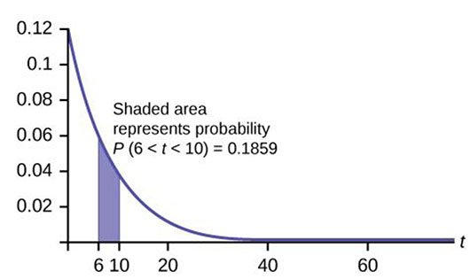{:}

3.  We want to find 0.70
    <math xmlns="http://www.w3.org/1998/Math/MathML" display=""> <mrow> <mo>=</mo><mi>P</mi><mo stretchy="false">(</mo><mi>T</mi><mo>&gt;</mo><mi>t</mi><mo stretchy="false">)</mo><mo>=</mo><mn>1</mn><mo>–</mo><mrow><mo>(</mo> <mrow> <mn>1</mn><mo>–</mo><msup> <mi>e</mi> <mrow> <mo>−</mo><mfrac> <mi>t</mi> <mn>8</mn> </mfrac> </mrow> </msup> </mrow> <mo>)</mo></mrow><mo>=</mo><msup> <mi>e</mi> <mrow> <mo>−</mo><mfrac> <mi>t</mi> <mn>8</mn> </mfrac> </mrow> </msup> <mo>.</mo> </mrow> </math>
    
    * * *
    {: data-type="newline"}
    
    Solving for *t*, e<math xmlns="http://www.w3.org/1998/Math/MathML" display=""> <mrow> <mo>–</mo><mfrac> <mi>t</mi> <mn>8</mn> </mfrac> </mrow> </math>
     = 0.70, so
    <math xmlns="http://www.w3.org/1998/Math/MathML" display=""> <mrow> <mo>–</mo><mfrac> <mi>t</mi> <mn>8</mn> </mfrac> </mrow> </math>
    
    = *ln*(0.70), and *t* = –8*ln*(0.70) ≈ 2.85 years.
    * * *
    {: data-type="newline"}
    
    Or use *t* =
    <math xmlns="http://www.w3.org/1998/Math/MathML"> <mrow> <mfrac> <mrow> <mi>l</mi><mi>n</mi><mtext>(area\_to\_the\_right)</mtext> </mrow> <mrow> <mo stretchy="false">(</mo><mo>–</mo><mi>m</mi><mo stretchy="false">)</mo> </mrow> </mfrac> <mo>=</mo><mfrac> <mrow> <mi>l</mi><mi>n</mi><mtext>(0</mtext><mtext>.70)</mtext> </mrow> <mrow> <mo>–</mo><mfrac> <mn>1</mn> <mn>8</mn> </mfrac> </mrow> </mfrac> <mo>≈</mo><mn>2.</mn><mtext>85 years</mtext> </mrow> </math>
    
    . 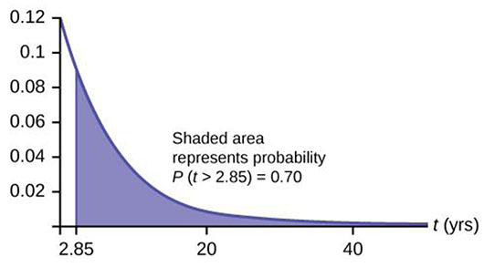{:}

4.  We want to find 0.02 = *P*(*T* &lt; *t*) = 1 – *e*<math xmlns="http://www.w3.org/1998/Math/MathML"> <mrow> <mo>–</mo><mfrac> <mi>t</mi> <mn>8</mn> </mfrac> </mrow> </math>
    .
    * * *
    {: data-type="newline"}
    
    Solving for *t*, *e*<math xmlns="http://www.w3.org/1998/Math/MathML" display=""> <mrow> <mo>–</mo><mfrac> <mi>t</mi> <mn>8</mn> </mfrac> </mrow> </math>
     = 0.98, so
    <math xmlns="http://www.w3.org/1998/Math/MathML" display=""> <mrow> <mo>–</mo><mfrac> <mi>t</mi> <mn>8</mn> </mfrac> </mrow> </math>
    
    = *ln*(0.98), and t = –8*ln*(0.98) ≈ 0.1616 years, or roughly two months.
    * * *
    {: data-type="newline"}
    
    The warranty should cover light bulbs that last less than 2 months.
    * * *
    {: data-type="newline"}
    
    Or use
    <math xmlns="http://www.w3.org/1998/Math/MathML"> <mrow> <mfrac> <mrow> <mi>ln</mi><mtext>(area\_to\_the\_right)</mtext> </mrow> <mrow> <mtext>(</mtext><mo>–</mo><mtext>m)</mtext> </mrow> </mfrac> <mo>=</mo><mfrac> <mrow> <mi>ln</mi><mtext>(1</mtext><mo>–</mo><mn>0.2</mn><mo stretchy="false">)</mo> </mrow> <mrow> <mo>–</mo><mfrac> <mn>1</mn> <mn>8</mn> </mfrac> </mrow> </mfrac> </mrow> </math>
    
    = 0.1616.
5.  We must find *P*(*T* &lt; 8\|*T* &gt; 7).
    * * *
    {: data-type="newline"}
    
    Notice that by the rule of complement events, *P*(*T* &lt; 8\|*T* &gt; 7) = 1 – *P*(*T* &gt; 8\|*T* &gt; 7).
    * * *
    {: data-type="newline"}
    
    By the memoryless property (*P*(*X* &gt; *r* + *t*\|*X* &gt; *r*) = *P*(*X* &gt; *t*)).
    * * *
    {: data-type="newline"}
    
    So *P*(*T* &gt; 8\|*T* &gt; 7) = *P*(*T* &gt; 1) =
    <math xmlns="http://www.w3.org/1998/Math/MathML"> <mrow> <mn>1</mn><mo>–</mo><mrow><mo>(</mo> <mrow> <mn>1</mn><mo>–</mo><msup> <mi>e</mi> <mrow> <mo>–</mo><mfrac> <mn>1</mn> <mn>8</mn> </mfrac> </mrow> </msup> </mrow> <mo>)</mo></mrow><mo>=</mo><msup> <mi>e</mi> <mrow> <mo>–</mo><mfrac> <mn>1</mn> <mn>8</mn> </mfrac> </mrow> </msup> <mo>≈</mo><mn>0.8825</mn> </mrow> </math>
    
    * * *
    {: data-type="newline"}
    
    Therefore, *P*(*T* &lt; 8\|*T* &gt; 7) = 1 – 0.8825 = 0.1175.
{: type="a"}

At a 911 call center, calls come in at an average rate of one call every two minutes. Assume that the time that elapses from one call to the next has the exponential distribution.

1.  On average, how much time occurs between five consecutive calls?
2.  Find the probability that after a call is received, it takes more than three minutes for the next call to occur.
3.  Ninety-percent of all calls occur within how many minutes of the previous call?
4.  Suppose that two minutes have elapsed since the last call. Find the probability that the next call will occur within the next minute.
5.  Find the probability that less than 20 calls occur within an hour.
{: type="a"}

In major league baseball, a no-hitter is a game in which a pitcher, or pitchers, doesn't give up any hits throughout the game. No-hitters occur at a rate of about three per season. Assume that the duration of time between no-hitters is exponential.

1.  What is the probability that an entire season elapses with a single no-hitter?
2.  If an entire season elapses without any no-hitters, what is the probability that there are no no-hitters in the following season?
3.  What is the probability that there are more than 3 no-hitters in a single season?
{: type="a"}

Let *X* = the number of no-hitters throughout a season. Since the duration of time between no-hitters is exponential, the <u data-effect="underline">number</u> of no-hitters <u data-effect="underline">per season</u> is Poisson with mean *λ* = 3. * * *
{: data-type="newline"}

Therefore, (*X* = 0) = <math xmlns="http://www.w3.org/1998/Math/MathML"> <mrow> <mfrac> <mrow> <msup> <mn>3</mn> <mn>0</mn> </msup> <msup> <mi>e</mi> <mrow> <mo>–</mo><mn>3</mn> </mrow> </msup> </mrow> <mrow> <mn>0</mn><mtext>!</mtext> </mrow> </mfrac> </mrow> </math>

 = e–3 ≈ 0.0498

NOTE

You could let *T* = duration of time between no-hitters. Since the time is exponential and there are 3 no-hitters per season, then the time between no-hitters is <math xmlns="http://www.w3.org/1998/Math/MathML"> <mrow> <mfrac> <mn>1</mn> <mn>3</mn> </mfrac> </mrow> </math>

 season. For the exponential, *µ* = <math xmlns="http://www.w3.org/1998/Math/MathML"> <mrow> <mfrac> <mn>1</mn> <mn>3</mn> </mfrac> </mrow> </math>

. * * *
{: data-type="newline"}

Therefore, *m* = <math xmlns="http://www.w3.org/1998/Math/MathML"> <mrow> <mfrac> <mn>1</mn> <mi>μ</mi> </mfrac> </mrow> </math>

 = 3 and *T* ∼ *Exp*(3).

1.  The desired probability is *P*(*T* &gt; 1) = 1 – *P*(*T* &lt; 1) = 1 – (1 – e–3) = e–3 ≈ 0.0498.
2.  Let *T* = duration of time between no-hitters. We find *P*(*T* &gt; 2\|*T* &gt; 1), and by the **memoryless property** this is simply *P*(*T* &gt; 1), which we found to be 0.0498 in part a.
3.  Let *X* = the <u data-effect="underline">number</u> of no-hitters is a season. Assume that *X* is Poisson with mean *λ* = 3. Then *P*(*X* &gt; 3) = 1 – *P*(*X* ≤ 3) = 0.3528.
{: type="a"}

During the years 1998–2012, a total of 29 earthquakes of magnitude greater than 6.5 have occurred in Papua New Guinea. <u data-effect="underline">Assume that the time spent waiting between earthquakes is exponential.</u>

1.  What is the probability that the next earthquake occurs within the next three months?
2.  Given that six months has passed without an earthquake in Papua New Guinea, what is the probability that the next three months will be <u data-effect="underline">free</u> of earthquakes?
3.  What is the probability of zero earthquakes occurring in 2014?
4.  What is the probability that at least two earthquakes will occur in 2014?
{: type="a"}

According to the American Red Cross, about one out of nine people in the U.S. have Type B blood. Suppose the blood types of people arriving at a blood drive are independent. In this case, the number of Type B blood types that arrive roughly follows the Poisson distribution.

1.  If 100 people arrive, how many on average would be expected to have Type B blood?
2.  What is the probability that over 10 people out of these 100 have type B blood?
3.  What is the probability that more than 20 people arrive before a person with type B blood is found?
{: type="a"}

1.  <math xmlns="http://www.w3.org/1998/Math/MathML" display=""> <mrow> <mfrac> <mrow> <mn>100</mn> </mrow> <mn>9</mn> </mfrac> </mrow> </math>
    
    = 11.11
2.  *P*(*X* &gt; 10) = 1 – *P*(*X* ≤ 10) = 1 – Poissoncdf(11.11, 10) ≈ 0.5532.
3.  The number of people with Type B blood encountered roughly follows the Poisson distribution, so the number of people *X* who arrive between successive Type B arrivals is roughly exponential with mean *μ* = 9 and *m* =
    <math xmlns="http://www.w3.org/1998/Math/MathML" display=""> <mrow> <mfrac> <mn>1</mn> <mn>9</mn> </mfrac> </mrow> </math>
    
    . The cumulative distribution function of *X* is
    <math xmlns="http://www.w3.org/1998/Math/MathML"> <mrow> <mi>P</mi><mrow><mo>(</mo> <mrow> <mi>X</mi><mo>&lt;</mo><mi>x</mi> </mrow> <mo>)</mo></mrow><mo>=</mo><mn>1</mn><mo>−</mo><msup> <mi>e</mi> <mrow> <mo>−</mo><mfrac> <mi>x</mi> <mn>9</mn> </mfrac> </mrow> </msup> </mrow> </math>
    
    . Thus hus, *P*(*X* &gt; 20) = 1 - *P*(*X* ≤ 20) =
    <math xmlns="http://www.w3.org/1998/Math/MathML"> <mrow> <mn>1</mn><mo>−</mo><mrow><mo>(</mo> <mrow> <mn>1</mn><mo>−</mo><msup> <mi>e</mi> <mrow> <mo>−</mo><mfrac> <mrow> <mn>20</mn> </mrow> <mn>9</mn> </mfrac> </mrow> </msup> </mrow> <mo>)</mo></mrow><mo>≈</mo><mn>0.1084.</mn> </mrow> </math>
{: type="a"}

Note

We could also deduce that each person arriving has a 8/9 chance of not having Type B blood. So the probability that none of the first 20 people arrive have Type B blood is <math xmlns="http://www.w3.org/1998/Math/MathML"> <mrow> <msup> <mrow> <mrow><mo>(</mo> <mrow> <mfrac> <mn>8</mn> <mn>9</mn> </mfrac> </mrow> <mo>)</mo></mrow> </mrow> <mrow> <mn>20</mn> </mrow> </msup> <mo>≈</mo><mn>0.0948</mn> </mrow> </math>

. (The geometric distribution is more appropriate than the exponential because the number of people between Type B people is discrete instead of continuous.)

A web site experiences traffic during normal working hours at a rate of 12 visits per hour. Assume that the duration between visits has the exponential distribution.

1.  Find the probability that the duration between two successive visits to the web site is more than ten minutes.
2.  The top 25% of durations between visits are at least how long?
3.  Suppose that 20 minutes have passed since the last visit to the web site. What is the probability that the next visit will occur within the next 5 minutes?
4.  Find the probability that less than 7 visits occur within a one-hour period.
{: type="a"}

At an urgent care facility, patients arrive at an average rate of one patient every seven minutes. Assume that the duration between arrivals is exponentially distributed.

1.  Find the probability that the time between two successive visits to the urgent care facility is less than 2 minutes.
2.  Find the probability that the time between two successive visits to the urgent care facility is more than 15 minutes.
3.  If 10 minutes have passed since the last arrival, what is the probability that the next person will arrive within the next five minutes?
4.  Find the probability that more than eight patients arrive during a half-hour period.
{: type="a"}

Let *T* = duration (in minutes) between successive visits. Since patients arrive at a rate of one patient every seven minutes, *μ* = 7 and the decay constant is *m* = <math xmlns="http://www.w3.org/1998/Math/MathML"> <mrow> <mfrac> <mn>1</mn> <mn>7</mn> </mfrac> </mrow> </math>

. The cdf is *P*(*T* &lt; *t*) = <math xmlns="http://www.w3.org/1998/Math/MathML"> <mrow> <mn>1</mn><mo>−</mo><msup> <mi>e</mi> <mrow> <mfrac> <mi>t</mi> <mn>7</mn> </mfrac> </mrow> </msup> </mrow> </math>

1.  *P*(*T* &lt; 2) = 1 -
    <math xmlns="http://www.w3.org/1998/Math/MathML"> <mrow> <mn>1</mn><mo>−</mo><msup> <mi>e</mi> <mrow> <mo>−</mo><mfrac> <mn>2</mn> <mn>7</mn> </mfrac> </mrow> </msup> </mrow> </math>
    
    ≈ 0.2485.
2.  *P*(*T* &gt; 15) =
    <math xmlns="http://www.w3.org/1998/Math/MathML"> <mrow> <mn>1</mn><mo>−</mo><mi>P</mi><mrow><mo>(</mo> <mrow> <mi>T</mi><mo>&lt;</mo><mn>15</mn> </mrow> <mo>)</mo></mrow><mo>=</mo><mn>1</mn><mo>−</mo><mrow><mo>(</mo> <mrow> <mn>1</mn><mo>−</mo><msup> <mi>e</mi> <mrow> <mo>−</mo><mfrac> <mrow> <mn>15</mn> </mrow> <mn>7</mn> </mfrac> </mrow> </msup> </mrow> <mo>)</mo></mrow><mo>≈</mo><msup> <mi>e</mi> <mrow> <mo>−</mo><mfrac> <mrow> <mn>15</mn> </mrow> <mn>7</mn> </mfrac> </mrow> </msup> <mo>≈</mo><mn>0.1173</mn> </mrow> </math>
    
    .
3.  *P*(*T* &gt; 15\|*T* &gt; 10) = *P*(*T* &gt; 5) =
    <math xmlns="http://www.w3.org/1998/Math/MathML"> <mrow> <mn>1</mn><mo>−</mo><mrow><mo>(</mo> <mrow> <mn>1</mn><mo>−</mo><msup> <mi>e</mi> <mrow> <mo>−</mo><mfrac> <mn>5</mn> <mn>7</mn> </mfrac> </mrow> </msup> </mrow> <mo>)</mo></mrow><mo>=</mo><msup> <mi>e</mi> <mrow> <mo>−</mo><mfrac> <mn>5</mn> <mn>7</mn> </mfrac> </mrow> </msup> <mo>≈</mo><mn>0.4895</mn> </mrow> </math>
    
    .
4.  Let *X* = # of patients arriving during a half-hour period. Then *X* has the Poisson distribution with a mean of
    <math xmlns="http://www.w3.org/1998/Math/MathML"> <mrow> <mfrac> <mrow> <mn>30</mn> </mrow> <mn>7</mn> </mfrac> </mrow> </math>
    
    , *X* ∼ Poisson
    <math xmlns="http://www.w3.org/1998/Math/MathML"> <mrow> <mrow><mo>(</mo> <mrow> <mfrac> <mrow> <mn>30</mn> </mrow> <mn>7</mn> </mfrac> </mrow> <mo>)</mo></mrow> </mrow> </math>
    
    . Find *P*(*X* &gt; 8) = 1 – *P*(*X* ≤ 8) ≈ 0.0311.
{: type="a"}

### Glossary
{: data-type="glossary-title"}

decay parameter
: The decay parameter describes the rate at which probabilities decay to zero for increasing values of *x*. It is the value *m* in the probability density function *f*(*x*) = *me*(-*mx*) of an exponential random variable. It is also equal to *m* =
  <math xmlns="http://www.w3.org/1998/Math/MathML"> <mrow> <mrow> <mrow> <mfrac> <mn>1</mn> <mi>μ</mi> </mfrac> </mrow> </mrow> </mrow> </math>
  
  , where *μ* is the mean of the random variable.
^

memoryless property
: For an exponential random variable *X*, the memoryless property is the statement that knowledge of what has occurred in the past has no effect on future probabilities. This means that the probability that *X* exceeds *x* + *k*, given that it has exceeded *x*, is the same as the probability that *X* would exceed *k* if we had no knowledge about it. In symbols we say that *P*(*X* &gt; *x* + *k*\\\|*X* &gt; *x*) = *P*(*X* &gt; *k*).
^

Poisson distribution
: If there is a known average of *λ* events occurring per unit time, and these events are independent of each other, then the number of events *X* occurring in one unit of time has the Poisson distribution. The probability of *k* events occurring in one unit time is equal to
  <math xmlns="http://www.w3.org/1998/Math/MathML"> <mrow> <mi>P</mi><mo stretchy="false">(</mo><mi>X</mi><mo>=</mo><mi>k</mi><mo stretchy="false">)</mo><mo>=</mo><mfrac> <mrow> <msup> <mi>λ</mi> <mi>k</mi> </msup> <msup> <mi>e</mi> <mrow> <mo>−</mo><mi>λ</mi> </mrow> </msup> </mrow> <mrow> <mi>k</mi><mo>!</mo> </mrow> </mfrac> </mrow> </math>
  
  .

