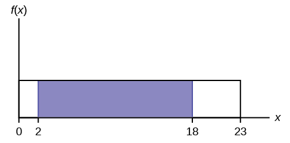
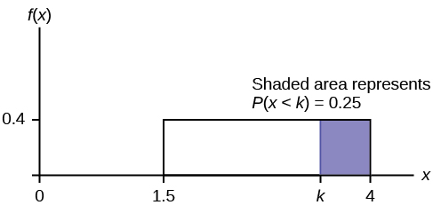
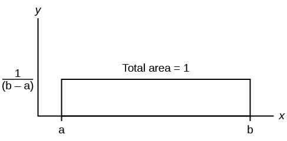
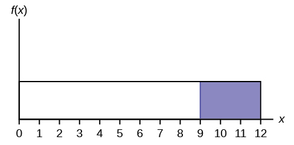
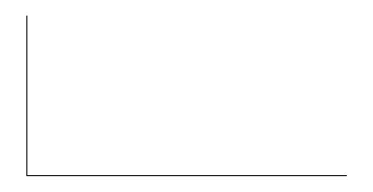
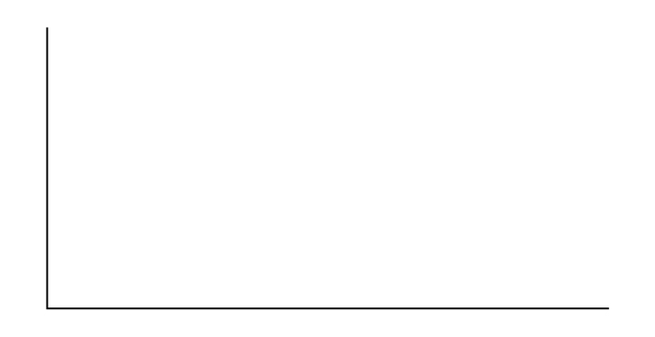
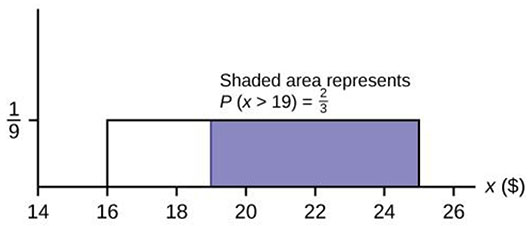
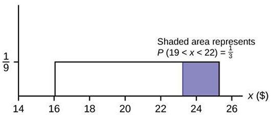

The uniform distribution is a continuous probability distribution and is concerned with events that are equally likely to occur. When working out problems that have a uniform distribution, be careful to note if the data is inclusive or exclusive of endpoints.

The data in [\[link\]](#element-41) are 55 smiling times, in seconds, of an eight-week-old baby.

| 10.4 | 19.6 | 18.8 | 13.9 | 17.8 | 16.8 | 21.6 | 17.9 | 12.5 | 11.1 | 4.9 |
| 12.8 | 14.8 | 22.8 | 20.0 | 15.9 | 16.3 | 13.4 | 17.1 | 14.5 | 19.0 | 22.8 |
| 1.3 | 0.7 | 8.9 | 11.9 | 10.9 | 7.3 | 5.9 | 3.7 | 17.9 | 19.2 | 9.8 |
| 5.8 | 6.9 | 2.6 | 5.8 | 21.7 | 11.8 | 3.4 | 2.1 | 4.5 | 6.3 | 10.7 |
| 8.9 | 9.4 | 9.4 | 7.6 | 10.0 | 3.3 | 6.7 | 7.8 | 11.6 | 13.8 | 18.6 |
{: #element-41 summary=""}

The sample mean = 11.49 and the sample standard deviation = 6.23.

We will assume that the smiling times, in seconds, follow a uniform distribution between zero and 23 seconds, inclusive. This means that any smiling time from zero to and including 23 seconds is **equally likely**{: data-type="term"}. The histogram that could be constructed from the sample is an empirical distribution that closely matches the theoretical uniform distribution.

Let *X* = length, in seconds, of an eight-week-old baby\'s smile.

The notation for the uniform distribution is

*X* ~ *U*(*a*, *b*) where *a* = the lowest value of *x* and *b* = the highest value of *x*.

The probability density function is *f*(*x*) = <math xmlns="http://www.w3.org/1998/Math/MathML"> <mrow> <mfrac> <mn>1</mn> <mrow> <mi>b</mi><mo>−</mo><mi>a</mi> </mrow> </mfrac> </mrow> </math>

 for *a* ≤ *x* ≤ *b*.

For this example, *X* ~ *U*(0, 23) and *f*(*x*) = <math xmlns="http://www.w3.org/1998/Math/MathML"> <mrow> <mfrac> <mn>1</mn> <mrow> <mn>23</mn><mo>−</mo><mn>0</mn> </mrow> </mfrac> </mrow> </math>

 for 0 ≤ *X* ≤ 23.

Formulas for the theoretical mean and standard deviation are

<math xmlns="http://www.w3.org/1998/Math/MathML"> <mrow> <mi>μ</mi><mo>=</mo><mfrac> <mrow> <mi>a</mi><mo>+</mo><mi>b</mi> </mrow> <mn>2</mn> </mfrac> </mrow> </math>

 and <math xmlns="http://www.w3.org/1998/Math/MathML"> <mrow> <mi>σ</mi><mo>=</mo><msqrt> <mrow> <mfrac> <mrow> <msup> <mrow> <mo stretchy="false">(</mo><mi>b</mi><mo>−</mo><mi>a</mi><mo stretchy="false">)</mo> </mrow> <mn>2</mn> </msup> </mrow> <mrow> <mn>12</mn> </mrow> </mfrac> </mrow> </msqrt> </mrow> </math>

For this problem, the theoretical mean and standard deviation are

*μ* = <math xmlns="http://www.w3.org/1998/Math/MathML"> <mrow> <mfrac> <mrow> <mn>0</mn><mtext> </mtext><mo>+</mo><mtext> </mtext><mn>23</mn> </mrow> <mn>2</mn> </mfrac> </mrow> </math>

 = 11.50 seconds and *σ* = <math xmlns="http://www.w3.org/1998/Math/MathML"> <mrow> <msqrt> <mrow> <mfrac> <mrow> <msup> <mrow> <mo stretchy="false">(</mo><mn>23</mn><mtext> </mtext><mo>−</mo><mtext> </mtext><mn>0</mn><mo stretchy="false">)</mo> </mrow> <mn>2</mn> </msup> </mrow> <mrow> <mn>12</mn> </mrow> </mfrac> </mrow> </msqrt> </mrow> </math>

 = 6.64 seconds.

Notice that the theoretical mean and standard deviation are close to the sample mean and standard deviation in this example.

Try It

The data that follow are the number of passengers on 35 different charter fishing boats. The sample mean = 7.9 and the sample standard deviation = 4.33. The data follow a uniform distribution where all values between and including zero and 14 are equally likely. State the values of *a* and *b*. Write the distribution in proper notation, and calculate the theoretical mean and standard deviation.

<table summary=""><colgroup><col data-width="1*" /><col data-width="1*" /><col data-width="1*" /><col data-width="1*" /><col data-width="1*" /><col data-width="1*" /><col data-width="1*" /></colgroup><tbody>
<tr>
<td data-align="center">1</td>
<td data-align="center">12</td>
<td data-align="center">4</td>
<td data-align="center">10</td>
<td data-align="center">4</td>
<td data-align="center">14</td>
<td data-align="center">11</td>
</tr>
<tr>
<td data-align="center">7</td>
<td data-align="center">11</td>
<td data-align="center">4</td>
<td data-align="center">13</td>
<td data-align="center">2</td>
<td data-align="center">4</td>
<td data-align="center">6</td>
</tr>
<tr>
<td data-align="center">3</td>
<td data-align="center">10</td>
<td data-align="center">0</td>
<td data-align="center">12</td>
<td data-align="center">6</td>
<td data-align="center">9</td>
<td data-align="center">10</td>
</tr>
<tr>
<td data-align="center">5</td>
<td data-align="center">13</td>
<td data-align="center">4</td>
<td data-align="center">10</td>
<td data-align="center">14</td>
<td data-align="center">12</td>
<td data-align="center">11</td>
</tr>
<tr>
<td data-align="center">6</td>
<td data-align="center">10</td>
<td data-align="center">11</td>
<td data-align="center">0</td>
<td data-align="center">11</td>
<td data-align="center">13</td>
<td data-align="center">2</td>
</tr>
</tbody></table>

a. Refer to [[link]](#element-229). What is the probability that a randomly chosen eight-week-old baby smiles between two and 18 seconds?

*P*(2 &lt; *x* &lt; 18) = (base)(height) = (18 – 2)<math xmlns="http://www.w3.org/1998/Math/MathML" display=""> <mrow> <mrow><mo>(</mo> <mrow> <mfrac> <mn>1</mn> <mrow> <mn>23</mn> </mrow> </mfrac> </mrow> <mo>)</mo></mrow> </mrow> </math>

 = <math xmlns="http://www.w3.org/1998/Math/MathML" display=""> <mrow> <mrow> <mrow> <mfrac> <mrow> <mn>16</mn> </mrow> <mrow> <mn>23</mn> </mrow> </mfrac> </mrow> </mrow> </mrow> </math>

.

{: #eip-idp133938240}

b. Find the 90th percentile for an eight-week-old baby's smiling time.

b. Ninety percent of the smiling times fall below the 90th percentile, *k*, so *P*(*x* &lt; *k*) = 0.90.

<math xmlns="http://www.w3.org/1998/Math/MathML" display="block"> <mrow> <mi>P</mi><mo stretchy="false">(</mo><mi>x</mi><mo>&lt;</mo><mi>k</mi><mo stretchy="false">)</mo><mo>=</mo><mn>0.90</mn> </mrow> </math>

<math xmlns="http://www.w3.org/1998/Math/MathML" display="block"><mo>(</mo><mtext>base</mtext><mo>)</mo><mo>(</mo><mtext>height</mtext><mo>)</mo><mo>=</mo><mn>0.90</mn></math>

<math xmlns="http://www.w3.org/1998/Math/MathML" display="block"> <mrow> <mtext>(</mtext><mi>k</mi><mo>−</mo><mn>0</mn><mtext>)</mtext><mrow><mo>(</mo> <mrow> <mfrac> <mn>1</mn> <mrow> <mn>23</mn> </mrow> </mfrac> </mrow> <mo>)</mo></mrow><mo>=</mo><mn>0.90</mn> </mrow> </math>

<math xmlns="http://www.w3.org/1998/Math/MathML" display="block"> <mrow> <mi>k</mi><mo>=</mo><mrow><mo>(</mo> <mrow> <mn>23</mn> </mrow> <mo>)</mo></mrow><mrow><mo>(</mo> <mrow> <mn>0.90</mn> </mrow> <mo>)</mo></mrow><mo>=</mo><mn>20.7</mn> </mrow> </math>

{: #eip-idp216325248}

c. Find the probability that a random eight-week-old baby smiles more than 12 seconds **KNOWING** that the baby smiles **MORE THAN EIGHT SECONDS**.

c. This probability question is a **conditional**. You are asked to find the probability that an eight-week-old baby smiles more than 12 seconds when you **already know** the baby has smiled for more than eight seconds.

Find *P*(*x* &gt; 12\|*x* &gt; 8) There are two ways to do the problem. **For the first way**, use the fact that this is a **conditional** and changes the sample space. The graph illustrates the new sample space. You already know the baby smiled more than eight seconds.

**Write a new** *f*(*x*): *f*(*x*) = <math xmlns="http://www.w3.org/1998/Math/MathML" display=""> <mrow> <mfrac> <mn>1</mn> <mrow> <mn>23</mn><mtext> </mtext><mo>−</mo><mtext> 8</mtext> </mrow> </mfrac> </mrow> </math>

 = <math xmlns="http://www.w3.org/1998/Math/MathML" display=""> <mrow> <mfrac> <mn>1</mn> <mrow> <mn>15</mn> </mrow> </mfrac> </mrow> </math>

 for 8 &lt; *x* &lt; 23

*P*(*x* &gt; 12\|*x* &gt; 8) = (23 − 12)<math xmlns="http://www.w3.org/1998/Math/MathML" display=""> <mrow> <mrow><mo>(</mo> <mrow> <mfrac> <mn>1</mn> <mrow> <mn>15</mn> </mrow> </mfrac> </mrow> <mo>)</mo></mrow> </mrow> </math>

 = <math xmlns="http://www.w3.org/1998/Math/MathML" display=""> <mrow> <mrow> <mrow> <mfrac> <mrow> <mn>11</mn> </mrow> <mrow> <mn>15</mn> </mrow> </mfrac> </mrow> </mrow> </mrow> </math>

{: #eip-idm134042368}

**For the second way**, use the conditional formula from [Probability Topics](/m46938) with the original distribution *X* ~ *U* (0, 23):

*P*(*A*\|*B*) = <math xmlns="http://www.w3.org/1998/Math/MathML"> <mrow> <mfrac> <mrow> <mi>P</mi><mo stretchy="false">(</mo><mi>A</mi><mtext> AND </mtext><mi>B</mi><mo stretchy="false">)</mo> </mrow> <mrow> <mi>P</mi><mo stretchy="false">(</mo><mi>B</mi><mo stretchy="false">)</mo> </mrow> </mfrac> </mrow> </math>

For this problem, *A* is (*x* &gt; 12) and *B* is (*x* &gt; 8).

So, *P*(*x* &gt; *12*\|*x* &gt; 8) = <math xmlns="http://www.w3.org/1998/Math/MathML"> <mrow> <mfrac> <mrow> <mo stretchy="false">(</mo><mi>x</mi><mo>&gt;</mo><mn>12</mn><mtext> AND </mtext><mi>x</mi><mo>&gt;</mo><mn>8</mn><mo stretchy="false">)</mo> </mrow> <mrow> <mi>P</mi><mo stretchy="false">(</mo><mi>x</mi><mo>&gt;</mo><mn>8</mn><mo stretchy="false">)</mo> </mrow> </mfrac> <mo>=</mo><mfrac> <mrow> <mi>P</mi><mo stretchy="false">(</mo><mi>x</mi><mo>&gt;</mo><mn>12</mn><mo stretchy="false">)</mo> </mrow> <mrow> <mi>P</mi><mo stretchy="false">(</mo><mi>x</mi><mo>&gt;</mo><mn>8</mn><mo stretchy="false">)</mo> </mrow> </mfrac> <mo>=</mo><mfrac> <mrow> <mfrac> <mrow> <mn>11</mn> </mrow> <mrow> <mn>23</mn> </mrow> </mfrac> </mrow> <mrow> <mfrac> <mrow> <mn>15</mn> </mrow> <mrow> <mn>23</mn> </mrow> </mfrac> </mrow> </mfrac> <mo>=</mo><mfrac> <mrow> <mn>11</mn> </mrow> <mrow> <mn>15</mn> </mrow> </mfrac> </mrow> </math>

{: #eip-idm5414416}

Try It

A distribution is given as *X* ~ *U* (0, 20). What is *P*(2 &lt; *x* &lt; 18)? Find the 90th percentile.

The amount of time, in minutes, that a person must wait for a bus is uniformly distributed between zero and 15 minutes, inclusive.* * *
{: data-type="newline"}

a. What is the probability that a person waits fewer than 12.5 minutes?

a. Let *X* = the number of minutes a person must wait for a bus. *a* = 0 and *b* = 15. *X* ~ *U*(0, 15). Write the probability density function. *f* (*x*) = <math xmlns="http://www.w3.org/1998/Math/MathML" display=""> <mrow> <mfrac> <mn>1</mn> <mrow> <mn>15</mn><mtext> </mtext><mo>−</mo><mtext> </mtext><mn>0</mn> </mrow> </mfrac> </mrow> </math>

 = <math xmlns="http://www.w3.org/1998/Math/MathML" display=""> <mrow> <mfrac> <mn>1</mn> <mrow> <mn>15</mn> </mrow> </mfrac> </mrow> </math>

 for 0 ≤ *x* ≤ 15.

Find *P* (*x* &lt; 12.5). Draw a graph.

<math xmlns="http://www.w3.org/1998/Math/MathML" display="block"> <mrow> <mi>P</mi><mo stretchy="false">(</mo><mi>x</mi><mo>&lt;</mo><mi>k</mi><mo stretchy="false">)</mo><mo>=</mo><mo stretchy="false">(</mo><mtext>base</mtext><mo stretchy="false">)</mo><mo stretchy="false">(</mo><mtext>height</mtext><mo stretchy="false">)</mo><mo>=</mo><mo stretchy="false">(</mo><mn>12.5</mn><mo>-</mo><mn>0</mn><mo stretchy="false">)</mo><mrow><mo>(</mo> <mrow> <mfrac> <mn>1</mn> <mrow> <mn>15</mn> </mrow> </mfrac> </mrow> <mo>)</mo></mrow><mo>=</mo><mn>0.8333</mn> </mrow> </math>

The probability a person waits less than 12.5 minutes is 0.8333.

{: #eip-idp99340768}

b. On the average, how long must a person wait? Find the mean, *μ*, and the standard deviation, *σ*.

b. *μ* = <math xmlns="http://www.w3.org/1998/Math/MathML"> <mrow> <mfrac> <mrow> <mi>a</mi><mtext> </mtext><mo>+</mo><mtext> </mtext><mi>b</mi> </mrow> <mn>2</mn> </mfrac> </mrow> </math>

 = <math xmlns="http://www.w3.org/1998/Math/MathML"> <mrow> <mfrac> <mrow> <mn>15</mn><mtext> </mtext><mo>+</mo><mtext> </mtext><mn>0</mn> </mrow> <mn>2</mn> </mfrac> </mrow> </math>

 = 7.5. On the average, a person must wait 7.5 minutes. * * *
{: data-type="newline"}

 * * *
{: data-type="newline"}

 *σ* = <math xmlns="http://www.w3.org/1998/Math/MathML"><msqrt><mfrac> <mrow><mo>(</mo><mi>b</mi><mo>-</mo><mi>a</mi><msup><mo>)</mo><mn>2</mn></msup></mrow> <mrow><mn>12</mn></mrow></mfrac></msqrt> <mo>=</mo> <msqrt><mfrac> <mrow><mo>(</mo><mi>15</mi><mo>-</mo><mi>0</mi><msup><mo>)</mo><mn>2</mn></msup></mrow> <mrow><mn>12</mn></mrow></mfrac></msqrt> </math>

 = 4.3. The Standard deviation is 4.3 minutes. * * *
{: data-type="newline"}

c. Ninety percent of the time, the time a person must wait falls below what value?

This asks for the 90th percentile.

c. Find the 90th percentile. Draw a graph. Let *k* = the 90th percentile. * * *
{: data-type="newline"}

 * * *
{: data-type="newline"}

<math xmlns="http://www.w3.org/1998/Math/MathML"> <mrow> <mi>P</mi><mo stretchy="false">(</mo><mi>x</mi><mo>&lt;</mo><mi>k</mi><mo stretchy="false">)</mo><mo>=</mo><mo stretchy="false">(</mo><mtext>base</mtext><mo stretchy="false">)</mo><mo stretchy="false">(</mo><mtext>height</mtext><mo stretchy="false">)</mo><mo>=</mo><mo stretchy="false">(</mo><mi>k</mi><mo>−</mo><mn>0</mn><mo stretchy="false">)</mo><mo stretchy="false">(</mo><mfrac> <mn>1</mn> <mrow> <mn>15</mn> </mrow> </mfrac> <mo stretchy="false">)</mo> </mrow> </math>

 * * *
{: data-type="newline"}

 * * *
{: data-type="newline"}

 <math xmlns="http://www.w3.org/1998/Math/MathML"> <mrow> <mn>0.90</mn><mo>=</mo><mrow><mo>(</mo> <mi>k</mi> <mo>)</mo></mrow><mrow><mo>(</mo> <mrow> <mfrac> <mn>1</mn> <mrow> <mn>15</mn> </mrow> </mfrac> </mrow> <mo>)</mo></mrow> </mrow> </math>

 * * *
{: data-type="newline"}

 * * *
{: data-type="newline"}

<math xmlns="http://www.w3.org/1998/Math/MathML"> <mrow> <mi>k</mi><mo>=</mo><mo stretchy="false">(</mo><mn>0.90</mn><mo stretchy="false">)</mo><mo stretchy="false">(</mo><mn>15</mn><mo stretchy="false">)</mo><mo>=</mo><mn>13.5</mn> </mrow> </math>

 * * *
{: data-type="newline"}

 * * *
{: data-type="newline"}

 *k* is sometimes called a critical value. * * *
{: data-type="newline"}

 * * *
{: data-type="newline"}

The 90th percentile is 13.5 minutes. Ninety percent of the time, a person must wait at most 13.5 minutes.

{: #eip-idp75195312}

Try It

The total duration of baseball games in the major league in the 2011 season is uniformly distributed between 447 hours and 521 hours inclusive.

1.  Find *a* and *b* and describe what they represent.
2.  Write the distribution.
3.  Find the mean and the standard deviation.
4.  What is the probability that the duration of games for a team for the 2011 season is between 480 and 500 hours?
5.  What is the 65th percentile for the duration of games for a team for the 2011 season?
{: type="a"}

Suppose the time it takes a nine-year old to eat a donut is between 0.5 and 4 minutes, inclusive. Let *X* = the time, in minutes, it takes a nine-year old child to eat a donut. Then *X* ~ *U* (0.5, 4).* * *
{: data-type="newline"}

a. The probability that a randomly selected nine-year old child eats a donut in at least two minutes is \_\_\_\_\_\_\_.

a. 0.5714* * *
{: data-type="newline"}

b. Find the probability that a different nine-year old child eats a donut in more than two minutes given that the child has already been eating the donut for more than 1.5 minutes.

The second question has a **conditional probability**{: data-type="term"}. You are asked to find the probability that a nine-year old child eats a donut in more than two minutes given that the child has already been eating the donut for more than 1.5 minutes. Solve the problem two different ways (see [[link]](#element-156)). You must reduce the sample space. **First way**: Since you know the child has already been eating the donut for more than 1.5 minutes, you are no longer starting at *a* = 0.5 minutes. Your starting point is 1.5 minutes.

**Write a new *f*(*x*):**

*f*(*x*) = <math xmlns="http://www.w3.org/1998/Math/MathML"> <mrow> <mfrac> <mn>1</mn> <mrow> <mn>4</mn><mo>−</mo><mn>1.5</mn> </mrow> </mfrac> </mrow> </math>

 = <math xmlns="http://www.w3.org/1998/Math/MathML"> <mrow> <mfrac> <mn>2</mn> <mn>5</mn> </mfrac> </mrow> </math>

 for 1.5 ≤ *x* ≤ 4.

Find *P*(*x* &gt; 2\|*x* &gt; 1.5). Draw a graph.

{: #eip-idp101580400}

*P*(*x* &gt; *2*\|*x* &gt; 1.5) = (base)(new height) = (4 − 2)<math xmlns="http://www.w3.org/1998/Math/MathML"> <mrow> <mrow><mo>(</mo> <mrow> <mfrac> <mn>2</mn> <mn>5</mn> </mfrac> </mrow> <mo>)</mo></mrow> </mrow> <mo>=</mo><mfrac><mn>4</mn><mn>5</mn></mfrac></math>

b. <math xmlns="http://www.w3.org/1998/Math/MathML"><mfrac><mn>4</mn><mn>5</mn></mfrac></math>

The probability that a nine-year old child eats a donut in more than two minutes given that the child has already been eating the donut for more than 1.5 minutes is <math xmlns="http://www.w3.org/1998/Math/MathML"><mfrac><mn>4</mn><mn>5</mn></mfrac></math>

.

**Second way:** Draw the original graph for *X* ~ *U* (0.5, 4). Use the conditional formula

*P*(*x* &gt; 2\\\|*x* &gt; 1.5) = <math xmlns="http://www.w3.org/1998/Math/MathML"> <mrow> <mo> </mo><mfrac> <mrow> <mi>P</mi><mo stretchy="false">(</mo><mi>x</mi><mo>&gt;</mo><mn>2</mn><mtext> AND </mtext><mi>x</mi><mo>&gt;</mo><mn>1.5</mn><mo stretchy="false">)</mo> </mrow> <mrow> <mi>P</mi><mo stretchy="false">(</mo><mi>x</mi><mo>&gt;</mo><mtext>1</mtext><mtext>.5</mtext><mo stretchy="false">)</mo> </mrow> </mfrac> <mo>=</mo><mfrac> <mrow> <mi>P</mi><mo stretchy="false">(</mo><mi>x</mi><mo>&gt;</mo><mn>2</mn><mo stretchy="false">)</mo> </mrow> <mrow> <mi>P</mi><mo stretchy="false">(</mo><mi>x</mi><mo>&gt;</mo><mn>1.5</mn><mo stretchy="false">)</mo> </mrow> </mfrac> <mo>=</mo><mfrac> <mrow> <mfrac> <mn>2</mn> <mrow> <mn>3.5</mn> </mrow> </mfrac> </mrow> <mrow> <mfrac> <mrow> <mn>2.5</mn> </mrow> <mrow> <mn>3.5</mn> </mrow> </mfrac> </mrow> </mfrac> <mo>=</mo><mtext>0</mtext><mtext>.8</mtext><mo>=</mo><mfrac> <mn>4</mn> <mn>5</mn> </mfrac> </mrow> </math>

Try It

Suppose the time it takes a student to finish a quiz is uniformly distributed between six and 15 minutes, inclusive. Let *X* = the time, in minutes, it takes a student to finish a quiz. Then *X* ~ *U* (6, 15).

Find the probability that a randomly selected student needs at least eight minutes to complete the quiz. Then find the probability that a different student needs at least eight minutes to finish the quiz given that she has already taken more than seven minutes.

Ace Heating and Air Conditioning Service finds that the amount of time a repairman needs to fix a furnace is uniformly distributed between 1.5 and four hours. Let *x* = the time needed to fix a furnace. Then *x* ~ *U* (1.5, 4).

1.  Find the probability that a randomly selected furnace repair requires more than two hours.
2.  Find the probability that a randomly selected furnace repair requires less than three hours.
3.  Find the 30th percentile of furnace repair times.
4.  The longest 25% of furnace repair times take at least how long? (In other words: find the minimum time for the longest 25% of repair times.) What percentile does this represent?
5.  Find the mean and standard deviation
{: type="a"}

a. To find *f*(*x*): *f* (*x*) = <math xmlns="http://www.w3.org/1998/Math/MathML"> <mrow> <mfrac> <mn>1</mn> <mrow> <mn>4</mn><mtext> </mtext><mo>−</mo><mtext> </mtext><mn>1.5</mn> </mrow> </mfrac> </mrow> </math>

 = <math xmlns="http://www.w3.org/1998/Math/MathML"> <mrow> <mfrac> <mn>1</mn> <mrow> <mn>2.5</mn> </mrow> </mfrac> </mrow> </math>

 so *f*(*x*) = 0.4

*P*(*x* &gt; 2) = (base)(height) = (4 – 2)(0.4) = 0.8

{:}

b. *P*(*x* &lt; 3) = (base)(height) = (3 – 1.5)(0.4) = 0.6

The graph of the rectangle showing the entire distribution would remain the same. However the graph should be shaded between *x* = 1.5 and *x* = 3. Note that the shaded area starts at *x* = 1.5 rather than at *x* = 0; since *X* ~ *U* (1.5, 4), *x* can not be less than 1.5.

{:}

c.

{: #figure-03}

* * *
{: data-type="newline"}

*P* (*x* &lt; *k*) = 0.30 * * *
{: data-type="newline"}

 *P*(*x* &lt; *k*) = (base)(height) = (*k* – 1.5)(0.4) * * *
{: data-type="newline"}

**0.3 = (*k* – 1.5) (0.4)**; Solve to find *k*: * * *
{: data-type="newline"}

0.75 = *k* – 1.5, obtained by dividing both sides by 0.4 * * *
{: data-type="newline"}

<strong><em>k</em> = 2.25 </strong>, obtained by adding 1.5 to both sides * * *
{: data-type="newline"}

The 30th percentile of repair times is 2.25 hours. 30% of repair times are 2.5 hours or less.

d.

{:}

* * *
{: data-type="newline"}

*P*(*x* &gt; *k*) = 0.25 * * *
{: data-type="newline"}

 *P*(*x* &gt; *k*) = (base)(height) = (4 – *k*)(0.4) * * *
{: data-type="newline"}

**0.25 = (4 – *k*)(0.4)**; Solve for *k*: * * *
{: data-type="newline"}

0.625 = 4 − *k*, * * *
{: data-type="newline"}

obtained by dividing both sides by 0.4 * * *
{: data-type="newline"}

−3.375 = −*k*, * * *
{: data-type="newline"}

obtained by subtracting four from both sides: ***k* = 3.375** * * *
{: data-type="newline"}

The longest 25% of furnace repairs take at least 3.375 hours (3.375 hours or longer). * * *
{: data-type="newline"}

**Note:** Since 25% of repair times are 3.375 hours or longer, that means that 75% of repair times are 3.375 hours or less. 3.375 hours is the **75th percentile** of furnace repair times.

e. <math xmlns="http://www.w3.org/1998/Math/MathML"> <mrow> <mi>μ</mi><mo>=</mo><mfrac> <mrow> <mi>a</mi><mo>+</mo><mi>b</mi> </mrow> <mn>2</mn> </mfrac> </mrow> </math>

 and <math xmlns="http://www.w3.org/1998/Math/MathML"> <mrow> <mi>σ</mi><mo>=</mo><msqrt> <mrow> <mfrac> <mrow> <msup> <mrow> <mo stretchy="false">(</mo><mi>b</mi><mo>−</mo><mi>a</mi><mo stretchy="false">)</mo> </mrow> <mn>2</mn> </msup> </mrow> <mrow> <mn>12</mn> </mrow> </mfrac> </mrow> </msqrt> </mrow> </math>

 * * *
{: data-type="newline"}

<math xmlns="http://www.w3.org/1998/Math/MathML"><reln><eq /> <reln><eq /> <mrow><mi>μ</mi></mrow> <mrow><mfrac><mrow><mn>1.5</mn><mo>+</mo><mn>4</mn></mrow> <mrow><mn>2</mn></mrow></mfrac></mrow></reln> <mrow><mn>2.75</mn></mrow></reln> </math>

 hours and <math xmlns="http://www.w3.org/1998/Math/MathML"> <mrow> <mi>σ</mi><mo>=</mo><msqrt> <mrow> <mfrac> <mrow> <msup> <mrow> <mo stretchy="false">(</mo><mn>4</mn><mo>–</mo><mn>1.5</mn><mo stretchy="false">)</mo> </mrow> <mn>2</mn> </msup> </mrow> <mrow> <mn>12</mn> </mrow> </mfrac> </mrow> </msqrt> <mo>=</mo><mn>0.7217</mn> </mrow> </math>

 hours

Try It

The amount of time a service technician needs to change the oil in a car is uniformly distributed between 11 and 21 minutes. Let *X* = the time needed to change the oil on a car.

1.  Write the random variable *X* in words. *X* = \_\_\_\_\_\_\_\_\_\_\_\_\_\_\_\_\_\_.
2.  Write the distribution.
3.  Graph the distribution.
4.  Find *P* (*x* &gt; 19).
5.  Find the 50th percentile.
{: type="a"}

### Chapter Review

If *X* has a uniform distribution where *a* &lt; *x* &lt; *b* or *a* ≤ *x* ≤ *b*, then *X* takes on values between *a* and *b* (may include *a* and *b*). All values *x* are equally likely. We write *X* ∼ *U*(*a*, *b*). The mean of *X* is <math xmlns="http://www.w3.org/1998/Math/MathML"> <mrow> <mi>μ</mi><mo>=</mo><mfrac> <mrow> <mi>a</mi><mo>+</mo><mi>b</mi> </mrow> <mn>2</mn> </mfrac> </mrow> </math>

. The standard deviation of *X* is <math xmlns="http://www.w3.org/1998/Math/MathML"> <mrow> <mi>σ</mi><mo>=</mo><msqrt> <mrow> <mfrac> <mrow> <msup> <mrow> <mo stretchy="false">(</mo><mi>b</mi><mo>−</mo><mi>a</mi><mo stretchy="false">)</mo> </mrow> <mn>2</mn> </msup> </mrow> <mrow> <mn>12</mn> </mrow> </mfrac> </mrow> </msqrt> </mrow> </math>

. The probability density function of *X* is <math xmlns="http://www.w3.org/1998/Math/MathML"> <mrow> <mi>f</mi><mo stretchy="false">(</mo><mi>x</mi><mo stretchy="false">)</mo><mo>=</mo><mfrac> <mn>1</mn> <mrow> <mi>b</mi><mo>−</mo><mi>a</mi> </mrow> </mfrac> </mrow> </math>

 for *a* ≤ *x* ≤ *b*. The cumulative distribution function of *X* is *P*(*X* ≤ *x*) = <math xmlns="http://www.w3.org/1998/Math/MathML"> <mrow> <mfrac> <mrow> <mi>x</mi><mo>−</mo><mi>a</mi> </mrow> <mrow> <mi>b</mi><mo>−</mo><mi>a</mi> </mrow> </mfrac> </mrow> </math>

. *X* is continuous.

{:}

The probability *P*(*c* &lt; *X* &lt; *d*) may be found by computing the area under *f*(*x*), between *c* and *d*. Since the corresponding area is a rectangle, the area may be found simply by multiplying the width and the height.

### Formula Review

*X* = a real number between *a* and *b* (in some instances, *X* can take on the values *a* and *b*). *a* = smallest *X*; *b* = largest *X*

*X* ~ *U* (a, b)

The mean is <math xmlns="http://www.w3.org/1998/Math/MathML"> <mrow> <mi>μ</mi><mo>=</mo><mfrac> <mrow> <mi>a</mi><mo>+</mo><mi>b</mi> </mrow> <mn>2</mn> </mfrac> </mrow> </math>

The standard deviation is <math xmlns="http://www.w3.org/1998/Math/MathML"> <mrow> <mi>σ</mi><mo>=</mo><msqrt> <mrow> <mfrac> <mrow> <msup> <mrow> <mo stretchy="false">(</mo><mi>b</mi><mtext> – </mtext><mi>a</mi><mo stretchy="false">)</mo> </mrow> <mn>2</mn> </msup> </mrow> <mrow> <mn>12</mn> </mrow> </mfrac> </mrow> </msqrt> </mrow> </math>

**Probability density function:** <math xmlns="http://www.w3.org/1998/Math/MathML"> <mrow> <mi>f</mi><mo stretchy="false">(</mo><mi>x</mi><mo stretchy="false">)</mo><mo>=</mo><mfrac> <mn>1</mn> <mrow> <mi>b</mi><mo>−</mo><mi>a</mi> </mrow> </mfrac> </mrow> </math>

 for <math xmlns="http://www.w3.org/1998/Math/MathML"> <mrow> <mi>a</mi><mo>≤</mo><mi>X</mi><mo>≤</mo><mi>b</mi> </mrow> </math>

**Area to the Left of *x*\:** *P*(*X* &lt; *x*) = (*x* – *a*)<math xmlns="http://www.w3.org/1998/Math/MathML"> <mrow> <mrow><mo>(</mo> <mrow> <mfrac> <mn>1</mn> <mrow> <mi>b</mi><mo>−</mo><mi>a</mi> </mrow> </mfrac> </mrow> <mo>)</mo></mrow> </mrow> </math>

**Area to the Right of *x*\:** *P*(*X* &gt; *x*) = (*b* – *x*)<math xmlns="http://www.w3.org/1998/Math/MathML"> <mrow> <mrow><mo>(</mo> <mrow> <mfrac> <mn>1</mn> <mrow> <mi>b</mi><mo>−</mo><mi>a</mi> </mrow> </mfrac> </mrow> <mo>)</mo></mrow> </mrow> </math>

**Area Between *c* and *d*\:** *P*(*c* &lt; *x* &lt; *d*) = (base)(height) = (*d* – *c*)<math xmlns="http://www.w3.org/1998/Math/MathML"> <mrow> <mrow><mo>(</mo> <mrow> <mfrac> <mn>1</mn> <mrow> <mi>b</mi><mo>−</mo><mi>a</mi> </mrow> </mfrac> </mrow> <mo>)</mo></mrow> </mrow> </math>

Uniform: *X* ~ *U*(*a*, *b*) where *a* &lt; *x* &lt; *b*

* pdf:
  <math xmlns="http://www.w3.org/1998/Math/MathML"> <mrow> <mi>f</mi><mrow><mo>(</mo> <mi>x</mi> <mo>)</mo></mrow><mo>=</mo><mfrac> <mn>1</mn> <mrow> <mi>b</mi><mo>−</mo><mi>a</mi> </mrow> </mfrac> </mrow> </math>
  
  for *a ≤ x ≤ b*
* cdf: *P*(*X* ≤ *x*) =
  <math xmlns="http://www.w3.org/1998/Math/MathML"> <mrow> <mfrac> <mrow> <mi>x</mi><mo>−</mo><mi>a</mi> </mrow> <mrow> <mi>b</mi><mo>−</mo><mi>a</mi> </mrow> </mfrac> </mrow> </math>

* mean *µ* =
  <math xmlns="http://www.w3.org/1998/Math/MathML"> <mrow> <mfrac> <mrow> <mi>a</mi><mo>+</mo><mi>b</mi> </mrow> <mn>2</mn> </mfrac> </mrow> </math>

* standard deviation *σ*
  <math xmlns="http://www.w3.org/1998/Math/MathML"> <mrow> <mo>=</mo><msqrt> <mrow> <mfrac> <mrow> <msup> <mrow> <mo stretchy="false">(</mo><mi>b</mi><mo>−</mo><mi>a</mi><mo stretchy="false">)</mo> </mrow> <mn>2</mn> </msup> </mrow> <mrow> <mn>12</mn> </mrow> </mfrac> </mrow> </msqrt> </mrow> </math>

* *P*(*c* &lt; *X* &lt; *d*) = (*d* – *c*)
  <math xmlns="http://www.w3.org/1998/Math/MathML"> <mrow> <mo stretchy="false">(</mo><mfrac> <mn>1</mn> <mrow> <mi>b</mi><mo>–</mo><mi>a</mi> </mrow> </mfrac> <mo stretchy="false">)</mo> </mrow> </math>

### References   {#eip-534}

McDougall, John A. The McDougall Program for Maximum Weight Loss. Plume, 1995.

<section data-depth="1" class="practice" markdown="1">
*Use the following information to answer the next ten questions.* The data that follow are the square footage (in 1,000 feet squared) of 28 homes.

| 1.5 | 2.4 | 3.6 | 2.6 | 1.6 | 2.4 | 2.0 |
| 3.5 | 2.5 | 1.8 | 2.4 | 2.5 | 3.5 | 4.0 |
| 2.6 | 1.6 | 2.2 | 1.8 | 3.8 | 2.5 | 1.5 |
| 2.8 | 1.8 | 4.5 | 1.9 | 1.9 | 3.1 | 1.6 |
{: summary=""}

The sample mean = 2.50 and the sample standard deviation = 0.8302.

The distribution can be written as *X* ~ *U*(1.5, 4.5).

What type of distribution is this?

In this distribution, outcomes are equally likely. What does this mean?

It means that the value of *x* is just as likely to be any number between 1.5 and 4.5.

What is the height of *f*(*x*) for the continuous probability distribution?

What are the constraints for the values of *x*?

1\.5 ≤ *x* ≤ 4.5

Graph *P*(2 &lt; *x* &lt; 3).

What is *P*(2 &lt; *x* &lt; 3)?

0\.3333

What is *P*(x &lt; 3.5\| *x* &lt; 4)?

What is *P*(*x* = 1.5)?

zero

What is the 90th percentile of square footage for homes?

Find the probability that a randomly selected home has more than 3,000 square feet given that you already know the house has more than 2,000 square feet.

0\.6

* * *
{: data-type="newline"}

*Use the following information to answer the next eight exercises.* A distribution is given as *X* ~ *U*(0, 12).

What is *a*? What does it represent?

What is *b*? What does it represent?

*b* is 12, and it represents the highest value of *x*.

What is the probability density function?

What is the theoretical mean?

six

What is the theoretical standard deviation?

Draw the graph of the distribution for *P*(*x* &gt; 9).

{:}

Find *P*(*x* &gt; 9).

Find the 40th percentile.

4\.8

* * *
{: data-type="newline"}

*Use the following information to answer the next eleven exercises.* The age of cars in the staff parking lot of a suburban college is uniformly distributed from six months (0.5 years) to 9.5 years.

What is being measured here?

In words, define the random variable *X*.

*X* = The age (in years) of cars in the staff parking lot

Are the data discrete or continuous?

The interval of values for *x* is \_\_\_\_\_\_.

0\.5 to 9.5

The distribution for *X* is \_\_\_\_\_\_.

Write the probability density function.

*f*(*x*) = <math xmlns="http://www.w3.org/1998/Math/MathML"> <mrow> <mfrac> <mn>1</mn> <mn>9</mn> </mfrac> </mrow> </math>

 where *x* is between 0.5 and 9.5, inclusive.

Graph the probability distribution.

1.  Sketch the graph of the probability distribution. {: #element-123987}

2.  Identify the following values:
    1.  Lowest value for
        <math xmlns="http://www.w3.org/1998/Math/MathML"> <mover accent="true"> <mi>x</mi> <mo>¯</mo> </mover> </math>
        
        : \_\_\_\_\_\_\_
    2.  Highest value for
        <math xmlns="http://www.w3.org/1998/Math/MathML"> <mover accent="true"> <mi>x</mi> <mo>¯</mo> </mover> </math>
        
        : \_\_\_\_\_\_\_
    3.  Height of the rectangle: \_\_\_\_\_\_\_
    4.  Label for *x*-axis (words): \_\_\_\_\_\_\_
    5.  Label for *y*-axis (words): \_\_\_\_\_\_\_
    {: type="i"}
{: type="a"}

Find the average age of the cars in the lot.

*μ* = 5

Find the probability that a randomly chosen car in the lot was less than four years old.

1.  Sketch the graph, and shade the area of interest. {: #element-12987}

2.  Find the probability. *P*(*x* &lt; 4) = \_\_\_\_\_\_\_
{: type="a"}

Considering only the cars less than 7.5 years old, find the probability that a randomly chosen car in the lot was less than four years old.

1.  Sketch the graph, shade the area of interest. {: #element-10987}

2.  Find the probability. *P*(*x* &lt; 4\|*x* &lt; 7.5) = \_\_\_\_\_\_\_
{: type="a"}

1.  Check student’s solution.
2.  <math xmlns="http://www.w3.org/1998/Math/MathML"> <mrow> <mfrac> <mrow> <mn>3.5</mn> </mrow> <mn>7</mn> </mfrac> </mrow> </math>
{: type="a"}

What has changed in the previous two problems that made the solutions different?

Find the third quartile of ages of cars in the lot. This means you will have to find the value such that <math xmlns="http://www.w3.org/1998/Math/MathML"> <mrow> <mfrac> <mn>3</mn> <mn>4</mn> </mfrac> </mrow> </math>

, or 75%, of the cars are at most (less than or equal to) that age.

1.  Sketch the graph, and shade the area of interest. {: #element-101987}

2.  Find the value *k* such that *P*(*x* &lt; *k*) = 0.75.
3.  The third quartile is \_\_\_\_\_\_\_
{: type="a"}

1.  Check student's solution.
2.  *k* = 7.25
3.  7\.25
{: type="a"}

</section>

### Homework

*For each probability and percentile problem, draw the picture.*

Births are approximately uniformly distributed between the 52 weeks of the year. They can be said to follow a uniform distribution from one to 53 (spread of 52 weeks).

1.  *X* ~ \_\_\_\_\_\_\_\_\_
2.  Graph the probability distribution.
3.  *f*(*x*) = \_\_\_\_\_\_\_\_\_
4.  *μ* = \_\_\_\_\_\_\_\_\_
5.  σ = \_\_\_\_\_\_\_\_\_
6.  Find the probability that a person is born at the exact moment week 19 starts. That is, find *P*(*x* = 19) = \_\_\_\_\_\_\_\_\_
7.  *P*(2 &lt; *x* &lt; 31) = \_\_\_\_\_\_\_\_\_
8.  Find the probability that a person is born after week 40.
9.  *P*(12 &lt; *x*\|*x* &lt; 28) = \_\_\_\_\_\_\_\_\_
10. Find the 70th percentile.
11. Find the minimum for the upper quarter.
{: type="a"}

A random number generator picks a number from one to nine in a uniform manner.

1.  *X* ~ \_\_\_\_\_\_\_\_\_
2.  Graph the probability distribution.
3.  *f*(*x*) = \_\_\_\_\_\_\_\_\_
4.  *μ* = \_\_\_\_\_\_\_\_\_
5.  *σ* = \_\_\_\_\_\_\_\_\_
6.  *P*(3.5 &lt; *x* &lt; 7.25) = \_\_\_\_\_\_\_\_\_
7.  *P*(*x* &gt; 5.67)
8.  *P*(*x* &gt; 5\|*x* &gt; 3) = \_\_\_\_\_\_\_\_\_
9.  Find the 90th percentile.
{: type="a"}

1.  *X* ~ *U*(1, 9)
2.  Check student’s solution.
3.  <math xmlns="http://www.w3.org/1998/Math/MathML"> <mrow> <mi>f</mi><mo stretchy="false">(</mo><mi>x</mi><mo stretchy="false">)</mo><mo>=</mo><mfrac> <mn>1</mn> <mn>8</mn> </mfrac> </mrow> </math>
    
    where
    <math xmlns="http://www.w3.org/1998/Math/MathML"> <mrow> <mn>1</mn><mo>≤</mo><mi>x</mi><mo>≤</mo><mn>9</mn> </mrow> </math>

4.  five
5.  2\.3
6.  <math xmlns="http://www.w3.org/1998/Math/MathML"> <mrow> <mfrac> <mrow> <mn>15</mn> </mrow> <mrow> <mn>32</mn> </mrow> </mfrac> </mrow> </math>

7.  <math xmlns="http://www.w3.org/1998/Math/MathML" display=""> <mrow> <mfrac> <mrow> <mn>333</mn> </mrow> <mrow> <mn>800</mn> </mrow> </mfrac> </mrow> </math>

8.  <math xmlns="http://www.w3.org/1998/Math/MathML" display=""> <mrow> <mfrac> <mn>2</mn> <mn>3</mn> </mfrac> </mrow> </math>

9.  8\.2
{: type="a"}

According to a study by Dr. John McDougall of his live-in weight loss program, the people who follow his program lose between six and 15 pounds a month until they approach trim body weight. Let’s suppose that the weight loss is uniformly distributed. We are interested in the weight loss of a randomly selected individual following the program for one month.

1.  Define the random variable. *X* = \_\_\_\_\_\_\_\_\_
2.  *X* ~ \_\_\_\_\_\_\_\_\_
3.  Graph the probability distribution.
4.  *f*(*x*) = \_\_\_\_\_\_\_\_\_
5.  *μ* = \_\_\_\_\_\_\_\_\_
6.  *σ* = \_\_\_\_\_\_\_\_\_
7.  Find the probability that the individual lost more than ten pounds in a month.
8.  Suppose it is known that the individual lost more than ten pounds in a month. Find the probability that he lost less than 12 pounds in the month.
9.  *P*(7 &lt; *x* &lt; 13\|*x* &gt; 9) = \_\_\_\_\_\_\_\_\_\_. State this in a probability question, similarly to parts g and h, draw the picture, and find the probability.
{: type="a"}

A subway train arrives every eight minutes during rush hour. We are interested in the length of time a commuter must wait for a train to arrive. The time follows a uniform distribution.

1.  Define the random variable. *X* = \_\_\_\_\_\_\_
2.  *X* ~ \_\_\_\_\_\_\_
3.  Graph the probability distribution.
4.  *f*(*x*) = \_\_\_\_\_\_\_
5.  *μ* = \_\_\_\_\_\_\_
6.  *σ* = \_\_\_\_\_\_\_
7.  Find the probability that the commuter waits less than one minute.
8.  Find the probability that the commuter waits between three and four minutes.
9.  Sixty percent of commuters wait more than how long for the train? State this in a probability question, similarly to parts g and h, draw the picture, and find the probability.
{: type="a"}

1.  *X* represents the length of time a commuter must wait for a train to arrive on the Red Line.
2.  *X* ~ *U*(0, 8)
3.  Graph the probability distribution.
4.  <math xmlns="http://www.w3.org/1998/Math/MathML"> <mrow> <mi>f</mi> <mo stretchy="false">(</mo> <mi>x</mi> <mo stretchy="false">)</mo> <mo>=</mo> <mfrac> <mn>1</mn> <mn>8</mn> </mfrac> </mrow> </math>
    
    where
    <math xmlns="http://www.w3.org/1998/Math/MathML"> <mn>0</mn> <mo> ≤ </mo> <mi> x </mi> <mo> ≤ </mo> <mn>8</mn> </math>

5.  four
6.  2\.31
7.  <math xmlns="http://www.w3.org/1998/Math/MathML"> <mrow> <mfrac> <mn>1</mn> <mn>8</mn> </mfrac> </mrow> </math>

8.  <math xmlns="http://www.w3.org/1998/Math/MathML"> <mrow> <mfrac> <mn>1</mn> <mn>8</mn> </mfrac> </mrow> </math>

9.  3\.2
{: type="a"}

The age of a first grader on September 1 at Garden Elementary School is uniformly distributed from 5.8 to 6.8 years. We randomly select one first grader from the class.

1.  Define the random variable. *X* = \_\_\_\_\_\_\_\_\_
2.  *X* ~ \_\_\_\_\_\_\_\_\_
3.  Graph the probability distribution.
4.  *f*(*x*) = \_\_\_\_\_\_\_\_\_
5.  *μ* = \_\_\_\_\_\_\_\_\_
6.  *σ* = \_\_\_\_\_\_\_\_\_
7.  Find the probability that she is over 6.5 years old.
8.  Find the probability that she is between four and six years old.
9.  Find the 70th percentile for the age of first graders on September 1 at Garden Elementary School.
{: type="a"}

*Use the following information to answer the next three exercises.* The Sky Train from the terminal to the rental–car and long–term parking center is supposed to arrive every eight minutes. The waiting times for the train are known to follow a uniform distribution.

What is the average waiting time (in minutes)?

1.  zero
2.  two
3.  three
4.  four
{: type="a"}

d

Find the 30th percentile for the waiting times (in minutes).

1.  two
2.  2\.4
3.  2\.75
4.  three
{: data-mark-suffix="." type="a"}

The probability of waiting more than seven minutes given a person has waited more than four minutes is?

1.  0\.125
2.  0\.25
3.  0\.5
4.  0\.75
{: type="a"}

b

The time (in minutes) until the next bus departs a major bus depot follows a distribution with *f*(*x*) = <math xmlns="http://www.w3.org/1998/Math/MathML"> <mrow> <mfrac> <mn>1</mn> <mrow> <mn>20</mn> </mrow> </mfrac> </mrow> </math>

 where *x* goes from 25 to 45 minutes.

1.  Define the random variable. *X* = \_\_\_\_\_\_\_\_
2.  *X* ~ \_\_\_\_\_\_\_\_
3.  Graph the probability distribution.
4.  The distribution is \_\_\_\_\_\_\_\_\_\_\_\_\_\_ (name of distribution). It is \_\_\_\_\_\_\_\_\_\_\_\_\_ (discrete or continuous).
5.  *μ* = \_\_\_\_\_\_\_\_
6.  *σ* = \_\_\_\_\_\_\_\_
7.  Find the probability that the time is at most 30 minutes. Sketch and label a graph of the distribution. Shade the area of interest. Write the answer in a probability statement.
8.  Find the probability that the time is between 30 and 40 minutes. Sketch and label a graph of the distribution. Shade the area of interest. Write the answer in a probability statement.
9.  *P*(25 &lt; *x* &lt; 55) = \_\_\_\_\_\_\_\_\_. State this in a probability statement, similarly to parts g and h, draw the picture, and find the probability.
10. Find the 90th percentile. This means that 90% of the time, the time is less than \_\_\_\_\_ minutes.
11. Find the 75th percentile. In a complete sentence, state what this means. (See part j.)
12. Find the probability that the time is more than 40 minutes given (or knowing that) it is at least 30 minutes.
{: type="a"}

Suppose that the value of a stock varies each day from $16 to $25 with a uniform distribution.

1.  Find the probability that the value of the stock is more than $19.
2.  Find the probability that the value of the stock is between $19 and $22.
3.  Find the upper quartile - 25% of all days the stock is above what value? Draw the graph.
4.  Given that the stock is greater than $18, find the probability that the stock is more than $21.
{: type="a"}

1.  The probability density function of *X* is
    <math xmlns="http://www.w3.org/1998/Math/MathML"> <mrow> <mfrac> <mn>1</mn> <mrow> <mn>25</mn><mo>−</mo><mn>16</mn> </mrow> </mfrac> <mo>=</mo><mfrac> <mn>1</mn> <mn>9</mn> </mfrac> </mrow> </math>
    
    .
    * * *
    {: data-type="newline"}
    
    *P*(*X* &gt; 19) = (25 – 19)
    <math xmlns="http://www.w3.org/1998/Math/MathML"> <mrow> <mrow><mo>(</mo> <mrow> <mfrac> <mn>1</mn> <mn>9</mn> </mfrac> </mrow> <mo>)</mo></mrow> </mrow> </math>
    
    =
    <math xmlns="http://www.w3.org/1998/Math/MathML"> <mrow> <mfrac> <mn>6</mn> <mn>9</mn> </mfrac> </mrow> </math>
    
    =
    <math xmlns="http://www.w3.org/1998/Math/MathML"> <mrow> <mfrac> <mn>2</mn> <mn>3</mn> </mfrac> </mrow> </math>
    
    . {:}

2.  *P*(19 &lt; *X* &lt; 22) = (22 – 19)
    <math xmlns="http://www.w3.org/1998/Math/MathML"> <mrow> <mrow><mo>(</mo> <mrow> <mfrac> <mn>1</mn> <mn>9</mn> </mfrac> </mrow> <mo>)</mo></mrow> </mrow> </math>
    
    =
    <math xmlns="http://www.w3.org/1998/Math/MathML"> <mrow> <mfrac> <mn>3</mn> <mn>9</mn> </mfrac> </mrow> </math>
    
    =
    <math xmlns="http://www.w3.org/1998/Math/MathML"> <mrow> <mfrac> <mn>1</mn> <mn>3</mn> </mfrac> </mrow> </math>
    
    . {:}

3.  The area must be 0.25, and 0.25 = (width)
    <math xmlns="http://www.w3.org/1998/Math/MathML"> <mrow> <mrow><mo>(</mo> <mrow> <mfrac> <mn>1</mn> <mn>9</mn> </mfrac> </mrow> <mo>)</mo></mrow> </mrow> </math>
    
    , so width = (0.25)(9) = 2.25. Thus, the value is 25 – 2.25 = 22.75.
4.  This is a conditional probability question. P(x &gt; 21\| x &gt; 18). You can do this two ways:
    * Draw the graph where a is now 18 and b is still 25. The height is
      <math xmlns="http://www.w3.org/1998/Math/MathML"> <mrow> <mfrac> <mn>1</mn> <mrow> <mo stretchy="false">(</mo><mn>25</mn><mo>−</mo><mn>18</mn><mo stretchy="false">)</mo> </mrow> </mfrac> </mrow> </math>
      
      =
      <math xmlns="http://www.w3.org/1998/Math/MathML"> <mrow> <mfrac> <mn>1</mn> <mn>7</mn> </mfrac> </mrow> </math>
      
      * * *
      {: data-type="newline"}
      
      So, *P*(*x* &gt; 21\|*x* &gt; 18) = (25 – 21)
      <math xmlns="http://www.w3.org/1998/Math/MathML"> <mrow> <mrow><mo>(</mo> <mrow> <mfrac> <mn>1</mn> <mn>7</mn> </mfrac> </mrow> <mo>)</mo></mrow> </mrow> </math>
      
      = 4/7.
    * Use the formula: *P*(*x* &gt; 21\|*x* &gt; 18) =
      <math xmlns="http://www.w3.org/1998/Math/MathML"> <mrow> <mfrac> <mrow> <mi>P</mi><mo stretchy="false">(</mo><mi>x</mi><mo>&gt;</mo><mn>21</mn><mtext> AND </mtext><mi>x</mi><mo>&gt;</mo><mn>18</mn><mo stretchy="false">)</mo> </mrow> <mrow> <mi>P</mi><mo stretchy="false">(</mo><mi>x</mi><mo>&gt;</mo><mn>18</mn><mo stretchy="false">)</mo> </mrow> </mfrac> </mrow> </math>
      
      * * *
      {: data-type="newline"}
      
      =
      <math xmlns="http://www.w3.org/1998/Math/MathML"> <mrow> <mfrac> <mrow> <mi>P</mi><mo stretchy="false">(</mo><mi>x</mi><mo>&gt;</mo><mn>21</mn><mo stretchy="false">)</mo> </mrow> <mrow> <mi>P</mi><mo stretchy="false">(</mo><mi>x</mi><mo>&gt;</mo><mn>18</mn><mo stretchy="false">)</mo> </mrow> </mfrac> </mrow> </math>
      
      =
      <math xmlns="http://www.w3.org/1998/Math/MathML"> <mrow> <mfrac> <mrow> <mo stretchy="false">(</mo><mn>25</mn><mo>−</mo><mn>21</mn><mo stretchy="false">)</mo> </mrow> <mrow> <mo stretchy="false">(</mo><mn>25</mn><mo>−</mo><mn>18</mn><mo stretchy="false">)</mo> </mrow> </mfrac> </mrow> </math>
      
      =
      <math xmlns="http://www.w3.org/1998/Math/MathML"> <mrow> <mfrac> <mn>4</mn> <mn>7</mn> </mfrac> </mrow> </math>
      
      .
{: type="a"}

A fireworks show is designed so that the time between fireworks is between one and five seconds, and follows a uniform distribution.

1.  Find the average time between fireworks.
2.  Find probability that the time between fireworks is greater than four seconds.
{: type="a"}

The number of miles driven by a truck driver falls between 300 and 700, and follows a uniform distribution.

1.  Find the probability that the truck driver goes more than 650 miles in a day.
2.  Find the probability that the truck drivers goes between 400 and 650 miles in a day.
3.  At least how many miles does the truck driver travel on the furthest 10% of days?
{: type="a"}

1.  *P*(*X* &gt; 650) =
    <math xmlns="http://www.w3.org/1998/Math/MathML"> <mrow> <mfrac> <mrow> <mn>700</mn><mo>−</mo><mn>650</mn> </mrow> <mrow> <mn>700</mn><mo>−</mo><mn>300</mn> </mrow> </mfrac> <mo>=</mo><mfrac> <mrow> <mn>50</mn> </mrow> <mrow> <mn>400</mn> </mrow> </mfrac> <mo>=</mo><mfrac> <mn>1</mn> <mn>8</mn> </mfrac> </mrow> </math>
    
    = 0.125.
2.  *P*(400 &lt; *X* &lt; 650) =
    <math xmlns="http://www.w3.org/1998/Math/MathML" display=""> <mrow> <mfrac> <mrow> <mn>650</mn><mo>−</mo><mn>400</mn> </mrow> <mrow> <mn>700</mn><mo>−</mo><mn>300</mn> </mrow> </mfrac> <mo>=</mo><mfrac> <mrow> <mn>250</mn> </mrow> <mrow> <mn>400</mn> </mrow> </mfrac> </mrow> </math>
    
    = 0.625
3.  0\.10 =
    <math xmlns="http://www.w3.org/1998/Math/MathML"> <mrow> <mfrac> <mrow> <mtext>width</mtext> </mrow> <mrow> <mtext>700</mtext><mo>−</mo><mtext>300</mtext> </mrow> </mfrac> </mrow> </math>
    
    , so width = 400(0.10) = 40. Since 700 – 40 = 660, the drivers travel at least 660 miles on the furthest 10% of days.
{: type="a"}

### Glossary
{: data-type="glossary-title"}

Conditional Probability
: {: #id13790404} the likelihood that an event will occur given that another event has already occurred.
{: #condprob}

