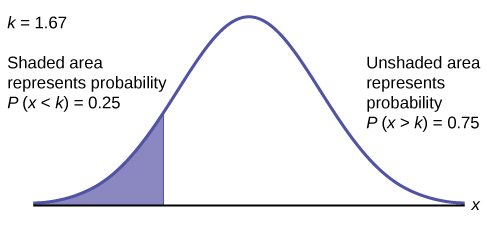
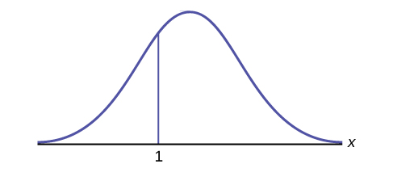
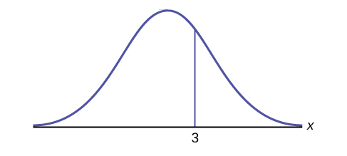
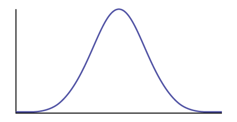

The shaded area in the following graph indicates the area to the left of *x*. This area is represented by the probability *P*(*X* &lt; *x*). Normal tables, computers, and calculators provide or calculate the probability *P*(*X* &lt; *x*).
{: .finger}

{:}

The area to the right is then *P*(*X* &gt; *x*) = 1 – *P*(*X* &lt; *x*). Remember, *P*(*X* &lt; *x*) = **Area to the left**{: data-type="term"} of the vertical line through *x*. *P*(*X* &lt; *x*) = 1 – *P*(*X* &lt; *x*) = **Area to the right**{: data-type="term"} of the vertical line through *x*. *P*(*X* &lt; *x*) is the same as *P*(*X* ≤ *x*) and *P*(*X* &gt; *x*) is the same as *P*(*X* ≥ *x*) for continuous distributions.

### Calculations of Probabilities

Probabilities are calculated using technology. There are instructions given as necessary for the TI-83+ and TI-84 calculators.
{: .finger}

NOTE

To calculate the probability, use the probability tables provided in [\[link\]](/m47875) without the use of technology. The tables include instructions for how to use them.

If the area to the left is 0.0228, then the area to the right is 1 – 0.0228 = 0.9772.

Try It

If the area to the left of *x* is 0.012, then what is the area to the right?

1 − 0.012 = 0.988

The final exam scores in a statistics class were normally distributed with a mean of 63 and a standard deviation of five.* * *
{: data-type="newline" data-count="2"}

a. Find the probability that a randomly selected student scored more than 65 on the exam.

a. Let *X* = a score on the final exam. *X* ~ *N*(63, 5), where *μ* = 63 and *σ* = 5.

Draw a graph.

Then, find *P*(*x* &gt; 65).

*P*(*x* &gt; 65) = 0.3446

{:}

The probability that any student selected at random scores more than 65 is 0.3446.

Go into `2nd DISTR`. * * *
{: data-type="newline"}

After pressing `2nd DISTR`, press `2:normalcdf`.

The syntax for the instructions are as follows:

normalcdf(lower value, upper value, mean, standard deviation) For this problem: normalcdf(65,1E99,63,5) = 0.3446. You get 1E99 (= 1099) by pressing `1`, the `EE` key (a 2nd key) and then `99`. Or, you can enter `10^99` instead. The number 1099 is way out in the right tail of the normal curve. We are calculating the area between 65 and 1099. In some instances, the lower number of the area might be –1E99 (= –1099). The number –1099 is way out in the left tail of the normal curve.

Historical Note

The TI probability program calculates a *z*-score and then the probability from the *z*-score. Before technology, the *z*-score was looked up in a standard normal probability table (because the math involved is too cumbersome) to find the probability. In this example, a standard normal table with area to the left of the *z*-score was used. You calculate the *z*-score and look up the area to the left. The probability is the area to the right.

*z* = <math xmlns="http://www.w3.org/1998/Math/MathML"> <mrow> <mfrac> <mrow> <mn>65</mn><mtext> – 63</mtext> </mrow> <mn>5</mn> </mfrac> </mrow> </math>

 = 0.4

Area to the left is 0.6554.

*P*(*x* &gt; 65) = *P*(*z* &gt; 0.4) = 1 – 0.6554 = 0.3446

Find the percentile for a student scoring 65:

\*Press `2nd Distr` * * *
{: data-type="newline"}

\*Press `2:normalcdf`( * * *
{: data-type="newline"}

\*Enter lower bound, upper bound, mean, standard deviation followed by ) * * *
{: data-type="newline"}

\*Press `ENTER`. * * *
{: data-type="newline"}

For this Example, the steps are * * *
{: data-type="newline"}

`2nd Distr` * * *
{: data-type="newline"}

`2:normalcdf`(65,1,2nd EE,99,63,5) `ENTER` * * *
{: data-type="newline"}

The probability that a selected student scored more than 65 is 0.3446.

b. Find the probability that a randomly selected student scored less than 85.

b. Draw a graph.

Then find *P*(*x* &lt; 85), and shade the graph.

Using a computer or calculator, find *P*(*x* &lt; 85) = 1.

normalcdf(0,85,63,5) = 1 (rounds to one)

The probability that one student scores less than 85 is approximately one (or 100%).* * *
{: data-type="newline" data-count="2"}

c. Find the 90th percentile (that is, find the score *k* that has 90% of the scores below *k* and 10% of the scores above *k*).

c. Find the 90th percentile. For each problem or part of a problem, draw a new graph. Draw the *x*-axis. Shade the area that corresponds to the 90th percentile.

**Let *k* = the 90th percentile.** The variable *k* is located on the *x*-axis. *P*(*x* &lt; *k*) is the area to the left of *k*. The 90th percentile *k* separates the exam scores into those that are the same or lower than *k* and those that are the same or higher. Ninety percent of the test scores are the same or lower than *k*, and ten percent are the same or higher. The variable *k* is often called a **critical value**{: data-type="term"}.

*k* = 69.4

{:}

The 90th percentile is 69.4. This means that 90% of the test scores fall at or below 69.4 and 10% fall at or above. To get this answer on the calculator, follow this step:

`invNorm` in `2nd DISTR`. invNorm(area to the left, mean, standard deviation) * * *
{: data-type="newline"}

For this problem, invNorm(0.90,63,5) = 69.4

d. Find the 70th percentile (that is, find the score *k* such that 70% of scores are below *k* and 30% of the scores are above *k*).

d. Find the 70th percentile.

Draw a new graph and label it appropriately. *k* = 65.6

The 70th percentile is 65.6. This means that 70% of the test scores fall at or below 65.5 and 30% fall at or above.

invNorm(0.70,63,5) = 65.6

Try It

The golf scores for a school team were normally distributed with a mean of 68 and a standard deviation of three.

Find the probability that a randomly selected golfer scored less than 65.

normalcdf(0,65,68,3) = 0.1587

A personal computer is used for office work at home, research, communication, personal finances, education, entertainment, social networking, and a myriad of other things. Suppose that the average number of hours a household personal computer is used for entertainment is two hours per day. Assume the times for entertainment are normally distributed and the standard deviation for the times is half an hour.* * *
{: data-type="newline" data-count="2"}

a. Find the probability that a household personal computer is used for entertainment between 1.8 and 2.75 hours per day.

a. Let *X* = the amount of time (in hours) a household personal computer is used for entertainment. *X* ~ *N*(2, 0.5) where *μ* = 2 and *σ* = 0.5.

Find *P*(1.8 &lt; *x* &lt; 2.75).

The probability for which you are looking is the area **between** *x* = 1.8 and *x* = 2.75. *P*(1.8 &lt; *x* &lt; 2.75) = 0.5886

{:}

normalcdf(1.8,2.75,2,0.5) = 0.5886

The probability that a household personal computer is used between 1.8 and 2.75 hours per day for entertainment is 0.5886.* * *
{: data-type="newline" data-count="2"}

b. Find the maximum number of hours per day that the bottom quartile of households uses a personal computer for entertainment.

b. To find the maximum number of hours per day that the bottom quartile of households uses a personal computer for entertainment, **find the 25th percentile,** *k*, where *P*(*x* &lt; *k*) = 0.25.

{:}

invNorm(0.25,2,0.5) = 1.66

The maximum number of hours per day that the bottom quartile of households uses a personal computer for entertainment is 1.66 hours.

Try It

The golf scores for a school team were normally distributed with a mean of 68 and a standard deviation of three. Find the probability that a golfer scored between 66 and 70.

normalcdf(66,70,68,3) = 0.4950

In the United States the ages 13 to 55+ of smartphone users approximately follow a normal distribution with approximate mean and standard deviation of 36.9 years and 13.9 years, respectively.* * *
{: data-type="newline" data-count="2"}

a. Determine the probability that a random smartphone user in the age range 13 to 55+ is between 23 and 64.7 years old.

a. normalcdf(23,64.7,36.9,13.9) = 0.8186* * *
{: data-type="newline" data-count="2"}

b. Determine the probability that a randomly selected smartphone user in the age range 13 to 55+ is at most 50.8 years old.

b. normalcdf(–1099,50.8,36.9,13.9) = 0.8413* * *
{: data-type="newline" data-count="2"}

c. Find the 80th percentile of this distribution, and interpret it in a complete sentence.

c.

* invNorm(0.80,36.9,13.9) = 48.6
* The 80th percentile is 48.6 years.
* 80% of the smartphone users in the age range 13 – 55+ are 48.6 years old or less.
{: data-labeled-item="true"}

Try It

Use the information in [\[link\]](#eip-562) to answer the following questions.

1.  Find the 30th percentile, and interpret it in a complete sentence.
2.  What is the probability that the age of a randomly selected smartphone user in the range 13 to 55+ is less than 27 years old.
{: type="a"}

Let *X* = a smart phone user whose age is 13 to 55+. *X* ~ *N*(36.9, 13.9)

1.  To find the 30th percentile, find *k* such that *P*(*x* &lt; *k*) = 0.30.
    * * *
    {: data-type="newline" data-count="1"}
    
    invNorm(0.30, 36.9, 13.9) = 29.6 years
    * * *
    {: data-type="newline" data-count="1"}
    
    Thirty percent of smartphone users 13 to 55+ are at most 29.6 years and 70% are at least 29.6 years.
2.  Find *P*(*x* &lt; 27) {: #eip-idp78177840}

    * * *
    {: data-type="newline" data-count="1"}
    
    normalcdf(0,27,36.9,13.9) = 0.2342
    * * *
    {: data-type="newline" data-count="1"}
    
    (Note that normalcdf(–1099,27,36.9,13.9) = 0.2382. The two answers differ only by 0.0040.)
{: type="a"}

In the United States the ages 13 to 55+ of smartphone users approximately follow a normal distribution with approximate mean and standard deviation of 36.9 years and 13.9 years respectively. Using this information, answer the following questions (round answers to one decimal place).* * *
{: data-type="newline" data-count="2"}

a. Calculate the interquartile range (*IQR*).

a.

* *IQR* = *Q*3 – *Q*1
* Calculate *Q*3 = 75th percentile and *Q*1 = 25th percentile.
* invNorm(0.75,36.9,13.9) = *Q*3 = 46.2754
* invNorm(0.25,36.9,13.9) = *Q*1 = 27.5246
* *IQR* = *Q*3 – *Q*1 = 18.8
{: data-labeled-item="true"}

* * *
{: data-type="newline" data-count="2"}

b. Forty percent of the ages that range from 13 to 55+ are at least what age?

b.

* Find *k* where *P*(*x* ≥ *k*) = 0.40 ("At least" translates to "greater than or equal to.")
* 0\.40 = the area to the right.
* Area to the left = 1 – 0.40 = 0.60.
* The area to the left of *k* = 0.60.
* invNorm(0.60,36.9,13.9) = 40.4215.
* *k* = 40.4.
* Forty percent of the ages that range from 13 to 55+ are at least 40.4 years.
{: data-labeled-item="true"}

Try It

Two thousand students took an exam. The scores on the exam have an approximate normal distribution with a mean *μ* = 81 points and standard deviation *σ* = 15 points.

1.  Calculate the first- and third-quartile scores for this exam.
2.  The middle 50% of the exam scores are between what two values?
{: type="a"}

1.  *Q*1 = 25th percentile = invNorm(0.25,81,15) = 70.9
    * * *
    {: data-type="newline"}
    
    *Q*3 = 75th percentile = invNorm(0.75,81,15) = 91.1
2.  The middle 50% of the scores are between 70.9 and 91.1.
{: type="a"}

A citrus farmer who grows mandarin oranges finds that the diameters of mandarin oranges harvested on his farm follow a normal distribution with a mean diameter of 5.85 cm and a standard deviation of 0.24 cm.* * *
{: data-type="newline" data-count="2"}

a. Find the probability that a randomly selected mandarin orange from this farm has a diameter larger than 6.0 cm. Sketch the graph.

a. normalcdf(6,10^99,5.85,0.24) = 0.2660

{: #eip-idp150275440}

b. The middle 20% of mandarin oranges from this farm have diameters between \_\_\_\_\_\_ and \_\_\_\_\_\_.

b.

* 1 – 0.20 = 0.80
* The tails of the graph of the normal distribution each have an area of 0.40.
* Find *k1*, the 40th percentile, and *k2*, the 60th percentile (0.40 + 0.20 = 0.60).
* *k1* = invNorm(0.40,5.85,0.24) = 5.79 cm
* *k2* = invNorm(0.60,5.85,0.24) = 5.91 cm
{: data-labeled-item="true"}

* * *
{: data-type="newline" data-count="2"}

c. Find the 90th percentile for the diameters of mandarin oranges, and interpret it in a complete sentence.

c. 6.16: Ninety percent of the diameter of the mandarin oranges is at most 6.16 cm.

Try It

Using the information from [[link]](#eip-662), answer the following:

1.  The middle 40% of mandarin oranges from this farm are between \_\_\_\_\_\_ and \_\_\_\_\_\_.
2.  Find the 16th percentile and interpret it in a complete sentence.
{: type="a"}

1.  The middle area = 0.40, so each tail has an area of 0.30.
    
    1 – 0.40 = 0.60
    
    The tails of the graph of the normal distribution each have an area of 0.30.
    
    Find *k1*, the 30th percentile and *k2*, the 70th percentile (0.40 + 0.30 = 0.70).
    
    *k1* = invNorm(0.30,5.85,0.24) = 5.72 cm
    
    *k2* = invNorm(0.70,5.85,0.24) = 5.98 cm

2.  invNorm(0.16, 5.85, 0.24) = 5.61; 16% of mandarin oranges from this farm have diameter 5.61 cm or less.
{: type="a"}

### References

“Naegele’s rule.” Wikipedia. Available online at http://en.wikipedia.org/wiki/Naegele\'s\\\_rule (accessed May 14, 2013).

“403: NUMMI.” Chicago Public Media &amp; Ira Glass, 2013. Available online at http://www.thisamericanlife.org/radio-archives/episode/403/nummi (accessed May 14, 2013).

“Scratch-Off Lottery Ticket Playing Tips.” WinAtTheLottery.com, 2013. Available online at http://www.winatthelottery.com/public/department40.cfm (accessed May 14, 2013).

“Smart Phone Users, By The Numbers.” Visual.ly, 2013. Available online at http://visual.ly/smart-phone-users-numbers (accessed May 14, 2013).

“Facebook Statistics.” Statistics Brain. Available online at http://www.statisticbrain.com/facebook-statistics/(accessed May 14, 2013).

### Chapter Review   {#eip-424}

The normal distribution, which is continuous, is the most important of all the probability distributions. Its graph is bell-shaped. This bell-shaped curve is used in almost all disciplines. Since it is a continuous distribution, the total area under the curve is one. The parameters of the normal are the mean *µ* and the standard deviation *σ*. A special normal distribution, called the standard normal distribution is the distribution of *z*-scores. Its mean is zero, and its standard deviation is one.

### Formula Review   {#eip-108}

Normal Distribution: *X* ~ *N*(*µ*, *σ*) where *µ* is the mean and *σ* is the standard deviation.

Standard Normal Distribution: *Z* ~ *N*(0, 1).

Calculator function for probability: normalcdf (lower *x* value of the area, upper *x* value of the area, mean, standard deviation)

Calculator function for the *k*th percentile: *k* = invNorm (area to the left of *k*, mean, standard deviation)

<section data-depth="1" id="eip-527" class="practice" markdown="1">

How would you represent the area to the left of one in a probability statement?

{: #eip-idp74682384 data-print-width="3in"}

*P*(*x* &lt; 1)

What is the area to the right of one?

{: #eip-idm26567824 data-print-width="3in"}

<!-- <solution id="fs-idp151140256">
<para id="fs-idp77511872">1 &#8211; <emphasis effect="italics">P</emphasis>(<emphasis effect="italics">x</emphasis> &lt; 1) or <emphasis effect="italics">P</emphasis>(<emphasis effect="italics">x</emphasis> &lt; 1)</para>
</solution> -->

Is *P*(*x* &lt; 1) equal to *P*(*x* ≤ 1)? Why?

Yes, because they are the same in a continuous distribution: *P*(*x* = 1) = 0

How would you represent the area to the left of three in a probability statement?

{: #eip-idm45345808 data-print-width="3in"}

<!-- <solution id="fs-idp146985792">
<para id="fs-idp60178064"><emphasis effect="italics">P</emphasis>(<emphasis effect="italics">x</emphasis> &lt; 3)</para>
</solution> -->

What is the area to the right of three?

{: #eip-idp19359872 data-print-width="3in"}

1 – *P*(*x* &lt; 3) or *P*(*x* &gt; 3)

If the area to the left of *x* in a normal distribution is 0.123, what is the area to the right of *x*?

<!-- <solution id="fs-idm19166096">
<para id="fs-idp102316448">1 &#8211; 0.123 = 0.877</para></solution> -->

If the area to the right of *x* in a normal distribution is 0.543, what is the area to the left of *x*?

1 – 0.543 = 0.457

*Use the following information to answer the next four exercises:*

*X* ~ *N*(54, 8)

Find the probability that *x* &gt; 56.

<!-- <solution id="fs-idp74510448">
<para id="fs-idp25510144">0.4013</para>
</solution> -->

Find the probability that *x* &lt; 30.

0\.0013

Find the 80th percentile.

<!-- <solution id="fs-idp144265408">
<para id="fs-idp42005696">60.73</para>
</solution> -->

Find the 60th percentile.

56\.03

*X* ~ *N*(6, 2)

Find the probability that *x* is between three and nine.

<!-- <solution id="fs-idp53207040">
<para id="fs-idp127782224">0.8664</para>
</solution> -->

*X* ~ *N*(–3, 4)

Find the probability that *x* is between one and four.

0\.1186

*X* ~ *N*(4, 5)

Find the maximum of *x* in the bottom quartile.

<!-- <solution id="fs-idp30677232">
<para id="fs-idp151050720">0.6276</para>
</solution> -->

*Use the following information to answer the next three exercise:* The life of Sunshine CD players is normally distributed with a mean of 4.1 years and a standard deviation of 1.3 years. A CD player is guaranteed for three years. We are interested in the length of time a CD player lasts. Find the probability that a CD player will break down during the guarantee period.

1.  Sketch the situation. Label and scale the axes. Shade the region corresponding to the probability. {: #fig1 data-print-width="3in"}

2.  *P*(0 &lt; *x* &lt; \_\_\_\_\_\_\_\_\_\_\_\_) = \_\_\_\_\_\_\_\_\_\_\_ (Use zero for the minimum value of *x*.)
{: type="a"}

1.  Check student’s solution.
2.  3, 0.1979
{: data-mark-suffix="." type="a"}

Find the probability that a CD player will last between 2.8 and six years.

1.  Sketch the situation. Label and scale the axes. Shade the region corresponding to the probability. {: #fig-231 data-print-width="3in"}

2.  *P*(\\\_\\\_\\\_\\\_\\\_\\\_\\\_\\\_\\\_\\\_ &lt; *x* &lt; \\\_\\\_\\\_\\\_\\\_\\\_\\\_\\\_\\\_\\\_) = \\\_\\\_\\\_\\\_\\\_\\\_\\\_\\\_\\\_\\\_
{: data-mark-suffix="." type="a"}

<!-- <solution id="id44443502">
<list id="element-671" mark-suffix="." list-type="enumerated" number-style="lower-alpha">
<item>Check student&#8217;s solution</item>
<item>2.8, 6, 0.7694</item>
</list></solution> -->

Find the 70th percentile of the distribution for the time a CD player lasts.

1.  Sketch the situation. Label and scale the axes. Shade the region corresponding to the lower 70%. {: #fig-241552 data-print-width="3in"}

2.  *P*(*x* &lt; *k*) = \_\_\_\_\_\_\_\_\_\_ Therefore, *k* = \_\_\_\_\_\_\_\_\_
{: data-mark-suffix="." type="a"}

1.  Check student’s solution.
2.  0\.70, 4.78 years
{: data-mark-suffix="." type="a"}

</section>

### Homework   {#eip-866}

*Use the following information to answer the next two exercises:* The patient recovery time from a particular surgical procedure is normally distributed with a mean of 5.3 days and a standard deviation of 2.1 days.

What is the probability of spending more than two days in recovery?

1.  0\.0580
2.  0\.8447
3.  0\.0553
4.  0\.9420
{: type="a"}

<!-- <solution id="id12741946">
<para id="element-646">d</para>
</solution> -->

The 90th percentile for recovery times is?

1.  8\.89
2.  7\.07
3.  7\.99
4.  4\.32
{: type="a"}

c

*Use the following information to answer the next three exercises:* The length of time it takes to find a parking space at 9 A.M. follows a normal distribution with a mean of five minutes and a standard deviation of two minutes.

Based upon the given information and numerically justified, would you be surprised if it took less than one minute to find a parking space?

1.  Yes
2.  No
3.  Unable to determine
{: data-mark-suffix="." type="a"}

<!-- <solution id="id15290500">
<para id="element-245">a</para>
</solution> -->

Find the probability that it takes at least eight minutes to find a parking space.

1.  0\.0001
2.  0\.9270
3.  0\.1862
4.  0\.0668
{: type="a"}

d

Seventy percent of the time, it takes more than how many minutes to find a parking space?

1.  1\.24
2.  2\.41
3.  3\.95
4.  6\.05
{: type="a"}

<!-- <solution id="id16763246">
<para id="element-722">c</para>
</solution> -->

According to a study done by De Anza students, the height for Asian adult males is normally distributed with an average of 66 inches and a standard deviation of 2.5 inches. Suppose one Asian adult male is randomly chosen. Let *X* = height of the individual.

1.  *X* ~ \_\_\_\_\_(\_\_\_\_\_,\_\_\_\_\_)
2.  Find the probability that the person is between 65 and 69 inches. Include a sketch of the graph, and write a probability statement.
3.  Would you expect to meet many Asian adult males over 72 inches? Explain why or why not, and justify your answer numerically.
{: type="a"}

1.  *X* ~ *N*(66, 2.5)
2.  0\.5404
3.  No, the probability that an Asian male is over 72 inches tall is 0.0082
{: type="a"}

IQ is normally distributed with a mean of 100 and a standard deviation of 15. Suppose one individual is randomly chosen. Let *X* = IQ of an individual.

1.  *X* ~ \\\_\\\_\\\_\\\_\\\_(\\\_\\\_\\\_\\\_\\\_,\\\_\\\_\\\_\\\_\\\_)
2.  Find the probability that the person has an IQ greater than 120. Include a sketch of the graph, and write a probability statement.
3.  MENSA is an organization whose members have the top 2% of all IQs. Find the minimum IQ needed to qualify for the MENSA organization. Sketch the graph, and write the probability statement.
4.  The middle 50% of IQs fall between what two values? Sketch the graph and write the probability statement.
{: type="a"}

<!-- <solution id="eip-idp25493760">
<list id="element-932s" list-type="enumerated" number-style="lower-alpha"><item><emphasis effect="italics">N</emphasis>(100, 15)</item>
<item>The probability that a person has an IQ greater than 120 is 0.0918.</item>
<item>A person has to have an IQ over 130 to qualify for MENSA.</item>
<item>The middle 50% of IQ scores falls between 89.95 and 110.05.</item>
</list></solution> -->

The percent of fat calories that a person in America consumes each day is normally distributed with a mean of about 36 and a standard deviation of 10. Suppose that one individual is randomly chosen. Let *X* = percent of fat calories.

1.  *X* ~ \_\_\_\_\_(\_\_\_\_\_,\_\_\_\_\_)
2.  Find the probability that the percent of fat calories a person consumes is more than 40. Graph the situation. Shade in the area to be determined.
3.  Find the maximum number for the lower quarter of percent of fat calories. Sketch the graph and write the probability statement.
{: type="a"}

1.  *X* ~ *N*(36, 10)
2.  The probability that a person consumes more than 40% of their calories as fat is 0.3446.
3.  Approximately 25% of people consume less than 29.26% of their calories as fat.
{: type="a"}

Suppose that the distance of fly balls hit to the outfield (in baseball) is normally distributed with a mean of 250 feet and a standard deviation of 50 feet.

1.  If *X* = distance in feet for a fly ball, then *X* ~ \\\_\\\_\\\_\\\_\\\_(\\\_\\\_\\\_\\\_\\\_,\\\_\\\_\\\_\\\_\\\_)
2.  If one fly ball is randomly chosen from this distribution, what is the probability that this ball traveled fewer than 220 feet? Sketch the graph. Scale the horizontal axis *X*. Shade the region corresponding to the probability. Find the probability.
3.  Find the 80th percentile of the distribution of fly balls. Sketch the graph, and write the probability statement.
{: type="a"}

<!-- <solution id="eip-idp105794048">
<list id="element-107s" list-type="enumerated" number-style="lower-alpha"><item><emphasis effect="italics">X</emphasis> ~ <emphasis effect="italics">N</emphasis>(250, 50)</item>
<item>The probability that a fly ball travels less than 220 feet is 0.2743.</item>
<item>Eighty percent of the fly balls will travel less than 292 feet.</item>
</list></solution> -->

In China, four-year-olds average three hours a day unsupervised. Most of the unsupervised children live in rural areas, considered safe. Suppose that the standard deviation is 1.5 hours and the amount of time spent alone is normally distributed. We randomly select one Chinese four-year-old living in a rural area. We are interested in the amount of time the child spends alone per day.

1.  In words, define the random variable *X*.
2.  *X* ~ \_\_\_\_\_(\_\_\_\_\_,\_\_\_\_\_)
3.  Find the probability that the child spends less than one hour per day unsupervised. Sketch the graph, and write the probability statement.
4.  What percent of the children spend over ten hours per day unsupervised?
5.  Seventy percent of the children spend at least how long per day unsupervised?
{: type="a"}

1.  *X* = number of hours that a Chinese four-year-old in a rural area is unsupervised during the day.
2.  *X* ~ *N*(3, 1.5)
3.  The probability that the child spends less than one hour a day unsupervised is 0.0918.
4.  The probability that a child spends over ten hours a day unsupervised is less than 0.0001.
5.  2\.21 hours
{: type="a"}

In the 1992 presidential election, Alaska’s 40 election districts averaged 1,956.8 votes per district for President Clinton. The standard deviation was 572.3. (There are only 40 election districts in Alaska.) The distribution of the votes per district for President Clinton was bell-shaped. Let *X* = number of votes for President Clinton for an election district.

1.  State the approximate distribution of *X*.
2.  Is 1,956.8 a population mean or a sample mean? How do you know?
3.  Find the probability that a randomly selected district had fewer than 1,600 votes for President Clinton. Sketch the graph and write the probability statement.
4.  Find the probability that a randomly selected district had between 1,800 and 2,000 votes for President Clinton.
5.  Find the third quartile for votes for President Clinton.
{: type="a"}

<!-- <solution id="eip-idp28319056">
<list id="element-780s" list-type="enumerated" number-style="lower-alpha"><item><emphasis effect="italics">X</emphasis> ~ <emphasis effect="italics">N</emphasis>(1956.8, 572.3)</item>
<item>This is a population mean, because all election districts are included.</item>
<item>The probability that a district had less than 1,600 votes for President Clinton is 0.2676.</item>
<item>0.3798</item>
<item>Seventy-five percent of the districts had fewer than 2,340 votes for President Clinton.</item>
</list></solution> -->

Suppose that the duration of a particular type of criminal trial is known to be normally distributed with a mean of 21 days and a standard deviation of seven days.

1.  In words, define the random variable *X*.
2.  *X* ~ \_\_\_\_\_(\_\_\_\_\_,\_\_\_\_\_)
3.  If one of the trials is randomly chosen, find the probability that it lasted at least 24 days. Sketch the graph and write the probability statement.
4.  Sixty percent of all trials of this type are completed within how many days?
{: type="a"}

1.  *X* = the distribution of the number of days a particular type of criminal trial will take
2.  *X* ~ *N*(21, 7)
3.  The probability that a randomly selected trial will last more than 24 days is 0.3336.
4.  22\.77
{: data-mark-suffix="." type="a"}

Terri Vogel, an amateur motorcycle racer, averages 129.71 seconds per 2.5 mile lap (in a seven-lap race) with a standard deviation of 2.28 seconds. The distribution of her race times is normally distributed. We are interested in one of her randomly selected laps.

1.  In words, define the random variable *X*.
2.  *X* ~ \\\_\\\_\\\_\\\_\\\_(\\\_\\\_\\\_\\\_\\\_,\\\_\\\_\\\_\\\_\\\_)
3.  Find the percent of her laps that are completed in less than 130 seconds.
4.  The fastest 3% of her laps are under \\\_\\\_\\\_\\\_\\\_.
5.  The middle 80% of her laps are from \\\_\\\_\\\_\\\_\\\_\\\_\\\_ seconds to \\\_\\\_\\\_\\\_\\\_\\\_\\\_ seconds.
{: type="a"}

<!-- <solution id="eip-idp63928720">
<list id="element-598s" list-type="enumerated" number-style="lower-alpha"><item><emphasis effect="italics">X</emphasis> = the distribution of race times that Terry Vogel produces</item>
<item><emphasis effect="italics">X</emphasis> ~ <emphasis effect="italics">N</emphasis>(129.71, 2.28)</item>
<item>Terri completes 55.17% of her laps in less than 130 seconds.</item>
<item>Terri completes 55.17% of her laps in less than 130 seconds.</item>
<item>124.4 and 135.02</item>
</list></solution> -->

Thuy Dau, Ngoc Bui, Sam Su, and Lan Voung conducted a survey as to how long customers at Lucky claimed to wait in the checkout line until their turn. Let *X* = time in line. [[link]](#element-694) displays the ordered real data (in minutes):

| 0.50 | 4.25 | 5 | 6 | 7.25 |
| 1.75 | 4.25 | 5.25 | 6 | 7.25 |
| 2 | 4.25 | 5.25 | 6.25 | 7.25 |
| 2.25 | 4.25 | 5.5 | 6.25 | 7.75 |
| 2.25 | 4.5 | 5.5 | 6.5 | 8 |
| 2.5 | 4.75 | 5.5 | 6.5 | 8.25 |
| 2.75 | 4.75 | 5.75 | 6.5 | 9.5 |
| 3.25 | 4.75 | 5.75 | 6.75 | 9.5 |
| 3.75 | 5 | 6 | 6.75 | 9.75 |
| 3.75 | 5 | 6 | 6.75 | 10.75 |
{: #element-694 summary="This table presents raw data in 50 cells."}

1.  Calculate the sample mean and the sample standard deviation.
2.  Construct a histogram.
3.  Draw a smooth curve through the midpoints of the tops of the bars.
4.  In words, describe the shape of your histogram and smooth curve.
5.  Let the sample mean approximate *μ* and the sample standard deviation approximate *σ*. The distribution of *X* can then be approximated by *X* ~ \_\_\_\_\_(\_\_\_\_\_,\_\_\_\_\_)
6.  Use the distribution in part e to calculate the probability that a person will wait fewer than 6.1 minutes.
7.  Determine the cumulative relative frequency for waiting less than 6.1 minutes.
8.  Why aren’t the answers to part f and part g exactly the same?
9.  Why are the answers to part f and part g as close as they are?
10. If only ten customers has been surveyed rather than 50, do you think the answers to part f and part g would have been closer together or farther apart? Explain your conclusion.
{: type="a"}

1.  mean = 5.51, *s* = 2.15
2.  Check student's solution.
3.  Check student's solution.
4.  Check student's solution.
5.  *X* ~ *N*(5.51, 2.15)
6.  0\.6029
7.  The cumulative frequency for less than 6.1 minutes is 0.64.
8.  The answers to part f and part g are not exactly the same, because the normal distribution is only an approximation to the real one.
9.  The answers to part f and part g are close, because a normal distribution is an excellent approximation when the sample size is greater than 30.
10. The approximation would have been less accurate, because the smaller sample size means that the data does not fit normal curve as well.
{: type="a"}

Suppose that Ricardo and Anita attend different colleges. Ricardo’s GPA is the same as the average GPA at his school. Anita’s GPA is 0.70 standard deviations above her school average. In complete sentences, explain why each of the following statements may be false.

1.  Ricardo’s actual GPA is lower than Anita’s actual GPA.
2.  Ricardo is not passing because his *z*-score is zero.
3.  Anita is in the 70th percentile of students at her college.
{: type="a"}

<!-- <solution id="eip-idp7493680">
<list id="element-264s" list-type="enumerated" number-style="lower-alpha"><item>If the average GPA is less at Anita&#8217;s school than it is at Ricardo&#8217;s, then Ricardo&#8217;s actual score could be higher.</item>
<item>Passing can be defined differently at different schools. Also, since Ricardo&#8217;s <emphasis effect="italics">z</emphasis>-score is 0, his GPA is actually
the average for his school, which is typically a passing GPA.</item>
<item>Anita&#8217;s percentile is higher than the 70th percentile.</item>
</list></solution> -->

[[link]](#element-666) shows a sample of the maximum capacity (maximum number of spectators) of sports stadiums. The table does not include horse-racing or motor-racing stadiums.

| 40,000 | 40,000 | 45,050 | 45,500 | 46,249 | 48,134 |
| 49,133 | 50,071 | 50,096 | 50,466 | 50,832 | 51,100 |
| 51,500 | 51,900 | 52,000 | 52,132 | 52,200 | 52,530 |
| 52,692 | 53,864 | 54,000 | 55,000 | 55,000 | 55,000 |
| 55,000 | 55,000 | 55,000 | 55,082 | 57,000 | 58,008 |
| 59,680 | 60,000 | 60,000 | 60,492 | 60,580 | 62,380 |
| 62,872 | 64,035 | 65,000 | 65,050 | 65,647 | 66,000 |
| 66,161 | 67,428 | 68,349 | 68,976 | 69,372 | 70,107 |
| 70,585 | 71,594 | 72,000 | 72,922 | 73,379 | 74,500 |
| 75,025 | 76,212 | 78,000 | 80,000 | 80,000 | 82,300 |
{: #element-666 summary="The table is a sample of the capacity of 60 sports stadiums ordered by the maximum number of spectators. Horse racing and motor racing stadiums are not included."}

1.  Calculate the sample mean and the sample standard deviation for the maximum capacity of sports stadiums (the data).
2.  Construct a histogram.
3.  Draw a smooth curve through the midpoints of the tops of the bars of the histogram.
4.  In words, describe the shape of your histogram and smooth curve.
5.  Let the sample mean approximate *μ* and the sample standard deviation approximate *σ*. The distribution of *X* can then be approximated by *X* ~ \_\_\_\_\_(\_\_\_\_\_,\_\_\_\_\_).
6.  Use the distribution in part e to calculate the probability that the maximum capacity of sports stadiums is less than 67,000 spectators.
7.  Determine the cumulative relative frequency that the maximum capacity of sports stadiums is less than 67,000 spectators. Hint: Order the data and count the sports stadiums that have a maximum capacity less than 67,000. Divide by the total number of sports stadiums in the sample.
8.  Why aren’t the answers to part f and part g exactly the same?
{: type="a"}

1.  mean = 60,136
    * * *
    {: data-type="newline"}
    
    *s* = 10,468
2.  Answers will vary.
3.  Answers will vary.
4.  Answers will vary.
5.  *X* ~ *N*(60136, 10468)
6.  0\.7440
7.  The cumulative relative frequency is 43/60 = 0.717.
8.  The answers for part f and part g are not the same, because the normal distribution is only an approximation.

An expert witness for a paternity lawsuit testifies that the length of a pregnancy is normally distributed with a mean of 280 days and a standard deviation of 13 days. An alleged father was out of the country from 240 to 306 days before the birth of the child, so the pregnancy would have been less than 240 days or more than 306 days long if he was the father. The birth was uncomplicated, and the child needed no medical intervention. What is the probability that he was NOT the father? What is the probability that he could be the father? Calculate the *z*-scores first, and then use those to calculate the probability.

<!-- <solution id="eip-102">
<list id="fs-idp65442944" list-type="labeled-item"><item>For <emphasis effect="italics">x</emphasis> = 240, <m:math>
 <m:mrow>
  <m:mfrac>
   <m:mrow>
    <m:mi>X</m:mi><m:mo>&#8722;</m:mo><m:mi>&#956;</m:mi>
   </m:mrow>
   <m:mi>&#963;</m:mi>
  </m:mfrac>
  
 </m:mrow>
</m:math> = <m:math>
 <m:mrow>
  <m:mfrac>
   <m:mrow>
    <m:mn>240</m:mn><m:mo>&#8722;</m:mo><m:mn>280</m:mn>
   </m:mrow>
   <m:mrow>
    <m:mn>13</m:mn>
   </m:mrow>
  </m:mfrac>
  <m:mo>=</m:mo><m:mo>&#8722;</m:mo><m:mn>3.0769</m:mn><m:mo>&#160;</m:mo>
 </m:mrow>
</m:math></item>
<item>For <emphasis effect="italics">x</emphasis> = 306, <m:math>
 <m:mrow>
  <m:mfrac>
   <m:mrow>
    <m:mn>306</m:mn><m:mo>&#8722;</m:mo><m:mn>280</m:mn>
   </m:mrow>
   <m:mrow>
    <m:mn>13</m:mn>
   </m:mrow>
  </m:mfrac>
  <m:mo>=</m:mo><m:mn>2</m:mn>
 </m:mrow>
</m:math></item>
<item><emphasis effect="italics">P</emphasis>(240 &lt; <emphasis effect="italics">x</emphasis> &lt; 306) = <emphasis effect="italics">P</emphasis>(&#8211;3.0769 &lt; <emphasis effect="italics">z</emphasis> &lt; 2) = normalcdf(&#8211;3.0769,2,0,1) = 0.9762.</item>
</list><para id="fs-idm15286272">According to the scenario given, this means that there is a 97.62% chance that he is not the father.</para>
<para id="fs-idp166170256">To answer the second part of the question, there is a 1 &#8211; 0.9762 = 0.0238 = 2.38% chance that he is the father.</para></solution> -->

A NUMMI assembly line, which has been operating since 1984, has built an average of 6,000 cars and trucks a week. Generally, 10% of the cars were defective coming off the assembly line. Suppose we draw a random sample of *n* = 100 cars. Let *X* represent the number of defective cars in the sample. What can we say about *X* in regard to the 68-95-99.7 empirical rule (one standard deviation, two standard deviations and three standard deviations from the mean are being referred to)? Assume a normal distribution for the defective cars in the sample.

* *n* = 100; *p* = 0.1; *q* = 0.9
* *μ* = *np* = (100)(0.10) = 10
* *σ* =
  <math xmlns="http://www.w3.org/1998/Math/MathML"> <mrow> <msqrt> <mrow> <mi>n</mi><mi>p</mi><mi>q</mi> </mrow> </msqrt> </mrow> </math>
  
  =
  <math xmlns="http://www.w3.org/1998/Math/MathML"> <mrow> <msqrt> <mrow> <mtext>(100)(0</mtext><mtext>.1)(0</mtext><mtext>.9)</mtext> </mrow> </msqrt> </mrow> </math>
  
  = 3
{: data-labeled-item="true"}

1.  *z* = ±1: *x1* = *µ* + *zσ* = 10 + 1(3) = 13 and *x*2 = *µ* – *zσ* = 10 – 1(3) = 7. 68% of the defective cars will fall between seven and 13.
2.  *z* = ±2: *x1* = *µ* + *zσ* = 10 + 2(3) = 16 and *x*2 = *µ* – *zσ* = 10 – 2(3) = 4. 95 % of the defective cars will fall between four and 16
3.  *z* = ±3: *x1* = *µ* + *zσ* = 10 + 3(3) = 19 and *x*2 = *µ* – *zσ* = 10 – 3(3) = 1. 99.7% of the defective cars will fall between one and 19.
{: type="i"}

We flip a coin 100 times (*n* = 100) and note that it only comes up heads 20% (*p* = 0.20) of the time. The mean and standard deviation for the number of times the coin lands on heads is *µ* = 20 and *σ* = 4 (verify the mean and standard deviation). Solve the following:

1.  There is about a 68% chance that the number of heads will be somewhere between \\\_\\\_\\\_ and \\\_\\\_\\\_.
2.  There is about a \\\_\\\_\\\_\\\_chance that the number of heads will be somewhere between 12 and 28.
3.  There is about a \\\_\\\_\\\_\\\_ chance that the number of heads will be somewhere between eight and 32.
{: type="a"}

<!-- <solution id="eip-171">
<list id="eip-idp58643840" list-type="enumerated" number-style="lower-alpha"><item>There is about a 68% chance that the number of heads will be somewhere between 16 and 24. <emphasis effect="italics">z</emphasis> = &#177;1: <emphasis effect="italics">x1</emphasis> = <emphasis effect="italics">&#181;</emphasis> + <emphasis effect="italics">z&#963;</emphasis> = 20 + 1(4) = 24 and <emphasis effect="italics">x2</emphasis> = <emphasis effect="italics">&#181;</emphasis>-<emphasis effect="italics">z&#963;</emphasis> = 20 &#8211; 1(4) = 16.</item>
<item>There is about a 95% chance that the number of heads will be somewhere between 12 and 28. For this problem: normalcdf(12,28,20,4) = 0.9545 = 95.45%</item>
<item>There is about a 99.73% chance that the number of heads will be somewhere between eight and 32. For this problem: normalcdf(8,32,20,4) = 0.9973 = 99.73%.</item>
</list></solution> -->

A $1 scratch off lotto ticket will be a winner one out of five times. Out of a shipment of *n* = 190 lotto tickets, find the probability for the lotto tickets that there are

1.  somewhere between 34 and 54 prizes.
2.  somewhere between 54 and 64 prizes.
3.  more than 64 prizes.
{: type="a"}

* *n* = 190; *p* =
  <math xmlns="http://www.w3.org/1998/Math/MathML" display=""> <mrow> <mfrac> <mn>1</mn> <mn>5</mn> </mfrac> </mrow> </math>
  
  = 0.2; *q* = 0.8
* *μ* = *np* = (190)(0.2) = 38
* *σ* =
  <math xmlns="http://www.w3.org/1998/Math/MathML"> <mrow> <msqrt> <mrow> <mi>n</mi><mi>p</mi><mi>q</mi> </mrow> </msqrt> </mrow> </math>
  
  =
  <math xmlns="http://www.w3.org/1998/Math/MathML"> <mrow> <msqrt> <mrow> <mtext>(190)(0</mtext><mtext>.2)(0</mtext><mtext>.8)</mtext> </mrow> </msqrt> </mrow> </math>
  
  = 5.5136
{: data-labeled-item="true"}

1.  For this problem: *P*(34 &lt; *x* &lt; 54) = normalcdf(34,54,48,5.5136) = 0.7641
2.  For this problem: *P*(54 &lt; *x* &lt; 64) = normalcdf(54,64,48,5.5136) = 0.0018
3.  For this problem: *P*(*x* &gt; 64) = normalcdf(64,1099,48,5.5136) = 0.0000012 (approximately 0)
{: type="a"}

Facebook provides a variety of statistics on its Web site that detail the growth and popularity of the site.

On average, 28 percent of 18 to 34 year olds check their Facebook profiles before getting out of bed in the morning. Suppose this percentage follows a normal distribution with a standard deviation of five percent.

1.  Find the probability that the percent of 18 to 34-year-olds who check Facebook before getting out of bed in the morning is at least 30.
2.  Find the 95th percentile, and express it in a sentence.
{: type="a"}

<!-- <solution id="eip-11">
<para id="eip-360"><emphasis effect="italics">X</emphasis> = the percent of 18 to 34-year-olds who check Facebook before getting out of bed in the morning.</para>
<para id="eip-idp16494464"><emphasis effect="italics">X</emphasis> ~ <emphasis effect="italics">N</emphasis>(28, 5)</para>
<list id="eip-idp160307472s" list-type="enumerated" number-style="lower-alpha"><item><emphasis effect="italics">P</emphasis>(<emphasis effect="italics">x</emphasis> &#8805; 30) = 0.3446; normalcdf(30,1EE99,28,5) = 0.3446</item>
<item>
<para id="eip-idm3944144">invNorm(0.95,0.28,0.05) = 0.3622.</para><para id="eip-idm3943760">95% of the percent of 18 to 34 year olds who check Facebook before getting out of bed in the morning is at most 36.22%.</para></item>
<item><para id="eip-idm7864096"><emphasis effect="italics">P</emphasis>(25 &lt; <emphasis effect="italics">x</emphasis> &lt; 55).</para>
<para id="eip-idm16259024"><emphasis effect="italics">P</emphasis>(25 &lt; <emphasis effect="italics">x</emphasis> &lt; 55) = normalcdf(25,55,28,5) = 0.7257(0.7257)(400) = 290.28</para></item>
</list></solution> -->

