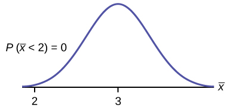
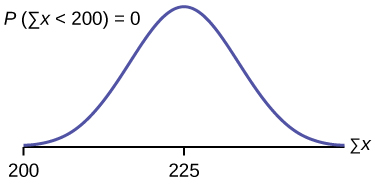

It is important for you to understand when to use the **central limit theorem**{: data-type="term"}. If you are being asked to find the probability of the mean, use the clt for the mean. If you are being asked to find the probability of a sum or total, use the clt for sums. This also applies to percentiles for means and sums.

NOTE

If you are being asked to find the probability of an **individual** value, do **not** use the clt. **Use the distribution of its random variable.**

# Examples of the Central Limit Theorem   {#element-733}

## Law of Large Numbers

The **law of large numbers**{: data-type="term"} says that if you take samples of larger and larger size from any population, then the mean <math xmlns="http://www.w3.org/1998/Math/MathML"> <mover accent="true"> <mi>x</mi> <mo>¯</mo> </mover> </math>

 of the sample tends to get closer and closer to *μ*. From the central limit theorem, we know that as *n* gets larger and larger, the sample means follow a normal distribution. The larger *n* gets, the smaller the standard deviation gets. (Remember that the standard deviation for <math xmlns="http://www.w3.org/1998/Math/MathML"> <mover accent="true"> <mi>X</mi> <mo>¯</mo> </mover> </math>

 is <math xmlns="http://www.w3.org/1998/Math/MathML"> <mrow> <mfrac> <mi>σ</mi> <mrow> <msqrt> <mi>n</mi> </msqrt> </mrow> </mfrac> </mrow> </math>

.) This means that the sample mean <math xmlns="http://www.w3.org/1998/Math/MathML"> <mover accent="true"> <mi>x</mi> <mo>¯</mo> </mover></math>

 must be close to the population mean *μ*. We can say that *μ* is the value that the sample means approach as *n* gets larger. The central limit theorem illustrates the law of large numbers.

## Central Limit Theorem for the Mean and Sum Examples

A study involving stress is conducted among the students on a college campus. **The stress scores follow a **uniform distribution**{: data-type="term"}** with the lowest stress score equal to one and the highest equal to five. Using a sample of 75 students, find:

1.  The probability that the **mean stress score** for the 75 students is less than two.
2.  The 90th percentile for the **mean stress score** for the 75 students.
3.  The probability that the **total of the 75 stress scores** is less than 200.
4.  The 90th percentile for the **total stress score** for the 75 students.
{: data-number-style="lower-alpha"}

Let *X* = one stress score.

Problems a and b ask you to find a probability or a percentile for a **mean**{: data-type="term"}. Problems c and d ask you to find a probability or a percentile for a **total or sum**. The sample size, *n*, is equal to 75.

Since the individual stress scores follow a uniform distribution, *X* ~ *U*(1, 5) where *a* = 1 and *b* = 5 (See [Continuous Random Variables](/m46967) for an explanation on the uniform distribution).

*μX* = <math xmlns="http://www.w3.org/1998/Math/MathML"> <mrow> <mfrac> <mrow> <mi>a</mi><mo>+</mo><mi>b</mi> </mrow> <mn>2</mn> </mfrac> </mrow> </math>

 = <math xmlns="http://www.w3.org/1998/Math/MathML"> <mrow> <mfrac> <mrow> <mtext>1 + 5</mtext> </mrow> <mn>2</mn> </mfrac> </mrow> </math>

 = 3

*σX* = <math xmlns="http://www.w3.org/1998/Math/MathML"> <mrow> <msqrt> <mrow> <mfrac> <mrow> <msup> <mrow> <mo stretchy="false">(</mo><mi>b</mi><mo>–</mo><mi>a</mi><mo stretchy="false">)</mo> </mrow> <mn>2</mn> </msup> </mrow> <mrow> <mn>12</mn> </mrow> </mfrac> </mrow> </msqrt> </mrow> </math>

 = <math xmlns="http://www.w3.org/1998/Math/MathML"> <mrow> <msqrt> <mrow> <mfrac> <mrow> <msup> <mrow> <mo stretchy="false">(</mo><mn>5</mn><mo>–</mo><mtext>1)</mtext> </mrow> <mn>2</mn> </msup> </mrow> <mrow> <mn>12</mn> </mrow> </mfrac> </mrow> </msqrt> </mrow> </math>

 = 1.15

For problems 1. and 2., let <math xmlns="http://www.w3.org/1998/Math/MathML"> <mover accent="true"> <mi>X</mi> <mo>¯</mo> </mover> </math>

 = the mean stress score for the 75 students. Then,

<math xmlns="http://www.w3.org/1998/Math/MathML"> <mover accent="true"> <mi>X</mi> <mo>¯</mo> </mover> </math>

 ∼ *N* <math xmlns="http://www.w3.org/1998/Math/MathML"> <mrow> <mrow><mo>(</mo> <mrow> <mtext>3, </mtext><mfrac> <mrow> <mtext>1</mtext><mtext>.15</mtext> </mrow> <mrow> <msqrt> <mrow> <mtext>75</mtext> </mrow> </msqrt> </mrow> </mfrac> </mrow> <mo>)</mo></mrow> </mrow> </math>

 where *n* = 75.

a. Find *P*(<math xmlns="http://www.w3.org/1998/Math/MathML"> <mover accent="true"> <mi>x</mi> <mo>¯</mo> </mover> </math>

 &lt; 2). Draw the graph.

a. *P*(<math xmlns="http://www.w3.org/1998/Math/MathML"> <mover accent="true"> <mi>x</mi> <mo>¯</mo> </mover> </math>

 &lt; 2) = 0

The probability that the mean stress score is less than two is about zero.

{: data-media-type="image/jpg"}

`normalcdf` <math xmlns="http://www.w3.org/1998/Math/MathML"> <mrow> <mrow><mo>(</mo> <mrow> <mtext>1,2,3,</mtext><mfrac> <mrow> <mtext>1</mtext><mtext>.15</mtext> </mrow> <mrow> <msqrt> <mrow> <mtext>75</mtext> </mrow> </msqrt> </mrow> </mfrac> </mrow> <mo>)</mo></mrow> </mrow> </math>

 = 0

Reminder

The smallest stress score is one.

b. Find the 90th percentile for the mean of 75 stress scores. Draw a graph.

b. Let *k* = the 90th precentile.

Find *k*, where *P*(<math xmlns="http://www.w3.org/1998/Math/MathML"> <mover accent="true"> <mi>x</mi> <mo>¯</mo> </mover> </math>

 &lt; *k*) = 0.90.

*k* = 3.2

{: data-media-type="image/jpg" data-print-width="3in"}

The 90th percentile for the mean of 75 scores is about 3.2. This tells us that 90% of all the means of 75 stress scores are at most 3.2, and that 10% are at least 3.2.

`invNorm`<math xmlns="http://www.w3.org/1998/Math/MathML"> <mrow> <mrow><mo>(</mo> <mrow> <mtext>0</mtext><mtext>.90,3,</mtext><mfrac> <mrow> <mn>1.15</mn> </mrow> <mrow> <msqrt> <mrow> <mn>75</mn> </mrow> </msqrt> </mrow> </mfrac> </mrow> <mo>)</mo></mrow> </mrow> </math>

 = 3.2

For problems c and d, let *ΣX* = the sum of the 75 stress scores. Then, *ΣX* ~ *N*\[(75)(3),<math xmlns="http://www.w3.org/1998/Math/MathML"> <mrow> <mo stretchy="false">(</mo><msqrt> <mrow> <mn>75</mn> </mrow> </msqrt> <mo stretchy="false">)</mo> </mrow> </math>

(1.15)\]

c. Find *P*(*Σx* &lt; 200). Draw the graph.

c. The mean of the sum of 75 stress scores is (75)(3) = 225

The standard deviation of the sum of 75 stress scores is <math xmlns="http://www.w3.org/1998/Math/MathML"> <mrow> <mo stretchy="false">(</mo><msqrt> <mrow> <mn>75</mn> </mrow> </msqrt> <mo stretchy="false">)</mo> </mrow> </math>

(1.15) = 9.96

*P*(*Σx* &lt; 200) = 0

{: data-media-type="image/jpg"}

The probability that the total of 75 scores is less than 200 is about zero.

`normalcdf` (75,200,(75)(3),<math xmlns="http://www.w3.org/1998/Math/MathML"> <mrow> <mo stretchy="false">(</mo><msqrt> <mrow> <mn>75</mn> </mrow> </msqrt> <mo stretchy="false">)</mo> </mrow> </math>

(1.15)).
{: .finger}

Reminder

The smallest total of 75 stress scores is 75, because the smallest single score is one.

d. Find the 90th percentile for the total of 75 stress scores. Draw a graph.

d. Let *k* = the 90th percentile.

Find *k* where *P*(*Σx* &lt; *k*) = 0.90.

*k* = 237.8

{: data-media-type="image/jpg"}

The 90th percentile for the sum of 75 scores is about 237.8. This tells us that 90% of all the sums of 75 scores are no more than 237.8 and 10% are no less than 237.8.

`invNorm`(0.90,(75)(3),<math xmlns="http://www.w3.org/1998/Math/MathML"> <mrow> <mo stretchy="false">(</mo><msqrt> <mrow> <mn>75</mn> </mrow> </msqrt> <mo stretchy="false">)</mo> </mrow> </math>

(1.15)) = 237.8

Try It

Use the information in [[link]](#element-482), but use a sample size of 55 to answer the following questions.

1.  Find *P*(
    <math xmlns="http://www.w3.org/1998/Math/MathML"> <mover accent="true"> <mi>x</mi> <mo>¯</mo> </mover> </math>
    
    &lt; 7).
2.  Find *P*(*Σx* &gt; 170).
3.  Find the 80th percentile for the mean of 55 scores.
4.  Find the 85th percentile for the sum of 55 scores.
{: data-number-style="lower-alpha"}

Solutions

1.  0\.0265
2.  0\.2789
3.  3\.13
4.  173\.84
{: data-number-style="lower-alpha"}

Suppose that a market research analyst for a cell phone company conducts a study of their customers who exceed the time allowance included on their basic cell phone contract; the analyst finds that for those people who exceed the time included in their basic contract, the **excess time used** follows an **exponential distribution**{: data-type="term"} with a mean of 22 minutes.

Consider a random sample of 80 customers who exceed the time allowance included in their basic cell phone contract.

Let *X* = the excess time used by one INDIVIDUAL cell phone customer who exceeds his contracted time allowance.

*X* ∼ *Exp*<math xmlns="http://www.w3.org/1998/Math/MathML"> <mrow> <mrow><mo>(</mo> <mrow> <mfrac> <mn>1</mn> <mrow> <mn>22</mn> </mrow> </mfrac> </mrow> <mo>)</mo></mrow> </mrow> </math>

. From previous chapters, we know that *μ* = 22 and *σ* = 22.

Let <math xmlns="http://www.w3.org/1998/Math/MathML"> <mover accent="true"> <mi>X</mi> <mo>¯</mo> </mover> </math>

 = the mean excess time used by a sample of *n* = 80 customers who exceed their contracted time allowance.

<math xmlns="http://www.w3.org/1998/Math/MathML"> <mover accent="true"> <mi>X</mi> <mo>¯</mo> </mover> </math>

 ~ *N*<math xmlns="http://www.w3.org/1998/Math/MathML"> <mrow> <mrow><mo>(</mo> <mrow> <mtext>22, </mtext><mfrac> <mrow> <mtext>22</mtext> </mrow> <mrow> <msqrt> <mrow> <mtext>80</mtext> </mrow> </msqrt> </mrow> </mfrac> </mrow> <mo>)</mo></mrow> </mrow> </math>

 by the central limit theorem for sample means

**Using the clt to find probability**

1.  Find the probability that the mean excess time used by the 80 customers in the sample is longer than 20 minutes. This is asking us to find *P(*
    <math xmlns="http://www.w3.org/1998/Math/MathML"> <mover accent="true"> <mi>x</mi> <mo>¯</mo> </mover> </math>
    
    &gt; 20). Draw the graph.
2.  Suppose that one customer who exceeds the time limit for his cell phone contract is randomly selected. Find the probability that this individual customer's excess time is longer than 20 minutes. This is asking us to find *P*(*x* &gt; 20).
3.  Explain why the probabilities in parts a and b are different.
{: data-number-style="lower-alpha"}

1.  Find: *P*(<math xmlns="http://www.w3.org/1998/Math/MathML"> <mover accent="true"> <mi>x</mi> <mo>¯</mo> </mover> </math>
    
     &gt; 20)
    
    *P*(<math xmlns="http://www.w3.org/1998/Math/MathML"> <mover accent="true"> <mi>x</mi> <mo>¯</mo> </mover> </math>
    
     &gt; 20) = 0.79199 using `normalcdf`<math xmlns="http://www.w3.org/1998/Math/MathML"> <mrow> <mrow><mo>(</mo> <mrow> <mtext>20,1E99,22,</mtext><mfrac> <mrow> <mtext>22</mtext> </mrow> <mrow> <msqrt> <mrow> <mtext>80</mtext> </mrow> </msqrt> </mrow> </mfrac> </mrow> <mo>)</mo></mrow> </mrow> </math>
    
    The probability is 0.7919 that the mean excess time used is more than 20 minutes, for a sample of 80 customers who exceed their contracted time allowance.
    
    {: data-media-type="image/jpg"}

    

    

    Reminder
    

    **1E99 = 1099 and –1E99 = –1099**. Press the `EE` key for E. Or just use 1099 instead of 1E99.
    
    

2.  Find *P*(x &gt; 20). Remember to use the exponential distribution for an **individual:** <math xmlns="http://www.w3.org/1998/Math/MathML"> <mrow> <mi>X</mi><mo>~</mo><mi>E</mi><mi>x</mi><mi>p</mi><mrow><mo>(</mo> <mrow> <mfrac> <mn>1</mn> <mrow> <mn>22</mn> </mrow> </mfrac> </mrow> <mo>)</mo></mrow> </mrow> </math>
    
    .* * *
    {: data-type="newline"}
    
    <math xmlns="http://www.w3.org/1998/Math/MathML"> <mrow> <mi>P</mi><mo stretchy="false">(</mo><mi>x</mi><mo>&gt;</mo><mn>20</mn><mo stretchy="false">)</mo><mtext> = </mtext><msup> <mi>e</mi> <mrow> <mrow><mo>(</mo> <mrow> <mo>−</mo><mrow><mo>(</mo> <mrow> <mfrac> <mn>1</mn> <mrow> <mn>22</mn> </mrow> </mfrac> </mrow> <mo>)</mo></mrow><mrow><mo>(</mo> <mrow> <mn>20</mn> </mrow> <mo>)</mo></mrow> </mrow> <mo>)</mo></mrow> </mrow> </msup> </mrow> </math>
    
     or *e*(–0.04545(20)) = 0.4029

3.  1.  *P*(*x* &gt; 20) = 0.4029 but *P*(
        <math xmlns="http://www.w3.org/1998/Math/MathML"> <mover accent="true"> <mi>x</mi> <mo>¯</mo> </mover> </math>
        
        &gt; 20) = 0.7919
    2.  The probabilities are not equal because we use different distributions to calculate the probability for individuals and for means.
    3.  When asked to find the probability of an individual value, use the stated distribution of its random variable; do not use the clt. Use the clt with the normal distribution when you are being asked to find the probability for a mean.
    {: data-number-style="arabic"}
{: data-number-style="lower-alpha"}

**Using the clt to find percentiles**Find the 95th percentile for the **sample mean excess time** for samples of 80 customers who exceed their basic contract time allowances. Draw a graph.

Let *k* = the 95th percentile. Find *k* where *P*(<math xmlns="http://www.w3.org/1998/Math/MathML"> <mover accent="true"> <mi>x</mi> <mo>¯</mo> </mover> </math>

 &lt; *k*) = 0.95

*k* = 26.0 using `invNorm`<math xmlns="http://www.w3.org/1998/Math/MathML"> <mrow> <mrow><mo>(</mo> <mrow> <mtext>0</mtext><mtext>.95,22</mtext><mo>,</mo><mfrac> <mrow> <mn>22</mn> </mrow> <mrow> <msqrt> <mrow> <mn>80</mn> </mrow> </msqrt> </mrow> </mfrac> </mrow> <mo>)</mo></mrow> </mrow> </math>

 = 26.0
{: .finger}

{: data-media-type="image/jpg"}

The 95th percentile for the **sample mean excess time used** is about 26.0 minutes for random samples of 80 customers who exceed their contractual allowed time.

Ninety five percent of such samples would have means under 26 minutes; only five percent of such samples would have means above 26 minutes.

Try It

Use the information in [[link]](#example2), but change the sample size to 144.

1.  Find *P*(20 &lt;
    <math xmlns="http://www.w3.org/1998/Math/MathML"> <mover accent="true"> <mi>x</mi> <mo>¯</mo> </mover> </math>
    
    &lt; 30).
2.  Find *P*(*Σx* is at least 3,000).
3.  Find the 75th percentile for the sample mean excess time of 144 customers.
4.  Find the 85th percentile for the sum of 144 excess times used by customers.
{: data-number-style="lower-alpha"}

Solutions

1.  0\.8623
2.  0\.7377
3.  23\.2
4.  3,441.6
{: data-number-style="lower-alpha"}

In the United States, someone is sexually assaulted every two minutes, on average, according to a number of studies. Suppose the standard deviation is 0.5 minutes and the sample size is 100.

1.  Find the median, the first quartile, and the third quartile for the sample mean time of sexual assaults in the United States.
2.  Find the median, the first quartile, and the third quartile for the sum of sample times of sexual assaults in the United States.
3.  Find the probability that a sexual assault occurs on the average between 1.75 and 1.85 minutes.
4.  Find the value that is two standard deviations above the sample mean.
5.  Find the *IQR* for the sum of the sample times.
{: data-number-style="lower-alpha"}

1.  We have, *μx* = *μ* = 2 and *σx* =
    <math xmlns="http://www.w3.org/1998/Math/MathML"> <mrow> <mfrac> <mi>σ</mi> <mrow> <msqrt> <mi>n</mi> </msqrt> </mrow> </mfrac> </mrow> </math>
    
    =
    <math xmlns="http://www.w3.org/1998/Math/MathML"> <mrow> <mfrac> <mrow> <mn>0.5</mn> </mrow> <mrow> <mn>10</mn> </mrow> </mfrac> </mrow> </math>
    
    = 0.05. Therefore:
    1.  50th percentile = *μx* = *μ* = 2
    2.  25th percentile = *invNorm*(0.25,2,0.05) = 1.97
    3.  75th percentile = *invNorm*(0.75,2,0.05) = 2.03
    {: data-number-style="arabic"}

2.  We have *μΣx* = *n*(*μx*) = 100(2) = 200 and *σμx* =
    <math xmlns="http://www.w3.org/1998/Math/MathML"> <mrow> <msqrt> <mi>n</mi> </msqrt> </mrow> </math>
    
    (*σx*) = 10(0.5) = 5. Therefore
    1.  50th percentile = *μΣx* = *n*(*μx*) = 100(2) = 200
    2.  25th percentile = invNorm(0.25,200,5) = 196.63
    3.  75th percentile = invNorm(0.75,200,5) = 203.37
    {: data-number-style="arabic"}

3.  *P*(1.75 &lt;
    <math xmlns="http://www.w3.org/1998/Math/MathML"> <mover accent="true"> <mi>x</mi> <mo>¯</mo> </mover> </math>
    
    &lt; 1.85) = `normalcdf`(1.75,1.85,2,0.05) = 0.0013
4.  Using the *z*-score equation,
    <math xmlns="http://www.w3.org/1998/Math/MathML"> <mrow> <mi>z</mi><mtext> = </mtext><mfrac> <mrow> <mover accent="true"> <mi>x</mi> <mo>¯</mo> </mover> <mo>–</mo><msub> <mi>μ</mi> <mover accent="true"> <mi>x</mi> <mo>¯</mo> </mover> </msub> </mrow> <mrow> <msub> <mi>σ</mi> <mover accent="true"> <mi>x</mi> <mo>¯</mo> </mover> </msub> </mrow> </mfrac> </mrow> </math>
    
    , and solving for *x*, we have *x* = 2(0.05) + 2 = 2.1
5.  The *IQR* is 75th percentile – 25th percentile = 203.37 – 196.63 = 6.74
{: data-number-style="lower-alpha"}

Try It

Based on data from the National Health Survey, women between the ages of 18 and 24 have an average systolic blood pressures (in mm Hg) of 114.8 with a standard deviation of 13.1. Systolic blood pressure for women between the ages of 18 to 24 follow a normal distribution.

1.  If one woman from this population is randomly selected, find the probability that her systolic blood pressure is greater than 120.
2.  If 40 women from this population are randomly selected, find the probability that their mean systolic blood pressure is greater than 120.
3.  If the sample were four women between the ages of 18 to 24 and we did not know the original distribution, could the central limit theorem be used?
{: data-number-style="lower-alpha"}

1.  *P*(*x* &gt; 120) = `normalcdf`(120,99,114.8,13.1) = 0.0272. There is about a 3%, that the randomly selected woman will have systolics blood pressure greater than 120.
2.  *P*(
    <math xmlns="http://www.w3.org/1998/Math/MathML"> <mover accent="true"> <mi>x</mi> <mo>¯</mo> </mover> </math>
    
    &gt; 120) = `normalcdf`
    <math xmlns="http://www.w3.org/1998/Math/MathML"> <mrow> <mrow><mo>(</mo> <mrow> <mtext>120,114</mtext><mtext>.8,</mtext><mfrac> <mrow> <mtext>13</mtext><mtext>.1</mtext> </mrow> <mrow> <msqrt> <mrow> <mtext>40</mtext> </mrow> </msqrt> </mrow> </mfrac> </mrow> <mo>)</mo></mrow> </mrow> </math>
    
    = 0.006. There is only a 0.6% chance that the average systolic blood pressure for the randomly selected group is greater than 120.
3.  The central limit theorem could not be used if the sample size were four and we did not know the original distribution was normal. The sample size would be too small.
{: data-number-style="lower-alpha"}

A study was done about violence against prostitutes and the symptoms of the posttraumatic stress that they developed. The age range of the prostitutes was 14 to 61. The mean age was 30.9 years with a standard deviation of nine years.

1.  In a sample of 25 prostitutes, what is the probability that the mean age of the prostitutes is less than 35?
2.  Is it likely that the mean age of the sample group could be more than 50 years? Interpret the results.
3.  In a sample of 49 prostitutes, what is the probability that the sum of the ages is no less than 1,600?
4.  Is it likely that the sum of the ages of the 49 prostitutes is at most 1,595? Interpret the results.
5.  Find the 95th percentile for the sample mean age of 65 prostitutes. Interpret the results.
6.  Find the 90th percentile for the sum of the ages of 65 prostitutes. Interpret the results.
{: data-number-style="lower-alpha"}

1.  *P*(
    <math xmlns="http://www.w3.org/1998/Math/MathML"> <mover accent="true"> <mi>x</mi> <mo>¯</mo> </mover> </math>
    
    &lt; 35) = `normalcdf`(-*E*99,35,30.9,1.8) = 0.9886
2.  *P*(
    <math xmlns="http://www.w3.org/1998/Math/MathML"> <mover accent="true"> <mi>x</mi> <mo>¯</mo> </mover> </math>
    
    &gt; 50) = `normalcdf`(50, *E*99,30.9,1.8) ≈ 0. For this sample group, it is almost impossible for the group’s average age to be more than 50. However, it is still possible for an individual in this group to have an age greater than 50.
3.  *P*(*Σx* ≥ 1,600) = `normalcdf`(1600,E99,1514.10,63) = 0.0864
4.  *P*(*Σx* ≤ 1,595) = `normalcdf`(-E99,1595,1514.10,63) = 0.9005. This means that there is a 90% chance that the sum of the ages for the sample group *n* = 49 is at most 1595.
5.  The 95th percentile = `invNorm`(0.95,30.9,1.1) = 32.7. This indicates that 95% of the prostitutes in the sample of 65 are younger than 32.7 years, on average.
6.  The 90th percentile = `invNorm`(0.90,2008.5,72.56) = 2101.5. This indicates that 90% of the prostitutes in the sample of 65 have a sum of ages less than 2,101.5 years.
{: data-number-style="lower-alpha"}

Try It

According to Boeing data, the 757 airliner carries 200 passengers and has doors with a mean height of 72 inches. Assume for a certain population of men we have a mean of 69.0 inches and a standard deviation of 2.8 inches.

1.  What mean doorway height would allow 95% of men to enter the aircraft without bending?
2.  Assume that half of the 200 passengers are men. What mean doorway height satisfies the condition that there is a 0.95 probability that this height is greater than the mean height of 100 men?
3.  For engineers designing the 757, which result is more relevant: the height from part a or part b? Why?
{: data-number-style="lower-alpha"}

1.  We know that *μx* = *μ* = 69 and we have *σx* = 2.8. The height of the doorway is found to be `invNorm`(0.95,69,2.8) = 73.61
2.  We know that *μx* = *μ* = 69 and we have *σx* = 0.28. So, `invNorm`(0.95,69,0.28) = 69.49
3.  When designing the doorway heights, we need to incorporate as much variability as possible in order to accommodate as many passengers as possible. Therefore, we need to use the result based on part a.
{: data-number-style="lower-alpha"}

HISTORICAL NOTE

**\: Normal Approximation to the Binomial**

Historically, being able to compute binomial probabilities was one of the most important applications of the central limit theorem. Binomial probabilities with a small value for *n*(say, 20) were displayed in a table in a book. To calculate the probabilities with large values of *n*, you had to use the binomial formula, which could be very complicated. Using the **normal approximation to the binomial**{: data-type="term"} distribution simplified the process. To compute the normal approximation to the binomial distribution, take a simple random sample from a population. You must meet the conditions for a **binomial distribution**{: data-type="term"}\:

* there are a certain number *n* of independent trials
* the outcomes of any trial are success or failure
* each trial has the same probability of a success *p*
{: data-bullet-style="bullet"}

Recall that if *X* is the binomial random variable, then *X* ~ *B*(*n, p*). The shape of the binomial distribution needs to be similar to the shape of the normal distribution. To ensure this, the quantities *np* and *nq* must both be greater than five (*np* &gt; 5 and *nq* &gt; 5; the approximation is better if they are both greater than or equal to 10). Then the binomial can be approximated by the normal distribution with mean *μ* = *np* and standard deviation *σ* = <math xmlns="http://www.w3.org/1998/Math/MathML"> <mrow> <msqrt> <mrow> <mi>n</mi><mi>p</mi><mi>q</mi> </mrow> </msqrt> </mrow> </math>

. Remember that *q* = 1 – *p*. In order to get the best approximation, add 0.5 to *x* or subtract 0.5 from *x* (use *x* + 0.5 or *x* – 0.5). The number 0.5 is called the **continuity correction factor**{: data-type="term"} and is used in the following example.

Suppose in a local Kindergarten through 12th grade (K - 12) school district, 53 percent of the population favor a charter school for grades K through 5. A simple random sample of 300 is surveyed.

1.  Find the probability that **at least 150** favor a charter school.
2.  Find the probability that **at most 160** favor a charter school.
3.  Find the probability that **more than 155** favor a charter school.
4.  Find the probability that **fewer than 147** favor a charter school.
5.  Find the probability that **exactly 175** favor a charter school.
{: data-number-style="lower-alpha"}

Let *X* = the number that favor a charter school for grades K trough 5. *X* ~ *B*(*n, p*) where *n* = 300 and *p* = 0.53. Since *np* &gt; 5 and *nq* &gt; 5, use the normal approximation to the binomial. The formulas for the mean and standard deviation are *μ* = *np* and *σ* = <math xmlns="http://www.w3.org/1998/Math/MathML"> <mrow> <msqrt><mrow> <mi>n</mi><mi>p</mi><mi>q</mi> </mrow> </msqrt> </mrow> </math>

. The mean is 159 and the standard deviation is 8.6447. The random variable for the normal distribution is *Y*. *Y* ~ *N*(159, 8.6447). See [The Normal Distribution](/m46977) for help with calculator instructions.

For part a, you **include 150** so *P*(*X* ≥ 150) has normal approximation *P*(*Y* ≥ 149.5) = 0.8641.
{: .finger}

`normalcdf`(149.5,10^99,159,8.6447) = 0.8641.

For part b, you **include 160** so *P*(*X* ≤ 160) has normal appraximation *P*(*Y* ≤ 160.5) = 0.5689.

`normalcdf`(0,160.5,159,8.6447) = 0.5689

For part c, you **exclude 155** so *P*(*X* &gt; 155) has normal approximation *P*(*y* &gt; 155.5) = 0.6572.

`normalcdf`(155.5,10^99,159,8.6447) = 0.6572.

For part d, you **exclude 147** so *P*(*X* &lt; 147) has normal approximation *P*(*Y* &lt; 146.5) = 0.0741.

`normalcdf`(0,146.5,159,8.6447) = 0.0741

For part e,*P*(*X* = 175) has normal approximation *P*(174.5 &lt; *Y* &lt; 175.5) = 0.0083.

`normalcdf`(174.5,175.5,159,8.6447) = 0.0083

**Because of calculators and computer software** that let you calculate binomial probabilities for large values of *n* easily, it is not necessary to use the the normal approximation to the binomial distribution, provided that you have access to these technology tools. Most school labs have Microsoft Excel, an example of computer software that calculates binomial probabilities. Many students have access to the TI-83 or 84 series calculators, and they easily calculate probabilities for the binomial distribution. If you type in \"binomial probability distribution calculation\" in an Internet browser, you can find at least one online calculator for the binomial.
{: .finger}

For [\[link\]](#fs-idm153949776), the probabilities are calculated using the following binomial distribution: (*n* = 300 and *p* = 0.53). Compare the binomial and normal distribution answers. See [Discrete Random Variables](/m46955) for help with calculator instructions for the binomial.

*P*(*X* ≥ 150) :`1 - binomialcdf`(300,0.53,149) = 0.8641

*P*(*X* ≤ 160) :`binomialcdf`(300,0.53,160) = 0.5684

*P*(*X* &gt; 155) :`1 - binomialcdf`(300,0.53,155) = 0.6576

*P*(*X* &lt; 147) :`binomialcdf`(300,0.53,146) = 0.0742

*P*(*X* = 175) :(You use the binomial pdf.)`binomialpdf`(300,0.53,175) = 0.0083

Try It

In a city, 46 percent of the population favor the incumbent, Dawn Morgan, for mayor. A simple random sample of 500 is taken. Using the continuity correction factor, find the probability that at least 250 favor Dawn Morgan for mayor.

Solutions

0\.0401

# References

Data from the Wall Street Journal.

“National Health and Nutrition Examination Survey.” Center for Disease Control and Prevention. Available online at http://www.cdc.gov/nchs/nhanes.htm (accessed May 17, 2013).

# Chapter Review

The central limit theorem can be used to illustrate the law of large numbers. The law of large numbers states that the larger the sample size you take from a population, the closer the sample mean <math xmlns="http://www.w3.org/1998/Math/MathML"> <mover accent="true"> <mi>x</mi> <mo>¯</mo> </mover> </math>

 gets to *μ*.

<section data-depth="1" class="practice" markdown="1">
*Use the following information to answer the next ten exercises:* A manufacturer produces 25-pound lifting weights. The lowest actual weight is 24 pounds, and the highest is 26 pounds. Each weight is equally likely so the distribution of weights is uniform. A sample of 100 weights is taken.

1.  What is the distribution for the weights of one 25-pound lifting weight? What is the mean and standard deivation?
2.  What is the distribution for the mean weight of 100 25-pound lifting weights?
3.  Find the probability that the mean actual weight for the 100 weights is less than 24.9.
{: data-number-style="lower-alpha"}

1.  *U*(24, 26), 25, 0.5774
2.  *N*(25, 0.0577)
3.  0\.0416
{: data-number-style="lower-alpha"}

Draw the graph from [\[link\]](#exercise4)

<!-- <solution id="fs-idm124774096">
<figure markdown="1" id="fs-idm129645712"><media id="fs-idm66137264" alt="This is a normal distribution curve which extends from 24 to 26. The peak of the curve  coincides with the point 25 on the horizontal axis. An arrow points to 25 showing P(x-bar &lt; 24.9).">
<image mime-type="image/jpg" src="CNX_Stats_C07_M04_item001annoN.jpg" width="380"/>
</media>
</figure></solution> -->

Find the probability that the mean actual weight for the 100 weights is greater than 25.2.

0\.0003

Draw the graph from [\[link\]](#exercise6)

<!-- <solution id="fs-idm90694544">
<figure markdown="1" id="eip-idp936112">
<media id="fs-idm69192448" alt="This is a normal distribution curve which extends from 24 to 26. The peak of the curve  coincides with the point 25 on the horizontal axis. An arrow points to 25 showing P(x-bar &gt; 25.2).">
<image mime-type="image/jpg" src="CNX_Stats_C07_M04_item002annoN.jpg" width="380"/>
</media>
</figure>
</solution> -->

Find the 90th percentile for the mean weight for the 100 weights.

25\.07

Draw the graph from [\[link\]](#exercise8)

<!-- <solution id="fs-idm110267328">
<figure markdown="1" id="eip-idp3873008"><media id="fs-idm113411344" alt="This is a normal distribution curve which extends from 24 to 26. The peak of the curve  coincides with the point 25 on the horizontal axis. A point, k, is labeled to the right of 25. A vertical line extends from k to the curve. An arrow points to 25 showing P(x-bar &lt; k) = 0.90.">
<image mime-type="image/jpg" width="380" src="CNX_Stats_C07_M04_item003annoN.jpg"/>
</media>
</figure>
</solution> -->

1.  What is the distribution for the sum of the weights of 100 25-pound lifting weights?
2.  Find *P*(*Σx* &lt; 2,450).
{: data-number-style="lower-alpha"}

1.  *N*(2,500, 5.7735)
2.  0
{: data-number-style="lower-alpha"}

Draw the graph from [\[link\]](#exercise10)

<!-- <solution id="fs-idp11678144">
<figure markdown="1" id="eip-idm64321520">
<media id="fs-idm129935248" alt="This is a normal distribution curve which extends from 2400 to 2600. The peak of the curve  coincides with the point 2500 on the horizontal axis. An arrow points to the left tail of the curve showing P(sum of x &lt; 2450)." display="block">
<image mime-type="image/jpg" src="CNX_Stats_C07_M04_item004annoN.jpg" width="380"/>
</media>
</figure>
</solution> -->

Find the 90th percentile for the total weight of the 100 weights.

2,507.40

Draw the graph from [\[link\]](#exercise12)

<!-- <solution id="fs-idm17187952">
<figure markdown="1" id="eip-idp76755600">
<media id="fs-idm123631184" alt="This is a normal distribution curve which extends from 24 to 26. The peak of the curve  coincides with the point 25 on the horizontal axis. A point, k, is labeled to the right of 25. A vertical line extends from k to the curve. An arrow points to 25 showing P(sum of x &lt; k) = 0.90.">
<image mime-type="image/jpg" width="380" src="CNX_Stats_C07_M04_item005annoN.jpg"/>
</media>
</figure>
</solution> -->

** * *
{: data-type="newline"}

Use the following information to answer the next five exercises:* The length of time a particular smartphone\'s battery lasts follows an exponential distribution with a mean of ten months. A sample of 64 of these smartphones is taken.

1.  What is the standard deviation?
2.  What is the parameter *m*?
{: data-number-style="lower-alpha"}

1.  10
2.  <math xmlns="http://www.w3.org/1998/Math/MathML"> <mrow> <mfrac> <mn>1</mn> <mrow> <mn>10</mn> </mrow> </mfrac> </mrow> </math>
{: data-number-style="lower-alpha"}

What is the distribution for the length of time one battery lasts?

<!-- <solution id="fs-idm75203552">
<para id="fs-idm4726032"><emphasis effect="italics">Exp</emphasis><m:math>
 <m:mrow>
  <m:mrow><m:mo>(</m:mo>
   <m:mrow>
    <m:mfrac>
     <m:mn>1</m:mn>
     <m:mrow>
      <m:mn>10</m:mn>
     </m:mrow>
    </m:mfrac>
    
   </m:mrow>
  <m:mo>)</m:mo></m:mrow>
 </m:mrow>
</m:math></para></solution> -->

What is the distribution for the mean length of time 64 batteries last?

*N*<math xmlns="http://www.w3.org/1998/Math/MathML"> <mrow> <mrow><mo>(</mo> <mrow> <mtext>10, </mtext><mfrac> <mrow> <mn>10</mn> </mrow> <mn>8</mn> </mfrac> </mrow> <mo>)</mo></mrow> </mrow> </math>

What is the distribution for the total length of time 64 batteries last?

<!-- <solution id="fs-idm141956784">
<para id="fs-idm64798960"><emphasis effect="italics">N</emphasis>(640, 80)</para>
</solution> -->

Find the probability that the sample mean is between seven and 11.

0\.7799

Find the 80th percentile for the total length of time 64 batteries last.

<!-- <solution id="fs-idm4580720"><para id="fs-idm5410400">707.3</para></solution> -->

Find the *IQR* for the mean amount of time 64 batteries last.

1\.69

Find the middle 80% for the total amount of time 64 batteries last.

<!-- <solution id="fs-idm72677136"><para id="fs-idm12285840">205.05</para></solution> -->

** * *
{: data-type="newline"}

Use the following information to answer the next eight exercises:* A uniform distribution has a minimum of six and a maximum of ten. A sample of 50 is taken.

Find *P*(*Σx* &gt; 420).

0\.0072

Find the 90th percentile for the sums.

<!-- <solution id="fs-idm96012160">
<para id="fs-idm96012032">410.46</para>
</solution> -->

Find the 15th percentile for the sums.

391\.54

Find the first quartile for the sums.

<!-- <solution id="fs-idp5340032"><para id="fs-idm53707024">394.49</para></solution> -->

Find the third quartile for the sums.

405\.51

Find the 80th percentile for the sums.

<!-- <solution id="fs-idm3823936"><para id="fs-idm70486928">406.87</para></solution> -->

</section>

# Homework

The attention span of a two-year-old is exponentially distributed with a mean of about eight minutes. Suppose we randomly survey 60 two-year-olds.

1.  In words, *Χ* = \\\_\\\_\\\_\\\_\\\_\\\_\\\_
2.  *Χ* ~ \\\_\\\_\\\_\\\_\\\_(\\\_\\\_\\\_\\\_\\\_,\\\_\\\_\\\_\\\_\\\_)
3.  In words,
    <math xmlns="http://www.w3.org/1998/Math/MathML"> <mover accent="true"> <mi>X</mi> <mo>¯</mo> </mover> </math>
    
    = \\\_\\\_\\\_\\\_\\\_\\\_\\\_\\\_\\\_\\\_\\\_\\\_
4.  <math xmlns="http://www.w3.org/1998/Math/MathML"> <mover accent="true"> <mi>X</mi> <mo>¯</mo> </mover> </math>
    
    ~ \\\_\\\_\\\_\\\_\\\_(\\\_\\\_\\\_\\\_\\\_,\\\_\\\_\\\_\\\_\\\_)
5.  Before doing any calculations, which do you think will be higher? Explain why.
    1.  The probability that an individual attention span is less than ten minutes.
    2.  The probability that the average attention span for the 60 children is less than ten minutes?
    {: data-number-style="lower-roman"}

6.  Calculate the probabilities in part e.
7.  Explain why the distribution for
    <math xmlns="http://www.w3.org/1998/Math/MathML"> <mover accent="true"> <mi>X</mi> <mo>¯</mo> </mover> </math>
    
    is not exponential.
{: data-number-style="lower-alpha"}

<!-- <solution id="fs-idm12623136">
<list id="fs-idm12622880" list-type="enumerated" number-style="lower-alpha">
<item><emphasis effect="italics">X</emphasis> = the attention span of a two-year-old</item>
<item><emphasis effect="italics">&#935;</emphasis> ~ <emphasis effect="italics">Exp</emphasis><m:math>
 <m:mrow>
  <m:mrow><m:mo>(</m:mo>
   <m:mrow>
    <m:mfrac>
     <m:mn>1</m:mn>
     <m:mn>8</m:mn>
    </m:mfrac>
    
   </m:mrow>
  <m:mo>)</m:mo></m:mrow>
 </m:mrow>
</m:math></item>
<item><m:math>
 <m:mover accent="true">
  <m:mi>X</m:mi>
  <m:mo>&#175;</m:mo>
 </m:mover>
</m:math> = the mean (average) attention span of a two-year-old</item>
<item><m:math>
 <m:mover accent="true">
  <m:mi>X</m:mi>
  <m:mo>&#175;</m:mo>
 </m:mover>
 
</m:math> ~ <emphasis effect="italics">N</emphasis><m:math>
 <m:mrow>
  <m:mrow><m:mo>(</m:mo>
   <m:mrow>
    <m:mtext>8,&#160;</m:mtext><m:mfrac>
     <m:mn>8</m:mn>
     <m:mrow>
      <m:msqrt>
       <m:mrow>
        <m:mn>60</m:mn>
       </m:mrow>
      </m:msqrt>
      
     </m:mrow>
    </m:mfrac>
    
   </m:mrow>
  <m:mo>)</m:mo></m:mrow>
 </m:mrow>
</m:math></item>
<item>The standard deviation is smaller, so there is more area under the normal curve.</item>
<item>Exponential: 0.7135
<newline/>Normal: 0.7579</item>
<item>By the central limit theorem, as <emphasis effect="italics">n</emphasis> gets larger, the means tend to follow a normal distribution.</item>
</list></solution> -->

The closing stock prices of 35 U.S. semiconductor manufacturers are given as follows.

 8.625 30.25 27.625 46.75 32.875 18.25 5 0.125 2.9375 6.875 28.25 24.25 21 1.5 30.25 71 43.5 49.25 2.5625 31 16.5 9.5 18.5 18 9 10.5 16.625 1.25 18 12.87 7 12.875 2.875 60.25 29.25 

1.  In words, *Χ* = \_\_\_\_\_\_\_\_\_\_\_\_\_\_
2.  1.  <math xmlns="http://www.w3.org/1998/Math/MathML"> <mover accent="true"> <mi>x</mi> <mo>¯</mo> </mover> </math>
        
        = \_\_\_\_\_
    2.  *sx* = \_\_\_\_\_
    3.  *n* = \_\_\_\_\_
    {: data-number-style="lower-roman"}

3.  Construct a histogram of the distribution of the averages. Start at *x* = –0.0005. Use bar widths of ten.
4.  In words, describe the distribution of stock prices.
5.  Randomly average five stock prices together. (Use a random number generator.) Continue averaging five pieces together until you have ten averages. List those ten averages.
6.  Use the ten averages from part e to calculate the following.
    1.  <math xmlns="http://www.w3.org/1998/Math/MathML"> <mover accent="true"> <mi>x</mi> <mo>¯</mo> </mover> </math>
        
        = \_\_\_\_\_
    2.  *sx* = \_\_\_\_\_
    {: data-number-style="lower-roman"}

7.  Construct a histogram of the distribution of the averages. Start at *x* = -0.0005. Use bar widths of ten.
8.  Does this histogram look like the graph in part c?
9.  In one or two complete sentences, explain why the graphs either look the same or look different?
10. Based upon the theory of the **central limit theorem**,
    <math xmlns="http://www.w3.org/1998/Math/MathML"> <mover accent="true"> <mi>X</mi> <mo>¯</mo> </mover> </math>
    
    ~ \_\_\_\_\_(\_\_\_\_\_,\_\_\_\_)
{: data-number-style="lower-alpha"}

1.  *X* = the closing stock prices for U.S. semiconductor manufacturers
2.  i. $20.71; ii. $17.31; iii. 35
3.  
4.  Exponential distribution, *Χ ~ Exp*
    <math xmlns="http://www.w3.org/1998/Math/MathML"> <mrow> <mrow><mo>(</mo> <mrow> <mfrac> <mn>1</mn> <mrow> <mn>20.71</mn> </mrow> </mfrac> </mrow> <mo>)</mo></mrow> </mrow> </math>

5.  Answers will vary.
6.  i. $20.71; ii. $11.14
7.  Answers will vary.
8.  Answers will vary.
9.  Answers will vary.
10. *N*
    <math xmlns="http://www.w3.org/1998/Math/MathML"> <mrow> <mrow><mo>(</mo> <mrow> <mtext>20</mtext><mtext>.71, </mtext><mfrac> <mrow> <mn>17.31</mn> </mrow> <mrow> <msqrt> <mn>5</mn> </msqrt> </mrow> </mfrac> </mrow> <mo>)</mo></mrow> </mrow> </math>
{: data-number-style="lower-alpha"}

** * *
{: data-type="newline"}

Use the following information to answer the next three exercises:* Richard’s Furniture Company delivers furniture from 10 A.M. to 2 P.M. continuously and uniformly. We are interested in how long (in hours) past the 10 A.M. start time that individuals wait for their delivery.

*Χ* ~ \\\_\\\_\\\_\\\_\\\_(\\\_\\\_\\\_\\\_\\\_,\\\_\\\_\\\_\\\_\\\_)

1.  *U*(0,4)
2.  *U*(10,2)
3.  *Eχp*(2)
4.  *N*(2,1)
{: data-number-style="lower-alpha"}

<!-- <solution id="id11298039">
  <para id="element-98">a</para>
</solution> -->

The average wait time is:

1.  one hour.
2.  two hours.
3.  two and a half hours.
4.  four hours.
{: data-number-style="lower-alpha"}

b

Suppose that it is now past noon on a delivery day. The probability that a person must wait at least one and a half **more** hours is:

1.  <math xmlns="http://www.w3.org/1998/Math/MathML"> <mrow> <mfrac> <mn>1</mn> <mn>4</mn> </mfrac> </mrow> </math>

2.  <math xmlns="http://www.w3.org/1998/Math/MathML"> <mrow> <mfrac> <mn>1</mn> <mn>2</mn> </mfrac> </mrow> </math>

3.  <math xmlns="http://www.w3.org/1998/Math/MathML"> <mrow> <mfrac> <mn>3</mn> <mn>4</mn> </mfrac> </mrow> </math>

4.  <math xmlns="http://www.w3.org/1998/Math/MathML"> <mrow> <mfrac> <mn>3</mn> <mn>8</mn> </mfrac> </mrow> </math>
{: data-number-style="lower-alpha"}

<!-- <solution id="id11213161">
  <para id="element-376">a</para>
</solution> -->

*Use the following information to answer the next two exercises:* The time to wait for a particular rural bus is distributed uniformly from zero to 75 minutes. One hundred riders are randomly sampled to learn how long they waited.

The 90th percentile sample average wait time (in minutes) for a sample of 100 riders is:

1.  315\.0
2.  40\.3
3.  38\.5
4.  65\.2
{: data-number-style="lower-alpha"}

b

Would you be surprised, based upon numerical calculations, if the sample average wait time (in minutes) for 100 riders was less than 30 minutes?

1.  yes
2.  no
3.  There is not enough information.
{: data-number-style="lower-alpha"}

<!-- <solution id="id6538373">
  <para id="element-59">a</para>
</solution> -->

** * *
{: data-type="newline"}

Use the following to answer the next two exercises:* The cost of unleaded gasoline in the Bay Area once followed an unknown distribution with a mean of $4.59 and a standard deviation of $0.10. Sixteen gas stations from the Bay Area are randomly chosen. We are interested in the average cost of gasoline for the 16 gas stations.

What's the approximate probability that the average price for 16 gas stations is over $4.69?

1.  almost zero
2.  0\.1587
3.  0\.0943
4.  unknown
{: data-number-style="lower-alpha"}

a

Find the probability that the average price for 30 gas stations is less than $4.55.

1.  0\.6554
2.  0\.3446
3.  0\.0142
4.  0\.9858
5.  0
{: data-number-style="lower-alpha"}

<!-- <solution id="eip-id2487344">
  <para id="eip-id1164888569646">c</para>
</solution> -->

Suppose in a local Kindergarten through 12th grade (K - 12) school district, 53 percent of the population favor a charter school for grades K through five. A simple random sample of 300 is surveyed. Calculate following using the normal approximation to the binomial distribtion.

1.  Find the probability that less than 100 favor a charter school for grades K through 5.
2.  Find the probability that 170 or more favor a charter school for grades K through 5.
3.  Find the probability that no more than 140 favor a charter school for grades K through 5.
4.  Find the probability that there are fewer than 130 that favor a charter school for grades K through 5.
5.  Find the probability that exactly 150 favor a charter school for grades K through 5.
{: data-number-style="lower-alpha"}

If you have access to an appropriate calculator or computer software, try calculating these probabilities using the technology.
{: .finger}

1.  0
2.  0\.1123
3.  0\.0162
4.  0\.0003
5.  0\.0268
{: data-number-style="lower-alpha"}

Four friends, Janice, Barbara, Kathy and Roberta, decided to carpool together to get to school. Each day the driver would be chosen by randomly selecting one of the four names. They carpool to school for 96 days. Use the normal approximation to the binomial to calculate the following probabilities. Round the standard deviation to four decimal places.

1.  Find the probability that Janice is the driver at most 20 days.
2.  Find the probability that Roberta is the driver more than 16 days.
3.  Find the probability that Barbara drives exactly 24 of those 96 days.
{: data-number-style="lower-alpha"}

<!-- <solution id="eip-168">
  <para id="eip-768">
<list id="Carpool_answers" list-type="enumerated" number-style="lower-alpha">
<item>0.2047</item>
<item>0.9615</item>
<item>0.0938</item>
</list></para>
</solution> -->

*X* ~ *N*(60, 9). Suppose that you form random samples of 25 from this distribution. Let <math xmlns="http://www.w3.org/1998/Math/MathML"> <mover accent="true"> <mi>X</mi> <mo>¯</mo> </mover> </math>

 be the random variable of averages. Let *ΣX* be the random variable of sums. For parts c through f, sketch the graph, shade the region, label and scale the horizontal axis for <math xmlns="http://www.w3.org/1998/Math/MathML"> <mover accent="true"> <mi>X</mi> <mo>¯</mo> </mover> </math>

, and find the probability.

1.  Sketch the distributions of *X* and
    <math xmlns="http://www.w3.org/1998/Math/MathML"> <mover accent="true"> <mi>X</mi> <mo>¯</mo> </mover> </math>
    
    on the same graph.
2.  <math xmlns="http://www.w3.org/1998/Math/MathML"> <mover accent="true"> <mi>X</mi> <mo>¯</mo> </mover> </math>
    
    ~ \_\_\_\_\_(\_\_\_\_\_,\_\_\_\_\_)
3.  *P*(
    <math xmlns="http://www.w3.org/1998/Math/MathML"> <mover accent="true"> <mi>x</mi> <mo>¯</mo> </mover> </math>
    
    &lt; 60) = \_\_\_\_\_
4.  Find the 30th percentile for the mean.
5.  *P*(56 &lt;
    <math xmlns="http://www.w3.org/1998/Math/MathML"> <mover accent="true"> <mi>x</mi> <mo>¯</mo> </mover> </math>
    
    &lt; 62) = \_\_\_\_\_
6.  *P*(18 &lt;
    <math xmlns="http://www.w3.org/1998/Math/MathML"> <mover accent="true"> <mi>x</mi> <mo>¯</mo> </mover> </math>
    
    &lt; 58) = \_\_\_\_\_
7.  *Σx* ~ \_\_\_\_\_(\_\_\_\_\_,\_\_\_\_\_)
8.  Find the minimum value for the upper quartile for the sum.
9.  *P*(1,400 &lt; *Σx* &lt; 1,550) = \_\_\_\_\_
{: data-number-style="lower-alpha"}

1.  Check student’s solution.
2.  <math xmlns="http://www.w3.org/1998/Math/MathML"> <mover accent="true"> <mi>X</mi> <mo>¯</mo> </mover> </math>
    
    ~ *N*
    <math xmlns="http://www.w3.org/1998/Math/MathML"> <mrow> <mrow><mo>(</mo> <mrow> <mtext>60, </mtext><mfrac> <mn>9</mn> <mrow> <msqrt> <mrow> <mn>25</mn> </mrow> </msqrt> </mrow> </mfrac> </mrow> <mo>)</mo></mrow> </mrow> </math>

3.  0\.5000
4.  59\.06
5.  0\.8536
6.  0\.1333
7.  *N*(1500, 45)
8.  1530\.35
9.  0\.6877
{: data-number-style="lower-alpha"}

Suppose that the length of research papers is uniformly distributed from ten to 25 pages. We survey a class in which 55 research papers were turned in to a professor. The 55 research papers are considered a random collection of all papers. We are interested in the average length of the research papers.

1.  In words, *X* = \\\_\\\_\\\_\\\_\\\_\\\_\\\_\\\_\\\_\\\_\\\_\\\_\\\_
2.  *X* ~ \\\_\\\_\\\_\\\_\\\_(\\\_\\\_\\\_\\\_\\\_,\\\_\\\_\\\_\\\_\\\_)
3.  *μx* = \\\_\\\_\\\_\\\_\\\_
4.  *σx* = \\\_\\\_\\\_\\\_\\\_
5.  In words,
    <math xmlns="http://www.w3.org/1998/Math/MathML"> <mover accent="true"> <mi>X</mi> <mo>¯</mo> </mover> </math>
    
    = \\\_\\\_\\\_\\\_\\\_\\\_\\\_\\\_\\\_\\\_\\\_\\\_\\\_\\\_
6.  <math xmlns="http://www.w3.org/1998/Math/MathML"> <mover accent="true"> <mi>X</mi> <mo>¯</mo> </mover> </math>
    
    ~ \\\_\\\_\\\_\\\_\\\_(\\\_\\\_\\\_\\\_\\\_,\\\_\\\_\\\_\\\_\\\_)
7.  In words, *ΣX* = \\\_\\\_\\\_\\\_\\\_\\\_\\\_\\\_\\\_\\\_\\\_\\\_\\\_
8.  *ΣX* ~ \\\_\\\_\\\_\\\_\\\_(\\\_\\\_\\\_\\\_\\\_,\\\_\\\_\\\_\\\_\\\_)
9.  Without doing any calculations, do you think that it’s likely that the professor will need to read a total of more than 1,050 pages? Why?
10. Calculate the probability that the professor will need to read a total of more than 1,050 pages.
11. Why is it so unlikely that the average length of the papers will be less than 12 pages?
{: data-number-style="lower-alpha"}

<!-- <solution id="id6534744">
<list id="element-150" list-type="enumerated" number-style="lower-alpha">
<item/>
<item><emphasis effect="italics">U</emphasis>(10, 25)</item>
<item>17.5</item>
<item><m:math>
 <m:mrow>
  <m:msqrt>
   <m:mrow>
    <m:mfrac>
     <m:mrow>
      <m:mn>225</m:mn>
     </m:mrow>
     <m:mrow>
      <m:mn>12</m:mn>
     </m:mrow>
    </m:mfrac>
    
   </m:mrow>
  </m:msqrt>
  
 </m:mrow>
</m:math> = 4.3301</item>
<item><emphasis effect="italics">N</emphasis>(17.5, 0.5839)</item>
<item><emphasis effect="italics">N</emphasis>(962.5, 32.11)</item>
<item>0.0032</item></list>
</solution> -->

Salaries for teachers in a particular elementary school district are normally distributed with a mean of $44,000 and a standard deviation of $6,500. We randomly survey ten teachers from that district.

1.  Find the 90th percentile for an individual teacher’s salary.
2.  Find the 90th percentile for the average teacher’s salary.
{: data-number-style="lower-alpha"}

1.  $52,330
2.  $46,634
{: data-number-style="lower-alpha"}

The average length of a maternity stay in a U.S. hospital is said to be 2.4 days with a standard deviation of 0.9 days. We randomly survey 80 women who recently bore children in a U.S. hospital.

1.  In words, *X* = \\\_\\\_\\\_\\\_\\\_\\\_\\\_\\\_\\\_\\\_\\\_\\\_\\\_
2.  In words,
    <math xmlns="http://www.w3.org/1998/Math/MathML"> <mover accent="true"> <mi>X</mi> <mo>¯</mo> </mover> </math>
    
    = \\\_\\\_\\\_\\\_\\\_\\\_\\\_\\\_\\\_\\\_\\\_\\\_\\\_\\\_\\\_\\\_\\\_\\\_\\\_
3.  <math xmlns="http://www.w3.org/1998/Math/MathML"> <mover accent="true"> <mi>X</mi> <mo>¯</mo> </mover> </math>
    
    ~ \\\_\\\_\\\_\\\_\\\_(\\\_\\\_\\\_\\\_\\\_,\\\_\\\_\\\_\\\_\\\_)
4.  In words, *ΣX* = \\\_\\\_\\\_\\\_\\\_\\\_\\\_\\\_\\\_\\\_\\\_\\\_\\\_\\\_\\\_
5.  *ΣX* ~ \\\_\\\_\\\_\\\_\\\_(\\\_\\\_\\\_\\\_\\\_,\\\_\\\_\\\_\\\_\\\_)
6.  Is it likely that an individual stayed more than five days in the hospital? Why or why not?
7.  Is it likely that the average stay for the 80 women was more than five days? Why or why not?
8.  Which is more likely:
    1.  An individual stayed more than five days.
    2.  the average stay of 80 women was more than five days.
    {: data-number-style="lower-roman"}

9.  If we were to sum up the women’s stays, is it likely that, collectively they spent more than a year in the hospital? Why or why not?
{: data-number-style="lower-alpha"}

<!-- <solution id="id6536385">
<list id="madeup1" list-type="enumerated" number-style="lower-alpha"><item>the length of a maternity stay in a U.S. hospital, in days</item>
<item>the average length of a maternity stay in a U.S. hospital, in days</item>
<item><emphasis effect="italics">N</emphasis><m:math>
 <m:mrow>
  <m:mrow><m:mo>(</m:mo>
   <m:mrow>
    <m:mtext>2</m:mtext><m:mtext>.4,&#160;</m:mtext><m:mfrac>
     <m:mrow>
      <m:mn>0.9</m:mn>
     </m:mrow>
     <m:mrow>
      <m:msqrt>
       <m:mrow>
        <m:mn>80</m:mn>
       </m:mrow>
      </m:msqrt>
      
     </m:mrow>
    </m:mfrac>
    
   </m:mrow>
  <m:mo>)</m:mo></m:mrow>
 </m:mrow>
</m:math></item>
<item><emphasis effect="italics">N</emphasis>(192, 8.05)</item>
<item>Not likely, but possible. The mean stay is 2.4 days.</item>
<item>No, the probability is 0.</item>
<item>Individual</item>
<item>No, the probability is 0.</item>
</list></solution> -->

<!--inserted from patch file-->

* * *
{: data-type="newline"}

*For each problem, wherever possible, provide graphs and use the calculator.*

NeverReady batteries has engineered a newer, longer lasting AAA battery. The company claims this battery has an average life span of 17 hours with a standard deviation of 0.8 hours. Your statistics class questions this claim. As a class, you randomly select 30 batteries and find that the sample mean life span is 16.7 hours. If the process is working properly, what is the probability of getting a random sample of 30 batteries in which the sample mean lifetime is 16.7 hours or less? Is the company’s claim reasonable?

* We have *μ* = 17, σ = 0.8,
  <math xmlns="http://www.w3.org/1998/Math/MathML"> <mover accent="true"> <mi>x</mi> <mo>¯</mo> </mover> </math>
  
  = 16.7, and *n* = 30. To calculate the probability, we use `normalcdf`(lower, upper, *μ*,
  <math xmlns="http://www.w3.org/1998/Math/MathML"> <mrow> <mfrac> <mi>σ</mi> <mrow> <msqrt> <mi>n</mi> </msqrt> </mrow> </mfrac> </mrow> </math>
  
  ) = `normalcdf`
  <math xmlns="http://www.w3.org/1998/Math/MathML"> <mrow> <mrow><mo>(</mo> <mrow> <mi>E</mi><mo>–</mo><mtext>99,16</mtext><mtext>.7,17,</mtext><mfrac> <mrow> <mn>0.</mn><mtext>8</mtext> </mrow> <mrow> <msqrt> <mrow> <mtext>30</mtext> </mrow> </msqrt> </mrow> </mfrac> </mrow> <mo>)</mo></mrow> </mrow> </math>
  
  = 0.0200.
* If the process is working properly, then the probability that a sample of 30 batteries would have at most 16.7 lifetime hours is only 2%. Therefore, the class was justified to question the claim.

Men have an average weight of 172 pounds with a standard deviation of 29 pounds.

1.  Find the probability that 20 randomly selected men will have a sum weight greater than 3600 lbs.
2.  If 20 men have a sum weight greater than 3500 lbs, then their total weight exceeds the safety limits for water taxis. Based on (a), is this a safety concern? Explain.
{: data-number-style="lower-alpha"}

<!-- <solution id="fs-idm72540544">
<list id="fs-idm72540288" list-type="enumerated" number-style="lower-alpha">
<item>To calculate the probability, we use <code>normalcdf</code>(3600, <emphasis effect="italics">E</emphasis>99, 3440, 129.69) = 0.1087</item>
<item>While the probability is not exceptionally large, <emphasis effect="italics">P</emphasis>(<m:math>
 <m:mover accent="true">
  <m:mi>X</m:mi>
  <m:mo>&#175;</m:mo>
 </m:mover>
 
</m:math> &gt; 3600) = 0.1087, it could be wise to be concerned. After all, we do have a 1 in 10 chance that a random sample of men could have an averages sum weight that exceeds the safety limit.</item>
</list></solution> -->

M&amp;M candies large candy bags have a claimed net weight of 396.9 g. The standard deviation for the weight of the individual candies is 0.017 g. The following table is from a stats experiment conducted by a statistics class.

| Red | Orange | Yellow | Brown | Blue | Green |
|----------
| 0.751 | 0.735 | 0.883 | 0.696 | 0.881 | 0.925 |
| 0.841 | 0.895 | 0.769 | 0.876 | 0.863 | 0.914 |
| 0.856 | 0.865 | 0.859 | 0.855 | 0.775 | 0.881 |
| 0.799 | 0.864 | 0.784 | 0.806 | 0.854 | 0.865 |
| 0.966 | 0.852 | 0.824 | 0.840 | 0.810 | 0.865 |
| 0.859 | 0.866 | 0.858 | 0.868 | 0.858 | 1.015 |
| 0.857 | 0.859 | 0.848 | 0.859 | 0.818 | 0.876 |
| 0.942 | 0.838 | 0.851 | 0.982 | 0.868 | 0.809 |
| 0.873 | 0.863 |  |  | 0.803 | 0.865 |
| 0.809 | 0.888 |  |  | 0.932 | 0.848 |
| 0.890 | 0.925 |  |  | 0.842 | 0.940 |
| 0.878 | 0.793 |  |  | 0.832 | 0.833 |
| 0.905 | 0.977 |  |  | 0.807 | 0.845 |
|  | 0.850 |  |  | 0.841 | 0.852 |
|  | 0.830 |  |  | 0.932 | 0.778 |
|  | 0.856 |  |  | 0.833 | 0.814 |
|  | 0.842 |  |  | 0.881 | 0.791 |
|  | 0.778 |  |  | 0.818 | 0.810 |
|  | 0.786 |  |  | 0.864 | 0.881 |
|  | 0.853 |  |  | 0.825 |  |
|  | 0.864 |  |  | 0.855 |  |
|  | 0.873 |  |  | 0.942 |  |
|  | 0.880 |  |  | 0.825 |  |
|  | 0.882 |  |  | 0.869 |  |
|  | 0.931 |  |  | 0.912 |  |
|  |  |  |  | 0.887 |  |
{: summary=""}

The bag contained 465 candies and he listed weights in the table came from randomly selected candies. Count the weights.

1.  Find the mean sample weight and the standard deviation of the sample weights of candies in the table.
2.  Find the sum of the sample weights in the table and the standard deviation of the sum the of the weights.
3.  If 465 M&amp;Ms are randomly selected, find the probability that their weights sum to at least 396.9.
4.  Is the Mars Company’s M&amp;M labeling accurate?
{: data-number-style="lower-alpha"}

1.  For the sample, we have *n* = 100,
    <math xmlns="http://www.w3.org/1998/Math/MathML"> <mover accent="true"> <mi>x</mi> <mo>¯</mo> </mover> </math>
    
    = 0.862, *s* = 0.05
2.  <math xmlns="http://www.w3.org/1998/Math/MathML"> <mrow> <mi>Σ</mi><mover accent="true"> <mi>x</mi> <mo>¯</mo> </mover> </mrow> </math>
    
    = 85.65, *Σs* = 5.18
3.  `normalcdf`(396.9,*E*99,(465)(0.8565),(0.05)(
    <math xmlns="http://www.w3.org/1998/Math/MathML"> <mrow> <msqrt> <mrow> <mn>465</mn> </mrow> </msqrt> </mrow> </math>
    
    )) ≈ 1
4.  Since the probability of a sample of size 465 having at least a mean sum of 396.9 is appproximately 1, we can conclude that Mars is correctly labeling their M&amp;M packages.
{: data-number-style="lower-alpha"}

The Screw Right Company claims their <math xmlns="http://www.w3.org/1998/Math/MathML"> <mrow> <mfrac> <mn>3</mn> <mn>4</mn> </mfrac> </mrow> </math>

 inch screws are within ±0.23 of the claimed mean diameter of 0.750 inches with a standard deviation of 0.115 inches. The following data were recorded.

| 0.757 | 0.723 | 0.754 | 0.737 | 0.757 | 0.741 | 0.722 | 0.741 | 0.743 | 0.742 |
| 0.740 | 0.758 | 0.724 | 0.739 | 0.736 | 0.735 | 0.760 | 0.750 | 0.759 | 0.754 |
| 0.744 | 0.758 | 0.765 | 0.756 | 0.738 | 0.742 | 0.758 | 0.757 | 0.724 | 0.757 |
| 0.744 | 0.738 | 0.763 | 0.756 | 0.760 | 0.768 | 0.761 | 0.742 | 0.734 | 0.754 |
| 0.758 | 0.735 | 0.740 | 0.743 | 0.737 | 0.737 | 0.725 | 0.761 | 0.758 | 0.756 |
{: summary=""}

The screws were randomly selected from the local home repair store.

1.  Find the mean diameter and standard deviation for the sample
2.  Find the probability that 50 randomly selected screws will be within the stated tolerance levels. Is the company’s diameter claim plausible?
{: data-number-style="lower-alpha"}

<!-- <solution id="fs-idp22883968">
<list id="fs-idp22884224" list-type="enumerated" number-style="lower-alpha"><item><m:math>
 <m:mover accent="true">
  <m:mi>x</m:mi>
  <m:mo>&#175;</m:mo>
 </m:mover>
 
</m:math> = 0.75 and <emphasis effect="italics">s</emphasis> 0.01</item>
<item>We have <code>normalcdf</code><m:math>
 <m:mrow>
  <m:mrow><m:mo>(</m:mo>
   <m:mrow>
    <m:mn>0.</m:mn><m:mtext>52,0</m:mtext><m:mtext>.98,0</m:mtext><m:mtext>.75,</m:mtext><m:mfrac>
     <m:mrow>
      <m:mn>0.</m:mn><m:mtext>115</m:mtext>
     </m:mrow>
     <m:mrow>
      <m:msqrt>
       <m:mrow>
        <m:mtext>50</m:mtext>
       </m:mrow>
      </m:msqrt>
      
     </m:mrow>
    </m:mfrac>
    
   </m:mrow>
  <m:mo>)</m:mo></m:mrow>
 </m:mrow>
</m:math> &#8776; 1 and we can conclude that the company's diameter claim is justified.</item>
</list></solution> -->

Your company has a contract to perform preventive maintenance on thousands of air-conditioners in a large city. Based on service records from previous years, the time that a technician spends servicing a unit averages one hour with a standard deviation of one hour. In the coming week, your company will service a simple random sample of 70 units in the city. You plan to budget an average of 1.1 hours per technician to complete the work. Will this be enough time?

Use `normalcdf`<math xmlns="http://www.w3.org/1998/Math/MathML" display="block"> <mrow> <mrow><mo>(</mo> <mrow> <mi>E</mi><mo>–</mo><mtext>99,1</mtext><mtext>.1,1,</mtext><mfrac> <mn>1</mn> <mrow> <msqrt> <mrow> <mtext>70</mtext> </mrow> </msqrt> </mrow> </mfrac> </mrow> <mo>)</mo></mrow> </mrow> </math>

 = 0.7986. This means that there is an 80% chance that the service time will be less than 1.1 hours. It could be wise to schedule more time since there is an associated 20% chance that the maintenance time will be greater than 1.1 hours.

A typical adult has an average IQ score of 105 with a standard deviation of 20. If 20 randomly selected adults are given an IQ tesst, what is the probability that the sample mean scores will be between 85 and 125 points?

<!-- <solution id="fs-idm37302528">
<para id="fs-idp90689408">The probability that the sample score is between 85 and 125 points is given by <code>normalcdf</code><m:math>
 <m:mrow>
  <m:mrow><m:mo>(</m:mo>
   <m:mrow>
    <m:mtext>85,125,105,</m:mtext><m:mfrac>
     <m:mrow>
      <m:mtext>20</m:mtext>
     </m:mrow>
     <m:mrow>
      <m:msqrt>
       <m:mrow>
        <m:mtext>20</m:mtext>
       </m:mrow>
      </m:msqrt>
      
     </m:mrow>
    </m:mfrac>
    
   </m:mrow>
  <m:mo>)</m:mo></m:mrow>
 </m:mrow>
</m:math> = 0.9999. Therefore, it is almost a guarantee that a well selected sample of 20 adults will have an average score between 85 and 125.</para></solution> -->

Certain coins have an average weight of 5.201 grams with a standard deviation of 0.065 g. If a vending machine is designed to accept coins whose weights range from 5.111 g to 5.291 g, what is the expected number of rejected coins when 280 randomly selected coins are inserted into the machine?

Since we have `normalcdf`<math xmlns="http://www.w3.org/1998/Math/MathML"> <mrow> <mrow><mo>(</mo> <mrow> <mn>5.</mn><mtext>111,5</mtext><mtext>.291,5</mtext><mtext>.201,</mtext><mfrac> <mrow> <mn>0.</mn><mtext>065</mtext> </mrow> <mrow> <msqrt> <mrow> <mtext>280</mtext> </mrow> </msqrt> </mrow> </mfrac> </mrow> <mo>)</mo></mrow> </mrow> </math>

 ≈ 1, we can conclude that practically all the coins are within the limits, therefore, there should be no rejected coins out of a well selected sample of size 280.

