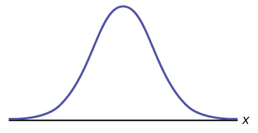
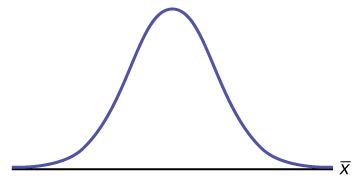

Suppose *X* is a random variable with a distribution that may be known or unknown (it can be any distribution). Using a subscript that matches the random variable, suppose:

1.  *μ*{::}*X* = the mean of *X*
2.  *σ*{::}*X* = the standard deviation of *X*
{: data-number-style="lower-alpha"}

If you draw random samples of size *n*, then as *n* increases, the random variable <math xmlns="http://www.w3.org/1998/Math/MathML"> <mover accent="true"> <mi>X</mi> <mo>¯</mo> </mover> </math>

 which consists of sample means, tends to be **normally distributed**{: data-type="term"} and

<math xmlns="http://www.w3.org/1998/Math/MathML"> <mover accent="true"> <mi>X</mi> <mo>¯</mo> </mover> </math>

 ~ *N*<math xmlns="http://www.w3.org/1998/Math/MathML"> <mrow> <mrow><mo>(</mo> <mrow> <msub> <mi>μ</mi> <mi>x</mi> </msub> <mtext>, </mtext><mfrac> <mrow> <mi>σ</mi><mi>x</mi> </mrow> <mrow> <msqrt> <mi>n</mi> </msqrt> </mrow> </mfrac> </mrow> <mo>)</mo></mrow> </mrow> </math>

.

The **central limit theorem**{: data-type="term"} for sample means says that if you keep drawing larger and larger samples (such as rolling one, two, five, and finally, ten dice) and **calculating their means,** the sample means form their own **normal distribution** (the sampling distribution). The normal distribution has the same mean as the original distribution and a variance that equals the original variance divided by, the sample size. The variable *n* is the number of values that are averaged together, not the number of times the experiment is done.

To put it more formally, if you draw random samples of size *n*, the distribution of the random variable <math xmlns="http://www.w3.org/1998/Math/MathML"> <mover accent="true"> <mi>X</mi> <mo>¯</mo> </mover> </math>

, which consists of sample means, is called the **sampling distribution of the mean**. The sampling distribution of the mean approaches a normal distribution as *n*, the **sample size**{: data-type="term"}, increases.

The random variable <math xmlns="http://www.w3.org/1998/Math/MathML"> <mover accent="true"> <mi>X</mi> <mo>¯</mo> </mover> </math>

 has a different *z*-score associated with it from that of the random variable *X*. The mean <math xmlns="http://www.w3.org/1998/Math/MathML"> <mover accent="true"> <mi>x</mi> <mo>¯</mo> </mover> </math>

 is the value of <math xmlns="http://www.w3.org/1998/Math/MathML"> <mover accent="true"> <mi>X</mi> <mo>¯</mo> </mover> </math>

 in one sample.

<math xmlns="http://www.w3.org/1998/Math/MathML" display="block"> <mrow> <mi>z</mi><mo>=</mo><mfrac> <mrow> <mover accent="true"> <mi>x</mi> <mo stretchy="true">¯</mo> </mover> <mo>−</mo><msub> <mi>μ</mi> <mi>x</mi> </msub> </mrow> <mrow> <mrow><mo>(</mo> <mrow> <mfrac> <mrow> <msub> <mi>σ</mi> <mi>x</mi> </msub> </mrow> <mrow> <msqrt> <mi>n</mi> </msqrt> </mrow> </mfrac> </mrow> <mo>)</mo></mrow> </mrow> </mfrac> </mrow> </math>

*μ**X* is the average of both *X* and <math xmlns="http://www.w3.org/1998/Math/MathML"> <mover accent="true"> <mi>X</mi> <mo>¯</mo> </mover> </math>

.

<math xmlns="http://www.w3.org/1998/Math/MathML"> <mrow> <mi>σ</mi><mover accent="true"> <mi>x</mi> <mo>¯</mo> </mover> <mtext> = </mtext><mfrac> <mrow> <mi>σ</mi><mi>x</mi> </mrow> <mrow> <msqrt> <mi>n</mi> </msqrt> </mrow> </mfrac> </mrow> </math>

 = standard deviation of <math xmlns="http://www.w3.org/1998/Math/MathML"> <mover accent="true"> <mi>X</mi> <mo>¯</mo> </mover> </math>

 and is called the **standard error of the mean.**{: data-type="term"}

To find probabilities for means on the calculator, follow these steps.

2nd DISTR* * *
{: data-type="newline"}

2:normalcdf

<math xmlns="http://www.w3.org/1998/Math/MathML"> <mrow> <mi>n</mi><mi>o</mi><mi>r</mi><mi>m</mi><mi>a</mi><mi>l</mi><mi>c</mi><mi>d</mi><mi>f</mi><mrow><mo>(</mo> <mrow> <mi>l</mi><mi>o</mi><mi>w</mi><mi>e</mi><mi>r</mi><mtext> </mtext><mi>v</mi><mi>a</mi><mi>l</mi><mi>u</mi><mi>e</mi><mtext> </mtext><mi>o</mi><mi>f</mi><mtext> </mtext><mi>t</mi><mi>h</mi><mi>e</mi><mtext> </mtext><mi>a</mi><mi>r</mi><mi>e</mi><mi>a</mi><mo>,</mo><mtext> </mtext><mi>u</mi><mi>p</mi><mi>p</mi><mi>e</mi><mi>r</mi><mtext> </mtext><mi>v</mi><mi>a</mi><mi>l</mi><mi>u</mi><mi>e</mi><mtext> </mtext><mi>o</mi><mi>f</mi><mtext> </mtext><mi>t</mi><mi>h</mi><mi>e</mi><mtext> </mtext><mi>a</mi><mi>r</mi><mi>e</mi><mi>a</mi><mo>,</mo><mtext> </mtext><mi>m</mi><mi>e</mi><mi>a</mi><mi>n</mi><mo>,</mo><mtext> </mtext><mfrac> <mrow> <mi>s</mi><mi>tan</mi><mi>d</mi><mi>a</mi><mi>r</mi><mi>d</mi><mo> </mo><mi>d</mi><mi>e</mi><mi>v</mi><mi>i</mi><mi>a</mi><mi>t</mi><mi>i</mi><mi>o</mi><mi>n</mi> </mrow> <mrow> <msqrt> <mrow> <mi>s</mi><mi>a</mi><mi>m</mi><mi>p</mi><mi>l</mi><mi>e</mi><mo> </mo><mi>s</mi><mi>i</mi><mi>z</mi><mi>e</mi> </mrow> </msqrt> </mrow> </mfrac> </mrow> <mo>)</mo></mrow> </mrow> </math>

where:  *mean* is the mean of the original distribution *standard deviation* is the standard deviation of the original distribution *sample size* = *n* 

An unknown distribution has a mean of 90 and a standard deviation of 15. Samples of size *n* = 25 are drawn randomly from the population.

* * *
{: data-type="newline"}

a. Find the probability that the **sample mean**{: data-type="term"} is between 85 and 92.

a. Let *X* = one value from the original unknown population. The probability question asks you to find a probability for the **sample mean**.

Let <math xmlns="http://www.w3.org/1998/Math/MathML"> <mover accent="true"> <mi>X</mi> <mo>¯</mo> </mover> </math>

 = the mean of a sample of size 25. Since *μ**X* = 90, *σX* = 15, and *n* = 25,

<math xmlns="http://www.w3.org/1998/Math/MathML"> <mover accent="true"> <mi>X</mi> <mo>¯</mo> </mover> </math>

 ~ *N*<math xmlns="http://www.w3.org/1998/Math/MathML"> <mrow> <mrow><mo>(</mo> <mrow> <mn>90</mn><mtext>, </mtext><mfrac> <mrow> <mn>15</mn> </mrow> <mrow> <msqrt> <mrow> <mn>25</mn> </mrow> </msqrt> </mrow> </mfrac> </mrow> <mo>)</mo></mrow> </mrow> </math>

.

Find *P*(85 &lt; <math xmlns="http://www.w3.org/1998/Math/MathML"> <mover accent="true"> <mi>x</mi> <mo>¯</mo> </mover> </math>

 &lt; 92). Draw a graph.

*P*(85 &lt; <math xmlns="http://www.w3.org/1998/Math/MathML"> <mover accent="true"> <mi>x</mi> <mo>¯</mo> </mover> </math>

 &lt; 92) = 0.6997

The probability that the sample mean is between 85 and 92 is 0.6997.

{: data-media-type="image/jpg"}

`normalcdf`(lower value, upper value, mean, standard error of the mean)

The parameter list is abbreviated (lower value, upper value, *μ*, <math xmlns="http://www.w3.org/1998/Math/MathML"> <mrow> <mfrac> <mi>σ</mi> <mrow> <msqrt> <mi>n</mi> </msqrt> </mrow> </mfrac> </mrow> </math>

)

`normalcdf`(85,92,90,<math xmlns="http://www.w3.org/1998/Math/MathML"> <mrow> <mfrac> <mrow> <mn>15</mn> </mrow> <mrow> <msqrt> <mrow> <mn>25</mn> </mrow> </msqrt> </mrow> </mfrac> </mrow> </math>

) = 0.6997

b. Find the value that is two standard deviations above the expected value, 90, of the sample mean.

b. To find the value that is two standard deviations above the expected value 90, use the formula:

value = *μ*x + (#ofTSDEVs)<math xmlns="http://www.w3.org/1998/Math/MathML"> <mrow> <mrow><mo>(</mo> <mrow> <mfrac> <mrow> <msub> <mi>σ</mi> <mi>x</mi> </msub> </mrow> <mrow> <msqrt> <mi>n</mi> </msqrt> </mrow> </mfrac> </mrow> <mo>)</mo></mrow> </mrow> </math>

value = 90 + 2 <math xmlns="http://www.w3.org/1998/Math/MathML"> <mrow> <mrow><mo>(</mo> <mrow> <mfrac> <mrow> <mn>15</mn> </mrow> <mrow> <msqrt> <mrow> <mn>25</mn> </mrow> </msqrt> </mrow> </mfrac> </mrow> <mo>)</mo></mrow> </mrow> </math>

 = 96

The value that is two standard deviations above the expected value is 96.

The standard error of the mean is <math xmlns="http://www.w3.org/1998/Math/MathML"> <mrow> <mfrac> <mrow> <mi>σ</mi><mi>x</mi> </mrow> <mrow> <msqrt> <mi>n</mi> </msqrt> </mrow> </mfrac> </mrow> </math>

 = <math xmlns="http://www.w3.org/1998/Math/MathML"> <mrow> <mfrac> <mrow> <mn>15</mn> </mrow> <mrow> <msqrt> <mrow> <mn>25</mn> </mrow> </msqrt> </mrow> </mfrac> </mrow> </math>

 = 3. Recall that the standard error of the mean is a description of how far (on average) that the sample mean will be from the population mean in repeated simple random samples of size *n*.

Try It

An unknown distribution has a mean of 45 and a standard deviation of eight. Samples of size *n* = 30 are drawn randomly from the population. Find the probability that the sample mean is between 42 and 50.

*P*(42 &lt; <math xmlns="http://www.w3.org/1998/Math/MathML"> <mover accent="true"> <mi>x</mi> <mo>¯</mo> </mover> </math>

 &lt; 50) = <math xmlns="http://www.w3.org/1998/Math/MathML"> <mrow> <mrow><mo>(</mo> <mrow> <mtext>42,50,45,</mtext><mfrac> <mn>8</mn> <mrow> <msqrt> <mrow> <mn>30</mn> </mrow> </msqrt> </mrow> </mfrac> </mrow> <mo>)</mo></mrow> </mrow> </math>

 = 0.9797

The length of time, in hours, it takes an "over 40" group of people to play one soccer match is normally distributed with a **mean of two hours** and a **standard deviation of 0.5 hours**. A **sample of size *n* = 50** is drawn randomly from the population. Find the probability that the **sample mean** is between 1.8 hours and 2.3 hours.

Let *X* = the time, in hours, it takes to play one soccer match.

The probability question asks you to find a probability for the **sample mean time, in hours**, it takes to play one soccer match.

Let <math xmlns="http://www.w3.org/1998/Math/MathML"> <mover accent="true"> <mi>X</mi> <mo>¯</mo> </mover> </math>

 = the **mean**{: data-type="term"} time, in hours, it takes to play one soccer match.

If *μX* = _________, *σX* = __________, and *n* = ___________, then *X* ~ *N*(______, ______) by the **central limit theorem for means**{: data-type="term"}.

*μX* = 2, *σX* = 0.5, *n* = 50, and *X* ~ *N*<math xmlns="http://www.w3.org/1998/Math/MathML"> <mrow> <mrow><mo>(</mo> <mrow> <mtext>2, </mtext><mfrac> <mrow> <mn>0.5</mn> </mrow> <mrow> <msqrt> <mrow> <mn>50</mn> </mrow> </msqrt> </mrow> </mfrac> </mrow> <mo>)</mo></mrow> </mrow> </math>

Find *P*(1.8 &lt; <math xmlns="http://www.w3.org/1998/Math/MathML"> <mover accent="true"> <mi>x</mi> <mo>¯</mo> </mover> </math>

 &lt; 2.3). Draw a graph.

*P*(1.8 &lt; <math xmlns="http://www.w3.org/1998/Math/MathML"> <mover accent="true"> <mi>x</mi> <mo>¯</mo> </mover> </math>

 &lt; 2.3) = 0.9977

`normalcdf`<math xmlns="http://www.w3.org/1998/Math/MathML"> <mrow> <mrow><mo>(</mo> <mrow> <mn>1.</mn><mtext>8,2</mtext><mtext>.3,2,</mtext><mfrac> <mrow> <mn>.5</mn> </mrow> <mrow> <msqrt> <mrow> <mn>50</mn> </mrow> </msqrt> </mrow> </mfrac> </mrow> <mo>)</mo></mrow> </mrow> </math>

 = 0.9977
{: .finger}

The probability that the mean time is between 1.8 hours and 2.3 hours is ______.

Try It

The length of time taken on the SAT for a group of students is normally distributed with a mean of 2.5 hours and a standard deviation of 0.25 hours. A sample size of *n* = 60 is drawn randomly from the population. Find the probability that the sample mean is between two hours and three hours.

*P*(2 &lt; <math xmlns="http://www.w3.org/1998/Math/MathML"> <mover accent="true"> <mi>x</mi> <mo>¯</mo> </mover> </math>

 &lt; 3) = normalcdf<math xmlns="http://www.w3.org/1998/Math/MathML"> <mrow> <mrow><mo>(</mo> <mrow> <mtext>2, 3, 2</mtext><mtext>.5, </mtext><mfrac> <mrow> <mn>0.25</mn> </mrow> <mrow> <msqrt> <mrow> <mn>60</mn> </mrow> </msqrt> </mrow> </mfrac> </mrow> <mo>)</mo></mrow> </mrow> </math>

 = 1

To find percentiles for means on the calculator, follow these steps.

2nd DIStR * * *
{: data-type="newline"}

3:invNorm

*k* = invNorm<math xmlns="http://www.w3.org/1998/Math/MathML"> <mrow> <mrow><mo>(</mo> <mrow> <mtext>area to the left of </mtext><mi>k</mi><mtext>, mean,</mtext><mo> </mo><mfrac> <mrow> <mi>s</mi><mi>t</mi><mi>a</mi><mi>n</mi><mi>d</mi><mi>a</mi><mi>r</mi><mi>d</mi><mo> </mo><mi>d</mi><mi>e</mi><mi>v</mi><mi>i</mi><mi>a</mi><mi>t</mi><mi>i</mi><mi>o</mi><mi>n</mi> </mrow> <mrow> <msqrt> <mrow> <mi>s</mi><mi>a</mi><mi>m</mi><mi>p</mi><mi>l</mi><mi>e</mi><mo> </mo><mi>s</mi><mi>i</mi><mi>z</mi><mi>e</mi> </mrow> </msqrt> </mrow> </mfrac> </mrow> <mo>)</mo></mrow> </mrow> </math>

where:  *k* the *k*th percentile *mean* is the mean of the original distribution *standard deviation* is the standard deviation of the original distribution *sample size* = *n* 

In a recent study reported Oct. 29, 2012 on the Flurry Blog, the mean age of tablet users is 34 years. Suppose the standard deviation is 15 years. Take a sample of size *n* = 100.

1.  What are the mean and standard deviation for the sample mean ages of tablet users?
2.  What does the distribution look like?
3.  Find the probability that the sample mean age is more than 30 years (the reported mean age of tablet users in this particular study).
4.  Find the 95th percentile for the sample mean age (to one decimal place).
{: data-number-style="lower-alpha"}

1.  Since the sample mean tends to target the population mean, we have *μχ* = *μ* = 34. The sample standard deviation is given by *σχ* =
    <math xmlns="http://www.w3.org/1998/Math/MathML"> <mrow> <mfrac> <mi>σ</mi> <mrow> <msqrt> <mi>n</mi> </msqrt> </mrow> </mfrac> </mrow> </math>
    
    =
    <math xmlns="http://www.w3.org/1998/Math/MathML"> <mrow> <mfrac> <mrow> <mn>15</mn> </mrow> <mrow> <msqrt> <mrow> <mn>100</mn> </mrow> </msqrt> </mrow> </mfrac> </mrow> </math>
    
    =
    <math xmlns="http://www.w3.org/1998/Math/MathML"> <mrow> <mfrac> <mrow> <mn>15</mn> </mrow> <mrow> <mn>10</mn> </mrow> </mfrac> </mrow> </math>
    
    = 1.5
2.  The central limit theorem states that for large sample sizes(*n*), the sampling distribution will be approximately normal.
3.  The probability that the sample mean age is more than 30 is given by *P*(*Χ* &gt; 30) = `normalcdf`(30,E99,34,1.5) = 0.9962
4.  Let *k* = the 95th percentile.
    * * *
    {: data-type="newline" data-count="1"}
    
    *k* = invNorm
    <math xmlns="http://www.w3.org/1998/Math/MathML"> <mrow> <mrow><mo>(</mo> <mrow> <mn>0.</mn><mtext>95,34,</mtext><mfrac> <mrow> <mn>15</mn> </mrow> <mrow> <msqrt> <mrow> <mn>100</mn> </mrow> </msqrt> </mrow> </mfrac> </mrow> <mo>)</mo></mrow> </mrow> </math>
    
    = 36.5
{: data-number-style="lower-alpha"}

Try It

In an article on Flurry Blog, a gaming marketing gap for men between the ages of 30 and 40 is identified. You are researching a startup game targeted at the 35-year-old demographic. Your idea is to develop a strategy game that can be played by men from their late 20s through their late 30s. Based on the article’s data, industry research shows that the average strategy player is 28 years old with a standard deviation of 4.8 years. You take a sample of 100 randomly selected gamers. If your target market is 29- to 35-year-olds, should you continue with your development strategy?

You need to determine the probability for men whose mean age is between 29 and 35 years of age wanting to play a strategy game.

*P*(29 &lt; <math xmlns="http://www.w3.org/1998/Math/MathML"> <mover accent="true"> <mi>x</mi> <mo>¯</mo> </mover> </math>

 &lt; 35) = `normalcdf`<math xmlns="http://www.w3.org/1998/Math/MathML"> <mrow> <mrow><mo>(</mo> <mrow> <mtext>29,35,28,</mtext><mfrac> <mrow> <mn>4.8</mn> </mrow> <mrow> <msqrt> <mrow> <mn>100</mn> </mrow> </msqrt> </mrow> </mfrac> </mrow> <mo>)</mo></mrow> </mrow> </math>

 = 0.0186

You can conclude there is approximately a 19% chance that your game will be played by men whose mean age is between 29 and 35.

The mean number of minutes for app engagement by a tablet user is 8.2 minutes. Suppose the standard deviation is one minute. Take a sample of 60.

1.  What are the mean and standard deviation for the sample mean number of app engagement by a tablet user?
2.  What is the standard error of the mean?
3.  Find the 90th percentile for the sample mean time for app engagement for a tablet user. Interpret this value in a complete sentence.
4.  Find the probability that the sample mean is between eight minutes and 8.5 minutes.
{: data-number-style="lower-alpha"}

1.  <math xmlns="http://www.w3.org/1998/Math/MathML" display=""> <mrow> <msub> <mi>μ</mi> <mrow> <mover accent="true"> <mi>x</mi> <mo stretchy="true">¯</mo> </mover> </mrow> </msub> <mo>=</mo><mi>μ</mi><mo>=</mo><mn>8.2</mn><mtext> </mtext><msub> <mi>σ</mi> <mrow> <mover accent="true"> <mi>x</mi> <mo stretchy="true">¯</mo> </mover> </mrow> </msub> <mo>=</mo><mfrac> <mi>σ</mi> <mrow> <msqrt> <mi>n</mi> </msqrt> </mrow> </mfrac> <mo>=</mo><mfrac> <mn>1</mn> <mrow> <msqrt> <mrow> <mn>60</mn> </mrow> </msqrt> </mrow> </mfrac> <mo>=</mo><mn>0.13</mn> </mrow> </math>

2.  The standard error of the mean is 0.13. This indicates how far the sample mean will be from the population mean in repeated samples of size 60.
3.  Let *k* = the 90th percentile
    * * *
    {: data-type="newline"}
    
    *k* = `invNorm`
    <math xmlns="http://www.w3.org/1998/Math/MathML"> <mrow> <mrow><mo>(</mo> <mrow> <mn>0.</mn><mtext>90,8</mtext><mtext>.2,</mtext><mfrac> <mn>1</mn> <mrow> <msqrt> <mrow> <mn>60</mn> </mrow> </msqrt> </mrow> </mfrac> </mrow> <mo>)</mo></mrow> </mrow> </math>
    
    = 8.37. This values indicates that 90 percent of the average app engagement time for table users is less than 8.37 minutes.
4.  *P*(8 &lt;
    <math xmlns="http://www.w3.org/1998/Math/MathML"> <mover accent="true"> <mi>x</mi> <mo>¯</mo> </mover> </math>
    
    &lt; 8.5) = `normalcdf`
    <math xmlns="http://www.w3.org/1998/Math/MathML"> <mrow> <mrow><mo>(</mo> <mrow> <mtext>8,8</mtext><mtext>.5,8</mtext><mtext>.2,</mtext><mfrac> <mn>1</mn> <mrow> <msqrt> <mrow> <mn>60</mn> </mrow> </msqrt> </mrow> </mfrac> </mrow> <mo>)</mo></mrow> </mrow> </math>
    
    = 0.9293
{: data-number-style="lower-alpha"}

Try It

Cans of a cola beverage claim to contain 16 ounces. The amounts in a sample are measured and the statistics are *n* = 34, <math xmlns="http://www.w3.org/1998/Math/MathML"> <mover accent="true"> <mi>x</mi> <mo>¯</mo> </mover> </math>

 = 16.01 ounces. If the cans are filled so that *μ* = 16.00 ounces (as labeled) and *σ* = 0.143 ounces, find the probability that a sample of 34 cans will have an average amount greater than 16.01 ounces. Do the results suggest that cans are filled with an amount greater than 16 ounces?

We have *P*((<math xmlns="http://www.w3.org/1998/Math/MathML"> <mover accent="true"> <mi>x</mi> <mo>¯</mo> </mover> </math>

 &gt; 16.01) = `normalcdf`<math xmlns="http://www.w3.org/1998/Math/MathML"> <mrow> <mrow><mo>(</mo> <mrow> <mtext>16</mtext><mtext>.01,E99,16,</mtext><mfrac> <mrow> <mn>0.143</mn> </mrow> <mrow> <msqrt> <mrow> <mn>34</mn> </mrow> </msqrt> </mrow> </mfrac> </mrow> <mo>)</mo></mrow> </mrow> </math>

 = 0.3417. Since there is a 34.17% probability that the average sample weight is greater than 16.01 ounces, we should be skeptical of the company’s claimed volume. If I am a consumer, I should be glad that I am probably receiving free cola. If I am the manufacturer, I need to determine if my bottling processes are outside of acceptable limits.

# References

Baran, Daya. “20 Percent of Americans Have Never Used Email.”WebGuild, 2010. Available online at http://www.webguild.org/20080519/20-percent-of-americans-have-never-used-email (accessed May 17, 2013).

Data from The Flurry Blog, 2013. Available online at http://blog.flurry.com (accessed May 17, 2013).

Data from the United States Department of Agriculture.

# Chapter Review

In a population whose distribution may be known or unknown, if the size (*n*) of samples is sufficiently large, the distribution of the sample means will be approximately normal. The mean of the sample means will equal the population mean. The standard deviation of the distribution of the sample means, called the standard error of the mean, is equal to the population standard deviation divided by the square root of the sample size (*n*).

# Formula Review

The Central Limit Theorem for Sample Means: <math xmlns="http://www.w3.org/1998/Math/MathML"> <mover accent="true"> <mi>X</mi> <mo>¯</mo> </mover> </math>

 ~ *N*<math xmlns="http://www.w3.org/1998/Math/MathML"> <mrow> <mrow><mo>(</mo> <mrow> <msub> <mi>μ</mi> <mi>x</mi> </msub> <mtext>, </mtext><mfrac> <mrow> <mi>σ</mi><mi>x</mi> </mrow> <mrow> <msqrt> <mi>n</mi> </msqrt> </mrow> </mfrac> </mrow> <mo>)</mo></mrow> </mrow> </math>

The Mean <math xmlns="http://www.w3.org/1998/Math/MathML"> <mover accent="true"> <mi>X</mi> <mo>¯</mo> </mover> </math>

\: *μx*

Central Limit Theorem for Sample Means z-score and standard error of the mean: <math xmlns="http://www.w3.org/1998/Math/MathML"> <mrow> <mi>z</mi><mo>=</mo><mfrac> <mrow> <mover accent="true"> <mi>x</mi> <mo stretchy="true">¯</mo> </mover> <mo>−</mo><msub> <mi>μ</mi> <mi>x</mi> </msub> </mrow> <mrow> <mrow><mo>(</mo> <mrow> <mfrac> <mrow> <msub> <mi>σ</mi> <mi>x</mi> </msub> </mrow> <mrow> <msqrt> <mi>n</mi> </msqrt> </mrow> </mfrac> </mrow> <mo>)</mo></mrow> </mrow> </mfrac> </mrow> </math>

Standard Error of the Mean (Standard Deviation (<math xmlns="http://www.w3.org/1998/Math/MathML"> <mover accent="true"> <mi>X</mi> <mo>¯</mo> </mover> </math>

)) <math xmlns="http://www.w3.org/1998/Math/MathML"> <mrow> <mfrac> <mrow> <msub> <mi>σ</mi> <mi>x</mi> </msub> </mrow> <mrow> <msqrt> <mi>n</mi> </msqrt> </mrow> </mfrac> </mrow> </math>

<section data-depth="1" class="practice" markdown="1">
*Use the following information to answer the next six exercises:* Yoonie is a personnel manager in a large corporation. Each month she must review 16 of the employees. From past experience, she has found that the reviews take her approximately four hours each to do with a population standard deviation of 1.2 hours. Let *Χ* be the random variable representing the time it takes her to complete one review. Assume *Χ* is normally distributed. Let <math xmlns="http://www.w3.org/1998/Math/MathML"> <mover accent="true"> <mi>X</mi> <mo>¯</mo> </mover> </math>

 be the random variable representing the mean time to complete the 16 reviews. Assume that the 16 reviews represent a random set of reviews.

What is the mean, standard deviation, and sample size?

Complete the distributions.  *X* ~ \_\_\_\_\_(\_\_\_\_\_,\_\_\_\_\_) <math xmlns="http://www.w3.org/1998/Math/MathML"> <mover accent="true"> <mi>X</mi> <mo>¯</mo> </mover> </math>
 ~ \_\_\_\_\_(\_\_\_\_\_,\_\_\_\_\_) 

<!-- <solution id="fs-idm6886848">
<list id="fs-idm86789888" list-type="enumerated">
<item><emphasis effect="italics">X</emphasis> ~ <emphasis effect="italics">N</emphasis>(4, 1.2).</item>
<item><m:math>
 <m:mover accent="true">
  <m:mi>X</m:mi>
  <m:mo>&#175;</m:mo>
 </m:mover>
 
</m:math> ~ <emphasis effect="italics">N</emphasis><m:math>
 <m:mrow>
  <m:mrow><m:mo>(</m:mo>
   <m:mrow>
    <m:mtext>4,&#160;</m:mtext><m:mfrac>
     <m:mrow>
      <m:mn>1.2</m:mn>
     </m:mrow>
     <m:mrow>
      <m:msqrt>
       <m:mrow>
        <m:mn>16</m:mn>
       </m:mrow>
      </m:msqrt>
      
     </m:mrow>
    </m:mfrac>
    
   </m:mrow>
  <m:mo>)</m:mo></m:mrow>
 </m:mrow>
</m:math></item>
</list></solution> -->

Find the probability that **one** review will take Yoonie from 3.5 to 4.25 hours. Sketch the graph, labeling and scaling the horizontal axis. Shade the region corresponding to the probability. {: data-media-type="image/jpg"}

 *P*(________ &lt; *x* &lt; ________) = _______ 

b. 3.5, 4.25, 0.2441

Find the probability that the **mean** of a month’s reviews will take Yoonie from 3.5 to 4.25 hrs. Sketch the graph, labeling and scaling the horizontal axis. Shade the region corresponding to the probability.  {: data-media-type="image/jpg"}

 *P*(\_\_\_\_\_\_\_\_\_\_\_\_\_\_\_\_) = \_\_\_\_\_\_\_ 

<!-- <solution id="id18025798">
<para id="element-710">b. 0.7499</para></solution> -->

What causes the probabilities in [[link]](#element-446) and [[link]](#element-322) to be different?

The fact that the two distributions are different accounts for the different probabilities.

Find the 95th percentile for the mean time to complete one month\'s reviews. Sketch the graph.

1.  {: data-media-type="image/jpg"}

2.  The 95th Percentile =\_\_\_\_\_\_\_\_\_\_\_\_
{: data-number-style="lower-alpha"}

<!-- <solution id="fs-idm40700112">
<para id="fs-idm40699856"><emphasis effect="italics">P</emphasis>(3.5 &lt; <m:math>
 <m:mover accent="true">
  <m:mi>x</m:mi>
  <m:mo>&#175;</m:mo>
 </m:mover>
 
</m:math> &lt; 4.25) = <code>invNorm</code><m:math>
 <m:mrow>
  <m:mrow><m:mo>(</m:mo>
   <m:mrow>
    <m:mtext>95,4,</m:mtext><m:mfrac>
     <m:mrow>
      <m:mn>1.2</m:mn>
     </m:mrow>
     <m:mrow>
      <m:msqrt>
       <m:mrow>
        <m:mn>16</m:mn>
       </m:mrow>
      </m:msqrt>
      
     </m:mrow>
    </m:mfrac>
    
   </m:mrow>
  <m:mo>)</m:mo></m:mrow>
 </m:mrow>
</m:math> = 4.49</para></solution> -->

</section>

# Homework

Previously, De Anza statistics students estimated that the amount of change daytime statistics students carry is exponentially distributed with a mean of $0.88. Suppose that we randomly pick 25 daytime statistics students.

1.  In words, *Χ* = ____________
2.  *Χ* ~ _____(_____,_____)
3.  In words,
    <math xmlns="http://www.w3.org/1998/Math/MathML"> <mover accent="true"> <mi>X</mi> <mo>¯</mo> </mover> </math>
    
    = ____________
4.  <math xmlns="http://www.w3.org/1998/Math/MathML"> <mover accent="true"> <mi>X</mi> <mo>¯</mo> </mover> </math>
    
    ~ ______ (______, ______)
5.  Find the probability that an individual had between $0.80 and $1.00. Graph the situation, and shade in the area to be determined.
6.  Find the probability that the average of the 25 students was between $0.80 and $1.00. Graph the situation, and shade in the area to be determined.
7.  Explain why there is a difference in part e and part f.
{: data-number-style="lower-alpha"}

1.  *Χ* = amount of change students carry
2.  *Χ* ~ *E*(0.88, 0.88)
3.  <math xmlns="http://www.w3.org/1998/Math/MathML"> <mover accent="true"> <mi>X</mi> <mo>¯</mo> </mover> </math>
    
    = average amount of change carried by a sample of 25 sstudents.
4.  <math xmlns="http://www.w3.org/1998/Math/MathML"> <mover accent="true"> <mi>X</mi> <mo>¯</mo> </mover> </math>
    
    ~ *N*(0.88, 0.176)
5.  
6.  
7.  The distributions are different. Part a is exponential and part b is normal.
{: data-number-style="lower-alpha"}

Suppose that the distance of fly balls hit to the outfield (in baseball) is normally distributed with a mean of 250 feet and a standard deviation of 50 feet. We randomly sample 49 fly balls.

1.  If
    <math xmlns="http://www.w3.org/1998/Math/MathML"> <mover accent="true"> <mi>X</mi> <mo>¯</mo> </mover> </math>
    
    = average distance in feet for 49 fly balls, then
    <math xmlns="http://www.w3.org/1998/Math/MathML"> <mover accent="true"> <mi>X</mi> <mo>¯</mo> </mover> </math>
    
    ~ \_\_\_\_\_\_\_(\_\_\_\_\_\_\_,\_\_\_\_\_\_\_)
2.  What is the probability that the 49 balls traveled an average of less than 240 feet? Sketch the graph. Scale the horizontal axis for
    <math xmlns="http://www.w3.org/1998/Math/MathML"> <mover accent="true"> <mi>X</mi> <mo>¯</mo> </mover> </math>
    
    . Shade the region corresponding to the probability. Find the probability.
3.  Find the 80th percentile of the distribution of the average of 49 fly balls.
{: data-number-style="lower-alpha"}

<!-- <solution id="id6274098">
<list id="element-804" list-type="enumerated" number-style="lower-alpha"><item><emphasis effect="italics">N</emphasis><m:math>
 <m:mrow>
  <m:mrow><m:mo>(</m:mo>
   <m:mrow>
    <m:mtext>250,&#160;</m:mtext><m:mfrac>
     <m:mrow>
      <m:mn>50</m:mn>
     </m:mrow>
     <m:mrow>
      <m:msqrt>
       <m:mrow>
        <m:mn>49</m:mn>
       </m:mrow>
      </m:msqrt>
      
     </m:mrow>
    </m:mfrac>
    
   </m:mrow>
  <m:mo>)</m:mo></m:mrow>
 </m:mrow>
</m:math></item>
<item>0.0808</item>
<item>256.01 feet</item></list></solution> -->

According to the Internal Revenue Service, the average length of time for an individual to complete (keep records for, learn, prepare, copy, assemble, and send) IRS Form 1040 is 10.53 hours (without any attached schedules). The distribution is unknown. Let us assume that the standard deviation is two hours. Suppose we randomly sample 36 taxpayers.

1.  In words, *Χ* = _____________
2.  In words,
    <math xmlns="http://www.w3.org/1998/Math/MathML"> <mover accent="true"> <mi>X</mi> <mo>¯</mo> </mover> </math>
    
    = _____________
3.  <math xmlns="http://www.w3.org/1998/Math/MathML"> <mover accent="true"> <mi>X</mi> <mo>¯</mo> </mover> </math>
    
    ~ _____(_____,_____)
4.  Would you be surprised if the 36 taxpayers finished their Form 1040s in an average of more than 12 hours? Explain why or why not in complete sentences.
5.  Would you be surprised if one taxpayer finished his or her Form 1040 in more than 12 hours? In a complete sentence, explain why.
{: data-number-style="lower-alpha"}

1.  length of time for an individual to complete IRS form 1040, in hours.
2.  mean length of time for taxpayers to complete IRS form 1040, in hours.
3.  *N*
    <math xmlns="http://www.w3.org/1998/Math/MathML"> <mrow> <mrow><mo>(</mo> <mrow> <mtext>10</mtext><mtext>.53, </mtext><mfrac> <mn>1</mn> <mn>3</mn> </mfrac> </mrow> <mo>)</mo></mrow> </mrow> </math>

4.  Yes. I would be surprised, because the probability is almost 0.
5.  No. I would not be totally surprised because the probability is 0.2312
{: data-number-style="lower-alpha"}

Suppose that a category of world-class runners are known to run a marathon (26 miles) in an average of 145 minutes with a standard deviation of 14 minutes. Consider 49 of the races. Let <math xmlns="http://www.w3.org/1998/Math/MathML"> <mover accent="true"> <mi>X</mi> <mo>¯</mo> </mover> </math>

 the average of the 49 races.

1.  <math xmlns="http://www.w3.org/1998/Math/MathML"> <mover accent="true"> <mi>X</mi> <mo>¯</mo> </mover> </math>
    
    ~ \_\_\_\_\_(\_\_\_\_\_,\_\_\_\_\_)
2.  Find the probability that the runner will average between 142 and 146 minutes in these 49 marathons.
3.  Find the 80th percentile for the average of these 49 marathons.
4.  Find the median of the average running times.
{: data-number-style="lower-alpha"}

<!-- <solution id="id6533816">
<list id="element-402" list-type="enumerated" number-style="lower-alpha">
<item><emphasis effect="italics">N</emphasis><m:math>
 <m:mrow>
  <m:mrow><m:mo>(</m:mo>
   <m:mrow>
    <m:mtext>145,&#160;</m:mtext><m:mfrac>
     <m:mrow>
      <m:mn>14</m:mn>
     </m:mrow>
     <m:mrow>
      <m:msqrt>
       <m:mrow>
        <m:mn>49</m:mn>
       </m:mrow>
      </m:msqrt>
      
     </m:mrow>
    </m:mfrac>
    
   </m:mrow>
  <m:mo>)</m:mo></m:mrow>
 </m:mrow>
</m:math></item>
<item>0.6247</item>
<item>146.68 </item>
<item>145 minutes</item></list></solution> -->

The length of songs in a collector’s iTunes album collection is uniformly distributed from two to 3.5 minutes. Suppose we randomly pick five albums from the collection. There are a total of 43 songs on the five albums.

1.  In words, *Χ* = _________
2.  *Χ* ~ _____________
3.  In words,
    <math xmlns="http://www.w3.org/1998/Math/MathML"> <mover accent="true"> <mi>X</mi> <mo>¯</mo> </mover> </math>
    
    = _____________
4.  <math xmlns="http://www.w3.org/1998/Math/MathML"> <mover accent="true"> <mi>X</mi> <mo>¯</mo> </mover> </math>
    
    ~ _____(_____,_____)
5.  Find the first quartile for the average song length.
6.  The IQR(interquartile range) for the average song length is from _______–_______.
{: data-number-style="lower-alpha"}

1.  the length of a song, in minutes, in the collection
2.  *U*(2, 3.5)
3.  the average length of a song, in minutes, in the collection
4.  *N*(2.75, 0.0220)
5.  2\.74 minutes
6.  0\.03 minutes
{: data-number-style="lower-alpha"}

In 1940 the average size of a U.S. farm was 174 acres. Let’s say that the standard deviation was 55 acres. Suppose we randomly survey 38 farmers from 1940.

1.  In words, *Χ* = \_\_\_\_\_\_\_\_\_\_\_\_\_
2.  In words,
    <math xmlns="http://www.w3.org/1998/Math/MathML"> <mover accent="true"> <mi>X</mi> <mo>¯</mo> </mover> </math>
    
    = \_\_\_\_\_\_\_\_\_\_\_\_\_
3.  <math xmlns="http://www.w3.org/1998/Math/MathML"> <mover accent="true"> <mi>X</mi> <mo>¯</mo> </mover> </math>
    
    ~ \_\_\_\_\_(\_\_\_\_\_,\_\_\_\_\_)
4.  The IQR for
    <math xmlns="http://www.w3.org/1998/Math/MathML"> <mover accent="true"> <mi>X</mi> <mo>¯</mo> </mover> </math>
    
    is from \_\_\_\_\_\_\_ acres to \_\_\_\_\_\_\_ acres.
{: data-number-style="lower-alpha"}

<!-- <solution id="fs-idm55467904">
<list id="fs-idm55467648" list-type="enumerated" number-style="lower-alpha"><item>the size of a U.S. farm in 1940</item>
<item>the average size of a U.S. farm, in acres</item>
<item><emphasis effect="italics">N</emphasis><m:math>
<m:mrow>
<m:mrow><m:mo>(</m:mo>
<m:mrow>
<m:mn>174</m:mn><m:mtext>,&#160;</m:mtext><m:mfrac>
<m:mrow>
<m:mn>55</m:mn>
</m:mrow>
<m:mrow>
<m:msqrt>
<m:mrow>
<m:mn>38</m:mn>
</m:mrow>
</m:msqrt>

</m:mrow>
</m:mfrac>

</m:mrow>
<m:mo>)</m:mo></m:mrow>
</m:mrow>
</m:math></item>
<item>168.0, 180.0</item>
</list></solution> -->

Determine which of the following are true and which are false. Then, in complete sentences, justify your answers.

1.  When the sample size is large, the mean of
    <math xmlns="http://www.w3.org/1998/Math/MathML"> <mover accent="true"> <mi>X</mi> <mo>¯</mo> </mover> </math>
    
    is approximately equal to the mean of *Χ*.
2.  When the sample size is large,
    <math xmlns="http://www.w3.org/1998/Math/MathML"> <mover accent="true"> <mi>X</mi> <mo>¯</mo> </mover> </math>
    
    is approximately normally distributed.
3.  When the sample size is large, the standard deviation of
    <math xmlns="http://www.w3.org/1998/Math/MathML"> <mover accent="true"> <mi>X</mi> <mo>¯</mo> </mover> </math>
    
    is approximately the same as the standard deviation of *Χ*.
{: data-number-style="lower-alpha"}

1.  True. The mean of a sampling distribution of the means is approximately the mean of the data distribution.
2.  True. According to the Central Limit Theorem, the larger the sample, the closer the sampling distribution of the means becomes normal.
3.  True. The standard deviation of the sampling distribution of the means will decrease as the sample size increases.
{: data-number-style="lower-alpha"}

The percent of fat calories that a person in America consumes each day is normally distributed with a mean of about 36 and a standard deviation of about ten. Suppose that 16 individuals are randomly chosen. Let <math xmlns="http://www.w3.org/1998/Math/MathML"> <mover accent="true"> <mi>X</mi> <mo>¯</mo> </mover> </math>

 = average percent of fat calories.

1.  <math xmlns="http://www.w3.org/1998/Math/MathML"> <mover accent="true"> <mi>X</mi> <mo>¯</mo> </mover> </math>
    
    ~ \_\_\_\_\_\_(\_\_\_\_\_\_, \_\_\_\_\_\_)
2.  For the group of 16, find the probability that the average percent of fat calories consumed is more than five. Graph the situation and shade in the area to be determined.
3.  Find the first quartile for the average percent of fat calories.
{: data-number-style="lower-alpha"}

<!-- <solution id="id6272525">
<list id="element-89" list-type="enumerated" number-style="lower-alpha"><item><emphasis effect="italics">N</emphasis><m:math>
 <m:mrow>
  <m:mrow><m:mo>(</m:mo>
   <m:mrow>
    <m:mtext>36,&#160;</m:mtext><m:mfrac>
     <m:mrow>
      <m:mn>10</m:mn>
     </m:mrow>
     <m:mrow>
      <m:msqrt>
       <m:mrow>
        <m:mn>16</m:mn>
       </m:mrow>
      </m:msqrt>
      
     </m:mrow>
    </m:mfrac>
    
   </m:mrow>
  <m:mo>)</m:mo></m:mrow>
 </m:mrow>
</m:math></item>
<item>1</item>
<item>34.31</item>
</list></solution> -->

The distribution of income in some Third World countries is considered wedge shaped (many very poor people, very few middle income people, and even fewer wealthy people). Suppose we pick a country with a wedge shaped distribution. Let the average salary be $2,000 per year with a standard deviation of $8,000. We randomly survey 1,000 residents of that country.

1.  In words, *Χ* = _____________
2.  In words,
    <math xmlns="http://www.w3.org/1998/Math/MathML"> <mover accent="true"> <mi>X</mi> <mo>¯</mo> </mover> </math>
    
    = _____________
3.  <math xmlns="http://www.w3.org/1998/Math/MathML"> <mover accent="true"> <mi>X</mi> <mo>¯</mo> </mover> </math>
    
    ~ _____(_____,_____)
4.  How is it possible for the standard deviation to be greater than the average?
5.  Why is it more likely that the average of the 1,000 residents will be from $2,000 to $2,100 than from $2,100 to $2,200?
{: data-number-style="lower-alpha"}

1.  *X* = the yearly income of someone in a third world country
2.  the average salary from samples of 1,000 residents of a third world country
3.  <math xmlns="http://www.w3.org/1998/Math/MathML"> <mover accent="true"> <mi>X</mi> <mo>¯</mo> </mover> </math>
    
    ∼ *N*
    <math xmlns="http://www.w3.org/1998/Math/MathML"> <mrow> <mrow><mo>(</mo> <mrow> <mtext>2000, </mtext><mfrac> <mrow> <mtext>8000</mtext> </mrow> <mrow> <msqrt> <mrow> <mtext>1000</mtext> </mrow> </msqrt> </mrow> </mfrac> </mrow> <mo>)</mo></mrow> </mrow> </math>

4.  Very wide differences in data values can have averages smaller than standard deviations.
5.  The distribution of the sample mean will have higher probabilities closer to the population mean.
    * * *
    {: data-type="newline"}
    
    *P*(2000 &lt;
    <math xmlns="http://www.w3.org/1998/Math/MathML"> <mover accent="true"> <mi>X</mi> <mo>¯</mo> </mover> </math>
    
    &lt; 2100) = 0.1537
    * * *
    {: data-type="newline"}
    
    *P*(2100 &lt;
    <math xmlns="http://www.w3.org/1998/Math/MathML"> <mover accent="true"> <mi>X</mi> <mo>¯</mo> </mover> </math>
    
    &lt; 2200) = 0.1317
{: data-number-style="lower-alpha"}

Which of the following is NOT TRUE about the distribution for averages?

1.  The mean, median, and mode are equal.
2.  The area under the curve is one.
3.  The curve never touches the *x*-axis.
4.  The curve is skewed to the right.
{: data-number-style="lower-alpha"}

<!-- <solution id="id6538477">
<para id="element-60">d</para>
</solution> -->

The cost of unleaded gasoline in the Bay Area once followed an unknown distribution with a mean of $4.59 and a standard deviation of $0.10. Sixteen gas stations from the Bay Area are randomly chosen. We are interested in the average cost of gasoline for the 16 gas stations. The distribution to use for the average cost of gasoline for the 16 gas stations is: <math xmlns="http://www.w3.org/1998/Math/MathML"> <mover accent="true"> <mi>X</mi> <mo>¯</mo> </mover> </math>
 ~ *N*(4.59, 0.10) <math xmlns="http://www.w3.org/1998/Math/MathML"> <mover accent="true"> <mi>X</mi> <mo>¯</mo> </mover> </math>
 ~ *N*<math xmlns="http://www.w3.org/1998/Math/MathML"> <mrow> <mrow><mo>(</mo> <mrow> <mtext>4</mtext><mtext>.59, </mtext><mfrac> <mrow> <mn>0.10</mn> </mrow> <mrow> <msqrt> <mrow> <mn>16</mn> </mrow> </msqrt> </mrow> </mfrac> </mrow> <mo>)</mo></mrow> </mrow> </math>
 <math xmlns="http://www.w3.org/1998/Math/MathML"> <mover accent="true"> <mi>X</mi> <mo>¯</mo> </mover> </math>
 ~ *N*<math xmlns="http://www.w3.org/1998/Math/MathML"> <mrow> <mrow><mo>(</mo> <mrow> <mtext>4</mtext><mtext>.59, </mtext><mfrac> <mrow> <mn>16</mn> </mrow> <mrow> <mn>0.10</mn> </mrow> </mfrac> </mrow> <mo>)</mo></mrow> </mrow> </math>
 <math xmlns="http://www.w3.org/1998/Math/MathML"> <mover accent="true"> <mi>X</mi> <mo>¯</mo> </mover> </math>
 ~ *N*<math xmlns="http://www.w3.org/1998/Math/MathML"> <mrow> <mrow><mo>(</mo> <mrow> <mtext>4</mtext><mtext>.59, </mtext><mfrac> <mrow> <mn>16</mn> </mrow> <mrow> <mn>0.10</mn> </mrow> </mfrac> </mrow> <mo>)</mo></mrow> </mrow> </math>
 

b

