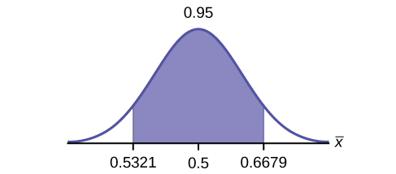
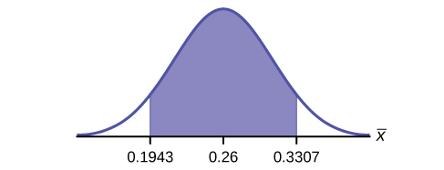
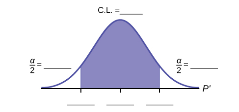

During an election year, we see articles in the newspaper that state **confidence intervals**{: data-type="term"} in terms of proportions or percentages. For example, a poll for a particular candidate running for president might show that the candidate has 40% of the vote within three percentage points (if the sample is large enough). Often, election polls are calculated with 95% confidence, so, the pollsters would be 95% confident that the true proportion of voters who favored the candidate would be between 0.37 and 0.43: (0.40 – 0.03,0.40 + 0.03).

Investors in the stock market are interested in the true proportion of stocks that go up and down each week. Businesses that sell personal computers are interested in the proportion of households in the United States that own personal computers. Confidence intervals can be calculated for the true proportion of stocks that go up or down each week and for the true proportion of households in the United States that own personal computers.

The procedure to find the confidence interval, the sample size, the **error bound**{: data-type="term"}, and the **confidence level**{: data-type="term"} for a proportion is similar to that for the population mean, but the formulas are different.

**How do you know you are dealing with a proportion problem?** First, the underlying **distribution is a** **binomial distribution**{: data-type="term"}. (There is no mention of a mean or average.) If *X* is a binomial random variable, then *X* ~ *B*(*n*, *p*) where *n* is the number of trials and *p* is the probability of a success. To form a proportion, take *X*, the random variable for the number of successes and divide it by *n*, the number of trials (or the sample size). The random variable *P′* (read \"P prime\") is that proportion,

<math xmlns="http://www.w3.org/1998/Math/MathML"> <mrow> <msup> <mi>P</mi> <mo>′</mo> </msup> <mo>=</mo><mfrac> <mi>X</mi> <mi>n</mi> </mfrac> </mrow> </math>

(Sometimes the random variable is denoted as <math xmlns="http://www.w3.org/1998/Math/MathML"> <mover accent="true"> <mi>P</mi> <mo>^</mo> </mover> </math>

, read \"P hat\".)

When *n* is large and *p* is not close to zero or one, we can use the **normal distribution**{: data-type="term"} to approximate the binomial.

<math xmlns="http://www.w3.org/1998/Math/MathML"> <mrow> <mi>X</mi><mo>~</mo><mi>N</mi><mo stretchy="false">(</mo><mi>n</mi><mi>p</mi><mo>,</mo><msqrt> <mrow> <mi>n</mi><mi>p</mi><mi>q</mi> </mrow> </msqrt> <mo stretchy="false">)</mo> </mrow> </math>

If we divide the random variable, the mean, and the standard deviation by *n*, we get a normal distribution of proportions with *P′*, called the estimated proportion, as the random variable. (Recall that a proportion as the number of successes divided by *n*.)

<math xmlns="http://www.w3.org/1998/Math/MathML"> <mrow> <mfrac> <mi>X</mi> <mi>n</mi> </mfrac> <mo>=</mo><msup> <mi>P</mi> <mo>′</mo> </msup> <mtext>~ </mtext><mi>N</mi><mrow><mo>(</mo> <mrow> <mfrac> <mrow> <mi>n</mi><mi>p</mi> </mrow> <mi>n</mi> </mfrac> <mo>,</mo><mfrac> <mrow> <msqrt> <mrow> <mi>n</mi><mi>p</mi><mi>q</mi> </mrow> </msqrt> </mrow> <mi>n</mi> </mfrac> </mrow> <mo>)</mo></mrow> </mrow> </math>

Using algebra to simplify : <math xmlns="http://www.w3.org/1998/Math/MathML"> <mrow> <mfrac> <mrow> <msqrt> <mrow> <mi>n</mi><mi>p</mi><mi>q</mi> </mrow> </msqrt> </mrow> <mi>n</mi> </mfrac> <mo>=</mo><msqrt> <mrow> <mfrac> <mrow> <mi>p</mi><mi>q</mi> </mrow> <mi>n</mi> </mfrac> </mrow> </msqrt> </mrow> </math>

***P′* follows a normal distribution for proportions**\: <math xmlns="http://www.w3.org/1998/Math/MathML"> <mrow> <mfrac> <mi>X</mi> <mi>n</mi> </mfrac> <mo>=</mo><msup> <mi>P</mi> <mo>′</mo> </msup> <mtext>~ </mtext><mi>N</mi><mrow><mo>(</mo> <mrow> <mfrac> <mrow> <mi>n</mi><mi>p</mi> </mrow> <mi>n</mi> </mfrac> <mo>,</mo><mfrac> <mrow> <msqrt> <mrow> <mi>n</mi><mi>p</mi><mi>q</mi> </mrow> </msqrt> </mrow> <mi>n</mi> </mfrac> </mrow> <mo>)</mo></mrow> </mrow> </math>

The confidence interval has the form (*p′* – *EBP*, *p′* + *EBP*). *EBP* is error bound for the proportion.

*p′* = <math xmlns="http://www.w3.org/1998/Math/MathML"> <mrow> <mfrac> <mi>x</mi> <mi>n</mi> </mfrac> </mrow> </math>

*p′* = the **estimated proportion** of successes (*p′* is a **point estimate** for *p*, the true proportion.)

*x* = the **number** of successes

*n* = the size of the sample

**The error bound for a proportion is**

<math xmlns="http://www.w3.org/1998/Math/MathML"> <mrow> <mi>E</mi><mi>B</mi><mi>P</mi><mo>=</mo><mrow><mo>(</mo> <mrow> <msub> <mi>z</mi> <mrow> <mfrac> <mi>α</mi> <mn>2</mn> </mfrac> </mrow> </msub> </mrow> <mo>)</mo></mrow><mrow><mo>(</mo> <mrow> <msqrt> <mrow> <mfrac> <mrow> <msup> <mi>p</mi> <mo>′</mo> </msup> <msup> <mi>q</mi> <mo>′</mo> </msup> </mrow> <mi>n</mi> </mfrac> </mrow> </msqrt> </mrow> <mo>)</mo></mrow> </mrow> </math>

 where *q′* = 1 – *p′*

This formula is similar to the error bound formula for a mean, except that the \"appropriate standard deviation\" is different. For a mean, when the population standard deviation is known, the appropriate standard deviation that we use is <math xmlns="http://www.w3.org/1998/Math/MathML"> <mfrac> <mrow> <mi>σ</mi> </mrow> <mrow> <msqrt> <mi>n</mi> </msqrt> </mrow> </mfrac> </math>

. For a proportion, the appropriate standard deviation is <math xmlns="http://www.w3.org/1998/Math/MathML"> <msqrt> <mfrac> <mrow> <mi>p</mi> <mi>q</mi> </mrow> <mrow> <mi>n</mi> </mrow> </mfrac> </msqrt> </math>

.

However, in the error bound formula, we use <math xmlns="http://www.w3.org/1998/Math/MathML"> <mrow> <msqrt> <mrow> <mfrac> <mrow> <msup> <mi>p</mi> <mo>′</mo> </msup> <msup> <mi>q</mi> <mo>′</mo> </msup> </mrow> <mi>n</mi> </mfrac> </mrow> </msqrt> </mrow> </math>

 as the standard deviation, instead of <math xmlns="http://www.w3.org/1998/Math/MathML"> <msqrt> <mfrac> <mrow> <mi>p</mi> <mi>q</mi> </mrow> <mrow> <mi>n</mi> </mrow> </mfrac> </msqrt> </math>

.

In the error bound formula, the <strong> sample proportions <em>p′</em> and <em>q′</em> are estimates of the unknown population proportions <em>p</em> and <em>q</em></strong>. The estimated proportions *p′* and *q′* are used because *p* and *q* are not known. The sample proportions *p′* and *q′* are calculated from the data: *p′* is the estimated proportion of successes, and *q′* is the estimated proportion of failures.

The confidence interval can be used only if the number of successes *np′* and the number of failures *nq′* are both greater than five.

Note

For the normal distribution of proportions, the *z*-score formula is as follows.

If <math xmlns="http://www.w3.org/1998/Math/MathML"> <mrow> <msup> <mi>P</mi> <mo>′</mo> </msup> <mtext>~</mtext><mi>N</mi><mrow><mo>(</mo> <mrow> <mi>p</mi><mo>,</mo><msqrt> <mrow> <mfrac> <mrow> <mi>p</mi><mi>q</mi> </mrow> <mi>n</mi> </mfrac> </mrow> </msqrt> </mrow> <mo>)</mo></mrow> </mrow> </math>

 then the *z*-score formula is <math xmlns="http://www.w3.org/1998/Math/MathML"> <mrow> <mi>z</mi><mo>=</mo><mfrac> <mrow> <msup> <mi>p</mi> <mo>′</mo> </msup> <mo>−</mo><mi>p</mi> </mrow> <mrow> <msqrt> <mrow> <mfrac> <mrow> <mi>p</mi><mi>q</mi> </mrow> <mi>n</mi> </mfrac> </mrow> </msqrt> </mrow> </mfrac> </mrow> </math>

Suppose that a market research firm is hired to estimate the percent of adults living in a large city who have cell phones. Five hundred randomly selected adult residents in this city are surveyed to determine whether they have cell phones. Of the 500 people surveyed, 421 responded yes - they own cell phones. Using a 95% confidence level, compute a confidence interval estimate for the true proportion of adult residents of this city who have cell phones.

Solution A

* The first solution is step-by-step (Solution A).
* The second solution uses a function of the TI-83, 83+ or 84 calculators (Solution B).

Let *X* = the number of people in the sample who have cell phones. *X* is binomial. <math xmlns="http://www.w3.org/1998/Math/MathML"> <mrow> <mi>X</mi><mo>~</mo><mi>B</mi><mrow><mo>(</mo> <mrow> <mn>500</mn><mo>,</mo><mfrac> <mrow> <mn>421</mn> </mrow> <mrow> <mn>500</mn> </mrow> </mfrac> </mrow> <mo>)</mo></mrow> </mrow> </math>

.

To calculate the confidence interval, you must find *p′*, *q′*, and *EBP*.

*n* = 500

*x* = the number of successes = 421

<math xmlns="http://www.w3.org/1998/Math/MathML"> <mrow> <msup> <mi>p</mi> <mo>′</mo> </msup> <mo>=</mo><mfrac> <mi>x</mi> <mi>n</mi> </mfrac> <mo>=</mo><mfrac> <mrow> <mn>421</mn> </mrow> <mrow> <mn>500</mn> </mrow> </mfrac> <mo>=</mo><mn>0.842</mn> </mrow> </math>

*p′* = 0.842 is the sample proportion; this is the point estimate of the population proportion.

*q′* = 1 – *p′* = 1 – 0.842 = 0.158

Since *CL* = 0.95, then *α* = 1 – *CL* = 1 – 0.95 = 0.05 <math xmlns="http://www.w3.org/1998/Math/MathML"> <mrow> <mrow><mo>(</mo> <mrow> <mfrac> <mi>α</mi> <mn>2</mn> </mfrac> </mrow> <mo>)</mo></mrow> </mrow> </math>

 = 0.025.

Then <math xmlns="http://www.w3.org/1998/Math/MathML"> <msub> <mi>z</mi> <mfrac> <mrow> <mi>α</mi> </mrow> <mrow> <mn>2</mn> </mrow> </mfrac> </msub> <mo>=</mo> <msub> <mi>z</mi> <mn>0.025</mn> </msub> <mo>=</mo> <mn>1.96</mn> </math>

Use the TI-83, 83+, or 84+ calculator command invNorm(0.975,0,1) to find *z0.025*. Remember that the area to the right of *z0.025* is 0.025 and the area to the left of *z0.025* is 0.975. This can also be found using appropriate commands on other calculators, using a computer, or using a Standard Normal probability table.
{: .finger}

<math xmlns="http://www.w3.org/1998/Math/MathML"> <mrow> <mi>E</mi><mi>B</mi><mi>P</mi><mo>=</mo><mrow><mo>(</mo> <mrow> <msub> <mi>z</mi> <mrow> <mfrac> <mi>α</mi> <mn>2</mn> </mfrac> </mrow> </msub> </mrow> <mo>)</mo></mrow><msqrt> <mrow> <mfrac> <mrow> <msup> <mi>p</mi> <mo>′</mo> </msup> <msup> <mi>q</mi> <mo>′</mo> </msup> </mrow> <mi>n</mi> </mfrac> </mrow> </msqrt> <mo>=</mo><mo stretchy="false">(</mo><mn>1.96</mn><mo stretchy="false">)</mo><msqrt> <mrow> <mfrac> <mrow> <mo stretchy="false">(</mo><mn>0.842</mn><mo stretchy="false">)</mo><mo stretchy="false">(</mo><mn>0.158</mn><mo stretchy="false">)</mo> </mrow> <mrow> <mn>500</mn> </mrow> </mfrac> </mrow> </msqrt> <mo>=</mo><mn>0.032</mn> </mrow> </math>

<math xmlns="http://www.w3.org/1998/Math/MathML"> <mi>p</mi> <mo>'</mo> <mo>–</mo> <mi>E</mi><mi>B</mi><mi>P</mi> <mo>=</mo> <mn>0.842</mn> <mo>–</mo> <mn>0.032</mn> <mo>=</mo> <mn>0.81</mn> </math>

<math xmlns="http://www.w3.org/1998/Math/MathML"> <mrow> <msup> <mi>p</mi> <mo>′</mo> </msup> <mo>+</mo><mi>E</mi><mi>B</mi><mi>P</mi><mo>=</mo><mn>0.842</mn><mo>+</mo><mn>0.032</mn><mo>=</mo><mn>0.874</mn> </mrow> </math>

The confidence interval for the true binomial population proportion is (*p′* – *EBP*, *p′* + *EBP*) = (0.810, 0.874).

InterpretationWe estimate with 95% confidence that between 81% and 87.4% of all adult residents of this city have cell phones.

Explanation of 95% Confidence LevelNinety-five percent of the confidence intervals constructed in this way would contain the true value for the population proportion of all adult residents of this city who have cell phones.* * *
{: data-type="newline"}

Solution B

Press `STAT` and arrow over to `TESTS`.* * *
{: data-type="newline"}

 Arrow down to `A:1-PropZint`. Press `ENTER`.* * *
{: data-type="newline"}

 Arrow down to <math xmlns="http://www.w3.org/1998/Math/MathML"><mi>x</mi></math>

 and enter 421.* * *
{: data-type="newline"}

 Arrow down to <math xmlns="http://www.w3.org/1998/Math/MathML"><mi>n</mi></math>

 and enter 500.* * *
{: data-type="newline"}

 Arrow down to `C-Level` and enter .95.* * *
{: data-type="newline"}

 Arrow down to `Calculate` and press `ENTER`.* * *
{: data-type="newline"}

 The confidence interval is (0.81003, 0.87397).

Try It

Suppose 250 randomly selected people are surveyed to determine if they own a tablet. Of the 250 surveyed, 98 reported owning a tablet. Using a 95% confidence level, compute a confidence interval estimate for the true proportion of people who own tablets.

(0.3315, 0.4525)

For a class project, a political science student at a large university wants to estimate the percent of students who are registered voters. He surveys 500 students and finds that 300 are registered voters. Compute a 90% confidence interval for the true percent of students who are registered voters, and interpret the confidence interval.

* The first solution is step-by-step (Solution A).
* The second solution uses a function of the TI-83, 83+, or 84 calculators (Solution B).

Solution A *x* = 300 and *n* = 500

<math xmlns="http://www.w3.org/1998/Math/MathML"> <mrow> <msup> <mi>p</mi> <mo>′</mo> </msup> <mo>=</mo><mfrac> <mi>x</mi> <mi>n</mi> </mfrac> <mo>=</mo><mfrac> <mrow> <mn>300</mn> </mrow> <mrow> <mn>500</mn> </mrow> </mfrac> <mo>=</mo><mn>0.600</mn> </mrow> </math>

<math xmlns="http://www.w3.org/1998/Math/MathML"> <mrow> <msup> <mi>q</mi> <mo>′</mo> </msup> <mo>=</mo><mn>1</mn><mo>-</mo><msup> <mi>p</mi> <mo>′</mo> </msup> <mo>=</mo><mn>1</mn><mo>-</mo><mn>0.600</mn><mo>=</mo><mn>0.400</mn> </mrow> </math>

Since *CL* = 0.90, then *α* = 1 – *CL* = 1 – 0.90 = 0.10<math xmlns="http://www.w3.org/1998/Math/MathML"> <mrow> <mrow><mo>(</mo> <mrow> <mfrac> <mi>α</mi> <mn>2</mn> </mfrac> </mrow> <mo>)</mo></mrow> </mrow> </math>

 = 0.05

<math xmlns="http://www.w3.org/1998/Math/MathML"> <msub> <mi>z</mi> <mfrac> <mrow> <mi>α</mi> </mrow> <mrow> <mn>2</mn> </mrow> </mfrac> </msub> </math>

 = *z*0.05 = 1.645

Use the TI-83, 83+, or 84+ calculator command invNorm(0.95,0,1) to find *z0.05*. Remember that the area to the right of *z0.05* is 0.05 and the area to the left of *z0.05* is 0.95. This can also be found using appropriate commands on other calculators, using a computer, or using a standard normal probability table.
{: .finger}

<math xmlns="http://www.w3.org/1998/Math/MathML"> <mrow> <mi>E</mi><mi>B</mi><mi>P</mi><mo>=</mo><mrow><mo>(</mo> <mrow> <msub> <mi>z</mi> <mrow> <mfrac> <mi>α</mi> <mn>2</mn> </mfrac> </mrow> </msub> </mrow> <mo>)</mo></mrow><msqrt> <mrow> <mfrac> <mrow> <msup> <mi>p</mi> <mo>′</mo> </msup> <msup> <mi>q</mi> <mo>′</mo> </msup> </mrow> <mi>n</mi> </mfrac> </mrow> </msqrt> <mo>=</mo><mo stretchy="false">(</mo><mn>1.645</mn><mo stretchy="false">)</mo><msqrt> <mrow> <mfrac> <mrow> <mo stretchy="false">(</mo><mn>0.60</mn><mo stretchy="false">)</mo><mo stretchy="false">(</mo><mn>0.40</mn><mo stretchy="false">)</mo> </mrow> <mrow> <mn>500</mn> </mrow> </mfrac> </mrow> </msqrt> <mo>=</mo><mn>0.036</mn> </mrow> </math>

<math xmlns="http://www.w3.org/1998/Math/MathML"> <mrow> <msup> <mi>p</mi> <mo>′</mo> </msup> <mo>–</mo><mi>E</mi><mi>B</mi><mi>P</mi><mo>=</mo><mn>0.60</mn><mo>−</mo><mn>0.036</mn><mo>=</mo><mn>0.564</mn> </mrow> </math>

<math xmlns="http://www.w3.org/1998/Math/MathML"> <mrow> <msup> <mi>p</mi> <mo>′</mo> </msup> <mo>+</mo><mi>E</mi><mi>B</mi><mi>P</mi><mo>=</mo><mn>0.60</mn><mo>+</mo><mn>0.036</mn><mo>=</mo><mn>0.636</mn> </mrow> </math>

The confidence interval for the true binomial population proportion is (*p′* – *EBP*, *p′* + *EBP*) = (0.564,0.636).

**Interpretation**

* We estimate with 90% confidence that the true percent of all students that are registered voters is between 56.4% and 63.6%.
* Alternate Wording: We estimate with 90% confidence that between 56.4% and 63.6% of ALL students are registered voters.

Explanation of 90% Confidence LevelNinety percent of all confidence intervals constructed in this way contain the true value for the population percent of students that are registered voters.

Solution B

Press `STAT` and arrow over to `TESTS`. * * *
{: data-type="newline"}

Arrow down to `A:1-PropZint`. Press `ENTER`. * * *
{: data-type="newline"}

Arrow down to <math xmlns="http://www.w3.org/1998/Math/MathML"><mi>x</mi></math>

 and enter 300. * * *
{: data-type="newline"}

Arrow down to <math xmlns="http://www.w3.org/1998/Math/MathML"><mi>n</mi></math>

 and enter 500. * * *
{: data-type="newline"}

Arrow down to `C-Level` and enter 0.90. * * *
{: data-type="newline"}

Arrow down to `Calculate` and press `ENTER`. * * *
{: data-type="newline"}

The confidence interval is (0.564, 0.636).

Try It

A student polls his school to see if students in the school district are for or against the new legislation regarding school uniforms. She surveys 600 students and finds that 480 are against the new legislation.* * *
{: data-type="newline" data-count="2"}

a. Compute a 90% confidence interval for the true percent of students who are against the new legislation, and interpret the confidence interval.

(0.7731, 0.8269); We estimate with 90% confidence that the true percent of all students in the district who are against the new legislation is between 77.31% and 82.69%.

b. In a sample of 300 students, 68% said they own an iPod and a smart phone. Compute a 97% confidence interval for the true percent of students who own an iPod and a smartphone.

Solution A

Sixty-eight percent (68%) of students own an iPod and a smart phone.

<math xmlns="http://www.w3.org/1998/Math/MathML"> <mrow> <msup> <mi>p</mi> <mo>′</mo> </msup> <mo>=</mo><mn>0.68</mn> </mrow> </math>

<math xmlns="http://www.w3.org/1998/Math/MathML"> <mrow> <msup> <mi>q</mi> <mo>′</mo> </msup> <mo>=</mo><mn>1</mn><mo>–</mo><msup> <mi>p</mi> <mo>′</mo> </msup> <mo>=</mo><mn>1</mn><mo>–</mo><mn>0.68</mn><mo>=</mo><mn>0.32</mn> </mrow> </math>

Since *CL* = 0.97, we know *α* = 1 – 0.97 = 0.03 and <math xmlns="http://www.w3.org/1998/Math/MathML"> <mrow> <mfrac> <mi>α</mi> <mn>2</mn> </mfrac> </mrow> </math>

 = 0.015.

The area to the left of *z*0.015 is 0.015, and the area to the right of *z*0.015 is 1 – 0.015 = 0.985.

Using the TI 83, 83+, or 84+ calculator function InvNorm(.985,0,1),
{: .finger}

<math xmlns="http://www.w3.org/1998/Math/MathML"> <mrow> <msub> <mi>z</mi> <mrow> <mn>0.015</mn> </mrow> </msub> <mo>=</mo><mn>2.17</mn> </mrow> </math>

<math xmlns="http://www.w3.org/1998/Math/MathML" display="block"> <mrow> <mi>E</mi><mi>P</mi><mi>B</mi><mo>=</mo><mrow><mo>(</mo> <mrow> <msub> <mi>z</mi> <mrow> <mfrac> <mi>α</mi> <mn>2</mn> </mfrac> </mrow> </msub> </mrow> <mo>)</mo></mrow><msqrt> <mrow> <mfrac> <mrow> <msup> <mi>p</mi> <mo>′</mo> </msup> <msup> <mi>q</mi> <mo>′</mo> </msup> </mrow> <mi>n</mi> </mfrac> </mrow> </msqrt> <mo>=</mo><mn>2.17</mn><msqrt> <mrow> <mfrac> <mrow> <mn>0.68</mn><mo stretchy="false">(</mo><mn>0.32</mn><mo stretchy="false">)</mo> </mrow> <mrow> <mn>300</mn> </mrow> </mfrac> </mrow> </msqrt> <mo>≈</mo><mn>0.0269</mn> </mrow> </math>

*p*′ – *EPB* = 0.68 – 0.0269 = 0.6531

*p*′ + *EPB* = 0.68 + 0.0269 = 0.7069

We are 97% confident that the true proportion of all students who own an iPod and a smart phone is between 0.6531 and 0.7069.

Solution B

Press STAT and arrow over to TESTS.* * *
{: data-type="newline"}

 Arrow down to A:1-PropZint. Press ENTER.* * *
{: data-type="newline"}

 Arrow down to x and enter 300*0.68. * * *
{: data-type="newline"}

 Arrow down to n and enter 300.* * *
{: data-type="newline"}

 Arrow down to C-Level and enter 0.97.* * *
{: data-type="newline"}

 Arrow down to Calculate and press ENTER.* * *
{: data-type="newline"}

 The confidence interval is (0.6531, 0.7069).

# “Plus Four” Confidence Interval for *p*   {#eip-443}

There is a certain amount of error introduced into the process of calculating a confidence interval for a proportion. Because we do not know the true proportion for the population, we are forced to use point estimates to calculate the appropriate standard deviation of the sampling distribution. Studies have shown that the resulting estimation of the standard deviation can be flawed.

Fortunately, there is a simple adjustment that allows us to produce more accurate confidence intervals. We simply pretend that we have four additional observations. Two of these observations are successes and two are failures. The new sample size, then, is *n* + 4, and the new count of successes is *x* + 2.

Computer studies have demonstrated the effectiveness of this method. It should be used when the confidence level desired is at least 90% and the sample size is at least ten.

A random sample of 25 statistics students was asked: “Have you smoked a cigarette in the past week?” Six students reported smoking within the past week. Use the “plus-four” method to find a 95% confidence interval for the true proportion of statistics students who smoke.

Solution A

Solution ASix students out of 25 reported smoking within the past week, so *x* = 6 and *n* = 25. Because we are using the “plus-four” method, we will use *x* = 6 + 2 = 8 and *n* = 25 + 4 = 29.

<math xmlns="http://www.w3.org/1998/Math/MathML" display="block"> <mrow> <msup> <mi>p</mi> <mo>′</mo> </msup> <mo>=</mo><mfrac> <mi>x</mi> <mi>n</mi> </mfrac> <mo>=</mo><mfrac> <mn>8</mn> <mrow> <mn>29</mn> </mrow> </mfrac> <mo>≈</mo><mn>0.276</mn> </mrow> </math>

<math xmlns="http://www.w3.org/1998/Math/MathML"> <mrow> <msup> <mi>q</mi> <mo>′</mo> </msup> <mo>=</mo><mn>1</mn><mo>–</mo><msup> <mi>p</mi> <mo>′</mo> </msup> <mo>=</mo><mn>1</mn><mo>–</mo><mn>0.276</mn><mo>=</mo><mn>0.724</mn> </mrow> </math>

Since *CL* = 0.95, we know *α* = 1 – 0.95 = 0.05 and <math xmlns="http://www.w3.org/1998/Math/MathML"> <mrow> <mfrac> <mi>α</mi> <mn>2</mn> </mfrac> </mrow> </math>

 = 0.025.

<math xmlns="http://www.w3.org/1998/Math/MathML"> <mrow> <msub> <mi>z</mi> <mrow> <mn>0.025</mn> </mrow> </msub> <mo>=</mo><mn>1.96</mn> </mrow> </math>

<math xmlns="http://www.w3.org/1998/Math/MathML"> <mrow> <mi>E</mi><mi>P</mi><mi>B</mi><mo>=</mo><mrow><mo>(</mo> <mrow> <msub> <mi>z</mi> <mrow> <mfrac> <mi>α</mi> <mn>2</mn> </mfrac> </mrow> </msub> </mrow> <mo>)</mo></mrow><msqrt> <mrow> <mfrac> <mrow> <msup> <mi>p</mi> <mo>′</mo> </msup> <msup> <mi>q</mi> <mo>′</mo> </msup> </mrow> <mi>n</mi> </mfrac> </mrow> </msqrt> <mo>=</mo><mo stretchy="false">(</mo><mn>1.96</mn><mo stretchy="false">)</mo><msqrt> <mrow> <mfrac> <mrow> <mn>0.276</mn><mo stretchy="false">(</mo><mn>0.724</mn><mo stretchy="false">)</mo> </mrow> <mrow> <mn>29</mn> </mrow> </mfrac> </mrow> </msqrt> <mo>≈</mo><mn>0.163</mn> </mrow> </math>

*p′* – *EPB* = 0.276 – 0.163 = 0.113

*p′* + *EPB* = 0.276 + 0.163 = 0.439

We are 95% confident that the true proportion of all statistics students who smoke cigarettes is between 0.113 and 0.439.

Solution B

Press STAT and arrow over to TESTS.* * *
{: data-type="newline"}

 Arrow down to A:1-PropZint. Press ENTER.* * *
{: data-type="newline"}

Reminder

Remember that the plus-four method assume an additional four trials: two successes and two failures. You do not need to change the process for calculating the confidence interval; simply update the values of x and n to reflect these additional trials.

Arrow down to *x* and enter eight.* * *
{: data-type="newline"}

 Arrow down to *n* and enter 29.* * *
{: data-type="newline"}

 Arrow down to C-Level and enter 0.95.* * *
{: data-type="newline"}

 Arrow down to Calculate and press ENTER.* * *
{: data-type="newline"}

 The confidence interval is (0.113, 0.439).* * *
{: data-type="newline"}

Try It

Out of a random sample of 65 freshmen at State University, 31 students have declared a major. Use the “plus-four” method to find a 96% confidence interval for the true proportion of freshmen at State University who have declared a major.

Solution A

Using “plus four,” we have *x* = 31 + 2 = 33 and *n* = 65 + 4 = 69.

<math xmlns="http://www.w3.org/1998/Math/MathML"> <mrow> <msup> <mi>p</mi> <mo>'</mo> </msup> <mo>=</mo><mo> </mo><mfrac> <mrow> <mn>33</mn> </mrow> <mrow> <mn>69</mn> </mrow> </mfrac> <mo> </mo><mo>≈</mo><mn>0.478</mn> </mrow> </math>

<math xmlns="http://www.w3.org/1998/Math/MathML"> <mrow> <msup> <mi>q</mi> <mo>′</mo> </msup> <mo>=</mo><mn>1</mn><mo>–</mo><msup> <mi>p</mi> <mo>′</mo> </msup> <mo>=</mo><mn>1</mn><mo>–</mo><mn>0.478</mn><mo>=</mo><mn>0.522</mn> </mrow> </math>

Since *CL* = 0.96, we know *α* = 1 – 0.96 = 0.04 and <math xmlns="http://www.w3.org/1998/Math/MathML"> <mrow> <mfrac> <mi>α</mi> <mn>2</mn> </mfrac> </mrow> </math>

 = 0.02.

<math xmlns="http://www.w3.org/1998/Math/MathML"> <mrow> <msub> <mi>z</mi> <mrow> <mn>0.02</mn> </mrow> </msub> <mo>=</mo><mn>2.054</mn> </mrow> </math>

<math xmlns="http://www.w3.org/1998/Math/MathML"> <mrow> <mi>E</mi><mi>P</mi><mi>B</mi><mo>=</mo><mrow><mo>(</mo> <mrow> <msub> <mi>z</mi> <mrow> <mfrac> <mi>α</mi> <mn>2</mn> </mfrac> </mrow> </msub> </mrow> <mo>)</mo></mrow><msqrt> <mrow> <mfrac> <mrow> <msup> <mi>p</mi> <mo>′</mo> </msup> <msup> <mi>q</mi> <mo>′</mo> </msup> </mrow> <mi>n</mi> </mfrac> </mrow> </msqrt> <mo>=</mo><mo stretchy="false">(</mo><mn>2.054</mn><mo stretchy="false">)</mo><mrow><mo>(</mo> <mrow> <msqrt> <mrow> <mfrac> <mrow> <mo stretchy="false">(</mo><mn>0.478</mn><mo stretchy="false">)</mo><mo stretchy="false">(</mo><mn>0.522</mn><mo stretchy="false">)</mo> </mrow> <mrow> <mn>69</mn> </mrow> </mfrac> </mrow> </msqrt> </mrow> <mo>)</mo></mrow><mo>~</mo><mn>0.124</mn> </mrow> </math>

*p′* – *EPB* = 0.478 – 0.124 = 0.354

*p′* + *EPB* = 0.478 + 0.124 = 0.602

We are 96% confident that between 35.4% and 60.2% of all freshmen at State U have declared a major.

Solution B

Press STAT and arrow over to TESTS.* * *
{: data-type="newline"}

 Arrow down to A:1-PropZint. Press ENTER.* * *
{: data-type="newline"}

 Arrow down to *x* and enter 33.* * *
{: data-type="newline"}

 Arrow down to *n* and enter 69.* * *
{: data-type="newline"}

 Arrow down to C-Level and enter 0.96.* * *
{: data-type="newline"}

 Arrow down to Calculate and press ENTER.* * *
{: data-type="newline"}

 The confidence interval is (0.355, 0.602).* * *
{: data-type="newline"}

The Berkman Center for Internet &amp; Society at Harvard recently conducted a study analyzing the privacy management habits of teen internet users. In a group of 50 teens, 13 reported having more than 500 friends on Facebook. Use the “plus four” method to find a 90% confidence interval for the true proportion of teens who would report having more than 500 Facebook friends.

Solution AUsing “plus-four,” we have *x* = 13 + 2 = 15 and *n* = 50 + 4 = 54.

<math xmlns="http://www.w3.org/1998/Math/MathML"> <mrow> <msup> <mi>p</mi> <mo>'</mo> </msup> <mo>=</mo><mo> </mo><mfrac> <mrow> <mn>15</mn> </mrow> <mrow> <mn>54</mn> </mrow> </mfrac> <mo> </mo><mo>≈</mo><mo> </mo><mn>0.278</mn> </mrow> </math>

<math xmlns="http://www.w3.org/1998/Math/MathML"> <mrow> <msup> <mi>q</mi> <mo>'</mo> </msup> <mo>=</mo><mn>1</mn><mo>–</mo><msup> <mi>p</mi> <mo>'</mo> </msup> <mo>=</mo><mn>1</mn><mo>-</mo><mn>0.241</mn><mo>=</mo><mn>0.722</mn> </mrow> </math>

Since *CL* = 0.90, we know *α* = 1 – 0.90 = 0.10 and <math xmlns="http://www.w3.org/1998/Math/MathML"> <mrow> <mfrac> <mi>α</mi> <mn>2</mn> </mfrac> </mrow> </math>

 = 0.05.

<math xmlns="http://www.w3.org/1998/Math/MathML"> <mrow> <msub> <mi>z</mi> <mrow> <mn>0.05</mn> </mrow> </msub> <mo>=</mo><mn>1.645</mn> </mrow> </math>

<math xmlns="http://www.w3.org/1998/Math/MathML"> <mrow> <mi>E</mi><mi>P</mi><mi>B</mi><mo>=</mo><mo stretchy="false">(</mo><msub> <mi>z</mi> <mrow> <mfrac> <mi>α</mi> <mn>2</mn> </mfrac> </mrow> </msub> <mo stretchy="false">)</mo><mrow><mo>(</mo> <mrow> <msqrt> <mrow> <mfrac> <mrow> <msup> <mi>p</mi> <mo>′</mo> </msup> <msup> <mi>q</mi> <mo>′</mo> </msup> </mrow> <mi>n</mi> </mfrac> </mrow> </msqrt> </mrow> <mo>)</mo></mrow><mo>=</mo><mo stretchy="false">(</mo><mn>1.645</mn><mo stretchy="false">)</mo><mrow><mo>(</mo> <mrow> <msqrt> <mrow> <mfrac> <mrow> <mo stretchy="false">(</mo><mn>0.278</mn><mo stretchy="false">)</mo><mo stretchy="false">(</mo><mn>0.722</mn><mo stretchy="false">)</mo> </mrow> <mrow> <mn>54</mn> </mrow> </mfrac> </mrow> </msqrt> </mrow> <mo>)</mo></mrow><mo>≈</mo><mn>0.100</mn> </mrow> </math>

*p′* – *EPB* = 0.278 – 0.100 = 0.178

*p′* + *EPB* = 0.278 + 0.100 = 0.378

We are 90% confident that between 17.8% and 37.8% of all teens would report having more than 500 friends on Facebook.

Solution B

* * *
{: data-type="newline"}

Press STAT and arrow over to TESTS. * * *
{: data-type="newline"}

Arrow down to A:1-PropZint. Press ENTER. * * *
{: data-type="newline"}

Arrow down to *x* and enter 15. * * *
{: data-type="newline"}

Arrow down to *n* and enter 54. * * *
{: data-type="newline"}

Arrow down to C-Level and enter 0.90. * * *
{: data-type="newline"}

Arrow down to Calculate and press ENTER. * * *
{: data-type="newline"}

The confidence interval is (0.178, 0.378).

Try It

The Berkman Center Study referenced in [[link]](#eip-251) talked to teens in smaller focus groups, but also interviewed additional teens over the phone. When the study was complete, 588 teens had answered the question about their Facebook friends with 159 saying that they have more than 500 friends. Use the “plus-four” method to find a 90% confidence interval for the true proportion of teens that would report having more than 500 Facebook friends based on this larger sample. Compare the results to those in [[link]](#eip-251).

Solution A

Using “plus-four,” we have *x* = 159 + 2 = 161 and *n* = 588 + 4 = 592.

<math xmlns="http://www.w3.org/1998/Math/MathML"> <mrow> <msup> <mi>p</mi> <mo>′</mo> </msup> <mo>=</mo><mo> </mo><mfrac> <mrow> <mn>161</mn> </mrow> <mrow> <mn>592</mn> </mrow> </mfrac> <mo> </mo><mo>≈</mo><mo> </mo><mn>0.272</mn> </mrow> </math>

<math xmlns="http://www.w3.org/1998/Math/MathML"> <mrow> <msup> <mi>q</mi> <mo>′</mo> </msup> <mo>=</mo><mn>1</mn><mo>–</mo><msup> <mi>p</mi> <mo>′</mo> </msup> <mo>=</mo><mn>1</mn><mo>–</mo><mn>0.272</mn><mo>=</mo><mn>0.728</mn> </mrow> </math>

Since *CL* = 0.90, we know *α* = 1 – 0.90 = 0.10 and <math xmlns="http://www.w3.org/1998/Math/MathML"> <mrow> <mfrac> <mi>α</mi> <mn>2</mn> </mfrac> </mrow> </math>

 = 0.05

<math xmlns="http://www.w3.org/1998/Math/MathML"> <mrow> <mi>E</mi><mi>P</mi><mi>B</mi><mo>=</mo><mrow><mo>(</mo> <mrow> <msub> <mi>z</mi> <mrow> <mfrac> <mi>α</mi> <mn>2</mn> </mfrac> </mrow> </msub> </mrow> <mo>)</mo></mrow><mrow><mo>(</mo> <mrow> <msqrt> <mrow> <mfrac> <mrow> <msup> <mi>p</mi> <mo>'</mo> </msup> <msup> <mi>q</mi> <mo>'</mo> </msup> </mrow> <mi>n</mi> </mfrac> </mrow> </msqrt> </mrow> <mo>)</mo></mrow><mo>=</mo><mo stretchy="false">(</mo><mn>1.645</mn><mo stretchy="false">)</mo><mrow><mo>(</mo> <mrow> <msqrt> <mrow> <mfrac> <mrow> <mo stretchy="false">(</mo><mn>0.272</mn><mo stretchy="false">)</mo><mo stretchy="false">(</mo><mn>0.728</mn><mo stretchy="false">)</mo> </mrow> <mrow> <mn>592</mn> </mrow> </mfrac> </mrow> </msqrt> </mrow> <mo>)</mo></mrow><mo>≈</mo><mn>0.030</mn> </mrow> </math>

*p′* – *EPB* = 0.272 – 0.030 = 0.242

*p′* + *EPB* = 0.272 + 0.030 = 0.302

We are 90% confident that between 24.2% and 30.2% of all teens would report having more than 500 friends on Facebook.

Solution B

Press STAT and arrow over to TESTS.

Arrow down to A:1-PropZint. Press ENTER.

Arrow down to *x* and enter 161.

Arrow down to *n* and enter 592.

Arrow down to C-Level and enter 0.90.

Arrow down to Calculate and press ENTER.

The confidence interval is (0.242, 0.302).

<u data-effect="underline">Conclusion:</u>

 The confidence interval for the larger sample is narrower than the interval from [[link]](#eip-251). Larger samples will always yield more precise confidence intervals than smaller samples. The “plus four” method has a greater impact on the smaller sample. It shifts the point estimate from 0.26 (13/50) to 0.278 (15/54). It has a smaller impact on the *EPB*, changing it from 0.102 to 0.100. In the larger sample, the point estimate undergoes a smaller shift: from 0.270 (159/588) to 0.272 (161/592). It is easy to see that the plus-four method has the greatest impact on smaller samples.

# Calculating the Sample Size *n*

If researchers desire a specific margin of error, then they can use the error bound formula to calculate the required sample size.

The error bound formula for a population proportion is

* <math xmlns="http://www.w3.org/1998/Math/MathML"> <mrow> <mi>E</mi><mi>B</mi><mi>P</mi><mo>=</mo><mrow><mo>(</mo> <mrow> <msub> <mi>z</mi> <mrow> <mfrac> <mi>α</mi> <mn>2</mn> </mfrac> </mrow> </msub> </mrow> <mo>)</mo></mrow><mrow><mo>(</mo> <mrow> <msqrt> <mrow> <mfrac> <mrow> <msup> <mi>p</mi> <mo>′</mo> </msup> <msup> <mi>q</mi> <mo>′</mo> </msup> </mrow> <mi>n</mi> </mfrac> </mrow> </msqrt> </mrow> <mo>)</mo></mrow> </mrow> </math>

* Solving for *n* gives you an equation for the sample size.
* <math xmlns="http://www.w3.org/1998/Math/MathML"> <mrow> <mi>n</mi><mo>=</mo><mfrac> <mrow> <msup> <mrow> <mrow><mo>(</mo> <mrow> <msub> <mi>z</mi> <mrow> <mfrac> <mi>α</mi> <mn>2</mn> </mfrac> </mrow> </msub> </mrow> <mo>)</mo></mrow> </mrow> <mn>2</mn> </msup> <mo stretchy="false">(</mo><msup> <mi>p</mi> <mo>′</mo> </msup> <msup> <mi>q</mi> <mo>′</mo> </msup> <mo stretchy="false">)</mo> </mrow> <mrow> <mi>E</mi><mi>B</mi><msup> <mi>P</mi> <mn>2</mn> </msup> </mrow> </mfrac> </mrow> </math>

Suppose a mobile phone company wants to determine the current percentage of customers aged 50+ who use text messaging on their cell phones. How many customers aged 50+ should the company survey in order to be 90% confident that the estimated (sample) proportion is within three percentage points of the true population proportion of customers aged 50+ who use text messaging on their cell phones.

From the problem, we know that ***EBP* = 0.03** (3%=0.03) and <math xmlns="http://www.w3.org/1998/Math/MathML"> <mrow> <msub> <mi>z</mi> <mrow> <mfrac> <mi>α</mi> <mn>2</mn> </mfrac> </mrow> </msub> </mrow> </math>

 *z*0.05 = 1.645 because the confidence level is 90%.

However, in order to find *n*, we need to know the estimated (sample) proportion *p*′. Remember that *q*′ = 1 – *p*′. But, we do not know *p*′ yet. Since we multiply *p*′ and *q*′ together, we make them both equal to 0.5 because *p*′*q*′ = (0.5)(0.5) = 0.25 results in the largest possible product. (Try other products: (0.6)(0.4) = 0.24; (0.3)(0.7) = 0.21; (0.2)(0.8) = 0.16 and so on). The largest possible product gives us the largest *n*. This gives us a large enough sample so that we can be 90% confident that we are within three percentage points of the true population proportion. To calculate the sample size *n*, use the formula and make the substitutions.

<math xmlns="http://www.w3.org/1998/Math/MathML"> <mrow> <mi>n</mi><mo>=</mo><mfrac> <mrow> <msup> <mi>z</mi> <mn>2</mn> </msup> <msup> <mi>p</mi> <mo>′</mo> </msup> <msup> <mi>q</mi> <mo>′</mo> </msup> </mrow> <mrow> <mi>E</mi><mi>B</mi><msup> <mi>P</mi> <mn>2</mn> </msup> </mrow> </mfrac> </mrow> </math>

 gives <math xmlns="http://www.w3.org/1998/Math/MathML"> <mrow> <mi>n</mi><mo>=</mo><mfrac> <mrow> <msup> <mrow> <mn>1.645</mn> </mrow> <mn>2</mn> </msup> <mo stretchy="false">(</mo><mn>0.5</mn><mo stretchy="false">)</mo><mo stretchy="false">(</mo><mn>0.5</mn><mo stretchy="false">)</mo> </mrow> <mrow> <msup> <mrow> <mn>0.03</mn> </mrow> <mn>2</mn> </msup> </mrow> </mfrac> <mo>=</mo><mn>751.7</mn> </mrow> </math>

Round the answer to the next higher value. The sample size should be 752 cell phone customers aged 50+ in order to be 90% confident that the estimated (sample) proportion is within three percentage points of the true population proportion of all customers aged 50+ who use text messaging on their cell phones.

Try It

Suppose an internet marketing company wants to determine the current percentage of customers who click on ads on their smartphones. How many customers should the company survey in order to be 90% confident that the estimated proportion is within five percentage points of the true population proportion of customers who click on ads on their smartphones?

271 customers should be surveyed.Check the Real Estate section in your local

# References   {#eip-566}

Jensen, Tom. “Democrats, Republicans Divided on Opinion of Music Icons.” Public Policy Polling. Available online at http://www.publicpolicypolling.com/Day2MusicPoll.pdf (accessed July 2, 2013).

Madden, Mary, Amanda Lenhart, Sandra Coresi, Urs Gasser, Maeve Duggan, Aaron Smith, and Meredith Beaton. “Teens, Social Media, and Privacy.” PewInternet, 2013. Available online at http://www.pewinternet.org/Reports/2013/Teens-Social-Media-And-Privacy.aspx (accessed July 2, 2013).

Prince Survey Research Associates International. “2013 Teen and Privacy Management Survey.” Pew Research Center: Internet and American Life Project. Available online at http://www.pewinternet.org/~/media//Files/Questionnaire/2013/Methods%20and%20Questions\\\_Teens%20and%20Social%20Media.pdf (accessed July 2, 2013).

Saad, Lydia. “Three in Four U.S. Workers Plan to Work Pas Retirement Age: Slightly more say they will do this by choice rather than necessity.” Gallup® Economy, 2013. Available online at http://www.gallup.com/poll/162758/three-four-workers-plan-work-past-retirement-age.aspx (accessed July 2, 2013).

The Field Poll. Available online at http://field.com/fieldpollonline/subscribers/ (accessed July 2, 2013).

Zogby. “New SUNYIT/Zogby Analytics Poll: Few Americans Worry about Emergency Situations Occurring in Their Community; Only one in three have an Emergency Plan; 70% Support Infrastructure ‘Investment’ for National Security.” Zogby Analytics, 2013. Available online at http://www.zogbyanalytics.com/news/299-americans-neither-worried-nor-prepared-in-case-of-a-disaster-sunyit-zogby-analytics-poll (accessed July 2, 2013).

“52% Say Big-Time College Athletics Corrupt Education Process.” Rasmussen Reports, 2013. Available online at http://www.rasmussenreports.com/public\\\_content/lifestyle/sports/may\\\_2013/52\\\_say\\\_big\\\_time\\\_college\\\_athletics\\\_corrupt\\\_education\\\_process (accessed July 2, 2013).

# Chapter Review   {#eip-854}

Some statistical measures, like many survey questions, measure qualitative rather than quantitative data. In this case, the population parameter being estimated is a proportion. It is possible to create a confidence interval for the true population proportion following procedures similar to those used in creating confidence intervals for population means. The formulas are slightly different, but they follow the same reasoning.

Let *p′* represent the sample proportion, *x/n*, where *x* represents the number of successes and *n* represents the sample size. Let *q′* = 1 – *p′*. Then the confidence interval for a population proportion is given by the following formula:

(lower bound, upper bound) <math xmlns="http://www.w3.org/1998/Math/MathML"> <mrow> <mo>=</mo><mo stretchy="false">(</mo><msup> <mi>p</mi> <mo>′</mo> </msup> <mo>–</mo><mi>E</mi><mi>B</mi><mi>P</mi><mo>,</mo><msup> <mi>p</mi> <mo>′</mo> </msup> <mo> </mo><mo>+</mo><mi>E</mi><mi>B</mi><mi>P</mi><mo stretchy="false">)</mo><mo>=</mo><mo> </mo><mrow><mo>(</mo> <mrow> <msup> <mi>p</mi> <mo>′</mo> </msup> <mo>–</mo><mi>z</mi><msqrt> <mrow> <mfrac> <mrow> <msup> <mi>p</mi> <mo>′</mo> </msup> <msup> <mi>q</mi> <mo>′</mo> </msup> </mrow> <mi>n</mi> </mfrac> </mrow> </msqrt> <mo>,</mo><msup> <mi>p</mi> <mo>′</mo> </msup> <mo>+</mo><mi>z</mi><msqrt> <mrow> <mfrac> <mrow> <msup> <mi>p</mi> <mo>′</mo> </msup> <msup> <mi>q</mi> <mo>′</mo> </msup> </mrow> <mi>n</mi> </mfrac> </mrow> </msqrt> </mrow> <mo>)</mo></mrow> </mrow> </math>

The “plus four” method for calculating confidence intervals is an attempt to balance the error introduced by using estimates of the population proportion when calculating the standard deviation of the sampling distribution. Simply imagine four additional trials in the study; two are successes and two are failures. Calculate <math xmlns="http://www.w3.org/1998/Math/MathML"> <mrow> <msup> <mi>p</mi> <mo>′</mo> </msup> <mo>=</mo><mfrac> <mrow> <mi>x</mi><mo>+</mo><mn>2</mn> </mrow> <mrow> <mi>n</mi><mo>+</mo><mn>4</mn> </mrow> </mfrac> </mrow> </math>

, and proceed to find the confidence interval. When sample sizes are small, this method has been demonstrated to provide more accurate confidence intervals than the standard formula used for larger samples.

# Formula Review   {#eip-826}

*p′ = x / n* where *x* represents the number of successes and *n* represents the sample size. The variable *p*′ is the sample proportion and serves as the point estimate for the true population proportion.

*q*′ = 1 – *p*′

<math xmlns="http://www.w3.org/1998/Math/MathML"> <mrow> <msup> <mi>p</mi> <mo>′</mo> </msup> <mo>~</mo><mi>N</mi><mrow><mo>(</mo> <mrow> <mi>p</mi><mo>,</mo><msqrt> <mrow> <mfrac> <mrow> <mi>p</mi><mi>q</mi> </mrow> <mi>n</mi> </mfrac> </mrow> </msqrt> </mrow> <mo>)</mo></mrow> </mrow> </math>

 The variable *p′* has a binomial distribution that can be approximated with the normal distribution shown here.

*EBP* = the error bound for a proportion = <math xmlns="http://www.w3.org/1998/Math/MathML"> <mrow> <msub> <mi>z</mi> <mrow> <mfrac> <mi>α</mi> <mn>2</mn> </mfrac> </mrow> </msub> <msqrt> <mrow> <mfrac> <mrow> <msup> <mi>p</mi> <mo>′</mo> </msup> <msup> <mi>q</mi> <mo>′</mo> </msup> </mrow> <mi>n</mi> </mfrac> </mrow> </msqrt> </mrow> </math>

Confidence interval for a proportion:

<math xmlns="http://www.w3.org/1998/Math/MathML"> <mrow> <mo stretchy="false">(</mo><mtext>lower bound, upper bound)</mtext><mo>=</mo><mo stretchy="false">(</mo><msup> <mi>p</mi> <mo>′</mo> </msup> <mo>–</mo><mi>E</mi><mi>B</mi><mi>P</mi><mo>,</mo><msup> <mi>p</mi> <mo>′</mo> </msup> <mo>+</mo><mi>E</mi><mi>B</mi><mi>P</mi><mo stretchy="false">)</mo><mo>=</mo><mrow><mo>(</mo> <mrow> <msup> <mi>p</mi> <mo>′</mo> </msup> <mo>–</mo><mi>z</mi><msqrt> <mrow> <mfrac> <mrow> <msup> <mi>p</mi> <mo>′</mo> </msup> <msup> <mi>q</mi> <mo>′</mo> </msup> </mrow> <mi>n</mi> </mfrac> </mrow> </msqrt> <mo>,</mo><mo> </mo><msup> <mi>p</mi> <mo>′</mo> </msup> <mo>+</mo><mi>z</mi><msqrt> <mrow> <mfrac> <mrow> <msup> <mi>p</mi> <mo>′</mo> </msup> <msup> <mi>q</mi> <mo>′</mo> </msup> </mrow> <mi>n</mi> </mfrac> </mrow> </msqrt> </mrow> <mo>)</mo></mrow> </mrow> </math>

<math xmlns="http://www.w3.org/1998/Math/MathML"> <mrow> <mi>n</mi><mo>=</mo><mo> </mo><mfrac> <mrow> <msub> <mi>z</mi> <mrow> <mfrac> <mi>α</mi> <mn>2</mn> </mfrac> </mrow> </msub> <msup> <mrow /> <mn>2</mn> </msup> <msup> <mi>p</mi> <mo>′</mo> </msup> <msup> <mi>q</mi> <mo>′</mo> </msup> </mrow> <mrow> <mi>E</mi><mi>B</mi><msup> <mi>P</mi> <mn>2</mn> </msup> </mrow> </mfrac> </mrow> </math>

 provides the number of participants needed to estimate the population proportion with confidence 1 - *α* and margin of error *EBP*.

Use the normal distribution for a single population proportion <math xmlns="http://www.w3.org/1998/Math/MathML"> <mrow> <mi>p</mi><mo>′</mo><mo> </mo><mo>=</mo><mfrac> <mi>x</mi> <mi>n</mi> </mfrac> </mrow> </math>

<math xmlns="http://www.w3.org/1998/Math/MathML"> <mrow> <mi>E</mi><mi>B</mi><mi>P</mi><mo>=</mo><mrow><mo>(</mo> <mrow> <msub> <mi>z</mi> <mrow> <mfrac> <mi>α</mi> <mn>2</mn> </mfrac> </mrow> </msub> </mrow> <mo>)</mo></mrow><msqrt> <mrow> <mfrac> <mrow> <mi>p</mi><mo>′</mo><mi>q</mi><mo>′</mo> </mrow> <mi>n</mi> </mfrac> </mrow> </msqrt> <mo> </mo><mi>p</mi><mo>′</mo><mo>+</mo><mi>q</mi><mo>′</mo><mo>=</mo><mn>1</mn> </mrow> </math>

The confidence interval has the format (*p′* – *EBP*, *p′* + *EBP*).

<math xmlns="http://www.w3.org/1998/Math/MathML"> <mrow> <mover accent="true"> <mi>x</mi> <mo stretchy="true">¯</mo> </mover> </mrow> </math>

 is a point estimate for *μ*

*p′* is a point estimate for *ρ*

*s* is a point estimate for *σ*

<section data-depth="1" id="eip-515" class="practice" markdown="1">
*Use the following information to answer the next two exercises:* Marketing companies are interested in knowing the population percent of women who make the majority of household purchasing decisions.

When designing a study to determine this population proportion, what is the minimum number you would need to survey to be 90% confident that the population proportion is estimated to within 0.05?

If it were later determined that it was important to be more than 90% confident and a new survey were commissioned, how would it affect the minimum number you need to survey? Why?

It would decrease, because the z-score would decrease, which reducing the numerator and lowering the number.

* * *
{: data-type="newline"}

*Use the following information to answer the next five exercises:* Suppose the marketing company did do a survey. They randomly surveyed 200 households and found that in 120 of them, the woman made the majority of the purchasing decisions. We are interested in the population proportion of households where women make the majority of the purchasing decisions.

Identify the following:

1.  *x* = \_\_\_\_\_\_
2.  *n* = \_\_\_\_\_\_
3.  *p′* = \_\_\_\_\_\_
{: data-number-style="lower-alpha"}

Define the random variables *X* and *P′* in words.

*X* is the number of “successes” where the woman makes the majority of the purchasing decisions for the household. *P*′ is the percentage of households sampled where the woman makes the majority of the purchasing decisions for the household.

Which distribution should you use for this problem?

Construct a 95% confidence interval for the population proportion of households where the women make the majority of the purchasing decisions. State the confidence interval, sketch the graph, and calculate the error bound.

CI: (0.5321, 0.6679)

{: data-media-type="image/jpeg"}

*EBM*: 0.0679

List two difficulties the company might have in obtaining random results, if this survey were done by email.

* * *
{: data-type="newline"}

*Use the following information to answer the next five exercises:* Of 1,050 randomly selected adults, 360 identified themselves as manual laborers, 280 identified themselves as non-manual wage earners, 250 identified themselves as mid-level managers, and 160 identified themselves as executives. In the survey, 82% of manual laborers preferred trucks, 62% of non-manual wage earners preferred trucks, 54% of mid-level managers preferred trucks, and 26% of executives preferred trucks.

We are interested in finding the 95% confidence interval for the percent of executives who prefer trucks. Define random variables *X* and *P*′ in words.

*X* is the number of “successes” where an executive prefers a truck. *P*′ is the percentage of executives sampled who prefer a truck.

Which distribution should you use for this problem?

Construct a 95% confidence interval. State the confidence interval, sketch the graph, and calculate the error bound.

CI: (0.19432, 0.33068)

{: data-media-type="image/jpeg"}

*EBM*: 0.0707

Suppose we want to lower the sampling error. What is one way to accomplish that?

The sampling error given in the survey is ±2%. Explain what the ±2% means.

The sampling error means that the true mean can be 2% above or below the sample mean.

* * *
{: data-type="newline"}

*Use the following information to answer the next five exercises:* A poll of 1,200 voters asked what the most significant issue was in the upcoming election. Sixty-five percent answered the economy. We are interested in the population proportion of voters who feel the economy is the most important.

Define the random variable *X* in words.

Define the random variable *P*′ in words.

*P*′ is the proportion of voters sampled who said the economy is the most important issue in the upcoming election.

Which distribution should you use for this problem?

Construct a 90% confidence interval, and state the confidence interval and the error bound.

CI: (0.62735, 0.67265)

*EBM*: 0.02265

What would happen to the confidence interval if the level of confidence were 95%?

* * *
{: data-type="newline"}

*Use the following information to answer the next 16 exercises:* The Ice Chalet offers dozens of different beginning ice-skating classes. All of the class names are put into a bucket. The 5 P.M., Monday night, ages 8 to 12, beginning ice-skating class was picked. In that class were 64 girls and 16 boys. Suppose that we are interested in the true proportion of girls, ages 8 to 12, in all beginning ice-skating classes at the Ice Chalet. Assume that the children in the selected class are a random sample of the population.

What is being counted?

The number of girls, ages 8 to 12, in the 5 P.M. Monday night beginning ice-skating class.

In words, define the random variable *X*.

Calculate the following:  *x* = \_\_\_\_\_\_\_ *n* = \_\_\_\_\_\_\_ *p*′ = \_\_\_\_\_\_\_ 

1.  *x* = 64
2.  *n* = 80
3.  *p*′ = 0.8
{: data-number-style="lower-alpha"}

State the estimated distribution of *X*. *X*~\_\_\_\_\_\_\_\_

Define a new random variable *P*′. What is *p*′ estimating?

*p*

In words, define the random variable *P*′.

State the estimated distribution of *P*′. Construct a 92% Confidence Interval for the true proportion of girls in the ages 8 to 12 beginning ice-skating classes at the Ice Chalet.

<math xmlns="http://www.w3.org/1998/Math/MathML"> <mrow> <msup> <mi>P</mi> <mo>′</mo> </msup> <mo>~</mo><mi>N</mi><mo stretchy="true">(</mo><mn>0.8</mn><mo>,</mo><msqrt> <mrow> <mfrac> <mrow> <mo stretchy="true">(</mo><mn>0.8</mn><mo stretchy="true">)</mo><mo stretchy="false">(</mo><mn>0.2</mn><mo stretchy="true">)</mo> </mrow> <mrow> <mn>80</mn> </mrow> </mfrac> </mrow> </msqrt> <mo stretchy="true">)</mo> </mrow> </math>

. (0.72171, 0.87829).

How much area is in both tails (combined)?

How much area is in each tail?

0\.04

Calculate the following:  lower limit upper limit error bound 

The 92% confidence interval is \_\_\_\_\_\_\_.

(0.72; 0.88)

Fill in the blanks on the graph with the areas, upper and lower limits of the confidence interval, and the sample proportion.

{: #five-Ohno data-media-type="image/jpg"}

In one complete sentence, explain what the interval means.

With 92% confidence, we estimate the proportion of girls, ages 8 to 12, in a beginning ice-skating class at the Ice Chalet to be between 72% and 88%.

Using the same *p*′ and level of confidence, suppose that *n* were increased to 100. Would the error bound become larger or smaller? How do you know?

Using the same *p*′ and *n* = 80, how would the error bound change if the confidence level were increased to 98%? Why?

The error bound would increase. Assuming all other variables are kept constant, as the confidence level increases, the area under the curve corresponding to the confidence level becomes larger, which creates a wider interval and thus a larger error.

If you decreased the allowable error bound, why would the minimum sample size increase (keeping the same level of confidence)?

</section>

# Homework

Insurance companies are interested in knowing the population percent of drivers who always buckle up before riding in a car.

1.  When designing a study to determine this population proportion, what is the minimum number you would need to survey to be 95% confident that the population proportion is estimated to within 0.03?
2.  If it were later determined that it was important to be more than 95% confident and a new survey was commissioned, how would that affect the minimum number you would need to survey? Why?
{: data-number-style="lower-alpha"}

1.  1,068
2.  The sample size would need to be increased since the critical value increases as the confidence level increases.
{: data-number-style="lower-alpha"}

Suppose that the insurance companies did do a survey. They randomly surveyed 400 drivers and found that 320 claimed they always buckle up. We are interested in the population proportion of drivers who claim they always buckle up.

1.  1.  *x* = \_\_\_\_\_\_\_\_\_\_
    2.  *n* = \_\_\_\_\_\_\_\_\_\_
    3.  *p*′ = \_\_\_\_\_\_\_\_\_\_
    {: data-number-style="lower-roman"}

2.  Define the random variables *X* and *P*′, in words.
3.  Which distribution should you use for this problem? Explain your choice.
4.  Construct a 95% confidence interval for the population proportion who claim they always buckle up.
    1.  State the confidence interval.
    2.  Sketch the graph.
    3.  Calculate the error bound.
    {: data-number-style="lower-roman"}

5.  If this survey were done by telephone, list three difficulties the companies might have in obtaining random results.
{: data-number-style="lower-alpha"}

According to a recent survey of 1,200 people, 61% feel that the president is doing an acceptable job. We are interested in the population proportion of people who feel the president is doing an acceptable job.

1.  Define the random variables *X* and *P*′ in words.
2.  Which distribution should you use for this problem? Explain your choice.
3.  Construct a 90% confidence interval for the population proportion of people who feel the president is doing an acceptable job.
    1.  State the confidence interval.
    2.  Sketch the graph.
    3.  Calculate the error bound.
    {: data-number-style="lower-roman"}
{: data-number-style="lower-alpha"}

1.  *X* = the number of people who feel that the president is doing an acceptable job;
    
    *P*′ = the proportion of people in a sample who feel that the president is doing an acceptable job.

2.  <math xmlns="http://www.w3.org/1998/Math/MathML"> <mrow> <mi>N</mi><mrow><mo>(</mo> <mrow> <mn>0.61</mn><mo>,</mo><msqrt> <mrow> <mfrac> <mrow> <mo stretchy="false">(</mo><mn>0.61</mn><mo stretchy="false">)</mo><mo stretchy="false">(</mo><mn>0.39</mn><mo stretchy="false">)</mo> </mrow> <mrow> <mn>1200</mn> </mrow> </mfrac> </mrow> </msqrt> </mrow> <mo>)</mo></mrow> </mrow> </math>

3.  1.  CI: (0.59, 0.63)
    2.  Check student’s solution
    3.  *EBM*: 0.02
    {: data-number-style="lower-roman"}
{: data-number-style="lower-alpha"}

An article regarding interracial dating and marriage recently appeared in the Washington Post. Of the 1,709 randomly selected adults, 315 identified themselves as Latinos, 323 identified themselves as blacks, 254 identified themselves as Asians, and 779 identified themselves as whites. In this survey, 86% of blacks said that they would welcome a white person into their families. Among Asians, 77% would welcome a white person into their families, 71% would welcome a Latino, and 66% would welcome a black person.

1.  We are interested in finding the 95% confidence interval for the percent of all black adults who would welcome a white person into their families. Define the random variables *X* and *P*′, in words.
2.  Which distribution should you use for this problem? Explain your choice.
3.  Construct a 95% confidence interval.
    1.  State the confidence interval.
    2.  Sketch the graph.
    3.  Calculate the error bound.
    {: data-number-style="lower-roman"}
{: data-number-style="lower-alpha"}

Refer to the information in [[link]](#eip-idp49345824).

1.  Construct three 95% confidence intervals.
    1.  percent of all Asians who would welcome a white person into their families.
    2.  percent of all Asians who would welcome a Latino into their families.
    3.  percent of all Asians who would welcome a black person into their families.
    {: data-number-style="lower-roman"}

2.  Even though the three point estimates are different, do any of the confidence intervals overlap? Which?
3.  For any intervals that do overlap, in words, what does this imply about the significance of the differences in the true proportions?
4.  For any intervals that do not overlap, in words, what does this imply about the significance of the differences in the true proportions?
{: data-number-style="lower-alpha"}

1.  1.  (0.72, 0.82)
    2.  (0.65, 0.76)
    3.  (0.60, 0.72)
    {: data-number-style="lower-roman"}

2.  Yes, the intervals (0.72, 0.82) and (0.65, 0.76) overlap, and the intervals (0.65, 0.76) and (0.60, 0.72) overlap.
3.  We can say that there does not appear to be a significant difference between the proportion of Asian adults who say that their families would welcome a white person into their families and the proportion of Asian adults who say that their families would welcome a Latino person into their families.
4.  We can say that there is a significant difference between the proportion of Asian adults who say that their families would welcome a white person into their families and the proportion of Asian adults who say that their families would welcome a black person into their families.
{: data-number-style="lower-alpha"}

Stanford University conducted a study of whether running is healthy for men and women over age 50. During the first eight years of the study, 1.5% of the 451 members of the 50-Plus Fitness Association died. We are interested in the proportion of people over 50 who ran and died in the same eight-year period.

1.  Define the random variables *X* and *P*′ in words.
2.  Which distribution should you use for this problem? Explain your choice.
3.  Construct a 97% confidence interval for the population proportion of people over 50 who ran and died in the same eight–year period.
    1.  State the confidence interval.
    2.  Sketch the graph.
    3.  Calculate the error bound.
    {: data-number-style="lower-roman"}

4.  Explain what a “97% confidence interval” means for this study.
{: data-number-style="lower-alpha"}

A telephone poll of 1,000 adult Americans was reported in an issue of Time Magazine. One of the questions asked was “What is the main problem facing the country?” Twenty percent answered “crime.” We are interested in the population proportion of adult Americans who feel that crime is the main problem.

 Define the random variables *X* and *P*′ in words. Which distribution should you use for this problem? Explain your choice. Construct a 95% confidence interval for the population proportion of adult Americans who feel that crime is the main problem.  State the confidence interval. Sketch the graph. Calculate the error bound.  Suppose we want to lower the sampling error. What is one way to accomplish that? The sampling error given by Yankelovich Partners, Inc. (which conducted the poll) is ±3%. In one to three complete sentences, explain what the ±3% represents. 

 *X* = the number of adult Americans who feel that crime is the main problem; *P′* = the proportion of adult Americans who feel that crime is the main problem Since we are estimating a proportion, given *P′* = 0.2 and *n* = 1000, the distribution we should use is <math xmlns="http://www.w3.org/1998/Math/MathML"> <mrow> <mi>N</mi><mrow><mo>(</mo> <mrow> <mn>0.2</mn><mo>,</mo><msqrt> <mrow> <mfrac> <mrow> <mo stretchy="false">(</mo><mn>0.2</mn><mo stretchy="false">)</mo><mo stretchy="false">(</mo><mn>0.8</mn><mo stretchy="false">)</mo> </mrow> <mrow> <mn>1000</mn> </mrow> </mfrac> </mrow> </msqrt> </mrow> <mo>)</mo></mrow> </mrow> </math>
.   CI: (0.18, 0.22) Check student’s solution. *EBM*: 0.02   One way to lower the sampling error is to increase the sample size. The stated “± 3%” represents the maximum error bound. This means that those doing the study are reporting a maximum error of 3%. Thus, they estimate the percentage of adult Americans who feel that crime is the main problem to be between 18% and 22%. 

Refer to [[link]](#exercise111). Another question in the poll was “[How much are] you worried about the quality of education in our schools?” Sixty-three percent responded “a lot”. We are interested in the population proportion of adult Americans who are worried a lot about the quality of education in our schools.

 Define the random variables *X* and *P*′ in words. Which distribution should you use for this problem? Explain your choice. Construct a 95% confidence interval for the population proportion of adult Americans who are worried a lot about the quality of education in our schools.  State the confidence interval. Sketch the graph. Calculate the error bound.   The sampling error given by Yankelovich Partners, Inc. (which conducted the poll) is ±3%. In one to three complete sentences, explain what the ±3% represents. 

* * *
{: data-type="newline"}

*Use the following information to answer the next three exercises:* According to a Field Poll, 79% of California adults (actual results are 400 out of 506 surveyed) feel that “education and our schools” is one of the top issues facing California. We wish to construct a 90% confidence interval for the true proportion of California adults who feel that education and the schools is one of the top issues facing California.

A point estimate for the true population proportion is:

1.  0\.90
2.  1\.27
3.  0\.79
4.  400
{: data-number-style="lower-alpha"}

c

A 90% confidence interval for the population proportion is \_\_\_\_\_\_\_.

1.  (0.761, 0.820)
2.  (0.125, 0.188)
3.  (0.755, 0.826)
4.  (0.130, 0.183)
{: data-number-style="lower-alpha"}

The error bound is approximately \_\_\_\_\_.

1.  1\.581
2.  0\.791
3.  0\.059
4.  0\.030
{: data-number-style="lower-alpha"}

d

* * *
{: data-type="newline"}

*Use the following information to answer the next two exercises:* Five hundred and eleven (511) homes in a certain southern California community are randomly surveyed to determine if they meet minimal earthquake preparedness recommendations. One hundred seventy-three (173) of the homes surveyed met the minimum recommendations for earthquake preparedness, and 338 did not.

Find the confidence interval at the 90% Confidence Level for the true population proportion of southern California community homes meeting at least the minimum recommendations for earthquake preparedness.

1.  (0.2975, 0.3796)
2.  (0.6270, 0.6959)
3.  (0.3041, 0.3730)
4.  (0.6204, 0.7025)
{: data-number-style="lower-alpha"}

The point estimate for the population proportion of homes that do not meet the minimum recommendations for earthquake preparedness is \_\_\_\_\_\_.

1.  0\.6614
2.  0\.3386
3.  173
4.  338
{: data-number-style="lower-alpha"}

a

On May 23, 2013, Gallup reported that of the 1,005 people surveyed, 76% of U.S. workers believe that they will continue working past retirement age. The confidence level for this study was reported at 95% with a ±3% margin of error.

1.  Determine the estimated proportion from the sample.
2.  Determine the sample size.
3.  Identify *CL* and *α*.
4.  Calculate the error bound based on the information provided.
5.  Compare the error bound in part d to the margin of error reported by Gallup. Explain any differences between the values.
6.  Create a confidence interval for the results of this study.
7.  A reporter is covering the release of this study for a local news station. How should she explain the confidence interval to her audience?
{: data-number-style="lower-alpha"}

A national survey of 1,000 adults was conducted on May 13, 2013 by Rasmussen Reports. It concluded with 95% confidence that 49% to 55% of Americans believe that big-time college sports programs corrupt the process of higher education.

1.  Find the point estimate and the error bound for this confidence interval.
2.  Can we (with 95% confidence) conclude that more than half of all American adults believe this?
3.  Use the point estimate from part a and *n* = 1,000 to calculate a 75% confidence interval for the proportion of American adults that believe that major college sports programs corrupt higher education.
4.  Can we (with 75% confidence) conclude that at least half of all American adults believe this?
{: data-number-style="lower-alpha"}

1.  *p′* =
    <math xmlns="http://www.w3.org/1998/Math/MathML"> <mrow> <mfrac> <mrow> <mtext>(0</mtext><mtext>.55 + 0</mtext><mtext>.49)</mtext> </mrow> <mtext>2</mtext> </mfrac> </mrow> </math>
    
    = 0.52; *EBP* = 0.55 - 0.52 = 0.03
2.  No, the confidence interval includes values less than or equal to 0.50. It is possible that less than half of the population believe this.
3.  *CL* = 0.75, so *α* = 1 – 0.75 = 0.25 and
    <math xmlns="http://www.w3.org/1998/Math/MathML"> <mrow> <mfrac> <mi>α</mi> <mn>2</mn> </mfrac> <mo>=</mo><mn>0.125</mn><mo> </mo><msub> <mi>z</mi> <mrow> <mfrac> <mi>α</mi> <mn>2</mn> </mfrac> </mrow> </msub> <mo>=</mo><mn>1.150</mn> </mrow> </math>
    
    . (The area to the right of this *z* is 0.125, so the area to the left is 1 – 0.125 = 0.875.)
    * * *
    {: data-type="newline"}
    
    <math xmlns="http://www.w3.org/1998/Math/MathML"> <mrow> <mi>E</mi><mi>B</mi><mi>P</mi><mo>=</mo><mo stretchy="false">(</mo><mn>1.150</mn><mo stretchy="false">)</mo><msqrt> <mrow> <mfrac> <mrow> <mn>0.52</mn><mo stretchy="false">(</mo><mn>0.48</mn><mo stretchy="false">)</mo> </mrow> <mrow> <mn>1</mn><mo>,</mo><mn>000</mn> </mrow> </mfrac> </mrow> </msqrt> <mo>≈</mo><mn>0.018</mn> </mrow> </math>
    
    * * *
    {: data-type="newline"}
    
    (*p*′ - *EBP*, *p*′ + *EBP*) = (0.52 – 0.018, 0.52 + 0.018) = (0.502, 0.538)
    Alternate Solution
    
    

    STAT TESTS A: 1-PropZinterval with *x* = (0.52)(1,000), *n* = 1,000, CL = 0.75.
    
    Answer is (0.502, 0.538)
    
    

4.  Yes – this interval does not fall less than 0.50 so we can conclude that at least half of all American adults believe that major sports programs corrupt education – but we do so with only 75% confidence.
{: data-number-style="lower-alpha"}

Public Policy Polling recently conducted a survey asking adults across the U.S. about music preferences. When asked, 80 of the 571 participants admitted that they have illegally downloaded music.

1.  Create a 99% confidence interval for the true proportion of American adults who have illegally downloaded music.
2.  This survey was conducted through automated telephone interviews on May 6 and 7, 2013. The error bound of the survey compensates for sampling error, or natural variability among samples. List some factors that could affect the survey’s outcome that are not covered by the margin of error.
3.  Without performing any calculations, describe how the confidence interval would change if the confidence level changed from 99% to 90%.
{: data-number-style="lower-alpha"}

You plan to conduct a survey on your college campus to learn about the political awareness of students. You want to estimate the true proportion of college students on your campus who voted in the 2012 presidential election with 95% confidence and a margin of error no greater than five percent. How many students must you interview?

*CL* = 0.95 *α* = 1 – 0.95 = 0.05 <math xmlns="http://www.w3.org/1998/Math/MathML"> <mrow> <mfrac> <mi>α</mi> <mn>2</mn> </mfrac> </mrow> </math>

 = 0.025 <math xmlns="http://www.w3.org/1998/Math/MathML"> <mrow> <msub> <mi>z</mi> <mrow> <mfrac> <mi>α</mi> <mn>2</mn> </mfrac> </mrow> </msub> </mrow> </math>

 = 1.96. Use *p*′ = *q*′ = 0.5.

<math xmlns="http://www.w3.org/1998/Math/MathML"> <mrow> <mi>n</mi><mo>=</mo><mfrac> <mrow> <mo> </mo><msub> <mi>z</mi> <mrow> <mfrac> <mi>α</mi> <mn>2</mn> </mfrac> </mrow> </msub> <msup> <mrow /> <mn>2</mn> </msup> <msup> <mi>p</mi> <mo>′</mo> </msup> <msup> <mi>q</mi> <mo>′</mo> </msup> </mrow> <mrow> <mi>E</mi><mi>B</mi><msup> <mi>P</mi> <mn>2</mn> </msup> </mrow> </mfrac> <mo>=</mo><mo> </mo><mfrac> <mrow> <msup> <mrow> <mn>1.96</mn> </mrow> <mn>2</mn> </msup> <mo stretchy="false">(</mo><mn>0.5</mn><mo stretchy="false">)</mo><mo stretchy="false">(</mo><mn>0.5</mn><mo stretchy="false">)</mo> </mrow> <mrow> <msup> <mrow> <mn>0.05</mn> </mrow> <mn>2</mn> </msup> </mrow> </mfrac> <mo>=</mo><mn>384.16</mn> </mrow> </math>

You need to interview at least 385 students to estimate the proportion to within 5% at 95% confidence.

In a recent Zogby International Poll, nine of 48 respondents rated the likelihood of a terrorist attack in their community as “likely” or “very likely.” Use the “plus four” method to create a 97% confidence interval for the proportion of American adults who believe that a terrorist attack in their community is likely or very likely. Explain what this confidence interval means in the context of the problem.

