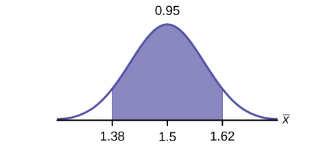
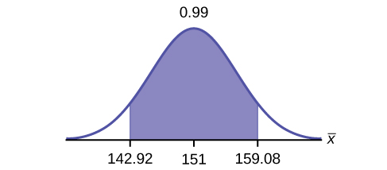
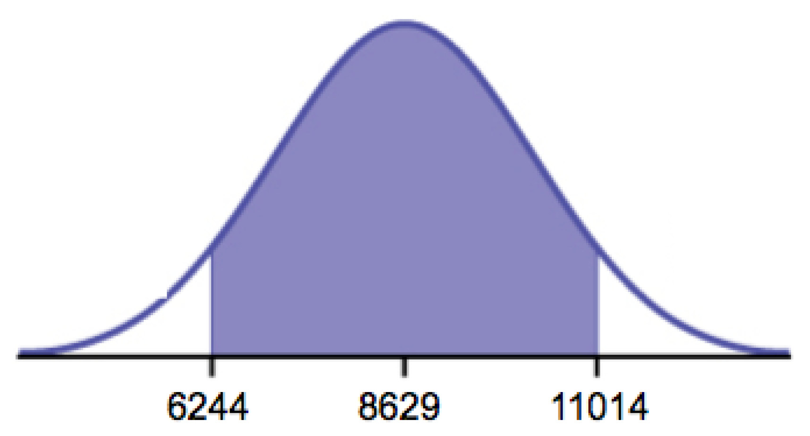
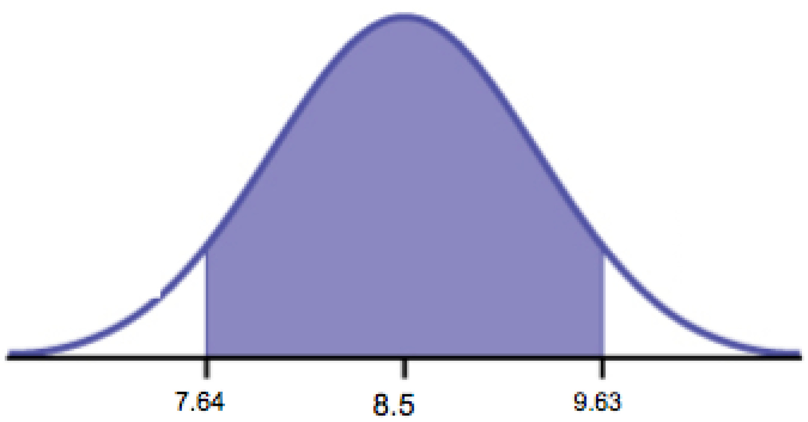

In practice, we rarely know the population **standard deviation**{: data-type="term"}. In the past, when the sample size was large, this did not present a problem to statisticians. They used the sample standard deviation *s* as an estimate for *σ* and proceeded as before to calculate a **confidence interval**{: data-type="term"} with close enough results. However, statisticians ran into problems when the sample size was small. A small sample size caused inaccuracies in the confidence interval.

William S. Goset (1876–1937) of the Guinness brewery in Dublin, Ireland ran into this problem. His experiments with hops and barley produced very few samples. Just replacing *σ* with *s* did not produce accurate results when he tried to calculate a confidence interval. He realized that he could not use a normal distribution for the calculation; he found that the actual distribution depends on the sample size. This problem led him to \"discover\" what is called the **Student\'s t-distribution**{: data-type="term"}. The name comes from the fact that Gosset wrote under the pen name \"Student.\"

Up until the mid-1970s, some statisticians used the **normal distribution**{: data-type="term"} approximation for large sample sizes and only used the Student\'s t-distribution only for sample sizes of at most 30. With graphing calculators and computers, the practice now is to use the Student\'s t-distribution whenever *s* is used as an estimate for *σ*.

If you draw a simple random sample of size *n* from a population that has an approximately a normal distribution with mean *μ* and unknown population standard deviation *σ* and calculate the *t*-score *t* = <math xmlns="http://www.w3.org/1998/Math/MathML"> <mrow> <mfrac> <mrow> <mover accent="true"> <mi>x</mi> <mo>¯</mo> </mover> <mo>–</mo><mi>μ</mi> </mrow> <mrow> <mrow><mo>(</mo> <mrow> <mfrac> <mi>s</mi> <mrow> <msqrt> <mi>n</mi> </msqrt> </mrow> </mfrac> </mrow> <mo>)</mo></mrow> </mrow> </mfrac> </mrow> </math>

, then the *t*-scores follow a **Student\'s t-distribution with *n* – 1 degrees of freedom**. The *t*-score has the same interpretation as the ***z*-score**{: data-type="term"}. It measures how far <math xmlns="http://www.w3.org/1998/Math/MathML"> <mover accent="true"> <mi>x</mi> <mo>¯</mo> </mover> </math>

 is from its mean *μ*. For each sample size *n*, there is a different Student\'s t-distribution.

The **degrees of freedom**{: data-type="term"}, ***n* – 1**, come from the calculation of the sample standard deviation ***s***. In [\[link\]](/m47875), we used *n* deviations <math xmlns="http://www.w3.org/1998/Math/MathML"> <mrow> <mo stretchy="false">(</mo><mi>x</mi><mo>–</mo><mover accent="true"> <mi>x</mi> <mo>¯</mo> </mover> <mtext>values</mtext><mo stretchy="false">)</mo> </mrow> </math>

 to calculate ***s***. Because the sum of the deviations is zero, we can find the last deviation once we know the other ***n* – 1** deviations. The other ***n* – 1** deviations can change or vary freely. **We call the number *n* – 1 the degrees of freedom (df).**

Properties of the Student's t-Distribution

* The graph for the Student\'s t-distribution is similar to the standard normal curve.
* The mean for the Student\'s t-distribution is zero and the distribution is symmetric about zero.
* The Student\'s t-distribution has more probability in its tails than the standard normal distribution because the spread of the t-distribution is greater than the spread of the standard normal. So the graph of the Student\'s t-distribution will be thicker in the tails and shorter in the center than the graph of the standard normal distribution.
* The exact shape of the Student\'s t-distribution depends on the degrees of freedom. As the degrees of freedom increases, the graph of Student\'s t-distribution becomes more like the graph of the standard normal distribution.
* The underlying population of individual observations is assumed to be normally distributed with unknown population mean *μ* and unknown population standard deviation *σ*. The size of the underlying population is generally not relevant unless it is very small. If it is bell shaped (normal) then the assumption is met and doesn\'t need discussion. Random sampling is assumed, but that is a completely separate assumption from normality.

Calculators and computers can easily calculate any Student\'s t-probabilities. The TI-83,83+, and 84+ have a tcdf function to find the probability for given values of *t*. The grammar for the tcdf command is tcdf(lower bound, upper bound, degrees of freedom). However for confidence intervals, we need to use **inverse** probability to find the value of *t* when we know the probability.
{: .finger}

For the TI-84+ you can use the invT command on the DISTRibution menu. The invT command works similarly to the invnorm. The invT command requires two inputs: <strong> invT(area to the left, degrees of freedom)</strong> The output is the t-score that corresponds to the area we specified. * * *
{: data-type="newline"}

 * * *
{: data-type="newline"}

 The TI-83 and 83+ do not have the invT command. (The TI-89 has an inverse T command.)

A probability table for the Student\'s t-distribution can also be used. The table gives t-scores that correspond to the confidence level (column) and degrees of freedom (row). (The TI-86 does not have an invT program or command, so if you are using that calculator, you need to use a probability table for the Student\'s t-Distribution.) When using a *t*-table, note that some tables are formatted to show the confidence level in the column headings, while the column headings in some tables may show only corresponding area in one or both tails.* * *
{: data-type="newline"}

 * * *
{: data-type="newline"}

A Student\'s t table (See [\[link\]](/m47875)) gives *t*-scores given the degrees of freedom and the right-tailed probability. The table is very limited. **Calculators and computers can easily calculate any Student\'s t-probabilities.*** * *
{: data-type="newline"}

**The notation for the Student's t-distribution (using *T* as the random variable) is:**

* *T ~ tdf* where *df* = *n* – 1.
* For example, if we have a sample of size *n* = 20 items, then we calculate the degrees of freedom as *df* = *n* - 1 = 20 - 1 = 19 and we write the distribution as *T ~ t19*.

**If the population standard deviation is not known**, the **error bound for a population mean**{: data-type="term"} is:

* <math xmlns="http://www.w3.org/1998/Math/MathML"> <mrow> <mi>E</mi><mi>B</mi><mi>M</mi><mo>=</mo><mrow><mo>(</mo> <mrow> <msub> <mi>t</mi> <mrow> <mfrac> <mi>α</mi> <mn>2</mn> </mfrac> </mrow> </msub> </mrow> <mo>)</mo></mrow><mrow><mo>(</mo> <mrow> <mfrac> <mi>s</mi> <mrow> <msqrt> <mi>n</mi> </msqrt> </mrow> </mfrac> </mrow> <mo>)</mo></mrow> </mrow> </math>
  
  ,
* <math xmlns="http://www.w3.org/1998/Math/MathML"> <mrow> <msub> <mi>t</mi> <mrow> <mfrac> <mi>σ</mi> <mn>2</mn> </mfrac> </mrow> </msub> </mrow> </math>
  
  is the *t*-score with area to the right equal to
  <math xmlns="http://www.w3.org/1998/Math/MathML"> <mrow> <mfrac> <mi>α</mi> <mn>2</mn> </mfrac> </mrow> </math>
  
  ,
* use *df* = *n* – 1 degrees of freedom, and
* *s* = sample standard deviation.

**The format for the confidence interval is:** * * *
{: data-type="newline"}

<math xmlns="http://www.w3.org/1998/Math/MathML"> <mrow> <mo stretchy="false">(</mo><mover accent="true"> <mi>x</mi> <mo>¯</mo> </mover> <mo>−</mo><mi>E</mi><mi>B</mi><mi>M</mi><mo>,</mo><mover accent="true"> <mi>x</mi> <mo>¯</mo> </mover><mo>+</mo><mi>E</mi><mi>B</mi><mi>M</mi><mo stretchy="false">)</mo> </mrow> </math>

.

To calculate the confidence interval directly: * * *
{: data-type="newline"}

Press STAT. * * *
{: data-type="newline"}

Arrow over to TESTS. * * *
{: data-type="newline"}

Arrow down to 8:TInterval and press ENTER (or just press 8).

Suppose you do a study of acupuncture to determine how effective it is in relieving pain. You measure sensory rates for 15 subjects with the results given. Use the sample data to construct a 95% confidence interval for the mean sensory rate for the population (assumed normal) from which you took the data. * * *
{: data-type="newline"}

The solution is shown step-by-step and by using the TI-83, 83+, or 84+ calculators.

NOT\_CONVERTED\_YET: div

8.6 9.4 7.9 6.8 8.3 7.3 9.2 9.6 8.7 11.4 10.3 5.4 8.1 5.5 6.9

* The first solution is step-by-step (Solution A).
* The second solution uses the TI-83+ and TI-84 calculators (Solution B).

Solution ATo find the confidence interval, you need the sample mean, <math xmlns="http://www.w3.org/1998/Math/MathML"> <mover accent="true"> <mi>x</mi> <mo>¯</mo> </mover> </math>

, and the *EBM*.

<math xmlns="http://www.w3.org/1998/Math/MathML"> <mrow> <mover accent="true"> <mi>x</mi> <mo>¯</mo> </mover> </mrow> </math>

 = 8.2267 *s* = 1.6722 *n* = 15

*df* = 15 – 1 = 14 *CL* so *α* = 1 – *CL* = 1 – 0.95 = 0.05

<math xmlns="http://www.w3.org/1998/Math/MathML"> <mrow> <mfrac> <mi>α</mi> <mn>2</mn> </mfrac> </mrow> </math>

 = 0.025 <math xmlns="http://www.w3.org/1998/Math/MathML"> <mrow> <msub> <mi>t</mi> <mrow> <mfrac> <mi>α</mi> <mn>2</mn> </mfrac> </mrow> </msub> <mo>=</mo><msub> <mi>t</mi> <mrow> <mn>0.025</mn> </mrow> </msub> </mrow> </math>

The area to the right of *t*0.025 is 0.025, and the area to the left of *t*0.025 is 1 – 0.025 = 0.975

<math xmlns="http://www.w3.org/1998/Math/MathML"> <mrow> <msub> <mi>t</mi> <mrow> <mfrac> <mi>α</mi> <mn>2</mn> </mfrac> </mrow> </msub> <mo>=</mo><msub> <mi>t</mi> <mrow> <mn>0.025</mn> </mrow> </msub> <mo>=</mo><mn>2.14</mn> </mrow> </math>

 using invT(.975,14) on the TI-84+ calculator.

<math xmlns="http://www.w3.org/1998/Math/MathML"> <mrow> <mi>E</mi><mi>B</mi><mi>M</mi><mo>=</mo><mrow><mo>(</mo> <mrow> <msub> <mi>t</mi> <mrow> <mfrac> <mi>α</mi> <mn>2</mn> </mfrac> </mrow> </msub> </mrow> <mo>)</mo></mrow><mrow><mo>(</mo> <mrow> <mfrac> <mi>s</mi> <mrow> <msqrt> <mi>n</mi> </msqrt> </mrow> </mfrac> </mrow> <mo>)</mo></mrow> </mrow> </math>

<math xmlns="http://www.w3.org/1998/Math/MathML"> <mrow> <mi>E</mi><mi>B</mi><mi>M</mi><mo>=</mo><mrow><mo>(</mo> <mrow> <mn>2.14</mn> </mrow> <mo>)</mo></mrow><mrow><mo>(</mo> <mrow> <mfrac> <mrow> <mn>1.6722</mn> </mrow> <mrow> <msqrt> <mrow> <mn>15</mn> </mrow> </msqrt> </mrow> </mfrac> </mrow> <mo>)</mo></mrow><mo>=</mo><mn>0.924</mn> </mrow> </math>

<math xmlns="http://www.w3.org/1998/Math/MathML"> <mover accent="true"> <mi>x</mi> <mo>¯</mo> </mover> </math>

 – *EBM* = 8.2267 – 0.9240 = 7.3

<math xmlns="http://www.w3.org/1998/Math/MathML"> <mover accent="true"> <mi>x</mi> <mo>¯</mo> </mover></math>

 + *EBM* = 8.2267 + 0.9240 = 9.15

The 95% confidence interval is (7.30, 9.15).

We estimate with 95% confidence that the true population mean sensory rate is between 7.30 and 9.15.

Press `STAT` and arrow over to `TESTS`. * * *
{: data-type="newline"}

Arrow down to `8:TInterval` and press `ENTER` (or you can just press `8`). * * *
{: data-type="newline"}

Arrow to `Data` and press `ENTER`. * * *
{: data-type="newline"}

Arrow down to `List` and enter the list name where you put the data. * * *
{: data-type="newline"}

There should be a 1 after `Freq`. * * *
{: data-type="newline"}

Arrow down to `C-level` and enter 0.95 * * *
{: data-type="newline"}

Arrow down to `Calculate` and press `ENTER`. * * *
{: data-type="newline"}

The 95% confidence interval is (7.3006, 9.1527)

Note

When calculating the error bound, a probability table for the Student's t-distribution can also be used to find the value of *t*. The table gives *t*-scores that correspond to the confidence level (column) and degrees of freedom (row); the *t*-score is found where the row and column intersect in the table.

Try It

You do a study of hypnotherapy to determine how effective it is in increasing the number of hourse of sleep subjects get each night. You measure hours of sleep for 12 subjects with the following results. Construct a 95% confidence interval for the mean number of hours slept for the population (assumed normal) from which you took the data.

8\.2; 9.1; 7.7; 8.6; 6.9; 11.2; 10.1; 9.9; 8.9; 9.2; 7.5; 10.5

(8.1634, 9.8032)

The Human Toxome Project (HTP) is working to understand the scope of industrial pollution in the human body. Industrial chemicals may enter the body through pollution or as ingredients in consumer products. In October 2008, the scientists at HTP tested cord blood samples for 20 newborn infants in the United States. The cord blood of the "In utero/newborn" group was tested for 430 industrial compounds, pollutants, and other chemicals, including chemicals linked to brain and nervous system toxicity, immune system toxicity, and reproductive toxicity, and fertility problems. There are health concerns about the effects of some chemicals on the brain and nervous system. [[link]](#eip-222) shows how many of the targeted chemicals were found in each infant’s cord blood.

| 79 | 145 | 147 | 160 | 116 | 100 | 159 | 151 | 156 | 126 |
| 137 | 83 | 156 | 94 | 121 | 144 | 123 | 114 | 139 | 99 |
{: #eip-222 summary=".."}

Use this sample data to construct a 90% confidence interval for the mean number of targeted industrial chemicals to be found in an in infant’s blood.

Solution AFrom the sample, you can calculate <math xmlns="http://www.w3.org/1998/Math/MathML"> <mover accent="true"> <mi>x</mi> <mo>¯</mo> </mover> </math>

 = 127.45 and *s* = 25.965. There are 20 infants in the sample, so *n* = 20, and *df* = 20 – 1 = 19.

You are asked to calculate a 90% confidence interval: *CL* = 0.90, so *α* = 1 – *CL* = 1 – 0.90 = 0.10  <math xmlns="http://www.w3.org/1998/Math/MathML"> <mrow> <mfrac> <mi>α</mi> <mn>2</mn> </mfrac> <mo>=</mo><mn>0.05,</mn><mspace width="2pt" /><msub> <mi>t</mi> <mrow> <mfrac> <mi>α</mi> <mn>2</mn> </mfrac> </mrow> </msub> <mo>=</mo><msub> <mi>t</mi> <mrow> <mn>0.05</mn> </mrow> </msub> </mrow> </math>
 

By definition, the area to the right of *t*0.05 is 0.05 and so the area to the left of *t*0.05 is 1 – 0.05 = 0.95.

Use a table, calculator, or computer to find that *t*0.05 = 1.729.
{: .finger}

<math xmlns="http://www.w3.org/1998/Math/MathML"> <mrow> <mi>E</mi><mi>B</mi><mi>M</mi><mo>=</mo><msub> <mi>t</mi> <mrow> <mfrac> <mi>α</mi> <mn>2</mn> </mfrac> </mrow> </msub> <mrow><mo>(</mo> <mrow> <mfrac> <mi>s</mi> <mrow> <msqrt> <mi>n</mi> </msqrt> </mrow> </mfrac> </mrow> <mo>)</mo></mrow><mo>=</mo><mn>1.729</mn><mrow><mo>(</mo> <mrow> <mfrac> <mrow> <mn>25.965</mn> </mrow> <mrow> <msqrt> <mrow> <mn>20</mn> </mrow> </msqrt> </mrow> </mfrac> </mrow> <mo>)</mo></mrow><mo> </mo><mo>≈</mo><mo> </mo><mn>10.038</mn> </mrow> </math>

<math xmlns="http://www.w3.org/1998/Math/MathML"> <mover accent="true"> <mi>x</mi> <mo>¯</mo> </mover> </math>

 – *EBM* = 127.45 – 10.038 = 117.412

<math xmlns="http://www.w3.org/1998/Math/MathML"> <mover accent="true"> <mi>x</mi> <mo>¯</mo> </mover> </math>

 + *EBM* = 127.45 + 10.038 = 137.488

We estimate with 90% confidence that the mean number of all targeted industrial chemicals found in cord blood in the United States is between 117.412 and 137.488.

Solution B

Enter the data as a list. * * *
{: data-type="newline"}

Press `STAT` and arrow over to `TESTS`. * * *
{: data-type="newline"}

Arrow down to `8:TInterval` and press `ENTER` (or you can just press `8`). Arrow to Data and press `ENTER`. * * *
{: data-type="newline"}

Arrow down to `List` and enter the list name where you put the data. * * *
{: data-type="newline"}

Arrow down to `Freq` and enter 1. * * *
{: data-type="newline"}

Arrow down to `C-level` and enter 0.90 * * *
{: data-type="newline"}

Arrow down to `Calculate` and press `ENTER`. * * *
{: data-type="newline"}

The 90% confidence interval is (117.41, 137.49).

Try It

A random sample of statistics students were asked to estimate the total number of hours they spend watching television in an average week. The responses are recorded in [[link]](#eip-672). Use this sample data to construct a 98% confidence interval for the mean number of hours statistics students will spend watching television in one week. | 0 | 3 | 1 | 20 | 9 |
| 5 | 10 | 1 | 10 | 4 |
| 14 | 2 | 4 | 4 | 5 |
{: #eip-672 summary=".."}

Solution A

<math xmlns="http://www.w3.org/1998/Math/MathML"> <mrow> <mover accent="true"> <mi>x</mi> <mo stretchy="true">¯</mo> </mover> </mrow> </math>

= 6.133, *s* = 5.514, *n* = 15, and *df* = 15 – 1 = 14

*CL* = 0.98, so *α* = 1 - *CL* = 1 - 0.98 = 0.02

<math xmlns="http://www.w3.org/1998/Math/MathML"> <mrow> <mfrac> <mi>α</mi> <mn>2</mn> </mfrac> <mo>=</mo><mn>0.01</mn><msub> <mi>t</mi> <mrow> <mfrac> <mi>α</mi> <mn>2</mn> </mfrac> </mrow> </msub> <mo>=</mo><msub> <mi>t</mi> <mrow> <mn>0.01</mn> </mrow> </msub> <mo>=</mo><mn>2.624</mn> </mrow> </math>

<math xmlns="http://www.w3.org/1998/Math/MathML"> <mrow> <mi>E</mi><mi>B</mi><mi>M</mi><mo>=</mo><msub> <mi>t</mi> <mrow> <mfrac> <mi>α</mi> <mn>2</mn> </mfrac> </mrow> </msub> <mrow><mo>(</mo> <mrow> <mfrac> <mi>s</mi> <mrow> <msqrt> <mi>n</mi> </msqrt> </mrow> </mfrac> </mrow> <mo>)</mo></mrow><mo>=</mo><mn>2.624</mn><mrow><mo>(</mo> <mrow> <mfrac> <mrow> <mn>5.514</mn> </mrow> <mrow> <msqrt> <mrow> <mn>15</mn> </mrow> </msqrt> </mrow> </mfrac> </mrow> <mo>)</mo></mrow><mo>~</mo><mn>3.736</mn> </mrow> </math>

<math xmlns="http://www.w3.org/1998/Math/MathML"> <mover accent="true"> <mi>x</mi> <mo>¯</mo> </mover> </math>

 – *EBM* = 6.133 – 3.736 = 2.397

<math xmlns="http://www.w3.org/1998/Math/MathML"> <mrow> <mover accent="true"> <mi>x</mi> <mo stretchy="true">¯</mo> </mover> </mrow> </math>

 + *EBM* = 6.133 + 3.736 = 9.869

We estimate with 98% confidence that the mean number of all hours that statistics students spend watching television in one week is between 2.397 and 9.869.

Solution B

Enter the data as a list.* * *
{: data-type="newline"}

 Press `STAT` and arrow over to `TESTS`.* * *
{: data-type="newline"}

 Arrow down to `8:TInterval`.* * *
{: data-type="newline"}

 Press `ENTER`.* * *
{: data-type="newline"}

 Arrow to `Data` and press `ENTER`.* * *
{: data-type="newline"}

 Arrow down and enter the name of the list where the data is stored.* * *
{: data-type="newline"}

 Enter `Freq`: 1* * *
{: data-type="newline"}

 Enter `C-Level`: 0.98* * *
{: data-type="newline"}

 Arrow down to `Calculate` and press `Enter`.* * *
{: data-type="newline"}

 The 98% confidence interval is (2.3965, 9,8702).* * *
{: data-type="newline"}

# References   {#eip-400}

“America’s Best Small Companies.” Forbes, 2013. Available online at http://www.forbes.com/best-small-companies/list/ (accessed July 2, 2013).

Data from *Microsoft Bookshelf*.

Data from http://www.businessweek.com/.

Data from http://www.forbes.com/.

“Disclosure Data Catalog: Leadership PAC and Sponsors Report, 2012.” Federal Election Commission. Available online at http://www.fec.gov/data/index.jsp (accessed July 2,2013).

“Human Toxome Project: Mapping the Pollution in People.” Environmental Working Group. Available online at http://www.ewg.org/sites/humantoxome/participants/participant-group.php?group=in+utero%2Fnewborn (accessed July 2, 2013).

“Metadata Description of Leadership PAC List.” Federal Election Commission. Available online at http://www.fec.gov/finance/disclosure/metadata/metadataLeadershipPacList.shtml (accessed July 2, 2013).

# Chapter Review   {#eip-447}

In many cases, the researcher does not know the population standard deviation, *σ*, of the measure being studied. In these cases, it is common to use the sample standard deviation, *s*, as an estimate of *σ*. The normal distribution creates accurate confidence intervals when *σ* is known, but it is not as accurate when *s* is used as an estimate. In this case, the Student’s t-distribution is much better. Define a t-score using the following formula:

<math xmlns="http://www.w3.org/1998/Math/MathML"> <mrow> <mi>t</mi><mo>=</mo><mo> </mo><mfrac> <mrow> <mover accent="true"> <mi>x</mi> <mo>¯</mo> </mover> <mo>−</mo><mo> </mo><mi>μ</mi> </mrow> <mrow> <mfrac bevelled="true"> <mi>s</mi> <mrow> <msqrt> <mi>n</mi> </msqrt> </mrow> </mfrac> </mrow> </mfrac> </mrow> </math>

The *t*-score follows the Student’s t-distribution with *n* – 1 degrees of freedom. The confidence interval under this distribution is calculated with *EBM* = <math xmlns="http://www.w3.org/1998/Math/MathML"> <mrow> <mrow><mo>(</mo> <mrow> <msub> <mi>t</mi> <mrow> <mfrac> <mi>α</mi> <mn>2</mn> </mfrac> </mrow> </msub> </mrow> <mo>)</mo></mrow><mfrac> <mi>s</mi> <mrow> <msqrt> <mi>n</mi> </msqrt> </mrow> </mfrac> </mrow> </math>

 where <math xmlns="http://www.w3.org/1998/Math/MathML"> <mrow> <msub> <mi>t</mi> <mrow> <mfrac> <mi>α</mi> <mn>2</mn> </mfrac> </mrow> </msub> </mrow> </math>

 is the *t*-score with area to the right equal to <math xmlns="http://www.w3.org/1998/Math/MathML"> <mrow> <mfrac> <mi>α</mi> <mn>2</mn> </mfrac> </mrow> </math>

, *s* is the sample standard deviation, and *n* is the sample size. Use a table, calculator, or computer to find <math xmlns="http://www.w3.org/1998/Math/MathML"> <mrow> <msub> <mi>t</mi> <mrow> <mfrac> <mi>α</mi> <mn>2</mn> </mfrac> </mrow> </msub> </mrow> </math>

 for a given *α*.

# Formula Review   {#eip-428}

*s* = the standard deviation of sample values.

<math xmlns="http://www.w3.org/1998/Math/MathML"> <mrow> <mi>t</mi><mo>=</mo><mo> </mo><mfrac> <mrow> <mover accent="true"> <mi>x</mi> <mo>¯</mo> </mover> <mo>−</mo><mi>μ</mi> </mrow> <mrow> <mfrac> <mi>s</mi> <mrow> <msqrt> <mi>n</mi> </msqrt> </mrow> </mfrac> </mrow> </mfrac> </mrow> </math>

 is the formula for the *t*-score which measures how far away a measure is from the population mean in the Student’s t-distribution

*df* = *n* - 1; the degrees of freedom for a Student’s t-distribution where n represents the size of the sample

*T*~*tdf* the random variable, *T*, has a Student’s t-distribution with *df* degrees of freedom

<math xmlns="http://www.w3.org/1998/Math/MathML"> <mrow> <mi>E</mi><mi>B</mi><mi>M</mi><mo>=</mo><msub> <mi>t</mi> <mrow> <mfrac> <mi>α</mi> <mn>2</mn> </mfrac> </mrow> </msub> <mfrac> <mi>s</mi> <mrow> <msqrt> <mi>n</mi> </msqrt> </mrow> </mfrac> </mrow> </math>

 = the error bound for the population mean when the population standard deviation is unknown

<math xmlns="http://www.w3.org/1998/Math/MathML"> <mrow> <msub> <mi>t</mi> <mrow> <mfrac> <mi>α</mi> <mn>2</mn> </mfrac> </mrow> </msub> </mrow> </math>

 is the *t*-score in the Student’s t-distribution with area to the right equal to <math xmlns="http://www.w3.org/1998/Math/MathML"> <mrow> <mfrac> <mi>α</mi> <mn>2</mn> </mfrac> </mrow> </math>

The general form for a confidence interval for a single mean, population standard deviation unknown, Student\'s t is given by (lower bound, upper bound) * * *
{: data-type="newline"}

= (point estimate – *EBM*, point estimate + *EBM*) * * *
{: data-type="newline"}

= <math xmlns="http://www.w3.org/1998/Math/MathML"> <mrow> <mrow><mo>(</mo> <mrow> <mover accent="true"> <mi>x</mi> <mo>¯</mo> </mover> <mo>–</mo><mfrac> <mrow> <mi>t</mi><mi>s</mi> </mrow> <mrow> <msqrt> <mi>n</mi> </msqrt> </mrow> </mfrac> <mo>,</mo><mover accent="true"> <mi>x</mi> <mo>¯</mo> </mover> <mtext>+ </mtext><mfrac> <mrow> <mi>t</mi><mi>s</mi> </mrow> <mrow> <msqrt> <mi>n</mi> </msqrt> </mrow> </mfrac> </mrow> <mo>)</mo></mrow> </mrow> </math>

<section data-depth="1" id="eip-568" class="practice" markdown="1">
*Use the following information to answer the next five exercises.* A hospital is trying to cut down on emergency room wait times. It is interested in the amount of time patients must wait before being called back to be examined. An investigation committee randomly surveyed 70 patients. The sample mean was 1.5 hours with a sample standard deviation of 0.5 hours.

Identify the following:

1.  <math xmlns="http://www.w3.org/1998/Math/MathML"> <mover accent="true"> <mi>x</mi> <mo>¯</mo> </mover> </math>
    
    =\_\_\_\_\_\_\_
2.  <math xmlns="http://www.w3.org/1998/Math/MathML"> <mrow> <msub> <mi>s</mi> <mi>x</mi> </msub> </mrow> </math>
    
    =\_\_\_\_\_\_\_
3.  *n* =\_\_\_\_\_\_\_
4.  *n* – 1 =\_\_\_\_\_\_\_
{: data-number-style="lower-alpha"}

Define the random variables *X* and <math xmlns="http://www.w3.org/1998/Math/MathML"> <mover accent="true"> <mi>X</mi> <mo>¯</mo> </mover> </math>

 in words.

*X* is the number of hours a patient waits in the emergency room before being called back to be examined. <math xmlns="http://www.w3.org/1998/Math/MathML"> <mover accent="true"> <mi>X</mi> <mo>¯</mo> </mover> </math>

 is the mean wait time of 70 patients in the emergency room.

Which distribution should you use for this problem?

Construct a 95% confidence interval for the population mean time spent waiting. State the confidence interval, sketch the graph, and calculate the error bound.

CI: (1.3808, 1.6192)

{:}

*EBM* = 0.12

Explain in complete sentences what the confidence interval means.

* * *
{: data-type="newline"}

*Use the following information to answer the next six exercises:* One hundred eight Americans were surveyed to determine the number of hours they spend watching television each month. It was revealed that they watched an average of 151 hours each month with a standard deviation of 32 hours. Assume that the underlying population distribution is normal.

Identify the following:

1.  <math xmlns="http://www.w3.org/1998/Math/MathML"> <mover accent="true"> <mi>x</mi> <mo>¯</mo> </mover> </math>
    
    =\_\_\_\_\_\_\_
2.  <math xmlns="http://www.w3.org/1998/Math/MathML"> <mrow> <msub> <mi>s</mi> <mi>x</mi> </msub> </mrow> </math>
    
    =\_\_\_\_\_\_\_
3.  *n* =\_\_\_\_\_\_\_
4.  *n* – 1 =\_\_\_\_\_\_\_
{: data-number-style="lower-alpha"}

1.  <math xmlns="http://www.w3.org/1998/Math/MathML"> <mover accent="true"> <mi>x</mi> <mo>¯</mo> </mover> </math>
    
    = 151
2.  <math xmlns="http://www.w3.org/1998/Math/MathML"> <mrow> <msub> <mi>s</mi> <mi>x</mi> </msub> </mrow> </math>
    
    = 32
3.  *n* = 108
4.  *n* – 1 = 107
{: data-number-style="lower-alpha"}

Define the random variable *X* in words.

Define the random variable <math xmlns="http://www.w3.org/1998/Math/MathML"> <mover accent="true"> <mi>X</mi> <mo>¯</mo> </mover> </math>

 in words.

<math xmlns="http://www.w3.org/1998/Math/MathML"> <mover accent="true"> <mi>X</mi> <mo>¯</mo> </mover> </math>

 is the mean number of hours spent watching television per month from a sample of 108 Americans.

Which distribution should you use for this problem?

Construct a 99% confidence interval for the population mean hours spent watching television per month. (a) State the confidence interval, (b) sketch the graph, and (c) calculate the error bound.

CI: (142.92, 159.08)* * *
{: data-type="newline"}

 {:}

* * *
{: data-type="newline"}

*EBM* = 8.08

Why would the error bound change if the confidence level were lowered to 95%?

* * *
{: data-type="newline"}

*Use the following information to answer the next 13 exercises:* The data in [\[link\]](#element-181) are the result of a random survey of 39 national flags (with replacement between picks) from various countries. We are interested in finding a confidence interval for the true mean number of colors on a national flag. Let *X* = the number of colors on a national flag.

| *X* | Freq. |
|----------
| 1 | 1 |
| 2 | 7 |
| 3 | 18 |
| 4 | 7 |
| 5 | 6 |
{: #element-181 summary="This table presents the X values (1-5) in the first column and the frequency in the second column."}

Calculate the following:

1.  <math xmlns="http://www.w3.org/1998/Math/MathML"> <mover accent="true"> <mi>x</mi> <mo>¯</mo> </mover> </math>
    
    =\_\_\_\_\_\_
2.  <math xmlns="http://www.w3.org/1998/Math/MathML"> <mrow> <msub> <mi>s</mi> <mi>x</mi> </msub> </mrow> </math>
    
    =\_\_\_\_\_\_
3.  *n* =\_\_\_\_\_\_
{: data-number-style="lower-alpha"}

1.  3\.26
2.  1\.02
3.  39
{: data-number-style="lower-alpha"}

Define the random variable <math xmlns="http://www.w3.org/1998/Math/MathML"> <mover accent="true"> <mi>X</mi> <mo>¯</mo> </mover> </math>

 in words.

What is <math xmlns="http://www.w3.org/1998/Math/MathML"> <mover accent="true"> <mi>x</mi> <mo>¯</mo> </mover> </math>

 estimating?

*μ*

Is <math xmlns="http://www.w3.org/1998/Math/MathML"> <mrow> <msub> <mi>σ</mi> <mi>x</mi> </msub> </mrow> </math>

 known?

As a result of your answer to [[link]](#element-704), state the exact distribution to use when calculating the confidence interval.

*t*38

* * *
{: data-type="newline" data-count="1"}

*Construct a 95% confidence interval for the true mean number of colors on national flags.*

How much area is in both tails (combined)?

How much area is in each tail?

0\.025

Calculate the following:  lower limit upper limit error bound 

The 95% confidence interval is\_\_\_\_\_.

(2.93, 3.59)

Fill in the blanks on the graph with the areas, the upper and lower limits of the Confidence Interval and the sample mean.

{: #five5}

In one complete sentence, explain what the interval means.

We are 95% confident that the true mean number of colors for national flags is between 2.93 colors and 3.59 colors.

Using the same <math xmlns="http://www.w3.org/1998/Math/MathML"> <mover accent="true"> <mi>x</mi> <mo>¯</mo> </mover> </math>

, <math xmlns="http://www.w3.org/1998/Math/MathML"> <mrow> <msub> <mi>s</mi> <mi>x</mi> </msub> </mrow> </math>

, and level of confidence, suppose that *n* were 69 instead of 39. Would the error bound become larger or smaller? How do you know?

The error bound would become EBM = 0.245. This error bound decreases because as sample sizes increase, variability decreases and we need less interval length to capture the true mean.

Using the same <math xmlns="http://www.w3.org/1998/Math/MathML"> <mover accent="true"> <mi>x</mi> <mo>¯</mo> </mover></math>

, <math xmlns="http://www.w3.org/1998/Math/MathML"> <mrow> <msub> <mi>s</mi> <mi>x</mi> </msub> </mrow> </math>

, and *n* = 39, how would the error bound change if the confidence level were reduced to 90%? Why?

</section>

# Homework

In six packages of “The Flintstones® Real Fruit Snacks” there were five Bam-Bam snack pieces. The total number of snack pieces in the six bags was 68. We wish to calculate a 96% confidence interval for the population proportion of Bam-Bam snack pieces.

1.  Define the random variables *X* and *P*′ in words.
2.  Which distribution should you use for this problem? Explain your choice
3.  Calculate *p*′.
4.  Construct a 96% confidence interval for the population proportion of Bam-Bam snack pieces per bag.
    1.  State the confidence interval.
    2.  Sketch the graph.
    3.  Calculate the error bound.
    {: data-number-style="lower-roman"}

5.  Do you think that six packages of fruit snacks yield enough data to give accurate results? Why or why not?
{: data-number-style="lower-alpha"}

A random survey of enrollment at 35 community colleges across the United States yielded the following figures: 6,414; 1,550; 2,109; 9,350; 21,828; 4,300; 5,944; 5,722; 2,825; 2,044; 5,481; 5,200; 5,853; 2,750; 10,012; 6,357; 27,000; 9,414; 7,681; 3,200; 17,500; 9,200; 7,380; 18,314; 6,557; 13,713; 17,768; 7,493; 2,771; 2,861; 1,263; 7,285; 28,165; 5,080; 11,622. Assume the underlying population is normal.    <math xmlns="http://www.w3.org/1998/Math/MathML"> <mover accent="true"> <mi>x</mi> <mo>¯</mo> </mover> </math>
 = \_\_\_\_\_\_\_\_\_\_ <math xmlns="http://www.w3.org/1998/Math/MathML"> <mrow> <msub> <mi>s</mi> <mi>x</mi> </msub> </mrow> </math>
 = \_\_\_\_\_\_\_\_\_\_ *n* = \_\_\_\_\_\_\_\_\_\_ *n* – 1 = \_\_\_\_\_\_\_\_\_\_   Define the random variables <math xmlns="http://www.w3.org/1998/Math/MathML"> <mi>X</mi> </math>
 and <math xmlns="http://www.w3.org/1998/Math/MathML"> <mover accent="true"> <mi>X</mi> <mo>¯</mo> </mover> </math>
 in words. Which distribution should you use for this problem? Explain your choice. Construct a 95% confidence interval for the population mean enrollment at community colleges in the United States.  State the confidence interval. Sketch the graph. Calculate the error bound.   What will happen to the error bound and confidence interval if 500 community colleges were surveyed? Why? 

1.  1.  8629
    2.  6944
    3.  35
    4.  34
    {: data-number-style="lower-roman"}

2.  <math xmlns="http://www.w3.org/1998/Math/MathML"> <mrow> <msub> <mi>t</mi> <mrow> <mn>34</mn> </mrow> </msub> </mrow> </math>

3.  1.  CI: (6244, 11,014)
    2.  {:}

    3.  EB = 2385
    {: data-number-style="lower-roman"}

4.  It will become smaller
{: data-number-style="lower-alpha"}

Suppose that a committee is studying whether or not there is waste of time in our judicial system. It is interested in the mean amount of time individuals waste at the courthouse waiting to be called for jury duty. The committee randomly surveyed 81 people who recently served as jurors. The sample mean wait time was eight hours with a sample standard deviation of four hours.

1.  1.  <math xmlns="http://www.w3.org/1998/Math/MathML"> <mover accent="true"> <mi>x</mi> <mo>¯</mo> </mover> </math>
        
        = \_\_\_\_\_\_\_\_\_\_
    2.  <math xmlns="http://www.w3.org/1998/Math/MathML"> <mrow> <msub> <mi>s</mi> <mi>x</mi> </msub> </mrow> </math>
        
        = \_\_\_\_\_\_\_\_\_\_
    3.  *n* = \_\_\_\_\_\_\_\_\_\_
    4.  *n* – 1 = \_\_\_\_\_\_\_\_\_\_
    {: data-number-style="lower-roman"}

2.  Define the random variables
    <math xmlns="http://www.w3.org/1998/Math/MathML"> <mi>X</mi> </math>
    
    and
    <math xmlns="http://www.w3.org/1998/Math/MathML"> <mover accent="true"> <mi>X</mi> <mo>¯</mo> </mover> </math>
    
    in words.
3.  Which distribution should you use for this problem? Explain your choice.
4.  Construct a 95% confidence interval for the population mean time wasted.
    1.  State the confidence interval.
    2.  Sketch the graph.
    3.  Calculate the error bound.
    {: data-number-style="lower-roman"}

5.  Explain in a complete sentence what the confidence interval means.
{: data-number-style="lower-alpha"}

A pharmaceutical company makes tranquilizers. It is assumed that the distribution for the length of time they last is approximately normal. Researchers in a hospital used the drug on a random sample of nine patients. The effective period of the tranquilizer for each patient (in hours) was as follows: 2.7; 2.8; 3.0; 2.3; 2.3; 2.2; 2.8; 2.1; and 2.4.

1.  1.  <math xmlns="http://www.w3.org/1998/Math/MathML"> <mover accent="true"> <mi>x</mi> <mo>¯</mo> </mover> </math>
        
        = \_\_\_\_\_\_\_\_\_\_
    2.  <math xmlns="http://www.w3.org/1998/Math/MathML"> <mrow> <msub> <mi>s</mi> <mi>x</mi> </msub> </mrow> </math>
        
        = \_\_\_\_\_\_\_\_\_\_
    3.  *n* = \_\_\_\_\_\_\_\_\_\_
    4.  *n* – 1 = \_\_\_\_\_\_\_\_\_\_
    {: data-number-style="lower-roman"}

2.  Define the random variable
    <math xmlns="http://www.w3.org/1998/Math/MathML"> <mi>X</mi> </math>
    
    in words.
3.  Define the random variable
    <math xmlns="http://www.w3.org/1998/Math/MathML"> <mover accent="true"> <mi>X</mi> <mo>¯</mo> </mover> </math>
    
    in words.
4.  Which distribution should you use for this problem? Explain your choice.
5.  Construct a 95% confidence interval for the population mean length of time.
    1.  State the confidence interval.
    2.  Sketch the graph.
    3.  Calculate the error bound.
    {: data-number-style="lower-roman"}

6.  What does it mean to be “95% confident” in this problem?
{: data-number-style="lower-alpha"}

1.  1.  <math xmlns="http://www.w3.org/1998/Math/MathML"> <mover accent="true"> <mi>x</mi> <mo>¯</mo> </mover> </math>
        
        = 2.51
    2.  <math xmlns="http://www.w3.org/1998/Math/MathML"> <mrow> <msub> <mi>s</mi> <mi>x</mi> </msub> </mrow> </math>
        
        = 0.318
    3.  *n* = 9
    4.  *n* - 1 = 8
    {: data-number-style="lower-roman"}

2.  the effective length of time for a tranquilizer
3.  the mean effective length of time of tranquilizers from a sample of nine patients
4.  We need to use a Student’s-t distribution, because we do not know the population standard deviation.
5.  1.  CI: (2.27, 2.76)
    2.  Check student's solution.
    3.  *EBM*: 0.25
    {: data-number-style="lower-roman"}

6.  If we were to sample many groups of nine patients, 95% of the samples would contain the true population mean length of time.
{: data-number-style="lower-alpha"}

Suppose that 14 children, who were learning to ride two-wheel bikes, were surveyed to determine how long they had to use training wheels. It was revealed that they used them an average of six months with a sample standard deviation of three months. Assume that the underlying population distribution is normal.

1.  1.  <math xmlns="http://www.w3.org/1998/Math/MathML"> <mover accent="true"> <mi>x</mi> <mo>¯</mo> </mover> </math>
        
        = \_\_\_\_\_\_\_\_\_\_
    2.  <math xmlns="http://www.w3.org/1998/Math/MathML"> <mrow> <msub> <mi>s</mi> <mi>x</mi> </msub> </mrow> </math>
        
        = \_\_\_\_\_\_\_\_\_\_
    3.  *n* = \_\_\_\_\_\_\_\_\_\_
    4.  *n* – 1 = \_\_\_\_\_\_\_\_\_\_
    {: data-number-style="lower-roman"}

2.  Define the random variable
    <math xmlns="http://www.w3.org/1998/Math/MathML"> <mi>X</mi> </math>
    
    in words.
3.  Define the random variable
    <math xmlns="http://www.w3.org/1998/Math/MathML"> <mover accent="true"> <mi>X</mi> <mo>¯</mo> </mover> </math>
    
    in words.
4.  Which distribution should you use for this problem? Explain your choice.
5.  Construct a 99% confidence interval for the population mean length of time using training wheels.
    1.  State the confidence interval.
    2.  Sketch the graph.
    3.  Calculate the error bound.
    {: data-number-style="lower-roman"}

6.  Why would the error bound change if the confidence level were lowered to 90%?
{: data-number-style="lower-alpha"}

The Federal Election Commission (FEC) collects information about campaign contributions and disbursements for candidates and political committees each election cycle. A political action committee (PAC) is a committee formed to raise money for candidates and campaigns. A Leadership PAC is a PAC formed by a federal politician (senator or representative) to raise money to help other candidates’ campaigns.

The FEC has reported financial information for 556 Leadership PACs that operating during the 2011–2012 election cycle. The following table shows the total receipts during this cycle for a random selection of 20 Leadership PACs.

| $46,500.00 | $0 | $40,966.50 | $105,887.20 | $5,175.00 |
| $29,050.00 | $19,500.00 | $181,557.20 | $31,500.00 | $149,970.80 |
| $2,555,363.20 | $12,025.00 | $409,000.00 | $60,521.70 | $18,000.00 |
| $61,810.20 | $76,530.80 | $119,459.20 | $0 | $63,520.00 |
| $6,500.00 | $502,578.00 | $705,061.10 | $708,258.90 | $135,810.00 |
| $2,000.00 | $2,000.00 | $0 | $1,287,933.80 | $219,148.30 |
{: #eip-146 summary=".."}

<math xmlns="http://www.w3.org/1998/Math/MathML"> <mrow> <mover accent="true"> <mi>x</mi> <mo>¯</mo> </mover> <mo>=</mo><mi>$</mi><mn>251</mn><mo>,</mo><mn>854.23</mn> </mrow> </math>

<math xmlns="http://www.w3.org/1998/Math/MathML"> <mrow> <mi>s</mi><mo>=</mo><mtext> </mtext><mi>$</mi><mn>521</mn><mo>,</mo><mn>130.41</mn> </mrow> </math>

Use this sample data to construct a 96% confidence interval for the mean amount of money raised by all Leadership PACs during the 2011–2012 election cycle. Use the Student's t-distribution.

<math xmlns="http://www.w3.org/1998/Math/MathML"> <mrow> <mover accent="true"> <mi>x</mi> <mo>¯</mo> </mover> <mo>=</mo><mi>$</mi><mn>251</mn><mo>,</mo><mn>854.23</mn> </mrow> </math>

<math xmlns="http://www.w3.org/1998/Math/MathML"> <mrow> <mi>s</mi><mo>=</mo><mtext> </mtext><mi>$</mi><mn>521</mn><mo>,</mo><mn>130.41</mn> </mrow> </math>

Note that we are not given the population standard deviation, only the standard deviation of the sample.

There are 30 measures in the sample, so *n* = 30, and *df* = 30 - 1 = 29

*CL* = 0.96, so *α* = 1 - *CL* = 1 - 0.96 = 0.04

<math xmlns="http://www.w3.org/1998/Math/MathML"> <mrow> <mfrac> <mi>α</mi> <mn>2</mn> </mfrac> <mo>=</mo><mn>0.02</mn> </mrow> <mrow> <msub> <mi>t</mi> <mrow> <mfrac> <mi>α</mi> <mn>2</mn> </mfrac> </mrow> </msub> <mo>=</mo><msub> <mi>t</mi> <mrow> <mn>0.02</mn> </mrow> </msub> </mrow> </math>

 = 2.150

<math xmlns="http://www.w3.org/1998/Math/MathML"> <mrow> <mi>E</mi><mi>B</mi><mi>M</mi><mo>=</mo><msub> <mi>t</mi> <mrow> <mfrac> <mi>α</mi> <mn>2</mn> </mfrac> </mrow> </msub> <mrow><mo>(</mo> <mrow> <mfrac> <mi>s</mi> <mrow> <msqrt> <mi>n</mi> </msqrt> </mrow> </mfrac> </mrow> <mo>)</mo></mrow><mo>=</mo><mn>2.150</mn><mrow><mo>(</mo> <mrow> <mfrac> <mrow> <mn>521</mn><mo>,</mo><mn>130.41</mn> </mrow> <mrow> <msqrt> <mrow> <mn>30</mn> </mrow> </msqrt> </mrow> </mfrac> </mrow> <mo>)</mo></mrow><mo> </mo><mo>~</mo><mo> </mo><mi>$</mi><mn>204</mn><mo>,</mo><mn>561.66</mn> </mrow> </math>

<math xmlns="http://www.w3.org/1998/Math/MathML"> <mrow> <mover accent="true"> <mi>x</mi> <mo stretchy="true">¯</mo> </mover> </mrow> </math>

 - *EBM* = $251,854.23 - $204,561.66 = $47,292.57

<math xmlns="http://www.w3.org/1998/Math/MathML"> <mrow> <mover accent="true"> <mi>x</mi> <mo stretchy="true">¯</mo> </mover> </mrow> </math>

 + *EBM* = $251,854.23+ $204,561.66 = $456,415.89

We estimate with 96% confidence that the mean amount of money raised by all Leadership PACs during the 2011–2012 election cycle lies between $47,292.57 and $456,415.89.* * *
{: data-type="newline"}

Alternate Solution

Enter the data as a list.

Press `STAT` and arrow over to `TESTS`.

Arrow down to `8:TInterval`.

Press `ENTER`.

Arrow to Data and press `ENTER`.

Arrow down and enter the name of the list where the data is stored.

Enter `Freq`: 1

Enter `C-Level`: 0.96

Arrow down to `Calculate` and press `Enter`.

The 96% confidence interval is ($47,262, $456,447).

The difference between solutions arises from rounding differences.

*Forbes* magazine published data on the best small firms in 2012. These were firms that had been publicly traded for at least a year, have a stock price of at least $5 per share, and have reported annual revenue between $5 million and $1 billion. The [[link]](#eip-884) shows the ages of the corporate CEOs for a random sample of these firms.

| 48 | 58 | 51 | 61 | 56 |
| 59 | 74 | 63 | 53 | 50 |
| 59 | 60 | 60 | 57 | 46 |
| 55 | 63 | 57 | 47 | 55 |
| 57 | 43 | 61 | 62 | 49 |
| 67 | 67 | 55 | 55 | 49 |
{: #eip-884 summary=".."}

Use this sample data to construct a 90% confidence interval for the mean age of CEO’s for these top small firms. Use the Student's t-distribution.

Unoccupied seats on flights cause airlines to lose revenue. Suppose a large airline wants to estimate its mean number of unoccupied seats per flight over the past year. To accomplish this, the records of 225 flights are randomly selected and the number of unoccupied seats is noted for each of the sampled flights. The sample mean is 11.6 seats and the sample standard deviation is 4.1 seats.

1.  1.  <math xmlns="http://www.w3.org/1998/Math/MathML"> <mover accent="true"> <mi>x</mi> <mo>¯</mo> </mover> </math>
        
        = \_\_\_\_\_\_\_\_\_\_
    2.  <math xmlns="http://www.w3.org/1998/Math/MathML"> <mrow> <msub> <mi>s</mi> <mi>x</mi> </msub> </mrow> </math>
        
        = \_\_\_\_\_\_\_\_\_\_
    3.  *n* = \_\_\_\_\_\_\_\_\_\_
    4.  *n*-1 = \_\_\_\_\_\_\_\_\_\_
    {: data-number-style="lower-roman"}

2.  Define the random variables
    <math xmlns="http://www.w3.org/1998/Math/MathML"> <mi>X</mi> </math>
    
    and
    <math xmlns="http://www.w3.org/1998/Math/MathML"> <mover accent="true"> <mi>X</mi> <mo>¯</mo> </mover> </math>
    
    in words.
3.  Which distribution should you use for this problem? Explain your choice.
4.  Construct a 92% confidence interval for the population mean number of unoccupied seats per flight.
    1.  State the confidence interval.
    2.  Sketch the graph.
    3.  Calculate the error bound.
    {: data-number-style="lower-roman"}
{: data-number-style="lower-alpha"}

1.  1.  <math xmlns="http://www.w3.org/1998/Math/MathML"> <mover accent="true"> <mi>x</mi> <mo>¯</mo> </mover> </math>
        
        =
    2.  <math xmlns="http://www.w3.org/1998/Math/MathML"> <mrow> <msub> <mi>s</mi> <mi>x</mi> </msub> </mrow> </math>
        
        =
    3.  *n* =
    4.  *n* - 1 =
    {: data-number-style="lower-roman"}

2.  *X* is the number of unoccupied seats on a single flight.
    <math xmlns="http://www.w3.org/1998/Math/MathML"> <mover accent="true"> <mi>X</mi> <mo>¯</mo> </mover> </math>
    
    is the mean number of unoccupied seats from a sample of 225 flights.
3.  We will use a Student’s-t distribution, because we do not know the population standard deviation.
4.  1.  CI: (11.12 , 12.08)
    2.  Check student's solution.
    3.  *EBM*: 0.48
    {: data-number-style="lower-roman"}
{: data-number-style="lower-alpha"}

In a recent sample of 84 used car sales costs, the sample mean was $6,425 with a standard deviation of $3,156. Assume the underlying distribution is approximately normal.

1.  Which distribution should you use for this problem? Explain your choice.
2.  Define the random variable
    <math xmlns="http://www.w3.org/1998/Math/MathML"> <mover accent="true"> <mi>X</mi> <mo>¯</mo> </mover> </math>
    
    in words.
3.  Construct a 95% confidence interval for the population mean cost of a used car.
    1.  State the confidence interval.
    2.  Sketch the graph.
    3.  Calculate the error bound.
    {: data-number-style="lower-roman"}

4.  Explain what a “95% confidence interval” means for this study.
{: data-number-style="lower-alpha"}

Six different national brands of chocolate chip cookies were randomly selected at the supermarket. The grams of fat per serving are as follows: 8; 8; 10; 7; 9; 9. Assume the underlying distribution is approximately normal.

1.  Construct a 90% confidence interval for the population mean grams of fat per serving of chocolate chip cookies sold in supermarkets.
    1.  State the confidence interval.
    2.  Sketch the graph.
    3.  Calculate the error bound.
    {: data-number-style="lower-roman"}

2.  If you wanted a smaller error bound while keeping the same level of confidence, what should have been changed in the study before it was done?
3.  Go to the store and record the grams of fat per serving of six brands of chocolate chip cookies.
4.  Calculate the mean.
5.  Is the mean within the interval you calculated in part a? Did you expect it to be? Why or why not?
{: data-number-style="lower-alpha"}

1.  1.  CI: (7.64 , 9.36)
    2.  {:}

    3.  *EBM*: 0.86
    {: data-number-style="lower-roman"}

2.  The sample should have been increased.
3.  Answers will vary.
4.  Answers will vary.
5.  Answers will vary.
{: data-number-style="lower-alpha"}

A survey of the mean number of cents off that coupons give was conducted by randomly surveying one coupon per page from the coupon sections of a recent San Jose Mercury News. The following data were collected: 20¢; 75¢; 50¢; 65¢; 30¢; 55¢; 40¢; 40¢; 30¢; 55¢; $1.50; 40¢; 65¢; 40¢. Assume the underlying distribution is approximately normal.

1.  1.  <math xmlns="http://www.w3.org/1998/Math/MathML"> <mover accent="true"> <mi>x</mi> <mo>¯</mo> </mover> </math>
        
        = \_\_\_\_\_\_\_\_\_\_
    2.  <math xmlns="http://www.w3.org/1998/Math/MathML"> <mrow> <msub> <mi>s</mi> <mi>x</mi> </msub> </mrow> </math>
        
        = \_\_\_\_\_\_\_\_\_\_
    3.  *n* = \_\_\_\_\_\_\_\_\_\_
    4.  *n*-1 = \_\_\_\_\_\_\_\_\_\_
    {: data-number-style="lower-roman"}

2.  Define the random variables
    <math xmlns="http://www.w3.org/1998/Math/MathML"> <mi>X</mi> </math>
    
    and
    <math xmlns="http://www.w3.org/1998/Math/MathML"> <mover accent="true"> <mi>X</mi> <mo>¯</mo> </mover> </math>
    
    in words.
3.  Which distribution should you use for this problem? Explain your choice.
4.  Construct a 95% confidence interval for the population mean worth of coupons.
    1.  State the confidence interval.
    2.  Sketch the graph.
    3.  Calculate the error bound.
    {: data-number-style="lower-roman"}

5.  If many random samples were taken of size 14, what percent of the confidence intervals constructed should contain the population mean worth of coupons? Explain why.
{: data-number-style="lower-alpha"}

* * *
{: data-type="newline"}

*Use the following information to answer the next two exercises:* A quality control specialist for a restaurant chain takes a random sample of size 12 to check the amount of soda served in the 16 oz. serving size. The sample mean is 13.30 with a sample standard deviation of 1.55. Assume the underlying population is normally distributed.

Find the 95% Confidence Interval for the true population mean for the amount of soda served.

1.  (12.42, 14.18)
2.  (12.32, 14.29)
3.  (12.50, 14.10)
4.  Impossible to determine
{: data-number-style="lower-alpha"}

b

What is the error bound?

1.  0\.87
2.  1\.98
3.  0\.99
4.  1\.74
{: data-number-style="lower-alpha"}

