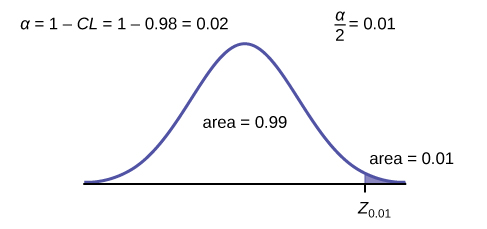
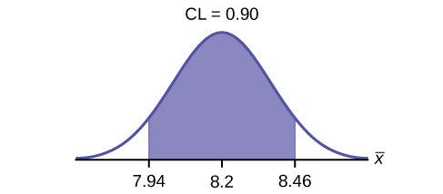
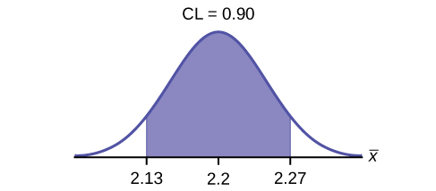
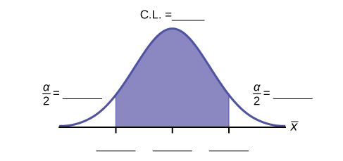
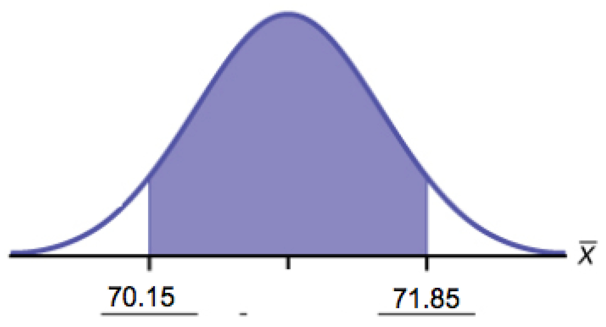
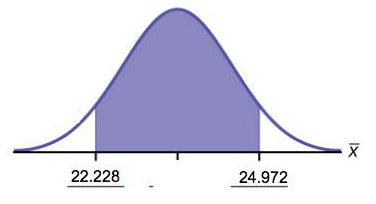
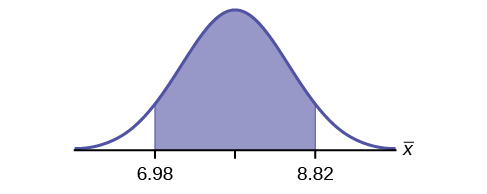

A confidence interval for a population mean with a known standard deviation is based on the fact that the sample means follow an approximately normal distribution. Suppose that our sample has a mean of <math xmlns="http://www.w3.org/1998/Math/MathML"> <mrow> <mover accent="true"> <mi>x</mi> <mo>¯</mo> </mover> <mtext> = 10</mtext> </mrow> </math>

 and we have constructed the 90% confidence interval (5, 15) where *EBM* = 5.

# Calculating the Confidence Interval   {#eip-548}

To construct a confidence interval for a single unknown population mean *μ*, **where the population standard deviation is known**, we need <math xmlns="http://www.w3.org/1998/Math/MathML"> <mover accent="true"> <mi>x</mi> <mo>¯</mo> </mover> </math>

 as an estimate for *μ* and we need the margin of error. Here, the margin of error (*EBM*) is called the **error bound for a population mean**{: data-type="term"} (abbreviated ***EBM***). The sample mean <math xmlns="http://www.w3.org/1998/Math/MathML"> <mover accent="true"> <mi>x</mi> <mo>¯</mo> </mover> </math>

 is the **point estimate** of the unknown population mean *μ*.

**The confidence interval estimate will have the form:**

(point estimate - error bound, point estimate + error bound) or, in symbols,(<math xmlns="http://www.w3.org/1998/Math/MathML"> <mrow> <mover accent="true"> <mi>x</mi> <mo>¯</mo> </mover> <mo>–</mo><mi>E</mi><mi>B</mi><mi>M</mi><mo>,</mo><mover accent="true"> <mi>x</mi> <mo>¯</mo> </mover> <mtext>+</mtext><mi>E</mi><mi>B</mi><mi>M</mi> </mrow> </math>

)

The margin of error (*EBM*) depends on the **confidence level**{: data-type="term"} (abbreviated ***CL***). The confidence level is often considered the probability that the calculated confidence interval estimate will contain the true population parameter. However, it is more accurate to state that the confidence level is the percent of confidence intervals that contain the true population parameter when repeated samples are taken. Most often, it is the choice of the person constructing the confidence interval to choose a confidence level of 90% or higher because that person wants to be reasonably certain of his or her conclusions.

There is another probability called alpha (*α*). *α* is related to the confidence level, *CL*. *α* is the probability that the interval does not contain the unknown population parameter. * * *
{: data-type="newline"}

Mathematically, *α* + *CL* = 1.

* Suppose we have collected data from a sample. We know the sample mean but we do not know the mean for the entire population.
* The sample mean is seven, and the error bound for the mean is 2.5.
{: data-labeled-item="true"}

<math xmlns="http://www.w3.org/1998/Math/MathML"> <mover accent="true"> <mi>x</mi> <mo>¯</mo> </mover> </math>

 = 7 and *EBM* = 2.5

The confidence interval is (7 – 2.5, 7 + 2.5), and calculating the values gives (4.5, 9.5).

If the confidence level (*CL*) is 95%, then we say that, \"We estimate with 95% confidence that the true value of the population mean is between 4.5 and 9.5.\"

Try It

Suppose we have data from a sample. The sample mean is 15, and the error bound for the mean is 3.2.

What is the confidence interval estimate for the population mean?

(11.8, 18.2)

A confidence interval for a population mean with a known standard deviation is based on the fact that the sample means follow an approximately normal distribution. Suppose that our sample has a mean of <math xmlns="http://www.w3.org/1998/Math/MathML"> <mover accent="true"> <mi>x</mi> <mo>¯</mo> </mover> </math>

 = 10, and we have constructed the 90% confidence interval (5, 15) where *EBM* = 5.

To get a 90% confidence interval, we must include the central 90% of the probability of the normal distribution. If we include the central 90%, we leave out a total of *α* = 10% in both tails, or 5% in each tail, of the normal distribution.

 {:}

To capture the central 90%, we must go out 1.645 \"standard deviations\" on either side of the calculated sample mean. The value 1.645 is the *z*-score from a standard normal probability distribution that puts an area of 0.90 in the center, an area of 0.05 in the far left tail, and an area of 0.05 in the far right tail.

It is important that the \"standard deviation\" used must be appropriate for the parameter we are estimating, so in this section we need to use the standard deviation that applies to sample means, which is <math xmlns="http://www.w3.org/1998/Math/MathML"> <mrow> <mfrac> <mi>σ</mi> <mrow> <msqrt> <mi>n</mi> </msqrt> </mrow> </mfrac> </mrow> </math>

. The fraction <math xmlns="http://www.w3.org/1998/Math/MathML"> <mrow> <mfrac> <mi>σ</mi> <mrow> <msqrt> <mi>n</mi> </msqrt> </mrow> </mfrac> </mrow> </math>

, is commonly called the \"standard error of the mean\" in order to distinguish clearly the standard deviation for a mean from the population standard deviation *σ*.

**In summary, as a result of the central limit theorem:**

* <math xmlns="http://www.w3.org/1998/Math/MathML"> <mover accent="true"> <mi>X</mi> <mo>¯</mo> </mover> </math>
  
  is normally distributed, that is,
  <math xmlns="http://www.w3.org/1998/Math/MathML"> <mover accent="true"> <mi>X</mi> <mo>¯</mo> </mover> </math>
  
  ~ *N*
  <math xmlns="http://www.w3.org/1998/Math/MathML"> <mrow> <mrow><mo>(</mo> <mrow> <msub> <mi>μ</mi> <mi>X</mi> </msub> <mo>,</mo><mfrac> <mi>σ</mi> <mrow> <msqrt> <mi>n</mi> </msqrt> </mrow> </mfrac> </mrow> <mo>)</mo></mrow> </mrow> </math>
  
  .
* **When the population standard deviation *σ* is known, we use a normal distribution to calculate the error bound.**

## Calculating the Confidence Interval

To construct a confidence interval estimate for an unknown population mean, we need data from a random sample. The steps to construct and interpret the confidence interval are:

* Calculate the sample mean
  <math xmlns="http://www.w3.org/1998/Math/MathML"> <mover accent="true"> <mi>x</mi> <mo>¯</mo> </mover> </math>
  
  from the sample data. Remember, in this section we already know the population standard deviation *σ*.
* Find the *z*-score that corresponds to the confidence level.
* Calculate the error bound *EBM*.
* Construct the confidence interval.
* Write a sentence that interprets the estimate in the context of the situation in the problem. (Explain what the confidence interval means, in the words of the problem.)

We will first examine each step in more detail, and then illustrate the process with some examples.

## Finding the *z*-score for the Stated Confidence Level

When we know the population standard deviation *σ*, we use a standard normal distribution to calculate the error bound EBM and construct the confidence interval. We need to find the value of *z* that puts an area equal to the confidence level (in decimal form) in the middle of the standard normal distribution *Z* ~ *N*(0, 1).

The confidence level, *CL*, is the area in the middle of the standard normal distribution. *CL* = 1 – *α*, so *α* is the area that is split equally between the two tails. Each of the tails contains an area equal to <math xmlns="http://www.w3.org/1998/Math/MathML"> <mrow> <mfrac> <mi>α</mi> <mn>2</mn> </mfrac> </mrow> </math>

.

The z-score that has an area to the right of <math xmlns="http://www.w3.org/1998/Math/MathML"> <mrow> <mfrac> <mi>α</mi> <mn>2</mn> </mfrac> </mrow> </math>

 is denoted by <math xmlns="http://www.w3.org/1998/Math/MathML"> <mrow> <msub> <mi>z</mi> <mrow> <mfrac> <mi>α</mi> <mn>2</mn> </mfrac> </mrow> </msub> </mrow> </math>

.

For example, when *CL* = 0.95, *α* = 0.05 and <math xmlns="http://www.w3.org/1998/Math/MathML"> <mrow> <mfrac> <mi>α</mi> <mn>2</mn> </mfrac> </mrow> </math>

 = 0.025; we write <math xmlns="http://www.w3.org/1998/Math/MathML"> <mrow> <msub> <mi>z</mi> <mrow> <mfrac> <mi>α</mi> <mn>2</mn> </mfrac> </mrow> </msub> </mrow> </math>

 = *z*0.025.

The area to the right of *z*0.025 is 0.025 and the area to the left of *z*0.025 is 1 – 0.025 = 0.975.

<math xmlns="http://www.w3.org/1998/Math/MathML"> <mrow> <msub> <mi>z</mi> <mrow> <mfrac> <mi>α</mi> <mn>2</mn> </mfrac> </mrow> </msub> <mtext> = </mtext><msub> <mi>z</mi> <mrow> <mn>0.</mn><mtext>025</mtext> </mrow> </msub> <mtext> = 1</mtext><mtext>.96</mtext> </mrow> </math>

, using a calculator, computer or a standard normal probability table.

`invNorm`(0.975, 0, 1) = 1.96

Note

Remember to use the area to the LEFT of <math xmlns="http://www.w3.org/1998/Math/MathML"> <mrow> <msub> <mi>z</mi> <mrow> <mfrac> <mi>α</mi> <mn>2</mn> </mfrac> </mrow> </msub> </mrow> </math>

; in this chapter the last two inputs in the invNorm command are 0, 1, because you are using a standard normal distribution *Z* ~ *N*(0, 1).

## Calculating the Error Bound (*EBM*)

The error bound formula for an unknown population mean *μ* when the population standard deviation *σ* is known is

* *EBM* =
  <math xmlns="http://www.w3.org/1998/Math/MathML"> <mrow> <mrow><mo>(</mo> <mrow> <msub> <mi>z</mi> <mrow> <mfrac> <mi>α</mi> <mn>2</mn> </mfrac> </mrow> </msub> </mrow> <mo>)</mo></mrow><mrow><mo>(</mo> <mrow> <mfrac> <mi>σ</mi> <mrow> <msqrt> <mi>n</mi> </msqrt> </mrow> </mfrac> </mrow> <mo>)</mo></mrow> </mrow> </math>

## Constructing the Confidence Interval

* The confidence interval estimate has the format
  <math xmlns="http://www.w3.org/1998/Math/MathML"> <mrow> <mo stretchy="false">(</mo><mover accent="true"> <mi>x</mi> <mo>¯</mo> </mover> <mo>–</mo><mi>E</mi><mi>B</mi><mi>M</mi><mo>,</mo><mover accent="true"> <mi>x</mi> <mo>¯</mo> </mover> <mo>+</mo><mi>E</mi><mi>B</mi><mi>M</mi><mo stretchy="false">)</mo> </mrow> </math>
  
  .

The graph gives a picture of the entire situation.

*CL* + <math xmlns="http://www.w3.org/1998/Math/MathML"> <mrow> <mfrac> <mi>α</mi> <mn>2</mn> </mfrac> </mrow> </math>

 + <math xmlns="http://www.w3.org/1998/Math/MathML"> <mrow> <mfrac> <mi>α</mi> <mn>2</mn> </mfrac> </mrow> </math>

 = *CL* + *α* = 1.

 {:}

## Writing the Interpretation

The interpretation should clearly state the confidence level (*CL*), explain what population parameter is being estimated (here, a **population mean**), and state the confidence interval (both endpoints). \"We estimate with \\\_\\\_\\\_% confidence that the true population mean (include the context of the problem) is between \\\_\\\_\\\_ and \\\_\\\_\\\_ (include appropriate units).\"

Suppose scores on exams in statistics are normally distributed with an unknown population mean and a population standard deviation of three points. A random sample of 36 scores is taken and gives a sample mean (sample mean score) of 68. Find a confidence interval estimate for the population mean exam score (the mean score on all exams).

Find a 90% confidence interval for the true (population) mean of statistics exam scores.

* You can use technology to calculate the confidence interval directly.
* The first solution is shown step-by-step (Solution A).
* The second solution uses the TI-83, 83+, and 84+ calculators (Solution B).
  * * *
  {: data-type="newline"}

Solution ATo find the confidence interval, you need the sample mean, <math xmlns="http://www.w3.org/1998/Math/MathML"> <mover accent="true"> <mi>x</mi> <mo>¯</mo> </mover> </math>

, and the *EBM*.

<math xmlns="http://www.w3.org/1998/Math/MathML"> <mover accent="true"> <mi>x</mi> <mo>¯</mo> </mover> </math>
 = 68  *EBM* = <math xmlns="http://www.w3.org/1998/Math/MathML"> <mrow> <mrow><mo>(</mo> <mrow> <msub> <mi>z</mi> <mrow> <mfrac> <mi>α</mi> <mn>2</mn> </mfrac> </mrow> </msub> </mrow> <mo>)</mo></mrow> </mrow> </math>
<math xmlns="http://www.w3.org/1998/Math/MathML"> <mrow> <mrow><mo>(</mo> <mrow> <mfrac> <mi>σ</mi> <mrow> <msqrt> <mi>n</mi> </msqrt> </mrow> </mfrac> </mrow> <mo>)</mo></mrow> </mrow> </math>
 *σ* = 3; *n* = 36; The confidence level is 90% (*CL* = 0.90) 

*CL* = 0.90 so *α* = 1 – *CL* = 1 – 0.90 = 0.10

<math xmlns="http://www.w3.org/1998/Math/MathML"> <mrow> <mfrac> <mi>α</mi> <mn>2</mn> </mfrac> </mrow> </math>

 = 0.05 <math xmlns="http://www.w3.org/1998/Math/MathML"> <mrow> <msub> <mi>z</mi> <mrow> <mfrac> <mi>α</mi> <mn>2</mn> </mfrac> </mrow> </msub> <mo>=</mo><msub> <mi>z</mi> <mrow> <mn>0.05</mn> </mrow> </msub> </mrow> </math>

The area to the right of *z*0.05 is 0.05 and the area to the left of *z*0.05 is 1 – 0.05 = 0.95.

<math xmlns="http://www.w3.org/1998/Math/MathML"> <mrow> <msub> <mi>z</mi> <mrow> <mfrac> <mi>α</mi> <mn>2</mn> </mfrac> </mrow> </msub> <mtext> = </mtext><msub> <mi>z</mi> <mrow> <mn>0.05</mn> </mrow> </msub> <mtext> = 1</mtext><mtext>.645</mtext> </mrow> </math>

using invNorm(0.95, 0, 1) on the TI-83,83+, and 84+ calculators. This can also be found using appropriate commands on other calculators, using a computer, or using a probability table for the standard normal distribution.

*EBM* = (1.645)<math xmlns="http://www.w3.org/1998/Math/MathML"> <mrow> <mrow><mo>(</mo> <mrow> <mfrac> <mn>3</mn> <mrow> <msqrt> <mrow> <mn>36</mn> </mrow> </msqrt> </mrow> </mfrac> </mrow> <mo>)</mo></mrow> </mrow> </math>

 = 0.8225

<math xmlns="http://www.w3.org/1998/Math/MathML"> <mover accent="true"> <mi>x</mi> <mo>¯</mo> </mover> </math>

 - *EBM* = 68 - 0.8225 = 67.1775

<math xmlns="http://www.w3.org/1998/Math/MathML"> <mover accent="true"> <mi>x</mi> <mo>¯</mo> </mover> </math>

 + *EBM* = 68 + 0.8225 = 68.8225

The 90% confidence interval is **(67.1775, 68.8225).*** * *
{: data-type="newline"}

Solution B

Press `STAT` and arrow over to `TESTS`. * * *
{: data-type="newline"}

Arrow down to `7:ZInterval`. * * *
{: data-type="newline"}

Press `ENTER`. * * *
{: data-type="newline"}

Arrow to `Stats` and press `ENTER`. * * *
{: data-type="newline"}

Arrow down and enter three for *σ*, 68 for <math xmlns="http://www.w3.org/1998/Math/MathML"> <mover accent="true"> <mi>x</mi> <mo>¯</mo> </mover> </math>

, 36 for *n*, and .90 for `C-level`. * * *
{: data-type="newline"}

Arrow down to `Calculate` and press `ENTER`. * * *
{: data-type="newline"}

The confidence interval is (to three decimal places)(67.178, 68.822).

InterpretationWe estimate with 90% confidence that the true population mean exam score for all statistics students is between 67.18 and 68.82.

Explanation of 90% Confidence Level Ninety percent of all confidence intervals constructed in this way contain the true mean statistics exam score. For example, if we constructed 100 of these confidence intervals, we would expect 90 of them to contain the true population mean exam score.

Try It

Suppose average pizza delivery times are normally distributed with an unknown population mean and a population standard deviation of six minutes. A random sample of 28 pizza delivery restaurants is taken and has a sample mean delivery time of 36 minutes.

Find a 90% confidence interval estimate for the population mean delivery time.

(34.1347, 37.8653)

The Specific Absorption Rate (SAR) for a cell phone measures the amount of radio frequency (RF) energy absorbed by the user’s body when using the handset. Every cell phone emits RF energy. Different phone models have different SAR measures. To receive certification from the Federal Communications Commission (FCC) for sale in the United States, the SAR level for a cell phone must be no more than 1.6 watts per kilogram. [\[link\]](#M02_CH08-tbl001) shows the highest SAR level for a random selection of cell phone models as measured by the FCC.

| Phone Model | SAR | Phone Model | SAR | Phone Model | SAR |
|----------
| Apple iPhone 4S | 1.11 | LG Ally | 1.36 | Pantech Laser | 0.74 |
| BlackBerry Pearl 8120 | 1.48 | LG AX275 | 1.34 | Samsung Character | 0.5 |
| BlackBerry Tour 9630 | 1.43 | LG Cosmos | 1.18 | Samsung Epic 4G Touch | 0.4 |
| Cricket TXTM8 | 1.3 | LG CU515 | 1.3 | Samsung M240 | 0.867 |
| HP/Palm Centro | 1.09 | LG Trax CU575 | 1.26 | Samsung Messager III SCH-R750 | 0.68 |
| HTC One V | 0.455 | Motorola Q9h | 1.29 | Samsung Nexus S | 0.51 |
| HTC Touch Pro 2 | 1.41 | Motorola Razr2 V8 | 0.36 | Samsung SGH-A227 | 1.13 |
| Huawei M835 Ideos | 0.82 | Motorola Razr2 V9 | 0.52 | SGH-a107 GoPhone | 0.3 |
| Kyocera DuraPlus | 0.78 | Motorola V195s | 1.6 | Sony W350a | 1.48 |
| Kyocera K127 Marbl | 1.25 | Nokia 1680 | 1.39 | T-Mobile Concord | 1.38 |
{: #M02_CH08-tbl001 summary=".."}

Find a 98% confidence interval for the true (population) mean of the Specific Absorption Rates (SARs) for cell phones. Assume that the population standard deviation is *σ* = 0.337.* * *
{: data-type="newline"}

Solution ATo find the confidence interval, start by finding the point estimate: the sample mean.

<math xmlns="http://www.w3.org/1998/Math/MathML"> <mrow> <mover accent="true"> <mi>x</mi> <mo>¯</mo> </mover> <mo>=</mo><mn>1.024</mn> </mrow> </math>

Next, find the *EBM*. Because you are creating a 98% confidence interval, *CL* = 0.98.

{:}

You need to find *z*0.01 having the property that the area under the normal density curve to the right of *z*0.01 is 0.01 and the area to the left is 0.99. Use your calculator, a computer, or a probability table for the standard normal distribution to find *z*0.01 = 2.326.

<math xmlns="http://www.w3.org/1998/Math/MathML"> <mrow> <mi>E</mi><mi>B</mi><mi>M</mi><mo>=</mo><mo stretchy="false">(</mo><msub> <mi>z</mi> <mrow> <mn>0.01</mn> </mrow> </msub> <mo stretchy="false">)</mo><mfrac> <mi>σ</mi> <mrow> <msqrt> <mi>n</mi> </msqrt> </mrow> </mfrac> <mo>=</mo><mo stretchy="false">(</mo><mn>2.326</mn><mo stretchy="false">)</mo><mfrac> <mrow> <mn>0.337</mn> </mrow> <mrow> <msqrt> <mrow> <mn>30</mn> </mrow> </msqrt> </mrow> </mfrac> <mo>=</mo><mn>0.1431</mn> </mrow> </math>

To find the 98% confidence interval, find <math xmlns="http://www.w3.org/1998/Math/MathML"> <mrow> <mo> </mo><mover accent="true"> <mi>x</mi> <mo>¯</mo> </mover> <mo>±</mo><mi>E</mi><mi>B</mi><mi>M</mi> </mrow> </math>

.

<math xmlns="http://www.w3.org/1998/Math/MathML"> <mover accent="true"> <mi>x</mi> <mo>¯</mo> </mover> </math>

 – *EBM* = 1.024 – 0.1431 = 0.8809

<math xmlns="http://www.w3.org/1998/Math/MathML"> <mover accent="true"> <mi>x</mi> <mo>¯</mo> </mover> </math>

 – *EBM* = 1.024 – 0.1431 = 1.1671

We estimate with 98% confidence that the true SAR mean for the population of cell phones in the United States is between 0.8809 and 1.1671 watts per kilogram.

Solution B

* Press STAT and arrow over to TESTS.
* Arrow down to 7:ZInterval.
* Press ENTER.
* Arrow to Stats and press ENTER.
* Arrow down and enter the following values:
  * *σ*: 0.337
  * <math xmlns="http://www.w3.org/1998/Math/MathML"> <mrow> <mover accent="true"> <mi>x</mi> <mo>¯</mo> </mover> <mo>:</mo><mn>1.024</mn> </mrow> </math>
  
  * *n*: 30
  * *C*-level: 0.98
  {: data-labeled-item="true"}

* Arrow down to Calculate and press ENTER.
* The confidence interval is (to three decimal places) (0.881, 1.167).
{: data-labeled-item="true"}

Try It

[[link]](#M02_CH08-tbl002) shows a different random sampling of 20 cell phone models. Use this data to calculate a 93% confidence interval for the true mean SAR for cell phones certified for use in the United States. As previously, assume that the population standard deviation is *σ* = 0.337.

| **Phone Model** | **SAR** | **Phone Model** | **SAR** |
|----------
| Blackberry Pearl 8120 | 1.48 | Nokia E71x | 1.53 |
| HTC Evo Design 4G | 0.8 | Nokia N75 | 0.68 |
| HTC Freestyle | 1.15 | Nokia N79 | 1.4 |
| LG Ally | 1.36 | Sagem Puma | 1.24 |
| LG Fathom | 0.77 | Samsung Fascinate | 0.57 |
| LG Optimus Vu | 0.462 | Samsung Infuse 4G | 0.2 |
| Motorola Cliq XT | 1.36 | Samsung Nexus S | 0.51 |
| Motorola Droid Pro | 1.39 | Samsung Replenish | 0.3 |
| Motorola Droid Razr M | 1.3 | Sony W518a Walkman | 0.73 |
| Nokia 7705 Twist | 0.7 | ZTE C79 | 0.869 |
{: #M02_CH08-tbl002 summary=".."}

<math xmlns="http://www.w3.org/1998/Math/MathML"> <mrow> <mover accent="true"> <mi>x</mi> <mo>¯</mo> </mover> <mo>=</mo><mn>0.940</mn> </mrow> </math>

<math xmlns="http://www.w3.org/1998/Math/MathML"> <mrow> <mo> </mo><mfrac> <mi>α</mi> <mn>2</mn> </mfrac> <mo>=</mo><mfrac> <mrow> <mn>1</mn><mo>−</mo><mi>C</mi><mi>L</mi> </mrow> <mn>2</mn> </mfrac> <mo>=</mo><mfrac> <mrow> <mn>1</mn><mo>−</mo><mn>0.93</mn> </mrow> <mn>2</mn> </mfrac> <mo>=</mo><mn>0.035</mn> </mrow> </math>

*Z*0.035 = 1.812

<math xmlns="http://www.w3.org/1998/Math/MathML"> <mrow> <mi>E</mi><mi>B</mi><mi>M</mi><mo>=</mo><mrow><mo>(</mo> <mrow> <msub> <mi>z</mi> <mrow> <mn>0.035</mn> </mrow> </msub> </mrow> <mo>)</mo></mrow><mrow><mo>(</mo> <mrow> <mfrac> <mi>σ</mi> <mrow> <msqrt> <mi>n</mi> </msqrt> </mrow> </mfrac> </mrow> <mo>)</mo></mrow><mo>=</mo><mrow><mo>(</mo> <mrow> <mn>1.812</mn> </mrow> <mo>)</mo></mrow><mrow><mo>(</mo> <mrow> <mfrac> <mrow> <mn>0.337</mn> </mrow> <mrow> <msqrt> <mrow> <mn>20</mn> </mrow> </msqrt> </mrow> </mfrac> </mrow> <mo>)</mo></mrow><mo>=</mo><mn>0.1365</mn> </mrow> </math>

<math xmlns="http://www.w3.org/1998/Math/MathML"> <mover accent="true"> <mi>x</mi> <mo>¯</mo> </mover> </math>

 – *EBM* = 0.940 – 0.1365 = 0.8035

<math xmlns="http://www.w3.org/1998/Math/MathML"> <mover accent="true"> <mi>x</mi> <mo>¯</mo> </mover> </math>

 + *EBM* = 0.940 + 0.1365 = 1.0765

We estimate with 93% confidence that the true SAR mean for the population of cell phones in the United States is between 0.8035 and 1.0765 watts per kilogram.

Notice the difference in the confidence intervals calculated in [\[link\]](#example3) and the following [Try It](#fs-idp77326048) exercise. These intervals are different for several reasons: they were calculated from different samples, the samples were different sizes, and the intervals were calculated for different levels of confidence. Even though the intervals are different, they do not yield conflicting information. The effects of these kinds of changes are the subject of the next section in this chapter.

## Changing the Confidence Level or Sample Size   {#eip-783}

Suppose we change the original problem in [[link]](#eip-id1171257291379) by using a 95% confidence level. Find a 95% confidence interval for the true (population) mean statistics exam score.

To find the confidence interval, you need the sample mean, <math xmlns="http://www.w3.org/1998/Math/MathML"> <mover accent="true"> <mi>x</mi> <mo>¯</mo> </mover> </math>

, and the *EBM*.

* <math xmlns="http://www.w3.org/1998/Math/MathML"> <mover accent="true"> <mi>x</mi> <mo>¯</mo> </mover> </math>
  
  = 68
* *EBM* =
  <math xmlns="http://www.w3.org/1998/Math/MathML"> <mrow> <mrow><mo>(</mo> <mrow> <msub> <mi>z</mi> <mrow> <mfrac> <mi>α</mi> <mn>2</mn> </mfrac> </mrow> </msub> </mrow> <mo>)</mo></mrow><mrow><mo>(</mo> <mrow> <mfrac> <mi>σ</mi> <mrow> <msqrt> <mi>n</mi> </msqrt> </mrow> </mfrac> </mrow> <mo>)</mo></mrow> </mrow> </math>

* *σ* = 3; *n* = 36; The confidence level is 95% (*CL* = 0.95).
{: data-labeled-item="true"}

*CL* = 0.95 so *α* = 1 – *CL* = 1 – 0.95 = 0.05

<math xmlns="http://www.w3.org/1998/Math/MathML"> <mrow> <mfrac> <mi>α</mi> <mn>2</mn> </mfrac> <mo>=</mo><mn>0.025</mn><mtext> </mtext><mtext> </mtext><mtext> </mtext><msub> <mi>z</mi> <mrow> <mfrac> <mi>α</mi> <mn>2</mn> </mfrac> </mrow> </msub> <mo>=</mo><msub> <mi>z</mi> <mrow> <mn>0.025</mn> </mrow> </msub> </mrow> </math>

The area to the right of *z*0.025 is 0.025 and the area to the left of *z*0.025 is 1 – 0.025 = 0.975.

<math xmlns="http://www.w3.org/1998/Math/MathML"> <mrow> <msub> <mi>z</mi> <mrow> <mfrac> <mi>α</mi> <mn>2</mn> </mfrac> </mrow> </msub> <mo>=</mo><msub> <mi>z</mi> <mrow> <mn>0.025</mn> </mrow> </msub> <mo>=</mo><mn>1.96</mn> </mrow> </math>

when using invnorm(0.975,0,1) on the TI-83, 83+, or 84+ calculators. (This can also be found using appropriate commands on other calculators, using a computer, or using a probability table for the standard normal distribution.)
{: .finger}

*EBM* = (1.96)<math xmlns="http://www.w3.org/1998/Math/MathML"> <mrow> <mrow><mo>(</mo> <mrow> <mfrac> <mn>3</mn> <mrow> <msqrt> <mrow> <mn>36</mn> </mrow> </msqrt> </mrow> </mfrac> </mrow> <mo>)</mo></mrow> </mrow> </math>

 = 0.98

<math xmlns="http://www.w3.org/1998/Math/MathML"> <mover accent="true"> <mi>x</mi> <mo>¯</mo> </mover> </math>

 – *EBM* = 68 – 0.98 = 67.02

<math xmlns="http://www.w3.org/1998/Math/MathML"> <mover accent="true"> <mi>x</mi> <mo>¯</mo> </mover> </math>

 + *EBM* = 68 + 0.98 = 68.98

Notice that the *EBM* is larger for a 95% confidence level in the original problem.

InterpretationWe estimate with 95% confidence that the true population mean for all statistics exam scores is between 67.02 and 68.98.

Explanation of 95% Confidence Level Ninety-five percent of all confidence intervals constructed in this way contain the true value of the population mean statistics exam score.

Comparing the results The 90% confidence interval is (67.18, 68.82). The 95% confidence interval is (67.02, 68.98). The 95% confidence interval is wider. If you look at the graphs, because the area 0.95 is larger than the area 0.90, it makes sense that the 95% confidence interval is wider. To be more confident that the confidence interval actually does contain the true value of the population mean for all statistics exam scores, the confidence interval necessarily needs to be wider.

{: #conf_intvls_cfpm3}

**Summary: Effect of Changing the Confidence Level**

* Increasing the confidence level increases the error bound, making the confidence interval wider.
* Decreasing the confidence level decreases the error bound, making the confidence interval narrower.

Try It

Refer back to the pizza-delivery [Try It](#fs-idm85249264) exercise. The population standard deviation is six minutes and the sample mean deliver time is 36 minutes. Use a sample size of 20. Find a 95% confidence interval estimate for the true mean pizza delivery time.

(33.37, 38.63)

Suppose we change the original problem in [\[link\]](#eip-id1171257291379) to see what happens to the error bound if the sample size is changed.

Leave everything the same except the sample size. Use the original 90% confidence level. What happens to the error bound and the confidence interval if we increase the sample size and use *n* = 100 instead of *n* = 36? What happens if we decrease the sample size to *n* = 25 instead of *n* = 36?

* <math xmlns="http://www.w3.org/1998/Math/MathML"> <mover accent="true"> <mi>x</mi> <mo>¯</mo> </mover> </math>
  
  = 68
* *EBM* =
  <math xmlns="http://www.w3.org/1998/Math/MathML"> <mrow> <mrow><mo>(</mo> <mrow> <msub> <mi>z</mi> <mrow> <mfrac> <mi>α</mi> <mn>2</mn> </mfrac> </mrow> </msub> </mrow> <mo>)</mo></mrow><mrow><mo>(</mo> <mrow> <mfrac> <mi>σ</mi> <mrow> <msqrt> <mi>n</mi> </msqrt> </mrow> </mfrac> </mrow> <mo>)</mo></mrow> </mrow> </math>

* *σ* = 3; The confidence level is 90% (*CL*=0.90);
  <math xmlns="http://www.w3.org/1998/Math/MathML"> <mrow> <msub> <mi>z</mi> <mrow> <mfrac> <mi>α</mi> <mn>2</mn> </mfrac> </mrow> </msub> </mrow> </math>
  
  = *z*0.05 = 1.645.

Solution AIf we **increase** the sample size *n* to 100, we **decrease** the error bound.

When *n* = 100: *EBM* = <math xmlns="http://www.w3.org/1998/Math/MathML"> <mrow> <mrow><mo>(</mo> <mrow> <msub> <mi>z</mi> <mrow> <mfrac> <mi>α</mi> <mn>2</mn> </mfrac> </mrow> </msub> </mrow> <mo>)</mo></mrow><mrow><mo>(</mo> <mrow> <mfrac> <mi>σ</mi> <mrow> <msqrt> <mi>n</mi> </msqrt> </mrow> </mfrac> </mrow> <mo>)</mo></mrow> </mrow> </math>

 = (1.645)<math xmlns="http://www.w3.org/1998/Math/MathML"> <mrow> <mrow><mo>(</mo> <mrow> <mfrac> <mn>3</mn> <mrow> <msqrt> <mrow> <mn>100</mn> </mrow> </msqrt> </mrow> </mfrac> </mrow> <mo>)</mo></mrow> </mrow> </math>

 = 0.4935.

Solution BIf we **decrease** the sample size *n* to 25, we **increase** the error bound.

When *n* = 25: *EBM* = <math xmlns="http://www.w3.org/1998/Math/MathML"> <mrow> <mrow><mo>(</mo> <mrow> <msub> <mi>z</mi> <mrow> <mfrac> <mi>α</mi> <mn>2</mn> </mfrac> </mrow> </msub> </mrow> <mo>)</mo></mrow><mrow><mo>(</mo> <mrow> <mfrac> <mi>σ</mi> <mrow> <msqrt> <mi>n</mi> </msqrt> </mrow> </mfrac> </mrow> <mo>)</mo></mrow> </mrow> </math>

 = (1.645)<math xmlns="http://www.w3.org/1998/Math/MathML"> <mrow> <mrow><mo>(</mo> <mrow> <mfrac> <mn>3</mn> <mrow> <msqrt> <mrow> <mn>25</mn> </mrow> </msqrt> </mrow> </mfrac> </mrow> <mo>)</mo></mrow> </mrow> </math>

 = 0.987.

Summary: Effect of Changing the Sample Size

* Increasing the sample size causes the error bound to decrease, making the confidence interval narrower.
* Decreasing the sample size causes the error bound to increase, making the confidence interval wider.

Try It

Refer back to the pizza-delivery [Try It](#fs-idm85249264) exercise. The mean delivery time is 36 minutes and the population standard deviation is six minutes. Assume the sample size is changed to 50 restaurants with the same sample mean. Find a 90% confidence interval estimate for the population mean delivery time.

(34.6041, 37.3958)

# Working Backwards to Find the Error Bound or Sample Mean   {#eip-710}

When we calculate a confidence interval, we find the sample mean, calculate the error bound, and use them to calculate the confidence interval. However, sometimes when we read statistical studies, the study may state the confidence interval only. If we know the confidence interval, we can work backwards to find both the error bound and the sample mean.

**Finding the Error Bound**

* From the upper value for the interval, subtract the sample mean,
* OR, from the upper value for the interval, subtract the lower value. Then divide the difference by two.

**Finding the Sample Mean**

* Subtract the error bound from the upper value of the confidence interval,
* OR, average the upper and lower endpoints of the confidence interval.

Notice that there are two methods to perform each calculation. You can choose the method that is easier to use with the information you know.

Suppose we know that a confidence interval is **(67.18, 68.82)** and we want to find the error bound. We may know that the sample mean is 68, or perhaps our source only gave the confidence interval and did not tell us the value of the sample mean.

Calculate the Error Bound:

* If we know that the sample mean is 68: *EBM* = 68.82 – 68 = 0.82.
* If we don\'t know the sample mean: *EBM* =
  <math xmlns="http://www.w3.org/1998/Math/MathML"> <mrow> <mfrac> <mrow> <mo stretchy="false">(</mo><mn>68.82</mn><mo>−</mo><mn>67.18</mn><mo stretchy="false">)</mo> </mrow> <mn>2</mn> </mfrac> </mrow> </math>
  
  = 0.82.

Calculate the Sample Mean:

* If we know the error bound:
  <math xmlns="http://www.w3.org/1998/Math/MathML"> <mover accent="true"> <mi>x</mi> <mo>¯</mo> </mover> </math>
  
  = 68.82 – 0.82 = 68
* If we don\'t know the error bound:
  <math xmlns="http://www.w3.org/1998/Math/MathML"> <mover accent="true"> <mi>x</mi> <mo>¯</mo> </mover> </math>
  
  =
  <math xmlns="http://www.w3.org/1998/Math/MathML"> <mrow> <mfrac> <mrow> <mo stretchy="false">(</mo><mn>67.18</mn><mo>+</mo><mn>68.82</mn><mo stretchy="false">)</mo> </mrow> <mn>2</mn> </mfrac> </mrow> </math>
  
  = 68.

Try It

Suppose we know that a confidence interval is (42.12, 47.88). Find the error bound and the sample mean.

Sample mean is 45, error bound is 2.88

# Calculating the Sample Size *n*   {#eip-865}

If researchers desire a specific margin of error, then they can use the error bound formula to calculate the required sample size.

The error bound formula for a population mean when the population standard deviation is known is * * *
{: data-type="newline"}

*EBM* = <math xmlns="http://www.w3.org/1998/Math/MathML"> <mrow> <mrow><mo>(</mo> <mrow> <msub> <mi>z</mi> <mrow> <mfrac> <mi>α</mi> <mn>2</mn> </mfrac> </mrow> </msub> </mrow> <mo>)</mo></mrow><mrow><mo>(</mo> <mrow> <mfrac> <mi>σ</mi> <mrow> <msqrt> <mi>n</mi> </msqrt> </mrow> </mfrac> </mrow> <mo>)</mo></mrow> </mrow> </math>

.

The formula for sample size is *n* = <math xmlns="http://www.w3.org/1998/Math/MathML"> <mrow> <mfrac> <mrow> <msup> <mi>z</mi> <mn>2</mn> </msup> <msup> <mi>σ</mi> <mn>2</mn> </msup> </mrow> <mrow> <mi>E</mi><mi>B</mi><msup> <mi>M</mi> <mn>2</mn> </msup> </mrow> </mfrac> </mrow> </math>

, found by solving the error bound formula for *n*.

In this formula, *z* is <math xmlns="http://www.w3.org/1998/Math/MathML"> <mrow> <msub> <mi>z</mi> <mrow> <mfrac> <mi>α</mi> <mn>2</mn> </mfrac> </mrow> </msub> </mrow> </math>

, corresponding to the desired confidence level. A researcher planning a study who wants a specified confidence level and error bound can use this formula to calculate the size of the sample needed for the study.

The population standard deviation for the age of Foothill College students is 15 years. If we want to be 95% confident that the sample mean age is within two years of the true population mean age of Foothill College students, how many randomly selected Foothill College students must be surveyed?

* From the problem, we know that *σ* = 15 and *EBM* = 2.
* *z* = *z*0.025 = 1.96, because the confidence level is 95%.
{: data-labeled-item="true"}

* *n* =
  <math xmlns="http://www.w3.org/1998/Math/MathML"> <mrow> <mfrac> <mrow> <msup> <mi>z</mi> <mn>2</mn> </msup> <msup> <mi>σ</mi> <mn>2</mn> </msup> </mrow> <mrow> <mi>E</mi><mi>B</mi><msup> <mi>M</mi> <mn>2</mn> </msup> </mrow> </mfrac> </mrow> </math>
  
  =
  <math xmlns="http://www.w3.org/1998/Math/MathML"> <mrow> <mfrac> <mrow> <msup> <mrow> <mrow><mo>(</mo> <mrow> <mn>1.96</mn> </mrow> <mo>)</mo></mrow> </mrow> <mn>2</mn> </msup> <msup> <mrow> <mrow><mo>(</mo> <mrow> <mn>15</mn> </mrow> <mo>)</mo></mrow> </mrow> <mn>2</mn> </msup> </mrow> <mrow> <msup> <mn>2</mn> <mn>2</mn> </msup> </mrow> </mfrac> </mrow> </math>
  
  = 216.09 using the sample size equation.
* Use *n* = 217: Always round the answer UP to the next higher integer to ensure that the sample size is large enough.
{: data-labeled-item="true"}

Therefore, 217 Foothill College students should be surveyed in order to be 95% confident that we are within two years of the true population mean age of Foothill College students.

Try It

The population standard deviation for the height of high school basketball players is three inches. If we want to be 95% confident that the sample mean height is within one inch of the true population mean height, how many randomly selected students must be surveyed?

35 students

# References   {#eip-493}

“American Fact Finder.” U.S. Census Bureau. Available online at http://factfinder2.census.gov/faces/nav/jsf/pages/searchresults.xhtml?refresh=t (accessed July 2, 2013).

“Disclosure Data Catalog: Candidate Summary Report 2012.” U.S. Federal Election Commission. Available online at http://www.fec.gov/data/index.jsp (accessed July 2, 2013).

“Headcount Enrollment Trends by Student Demographics Ten-Year Fall Trends to Most Recently Completed Fall.” Foothill De Anza Community College District. Available online at http://research.fhda.edu/factbook/FH\\\_Demo\\\_Trends/FoothillDemographicTrends.htm (accessed September 30,2013).

Kuczmarski, Robert J., Cynthia L. Ogden, Shumei S. Guo, Laurence M. Grummer-Strawn, Katherine M. Flegal, Zuguo Mei, Rong Wei, Lester R. Curtin, Alex F. Roche, Clifford L. Johnson. “2000 CDC Growth Charts for the United States: Methods and Development.” Centers for Disease Control and Prevention. Available online at http://www.cdc.gov/growthcharts/2000growthchart-us.pdf (accessed July 2, 2013).

La, Lynn, Kent German. \"Cell Phone Radiation Levels.\" c\\\|net part of CBX Interactive Inc. Available online at http://reviews.cnet.com/cell-phone-radiation-levels/ (accessed July 2, 2013).

“Mean Income in the Past 12 Months (in 2011 Inflaction-Adjusted Dollars): 2011 American Community Survey 1-Year Estimates.” American Fact Finder, U.S. Census Bureau. Available online at http://factfinder2.census.gov/faces/tableservices/jsf/pages/productview.xhtml?pid=ACS\\\_11\\\_1YR\\\_S1902&amp;prodType=table (accessed July 2, 2013).

“Metadata Description of Candidate Summary File.” U.S. Federal Election Commission. Available online at http://www.fec.gov/finance/disclosure/metadata/metadataforcandidatesummary.shtml (accessed July 2, 2013).

“National Health and Nutrition Examination Survey.” Centers for Disease Control and Prevention. Available online at http://www.cdc.gov/nchs/nhanes.htm (accessed July 2, 2013).

# Chapter Review   {#eip-330}

In this module, we learned how to calculate the confidence interval for a single population mean where the population standard deviation is known. When estimating a population mean, the margin of error is called the error bound for a population mean (*EBM*). A confidence interval has the general form:

(lower bound, upper bound) = (point estimate – *EBM*, point estimate + *EBM*)

The calculation of *EBM* depends on the size of the sample and the level of confidence desired. The confidence level is the percent of all possible samples that can be expected to include the true population parameter. As the confidence level increases, the corresponding *EBM* increases as well. As the sample size increases, the *EBM* decreases. By the central limit theorem,

<math xmlns="http://www.w3.org/1998/Math/MathML"> <mrow> <mi>E</mi><mi>B</mi><mi>M</mi><mo>=</mo><mi>z</mi><mfrac> <mi>σ</mi> <mrow> <msqrt> <mi>n</mi> </msqrt> </mrow> </mfrac> </mrow> </math>

Given a confidence interval, you can work backwards to find the error bound (*EBM*) or the sample mean. To find the error bound, find the difference of the upper bound of the interval and the mean. If you do not know the sample mean, you can find the error bound by calculating half the difference of the upper and lower bounds. To find the sample mean given a confidence interval, find the difference of the upper bound and the error bound. If the error bound is unknown, then average the upper and lower bounds of the confidence interval to find the sample mean.

Sometimes researchers know in advance that they want to estimate a population mean within a specific margin of error for a given level of confidence. In that case, solve the *EBM* formula for *n* to discover the size of the sample that is needed to achieve this goal:

<math xmlns="http://www.w3.org/1998/Math/MathML"> <mrow> <mi>n</mi><mo>=</mo><mo> </mo><mfrac> <mrow> <msup> <mi>z</mi> <mn>2</mn> </msup> <msup> <mi>σ</mi> <mn>2</mn> </msup> </mrow> <mrow> <mi>E</mi><mi>B</mi><msup> <mi>M</mi> <mn>2</mn> </msup> </mrow> </mfrac> </mrow> </math>

# Formula Review   {#eip-191}

<math xmlns="http://www.w3.org/1998/Math/MathML"> <mrow> <mover accent="true"> <mi>X</mi> <mo>¯</mo> </mover> <mo>~</mo><mi>N</mi><mrow><mo>(</mo> <mrow> <msub> <mi>μ</mi> <mi>X</mi> </msub> <mo>,</mo><mfrac> <mi>σ</mi> <mrow> <msqrt> <mi>n</mi> </msqrt> </mrow> </mfrac> </mrow> <mo>)</mo></mrow> </mrow> </math>

 The distribution of sample means is normally distributed with mean equal to the population mean and standard deviation given by the population standard deviation divided by the square root of the sample size.

The general form for a confidence interval for a single population mean, known standard deviation, normal distribution is given by * * *
{: data-type="newline"}

(lower bound, upper bound) = (point estimate – *EBM*, point estimate + *EBM*) * * *
{: data-type="newline"}

= <math xmlns="http://www.w3.org/1998/Math/MathML"> <mrow> <mo stretchy="false">(</mo><mover accent="true"> <mi>x</mi> <mo>¯</mo> </mover> <mo>−</mo><mi>E</mi><mi>B</mi><mi>M</mi><mo>,</mo><mover accent="true"> <mi>x</mi> <mo>¯</mo> </mover> <mo>+</mo><mi>E</mi><mi>B</mi><mi>M</mi><mo stretchy="false">)</mo> </mrow> </math>

 * * *
{: data-type="newline"}

= <math xmlns="http://www.w3.org/1998/Math/MathML"> <mrow> <mrow><mo>(</mo> <mrow> <mover accent="true"> <mi>x</mi> <mo>¯</mo> </mover> <mo>−</mo><mi>z</mi><mfrac> <mi>σ</mi> <mrow> <msqrt> <mi>n</mi> </msqrt> </mrow> </mfrac> <mo>,</mo><mover accent="true"> <mi>x</mi> <mo>¯</mo> </mover> <mo>+</mo><mi>z</mi><mfrac> <mi>σ</mi> <mrow> <msqrt> <mi>n</mi> </msqrt> </mrow> </mfrac> </mrow> <mo>)</mo></mrow> </mrow> </math>

*EBM* = <math xmlns="http://www.w3.org/1998/Math/MathML"> <mrow> <mi>z</mi><mfrac> <mi>σ</mi> <mrow> <msqrt> <mi>n</mi> </msqrt> </mrow> </mfrac> </mrow> </math>

 = the error bound for the mean, or the margin of error for a single population mean; this formula is used when the population standard deviation is known.

*CL* = confidence level, or the proportion of confidence intervals created that are expected to contain the true population parameter

*α* = 1 – *CL* = the proportion of confidence intervals that will not contain the population parameter

<math xmlns="http://www.w3.org/1998/Math/MathML"> <mrow> <msub> <mi>z</mi> <mrow> <mfrac> <mi>α</mi> <mn>2</mn> </mfrac> </mrow> </msub> </mrow> </math>

 = the *z*-score with the property that the area to the right of the z-score is <math xmlns="http://www.w3.org/1998/Math/MathML"> <mrow> <mo> </mo><mfrac> <mo>∝</mo> <mn>2</mn> </mfrac> </mrow> </math>

 this is the *z*-score used in the calculation of *\"EBM* where α = 1 – *CL*.

*n* = <math xmlns="http://www.w3.org/1998/Math/MathML"> <mrow> <mfrac> <mrow> <msup> <mi>z</mi> <mn>2</mn> </msup> <msup> <mi>σ</mi> <mn>2</mn> </msup> </mrow> <mrow> <mi>E</mi><mi>B</mi><msup> <mi>M</mi> <mn>2</mn> </msup> </mrow> </mfrac> </mrow> </math>

 = the formula used to determine the sample size (*n*) needed to achieve a desired margin of error at a given level of confidence

General form of a confidence interval

(lower value, upper value) = (point estimate−error bound, point estimate + error bound)

To find the error bound when you know the confidence interval

error bound = upper value−point estimate OR error bound = <math xmlns="http://www.w3.org/1998/Math/MathML"> <mrow> <mfrac> <mrow> <mtext>upper value</mtext><mo>−</mo><mtext>lower value</mtext> </mrow> <mn>2</mn> </mfrac> </mrow> </math>

Single Population Mean, Known Standard Deviation, Normal Distribution

Use the Normal Distribution for Means, Population Standard Deviation is Known *EBM* = *z*<math xmlns="http://www.w3.org/1998/Math/MathML"> <mrow> <mfrac> <mi>α</mi> <mn>2</mn> </mfrac> <mo>⋅</mo><mfrac> <mi>σ</mi> <mrow> <msqrt> <mi>n</mi> </msqrt> </mrow> </mfrac> </mrow> </math>

The confidence interval has the format (<math xmlns="http://www.w3.org/1998/Math/MathML"> <mover accent="true"> <mi>x</mi> <mo>¯</mo> </mover> </math>

 − *EBM*, <math xmlns="http://www.w3.org/1998/Math/MathML"> <mover accent="true"> <mi>x</mi> <mo>¯</mo> </mover> </math>

 + *EBM*).

<section data-depth="1" id="eip-673" class="practice" markdown="1">
*Use the following information to answer the next five exercises:* The standard deviation of the weights of elephants is known to be approximately 15 pounds. We wish to construct a 95% confidence interval for the mean weight of newborn elephant calves. Fifty newborn elephants are weighed. The sample mean is 244 pounds. The sample standard deviation is 11 pounds.

Identify the following:

1.  <math xmlns="http://www.w3.org/1998/Math/MathML"> <mover accent="true"> <mi>x</mi> <mo>¯</mo> </mover> </math>
    
    = \_\_\_\_\_
2.  *σ* = \_\_\_\_\_
3.  *n* = \_\_\_\_\_
{: data-number-style="lower-alpha"}

1.  244
2.  15
3.  50
{: data-number-style="lower-alpha"}

In words, define the random variables *X* and <math xmlns="http://www.w3.org/1998/Math/MathML"> <mover accent="true"> <mi>X</mi> <mo>¯</mo> </mover> </math>

.

Which distribution should you use for this problem?

<math xmlns="http://www.w3.org/1998/Math/MathML"> <mrow> <mi>N</mi><mrow><mo>(</mo> <mrow> <mn>244</mn><mo>,</mo><mfrac> <mrow> <mn>15</mn> </mrow> <mrow> <msqrt> <mrow> <mn>50</mn> </mrow> </msqrt> </mrow> </mfrac> </mrow> <mo>)</mo></mrow> </mrow> </math>

Construct a 95% confidence interval for the population mean weight of newborn elephants. State the confidence interval, sketch the graph, and calculate the error bound.

What will happen to the confidence interval obtained, if 500 newborn elephants are weighed instead of 50? Why?

As the sample size increases, there will be less variability in the mean, so the interval size decreases.

* * *
{: data-type="newline"}

*Use the following information to answer the next seven exercises:* The U.S. Census Bureau conducts a study to determine the time needed to complete the short form. The Bureau surveys 200 people. The sample mean is 8.2 minutes. There is a known standard deviation of 2.2 minutes. The population distribution is assumed to be normal.

Identify the following:

1.  <math xmlns="http://www.w3.org/1998/Math/MathML"> <mover accent="true"> <mi>x</mi> <mo>¯</mo> </mover> </math>
    
    = \_\_\_\_\_
2.  *σ* = \_\_\_\_\_
3.  *n* = \_\_\_\_\_
{: data-number-style="lower-alpha"}

In words, define the random variables *X* and <math xmlns="http://www.w3.org/1998/Math/MathML"> <mover accent="true"> <mi>X</mi> <mo>¯</mo> </mover> </math>

.

*X* is the time in minutes it takes to complete the U.S. Census short form. <math xmlns="http://www.w3.org/1998/Math/MathML"> <mover accent="true"> <mi>X</mi> <mo>¯</mo> </mover> </math>

 is the mean time it took a sample of 200 people to complete the U.S. Census short form.

Which distribution should you use for this problem?

Construct a 90% confidence interval for the population mean time to complete the forms. State the confidence interval, sketch the graph, and calculate the error bound.

CI: (7.9441, 8.4559)

{: #eip-idm5552576}

*EBM* = 0.26

If the Census wants to increase its level of confidence and keep the error bound the same by taking another survey, what changes should it make?

If the Census did another survey, kept the error bound the same, and surveyed only 50 people instead of 200, what would happen to the level of confidence? Why?

The level of confidence would decrease because decreasing *n* makes the confidence interval wider, so at the same error bound, the confidence level decreases.

Suppose the Census needed to be 98% confident of the population mean length of time. Would the Census have to survey more people? Why or why not?

* * *
{: data-type="newline"}

*Use the following information to answer the next ten exercises:* A sample of 20 heads of lettuce was selected. Assume that the population distribution of head weight is normal. The weight of each head of lettuce was then recorded. The mean weight was 2.2 pounds with a standard deviation of 0.1 pounds. The population standard deviation is known to be 0.2 pounds.

Identify the following:

1.  <math xmlns="http://www.w3.org/1998/Math/MathML"> <mover accent="true"> <mi>x</mi> <mo>¯</mo> </mover> </math>
    
    = \_\_\_\_\_\_
2.  *σ* = \_\_\_\_\_\_
3.  *n* = \_\_\_\_\_\_
{: data-number-style="lower-alpha"}

1.  <math xmlns="http://www.w3.org/1998/Math/MathML"> <mover accent="true"> <mi>x</mi> <mo>¯</mo> </mover> </math>
    
    = 2.2
2.  *σ* = 0.2
3.  *n* = 20
{: data-number-style="lower-alpha"}

In words, define the random variable *X*.

In words, define the random variable <math xmlns="http://www.w3.org/1998/Math/MathML"> <mover accent="true"> <mi>X</mi> <mo>¯</mo> </mover> </math>

.

<math xmlns="http://www.w3.org/1998/Math/MathML"> <mover accent="true"> <mi>X</mi> <mo>¯</mo> </mover> </math>

 is the mean weight of a sample of 20 heads of lettuce.

Which distribution should you use for this problem?

Construct a 90% confidence interval for the population mean weight of the heads of lettuce. State the confidence interval, sketch the graph, and calculate the error bound.

*EBM* = 0.07 * * *
{: data-type="newline"}

CI: (2.1264, 2.2736)

{:}

Construct a 95% confidence interval for the population mean weight of the heads of lettuce. State the confidence interval, sketch the graph, and calculate the error bound.

In complete sentences, explain why the confidence interval in [[link]](#eip-833) is larger than in [[link]](#eip-342).

The interval is greater because the level of confidence increased. If the only change made in the analysis is a change in confidence level, then all we are doing is changing how much area is being calculated for the normal distribution. Therefore, a larger confidence level results in larger areas and larger intervals.

In complete sentences, give an interpretation of what the interval in [[link]](#eip-342) means.

What would happen if 40 heads of lettuce were sampled instead of 20, and the error bound remained the same?

The confidence level would increase.

What would happen if 40 heads of lettuce were sampled instead of 20, and the confidence level remained the same?

* * *
{: data-type="newline"}

*Use the following information to answer the next 14 exercises:* The mean age for all Foothill College students for a recent Fall term was 33.2. The population standard deviation has been pretty consistent at 15. Suppose that twenty-five Winter students were randomly selected. The mean age for the sample was 30.4. We are interested in the true mean age for Winter Foothill College students. Let *X* = the age of a Winter Foothill College student.

<math xmlns="http://www.w3.org/1998/Math/MathML"> <mover accent="true"> <mi>x</mi> <mo>¯</mo> </mover> </math>

 = \_\_\_\_\_

30\.4

*n* = \_\_\_\_\_

\_\_\_\_\_\_\_\_ = 15

*σ*

In words, define the random variable <math xmlns="http://www.w3.org/1998/Math/MathML"> <mover accent="true"> <mi>X</mi> <mo>¯</mo> </mover> </math>

.

What is <math xmlns="http://www.w3.org/1998/Math/MathML"> <mover accent="true"> <mi>x</mi> <mo>¯</mo> </mover> </math>

 estimating?

*μ*

Is <math xmlns="http://www.w3.org/1998/Math/MathML"> <mrow> <msub> <mi>σ</mi> <mi>x</mi> </msub> </mrow> </math>

 known?

As a result of your answer to [[link]](#element-440), state the exact distribution to use when calculating the confidence interval.

normal

*Construct a 95% Confidence Interval for the true mean age of Winter Foothill College students by working out then answering the next seven exercises*.

How much area is in both tails (combined)? *α* =\_\_\_\_\_\_\_\_

How much area is in each tail? <math xmlns="http://www.w3.org/1998/Math/MathML"> <mrow> <mfrac> <mi>α</mi> <mn>2</mn> </mfrac> </mrow> </math>

 =\_\_\_\_\_\_\_\_

0\.025

Identify the following specifications:  lower limit upper limit error bound 

The 95% confidence interval is:\_\_\_\_\_\_\_\_\_\_\_\_\_\_\_\_\_\_.

(24.52,36.28)

Fill in the blanks on the graph with the areas, upper and lower limits of the confidence interval, and the sample mean.

{: #five-0}

In one complete sentence, explain what the interval means.

We are 95% confident that the true mean age for Winger Foothill College students is between 24.52 and 36.28.

Using the same mean, standard deviation, and level of confidence, suppose that *n* were 69 instead of 25. Would the error bound become larger or smaller? How do you know?

Using the same mean, standard deviation, and sample size, how would the error bound change if the confidence level were reduced to 90%? Why?

The error bound for the mean would decrease because as the CL decreases, you need less area under the normal curve (which translates into a smaller interval) to capture the true population mean.

</section>

# Homework

Among various ethnic groups, the standard deviation of heights is known to be approximately three inches. We wish to construct a 95% confidence interval for the mean height of male Swedes. Forty-eight male Swedes are surveyed. The sample mean is 71 inches. The sample standard deviation is 2.8 inches.    <math xmlns="http://www.w3.org/1998/Math/MathML"> <mover accent="true"> <mi>x</mi> <mo>¯</mo> </mover> </math>
 =\_\_\_\_\_\_\_\_ *σ* =\_\_\_\_\_\_\_\_ *n* =\_\_\_\_\_\_\_\_  In words, define the random variables *X* and <math xmlns="http://www.w3.org/1998/Math/MathML"> <mover accent="true"> <mi>X</mi> <mo>¯</mo> </mover> </math>
. Which distribution should you use for this problem? Explain your choice. Construct a 95% confidence interval for the population mean height of male Swedes.  State the confidence interval. Sketch the graph. Calculate the error bound.   What will happen to the level of confidence obtained if 1,000 male Swedes are surveyed instead of 48? Why? 

 71 3 48    X is the height of a Swiss male, and is the mean height from a sample of 48 Swiss males.  Normal. We know the standard deviation for the population, and the sample size is greater than 30.  CI: (70.151, 71.49) {: #figure1234}

 *EBM* = 0.849    The confidence interval will decrease in size, because the sample size increased. Recall, when all factors remain unchanged, an increase in sample size decreases variability. Thus, we do not need as large an interval to capture the true population mean.

Announcements for 84 upcoming engineering conferences were randomly picked from a stack of IEEE Spectrum magazines. The mean length of the conferences was 3.94 days, with a standard deviation of 1.28 days. Assume the underlying population is normal.

1.  In words, define the random variables *X* and
    <math xmlns="http://www.w3.org/1998/Math/MathML"> <mover accent="true"> <mi>X</mi> <mo>¯</mo> </mover> </math>
    
    .
2.  Which distribution should you use for this problem? Explain your choice.
3.  Construct a 95% confidence interval for the population mean length of engineering conferences.
    1.  State the confidence interval.
    2.  Sketch the graph.
    3.  Calculate the error bound.
    {: data-number-style="lower-roman"}
{: data-number-style="lower-alpha"}

Suppose that an accounting firm does a study to determine the time needed to complete one person’s tax forms. It randomly surveys 100 people. The sample mean is 23.6 hours. There is a known standard deviation of 7.0 hours. The population distribution is assumed to be normal.

1.  1.  <math xmlns="http://www.w3.org/1998/Math/MathML"> <mover accent="true"> <mi>x</mi> <mo>¯</mo> </mover> </math>
        
        =\_\_\_\_\_\_\_\_
    2.  *σ* =\_\_\_\_\_\_\_\_
    3.  *n* =\_\_\_\_\_\_\_\_
    {: data-number-style="lower-roman"}

2.  In words, define the random variables *X* and
    <math xmlns="http://www.w3.org/1998/Math/MathML"> <mover accent="true"> <mi>X</mi> <mo>¯</mo> </mover> </math>
    
    .
3.  Which distribution should you use for this problem? Explain your choice.
4.  Construct a 90% confidence interval for the population mean time to complete the tax forms.
    1.  State the confidence interval.
    2.  Sketch the graph.
    3.  Calculate the error bound.
    {: data-number-style="lower-roman"}

5.  If the firm wished to increase its level of confidence and keep the error bound the same by taking another survey, what changes should it make?
6.  If the firm did another survey, kept the error bound the same, and only surveyed 49 people, what would happen to the level of confidence? Why?
7.  Suppose that the firm decided that it needed to be at least 96% confident of the population mean length of time to within one hour. How would the number of people the firm surveys change? Why?
{: data-number-style="lower-alpha"}

1.  1.  <math xmlns="http://www.w3.org/1998/Math/MathML"><mover accent="true"><mi>x</mi><mo>¯</mo></mover></math>
        
        = 23.6
    2.  <math xmlns="http://www.w3.org/1998/Math/MathML"><mi>σ</mi></math>
        
        = 7
    3.  n = 100
    {: data-number-style="lower-roman"}

2.  *X* is the time needed to complete an individual tax form.
    <math xmlns="http://www.w3.org/1998/Math/MathML"> <mover accent="true"><mi>X</mi><mo>¯</mo></mover></math>
    
    is the mean time to complete tax forms from a sample of 100 customers.
3.  <math xmlns="http://www.w3.org/1998/Math/MathML"><mrow><mi>N</mi><mrow><mo>(</mo> <mrow> <mn>23.6</mn><mo>,</mo><mfrac> <mn>7</mn> <mrow> <msqrt> <mrow> <mn>100</mn> </mrow> </msqrt> </mrow> </mfrac> </mrow> <mo>)</mo></mrow></mrow></math>
    
    because we know sigma.
4.  1.  (22.228, 24.972)
    2.  {: #eip-idp4235472}

    3.  *EBM* = 1.372
    {: data-number-style="lower-roman"}

5.  It will need to change the sample size. The firm needs to determine what the confidence level should be, then apply the error bound formula to determine the necessary sample size.
6.  The confidence level would increase as a result of a larger interval. Smaller sample sizes result in more variability. To capture the true population mean, we need to have a larger interval.
7.  According to the error bound formula, the firm needs to survey 206 people. Since we increase the confidence level, we need to increase either our error bound or the sample size.
{: data-number-style="lower-alpha"}

A sample of 16 small bags of the same brand of candies was selected. Assume that the population distribution of bag weights is normal. The weight of each bag was then recorded. The mean weight was two ounces with a standard deviation of 0.12 ounces. The population standard deviation is known to be 0.1 ounce.

1.  1.  <math xmlns="http://www.w3.org/1998/Math/MathML"> <mover accent="true"> <mi>x</mi> <mo>¯</mo> </mover> </math>
        
        =\_\_\_\_\_\_\_\_
    2.  *σ* =\_\_\_\_\_\_\_\_
    3.  sx =\_\_\_\_\_\_\_\_
    {: data-number-style="lower-roman"}

2.  In words, define the random variable *X*.
3.  In words, define the random variable
    <math xmlns="http://www.w3.org/1998/Math/MathML"> <mover accent="true"> <mi>X</mi> <mo>¯</mo> </mover> </math>
    
    .
4.  Which distribution should you use for this problem? Explain your choice.
5.  Construct a 90% confidence interval for the population mean weight of the candies.
    1.  State the confidence interval.
    2.  Sketch the graph.
    3.  Calculate the error bound.
    {: data-number-style="lower-roman"}

6.  Construct a 98% confidence interval for the population mean weight of the candies.
    1.  State the confidence interval.
    2.  Sketch the graph.
    3.  Calculate the error bound.
    {: data-number-style="lower-roman"}

7.  In complete sentences, explain why the confidence interval in part f is larger than the confidence interval in part e.
8.  In complete sentences, give an interpretation of what the interval in part f means.
{: data-number-style="lower-alpha"}

A camp director is interested in the mean number of letters each child sends during his or her camp session. The population standard deviation is known to be 2.5. A survey of 20 campers is taken. The mean from the sample is 7.9 with a sample standard deviation of 2.8.

1.  1.  <math xmlns="http://www.w3.org/1998/Math/MathML"> <mover accent="true"> <mi>x</mi> <mo>¯</mo> </mover> </math>
        
        =\_\_\_\_\_\_\_\_
    2.  *σ* =\_\_\_\_\_\_\_\_
    3.  *n* =\_\_\_\_\_\_\_\_
    {: data-number-style="lower-roman"}

2.  Define the random variables *X* and
    <math xmlns="http://www.w3.org/1998/Math/MathML"> <mover accent="true"> <mi>X</mi> <mo>¯</mo> </mover> </math>
    
    in words.
3.  Which distribution should you use for this problem? Explain your choice.
4.  Construct a 90% confidence interval for the population mean number of letters campers send home.
    1.  State the confidence interval.
    2.  Sketch the graph.
    3.  Calculate the error bound.
    {: data-number-style="lower-roman"}

5.  What will happen to the error bound and confidence interval if 500 campers are surveyed? Why?
{: data-number-style="lower-alpha"}

  7.9 2.5 20    X is the number of letters a single camper will send home. <math xmlns="http://www.w3.org/1998/Math/MathML"><mrow><mover><mi>X</mi><mo>¯</mo></mover></mrow></math>
 is the mean number of letters sent home from a sample of 20 campers.  *N* <math xmlns="http://www.w3.org/1998/Math/MathML"><mrow><mn>7.9</mn><mo>(</mo><mfrac><mn>2.5</mn> <msqrt><mn>20</mn></msqrt></mfrac> <mo>)</mo></mrow></math>

  CI: (6.98, 8.82) {: #eip-id1169152005093}

 *EBM*: 0.92 The error bound and confidence interval will decrease.

What is meant by the term “90% confident” when constructing a confidence interval for a mean?

1.  If we took repeated samples, approximately 90% of the samples would produce the same confidence interval.
2.  If we took repeated samples, approximately 90% of the confidence intervals calculated from those samples would contain the sample mean.
3.  If we took repeated samples, approximately 90% of the confidence intervals calculated from those samples would contain the true value of the population mean.
4.  If we took repeated samples, the sample mean would equal the population mean in approximately 90% of the samples.
{: data-number-style="lower-alpha"}

The Federal Election Commission collects information about campaign contributions and disbursements for candidates and political committees each election cycle. During the 2012 campaign season, there were 1,619 candidates for the House of Representatives across the United States who received contributions from individuals. [[link]](#M02_CH08-tbl003) shows the total receipts from individuals for a random selection of 40 House candidates rounded to the nearest $100. The standard deviation for this data to the nearest hundred is *σ* = $909,200.

| $3,600 | $1,243,900 | $10,900 | $385,200 | $581,500 |
| $7,400 | $2,900 | $400 | $3,714,500 | $632,500 |
| $391,000 | $467,400 | $56,800 | $5,800 | $405,200 |
| $733,200 | $8,000 | $468,700 | $75,200 | $41,000 |
| $13,300 | $9,500 | $953,800 | $1,113,500 | $1,109,300 |
| $353,900 | $986,100 | $88,600 | $378,200 | $13,200 |
| $3,800 | $745,100 | $5,800 | $3,072,100 | $1,626,700 |
| $512,900 | $2,309,200 | $6,600 | $202,400 | $15,800 |
{: #M02_CH08-tbl003 summary="The total receipts from individuals for a random selection of 40 House candidates rounded to the nearest  00."}

1.  Find the point estimate for the population mean.
2.  Using 95% confidence, calculate the error bound.
3.  Create a 95% confidence interval for the mean total individual contributions.
4.  Interpret the confidence interval in the context of the problem.
{: data-number-style="lower-alpha"}

1.  <math xmlns="http://www.w3.org/1998/Math/MathML"> <mover accent="true"> <mi>x</mi> <mo>¯</mo> </mover> </math>
    
    = $568,873
2.  *CL* = 0.95 *α* = 1 – 0.95 = 0.05
    <math xmlns="http://www.w3.org/1998/Math/MathML"> <mrow> <msub> <mi>z</mi> <mrow> <mfrac> <mi>α</mi> <mn>2</mn> </mfrac> </mrow> </msub> </mrow> </math>
    
    = 1.96
    * * *
    {: data-type="newline"}
    
    *EBM* =
    <math xmlns="http://www.w3.org/1998/Math/MathML"> <mrow> <msub> <mi>z</mi> <mrow> <mn>0.025</mn> </mrow> </msub> <mfrac> <mi>σ</mi> <mrow> <msqrt> <mi>n</mi> </msqrt> </mrow> </mfrac> </mrow> </math>
    
    = 1.96
    <math xmlns="http://www.w3.org/1998/Math/MathML"> <mrow> <mfrac> <mrow> <mn>909200</mn> </mrow> <mrow> <msqrt> <mrow> <mn>40</mn> </mrow> </msqrt> </mrow> </mfrac> </mrow> </math>
    
    = $281,764
3.  <math xmlns="http://www.w3.org/1998/Math/MathML"> <mover accent="true"> <mi>x</mi> <mo>¯</mo> </mover> </math>
    
    − *EBM* = 568,873 − 281,764 = 287,109
    * * *
    {: data-type="newline"}
    
    <math xmlns="http://www.w3.org/1998/Math/MathML"> <mover accent="true"> <mi>x</mi> <mo>¯</mo> </mover> </math>
    
    \+ *EBM* = 568,873 + 281,764 = 850,637
    Alternate solution:
    
    

    1.  Press `STAT` and arrow over to `TESTS`.
    2.  Arrow down to `7:ZInterval`.
    3.  Press `ENTER`.
    4.  Arrow to Stats and press `ENTER`.
    5.  Arrow down and enter the following values:
        * *σ* : 909,200
        * <math xmlns="http://www.w3.org/1998/Math/MathML"> <mover accent="true"> <mi>x</mi> <mo>¯</mo> </mover> </math>
          
          : 568,873
        * *n*: 40
        * *CL*: 0.95
        {: data-labeled-item="true"}
    
    6.  Arrow down to Calculate and press `ENTER`.
    7.  The confidence interval is ($287,114, $850,632).
    8.  Notice the small difference between the two solutions–these differences are simply due to rounding error in the hand calculations.
    {: data-number-style="arabic"}
    
    

4.  We estimate with 95% confidence that the mean amount of contributions received from all individuals by House candidates is between $287,109 and $850,637.
{: data-number-style="lower-alpha"}

The American Community Survey (ACS), part of the United States Census Bureau, conducts a yearly census similar to the one taken every ten years, but with a smaller percentage of participants. The most recent survey estimates with 90% confidence that the mean household income in the U.S. falls between $69,720 and $69,922. Find the point estimate for mean U.S. household income and the error bound for mean U.S. household income.

The average height of young adult males has a normal distribution with standard deviation of 2.5 inches. You want to estimate the mean height of students at your college or university to within one inch with 93% confidence. How many male students must you measure?

Use the formula for *EBM*, solved for *n*: * * *
{: data-type="newline"}

<math xmlns="http://www.w3.org/1998/Math/MathML"> <mrow> <mi>n</mi><mo>=</mo><mo> </mo><mfrac> <mrow> <msup> <mi>z</mi> <mn>2</mn> </msup> <msup> <mi>σ</mi> <mn>2</mn> </msup> </mrow> <mrow> <mi>E</mi><mi>B</mi><msup> <mi>M</mi> <mn>2</mn> </msup> </mrow> </mfrac> </mrow> </math>

From the statement of the problem, you know that *σ* = 2.5, and you need *EBM* = 1.

*z* = *z*0.035 = 1.812

(This is the value of *z* for which the area under the density curve to the ***right*** of *z* is 0.035.)

<math xmlns="http://www.w3.org/1998/Math/MathML"> <mrow> <mi>n</mi><mo>=</mo><mo> </mo><mfrac> <mrow> <msup> <mi>z</mi> <mn>2</mn> </msup> <msup> <mi>σ</mi> <mn>2</mn> </msup> </mrow> <mrow> <mi>E</mi><mi>B</mi><msup> <mi>M</mi> <mn>2</mn> </msup> </mrow> </mfrac> <mo>=</mo><mfrac> <mrow> <msup> <mrow> <mn>1.812</mn> </mrow> <mn>2</mn> </msup> <msup> <mrow> <mn>2.5</mn> </mrow> <mn>2</mn> </msup> </mrow> <mrow> <msup> <mn>1</mn> <mn>2</mn> </msup> </mrow> </mfrac> <mo> </mo><mo>≈</mo><mo> </mo><mn>20.52</mn> </mrow> </math>

You need to measure at least 21 male students to achieve your goal.

