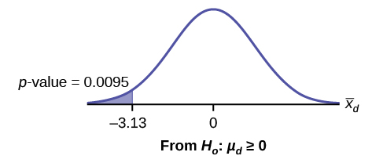
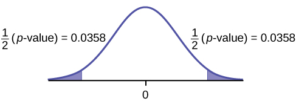
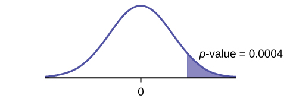
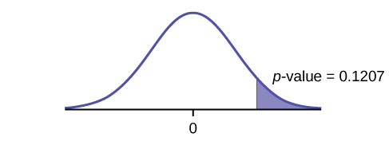

When using a hypothesis test for matched or paired samples, the following characteristics should be present:

1.  Simple random sampling is used.
2.  Sample sizes are often small.
3.  Two measurements (samples) are drawn from the same pair of individuals or objects.
4.  Differences are calculated from the matched or paired samples.
5.  The differences form the sample that is used for the hypothesis test.
6.  Either the matched pairs have differences that come from a population that is normal or the number of differences is sufficiently large so that distribution of the sample mean of differences is approximately normal.

In a hypothesis test for matched or paired samples, subjects are matched in pairs and differences are calculated. The differences are the data. The population mean for the differences, *μd*, is then tested using a Student\'s-t test for a single population mean with *n* – 1 degrees of freedom, where *n* is the number of differences.

The test statistic (*t*-score) is:

<math xmlns="http://www.w3.org/1998/Math/MathML"> <mrow> <mi>t</mi><mo>=</mo><mfrac> <mrow> <msub> <mover accent="true"> <mi>x</mi> <mo>¯</mo> </mover> <mi>d</mi> </msub> <mo>−</mo><msub> <mi>μ</mi> <mi>d</mi> </msub> </mrow> <mrow> <mrow><mo>(</mo> <mrow> <mfrac> <mrow> <msub> <mi>s</mi> <mi>d</mi> </msub> </mrow> <mrow> <msqrt> <mi>n</mi> </msqrt> </mrow> </mfrac> </mrow> <mo>)</mo></mrow> </mrow> </mfrac> </mrow> </math>

**** A study was conducted to investigate the effectiveness of hypnotism in reducing pain. Results for randomly selected subjects are shown in [[link]](#table-2345). A lower score indicates less pain. The "before" value is matched to an "after" value and the differences are calculated. The differences have a normal distribution. Are the sensory measurements, on average, lower after hypnotism? Test at a 5% significance level.

| Subject: | A | B | C | D | E | F | G | H |
|----------
| Before | 6.6 | 6.5 | 9.0 | 10.3 | 11.3 | 8.1 | 6.3 | 11.6 |
| After | 6.8 | 2.4 | 7.4 | 8.5 | 8.1 | 6.1 | 3.4 | 2.0 |
{: #table-2345 summary="This table presents results of subjects and effect of hypnotism in reducing pain. The second through ninth column are all subjects. The first row is for before and the second row is for after."}

Corresponding "before" and "after" values form matched pairs. (Calculate "after" – "before.")

| After Data | Before Data | Difference |
|----------
| 6.8 | 6.6 | 0.2 |
| 2.4 | 6.5 | -4.1 |
| 7.4 | 9 | -1.6 |
| 8.5 | 10.3 | -1.8 |
| 8.1 | 11.3 | -3.2 |
| 6.1 | 8.1 | -2 |
| 3.4 | 6.3 | -2.9 |
| 2 | 11.6 | -9.6 |
{: #table-25832 summary="This table shows the after data in the first column, before data in the second column, and the difference in the third column."}

The data **for the test** are the differences: {0.2, –4.1, –1.6, –1.8, –3.2, –2, –2.9, –9.6}

The sample mean and sample standard deviation of the differences are: <math xmlns="http://www.w3.org/1998/Math/MathML"> <mspace width="20pt" /> <apply> <conjugate /> <msub> <ci>x</ci> <mi>d</mi> </msub> </apply> <mo>=</mo> <mn>–3.13</mn> </math>

 and <math xmlns="http://www.w3.org/1998/Math/MathML"> <msub> <mi>s</mi> <mi>d</mi> </msub> <mo>=</mo> <mn>2.91</mn> </math>

 Verify these values.

Let <math xmlns="http://www.w3.org/1998/Math/MathML"> <msub> <mi>μ</mi> <mi>d</mi> </msub> </math>

 be the population mean for the differences. We use the subscript <math xmlns="http://www.w3.org/1998/Math/MathML"><mi>d</mi></math>

 to denote "differences."

**Random variable:** <math xmlns="http://www.w3.org/1998/Math/MathML"> <mrow> <msub> <mover accent="true"> <mi>X</mi> <mo>¯</mo> </mover> <mi>d</mi> </msub> </mrow> </math>

 = the mean difference of the sensory measurements

*H0*: *μd* ≥ 0

The null hypothesis is zero or positive, meaning that there is the same or more pain felt after hypnotism. That means the subject shows no improvement. *μd* is the population mean of the differences.)

*Ha*: *μd* &lt; 0

The alternative hypothesis is negative, meaning there is less pain felt after hypnotism. That means the subject shows improvement. The score should be lower after hypnotism, so the difference ought to be negative to indicate improvement.

**Distribution for the test:** The distribution is a Student's *t* with *df* = *n* – 1 = 8 – 1 = 7. Use *t*7. **(Notice that the test is for a single population mean.)**

**Calculate the *p*-value using the Student's-t distribution:** *p*-value = 0.0095

**Graph:**

{: #hyptest22_samp1}

<math xmlns="http://www.w3.org/1998/Math/MathML"> <mrow> <msub> <mover accent="true"> <mi>X</mi> <mo>¯</mo> </mover> <mi>d</mi> </msub> </mrow> </math>

 is the random variable for the differences.

The sample mean and sample standard deviation of the differences are:

<math xmlns="http://www.w3.org/1998/Math/MathML"> <mrow> <msub> <mover accent="true"> <mi>x</mi> <mo>¯</mo> </mover> <mi>d</mi> </msub> </mrow> </math>

 = –3.13

<math xmlns="http://www.w3.org/1998/Math/MathML"> <mrow> <msub> <mover accent="true"> <mi>s</mi> <mo>¯</mo> </mover> <mi>d</mi> </msub> </mrow> </math>

 = 2.91

**Compare *α* and the *p*-value:** *α* = 0.05 and *p*-value = 0.0095. *α* &gt; *p*-value.

**Make a decision:** Since *α* &gt; *p*-value, reject *H0*. This means that *μd* &lt; 0 and there is improvement.

**Conclusion:** At a 5% level of significance, from the sample data, there is sufficient evidence to conclude that the sensory measurements, on average, are lower after hypnotism. Hypnotism appears to be effective in reducing pain.

Note

For the TI-83+ and TI-84 calculators, you can either calculate the differences ahead of time (**after - before**) and put the differences into a list or you can put the **after** data into a first list and the **before** data into a second list. Then go to a third list and arrow up to the name. Enter 1st list name - 2nd list name. The calculator will do the subtraction, and you will have the differences in the third list.

Use your list of differences as the data. Press `STAT` and arrow over to `TESTS`. Press `2:T-Test`. Arrow over to `Data` and press `ENTER`. Arrow down and enter `0` for <math xmlns="http://www.w3.org/1998/Math/MathML"><msub><mi>μ</mi><mi>0</mi></msub></math>

, the name of the list where you put the data, and `1` for Freq:. Arrow down to `μ`: and arrow over to `<` <math xmlns="http://www.w3.org/1998/Math/MathML"><msub><mi>μ</mi><mi>0</mi></msub></math>

. Press `ENTER`. Arrow down to `Calculate` and press `ENTER`. The *p*-value is 0.0094, and the test statistic is -3.04. Do these instructions again except, arrow to `Draw` (instead of `Calculate`). Press `ENTER`.

Try It

A study was conducted to investigate how effective a new diet was in lowering cholesterol. Results for the randomly selected subjects are shown in the table. The differences have a normal distribution. Are the subjects’ cholesterol levels lower on average after the diet? Test at the 5% level.

| Subject | A | B | C | D | E | F | G | H | I |
| Before | 209 | 210 | 205 | 198 | 216 | 217 | 238 | 240 | 222 |
| After | 199 | 207 | 189 | 209 | 217 | 202 | 211 | 223 | 201 |
{: summary=""}

A college football coach was interested in whether the college\'s strength development class increased his players\' maximum lift (in pounds) on the bench press exercise. He asked four of his players to participate in a study. The amount of weight they could each lift was recorded before they took the strength development class. After completing the class, the amount of weight they could each lift was again measured. The data are as follows:

| Weight (in pounds) | Player 1 | Player 2 | Player 3 | Player 4 |
|----------
| Amount of weight lifted prior to the class | 205 | 241 | 338 | 368 |
| Amount of weight lifted after the class | 295 | 252 | 330 | 360 |
{: #table-234678 summary="This table shows players and the amount of weight they are able to lift. The first column is the weight lifted and the second through the sixth columns represent the players. The first row is the amount of weight lifted before the class and the second row is the amount of weight lifted after the class."}

**The coach wants to know if the strength development class makes his players stronger, on average.** * * *
{: data-type="newline"}

Record the **differences** data. Calculate the differences by subtracting the amount of weight lifted prior to the class from the weight lifted after completing the class. The data for the differences are: \{90, 11, -8, -8}. Assume the differences have a normal distribution.

Using the differences data, calculate the sample mean and the sample standard deviation.

<math xmlns="http://www.w3.org/1998/Math/MathML"> <mrow> <msub> <mover accent="true"> <mi>x</mi> <mo>¯</mo> </mover> <mi>d</mi> </msub> </mrow> </math>

 = 21.3, *sd* = 46.7

Note

The data given here would indicate that the distribution is actually right-skewed. The difference 90 may be an extreme outlier? It is pulling the sample mean to be 21.3 (positive). The means of the other three data values are actually negative.

Using the difference data, this becomes a test of a single \\\_\\\_\\\_\\\_\\\_\\\_\\\_\\\_\\\_\\\_ (fill in the blank).

**Define the random variable:** <math xmlns="http://www.w3.org/1998/Math/MathML"> <mrow> <msub> <mover accent="true"> <mi>X</mi> <mo>¯</mo> </mover> <mi>d</mi> </msub> </mrow> </math>

 mean difference in the maximum lift per player.

The distribution for the hypothesis test is *t3*.

*H0*\: *μd* ≤ 0, *Ha*\: *μd* &gt; 0

**Graph:**

{: #hyptest22_samp2}

**Calculate the *p*-value:** The *p*-value is 0.2150

**Decision:** If the level of significance is 5%, the decision is not to reject the null hypothesis, because α &lt; *p*-value.

**What is the conclusion?**

At a 5% level of significance, from the sample data, there is not sufficient evidence to conclude that the strength development class helped to make the players stronger, on average.

Try It

A new prep class was designed to improve SAT test scores. Five students were selected at random. Their scores on two practice exams were recorded, one before the class and one after. The data recorded in [[link]](#fs-idp42085840). Are the scores, on average, higher after the class? Test at a 5% level.

| SAT Scores | Student 1 | Student 2 | Student 3 | Student 4 |
|----------
| Score before class | 1840 | 1960 | 1920 | 2150 |
| Score after class | 1920 | 2160 | 2200 | 2100 |
{: summary=""}

Seven eighth graders at Kennedy Middle School measured how far they could push the shot-put with their dominant (writing) hand and their weaker (non-writing) hand. They thought that they could push equal distances with either hand. The data were collected and recorded in [\[link\]](#table-2535678).

| Distance (in feet) using | Student 1 | Student 2 | Student 3 | Student 4 | Student 5 | Student 6 | Student 7 |
|----------
{: valign="top"}| Dominant Hand | 30 | 26 | 34 | 17 | 19 | 26 | 20 |
| Weaker Hand | 28 | 14 | 27 | 18 | 17 | 26 | 16 |
{: valign="top"}{: #table-2535678 summary="This table presents the students shot-put distances by their dominant and non-dominant hand. The first column lists the hand type and the second through the eighth column represent the students. The first row is for the dominant hand and the second row is for the weaker hand."}

<!--MAGTULOY DITO...-->

Conduct a hypothesis test to determine whether the mean difference in distances between the children’s dominant versus weaker hands is significant.

Record the **differences** data. Calculate the differences by subtracting the distances with the weaker hand from the distances with the dominant hand. The data for the differences are: \{2, 12, 7, –1, 2, 0, 4}. The differences have a normal distribution.

Using the differences data, calculate the sample mean and the sample standard deviation. <math xmlns="http://www.w3.org/1998/Math/MathML"> <mrow> <msub> <mover accent="true"> <mi>x</mi> <mo>¯</mo> </mover> <mi>d</mi> </msub> </mrow> </math>

 = 3.71, <math xmlns="http://www.w3.org/1998/Math/MathML"> <mrow> <msub> <mi>s</mi> <mi>d</mi> </msub> </mrow> </math>

 = 4.5.

**Random variable:** <math xmlns="http://www.w3.org/1998/Math/MathML"> <mrow> <msub> <mover accent="true"> <mi>X</mi> <mo>¯</mo> </mover> <mi>d</mi> </msub> </mrow> </math>

 = mean difference in the distances between the hands.

**Distribution for the hypothesis test:** *t6*

*H*0\: *μd* = 0 *H*{::}*a*\: *μ*{::}*d* ≠ 0

**Graph:**

{:}

**Calculate the *p*-value:** The *p*-value is 0.0716 (using the data directly).

(test statistic = 2.18. *p*-value = 0.0719 using <math xmlns="http://www.w3.org/1998/Math/MathML"> <mrow> <mrow><mo>(</mo> <mrow> <msub> <mover accent="true"> <mi>x</mi> <mo>¯</mo> </mover> <mi>d</mi> </msub> <mo>=</mo><mn>3.71</mn><mo>,</mo><mtext> </mtext><msub> <mi>s</mi> <mi>d</mi> </msub> <mo>=</mo><mn>4.5.</mn> </mrow> <mo>)</mo></mrow> </mrow> </math>

**Decision:** Assume *α* = 0.05. Since *α* &lt; *p*-value, Do not reject *H0*.

**Conclusion:** At the 5% level of significance, from the sample data, there is not sufficient evidence to conclude that there is a difference in the children’s weaker and dominant hands to push the shot-put.

Try-It

Five ball players think they can throw the same distance with their dominant hand (throwing) and off-hand (catching hand). The data were collected and recorded in [[link]](#fs-idp26621360). Conduct a hypothesis test to determine whether the mean difference in distances between the dominant and off-hand is significant. Test at the 5% level.

|  | Player 1 | Player 2 | Player 3 | Player 4 | Player 5 |
|----------
| Dominant Hand | 120 | 111 | 135 | 140 | 125 |
| Off-hand | 105 | 109 | 98 | 111 | 99 |
{: summary=""}

### Chapter Review

A hypothesis test for matched or paired samples (t-test) has these characteristics:

* Test the differences by subtracting one measurement from the other measurement
* Random Variable:
  <math xmlns="http://www.w3.org/1998/Math/MathML"> <mrow> <msub> <mover accent="true"> <mi>x</mi> <mo>¯</mo> </mover> <mi>d</mi> </msub> </mrow> </math>
  
  = mean of the differences
* Distribution: Student’s-t distribution with *n* – 1 degrees of freedom
* If the number of differences is small (less than 30), the differences must follow a normal distribution.
* Two samples are drawn from the same set of objects.
* Samples are dependent.

### Formula Review

Test Statistic (*t*-score): *t* = <math xmlns="http://www.w3.org/1998/Math/MathML"> <mrow> <mfrac> <mrow> <msub> <mover accent="true"> <mi>x</mi> <mo>¯</mo> </mover> <mi>d</mi> </msub> <mo>−</mo><msub> <mi>μ</mi> <mi>d</mi> </msub> </mrow> <mrow> <mrow><mo>(</mo> <mrow> <mfrac> <mrow> <msub> <mi>s</mi> <mi>d</mi> </msub> </mrow> <mrow> <msqrt> <mi>n</mi> </msqrt> </mrow> </mfrac> </mrow> <mo>)</mo></mrow> </mrow> </mfrac> </mrow> </math>

where:

<math xmlns="http://www.w3.org/1998/Math/MathML"> <mrow> <msub> <mover accent="true"> <mi>x</mi> <mo>¯</mo> </mover> <mi>d</mi> </msub> </mrow> </math>

 is the mean of the sample differences. *μ*d is the mean of the population differences. *sd* is the sample standard deviation of the differences. *n* is the sample size.

<section data-depth="1" class="practice" markdown="1">
*Use the following information to answer the next five exercises.* A study was conducted to test the effectiveness of a software patch in reducing system failures over a six-month period. Results for randomly selected installations are shown in [\[link\]](#fs-idp116025200). The “before” value is matched to an “after” value, and the differences are calculated. The differences have a normal distribution. Test at the 1% significance level.

| Installation | A | B | C | D | E | F | G | H |
|----------
| Before | 3 | 6 | 4 | 2 | 5 | 8 | 2 | 6 |
| After | 1 | 5 | 2 | 0 | 1 | 0 | 2 | 2 |
{: summary=""}

What is the random variable?

the mean difference of the system failures

State the null and alternative hypotheses.

What is the *p*-value?

0\.0067

Draw the graph of the *p*-value.

What conclusion can you draw about the software patch?

With a *p*-value 0.0067, we can reject the null hypothesis. There is enough evidence to support that the software patch is effective in reducing the number of system failures.

* * *
{: data-type="newline"}

*Use the following information to answer next five exercises.* A study was conducted to test the effectiveness of a juggling class. Before the class started, six subjects juggled as many balls as they could at once. After the class, the same six subjects juggled as many balls as they could. The differences in the number of balls are calculated. The differences have a normal distribution. Test at the 1% significance level.

| Subject | A | B | C | D | E | F |
|----------
| Before | 3 | 4 | 3 | 2 | 4 | 5 |
| After | 4 | 5 | 6 | 4 | 5 | 7 |
{: summary=""}

State the null and alternative hypotheses.

What is the *p*-value?

0\.0021

What is the sample mean difference?

Draw the graph of the *p*-value.

{:}

What conclusion can you draw about the juggling class?

* * *
{: data-type="newline"}

*Use the following information to answer the next five exercises.* A doctor wants to know if a blood pressure medication is effective. Six subjects have their blood pressures recorded. After twelve weeks on the medication, the same six subjects have their blood pressure recorded again. For this test, only systolic pressure is of concern. Test at the 1% significance level.

| Patient | A | B | C | D | E | F |
|----------
| Before | 161 | 162 | 165 | 162 | 166 | 171 |
| After | 158 | 159 | 166 | 160 | 167 | 169 |
{: summary=""}

State the null and alternative hypotheses.

*H0*: *μd* ≥ 0

*Ha*: *μd* &lt; 0

What is the test statistic?

What is the *p*-value?

0\.0699

What is the sample mean difference?

What is the conclusion?

We decline to reject the null hypothesis. There is not sufficient evidence to support that the medication is effective.

</section>

### Homework

*DIRECTIONS: For each of the word problems, use a solution sheet to do the hypothesis test. The solution sheet is found in [Appendix E](/m47882). Please feel free to make copies of the solution sheets. For the online version of the book, it is suggested that you copy the .doc or the .pdf files.*

Note

If you are using a Student\'s *t*-distribution for the homework problems, including for paired data, you may assume that the underlying population is normally distributed. (When using these tests in a real situation, you must first prove that assumption, however.)

Ten individuals went on a low–fat diet for 12 weeks to lower their cholesterol. The data are recorded in [[link]](#fs-idp16051952). Do you think that their cholesterol levels were significantly lowered?

| Starting cholesterol level | Ending cholesterol level |
|----------
| 140 | 140 |
| 220 | 230 |
| 110 | 120 |
| 240 | 220 |
| 200 | 190 |
| 180 | 150 |
| 190 | 200 |
| 360 | 300 |
| 280 | 300 |
| 260 | 240 |
{: summary="The table presents the starting cholesterol level in the first row and the ending cholesterol level in the second row."}

*p*-value = 0.1494

At the 5% significance level, there is insufficient evidence to conclude that the medication lowered cholesterol levels after 12 weeks.

*Use the following information to answer the next two exercises.* A new AIDS prevention drug was tried on a group of 224 HIV positive patients. Forty-five patients developed AIDS after four years. In a control group of 224 HIV positive patients, 68 developed AIDS after four years. We want to test whether the method of treatment reduces the proportion of patients that develop AIDS after four years or if the proportions of the treated group and the untreated group stay the same.

Let the subscript *t* = treated patient and *ut* = untreated patient.

The appropriate hypotheses are:

1.  *H0*: *pt* &lt; *put* and *Ha*: *pt* ≥ *put*
2.  *H0*: *pt* ≤ *put* and *Ha*: *pt* &gt; *put*
3.  *H0*: *pt* = *put* and *Ha*: *pt* ≠ *put*
4.  *H0*: *pt* = *put* and *Ha*: *pt* &lt; *put*
{: type="a"}

If the *p*-value is 0.0062 what is the conclusion (use *α* = 0.05)?

1.  The method has no effect.
2.  There is sufficient evidence to conclude that the method reduces the proportion of HIV positive patients who develop AIDS after four years.
3.  There is sufficient evidence to conclude that the method increases the proportion of HIV positive patients who develop AIDS after four years.
4.  There is insufficient evidence to conclude that the method reduces the proportion of HIV positive patients who develop AIDS after four years.
{: type="a"}

b

*Use the following information to answer the next two exercises.* An experiment is conducted to show that blood pressure can be consciously reduced in people trained in a “biofeedback exercise program.” Six subjects were randomly selected and blood pressure measurements were recorded before and after the training. The difference between blood pressures was calculated (after - before) producing the following results: <math xmlns="http://www.w3.org/1998/Math/MathML"> <mrow> <msub> <mover accent="true"> <mi>x</mi> <mo>¯</mo> </mover> <mi>d</mi> </msub> </mrow> </math>

 = −10.2 *sd* = 8.4. Using the data, test the hypothesis that the blood pressure has decreased after the training.

The distribution for the test is:

1.  *t5*
2.  *t6*
3.  *N*(−10.2, 8.4)
4.  N(−10.2,
    <math xmlns="http://www.w3.org/1998/Math/MathML"> <mrow> <mfrac> <mrow> <mn>8.4</mn> </mrow> <mrow> <msqrt> <mn>6</mn> </msqrt> </mrow> </mfrac> </mrow> </math>
    
    )
{: type="a"}

If *α* = 0.05, the *p*-value and the conclusion are

1.  0\.0014; There is sufficient evidence to conclude that the blood pressure decreased after the training.
2.  0\.0014; There is sufficient evidence to conclude that the blood pressure increased after the training.
3.  0\.0155; There is sufficient evidence to conclude that the blood pressure decreased after the training.
4.  0\.0155; There is sufficient evidence to conclude that the blood pressure increased after the training.
{: type="a"}

c

A golf instructor is interested in determining if her new technique for improving players’ golf scores is effective. She takes four new students. She records their 18-hole scores before learning the technique and then after having taken her class. She conducts a hypothesis test. The data are as follows.

|  | Player 1 | Player 2 | Player 3 | Player 4 |
|----------
| Mean score before class | 83 | 78 | 93 | 87 |
| Mean score after class | 80 | 80 | 86 | 86 |
{: #eip-526 summary="..."}

The correct decision is:

1.  Reject *H0*.
2.  Do not reject the *H0*.
{: type="a"}

A local cancer support group believes that the estimate for new female breast cancer cases in the south is higher in 2013 than in 2012. The group compared the estimates of new female breast cancer cases by southern state in 2012 and in 2013. The results are in [[link]](#fs-idp20856160).

| Southern States | 2012 | 2013 |
|----------
| Alabama | 3,450 | 3,720 |
| Arkansas | 2,150 | 2,280 |
| Florida | 15,540 | 15,710 |
| Georgia | 6,970 | 7,310 |
| Kentucky | 3,160 | 3,300 |
| Louisiana | 3,320 | 3,630 |
| Mississippi | 1,990 | 2,080 |
| North Carolina | 7,090 | 7,430 |
| Oklahoma | 2,630 | 2,690 |
| South Carolina | 3,570 | 3,580 |
| Tennessee | 4,680 | 5,070 |
| Texas | 15,050 | 14,980 |
| Virginia | 6,190 | 6,280 |
{: summary=""}

Test: two matched pairs or paired samples (*t*-test)

Random variable: <math xmlns="http://www.w3.org/1998/Math/MathML"> <mrow> <msub> <mover accent="true"> <mi>X</mi> <mo>¯</mo> </mover> <mi>d</mi> </msub> </mrow> </math>

Distribution: *t*12

*H0*: *μ*{::}*d* = 0 *Ha*: *μ*{::}*d* &gt; 0

The mean of the differences of new female breast cancer cases in the south between 2013 and 2012 is greater than zero. The estimate for new female breast cancer cases in the south is higher in 2013 than in 2012.

Graph: right-tailed

*p*-value: 0.0004

{:}

Decision: Reject *H0*

Conclusion: At the 5% level of significance, from the sample data, there is sufficient evidence to conclude that there was a higher estimate of new female breast cancer cases in 2013 than in 2012.

A traveler wanted to know if the prices of hotels are different in the ten cities that he visits the most often. The list of the cities with the corresponding hotel prices for his two favorite hotel chains is in [[link]](#fs-idp126693504). Test at the 1% level of significance.

| Cities | Hyatt Regency prices in dollars | Hilton prices in dollars |
|----------
| Atlanta | 107 | 169 |
| Boston | 358 | 289 |
| Chicago | 209 | 299 |
| Dallas | 209 | 198 |
| Denver | 167 | 169 |
| Indianapolis | 179 | 214 |
| Los Angeles | 179 | 169 |
| New York City | 625 | 459 |
| Philadelphia | 179 | 159 |
| Washington, DC | 245 | 239 |
{: summary=""}

A politician asked his staff to determine whether the underemployment rate in the northeast decreased from 2011 to 2012. The results are in [[link]](#fs-idp10131504).

| Northeastern States | 2011 | 2012 |
|----------
| Connecticut | 17.3 | 16.4 |
| Delaware | 17.4 | 13.7 |
| Maine | 19.3 | 16.1 |
| Maryland | 16.0 | 15.5 |
| Massachusetts | 17.6 | 18.2 |
| New Hampshire | 15.4 | 13.5 |
| New Jersey | 19.2 | 18.7 |
| New York | 18.5 | 18.7 |
| Ohio | 18.2 | 18.8 |
| Pennsylvania | 16.5 | 16.9 |
| Rhode Island | 20.7 | 22.4 |
| Vermont | 14.7 | 12.3 |
| West Virginia | 15.5 | 17.3 |
{: summary=""}

Test: matched or paired samples (*t*-test)

Difference data: {–0.9, –3.7, –3.2, –0.5, 0.6, –1.9, –0.5, 0.2, 0.6, 0.4, 1.7, –2.4, 1.8}

Random Variable: <math xmlns="http://www.w3.org/1998/Math/MathML"> <mrow> <msub> <mover accent="true"> <mi>X</mi> <mo>¯</mo> </mover> <mi>d</mi> </msub> </mrow> </math>

Distribution: *H0*: *μd* = 0 *Ha*: *μd* &lt; 0

The mean of the differences of the rate of underemployment in the northeastern states between 2012 and 2011 is less than zero. The underemployment rate went down from 2011 to 2012.

Graph: left-tailed.

{:}

*p*-value: 0.1207

Decision: Do not reject *H0*.

Conclusion: At the 5% level of significance, from the sample data, there is not sufficient evidence to conclude that there was a decrease in the underemployment rates of the northeastern states from 2011 to 2012.

### Bringing It Together

*Use the following information to answer the next ten exercises.* indicate which of the following choices best identifies the hypothesis test.

1.  independent group means, population standard deviations and/or variances known
2.  independent group means, population standard deviations and/or variances unknown
3.  matched or paired samples
4.  single mean
5.  two proportions
6.  single proportion
{: type="a"}

A powder diet is tested on 49 people, and a liquid diet is tested on 36 different people. The population standard deviations are two pounds and three pounds, respectively. Of interest is whether the liquid diet yields a higher mean weight loss than the powder diet.

A new chocolate bar is taste-tested on consumers. Of interest is whether the proportion of children who like the new chocolate bar is greater than the proportion of adults who like it.

e

The mean number of English courses taken in a two–year time period by male and female college students is believed to be about the same. An experiment is conducted and data are collected from nine males and 16 females.

A football league reported that the mean number of touchdowns per game was five. A study is done to determine if the mean number of touchdowns has decreased.

d

A study is done to determine if students in the California state university system take longer to graduate than students enrolled in private universities. One hundred students from both the California state university system and private universities are surveyed. From years of research, it is known that the population standard deviations are 1.5811 years and one year, respectively.

According to a YWCA Rape Crisis Center newsletter, 75% of rape victims know their attackers. A study is done to verify this.

f

According to a recent study, U.S. companies have a mean maternity-leave of six weeks.

A recent drug survey showed an increase in use of drugs and alcohol among local high school students as compared to the national percent. Suppose that a survey of 100 local youths and 100 national youths is conducted to see if the proportion of drug and alcohol use is higher locally than nationally.

e

A new SAT study course is tested on 12 individuals. Pre-course and post-course scores are recorded. Of interest is the mean increase in SAT scores. The following data are collected:

| Pre-course score | Post-course score |
|----------
| 1 | 300 |
| 960 | 920 |
| 1010 | 1100 |
| 840 | 880 |
| 1100 | 1070 |
| 1250 | 1320 |
| 860 | 860 |
| 1330 | 1370 |
| 790 | 770 |
| 990 | 1040 |
| 1110 | 1200 |
| 740 | 850 |
{: #eip-idp6708160 summary=""}

University of Michigan researchers reported in the <cite>Journal of the National Cancer Institute</cite> that quitting smoking is especially beneficial for those under age 49. In this American Cancer Society study, the risk (probability) of dying of lung cancer was about the same as for those who had never smoked.

f

Lesley E. Tan investigated the relationship between left-handedness vs. right-handedness and motor competence in preschool children. Random samples of 41 left-handed preschool children and 41 right-handed preschool children were given several tests of motor skills to determine if there is evidence of a difference between the children based on this experiment. The experiment produced the means and standard deviations shown [[link]](#fs-idp128816944). Determine the appropriate test and best distribution to use for that test.

|  | Left-handed | Right-handed |
| Sample size | 41 | 41 |
| Sample mean | 97.5 | 98.1 |
| Sample standard deviation | 17.5 | 19.2 |
{: summary="..."}

1.  Two independent means, normal distribution
2.  Two independent means, Student’s-t distribution
3.  Matched or paired samples, Student’s-t distribution
4.  Two population proportions, normal distribution
{: type="a"}

A golf instructor is interested in determining if her new technique for improving players’ golf scores is effective. She takes four (4) new students. She records their 18-hole scores before learning the technique and then after having taken her class. She conducts a hypothesis test. The data are as [[link]](#fs-idp136885584).

|  | Player 1 | Player 2 | Player 3 | Player 4 |
|----------
| Mean score before class | 83 | 78 | 93 | 87 |
| Mean score after class | 80 | 80 | 86 | 86 |
{: summary="table question"}

This is:

1.  a test of two independent means.
2.  a test of two proportions.
3.  a test of a single mean.
4.  a test of a single proportion.
{: type="a"}

a

