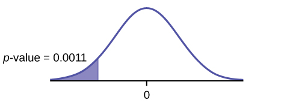
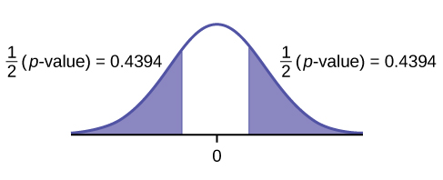
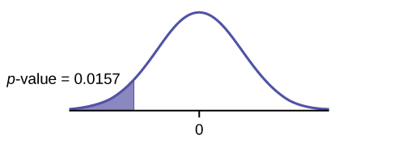

1.  The two independent samples are simple random samples from two distinct populations.
2.  For the two distinct populations:
    * if the sample sizes are small, the distributions are important (should be normal)
    * if the sample sizes are large, the distributions are not important (need not be normal)

The test comparing two independent population means with unknown and possibly unequal population standard deviations is called the Aspin-Welch t-test. The degrees of freedom formula was developed by Aspin-Welch.

The comparison of two population means is very common. A difference between the two samples depends on both the means and the standard deviations. Very different means can occur by chance if there is great variation among the individual samples. In order to account for the variation, we take the difference of the sample means, <math xmlns="http://www.w3.org/1998/Math/MathML"> <apply> <conjugate /> <msub> <ci>X</ci> <cn>1</cn> </msub> </apply> </math>

 – <math xmlns="http://www.w3.org/1998/Math/MathML"> <apply> <conjugate /> <msub> <ci>X</ci> <cn>2</cn> </msub> </apply> </math>

, and divide by the standard error in order to standardize the difference. The result is a t-score test statistic.

Because we do not know the population standard deviations, we estimate them using the two sample standard deviations from our independent samples. For the hypothesis test, we calculate the estimated standard deviation, or **standard error**{: data-type="term"}, of **the difference in sample means**, <math xmlns="http://www.w3.org/1998/Math/MathML"> <apply> <conjugate /> <msub> <ci>X</ci> <cn>1</cn> </msub> </apply> </math>

 – <math xmlns="http://www.w3.org/1998/Math/MathML"> <apply> <conjugate /> <msub> <ci>X</ci> <cn>2</cn> </msub> </apply> </math>

. 

The standard error is:
<math xmlns="http://www.w3.org/1998/Math/MathML"> <msqrt> <mfrac> <mrow> <mo>(</mo> <msub> <mi>s</mi> <mn>1</mn> </msub> <msup> <mo>)</mo> <mn>2</mn> </msup> </mrow> <mrow> <msub> <mi>n</mi> <mn>1</mn> </msub> </mrow> </mfrac> <mo>+</mo> <mfrac> <mrow> <mo>(</mo> <msub> <mi>s</mi> <mn>2</mn> </msub> <msup> <mo>)</mo> <mn>2</mn> </msup> </mrow> <mrow> <msub> <mi>n</mi> <mn>2</mn> </msub> </mrow> </mfrac> </msqrt> </math>

The test statistic (*t*-score) is calculated as follows: 

<math xmlns="http://www.w3.org/1998/Math/MathML" display="block"> <mrow> <mfrac> <mrow> <mtext>(</mtext><msub> <mover accent="true"> <mi>x</mi> <mo>¯</mo> </mover> <mn>1</mn> </msub> <mo>–</mo><msub> <mover accent="true"> <mi>x</mi> <mo>¯</mo> </mover> <mn>2</mn> </msub> <mtext>)</mtext><mo>–</mo><mtext>(</mtext><msub> <mi>μ</mi> <mn>1</mn> </msub> <mo>–</mo><msub> <mi>μ</mi> <mn>2</mn> </msub> <mtext>)</mtext> </mrow> <mrow> <msqrt> <mrow> <mfrac> <mrow> <msup> <mrow> <mtext>(</mtext><msub> <mi>s</mi> <mn>1</mn> </msub> <mtext>)</mtext> </mrow> <mn>2</mn> </msup> </mrow> <mrow> <msub> <mi>n</mi> <mn>1</mn> </msub> </mrow> </mfrac> <mo>+</mo><mfrac> <mrow> <msup> <mrow> <mtext>(</mtext><msub> <mi>s</mi> <mn>2</mn> </msub> <mtext>)</mtext> </mrow> <mn>2</mn> </msup> </mrow> <mrow> <msub> <mi>n</mi> <mn>2</mn> </msub> </mrow> </mfrac> </mrow> </msqrt> </mrow> </mfrac> </mrow> </math>

 where: *s*1 and *s*2, the sample standard deviations, are estimates of *σ*1 and *σ*2, respectively. *σ*1 and *σ*1 are the unknown population standard deviations. <math xmlns="http://www.w3.org/1998/Math/MathML"> <apply> <conjugate /> <msub> <ci>x</ci> <ci>1</ci> </msub> </apply> </math>
 and <math xmlns="http://www.w3.org/1998/Math/MathML"> <apply> <conjugate /> <msub> <ci>x</ci> <ci>2</ci> </msub> </apply> </math>
 are the sample means. *μ*1 and *μ*2 are the population means. 

The number of **degrees of freedom (*df*)**{: data-type="term"} requires a somewhat complicated calculation. However, a computer or calculator calculates it easily. The *df* are not always a whole number. The test statistic calculated previously is approximated by the Student\'s *t*-distribution with *df* as follows: 

Degrees of freedom
<math xmlns="http://www.w3.org/1998/Math/MathML" display="block"> <mrow> <mi>d</mi><mi>f</mi><mo>=</mo><mfrac> <mrow> <msup> <mrow> <mrow><mo>(</mo> <mrow> <mfrac> <mrow> <msup> <mrow> <mo stretchy="false">(</mo><msub> <mi>s</mi> <mn>1</mn> </msub> <mo stretchy="false">)</mo> </mrow> <mn>2</mn> </msup> </mrow> <mrow> <msub> <mi>n</mi> <mn>1</mn> </msub> </mrow> </mfrac> <mo>+</mo><mfrac> <mrow> <msup> <mrow> <mo stretchy="false">(</mo><msub> <mi>s</mi> <mn>2</mn> </msub> <mo stretchy="false">)</mo> </mrow> <mn>2</mn> </msup> </mrow> <mrow> <msub> <mi>n</mi> <mn>2</mn> </msub> </mrow> </mfrac> </mrow> <mo>)</mo></mrow> </mrow> <mn>2</mn> </msup> </mrow> <mrow> <mrow><mo>(</mo> <mrow> <mfrac> <mn>1</mn> <mrow> <msub> <mi>n</mi> <mn>1</mn> </msub> <mo>–</mo><mn>1</mn> </mrow> </mfrac> </mrow> <mo>)</mo></mrow><msup> <mrow> <mrow><mo>(</mo> <mrow> <mfrac> <mrow> <mo stretchy="false">(</mo><msub> <mi>s</mi> <mn>1</mn> </msub> <mo stretchy="false">)</mo> </mrow> <mrow> <msub> <mi>n</mi> <mn>1</mn> </msub> </mrow> </mfrac> </mrow> <mo>)</mo></mrow> </mrow> <mn>2</mn> </msup> <mo>+</mo><mrow><mo>(</mo> <mrow> <mfrac> <mn>1</mn> <mrow> <msub> <mi>n</mi> <mn>2</mn> </msub> <mo>–</mo><mn>1</mn> </mrow> </mfrac> </mrow> <mo>)</mo></mrow><msup> <mrow> <mrow><mo>(</mo> <mrow> <mfrac> <mrow> <msup> <mrow> <mo stretchy="false">(</mo><msub> <mi>s</mi> <mn>2</mn> </msub> <mo stretchy="false">)</mo> </mrow> <mn>2</mn> </msup> </mrow> <mrow> <msub> <mi>n</mi> <mn>2</mn> </msub> </mrow> </mfrac> </mrow> <mo>)</mo></mrow> </mrow> <mn>2</mn> </msup> </mrow> </mfrac> </mrow> </math>

{: .finger}

When both sample sizes *n*1 and *n*2 are five or larger, the Student\'s *t* approximation is very good. Notice that the sample variances (*s*1)2 and (*s*2)2 are not pooled. (If the question comes up, do not pool the variances.) 

It is not necessary to compute this by hand. A calculator or computer easily computes it.

Independent groups

The average amount of time boys and girls aged seven to 11 spend playing sports each day is believed to be the same. A study is done and data are collected, resulting in the data in [\[link\]](#uid888). Each populations has a normal distribution.

|  | Sample Size | Average Number of Hours Playing Sports Per Day | Sample Standard Deviation |
|----------
{: valign="top"}| Girls | 9 | 2 | <math xmlns="http://www.w3.org/1998/Math/MathML"><msqrt><mn>0.866</mn></msqrt></math>

 |
| Boys | 16 | 3.2 | 1.00 |
{: valign="top"}{: #uid888 summary="This table presents the sample size in the second column, average hours a day in the third column, and the sample standard deviation in the fourth column. The first row is for girls and the second row is for boys."}

Is there a difference in the mean amount of time boys and girls aged seven to 11 play sports each day? Test at the 5% level of significance.

**The population standard deviations are not known.** Let *g* be the subscript for girls and *b* be the subscript for boys. Then, *μg* is the population mean for girls and *μb* is the population mean for boys. This is a test of two **independent groups**, two population **means**.

**Random variable**{: data-type="term"}: <math xmlns="http://www.w3.org/1998/Math/MathML" display=""> <mrow> <msub> <mrow> <mover accent="true"> <mi>X</mi> <mo stretchy="true">¯</mo> </mover> </mrow> <mi>g</mi> </msub> <mo>−</mo><msub> <mrow> <mover accent="true"> <mi>X</mi> <mo stretchy="true">¯</mo> </mover> </mrow> <mi>b</mi> </msub> </mrow> </math>

 = difference in the sample mean amount of time girls and boys play sports each day. * * *
{: data-type="newline"}

*H*0: *μg* = *μb*  *H0*: *μg* – *μb* = 0 * * *
{: data-type="newline"}

*Ha*: *μg* ≠ *μb*  *Ha*: *μg* – *μb* ≠ 0 * * *
{: data-type="newline"}

The words **"the same"** tell you *H0* has an "=". Since there are no other words to indicate *Ha*, assume it says **"is different."** This is a two-tailed test.

**Distribution for the test:** Use *tdf* where *df* is calculated using the *df* formula for independent groups, two population means. Using a calculator, *df* is approximately 18.8462. **Do not pool the variances.**

**Calculate the *p*-value using a Student's *t*-distribution:** *p*-value = 0.0054

**Graph:**

{: #hyptest22_cmp1 data-media-type="image/jpg"}

* * *
{: data-type="newline"}

<math xmlns="http://www.w3.org/1998/Math/MathML"> <mrow> <msub> <mi>s</mi> <mi>g</mi> </msub> <mo>=</mo><msqrt> <mrow> <mn>0.866</mn> </mrow> </msqrt> </mrow> </math>

 * * *
{: data-type="newline"}

<math xmlns="http://www.w3.org/1998/Math/MathML"> <msub> <mi>s</mi> <mi>b</mi> </msub> <mo>=</mo> <mn>1</mn> </math>

 * * *
{: data-type="newline"}

So, <math xmlns="http://www.w3.org/1998/Math/MathML"> <mrow> <msub> <mover accent="true"> <mi>x</mi> <mo>¯</mo> </mover> <mi>g</mi> </msub> <mo>–</mo><msub> <mover accent="true"> <mi>x</mi> <mo>¯</mo> </mover> <mi>b</mi> </msub> </mrow> </math>

 = 2 – 3.2 = –1.2 * * *
{: data-type="newline"}

Half the *p*-value is below –1.2 and half is above 1.2.

**Make a decision:** Since *α* &gt; *p*-value, reject *H0*. This means you reject *μg* = *μb*. The means are different.

Press `STAT`. Arrow over to `TESTS` and press `4:2-SampTTest`. Arrow over to Stats and press `ENTER`. Arrow down and enter `2` for the first sample mean, `

0.75

` for Sx1, `9` for n1, `3.2` for the second sample mean, `1` for Sx2, and `16` for n2. Arrow down to μ1: and arrow to `does not equal` μ2. Press `ENTER`. Arrow down to Pooled: and `No`. Press `ENTER`. Arrow down to `Calculate` and press `ENTER`. The *p*-value is *p* = 0.0054, the dfs are approximately 18.8462, and the test statistic is -3.14. Do the procedure again but instead of Calculate do Draw.

**Conclusion:** At the 5% level of significance, the sample data show there is sufficient evidence to conclude that the mean number of hours that girls and boys aged seven to 11 play sports per day is different (mean number of hours boys aged seven to 11 play sports per day is greater than the mean number of hours played by girls OR the mean number of hours girls aged seven to 11 play sports per day is greater than the mean number of hours played by boys).

Try It

Two samples are shown in [[link]](#fs-idm99631856). Both have normal distributions. The means for the two populations are thought to be the same. Is there a difference in the means? Test at the 5% level of significance.

|  | Sample Size | Sample Mean | Sample Standard Deviation |
|----------
| Population A | 25 | 5 | 1 |
| Population B | 16 | 4.7 | 1.2 |
{: summary=""}

The *p*-value is 0.4125, which is much higher than 0.05, so we decline to reject the null hypothesis. There is not sufficient evidence to conclude that the means of the two populations are not the same.

NOTE

When the sum of the sample sizes is larger than 30 (*n*1 + *n*2 &gt; 30) you can use the normal distribution to approximate the Student\'s *t*.

A study is done by a community group in two neighboring colleges to determine which one graduates students with more math classes. College A samples 11 graduates. Their average is four math classes with a standard deviation of 1.5 math classes. College B samples nine graduates. Their average is 3.5 math classes with a standard deviation of one math class. The community group believes that a student who graduates from college A **has taken more math classes,** on the average. Both populations have a normal distribution. Test at a 1% significance level. Answer the following questions.* * *
{: data-type="newline" data-count="2"}

a. Is this a test of two means or two proportions?

a. two means* * *
{: data-type="newline" data-count="2"}

b. Are the populations standard deviations known or unknown?

b. unknown* * *
{: data-type="newline" data-count="2"}

c. Which distribution do you use to perform the test?

c. Student's *t** * *
{: data-type="newline" data-count="2"}

d. What is the random variable?

d. <math xmlns="http://www.w3.org/1998/Math/MathML"> <mrow> <msub> <mover accent="true"> <mi>X</mi> <mo>¯</mo> </mover> <mi>A</mi> </msub> <mo>-</mo><msub> <mover accent="true"> <mi>X</mi> <mo>¯</mo> </mover> <mi>B</mi> </msub> </mrow> </math>

* * *
{: data-type="newline" data-count="2"}

e. What are the null and alternate hypotheses? Write the null and alternate hypotheses in words and in symbols.

e.   <math xmlns="http://www.w3.org/1998/Math/MathML"> <mrow> <msub> <mi>H</mi> <mi>o</mi> </msub> <mo>:</mo><msub> <mi>μ</mi> <mi>A</mi> </msub> <mo>≤</mo><msub> <mi>μ</mi> <mi>B</mi> </msub> </mrow> </math>
   <math xmlns="http://www.w3.org/1998/Math/MathML"> <mrow> <msub> <mi>H</mi> <mi>a</mi> </msub> <mo>:</mo><msub> <mi>μ</mi> <mi>A</mi> </msub> <mo>&gt;</mo><msub> <mi>μ</mi> <mi>B</mi> </msub> </mrow> </math>
  * * *
{: data-type="newline" data-count="2"}

f. Is this test right-, left-, or two-tailed?

f. {: #eip-idm29208032 data-media-type="image/jpg"}

* * *
{: data-type="newline"}

right* * *
{: data-type="newline" data-count="2"}

g. What is the *p*-value?

g. 0.1928* * *
{: data-type="newline" data-count="2"}

h. Do you reject or not reject the null hypothesis?

h. Do not reject.* * *
{: data-type="newline" data-count="2"}

i. **Conclusion:**

i. At the 1% level of significance, from the sample data, there is not sufficient evidence to conclude that a student who graduates from college A has taken more math classes, on the average, than a student who graduates from college B.

Try It

A study is done to determine if Company A retains its workers longer than Company B. Company A samples 15 workers, and their average time with the company is five years with a standard deviation of 1.2. Company B samples 20 workers, and their average time with the company is 4.5 years with a standard deviation of 0.8. The populations are normally distributed.

1.  Are the population standard deviations known?
2.  Conduct an appropriate hypothesis test. At the 5% significance level, what is your conclusion?
{: data-number-style="lower-alpha"}

1.  They are unknown.
2.  The *p*-value = 0.0878. At the 5% level of significance, there is insufficient evidence to conclude that the workers of Company A stay longer with the company.
{: data-number-style="lower-alpha"}

A professor at a large community college wanted to determine whether there is a difference in the means of final exam scores between students who took his statistics course online and the students who took his face-to-face statistics class. He believed that the mean of the final exam scores for the online class would be lower than that of the face-to-face class. Was the professor correct? The randomly selected 30 final exam scores from each group are listed in [\[link\]](#fs-idm34056944) and [\[link\]](#fs-idm124378288).

<table summary=""><caption>Online Class</caption><tbody>
<tr>
<td>67.6</td>
<td>41.2</td>
<td>85.3</td>
<td>55.9</td>
<td>82.4</td>
<td>91.2</td>
<td>73.5</td>
<td>94.1</td>
<td>64.7</td>
<td>64.7</td>
</tr>    
<tr>
<td>70.6</td>
<td>38.2</td>
<td>61.8</td>
<td>88.2</td>
<td>70.6</td>
<td>58.8</td>
<td>91.2</td>
<td>73.5</td>
<td>82.4</td>
<td>35.5</td>
</tr>
<tr>
<td>94.1</td>
<td>88.2</td>
<td>64.7</td>
<td>55.9</td>
<td>88.2</td>
<td>97.1</td>
<td>85.3</td>
<td>61.8</td>
<td>79.4</td>
<td>79.4</td>
</tr>
</tbody></table>
<table summary=""><caption>Face-to-face Class</caption><tbody>
<tr>
<td>77.9</td>
<td>95.3</td>
<td>81.2</td>
<td>74.1</td>
<td>98.8</td>
<td>88.2</td>
<td>85.9</td>
<td>92.9</td>
<td>87.1</td>
<td>88.2</td>
</tr>
<tr>
<td>69.4</td>
<td>57.6</td>
<td>69.4</td>
<td>67.1</td>
<td>97.6</td>
<td>85.9</td>
<td>88.2</td>
<td>91.8</td>
<td>78.8</td>
<td>71.8</td>
</tr>
<tr>
<td>98.8</td>
<td>61.2</td>
<td>92.9</td>
<td>90.6</td>
<td>97.6</td>
<td>100</td>
<td>95.3</td>
<td>83.5</td>
<td>92.9</td>
<td>89.4</td>
</tr>
</tbody></table>

Is the mean of the Final Exam scores of the online class lower than the mean of the Final Exam scores of the face-to-face class? Test at a 5% significance level. Answer the following questions:

1.  Is this a test of two means or two proportions?
2.  Are the population standard deviations known or unknown?
3.  Which distribution do you use to perform the test?
4.  What is the random variable?
5.  What are the null and alternative hypotheses? Write the null and alternative hypotheses in words and in symbols.
6.  Is this test right, left, or two tailed?
7.  What is the *p*-value?
8.  Do you reject or not reject the null hypothesis?
9.  At the ___ level of significance, from the sample data, there ______ (is/is not) sufficient evidence to conclude that ______.
{: data-number-style="lower-alpha"}

(See the conclusion in [[link]](#element-968), and write yours in a similar fashion)

First put the data for each group into two lists (such as L1 and L2). Press STAT. Arrow over to TESTS and press 4:2SampTTest. Make sure Data is highlighted and press ENTER. Arrow down and enter L1 for the first list and L2 for the second list. Arrow down to *μ*1: and arrow to ≠ *μ*2 (does not equal). Press ENTER. Arrow down to Pooled: No. Press ENTER. Arrow down to Calculate and press ENTER.

Note

Be careful not to mix up the information for Group 1 and Group 2!

1.  two means
2.  unknown
3.  Student's *t*
4.  <math xmlns="http://www.w3.org/1998/Math/MathML"> <mrow> <msub> <mover accent="true"> <mi>X</mi> <mo>¯</mo> </mover> <mn>1</mn> </msub> <mo>–</mo><msub> <mover accent="true"> <mi>X</mi> <mo>¯</mo> </mover> <mn>2</mn> </msub> </mrow> </math>

5.  1.  *H0*: *μ1* = *μ2* Null hypothesis: the means of the final exam scores are equal for the online and face-to-face statistics classes.
    2.  *Ha*: *μ1* &lt; *μ2* Alternative hypothesis: the mean of the final exam scores of the online class is less than the mean of the final exam scores of the face-to-face class.

6.  left-tailed
7.  *p*-value = 0.0011 {: data-media-type="image/jpg"}

8.  Reject the null hypothesis
9.  The professor was correct. The evidence shows that the mean of the final exam scores for the online class is lower than that of the face-to-face class.
    * * *
    {: data-type="newline"}
    
    At the
    <u data-effect="underline">5%</u>
    
    level of significance, from the sample data, there is (is/is not) sufficient evidence to conclude that the mean of the final exam scores for the online class is less than
    <u data-effect="underline">the mean of final exam scores of the face-to-face class.</u>
{: data-number-style="lower-alpha"}

Cohen\'s Standards for Small, Medium, and Large Effect Sizes**Cohen\'s *d***{: data-type="term"} is a measure of effect size based on the differences between two means. Cohen’s *d*, named for United States statistician Jacob Cohen, measures the relative strength of the differences between the means of two populations based on sample data. The calculated value of effect size is then compared to Cohen’s standards of small, medium, and large effect sizes.

<table summary=""><caption>Cohen's Standard Effect Sizes</caption><thead>
<tr>
<th>Size of effect</th>
<th><em>d</em></th>
</tr>
</thead><tbody>
<tr>
<td>Small</td>
<td>0.2</td>
</tr>
<tr>
<td>medium</td>
<td>0.5</td>
</tr>
<tr>
<td>Large</td>
<td>0.8</td>
</tr>
</tbody></table>

Cohen\'s *d* is the measure of the difference between two means divided by the pooled standard deviation: <math xmlns="http://www.w3.org/1998/Math/MathML"> <mrow> <mi>d</mi><mo>=</mo><mfrac> <mrow> <msub> <mover accent="true"> <mi>x</mi> <mo>¯</mo> </mover> <mn>1</mn> </msub> <mo>–</mo><msub> <mover accent="true"> <mi>x</mi> <mo>¯</mo> </mover> <mn>2</mn> </msub> </mrow> <mrow> <msub> <mi>s</mi> <mrow> <mi>p</mi><mi>o</mi><mi>o</mi><mi>l</mi><mi>e</mi><mi>d</mi> </mrow> </msub> </mrow> </mfrac> </mrow> </math>

 where <math xmlns="http://www.w3.org/1998/Math/MathML"> <mrow> <msub> <mi>s</mi> <mrow> <mi>p</mi><mi>o</mi><mi>o</mi><mi>l</mi><mi>e</mi><mi>d</mi> </mrow> </msub> <mo>=</mo><msqrt> <mrow> <mfrac> <mrow> <mo stretchy="false">(</mo><msub> <mi>n</mi> <mn>1</mn> </msub> <mo>–</mo><mn>1</mn><mo stretchy="false">)</mo><msubsup> <mi>s</mi> <mn>1</mn> <mn>2</mn> </msubsup> <mo>+</mo><mo stretchy="false">(</mo><msub> <mi>n</mi> <mn>2</mn> </msub> <mo>–</mo><mn>1</mn><mo stretchy="false">)</mo><msubsup> <mi>s</mi> <mn>2</mn> <mn>2</mn> </msubsup> </mrow> <mrow> <msub> <mi>n</mi> <mn>1</mn> </msub> <mo>+</mo><msub> <mi>n</mi> <mn>2</mn> </msub> <mo>–</mo><mn>2</mn> </mrow> </mfrac> </mrow> </msqrt> </mrow> </math>

Calculate Cohen’s *d* for [[link]](#element-968). Is the size of the effect small, medium, or large? Explain what the size of the effect means for this problem.

*μ*1 = 4 *s*1 = 1.5 *n*1 = 11 * * *
{: data-type="newline"}

*μ*2 = 3.5 *s*2 = 1 *n*2 = 9 * * *
{: data-type="newline"}

*d* = 0.384 * * *
{: data-type="newline"}

The effect is small because 0.384 is between Cohen’s value of 0.2 for small effect size and 0.5 for medium effect size. The size of the differences of the means for the two colleges is small indicating that there is not a significant difference between them.

Calculate Cohen’s *d* for [[link]](#fs-idm22935408). Is the size of the effect small, medium or large? Explain what the size of the effect means for this problem.

*d* = 0.834; Large, because 0.834 is greater than Cohen’s 0.8 for a large effect size. The size of the differences between the means of the Final Exam scores of online students and students in a face-to-face class is large indicating a significant difference.

Try It

Weighted alpha is a measure of risk-adjusted performance of stocks over a period of a year. A high positive weighted alpha signifies a stock whose price has risen while a small positive weighted alpha indicates an unchanged stock price during the time period. Weighted alpha is used to identify companies with strong upward or downward trends. The weighted alpha for the top 30 stocks of banks in the northeast and in the west as identified by Nasdaq on May 24, 2013 are listed in [\[link\]](#fs-idm242901296) and [\[link\]](#fs-idm167801152), respectively.

<table summary=""><caption>Northeast</caption><tbody>
<tr>
<td>94.2</td>
<td>75.2</td>
<td>69.6</td>
<td>52.0</td>
<td>48.0</td>
<td>41.9</td>
<td>36.4</td>
<td>33.4</td>
<td>31.5</td>
<td>27.6</td>
</tr>
<tr>
<td>77.3</td>
<td>71.9</td>
<td>67.5</td>
<td>50.6</td>
<td>46.2</td>
<td>38.4</td>
<td>35.2</td>
<td>33.0</td>
<td>28.7</td>
<td>26.5</td>
</tr>
<tr>
<td>76.3</td>
<td>71.7</td>
<td>56.3</td>
<td>48.7</td>
<td>43.2</td>
<td>37.6</td>
<td>33.7</td>
<td>31.8</td>
<td>28.5</td>
<td>26.0</td>
</tr>
</tbody></table>
<table summary=""><caption>West</caption><tbody>
<tr>
<td>126.0</td>
<td>70.6</td>
<td>65.2</td>
<td>51.4</td>
<td>45.5</td>
<td>37.0</td>
<td>33.0</td>
<td>29.6</td>
<td>23.7</td>
<td>22.6</td>
</tr>
<tr>
<td>116.1</td>
<td>70.6</td>
<td>58.2</td>
<td>51.2</td>
<td>43.2</td>
<td>36.0</td>
<td>31.4</td>
<td>28.7</td>
<td>23.5</td>
<td>21.6</td>
</tr>
<tr>
<td>78.2</td>
<td>68.2</td>
<td>55.6</td>
<td>50.3</td>
<td>39.0</td>
<td>34.1</td>
<td>31.0</td>
<td>25.3</td>
<td>23.4</td>
<td>21.5</td>
</tr>
</tbody></table>

Is there a difference in the weighted alpha of the top 30 stocks of banks in the northeast and in the west? Test at a 5% significance level. Answer the following questions:

1.  Is this a test of two means or two proportions?
2.  Are the population standard deviations known or unknown?
3.  Which distribution do you use to perform the test?
4.  What is the random variable?
5.  What are the null and alternative hypotheses? Write the null and alternative hypotheses in words and in symbols.
6.  Is this test right, left, or two tailed?
7.  What is the *p*-value?
8.  Do you reject or not reject the null hypothesis?
9.  At the ___ level of significance, from the sample data, there ______ (is/is not) sufficient evidence to conclude that ______.
10. Calculate Cohen’s *d* and interpret it.
{: data-number-style="lower-alpha"}

1.  two means
2.  unknown
3.  Student’s-t
4.  <math xmlns="http://www.w3.org/1998/Math/MathML" display=""> <mrow> <msub> <mover accent="true"> <mi>X</mi> <mo>¯</mo> </mover> <mn>1</mn> </msub> <mtext> - </mtext><msub> <mover accent="true"> <mi>X</mi> <mo>¯</mo> </mover> <mn>2</mn> </msub> </mrow> </math>

5.  1.  *H*0 : *μ*1 = *μ*2 Null hypothesis: the means of the weighted alphas are equal.
    2.  *H*a : *μ*1 ≠ *μ*2 Alternative hypothesis : the means of the weighted alphas are not equal.

6.  two-tailed
7.  *p*-value = 0.8787
8.  Do not reject the null hypothesis
9.  This indicates that the trends in stocks are about the same in the top 30 banks in each region. {: data-media-type="image/jpg"}

    <u data-effect="underline">5%</u>
    
    level of significance, from the sample data, there
    <u data-effect="underline">is not</u>
    
    sufficient evidence to conclude that
    <u data-effect="underline">the mean weighted alphas for the banks in the northeast and the west are different</u>

10. *d* = 0.040, Very small, because 0.040 is less than Cohen’s value of 0.2 for small effect size. The size of the difference of the means of the weighted alphas for the two regions of banks is small indicating that there is not a significant difference between their trends in stocks.
{: data-number-style="lower-alpha"}

# References   {#eip-137}

Data from Graduating Engineer + Computer Careers. Available online at http://www.graduatingengineer.com

Data from *Microsoft Bookshelf*.

Data from the United States Senate website, available online at www.Senate.gov (accessed June 17, 2013).

“List of current United States Senators by Age.” Wikipedia. Available online at http://en.wikipedia.org/wiki/List\_of\_current\_United\_States\_Senators\_by\_age (accessed June 17, 2013).

“Sectoring by Industry Groups.” Nasdaq. Available online at http://www.nasdaq.com/markets/barchart-sectors.aspx?page=sectors&amp;base=industry (accessed June 17, 2013).

“Strip Clubs: Where Prostitution and Trafficking Happen.” Prostitution Research and Education, 2013. Available online at www.prostitutionresearch.com/ProsViolPosttrauStress.html (accessed June 17, 2013).

“World Series History.” Baseball-Almanac, 2013. Available online at http://www.baseball-almanac.com/ws/wsmenu.shtml (accessed June 17, 2013).

# Chapter Review

Two population means from independent samples where the population standard deviations are not known

* Random Variable:
  <math xmlns="http://www.w3.org/1998/Math/MathML"> <mrow> <msub> <mover accent="true"> <mi>X</mi> <mo>¯</mo> </mover> <mn>1</mn> </msub> <mo>−</mo><msub> <mover accent="true"> <mi>X</mi> <mo>¯</mo> </mover> <mn>2</mn> </msub> </mrow> </math>
  
  = the difference of the sampling means
* Distribution: Student\'s *t*-distribution with degrees of freedom (variances not pooled)

# Formula Review

Standard error: *SE* = <math xmlns="http://www.w3.org/1998/Math/MathML"> <mrow> <msqrt> <mrow> <mfrac> <mrow> <msup> <mrow> <mo stretchy="false">(</mo><msub> <mi>s</mi> <mn>1</mn> </msub> <mo stretchy="false">)</mo> </mrow> <mn>2</mn> </msup> </mrow> <mrow> <msub> <mi>n</mi> <mn>1</mn> </msub> </mrow> </mfrac> <mo>+</mo><mfrac> <mrow> <msup> <mrow> <mo stretchy="false">(</mo><msub> <mi>s</mi> <mn>2</mn> </msub> <mo stretchy="false">)</mo> </mrow> <mn>2</mn> </msup> </mrow> <mrow> <msub> <mi>n</mi> <mn>2</mn> </msub> </mrow> </mfrac> </mrow> </msqrt> </mrow> </math>

Test statistic (*t*-score): *t* = <math xmlns="http://www.w3.org/1998/Math/MathML"> <mrow> <mfrac> <mrow> <mo stretchy="false">(</mo><msub> <mover accent="true"> <mi>x</mi> <mo>¯</mo> </mover> <mn>1</mn> </msub> <mo>−</mo><msub> <mover accent="true"> <mi>x</mi> <mo>¯</mo> </mover> <mn>2</mn> </msub> <mo stretchy="false">)</mo><mo>−</mo><mo stretchy="false">(</mo><msub> <mi>μ</mi> <mn>1</mn> </msub> <mo>−</mo><msub> <mi>μ</mi> <mn>2</mn> </msub> <mo stretchy="false">)</mo> </mrow> <mrow> <msqrt> <mrow> <mfrac> <mrow> <msup> <mrow> <mo stretchy="false">(</mo><msub> <mi>s</mi> <mn>1</mn> </msub> <mo stretchy="false">)</mo> </mrow> <mn>2</mn> </msup> </mrow> <mrow> <msub> <mi>n</mi> <mn>1</mn> </msub> </mrow> </mfrac> <mo>+</mo><mfrac> <mrow> <msup> <mrow> <mo stretchy="false">(</mo><msub> <mi>s</mi> <mn>2</mn> </msub> <mo stretchy="false">)</mo> </mrow> <mn>2</mn> </msup> </mrow> <mrow> <msub> <mi>n</mi> <mn>2</mn> </msub> </mrow> </mfrac> </mrow> </msqrt> </mrow> </mfrac> </mrow> </math>

Degrees of freedom:* * *
{: data-type="newline"}

 <math xmlns="http://www.w3.org/1998/Math/MathML"> <mrow> <mi>d</mi><mi>f</mi><mo>=</mo><mi>d</mi><mi>f</mi><mo>=</mo><mo> </mo><mfrac> <mrow> <msup> <mrow> <mrow><mo>(</mo> <mrow> <mfrac> <mrow> <msup> <mrow> <mo stretchy="false">(</mo><msub> <mi>s</mi> <mn>1</mn> </msub> <mo stretchy="false">)</mo> </mrow> <mn>2</mn> </msup> </mrow> <mrow> <msub> <mi>n</mi> <mn>1</mn> </msub> </mrow> </mfrac> <mo>+</mo><mo> </mo><mfrac> <mrow> <msup> <mrow> <mo stretchy="false">(</mo><msub> <mi>s</mi> <mn>2</mn> </msub> <mo stretchy="false">)</mo> </mrow> <mn>2</mn> </msup> </mrow> <mrow> <msub> <mi>n</mi> <mn>2</mn> </msub> </mrow> </mfrac> </mrow> <mo>)</mo></mrow> </mrow> <mn>2</mn> </msup> </mrow> <mrow> <mrow><mo>(</mo> <mrow> <mfrac> <mn>1</mn> <mrow> <msub> <mi>n</mi> <mn>1</mn> </msub> <mo>−</mo><mn>1</mn> </mrow> </mfrac> </mrow> <mo>)</mo></mrow><msup> <mrow> <mrow><mo>(</mo> <mrow> <mfrac> <mrow> <mo stretchy="false">(</mo><msub> <mi>s</mi> <mn>1</mn> </msub> <mo stretchy="false">)</mo> </mrow> <mrow> <msub> <mi>n</mi> <mn>1</mn> </msub> </mrow> </mfrac> </mrow> <mo>)</mo></mrow> </mrow> <mn>2</mn> </msup> <mo>+</mo><mrow><mo>(</mo> <mrow> <mfrac> <mn>1</mn> <mrow> <msub> <mi>n</mi> <mn>2</mn> </msub> <mo>−</mo><mn>1</mn> </mrow> </mfrac> </mrow> <mo>)</mo></mrow><msup> <mrow> <mrow><mo>(</mo> <mrow> <mfrac> <mrow> <msup> <mrow> <mo stretchy="false">(</mo><msub> <mi>s</mi> <mn>2</mn> </msub> <mo stretchy="false">)</mo> </mrow> <mn>2</mn> </msup> </mrow> <mrow> <msub> <mi>n</mi> <mn>2</mn> </msub> </mrow> </mfrac> </mrow> <mo>)</mo></mrow> </mrow> <mn>2</mn> </msup> </mrow> </mfrac> </mrow> </math>

where:

*s*1 and *s*2 are the sample standard deviations, and *n*1 and *n*2 are the sample sizes.

<math xmlns="http://www.w3.org/1998/Math/MathML"> <mrow> <msub> <mover accent="true"> <mi>x</mi> <mo>¯</mo> </mover> <mn>1</mn> </msub> </mrow> </math>

 and <math xmlns="http://www.w3.org/1998/Math/MathML"> <mrow> <msub> <mover accent="true"> <mi>x</mi> <mo>¯</mo> </mover> <mn>2</mn> </msub> </mrow> </math>

 are the sample means.

Cohen’s *d* is the measure of effect size:

<math xmlns="http://www.w3.org/1998/Math/MathML"> <mrow> <mi>d</mi><mo>=</mo><mfrac> <mrow> <msub> <mover accent="true"> <mi>x</mi> <mo>¯</mo> </mover> <mn>1</mn> </msub> <mo>−</mo><msub> <mover accent="true"> <mi>x</mi> <mo>¯</mo> </mover> <mn>2</mn> </msub> </mrow> <mrow> <msub> <mi>s</mi> <mrow> <mi>p</mi><mi>o</mi><mi>o</mi><mi>l</mi><mi>e</mi><mi>d</mi> </mrow> </msub> </mrow> </mfrac> </mrow> </math>

 * * *
{: data-type="newline"}

where <math xmlns="http://www.w3.org/1998/Math/MathML"> <mrow> <msub> <mi>s</mi> <mrow> <mi>p</mi><mi>o</mi><mi>o</mi><mi>l</mi><mi>e</mi><mi>d</mi> </mrow> </msub> <mo>=</mo><msqrt> <mrow> <mfrac> <mrow> <mo stretchy="false">(</mo><msub> <mi>n</mi> <mn>1</mn> </msub> <mo>−</mo><mn>1</mn><mo stretchy="false">)</mo><msubsup> <mi>s</mi> <mn>1</mn> <mn>2</mn> </msubsup> <mo>+</mo><mo stretchy="false">(</mo><msub> <mi>n</mi> <mn>2</mn> </msub> <mo>−</mo><mn>1</mn><mo stretchy="false">)</mo><msubsup> <mi>s</mi> <mn>2</mn> <mn>2</mn> </msubsup> </mrow> <mrow> <msub> <mi>n</mi> <mn>1</mn> </msub> <mo>+</mo><msub> <mi>n</mi> <mn>2</mn> </msub> <mo>−</mo><mn>2</mn> </mrow> </mfrac> </mrow> </msqrt> </mrow> </math>

<section data-depth="1" class="practice" markdown="1">
*Use the following information to answer the next 16 exercises:* Indicate if the hypothesis test is for

1.  independent group means, population standard deviations, and/or variances known
2.  independent group means, population standard deviations, and/or variances unknown
3.  matched or paired samples
4.  single mean
5.  two proportions
6.  single proportion
{: data-number-style="lower-alpha"}

It is believed that 70% of males pass their drivers test in the first attempt, while 65% of females pass the test in the first attempt. Of interest is whether the proportions are in fact equal.

two proportions

A new laundry detergent is tested on consumers. Of interest is the proportion of consumers who prefer the new brand over the leading competitor. A study is done to test this.

A new windshield treatment claims to repel water more effectively. Ten windshields are tested by simulating rain without the new treatment. The same windshields are then treated, and the experiment is run again. A hypothesis test is conducted.

matched or paired samples

The known standard deviation in salary for all mid-level professionals in the financial industry is $11,000. Company A and Company B are in the financial industry. Suppose samples are taken of mid-level professionals from Company A and from Company B. The sample mean salary for mid-level professionals in Company A is $80,000. The sample mean salary for mid-level professionals in Company B is $96,000. Company A and Company B management want to know if their mid-level professionals are paid differently, on average.

The average worker in Germany gets eight weeks of paid vacation.

single mean

According to a television commercial, 80% of dentists agree that Ultrafresh toothpaste is the best on the market.

It is believed that the average grade on an English essay in a particular school system for females is higher than for males. A random sample of 31 females had a mean score of 82 with a standard deviation of three, and a random sample of 25 males had a mean score of 76 with a standard deviation of four.

independent group means, population standard deviations and/or variances unknown

The league mean batting average is 0.280 with a known standard deviation of 0.06. The Rattlers and the Vikings belong to the league. The mean batting average for a sample of eight Rattlers is 0.210, and the mean batting average for a sample of eight Vikings is 0.260. There are 24 players on the Rattlers and 19 players on the Vikings. Are the batting averages of the Rattlers and Vikings statistically different?

In a random sample of 100 forests in the United States, 56 were coniferous or contained conifers. In a random sample of 80 forests in Mexico, 40 were coniferous or contained conifers. Is the proportion of conifers in the United States statistically more than the proportion of conifers in Mexico?

two proportions

A new medicine is said to help improve sleep. Eight subjects are picked at random and given the medicine. The means hours slept for each person were recorded before starting the medication and after.

It is thought that teenagers sleep more than adults on average. A study is done to verify this. A sample of 16 teenagers has a mean of 8.9 hours slept and a standard deviation of 1.2. A sample of 12 adults has a mean of 6.9 hours slept and a standard deviation of 0.6.

independent group means, population standard deviations and/or variances unknown

Varsity athletes practice five times a week, on average.

A sample of 12 in-state graduate school programs at school A has a mean tuition of $64,000 with a standard deviation of $8,000. At school B, a sample of 16 in-state graduate programs has a mean of $80,000 with a standard deviation of $6,000. On average, are the mean tuitions different?

independent group means, population standard deviations and/or variances unknown

A new WiFi range booster is being offered to consumers. A researcher tests the native range of 12 different routers under the same conditions. The ranges are recorded. Then the researcher uses the new WiFi range booster and records the new ranges. Does the new WiFi range booster do a better job?

A high school principal claims that 30% of student athletes drive themselves to school, while 4% of non-athletes drive themselves to school. In a sample of 20 student athletes, 45% drive themselves to school. In a sample of 35 non-athlete students, 6% drive themselves to school. Is the percent of student athletes who drive themselves to school more than the percent of nonathletes?

two proportions

* * *
{: data-type="newline"}

*Use the following information to answer the next three exercises:* A study is done to determine which of two soft drinks has more sugar. There are 13 cans of Beverage A in a sample and six cans of Beverage B. The mean amount of sugar in Beverage A is 36 grams with a standard deviation of 0.6 grams. The mean amount of sugar in Beverage B is 38 grams with a standard deviation of 0.8 grams. The researchers believe that Beverage B has more sugar than Beverage A, on average. Both populations have normal distributions.

Are the populations standard deviations known or unknown?

What is the random variable?

The random variable is the difference between the mean amounts of sugar in the two soft drinks.

Is this a one-tailed or two-tailed test?

* * *
{: data-type="newline"}

*Use the following information to answer the next 12 exercises:* The U.S. Center for Disease Control reports that the mean life expectancy was 47.6 years for whites born in 1900 and 33.0 years for nonwhites. Suppose that you randomly survey death records for people born in 1900 in a certain county. Of the 124 whites, the mean life span was 45.3 years with a standard deviation of 12.7 years. Of the 82 nonwhites, the mean life span was 34.1 years with a standard deviation of 15.6 years. Conduct a hypothesis test to see if the mean life spans in the county were the same for whites and nonwhites.

Is this a test of means or proportions?

means

State the null and alternative hypotheses.

1.  *H0*: __________
2.  *Ha*: __________
{: data-number-style="lower-alpha"}

Is this a right-tailed, left-tailed, or two-tailed test?

two-tailed

In symbols, what is the random variable of interest for this test?

In words, define the random variable of interest for this test.

the difference between the mean life spans of whites and nonwhites

Which distribution (normal or Student's *t*) would you use for this hypothesis test?

Explain why you chose the distribution you did for the [Exercise 24](#fs-idm17957104) question.

This is a comparison of two population means with unknown population standard deviations.

Calculate the test statistic and *p*-value.

Sketch a graph of the situation. Label the horizontal axis. Mark the hypothesized difference and the sample difference. Shade the area corresponding to the *p*-value.

Check student’s solution.

Find the *p*-value:

At a pre-conceived *α* = 0.05, what is your:  Decision: Reason for the decision: Conclusion (write out in a complete sentence): 

1.  Reject the null hypothesis
2.  *p*-value &lt; 0.05
3.  There is not enough evidence at the 5% level of significance to support the claim that life expectancy in the 1900s is different between whites and nonwhites.
{: data-number-style="lower-alpha"}

Does it appear that the means are the same? Why or why not?

</section>

# Homework

*DIRECTIONS: For each of the word problems, use a solution sheet to do the hypothesis test. The solution sheet is found in [14. Appendix (online book version: the link is \"Solution Sheets\"; PDF book version: look under 14.5 Solution Sheets)](/m47156). Please feel free to make copies of the solution sheets. For the online version of the book, it is suggested that you copy the .doc or the .pdf files.*

NOTE

If you are using a Student\'s *t*-distribution for a homework problem in what follows, including for paired data, you may assume that the underlying population is normally distributed. (When using these tests in a real situation, you must first prove that assumption, however.)

The mean number of English courses taken in a two–year time period by male and female college students is believed to be about the same. An experiment is conducted and data are collected from 29 males and 16 females. The males took an average of three English courses with a standard deviation of 0.8. The females took an average of four English courses with a standard deviation of 1.0. Are the means statistically the same?

A student at a four-year college claims that mean enrollment at four–year colleges is higher than at two–year colleges in the United States. Two surveys are conducted. Of the 35 two–year colleges surveyed, the mean enrollment was 5,068 with a standard deviation of 4,777. Of the 35 four-year colleges surveyed, the mean enrollment was 5,466 with a standard deviation of 8,191.

Subscripts: 1: two-year colleges; 2: four-year colleges

1.  *H0*: *μ1* ≥ *μ2*
2.  *Ha*: *μ1* &lt; *μ2*
3.  <math xmlns="http://www.w3.org/1998/Math/MathML"> <mrow> <msub> <mover accent="true"> <mi>X</mi> <mo>¯</mo> </mover> <mn>1</mn> </msub> <mo>–</mo><msub> <mover accent="true"> <mi>X</mi> <mo>¯</mo> </mover> <mn>2</mn> </msub> </mrow> </math>
    
    is the difference between the mean enrollments of the two-year colleges and the four-year colleges.
4.  Student’s-*t*
5.  test statistic: –0.2483
6.  *p*-value: 0.4024
7.  Check student’s solution.
8.  1.  Alpha: 0.05
    2.  Decision: Do not reject
    3.  Reason for Decision: *p*-value &gt; alpha
    4.  Conclusion: At the 5% significance level, there is sufficient evidence to conclude that the mean enrollment at four-year colleges is higher than at two-year colleges.
    {: data-number-style="lower-roman"}
{: data-number-style="lower-alpha"}

At Rachel’s 11th birthday party, eight girls were timed to see how long (in seconds) they could hold their breath in a relaxed position. After a two-minute rest, they timed themselves while jumping. The girls thought that the mean difference between their jumping and relaxed times would be zero. Test their hypothesis.

| Relaxed time (seconds) | Jumping time (seconds) |
|----------
| 26 | 21 |
| 47 | 40 |
| 30 | 28 |
| 22 | 21 |
| 23 | 25 |
| 45 | 43 |
| 37 | 35 |
| 29 | 32 |
{: summary="The table presents the first column as the relaxed time in seconds and the second column as the jumping time in seconds."}

Mean entry-level salaries for college graduates with mechanical engineering degrees and electrical engineering degrees are believed to be approximately the same. A recruiting office thinks that the mean mechanical engineering salary is actually lower than the mean electrical engineering salary. The recruiting office randomly surveys 50 entry level mechanical engineers and 60 entry level electrical engineers. Their mean salaries were $46,100 and $46,700, respectively. Their standard deviations were $3,450 and $4,210, respectively. Conduct a hypothesis test to determine if you agree that the mean entry-level mechanical engineering salary is lower than the mean entry-level electrical engineering salary.

Subscripts: 1: mechanical engineering; 2: electrical engineering

1.  *H0*: *µ1* ≥ *µ2*
2.  *Ha*: *µ1* &lt; *µ2*
3.  <math xmlns="http://www.w3.org/1998/Math/MathML"> <mrow> <msub> <mover accent="true"> <mi>X</mi> <mo>¯</mo> </mover> <mn>1</mn> </msub> <mo>−</mo><msub> <mover accent="true"> <mi>X</mi> <mo>¯</mo> </mover> <mn>2</mn> </msub> </mrow> </math>
    
    is the difference between the mean entry level salaries of mechanical engineers and electrical engineers.
4.  *t*108
5.  test statistic: *t* = –0.82
6.  *p*-value: 0.2066
7.  Check student’s solution.
8.  1.  Alpha: 0.05
    2.  Decision: Do not reject the null hypothesis.
    3.  Reason for Decision: *p*-value &gt; alpha
    4.  Conclusion: At the 5% significance level, there is insufficient evidence to conclude that the mean entry-level salaries of mechanical engineers is lower than that of electrical engineers.
    {: data-number-style="lower-roman"}
{: data-number-style="lower-alpha"}

Marketing companies have collected data implying that teenage girls use more ring tones on their cellular phones than teenage boys do. In one particular study of 40 randomly chosen teenage girls and boys (20 of each) with cellular phones, the mean number of ring tones for the girls was 3.2 with a standard deviation of 1.5. The mean for the boys was 1.7 with a standard deviation of 0.8. Conduct a hypothesis test to determine if the means are approximately the same or if the girls’ mean is higher than the boys’ mean.

*Use the information from [Terri Vogel\'s log book](/m17132) to answer the next four exercises.*

Using the data from Lap 1 only, conduct a hypothesis test to determine if the mean time for completing a lap in races is the same as it is in practices.

1.  *H0*: *µ1* = *µ2*
2.  *Ha*: *µ1* ≠ *µ2*
3.  <math xmlns="http://www.w3.org/1998/Math/MathML"> <mrow> <msub> <mover accent="true"> <mi>X</mi> <mo>¯</mo> </mover> <mn>1</mn> </msub> <mo>−</mo><msub> <mover accent="true"> <mi>X</mi> <mo>¯</mo> </mover> <mn>2</mn> </msub> </mrow> </math>
    
    is the difference between the mean times for completing a lap in races and in practices.
4.  *t*20.32
5.  test statistic: –4.70
6.  *p*-value: 0.0001
7.  Check student’s solution.
8.  1.  Alpha: 0.05
    2.  Decision: Reject the null hypothesis.
    3.  Reason for Decision: *p*-value &lt; alpha
    4.  Conclusion: At the 5% significance level, there is sufficient evidence to conclude that the mean time for completing a lap in races is different from that in practices.
    {: data-number-style="lower-roman"}
{: data-number-style="lower-alpha"}

Repeat the test in [Exercise 83](#fs-idm50796704), but use Lap 5 data this time.

Repeat the test in [Exercise 83](#fs-idm50796704), but this time combine the data from Laps 1 and 5.

1.  *H0*: *µ1* = *µ2*
2.  *Ha*: *µ1* ≠ *µ2*
3.  is the difference between the mean times for completing a lap in races and in practices.
4.  *t*40.94
5.  test statistic: –5.08
6.  *p*-value: zero
7.  Check student’s solution.
8.  1.  Alpha: 0.05
    2.  Decision: Reject the null hypothesis.
    3.  Reason for Decision: *p*-value &lt; alpha
    4.  Conclusion: At the 5% significance level, there is sufficient evidence to conclude that the mean time for completing a lap in races is different from that in practices.
    {: data-number-style="lower-roman"}
{: data-number-style="lower-alpha"}

In two to three complete sentences, explain in detail how you might use Terri Vogel’s data to answer the following question. “Does Terri Vogel drive faster in races than she does in practices?”

*Use the following information to answer the next two exercises.* The Eastern and Western Major League Soccer conferences have a new Reserve Division that allows new players to develop their skills. Data for a randomly picked date showed the following annual goals.

| Western | Eastern |
|----------
| Los Angeles 9 | D.C. United 9 |
| FC Dallas 3 | Chicago 8 |
| Chivas USA 4 | Columbus 7 |
| Real Salt Lake 3 | New England 6 |
| Colorado 4 | MetroStars 5 |
| San Jose 4 | Kansas City 3 |
{: #eip-843 summary="Eastern and Western Major League Soccer"}

Conduct a hypothesis test to determine if theWestern Reserve Division teams score, on average, fewer goals than the Eastern Reserve Division teams.

Subscripts: **1** Western Reserve Division (**W**); **2** Eastern Reserve Division (**E**)

The **exact** distribution for the hypothesis test is:

1.  the normal distribution
2.  the Student's *t*-distribution
3.  the uniform distribution
4.  the exponential distribution
{: data-number-style="lower-alpha"}

If the level of significance is 0.05, the conclusion is:

1.  There is sufficient evidence to conclude that the **W** Division teams score fewer goals, on average, than the **E** teams
2.  There is insufficient evidence to conclude that the **W** Division teams score more goals, on average, than the **E** teams.
3.  There is insufficient evidence to conclude that the **W** teams score fewer goals, on average, than the **E** teams score.
4.  Unable to determine
{: data-number-style="lower-alpha"}

c

Suppose a statistics instructor believes that there is no significant difference between the mean class scores of statistics day students on Exam 2 and statistics night students on Exam 2. She takes random samples from each of the populations. The mean and standard deviation for 35 statistics day students were 75.86 and 16.91. The mean and standard deviation for 37 statistics night students were 75.41 and 19.73. The “day” subscript refers to the statistics day students. The “night” subscript refers to the statistics night students. A concluding statement is:

1.  There is sufficient evidence to conclude that statistics night students' mean on Exam 2 is better than the statistics day students' mean on Exam 2.
2.  There is insufficient evidence to conclude that the statistics day students' mean on Exam 2 is better than the statistics night students' mean on Exam 2.
3.  There is insufficient evidence to conclude that there is a significant difference between the means of the statistics day students and night students on Exam 2.
4.  There is sufficient evidence to conclude that there is a significant difference between the means of the statistics day students and night students on Exam 2.
{: data-number-style="lower-alpha"}

Researchers interviewed street prostitutes in Canada and the United States. The mean age of the 100 Canadian prostitutes upon entering prostitution was 18 with a standard deviation of six. The mean age of the 130 United States prostitutes upon entering prostitution was 20 with a standard deviation of eight. Is the mean age of entering prostitution in Canada lower than the mean age in the United States? Test at a 1% significance level.

Test: two independent sample means, population standard deviations unknown.

Random variable: <math xmlns="http://www.w3.org/1998/Math/MathML" display="block"> <mrow> <msub> <mover accent="true"> <mi>X</mi> <mo>¯</mo> </mover> <mn>1</mn> </msub> <mo>−</mo><msub> <mover accent="true"> <mi>X</mi> <mo>¯</mo> </mover> <mn>2</mn> </msub> </mrow> </math>

Distribution: *H0*s: *μ*1 = *μ*2 *Ha*: *μ*1 &lt; *μ*2 The mean age of entering prostitution in Canada is lower than the mean age in the United States.

{: data-media-type="image/jpg"}

Graph: left-tailed

*p*-value : 0.0157

Decision: Do not reject *H*0.

Conclusion: At the 1% level of significance, from the sample data, there is not sufficient evidence to conclude that the mean age of entering prostitution in Canada is lower than the mean age in the United States.

A powder diet is tested on 49 people, and a liquid diet is tested on 36 different people. Of interest is whether the liquid diet yields a higher mean weight loss than the powder diet. The powder diet group had a mean weight loss of 42 pounds with a standard deviation of 12 pounds. The liquid diet group had a mean weight loss of 45 pounds with a standard deviation of 14 pounds.

Suppose a statistics instructor believes that there is no significant difference between the mean class scores of statistics day students on Exam 2 and statistics night students on Exam 2. She takes random samples from each of the populations. The mean and standard deviation for 35 statistics day students were 75.86 and 16.91, respectively. The mean and standard deviation for 37 statistics night students were 75.41 and 19.73. The “day” subscript refers to the statistics day students. The “night” subscript refers to the statistics night students. An appropriate alternative hypothesis for the hypothesis test is:

1.  *μ*day &gt; *μ*night
2.  *μ*day &lt; *μ*night
3.  *μ*day = *μ*night
4.  *μ*day ≠ *μ*night
{: data-number-style="lower-alpha"}

d

