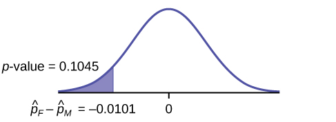
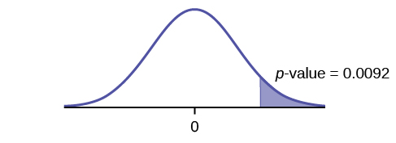
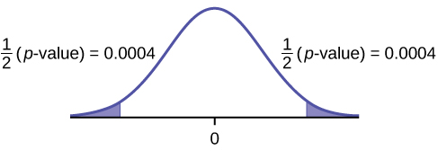
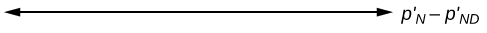
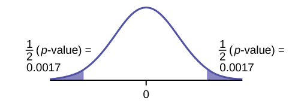
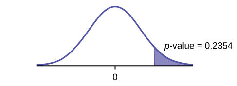

When conducting a hypothesis test that compares two independent population proportions, the following characteristics should be present:

1.  The two independent samples are simple random samples that are independent.
2.  The number of successes is at least five, and the number of failures is at least five, for each of the samples.
3.  Growing literature states that the population must be at least ten or 20 times the size of the sample. This keeps each population from being over-sampled and causing incorrect results.

Comparing two proportions, like comparing two means, is common. If two estimated proportions are different, it may be due to a difference in the populations or it may be due to chance. A hypothesis test can help determine if a difference in the estimated proportions reflects a difference in the population proportions.

The difference of two proportions follows an approximate normal distribution. Generally, the null hypothesis states that the two proportions are the same. That is, *H0*\: *pA* = *pB*. To conduct the test, we use a pooled proportion, *pc*.

The pooled proportion is calculated as follows:

<math xmlns="http://www.w3.org/1998/Math/MathML"> <mrow> <msub> <mi>p</mi> <mi>c</mi> </msub> <mo>=</mo><mfrac> <mrow> <msub> <mi>x</mi> <mi>A</mi> </msub> <mo>+</mo><msub> <mi>x</mi> <mi>B</mi> </msub> </mrow> <mrow> <msub> <mi>n</mi> <mi>A</mi> </msub> <mo>+</mo><msub> <mi>n</mi> <mi>B</mi> </msub> </mrow> </mfrac> </mrow> </math>

The distribution for the differences is:

<math xmlns="http://www.w3.org/1998/Math/MathML"> <mrow> <msub> <msup> <mi>P</mi> <mo>′</mo> </msup> <mi>A</mi> </msub> <mo>−</mo><msub> <msup> <mi>P</mi> <mo>′</mo> </msup> <mi>B</mi> </msub> <mo>~</mo><mi>N</mi><mo stretchy="false">[</mo><mn>0</mn><mo>,</mo><msqrt> <mrow> <msub> <mi>p</mi> <mi>c</mi> </msub> <mo stretchy="false">(</mo><mn>1</mn><mo>−</mo><msub> <mi>p</mi> <mi>c</mi> </msub> <mo stretchy="false">)</mo><mo stretchy="false">(</mo><mfrac> <mn>1</mn> <mrow> <msub> <mi>n</mi> <mi>A</mi> </msub> </mrow> </mfrac> <mo>+</mo><mfrac> <mn>1</mn> <mrow> <msub> <mi>n</mi> <mi>B</mi> </msub> </mrow> </mfrac> <mo stretchy="false">)</mo> </mrow> </msqrt> <mo stretchy="false">]</mo> </mrow> </math>

The test statistic (*z*-score) is:

<math xmlns="http://www.w3.org/1998/Math/MathML"> <mrow> <mi>z</mi><mo>=</mo><mfrac> <mrow> <mo stretchy="false">(</mo><msub> <msup> <mi>p</mi> <mo>′</mo> </msup> <mi>A</mi> </msub> <mo>−</mo><msub> <msup> <mi>p</mi> <mo>′</mo> </msup> <mi>B</mi> </msub> <mo stretchy="false">)</mo><mo>−</mo><mo stretchy="false">(</mo><msub> <mi>p</mi> <mi>A</mi> </msub> <mo>−</mo><msub> <mi>p</mi> <mi>B</mi> </msub> <mo stretchy="false">)</mo> </mrow> <mrow> <msqrt> <mrow> <msub> <mi>p</mi> <mi>c</mi> </msub> <mo stretchy="false">(</mo><mn>1</mn><mo>−</mo><msub> <mi>p</mi> <mi>c</mi> </msub> <mo stretchy="false">)</mo><mo stretchy="false">(</mo><mfrac> <mn>1</mn> <mrow> <msub> <mi>n</mi> <mi>A</mi> </msub> </mrow> </mfrac> <mo>+</mo><mfrac> <mn>1</mn> <mrow> <msub> <mi>n</mi> <mi>B</mi> </msub> </mrow> </mfrac> <mo stretchy="false">)</mo> </mrow> </msqrt> </mrow> </mfrac> </mrow> </math>

Two types of medication for hives are being tested to determine if there is a **difference in the proportions of adult patient reactions. Twenty** out of a random **sample of 200** adults given medication A still had hives 30 minutes after taking the medication. **Twelve** out of another **random sample of 200 adults** given medication B still had hives 30 minutes after taking the medication. Test at a 1% level of significance.

The problem asks for a difference in proportions, making it a test of two proportions.

Let *A* and *B* be the subscripts for medication A and medication B, respectively. Then *pA* and *pB* are the desired population proportions.

Random Variable: *P′A* – *P′B* = difference in the proportions of adult patients who did not react after 30 minutes to medication A and to medication B.

*H0*: *pA* = *pB*

*pA* – *pB* = 0

*Ha*: *pA* ≠ *pB*

*pA* – *pB* ≠ 0

The words **"is a difference"** tell you the test is two-tailed.

**Distribution for the test:** Since this is a test of two binomial population proportions, the distribution is normal:

<math xmlns="http://www.w3.org/1998/Math/MathML"> <mrow> <msub> <mi>p</mi> <mi>c</mi> </msub> <mo>=</mo><mfrac> <mrow> <msub> <mi>x</mi> <mi>A</mi> </msub> <mo>+</mo><msub> <mi>x</mi> <mi>B</mi> </msub> </mrow> <mrow> <msub> <mi>n</mi> <mi>A</mi> </msub> <mo>+</mo><msub> <mi>n</mi> <mi>B</mi> </msub> </mrow> </mfrac> <mo>=</mo><mfrac> <mrow> <mn>20</mn><mo>+</mo><mn>12</mn> </mrow> <mrow> <mn>200</mn><mo>+</mo><mn>200</mn> </mrow> </mfrac> <mo>=</mo><mn>0.08</mn><mtext> </mtext><mn>1</mn><mo>–</mo><msub> <mi>p</mi> <mi>c</mi> </msub> <mo>=</mo><mn>0.92</mn> </mrow> </math>

<math xmlns="http://www.w3.org/1998/Math/MathML"> <mrow> <msub> <msup> <mi>P</mi> <mo>′</mo> </msup> <mi>A</mi> </msub> <mo>–</mo><msub> <msup> <mi>P</mi> <mo>′</mo> </msup> <mi>B</mi> </msub> <mo>~</mo><mi>N</mi><mrow><mo>[</mo> <mrow> <mn>0</mn><mo>,</mo><msqrt> <mrow> <mo stretchy="false">(</mo><mn>0.08</mn><mo stretchy="false">)</mo><mo stretchy="false">(</mo><mn>0.92</mn><mo stretchy="false">)</mo><mo stretchy="false">(</mo><mfrac> <mn>1</mn> <mrow> <mn>200</mn> </mrow> </mfrac> <mo>+</mo><mfrac> <mn>1</mn> <mrow> <mn>200</mn> </mrow> </mfrac> <mo stretchy="false">)</mo> </mrow> </msqrt> </mrow> <mo>]</mo></mrow> </mrow> </math>

*P′A* – *P′B* follows an approximate normal distribution.

**Calculate the *p*-value using the normal distribution:** *p*-value = 0.1404.

Estimated proportion for group A: <math xmlns="http://www.w3.org/1998/Math/MathML"> <mrow> <msub> <msup> <mi>p</mi> <mo>′</mo> </msup> <mi>A</mi> </msub> <mo>=</mo><mfrac> <mrow> <msub> <mi>x</mi> <mi>A</mi> </msub> </mrow> <mrow> <msub> <mi>n</mi> <mi>A</mi> </msub> </mrow> </mfrac> <mo>=</mo><mfrac> <mrow> <mn>20</mn> </mrow> <mrow> <mn>200</mn> </mrow> </mfrac> <mo>=</mo><mn>0.1</mn> </mrow> </math>

Estimated proportion for group B: <math xmlns="http://www.w3.org/1998/Math/MathML"> <mrow> <msub> <msup> <mi>p</mi> <mo>′</mo> </msup> <mi>B</mi> </msub> <mo>=</mo><mfrac> <mrow> <msub> <mi>x</mi> <mi>B</mi> </msub> </mrow> <mrow> <msub> <mi>n</mi> <mi>B</mi> </msub> </mrow> </mfrac> <mo>=</mo><mfrac> <mrow> <mn>12</mn> </mrow> <mrow> <mn>200</mn> </mrow> </mfrac> <mo>=</mo><mn>0.06</mn> </mrow> </math>

Graph:{: #hyptest22_cmp_3_1}

*P′A* – *P′B* = 0.1 – 0.06 = 0.04.

Half the *p*-value is below –0.04, and half is above 0.04.

Compare *α* and the *p*-value: *α* = 0.01 and the *p*-value = 0.1404. *α* &lt; *p*-value.

Make a decision: Since *α* &lt; *p*-value, do not reject *H0*.

**Conclusion:** At a 1% level of significance, from the sample data, there is not sufficient evidence to conclude that there is a difference in the proportions of adult patients who did not react after 30 minutes to medication *A* and medication *B*.

Press `STAT`. Arrow over to `TESTS` and press `6:2-PropZTest`. Arrow down and enter `20` for x1, `200` for n1, `12` for x2, and `200` for n2. Arrow down to `p1`: and arrow to `not equal p2`. Press `ENTER`. Arrow down to `Calculate` and press `ENTER`. The *p*-value is *p* = 0.1404 and the test statistic is 1.47. Do the procedure again, but instead of `Calculate` do `Draw`.

Try It

Two types of valves are being tested to determine if there is a difference in pressure tolerances. Fifteen out of a random sample of 100 of Valve *A* cracked under 4,500 psi. Six out of a random sample of 100 of Valve *B* cracked under 4,500 psi. Test at a 5% level of significance.

The *p*-value is 0.0379, so we can reject the null hypothesis. At the 5% significance level, the data support that there is a difference in the pressure tolerances between the two valves.

A research study was conducted about gender differences in “sexting.” The researcher believed that the proportion of girls involved in “sexting” is less than the proportion of boys involved. The data collected in the spring of 2010 among a random sample of middle and high school students in a large school district in the southern United States is summarized in [[link]](#fs-idm29483888). Is the proportion of girls sending sexts less than the proportion of boys “sexting?” Test at a 1% level of significance.

|  | Males | Females |
|----------
| Sent “sexts” | 183 | 156 |
| Total number surveyed | 2231 | 2169 |
{: summary=""}

This is a test of two population proportions. Let M and F be the subscripts for males and females. Then *pM* and *pF* are the desired population proportions.

Random variable: *p′F* − *p′M* = difference in the proportions of males and females who sent “sexts.”

*H0*: *pF* = *pM* *H0*: *pF* – *pM* = 0

*Ha*: *pF* &lt; *pM* *Ha*: *pF* – *pM* &lt; 0

The words **"less than"** tell you the test is left-tailed.

**Distribution for the test:** Since this is a test of two population proportions, the distribution is normal:

<math xmlns="http://www.w3.org/1998/Math/MathML"> <mrow> <msub> <mi>p</mi> <mi>c</mi> </msub> <mo>=</mo><mfrac> <mrow> <msub> <mi>x</mi> <mi>F</mi> </msub> <mo>+</mo><msub> <mi>x</mi> <mi>M</mi> </msub> </mrow> <mrow> <msub> <mi>n</mi> <mi>F</mi> </msub> <mo>+</mo><msub> <mi>n</mi> <mi>M</mi> </msub> </mrow> </mfrac> <mo>=</mo><mfrac> <mrow> <mn>156</mn><mo>+</mo><mn>183</mn> </mrow> <mrow> <mn>2169</mn><mo>+</mo><mn>2231</mn> </mrow> </mfrac> <mo>=</mo><mtext>0</mtext><mtext>.077</mtext> </mrow> </math>

 * * *
{: data-type="newline"}

<math xmlns="http://www.w3.org/1998/Math/MathML"> <mrow> <mn>1</mn><mo>−</mo><msub> <mi>p</mi> <mi>c</mi> </msub> <mo>=</mo><mn>0.923</mn> </mrow> </math>

 * * *
{: data-type="newline"}

Therefore, * * *
{: data-type="newline"}

 <math xmlns="http://www.w3.org/1998/Math/MathML"> <mrow> <msub> <msup> <mi>p</mi> <mo>′</mo> </msup> <mi>F</mi> </msub> <mo>–</mo><msub> <msup> <mi>p</mi> <mo>′</mo> </msup> <mi>M</mi> </msub> <mo>∼</mo><mi>N</mi><mrow><mo>(</mo> <mrow> <mn>0</mn><mo>,</mo><msqrt> <mrow> <mo stretchy="false">(</mo><mn>0.077</mn><mo stretchy="false">)</mo><mo stretchy="false">(</mo><mn>0.923</mn><mo stretchy="false">)</mo><mrow><mo>(</mo> <mrow> <mfrac> <mn>1</mn> <mrow> <mn>2169</mn> </mrow> </mfrac> <mo>+</mo><mfrac> <mn>1</mn> <mrow> <mn>2231</mn> </mrow> </mfrac> </mrow> <mo>)</mo></mrow> </mrow> </msqrt> </mrow> <mo>)</mo></mrow> </mrow> </math>

 * * *
{: data-type="newline"}

*p′F* – *p′M* follows an approximate normal distribution.

**Calculate the *p*-value using the normal distribution:** * * *
{: data-type="newline"}

*p*-value = 0.1045 * * *
{: data-type="newline"}

Estimated proportion for females: 0.0719 * * *
{: data-type="newline"}

Estimated proportion for males: 0.082

Graph:{:}

**Decision:** Since *α* &lt; *p*-value, Do not reject *H0*

**Conclusion:** At the 1% level of significance, from the sample data, there is not sufficient evidence to conclude that the proportion of girls sending “sexts” is less than the proportion of boys sending “sexts.”

Press STAT. Arrow over to TESTS and press 6:2-PropZTest. Arrow down and enter 156 for x1, 2169 for n1, 183 for x2, and 2231 for n2. Arrow down to p1: and arrow to less than p2. Press `ENTER`. Arrow down to Calculate and press ENTER. The *p*-value is *P* = 0.1045 and the test statistic is *z* = -1.256.

Researchers conducted a study of smartphone use among adults. A cell phone company claimed that iPhone smartphones are more popular with whites (non-Hispanic) than with African Americans. The results of the survey indicate that of the 232 African American cell phone owners randomly sampled, 5% have an iPhone. Of the 1,343 white cell phone owners randomly sampled, 10% own an iPhone. Test at the 5% level of significance. Is the proportion of white iPhone owners greater than the proportion of African American iPhone owners?

This is a test of two population proportions. Let W and A be the subscripts for the whites and African Americans. Then *pW* and *pA* are the desired population proportions.

Random variable:*p′W* – *p′A* = difference in the proportions of Android and iPhone users.

*H0*: *pW* = *pA* *H0*: *pW* – *pA* = 0

*Ha*: *pW* &gt; *pA* *Ha*: *pW* – *pA* &gt; 0

The words "more popular" indicate that the test is right-tailed.

Distribution for the test: The distribution is approximately normal:

<math xmlns="http://www.w3.org/1998/Math/MathML"> <mrow> <msub> <mi>p</mi> <mi>c</mi> </msub> <mo>=</mo><mfrac> <mrow> <msub> <mi>x</mi> <mi>W</mi> </msub> <mo>+</mo><msub> <mi>x</mi> <mi>A</mi> </msub> </mrow> <mrow> <msub> <mi>n</mi> <mi>W</mi> </msub> <mo>+</mo><msub> <mi>n</mi> <mi>A</mi> </msub> </mrow> </mfrac> <mo>=</mo><mfrac> <mrow> <mn>134</mn><mo>+</mo><mn>12</mn> </mrow> <mrow> <mn>1343</mn><mo>+</mo><mn>232</mn> </mrow> </mfrac> <mo>=</mo><mtext> </mtext><mn>0.</mn><mtext>1</mtext><mn>0</mn><mtext>77</mtext> </mrow> </math>

<math xmlns="http://www.w3.org/1998/Math/MathML"> <mrow> <mn>1</mn><mo>−</mo><msub> <mi>p</mi> <mi>c</mi> </msub> <mo>=</mo><mn>0.8923</mn> </mrow> </math>

Therefore,

<math xmlns="http://www.w3.org/1998/Math/MathML"> <mrow> <msub> <msup> <mi>p</mi> <mo>′</mo> </msup> <mi>W</mi> </msub> <mo>–</mo><msub> <msup> <mi>p</mi> <mo>′</mo> </msup> <mi>A</mi> </msub> <mo>∽</mo><mi>N</mi><mrow><mo>(</mo> <mrow> <mn>0</mn><mo>,</mo><msqrt> <mrow> <mrow><mo>(</mo> <mrow> <mn>0.1077</mn> </mrow> <mo>)</mo></mrow><mrow><mo>(</mo> <mrow> <mn>0.8923</mn> </mrow> <mo>)</mo></mrow><mrow><mo>(</mo> <mrow> <mfrac> <mn>1</mn> <mrow> <mn>1343</mn> </mrow> </mfrac> <mo>+</mo><mfrac> <mn>1</mn> <mrow> <mn>232</mn> </mrow> </mfrac> </mrow> <mo>)</mo></mrow> </mrow> </msqrt> </mrow> <mo>)</mo></mrow> </mrow> </math>

<math xmlns="http://www.w3.org/1998/Math/MathML"> <mrow> <msub> <msup> <mi>p</mi> <mo>′</mo> </msup> <mi>W</mi> </msub> <mo>–</mo><msub> <msup> <mi>p</mi> <mo>′</mo> </msup> <mi>A</mi> </msub> </mrow> </math>

 follows an approximate normal distribution.

Calculate the *p*-value using the normal distribution: * * *
{: data-type="newline"}

*p*-value = 0.0092* * *
{: data-type="newline"}

 Estimated proportion for group A: 0.10* * *
{: data-type="newline"}

 Estimated proportion for group B: 0.05

<!-- LALALA &#9834;&#9835;&#9834;&#9835; CONTINUE INSERTING NEW EXAMPLE 3 HERE -->

**Graph:**

{: #id12575638}

**Decision:** Since *α* &gt; *p*-value, reject the *H0*.

**Conclusion:** At the 5% level of significance, from the sample data, there is sufficient evidence to conclude that a larger proportion of white cell phone owners use iPhones than African Americans.

TI-83+ and TI-84: Press STAT. Arrow over to TESTS and press 6:2-PropZTest. Arrow down and enter 135 for x1, 1343 for n1, 12 for x2, and 232 for n2. Arrow down to p1: and arrow to greater than p2. Press ENTER. Arrow down to Calculate and press ENTER. The P-value is P = 0.0092 and the test statistic is Z = 2.33.

Try It

A concerned group of citizens wanted to know if the proportion of forcible rapes in Texas was different in 2011 than in 2010. Their research showed that of the 113,231 violent crimes in Texas in 2010, 7,622 of them were forcible rapes. In 2011, 7,439 of the 104,873 violent crimes were in the forcible rape category. Test at a 5% significance level. Answer the following questions:* * *
{: data-type="newline"}

a. Is this a test of two means or two proportions?

a. two proportions

b. Which distribution do you use to perform the test?

b. normal for two proportions

c. What is the random variable?

c. Subscripts: 1 = 2010, 2 = 2011 * * *
{: data-type="newline"}

*P*′2 - *P*′2

d. What are the null and alternative hypothesis? Write the null and alternative hypothesis in symbols.

d. Subscripts: 1 = 2010, 2 = 2011* * *
{: data-type="newline"}

*H0*: *p1* = *p2* *H0*: *p1* − *p2* = 0 * * *
{: data-type="newline"}

*Ha*: *p1* ≠ *p2* *Ha*: *p1* − *p2* ≠ 0

e. Is this test right-, left-, or two-tailed?

e. two-tailed

f. What is the *p*-value?

f. *p*-value = 0.00086

{:}

g. Do you reject or not reject the null hypothesis?

g. Reject the *H0*.

h. At the \_\_\_ level of significance, from the sample data, there \_\_\_\_\_\_ (is/is not) sufficient evidence to conclude that \_\_\_\_\_\_\_\_\_\_\_\_.

h. At the 5% significance level, from the sample data, there is sufficient evidence to conclude that there is a difference between the proportion of forcible rapes in 2011 and 2010.

# References   {#eip-290}

Data from *Educational Resources*, December catalog.

Data from Hilton Hotels. Available online at http://www.hilton.com (accessed June 17, 2013).

Data from Hyatt Hotels. Available online at http://hyatt.com (accessed June 17, 2013).

Data from Statistics, United States Department of Health and Human Services.

Data from Whitney Exhibit on loan to San Jose Museum of Art.

Data from the American Cancer Society. Available online at http://www.cancer.org/index (accessed June 17, 2013).

Data from the Chancellor’s Office, California Community Colleges, November 1994.

“State of the States.” Gallup, 2013. Available online at http://www.gallup.com/poll/125066/State-States.aspx?ref=interactive (accessed June 17, 2013).

“West Nile Virus.” Centers for Disease Control and Prevention. Available online at http://www.cdc.gov/ncidod/dvbid/westnile/index.htm (accessed June 17, 2013).

# Chapter Review

Test of two population proportions from independent samples.  Random variable: <math xmlns="http://www.w3.org/1998/Math/MathML"> <mrow> <msub> <mover accent="true"> <mi>p</mi> <mo>^</mo> </mover> <mi>A</mi> </msub> <mo>–</mo><msub> <mover accent="true"> <mi>p</mi> <mo>^</mo> </mover> <mi>B</mi> </msub> <mo>=</mo> </mrow> </math>
 difference between the two estimated proportions Distribution: normal distribution 

# Formula Review

Pooled Proportion: *pc* = <math xmlns="http://www.w3.org/1998/Math/MathML"> <mrow> <mfrac> <mrow> <msub> <mi>x</mi> <mi>F</mi> </msub> <mtext> </mtext><mo>+</mo><mtext> </mtext><msub> <mi>x</mi> <mi>M</mi> </msub> </mrow> <mrow> <msub> <mi>n</mi> <mi>F</mi> </msub> <mtext> </mtext><mo>+</mo><mtext> </mtext><msub> <mi>n</mi> <mi>M</mi> </msub> </mrow> </mfrac> </mrow> </math>

Distribution for the differences: * * *
{: data-type="newline"}

<math xmlns="http://www.w3.org/1998/Math/MathML" display="block"> <mrow> <msub> <msup> <mi>p</mi> <mo>′</mo> </msup> <mi>A</mi> </msub> <mo>−</mo><msub> <msup> <mi>p</mi> <mo>′</mo> </msup> <mi>B</mi> </msub> <mo>∼</mo><mi>N</mi><mrow><mo>[</mo> <mrow> <mn>0</mn><mo>,</mo><msqrt> <mrow> <msub> <mi>p</mi> <mi>c</mi> </msub> <mo stretchy="false">(</mo><mn>1</mn><mo>−</mo><msub> <mi>p</mi> <mi>c</mi> </msub> <mo stretchy="false">)</mo><mrow><mo>(</mo> <mrow> <mfrac> <mn>1</mn> <mrow> <msub> <mi>n</mi> <mi>A</mi> </msub> </mrow> </mfrac> <mo>+</mo><mfrac> <mn>1</mn> <mrow> <msub> <mi>n</mi> <mi>B</mi> </msub> </mrow> </mfrac> </mrow> <mo>)</mo></mrow> </mrow> </msqrt> </mrow> <mo>]</mo></mrow> </mrow> </math>

where the null hypothesis is *H0*\: *pA* = *pB* or *H0*\: *pA* – *pB* = 0.

Test Statistic (*z*-score): <math xmlns="http://www.w3.org/1998/Math/MathML"> <mrow> <mi>z</mi><mo>=</mo><mfrac> <mrow> <mo stretchy="false">(</mo><msup> <mi>p</mi> <mo>′</mo> </msup> <msub> <mrow /> <mi>A</mi> </msub> <mo>−</mo><msup> <mi>p</mi> <mo>′</mo> </msup> <msub> <mrow /> <mi>B</mi> </msub> <mo stretchy="false">)</mo> </mrow> <mrow> <msqrt> <mrow> <msub> <mi>p</mi> <mi>c</mi> </msub> <mo stretchy="false">(</mo><mn>1</mn><mo>−</mo><msub> <mi>p</mi> <mi>c</mi> </msub> <mo stretchy="false">)</mo><mrow><mo>(</mo> <mrow> <mfrac> <mn>1</mn> <mrow> <msub> <mi>n</mi> <mi>A</mi> </msub> </mrow> </mfrac> <mo>+</mo><mfrac> <mn>1</mn> <mrow> <msub> <mi>n</mi> <mi>B</mi> </msub> </mrow> </mfrac> </mrow> <mo>)</mo></mrow> </mrow> </msqrt> </mrow> </mfrac> </mrow> </math>

where the null hypothesis is *H0*\: *pA* = *pB* or *H0*\: *pA* − *pB* = 0.

where

*p′A* and *p′B* are the sample proportions, *pA* and *pB* are the population proportions,

*Pc* is the pooled proportion, and ***nA*** and ***nB*** are the sample sizes.

<section data-depth="1" class="practice" markdown="1">
*Use the following information for the next five exercises.* Two types of phone operating system are being tested to determine if there is a difference in the proportions of system failures (crashes). Fifteen out of a random sample of 150 phones with OS1 had system failures within the first eight hours of operation. Nine out of another random sample of 150 phones with OS2 had system failures within the first eight hours of operation. OS2 is believed to be more stable (have fewer crashes) than OS1.

Is this a test of means or proportions?

What is the random variable?

*P*′OS1 – *P*′OS2 = difference in the proportions of phones that had system failures within the first eight hours of operation with OS1 and OS2.

State the null and alternative hypotheses.

What is the *p*-value?

0\.1018

What can you conclude about the two operating systems?

* * *
{: data-type="newline"}

*Use the following information to answer the next twelve exercises.* In the recent Census, three percent of the U.S. population reported being of two or more races. However, the percent varies tremendously from state to state. Suppose that two random surveys are conducted. In the first random survey, out of 1,000 North Dakotans, only nine people reported being of two or more races. In the second random survey, out of 500 Nevadans, 17 people reported being of two or more races. Conduct a hypothesis test to determine if the population percents are the same for the two states or if the percent for Nevada is statistically higher than for North Dakota.

Is this a test of means or proportions?

proportions

State the null and alternative hypotheses.

1.  *H0*: \_\_\_\_\_\_\_\_\_
2.  *Ha*: \_\_\_\_\_\_\_\_\_
{: data-number-style="lower-alpha"}

Is this a right-tailed, left-tailed, or two-tailed test? How do you know?

right-tailed

What is the random variable of interest for this test?

In words, define the random variable for this test.

The random variable is the difference in proportions (percents) of the populations that are of two or more races in Nevada and North Dakota.

Which distribution (normal or Student's *t*) would you use for this hypothesis test?

Explain why you chose the distribution you did for the [Exercise 10.56](#element-7).

Our sample sizes are much greater than five each, so we use the normal for two proportions distribution for this hypothesis test.

Calculate the test statistic.

Sketch a graph of the situation. Mark the hypothesized difference and the sample difference. Shade the area corresponding to the *p*-value. {: #id12575638a}

Check student’s solution.

Find the *p*-value.

At a pre-conceived *α* = 0.05, what is your:  Decision: Reason for the decision: Conclusion (write out in a complete sentence): 

1.  Reject the null hypothesis.
2.  *p*-value &lt; alpha
3.  At the 5% significance level, there is sufficient evidence to conclude that the proportion (percent) of the population that is of two or more races in Nevada is statistically higher than that in North Dakota.
{: data-number-style="lower-alpha"}

Does it appear that the proportion of Nevadans who are two or more races is higher than the proportion of North Dakotans? Why or why not?

</section>

# Homework

*DIRECTIONS: For each of the word problems, use a solution sheet to do the hypothesis test. The solution sheet is found in [\[link\]](/m47882). Please feel free to make copies of the solution sheets. For the online version of the book, it is suggested that you copy the .doc or the .pdf files.*

Note

If you are using a Student\'s *t*-distribution for one of the following homework problems, including for paired data, you may assume that the underlying population is normally distributed. (In general, you must first prove that assumption, however.)

A recent drug survey showed an increase in the use of drugs and alcohol among local high school seniors as compared to the national percent. Suppose that a survey of 100 local seniors and 100 national seniors is conducted to see if the proportion of drug and alcohol use is higher locally than nationally. Locally, 65 seniors reported using drugs or alcohol within the past month, while 60 national seniors reported using them.

We are interested in whether the proportions of female suicide victims for ages 15 to 24 are the same for the whites and the blacks races in the United States. We randomly pick one year, 1992, to compare the races. The number of suicides estimated in the United States in 1992 for white females is 4,930. Five hundred eighty were aged 15 to 24. The estimate for black females is 330. Forty were aged 15 to 24. We will let female suicide victims be our population.

1.  *H0*: *PW* = *PB*
2.  *Ha*: *PW* ≠ *PB*
3.  The random variable is the difference in the proportions of white and black suicide victims, aged 15 to 24.
4.  normal for two proportions
5.  test statistic: –0.1944
6.  *p*-value: 0.8458
7.  Check student’s solution.
8.  1.  Alpha: 0.05
    2.  Decision: Reject the null hypothesis.
    3.  Reason for decision: *p*-value &gt; alpha
    4.  Conclusion: At the 5% significance level, there is insufficient evidence to conclude that the proportions of white and black female suicide victims, aged 15 to 24, are different.
    {: data-number-style="lower-roman"}
{: data-number-style="lower-alpha"}

Elizabeth Mjelde, an art history professor, was interested in whether the value from the Golden Ratio formula, <math xmlns="http://www.w3.org/1998/Math/MathML"> <mrow> <mrow><mo>(</mo> <mrow> <mfrac> <mrow> <mtext>larger + smaller dimension</mtext> </mrow> <mrow> <mtext>larger dimension</mtext> </mrow> </mfrac> </mrow> <mo>)</mo></mrow> </mrow> </math>

 was the same in the Whitney Exhibit for works from 1900 to 1919 as for works from 1920 to 1942. Thirty-seven early works were sampled, averaging 1.74 with a standard deviation of 0.11. Sixty-five of the later works were sampled, averaging 1.746 with a standard deviation of 0.1064. Do you think that there is a significant difference in the Golden Ratio calculation?

A recent year was randomly picked from 1985 to the present. In that year, there were 2,051 Hispanic students at Cabrillo College out of a total of 12,328 students. At Lake Tahoe College, there were 321 Hispanic students out of a total of 2,441 students. In general, do you think that the percent of Hispanic students at the two colleges is basically the same or different?

Subscripts: 1 = Cabrillo College, 2 = Lake Tahoe College

1.  *H0*: *p1* = *p2*
2.  *Ha*: *p1* ≠ *p2*
3.  The random variable is the difference between the proportions of Hispanic students at Cabrillo College and Lake Tahoe College.
4.  normal for two proportions
5.  test statistic: 4.29
6.  *p*-value: 0.00002
7.  Check student’s solution.
8.  1.  Alpha: 0.05
    2.  Decision: Reject the null hypothesis.
    3.  Reason for decision: *p*-value &lt; alpha
    4.  Conclusion: There is sufficient evidence to conclude that the proportions of Hispanic students at Cabrillo College and Lake Tahoe College are different.
    {: data-number-style="lower-roman"}
{: data-number-style="lower-alpha"}

*Use the following information to answer the next three exercises.* Neuroinvasive West Nile virus is a severe disease that affects a person’s nervous system . It is spread by the Culex species of mosquito. In the United States in 2010 there were 629 reported cases of neuroinvasive West Nile virus out of a total of 1,021 reported cases and there were 486 neuroinvasive reported cases out of a total of 712 cases reported in 2011. Is the 2011 proportion of neuroinvasive West Nile virus cases more than the 2010 proportion of neuroinvasive West Nile virus cases? Using a 1% level of significance, conduct an appropriate hypothesis test.  “2011” subscript: 2011 group. “2010” subscript: 2010 group 

This is:

1.  a test of two proportions
2.  a test of two independent means
3.  a test of a single mean
4.  a test of matched pairs.
{: data-number-style="lower-alpha"}

An appropriate null hypothesis is:

1.  *p2011* ≤ *p2010*
2.  *p2011* ≥ *p2010*
3.  *μ2011* ≤ *μ2010*
4.  *p2011* &gt; *p2010*
{: data-number-style="lower-alpha"}

a

The *p*-value is 0.0022. At a 1% level of significance, the appropriate conclusion is

1.  There is sufficient evidence to conclude that the proportion of people in the United States in 2011 who contracted neuroinvasive West Nile disease is less than the proportion of people in the United States in 2010 who contracted neuroinvasive West Nile disease.
2.  There is insufficient evidence to conclude that the proportion of people in the United States in 2011 who contracted neuroinvasive West Nile disease is more than the proportion of people in the United States in 2010 who contracted neuroinvasive West Nile disease.
3.  There is insufficient evidence to conclude that the proportion of people in the United States in 2011 who contracted neuroinvasive West Nile disease is less than the proportion of people in the United States in 2010 who contracted neuroinvasive West Nile disease.
4.  There is sufficient evidence to conclude that the proportion of people in the United States in 2011 who contracted neuroinvasive West Nile disease is more than the proportion of people in the United States in 2010 who contracted neuroinvasive West Nile disease.
{: data-number-style="lower-alpha"}

Researchers conducted a study to find out if there is a difference in the use of eReaders by different age groups. Randomly selected participants were divided into two age groups. In the 16- to 29-year-old group, 7% of the 628 surveyed use eReaders, while 11% of the 2,309 participants 30 years old and older use eReaders.

Test: two independent sample proportions.

Random variable: *p*′1 - *p*′2

Distribution: * * *
{: data-type="newline"}

*H0*: *p1* = *p2* * * *
{: data-type="newline"}

*Ha*: *p1* ≠ *p2*

The proportion of eReader users is different for the 16- to 29-year-old users from that of the 30 and older users.

Graph: two-tailed

{:}

*p*-value : 0.0033

Decision: Reject the null hypothesis.

Conclusion: At the 5% level of significance, from the sample data, there is sufficient evidence to conclude that the proportion of eReader users 16 to 29 years old is different from the proportion of eReader users 30 and older.

Adults aged 18 years old and older were randomly selected for a survey on obesity. Adults are considered obese if their body mass index (BMI) is at least 30. The researchers wanted to determine if the proportion of women who are obese in the south is less than the proportion of southern men who are obese. The results are shown in [[link]](#fs-idp62517488). Test at the 1% level of significance.

|  | Number who are obese | Sample size |
|----------
| Men | 42,769 | 155,525 |
| Women | 67,169 | 248,775 |
{: summary=""}

Two computer users were discussing tablet computers. A higher proportion of people ages 16 to 29 use tablets than the proportion of people age 30 and older. [[link]](#fs-idp42650880) details the number of tablet owners for each age group. Test at the 1% level of significance.

|  | 16–29 year olds | 30 years old and older |
|----------
| Own a Tablet | 69 | 231 |
| Sample Size | 628 | 2,309 |
{: summary=""}

Test: two independent sample proportions

Random variable: *p′1* − *p′2*

Distribution:

*H0*: *p1* = *p2** * *
{: data-type="newline"}

*Ha*: *p1* &gt; *p2*

A higher proportion of tablet owners are aged 16 to 29 years old than are 30 years old and older.

Graph: right-tailed

{:}

*p*-value: 0.2354

Decision: Do not reject the *H0*.

Conclusion: At the 1% level of significance, from the sample data, there is not sufficient evidence to conclude that a higher proportion of tablet owners are aged 16 to 29 years old than are 30 years old and older.

A group of friends debated whether more men use smartphones than women. They consulted a research study of smartphone use among adults. The results of the survey indicate that of the 973 men randomly sampled, 379 use smartphones. For women, 404 of the 1,304 who were randomly sampled use smartphones. Test at the 5% level of significance.

While her husband spent 2½ hours picking out new speakers, a statistician decided to determine whether the percent of men who enjoy shopping for electronic equipment is higher than the percent of women who enjoy shopping for electronic equipment. The population was Saturday afternoon shoppers. Out of 67 men, 24 said they enjoyed the activity. Eight of the 24 women surveyed claimed to enjoy the activity. Interpret the results of the survey.

Subscripts: 1: men; 2: women

1.  *H0*: *p1* ≤ *p2*
2.  *Ha*: *p1* &gt; *p2*
3.  <math xmlns="http://www.w3.org/1998/Math/MathML"> <mrow> <msub> <msup> <mi>P</mi> <mo>′</mo> </msup> <mn>1</mn> </msub> <mo>−</mo><msub> <msup> <mi>P</mi> <mo>′</mo> </msup> <mn>2</mn> </msub> </mrow> </math>
    
    is the difference between the proportions of men and women who enjoy shopping for electronic equipment.
4.  normal for two proportions
5.  test statistic: 0.22
6.  *p*-value: 0.4133
7.  Check student’s solution.
8.  1.  Alpha: 0.05
    2.  Decision: Do not reject the null hypothesis.
    3.  Reason for Decision: *p*-value &gt; alpha
    4.  Conclusion: At the 5% significance level, there is insufficient evidence to conclude that the proportion of men who enjoy shopping for electronic equipment is more than the proportion of women.
    {: data-number-style="lower-roman"}
{: data-number-style="lower-alpha"}

We are interested in whether children’s educational computer software costs less, on average, than children’s entertainment software. Thirty-six educational software titles were randomly picked from a catalog. The mean cost was $31.14 with a standard deviation of $4.69. Thirty-five entertainment software titles were randomly picked from the same catalog. The mean cost was $33.86 with a standard deviation of $10.87. Decide whether children’s educational software costs less, on average, than children’s entertainment software.

Joan Nguyen recently claimed that the proportion of college-age males with at least one pierced ear is as high as the proportion of college-age females. She conducted a survey in her classes. Out of 107 males, 20 had at least one pierced ear. Out of 92 females, 47 had at least one pierced ear. Do you believe that the proportion of males has reached the proportion of females?

1.  *H0*: *p1* = *p2*
2.  *Ha*: *p1* ≠ *p2*
3.  <math xmlns="http://www.w3.org/1998/Math/MathML" display=""> <mrow> <msub> <msup> <mi>P</mi> <mo>′</mo> </msup> <mn>1</mn> </msub> <mo>−</mo><msub> <msup> <mi>P</mi> <mo>′</mo> </msup> <mn>2</mn> </msub> </mrow> </math>
    
    is the difference between the proportions of men and women that have at least one pierced ear.
4.  normal for two proportions
5.  test statistic: –4.82
6.  *p*-value: zero
7.  Check student’s solution.
8.  1.  Alpha: 0.05
    2.  Decision: Reject the null hypothesis.
    3.  Reason for Decision: *p*-value &lt; alpha
    4.  Conclusion: At the 5% significance level, there is sufficient evidence to conclude that the proportions of males and females with at least one pierced ear is different.
    {: data-number-style="lower-roman"}
{: data-number-style="lower-alpha"}

Use the data sets found in [[link]](/m47873) to answer this exercise. Is the proportion of race laps Terri completes slower than 130 seconds less than the proportion of practice laps she completes slower than 135 seconds?

"To Breakfast or Not to Breakfast?" by Richard Ayore

In the American society, birthdays are one of those days that everyone looks forward to. People of different ages and peer groups gather to mark the 18th, 20th, …, birthdays. During this time, one looks back to see what he or she has achieved for the past year and also focuses ahead for more to come.

If, by any chance, I am invited to one of these parties, my experience is always different. Instead of dancing around with my friends while the music is booming, I get carried away by memories of my family back home in Kenya. I remember the good times I had with my brothers and sister while we did our daily routine.

Every morning, I remember we went to the shamba (garden) to weed our crops. I remember one day arguing with my brother as to why he always remained behind just to join us an hour later. In his defense, he said that he preferred waiting for breakfast before he came to weed. He said, “This is why I always work more hours than you guys!”

And so, to prove him wrong or right, we decided to give it a try. One day we went to work as usual without breakfast, and recorded the time we could work before getting tired and stopping. On the next day, we all ate breakfast before going to work. We recorded how long we worked again before getting tired and stopping. Of interest was our mean increase in work time. Though not sure, my brother insisted that it was more than two hours. Using the data in [[link]](#fs-idm167762016), solve our problem.

| Work hours with breakfast | Work hours without breakfast |
|----------
| 8 | 6 |
| 7 | 5 |
| 9 | 5 |
| 5 | 4 |
| 9 | 7 |
| 8 | 7 |
| 10 | 7 |
| 7 | 5 |
| 6 | 6 |
| 9 | 5 |
{: summary="The table presents the work hours with breakfast in the first column and the work hours without breakfast in the second column."}

1.  *H0*: *µd* = 0
2.  *Ha*: *µd* &gt; 0
3.  The random variable *Xd* is the mean difference in work times on days when eating breakfast and on days when not eating breakfast.
4.  *t*9
5.  test statistic: 4.8963
6.  *p*-value: 0.0004
7.  Check student’s solution.
8.  1.  Alpha: 0.05
    2.  Decision: Reject the null hypothesis.
    3.  Reason for Decision: *p*-value &lt; alpha
    4.  Conclusion: At the 5% level of significance, there is sufficient evidence to conclude that the mean difference in work times on days when eating breakfast and on days when not eating breakfast has increased.
    {: data-number-style="lower-roman"}
{: data-number-style="lower-alpha"}

