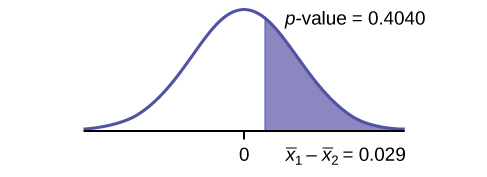

Even though this situation is not likely (knowing the population standard deviations is not likely), the following example illustrates hypothesis testing for independent means, known population standard deviations. The sampling distribution for the difference between the means is normal and both populations must be normal. The random variable is <math xmlns="http://www.w3.org/1998/Math/MathML"> <mrow> <mover accent="true"> <mrow> <msub> <mi>X</mi> <mn>1</mn> </msub> </mrow> <mo stretchy="true">¯</mo> </mover> <mo>–</mo><mover accent="true"> <mrow> <msub> <mi>X</mi> <mn>2</mn> </msub> </mrow> <mo stretchy="true">¯</mo> </mover> </mrow> </math>

. The normal distribution has the following format: 

**Normal distribution**{: data-type="term"} is:
<math xmlns="http://www.w3.org/1998/Math/MathML"> <mrow> <msub> <mover accent="true"> <mi>X</mi> <mo>¯</mo> </mover> <mn>1</mn> </msub> <mo>–</mo><msub> <mover accent="true"> <mi>X</mi> <mo>¯</mo> </mover> <mn>2</mn> </msub> <mo>~</mo><mi>N</mi><mrow><mo>[</mo> <mrow> <msub> <mi>μ</mi> <mn>1</mn> </msub> <mo>–</mo><msub> <mi>μ</mi> <mn>2</mn> </msub> <mo>,</mo><msqrt> <mrow> <mfrac> <mrow> <msup> <mrow> <mo stretchy="false">(</mo><msub> <mi>σ</mi> <mn>1</mn> </msub> <mo stretchy="false">)</mo> </mrow> <mn>2</mn> </msup> </mrow> <mrow> <msub> <mi>n</mi> <mn>1</mn> </msub> </mrow> </mfrac> <mo>+</mo><mfrac> <mrow> <msup> <mrow> <mo stretchy="false">(</mo><msub> <mi>σ</mi> <mn>2</mn> </msub> <mo stretchy="false">)</mo> </mrow> <mn>2</mn> </msup> </mrow> <mrow> <msub> <mi>n</mi> <mn>2</mn> </msub> </mrow> </mfrac> </mrow> </msqrt> </mrow> <mo>]</mo></mrow> </mrow> </math>

**The standard deviation**{: data-type="term"} is:

<math xmlns="http://www.w3.org/1998/Math/MathML" display="block"> <mrow> <msqrt> <mrow> <mfrac> <mrow> <msup> <mrow> <mo stretchy="false">(</mo><msub> <mi>σ</mi> <mn>1</mn> </msub> <mo stretchy="false">)</mo> </mrow> <mn>2</mn> </msup> </mrow> <mrow> <msub> <mi>n</mi> <mn>1</mn> </msub> </mrow> </mfrac> <mo>+</mo><mfrac> <mrow> <msup> <mrow> <mo stretchy="false">(</mo><msub> <mi>σ</mi> <mn>2</mn> </msub> <mo stretchy="false">)</mo> </mrow> <mn>2</mn> </msup> </mrow> <mrow> <msub> <mi>n</mi> <mn>2</mn> </msub> </mrow> </mfrac> </mrow> </msqrt> </mrow> </math>

The **test statistic**{: data-type="term"} (*z*-score) is:

<math xmlns="http://www.w3.org/1998/Math/MathML" display="block"> <mrow> <mi>z</mi><mo>=</mo><mfrac> <mrow> <mo stretchy="false">(</mo><msub> <mover accent="true"> <mi>x</mi> <mo>¯</mo> </mover> <mn>1</mn> </msub> <mo>–</mo><msub> <mover accent="true"> <mi>x</mi> <mo>¯</mo> </mover> <mn>2</mn> </msub> <mo stretchy="false">)</mo><mo>–</mo><mo stretchy="false">(</mo><msub> <mi>μ</mi> <mn>1</mn> </msub> <mo>–</mo><msub> <mi>μ</mi> <mn>2</mn> </msub> <mo stretchy="false">)</mo> </mrow> <mrow> <msqrt> <mrow> <mfrac> <mrow> <msup> <mrow> <mo stretchy="false">(</mo><msub> <mi>σ</mi> <mn>1</mn> </msub> <mo stretchy="false">)</mo> </mrow> <mn>2</mn> </msup> </mrow> <mrow> <msub> <mi>n</mi> <mn>1</mn> </msub> </mrow> </mfrac> <mo>+</mo><mfrac> <mrow> <msup> <mrow> <mo stretchy="false">(</mo><msub> <mi>σ</mi> <mn>2</mn> </msub> <mo stretchy="false">)</mo> </mrow> <mn>2</mn> </msup> </mrow> <mrow> <msub> <mi>n</mi> <mn>2</mn> </msub> </mrow> </mfrac> </mrow> </msqrt> </mrow> </mfrac> </mrow> </math>

**Independent groups, population standard deviations known:** The mean lasting time of two competing floor waxes is to be compared. **Twenty floors** are randomly assigned **to test each wax**. Both populations have a normal distributions. The data are recorded in [\[link\]](#table-12). | Wax | Sample Mean Number of Months Floor Wax Lasts | Population Standard Deviation |
|----------
| 1 | 3 | 0.33 |
| 2 | 2.9 | 0.36 |
{: #table-12 summary="This table has wax in the first column, sample mean in the second column, and standard deviation in the third column. There are two rows."}

Does the data indicate that **wax 1 is more effective than wax 2**? Test at a 5% level of significance.

This is a test of two independent groups, two population means, population standard deviations known.

**Random Variable**{: data-type="term"}: <math xmlns="http://www.w3.org/1998/Math/MathML"> <mrow> <msub> <mover accent="true"> <mi>X</mi> <mo>¯</mo> </mover> <mn>1</mn> </msub> <mtext>– </mtext><msub> <mover accent="true"> <mi>X</mi> <mo>¯</mo> </mover> <mn>2</mn> </msub> </mrow> </math>

 = difference in the mean number of months the competing floor waxes last.

*H0*: *μ1* ≤ *μ*2

*Ha*: *μ1* &gt; *μ2*

The words **"is more effective"** says that **wax 1 lasts longer than wax 2**, on average. "Longer" is a “&gt;” symbol and goes into *Ha*. Therefore, this is a right-tailed test.

**Distribution for the test:** The population standard deviations are known so the distribution is normal. Using the formula, the distribution is:

<math xmlns="http://www.w3.org/1998/Math/MathML" display="block"> <mrow> <msub> <mover accent="true"> <mi>X</mi> <mo>¯</mo> </mover> <mi>1</mi> </msub> <mo>–</mo> <msub> <mover accent="true"> <mi>X</mi> <mo>¯</mo> </mover> <mi>2</mi> </msub> <mo>~</mo><mi>N</mi><mrow><mo>(</mo> <mrow> <mn>0</mn><mo>,</mo><msqrt> <mrow> <mfrac> <mrow> <msup> <mrow> <mn>0.33</mn> </mrow> <mn>2</mn> </msup> </mrow> <mrow> <mn>20</mn> </mrow> </mfrac> <mo>+</mo><mfrac> <mrow> <msup> <mrow> <mn>0.36</mn> </mrow> <mn>2</mn> </msup> </mrow> <mrow> <mn>20</mn> </mrow> </mfrac> </mrow> </msqrt> </mrow> <mo>)</mo></mrow> </mrow> </math>

Since *μ1* ≤ *μ2* then *μ1* – *μ2* ≤ 0 and the mean for the normal distribution is zero.

**Calculate the *p*-value using the normal distribution:** *p*-value = 0.1799

**Graph:**

{: #hyptest22_cmp_2_1}

<math xmlns="http://www.w3.org/1998/Math/MathML"> <mrow> <msub> <mover accent="true"> <mi>X</mi> <mo>¯</mo> </mover> <mn>1</mn> </msub> </mrow> </math>

 – <math xmlns="http://www.w3.org/1998/Math/MathML"> <mrow> <msub> <mover accent="true"> <mi>X</mi> <mo>¯</mo> </mover> <mn>2</mn> </msub> </mrow> </math>

 = 3 – 2.9 = 0.1

**Compare *α* and the *p*-value:** *α* = 0.05 and *p*-value = 0.1799. Therefore, *α* &lt; *p*-value.

**Make a decision:** Since *α* &lt; *p*-value, do not reject *H0*.

**Conclusion:** At the 5% level of significance, from the sample data, there is not sufficient evidence to conclude that the mean time wax 1 lasts is longer (wax 1 is more effective) than the mean time wax 2 lasts.

Press `STAT`. Arrow over to `TESTS` and press `3:2-SampZTest`. Arrow over to `Stats` and press `ENTER`. Arrow down and enter `.33` for sigma1, `.36` for sigma2, `3` for the first sample mean, `20` for n1, `2.9` for the second sample mean, and `20` for n2. Arrow down to *μ*1: and arrow to &gt; *μ*2. Press `ENTER`. Arrow down to `Calculate` and press `ENTER`. The *p*-value is *p* = 0.1799 and the test statistic is 0.9157. Do the procedure again, but instead of `Calculate` do `Draw`.

Try It

The means of the number of revolutions per minute of two competing engines are to be compared. Thirty engines are randomly assigned to be tested. Both populations have normal distributions. [[link]](#fs-idm13177248) shows the result. Do the data indicate that Engine 2 has higher RPM than Engine 1? Test at a 5% level of significance.

| Engine | Sample Mean Number of RPM | Population Standard Deviation |
|----------
| 1 | 1,500 | 50 |
| 2 | 1,600 | 60 |
{: summary=""}

The *p*-value is almost zero, so we reject the null hypothesis. There is sufficient evidence to conclude that Engine 2 runs at a higher RPM than Engine 1.

An interested citizen wanted to know if Democratic U. S. senators are older than Republican U.S. senators, on average. On May 26 2013, the mean age of 30 randomly selected Republican Senators was 61 years 247 days old (61.675 years) with a standard deviation of 10.17 years. The mean age of 30 randomly selected Democratic senators was 61 years 257 days old (61.704 years) with a standard deviation of 9.55 years.

Do the data indicate that Democratic senators are older than Republican senators, on average? Test at a 5% level of significance.

This is a test of two independent groups, two population means. The population standard deviations are unknown, but the sum of the sample sizes is 30 + 30 = 60, which is greater than 30, so we can use the normal approximation to the Student’s-t distribution. Subscripts: 1: Democratic senators 2: Republican senators

**Random variable:** <math xmlns="http://www.w3.org/1998/Math/MathML"> <mrow> <msub> <mover accent="true"> <mi>X</mi> <mo>¯</mo> </mover> <mn>1</mn> </msub> <mtext> – </mtext><msub> <mover accent="true"> <mi>X</mi> <mo>¯</mo> </mover> <mn>2</mn> </msub> </mrow> </math>

 = difference in the mean age of Democratic and Republican U.S. senators.

*H0*: *µ1* ≤ *µ2* *H0*: *µ1* – *µ2* ≤ 0

*Ha*: *µ1* &gt; *µ2* *Ha*: *µ1* – *µ2* &gt; 0

The words "older than" translates as a “&gt;” symbol and goes into *Ha*. Therefore, this is a right-tailed test.

**Distribution for the test:** The distribution is the normal approximation to the Student’s *t* for means, independent groups. Using the formula, the distribution is: <math xmlns="http://www.w3.org/1998/Math/MathML"> <mrow> <msub> <mover accent="true"> <mi>X</mi> <mo>¯</mo> </mover> <mn>1</mn> </msub> <mo>–</mo><msub> <mover accent="true"> <mi>X</mi> <mo>¯</mo> </mover> <mn>2</mn> </msub> <mo>∼</mo><mi>N</mi><mo stretchy="false">[</mo><mn>0</mn><mo>,</mo><msqrt> <mrow> <mfrac> <mrow> <msup> <mrow> <mo stretchy="false">(</mo><mn>9.55</mn><mo stretchy="false">)</mo> </mrow> <mn>2</mn> </msup> </mrow> <mrow> <mn>30</mn> </mrow> </mfrac> <mo>+</mo><mfrac> <mrow> <msup> <mrow> <mo stretchy="false">(</mo><mn>10.17</mn><mo stretchy="false">)</mo> </mrow> <mn>2</mn> </msup> </mrow> <mrow> <mn>30</mn> </mrow> </mfrac> </mrow> </msqrt> <mo stretchy="false">]</mo> </mrow> </math>

Since *µ1* ≤ *µ2*, *µ1* – *µ2* ≤ 0 and the mean for the normal distribution is zero.

**(Calculating the *p*-value using the normal distribution gives** *p*-value = 0.4040)

**Graph:** {:}

**Compare *α* and the *p*-value:** *α* = 0.05 and *p*-value = 0.4040. Therefore, *α* &lt; *p*-value.

**Make a decision:** Since *α* &lt; *p*-value, do not reject *H0*.

**Conclusion:** At the 5% level of significance, from the sample data, there is not sufficient evidence to conclude that the mean age of Democratic senators is greater than the mean age of the Republican senators.

# References   {#eip-752}

Data from the United States Census Bureau. Available online at http://www.census.gov/prod/cen2010/briefs/c2010br-02.pdf

Hinduja, Sameer. “Sexting Research and Gender Differences.” Cyberbulling Research Center, 2013. Available online at http://cyberbullying.us/blog/sexting-research-and-gender-differences/ (accessed June 17, 2013).

“Smart Phone Users, By the Numbers.” Visually, 2013. Available online at http://visual.ly/smart-phone-users-numbers (accessed June 17, 2013).

Smith, Aaron. “35% of American adults own a Smartphone.” Pew Internet, 2013. Available online at http://www.pewinternet.org/~/media/Files/Reports/2011/PIP\\\_Smartphones.pdf (accessed June 17, 2013).

“State-Specific Prevalence of Obesity AmongAduls—Unites States, 2007.” MMWR, CDC. Available online at http://www.cdc.gov/mmwr/preview/mmwrhtml/mm5728a1.htm (accessed June 17, 2013).

“Texas Crime Rates 1960–1012.” FBI, Uniform Crime Reports, 2013. Available online at: http://www.disastercenter.com/crime/txcrime.htm (accessed June 17, 2013).

# Chapter Review

A hypothesis test of two population means from independent samples where the population standard deviations are known (typically approximated with the sample standard deviations), will have these characteristics: Random variable: <math xmlns="http://www.w3.org/1998/Math/MathML"> <mrow> <msub> <mover accent="true"> <mi>X</mi> <mo>¯</mo> </mover> <mn>1</mn> </msub> <mo>−</mo><msub> <mover accent="true"> <mi>X</mi> <mo>¯</mo> </mover> <mn>2</mn> </msub> </mrow> </math>
 = the difference of the means Distribution: normal distribution 

# Formula Review

Normal Distribution:* * *
{: data-type="newline"}

<math xmlns="http://www.w3.org/1998/Math/MathML"> <mrow> <msub> <mover accent="true"> <mi>X</mi> <mo>¯</mo> </mover> <mn>1</mn> </msub> <mo>−</mo><msub> <mover accent="true"> <mi>X</mi> <mo>¯</mo> </mover> <mn>2</mn> </msub> <mo>∼</mo><mi>N</mi><mrow><mo>[</mo> <mrow> <msub> <mi>μ</mi> <mn>1</mn> </msub> <mo>−</mo><msub> <mi>μ</mi> <mn>2</mn> </msub> <mo>,</mo><msqrt> <mrow> <mfrac> <mrow> <msup> <mrow> <mo stretchy="false">(</mo><msub> <mi>σ</mi> <mn>1</mn> </msub> <mo stretchy="false">)</mo> </mrow> <mn>2</mn> </msup> </mrow> <mrow> <msub> <mi>n</mi> <mn>1</mn> </msub> </mrow> </mfrac> <mo>+</mo><mfrac> <mrow> <msup> <mrow> <mo stretchy="false">(</mo><msub> <mi>σ</mi> <mn>2</mn> </msub> <mo stretchy="false">)</mo> </mrow> <mn>2</mn> </msup> </mrow> <mrow> <msub> <mi>n</mi> <mn>2</mn> </msub> </mrow> </mfrac> </mrow> </msqrt> </mrow> <mo>]</mo></mrow> </mrow> </math>

. * * *
{: data-type="newline"}

Generally ***µ*1 – *µ*2 = 0.**

Test Statistic (*z*-score):* * *
{: data-type="newline" data-count="2"}

 <math xmlns="http://www.w3.org/1998/Math/MathML"> <mrow> <mi>z</mi><mo>=</mo><mfrac> <mrow> <mo stretchy="false">(</mo><msub> <mover accent="true"> <mi>x</mi> <mo>¯</mo> </mover> <mn>1</mn> </msub> <mo>−</mo><msub> <mover accent="true"> <mi>x</mi> <mo>¯</mo> </mover> <mn>2</mn> </msub> <mo stretchy="false">)</mo><mo>−</mo><mo stretchy="false">(</mo><msub> <mi>μ</mi> <mn>1</mn> </msub> <mo>−</mo><msub> <mi>μ</mi> <mn>2</mn> </msub> <mo stretchy="false">)</mo> </mrow> <mrow> <msqrt> <mrow> <mfrac> <mrow> <msup> <mrow> <mo stretchy="false">(</mo><msub> <mi>σ</mi> <mn>1</mn> </msub> <mo stretchy="false">)</mo> </mrow> <mn>2</mn> </msup> </mrow> <mrow> <msub> <mi>n</mi> <mn>1</mn> </msub> </mrow> </mfrac> <mo>+</mo><mfrac> <mrow> <msup> <mrow> <mo stretchy="false">(</mo><msub> <mi>σ</mi> <mn>2</mn> </msub> <mo stretchy="false">)</mo> </mrow> <mn>2</mn> </msup> </mrow> <mrow> <msub> <mi>n</mi> <mn>2</mn> </msub> </mrow> </mfrac> </mrow> </msqrt> </mrow> </mfrac> </mrow> </math>

 * * *
{: data-type="newline" data-count="2"}

Generally ***µ*1 - *µ*2 = 0.**

**where:** * * *
{: data-type="newline"}

 *σ*1 and *σ*2 are the known population standard deviations. *n*1 and *n*2 are the sample sizes. <math xmlns="http://www.w3.org/1998/Math/MathML"> <mrow> <msub> <mover accent="true"> <mi>x</mi> <mo>¯</mo> </mover> <mn>1</mn> </msub> </mrow> </math>

 and <math xmlns="http://www.w3.org/1998/Math/MathML"> <mrow> <msub> <mover accent="true"> <mi>x</mi> <mo>¯</mo> </mover> <mn>2</mn> </msub> </mrow> </math>

 are the sample means. *μ*1 and *μ*2 are the population means.

<section data-depth="1" class="practice" markdown="1">
*Use the following information to answer the next five exercises.* The mean speeds of fastball pitches from two different baseball pitchers are to be compared. A sample of 14 fastball pitches is measured from each pitcher. The populations have normal distributions. [\[link\]](#fs-idm34247936) shows the result. Scouters believe that Rodriguez pitches a speedier fastball.

| Pitcher | Sample Mean Speed of Pitches (mph) | Population Standard Deviation |
|----------
| Wesley | 86 | 3 |
| Rodriguez | 91 | 7 |
{: summary=""}

What is the random variable?

The difference in mean speeds of the fastball pitches of the two pitchers

State the null and alternative hypotheses.

What is the test statistic?

–2.46

What is the *p*-value?

At the 1% significance level, what is your conclusion?

At the 1% significance level, we can reject the null hypothesis. There is sufficient data to conclude that the mean speed of Rodriguez’s fastball is faster than Wesley’s.

*Use the following information to answer the next five exercises.* A researcher is testing the effects of plant food on plant growth. Nine plants have been given the plant food. Another nine plants have not been given the plant food. The heights of the plants are recorded after eight weeks. The populations have normal distributions. The following table is the result. The researcher thinks the food makes the plants grow taller.

| Plant Group | Sample Mean Height of Plants (inches) | Population Standard Deviation |
|----------
| Food | 16 | 2.5 |
| No food | 14 | 1.5 |
{: summary=""}

Is the population standard deviation known or unknown?

State the null and alternative hypotheses.

Subscripts: 1 = Food, 2 = No Food * * *
{: data-type="newline"}

*H0*: *μ1* ≤ *μ2* * * *
{: data-type="newline"}

*Ha*: *μ1* &gt; *μ2*

What is the *p*-value?

Draw the graph of the *p*-value.

{:}

At the 1% significance level, what is your conclusion?

* * *
{: data-type="newline"}

*Use the following information to answer the next five exercises.* Two metal alloys are being considered as material for ball bearings. The mean melting point of the two alloys is to be compared. 15 pieces of each metal are being tested. Both populations have normal distributions. The following table is the result. It is believed that Alloy Zeta has a different melting point.

|  | Sample Mean Melting Temperatures (°F) | Population Standard Deviation |
|----------
| Alloy Gamma | 800 | 95 |
| Alloy Zeta | 900 | 105 |
{: summary="table"}

State the null and alternative hypotheses.

Subscripts: 1 = Gamma, 2 = Zeta * * *
{: data-type="newline"}

*H0*: *μ*1 = *μ*2 * * *
{: data-type="newline"}

*Ha*: *μ*1 ≠ *μ*2

Is this a right-, left-, or two-tailed test?

What is the *p*-value?

0\.0062

Draw the graph of the *p*-value.

At the 1% significance level, what is your conclusion?

There is sufficient evidence to reject the null hypothesis. The data support that the melting point for Alloy Zeta is different from the melting point of Alloy Gamma.

</section>

# Homework

*DIRECTIONS: For each of the word problems, use a solution sheet to do the hypothesis test. The solution sheet is found in [\[link\]](/m47882). Please feel free to make copies of the solution sheets. For the online version of the book, it is suggested that you copy the .doc or the .pdf files.*

Note

If you are using a Student\'s *t*-distribution for one of the following homework problems, including for paired data, you may assume that the underlying population is normally distributed. (When using these tests in a real situation, you must first prove that assumption, however.)

A study is done to determine if students in the California state university system take longer to graduate, on average, than students enrolled in private universities. One hundred students from both the California state university system and private universities are surveyed. Suppose that from years of research, it is known that the population standard deviations are 1.5811 years and 1 year, respectively. The following data are collected. The California state university system students took on average 4.5 years with a standard deviation of 0.8. The private university students took on average 4.1 years with a standard deviation of 0.3.

Parents of teenage boys often complain that auto insurance costs more, on average, for teenage boys than for teenage girls. A group of concerned parents examines a random sample of insurance bills. The mean annual cost for 36 teenage boys was $679. For 23 teenage girls, it was $559. From past years, it is known that the population standard deviation for each group is $180. Determine whether or not you believe that the mean cost for auto insurance for teenage boys is greater than that for teenage girls.

Subscripts: 1 = boys, 2 = girls

1.  *H0*: *µ1* ≤ *µ2*
2.  *Ha*: *µ1* &gt; *µ2*
3.  The random variable is the difference in the mean auto insurance costs for boys and girls.
4.  normal
5.  test statistic: *z* = 2.50
6.  *p*-value: 0.0062
7.  Check student’s solution.
8.  1.  Alpha: 0.05
    2.  Decision: Reject the null hypothesis.
    3.  Reason for Decision: *p*-value &lt; alpha
    4.  Conclusion: At the 5% significance level, there is sufficient evidence to conclude that the mean cost of auto insurance for teenage boys is greater than that for girls.
    {: data-number-style="lower-roman"}
{: data-number-style="lower-alpha"}

A group of transfer bound students wondered if they will spend the same mean amount on texts and supplies each year at their four-year university as they have at their community college. They conducted a random survey of 54 students at their community college and 66 students at their local four-year university. The sample means were $947 and $1,011, respectively. The population standard deviations are known to be $254 and $87, respectively. Conduct a hypothesis test to determine if the means are statistically the same.

Some manufacturers claim that non-hybrid sedan cars have a lower mean miles-per-gallon (mpg) than hybrid ones. Suppose that consumers test 21 hybrid sedans and get a mean of 31 mpg with a standard deviation of seven mpg. Thirty-one non-hybrid sedans get a mean of 22 mpg with a standard deviation of four mpg. Suppose that the population standard deviations are known to be six and three, respectively. Conduct a hypothesis test to evaluate the manufacturers claim.

Subscripts: 1 = non-hybrid sedans, 2 = hybrid sedans

1.  *H0*: *µ1* ≥ *µ2*
2.  *Ha*: *µ1* &lt; *µ2*
3.  The random variable is the difference in the mean miles per gallon of non-hybrid sedans and hybrid sedans.
4.  normal
5.  test statistic: 6.36
6.  *p*-value: 0
7.  Check student’s solution.
8.  1.  Alpha: 0.05
    2.  Decision: Reject the null hypothesis.
    3.  Reason for decision: *p*-value &lt; alpha
    4.  Conclusion: At the 5% significance level, there is sufficient evidence to conclude that the mean miles per gallon of non-hybrid sedans is less than that of hybrid sedans.
    {: data-number-style="lower-roman"}
{: data-number-style="lower-alpha"}

A baseball fan wanted to know if there is a difference between the number of games played in a World Series when the American League won the series versus when the National League won the series. From 1922 to 2012, the population standard deviation of games won by the American League was 1.14, and the population standard deviation of games won by the National League was 1.11. Of 19 randomly selected World Series games won by the American League, the mean number of games won was 5.76. The mean number of 17 randomly selected games won by the National League was 5.42. Conduct a hypothesis test.

One of the questions in a study of marital satisfaction of dual-career couples was to rate the statement “I’m pleased with the way we divide the responsibilities for childcare.” The ratings went from one (strongly agree) to five (strongly disagree). [[link]](#eip-idm34133008) contains ten of the paired responses for husbands and wives. Conduct a hypothesis test to see if the mean difference in the husband’s versus the wife’s satisfaction level is negative (meaning that, within the partnership, the husband is happier than the wife).

| **Wife’s Score** | 2 | 2 | 3 | 3 | 4 | 2 | 1 | 1 | 2 | 4 |
| **Husband’s Score** | 2 | 2 | 1 | 3 | 2 | 1 | 1 | 1 | 2 | 4 |
{: #eip-idm34133008 summary=".."}

1.  *H0*: *µd* = 0
2.  *Ha*: *µd* &lt; 0
3.  The random variable *Xd* is the average difference between husband’s and wife’s satisfaction level.
4.  *t*9
5.  test statistic: *t* = –1.86
6.  *p*-value: 0.0479
7.  Check student’s solution
8.  1.  Alpha: 0.05
    2.  Decision: Reject the null hypothesis, but run another test.
    3.  Reason for Decision: *p*-value &lt; alpha
    4.  Conclusion: This is a weak test because alpha and the *p*-value are close. However, there is insufficient evidence to conclude that the mean difference is negative.
    {: data-number-style="lower-roman"}
{: data-number-style="lower-alpha"}

