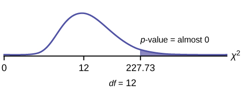

Tests of independence involve using a **contingency table**{: data-type="term"} of observed (data) values.

The test statistic for a **test of independence**{: data-type="term"} is similar to that of a goodness-of-fit test:

<math xmlns="http://www.w3.org/1998/Math/MathML"> <mrow> <munder> <mi>Σ</mi> <mrow> <mo stretchy="false">(</mo><mi>i</mi><mo>⋅</mo><mi>j</mi><mo stretchy="false">)</mo> </mrow> </munder> <mfrac> <mrow> <msup> <mrow> <mo stretchy="false">(</mo><mi>O</mi><mo>–</mo><mi>E</mi><mo stretchy="false">)</mo> </mrow> <mn>2</mn> </msup> </mrow> <mi>E</mi> </mfrac> </mrow> </math>

where:

* *O* = observed values
* *E* = expected values
* *i* = the number of rows in the table
* *j* = the number of columns in the table

There are <math xmlns="http://www.w3.org/1998/Math/MathML"><mi>i</mi><mo>⋅ </mo><mi>j</mi></math>

 terms of the form <math xmlns="http://www.w3.org/1998/Math/MathML"> <mrow> <mfrac> <mrow> <msup> <mrow> <mo stretchy="false">(</mo><mi>O</mi><mo>–</mo><mi>E</mi><mo stretchy="false">)</mo> </mrow> <mn>2</mn> </msup> </mrow> <mi>E</mi> </mfrac> </mrow> </math>

.

**A test of independence determines whether two factors are independent or not.** You first encountered the term independence in [Probability Topics](/m46938). As a review, consider the following example.

Note

The expected value for each cell needs to be at least five in order for you to use this test.

Suppose *A* = a speeding violation in the last year and *B* = a cell phone user while driving. If *A* and *B* are independent then *P*(*A* AND *B*) = *P*(*A*)*P*(*B*). *A* AND *B* is the event that a driver received a speeding violation last year and also used a cell phone while driving. Suppose, in a study of drivers who received speeding violations in the last year, and who used cell phone while driving, that 755 people were surveyed. Out of the 755, 70 had a speeding violation and 685 did not; 305 used cell phones while driving and 450 did not.

Let *y* = expected number of drivers who used a cell phone while driving and received speeding violations.

If *A* and *B* are independent, then *P*(*A* AND *B*) = *P*(*A*)*P*(*B*). By substitution,

<math xmlns="http://www.w3.org/1998/Math/MathML" display="block"> <mrow> <mfrac> <mi>y</mi> <mrow> <mn>755</mn> </mrow> </mfrac> <mo>=</mo><mrow><mo>(</mo> <mrow> <mfrac> <mrow> <mn>70</mn> </mrow> <mrow> <mn>755</mn> </mrow> </mfrac> </mrow> <mo>)</mo></mrow><mrow><mo>(</mo> <mrow> <mfrac> <mrow> <mn>305</mn> </mrow> <mrow> <mn>755</mn> </mrow> </mfrac> </mrow> <mo>)</mo></mrow> </mrow> </math>

Solve for *y*\: *y* = <math xmlns="http://www.w3.org/1998/Math/MathML"> <mrow> <mfrac> <mrow> <mo stretchy="false">(</mo><mn>70</mn><mo stretchy="false">)</mo><mo stretchy="false">(</mo><mn>305</mn><mo stretchy="false">)</mo> </mrow> <mrow> <mn>755</mn> </mrow> </mfrac> <mo>=</mo><mn>28.3</mn> </mrow> </math>

About 28 people from the sample are expected to use cell phones while driving and to receive speeding violations.

In a test of independence, we state the null and alternative hypotheses in words. Since the contingency table consists of **two factors**, the null hypothesis states that the factors are **independent** and the alternative hypothesis states that they are **not independent (dependent)**. If we do a test of independence using the example, then the null hypothesis is:

*H0*\: Being a cell phone user while driving and receiving a speeding violation are independent events.

If the null hypothesis were true, we would expect about 28 people to use cell phones while driving and to receive a speeding violation.

**The test of independence is always right-tailed** because of the calculation of the test statistic. If the expected and observed values are not close together, then the test statistic is very large and way out in the right tail of the chi-square curve, as it is in a goodness-of-fit.

The number of degrees of freedom for the test of independence is:

*df* = (number of columns - 1)(number of rows - 1)

The following formula calculates the **expected number** (*E*):

<math xmlns="http://www.w3.org/1998/Math/MathML" display="block"><mi>E</mi><mo>=</mo><mfrac><mtext>(row total)(column total)</mtext><mtext>total number surveyed</mtext></mfrac></math>

Try It

A sample of 300 students is taken. Of the students surveyed, 50 were music students, while 250 were not. Ninety-seven were on the honor roll, while 203 were not. If we assume being a music student and being on the honor roll are independent events, what is the expected number of music students who are also on the honor roll?

About 16 students are expected to be music students and on the honor roll.

In a volunteer group, adults 21 and older volunteer from one to nine hours each week to spend time with a disabled senior citizen. The program recruits among community college students, four-year college students, and nonstudents. In [\[link\]](#table-73248) is a **sample** of the adult volunteers and the number of hours they volunteer per week.

<table id="table-73248" summary="This table presents the observed hours per week volunteered by type of volunteer. The first row represents community-college students, the second row represents four-year college students, and the third row represents non-students. The second column is 1-3 hours per week, the third column is 4-6 hours per week, and the fourth column is 7-9 hours per week."><caption>Number of Hours Worked Per Week by Volunteer Type (Observed)The table contains <strong>observed (O)</strong> values (data). </caption><thead valign="top">
 <tr>
 <th>Type of Volunteer</th>
	<th>1–3 Hours</th>
	<th>4–6 Hours</th>
	<th>7–9 Hours</th>
 <th>Row Total</th>
 </tr>
 </thead><tbody valign="top">
<tr>
<td>Community College Students</td>
<td>111</td>
<td>96</td>
<td>48</td>
<td>255</td>
</tr>
<tr>
<td>Four-Year College Students</td>
<td>96</td>
<td>133</td>
<td>61</td>
<td>290</td>
</tr>
<tr>
<td>Nonstudents</td>
<td>91</td>
<td>150</td>
<td>53</td>
<td>294</td>
</tr>
<tr>
<td>Column Total</td>
<td>298</td>
<td>379</td>
<td>162</td>
<td>839</td>
</tr>
</tbody></table>

Is the number of hours volunteered **independent** of the type of volunteer?

The **observed table** and the question at the end of the problem, "Is the number of hours volunteered independent of the type of volunteer?" tell you this is a test of independence. The two factors are **number of hours volunteered** and **type of volunteer**. This test is always right-tailed.

*H0*: The number of hours volunteered is **independent** of the type of volunteer.

*Ha*: The number of hours volunteered is **dependent** on the type of volunteer.

The expected result are in [[link]](#table-73248a). <table id="table-73248a" summary="This table presents the expected hours per week volunteered by type of volunteer. The first row represents community-college students, the second row represents four-year college students, and the third row represents non-students. The second column is 1-3 hours per week, the third column is 4-6 hours per week, and the fourth column is 7-9 hours per week."><caption>Number of Hours Worked Per Week by Volunteer Type (Expected)The table contains <strong>expected</strong> (<em>E</em>) values (data).</caption><thead valign="top"><tr><th>Type of Volunteer</th> 	<th>1-3 Hours</th> 	<th>4-6 Hours</th> 	<th>7-9 Hours</th></tr></thead><tbody valign="top">
    <tr><td>Community College Students</td><td>90.57</td><td>115.19</td><td>49.24</td></tr>
    <tr><td>Four-Year College Students</td><td>103.00</td><td>131.00</td><td>56.00</td></tr>
    <tr><td>Nonstudents</td><td>104.42</td><td>132.81</td><td>56.77</td></tr>
   </tbody></table>

For example, the calculation for the expected frequency for the top left cell is

<math xmlns="http://www.w3.org/1998/Math/MathML" display="block"> <mrow> <mi>E</mi><mo>=</mo><mfrac> <mrow> <mo stretchy="false">(</mo><mtext>row total</mtext><mo stretchy="false">)</mo><mo stretchy="false">(</mo><mtext>column total</mtext><mo stretchy="false">)</mo> </mrow> <mrow> <mtext>total number surveyed</mtext> </mrow> </mfrac> <mo>=</mo><mfrac> <mrow> <mrow><mo>(</mo> <mrow> <mn>255</mn> </mrow> <mo>)</mo></mrow><mrow><mo>(</mo> <mrow> <mn>298</mn> </mrow> <mo>)</mo></mrow> </mrow> <mrow> <mn>839</mn> </mrow> </mfrac> <mo>=</mo><mn>90.57</mn> </mrow> </math>

**Calculate the test statistic:** *χ*2 = 12.99 (calculator or computer)
{: .finger}

**Distribution for the test:**<math xmlns="http://www.w3.org/1998/Math/MathML"><msubsup><mi>χ</mi><mn>4</mn><mn>2</mn></msubsup></math>

*df* = (3 columns – 1)(3 rows – 1) = (2)(2) = 4

**Graph:**

{:}

**Probability statement:** *p*-value=*P*(*χ2* &gt; 12.99) = 0.0113

**Compare *α* and the *p*-value:** Since no *α* is given, assume *α* = 0.05. *p*-value = 0.0113. *α* &gt; *p*-value.

**Make a decision:** Since *α* &gt; *p*-value, reject *H0*. This means that the factors are not independent.

**Conclusion:** At a 5% level of significance, from the data, there is sufficient evidence to conclude that the number of hours volunteered and the type of volunteer are dependent on one another.

For the example in [[link]](#table-73248a), if there had been another type of volunteer, teenagers, what would the degrees of freedom be?

Press the `MATRX` key and arrow over to `EDIT`. Press `1:[A]`. Press `3 ENTER 3 ENTER`. Enter the table values by row from [[link]](#table-73248a). Press `ENTER` after each. Press `2nd QUIT`. Press `STAT` and arrow over to `TESTS`. Arrow down to `C:χ2-TEST`. Press `ENTER`. You should see `Observed:[A] and Expected:[B]`. Arrow down to `Calculate`. Press `ENTER`. The test statistic is 12.9909 and the *p*-value = 0.0113. Do the procedure a second time, but arrow down to `Draw` instead of `calculate`.

Try It

The Bureau of Labor Statistics gathers data about employment in the United States. A sample is taken to calculate the number of U.S. citizens working in one of several industry sectors over time. [[link]](#fs-idp61742592) shows the results:

| Industry Sector | 2000 | 2010 | 2020 | Total |
|----------
| Nonagriculture wage and salary | 13,243 | 13,044 | 15,018 | 41,305 |
| Goods-producing, excluding agriculture | 2,457 | 1,771 | 1,950 | 6,178 |
| Services-providing | 10,786 | 11,273 | 13,068 | 35,127 |
| Agriculture, forestry, fishing, and hunting | 240 | 214 | 201 | 655 |
| Nonagriculture self-employed and unpaid family worker | 931 | 894 | 972 | 2,797 |
| Secondary wage and salary jobs in agriculture and private household industries | 14 | 11 | 11 | 36 |
| Secondary jobs as a self-employed or unpaid family worker | 196 | 144 | 152 | 492 |
| Total | 27,867 | 27,351 | 31,372 | 86,590 |
{: summary=""}

We want to know if the change in the number of jobs is independent of the change in years. State the null and alternative hypotheses and the degrees of freedom.

*H*0 : The number of jobs is independent of the year.

*Ha* : The number of jobs is dependent on the year.* * *
{: data-type="newline"}

*df* = 12

{:}

Press the `MATRX` key and arrow over to `EDIT`. Press `1:[A]`. Press `3 ENTER 3 ENTER`. Enter the table values by row. Press `ENTER` after each. Press `2nd QUIT`. Press `STAT` and arrow over to `TESTS`. Arrow down to `C:χ2-TEST`. Press `ENTER`. You should see `Observed:[A] and Expected:[B]`. Arrow down to `Calculate`. Press `ENTER`. The test statistic is 227.73 and the *p*−value = 5.90E - 42 = 0. Do the procedure a second time but arrow down to `Draw` instead of `calculate`.

De Anza College is interested in the relationship between anxiety level and the need to succeed in school. A random sample of 400 students took a test that measured anxiety level and need to succeed in school. [\[link\]](#element-875) shows the results. De Anza College wants to know if anxiety level and need to succeed in school are independent events.

<table id="element-875" summary="This table presents the need to succeed in school in the first column and the various anxiety levels (high to low) and the row total in the second to seventh columns. The first row is for high need, the second row is for medium need, third row is for low need, and the column total is in the fourth row."><caption>Need to Succeed in School vs. Anxiety Level</caption><thead valign="top">
 <tr>
 <th>Need to Succeed in School</th>
 <th>High 
Anxiety</th>
 <th>Med-high 
Anxiety</th>
 <th>Medium 
Anxiety</th>
 <th>Med-low 
Anxiety</th>
 <th>Low 
Anxiety</th>
 <th>Row Total</th>
 </tr>
</thead><tbody>
 <tr>
 <td>High Need</td>
 <td>35</td>
 <td>42</td>
 <td>53</td>
 <td>15</td>
 <td>10</td>
<td>155</td>
 </tr>
 <tr>
 <td>Medium Need</td>
 <td>18</td>
 <td>48</td>
 <td>63</td>
 <td>33</td>
 <td>31</td>
<td>193</td>
 </tr>
 <tr>
 <td>Low Need</td>
 <td>4</td>
 <td>5</td>
 <td>11</td>
 <td>15</td>
 <td>17</td>
<td>52</td>
 </tr>
 <tr>
 <td>Column Total</td>
 <td>57</td>
 <td>95</td>
 <td>127</td>
 <td>63</td>
 <td>58</td>
<td>400</td>
 </tr>
</tbody></table>

a. How many high anxiety level students are expected to have a high need to succeed in school?

a. The column total for a high anxiety level is 57. The row total for high need to succeed in school is 155. The sample size or total surveyed is 400.

<math xmlns="http://www.w3.org/1998/Math/MathML" display="block"><mi>E</mi><mo>=</mo><mfrac><mtext>(row total)(column total)</mtext><mtext>total surveyed</mtext></mfrac><mo>=</mo><mfrac><mrow><mn>155</mn><mo>⋅</mo><mn>57</mn></mrow><mn>400</mn></mfrac><mo>=</mo><mn>22.09</mn></math>

The expected number of students who have a high anxiety level and a high need to succeed in school is about 22.* * *
{: data-type="newline" data-count="2"}

b. If the two variables are independent, how many students do you expect to have a low need to succeed in school and a med-low level of anxiety?

b. The column total for a med-low anxiety level is 63. The row total for a low need to succeed in school is 52. The sample size or total surveyed is 400.

c. <math xmlns="http://www.w3.org/1998/Math/MathML"><mi>E</mi><mo>=</mo><mfrac><mtext>(row total)(column total)</mtext> <mtext>total surveyed</mtext></mfrac></math>

 = \_\_\_\_\_\_\_\_

c. <math xmlns="http://www.w3.org/1998/Math/MathML"><mi>E</mi><mo>=</mo><mfrac><mtext>(row total)(column total)</mtext><mtext>total surveyed</mtext></mfrac><mo> = </mo><mn>8.19</mn></math>

d. The expected number of students who have a med-low anxiety level and a low need to succeed in school is about \_\_\_\_\_\_\_\_.

d. 8

Try It

Refer back to the information in [[link]](#fs-idm24618832). How many service providing jobs are there expected to be in 2020? How many nonagriculture wage and salary jobs are there expected to be in 2020?

12,727, 14,965

# References

DiCamilo, Mark, Mervin Field, “Most Californians See a Direct Linkage between Obesity and Sugary Sodas. Two in Three Voters Support Taxing Sugar-Sweetened Beverages If Proceeds are Tied to Improving School Nutrition and Physical Activity Programs.” The Field Poll, released Feb. 14, 2013. Available online at http://field.com/fieldpollonline/subscribers/Rls2436.pdf (accessed May 24, 2013).

Harris Interactive, “Favorite Flavor of Ice Cream.” Available online at http://www.statisticbrain.com/favorite-flavor-of-ice-cream (accessed May 24, 2013)

“Youngest Online Entrepreneurs List.” Available online at http://www.statisticbrain.com/youngest-online-entrepreneur-list (accessed May 24, 2013).

# Chapter Review

To assess whether two factors are independent or not, you can apply the test of independence that uses the chi-square distribution. The null hypothesis for this test states that the two factors are independent. The test compares observed values to expected values. The test is right-tailed. Each observation or cell category must have an expected value of at least 5.

# Formula Review

Test of Independence

* The number of degrees of freedom is equal to (number of columns - 1)(number of rows - 1).
* The test statistic is
  <math xmlns="http://www.w3.org/1998/Math/MathML"> <mrow> <munder> <mi>Σ</mi> <mrow> <mo stretchy="false">(</mo><mi>i</mi><mo>⋅</mo><mi>j</mi><mo stretchy="false">)</mo> </mrow> </munder> <mfrac> <mrow> <msup> <mrow> <mo stretchy="false">(</mo><mi>O</mi><mo>–</mo><mi>E</mi><mo stretchy="false">)</mo> </mrow> <mn>2</mn> </msup> </mrow> <mi>E</mi> </mfrac> </mrow> </math>
  
  where *O* = observed values, *E* = expected values, *i* = the number of rows in the table, and *j* = the number of columns in the table.
* If the null hypothesis is true, the expected number
  <math xmlns="http://www.w3.org/1998/Math/MathML"> <mi>E</mi> <mo>=</mo> <mfrac> <mtext>(row total)(column total)</mtext> <mtext>total surveyed</mtext> </mfrac> </math>
  
  .

<section data-depth="1" class="practice" markdown="1">
*Determine the appropriate test to be used in the next three exercises.*

A pharmaceutical company is interested in the relationship between age and presentation of symptoms for a common viral infection. A random sample is taken of 500 people with the infection across different age groups.

a test of independence

The owner of a baseball team is interested in the relationship between player salaries and team winning percentage. He takes a random sample of 100 players from different organizations.

A marathon runner is interested in the relationship between the brand of shoes runners wear and their run times. She takes a random sample of 50 runners and records their run times as well as the brand of shoes they were wearing.

a test of independence

* * *
{: data-type="newline"}

*Use the following information to answer the next seven exercises:* Transit Railroads is interested in the relationship between travel distance and the ticket class purchased. A random sample of 200 passengers is taken. [\[link\]](#eip-956) shows the results. The railroad wants to know if a passenger’s choice in ticket class is independent of the distance they must travel.

| Traveling Distance | Third class | Second class | First class | Total |
|----------
| 1–100 miles | 21 | 14 | 6 | 41 |
| 101–200 miles | 18 | 16 | 8 | 42 |
| 201–300 miles | 16 | 17 | 15 | 48 |
| 301–400 miles | 12 | 14 | 21 | 47 |
| 401–500 miles | 6 | 6 | 10 | 22 |
| Total | 73 | 67 | 60 | 200 |
{: #eip-956 summary=".."}

State the hypotheses. * * *
{: data-type="newline"}

*H0*: \_\_\_\_\_\_\_ * * *
{: data-type="newline"}

*Ha*: \_\_\_\_\_\_\_

*df* = \_\_\_\_\_\_\_

8

How many passengers are expected to travel between 201 and 300 miles and purchase second-class tickets?

How many passengers are expected to travel between 401 and 500 miles and purchase first-class tickets?

6\.6

What is the test statistic?

What is the *p*-value?

0\.0435

What can you conclude at the 5% level of significance?

* * *
{: data-type="newline"}

*Use the following information to answer the next eight exercises:* An article in the New England Journal of Medicine, discussed a study on smokers in California and Hawaii. In one part of the report, the self-reported ethnicity and smoking levels per day were given. Of the people smoking at most ten cigarettes per day, there were 9,886 African Americans, 2,745 Native Hawaiians, 12,831 Latinos, 8,378 Japanese Americans and 7,650 whites. Of the people smoking 11 to 20 cigarettes per day, there were 6,514 African Americans, 3,062 Native Hawaiians, 4,932 Latinos, 10,680 Japanese Americans, and 9,877 whites. Of the people smoking 21 to 30 cigarettes per day, there were 1,671 African Americans, 1,419 Native Hawaiians, 1,406 Latinos, 4,715 Japanese Americans, and 6,062 whites. Of the people smoking at least 31 cigarettes per day, there were 759 African Americans, 788 Native Hawaiians, 800 Latinos, 2,305 Japanese Americans, and 3,970 whites.

Complete the table.

<table id="element-894" summary="This is a partially filled observation table with Ethnicity for the columns (2nd to 6th) and Total for the seventh column. The smoking level (4 rows) and the total constitute the rows of the table. 30 blank cells are available."><caption>Smoking Levels by Ethnicity (Observed)</caption><thead>
<tr>
<th>Smoking Level Per Day</th>
<th>African American</th>
<th>Native Hawaiian</th>
<th>Latino</th>
<th>Japanese Americans</th>
<th>White</th>
<th>TOTALS</th>
</tr>
</thead><tbody>
<tr>
<td>
1-10
</td>
<td />
<td />
<td />
<td />
<td />
<td />
</tr>
<tr>
<td>
11-20
</td>
<td />
<td />
<td />
<td />
<td />
<td />
</tr>
<tr>
<td>
21-30
</td>
<td />
<td />
<td />
<td />
<td />
<td />
</tr>
<tr>
<td>
31+
</td>
<td />
<td />
<td />
<td />
<td />
<td />
</tr>
<tr>
<td>
TOTALS
</td>
<td />
<td />
<td />
<td />
<td />
<td />
</tr>
</tbody></table>

<table summary=".."><caption></caption><thead>
<tr>
<th>Smoking Level Per Day</th>
<th>African American</th>
<th>Native Hawaiian</th>
<th>Latino</th>
<th>Japanese Americans</th>
<th>White</th>
<th>Totals</th>
</tr>
</thead><tbody>
<tr>
<td>1-10</td>
<td>9,886</td>
<td>2,745</td>
<td>12,831</td>
<td>8,378</td>
<td>7,650</td>
<td>41,490</td>
</tr>
<tr>
<td>11-20</td>
<td>6,514</td>
<td>3,062</td>
<td>4,932</td>
<td>10,680</td>
<td>9,877</td>
<td>35,065</td>
</tr>
<tr>
<td>21-30</td>
<td>1,671</td>
<td>1,419</td>
<td>1,406</td>
<td>4,715</td>
<td>6,062</td>
<td>15,273</td>
</tr>
<tr>
<td>31+</td>
<td>759</td>
<td>788</td>
<td>800</td>
<td>2,305</td>
<td>3,970</td>
<td>8,622</td>
</tr>
<tr>
<td>Totals</td>
<td>18,830</td>
<td>8,014</td>
<td>19,969</td>
<td>26,078</td>
<td>27,559</td>
<td>10,0450</td>
</tr>
</tbody></table>

State the hypotheses.* * *
{: data-type="newline"}

 *H0*: \_\_\_\_\_\_\_* * *
{: data-type="newline"}

 *Ha*: \_\_\_\_\_\_\_

Enter expected values in [[link]](#element-894). Round to two decimal places.

Calculate the following values:

<table summary=".."><caption></caption><thead>
    <tr>
     <th>Smoking Level Per Day</th>
     <th>African American</th>
     <th>Native Hawaiian</th>
     <th>Latino</th>
     <th>Japanese Americans</th>
     <th>White</th>
    </tr>
   </thead><tbody>
    <tr>
     <td>1-10</td>
     <td>7777.57</td>
     <td>3310.11</td>
     <td>8248.02</td>
     <td>10771.29</td>
     <td>11383.01</td>
    </tr>
    <tr>
     <td>11-20</td>
     <td>6573.16</td>
     <td>2797.52</td>
     <td>6970.76</td>
     <td>9103.29</td>
     <td>9620.27</td>
    </tr>
    <tr>
     <td>21-30</td>
     <td>2863.02</td>
     <td>1218.49</td>
     <td>3036.20</td>
     <td>3965.05</td>
     <td>4190.23</td>
    </tr>
    <tr>
     <td>31+</td>
     <td>1616.25</td>
     <td>687.87</td>
     <td>1714.01</td>
     <td>2238.37</td>
     <td>2365.49</td>
    </tr>
   </tbody></table>

*df* = \_\_\_\_\_\_\_

<math xmlns="http://www.w3.org/1998/Math/MathML"> <mrow> <msup> <mi>χ</mi> <mtext>2</mtext> </msup> </mrow> </math>

 test statistic = \_\_\_\_\_\_

10,301.8

*p*-value = \_\_\_\_\_\_

Is this a right-tailed, left-tailed, or two-tailed test? Explain why.

right

Graph the situation. Label and scale the horizontal axis. Mark the mean and test statistic. Shade in the region corresponding to the *p*-value.

{:}

State the decision and conclusion (in a complete sentence) for the following preconceived levels of *α*.

*α* = 0.05

1.  Decision: \_\_\_\_\_\_\_\_\_\_\_\_\_\_\_\_\_\_\_
2.  Reason for the decision: \_\_\_\_\_\_\_\_\_\_\_\_\_\_\_\_\_\_\_
3.  Conclusion (write out in a complete sentence): \_\_\_\_\_\_\_\_\_\_\_\_\_\_\_\_\_\_\_
{: data-number-style="lower-alpha"}

1.  Reject the null hypothesis.
2.  *p*-value &lt; alpha
3.  There is sufficient evidence to conclude that smoking level is dependent on ethnic group.
{: data-number-style="lower-alpha"}

*α* = 0.01

1.  Decision: \_\_\_\_\_\_\_\_\_\_\_\_\_\_\_\_\_\_\_
2.  Reason for the decision: \_\_\_\_\_\_\_\_\_\_\_\_\_\_\_\_\_\_\_
3.  Conclusion (write out in a complete sentence): \_\_\_\_\_\_\_\_\_\_\_\_\_\_\_\_\_\_\_
{: data-mark-suffix="." data-number-style="lower-alpha"}

</section>

# Homework

*For each problem, use a solution sheet to solve the hypothesis test problem. Go to [Appendix E](/m47882) for the chi-square solution sheet. Round expected frequency to two decimal places.*

A recent debate about where in the United States skiers believe the skiing is best prompted the following survey. Test to see if the best ski area is independent of the level of the skier.

| U.S. Ski Area | Beginner | Intermediate | Advanced |
|----------
| Tahoe | 20 | 30 | 40 |
| Utah | 10 | 30 | 60 |
| Colorado | 10 | 40 | 50 |
{: #id7787415 summary="The table has the level of the skier from second to fourth column with the first column as being U.S. Ski Area. There are three rows."}

Car manufacturers are interested in whether there is a relationship between the size of car an individual drives and the number of people in the driver’s family (that is, whether car size and family size are independent). To test this, suppose that 800 car owners were randomly surveyed with the results in [[link]](#id6178445). Conduct a test of independence.

| Family Size | Sub &amp; Compact | Mid-size | Full-size | Van &amp; Truck |
|----------
| 1 | 20 | 35 | 40 | 35 |
| 2 | 20 | 50 | 70 | 80 |
| 3–4 | 20 | 50 | 100 | 90 |
| 5+ | 20 | 30 | 70 | 70 |
{: #id6178445 summary="This table has family size in the first column and car size from columns 2-5. There are 4 rows."}

1.  *H0*: Car size is independent of family size.
2.  *Ha*: Car size is dependent on family size.
3.  *df* = 9
4.  chi-square distribution with *df* = 9
5.  test statistic = 15.8284
6.  *p*-value = 0.0706
7.  Check student’s solution.
8.  1.  Alpha: 0.05
    2.  Decision: Do not reject the null hypothesis.
    3.  Reason for decision: *p*-value &gt; alpha
    4.  Conclusion: At the 5% significance level, there is insufficient evidence to conclude that car size and family size are dependent.
    {: data-number-style="lower-roman"}
{: data-number-style="lower-alpha"}

College students may be interested in whether or not their majors have any effect on starting salaries after graduation. Suppose that 300 recent graduates were surveyed as to their majors in college and their starting salaries after graduation. [[link]](#id7852811) shows the data. Conduct a test of independence.

| Major | &lt; $50,000 | $50,000 – $68,999 | $69,000 + |
|----------
| English | 5 | 20 | 5 |
| Engineering | 10 | 30 | 60 |
| Nursing | 10 | 15 | 15 |
| Business | 10 | 20 | 30 |
| Psychology | 20 | 30 | 20 |
{: #id7852811 summary="The table has the starting salary along the top from column 2-4 and the major in the first column. There are 5 rows."}

Some travel agents claim that honeymoon hot spots vary according to age of the bride. Suppose that 280 recent brides were interviewed as to where they spent their honeymoons. The information is given in [[link]](#id78334ss42). Conduct a test of independence.

| Location | 20–29 | 30–39 | 40–49 | 50 and over |
|----------
| Niagara Falls | 15 | 25 | 25 | 20 |
| Poconos | 15 | 25 | 25 | 10 |
| Europe | 10 | 25 | 15 | 5 |
| Virgin Islands | 20 | 25 | 15 | 5 |
{: #id78334ss42 summary="This table has the age of the bride along the top from columns 2-4 and the location in the first column. There are 4 rows."}

1.  *H0*: Honeymoon locations are independent of bride’s age.
2.  *Ha*: Honeymoon locations are dependent on bride’s age.
3.  *df* = 9
4.  chi-square distribution with *df* = 9
5.  test statistic = 15.7027
6.  *p*-value = 0.0734
7.  Check student’s solution.
8.  1.  Alpha: 0.05
    2.  Decision: Do not reject the null hypothesis.
    3.  Reason for decision: *p*-value &gt; alpha
    4.  Conclusion: At the 5% significance level, there is insufficient evidence to conclude that honeymoon location and bride age are dependent.
    {: data-number-style="lower-roman"}
{: data-number-style="lower-alpha"}

A manager of a sports club keeps information concerning the main sport in which members participate and their ages. To test whether there is a relationship between the age of a member and his or her choice of sport, 643 members of the sports club are randomly selected. Conduct a test of independence.

| Sport | 18 - 25 | 26 - 30 | 31 - 40 | 41 and over |
|----------
| racquetball | 42 | 58 | 30 | 46 |
| tennis | 58 | 76 | 38 | 65 |
| swimming | 72 | 60 | 65 | 33 |
{: #id7834002 summary="The table has the age from columns 2-5 and sport in the first column. There are three rows."}

A major food manufacturer is concerned that the sales for its skinny french fries have been decreasing. As a part of a feasibility study, the company conducts research into the types of fries sold across the country to determine if the type of fries sold is independent of the area of the country. The results of the study are shown in [[link]](#id6092701). Conduct a test of independence.

| Type of Fries | Northeast | South | Central | West |
|----------
| skinny fries | 70 | 50 | 20 | 25 |
| curly fries | 100 | 60 | 15 | 30 |
| steak fries | 20 | 40 | 10 | 10 |
{: #id6092701 summary="The table has area of country along the top from columns 2-5 and type of fries in the first column. There are three rows."}

1.  *H0*: The types of fries sold are independent of the location.
2.  *Ha*: The types of fries sold are dependent on the location.
3.  *df* = 6
4.  chi-square distribution with *df* = 6
5.  test statistic =18.8369
6.  *p*-value = 0.0044
7.  Check student’s solution.
8.  1.  Alpha: 0.05
    2.  Decision: Reject the null hypothesis.
    3.  Reason for decision: *p*-value &lt; alpha
    4.  Conclusion: At the 5% significance level, There is sufficient evidence that types of fries and location are dependent.
    {: data-number-style="lower-roman"}
{: data-number-style="lower-alpha"}

According to Dan Lenard, an independent insurance agent in the Buffalo, N.Y. area, the following is a breakdown of the amount of life insurance purchased by males in the following age groups. He is interested in whether the age of the male and the amount of life insurance purchased are independent events. Conduct a test for independence.

| Age of Males | None | &lt; $200,000 | $200,000–$400,000 | $401,001–$1,000,000 | $1,000,001+ |
|----------
| 20–29 | 40 | 15 | 40 | 0 | 5 |
| 30–39 | 35 | 5 | 20 | 20 | 10 |
| 40–49 | 20 | 0 | 30 | 0 | 30 |
| 50+ | 40 | 30 | 15 | 15 | 10 |
{: #id7819090 summary="The table presents the amount of life insurance purchased along the top from columns 2-6 and age of males in the first column. There are 4 rows."}

Suppose that 600 thirty-year-olds were surveyed to determine whether or not there is a relationship between the level of education an individual has and salary. Conduct a test of independence.

| Annual Salary | Not a high school graduate | High school graduate | College graduate | Masters or doctorate |
|----------
| &lt; $30,000 | 15 | 25 | 10 | 5 |
| $30,000–$40,000 | 20 | 40 | 70 | 30 |
| $40,000–$50,000 | 10 | 20 | 40 | 55 |
| $50,000–$60,000 | 5 | 10 | 20 | 60 |
| $60,000+ | 0 | 5 | 10 | 150 |
{: #id7819454 summary="The table presents the level of education along the top from columns 2-5 and annual salary in the first column. There are 5 rows."}

1.  *H0*: Salary is independent of level of education.
2.  *Ha*: Salary is dependent on level of education.
3.  *df* = 12
4.  chi-square distribution with *df* = 12
5.  test statistic = 255.7704
6.  *p*-value = 0
7.  Check student’s solution.
8.  Alpha: 0.05
    
    Decision: Reject the null hypothesis.
    
    Reason for decision: *p*-value &lt; alpha
    
    Conclusion: At the 5% significance level, there is sufficient evidence to conclude that salary and level of education are dependent.
{: data-number-style="lower-alpha"}

*Read the statement and decide whether it is true or false.*

The number of degrees of freedom for a test of independence is equal to the sample size minus one.

The test for independence uses tables of observed and expected data values.

true

The test to use when determining if the college or university a student chooses to attend is related to his or her socioeconomic status is a test for independence.

In a test of independence, the expected number is equal to the row total multiplied by the column total divided by the total surveyed.

true

An ice cream maker performs a nationwide survey about favorite flavors of ice cream in different geographic areas of the U.S. Based on [[link]](#fs-idp162013328), do the numbers suggest that geographic location is independent of favorite ice cream flavors? Test at the 5% significance level.

| U.S. region/Flavor | Strawberry | Chocolate | Vanilla | Rocky Road | Mint Chocolate Chip | Pistachio | Row total |
|----------
| West | 12 | 21 | 22 | 19 | 15 | 8 | 97 |
| Midwest | 10 | 32 | 22 | 11 | 15 | 6 | 96 |
| East | 8 | 31 | 27 | 8 | 15 | 7 | 96 |
| South | 15 | 28 | 30 | 8 | 15 | 6 | 102 |
| Column Total | 45 | 112 | 101 | 46 | 60 | 27 | 391 |
{: summary=""}

[[link]](#fs-idp932416) provides a recent survey of the youngest online entrepreneurs whose net worth is estimated at one million dollars or more. Their ages range from 17 to 30. Each cell in the table illustrates the number of entrepreneurs who correspond to the specific age group and their net worth. Are the ages and net worth independent? Perform a test of independence at the 5% significance level.

| Age Group\ Net Worth Value (in millions of US dollars) | 1–5 | 6–24 | ≥25 | Row Total |
|----------
| 17–25 | 8 | 7 | 5 | 20 |
| 26–30 | 6 | 5 | 9 | 20 |
| Column Total | 14 | 12 | 14 | 40 |
{: summary=""}

1.  *H0*: Age is independent of the youngest online entrepreneurs’ net worth.
2.  *Ha*: Age is dependent on the net worth of the youngest online entrepreneurs.
3.  *df* = 2
4.  chi-square distribution with *df* = 2
5.  test statistic = 1.76
6.  *p*-value 0.4144
7.  Check student’s solution.
8.  1.  Alpha: 0.05
    2.  Decision: Do not reject the null hypothesis.
    3.  Reason for decision: *p*-value &gt; alpha
    4.  Conclusion: At the 5% significance level, there is insufficient evidence to conclude that age and net worth for the youngest online entrepreneurs are dependent.
    {: data-number-style="lower-roman"}
{: data-number-style="lower-alpha"}

A 2013 poll in California surveyed people about taxing sugar-sweetened beverages. The results are presented in [[link]](#eip-idm61320176), and are classified by ethnic group and response type. Are the poll responses independent of the participants’ ethnic group? Conduct a test of independence at the 5% significance level.

| Opinion/Ethnicity | Asian-American | White/Non-Hispanic | African-American | Latino | Row Total |
|----------
| Against tax | 48 | 433 | 41 | 160 | 628 |
| In Favor of tax | 54 | 234 | 24 | 147 | 459 |
| No opinion | 16 | 43 | 16 | 19 | 84 |
| Column Total | 118 | 710 | 71 | 272 | 1171 |
{: #eip-idm61320176 summary=""}

