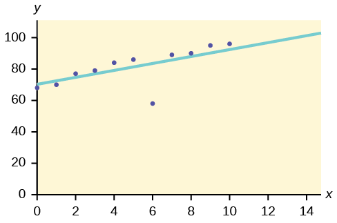
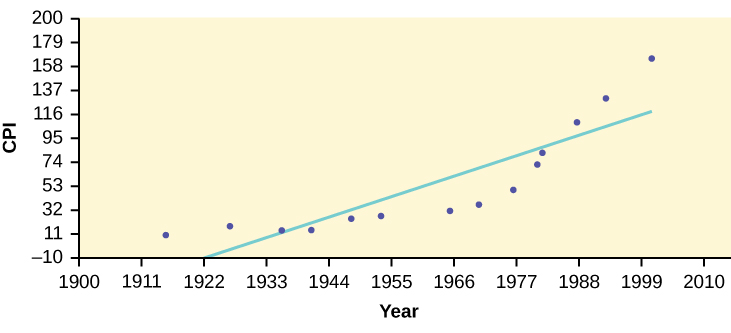
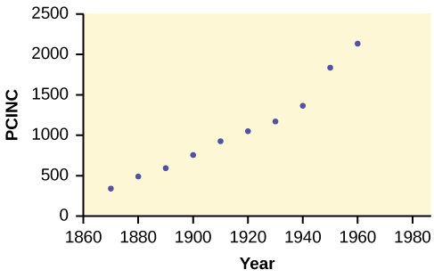
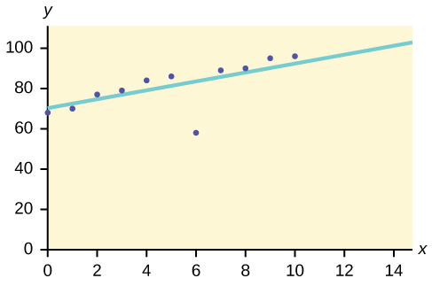

In some data sets, there are values **(observed data points)** called **outliers**{: data-type="term"}. **Outliers are observed data points that are far from the least squares line.** They have large \"errors\", where the \"error\" or residual is the vertical distance from the line to the point.

Outliers need to be examined closely. Sometimes, for some reason or another, they should not be included in the analysis of the data. It is possible that an outlier is a result of erroneous data. Other times, an outlier may hold valuable information about the population under study and should remain included in the data. The key is to examine carefully what causes a data point to be an outlier.

Besides outliers, a sample may contain one or a few points that are called **influential points**{: data-type="term"}. Influential points are observed data points that are far from the other observed data points in the horizontal direction. These points may have a big effect on the slope of the regression line. To begin to identify an influential point, you can remove it from the data set and see if the slope of the regression line is changed significantly.

Computers and many calculators can be used to identify outliers from the data. Computer output for regression analysis will often identify both outliers and influential points so that you can examine them.

# Identifying Outliers

We could guess at outliers by looking at a graph of the scatterplot and best fit-line. However, we would like some guideline as to how far away a point needs to be in order to be considered an outlier. <strong> As a rough rule of thumb, we can flag any point that is located further than two standard deviations above or below the best-fit line as an outlier</strong>. The standard deviation used is the standard deviation of the residuals or errors.

We can do this visually in the scatter plot by drawing an extra pair of lines that are two standard deviations above and below the best-fit line. Any data points that are outside this extra pair of lines are flagged as potential outliers. Or we can do this numerically by calculating each residual and comparing it to twice the standard deviation. On the TI-83, 83+, or 84+, the graphical approach is easier. The graphical procedure is shown first, followed by the numerical calculations. You would generally need to use only one of these methods.
{: .finger}

In the [third exam/final exam example](/m17092#element-22), you can determine if there is an outlier or not. If there is an outlier, as an exercise, delete it and fit the remaining data to a new line. For this example, the new line ought to fit the remaining data better. This means the **SSE** should be smaller and the correlation coefficient ought to be closer to 1 or –1.

Graphical Identification of OutliersWith the TI-83, 83+, 84+ graphing calculators, it is easy to identify the outliers graphically and visually. If we were to measure the vertical distance from any data point to the corresponding point on the line of best fit and that distance were equal to 2*s* or more, then we would consider the data point to be "too far" from the line of best fit. We need to find and graph the lines that are two standard deviations below and above the regression line. Any points that are outside these two lines are outliers. We will call these lines Y2 and Y3:
{: .finger}

As we did with the equation of the regression line and the correlation coefficient, we will use technology to calculate this standard deviation for us. Using the **LinRegTTest** with this data, scroll down through the output screens to find ***s* = 16.412**.

Line Y2 = –173.5 + 4.83*x* –2(16.4) and line Y3 = –173.5 + 4.83*x* + 2(16.4)* * *
{: data-type="newline"}

* * *
{: data-type="newline"}

where *ŷ* = –173.5 + 4.83*x* is the line of best fit. Y2 and Y3 have the same slope as the line of best fit.

Graph the scatterplot with the best fit line in equation Y1, then enter the two extra lines as Y2 and Y3 in the "Y="equation editor and press ZOOM 9. You will find that the only data point that is not between lines Y2 and Y3 is the point *x* = 65, *y* = 175. On the calculator screen it is just barely outside these lines. The outlier is the student who had a grade of 65 on the third exam and 175 on the final exam; this point is further than two standard deviations away from the best-fit line.

Sometimes a point is so close to the lines used to flag outliers on the graph that it is difficult to tell if the point is between or outside the lines. On a computer, enlarging the graph may help; on a small calculator screen, zooming in may make the graph clearer. Note that when the graph does not give a clear enough picture, you can use the numerical comparisons to identify outliers.

{: #eip-idp140675136 data-media-type="image/jpeg"}

Try It

Identify the potential outlier in the scatter plot. The standard deviation of the residuals or errors is approximately 8.6.

{: data-media-type="image/png"}

The outlier appears to be at (6, 58). The expected *y* value on the line for the point (6, 58) is approximately 82. Fifty-eight is 24 units from 82. Twenty-four is more than two standard deviations (2*s* = (2)(8.6) = 17.2 ). So 82 is more than two standard deviations from 58, which makes (6, 58) a potential outlier.

# Numerical Identification of Outliers   {#eip-212}

In [\[link\]](#element-4662), the first two columns are the third-exam and final-exam data. The third column shows the predicted *ŷ* values calculated from the line of best fit: *ŷ* = –173.5 + 4.83*x*. The residuals, or errors, have been calculated in the fourth column of the table: observed *y* value−predicted y value = *y* − *ŷ*.

*s* is the standard deviation of all the *y* − *ŷ* = *ε* values where *n* = the total number of data points. If each residual is calculated and squared, and the results are added, we get the SSE. The standard deviation of the residuals is calculated from the SSE as:

<math xmlns="http://www.w3.org/1998/Math/MathML"> <mrow> <mi>s</mi><mo>=</mo><msqrt> <mrow> <mfrac> <mrow> <mi>S</mi><mi>S</mi><mi>E</mi> </mrow> <mrow> <mi>n</mi><mo>−</mo><mn>2</mn> </mrow> </mfrac> </mrow> </msqrt> </mrow> </math>

Note

We divide by (*n* – 2) because the regression model involves two estimates.

Rather than calculate the value of *s* ourselves, we can find *s* using the computer or calculator. For this example, the calculator function LinRegTTest found *s* = 16.4 as the standard deviation of the residuals 35 –17 16 –6 –19 9 3 –1 –10 –9 –1 .
{: .finger}

| *x* | *y* | *ŷ* | *y* – *ŷ* |
|----------
| 65 | 175 | 140 | 175 – 140 = 35 |
| 67 | 133 | 150 | 133 – 150= –17 |
| 71 | 185 | 169 | 185 – 169 = 16 |
| 71 | 163 | 169 | 163 – 169 = –6 |
| 66 | 126 | 145 | 126 – 145 = –19 |
| 75 | 198 | 189 | 198 – 189 = 9 |
| 67 | 153 | 150 | 153 – 150 = 3 |
| 70 | 163 | 164 | 163 – 164 = –1 |
| 71 | 159 | 169 | 159 – 169 = –10 |
| 69 | 151 | 160 | 151 – 160 = –9 |
| 69 | 159 | 160 | 159 – 160 = –1 |
{: #element-4662 summary="The table contains 4 columns and 11 rows of calculation. The first two columns contain the x and y data values. The third column contains the values predicted by the regression line. The fourth column contains the errors or residuals, calculated as the observed y value minus the predicted value."}

We are looking for all data points for which the residual is greater than 2*s* = 2(16.4) = 32.8 or less than –32.8. Compare these values to the residuals in column four of the table. The only such data point is the student who had a grade of 65 on the third exam and 175 on the final exam; the residual for this student is 35.

# How does the outlier affect the best fit line?

Numerically and graphically, we have identified the point (65, 175) as an outlier. We should re-examine the data for this point to see if there are any problems with the data. If there is an error, we should fix the error if possible, or delete the data. If the data is correct, we would leave it in the data set. For this problem, we will suppose that we examined the data and found that this outlier data was an error. Therefore we will continue on and delete the outlier, so that we can explore how it affects the results, as a learning experience.

Compute a new best-fit line and correlation coefficient using the ten remaining points: On the TI-83, TI-83+, TI-84+ calculators, delete the outlier from L1 and L2. Using the LinRegTTest, the new line of best fit and the correlation coefficient are:
{: .finger}

*ŷ* = –355.19 + 7.39*x* and *r* = 0.9121

The new line with *r* = 0.9121 is a stronger correlation than the original (*r* = 0.6631) because *r* = 0.9121 is closer to one. This means that the new line is a better fit to the ten remaining data values. The line can better predict the final exam score given the third exam score.

# Numerical Identification of Outliers: Calculating *s* and Finding Outliers Manually

If you do not have the function LinRegTTest, then you can calculate the outlier in the first example by doing the following. * * *
{: data-type="newline"}

* * *
{: data-type="newline"}

 First, **square each \\\|*y* – *ŷ*\\\|**

The squares are  352 172 162 62 192 92 32 12 102 92 12 

**Then, add (sum) all the \\\|*y* – *ŷ*\\\| squared terms** using the formula

<math xmlns="http://www.w3.org/1998/Math/MathML"> <mrow> <mover> <mrow> <munder> <mi>Σ</mi> <mrow> <mi>i</mi><mo> </mo><mo>=</mo><mo> </mo><mn>1</mn> </mrow> </munder> </mrow> <mrow> <mn>11</mn> </mrow> </mover> <msup> <mrow> <mrow><mo>(</mo> <mrow> <mo>\|</mo><msub> <mi>y</mi> <mi>i</mi> </msub> <mo>−</mo><msub> <mover accent="true"> <mi>y</mi> <mo>^</mo> </mover> <mi>i</mi> </msub> <mo>\|</mo> </mrow> <mo>)</mo></mrow> </mrow> <mn>2</mn> </msup> <mo>=</mo><mover> <mrow> <munder> <mi>Σ</mi> <mrow> <mi>i</mi><mo> </mo><mo>=</mo><mo> </mo><mn>1</mn> </mrow> </munder> </mrow> <mrow> <mn>11</mn> </mrow> </mover> <msub> <mi>ε</mi> <mi>i</mi> </msub> <msup> <mrow /> <mn>2</mn> </msup> </mrow> </math>

 (Recall that *y*i – *ŷ*i = *ε*i.)

= 352 + 172 + 162 + 62 + 192 + 92 + 32 + 12 + 102 + 92 + 12

= 2440 = **SSE**. The result, **SSE** is the Sum of Squared Errors.

**Next, calculate *s*, the standard deviation of all the *y* – *ŷ* = *ε* values where *n* = the total number of data points.**

The calculation is <math xmlns="http://www.w3.org/1998/Math/MathML"><mi>s</mi><mo>=</mo> <msqrt> <mfrac> <mrow><mtext>SSE</mtext></mrow> <mrow><mi>n</mi><mo>–</mo><mn>2</mn></mrow> </mfrac> </msqrt> </math>

.

For the third exam/final exam problem, <math xmlns="http://www.w3.org/1998/Math/MathML"><mi>s</mi><mo>=</mo> <msqrt> <mfrac> <mrow><mn>2440</mn></mrow> <mrow><mn>11</mn><mo>–</mo><mn>2</mn></mrow> </mfrac> </msqrt> <mo>=</mo><mn>16.47</mn> </math>

.

Next, multiply *s* by 1.9: * * *
{: data-type="newline"}

(1.9)(16.47) = 31.29 * * *
{: data-type="newline"}

31.29 is almost 2 standard deviations away from the mean of the *y* – *ŷ* values.

If we were to measure the vertical distance from any data point to the corresponding point on the line of best fit and that distance is at least 1.9*s*, then we would consider the data point to be \"too far\" from the line of best fit. We call that point a **potential outlier**{: data-type="term"}.

For the example, if any of the \\\|*y* – *ŷ*\\\| values are **at least** 31.29, the corresponding (*x*, *y*) data point is a potential outlier.

For the third exam/final exam problem, all the \\\|*y* – *ŷ*\\\|\'s are less than 31.29 except for the first one which is 35.

35 &gt; 31.29 That is, \\\|*y* – *ŷ*\\\| ≥ (1.9)(s)

The point which corresponds to \\\|*y* – *ŷ*\\\| = 35 is (65, 175). **Therefore, the data point (65,175) is a potential outlier.** For this example, we will delete it. (Remember, we do not always delete an outlier.) 

Note
When outliers are deleted, the researcher should either record that data was deleted, and why, or the researcher should provide results both with and without the deleted data. If data is erroneous and the correct values are known (e.g., student one actually scored a 70 instead of a 65), then this correction can be made to the data.

* * *
{: data-type="newline"}

* * *
{: data-type="newline"}

The next step is to compute a new best-fit line using the ten remaining points. The new line of best fit and the correlation coefficient are:

*ŷ* = –355.19 + 7.39*x* and *r* = 0.9121

Using this new line of best fit (based on the remaining ten data points in the [third exam/final exam example](/m17092##element-22)), what would a student who receives a 73 on the third exam expect to receive on the final exam? Is this the same as the prediction made using the original line?

Using the new line of best fit, *ŷ* = –355.19 + 7.39(73) = 184.28. A student who scored 73 points on the third exam would expect to earn 184 points on the final exam. * * *
{: data-type="newline"}

* * *
{: data-type="newline"}

 The original line predicted *ŷ* = –173.51 + 4.83(73) = 179.08 so the prediction using the new line with the outlier eliminated differs from the original prediction.

Try It

The data points for the graph from the [third exam/final exam example](/m17092##element-22) are as follows: (1, 5), (2, 7), (2, 6), (3, 9), (4, 12), (4, 13), (5, 18), (6, 19), (7, 12), and (7, 21). Remove the outlier and recalculate the line of best fit. Find the value of *ŷ* when *x* = 10.

*ŷ* = 1.04 + 2.96*x*; 30.64

The Consumer Price Index (CPI) measures the average change over time in the prices paid by urban consumers for consumer goods and services. The CPI affects nearly all Americans because of the many ways it is used. One of its biggest uses is as a measure of inflation. By providing information about price changes in the Nation\'s economy to government, business, and labor, the CPI helps them to make economic decisions. The President, Congress, and the Federal Reserve Board use the CPI\'s trends to formulate monetary and fiscal policies. In the following table, *x* is the year and *y* is the CPI.

<table id="element-127" summary=".."><caption>Data</caption><thead>
  <tr>
    <th><em>x</em></th>
    <th><em>y</em></th>
    <th><em>x</em></th>
    <th><em>y</em></th>
  </tr>
</thead><tbody>
<tr>
<td>1915 </td>
<td>10.1 </td>
<td>1969</td>
<td>36.7</td>
</tr>
<tr>
<td>1926</td>
<td>17.7</td>
<td>1975</td>
<td>49.3</td>
</tr>
<tr>
<td>1935</td>
<td>13.7</td>
<td>1979</td>
<td>72.6</td>
</tr>
<tr>
<td>1940</td>
<td>14.7</td>
<td>1980</td>
<td>82.4</td>
</tr>
<tr>
<td>1947</td>
<td>24.1</td>
<td>1986</td>
<td>109.6</td>
</tr>
<tr>
<td>1952</td>
<td>26.5</td>
<td>1991</td>
<td>130.7</td>
</tr>
<tr>
<td>1964</td>
<td>31.0</td>
<td>1999</td>
<td>166.6</td>
</tr>
</tbody></table>

1.  Draw a scatterplot of the data.
2.  Calculate the least squares line. Write the equation in the form *ŷ* = *a* + *bx*.
3.  Draw the line on the scatterplot.
4.  Find the correlation coefficient. Is it significant?
5.  What is the average CPI for the year 1990?
{: data-number-style="lower-alpha"}

1.  See [[link]](#eip-idp35936320).
2.  *ŷ* = –3204 + 1.662*x* is the equation of the line of best fit.
3.  *r* = 0.8694
4.  The number of data points is *n* = 14. Use the 95% Critical Values of the Sample Correlation Coefficient table at the end of Chapter 12. *n* – 2 = 12. The corresponding critical value is 0.532. Since 0.8694 &gt; 0.532, *r* is significant.
    * * *
    {: data-type="newline"}
    
    *ŷ* = –3204 + 1.662(1990) = 103.4 CPI
5.  Using the calculator LinRegTTest, we find that *s* = 25.4 ; graphing the lines Y2 = –3204 + 1.662X – 2(25.4) and Y3 = –3204 + 1.662X + 2(25.4) shows that no data values are outside those lines, identifying no outliers. (Note that the year 1999 was very close to the upper line, but still inside it.)
{: data-number-style="lower-alpha"}

{: #eip-idp35936320 data-media-type="image/jpeg"}

Note

In the example, notice the pattern of the points compared to the line. Although the correlation coefficient is significant, the pattern in the scatterplot indicates that a curve would be a more appropriate model to use than a line. In this example, a statistician should prefer to use other methods to fit a curve to this data, rather than model the data with the line we found. In addition to doing the calculations, it is always important to look at the scatterplot when deciding whether a linear model is appropriate.

If you are interested in seeing more years of data, visit the Bureau of Labor Statistics CPI website ftp://ftp.bls.gov/pub/special.requests/cpi/cpiai.txt; our data is taken from the column entitled \"Annual Avg.\" (third column from the right). For example you could add more current years of data. Try adding the more recent years: 2004: CPI = 188.9; 2008: CPI = 215.3; 2011: CPI = 224.9. See how it affects the model. (Check: *ŷ* = –4436 + 2.295*x*; *r* = 0.9018. Is *r* significant? Is the fit better with the addition of the new points?)

Try It

The following table shows economic development measured in per capita income PCINC.

| Year | PCINC | Year | PCINC |
|----------
| 1870 | 340 | 1920 | 1050 |
| 1880 | 499 | 1930 | 1170 |
| 1890 | 592 | 1940 | 1364 |
| 1900 | 757 | 1950 | 1836 |
| 1910 | 927 | 1960 | 2132 |
{: #eip-idm147482064 summary=".."}

1.  What are the independent and dependent variables?
2.  Draw a scatter plot.
3.  Use regression to find the line of best fit and the correlation coefficient.
4.  Interpret the significance of the correlation coefficient.
5.  Is there a linear relationship between the variables?
6.  Find the coefficient of determination and interpret it.
7.  What is the slope of the regression equation? What does it mean?
8.  Use the line of best fit to estimate PCINC for 1900, for 2000.
9.  Determine if there are any outliers.
{: data-number-style="lower-alpha"}

a. The independent variable (*x*) is the year and the dependent variable (*y*) is the per capita income.

b. {: data-media-type="image/jpeg"}

c. *ŷ* = 18.61x – 34574; *r* = 0.9732

d. At *df* = 8, the critical value is 0.632. The *r* value is significant because it is greater than the critical value.

e. There does appear to be a linear relationship between the variables.

f. The coefficient of determination is 0.947, which means that 94.7% of the variation in PCINC is explained by the variation in the years.

g. and h. The slope of the regression equation is 18.61, and it means that per capita income increases by $18.61 for each passing year. *ŷ* = 785 when the year is 1900, and *ŷ* = 2,646 when the year is 2000.

i. There do not appear to be any outliers.

# 95% Critical Values of the Sample Correlation Coefficient Table   {#eip-518}

| Degrees of Freedom: *n* – 2 | Critical Values: (+ and –) |
|----------
| 1 | 0.997 |
| 2 | 0.950 |
| 3 | 0.878 |
| 4 | 0.811 |
| 5 | 0.754 |
| 6 | 0.707 |
| 7 | 0.666 |
| 8 | 0.632 |
| 9 | 0.602 |
| 10 | 0.576 |
| 11 | 0.555 |
| 12 | 0.532 |
| 13 | 0.514 |
| 14 | 0.497 |
| 15 | 0.482 |
| 16 | 0.468 |
| 17 | 0.456 |
| 18 | 0.444 |
| 19 | 0.433 |
| 20 | 0.423 |
| 21 | 0.413 |
| 22 | 0.404 |
| 23 | 0.396 |
| 24 | 0.388 |
| 25 | 0.381 |
| 26 | 0.374 |
| 27 | 0.367 |
| 28 | 0.361 |
| 29 | 0.355 |
| 30 | 0.349 |
| 40 | 0.304 |
| 50 | 0.273 |
| 60 | 0.250 |
| 70 | 0.232 |
| 80 | 0.217 |
| 90 | 0.205 |
| 100 | 0.195 |
{: #eip-idm31993488 summary="This table presents the 95% Critical Values of the Sample Correlation Coefficient with Degrees of Freedom in the first column and Critical Values in the second column."}

Regression (Distance from School)

Class Time:

Names:

Student Learning Outcomes

* The student will calculate and construct the line of best fit between two variables.
* The student will evaluate the relationship between two variables to determine if that relationship is significant.

Collect the DataUse eight members of your class for the sample. Collect bivariate data (distance an individual lives from school, the cost of supplies for the current term).

1.  Complete the table.
    | Distance from school | Cost of supplies this term |
    |----------
    |  |  |
    |  |  |
    |  |  |
    |  |  |
    |  |  |
    |  |  |
    |  |  |
    |  |  |
    {: summary="Blank table with distance from school in the first column and cost of supplies this term in the second column. 16 empty cells"}

2.  Which variable should be the dependent variable and which should be the independent variable? Why?
3.  Graph “distance” vs. “cost.” Plot the points on the graph. Label both axes with words. Scale both axes.{: #id6749459 data-media-type="image/png"}

Analyze the DataEnter your data into your calculator or computer. Write the linear equation, rounding to four decimal places.

1.  Calculate the following:
    1.  *a* = \\\_\\\_\\\_\\\_\\\_\\\_
    2.  *b* = \\\_\\\_\\\_\\\_\\\_\\\_
    3.  correlation = \\\_\\\_\\\_\\\_\\\_\\\_
    4.  *n* = \\\_\\\_\\\_\\\_\\\_\\\_
    5.  equation: *ŷ* = \\\_\\\_\\\_\\\_\\\_\\\_
    6.  Is the correlation significant? Why or why not? (Answer in one to three complete sentences.)
    {: data-number-style="lower-alpha"}

2.  Supply an answer for the following senarios:
    1.  For a person who lives eight miles from campus, predict the total cost of supplies this term:
    2.  For a person who lives eighty miles from campus, predict the total cost of supplies this term:
    {: data-number-style="lower-alpha"}

3.  Obtain the graph on your calculator or computer. Sketch the regression line. {: #id6749694 data-media-type="image/png"}

{: data-number-style="arabic"}

Discussion Questions

1.  Answer each question in complete sentences.
    1.  Does the line seem to fit the data? Why?
    2.  What does the correlation imply about the relationship between the distance and the cost?
    {: data-number-style="lower-alpha"}

2.  Are there any outliers? If so, which point is an outlier?
3.  Should the outlier, if it exists, be removed? Why or why not?

Regression (Textbook Cost)

Class Time:

Names:

Student Learning Outcomes

* The student will calculate and construct the line of best fit between two variables.
* The student will evaluate the relationship between two variables to determine if that relationship is significant.

Collect the Data Survey ten textbooks. Collect bivariate data (number of pages in a textbook, the cost of the textbook).

1.  Complete the table.
    | Number of pages | Cost of textbook |
    |----------
    |  |  |
    |  |  |
    |  |  |
    |  |  |
    |  |  |
    |  |  |
    |  |  |
    |  |  |
    {: summary="The blank table has number of pages in the first column and cost of textbook in the second column. 20 empty cells."}

2.  Which variable should be the dependent variable and which should be the independent variable? Why?
3.  Graph “pages” vs. “cost.” Plot the points on the graph in \"[Analyze the Data](#)\". Label both axes with words. Scale both axes.

Analyze the Data Enter your data into your calculator or computer. Write the linear equation, rounding to four decimal places.

1.  Calculate the following:
    1.  *a* = \\\_\\\_\\\_\\\_\\\_\\\_
    2.  *b* = \\\_\\\_\\\_\\\_\\\_\\\_
    3.  correlation = \\\_\\\_\\\_\\\_\\\_\\\_
    4.  *n* = \\\_\\\_\\\_\\\_\\\_\\\_
    5.  equation: *y* = \\\_\\\_\\\_\\\_\\\_\\\_
    6.  Is the correlation significant? Why or why not? (Answer in complete sentences.)
    {: data-number-style="lower-alpha"}

2.  Supply an answer for the following senarios:
    1.  For a textbook with 400 pages, predict the cost.
    2.  For a textbook with 600 pages, predict the cost.
    {: data-number-style="lower-alpha"}

3.  Obtain the graph on your calculator or computer. Sketch the regression line. {: #id19863024 data-media-type="image/png"}

Discussion Questions

1.  Answer each question in complete sentences.
    1.  Does the line seem to fit the data? Why?
    2.  What does the correlation imply about the relationship between the number of pages and the cost?
    {: data-number-style="lower-alpha"}

2.  Are there any outliers? If so, which point(s) is an outlier?
3.  Should the outlier, if it exists, be removed? Why or why not?

Regression (Fuel Efficiency)

Class Time:

Names:

Student Learning Outcomes

* The student will calculate and construct the line of best fit between two variables.
* The student will evaluate the relationship between two variables to determine if that relationship is significant.

Collect the DataUse the most recent April issue of Consumer Reports. It will give the total fuel efficiency (in miles per gallon) and weight (in pounds) of new model cars with automatic transmissions. We will use this data to determine the relationship, if any, between the fuel efficiency of a car and its weight.

1.  Using your random number generator, randomly select 20 cars from the list and record their weights and fuel efficiency into [\[link\]](#id7895697570).
    | Weight | Fuel Efficiency |
    |----------
    |  |  |
    |  |  |
    |  |  |
    |  |  |
    |  |  |
    |  |  |
    |  |  |
    |  |  |
    |  |  |
    |  |  |
    |  |  |
    |  |  |
    |  |  |
    |  |  |
    |  |  |
    |  |  |
    |  |  |
    |  |  |
    |  |  |
    {: #id7895697570 summary="Blank table with weight in the first column and fuel efficiency in the second column. 40 empty cells."}

2.  Which variable should be the dependent variable and which should be the independent variable? Why?
3.  By hand, do a scatterplot of “weight” vs. “fuel efficiency”. Plot the points on graph paper. Label both axes with words. Scale both axes accurately. {: #id21784687 data-media-type="image/pngg"}

Analyze the Data Enter your data into your calculator or computer. Write the linear equation, rounding to 4 decimal places.

1.  Calculate the following:
    1.  *a* = \\\_\\\_\\\_\\\_\\\_\\\_
    2.  *b* = \\\_\\\_\\\_\\\_\\\_\\\_
    3.  correlation = \\\_\\\_\\\_\\\_\\\_\\\_
    4.  *n* = \\\_\\\_\\\_\\\_\\\_\\\_
    5.  equation: *ŷ* = \\\_\\\_\\\_\\\_\\\_\\\_
    {: data-number-style="lower-alpha"}

2.  Obtain the graph of the regression line on your calculator. Sketch the regression line on the same axes as your scatter plot.

Discussion Questions

1.  Is the correlation significant? Explain how you determined this in complete sentences.
2.  Is the relationship a positive one or a negative one? Explain how you can tell and what this means in terms of weight and fuel efficiency.
3.  In one or two complete sentences, what is the practical interpretation of the slope of the least squares line in terms of fuel efficiency and weight?
4.  For a car that weighs 4,000 pounds, predict its fuel efficiency. Include units.
5.  Can we predict the fuel efficiency of a car that weighs 10,000 pounds using the least squares line? Explain why or why not.
6.  Answer each question in complete sentences.
    1.  Does the line seem to fit the data? Why or why not?
    2.  What does the correlation imply about the relationship between fuel efficiency and weight of a car? Is this what you expected?
    {: data-number-style="lower-alpha"}

7.  Are there any outliers? If so, which point is an outlier?
{: data-mark-suffix="."}

# References   {#eip-604}

Data from the House Ways and Means Committee, the Health and Human Services Department.

Data from Microsoft Bookshelf.

Data from the United States Department of Labor, the Bureau of Labor Statistics.

Data from the Physician’s Handbook, 1990.

Data from the United States Department of Labor, the Bureau of Labor Statistics.

# Chapter Review   {#eip-380}

To determine if a point is an outlier, do one of the following:  Input the following equations into the TI 83, 83+,84, 84+: <math xmlns="http://www.w3.org/1998/Math/MathML"> <mrow> <mtable columnalign="left"> <mtr columnalign="left"> <mtd columnalign="left"> <mrow> <msub> <mi>y</mi> <mn>1</mn> </msub> <mo>=</mo><mi>a</mi><mo>+</mo><mi>b</mi><mi>x</mi> </mrow> </mtd> </mtr> <mtr columnalign="left"> <mtd columnalign="left"> <mrow> <msub> <mi>y</mi> <mn>2</mn> </msub> <mo>=</mo><mo stretchy="false">(</mo><mn>2</mn><mi>s</mi><mo stretchy="false">)</mo><mi>a</mi><mo>+</mo><mi>b</mi><mi>x</mi> </mrow> </mtd> </mtr> <mtr columnalign="left"> <mtd columnalign="left"> <mrow> <msub> <mi>y</mi> <mn>3</mn> </msub> <mo>=</mo><mo>−</mo><mo stretchy="false">(</mo><mn>2</mn><mi>s</mi><mo stretchy="false">)</mo><mi>a</mi><mo>+</mo><mi>b</mi><mi>x</mi> </mrow> </mtd> </mtr> </mtable> </mrow> </math>

 where s is the standard deviation of the residuals

 If any point is above y2or below y3 then the point is considered to be an outlier.

 Use the residuals and compare their absolute values to 1.9*s* where *s* is the standard deviation of the residuals. If the absolute value of any residual is greater than or equal to 1.9*s*, then the corresponding point is an outlier. Note: The calculator function LinRegTTest (STATS TESTS LinRegTTest) calculates *s*.  To determine if a point is an influential point, graph the least-squares line with the point included, then graph the least-squares line with the point excluded. If the graph changes by a considerable amount, the point is influential.

<section data-depth="1" id="eip-319" class="practice" markdown="1">
*Use the following information to answer the next four exercises.* The scatter plot shows the relationship between hours spent studying and exam scores. The line shown is the calculated line of best fit. The correlation coefficient is 0.69.

{: data-media-type="image/jpeg"}

Do there appear to be any outliers?

Yes, there appears to be an outlier at (6, 58).

A point is removed, and the line of best fit is recalculated. The new correlation coefficient is 0.98. Does the point appear to have been an outlier? Why?

What effect did the potential outlier have on the line of best fit?

The potential outlier flattened the slope of the line of best fit because it was below the data set. It made the line of best fit less accurate is a predictor for the data.

Are you more or less confident in the predictive ability of the new line of best fit?

The Sum of Squared Errors for a data set of 18 numbers is 49. What is the standard deviation?

*s* = 1.75

The Standard Deviation for the Sum of Squared Errors for a data set is 9.8. What is the cutoff for the vertical distance that a point can be from the line of best fit to be considered an outlier?

</section>

# Homework

The height (sidewalk to roof) of notable tall buildings in America is compared to the number of stories of the building (beginning at street level).

| Height (in feet) | Stories |
|----------
| 1,050 | 57 |
| 428 | 28 |
| 362 | 26 |
| 529 | 40 |
| 790 | 60 |
| 401 | 22 |
| 380 | 38 |
| 1,454 | 110 |
| 1,127 | 100 |
| 700 | 46 |
{: #id1aa0827143 summary="This table presents building heights (in feet) in the first column and building stories in the second column."}

1.  Using “stories” as the independent variable and “height” as the dependent variable, make a scatter plot of the data.
2.  Does it appear from inspection that there is a relationship between the variables?
3.  Calculate the least squares line. Put the equation in the form of: *ŷ* = *a* + *bx*
4.  Find the correlation coefficient. Is it significant?
5.  Find the estimated heights for 32 stories and for 94 stories.
6.  Based on the data in [[link]](#id1aa0827143), is there a linear relationship between the number of stories in tall buildings and the height of the buildings?
7.  Are there any outliers in the data? If so, which point(s)?
8.  What is the estimated height of a building with six stories? Does the least squares line give an accurate estimate of height? Explain why or why not.
9.  Based on the least squares line, adding an extra story is predicted to add about how many feet to a building?
10. What is the slope of the least squares (best-fit) line? Interpret the slope.
{: data-number-style="lower-alpha"}

Ornithologists, scientists who study birds, tag sparrow hawks in 13 different colonies to study their population. They gather data for the percent of new sparrow hawks in each colony and the percent of those that have returned from migration.

**Percent return:**74; 66; 81; 52; 73; 62; 52; 45; 62; 46; 60; 46; 38 * * *
{: data-type="newline"}

**Percent new:**5; 6; 8; 11; 12; 15; 16; 17; 18; 18; 19; 20; 20

1.  Enter the data into your calculator and make a scatter plot.
2.  Use your calculator’s regression function to find the equation of the least-squares regression line. Add this to your scatter plot from part a.
3.  Explain in words what the slope and y-intercept of the regression line tell us.
4.  How well does the regression line fit the data? Explain your response.
5.  Which point has the largest residual? Explain what the residual means in context. Is this point an outlier? An influential point? Explain.
6.  An ecologist wants to predict how many birds will join another colony of sparrow hawks to which 70% of the adults from the previous year have returned. What is the prediction?
{: data-number-style="lower-alpha"}

a. and b. Check student’s solution.

c. The slope of the regression line is -0.3179 with a y-intercept of 32.966. In context, the y-intercept indicates that when there are no returning sparrow hawks, there will be almost 31% new sparrow hawks, which doesn’t make sense since if there are no returning birds, then the new percentage would have to be 100% (this is an example of why we do not extrapolate). The slope tells us that for each percentage increase in returning birds, the percentage of new birds in the colony decreases by 0.3179%.

d. If we examine r2, we see that only 50.238% of the variation in the percent of new birds is explained by the model and the correlation coefficient, r = 0.71 only indicates a somewhat strong correlation between returning and new percentages.

e. The ordered pair (66, 6) generates the largest residual of 6.0. This means that when the observed return percentage is 66%, our observed new percentage, 6%, is almost 6% less than the predicted new value of 11.98%. If we remove this data pair, we see only an adjusted slope of -0.2723 and an adjusted intercept of 30.606. In other words, even though this data generates the largest residual, it is not an outlier, nor is the data pair an influential point.

f. If there are 70% returning birds, we would expect to see y = -0.2723(70) + 30.606 = 0.115 or 11.5% new birds in the colony.

The following table shows data on average per capita wine consumption and heart disease rate in a random sample of 10 countries.

<table summary=".."><caption></caption><tbody>
<tr>
<td><strong>Yearly wine consumption in liters</strong></td>
<td>2.5</td>
<td>3.9</td>
<td>2.9</td>
<td>2.4</td>
<td>2.9</td>
<td>0.8</td>
<td>9.1</td>
<td>2.7</td>
<td>0.8</td>
<td>0.7</td>
</tr>

<tr>
<td><strong>Death from heart diseases</strong></td>
<td>221</td>
<td>167</td>
<td>131</td>
<td>191</td>
<td>220</td>
<td>297</td>
<td>71</td>
<td>172</td>
<td>211</td>
<td>300</td>
</tr>
</tbody></table>
1.  Enter the data into your calculator and make a scatter plot.
2.  Use your calculator’s regression function to find the equation of the least-squares regression line. Add this to your scatter plot from part a.
3.  Explain in words what the slope and y-intercept of the regression line tell us.
4.  How well does the regression line fit the data? Explain your response.
5.  Which point has the largest residual? Explain what the residual means in context. Is this point an outlier? An influential point? Explain.
6.  Do the data provide convincing evidence that there is a linear relationship between the amount of alcohol consumed and the heart disease death rate? Carry out an appropriate test at a significance level of 0.05 to help answer this question.
{: data-number-style="lower-alpha"}

The following table consists of one student athlete’s time (in minutes) to swim 2000 yards and the student’s heart rate (beats per minute) after swimming on a random sample of 10 days:

<table summary=".."><caption></caption><thead>
<tr>
<th>Swim Time</th>
<th>Heart Rate</th>
</tr>
</thead><tbody>
<tr>
<td>34.12</td>
<td>144</td>
</tr>
<tr>
<td>35.72</td>
<td>152</td>
</tr>
<tr>
<td>34.72</td>
<td>124</td>
</tr>
<tr>
<td>34.05</td>
<td>140</td>
</tr>
<tr>
<td>34.13</td>
<td>152</td>
</tr>
<tr>
<td>35.73</td>
<td>146</td>
</tr>
<tr>
<td>36.17</td>
<td>128</td>
</tr>
<tr>
<td>35.57</td>
<td>136</td>
</tr>
<tr>
<td>35.37</td>
<td>144</td>
</tr>
<tr>
<td>35.57</td>
<td>148</td>
</tr>
</tbody></table>
1.  Enter the data into your calculator and make a scatter plot.
2.  Use your calculator’s regression function to find the equation of the least-squares regression line. Add this to your scatter plot from part a.
3.  Explain in words what the slope and y-intercept of the regression line tell us.
4.  How well does the regression line fit the data? Explain your response.
5.  Which point has the largest residual? Explain what the residual means in context. Is this point an outlier? An influential point? Explain.
{: data-number-style="lower-alpha"}

1.  Check student’s solution.
2.  Check student’s solution.
3.  We have a slope of –1.4946 with a *y*-intercept of 193.88. The slope, in context, indicates that for each additional minute added to the swim time, the heart rate will decrease by 1.5 beats per minute. If the student is not swimming at all, the *y*-intercept indicates that his heart rate will be 193.88 beats per minute. While the slope has meaning (the longer it takes to swim 2,000 meters, the less effort the heart puts out), the *y*-intercept does not make sense. If the athlete is not swimming (resting), then his heart rate should be very low.
4.  Since only 1.5% of the heart rate variation is explained by this regression equation, we must conclude that this association is not explained with a linear relationship.
5.  The point (34.72, 124) generates the largest residual of –11.82. This means that our observed heart rate is almost 12 beats less than our predicted rate of 136 beats per minute. When this point is removed, the slope becomes 1.6914 with the y-intercept changing to 83.694. While the linear association is still very weak, we see that the removed data pair can be considered an influential point in the sense that the *y*-intercept becomes more meaningful.
{: data-number-style="lower-alpha"}

A researcher is investigating whether non-white minorities commit a disproportionate number of homicides. He uses demographic data from Detroit, MI to compare homicide rates and the number of the population that are white males.

<table summary=".."><caption></caption><thead>
<tr>
<th>White Males</th>
<th>Homicide rate per 100,000 people</th>
</tr>
</thead><tbody>
<tr>
<td>558,724</td>
<td>8.6</td>
</tr>
<tr>
<td>538,584</td>
<td>8.9</td>
</tr>
<tr>
<td>519,171</td>
<td>8.52</td>
</tr>
<tr>
<td>500,457</td>
<td>8.89</td>
</tr>
<tr>
<td>482,418</td>
<td>13.07</td>
</tr>
<tr>
<td>465,029</td>
<td>14.57</td>
</tr>
<tr>
<td>448,267</td>
<td>21.36</td>
</tr>
<tr>
<td>432,109</td>
<td>28.03</td>
</tr>
<tr>
<td>416,533</td>
<td>31.49</td>
</tr>
<tr>
<td>401,518</td>
<td>37.39</td>
</tr>
<tr>
<td>387,046</td>
<td>46.26</td>
</tr>
<tr>
<td>373,095</td>
<td>47.24</td>
</tr>
<tr>
<td>359,647</td>
<td>52.33</td>
</tr>
</tbody></table>
1.  Use your calculator to construct a scatter plot of the data. What should the independent variable be? Why?
2.  Use your calculator’s regression function to find the equation of the least-squares regression line. Add this to your scatter plot.
3.  Discuss what the following mean in context.
    1.  The slope of the regression equation
    2.  The y-intercept of the regression equation
    3.  The correlation r
    4.  The coefficient of determination r2.
    {: data-number-style="lower-roman"}

4.  Do the data provide convincing evidence that there is a linear relationship between the number of white males in the population and the homicide rate? Carry out an appropriate test at a significance level of 0.05 to help answer this question.
{: data-number-style="lower-alpha"}

<table summary=".."><caption></caption><thead>
<tr>
<th>School</th>
<th>Mid-Career Salary (in thousands)</th>
<th>Yearly Tuition</th>
</tr>
</thead><tbody>
<tr>
<td>Princeton</td>
<td>137</td>
<td>28,540</td>
</tr>
<tr>
<td>Harvey Mudd</td>
<td>135</td>
<td>40,133</td>
</tr>
<tr>
<td>CalTech</td>
<td>127</td>
<td>39,900</td>
</tr>
<tr>
<td>US Naval Academy</td>
<td>122</td>
<td>0</td>
</tr>
<tr>
<td>West Point</td>
<td>120</td>
<td>0</td>
</tr>
<tr>
<td>MIT</td>
<td>118</td>
<td>42,050</td>
</tr>
<tr>
<td>Lehigh University</td>
<td>118</td>
<td>43,220</td>
</tr>
<tr>
<td>NYU-Poly</td>
<td>117</td>
<td>39,565</td>
</tr>
<tr>
<td>Babson College</td>
<td>117</td>
<td>40,400</td>
</tr>
<tr>
<td>Stanford</td>
<td>114</td>
<td>54,506</td>
</tr>
</tbody></table>
Using the data to determine the linear-regression line equation with the outliers removed. Is there a linear correlation for the data set with outliers removed? Justify your answer.

If we remove the two service academies (the tuition is $0.00), we construct a new regression equation of *y* = –0.0009x + 160 with a correlation coefficient of 0.71397 and a coefficient of determination of 0.50976. This allows us to say there is a fairly strong linear association between tuition costs and salaries if the service academies are removed from the data set.

## Bring It Together

The average number of people in a family that received welfare for various years is given in [[link]](#id1034sdfa0215).

| Year | Welfare family size |
|----------
| 1969 | 4.0 |
| 1973 | 3.6 |
| 1975 | 3.2 |
| 1979 | 3.0 |
| 1983 | 3.0 |
| 1988 | 3.0 |
| 1991 | 2.9 |
{: #id1034sdfa0215 summary=""}

1.  Using “year” as the independent variable and “welfare family size” as the dependent variable, draw a scatter plot of the data.
2.  Calculate the least-squares line. Put the equation in the form of: *ŷ* = *a* + *bx*
3.  Find the correlation coefficient. Is it significant?
4.  Pick two years between 1969 and 1991 and find the estimated welfare family sizes.
5.  Based on the data in [[link]](#id1034sdfa0215), is there a linear relationship between the year and the average number of people in a welfare family?
6.  Using the least-squares line, estimate the welfare family sizes for 1960 and 1995. Does the least-squares line give an accurate estimate for those years? Explain why or why not.
7.  Are there any outliers in the data?
8.  What is the estimated average welfare family size for 1986? Does the least squares line give an accurate estimate for that year? Explain why or why not.
9.  What is the slope of the least squares (best-fit) line? Interpret the slope.
{: data-number-style="lower-alpha"}

The percent of female wage and salary workers who are paid hourly rates is given in [[link]](#id8522228278) for the years 1979 to 1992.

| Year | Percent of workers paid hourly rates |
|----------
| 1979 | 61.2 |
| 1980 | 60.7 |
| 1981 | 61.3 |
| 1982 | 61.3 |
| 1983 | 61.8 |
| 1984 | 61.7 |
| 1985 | 61.8 |
| 1986 | 62.0 |
| 1987 | 62.7 |
| 1990 | 62.8 |
| 1992 | 62.9 |
{: #id8522228278 summary="This table presents the year in the first column and percent of workers paid hourly rates in the second column."}

1.  Using “year” as the independent variable and “percent” as the dependent variable, draw a scatter plot of the data.
2.  Does it appear from inspection that there is a relationship between the variables? Why or why not?
3.  Calculate the least-squares line. Put the equation in the form of: *ŷ* = *a* + *bx*
4.  Find the correlation coefficient. Is it significant?
5.  Find the estimated percents for 1991 and 1988.
6.  Based on the data, is there a linear relationship between the year and the percent of female wage and salary earners who are paid hourly rates?
7.  Are there any outliers in the data?
8.  What is the estimated percent for the year 2050? Does the least-squares line give an accurate estimate for that year? Explain why or why not.
9.  What is the slope of the least-squares (best-fit) line? Interpret the slope.
{: data-number-style="lower-alpha"}

1.  Check student's solution.
2.  yes
3.  *ŷ* = −266.8863+0.1656x
4.  0\.9448; Yes
5.  62\.8233; 62.3265
6.  yes
7.  yes; (1987, 62.7)
8.  72\.5937; no
9.  slope = 0.1656.
    * * *
    {: data-type="newline"}
    
    As the year increases by one, the percent of workers paid hourly rates tends to increase by 0.1656.
{: data-number-style="lower-alpha"}

* * *
{: data-type="newline"}

*Use the following information to answer the next two exercises.* The cost of a leading liquid laundry detergent in different sizes is given in [\[link\]](#id10105430).

| Size (ounces) | Cost ($) | Cost per ounce |
|----------
| 16 | 3.99 |  |
| 32 | 4.99 |  |
| 64 | 5.99 |  |
| 200 | 10.99 |  |
{: #id10105430 summary="This table presents the size of laundry detergent in ounces in the first column and cost in the second column. The third column is left blank for you to calculate the cost per ounce."}

1.  Using “size” as the independent variable and “cost” as the dependent variable, draw a scatter plot.
2.  Does it appear from inspection that there is a relationship between the variables? Why or why not?
3.  Calculate the least-squares line. Put the equation in the form of: *ŷ* = *a* + *bx*
4.  Find the correlation coefficient. Is it significant?
5.  If the laundry detergent were sold in a 40-ounce size, find the estimated cost.
6.  If the laundry detergent were sold in a 90-ounce size, find the estimated cost.
7.  Does it appear that a line is the best way to fit the data? Why or why not?
8.  Are there any outliers in the given data?
9.  Is the least-squares line valid for predicting what a 300-ounce size of the laundry detergent would you cost? Why or why not?
10. What is the slope of the least-squares (best-fit) line? Interpret the slope.
{: data-number-style="lower-alpha"}

1.  Complete [[link]](#id10105430) for the cost per ounce of the different sizes.
2.  Using “size” as the independent variable and “cost per ounce” as the dependent variable, draw a scatter plot of the data.
3.  Does it appear from inspection that there is a relationship between the variables? Why or why not?
4.  Calculate the least-squares line. Put the equation in the form of: *ŷ* = *a* + *bx*
5.  Find the correlation coefficient. Is it significant?
6.  If the laundry detergent were sold in a 40-ounce size, find the estimated cost per ounce.
7.  If the laundry detergent were sold in a 90-ounce size, find the estimated cost per ounce.
8.  Does it appear that a line is the best way to fit the data? Why or why not?
9.  Are there any outliers in the the data?
10. Is the least-squares line valid for predicting what a 300-ounce size of the laundry detergent would cost per ounce? Why or why not?
11. What is the slope of the least-squares (best-fit) line? Interpret the slope.
{: data-number-style="lower-alpha"}

1.  <table id="eip-idm171664512" summary=".."><caption></caption><thead>
    <tr>
    <th>Size (ounces)</th>
    <th>Cost ($)</th>
    <th>cents/oz</th>
    </tr>
    </thead><tbody>
    <tr>
    <td>16</td>
    <td>3.99</td>
    <td>24.94</td>
    </tr>
    <tr>
    <td>32</td>
    <td>4.99</td>
    <td>15.59</td>
    </tr>
    <tr>
    <td>64</td>
    <td>5.99</td>
    <td>9.36</td>
    </tr>
    <tr>
    <td>200</td>
    <td>10.99</td>
    <td>5.50</td>
    </tr>
    </tbody></table>

2.  Check student’s solution.
3.  There is a linear relationship for the sizes 16 through 64, but that linear trend does not continue to the 200-oz size.
4.  *ŷ* = 20.2368 – 0.0819x
5.  *r* = –0.8086
6.  40-oz: 16.96 cents/oz
7.  90-oz: 12.87 cents/oz
8.  The relationship is not linear; the least squares line is not appropriate.
9.  no outliers
10. No, you would be extrapolating. The 300-oz size is outside the range of *x*.
11. slope = –0.08194; for each additional ounce in size, the cost per ounce decreases by 0.082 cents.
{: data-number-style="lower-alpha"}

According to a flyer by a Prudential Insurance Company representative, the costs of approximate probate fees and taxes for selected net taxable estates are as follows:

| Net Taxable Estate ($) | Approximate Probate Fees and Taxes ($) |
|----------
| 600,000 | 30,000 |
| 750,000 | 92,500 |
| 1,000,000 | 203,000 |
| 1,500,000 | 438,000 |
| 2,000,000 | 688,000 |
| 2,500,000 | 1,037,000 |
| 3,000,000 | 1,350,000 |
{: #id1kkk0457049 summary="This table presents the net taxable estate in the first column and the approximate probate fees and taxes in the second column."}

1.  Decide which variable should be the independent variable and which should be the dependent variable.
2.  Draw a scatter plot of the data.
3.  Does it appear from inspection that there is a relationship between the variables? Why or why not?
4.  Calculate the least-squares line. Put the equation in the form of: *ŷ* = *a* + *bx*.
5.  Find the correlation coefficient. Is it significant?
6.  Find the estimated total cost for a next taxable estate of $1,000,000. Find the cost for $2,500,000.
7.  Does it appear that a line is the best way to fit the data? Why or why not?
8.  Are there any outliers in the data?
9.  Based on these results, what would be the probate fees and taxes for an estate that does not have any assets?
10. What is the slope of the least-squares (best-fit) line? Interpret the slope.
{: data-number-style="lower-alpha"}

The following are advertised sale prices of color televisions at Anderson’s.

| Size (inches) | Sale Price ($) |
|----------
| 9 | 147 |
| 20 | 197 |
| 27 | 297 |
| 31 | 447 |
| 35 | 1177 |
| 40 | 2177 |
| 60 | 2497 |
{: #id90742asdgfa85 summary="This table presents the size of color televisions in inches in the first column and the sale price in the second column."}

1.  Decide which variable should be the independent variable and which should be the dependent variable.
2.  Draw a scatter plot of the data.
3.  Does it appear from inspection that there is a relationship between the variables? Why or why not?
4.  Calculate the least-squares line. Put the equation in the form of: *ŷ* = *a* + *bx*
5.  Find the correlation coefficient. Is it significant?
6.  Find the estimated sale price for a 32 inch television. Find the cost for a 50 inch television.
7.  Does it appear that a line is the best way to fit the data? Why or why not?
8.  Are there any outliers in the data?
9.  What is the slope of the least-squares (best-fit) line? Interpret the slope.
{: data-number-style="lower-alpha"}

1.  Size is *x*, the independent variable, price is *y*, the dependent variable.
2.  Check student’s solution.
3.  The relationship does not appear to be linear.
4.  *ŷ* = –745.252 + 54.75569*x*
5.  *r* = 0.8944, yes it is significant
6.  32-inch: $1006.93, 50-inch: $1992.53
7.  No, the relationship does not appear to be linear. However, *r* is significant.
8.  yes, the 60-inch TV
9.  For each additional inch, the price increases by $54.76
{: data-number-style="lower-alpha"}

[[link]](#id797832aawwee6) shows the average heights for American boy s in 1990.

| Age (years) | Height (cm) |
|----------
| birth | 50.8 |
| 2 | 83.8 |
| 3 | 91.4 |
| 5 | 106.6 |
| 7 | 119.3 |
| 10 | 137.1 |
| 14 | 157.5 |
{: #id797832aawwee6 summary="This table presents the boys' ages in years in the first column and average heights in centimeters in the second column."}

1.  Decide which variable should be the independent variable and which should be the dependent variable.
2.  Draw a scatter plot of the data.
3.  Does it appear from inspection that there is a relationship between the variables? Why or why not?
4.  Calculate the least-squares line. Put the equation in the form of: *ŷ* = *a* + *bx*
5.  Find the correlation coefficient. Is it significant?
6.  Find the estimated average height for a one-year-old. Find the estimated average height for an eleven-year-old.
7.  Does it appear that a line is the best way to fit the data? Why or why not?
8.  Are there any outliers in the data?
9.  Use the least squares line to estimate the average height for a sixty-two-year-old man. Do you think that your answer is reasonable? Why or why not?
10. What is the slope of the least-squares (best-fit) line? Interpret the slope.
{: data-number-style="lower-alpha"}

<table summary=".."><caption></caption><thead>
<tr>
<th>State</th>
<th># letters in name</th>
<th>Year entered the Union</th>
<th>Ranks for entering the Union</th>
<th>Area (square miles)</th>
</tr>
</thead><tbody>
<tr>
<td>Alabama</td>
<td>7</td>
<td>1819</td>
<td>22</td>
<td>52,423</td>
</tr>
<tr>
<td>Colorado</td>
<td>8</td>
<td>1876</td>
<td>38</td>
<td>104,100</td>
</tr>
<tr>
<td>Hawaii</td>
<td>6</td>
<td>1959</td>
<td>50</td>
<td>10,932</td>
</tr>
<tr>
<td>Iowa</td>
<td>4</td>
<td>1846</td>
<td>29</td>
<td>56,276</td>
</tr>
<tr>
<td>Maryland</td>
<td>8</td>
<td>1788</td>
<td>7</td>
<td>12,407</td>
</tr>
<tr>
<td>Missouri</td>
<td>8</td>
<td>1821</td>
<td>24</td>
<td>69,709</td>
</tr>
<tr>
<td>New Jersey</td>
<td>9</td>
<td>1787</td>
<td>3</td>
<td>8,722</td>
</tr>
<tr>
<td>Ohio</td>
<td>4</td>
<td>1803</td>
<td>17</td>
<td>44,828</td>
</tr>
<tr>
<td>South Carolina</td>
<td>13</td>
<td>1788</td>
<td>8</td>
<td>32,008</td>
</tr>
<tr>
<td>Utah</td>
<td>4</td>
<td>1896</td>
<td>45</td>
<td>84,904</td>
</tr>
<tr>
<td>Wisconsin</td>
<td>9</td>
<td>1848</td>
<td>30</td>
<td>65,499</td>
</tr>
</tbody></table>
We are interested in whether there is a relationship between the ranking of a state and the area of the state.

1.  What are the independent and dependent variables?
2.  What do you think the scatter plot will look like? Make a scatter plot of the data.
3.  Does it appear from inspection that there is a relationship between the variables? Why or why not?
4.  Calculate the least-squares line. Put the equation in the form of: *ŷ* = *a* + *bx*
5.  Find the correlation coefficient. What does it imply about the significance of the relationship?
6.  Find the estimated areas for Alabama and for Colorado. Are they close to the actual areas?
7.  Use the two points in part f to plot the least-squares line on your graph from part b.
8.  Does it appear that a line is the best way to fit the data? Why or why not?
9.  Are there any outliers?
10. Use the least squares line to estimate the area of a new state that enters the Union. Can the least-squares line be used to predict it? Why or why not?
11. Delete “Hawaii” and substitute “Alaska” for it. Alaska is the forty-ninth, state with an area of 656,424 square miles.
12. Calculate the new least-squares line.
13. Find the estimated area for Alabama. Is it closer to the actual area with this new least-squares line or with the previous one that included Hawaii? Why do you think that’s the case?
14. Do you think that, in general, newer states are larger than the original states?
{: data-number-style="lower-alpha"}

1.  Let rank be the independent variable and area be the dependent variable.
2.  Check student’s solution.
3.  There appears to be a linear relationship, with one outlier.
4.  *ŷ* (area) = 24177.06 + 1010.478*x*
5.  *r* = 0.50047, *r* is not significant so there is no relationship between the variables.
6.  Alabama: 46407.576 Colorado: 62575.224
7.  Alabama estimate is closer than Colorado estimate.
8.  If the outlier is removed, there is a linear relationship.
9.  There is one outlier (Hawaii).
10. rank 51: 75711.4; no
11. <table summary=".."><caption></caption><thead>
    <tr>
    <th>Alabama</th>
    <th>7</th>
    <th>1819</th>
    <th>22</th>
    <th>52,423</th>
    </tr>
    </thead><tbody>
    <tr>
    <td>Colorado</td>
    <td>8</td>
    <td>1876</td>
    <td>38</td>
    <td>104,100</td>
    </tr>
    <tr>
    <td>Alaska</td>
    <td>6</td>
    <td>1959</td>
    <td>51</td>
    <td>656,424</td>
    </tr>
    <tr>
    <td>Iowa</td>
    <td>4</td>
    <td>1846</td>
    <td>29</td>
    <td>56,276</td>
    </tr>
    <tr>
    <td>Maryland</td>
    <td>8</td>
    <td>1788</td>
    <td>7</td>
    <td>12,407</td>
    </tr>
    <tr>
    <td>Missouri</td>
    <td>8</td>
    <td>1821</td>
    <td>24</td>
    <td>69,709</td>
    </tr>
    <tr>
    <td>New Jersey</td>
    <td>9</td>
    <td>1787</td>
    <td>3</td>
    <td>8,722</td>
    </tr>
    <tr>
    <td>Ohio</td>
    <td>4</td>
    <td>1803</td>
    <td>17</td>
    <td>44,828</td>
    </tr>
    <tr>
    <td>South Carolina</td>
    <td>13</td>
    <td>1788</td>
    <td>8</td>
    <td>32,008</td>
    </tr>
    <tr>
    <td>Utah</td>
    <td>4</td>
    <td>1896</td>
    <td>45</td>
    <td>84,904</td>
    </tr>
    <tr>
    <td>Wisconsin</td>
    <td>9</td>
    <td>1848</td>
    <td>30</td>
    <td>65,499</td>
    </tr>
    </tbody></table>

12. *ŷ* = –87065.3 + 7828.532x
13. Alabama: 85,162.404; the prior estimate was closer. Alaska is an outlier.
14. yes, with the exception of Hawaii
{: data-number-style="lower-alpha"}

