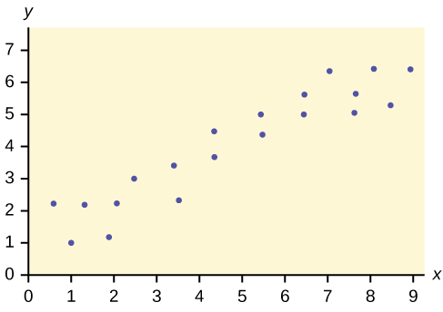

Before we take up the discussion of linear regression and correlation, we need to examine a way to display the relation between two variables *x* and *y*. The most common and easiest way is a **scatter plot**. The following example illustrates a scatter plot.

In Europe and Asia, m-commerce is popular. M-commerce users have special mobile phones that work like electronic wallets as well as provide phone and Internet services. Users can do everything from paying for parking to buying a TV set or soda from a machine to banking to checking sports scores on the Internet. For the years 2000 through 2004, was there a relationship between the year and the number of m-commerce users? Construct a scatter plot. Let *x* = the year and let *y* = the number of m-commerce users, in millions.

<figure markdown="1" id="linrgs_scater1">
<figure markdown="1" id="id1171451634341" markdown="1">
<figcaption>
Table showing the number of m-commerce users (in millions) by year.
</figcaption>
| <math xmlns="http://www.w3.org/1998/Math/MathML"><mi>x</mi></math>

 (year) | <math xmlns="http://www.w3.org/1998/Math/MathML"><mi>y</mi></math>

 (# of users) |
|----------
| 2000 | 0.5 |
| 2002 | 20.0 |
| 2003 | 33.0 |
| 2004 | 47.0 |
{: #element-478 summary=""}

</figure>
 by year."){: #id1171453954465}

</figure>

To create a scatter plot:
1.  Enter your X data into list L1 and your Y data into list L2.
2.  Press 2nd STATPLOT ENTER to use Plot 1. On the input screen for PLOT 1, highlight On and press ENTER. (Make sure the other plots are OFF.)
3.  For TYPE: highlight the very first icon, which is the scatter plot, and press ENTER.
4.  For Xlist:, enter L1 ENTER and for Ylist: L2 ENTER.
5.  For Mark: it does not matter which symbol you highlight, but the square is the easiest to see. Press ENTER.
6.  Make sure there are no other equations that could be plotted. Press Y = and clear any equations out.
7.  Press the ZOOM key and then the number 9 (for menu item \"ZoomStat\") ; the calculator will fit the window to the data. You can press WINDOW to see the scaling of the axes.

Try It

Amelia plays basketball for her high school. She wants to improve to play at the college level. She notices that the number of points she scores in a game goes up in response to the number of hours she practices her jump shot each week. She records the following data:

| *X* (hours practicing jump shot) | *Y* (points scored in a game) |
|----------
| 5 | 15 |
| 7 | 22 |
| 9 | 28 |
| 10 | 31 |
| 11 | 33 |
| 12 | 36 |
{: #eip-idp1116432 summary=""}

Construct a scatter plot and state if what Amelia thinks appears to be true.

{:}

Yes, Amelia’s assumption appears to be correct. The number of points Amelia scores per game goes up when she practices her jump shot more.

A scatter plot shows the **direction** of a relationship between the variables. A clear direction happens when there is either:  High values of one variable occurring with high values of the other variable or low values of one variable occurring with low values of the other variable. High values of one variable occurring with low values of the other variable. 

You can determine the **strength** of the relationship by looking at the scatter plot and seeing how close the points are to a line, a power function, an exponential function, or to some other type of function. For a linear relationship there is an exception. Consider a scatter plot where all the points fall on a horizontal line providing a \"perfect fit.\" The horizontal line would in fact show no relationship.

When you look at a scatterplot, you want to notice the **overall pattern** and any **deviations** from the pattern. The following scatterplot examples illustrate these concepts.

 {: #lingrgs10}

{: #lingrgs20}

{: #lingrgs30}

In this chapter, we are interested in scatter plots that show a linear pattern. Linear patterns are quite common. The linear relationship is strong if the points are close to a straight line, except in the case of a horizontal line where there is no relationship. If we think that the points show a linear relationship, we would like to draw a line on the scatter plot. This line can be calculated through a process called **linear regression**{: data-type="term"}. However, we only calculate a regression line if one of the variables helps to explain or predict the other variable. If *x* is the independent variable and *y* the dependent variable, then we can use a regression line to predict *y* for a given value of *x*

# Chapter Review   {#eip-407}

Scatter plots are particularly helpful graphs when we want to see if there is a linear relationship among data points. They indicate both the direction of the relationship between the *x* variables and the *y* variables, and the strength of the relationship. We calculate the strength of the relationship between an independent variable and a dependent variable using linear regression.

<section data-depth="1" id="eip-98" class="practice">

Does the scatter plot appear linear? Strong or weak? Positive or negative?

{:}

The data appear to be linear with a strong, positive correlation.

Does the scatter plot appear linear? Strong or weak? Positive or negative?

{:}

Does the scatter plot appear linear? Strong or weak? Positive or negative?

{:}

The data appear to have no correlation.

</section>

# Homework

The Gross Domestic Product Purchasing Power Parity is an indication of a country’s currency value compared to another country. [[link]](#fs-idm59733200) shows the GDP PPP of Cuba as compared to US dollars. Construct a scatter plot of the data.

<table summary=".."><caption></caption><thead>
<tr>
<th>Year</th>
<th>Cuba’s PPP </th>
<th>Year</th>
<th>Cuba’s PPP</th>
</tr>
</thead><tbody>
<tr>
<td>1999</td>
<td>1,700</td>
<td>2006</td>
<td>4,000</td>
</tr>
<tr>
<td>2000</td>
<td>1,700</td>
<td>2007</td>
<td>11,000</td>
</tr>
<tr>
<td>2002</td>
<td>2,300</td>
<td>2008</td>
<td>9,500</td>
</tr>
<tr>
<td>2003</td>
<td>2,900</td>
<td>2009</td>
<td>9,700</td>
</tr>
<tr>
<td>2004</td>
<td>3,000</td>
<td>2010</td>
<td>9,900</td>
</tr>
<tr>
<td>2005</td>
<td>3,500</td>
<td />
<td />
</tr>
</tbody></table>

Check student’s solution.

The following table shows the poverty rates and cell phone usage in the United States. Construct a scatter plot of the data

| Year | Poverty Rate | Cellular Usage per Capita |
|----------
| 2003 | 12.7 | 54.67 |
| 2005 | 12.6 | 74.19 |
| 2007 | 12 | 84.86 |
| 2009 | 12 | 90.82 |
{: summary=".."}

Does the higher cost of tuition translate into higher-paying jobs? The table lists the top ten colleges based on mid-career salary and the associated yearly tuition costs. Construct a scatter plot of the data.

<table summary=".."><caption></caption><thead>
<tr>
<th>School</th>
<th>Mid-Career Salary (in thousands)</th>
<th>Yearly Tuition</th>
</tr>
</thead><tbody>
<tr>
<td>Princeton</td>
<td>137</td>
<td>28,540</td>
</tr>
<tr>
<td>Harvey Mudd</td>
<td>135</td>
<td>40,133</td>
</tr>
<tr>
<td>CalTech</td>
<td>127</td>
<td>39,900</td>
</tr>
<tr>
<td>US Naval Academy</td>
<td>122</td>
<td>0</td>
</tr>
<tr>
<td>West Point</td>
<td>120</td>
<td>0</td>
</tr>
<tr>
<td>MIT</td>
<td>118</td>
<td>42,050</td>
</tr>
<tr>
<td>Lehigh University</td>
<td>118</td>
<td>43,220</td>
</tr>
<tr>
<td>NYU-Poly</td>
<td>117</td>
<td>39,565</td>
</tr>
<tr>
<td>Babson College</td>
<td>117</td>
<td>40,400</td>
</tr>
<tr>
<td>Stanford</td>
<td>114</td>
<td>54,506</td>
</tr>
</tbody></table>

For graph: check student’s solution. Note that tuition is the independent variable and salary is the dependent variable.

If the level of significance is 0.05 and the *p*-value is 0.06, what conclusion can you draw?

If there are 15 data points in a set of data, what is the number of degree of freedom?

13

