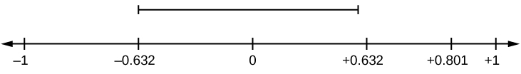
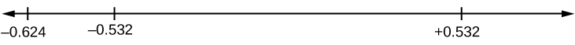
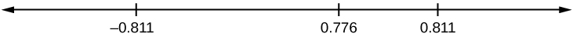

The correlation coefficient, *r*, tells us about the strength and direction of the linear relationship between *x* and *y*. However, the reliability of the linear model also depends on how many observed data points are in the sample. We need to look at both the value of the correlation coefficient *r* and the sample size *n*, together.

We perform a hypothesis test of the <strong> \"significance of the correlation coefficient\" </strong> to decide whether the linear relationship in the sample data is strong enough to use to model the relationship in the population.

The sample data are used to compute *r*, the correlation coefficient for the sample. If we had data for the entire population, we could find the population correlation coefficient. But because we have only have sample data, we cannot calculate the population correlation coefficient. The sample correlation coefficient, *r*, is our estimate of the unknown population correlation coefficient.

* The symbol for the population correlation coefficient is *ρ*, the Greek letter \"rho.\"
* *ρ* = population correlation coefficient (unknown)
* *r* = sample correlation coefficient (known; calculated from sample data)
{: data-labeled-item="true"}

The hypothesis test lets us decide whether the value of the population correlation coefficient *ρ* is \"close to zero\" or \"significantly different from zero\". We decide this based on the sample correlation coefficient *r* and the sample size *n*.

If the test concludes that the correlation coefficient is significantly different from zero, we say that the correlation coefficient is \"significant.\"

* Conclusion: There is sufficient evidence to conclude that there is a significant linear relationship between *x* and *y* because the correlation coefficient is significantly different from zero.
* What the conclusion means: There is a significant linear relationship between *x* and *y*. We can use the regression line to model the linear relationship between *x* and *y* in the population.

If the test concludes that the correlation coefficient is not significantly different from zero (it is close to zero), we say that correlation coefficient is \"not significant\".

* Conclusion: \"There is insufficient evidence to conclude that there is a significant linear relationship between *x* and *y* because the correlation coefficient is not significantly different from zero.\"
* What the conclusion means: There is not a significant linear relationship between *x* and *y*. Therefore, we CANNOT use the regression line to model a linear relationship between *x* and *y* in the population.

Note

* If *r* is significant and the scatter plot shows a linear trend, the line can be used to predict the value of *y* for values of *x* that are within the domain of observed *x* values.
* If *r* is not significant OR if the scatter plot does not show a linear trend, the line should not be used for prediction.
* If *r* is significant and if the scatter plot shows a linear trend, the line may NOT be appropriate or reliable for prediction OUTSIDE the domain of observed *x* values in the data.

### PERFORMING THE HYPOTHESIS TEST

* <strong> Null Hypothesis: <em>H0</em>\: <em>ρ</em> = 0 </strong>
* **Alternate Hypothesis: *Ha*\: *ρ* ≠ 0**

WHAT THE HYPOTHESES MEAN IN WORDS:

* **Null Hypothesis *H0*\:** The population correlation coefficient IS NOT significantly different from zero. There IS NOT a significant linear relationship(correlation) between *x* and *y* in the population.
* **Alternate Hypothesis *Ha*\:** The population correlation coefficient IS significantly DIFFERENT FROM zero. There IS A SIGNIFICANT LINEAR RELATIONSHIP (correlation) between *x* and *y* in the population.

DRAWING A CONCLUSION:There are two methods of making the decision. The two methods are equivalent and give the same result.

* **Method 1: Using the *p*-value**
* **Method 2: Using a table of critical values**

In this chapter of this textbook, we will always use a significance level of 5%, *α* = 0.05

Note

Using the *p*-value method, you could choose any appropriate significance level you want; you are not limited to using *α* = 0.05. But the table of critical values provided in this textbook assumes that we are using a significance level of 5%, *α* = 0.05. (If we wanted to use a different significance level than 5% with the critical value method, we would need different tables of critical values that are not provided in this textbook.)

#### METHOD 1: Using a *p*-value to make a decision

To calculate the *p*-value using LinRegTTEST:* * *
{: data-type="newline"}

 On the LinRegTTEST input screen, on the line prompt for *β* or *ρ*, highlight \"**≠ 0**\"* * *
{: data-type="newline"}

 The output screen shows the p-value on the line that reads \"p =\".* * *
{: data-type="newline"}

 (Most computer statistical software can calculate the *p*-value.)

If the *p*-value is less than the significance level (*α* = 0.05):

* Decision: Reject the null hypothesis.
* Conclusion: \"There is sufficient evidence to conclude that there is a significant linear relationship between *x* and *y* because the correlation coefficient is significantly different from zero.\"

If the *p*-value is NOT less than the significance level (*α* = 0.05)

* Decision: DO NOT REJECT the null hypothesis.
* Conclusion: \"There is insufficient evidence to conclude that there is a significant linear relationship between *x* and *y* because the correlation coefficient is NOT significantly different from zero.\"

Calculation Notes:

* You will use technology to calculate the *p*-value. The following describes the calculations to compute the test statistics and the *p*-value:
* The *p*-value is calculated using a *t*-distribution with *n* - 2 degrees of freedom.
* The formula for the test statistic is
  <math xmlns="http://www.w3.org/1998/Math/MathML"> <mrow> <mi>t</mi><mo>=</mo><mfrac> <mrow> <mi>r</mi><msqrt> <mrow> <mi>n</mi><mo>−</mo><mn>2</mn> </mrow> </msqrt> </mrow> <mrow> <msqrt> <mrow> <mn>1</mn><mo>−</mo><msup> <mi>r</mi> <mn>2</mn> </msup> </mrow> </msqrt> </mrow> </mfrac> </mrow> </math>
  
  . The value of the test statistic, *t*, is shown in the computer or calculator output along with the *p*-value. The test statistic *t* has the same sign as the correlation coefficient *r*.
* The *p*-value is the combined area in both tails.
{: data-labeled-item="true"}

An alternative way to calculate the *p*-value **(p)** given by LinRegTTest is the command 2\*tcdf(abs(t),10^99, n-2) in 2nd DISTR.
{: .finger}

THIRD-EXAM vs FINAL-EXAM EXAMPLE: *p*-value method

* Consider the [third exam/final exam example](/m47117#element-22).
* The line of best fit is: ŷ = -173.51 + 4.83*x* with *r* = 0.6631 and there are *n* = 11 data points.
* Can the regression line be used for prediction? **Given a third exam score (*x* value), can we use the line to predict the final exam score (predicted *y* value)?**

*H0*\: *ρ* = 0

*Ha*\: *ρ* ≠ 0

*α* = 0.05

* The *p*-value is 0.026 (from LinRegTTest on your calculator or from computer software).
* The *p*-value, 0.026, is less than the significance level of *α* = 0.05.
* Decision: Reject the Null Hypothesis *H0*
* Conclusion: There is sufficient evidence to conclude that there is a significant linear relationship between the third exam score (*x*) and the final exam score (*y*) because the correlation coefficient is significantly different from zero.

**Because *r* is significant and the scatter plot shows a linear trend, the regression line can be used to predict final exam scores.**

#### METHOD 2: Using a table of Critical Values to make a decision

The [95% Critical Values of the Sample Correlation Coefficient Table](/m47107#eip-idm31993488) can be used to give you a good idea of whether the computed value of **<math xmlns="http://www.w3.org/1998/Math/MathML"><mi>r</mi></math>

 is significant or not**. Compare *r* to the appropriate critical value in the table. If *r* is not between the positive and negative critical values, then the correlation coefficient is significant. If *r* is significant, then you may want to use the line for prediction.

Suppose you computed *r* = 0.801 using *n* = 10 data points.*df* = *n* - 2 = 10 - 2 = 8. The critical values associated with *df* = 8 are -0.632 and + 0.632. If *r* &lt; negative critical value or *r* &gt; positive critical value, then *r* issignificant. Since *r* = 0.801 and 0.801 &gt; 0.632, *r* is significant and the line may be usedfor prediction. If you view this example on a number line, it will help you.

{: #id1165447908809}

Try It

For a given line of best fit, you computed that *r* = 0.6501 using *n* = 12 data points and the critical value is 0.576. Can the line be used for prediction? Why or why not?

Suppose you computed *r* = –0.624 with 14 data points. *df* = 14 – 2 = 12. The critical values are –0.532 and 0.532. Since –0.624 &lt; –0.532, *r* is significant and the line can be used for prediction

{: #id1165447908929}

Try It

For a given line of best fit, you compute that *r* = 0.5204 using *n* = 9 data points, and the critical value is 0.666. Can the line be used for prediction? Why or why not?

Suppose you computed *r* = 0.776 and *n* = 6. *df* = 6 – 2 = 4. The critical values are –0.811 and 0.811. Since –0.811 &lt; 0.776 &lt; 0.811, *r* is not significant, and the line should not be used for prediction.

{: #linrgs_facts5}

Try It

For a given line of best fit, you compute that *r* = –0.7204 using *n* = 8 data points, and the critical value is = 0.707. Can the line be used for prediction? Why or why not?

### THIRD-EXAM vs FINAL-EXAM EXAMPLE: critical value method

Consider the [third exam/final exam example](/m47117#element-22). The line of best fit is: *ŷ* = –173.51+4.83*x* with *r* = 0.6631 and there are *n* = 11 data points. Can the regression line be used for prediction? **Given a third-exam score (*x* value), can we use the line to predict the final exam score (predicted *y* value)?**

* *H0*\: *ρ* = 0
* *Ha*\: *ρ* ≠ 0
* *α* = 0.05
{: data-labeled-item="true"}

* Use the \"95% Critical Value\" table for *r* with *df* = *n* – 2 = 11 – 2 = 9.
* The critical values are –0.602 and +0.602
* Since 0.6631 &gt; 0.602, *r* is significant.
* Decision: Reject the null hypothesis.
* Conclusion:There is sufficient evidence to conclude that there is a significant linear relationship between the third exam score (*x*) and the final exam score (*y*) because the correlation coefficient is significantly different from zero.
{: data-bullet-style="bullet"}

**Because *r* is significant and the scatter plot shows a linear trend, the regression line can be used to predict final exam scores.**

Suppose you computed the following correlation coefficients. Using the table at the end of the chapter, determine if *r* is significant and the line of best fit associated with each *r* can be used to predict a *y* value. If it helps, draw a number line.

1.  *r* = –0.567 and the sample size, *n*, is 19. The *df* = *n* – 2 = 17. The critical value is –0.456. –0.567 &lt; –0.456 so *r* is significant.
2.  *r* = 0.708 and the sample size, *n*, is nine. The *df* = *n* – 2 = 7. The critical value is 0.666. 0.708 &gt; 0.666 so *r* is significant.
3.  *r* = 0.134 and the sample size, *n*, is 14. The *df* = 14 – 2 = 12. The critical value is 0.532. 0.134 is between –0.532 and 0.532 so *r* is not significant.
4.  *r* = 0 and the sample size, *n*, is five. No matter what the dfs are, *r* = 0 is between the two critical values so *r* is not significant.
{: type="a"}

Try It

For a given line of best fit, you compute that *r* = 0 using *n* = 100 data points. Can the line be used for prediction? Why or why not?

### Assumptions in Testing the Significance of the Correlation Coefficient   {#eip-570}

Testing the significance of the correlation coefficient requires that certain assumptions about the data are satisfied. The premise of this test is that the data are a sample of observed points taken from a larger population. We have not examined the entire population because it is not possible or feasible to do so. We are examining the sample to draw a conclusion about whether the linear relationship that we see between *x* and *y* in the sample data provides strong enough evidence so that we can conclude that there is a linear relationship between *x* and *y* in the population.

The regression line equation that we calculate from the sample data gives the best-fit line for our particular sample. We want to use this best-fit line for the sample as an estimate of the best-fit line for the population. Examining the scatterplot and testing the significance of the correlation coefficient helps us determine if it is appropriate to do this.

The assumptions underlying the test of significance are:

* There is a linear relationship in the population that models the average value of *y* for varying values of *x*. In other words, the expected value of *y* for each particular value lies on a straight line in the population. (We do not know the equation for the line for the population. Our regression line from the sample is our best estimate of this line in the population.)
* The *y* values for any particular *x* value are normally distributed about the line. This implies that there are more *y* values scattered closer to the line than are scattered farther away. Assumption (1) implies that these normal distributions are centered on the line: the means of these normal distributions of *y* values lie on the line.
* The standard deviations of the population *y* values about the line are equal for each value of *x*. In other words, each of these normal distributions of *y* values has the same shape and spread about the line.
* The residual errors are mutually independent (no pattern).
* The data are produced from a well-designed, random sample or randomized experiment.

{: #linrgs_facts_normal}

### Chapter Review   {#eip-724}

Linear regression is a procedure for fitting a straight line of the form *ŷ* = *a* + *bx* to data. The conditions for regression are:

* **Linear** In the population, there is a linear relationship that models the average value of *y* for different values of *x*.
* **Independent** The residuals are assumed to be independent.
* **Normal** The *y* values are distributed normally for any value of *x*.
* **Equal variance** The standard deviation of the *y* values is equal for each *x* value.
* **Random** The data are produced from a well-designed random sample or randomized experiment.
{: data-bullet-style="open-circle"}

The slope ***b*** and intercept ***a*** of the least-squares line estimate the slope *β* and intercept *α* of the population (true) regression line. To estimate the population standard deviation of *y*, *σ*, use the standard deviation of the residuals, *s*. <math xmlns="http://www.w3.org/1998/Math/MathML"> <mrow> <mi>s</mi><mo>=</mo><msqrt> <mrow> <mfrac> <mrow> <mi>S</mi><mi>E</mi><mi>E</mi> </mrow> <mrow> <mi>n</mi><mo>−</mo><mn>2</mn> </mrow> </mfrac> </mrow> </msqrt> </mrow> </math>

. The variable *ρ* (rho) is the population correlation coefficient. To test the null hypothesis *H*0\: *ρ* = *hypothesized value*, use a linear regression t-test. The most common null hypothesis is *H*0\: *ρ* = 0 which indicates there is no linear relationship between *x* and *y* in the population. The TI-83, 83+, 84, 84+ calculator function LinRegTTest can perform this test (STATS TESTS LinRegTTest).

### Formula Review   {#eip-896}

Least Squares Line or Line of Best Fit:

<math xmlns="http://www.w3.org/1998/Math/MathML"> <mrow> <mover accent="true"> <mi>y</mi> <mo>^</mo> </mover> <mo>=</mo><mi>a</mi><mo>+</mo><mi>b</mi><mi>x</mi> </mrow> </math>

where

*a* = *y*-intercept

*b* = slope

Standard deviation of the residuals:

<math xmlns="http://www.w3.org/1998/Math/MathML"> <mrow> <mi>s</mi><mo>=</mo><msqrt> <mrow> <mfrac> <mrow> <mi>S</mi><mi>E</mi><mi>E</mi> </mrow> <mrow> <mi>n</mi><mo>−</mo><mn>2</mn> </mrow> </mfrac> </mrow> </msqrt> <mi>.</mi> </mrow> </math>

where

SSE = sum of squared errors

*n* = the number of data points

<section data-depth="1" id="eip-142" class="practice">

When testing the significance of the correlation coefficient, what is the null hypothesis?

When testing the significance of the correlation coefficient, what is the alternative hypothesis?

*Ha*: *ρ* ≠ 0

If the level of significance is 0.05 and the *p*-value is 0.04, what conclusion can you draw?

</section>

