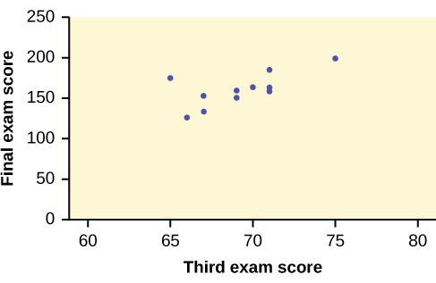
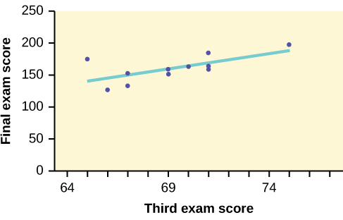

Data rarely fit a straight line exactly. Usually, you must be satisfied with rough predictions. Typically, you have a set of data whose scatter plot appears to **\"fit\"** a straight line. This is called a **Line of Best Fit**{: data-type="term"} **or** **Least-Squares Line**{: data-type="term"}.

Collaborative Exercise

If you know a person\'s pinky (smallest) finger length, do you think you could predict that person\'s height? Collect data from your class (pinky finger length, in inches). The independent variable, *x*, is pinky finger length and the dependent variable, *y*, is height. For each set of data, plot the points on graph paper. Make your graph big enough and **use a ruler**. Then \"by eye\" draw a line that appears to \"fit\" the data. For your line, pick two convenient points and use them to find the slope of the line. Find the *y*-intercept of the line by extending your line so it crosses the *y*-axis. Using the slopes and the *y*-intercepts, write your equation of \"best fit.\" Do you think everyone will have the same equation? Why or why not? According to your equation, what is the predicted height for a pinky length of 2.5 inches?

A random sample of 11 statistics students produced the following data, where *x* is the third exam score out of 80, and *y* is the final exam score out of 200. Can you predict the final exam score of a random student if you know the third exam score?

<figure markdown="1" id="linrgs_regeq1">
<figure markdown="1" id="id8083493" markdown="1">
<figcaption>
Table showing the scores on the final exam based on scores from the third exam.
</figcaption>
| x (third exam score) | y (final exam score) |
|----------
| 65 | 175 |
| 67 | 133 |
| 71 | 185 |
| 71 | 163 |
| 66 | 126 |
| 75 | 198 |
| 67 | 153 |
| 70 | 163 |
| 71 | 159 |
| 69 | 151 |
| 69 | 159 |
{: #element-50 summary=""}

</figure>
{: #id7881358}

</figure>

Try It

SCUBA divers have maximum dive times they cannot exceed when going to different depths. The data in [[link]](#eip-idm70490496) show different depths with the maximum dive times in minutes. Use your calculator to find the least squares regression line and predict the maximum dive time for 110 feet.

| *X* (depth in feet) | *Y* (maximum dive time) |
|----------
| 50 | 80 |
| 60 | 55 |
| 70 | 45 |
| 80 | 35 |
| 90 | 25 |
| 100 | 22 |
{: #eip-idm70490496 summary=""}

*ŷ* = 127.24 – 1.11*x*

At 110 feet, a diver could dive for only five minutes.

The third exam score, *x*, is the independent variable and the final exam score, *y*, is the dependent variable. We will plot a regression line that best \"fits\" the data. If each of you were to fit a line \"by eye,\" you would draw different lines. We can use what is called a **least-squares regression line**{: data-type="term"} to obtain the best fit line.

Consider the following diagram. Each point of data is of the the form (*x*, *y*) and each point ofthe line of best fit using least-squares linear regression has the form (*x*, *ŷ*).

The *ŷ* is read **\"*y* hat\"** and is the **estimated value of *y***. It is the value of *y* obtained using the regression line. It is not generally equal to *y* from data.

{: #linrgs_regeq2}

The term *y*0 – *ŷ*0 = *ε*0 is called the **\"error\" or** **residual**{: data-type="term"}. It is not an error in the sense of a mistake. The **absolute value of a residual**{: data-type="term"} measures the vertical distance between the actual value of *y* and the estimated value of *y*. In other words, it measures the vertical distance between the actual data point and the predicted point on the line.

If the observed data point lies above the line, the residual is positive, and the line underestimates the actual data value for *y*. If the observed data point lies below the line, the residual is negative, and the line overestimates that actual data value for *y*.

In the diagram in [\[link\]](#linrgs_regeq2), *y*0 – *ŷ*0 = ε0 is the residual for the point shown. Here the point lies above the line and the residual is positive.

*ε* = the Greek letter **epsilon**

For each data point, you can calculate the residuals or errors, *y*i - *ŷ*i = *ε*i for *i* = 1, 2, 3, ..., 11.

Each \\\|*ε*\\\| is a vertical distance.

For the example about the third exam scores and the final exam scores for the 11 statistics students, there are 11 data points. Therefore, there are 11 *ε* values. If yousquare each ε and add, you get

<math xmlns="http://www.w3.org/1998/Math/MathML" display="block"> <mrow> <msup> <mrow> <mo stretchy="false">(</mo><msub> <mi>ε</mi> <mn>1</mn> </msub> <mo stretchy="false">)</mo> </mrow> <mn>2</mn> </msup> <mo>+</mo><msup> <mrow> <mo stretchy="false">(</mo><msub> <mi>ε</mi> <mn>2</mn> </msub> <mo stretchy="false">)</mo> </mrow> <mn>2</mn> </msup> <mo>+</mo><mn>...</mn><mo>+</mo><msup> <mrow> <mo stretchy="false">(</mo><msub> <mi>ε</mi> <mrow> <mn>11</mn> </mrow> </msub> <mo stretchy="false">)</mo> </mrow> <mn>2</mn> </msup> <mo>=</mo><mover> <mrow> <munder> <mi>Σ</mi> <mrow> <mi>i</mi><mtext> </mtext><mo>=</mo><mtext> </mtext><mn>1</mn> </mrow> </munder> </mrow> <mrow> <mn>11</mn> </mrow> </mover> <msup> <mi>ε</mi> <mn>2</mn> </msup> </mrow> </math>

This is called the **Sum of Squared Errors (SSE)**{: data-type="term"}.

Using calculus, you can determine the values of *a* and *b* that make the **SSE** a minimum. When you make the **SSE** a minimum, you have determined the points that are on the line of best fit. It turns out that the line of best fit has the equation:

<math xmlns="http://www.w3.org/1998/Math/MathML"> <mrow> <mover accent="true"> <mi>y</mi> <mo>^</mo> </mover> <mo>=</mo><mi>a</mi><mo>+</mo><mi>b</mi><mi>x</mi> </mrow> </math>

where <math xmlns="http://www.w3.org/1998/Math/MathML"> <mrow> <mi>a</mi><mo>=</mo><mover accent="true"> <mi>y</mi> <mo>¯</mo> </mover> <mo>−</mo><mi>b</mi><mover accent="true"> <mi>x</mi> <mo>¯</mo> </mover> </mrow> </math>

 and <math xmlns="http://www.w3.org/1998/Math/MathML"> <mrow> <mi>b</mi><mo>=</mo><mfrac> <mrow> <mi>Σ</mi><mo stretchy="false">(</mo><mi>x</mi><mo>−</mo><mover accent="true"> <mi>x</mi> <mo>¯</mo> </mover> <mo stretchy="false">)</mo><mo stretchy="false">(</mo><mi>y</mi><mo>−</mo><mover accent="true"> <mi>y</mi> <mo>¯</mo> </mover> <mo stretchy="false">)</mo> </mrow> <mrow> <mi>Σ</mi><msup> <mrow> <mo stretchy="false">(</mo><mi>x</mi><mo>−</mo><mover accent="true"> <mi>x</mi> <mo>¯</mo> </mover> <mo stretchy="false">)</mo> </mrow> <mn>2</mn> </msup> </mrow> </mfrac> </mrow> </math>

.

The sample means of the *x* values and the *y* values are <math xmlns="http://www.w3.org/1998/Math/MathML"> <mover accent="true"> <mi>x</mi> <mo>¯</mo> </mover> </math>

 and <math xmlns="http://www.w3.org/1998/Math/MathML"> <mover accent="true"> <mi>y</mi> <mo>¯</mo> </mover> </math>

, respectively. The best fit line always passes through the point <math xmlns="http://www.w3.org/1998/Math/MathML"> <mrow> <mo stretchy="false">(</mo><mover accent="true"> <mi>x</mi> <mo>¯</mo> </mover> <mo>,</mo><mover accent="true"> <mi>y</mi> <mo>¯</mo> </mover> <mo stretchy="false">)</mo> </mrow> </math>

.

The slope *b* can be written as <math xmlns="http://www.w3.org/1998/Math/MathML"> <mrow> <mi>b</mi><mo>=</mo><mi>r</mi><mrow><mo>(</mo> <mrow> <mfrac> <mrow> <msub> <mi>s</mi> <mi>y</mi> </msub> </mrow> <mrow> <msub> <mi>s</mi> <mi>x</mi> </msub> </mrow> </mfrac> </mrow> <mo>)</mo></mrow> </mrow> </math>

 where *s**y* = the standard deviation of the *y* values and *s**x* = the standard deviation of the *x* values. *r* is the correlation coefficient, which is discussed in the next section.

# Least Squares Criteria for Best Fit

The process of fitting the best-fit line is called **linear regression**. The idea behind finding the best-fit line is based on the assumption that the data are scattered about a straight line. The criteria for the best fit line is that the sum of the squared errors (SSE) is minimized, that is, made as small as possible. Any other line you might choose would have a higher SSE than the best fit line. This best fit line is called the <strong> least-squares regression line </strong>.

Note

Computer spreadsheets, statistical software, and many calculators can quickly calculate the best-fit line and create the graphs. The calculations tend to be tedious if done by hand. Instructions to use the TI-83, TI-83+, and TI-84+ calculators to find the best-fit line and create a scatterplot are shown at the end of this section.

THIRD EXAM vs FINAL EXAM EXAMPLE: The graph of the line of best fit for the third-exam/final-exam example is as follows:

 {: #linrgs_regeq3}

The least squares regression line (best-fit line) for the third-exam/final-exam example has the equation:

<math xmlns="http://www.w3.org/1998/Math/MathML"> <mrow> <mover accent="true"> <mi>y</mi> <mo>^</mo> </mover> <mo>=</mo><mo>−</mo><mn>173.51</mn><mo>+</mo><mn>4.83</mn><mi>x</mi> </mrow> </math>

Reminder

Remember, it is always important to plot a scatter diagram first. If the scatter plot indicates that there is a linear relationship between the variables, then it is reasonable to use a best fit line to make predictions for *y* given *x* within the domain of *x*-values in the sample data, **but not necessarily for *x*-values outside that domain.** You could use the line to predict the final exam score for a student who earned a grade of 73 on the third exam. You should NOT use the line to predict the final exam score for a student who earned a grade of 50 on the third exam, because 50 is not within the domain of the *x*-values in the sample data, which are between 65 and 75.

# UNDERSTANDING SLOPE

The slope of the line, *b*, describes how changes in the variables are related. It is important to interpret the slope of the line in the context of the situation represented by the data. You should be able to write a sentence interpreting the slope in plain English.

**INTERPRETATION OF THE SLOPE:** The slope of the best-fit line tells us how the dependent variable (*y*) changes for every one unit increase in the independent (*x*) variable, on average.

THIRD EXAM vs FINAL EXAM EXAMPLESlope: The slope of the line is *b* = 4.83. * * *
{: data-type="newline"}

Interpretation: For a one-point increase in the score on the third exam, the final exam score increases by 4.83 points, on average.

Using the Linear Regression T Test: LinRegTTest* * *
{: data-type="newline" data-count="2"}

1.  In the STAT list editor, enter the X data in list L1 and the Y data in list L2, paired so that the corresponding (*x*,*y*) values are next to each other in the lists. (If a particular pair of values is repeated, enter it as many times as it appears in the data.)
2.  On the STAT TESTS menu, scroll down with the cursor to select the LinRegTTest. (Be careful to select LinRegTTest, as some calculators may also have a different item called LinRegTInt.)
3.  On the LinRegTTest input screen enter: Xlist: L1 ; Ylist: L2 ; Freq: 1
4.  On the next line, at the prompt *β* or *ρ*, highlight \"≠ 0\" and press ENTER
5.  Leave the line for \"RegEq:\" blank
6.  Highlight Calculate and press ENTER.
{: data-number-style="arabic"}

{: #linregttestscreens}

The output screen contains a lot of information. For now we will focus on a few items from the output, and will return later to the other items. * * *
{: data-type="newline"}

The second line says *y* = *a* + *bx*. Scroll down to find the values *a* = –173.513, and *b* = 4.8273; the equation of the best fit line is *ŷ* = –173.51 + 4.83*x* * * *
{: data-type="newline"}

The two items at the bottom are *r*2 = 0.43969 and *r* = 0.663. For now, just note where to find these values; we will discuss them in the next two sections.

Graphing the Scatterplot and Regression Line* * *
{: data-type="newline" data-count="2"}

1.  We are assuming your X data is already entered in list L1 and your Y data is in list L2
2.  Press 2nd STATPLOT ENTER to use Plot 1
3.  On the input screen for PLOT 1, highlight **On**, and press ENTER
4.  For TYPE: highlight the very first icon which is the scatterplot and press ENTER
5.  Indicate Xlist: L1 and Ylist: L2
6.  For Mark: it does not matter which symbol you highlight.
7.  Press the ZOOM key and then the number 9 (for menu item \"ZoomStat\") ; the calculator will fit the window to the data
8.  To graph the best-fit line, press the \"Y=\" key and type the equation –173.5 + 4.83X into equation Y1. (The X key is immediately left of the STAT key). Press ZOOM 9 again to graph it.
9.  Optional: If you want to change the viewing window, press the WINDOW key. Enter your desired window using Xmin, Xmax, Ymin, Ymax
{: data-number-style="arabic"}

NOTE

Another way to graph the line after you create a scatter plot is to use LinRegTTest. 

Make sure you have done the scatter plot. Check it on your screen.

Go to LinRegTTest and enter the lists.

At RegEq: press VARS and arrow over to Y-VARS. Press 1 for 1:Function. Press 1 for 1:Y1. Then arrow down to Calculate and do the calculation for the line of best fit.

Press Y = (you will see the regression equation).

Press GRAPH. The line will be drawn."

# The Correlation Coefficient *r*   {#eip-737}

Besides looking at the scatter plot and seeing that a line seems reasonable, how can you tell if the line is a good predictor? Use the correlation coefficient as another indicator (besides the scatterplot) of the strength of the relationship between *x* and *y*.

The <strong>correlation coefficient, <em>r</em>, </strong> developed by Karl Pearson in the early 1900s, is numerical and provides a measure of strength and direction of the linear association between the independent variable *x* and the dependent variable *y*.

The correlation coefficient is calculated as

<math xmlns="http://www.w3.org/1998/Math/MathML" display="block"> <mrow> <mi>r</mi><mo>=</mo><mfrac> <mrow> <mi>n</mi><mi>Σ</mi><mo stretchy="false">(</mo><mi>x</mi><mi>y</mi><mo stretchy="false">)</mo><mo>−</mo><mo stretchy="false">(</mo><mi>Σ</mi><mi>x</mi><mo stretchy="false">)</mo><mo stretchy="false">(</mo><mi>Σ</mi><mi>y</mi><mo stretchy="false">)</mo> </mrow> <mrow> <msqrt> <mrow> <mrow><mo>[</mo> <mrow> <mi>n</mi><mi>Σ</mi><msup> <mi>x</mi> <mn>2</mn> </msup> <mo>−</mo><msup> <mrow> <mo stretchy="false">(</mo><mi>Σ</mi><mi>x</mi><mo stretchy="false">)</mo> </mrow> <mn>2</mn> </msup> </mrow> <mo>]</mo></mrow><mrow><mo>[</mo> <mrow> <mi>n</mi><mi>Σ</mi><msup> <mi>y</mi> <mn>2</mn> </msup> <mo>−</mo><msup> <mrow> <mo stretchy="false">(</mo><mi>Σ</mi><mi>y</mi><mo stretchy="false">)</mo> </mrow> <mn>2</mn> </msup> </mrow> <mo>]</mo></mrow> </mrow> </msqrt> </mrow> </mfrac> </mrow> </math>

where *n* = the number of data points.

If you suspect a linear relationship between *x* and *y*, then *r* can measure how strong the linear relationship is.

What the VALUE of *r* tells us: 

The value of *r* is always between –1 and +1: –1 ≤ *r* ≤ 1.

The size of the correlation *r* indicates the strength of the linear relationship between *x* and *y*. Values of *r* close to –1 or to +1 indicate a stronger linear relationship between *x* and *y*.

If *r* = 0 there is absolutely no linear relationship between *x* and *y* <strong> (no linear correlation)</strong>.

If *r* = 1, there is perfect positive correlation. If *r* = –1, there is perfect negativecorrelation. In both these cases, all of the original data points lie on a straight line. Of course,in the real world, this will not generally happen.

What the SIGN of *r* tells us 

A positive value of *r* means that when *x* increases, *y* tends to increase and when *x* decreases, *y* tends to decrease **(positive correlation)**.

A negative value of *r* means that when *x* increases, *y* tends to decrease and when *x* decreases, *y* tends to increase **(negative correlation)**.

The sign of *r* is the same as the sign of the slope, *b*, of the best-fit line.

Note

Strong correlation does not suggest that *x* causes *y* or *y* causes *x*. We say **"correlation does not imply causation."**

 A scatter plot showing data with a positive correlation. 0 &lt; r &lt; 1 (b) A scatter plot showing data with a negative correlation. &#x2013;1 &lt; r &lt; 0 (c) A scatter plot showing data with zero correlation. r = 0"){: #linrgs_facts_pics}

The formula for *r* looks formidable. However, computer spreadsheets, statistical software, and many calculators can quickly calculate *r*. The correlation coefficient *r* is the bottom item in the output screens for the LinRegTTest on the TI-83, TI-83+, or TI-84+ calculator (see previous section for instructions).

# The Coefficient of Determination   {#eip-117}

**The variable *r*2 is called the** **coefficient of determination**{: data-type="term"} and is the square of the correlation coefficient, but is usually stated as a percent, rather than in decimal form. It has an interpretation in the context of the data:

* <math xmlns="http://www.w3.org/1998/Math/MathML"> <msup> <mi>r</mi> <mn>2</mn> </msup> </math>
  
  , when expressed as a percent, represents the percent of variation in the dependent (predicted) variable *y* that can be explained by variation in the independent (explanatory) variable *x* using the regression (best-fit) line.
* 1 –
  <math xmlns="http://www.w3.org/1998/Math/MathML"><msup> <mi>r</mi> <mn>2</mn> </msup> </math>
  
  , when expressed as a percentage, represents the percent of variation in *y* that is NOT explained by variation in *x* using the regression line. This can be seen as the scattering of the observed data points about the regression line.

Consider the [third exam/final exam example](#element-22) introduced in the previous section* * *
{: data-type="newline"}

 

The line of best fit is: *ŷ* = –173.51 + 4.83x

The correlation coefficient is *r* = 0.6631

The coefficient of determination is *r*2 = 0.66312 = 0.4397

**Interpretation of *r*2 in the context of this example:**

Approximately 44% of the variation (0.4397 is approximately 0.44) in the final-exam grades can be explained by the variation in the grades on the third exam, using the best-fit regression line.

Therefore, approximately 56% of the variation (1 – 0.44 = 0.56) in the final exam grades can NOT be explained by the variation in the grades on the third exam, using the best-fit regression line. (This is seen as the scattering of the points about the line.)

# Chapter Review   {#eip-993}

A regression line, or a line of best fit, can be drawn on a scatter plot and used to predict outcomes for the *x* and *y* variables in a given data set or sample data. There are several ways to find a regression line, but usually the least-squares regression line is used because it creates a uniform line. Residuals, also called “errors,” measure the distance from the actual value of *y* and the estimated value of *y*. The Sum of Squared Errors, when set to its minimum, calculates the points on the line of best fit. Regression lines can be used to predict values within the given set of data, but should not be used to make predictions for values outside the set of data.

The correlation coefficient *r* measures the strength of the linear association between *x* and *y*. The variable *r* has to be between –1 and +1. When *r* is positive, the *x* and *y* will tend to increase and decrease together. When *r* is negative, *x* will increase and *y* will decrease, or the opposite, *x* will decrease and *y* will increase. The coefficient of determination *r*2, is equal to the square of the correlation coefficient. When expressed as a percent, *r*2 represents the percent of variation in the dependent variable *y* that can be explained by variation in the independent variable *x* using the regression line.

<section data-depth="1" id="eip-234" class="practice" markdown="1">
*Use the following information to answer the next five exercises*. A random sample of ten professional athletes produced the following data where *x* is the number of endorsements the player has and *y* is the amount of money made (in millions of dollars).

<table summary=".."><caption></caption><thead>
<tr>
<th><em>x</em></th>
<th><em>y</em></th>
<th><em>x</em></th>
<th><em>y</em></th>
</tr>
</thead><tbody>
<tr>
<td>0</td>
<td>2</td>
<td>5</td>
<td>12</td>
</tr>
<tr>
<td>3</td>
<td>8</td>
<td>4</td>
<td>9</td>
</tr>
<tr>
<td>2</td>
<td>7</td>
<td>3</td>
<td>9</td>
</tr>
<tr>
<td>1</td>
<td>3</td>
<td>0</td>
<td>3</td>
</tr>
<tr>
<td>5</td>
<td>13</td>
<td>4</td>
<td>10</td>
</tr>
</tbody></table>

Draw a scatter plot of the data.

Use regression to find the equation for the line of best fit.

*ŷ* = 2.23 + 1.99*x*

Draw the line of best fit on the scatter plot.

What is the slope of the line of best fit? What does it represent?

The slope is 1.99 (*b* = 1.99). It means that for every endorsement deal a professional player gets, he gets an average of another $1.99 million in pay each year.

What is the *y*-intercept of the line of best fit? What does it represent?

What does an *r* value of zero mean?

It means that there is no correlation between the data sets.

When *n* = 2 and *r* = 1, are the data significant? Explain.

When *n* = 100 and *r* = -0.89, is there a significant correlation? Explain.

Yes, there are enough data points and the value of r is strong enough to show that there is a strong negative correlation between the data sets.

</section>

# Homework   {#eip-884}

What is the process through which we can calculate a line that goes through a scatter plot with a linear pattern?

Explain what it means when a correlation has an *r*2 of 0.72.

It means that 72% of the variation in the dependent variable (*y*) can be explained by the variation in the independent variable (*x*).

Can a coefficient of determination be negative? Why or why not?

## Glossary
{: data-type="glossary-title"}

Coefficient of Correlation
: {: #id1167925021109} a measure developed by Karl Pearson (early 1900s) that gives the strength of association between the independent variable and the dependent variable; the formula is:
  

  <math xmlns="http://www.w3.org/1998/Math/MathML"> <mrow> <mi>r</mi><mo>=</mo><mfrac> <mrow> <mi>n</mi><msup> <mstyle mathsize="140%" displaystyle="true"><mo>∑</mo></mstyle> <mtext>​</mtext> </msup> <mi>x</mi><mi>y</mi><mo>−</mo><mo stretchy="false">(</mo><msup> <mstyle mathsize="140%" displaystyle="true"><mo>∑</mo></mstyle> <mtext>​</mtext> </msup> <mi>x</mi><mo stretchy="false">)</mo><mo stretchy="false">(</mo><msup> <mstyle mathsize="140%" displaystyle="true"><mo>∑</mo></mstyle> <mtext>​</mtext> </msup> <mi>y</mi><mo stretchy="false">)</mo> </mrow> <mrow> <msqrt> <mrow> <mo stretchy="false">[</mo><mi>n</mi><msup> <mstyle mathsize="140%" displaystyle="true"><mo>∑</mo></mstyle> <mtext>​</mtext> </msup> <msup> <mi>x</mi> <mn>2</mn> </msup> <mo>−</mo><msup> <mrow> <mo stretchy="false">(</mo><msup> <mstyle mathsize="140%" displaystyle="true"><mo>∑</mo></mstyle> <mtext>​</mtext> </msup> <mi>x</mi><mo stretchy="false">)</mo> </mrow> <mn>2</mn> </msup> <mo stretchy="false">]</mo><mo stretchy="false">[</mo><mi>n</mi><msup> <mstyle mathsize="140%" displaystyle="true"><mo>∑</mo></mstyle> <mtext>​</mtext> </msup> <msup> <mi>y</mi> <mn>2</mn> </msup> <mo>−</mo><msup> <mrow> <mo stretchy="false">(</mo><msup> <mstyle mathsize="140%" displaystyle="true"><mo>∑</mo></mstyle> <mtext>​</mtext> </msup> <mi>y</mi><mo stretchy="false">)</mo> </mrow> <mn>2</mn> </msup> <mo stretchy="false">]</mo> </mrow> </msqrt> </mrow> </mfrac> </mrow> </math>
  

  
  where *n* is the number of data points. The coefficient cannot be more then 1 and less then –1. The closer the coefficient is to ±1, the stronger the evidence of a significant linear relationship between *x* and *y*.
{: .definition #coeffcorr}

