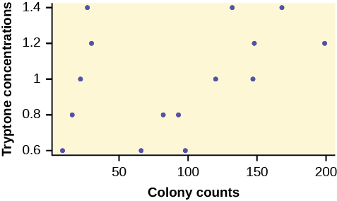
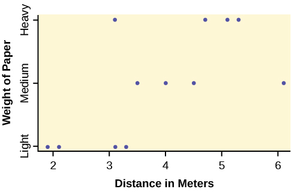

**Here are some facts about the *F* distribution.**

1.  The curve is not symmetrical but skewed to the right.
2.  There is a different curve for each set of *df*s.
3.  The *F* statistic is greater than or equal to zero.
4.  As the degrees of freedom for the numerator and for the denominator get larger, the curve approximates the normal.
5.  Other uses for the *F* distribution include comparing two variances and two-way Analysis of Variance. Two-Way Analysis is beyond the scope of this chapter.

![This graph has an unmarked Y axis and then an X axis that ranges from 0.00 to 4.00. It has three plot lines. The plot line labelled F subscript 1, 5 starts near the top of the Y axis at the extreme left of the graph and drops quickly to near the bottom at 0.50, at which point is slowly decreases in a curved fashion to the 4.00 mark on the X axis. The plot line labelled F subscript 100, 100 remains at Y = 0 for much of its length, except for a distinct peak between 0.50 and 1.50. The peak is a smooth curve that reaches about half way up the Y axis at its peak. The plot line labeled F subscript 5, 10 increases slightly as it progresses from 0.00 to 0.50, after which it peaks and slowly decreases down the remainder of the X axis. The peak only reaches about one fifth up the height of the Y axis.](../resources/OSX_Spec_StatisticsTEA_Figure_13_03_01.jpg){:}

Let’s return to the slicing tomato exercise in [[link]](/m47128#fs-idp19091024). The means of the tomato yields under the five mulching conditions are represented by *μ*1, *μ*2, *μ*3, *μ*4, *μ*5. We will conduct a hypothesis test to determine if all means are the same or at least one is different. Using a significance level of 5%, test the null hypothesis that there is no difference in mean yields among the five groups against the alternative hypothesis that at least one mean is different from the rest.

The null and alternative hypotheses are:

*H0*: *μ1* = *μ2* = *μ3* = *μ4* = *μ5*

*Ha: μi ≠ μj* some *i ≠ j*

The one-way ANOVA results are shown in [[link]](#eip-idp3797520)

| Source of Variation | Sum of Squares (*SS*) | Degrees of Freedom (*df*) | Mean Square (*MS*) | *F* |
|----------
| Factor (Between) | 36,648,561 | 5 – 1 = 4 | <math xmlns="http://www.w3.org/1998/Math/MathML"> <mrow> <mfrac> <mrow> <mtext>36,648,561</mtext> </mrow> <mtext>4</mtext> </mfrac> <mtext> = 9,162,140</mtext> </mrow> </math>

 | <math xmlns="http://www.w3.org/1998/Math/MathML" display="block"> <mrow> <mfrac> <mrow> <mtext>9,162,140</mtext> </mrow> <mrow> <mtext>2,044,672</mtext><mtext>.6</mtext> </mrow> </mfrac> <mtext> = 4</mtext><mtext>.4810</mtext> </mrow> </math>

 |
| Error (Within) | 20,446,726 | 15 – 5 = 10 | <math xmlns="http://www.w3.org/1998/Math/MathML" display="block"> <mrow> <mfrac> <mrow> <mtext>20,446,726</mtext> </mrow> <mrow> <mtext>10</mtext> </mrow> </mfrac> <mtext> = 2,044,672</mtext><mtext>.6</mtext> </mrow> </math>

 |  |
| Total | 57,095,287 | 15 – 1 = 14 |  |  |
{: #eip-632 summary=".."}

**Distribution for the test: *F*4,10**

*df*(*num*) = 5 – 1 = 4

*df*(*denom*) = 15 – 5 = 10

**Test statistic:** *F* = 4.4810

{:}

**Probability Statement:** *p*-value = *P*(*F* &gt; 4.481) = 0.0248.

**Compare *α* and the *p*-value:** *α* = 0.05, *p*-value = 0.0248

**Make a decision:** Since *α* &gt; *p*-value, we reject *H0*.

**Conclusion:** At the 5% significance level, we have reasonably strong evidence that differences in mean yields for slicing tomato plants grown under different mulching conditions are unlikely to be due to chance alone. We may conclude that at least some of mulches led to different mean yields.

To find these results on the calculator:

Press STAT. Press 1:EDIT. Put the data into the lists *L1*, *L2*, *L3*, *L4*, *L5*.

Press STAT, and arrow over to TESTS, and arrow down to ANOVA. Press ENTER, and then enter *L1*, *L2*, *L3*, *L4*, *L5*). Press ENTER. You will see that the values in the foregoing ANOVA table are easily produced by the calculator, including the test statistic and the *p*-value of the test.

The calculator displays: * * *
{: data-type="newline"}

*F* = 4.4810 * * *
{: data-type="newline"}

*p* = 0.0248 (*p*-value) * * *
{: data-type="newline"}

Factor * * *
{: data-type="newline"}

*df* = 4 * * *
{: data-type="newline"}

*SS* = 36648560.9 * * *
{: data-type="newline"}

*MS* = 9162140.23 * * *
{: data-type="newline"}

Error * * *
{: data-type="newline"}

*df* = 10 * * *
{: data-type="newline"}

*SS* = 20446726 * * *
{: data-type="newline"}

*MS* = 2044672.6

Try It

MRSA, or *Staphylococcus aureus*, can cause a serious bacterial infections in hospital patients. [[link]](#eip-755) shows various colony counts from different patients who may or may not have MRSA. The data from the table is plotted in Figure 13.5.

| Conc = 0.6 | Conc = 0.8 | Conc = 1.0 | Conc = 1.2 | Conc = 1.4 |
|----------
| 9 | 16 | 22 | 30 | 27 |
| 66 | 93 | 147 | 199 | 168 |
| 98 | 82 | 120 | 148 | 132 |
{: #eip-755 summary=".."}

Plot of the data for the different concentrations:

{:}

Test whether the mean number of colonies are the same or are different. Construct the ANOVA table (by hand or by using a TI-83, 83+, or 84+ calculator), find the *p*-value, and state your conclusion. Use a 5% significance level.
{: .finger}

Four sororities took a random sample of sisters regarding their grade means for the past term. The results are shown in [\[link\]](#table-1).

<table id="table-1" summary="This table presents the grade averages for sororities with the first sorority in the first column, second in the second column, third in the third column, and fourth in the fourth column."><caption>MEAN GRADES FOR FOUR SORORITIES</caption><thead>
<tr>
<th>Sorority 1</th>
<th>Sorority 2</th>
<th>Sorority 3</th>
<th>Sorority 4</th>
</tr>
</thead><tbody>
<tr>
<td data-align="center">2.17</td>
<td data-align="center">2.63</td>
<td data-align="center">2.63</td>
<td data-align="center">3.79</td>
</tr>
<tr>
<td data-align="center">1.85</td> <td data-align="center">1.77</td> <td data-align="center">3.78</td> <td data-align="center">3.45</td>
</tr>
<tr>
<td data-align="center">2.83</td>  <td data-align="center">3.25</td> <td data-align="center">4.00</td>  <td data-align="center">3.08</td>
</tr>
<tr>
<td data-align="center">1.69</td>  <td data-align="center">1.86</td>  <td data-align="center">2.55</td>  <td data-align="center">2.26</td>
</tr>
<tr>
<td data-align="center">3.33</td> <td data-align="center">2.21</td> <td data-align="center">2.45</td> <td data-align="center">3.18</td>
</tr>
</tbody></table>

Using a significance level of 1%, is there a difference in mean grades among the sororities?

Let *μ1*, *μ2*, *μ3*, *μ4* be the population means of the sororities. Remember that the null hypothesis claims that the sorority groups are from the same normal distribution. The alternate hypothesis says that at least two of the sorority groups come from populations with different normal distributions. Notice that the four sample sizes are each five.

Note

This is an example of a **balanced design**{: data-type="term"}, because each factor (i.e., sorority) has the same number of observations.

*H0*: *μ1* = *μ2* = *μ3* = *μ4*

*Ha*: Not all of the means *μ1*, *μ2*, *μ3*, *μ4* are equal.

**Distribution for the test:** *F*3,16

where *k* = 4 groups and *n* = 20 samples in total

*df*(*num*)= *k* – 1 = 4 – 1 = 3

*df*(*denom*) = *n* – *k* = 20 – 4 = 16

**Calculate the test statistic:** *F* = 2.23

**Graph:**

{:}

**Probability statement:** *p*-value = *P*(*F* &gt; 2.23) = 0.1241

**Compare *α* and the *p*-value:** *α* = 0.01* * *
{: data-type="newline"}

 *p*-value = 0.1241* * *
{: data-type="newline"}

 *α* &lt; *p*-value

**Make a decision:** Since *α* &lt; *p*-value, you cannot reject *H0*.

**Conclusion:** There is not sufficient evidence to conclude that there is a difference among the mean grades for the sororities.

Put the data into lists L1, L2, L3, and L4. Press `STAT` and arrow over to `TESTS`. Arrow down to `F:ANOVA`. Press `ENTER` and Enter (`L1,L2,L3,L4`).

The calculator displays the F statistic, the *p*-value and the values for the one-way ANOVA table: * * *
{: data-type="newline"}

*F* = 2.2303 * * *
{: data-type="newline"}

*p* = 0.1241 (*p*-value) * * *
{: data-type="newline"}

Factor * * *
{: data-type="newline"}

*df* = 3 * * *
{: data-type="newline"}

*SS* = 2.88732 * * *
{: data-type="newline"}

*MS* = 0.96244 * * *
{: data-type="newline"}

Error * * *
{: data-type="newline"}

*df* = 16 * * *
{: data-type="newline"}

*SS* = 6.9044 * * *
{: data-type="newline"}

*MS* = 0.431525

Try It

Four sports teams took a random sample of players regarding their GPAs for the last year. The results are shown in [[link]](#eip-440).

<table id="eip-440" summary=".."><caption>GPAs FOR FOUR SPORTS TEAMS</caption><thead>
<tr><th>Basketball</th>	<th>Baseball</th>	<th>Hockey</th>	<th>Lacrosse</th></tr>
</thead><tbody>

<tr><td>3.6</td>	<td>2.1</td>	<td>4.0</td>	<td>2.0</td></tr>
<tr><td>2.9</td>	<td>2.6</td>	<td>2.0</td>	<td>3.6</td></tr>
<tr><td>2.5</td>	<td>3.9</td>	<td>2.6</td>	<td>3.9</td></tr>
<tr><td>3.3</td>	<td>3.1</td>	<td>3.2</td> <td>2.7</td></tr>
<tr><td>3.8</td>	<td>3.4</td>	<td>3.2</td>	<td>2.5</td></tr>
</tbody></table>
Use a significance level of 5%, and determine if there is a difference in GPA among the teams.

A fourth grade class is studying the environment. One of the assignments is to grow bean plants in different soils. Tommy chose to grow his bean plants in soil found outside his classroom mixed with dryer lint. Tara chose to grow her bean plants in potting soil bought at the local nursery. Nick chose to grow his bean plants in soil from his mother\'s garden. No chemicals were used on the plants, only water. They were grown inside the classroom next to a large window. Each child grew five plants. At the end of the growing period, each plant was measured, producing the data (in inches) in [\[link\]](#table-234).

| Tommy\'s Plants | Tara\'s Plants | Nick\'s Plants |
|----------
{: valign="top"}| 24 | 25 | 23 |
| 21 | 31 | 27 |
| 23 | 23 | 22 |
| 30 | 20 | 30 |
| 23 | 28 | 20 |
{: valign="top"}{: #table-234 summary="This table presents Tommy's plant heights in inches in the first column, Tara's plant heights in inches in the second column, and Nick's plant heights in inches in the third column."}

Does it appear that the three media in which the bean plants were grown produce the same mean height? Test at a 3% level of significance.

This time, we will perform the calculations that lead to the *F'* statistic. Notice that each group has the same number of plants, so we will use the formula *F'* = <math xmlns="http://www.w3.org/1998/Math/MathML"> <mrow> <mfrac> <mrow> <mi>n</mi><mo>⋅</mo><msub> <mi>s</mi> <mover accent="true"> <mi>x</mi> <mo>¯</mo> </mover> </msub> <msup> <mrow /> <mn>2</mn> </msup> </mrow> <mrow> <msup> <mi>s</mi> <mn>2</mn> </msup> <msub> <mrow /> <mrow> <mtext>pooled</mtext> </mrow> </msub> </mrow> </mfrac> </mrow> </math>

 .

First, calculate the sample mean and sample variance of each group.

|  | Tommy's Plants | Tara's Plants | Nick's Plants |
|----------
{: valign="top"}| Sample Mean | 24.2 | 25.4 | 24.4 |
| Sample Variance | 11.7 | 18.3 | 16.3 |
{: #table-9634 summary="This table presents Tommy's plant heights in the first column, Tara's plant heights in the second column, and Nick's plant heights in the third column. The first row represents the sample mean and the second row represents the sample variance."}

Next, calculate the variance of the three group means (Calculate the variance of 24.2, 25.4, and 24.4). **Variance of the group means = 0.413** = <math xmlns="http://www.w3.org/1998/Math/MathML"> <mrow> <msub> <mi>s</mi> <mover accent="true"> <mi>x</mi> <mo>¯</mo> </mover> </msub> <msup> <mrow /> <mn>2</mn> </msup> </mrow> </math>

Then *MSbetween* = <math xmlns="http://www.w3.org/1998/Math/MathML"> <mrow> <mi>n</mi><msub> <mi>s</mi> <mover accent="true"> <mi>x</mi> <mo>¯</mo> </mover> </msub> <msup> <mrow /> <mn>2</mn> </msup> </mrow> </math>

 = (5)(0.413) where *n* = 5 is the sample size (number of plants each child grew).

Calculate the mean of the three sample variances (Calculate the mean of 11.7, 18.3, and 16.3). **Mean of the sample variances = 15.433** = ***s***2 ***pooled***

Then *MSwithin* = *s*2*pooled* = 15.433.

The *F* statistic (or *F* ratio) is <math xmlns="http://www.w3.org/1998/Math/MathML"> <mrow> <mi>F</mi><mo>=</mo><mfrac> <mrow> <mi>M</mi><msub> <mi>S</mi> <mrow> <mtext>between</mtext> </mrow> </msub> </mrow> <mrow> <mi>M</mi><msub> <mi>S</mi> <mrow> <mtext>within</mtext> </mrow> </msub> </mrow> </mfrac> <mo>=</mo><mfrac> <mrow> <mi>n</mi><msub> <mi>s</mi> <mover accent="true"> <mi>x</mi> <mo>¯</mo> </mover> </msub> <msup> <mrow /> <mn>2</mn> </msup> </mrow> <mrow> <msup> <mi>s</mi> <mn>2</mn> </msup> <msub> <mrow /> <mrow> <mi>p</mi><mi>o</mi><mi>o</mi><mi>l</mi><mi>e</mi><mi>d</mi> </mrow> </msub> </mrow> </mfrac> <mo>=</mo><mfrac> <mrow> <mo stretchy="false">(</mo><mn>5</mn><mo stretchy="false">)</mo><mo stretchy="false">(</mo><mn>0.413</mn><mo stretchy="false">)</mo> </mrow> <mrow> <mn>15.433</mn> </mrow> </mfrac> <mo>=</mo><mn>0.134</mn> </mrow> </math>

The *dfs* for the numerator = the number of groups – 1 = 3 – 1 = 2.

The *dfs* for the denominator = the total number of samples – the number of groups = 15 – 3 = 12

The distribution for the test is *F*2,12 and the *F* statistic is *F* = 0.134

The *p*-value is *P*(*F* &gt; 0.134) = 0.8759.

**Decision:** Since *α* = 0.03 and the *p*-value = 0.8759, do not reject *H0*. (Why?)

**Conclusion:** With a 3% level of significance, from the sample data, the evidence is not sufficient to conclude that the mean heights of the bean plants are different.

To calculate the *p*-value:

*Press `2nd DISTR`

*Arrow down to `Fcdf`(and press `ENTER`.

*Enter 0.134, `E99`, 2, 12)

*Press `ENTER`

The *p*-value is 0.8759.

Try It

Another fourth grader also grew bean plants, but this time in a jelly-like mass. The heights were (in inches) 24, 28, 25, 30, and 32. Do a one-way ANOVA test on the four groups. Are the heights of the bean plants different? Use the same method as shown in [[link]](#element-349).

Collaborative Exercise

From the class, create four groups of the same size as follows: men under 22, men at least 22, women under 22, women at least 22. Have each member of each group record the number of states in the United States he or she has visited. Run an ANOVA test to determine if the average number of states visited in the four groups are the same. Test at a 1% level of significance. Use one of the solution sheets in [\[link\]](/m47882).

### References   {#eip-712}

Data from a fourth grade classroom in 1994 in a private K – 12 school in San Jose, CA.

Hand, D.J., F. Daly, A.D. Lunn, K.J. McConway, and E. Ostrowski. *A Handbook of Small Datasets: Data for Fruitfly Fecundity.* London: Chapman &amp; Hall, 1994.

Hand, D.J., F. Daly, A.D. Lunn, K.J. McConway, and E. Ostrowski. *A Handbook of Small Datasets.* London: Chapman &amp; Hall, 1994, pg. 50.

Hand, D.J., F. Daly, A.D. Lunn, K.J. McConway, and E. Ostrowski. A Handbook of Small Datasets. London: Chapman &amp; Hall, 1994, pg. 118.

“MLB Standings – 2012.” Available online at http://espn.go.com/mlb/standings/\\\_/year/2012.

Mackowiak, P. A., Wasserman, S. S., and Levine, M. M. (1992), \"A Critical Appraisal of 98.6 Degrees F, the Upper Limit of the Normal Body Temperature, and Other Legacies of Carl Reinhold August Wunderlich,\" *Journal of the American Medical Association*, 268, 1578-1580.

### Chapter Review

The graph of the *F* distribution is always positive and skewed right, though the shape can be mounded or exponential depending on the combination of numerator and denominator degrees of freedom. The *F* statistic is the ratio of a measure of the variation in the group means to a similar measure of the variation within the groups. If the null hypothesis is correct, then the numerator should be small compared to the denominator. A small *F* statistic will result, and the area under the *F* curve to the right will be large, representing a large *p*-value. When the null hypothesis of equal group means is incorrect, then the numerator should be large compared to the denominator, giving a large *F* statistic and a small area (small *p*-value) to the right of the statistic under the *F* curve.

When the data have unequal group sizes (unbalanced data), then techniques from [\[link\]](/m47128) need to be used for hand calculations. In the case of balanced data (the groups are the same size) however, simplified calculations based on group means and variances may be used. In practice, of course, software is usually employed in the analysis. As in any analysis, graphs of various sorts should be used in conjunction with numerical techniques. Always look of your data!

<section data-depth="1" class="practice" markdown="1">

An *F* statistic can have what values?

What happens to the curves as the degrees of freedom for the numerator and the denominator get larger?

The curves approximate the normal distribution.

*Use the following information to answer the next seven exercise.* Four basketball teams took a random sample of players regarding how high each player can jump (in inches). The results are shown in [\[link\]](#eip-497).

| Team 1 | Team 2 | Team 3 | Team 4 | Team 5 |
|----------
| 36 | 32 | 48 | 38 | 41 |
| 42 | 35 | 50 | 44 | 39 |
| 51 | 38 | 39 | 46 | 40 |
{: #eip-497 summary=".."}

What is the *df(num)*?

What is the *df(denom)*?

ten

What are the Sum of Squares and Mean Squares Factors?

What are the Sum of Squares and Mean Squares Errors?

*SS* = 237.33; *MS* = 23.73

What is the *F* statistic?

What is the *p*-value?

0\.1614

At the 5% significance level, is there a difference in the mean jump heights among the teams?

* * *
{: data-type="newline"}

*Use the following information to answer the next seven exercises.* A video game developer is testing a new game on three different groups. Each group represents a different target market for the game. The developer collects scores from a random sample from each group. The results are shown in [\[link\]](#eip-546)

| Group A | Group B | Group C |
|----------
| 101 | 151 | 101 |
| 108 | 149 | 109 |
| 98 | 160 | 198 |
| 107 | 112 | 186 |
| 111 | 126 | 160 |
{: #eip-546 summary=".."}

What is the *df(num)*?

two

What is the *df(denom)*?

What are the *SSbetween* and *MSbetween*?

*SS* = 5,700.4;

*MS* = 2,850.2

What are the *SSwithin* and *MSwithin*?

What is the *F* Statistic?

3\.6101

What is the *p*-value?

At the 10% significance level, are the scores among the different groups different?

Yes, there is enough evidence to show that the scores among the groups are statistically significant at the 10% level.

* * *
{: data-type="newline"}

*Use the following information to answer the next three exercises.* Suppose a group is interested in determining whether teenagers obtain their drivers licenses at approximately the same average age across the country. Suppose that the following data are randomly collected from five teenagers in each region of the country. The numbers represent the age at which teenagers obtained their drivers licenses.

|  | Northeast | South | West | Central | East |
|----------
|  | 16.3 | 16.9 | 16.4 | 16.2 | 17.1 |
|  | 16.1 | 16.5 | 16.5 | 16.6 | 17.2 |
|  | 16.4 | 16.4 | 16.6 | 16.5 | 16.6 |
|  | 16.5 | 16.2 | 16.1 | 16.4 | 16.8 |
| <math xmlns="http://www.w3.org/1998/Math/MathML"> <mrow> <mover accent="true"> <mi>x</mi> <mo>¯</mo> </mover> <mo>=</mo> </mrow> </math>

 | \\\_\\\_\\\_\\\_\\\_\\\_\\\_\\\_ | \\\_\\\_\\\_\\\_\\\_\\\_\\\_\\\_ | \\\_\\\_\\\_\\\_\\\_\\\_\\\_\\\_ | \\\_\\\_\\\_\\\_\\\_\\\_\\\_\\\_ | \\\_\\\_\\\_\\\_\\\_\\\_\\\_\\\_ |
| <math xmlns="http://www.w3.org/1998/Math/MathML"> <mrow> <msup> <mi>s</mi> <mn>2</mn> </msup> <mo>=</mo> </mrow> </math>

 | \\\_\\\_\\\_\\\_\\\_\\\_\\\_\\\_ | \\\_\\\_\\\_\\\_\\\_\\\_\\\_\\\_ | \\\_\\\_\\\_\\\_\\\_\\\_\\\_\\\_ | \\\_\\\_\\\_\\\_\\\_\\\_\\\_\\\_ | \\\_\\\_\\\_\\\_\\\_\\\_\\\_\\\_ |
{: #element-25 summary=""}

Enter the data into your calculator or computer.

*p*-value = \_\_\_\_\_\_

*State the decisions and conclusions (in complete sentences) for the following preconceived levels of α*.

*α* = 0.05

a. Decision: \_\_\_\_\_\_\_\_\_\_\_\_\_\_\_\_\_\_\_\_\_\_\_\_\_\_\_\_

b. Conclusion: \_\_\_\_\_\_\_\_\_\_\_\_\_\_\_\_\_\_\_\_\_\_\_\_\_\_\_\_

*α* = 0.01

a. Decision: \_\_\_\_\_\_\_\_\_\_\_\_\_\_\_\_\_\_\_\_\_\_\_\_\_\_\_\_

b. Conclusion: \_\_\_\_\_\_\_\_\_\_\_\_\_\_\_\_\_\_\_\_\_\_\_\_\_\_\_\_

</section>

### Homework

DIRECTIONS

Use a solution sheet to conduct the following hypothesis tests. The solution sheet can be found in [\[link\]](/m47882).

Three students, Linda, Tuan, and Javier, are given five laboratory rats each for a nutritional experiment. Each rat's weight is recorded in grams. Linda feeds her rats Formula A, Tuan feeds his rats Formula B, and Javier feeds his rats Formula C. At the end of a specified time period, each rat is weighed again, and the net gain in grams is recorded. Using a significance level of 10%, test the hypothesis that the three formulas produce the same mean weight gain.

<table id="id348a5492" summary="This table presents the net weight in grams of each rat with Linda's rats in the first column, Tuan's rats in the second column, and Javier's rats in the third column."><caption>Weights of Student Lab Rats</caption><thead>
<tr>
<th>Linda's rats</th>
<th>Tuan's rats</th>
<th>Javier's rats</th>
</tr>
</thead><tbody>
<tr>
<td data-align="center">43.5</td>
<td data-align="center">47.0</td>
<td data-align="center">51.2</td>
</tr>
<tr>
<td data-align="center">39.4</td>
<td data-align="center">40.5</td>
<td data-align="center">40.9</td>
</tr>
<tr>
<td data-align="center">41.3</td>
<td data-align="center">38.9</td>
<td data-align="center">37.9</td>
</tr>
<tr>
<td data-align="center">46.0</td>
<td data-align="center">46.3</td>
<td data-align="center">45.0</td>
</tr>
<tr>
<td data-align="center">38.2</td>
<td data-align="center">44.2</td>
<td data-align="center">48.6</td>
</tr>
</tbody></table>

1.  *H0*: *µL* = *µT* = *µJ*
2.  *Ha*: at least any two of the means are different
3.  *df*(*num*) = 2; *df*(*denom*) = 12
4.  *F* distribution
5.  0\.67
6.  0\.5305
7.  Check student’s solution.
8.  Decision: Do not reject null hypothesis; Conclusion: There is insufficient evidence to conclude that the means are different.
{: type="a"}

A grassroots group opposed to a proposed increase in the gas tax claimed that the increase would hurt working-class people the most, since they commute the farthest to work. Suppose that the group randomly surveyed 24 individuals and asked them their daily one-way commuting mileage. The results are in [[link]](#idgh7333173).  Using a 5% significance level, test the hypothesis that the three mean commuting mileages are the same.

| working-class | professional (middle incomes) | professional (wealthy) |
|----------
| 17.8 | 16.5 | 8.5 |
| 26.7 | 17.4 | 6.3 |
| 49.4 | 22.0 | 4.6 |
| 9.4 | 7.4 | 12.6 |
| 65.4 | 9.4 | 11.0 |
| 47.1 | 2.1 | 28.6 |
| 19.5 | 6.4 | 15.4 |
| 51.2 | 13.9 | 9.3 |
{: #idgh7333173 summary=""}

*Use the following information to answer the next two exercises.* [\[link\]](#id7236751) lists the number of pages in four different types of magazines.

| home decorating | news | health | computer |
|----------
| 172 | 87 | 82 | 104 |
| 286 | 94 | 153 | 136 |
| 163 | 123 | 87 | 98 |
| 205 | 106 | 103 | 207 |
| 197 | 101 | 96 | 146 |
{: #id7236751 summary="This table presents the number of pages in some types of magazines with home decorating in the first column, news in the second column, health in the third column, and computer in the fourth column."}

Using a significance level of 5%, test the hypothesis that the four magazine types have the same mean length.

Eliminate one magazine type that you now feel has a mean length different from the others. Redo the hypothesis test, testing that the remaining three means are statistically the same. Use a new solution sheet. Based on this test, are the mean lengths for the remaining three magazines statistically the same?

1.  *Ha*: *µ*c = *µ*n = *µ*h
2.  At least any two of the magazines have different mean lengths.
3.  *df*(*num*) = 2, *df*(*denom*) = 12
4.  *F* distribtuion
5.  *F* = 15.28
6.  *p*-value = 0.0005
7.  Check student’s solution.
8.  1.  Alpha: 0.05
    2.  Decision: Reject the Null Hypothesis.
    3.  Reason for decision: *p*-value &lt; alpha
    4.  Conclusion: There is sufficient evidence to conclude that the mean lengths of the magazines are different.
    {: type="i"}
{: type="a"}

A researcher wants to know if the mean times (in minutes) that people watch their favorite news station are the same. Suppose that [[link]](#eip-id2754369) shows the results of a study.

| CNN | FOX | Local |
|----------
| 45 | 15 | 72 |
| 12 | 43 | 37 |
| 18 | 68 | 56 |
| 38 | 50 | 60 |
| 23 | 31 | 51 |
| 35 | 22 |  |
{: #eip-id2754369 summary="The Table consists of 3 columns: CNN, Fox and Local. The table entries are the mean time, in minutes, that people watch their favorite news station on CNN, Fox or the local station."}

Assume that all distributions are normal, the four population standard deviations are approximately the same, and the data were collected independently and randomly. Use a level of significance of 0.05.

Are the means for the final exams the same for all statistics class delivery types? [[link]](#eip-id1164473001430) shows the scores on final exams from several randomly selected classes that used the different delivery types.

| Online | Hybrid | Face-to-Face |
|----------
| 72 | 83 | 80 |
| 84 | 73 | 78 |
| 77 | 84 | 84 |
| 80 | 81 | 81 |
| 81 |  | 86 |
|  |  | 79 |
|  |  | 82 |
{: #eip-id1164473001430 summary="The Table consists of 3 columns: Online, Hybrid and Face-to-Face. The table entries are the mean scores on the final exam for Online, Hybrid and Face-to-Face delivery types for statistics."}

Assume that all distributions are normal, the four population standard deviations are approximately the same, and the data were collected independently and randomly. Use a level of significance of 0.05.

1.  *H0*: *μo* = *μh* = *μf*
2.  At least two of the means are different.
3.  *df*(*n*) = 2, *df*(*d*) = 13
4.  *F*2,13
5.  0\.64
6.  0\.5437
7.  Check student’s solution.
8.  1.  Alpha: 0.05
    2.  Decision: Do not reject the null hypothesis.
    3.  Reason for decision: *p*-value &gt; alpha
    4.  Conclusion: The mean scores of different class delivery are not different.
    {: type="i"}
{: type="a"}

Are the mean number of times a month a person eats out the same for whites, blacks, Hispanics and Asians? Suppose that [[link]](#fs-idm13269984) shows the results of a study.

| White | Black | Hispanic | Asian |
|----------
| 6 | 4 | 7 | 8 |
| 8 | 1 | 3 | 3 |
| 2 | 5 | 5 | 5 |
| 4 | 2 | 4 | 1 |
| 6 |  | 6 | 7 |
{: summary="The Table consists of 4 columns: White, Black, Hispanic and Asian. The table entries are the mean number of times a month that people who are White, Black, Hispanic and Asian eat out."}

Assume that all distributions are normal, the four population standard deviations are approximately the same, and the data were collected independently and randomly. Use a level of significance of 0.05.

Are the mean numbers of daily visitors to a ski resort the same for the three types of snow conditions? Suppose that [[link]](#fs-idp109843184) shows the results of a study.

| Powder | Machine Made | Hard Packed |
|----------
| 1,210 | 2,107 | 2,846 |
| 1,080 | 1,149 | 1,638 |
| 1,537 | 862 | 2,019 |
| 941 | 1,870 | 1,178 |
|  | 1,528 | 2,233 |
|  | 1,382 |  |
{: summary="The Table consists of 3 columns with snow conditions Powder, Machine Made and Hard Packed. The table entries are the mean number of visitors to a ski resort for the 3 types of snow conditions."}

Assume that all distributions are normal, the four population standard deviations are approximately the same, and the data were collected independently and randomly. Use a level of significance of 0.05.

1.  *H0*: *μp* = *μm* = *μh*
2.  At least any two of the means are different.
3.  *df*(*n*) = 2, *df*(*d*) = 12
4.  *F*2,12
5.  3\.13
6.  0\.0807
7.  Check student’s solution.
8.  1.  Alpha: 0.05
    2.  Decision: Do not reject the null hypothesis.
    3.  Reason for decision: *p*-value &gt; alpha
    4.  Conclusion: There is not sufficient evidence to conclude that the mean numbers of daily visitors are different.
    {: type="i"}
{: type="a"}

Sanjay made identical paper airplanes out of three different weights of paper, light, medium and heavy. He made four airplanes from each of the weights, and launched them himself across the room. Here are the distances (in meters) that his planes flew.

| Paper Type/Trial | Trial 1 | Trial 2 | Trial 3 | Trial 4 |
|----------
| Heavy | 5.1 meters | 3.1 meters | 4.7 meters | 5.3 meters |
| Medium | 4 meters | 3.5 meters | 4.5 meters | 6.1 meters |
| Light | 3.1 meters | 3.3 meters | 2.1 meters | 1.9 meters |
{: #eip-729 summary=".."}

{:}

1.  Take a look at the data in the graph. Look at the spread of data for each group (light, medium, heavy). Does it seem reasonable to assume a normal distribution with the same variance for each group? Yes or No.
2.  Why is this a balanced design?
3.  Calculate the sample mean and sample standard deviation for each group.
4.  Does the weight of the paper have an effect on how far the plane will travel? Use a 1% level of significance. Complete the test using the method shown in the bean plant example in [[link]](#element-349).
    * variance of the group means \_\_\_\_\_\_\_\_\_\_
    * *MSbetween*= \_\_\_\_\_\_\_\_\_\_\_
    * mean of the three sample variances \_\_\_\_\_\_\_\_\_\_\_
    * *MSwithin* = \_\_\_\_\_\_\_\_\_\_\_\_\_
    * *F* statistic = \_\_\_\_\_\_\_\_\_\_\_\_
    * *df(num)* = \_\_\_\_\_\_\_\_\_\_, *df(denom)* = \_\_\_\_\_\_\_\_\_\_\_
    * number of groups \_\_\_\_\_\_\_
    * number of observations \_\_\_\_\_\_\_
    * *p*-value = \_\_\_\_\_\_\_\_\_\_ (*P*(*F* &gt; \_\_\_\_\_\_\_) = \_\_\_\_\_\_\_\_\_\_)
    * Graph the *p*-value.
    * decision: \_\_\_\_\_\_\_\_\_\_\_\_\_\_\_\_\_\_\_\_\_\_\_
    * conclusion: \_\_\_\_\_\_\_\_\_\_\_\_\_\_\_\_\_\_\_\_\_\_\_\_\_\_\_\_\_\_\_\_\_\_\_\_\_\_\_\_\_\_\_\_\_\_\_\_\_\_\_\_\_\_\_\_\_\_\_\_\_\_\_
{: type="a"}

DDT is a pesticide that has been banned from use in the United States and most other areas of the world. It is quite effective, but persisted in the environment and over time became seen as harmful to higher-level organisms. Famously, egg shells of eagles and other raptors were believed to be thinner and prone to breakage in the nest because of ingestion of DDT in the food chain of the birds.

An experiment was conducted on the number of eggs (fecundity) laid by female fruit flies. There are three groups of flies. One group was bred to be resistant to DDT (the RS group). Another was bred to be especially susceptible to DDT (SS). Finally there was a control line of non-selected or typical fruitflies (NS). Here are the data:

| RS | SS | NS | RS | SS | NS |
|----------
| 12.8 | 38.4 | 35.4 | 22.4 | 23.1 | 22.6 |
| 21.6 | 32.9 | 27.4 | 27.5 | 29.4 | 40.4 |
| 14.8 | 48.5 | 19.3 | 20.3 | 16 | 34.4 |
| 23.1 | 20.9 | 41.8 | 38.7 | 20.1 | 30.4 |
| 34.6 | 11.6 | 20.3 | 26.4 | 23.3 | 14.9 |
| 19.7 | 22.3 | 37.6 | 23.7 | 22.9 | 51.8 |
| 22.6 | 30.2 | 36.9 | 26.1 | 22.5 | 33.8 |
| 29.6 | 33.4 | 37.3 | 29.5 | 15.1 | 37.9 |
| 16.4 | 26.7 | 28.2 | 38.6 | 31 | 29.5 |
| 20.3 | 39 | 23.4 | 44.4 | 16.9 | 42.4 |
| 29.3 | 12.8 | 33.7 | 23.2 | 16.1 | 36.6 |
| 14.9 | 14.6 | 29.2 | 23.6 | 10.8 | 47.4 |
| 27.3 | 12.2 | 41.7 |  |  |  |
{: #eip-180 summary=".."}

The values are the average number of eggs laid daily for each of 75 flies (25 in each group) over the first 14 days of their lives. Using a 1% level of significance, are the mean rates of egg selection for the three strains of fruitfly different? If so, in what way? Specifically, the researchers were interested in whether or not the selectively bred strains were different from the nonselected line, and whether the two selected lines were different from each other.

Here is a chart of the three groups:

{:}

The data appear normally distributed from the chart and of similar spread. There do not appear to be any serious outliers, so we may proceed with our ANOVA calculations, to see if we have good evidence of a difference between the three groups.

*H0*: *μ*1 = *μ*2 = *μ*3;

*H*a: *μ*i ≠ *μ*j some *i* ≠ *j*.

Define *μ*1, *μ*2, *μ*3, as the population mean number of eggs laid by the three groups of fruit flies.

*F* statistic = 8.6657;

*p*-value = 0.0004

{:}

**<u data-effect="underline">Decision:</u>** Since the *p*-value is less than the level of significance of 0.01, we reject the null hypothesis.

**<u data-effect="underline">Conclusion:</u>** We have good evidence that the average number of eggs laid during the first 14 days of life for these three strains of fruitflies are different.

Interestingly, if you perform a two sample *t*-test to compare the RS and NS groups they are significantly different (*p* = 0.0013). Similarly, SS and NS are significantly different (*p* = 0.0006). However, the two selected groups, RS and SS are *not* significantly different (*p* = 0.5176). Thus we appear to have good evidence that selection either for resistance or for susceptibility involves a reduced rate of egg production (for these specific strains) as compared to flies that were not selected for resistance or susceptibility to DDT. Here, genetic selection has apparently involved a loss of fecundity.

The data shown is the recorded body temperatures of 130 subjects as estimated from available histograms.

Traditionally we are taught that the normal human body temperature is 98.6 F. This is not quite correct for everyone. Are the mean temperatures among the four groups different?

Calculate 95% confidence intervals for the mean body temperature in each group and comment about the confidence intervals.

| FL | FH | ML | MH | FL | FH | ML | MH |
|----------
| 96.4 | 96.8 | 96.3 | 96.9 | 98.4 | 98.6 | 98.1 | 98.6 |
| 96.7 | 97.7 | 96.7 | 97 | 98.7 | 98.6 | 98.1 | 98.6 |
| 97.2 | 97.8 | 97.1 | 97.1 | 98.7 | 98.6 | 98.2 | 98.7 |
| 97.2 | 97.9 | 97.2 | 97.1 | 98.7 | 98.7 | 98.2 | 98.8 |
| 97.4 | 98 | 97.3 | 97.4 | 98.7 | 98.7 | 98.2 | 98.8 |
| 97.6 | 98 | 97.4 | 97.5 | 98.8 | 98.8 | 98.2 | 98.8 |
| 97.7 | 98 | 97.4 | 97.6 | 98.8 | 98.8 | 98.3 | 98.9 |
| 97.8 | 98 | 97.4 | 97.7 | 98.8 | 98.8 | 98.4 | 99 |
| 97.8 | 98.1 | 97.5 | 97.8 | 98.8 | 98.9 | 98.4 | 99 |
| 97.9 | 98.3 | 97.6 | 97.9 | 99.2 | 99 | 98.5 | 99 |
| 97.9 | 98.3 | 97.6 | 98 | 99.3 | 99 | 98.5 | 99.2 |
| 98 | 98.3 | 97.8 | 98 |  | 99.1 | 98.6 | 99.5 |
| 98.2 | 98.4 | 97.8 | 98 |  | 99.1 | 98.6 |  |
| 98.2 | 98.4 | 97.8 | 98.3 |  | 99.2 | 98.7 |  |
| 98.2 | 98.4 | 97.9 | 98.4 |  | 99.4 | 99.1 |  |
| 98.2 | 98.4 | 98 | 98.4 |  | 99.9 | 99.3 |  |
| 98.2 | 98.5 | 98 | 98.6 |  | 100 | 99.4 |  |
| 98.2 | 98.6 | 98 | 98.6 |  | 100.8 |  |  |
{: #eip-269 summary=".."}

