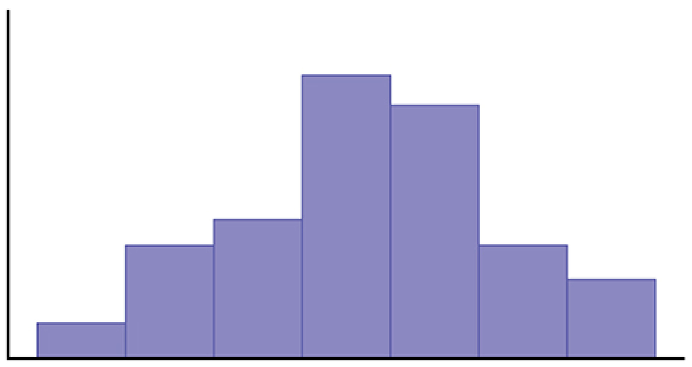
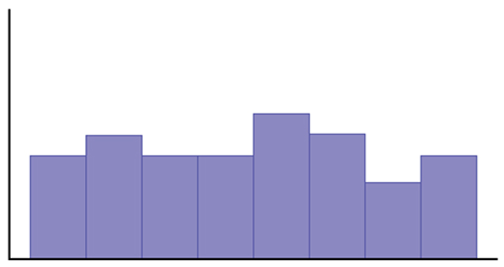

These review exercises are designed to provide extra practice on concepts learned before a particular chapter. For example, the review exercises for Chapter 3, cover material learned in chapters 1 and 2.

# Chapter 3

*Use the following information to answer the next six exercises:* In a survey of 100 stocks on NASDAQ, the average percent increase for the past year was 9% for NASDAQ stocks.

**1**. The “average increase” for all NASDAQ stocks is the:

population

statistic

parameter

sample

variable

* * *
{: data-type="newline"}

**2.** All of the NASDAQ stocks are the: 

population

statistics

parameter

sample

variable

* * *
{: data-type="newline"}

**3.** Nine percent is the: 

population

statistics

parameter

sample

variable

* * *
{: data-type="newline"}

**4.** The 100 NASDAQ stocks in the survey are the: 

population

statistic

parameter

sample

variable

* * *
{: data-type="newline"}

**5.** The percent increase for one stock in the survey is the: 

population

statistic

parameter

sample

variable

* * *
{: data-type="newline"}

**6.** Would the data collected by qualitative, quantitative discrete, or quantitative continuous?

*Use the following information to answer the next two exercises:* Thirty people spent two weeks around Mardi Gras in New Orleans. Their two-week weight gain is below. (Note: a loss is shown by a negative weight gain.)

<table summary=".."><caption></caption><thead>
<tr>
<th>Weight Gain</th>
<th>Frequency</th>
</tr>
</thead><tbody>
<tr>
<td>–2</td>
<td>3</td>
</tr>
<tr>
<td>–1</td>
<td>5</td>
</tr>
<tr>
<td>0</td>
<td>2</td>
</tr>
<tr>
<td>1</td>
<td>4</td>
</tr>
<tr>
<td>4</td>
<td>13</td>
</tr>
<tr>
<td>6</td>
<td>2</td>
</tr>
<tr>
<td>11</td>
<td>1</td>
</tr>
</tbody></table>

**7.** Calculate the following values: 

the average weight gain for the two weeks

the standard deviation

the first, second, and third quartiles

* * *
{: data-type="newline"}

**8.** Construct a histogram and box plot of the data.

# Chapter 4

*Use the following information to answer the next two exercises:* A recent poll concerning credit cards found that 35 percent of respondents use a credit card that gives them a mile of air travel for every dollar they charge. Thirty percent of the respondents charge more than $2,000 per month. Of those respondents who charge more than $2,000, 80 percent use a credit card that gives them a mile of air travel for every dollar they charge.

**9.** What is the probability that a randomly selected respondent will spend more than $2,000 AND use a credit card that gives them a mile of air travel for every dollar they charge?

(0.30)(0.35)

(0.80)(0.35)

(0.80)(0.30)

(0.80)

* * *
{: data-type="newline"}

**10.** Are using a credit card that gives a mile of air travel for each dollar spent AND charging more than $2,000 per month independent events?

Yes

No, and they are not mutually exclusive either.

No, but they are mutually exclusive.

Not enough information given to determine the answer

* * *
{: data-type="newline"}

**11.** A sociologist wants to know the opinions of employed adult women about government funding for day care. She obtains a list of 520 members of a local business and professional women’s club and mails a questionnaire to 100 of these women selected at random. Sixty-eight questionnaires are returned. What is the population in this study?

all employed adult women

all the members of a local business and professional women’s club

the 100 women who received the questionnaire

all employed women with children

* * *
{: data-type="newline"}

*Use the following information to answer the next two exercises:* The next two questions refer to the following: An article from The San Jose Mercury News was concerned with the racial mix of the 1500 students at Prospect High School in Saratoga, CA. The table summarizes the results. (Male and female values are approximate.) Suppose one Prospect High School student is randomly selected.

<table summary=".."><caption></caption><thead>
<tr>
<th>Gender/Ethnic group</th>
<th>White</th>
<th>Asian</th>
<th>Hispanic</th>
<th>Black</th>
<th>American Indian</th>
</tr>
</thead><tbody>
<tr>
<td>Male</td>
<td>400</td>
<td>468</td>
<td>115</td>
<td>35</td>
<td>16</td>
</tr>
<tr>
<td>Female</td>
<td>440</td>
<td>132</td>
<td>140</td>
<td>40</td>
<td>14</td>
</tr>
</tbody></table>

**12.** Find the probability that a student is Asian or Male.

**13.** Find the probability that a student is Black given that the student is female.

**14.** A sample of pounds lost, in a certain month, by individual members of a weight reducing clinic produced the following statistics: 

Mean = 5 lbs.

Median = 4.5 lbs.

Mode = 4 lbs.

Standard deviation = 3.8 lbs.

First quartile = 2 lbs.

Third quartile = 8.5 lbs.

 * * *
{: data-type="newline"}

The correct statement is: 

One fourth of the members lost exactly two pounds.

The middle fifty percent of the members lost from two to 8.5 lbs.

Most people lost 3.5 to 4.5 lbs.

All of the choices above are correct.

* * *
{: data-type="newline"}

**15.** What does it mean when a data set has a standard deviation equal to zero?

All values of the data appear with the same frequency.

The mean of the data is also zero.

All of the data have the same value.

There are no data to begin with.

* * *
{: data-type="newline"}

**16.** The statement that describe the illustration is:{:}

the mean is equal to the median.

There is no first quartile.

The lowest data value is the median.

The median equals
<math xmlns="http://www.w3.org/1998/Math/MathML"> <mrow> <mfrac> <mrow> <msub> <mi>Q</mi> <mn>1</mn> </msub> <mo>+</mo> <msub> <mi>Q</mi> <mn>3</mn> </msub> </mrow> <mn>2</mn> </mfrac> </mrow> </math>
.

* * *
{: data-type="newline"}

**17.** According to a recent article in the *San Jose Mercury News* the average number of babies born with significant hearing loss (deafness) is approximately 2 per 1000 babies in a healthy baby nursery. The number climbs to an average of 30 per 1000 babies in an intensive care nursery. Suppose that 1,000 babies from healthy baby nurseries were randomly surveyed. Find the probability that exactly two babies were born deaf.

**18.** A “friend” offers you the following “deal.” For a $10 fee, you may pick an envelope from a box containing 100 seemingly identical envelopes. However, each envelope contains a coupon for a free gift. 

Ten of the coupons are for a free gift worth $6.

Eighty of the coupons are for a free gift worth $8.

Six of the coupons are for a free gift worth $12.

Four of the coupons are for a free gift worth $40.

* * *
{: data-type="newline"}

Based upon the financial gain or loss over the long run, should you play the game? 

Yes, I expect to come out ahead in money.

No, I expect to come out behind in money.

It doesn’t matter. I expect to break even.

 * * *
{: data-type="newline"}

*Use the following information to answer the next four exercises:* Recently, a nurse commented that when a patient calls the medical advice line claiming to have the flu, the chance that he/she truly has the flu (and not just a nasty cold) is only about 4%. Of the next 25 patients calling in claiming to have the flu, we are interested in how many actually have the flu.

**19.** Define the random variable and list its possible values.

**20.** State the distribution of *X*.

**21.** Find the probability that at least four of the 25 patients actually have the flu.

**22.** On average, for every 25 patients calling in, how many do you expect to have the flu?

*Use the following information to answer the next two exercises:* Different types of writing can sometimes be distinguished by the number of letters in the words used. A student interested in this fact wants to study the number of letters of words used by Tom Clancy in his novels. She opens a Clancy novel at random and records the number of letters of the first 250 words on the page.

**23.** What kind of data was collected?

qualitative

quantitative continuous

quantitative discrete

* * *
{: data-type="newline"}

**24.** What is the population under study?

# Chapter 5

*Use the following information to answer the next seven exercises:* A recent study of mothers of junior high school children in Santa Clara County reported that 76% of the mothers are employed in paid positions. Of those mothers who are employed, 64% work full-time (over 35 hours per week), and 36% work part-time. However, out of all of the mothers in the population, 49% work full-time. The population under study is made up of mothers of junior high school children in Santa Clara County. Let E = employed and F = full-time employment.

**25.** 

Find the percent of all mothers in the population that are NOT employed.

Find the percent of mothers in the population that are employed part-time.

* * *
{: data-type="newline"}

**26.** The “type of employment” is considered to be what type of data?

**27.** Find the probability that a randomly selected mother works part-time given that she is employed.

**28.** Find the probability that a randomly selected person from the population will be employed or work full-time.

**29.** Being employed and working part-time: 

mutually exclusive events? Why or why not?

independent events? Why or why not?

 * * *
{: data-type="newline"}

*Use the following additional information to answer the next two exercises:* We randomly pick ten mothers from the above population. We are interested in the number of the mothers that are employed. Let *X* = number of mothers that are employed.

**30.** State the distribution for *X*.

**31.** Find the probability that at least six are employed.

**32.** We expect the statistics discussion board to have, on average, 14 questions posted to it per week. We are interested in the number of questions posted to it per day. 

Define *X*.

What are the values that the random variable may take on?

State the distribution for *X*.

Find the probability that from ten to 14 (inclusive) questions are posted to the listserv on a randomly picked day.

* * *
{: data-type="newline"}

**33.** A person invests $1,000 into stock of a company that hopes to go public in one year. The probability that the person will lose all his money after one year (i.e. his stock will be worthless) is 35%. The probability that the person’s stock will still have a value of $1,000 after one year (i.e. no profit and no loss) is 60%. The probability that the person’s stock will increase in value by $10,000 after one year (i.e. will be worth $11,000) is 5%. Find the expected profit after one year.

**34.** Rachel’s piano cost $3,000. The average cost for a piano is $4,000 with a standard deviation of $2,500. Becca’s guitar cost $550. The average cost for a guitar is $500 with a standard deviation of $200. Matt’s drums cost $600. The average cost for drums is $700 with a standard deviation of $100. Whose cost was lowest when compared to his or her own instrument?

{:}

**35.** Explain why each statement is either true or false given the box plot in [\[link\]](#fs-idp112081744). 

Twenty-five percent of the data re at most five.

There is the same amount of data from 4–5 as there is from 5–7.

There are no data values of three.

Fifty percent of the data are four.

 * * *
{: data-type="newline"}

*Using the following information to answer the next two exercises:* 64 faculty members were asked the number of cars they owned (including spouse and children’s cars). The results are given in the following graph:

 {:}

**36.** Find the approximate number of responses that were three.

**37.** Find the first, second and third quartiles. Use them to construct a box plot of the data.

*Use the following information to answer the next three exercises:* [\[link\]](#fs-idp29366416) shows data gathered from 15 girls on the Snow Leopard soccer team when they were asked how they liked to wear their hair. Supposed one girl from the team is randomly selected.

<table summary=".."><caption></caption><thead>
<tr>
<th>Hair Style/Hair Color</th>
<th>Blond</th>
<th>Brown</th>
<th>Black</th>
</tr>
</thead><tbody>
<tr>
<td>Ponytail</td>
<td>3</td>
<td>2</td>
<td>5</td>
</tr>
<tr>
<td>Plain</td>
<td>2</td>
<td>2</td>
<td>1</td>
</tr>
</tbody></table>

**38.** Find the probability that the girl has black hair GIVEN that she wears a ponytail.

**39.** Find the probability that the girl wears her hair plain OR has brown hair.

**40.** Find the probability that the girl has blond hair AND that she wears her hair plain.

# Chapter 6

*Use the following information to answer the next two exercises: X* ~ *U*(3, 13)

**41.** Explain which of the following are false and which are true.

*f*(*x*) =
<math xmlns="http://www.w3.org/1998/Math/MathML"> <mrow> <mfrac> <mn>1</mn> <mrow> <mn>10</mn> </mrow> </mfrac> </mrow> </math>
, 3 ≤ *x* ≤ 13

There is no mode

The median is less than the mean.

*P*(*x* &gt; 10) = *P*(*x* ≤ 6)

* * *
{: data-type="newline"}

**42.** Calculate: 

the mean.

the median.

the 65th percentile.

* * *
{: data-type="newline"}

{:}

**43.** Which of the following is true for the box plot in [\[link\]](#fs-idp4743968)?

Twenty-five percent of the data are at most five.

There is about the same amount of data from 4–5 as there is from 5–7.

There are no data values of three.

Fifty percent of the data are four.

* * *
{: data-type="newline"}

**44.** If *P*(*G*\\\|*H*) = *P*(*G*), then which of the following is correct?

*G* and *H* are mutually exclusive events.

*P*(*G*) = *P*(*H*)

Knowing that *H* has occurred will affect the chance that *G* will happen.

*G* and *H* are independent events.

* * *
{: data-type="newline"}

**45.** If *P*(*J*) = 0.3, *P*(*K*) = 0.63, and *J* and *K* are independent events, then explain which are correct and which are incorrect.

*P*(*J* AND *K*) = 0

*P*(*J* OR *K*) = 0.9

*P*(*J* OR *K*) = 0.72

*P*(*J*) ≠ *P*(*J*\|*K*)

* * *
{: data-type="newline"}

**46.** On average, five students from each high school class get full scholarships to four-year colleges. Assume that most high school classes have about 500 students. *X* = the number of students from a high school class that get full scholarships to four-year schools. Which of the following is the distribution of *X*?

*P*(5)

*B*(500, 5)

*Exp*
<math xmlns="http://www.w3.org/1998/Math/MathML"> <mrow> <mrow><mo>(</mo> <mrow> <mfrac> <mn>1</mn> <mn>5</mn> </mfrac> </mrow> <mo>)</mo></mrow> </mrow> </math>

<math xmlns="http://www.w3.org/1998/Math/MathML"> <mrow> <mi>N</mi><mrow><mo>(</mo> <mrow> <mn>5</mn><mo>,</mo><mfrac> <mrow> <mo stretchy="false">(</mo><mn>0.01</mn><mo stretchy="false">)</mo><mo stretchy="false">(</mo><mn>0.99</mn><mo stretchy="false">)</mo> </mrow> <mrow> <mn>500</mn> </mrow> </mfrac> </mrow> <mo>)</mo></mrow> </mrow> </math>

* * *
{: data-type="newline"}

# Chapter 7

*Use the following information to answer the next three exercises:* Richard’s Furniture Company delivers furniture from 10 A.M. to 2 P.M. continuously and uniformly. We are interested in how long (in hours) past the 10 A.M. start time that individuals wait for their delivery.

**47.** *X* ~ \\\_\\\_\\\_\\\_\\\_\\\_\\\_\\\_\\\_

*U*(0, 4)

*U*(10, 20)

*Exp*(2)

*N*(2, 1)

* * *
{: data-type="newline"}

**48.** The average wait time is:

1 hour.

2 hours.

2\.5 hours.

4 hours.

* * *
{: data-type="newline"}

**49.** Suppose that it is now past noon on a delivery day. The probability that a person must wait at least 1.5 more hours is:

<math xmlns="http://www.w3.org/1998/Math/MathML"> <mrow> <mfrac> <mn>1</mn> <mn>4</mn> </mfrac> </mrow> </math>

<math xmlns="http://www.w3.org/1998/Math/MathML"> <mrow> <mfrac> <mn>1</mn> <mn>2</mn> </mfrac> </mrow> </math>

<math xmlns="http://www.w3.org/1998/Math/MathML"> <mrow> <mfrac> <mn>3</mn> <mn>4</mn> </mfrac> </mrow> </math>

<math xmlns="http://www.w3.org/1998/Math/MathML"> <mrow> <mfrac> <mn>3</mn> <mn>8</mn> </mfrac> </mrow> </math>

* * *
{: data-type="newline"}

**50.** Given: *X* ~ *Exp*<math xmlns="http://www.w3.org/1998/Math/MathML"> <mrow> <mrow><mo>(</mo> <mrow> <mfrac> <mn>1</mn> <mn>3</mn> </mfrac> </mrow> <mo>)</mo></mrow> </mrow> </math>

Find *P*(*x* &gt; 1).

Calculate the minimum value for the upper quartile.

Find *P*
<math xmlns="http://www.w3.org/1998/Math/MathML"> <mrow> <mrow><mo>(</mo> <mrow> <mi>x</mi><mo>=</mo><mfrac> <mn>1</mn> <mn>3</mn> </mfrac> </mrow> <mo>)</mo></mrow> </mrow> </math>

* * *
{: data-type="newline"}

**51.** 

40% of full-time students took 4 years to graduate

30% of full-time students took 5 years to graduate

20% of full-time students took 6 years to graduate

10% of full-time students took 7 years to graduate

* * *
{: data-type="newline"}

The expected time for full-time students to graduate is: 

4 years

4\.5 years

5 years

5\.5 years

* * *
{: data-type="newline"}

**52.** Which of the following distributions is described by the following example? * * *
{: data-type="newline"}

Many people can run a short distance of under two miles, but as the distance increases, fewer people can run that far.

binomial

uniform

exponential

normal

* * *
{: data-type="newline"}

**53.** The length of time to brush one’s teeth is generally thought to be exponentially distributed with a mean of <math xmlns="http://www.w3.org/1998/Math/MathML"> <mrow> <mfrac> <mn>3</mn> <mn>4</mn> </mfrac> </mrow> </math>

 minutes. Find the probability that a randomly selected person brushes his or her teeth less than <math xmlns="http://www.w3.org/1998/Math/MathML"> <mrow> <mfrac> <mn>3</mn> <mn>4</mn> </mfrac> </mrow> </math>

 minutes.

0\.5

<math xmlns="http://www.w3.org/1998/Math/MathML"> <mrow> <mfrac> <mn>3</mn> <mn>4</mn> </mfrac> </mrow> </math>

0\.43

0\.63

* * *
{: data-type="newline"}

**54.** Which distribution accurately describes the following situation? * * *
{: data-type="newline"}

The chance that a teenage boy regularly gives his mother a kiss goodnight is about 20%. Fourteen teenage boys are randomly surveyed. Let *X* = the number of teenage boys that regularly give their mother a kiss goodnight.

*B*(14,0.20)

*P*(2.8)

*N*(2.8,2.24)

*Exp*
<math xmlns="http://www.w3.org/1998/Math/MathML"> <mrow> <mrow><mo>(</mo> <mrow> <mfrac> <mn>1</mn> <mrow> <mn>0.20</mn> </mrow> </mfrac> </mrow> <mo>)</mo></mrow> </mrow> </math>

* * *
{: data-type="newline"}

**55.** A 2008 report on technology use states that approximately 20% of U.S. households have never sent an e-mail. Suppose that we select a random sample of fourteen U.S. households. Let *X* = the number of households in a 2008 sample of 14 households that have never sent an email

*B*(14,0.20)

*P*(2.8)

*N*(2.8,2.24)

*Exp*
<math xmlns="http://www.w3.org/1998/Math/MathML"> <mrow> <mrow><mo>(</mo> <mrow> <mfrac> <mn>1</mn> <mrow> <mn>0.20</mn> </mrow> </mfrac> </mrow> <mo>)</mo></mrow> </mrow> </math>

* * *
{: data-type="newline"}

# Chapter 8

*Use the following information to answer the next three exercises:* Suppose that a sample of 15 randomly chosen people were put on a special weight loss diet. The amount of weight lost, in pounds, follows an unknown distribution with mean equal to 12 pounds and standard deviation equal to three pounds. Assume that the distribution for the weight loss is normal.

**56.** To find the probability that the mean amount of weight lost by 15 people is no more than 14 pounds, the random variable should be:

number of people who lost weight on the special weight loss diet.

the number of people who were on the diet.

the mean amount of weight lost by 15 people on the special weight loss diet.

the total amount of weight lost by 15 people on the special weight loss diet.

* * *
{: data-type="newline"}

**57.** Find the probability asked for in [Question 56](#fs-idp153370976).

**58.** Find the 90th percentile for the mean amount of weight lost by 15 people.

*Using the following information to answer the next three exercises:* The time of occurrence of the first accident during rush-hour traffic at a major intersection is uniformly distributed between the three hour interval 4 p.m. to 7 p.m. Let *X* = the amount of time (hours) it takes for the first accident to occur.

**59.** What is the probability that the time of occurrence is within the first half-hour or the last hour of the period from 4 to 7 p.m.?

cannot be determined from the information given

<math xmlns="http://www.w3.org/1998/Math/MathML"> <mrow> <mfrac> <mn>1</mn> <mn>6</mn> </mfrac> </mrow> </math>

<math xmlns="http://www.w3.org/1998/Math/MathML"> <mrow> <mfrac> <mn>1</mn> <mn>2</mn> </mfrac> </mrow> </math>

<math xmlns="http://www.w3.org/1998/Math/MathML"> <mrow> <mfrac> <mn>1</mn> <mn>3</mn> </mfrac> </mrow> </math>

* * *
{: data-type="newline"}

**60.** The 20th percentile occurs after how many hours?

0\.20

0\.60

0\.50

1

* * *
{: data-type="newline"}

**61.** Assume Ramon has kept track of the times for the first accidents to occur for 40 different days. Let *C* = the total cumulative time. Then *C* follows which distribution?

*U*(0,3)

*Exp*(13)

*N*(60, 5.477)

*N*(1.5, 0.01875)

* * *
{: data-type="newline"}

**62.** Using the information in [Question 61](#fs-idp212391840), find the probability that the total time for all first accidents to occur is more than 43 hours.

*Use the following information to answer the next two exercises:* The length of time a parent must wait for his children to clean their rooms is uniformly distributed in the time interval from one to 15 days.

**63.** How long must a parent expect to wait for his children to clean their rooms?

eight days

three days

14 days

six days

* * *
{: data-type="newline"}

**64.** What is the probability that a parent will wait more than six days given that the parent has already waited more than three days?

0\.5174

0\.0174

0\.7500

0\.2143

* * *
{: data-type="newline"}

*Use the following information to answer the next five exercises:* Twenty percent of the students at a local community college live in within five miles of the campus. Thirty percent of the students at the same community college receive some kind of financial aid. Of those who live within five miles of the campus, 75% receive some kind of financial aid.

**65.** Find the probability that a randomly chosen student at the local community college does not live within five miles of the campus.

80%

20%

30%

cannot be determined

* * *
{: data-type="newline"}

**66.** Find the probability that a randomly chosen student at the local community college lives within five miles of the campus or receives some kind of financial aid.

50%

35%

27\.5%

75%

* * *
{: data-type="newline"}

**67.** Are living in student housing within five miles of the campus and receiving some kind of financial aid mutually exclusive?

yes

no

cannot be determined

* * *
{: data-type="newline"}

**68.** The interest rate charged on the financial aid is \\\_\\\_\\\_\\\_\\\_\\\_\\\_ data.

quantitative discrete

quantitative continuous

qualitative discrete

qualitative

* * *
{: data-type="newline"}

**69.** The following information is about the students who receive financial aid at the local community college. 

1st quartile = $250

2nd quartile = $700

3rd quartile = $1200

 * * *
{: data-type="newline"}

These amounts are for the school year. If a sample of 200 students is taken, how many are expected to receive $250 or more? 

50

250

150

cannot be determined

 * * *
{: data-type="newline"}

*Use the following information to answer the next two exercises:* *P*(*A*) = 0.2, *P*(*B*) = 0.3; *A* and *B* are independent events.

**70.** *P*(*A* AND *B*) = \\\_\\\_\\\_\\\_\\\_\\\_

0\.5

0\.6

0

0\.06

* * *
{: data-type="newline"}

**71.** *P*(*A* OR *B*) = \\\_\\\_\\\_\\\_\\\_\\\_\\\_

0\.56

0\.5

0\.44

1

* * *
{: data-type="newline"}

**72.** If *H* and *D* are mutually exclusive events, *P*(*H*) = 0.25, *P*(*D*) = 0.15, then *P*(*H*\\\|*D*).

1

0

0\.40

0\.0375

* * *
{: data-type="newline"}

# Chapter 9

**73.** Rebecca and Matt are 14 year old twins. Matt’s height is two standard deviations below the mean for 14 year old boys’ height. Rebecca’s height is 0.10 standard deviations above the mean for 14 year old girls’ height. Interpret this.

Matt is 2.1 inches shorter than Rebecca.

Rebecca is very tall compared to other 14 year old girls.

Rebecca is taller than Matt.

Matt is shorter than the average 14 year old boy.

* * *
{: data-type="newline"}

**74.** Construct a histogram of the IPO data (see [\[link\]](/m47873)).

*Use the following information to answer the next three exercises:* Ninety homeowners were asked the number of estimates they obtained before having their homes fumigated. Let *X* = the number of estimates.

<table summary=".."><caption></caption><thead>
<tr>
<th>x</th>
<th>Relative Frequency</th>
<th>Cumulative Relative Frequency</th>
</tr>
</thead><tbody>
<tr>
<td>1</td>
<td>0.3</td>
<td />
</tr>
<tr>
<td>2</td>
<td>0.2</td>
<td />
</tr>
<tr>
<td>4</td>
<td>0.4</td>
<td />
</tr>
<tr>
<td>5</td>
<td>0.1</td>
<td />
</tr>
</tbody></table>

**75.** Complete the cumulative frequency column.

**76.** Calculate the sample mean (a), the sample standard deviation (b) and the percent of the estimates that fall at or below four (c).

**77.** Calculate the median, *M*, the first quartile, *Q*1, the third quartile, *Q*3. Then construct a box plot of the data.

**78.** The middle 50% of the data are between \\\_\\\_\\\_\\\_\\\_ and \\\_\\\_\\\_\\\_\\\_.

*Use the following information to answer the next three exercises:* Seventy 5th and 6th graders were asked their favorite dinner.

<table summary=".."><caption></caption><thead>
<tr>
<th />
<th>Pizza</th>
<th>Hamburgers</th>
<th>Spaghetti</th>
<th>Fried shrimp</th>
</tr>
</thead><tbody>
<tr>
<td>5th grader</td>
<td>15</td>
<td>6</td>
<td>9</td>
<td>0</td>
</tr>
<tr>
<td>6th grader</td>
<td>15</td>
<td>7</td>
<td>10</td>
<td>8</td>
</tr>
</tbody></table>

**79.** Find the probability that one randomly chosen child is in the 6th grade and prefers fried shrimp.

<math xmlns="http://www.w3.org/1998/Math/MathML"> <mrow> <mfrac> <mrow> <mn>32</mn> </mrow> <mrow> <mn>70</mn> </mrow> </mfrac> </mrow> </math>

<math xmlns="http://www.w3.org/1998/Math/MathML"> <mrow> <mfrac> <mn>8</mn> <mrow> <mn>32</mn> </mrow> </mfrac> </mrow> </math>

<math xmlns="http://www.w3.org/1998/Math/MathML"> <mrow> <mfrac> <mn>8</mn> <mn>8</mn> </mfrac> </mrow> </math>

<math xmlns="http://www.w3.org/1998/Math/MathML"> <mrow> <mfrac> <mn>8</mn> <mrow> <mn>70</mn> </mrow> </mfrac> </mrow> </math>

* * *
{: data-type="newline"}

**80.** Find the probability that a child does not prefer pizza.

<math xmlns="http://www.w3.org/1998/Math/MathML"> <mrow> <mfrac> <mrow> <mn>30</mn> </mrow> <mrow> <mn>70</mn> </mrow> </mfrac> </mrow> </math>

<math xmlns="http://www.w3.org/1998/Math/MathML"> <mrow> <mfrac> <mrow> <mn>30</mn> </mrow> <mrow> <mn>40</mn> </mrow> </mfrac> </mrow> </math>

<math xmlns="http://www.w3.org/1998/Math/MathML"> <mrow> <mfrac> <mrow> <mn>40</mn> </mrow> <mrow> <mn>70</mn> </mrow> </mfrac> </mrow> </math>

1

* * *
{: data-type="newline"}

**81.** Find the probability a child is in the 5th grade given that the child prefers spaghetti.

<math xmlns="http://www.w3.org/1998/Math/MathML"> <mrow> <mfrac> <mn>9</mn> <mrow> <mn>19</mn> </mrow> </mfrac> </mrow> </math>

<math xmlns="http://www.w3.org/1998/Math/MathML"> <mrow> <mfrac> <mn>9</mn> <mrow> <mn>70</mn> </mrow> </mfrac> </mrow> </math>

<math xmlns="http://www.w3.org/1998/Math/MathML"> <mrow> <mfrac> <mn>9</mn> <mrow> <mn>30</mn> </mrow> </mfrac> </mrow> </math>

<math xmlns="http://www.w3.org/1998/Math/MathML"> <mrow> <mfrac> <mrow> <mn>19</mn> </mrow> <mrow> <mn>70</mn> </mrow> </mfrac> </mrow> </math>

* * *
{: data-type="newline"}

**82.** A sample of convenience is a random sample.

true

false

* * *
{: data-type="newline"}

**83.** A statistic is a number that is a property of the population.

true

false

* * *
{: data-type="newline"}

**84.** You should always throw out any data that are outliers.

true

false

* * *
{: data-type="newline"}

**85.** Lee bakes pies for a small restaurant in Felton, CA. She generally bakes 20 pies in a day, on average. Of interest is the number of pies she bakes each day.

Define the random variable *X*.

State the distribution for *X*.

Find the probability that Lee bakes more than 25 pies in any given day.

* * *
{: data-type="newline"}

**86.** Six different brands of Italian salad dressing were randomly selected at a supermarket. The grams of fat per serving are 7, 7, 9, 6, 8, 5. Assume that the underlying distribution is normal. Calculate a 95% confidence interval for the population mean grams of fat per serving of Italian salad dressing sold in supermarkets.

**87.** Given: uniform, exponential, normal distributions. Match each to a statement below.

mean = median ≠ mode

mean &gt; median &gt; mode

mean = median = mode

* * *
{: data-type="newline"}

# Chapter 10

*Use the following information to answer the next three exercises:* In a survey at Kirkwood Ski Resort the following information was recorded:

<table summary=".."><caption></caption><thead>
<tr>
<th />
<th>0–10</th>
<th>11–20</th>
<th>21–40</th>
<th>40+</th>
</tr>
</thead><tbody>
<tr>
<td>Ski</td>
<td>10</td>
<td>12</td>
<td>30</td>
<td>8</td>
</tr>
<tr>
<td>Snowboard</td>
<td>6</td>
<td>17</td>
<td>12</td>
<td>5</td>
</tr>
</tbody></table>

Suppose that one person from [\[link\]](#fs-idp51990160) was randomly selected.

**88.** Find the probability that the person was a skier or was age 11–20.

**89.** Find the probability that the person was a snowboarder given he or she was age 21–40.

**90.** Explain which of the following are true and which are false.

Sport and age are independent events.

Ski and age 11–20 are mutually exclusive events.

*P*(Ski AND age 21–40) &lt; *P*(Ski\|age 21–40)

*P*(Snowboard OR age 0–10) &lt; *P*(Snowboard\|age 0–10)

* * *
{: data-type="newline"}

**91.** The average length of time a person with a broken leg wears a cast is approximately six weeks. The standard deviation is about three weeks. Thirty people who had recently healed from broken legs were interviewed. State the distribution that most accurately reflects total time to heal for the thirty people.

**92.** The distribution for *X* is uniform. What can we say for certain about the distribution for <math xmlns="http://www.w3.org/1998/Math/MathML"> <mrow> <mover accent="true"> <mi>X</mi> <mo stretchy="true">¯</mo> </mover> </mrow> </math>

 when *n* = 1?

The distribution for
<math xmlns="http://www.w3.org/1998/Math/MathML"> <mrow> <mover accent="true"> <mi>X</mi> <mo stretchy="true">¯</mo> </mover> </mrow> </math>
is still uniform with the same mean and standard deviation as the distribution for *X*.

The distribution for
<math xmlns="http://www.w3.org/1998/Math/MathML"> <mrow> <mover accent="true"> <mi>X</mi> <mo stretchy="true">¯</mo> </mover> </mrow> </math>
is normal with the different mean and a different standard deviation as the distribution for *X*.

The distribution for
<math xmlns="http://www.w3.org/1998/Math/MathML"> <mrow> <mover accent="true"> <mi>X</mi> <mo stretchy="true">¯</mo> </mover> </mrow> </math>
is normal with the same mean but a larger standard deviation than the distribution for *X*.

The distribution for
<math xmlns="http://www.w3.org/1998/Math/MathML"> <mrow> <mover accent="true"> <mi>X</mi> <mo stretchy="true">¯</mo> </mover> </mrow> </math>
is normal with the same mean but a smaller standard deviation than the distribution for *X*.

* * *
{: data-type="newline"}

**93.** The distribution for *X* is uniform. What can we say for certain about the distribution for <math xmlns="http://www.w3.org/1998/Math/MathML"> <mrow> <mstyle displaystyle="true"> <mo>∑</mo> <mi>X</mi> </mstyle> </mrow> </math>

 when *n* = 50?

distribution for
<math xmlns="http://www.w3.org/1998/Math/MathML"> <mrow> <mstyle displaystyle="true"> <mo>∑</mo> <mi>X</mi> </mstyle> </mrow> </math>
is still uniform with the same mean and standard deviation as the distribution for *X*.

The distribution for
<math xmlns="http://www.w3.org/1998/Math/MathML"> <mrow> <mstyle displaystyle="true"> <mo>∑</mo> <mi>X</mi> </mstyle> </mrow> </math>
is normal with the same mean but a larger standard deviation as the distribution for *X*.

The distribution for
<math xmlns="http://www.w3.org/1998/Math/MathML"> <mrow> <mstyle displaystyle="true"> <mo>∑</mo> <mi>X</mi> </mstyle> </mrow> </math>
is normal with a larger mean and a larger standard deviation than the distribution for *X*.

The distribution for
<math xmlns="http://www.w3.org/1998/Math/MathML"> <mrow> <mstyle displaystyle="true"> <mo>∑</mo> <mi>X</mi> </mstyle> </mrow> </math>
is normal with the same mean but a smaller standard deviation than the distribution for *X*.

* * *
{: data-type="newline"}

*Use the following information to answer the next three exercises:* A group of students measured the lengths of all the carrots in a five-pound bag of baby carrots. They calculated the average length of baby carrots to be 2.0 inches with a standard deviation of 0.25 inches. Suppose we randomly survey 16 five-pound bags of baby carrots.

**94.** State the approximate distribution for <math xmlns="http://www.w3.org/1998/Math/MathML"> <mrow> <mover accent="true"> <mi>X</mi> <mo stretchy="true">¯</mo> </mover> </mrow> </math>

, the distribution for the average lengths of baby carrots in 16 five-pound bags. <math xmlns="http://www.w3.org/1998/Math/MathML"> <mrow> <mover accent="true"> <mi>X</mi> <mo stretchy="true">¯</mo> </mover> </mrow> </math>

 ~ \\\_\\\_\\\_\\\_\\\_\\\_

**95.** Explain why we cannot find the probability that one individual randomly chosen carrot is greater than 2.25 inches.

**96.** Find the probability that <math xmlns="http://www.w3.org/1998/Math/MathML"> <mrow> <mover accent="true"> <mi>x</mi> <mo stretchy="true">¯</mo> </mover> </mrow> </math>

 is between two and 2.25 inches.

*Use the following information to answer the next three exercises:* At the beginning of the term, the amount of time a student waits in line at the campus store is normally distributed with a mean of five minutes and a standard deviation of two minutes.

**97.** Find the 90th percentile of waiting time in minutes.

**98.** Find the median waiting time for one student.

**99.** Find the probability that the average waiting time for 40 students is at least 4.5 minutes.

# Chapter 11   {#eip-469}

*Use the following information to answer the next four exercises:* Suppose that the time that owners keep their cars (purchased new) is normally distributed with a mean of seven years and a standard deviation of two years. We are interested in how long an individual keeps his car (purchased new). Our population is people who buy their cars new.

**100.** Sixty percent of individuals keep their cars **at most** how many years?

**101.** Suppose that we randomly survey one person. Find the probability that person keeps his or her car **less than** 2.5 years.

**102.** If we are to pick individuals ten at a time, find the distribution for the **mean** car length ownership.

**103.** If we are to pick ten individuals, find the probability that the **sum** of their ownership time is more than 55 years.

**104.** For which distribution is the median not equal to the mean?

Uniform

Exponential

Normal

Student *t*

* * *
{: data-type="newline"}

**105.** Compare the standard normal distribution to the Student’s *t*-distribution, centered at zero. Explain which of the following are true and which are false.

As the number surveyed increases, the area to the left of –1 for the Student’s *t*-distribution approaches the area for the standard normal distribution.

As the degrees of freedom decrease, the graph of the Student’s *t*-distribution looks more like the graph of the standard normal distribution.

If the number surveyed is 15, the normal distribution should never be used.

* * *
{: data-type="newline"}

*Use the following information to answer the next five exercises:* We are interested in the checking account balance of twenty-year-old college students. We randomly survey 16 twenty-year-old college students. We obtain a sample mean of $640 and a sample standard deviation of $150. Let *X* = checking account balance of an individual twenty year old college student.

**106.** Explain why we cannot determine the distribution of *X*.

**107.** If you were to create a confidence interval or perform a hypothesis test for the population mean checking account balance of twenty-year-old college students, what distribution would you use?

**108.** Find the 95% confidence interval for the true mean checking account balance of a twenty-year-old college student.

**109.** What type of data is the balance of the checking account considered to be?

**110.** What type of data is the number of twenty-year-olds considered to be?

**111.** On average, a busy emergency room gets a patient with a shotgun wound about once per week. We are interested in the number of patients with a shotgun wound the emergency room gets per 28 days.

Define the random variable *X*.

State the distribution for *X*.

Find the probability that the emergency room gets no patients with shotgun wounds in the next 28 days.

* * *
{: data-type="newline"}

*Use the following information to answer the next two exercises:* The probability that a certain slot machine will pay back money when a quarter is inserted is 0.30. Assume that each play of the slot machine is independent from each other. A person puts in 15 quarters for 15 plays.

**112.** Is the expected number of plays of the slot machine that will pay back money greater than, less than or the same as the median? Explain your answer.

**113.** Is it likely that exactly eight of the 15 plays would pay back money? Justify your answer numerically.

**114.** A game is played with the following rules: 

it costs $10 to enter.

a fair coin is tossed four times.

if you do not get four heads or four tails, you lose your $10.

if you get four heads or four tails, you get back your $10, plus $30 more.

 * * *
{: data-type="newline"}

Over the long run of playing this game, what are your expected earnings?

**115.** 

The mean grade on a math exam in Rachel’s class was 74, with a standard deviation of five. Rachel earned an 80.

The mean grade on a math exam in Becca’s class was 47, with a standard deviation of two. Becca earned a 51.

The mean grade on a math exam in Matt’s class was 70, with a standard deviation of eight. Matt earned an 83.

 * * *
{: data-type="newline"}

Find whose score was the best, compared to his or her own class. Justify your answer numerically.

*Use the following information to answer the next two exercises:* A random sample of 70 compulsive gamblers were asked the number of days they go to casinos per week. The results are given in the following graph:

 {:}

**116.** Find the number of responses that were five.

**117.** Find the mean, standard deviation, the median, the first quartile, the third quartile and the *IQR*.

**118.** Based upon research at De Anza College, it is believed that about 19% of the student population speaks a language other than English at home. Suppose that a study was done this year to see if that percent has decreased. Ninety-eight students were randomly surveyed with the following results. Fourteen said that they speak a language other than English at home.

State an appropriate null hypothesis.

State an appropriate alternative hypothesis.

Define the random variable, *P*′.

Calculate the test statistic.

Calculate the *p*-value.

At the 5% level of decision, what is your decision about the null hypothesis?

What is the Type I error?

What is the Type II error?

* * *
{: data-type="newline"}

**119.** Assume that you are an emergency paramedic called in to rescue victims of an accident. You need to help a patient who is bleeding profusely. The patient is also considered to be a high risk for contracting AIDS. Assume that the null hypothesis is that the patient does **not** have the HIV virus. What is a Type I error?

**120.** It is often said that Californians are more casual than the rest of Americans. Suppose that a survey was done to see if the proportion of Californian professionals that wear jeans to work is greater than the proportion of non-Californian professionals. Fifty of each was surveyed with the following results. Fifteen Californians wear jeans to work and six non-Californians wear jeans to work. * * *
{: data-type="newline"}

Let *C* = Californian professional; *NC* = non-Californian professional

State appropriate null and alternate hypotheses.

Define the random variable.

Calculate the test statistic and *p*-value.

At the 5% significance level, what is your decision?

What is the Type I error?

What is the Type II error?

* * *
{: data-type="newline"}

*Use the following information to answer the next two exercises:* A group of Statistics students have developed a technique that they feel will lower their anxiety level on statistics exams. They measured their anxiety level at the start of the quarter and again at the end of the quarter. Recorded is the paired data in that order: (1000, 900); (1200, 1050); (600, 700); (1300, 1100); (1000, 900); (900, 900).

**121.** This is a test of (pick the best answer):

large samples, independent means

small samples, independent means

dependent means

* * *
{: data-type="newline"}

**122.** State the distribution to use for the test.

# Chapter 12

*Use the following information to answer the next two exercises:* A recent survey of U.S. teenage pregnancy was answered by 720 girls, age 12–19. Six percent of the girls surveyed said they have been pregnant. We are interested in the true proportion of U.S. girls, age 12–19, who have been pregnant.

**123.** Find the 95% confidence interval for the true proportion of U.S. girls, age 12–19, who have been pregnant.

**124.** The report also stated that the results of the survey are accurate to within ±3.7% at the 95% confidence level. Suppose that a new study is to be done. It is desired to be accurate to within 2% of the 95% confidence level. What is the minimum number that should be surveyed?

**125.** Given: *X* ~ *Exp*<math xmlns="http://www.w3.org/1998/Math/MathML"> <mrow> <mrow><mo>(</mo> <mrow> <mfrac> <mn>1</mn> <mn>3</mn> </mfrac> </mrow> <mo>)</mo></mrow> </mrow> </math>

. Sketch the graph that depicts: *P*(*x* &gt; 1).

*Use the following information to answer the next three exercises:* The amount of money a customer spends in one trip to the supermarket is known to have an exponential distribution. Suppose the mean amount of money a customer spends in one trip to the supermarket is $72.

**126.** Find the probability that one customer spends less than $72 in one trip to the supermarket?

**127.** Suppose five customers pool their money. How much money altogether would you expect the five customers to spend in one trip to the supermarket (in dollars)?

**128.** State the distribution to use if you want to find the probability that the **mean** amount spent by five customers in one trip to the supermarket is less than $60.

# Chapter 13

*Use the following information to answer the next two exercises:* Suppose that the probability of a drought in any independent year is 20%. Out of those years in which a drought occurs, the probability of water rationing is 10%. However, in any year, the probability of water rationing is 5%.

**129.** What is the probability of both a drought **and** water rationing occurring?

**130.** Out of the years with water rationing, find the probability that there is a drought.

*Use the following information to answer the next three exercises:*

<table summary=".."><caption></caption><thead>
<tr>
<th />
<th>Apple</th>
<th>Pumpkin</th>
<th>Pecan</th>
</tr>
</thead><tbody>
<tr>
<td>Female</td>
<td>40</td>
<td>10</td>
<td>30</td>
</tr>
<tr>
<td>Male</td>
<td>20</td>
<td>30</td>
<td>10</td>
</tr>
</tbody></table>

**131.** Suppose that one individual is randomly chosen. Find the probability that the person’s favorite pie is apple **or** the person is male.

**132.** Suppose that one male is randomly chosen. Find the probability his favorite pie is pecan.

**133.** Conduct a hypothesis test to determine if favorite pie type and gender are independent.

*Use the following information to answer the next two exercises:* Let’s say that the probability that an adult watches the news at least once per week is 0.60.

**134.** We randomly survey 14 people. On average, how many people do we expect to watch the news at least once per week?

**135.** We randomly survey 14 people. Of interest is the number that watch the news at least once per week. State the distribution of *X*. *X* ~ \\\_\\\_\\\_\\\_\\\_

**136.** The following histogram is most likely to be a result of sampling from which distribution?{:}

Chi-Square

Geometric

Uniform

Binomial

* * *
{: data-type="newline"}

**137.** The ages of De Anza evening students is known to be normally distributed with a population mean of 40 and a population standard deviation of six. A sample of six De Anza evening students reported their ages (in years) as: 28; 35; 47; 45; 30; 50. Find the probability that the mean of six ages of randomly chosen students is less than 35 years. Hint: Find the sample mean.

**138.** A math exam was given to all the fifth grade children attending Country School. Two random samples of scores were taken. The null hypothesis is that the mean math scores for boys and girls in fifth grade are the same. Conduct a hypothesis test.

|  | *n* | <math xmlns="http://www.w3.org/1998/Math/MathML"> <mover accent="true"> <mi>x</mi> <mo>¯</mo> </mover> </math>

 | *s*2 |
|----------
| Boys | 55 | 82 | 29 |
| Girls | 60 | 86 | 46 |
{: summary=".."}

**139.** In a survey of 80 males, 55 had played an organized sport growing up. Of the 70 females surveyed, 25 had played an organized sport growing up. We are interested in whether the proportion for males is higher than the proportion for females. Conduct a hypothesis test.

**140.** Which of the following is preferable when designing a hypothesis test?

Maximize *α* and minimize *β*

Minimize *α* and maximize *β*

Maximize *α* and *β*

Minimize *α* and *β*

* * *
{: data-type="newline"}

*Use the following information to answer the next three exercises:* 120 people were surveyed as to their favorite beverage (non-alcoholic). The results are below.

<table summary=".."><caption></caption><thead>
<tr>
<th>Beverage/Age</th>
<th>0–9</th>
<th>10–19</th>
<th>20–29</th>
<th>30+</th>
<th>Totals</th>
</tr>
</thead><tbody>
<tr>
<td>Milk</td>
<td>14</td>
<td>10</td>
<td>6</td>
<td>0</td>
<td>30</td>
</tr>
<tr>
<td>Soda</td>
<td>3</td>
<td>8</td>
<td>26</td>
<td>15</td>
<td>52</td>
</tr>
<tr>
<td>Juice</td>
<td>7</td>
<td>12</td>
<td>12</td>
<td>7</td>
<td>38</td>
</tr>
<tr>
<td>Totals</td>
<td>24</td>
<td>330</td>
<td>44</td>
<td>22</td>
<td>120</td>
</tr>
</tbody></table>

**141.** Are the events of milk and 30+:

independent events? Justify your answer.

mutually exclusive events? Justify your answer.

* * *
{: data-type="newline"}

**142.** Suppose that one person is randomly chosen. Find the probability that person is 10–19 given that he or she prefers juice.

**143.** Are “Preferred Beverage” and “Age” independent events? Conduct a hypothesis test.

**144.** Given the following histogram, which distribution is the data most likely to come from?{:}

uniform

exponential

normal

chi-square

* * *
{: data-type="newline"}

# Solutions   {#eip-501}

## Chapter 3   {#eip-927}

**1.** c. parameter

**2.** a. population

**3.** b. statistic

**4.** d. sample

**5.** e. variable

**6.** quantitative continuous

**7.** 

2\.27

3\.04

–1, 4, 4

 * * *
{: data-type="newline"}

**8.** Answers will vary.

## Chapter 4   {#eip-517}

**9.** c. (0.80)(0.30)

**10.** b. No, and they are not mutually exclusive either.

**11.** a. all employed adult women

**12.** 0.5773

**13.** 0.0522

**14.** b. The middle fifty percent of the members lost from 2 to 8.5 lbs.

**15.** c. All of the data have the same value.

**16.** c. The lowest data value is the median.

**17.** 0.279

**18.** b. No, I expect to come out behind in money.

**19.** *X* = the number of patients calling in claiming to have the flu, who actually have the flu. * * *
{: data-type="newline"}

*X* = 0, 1, 2, …25

**20.** *B*(25, 0.04)

**21.** 0.0165

**22.** 1

**23.** c. quantitative discrete

**24.** all words used by Tom Clancy in his novels

## Chapter 5   {#eip-282}

<strong>25. </strong> 

24%

27%

 * * *
{: data-type="newline"}

**26.** qualitative

**27.** 0.36

**28.** 0.7636

<strong>29. </strong> 

No

No

 * * *
{: data-type="newline"}

**30.** *B*(10, 0.76)

**31.** 0.9330

**32.** 

*X* = the number of questions posted to the statistics listserv per day.

*X* = 0, 1, 2,…

*X* ~ *P*(2)

0

 * * *
{: data-type="newline"}

**33.** $150

**34.** Matt

**35.** 

false

true

false

false

 * * *
{: data-type="newline"}

**36.** 16

**37.** first quartile: 2 * * *
{: data-type="newline"}

second quartile: 2 * * *
{: data-type="newline"}

third quartile: 3

**38.** 0.5

**39.** <math xmlns="http://www.w3.org/1998/Math/MathML"> <mrow> <mfrac> <mn>7</mn> <mrow> <mn>15</mn> </mrow> </mfrac> </mrow> </math>

**40.** <math xmlns="http://www.w3.org/1998/Math/MathML"> <mrow> <mfrac> <mn>2</mn> <mrow> <mn>15</mn> </mrow> </mfrac> </mrow> </math>

## Chapter 6   {#eip-162}

<strong>41. </strong> 

true

true

False – the median and the mean are the same for this symmetric distribution.

true

 * * *
{: data-type="newline"}

<strong>42. </strong> 

8

8

*P*(*x* &lt; *k*) = 0.65 = (*k* – 3)
<math xmlns="http://www.w3.org/1998/Math/MathML"> <mrow> <mrow><mo>(</mo> <mrow> <mfrac> <mn>1</mn> <mrow> <mn>10</mn> </mrow> </mfrac> </mrow> <mo>)</mo></mrow> </mrow> </math>
. *k* = 9.5

 * * *
{: data-type="newline"}

<strong>43. </strong> 

False –
<math xmlns="http://www.w3.org/1998/Math/MathML"> <mrow> <mfrac> <mn>3</mn> <mn>4</mn> </mfrac> </mrow> </math>
of the data are at most five.

True – each quartile has 25% of the data.

False – that is unknown.

False – 50% of the data are four or less.

 * * *
{: data-type="newline"}

**44.** d. *G* and *H* are independent events.

**45.** 

False – *J* and *K* are independent so they are not mutually exclusive which would imply dependency (meaning *P*(*J* AND *K*) is not 0).

False – see answer c.

True – *P*(*J* OR *K*) = *P*(*J*) + *P*(*K*) – *P*(*J* AND *K*) = *P*(*J*) + *P*(*K*) – *P*(*J*)*P*(*K*) = 0.3 + 0.6 – (0.3)(0.6) = 0.72. Note the *P*(*J* AND *K*) = *P*(*J*)*P*(*K*) because *J* and *K* are independent.

False – *J* and *K* are independent so *P*(*J*) = *P*(*J*\|*K*)

 * * *
{: data-type="newline"}

**46.** a. *P*(5)

## Chapter 7   {#eip-434}

**47.** a. *U*(0, 4)

**48.** b. 2 hour

**49.** a. <math xmlns="http://www.w3.org/1998/Math/MathML"> <mrow> <mfrac> <mn>1</mn> <mn>4</mn> </mfrac> </mrow> </math>

<strong>50. </strong> 

0\.7165

4\.16

0

 * * *
{: data-type="newline"}

**51.** c. 5 years

**52.** c. exponential

**53.** 0.63

**54.** *B*(14, 0.20)

**55.** *B*(14, 0.20)

## Chapter 8   {#eip-864}

**56.** c. the mean amount of weight lost by 15 people on the special weight loss diet.

**57.** 0.9951

**58.** 12.99

**59.** c. <math xmlns="http://www.w3.org/1998/Math/MathML"> <mrow> <mfrac> <mn>1</mn> <mn>2</mn> </mfrac> </mrow> </math>

**60.** b. 0.60

**61.** c. *N*(60, 5.477)

**62.** 0.9990

**63.** a. eight days

**64.** c. 0.7500

**65.** a. 80%

**66.** b. 35%

**67.** b. no

**68.** b. quantitative continuous

**69.** c. 150

**70.** d. 0.06

**71.** c. 0.44

**72.** b. 0

## Chapter 9   {#eip-761}

**73.** d. Matt is shorter than the average 14 year old boy.

**74.** Answers will vary.

**75.** | *x* | Relative Frequency | Cumulative Relative Frequency |
|----------
| 1 | 0.3 | 0.3 |
| 2 | 0.2 | 0.2 |
| 4 | 0.4 | 0.4 |
| 5 | 0.1 | 0.1 |
{: summary=".."}

**76.** 

2\.8

1\.48

90%

 * * *
{: data-type="newline"}

**77.** *M* = 3; *Q*1 = 1; *Q*3 = 4

**78.** 1 and 4

**79.** d. <math xmlns="http://www.w3.org/1998/Math/MathML"> <mrow> <mfrac> <mn>8</mn> <mrow> <mn>70</mn> </mrow> </mfrac> </mrow> </math>

**80.** c. <math xmlns="http://www.w3.org/1998/Math/MathML"> <mrow> <mfrac> <mrow> <mn>40</mn> </mrow> <mrow> <mn>70</mn> </mrow> </mfrac> </mrow> </math>

**81.** a. <math xmlns="http://www.w3.org/1998/Math/MathML"> <mrow> <mfrac> <mn>9</mn> <mrow> <mn>19</mn> </mrow> </mfrac> </mrow> </math>

**82.** b. false

**83.** b. false

**84.** b. false

**85.** 

*X* = the number of pies Lee bakes every day.

*P*(20)

0\.1122

 * * *
{: data-type="newline"}

**86.** CI: (5.25, 8.48)

**87.** 

uniform

exponential

normal

 * * *
{: data-type="newline"}

## Chapter 10   {#eip-827}

**88.** <math xmlns="http://www.w3.org/1998/Math/MathML"> <mrow> <mfrac> <mrow> <mn>77</mn> </mrow> <mrow> <mn>100</mn> </mrow> </mfrac> </mrow> </math>

**89.** <math xmlns="http://www.w3.org/1998/Math/MathML"> <mrow> <mfrac> <mrow> <mn>12</mn> </mrow> <mrow> <mn>42</mn> </mrow> </mfrac> </mrow> </math>

**90.** 

false

false

true

false

 * * *
{: data-type="newline"}

**91.** *N*(180, 16.43)

**92.** a. The distribution for <math xmlns="http://www.w3.org/1998/Math/MathML"> <mrow> <mover accent="true"> <mi>X</mi> <mo stretchy="true">¯</mo> </mover> </mrow> </math>

 is still uniform with the same mean and standard deviation as the distribution for *X*.

**93.** c. The distribution for <math xmlns="http://www.w3.org/1998/Math/MathML"> <mrow> <mstyle displaystyle="true"> <mo>∑</mo> <mi>X</mi> </mstyle> </mrow> </math>

 is normal with a larger mean and a larger standard deviation than the distribution for *X*.

**94.** <math xmlns="http://www.w3.org/1998/Math/MathML"> <mrow> <mi>N</mi><mrow><mo>(</mo> <mrow> <mn>2</mn><mo>,</mo><mo> </mo><mfrac> <mrow> <mn>0.25</mn> </mrow> <mrow> <msqrt> <mrow> <mn>16</mn> </mrow> </msqrt> </mrow> </mfrac> </mrow> <mo>)</mo></mrow> </mrow> </math>

**95.** Answers will vary.

**96.** 0.5000

**97.** 7.6

**98.** 5

**99.** 0.9431

## Chapter 11   {#eip-736}

**100.** 7.5

**101.** 0.0122

**102.** *N*(7, 0.63)

**103.** 0.9911

**104.** b. Exponential

**105.** 

true

false

false

 * * *
{: data-type="newline"}

**106.** Answers will vary.

**107.** Student’s *t* with *df* = 15

**108.** (560.07, 719.93)

**109.** quantitative continuous data

**110.** quantitative discrete data

<strong>111. </strong> 

*X* = the number of patients with a shotgun wound the emergency room gets per 28 days

*P*(4)

0\.0183

 * * *
{: data-type="newline"}

**112.** greater than

**113.** No; *P*(*x* = 8) = 0.0348

**114.** You will lose $5.

**115.** Becca

**116.** 14

**117.** Sample mean = 3.2 * * *
{: data-type="newline"}

Sample standard deviation = 1.85 * * *
{: data-type="newline"}

Median = 3 * * *
{: data-type="newline"}

*Q*1 = 2 * * *
{: data-type="newline"}

*Q*3 = 5 * * *
{: data-type="newline"}

*IQR* = 3

**118.** d. *z* = –1.19 * * *
{: data-type="newline"}

e. 0.1171 * * *
{: data-type="newline"}

f. Do not reject the null hypothesis.

**119.** We conclude that the patient does have the HIV virus when, in fact, the patient does not.

**120.** c. *z* = 2.21; *p* = 0.0136 * * *
{: data-type="newline"}

d. Reject the null hypothesis. * * *
{: data-type="newline"}

e. We conclude that the proportion of Californian professionals that wear jeans to work is greater than the proportion of non-Californian professionals when, in fact, it is not greater. * * *
{: data-type="newline"}

f. We cannot conclude that the proportion of Californian professionals that wear jeans to work is greater than the proportion of non-Californian professionals when, in fact, it is greater.

**121.** c. dependent means

**122.** *t*5

## Chapter 12   {#eip-896}

**123.** (0.0424, 0.0770)

**124.** 2,401

**125.** Check student\'s solution.

**126.** 0.6321

**127.** $360

**128.** <math xmlns="http://www.w3.org/1998/Math/MathML"> <mrow> <mi>N</mi><mrow><mo>(</mo> <mrow> <mn>72</mn><mo>,</mo><mo> </mo><mfrac> <mrow> <mn>72</mn> </mrow> <mrow> <msqrt> <mn>5</mn> </msqrt> </mrow> </mfrac> </mrow> <mo>)</mo></mrow> </mrow> </math>

## Chapter 13   {#eip-693}

**129.** 0.02

**130.** 0.40

**131.** <math xmlns="http://www.w3.org/1998/Math/MathML"> <mrow> <mfrac> <mrow> <mn>100</mn> </mrow> <mrow> <mn>140</mn> </mrow> </mfrac> </mrow> </math>

**132.** <math xmlns="http://www.w3.org/1998/Math/MathML"> <mrow> <mfrac> <mrow> <mn>10</mn> </mrow> <mrow> <mn>60</mn> </mrow> </mfrac> </mrow> </math>

**133.** *p*-value = 0; Reject the null hypothesis; conclude that they are dependent events

**134.** 8.4

**135.** *B*(14, 0.60)

**136.** d. Binomial

**137.** 0.3669

**138.** *p*-value = 0.0006; reject the null hypothesis; conclude that the averages are not equal

**139.** *p*-value = 0; reject the null hypothesis; conclude that the proportion of males is higher

**140.** Minimize *α* and *β*

<strong>141. </strong> 

No

Yes, *P*(*M* AND 30+) = 0

 * * *
{: data-type="newline"}

<strong>142. </strong><math xmlns="http://www.w3.org/1998/Math/MathML"> <mrow> <mfrac> <mrow> <mn>12</mn> </mrow> <mrow> <mn>38</mn> </mrow> </mfrac> </mrow> </math>

**143.** No; *p*-value = 0

**144.** a. uniform

# References

Data from the *San Jose Mercury News*.

Baran, Daya. “20 Percent of Americans Have Never Used Email.” Webguild.org, 2010. Available online at: http://www.webguild.org/20080519/20-percent-of-americans-have-never-used-email (accessed October 17, 2013).

Data from *Parade Magazine*.

