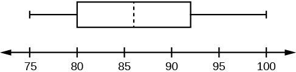
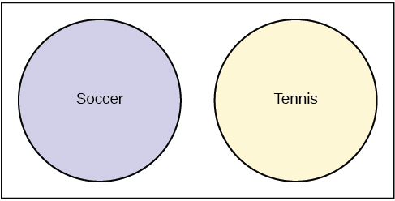
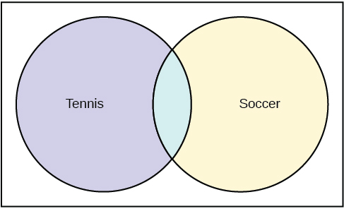
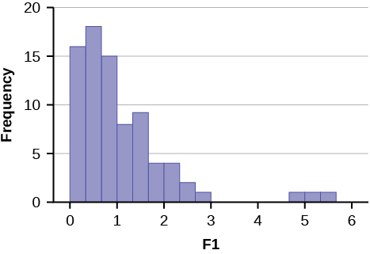
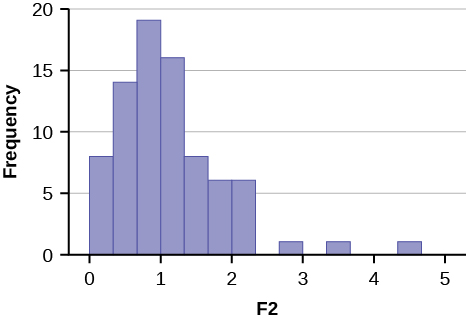

# Practice Test 1

## 1.1: Definitions of Statistics, Probability, and Key Terms

*Use the following information to answer the next three exercises.* A grocery store is interested in how much money, on average, their customers spend each visit in the produce department. Using their store records, they draw a sample of 1,000 visits and calculate each customer’s average spending on produce.

**1**. Identify the population, sample, parameter, statistic, variable, and data for this example. population sample parameter statistic variable data * * *
{: data-type="newline"}

**2**. What kind of data is “amount of money spent on produce per visit”? qualitative quantitative-continuous quantitative-discrete * * *
{: data-type="newline"}

**3**. The study finds that the mean amount spent on produce per visit by the customers in the sample is $12.84. This is an example of a: population sample parameter statistic variable * * *
{: data-type="newline"}

## 1.2: Data, Sampling, and Variation in Data and Sampling

*Use the following information to answer the next two exercises.* A health club is interested in knowing how many times a typical member uses the club in a week. They decide to ask every tenth customer on a specified day to complete a short survey including information about how many times they have visited the club in the past week.

**4**. What kind of a sampling design is this? cluster stratified simple random systematic * * *
{: data-type="newline"}

**5**. “Number of visits per week” is what kind of data? qualitative quantitative-continuous quantitative-discrete * * *
{: data-type="newline"}

**6**. Describe a situation in which you would calculate a parameter, rather than a statistic.* * *
{: data-type="newline"}

**7**. The U.S. federal government conducts a survey of high school seniors concerning their plans for future education and employment. One question asks whether they are planning to attend a four-year college or university in the following year. Fifty percent answer yes to this question; that fifty percent is a: parameter statistic  variable data * * *
{: data-type="newline"}

**8**. Imagine that the U.S. federal government had the means to survey all high school seniors in the U.S. concerning their plans for future education and employment, and found that 50 percent were planning to attend a 4-year college or university in the following year. This 50 percent is an example of a: parameter statistic  variable data * * *
{: data-type="newline"}

*Use the following information to answer the next three exercises.* A survey of a random sample of 100 nurses working at a large hospital asked how many years they had been working in the profession. Their answers are summarized in the following (incomplete) table.

**9**. Fill in the blanks in the table and round your answers to two decimal places for the Relative Frequency and Cumulative Relative Frequency cells.

| # of years | Frequency | Relative Frequency | Cumulative Relative Frequency |
|----------
| &lt; 5 | 25 |  |  |
| 5–10 | 30 |  |  |
| &gt; 10 | empty |  |  |
{: summary=".."}

**10**. What proportion of nurses have five or more years of experience?

**11**. What proportion of nurses have ten or fewer years of experience?

**12**. Describe how you might draw a random sample of 30 students from a lecture class of 200 students.

**13**. Describe how you might draw a stratified sample of students from a college, where the strata are the students’ class standing (freshman, sophomore, junior, or senior).

**14**. A manager wants to draw a sample, without replacement, of 30 employees from a workforce of 150. Describe how the chance of being selected will change over the course of drawing the sample.

**15**. The manager of a department store decides to measure employee satisfaction by selecting four departments at random, and conducting interviews with all the employees in those four departments. What type of survey design is this? cluster stratified simple random systematic * * *
{: data-type="newline"}

**16**. A popular American television sports program conducts a poll of viewers to see which team they believe will win the NFL (National Football League) championship this year. Viewers vote by calling a number displayed on the television screen and telling the operator which team they think will win. Do you think that those who participate in this poll are representative of all football fans in America?

**17**. Two researchers studying vaccination rates independently draw samples of 50 children, ages 3–18 months, from a large urban area, and determine if they are up to date on their vaccinations. One researcher finds that 84 percent of the children in her sample are up to date, and the other finds that 86 percent in his sample are up to date. Assuming both followed proper sampling procedures and did their calculations correctly, what is a likely explanation for this discrepancy?

**18**. A high school increased the length of the school day from 6.5 to 7.5 hours. Students who wished to attend this high school were required to sign contracts pledging to put forth their best effort on their school work and to obey the school rules; if they did not wish to do so, they could attend another high school in the district. At the end of one year, student performance on statewide tests had increased by ten percentage points over the previous year. Does this improvement prove that a longer school day improves student achievement?

**19**. You read a newspaper article reporting that eating almonds leads to increased life satisfaction. The study was conducted by the Almond Growers Association, and was based on a randomized survey asking people about their consumption of various foods, including almonds, and also about their satisfaction with different aspects of their life. Does anything about this poll lead you to question its conclusion?

**20**. Why is non-response a problem in surveys?

## 1.3: Frequency, Frequency Tables, and Levels of Measurement

**21**. Compute the mean of the following numbers, and report your answer using one more decimal place than is present in the original data: * * *
{: data-type="newline"}

14, 5, 18, 23, 6

## 1.4: Experimental Design and Ethics

**22**. A psychologist is interested in whether the size of tableware (bowls, plates, etc.) influences how much college students eat. He randomly assigns 100 college students to one of two groups: the first is served a meal using normal-sized tableware, while the second is served the same meal, but using tableware that it 20 percent smaller than normal. He records how much food is consumed by each group. Identify the following components of this study. population sample experimental units explanatory variable treatment response variable * * *
{: data-type="newline"}

**23**. A researcher analyzes the results of the SAT (Scholastic Aptitude Test) over a five-year period and finds that male students on average score higher on the math section, and female students on average score higher on the verbal section. She concludes that these observed differences in test performance are due to genetic factors. Explain how lurking variables could offer an alternative explanation for the observed differences in test scores.

**24**. Explain why it would not be possible to use random assignment to study the health effects of smoking.

**25**. A professor conducts a telephone survey of a city’s population by drawing a sample of numbers from the phone book and having her student assistants call each of the selected numbers once to administer the survey. What are some sources of bias with this survey?

**26**. A professor offers extra credit to students who take part in her research studies. What is an ethical problem with this method of recruiting subjects?

## 2.1: Stem-and Leaf Graphs (Stemplots), Line Graphs, and Bar Graphs

*Use the following information to answer the next four exercises.* The midterm grades on a chemistry exam, graded on a scale of 0 to 100, were: * * *
{: data-type="newline"}

62, 64, 65, 65, 68, 70, 72, 72, 74, 75, 75, 75, 76,78, 78, 81, 83, 83, 84, 85, 87, 88, 92, 95, 98, 98, 100, 100, 740

**27**. Do you see any outliers in this data? If so, how would you address the situation?

**28**. Construct a stem plot for this data, using only the values in the range 0–100.

**29**. Describe the distribution of exam scores.

## 2.2: Histograms, Frequency Polygons, and Time Series Graphs

**30**. In a class of 35 students, seven students received scores in the 70–79 range. What is the relative frequency of scores in this range?

*Use the following information to answer the next three exercises.* You conduct a poll of 30 students to see how many classes they are taking this term. Your results are: * * *
{: data-type="newline"}

1; 1; 1; 1 * * *
{: data-type="newline"}

2; 2; 2; 2; 2 * * *
{: data-type="newline"}

3; 3; 3; 3; 3; 3; 3; 3 * * *
{: data-type="newline"}

4; 4; 4; 4; 4; 4; 4; 4; 4 * * *
{: data-type="newline"}

5; 5; 5; 5

**31**. You decide to construct a histogram of this data. What will be the range of your first bar, and what will be the central point?

**32**. What will be the widths and central points of the other bars?

**33**. Which bar in this histogram will be the tallest, and what will be its height?

**34**. You get data from the U.S. Census Bureau on the median household income for your city, and decide to display it graphically. Which is the better choice for this data, a bar graph or a histogram?

**35**. You collect data on the color of cars driven by students in your statistics class, and want to display this information graphically. Which is the better choice for this data, a bar graph or a histogram?

## 2.3: Measures of the Location of the Data   {#eip-324}

**36**. Your daughter brings home test scores showing that she scored in the 80th percentile in math and the 76th percentile in reading for her grade. Interpret these scores.

**37**. You have to wait 90 minutes in the emergency room of a hospital before you can see a doctor. You learn that your wait time was in the 82nd percentile of all wait times. Explain what this means, and whether you think it is good or bad.

## 2.4: Box Plots

*Use the following information to answer the next three exercises.* 1; 1; 2; 3; 4; 4; 5; 5; 6; 7; 7; 8; 9

**38**. What is the median for this data?

**39**. What is the first quartile for this data?

**40**. What is the third quartile for this data?

*Use the following information to answer the next four exercises.* This box plot represents scores on the final exam for a physics class.

 {:}

**41**. What is the median for this data, and how do you know?

**42**. What are the first and third quartiles for this data, and how do you know?

**43**. What is the interquartile range for this data?

**44**. What is the range for this data?

## 2.5: Measures of the Center of the Data

**45**. In a marathon, the median finishing time was 3:35:04 (three hours, 35 minutes, and four seconds). You finished in 3:34:10. Interpret the meaning of the median time, and discuss your time in relation to it.

*Use the following information to answer the next three exercises.* The value, in thousands of dollars, for houses on a block, are: 45; 47; 47.5; 51; 53.5; 125.

**46**. Calculate the mean for this data.

**47**. Calculate the median for this data.

**48**. Which do you think better reflects the average value of the homes on this block?

## 2.6: Skewness and the Mean, Median, and Mode

**49**. In a left-skewed distribution, which is greater? the mean the media the mode 

**50**. In a right-skewed distribution, which is greater? the mean the median the mode 

**51**. In a symmetrical distribution what will be the relationship among the mean, median, and mode?

## 2.7: Measures of the Spread of the Data

*Use the following information to answer the next four exercises.* 10; 11; 15; 15; 17; 22

**52**. Compute the mean and standard deviation for this data; use the sample formula for the standard deviation.

**53**. What number is two standard deviations above the mean of this data?

**54**. Express the number 13.7 in terms of the mean and standard deviation of this data.

**55**. In a biology class, the scores on the final exam were normally distributed, with a mean of 85, and a standard deviation of five. Susan got a final exam score of 95. Express her exam result as a *z*-score, and interpret its meaning.

## 3.1: Terminology

*Use the following information to answer the next two exercises.* You have a jar full of marbles: 50 are red, 25 are blue, and 15 are yellow. Assume you draw one marble at random for each trial, and replace it before the next trial. * * *
{: data-type="newline"}

Let *P*(*R*) = the probability of drawing a red marble. * * *
{: data-type="newline"}

Let *P*(*B*) = the probability of drawing a blue marble. * * *
{: data-type="newline"}

Let *P*(*Y*) = the probability of drawing a yellow marble.

**56**. Find *P*(*B*).

**57**. Which is more likely, drawing a red marble or a yellow marble? Justify your answer numerically.

*Use the following information to answer the next two exercises.* The following are probabilities describing a group of college students. * * *
{: data-type="newline"}

Let *P*(*M*) = the probability that the student is male * * *
{: data-type="newline"}

Let *P*(*F*) = the probability that the student is female * * *
{: data-type="newline"}

Let *P*(*E*) = the probability the student is majoring in education * * *
{: data-type="newline"}

Let *P*(*S*) = the probability the student is majoring in science

**58**. Write the symbols for the probability that a student, selected at random, is both female and a science major.

**59**. Write the symbols for the probability that the student is an education major, given that the student is male.

## 3.2: Independent and Mutually Exclusive Events

**60**. Events *A* and *B* are independent. * * *
{: data-type="newline"}

If *P*(*A*) = 0.3 and *P*(*B*) = 0.5, find *P*(*A* AND *B*).

**61**. *C* and *D* are mutually exclusive events. * * *
{: data-type="newline"}

If *P*(*C*) = 0.18 and *P*(*D*) = 0.03, find *P*(*C* OR *D*).

## 3.3: Two Basic Rules of Probability

**62**. In a high school graduating class of 300, 200 students are going to college, 40 are planning to work full-time, and 80 are taking a gap year. Are these events mutually exclusive?

*Use the following information to answer the next two exercises.* An archer hits the center of the target (the bullseye) 70 percent of the time. However, she is a streak shooter, and if she hits the center on one shot, her probability of hitting it on the shot immediately following is 0.85. Written in probability notation: * * *
{: data-type="newline"}

*P*(*A*) = *P*(*B*) = *P*(hitting the center on one shot) = 0.70* * *
{: data-type="newline"}

*P*(*B*\\\|*A*) = P(hitting the center on a second shot, given that she hit it on the first) = 0.85

**63**. Calculate the probability that she will hit the center of the target on two consecutive shots.

**64**. Are *P*(*A*) and *P*(*B*) independent in this example?

## 3.4: Contingency Tables

*Use the following information to answer the next three exercises.* The following contingency table displays the number of students who report studying at least 15 hours per week, and how many made the honor roll in the past semester.

<table summary=".."><caption></caption><thead>
<tr>
<th />
<th>Honor roll</th>
<th>No honor roll</th>
<th>Total </th>
</tr>
</thead><tbody>
<tr>
<td>Study at least 15 hours/week</td>
<td />
<td>200</td>
<td />
</tr>
<tr>
<td>Study less than 15 hours/week</td>
<td>125</td>
<td>193</td>
<td />
</tr>
<tr>
<td>Total</td>
<td />
<td />
<td>1,000</td>
</tr>
</tbody></table>

**65**. Complete the table.

**66**. Find *P*(honor roll\\\|study at least 15 hours per week).

**67**. What is the probability a student studies less than 15 hours per week?

**68**. Are the events “study at least 15 hours per week” and “makes the honor roll” independent? Justify your answer numerically.

## 3.5: Tree and Venn Diagrams

**69**. At a high school, some students play on the tennis team, some play on the soccer team, but neither plays both tennis and soccer. Draw a Venn diagram illustrating this.

**70**. At a high school, some students play tennis, some play soccer, and some play both. Draw a Venn diagram illustrating this.

# Practice Test 1 Solutions   {#eip-396}

## 1.1: Definitions of Statistics, Probability, and Key Terms

**1**.  population: all the shopping visits by all the store’s customers sample: the 1,000 visits drawn for the study parameter: the average expenditure on produce per visit by all the store’s customers statistic: the average expenditure on produce per visit by the sample of 1,000 variable: the expenditure on produce for each visit data: the dollar amounts spent on produce; for instance, $15.40, $11.53, etc 

**2**. c

**3**. d

## 1.2: Data, Sampling, and Variation in Data and Sampling

**4**. d

**5**. c

**6**. Answers will vary. * * *
{: data-type="newline"}

Sample Answer: Any solution in which you use data from the entire population is acceptable. For instance, a professor might calculate the average exam score for her class: because the scores of all members of the class were used in the calculation, the average is a parameter.

**7**. b

**8**. a

**9**. <table summary=".."><caption></caption><thead>
<tr>
<th># of years</th>
<th>Frequency</th>
<th>Relative Frequency</th>
<th>Cumulative Relative Frequency</th>
</tr>
</thead><tbody>
<tr>
<td>&lt; 5</td>
<td>25</td>
<td>0.25</td>
<td>0.25</td>
</tr>
<tr>
<td>5–10</td>
<td>30</td>
<td>0.30</td>
<td>0.55</td>
</tr>
<tr>
<td>&gt; 10</td>
<td>45</td>
<td>0.45</td>
<td>1.00</td>
</tr>
</tbody></table>

**10**. 0.75

**11**. 0.55

**12**. Answers will vary. * * *
{: data-type="newline"}

Sample Answer: One possibility is to obtain the class roster and assign each student a number from 1 to 200. Then use a random number generator or table of random number to generate 30 numbers between 1 and 200, and select the students matching the random numbers. It would also be acceptable to write each student’s name on a card, shuffle them in a box, and draw 30 names at random.

**13**. One possibility would be to obtain a roster of students enrolled in the college, including the class standing for each student. Then you would draw a proportionate random sample from within each class (for instance, if 30 percent of the students in the college are freshman, then 30 percent of your sample would be drawn from the freshman class).

**14**. For the first person picked, the chance of any individual being selected is one in 150. For the second person, it is one in 149, for the third it is one in 148, and so on. For the 30th person selected, the chance of selection is one in 121.

**15**. a

**16**. No. There are at least two chances for bias. First, the viewers of this particular program may not be representative of American football fans as a whole. Second, the sample will be self-selected, because people have to make a phone call in order to take part, and those people are probably not representative of the American football fan population as a whole.

**17**. These results (84 percent in one sample, 86 percent in the other) are probably due to sampling variability. Each researcher drew a different sample of children, and you would not expect them to get exactly the same result, although you would expect the results to be similar, as they are in this case.

**18**. No. The improvement could also be due to self-selection: only motivated students were willing to sign the contract, and they would have done well even in a school with 6.5 hour days. Because both changes were implemented at the same time, it is not possible to separate out their influence.

**19**. At least two aspects of this poll are troublesome. The first is that it was conducted by a group who would benefit by the result—almond sales are likely to increase if people believe that eating almonds will make them happier. The second is that this poll found that almond consumption and life satisfaction are correlated, but does not establish that eating almonds causes satisfaction. It is equally possible, for instance, that people with higher incomes are more likely to eat almonds, and are also more satisfied with their lives.

**20**. You want the sample of people who take part in a survey to be representative of the population from which they are drawn. People who refuse to take part in a survey often have different views than those who do participate, and so even a random sample may produce biased results if a large percentage of those selected refuse to participate in a survey.

## 1.3: Frequency, Frequency Tables, and Levels of Measurement   {#eip-215}

**21**. 13.2

## 1.4: Experimental Design and Ethics   {#eip-id4268574}

**22**.  population: all college students  sample: the 100 college students in the study experimental units: each individual college student who participated explanatory variable: the size of the tableware treatment: tableware that is 20 percent smaller than normal response variable: the amount of food eaten 

**23**. There are many lurking variables that could influence the observed differences in test scores. Perhaps the boys, on average, have taken more math courses than the girls, and the girls have taken more English classes than the boys. Perhaps the boys have been encouraged by their families and teachers to prepare for a career in math and science, and thus have put more effort into studying math, while the girls have been encouraged to prepare for fields like communication and psychology that are more focused on language use. A study design would have to control for these and other potential lurking variables (anything that could explain the observed difference in test scores, other than the genetic explanation) in order to draw a scientifically sound conclusion about genetic differences.

**24**. To use random assignment, you would have to be able to assign people to either smoke or not smoke. Because smoking has many harmful effects, this would not be an ethical experiment. Instead, we study people who have chosen to smoke, and compare them to others who have chosen not to smoke, and try to control for the other ways those two groups may differ (lurking variables).

**25**. Sources of bias include the fact that not everyone has a telephone, that cell phone numbers are often not listed in published directories, and that an individual might not be at home at the time of the phone call; all these factors make it likely that the respondents to the survey will not be representative of the population as a whole.

**26**. Research subjects should not be coerced into participation, and offering extra credit in exchange for participation could be construed as coercion. In addition, this method will result in a volunteer sample, which cannot be assumed to be representative of the population as a whole.

## 2.1: Stem-and Leaf Graphs (Stemplots), Line Graphs, and Bar Graphs   {#eip-id1168064965406}

**27**. The value 740 is an outlier, because the exams were graded on a scale of 0 to 100, and 740 is far outside that range. It may be a data entry error, with the actual score being 74, so the professor should check that exam again to see what the actual score was.

**28**. | Stem | Leaf |
|----------
| 6 | 2 4 5 5 8 |
| 7 | 0 2 2 4 5 5 5 6 8 8 |
| 8 | 1 3 3 4 5 7 8 |
| 9 | 2 5 8 8 |
| 10 | 0 0 |
{: summary=".."}

**29**. Most scores on this exam were in the range of 70–89, with a few scoring in the 60–69 range, and a few in the 90–100 range.

## 2.2: Histograms, Frequency Polygons, and Time Series Graphs   {#eip-id1168066042976}

**30**. <math xmlns="http://www.w3.org/1998/Math/MathML"> <mrow> <mi>R</mi><mi>F</mi><mo>=</mo><mfrac> <mn>7</mn> <mrow> <mn>35</mn> </mrow> </mfrac> <mo>=</mo><mn>0.2</mn> </mrow> </math>

**31**. The range will be 0.5–1.5, and the central point will be 1.

**32**. Range 1.5–2.5, central point 2; range 2.5–3.5, central point 3; range 3.5–4.5, central point 4; range 4.5–5.5., central point 5.

**33**. The bar from 3.5 to 4.5, with a central point of 4, will be tallest; its height will be nine, because there are nine students taking four courses.

**34**. The histogram is a better choice, because income is a continuous variable.

**35**. A bar graph is the better choice, because this data is categorical rather than continuous.

## 2.3: Measures of the Location of the Data   {#eip-196}

**36**. Your daughter scored better than 80 percent of the students in her grade on math and better than 76 percent of the students in reading. Both scores are very good, and place her in the upper quartile, but her math score is slightly better in relation to her peers than her reading score.

**37**. You had an unusually long wait time, which is bad: 82 percent of patients had a shorter wait time than you, and only 18 percent had a longer wait time.

## 2.4: Box Plots   {#eip-id5977366}

**38**. 5

**39**. 3

**40**. 7

**41**. The median is 86, as represented by the vertical line in the box.

**42**. The first quartile is 80, and the third quartile is 92, as represented by the left and right boundaries of the box.

**43**. *IQR* = 92 – 80 = 12

**44**. Range = 100 – 75 = 25

## 2.5: Measures of the Center of the Data   {#eip-id7817764}

**45**. Half the runners who finished the marathon ran a time faster than 3:35:04, and half ran a time slower than 3:35:04. Your time is faster than the median time, so you did better than more than half of the runners in this race.

**46**. 61.5, or $61,500

**47**. 49.25 or $49,250

**48**. The median, because the mean is distorted by the high value of one house.

## 2.6: Skewness and the Mean, Median, and Mode   {#eip-id1168065416003}

**49**. c

**50**. a

**51**. They will all be fairly close to each other.

## 2.7: Measures of the Spread of the Data   {#eip-id1168071310533}

**52**. Mean: 15 * * *
{: data-type="newline"}

Standard deviation: 4.3 * * *
{: data-type="newline" data-count="2"}

 <math xmlns="http://www.w3.org/1998/Math/MathML" display=""> <mrow> <mi>μ</mi><mo>=</mo><mfrac> <mrow> <mn>10</mn><mo>+</mo><mn>11</mn><mo>+</mo><mn>15</mn><mo>+</mo><mn>15</mn><mo>+</mo><mn>17</mn><mo>+</mo><mn>22</mn> </mrow> <mn>6</mn> </mfrac> <mo>=</mo><mn>18</mn> </mrow> </math>

 * * *
{: data-type="newline" data-count="2"}

<math xmlns="http://www.w3.org/1998/Math/MathML"> <mrow> <mi>s</mi><mo>=</mo><msqrt> <mrow> <mfrac> <mrow> <mstyle displaystyle="true"> <mo>∑</mo> <mrow> <msup> <mrow> <mrow><mo>(</mo> <mrow> <mi>x</mi><mo>−</mo><mover accent="true"> <mi>x</mi> <mo>¯</mo> </mover> </mrow> <mo>)</mo></mrow> </mrow> <mn>2</mn> </msup> </mrow> </mstyle> </mrow> <mrow> <mi>n</mi><mo>−</mo><mn>1</mn> </mrow> </mfrac> </mrow> </msqrt> <mo>=</mo><msqrt> <mrow> <mfrac> <mrow> <mn>94</mn> </mrow> <mn>5</mn> </mfrac> </mrow> </msqrt> <mo>=</mo><mn>4.3</mn> </mrow> </math>

**53**. 18 + (2)(4.3) = 26.6

**54**. 13.7 is one standard deviation below the mean of this data, because 18 – 4.3 = 13.7

**55**. <math xmlns="http://www.w3.org/1998/Math/MathML"> <mrow> <mi>z</mi><mo>=</mo><mfrac> <mrow> <mn>95</mn><mo>−</mo><mn>85</mn> </mrow> <mn>5</mn> </mfrac> <mo>=</mo><mn>2.0</mn> </mrow> </math>

 * * *
{: data-type="newline"}

Susan’s *z*-score was 2.0, meaning she scored two standard deviations above the class mean for the final exam.

## 3.1: Terminology   {#eip-id1168066112421}

**56**. <math xmlns="http://www.w3.org/1998/Math/MathML"> <mrow> <mi>P</mi><mo stretchy="false">(</mo><mi>B</mi><mo stretchy="false">)</mo><mo>=</mo><mfrac> <mrow> <mn>25</mn> </mrow> <mrow> <mn>90</mn> </mrow> </mfrac> <mo>=</mo><mn>0.28</mn> </mrow> </math>

**57**. Drawing a red marble is more likely. * * *
{: data-type="newline"}

<math xmlns="http://www.w3.org/1998/Math/MathML"> <mi>P</mi><mo stretchy="false">(</mo><mi>R</mi><mo stretchy="false">)</mo><mo>=</mo><mfrac> <mrow> <mn>50</mn> </mrow> <mrow> <mn>80</mn> </mrow> </mfrac> <mo>=</mo><mn>0.62</mn> </math>

 * * *
{: data-type="newline"}

<math xmlns="http://www.w3.org/1998/Math/MathML"> <mi>P</mi><mo stretchy="false">(</mo><mi>Y</mi><mo stretchy="false">)</mo><mo>=</mo><mfrac> <mrow> <mn>15</mn> </mrow> <mrow> <mn>80</mn> </mrow> </mfrac> <mo>=</mo><mn>0.19</mn> </math>

**58**. *P*(*F* AND *S*)

**59**. *P*(*E*\\\|*M*)

## 3.2: Independent and Mutually Exclusive Events   {#eip-id5319976}

**60**. *P*(*A* AND *B*) = (0.3)(0.5) = 0.15

**61**. *P*(*C* OR *D*) = 0.18 + 0.03 = 0.21

## 3.3: Two Basic Rules of Probability   {#eip-id1168067689531}

**62**. No, they cannot be mutually exclusive, because they add up to more than 300. Therefore, some students must fit into two or more categories (e.g., both going to college and working full time).

**63**. *P*(*A* and *B*) = (*P*(*B*\\\|*A*))(*P*(*A*)) = (0.85)(0.70) = 0.595

**64**. No. If they were independent, *P*(*B*) would be the same as *P*(*B*\\\|*A*). We know this is not the case, because *P*(*B*) = 0.70 and *P*(*B*\\\|*A*) = 0.85.

## 3.4: Contingency Tables   {#eip-id7256391}

**65**. <table summary=".."><caption></caption><thead>
<tr>
<th />
<th>Honor roll</th>
<th>No honor roll</th>
<th>Total</th>
</tr>
</thead><tbody>
<tr>
<td>Study at least 15 hours/week</td>
<td>482</td>
<td>200</td>
<td>682</td>
</tr>
<tr>
<td>Study less than 15 hours/week</td>
<td>125</td>
<td>193</td>
<td>318</td>
</tr>
<tr>
<td>Total</td>
<td>607</td>
<td>393</td>
<td>1,000</td>
</tr>
</tbody></table>

**66**. <math xmlns="http://www.w3.org/1998/Math/MathML"> <mrow> <mi>P</mi><mtext>(honor roll\|study at least 15 hours word per week) = </mtext><mfrac> <mrow> <mn>482</mn> </mrow> <mrow> <mn>1000</mn> </mrow> </mfrac> <mo>=</mo><mn>0.482</mn> </mrow> </math>

**67**. <math xmlns="http://www.w3.org/1998/Math/MathML"> <mrow> <mi>P</mi><mo stretchy="false">(</mo><mtext>studies less than 15 hours word per week)</mtext><mo>=</mo><mfrac> <mrow> <mn>125</mn><mo>+</mo><mn>193</mn> </mrow> <mrow> <mn>1000</mn> </mrow> </mfrac> <mo>=</mo><mn>0.318</mn> </mrow> </math>

**68**. Let *P*(*S*) = study at least 15 hours per week * * *
{: data-type="newline"}

Let *P*(*H*) = makes the honor roll * * *
{: data-type="newline"}

From the table, *P*(*S*) = 0.682, *P*(*H*) = 0.607, and *P*(*S* AND *H*) =0.482. * * *
{: data-type="newline"}

If *P*(*S*) and *P*(*H*) were independent, then *P*(*S* AND *H*) would equal (*P*(*S*))(*P*(*H*)). * * *
{: data-type="newline"}

However, (*P*(*S*))(*P*(*H*)) = (0.682)(0.607) = 0.414, while *P*(*S* AND *H*) = 0.482. * * *
{: data-type="newline"}

Therefore, *P*(*S*) and *P*(*H*) are not independent.

## 3.5: Tree and Venn Diagrams   {#eip-id1168066373070}

**69**. {:}

**70**. {:}

# Practice Test 2   {#eip-220}

## 4.1: Probability Distribution Function (PDF) for a Discrete Random Variable

*Use the following information to answer the next five exercises.* You conduct a survey among a random sample of students at a particular university. The data collected includes their major, the number of classes they took the previous semester, and amount of money they spent on books purchased for classes in the previous semester.

**1.** If *X* = student’s major, then what is the domain of *X*?

**2.** If *Y* = the number of classes taken in the previous semester, what is the domain of *Y*?

**3**. If *Z* = the amount of money spent on books in the previous semester, what is the domain of *Z*?

**4**. Why are *X*, *Y*, and *Z* in the previous example random variables?

**5**. After collecting data, you find that for one case, *z* = –7. Is this a possible value for *Z*?

**6**. What are the two essential characteristics of a discrete probability distribution?

*Use this discrete probability distribution represented in this table to answer the following six questions.* The university library records the number of books checked out by each patron over the course of one day, with the following result: <table summary=".."><caption></caption><thead>
<tr>
<th><em>x</em></th>
<th><em>P</em>(<em>x</em>)</th>
</tr>
</thead><tbody>
<tr>
<td>0</td>
<td>0.20</td>
</tr>
<tr>
<td>1</td>
<td>0.45</td>
</tr>
<tr>
<td>2</td>
<td>0.20</td>
</tr>
<tr>
<td>3</td>
<td>0.10</td>
</tr>
<tr>
<td>4</td>
<td>0.05</td>
</tr>
</tbody></table>

**7**. Define the random variable *X* for this example.

**8**. What is *P*(*x* &gt; 2)?

**9**. What is the probability that a patron will check out at least one book?

**10**. What is the probability a patron will take out no more than three books?

**11**. If the table listed *P*(*x*) as 0.15, how would you know that there was a mistake?

**12**. What is the average number of books taken out by a patron?

## 4.2: Mean or Expected Value and Standard Deviation

*Use the following information to answer the next four exercises.* Three jobs are open in a company: one in the accounting department, one in the human resources department, and one in the sales department. The accounting job receives 30 applicants, and the human resources and sales department 60 applicants.

**13**. If *X* = the number of applications for a job, use this information to fill in [\[link\]](#fs-idm40199072).

<table summary=".."><caption></caption><thead>
<tr>
<th><em>x</em></th>
<th><em>P</em>(<em>x</em>)</th>
<th><em>x</em><em>P</em>(<em>x</em>)</th>
</tr>
</thead><tbody>
<tr>
<td />
<td> </td>
<td> </td>
</tr>
<tr>
<td />
<td> </td>
<td> </td>
</tr>
<tr>
<td />
<td> </td>
<td> </td>
</tr>
</tbody></table>

**14**. What is the mean number of applicants?

**15**. What is the PDF for *X*?

**16**. Add a fourth column to the table, for (*x* – *μ*)2*P*(*x*).

**17**. What is the standard deviation of *X*?

## 4.3: Binomial Distribution

**18**. In a binomial experiment, if *p* = 0.65, what does *q* equal?

**19**. What are the required characteristics of a binomial experiment?

**20**. Joe conducts an experiment to see how many times he has to flip a coin before he gets four heads in a row. Does this qualify as a binomial experiment?

*Use the following information to answer the next three exercises.* In a particularly community, 65 percent of households include at least one person who has graduated from college. You randomly sample 100 households in this community. Let *X* = the number of households including at least one college graduate.

**21**. Describe the probability distribution of *X*.

**22**. What is the mean of *X*?

**23**. What is the standard deviation of *X*?

*Use the following information to answer the next four exercises.* Joe is the star of his school’s baseball team. His batting average is 0.400, meaning that for every ten times he comes to bat (an at-bat), four of those times he gets a hit. You decide to track his batting performance his next 20 at-bats.

**24**. Define the random variable *X* in this experiment.

**25**. Assuming Joe’s probability of getting a hit is independent and identical across all 20 at-bats, describe the distribution of *X*.

**26**. Given this information, what number of hits do you predict Joe will get?

**27**. What is the standard deviation of *X*?

## 4.4: Geometric Distribution

**28**. What are the three major characteristics of a geometric experiment?

**29**. You decide to conduct a geometric experiment by flipping a coin until it comes up heads. This takes five trials. Represent the outcomes of this trial, using H for heads and *T* for tails.

**30**. You are conducting a geometric experiment by drawing cards from a normal 52-card pack, with replacement, until you draw the Queen of Hearts. What is the domain of *X* for this experiment?

**31**. You are conducting a geometric experiment by drawing cards from a normal 52-card deck, without replacement, until you draw a red card. What is the domain of *X* for this experiment?

*Use the following information to answer the next three exercises.* In a particular university, 27 percent of students are engineering majors. You decide to select students at random until you choose one that is an engineering major. Let *X* = the number of students you select until you find one that is an engineering major.

**32**. What is the probability distribution of *X*?

**33**. What is the mean of *X*?

**34**. What is the standard deviation of *X*?

## 4.5: Hypergeometric Distribution

**35**. You draw a random sample of ten students to participate in a survey, from a group of 30, consisting of 16 boys and 14 girls. You are interested in the probability that seven of the students chosen will be boys. Does this qualify as a hypergeometric experiment? List the conditions and whether or not they are met.

**36**. You draw five cards, without replacement, from a normal 52-card deck of playing cards, and are interested in the probability that two of the cards are spades. What are the group of interest, size of the group of interest, and sample size for this example?

## 4.6: Poisson Distribution

**37**. What are the key characteristics of the Poisson distribution?

*Use the following information to answer the next three exercises.* The number of drivers to arrive at a toll booth in an hour can be modeled by the Poisson distribution.

**38**. If *X* = the number of drivers, and the average numbers of drivers per hour is four, how would you express this distribution?

**39**. What is the domain of *X*?

**40**. What are the mean and standard deviation of *X*?

## 5.1: Continuous Probability Functions

**41**. You conduct a survey of students to see how many books they purchased the previous semester, the total amount they paid for those books, the number they sold after the semester was over, and the amount of money they received for the books they sold. Which variables in this survey are discrete, and which are continuous?

**42**. With continuous random variables, we never calculate the probability that *X* has a particular value, but always speak in terms of the probability that *X* has a value within a particular range. Why is this?

**43**. For a continuous random variable, why are *P*(*x* &lt; *c*) and *P*(*x* ≤ *c*) equivalent statements?

**44**. For a continuous probability function, *P*(*x* &lt; 5) = 0.35. What is *P*(*x* &gt; 5), and how do you know?

**45**. Describe how you would draw the continuous probability distribution described by the function <math xmlns="http://www.w3.org/1998/Math/MathML"> <mrow> <mi>f</mi><mo stretchy="false">(</mo><mi>x</mi><mo stretchy="false">)</mo><mo>=</mo><mfrac> <mn>1</mn> <mrow> <mn>10</mn> </mrow> </mfrac> </mrow> </math>

 for <math xmlns="http://www.w3.org/1998/Math/MathML"> <mrow> <mn>0</mn><mo>≤</mo><mi>x</mi><mo>≤</mo><mn>10</mn> </mrow> </math>

. What type of a distribution is this?

**46**. For the continuous probability distribution described by the function <math xmlns="http://www.w3.org/1998/Math/MathML"> <mrow> <mi>f</mi><mo stretchy="false">(</mo><mi>x</mi><mo stretchy="false">)</mo><mo>=</mo><mfrac> <mn>1</mn> <mrow> <mn>10</mn> </mrow> </mfrac> </mrow> </math>

 for <math xmlns="http://www.w3.org/1998/Math/MathML"> <mrow> <mn>0</mn><mo>≤</mo><mi>x</mi><mo>≤</mo><mn>10</mn> </mrow> </math>

, what is the *P*(0 &lt; *x* &lt; 4)?

## 5.2: The Uniform Distribution

**47**. For the continuous probability distribution described by the function <math xmlns="http://www.w3.org/1998/Math/MathML"> <mrow> <mi>f</mi><mo stretchy="false">(</mo><mi>x</mi><mo stretchy="false">)</mo><mo>=</mo><mfrac> <mn>1</mn> <mrow> <mn>10</mn> </mrow> </mfrac> </mrow> </math>

 for <math xmlns="http://www.w3.org/1998/Math/MathML"> <mrow> <mn>0</mn><mo>≤</mo><mi>x</mi><mo>≤</mo><mn>10</mn> </mrow> </math>

, what is the *P*(2 &lt; *x* &lt; 5)?

*Use the following information to answer the next four exercises.* The number of minutes that a patient waits at a medical clinic to see a doctor is represented by a uniform distribution between zero and 30 minutes, inclusive.

**48**. If *X* equals the number of minutes a person waits, what is the distribution of *X*?

**49**. Write the probability density function for this distribution.

**50**. What is the mean and standard deviation for waiting time?

**51**. What is the probability that a patient waits less than ten minutes?

## 5.3: The Exponential Distribution

**52**. The distribution of the variable *X*, representing the average time to failure for an automobile battery, can be written as: *X* ~ *Exp*(*m*). Describe this distribution in words.

**53**. If the value of *m* for an exponential distribution is ten, what are the mean and standard deviation for the distribution?

**54**. Write the probability density function for a variable distributed as: *X* ~ *Exp*(0.2).

## 6.1: The Standard Normal Distribution

**55**. Translate this statement about the distribution of a random variable *X* into words: *X* ~ (100, 15).

**56**. If the variable *X* has the standard normal distribution, express this symbolically.

*Use the following information for the next six exercises.* According to the World Health Organization, distribution of height in centimeters for girls aged five years and no months has the distribution: *X* ~ *N*(109, 4.5).

**57**. What is the *z*-score for a height of 112 inches?

**58**. What is the *z*-score for a height of 100 centimeters?

**59**. Find the *z*-score for a height of 105 centimeters and explain what that means In the context of the population.

**60**. What height corresponds to a *z*-score of 1.5 in this population?

**61**. Using the empirical rule, we expect about 68 percent of the values in a normal distribution to lie within one standard deviation above or below the mean. What does this mean, in terms of a specific range of values, for this distribution?

**62**. Using the empirical rule, about what percent of heights in this distribution do you expect to be between 95.5 cm and 122.5 cm?

## 6.2: Using the Normal Distribution

*Use the following information to answer the next four exercises.* The distributor of lotto tickets claims that 20 percent of the tickets are winners. You draw a sample of 500 tickets to test this proposition.

**63**. Can you use the normal approximation to the binomial for your calculations? Why or why not.

**64**. What are the expected mean and standard deviation for your sample, assuming the distributor’s claim is true?

**65**. What is the probability that your sample will have a mean greater than 100?

**66**. If the *z*-score for your sample result is –2.00, explain what this means, using the empirical rule.

## 7.1: The Central Limit Theorem for Sample Means (Averages)

**67**. What does the central limit theorem state with regard to the distribution of sample means?

**68**. The distribution of results from flipping a fair coin is uniform: heads and tails are equally likely on any flip, and over a large number of trials, you expect about the same number of heads and tails. Yet if you conduct a study by flipping 30 coins and recording the number of heads, and repeat this 100 times, the distribution of the mean number of heads will be approximately normal. How is this possible?

**69**. The mean of a normally-distributed population is 50, and the standard deviation is four. If you draw 100 samples of size 40 from this population, describe what you would expect to see in terms of the sampling distribution of the sample mean.

**70**. *X* is a random variable with a mean of 25 and a standard deviation of two. Write the distribution for the sample mean of samples of size 100 drawn from this population.

**71**. Your friend is doing an experiment drawing samples of size 50 from a population with a mean of 117 and a standard deviation of 16. This sample size is large enough to allow use of the central limit theorem, so he says the standard deviation of the sampling distribution of sample means will also be 16. Explain why this is wrong, and calculate the correct value.

**72**. You are reading a research article that refers to “the standard error of the mean.” What does this mean, and how is it calculated?

*Use the following information to answer the next six exercises.* You repeatedly draw samples of *n* = 100 from a population with a mean of 75 and a standard deviation of 4.5.

**73**. What is the expected distribution of the sample means?

**74**. One of your friends tries to convince you that the standard error of the mean should be 4.5. Explain what error your friend made.

**75**. What is the *z*-score for a sample mean of 76?

**76**. What is the *z*-score for a sample mean of 74.7?

**77**. What sample mean corresponds to a *z*-score of 1.5?

**78**. If you decrease the sample size to 50, will the standard error of the mean be smaller or larger? What would be its value?

*Use the following information to answer the next two questions.* We use the empirical rule to analyze data for samples of size 60 drawn from a population with a mean of 70 and a standard deviation of 9.

**79**. What range of values would you expect to include 68 percent of the sample means?

**80**. If you increased the sample size to 100, what range would you expect to contain 68 percent of the sample means, applying the empirical rule?

## 7.2: The Central Limit Theorem for Sums

**81**. How does the central limit theorem apply to sums of random variables?

**82**. Explain how the rules applying the central limit theorem to sample means, and to sums of a random variable, are similar.

**83**. If you repeatedly draw samples of size 50 from a population with a mean of 80 and a standard deviation of four, and calculate the sum of each sample, what is the expected distribution of these sums?

*Use the following information to answer the next four exercises.* You draw one sample of size 40 from a population with a mean of 125 and a standard deviation of seven.

**84**. Compute the sum. What is the probability that the sum for your sample will be less than 5,000?

**85**. If you drew samples of this size repeatedly, computing the sum each time, what range of values would you expect to contain 95 percent of the sample sums?

**86**. What value is one standard deviation below the mean?

**87**. What value corresponds to a *z*-score of 2.2?

## 7.3: Using the Central Limit Theorem

**88**. What does the law of large numbers say about the relationship between the sample mean and the population mean?

**89**. Applying the law of large numbers, which sample mean would expect to be closer to the population mean, a sample of size ten or a sample of size 100?

*Use this information for the next three questions.* A manufacturer makes screws with a mean diameter of 0.15 cm (centimeters) and a range of 0.10 cm to 0.20 cm; within that range, the distribution is uniform.

**90**. If *X* = the diameter of one screw, what is the distribution of *X*?

**91**. Suppose you repeatedly draw samples of size 100 and calculate their mean. Applying the central limit theorem, what is the distribution of these sample means?

**92**. Suppose you repeatedly draw samples of 60 and calculate their sum. Applying the central limit theorem, what is the distribution of these sample sums?

# Practice Test 2 Solutions   {#eip-730}

## Probability Distribution Function (PDF) for a Discrete Random Variable

**1**. The domain of *X* = \{English, Mathematics,….\], i.e., a list of all the majors offered at the university, plus “undeclared.”

**2**. The domain of *Y* = \{0, 1, 2, …}, i.e., the integers from 0 to the upper limit of classes allowed by the university.

**3**. The domain of *Z* = any amount of money from 0 upwards.

**4**. Because they can take any value within their domain, and their value for any particular case is not known until the survey is completed.

**5**. No, because the domain of *Z* includes only positive numbers (you can’t spend a negative amount of money). Possibly the value –7 is a data entry error, or a special code to indicated that the student did not answer the question.

**6**. The probabilities must sum to 1.0, and the probabilities of each event must be between 0 and 1, inclusive.

**7**. Let *X* = the number of books checked out by a patron.

**8**. *P*(*x* &gt; 2) = 0.10 + 0.05 = 0.15

**9**. *P*(*x* ≥ 0) = 1 – 0.20 = 0.80

**10**. *P*(*x* ≤ 3) = 1 – 0.05 = 0.95

**11**. The probabilities would sum to 1.10, and the total probability in a distribution must always equal 1.0.

**12**. <math xmlns="http://www.w3.org/1998/Math/MathML"> <mover accent="true"> <mi>x</mi> <mo>¯</mo> </mover> </math>

 = 0(0.20) + 1(0.45) + 2(0.20) + 3(0.10) + 4(0.05) = 1.35

## Mean or Expected Value and Standard Deviation

**13**. <table summary=".."><caption></caption><thead>
<tr>
<th><em>x</em></th>
<th><em>P</em>(<em>x</em>)</th>
<th><em>x</em><em>P</em>(<em>x</em>)</th>
</tr>
</thead><tbody>
<tr>
<td>30</td>
<td>0.33</td>
<td>9.90</td>
</tr>
<tr>
<td>40</td>
<td>0.33</td>
<td>13.20</td>
</tr>
<tr>
<td>60</td>
<td>0.33</td>
<td>19.80</td>
</tr>
</tbody></table>

**14**. <math xmlns="http://www.w3.org/1998/Math/MathML"> <mover accent="true"> <mi>x</mi> <mo>¯</mo> </mover> </math>

 = 9.90 + 13.20 + 19.80 = 42.90

**15**. *P*(*x* = 30) = 0.33 * * *
{: data-type="newline"}

*P*(*x* = 40) = 0.33 * * *
{: data-type="newline"}

*P*(*x* = 60) = 0.33

**16**. <table summary=".."><caption></caption><thead>
<tr>
<th><em>x</em></th>
<th><em>P</em>(<em>x</em>)</th>
<th><em>xP</em>(<em>x</em>)</th>
<th>(<em>x</em> – <em>μ</em>)2<em>P</em>(<em>x</em>)</th>
</tr>
</thead><tbody>
<tr>
<td>30</td>
<td>0.33</td>
<td>9.90</td>
<td>(30 – 42.90)2(0.33) = 54.91</td>
</tr>
<tr>
<td>40</td>
<td>0.33</td>
<td>13.20</td>
<td>(40 – 42.90)2(0.33) = 2.78</td>
</tr>
<tr>
<td>60</td>
<td>0.33</td>
<td>19.90</td>
<td>(60 – 42.90)2(0.33) = 96.49</td>
</tr>
</tbody></table>

**17**. <math xmlns="http://www.w3.org/1998/Math/MathML"> <mrow> <msub> <mi>σ</mi> <mi>x</mi> </msub> <mo>=</mo><msqrt> <mrow> <mn>54.91</mn><mo>+</mo><mn>2.78</mn><mo>+</mo><mn>96.49</mn> </mrow> </msqrt> <mo>=</mo><mn>12.42</mn> </mrow> </math>

## Binomial Distribution

**18**. *q* = 1 – 0.65 = 0.35

**19**.  There are a fixed number of trials. There are only two possible outcomes, and they add up to 1. The trials are independent and conducted under identical conditions. 

**20**. No, because there are not a fixed number of trials

**21**. *X* ~ *B*(100, 0.65)

**22**. *μ* = *np* = 100(0.65) = 65

**23**. <math xmlns="http://www.w3.org/1998/Math/MathML"> <mrow> <msub> <mi>σ</mi> <mi>x</mi> </msub> <mo>=</mo><msqrt> <mrow> <mi>n</mi><mi>p</mi><mi>q</mi> </mrow> </msqrt> <mo>=</mo><msqrt> <mrow> <mn>100</mn><mo stretchy="false">(</mo><mn>0.65</mn><mo stretchy="false">)</mo><mo stretchy="false">(</mo><mn>0.35</mn><mo stretchy="false">)</mo> </mrow> </msqrt> <mo>=</mo><mn>4.77</mn> </mrow> </math>

**24**. *X* = Joe gets a hit in one at-bat (in one occasion of his coming to bat)

**25**. *X* ~ *B*(20, 0.4)

**26**. *μ* = *np* = 20(0.4) = 8

**27**.<math xmlns="http://www.w3.org/1998/Math/MathML"> <mrow> <msub> <mi>σ</mi> <mi>x</mi> </msub> <mo>=</mo><msqrt> <mrow> <mi>n</mi><mi>p</mi><mi>q</mi> </mrow> </msqrt> <mo>=</mo><msqrt> <mrow> <mn>20</mn><mo stretchy="false">(</mo><mn>0.40</mn><mo stretchy="false">)</mo><mo stretchy="false">(</mo><mn>0.60</mn><mo stretchy="false">)</mo> </mrow> </msqrt> <mo>=</mo><mn>2.19</mn> </mrow> </math>

## 4.4: Geometric Distribution

**28**.  A series of Bernoulli trials are conducted until one is a success, and then the experiment stops. At least one trial is conducted, but there is no upper limit to the number of trials. The probability of success or failure is the same for each trial. 

**29**. *T T T T H*

**30**. The domain of *X* = \{1, 2, 3, 4, 5, ….n}. Because you are drawing with replacement, there is no upper bound to the number of draws that may be necessary.

**31**. The domain of *X* = \{1, 2, 3, 4, 5, 6, 7, 8., 9, 10, 11, 12…27}. Because you are drawing without replacement, and 26 of the 52 cards are red, you have to draw a red card within the first 17 draws.

**32**. *X* ~ *G*(0.24)

**33**. <math xmlns="http://www.w3.org/1998/Math/MathML"> <mrow> <mi>μ</mi><mo>=</mo><mtext> </mtext><mfrac> <mn>1</mn> <mi>p</mi> </mfrac> <mo>=</mo><mtext> </mtext><mfrac> <mn>1</mn> <mrow> <mn>0.27</mn> </mrow> </mfrac> <mo>=</mo><mn>3.70</mn> </mrow> </math>

**34**. <math xmlns="http://www.w3.org/1998/Math/MathML"> <mrow> <mi>σ</mi><mo>=</mo><mtext> </mtext><msqrt> <mrow> <mfrac> <mrow> <mn>1</mn><mo>−</mo><mi>p</mi> </mrow> <mrow> <msup> <mi>p</mi> <mn>2</mn> </msup> </mrow> </mfrac> </mrow> </msqrt> <mo>=</mo><mtext> </mtext><msqrt> <mrow> <mfrac> <mrow> <mn>1</mn><mo>−</mo><mn>0.27</mn> </mrow> <mrow> <msup> <mrow> <mn>0.27</mn> </mrow> <mn>2</mn> </msup> </mrow> </mfrac> </mrow> </msqrt> <mo>=</mo><mn>3.16</mn> </mrow> </math>

## 4.5: Hypergeometric Distribution

**35**. Yes, because you are sampling from a population composed of two groups (boys and girls), have a group of interest (boys), and are sampling without replacement (hence, the probabilities change with each pick, and you are not performing Bernoulli trials).

**36**. The group of interest is the cards that are spades, the size of the group of interest is 13, and the sample size is five.

## 4.6: Poisson Distribution

**37**. A Poisson distribution models the number of events occurring in a fixed interval of time or space, when the events are independent and the average rate of the events is known.

**38**. *X* ~ *P*(4)

**39**. The domain of *X* = \{0, 1, 2, 3, …..) i.e., any integer from 0 upwards.

**40**. <math xmlns="http://www.w3.org/1998/Math/MathML"> <mi>μ</mi><mo>=</mo><mn>4</mn> </math>

 * * *
{: data-type="newline"}

<math xmlns="http://www.w3.org/1998/Math/MathML"> <mi>σ</mi><mo>=</mo><msqrt> <mn>4</mn> </msqrt> <mo>=</mo><mn>2</mn> </math>

## 5.1: Continuous Probability Functions

**41**. The discrete variables are the number of books purchased, and the number of books sold after the end of the semester. The continuous variables are the amount of money spent for the books, and the amount of money received when they were sold.

**42**. Because for a continuous random variable, *P*(*x* = *c*) = 0, where *c* is any single value. Instead, we calculate *P*(*c* &lt; *x* &lt; *d*), i.e., the probability that the value of *x* is between the values *c* and *d*.

**43**. Because *P*(*x* = *c*) = 0 for any continuous random variable.

**44**. *P*(*x* &gt; 5) = 1 – 0.35 = 0.65, because the total probability of a continuous probability function is always 1.

**45**. This is a uniform probability distribution. You would draw it as a rectangle with the vertical sides at 0 and 20, and the horizontal sides at <math xmlns="http://www.w3.org/1998/Math/MathML"> <mrow> <mfrac> <mn>1</mn> <mrow> <mn>10</mn> </mrow> </mfrac> </mrow> </math>

 and 0.

**46**. <math xmlns="http://www.w3.org/1998/Math/MathML"> <mrow> <mi>P</mi><mrow><mo>(</mo> <mrow> <mn>0</mn><mtext> </mtext><mo>&lt;</mo><mi>x</mi><mo>&lt;</mo><mn>4</mn> </mrow> <mo>)</mo></mrow><mo>=</mo><mrow><mo>(</mo> <mrow> <mn>4</mn><mo>−</mo><mn>0</mn> </mrow> <mo>)</mo></mrow><mrow><mo>(</mo> <mrow> <mfrac> <mn>1</mn> <mrow> <mn>10</mn> </mrow> </mfrac> </mrow> <mo>)</mo></mrow><mo>=</mo><mtext> </mtext><mn>0.4</mn> </mrow> </math>

## 5.2: The Uniform Distribution

**47**. <math xmlns="http://www.w3.org/1998/Math/MathML"> <mrow> <mi>P</mi><mrow><mo>(</mo> <mrow> <mn>2</mn><mtext> </mtext><mo>&lt;</mo><mi>x</mi><mo>&lt;</mo><mn>5</mn> </mrow> <mo>)</mo></mrow><mo>=</mo><mrow><mo>(</mo> <mrow> <mn>5</mn><mo>−</mo><mn>2</mn> </mrow> <mo>)</mo></mrow><mrow><mo>(</mo> <mrow> <mfrac> <mn>1</mn> <mrow> <mn>10</mn> </mrow> </mfrac> </mrow> <mo>)</mo></mrow><mo>=</mo><mtext> </mtext><mn>0.3</mn> </mrow> </math>

**48**. *X* ~ *U*(0, 15)

**49**. <math xmlns="http://www.w3.org/1998/Math/MathML"> <mrow> <mi>f</mi><mo stretchy="false">(</mo><mi>x</mi><mo stretchy="false">)</mo><mo>=</mo><mfrac> <mn>1</mn> <mrow> <mi>b</mi><mo>−</mo><mi>a</mi> </mrow> </mfrac> </mrow> </math>

 for <math xmlns="http://www.w3.org/1998/Math/MathML" display=""> <mrow> <mo stretchy="false">(</mo><mi>a</mi><mo>≤</mo><mi>x</mi><mo>≤</mo><mi>b</mi><mo stretchy="false">)</mo><mtext> so </mtext><mi>f</mi><mo stretchy="false">(</mo><mi>x</mi><mo stretchy="false">)</mo><mo>=</mo><mfrac> <mn>1</mn> <mrow> <mn>30</mn> </mrow> </mfrac> </mrow> </math>

 for <math xmlns="http://www.w3.org/1998/Math/MathML" display=""> <mrow> <mo stretchy="false">(</mo><mn>0</mn><mo>≤</mo><mi>x</mi><mo>≤</mo><mn>30</mn><mo stretchy="false">)</mo> </mrow> </math>

**50**. <math xmlns="http://www.w3.org/1998/Math/MathML"> <mrow> <mi>μ</mi><mo>=</mo><mtext> </mtext><mfrac> <mrow> <mi>a</mi><mo>+</mo><mi>b</mi> </mrow> <mn>2</mn> </mfrac> <mo>=</mo><mtext> </mtext><mfrac> <mrow> <mn>0</mn><mo>+</mo><mn>30</mn> </mrow> <mn>5</mn> </mfrac> <mo>=</mo><mn>15.0</mn> </mrow> </math>

 * * *
{: data-type="newline" data-count="2"}

<math xmlns="http://www.w3.org/1998/Math/MathML"> <mrow> <mi>σ</mi><mo>=</mo><mtext> </mtext><msqrt> <mrow> <mfrac> <mrow> <msup> <mrow> <mo stretchy="false">(</mo><mi>b</mi><mo>−</mo><mi>a</mi><mo stretchy="false">)</mo> </mrow> <mn>2</mn> </msup> </mrow> <mrow> <mn>12</mn> </mrow> </mfrac> </mrow> </msqrt> <mo>=</mo><mtext> </mtext><msqrt> <mrow> <mfrac> <mrow> <msup> <mrow> <mrow><mo>(</mo> <mrow> <mn>30</mn><mo>−</mo><mn>0</mn> </mrow> <mo>)</mo></mrow> </mrow> <mn>2</mn> </msup> </mrow> <mrow> <mn>12</mn> </mrow> </mfrac> </mrow> </msqrt> <mo>=</mo><mn>8.66</mn> </mrow> </math>

**51**. <math xmlns="http://www.w3.org/1998/Math/MathML"> <mrow> <mi>P</mi><mrow><mo>(</mo> <mrow> <mi>x</mi><mo>&lt;</mo><mn>10</mn> </mrow> <mo>)</mo></mrow><mo>=</mo><mrow><mo>(</mo> <mrow> <mn>10</mn> </mrow> <mo>)</mo></mrow><mrow><mo>(</mo> <mrow> <mfrac> <mn>1</mn> <mrow> <mn>30</mn> </mrow> </mfrac> </mrow> <mo>)</mo></mrow><mo>=</mo><mtext> </mtext><mn>0.33</mn> </mrow> </math>

## 5.3: The Exponential Distribution

**52**. *X* has an exponential distribution with decay parameter *m* and mean and standard deviation <math xmlns="http://www.w3.org/1998/Math/MathML"> <mrow> <mfrac> <mn>1</mn> <mi>m</mi> </mfrac> </mrow> </math>

. In this distribution, there will be a relatively large numbers of small values, with values becoming less common as they become larger.

**53**. <math xmlns="http://www.w3.org/1998/Math/MathML"> <mrow> <mi>μ</mi><mo>=</mo><mi>σ</mi><mo>=</mo><mfrac> <mn>1</mn> <mi>m</mi> </mfrac> <mo>=</mo><mfrac> <mn>1</mn> <mrow> <mn>10</mn> </mrow> </mfrac> <mo>=</mo><mn>0.1</mn> </mrow> </math>

**54**. *f*(*x*) = 0.2*e*–0.2*x* where *x* ≥ 0.

## 6.1: The Standard Normal Distribution

**55**. The random variable *X* has a normal distribution with a mean of 100 and a standard deviation of 15.

**56**. *X* ~ *N*(0,1)

**57**. <math xmlns="http://www.w3.org/1998/Math/MathML"> <mrow> <mi>z</mi><mo>=</mo><mfrac> <mrow> <mi>x</mi><mo>−</mo><mi>μ</mi> </mrow> <mi>σ</mi> </mfrac> </mrow> </math>

 so <math xmlns="http://www.w3.org/1998/Math/MathML"> <mrow> <mi>z</mi><mo>=</mo><mfrac> <mrow> <mn>112</mn><mo>−</mo><mn>109</mn> </mrow> <mrow> <mn>4.5</mn> </mrow> </mfrac> <mo>=</mo><mn>0.67</mn> </mrow> </math>

**58**. <math xmlns="http://www.w3.org/1998/Math/MathML"> <mrow> <mi>z</mi><mo>=</mo><mfrac> <mrow> <mi>x</mi><mo>−</mo><mi>μ</mi> </mrow> <mi>σ</mi> </mfrac> </mrow> </math>

 so <math xmlns="http://www.w3.org/1998/Math/MathML"> <mrow> <mi>z</mi><mo>=</mo><mfrac> <mrow> <mn>100</mn><mo>−</mo><mn>109</mn> </mrow> <mrow> <mn>4.5</mn> </mrow> </mfrac> <mo>=</mo><mo>−</mo><mn>2.00</mn> </mrow> </math>

**59**. <math xmlns="http://www.w3.org/1998/Math/MathML"> <mrow> <mtext> </mtext><mi>z</mi><mo>=</mo><mfrac> <mrow> <mn>105</mn><mo>−</mo><mn>109</mn> </mrow> <mrow> <mn>4.5</mn> </mrow> </mfrac> <mo>=</mo><mtext>−0.89</mtext> </mrow> </math>

 * * *
{: data-type="newline"}

This girl is shorter than average for her age, by 0.89 standard deviations.

**60**. 109 + (1.5)(4.5) = 115.75 cm

**61**. We expect about 68 percent of the heights of girls of age five years and zero months to be between 104.5 cm and 113.5 cm.

**62**. We expect 99.7 percent of the heights in this distribution to be between 95.5 cm and 122.5 cm, because that range represents the values three standard deviations above and below the mean.

## 6.2: Using the Normal Distribution

**63**. Yes, because both np and nq are greater than five. * * *
{: data-type="newline"}

*np* = (500)(0.20) = 100 and *nq* = 500(0.80) = 400

**64**. <math xmlns="http://www.w3.org/1998/Math/MathML"> <mi>μ</mi><mo>=</mo><mi>n</mi><mi>p</mi><mo>=</mo><mo stretchy="false">(</mo><mn>500</mn><mo stretchy="false">)</mo><mo stretchy="false">(</mo><mn>0.20</mn><mo stretchy="false">)</mo><mo>=</mo><mn>100</mn> </math>

 * * *
{: data-type="newline" data-count="2"}

<math xmlns="http://www.w3.org/1998/Math/MathML"> <mi>σ</mi><mo>=</mo><msqrt> <mrow> <mi>n</mi><mi>p</mi><mi>q</mi> </mrow> </msqrt> <mo>=</mo><msqrt> <mrow> <mn>500</mn><mo stretchy="false">(</mo><mn>0.20</mn><mo stretchy="false">)</mo><mo stretchy="false">(</mo><mn>0.80</mn><mo stretchy="false">)</mo> </mrow> </msqrt> <mo>=</mo><mn>8.94</mn> </math>

**65**. Fifty percent, because in a normal distribution, half the values lie above the mean.

**66**. The results of our sample were two standard deviations below the mean, suggesting it is unlikely that 20 percent of the lotto tickets are winners, as claimed by the distributor, and that the true percent of winners is lower. Applying the Empirical Rule, If that claim were true, we would expect to see a result this far below the mean only about 2.5 percent of the time.

## 7.1: The Central Limit Theorem for Sample Means (Averages)

**67**. The central limit theorem states that if samples of sufficient size drawn from a population, the distribution of sample means will be normal, even if the distribution of the population is not normal.

**68**. The sample size of 30 is sufficiently large in this example to apply the central limit theorem. This theorem \] states that for samples of sufficient size drawn from a population, the sampling distribution of the sample mean will approach normality, regardless of the distribution of the population from which the samples were drawn.

**69**. You would not expect each sample to have a mean of 50, because of sampling variability. However, you would expect the sampling distribution of the sample means to cluster around 50, with an approximately normal distribution, so that values close to 50 are more common than values further removed from 50.

**70**. <math xmlns="http://www.w3.org/1998/Math/MathML"> <mrow> <mover accent="true"> <mi>X</mi> <mo stretchy="true">¯</mo> </mover> <mo>∼</mo><mi>N</mi><mo stretchy="false">(</mo><mn>25</mn><mo>,</mo><mn>0.2</mn><mo stretchy="false">)</mo> </mrow> </math>

 because <math xmlns="http://www.w3.org/1998/Math/MathML"> <mrow> <mover accent="true"> <mi>X</mi> <mo stretchy="true">¯</mo> </mover> <mo>∼</mo><mi>N</mi><mrow><mo>(</mo> <mrow> <msub> <mi>μ</mi> <mi>x</mi> </msub> <mo>,</mo><mfrac> <mrow> <msub> <mi>σ</mi> <mi>x</mi> </msub> </mrow> <mrow> <msqrt> <mi>n</mi> </msqrt> </mrow> </mfrac> </mrow> <mo>)</mo></mrow> </mrow> </math>

**71**. The standard deviation of the sampling distribution of the sample means can be calculated using the formula <math xmlns="http://www.w3.org/1998/Math/MathML"> <mrow> <mrow><mo>(</mo> <mrow> <mfrac> <mrow> <msub> <mi>σ</mi> <mi>x</mi> </msub> </mrow> <mrow> <msqrt> <mi>n</mi> </msqrt> </mrow> </mfrac> </mrow> <mo>)</mo></mrow> </mrow> </math>

, which in this case is <math xmlns="http://www.w3.org/1998/Math/MathML"> <mrow> <mrow><mo>(</mo> <mrow> <mfrac> <mrow> <mn>16</mn> </mrow> <mrow> <msqrt> <mrow> <mn>50</mn> </mrow> </msqrt> </mrow> </mfrac> </mrow> <mo>)</mo></mrow> </mrow> </math>

. The correct value for the standard deviation of the sampling distribution of the sample means is therefore 2.26.

**72**. The standard error of the mean is another name for the standard deviation of the sampling distribution of the sample mean. Given samples of size n drawn from a population with standard deviation *σx*, the standard error of the mean is <math xmlns="http://www.w3.org/1998/Math/MathML"> <mrow> <mrow><mo>(</mo> <mrow> <mfrac> <mrow> <msub> <mi>σ</mi> <mi>x</mi> </msub> </mrow> <mrow> <msqrt> <mi>n</mi> </msqrt> </mrow> </mfrac> </mrow> <mo>)</mo></mrow> </mrow> </math>

.

**73**. *X* ~ *N*(75, 0.45)

**74**. Your friend forgot to divide the standard deviation by the square root of *n*.

**75**. <math xmlns="http://www.w3.org/1998/Math/MathML"> <mrow> <mi>z</mi><mo>=</mo><mtext> </mtext><mfrac> <mrow> <mover accent="true"> <mi>x</mi> <mo>¯</mo> </mover> <mo>−</mo><mtext> </mtext><msub> <mi>μ</mi> <mi>x</mi> </msub> </mrow> <mrow> <msub> <mi>σ</mi> <mi>x</mi> </msub> </mrow> </mfrac> <mo>=</mo><mtext> </mtext><mfrac> <mrow> <mn>76</mn><mo>−</mo><mn>75</mn> </mrow> <mrow> <mn>4.5</mn> </mrow> </mfrac> <mo>=</mo><mn>2.2</mn> </mrow> </math>

**76**. <math xmlns="http://www.w3.org/1998/Math/MathML"> <mrow> <mi>z</mi><mo>=</mo><mfrac> <mrow> <mover accent="true"> <mi>x</mi> <mo>¯</mo> </mover> <mo>−</mo><mtext> </mtext><msub> <mi>μ</mi> <mi>x</mi> </msub> </mrow> <mrow> <msub> <mi>σ</mi> <mi>x</mi> </msub> </mrow> </mfrac> <mo>=</mo><mtext> </mtext><mfrac> <mrow> <mn>74.7</mn><mo>−</mo><mn>75</mn> </mrow> <mrow> <mn>4.5</mn> </mrow> </mfrac> <mo>=</mo><mtext>−0.67</mtext> </mrow> </math>

**77**. 75 + (1.5)(0.45) = 75.675

**78**. The standard error of the mean will be larger, because you will be dividing by a smaller number. The standard error of the mean for samples of size *n* = 50 is: * * *
{: data-type="newline"}

<math xmlns="http://www.w3.org/1998/Math/MathML"> <mrow> <mrow><mo>(</mo> <mrow> <mfrac> <mrow> <msub> <mi>σ</mi> <mi>x</mi> </msub> </mrow> <mrow> <msqrt> <mi>n</mi> </msqrt> </mrow> </mfrac> </mrow> <mo>)</mo></mrow><mo>=</mo><mtext> </mtext><mfrac> <mrow> <mn>4.5</mn> </mrow> <mrow> <msqrt> <mrow> <mn>50</mn> </mrow> </msqrt> </mrow> </mfrac> <mo>=</mo><mn>0.64</mn> </mrow> </math>

**79**. You would expect this range to include values up to one standard deviation above or below the mean of the sample means. In this case: * * *
{: data-type="newline"}

<math xmlns="http://www.w3.org/1998/Math/MathML"> <mrow> <mn>70</mn><mo>+</mo><mfrac> <mn>9</mn> <mrow> <msqrt> <mrow> <mn>60</mn> </mrow> </msqrt> </mrow> </mfrac> <mo>=</mo><mn>71.16</mn> </mrow> </math>

 and <math xmlns="http://www.w3.org/1998/Math/MathML"> <mrow> <mn>70</mn><mo>−</mo><mfrac> <mn>9</mn> <mrow> <msqrt> <mrow> <mn>60</mn> </mrow> </msqrt> </mrow> </mfrac> <mo>=</mo><mn>68.84</mn> </mrow> </math>

 so you would expect 68 percent of the sample means to be between 68.84 and 71.16.

**80**. <math xmlns="http://www.w3.org/1998/Math/MathML"> <mrow> <mn>70</mn><mo>+</mo><mfrac> <mn>9</mn> <mrow> <msqrt> <mrow> <mn>100</mn> </mrow> </msqrt> </mrow> </mfrac> <mo>=</mo><mn>70.9</mn> </mrow> </math>

 and <math xmlns="http://www.w3.org/1998/Math/MathML"> <mrow> <mn>70</mn><mo>−</mo><mfrac> <mn>9</mn> <mrow> <msqrt> <mrow> <mn>100</mn> </mrow> </msqrt> </mrow> </mfrac> <mo>=</mo><mn>69.1</mn> </mrow> </math>

 so you would expect 68 percent of the sample means to be between 69.1 and 70.9. Note that this is a narrower interval due to the increased sample size.

## 7.2: The Central Limit Theorem for Sums

**81**. For a random variable *X*, the random variable *ΣX* will tend to become normally distributed as the size n of the samples used to compute the sum increases.

**82**. Both rules state that the distribution of a quantity (the mean or the sum) calculated on samples drawn from a population will tend to have a normal distribution, as the sample size increases, regardless of the distribution of population from which the samples are drawn.

**83**. <math xmlns="http://www.w3.org/1998/Math/MathML" display=""> <mrow> <mi>Σ</mi><mi>X</mi><mo>∼</mo><mi>N</mi><mrow><mo>(</mo> <mrow> <mi>n</mi><msub> <mi>μ</mi> <mi>x</mi> </msub> <mo>,</mo><mrow><mo>(</mo> <mrow> <msqrt> <mi>n</mi> </msqrt> </mrow> <mo>)</mo></mrow><mo stretchy="false">(</mo><msub> <mi>σ</mi> <mi>x</mi> </msub> <mo stretchy="false">)</mo> </mrow> <mo>)</mo></mrow> </mrow> </math>

 so <math xmlns="http://www.w3.org/1998/Math/MathML" display=""> <mrow> <mi>Σ</mi><mi>X</mi><mo>∼</mo><mi>N</mi><mo stretchy="false">(</mo><mn>4000</mn><mo>,</mo><mn>28.3</mn><mo stretchy="false">)</mo> </mrow> </math>

**84**.The probability is 0.50, because 5,000 is the mean of the sampling distribution of sums of size 40 from this population. Sums of random variables computed from a sample of sufficient size are normally distributed, and in a normal distribution, half the values lie below the mean.

**85**. Using the empirical rule, you would expect 95 percent of the values to be within two standard deviations of the mean. Using the formula for the standard deviation is for a sample sum: <math xmlns="http://www.w3.org/1998/Math/MathML"> <mrow> <mrow><mo>(</mo> <mrow> <msqrt> <mi>n</mi> </msqrt> </mrow> <mo>)</mo></mrow><mo stretchy="false">(</mo><msub> <mi>σ</mi> <mi>x</mi> </msub> <mo stretchy="false">)</mo><mo>=</mo><mrow><mo>(</mo> <mrow> <msqrt> <mrow> <mn>40</mn> </mrow> </msqrt> </mrow> <mo>)</mo></mrow><mo stretchy="false">(</mo><mn>7</mn><mo stretchy="false">)</mo><mo>=</mo><mn>44.3</mn> </mrow> </math>

 so you would expect 95 percent of the values to be between 5,000 + (2)(44.3) and 5,000 – (2)(44.3), or between 4,911.4 and 588.6.

**86**. <math xmlns="http://www.w3.org/1998/Math/MathML"> <mrow> <mi>μ</mi><mo>−</mo><mrow><mo>(</mo> <mrow> <msqrt> <mi>n</mi> </msqrt> </mrow> <mo>)</mo></mrow><mrow><mo>(</mo> <mrow> <msub> <mi>σ</mi> <mi>x</mi> </msub> </mrow> <mo>)</mo></mrow><mo>=</mo><mn>5000</mn><mo>−</mo><mrow><mo>(</mo> <mrow> <msqrt> <mrow> <mn>40</mn> </mrow> </msqrt> </mrow> <mo>)</mo></mrow><mrow><mo>(</mo> <mn>7</mn> <mo>)</mo></mrow><mo>=</mo><mn>4955.7</mn> </mrow> </math>

**87**. <math xmlns="http://www.w3.org/1998/Math/MathML"> <mrow> <mn>5000</mn><mo>+</mo><mrow><mo>(</mo> <mrow> <mn>2.2</mn> </mrow> <mo>)</mo></mrow><mrow><mo>(</mo> <mrow> <msqrt> <mrow> <mn>40</mn> </mrow> </msqrt> </mrow> <mo>)</mo></mrow><mrow><mo>(</mo> <mn>7</mn> <mo>)</mo></mrow><mo>=</mo><mn>5097.4</mn> </mrow> </math>

## 7.3: Using the Central Limit Theorem

**88**. The law of large numbers says that as sample size increases, the sample mean tends to get nearer and nearer to the population mean.

**89**. You would expect the mean from a sample of size 100 to be nearer to the population mean, because the law of large numbers says that as sample size increases, the sample mean tends to approach the population mea.

**90**. *X* ~ *N*(0.10, 0.20)

**91**. <math xmlns="http://www.w3.org/1998/Math/MathML"> <mrow> <mover accent="true"> <mi>X</mi> <mo stretchy="true">¯</mo> </mover> <mo>∼</mo><mi>N</mi><mrow><mo>(</mo> <mrow> <msub> <mi>μ</mi> <mi>x</mi> </msub> <mo>,</mo><mfrac> <mrow> <msub> <mi>σ</mi> <mi>x</mi> </msub> </mrow> <mrow> <msqrt> <mi>n</mi> </msqrt> </mrow> </mfrac> </mrow> <mo>)</mo></mrow> </mrow> </math>

 and the standard deviation of a uniform distribution is <math xmlns="http://www.w3.org/1998/Math/MathML"> <mrow> <mfrac> <mrow> <mi>b</mi><mo>−</mo><mi>a</mi> </mrow> <mrow> <msqrt> <mrow> <mn>12</mn> </mrow> </msqrt> </mrow> </mfrac> </mrow> </math>

. In this example, the standard deviation of the distribution is <math xmlns="http://www.w3.org/1998/Math/MathML"> <mrow> <mfrac> <mrow> <mi>b</mi><mo>−</mo><mi>a</mi> </mrow> <mrow> <msqrt> <mrow> <mn>12</mn> </mrow> </msqrt> </mrow> </mfrac> <mo>=</mo><mfrac> <mrow> <mn>0.10</mn> </mrow> <mrow> <msqrt> <mrow> <mn>12</mn> </mrow> </msqrt> </mrow> </mfrac> <mo>=</mo><mn>0.03</mn> </mrow> </math>

 * * *
{: data-type="newline"}

so <math xmlns="http://www.w3.org/1998/Math/MathML"> <mrow> <mover accent="true"> <mi>X</mi> <mo stretchy="true">¯</mo> </mover> <mo>∼</mo><mi>N</mi><mrow><mo>(</mo> <mrow> <mn>0.15</mn><mo>,</mo><mn>0.003</mn> </mrow> <mo>)</mo></mrow> </mrow> </math>

**92**. <math xmlns="http://www.w3.org/1998/Math/MathML"> <mrow> <mi>Σ</mi><mi>X</mi><mo>∼</mo><mi>N</mi><mo stretchy="false">(</mo><mo stretchy="false">(</mo><mi>n</mi><mo stretchy="false">)</mo><mo stretchy="false">(</mo><msub> <mi>μ</mi> <mi>x</mi> </msub> <mo stretchy="false">)</mo><mo>,</mo><mo stretchy="false">(</mo><msqrt> <mi>n</mi> </msqrt> <mo stretchy="false">)</mo><mo stretchy="false">(</mo><msub> <mi>σ</mi> <mi>x</mi> </msub> <mo stretchy="false">)</mo><mo stretchy="false">)</mo><mtext> so </mtext><mi>Σ</mi><mi>X</mi><mo>∼</mo><mi>N</mi><mo stretchy="false">(</mo><mn>9.0</mn><mo>,</mo><mn>0.23</mn><mo stretchy="false">)</mo> </mrow> </math>

# Practice Test 3   {#eip-661}

## 8.1: Confidence Interval, Single Population Mean, Population Standard Deviation Known, Normal

*Use the following information to answer the next seven exercises.* You draw a sample of size 30 from a normally distributed population with a standard deviation of four.

**1**. What is the standard error of the sample mean in this scenario, rounded to two decimal places?

**2**. What is the distribution of the sample mean?

**3**. If you want to construct a two-sided 95% confidence interval, how much probability will be in each tail of the distribution?

**4**. What is the appropriate *z*-score and error bound or margin of error (*EBM*) for a 95% confidence interval for this data?

**5**. Rounding to two decimal places, what is the 95% confidence interval if the sample mean is 41?

**6**. What is the 90% confidence interval if the sample mean is 41? Round to two decimal places

**7**. Suppose the sample size in this study had been 50, rather than 30. What would the 95% confidence interval be if the sample mean is 41? Round your answer to two decimal places.

**8**. For any given data set and sampling situation, which would you expect to be wider: a 95% confidence interval or a 99% confidence interval?

## 8.2: Confidence Interval, Single Population Mean, Standard Deviation Unknown, Student’s *t*

**9**. Comparing graphs of the standard normal distribution (*z*-distribution) and a *t*-distribution with 15 degrees of freedom (*df*), how do they differ?

**10**. Comparing graphs of the standard normal distribution (*z*-distribution) and a *t*-distribution with 15 degrees of freedom (*df*), how are they similar?

*Use the following information to answer the next five exercises.* Body temperature is known to be distributed normally among healthy adults. Because you do not know the population standard deviation, you use the t-distribution to study body temperature. You collect data from a random sample of 20 healthy adults and find that your sample temperatures have a mean of 98.4 and a sample standard deviation of 0.3 (both in degrees Fahrenheit).

**11**. What is the degrees of freedom (*df*) for this study?

**12**. For a two-tailed 95% confidence interval, what is the appropriate *t*-value to use in the formula?

**13**. What is the 95% confidence interval?

**14**. What is the 99% confidence interval? Round to two decimal places.

**15**. Suppose your sample size had been 30 rather than 20. What would the 95% confidence interval be then? Round to two decimal places

## 8.3: Confidence Interval for a Population Proportion

*Use this information to answer the next four exercises.* You conduct a poll of 500 randomly selected city residents, asking them if they own an automobile. 280 say they do own an automobile, and 220 say they do not.

**16**. Find the sample proportion and sample standard deviation for this data.

**17**. What is the 95% two-sided confidence interval? Round to four decimal places.

**18**. Calculate the 90% confidence interval. Round to four decimal places.

**19**. Calculate the 99% confidence interval. Round to four decimal places.

*Use the following information to answer the next three exercises.* You are planning to conduct a poll of community members age 65 and older, to determine how many own mobile phones. You want to produce an estimate whose 95% confidence interval will be within four percentage points (plus or minus) the true population proportion. Use an estimated population proportion of 0.5.

**20**. What sample size do you need?

**21**. Suppose you knew from prior research that the population proportion was 0.6. What sample size would you need?

**22**. Suppose you wanted a 95% confidence interval within three percentage points of the population. Assume the population proportion is 0.5. What sample size do you need?

## 9.1: Null and Alternate Hypotheses

**23**. In your state, 58 percent of registered voters in a community are registered as Republicans. You want to conduct a study to see if this also holds up in your community. State the null and alternative hypotheses to test this.

**24**. You believe that at least 58 percent of registered voters in a community are registered as Republicans. State the null and alternative hypotheses to test this.

**25**. The mean household value in a city is $268,000. You believe that the mean household value in a particular neighborhood is lower than the city average. Write the null and alternative hypotheses to test this.

**26**. State the appropriate alternative hypothesis to this null hypothesis: *H0*\: *μ* = 107

**27**. State the appropriate alternative hypothesis to this null hypothesis: *H0*\: *p* &lt; 0.25

## 9.2: Outcomes and the Type I and Type II Errors

**28**. If you reject *H0* when *H0* is correct, what type of error is this?

**29**. If you fail to reject *H0* when *H0* is false, what type of error is this?

**30**. What is the relationship between the Type II error and the power of a test?

**31**. A new blood test is being developed to screen patients for cancer. Positive results are followed up by a more accurate (and expensive) test. It is assumed that the patient does not have cancer. Describe the null hypothesis, the Type I and Type II errors for this situation, and explain which type of error is more serious.

**32**. Explain in words what it means that a screening test for TB has an *α* level of 0.10. The null hypothesis is that the patient does not have TB.

**33**. Explain in words what it means that a screening test for TB has a *β* level of 0.20. The null hypothesis is that the patient does not have TB.

**34**. Explain in words what it means that a screening test for TB has a power of 0.80.

## 9.3: Distribution Needed for Hypothesis Testing

**35**. If you are conducting a hypothesis test of a single population mean, and you do not know the population variance, what test will you use if the sample size is 10 and the population is normal?

**36**. If you are conducting a hypothesis test of a single population mean, and you know the population variance, what test will you use?

**37**. If you are conducting a hypothesis test of a single population proportion, with *np* and *nq* greater than or equal to five, what test will you use, and with what parameters?

**38**. Published information indicates that, on average, college students spend less than 20 hours studying per week. You draw a sample of 25 students from your college, and find the sample mean to be 18.5 hours, with a standard deviation of 1.5 hours. What distribution will you use to test whether study habits at your college are the same as the national average, and why?

**39**. A published study says that 95 percent of American children are vaccinated against measles, with a standard deviation of 1.5 percent. You draw a sample of 100 children from your community and check their vaccination records, to see if the vaccination rate in your community is the same as the national average. What distribution will you use for this test, and why?

## 9.4: Rare Events, the Sample, Decision, and Conclusion

**40**. You are conducting a study with an α level of 0.05. If you get a result with a p-value of 0.07, what will be your decision?

**41**. You are conducting a study with *α* = 0.01. If you get a result with a *p*-value of 0.006, what will be your decision?

*Use the following information to answer the next five exercises.* According to the World Health Organization, the average height of a one-year-old child is 29”. You believe children with a particular disease are smaller than average, so you draw a sample of 20 children with this disease and find a mean height of 27.5” and a sample standard deviation of 1.5”.

**42**. What are the null and alternative hypotheses for this study?

**43**. What distribution will you use to test your hypothesis, and why?

**44**. What is the test statistic and the *p*-value?

**45**. Based on your sample results, what is your decision?

**46**. Suppose the mean for your sample was 25.0. Redo the calculations and describe what your decision would be.

## 9.5: Additional Information and Full Hypothesis Test Examples

**47**. You conduct a study using α = 0.05. What is the level of significance for this study?

**48**. You conduct a study, based on a sample drawn from a normally distributed population with a known variance, with the following hypotheses: * * *
{: data-type="newline"}

*H0*\: *μ* = 35.5 * * *
{: data-type="newline"}

*Ha*\: *μ* ≠ 35.5 * * *
{: data-type="newline"}

Will you conduct a one-tailed or two-tailed test?

**49**. You conduct a study, based on a sample drawn from a normally distributed population with a known variance, with the following hypotheses: * * *
{: data-type="newline"}

*H0*\: *μ* ≥ 35.5 * * *
{: data-type="newline"}

*Ha*\: *μ* &lt; 35.5 * * *
{: data-type="newline"}

Will you conduct a one-tailed or two-tailed test?

*Use the following information to answer the next three exercises.* Nationally, 80 percent of adults own an automobile. You are interested in whether the same proportion in your community own cars. You draw a sample of 100 and find that 75 percent own cars.

**50**. What are the null and alternative hypotheses for this study?

**51**. What test will you use, and why?

## 10.1: Comparing Two Independent Population Means with Unknown Population Standard Deviations

**52**. You conduct a poll of political opinions, interviewing both members of 50 married couples. Are the groups in this study independent or matched?

**53**. You are testing a new drug to treat insomnia. You randomly assign 80 volunteer subjects to either the experimental (new drug) or control (standard treatment) conditions. Are the groups in this study independent or matched?

**54**. You are investigating the effectiveness of a new math textbook for high school students. You administer a pretest to a group of students at the beginning of the semester, and a posttest at the end of a year’s instruction using this textbook, and compare the results. Are the groups in this study independent or matched?

*Use the following information to answer the next two exercises.* You are conducting a study of the difference in time at two colleges for undergraduate degree completion. At College A, students take an average of 4.8 years to complete an undergraduate degree, while at College B, they take an average of 4.2 years. The pooled standard deviation for this data is 1.6 years

**55**. Calculate Cohen’s *d* and interpret it.

**56**. Suppose the mean time to earn an undergraduate degree at College A was 5.2 years. Calculate the effect size and interpret it.

**57**. You conduct an independent-samples t-test with sample size ten in each of two groups. If you are conducting a two-tailed hypothesis test with α = 0.01, what p-values will cause you to reject the null hypothesis?

**58**. You conduct an independent samples *t*-test with sample size 15 in each group, with the following hypotheses: * * *
{: data-type="newline"}

*H0*\: *μ* ≥ 110 * * *
{: data-type="newline"}

*Ha*\: *μ* &lt; 110 * * *
{: data-type="newline"}

If *α* = 0.05, what *t*-values will cause you to reject the null hypothesis?

## 10.2: Comparing Two Independent Population Means with Known Population Standard Deviations

*Use the following information to answer the next six exercises.* College students in the sciences often complain that they must spend more on textbooks each semester than students in the humanities. To test this, you draw random samples of 50 science and 50 humanities students from your college, and record how much each spent last semester on textbooks. Consider the science students to be group one, and the humanities students to be group two.

**59**. What is the random variable for this study?

**60**. What are the null and alternative hypotheses for this study?

**61**. If the 50 science students spent an average of $530 with a sample standard deviation of $20 and the 50 humanities students spent an average of $380 with a sample standard deviation of $15, would you not reject or reject the null hypothesis? Use an alpha level of 0.05. What is your conclusion?

**62**. What would be your decision, if you were using *α* = 0.01?

## 10.3: Comparing Two Independent Population Proportions

*Use the information to answer the next six exercises.* You want to know if proportion of homes with cable television service differs between Community A and Community B. To test this, you draw a random sample of 100 for each and record whether they have cable service.

**63**. What are the null and alternative hypotheses for this study

**64**. If 65 households in Community A have cable service, and 78 households in community B, what is the pooled proportion?

**65**. At *α* = 0.03, will you reject the null hypothesis? What is your conclusion? 65 households in Community A have cable service, and 78 households in community B. 100 households in each community were surveyed.

**66**. Using an alpha value of 0.01, would you reject the null hypothesis? What is your conclusion? 65 households in Community A have cable service, and 78 households in community B. 100 households in each community were surveyed.

## 10.4: Matched or Paired Samples

*Use the following information to answer the next five exercises.* You are interested in whether a particular exercise program helps people lose weight. You conduct a study in which you weigh the participants at the start of the study, and again at the conclusion, after they have participated in the exercise program for six months. You compare the results using a matched-pairs t-test, in which the data is \{weight at conclusion – weight at start}. You believe that, on average, the participants will have lost weight after six months on the exercise program.

**67**. What are the null and alternative hypotheses for this study?

**68**. Calculate the test statistic, assuming that <math xmlns="http://www.w3.org/1998/Math/MathML"> <mrow> <msub> <mover accent="true"> <mi>x</mi> <mo>¯</mo> </mover> <mi>d</mi> </msub> </mrow> </math>

 = –5, *sd* = 6, and *n* = 30 (pairs).

**69**. What are the degrees of freedom for this statistic?

**70**. Using *α* = 0.05, what is your decision regarding the effectiveness of this program in causing weight loss? What is the conclusion?

**71**. What would it mean if the *t*-statistic had been 4.56, and what would have been your decision in that case?

## 11.1: Facts About the Chi-Square Distribution

**72**. What is the mean and standard deviation for a chi-square distribution with 20 degrees of freedom?

## 11.2: Goodness-of-Fit Test

*Use the following information to answer the next four exercises.* Nationally, about 66 percent of high school graduates enroll in higher education. You perform a chi-square goodness of fit test to see if this same proportion applies to your high school’s most recent graduating class of 200. Your null hypothesis is that the national distribution also applies to your high school.

**73**. What are the expected numbers of students from your high school graduating class enrolled and not enrolled in higher education?

**74**. Fill out the rest of this table.

<table summary=".."><caption></caption><thead>
<tr>
<th />
<th>Observed (<em>O</em>)</th>
<th>Expected (<em>E</em>)</th>
<th><em>O</em> – <em>E</em></th>
<th>(<em>O</em> – <em>E</em>)2</th>
<th><math xmlns="http://www.w3.org/1998/Math/MathML">
 <mrow>
  <mfrac>
   <mrow>
    <msup>
     <mrow>
      <mo stretchy="false">(</mo><mi>O</mi><mo>−</mo><mi>E</mi><mo stretchy="false">)</mo>
     </mrow>
     <mn>2</mn>
    </msup>
    
   </mrow>
   <mi>z</mi>
  </mfrac>
  
 </mrow>
</math>
</th>
</tr>
</thead><tbody>
<tr>
<td>Enrolled</td>
<td>145</td>
<td />
<td />
<td />
<td />
</tr>
<tr>
<td>Not enrolled</td>
<td>55</td>
<td />
<td />
<td />
<td />
</tr>
</tbody></table>

**75**. What are the degrees of freedom for this chi-square test?

**76**. What is the chi-square test statistic and the *p*-value. At the 5% significance level, what do you conclude?

**77**. For a chi-square distribution with 92 degrees of freedom, the curve \\\_\\\_\\\_\\\_\\\_\\\_\\\_\\\_\\\_\\\_\\\_\\\_\\\_.

**78**. For a chi-square distribution with five degrees of freedom, the curve is \\\_\\\_\\\_\\\_\\\_\\\_\\\_\\\_\\\_\\\_\\\_\\\_\\\_\\\_.

## 11.3: Test of Independence

*Use the following information to answer the next four exercises.* You are considering conducting a chi-square test of independence for the data in this table, which displays data about cell phone ownership for freshman and seniors at a high school. Your null hypothesis is that cell phone ownership is independent of class standing.

**79**. Compute the expected values for the cells.

<table summary=".."><caption></caption><thead>
<tr>
<th />
<th>Cell = Yes</th>
<th>Cell = No</th>
</tr>
</thead><tbody>
<tr>
<td>Freshman</td>
<td>100</td>
<td>150</td>
</tr>
<tr>
<td>Senior</td>
<td>200</td>
<td>50</td>
</tr>
</tbody></table>

**80**. Compute <math xmlns="http://www.w3.org/1998/Math/MathML"> <mrow> <mfrac> <mrow> <msup> <mrow> <mo stretchy="false">(</mo><mi>O</mi><mo>−</mo><mi>E</mi><mo stretchy="false">)</mo> </mrow> <mn>2</mn> </msup> </mrow> <mi>z</mi> </mfrac> </mrow> </math>

 for each cell, where *O* = observed and *E* = expected.

**81**. What is the chi-square statistic and degrees of freedom for this study?

**82**. At the *α* = 0.5 significance level, what is your decision regarding the null hypothesis?

## 11.4: Test of Homogeneity

**83**. You conduct a chi-square test of homogeneity for data in a five by two table. What is the degrees of freedom for this test?

## 11.5: Comparison Summary of the Chi-Square Tests: Goodness-of-Fit, Independence and Homogeneity

**84**. A 2013 poll in the State of California surveyed people about taxing sugar-sweetened beverages. The results are presented in the following table, and are classified by ethnic group and response type. Are the poll responses independent of the participants’ ethnic group? Conduct a hypothesis test at the 5% significance level.

<table summary=".."><caption></caption><thead>
<tr>
<th>Ethnic Group \ Response Type</th>
<th>Favor</th>
<th>Oppose</th>
<th>No Opinion</th>
<th>Row  Total</th>
</tr>
</thead><tbody>
<tr>
<td>White / Non-Hispanic</td>
<td>234</td>
<td>433</td>
<td>43</td>
<td>710</td>
</tr>
<tr>
<td>Latino</td>
<td>147</td>
<td>106</td>
<td>19</td>
<td>272</td>
</tr>
<tr>
<td>African American</td>
<td>24</td>
<td>41</td>
<td>6</td>
<td>71</td>
</tr>
<tr>
<td>Asian American</td>
<td>54</td>
<td>48</td>
<td>16</td>
<td>118</td>
</tr>
<tr>
<td><strong>Column Total</strong></td>
<td>459</td>
<td>628</td>
<td>84</td>
<td>1171</td>
</tr>
</tbody></table>

**85**. In a test of homogeneity, what must be true about the expected value of each cell?

**86**. Stated in general terms, what are the null and alternative hypotheses for the chi-square test of independence?

**87**. Stated in general terms, what are the null and alternative hypotheses for the chi-square test of homogeneity?

## 11.6: Test of a Single Variance

**88**. A lab test claims to have a variance of no more than five. You believe the variance is greater. What are the null and alternative hypothesis to test this?

# Practice Test 3 Solutions   {#eip-526}

## 8.1: Confidence Interval, Single Population Mean, Population Standard Deviation Known, Normal

**1**. <math xmlns="http://www.w3.org/1998/Math/MathML"> <mrow> <mfrac> <mi>σ</mi> <mrow> <msqrt> <mi>n</mi> </msqrt> </mrow> </mfrac> <mo>=</mo><mfrac> <mn>4</mn> <mrow> <msqrt> <mrow> <mn>30</mn> </mrow> </msqrt> </mrow> </mfrac> <mo>=</mo><mn>0.73</mn> </mrow> </math>

**2**. normal

**3**. 0.025 or 2.5%; A 95% confidence interval contains 95% of the probability, and excludes five percent, and the five percent excluded is split evenly between the upper and lower tails of the distribution.

**4**. *z*-score = 1.96; <math xmlns="http://www.w3.org/1998/Math/MathML"> <mrow> <mi>E</mi><mi>B</mi><mi>M</mi><mo>=</mo><mtext> </mtext><msub> <mi>z</mi> <mrow> <mfrac> <mi>α</mi> <mn>2</mn> </mfrac> </mrow> </msub> <mrow><mo>(</mo> <mrow> <mfrac> <mi>σ</mi> <mrow> <msqrt> <mi>n</mi> </msqrt> </mrow> </mfrac> </mrow> <mo>)</mo></mrow><mo>=</mo><mrow><mo>(</mo> <mrow> <mn>1.96</mn> </mrow> <mo>)</mo></mrow><mrow><mo>(</mo> <mrow> <mn>0.73</mn> </mrow> <mo>)</mo></mrow><mo>=</mo><mtext> </mtext><mn>1.4308</mn> </mrow> </math>

**5**. 41 ± 1.43 = (39.57, 42.43); Using the calculator function Zinterval, answer is (40.74, 41.26. Answers differ due to rounding.

**6**. The *z*-value for a 90% confidence interval is 1.645, so *EBM* = 1.645(0.73) = 1.20085. * * *
{: data-type="newline"}

The 90% confidence interval is 41 ± 1.20 = (39.80, 42.20). * * *
{: data-type="newline"}

The calculator function Zinterval answer is (40.78, 41.23). Answers differ due to rounding.

**7**. The standard error of measurement is: <math xmlns="http://www.w3.org/1998/Math/MathML"> <mrow> <mfrac> <mi>σ</mi> <mrow> <msqrt> <mi>n</mi> </msqrt> </mrow> </mfrac> <mo>=</mo><mtext> </mtext><mfrac> <mn>4</mn> <mrow> <msqrt> <mrow> <mn>50</mn> </mrow> </msqrt> </mrow> </mfrac> <mo>=</mo><mn>0.57</mn> </mrow> </math>

 * * *
{: data-type="newline"}

<math xmlns="http://www.w3.org/1998/Math/MathML"> <mrow> <mi>E</mi><mi>B</mi><mi>M</mi><mo>=</mo><mtext> </mtext><msub> <mi>z</mi> <mrow> <mfrac> <mi>α</mi> <mn>2</mn> </mfrac> </mrow> </msub> <mrow><mo>(</mo> <mrow> <mfrac> <mi>σ</mi> <mrow> <msqrt> <mi>n</mi> </msqrt> </mrow> </mfrac> </mrow> <mo>)</mo></mrow><mo>=</mo><mrow><mo>(</mo> <mrow> <mn>1.96</mn> </mrow> <mo>)</mo></mrow><mrow><mo>(</mo> <mrow> <mn>0.57</mn> </mrow> <mo>)</mo></mrow><mo>=</mo><mtext> </mtext><mn>1.12</mn> </mrow> </math>

 * * *
{: data-type="newline"}

The 95% confidence interval is 41 ± 1.12 = (39.88, 42.12). * * *
{: data-type="newline"}

The calculator function Zinterval answer is (40.84, 41.16). Answers differ due to rounding.

**8**. The 99% confidence interval, because it includes all but one percent of the distribution. The 95% confidence interval will be narrower, because it excludes five percent of the distribution.

## 8.2: Confidence Interval, Single Population Mean, Standard Deviation Unknown, Student’s t

**9**. The *t*-distribution will have more probability in its tails (“thicker tails”) and less probability near the mean of the distribution (“shorter in the center”).

**10**. Both distributions are symmetrical and centered at zero.

**11**. *df* = *n* – 1 = 20 – 1 = 19

**12**. You can get the *t*-value from a probability table or a calculator. In this case, for a *t*-distribution with 19 degrees of freedom, and a 95% two-sided confidence interval, the value is 2.093, i.e., * * *
{: data-type="newline"}

<math xmlns="http://www.w3.org/1998/Math/MathML"> <mrow> <msub> <mi>t</mi> <mrow> <mfrac> <mi>α</mi> <mn>2</mn> </mfrac> <mo> </mo> </mrow> </msub> <mo>=</mo><mn>2.093</mn><mtext>.</mtext> </mrow> </math>

 The calculator function is invT(0.975, 19).

**13**. <math xmlns="http://www.w3.org/1998/Math/MathML"> <mrow> <mi>E</mi><mi>B</mi><mi>M</mi><mo>=</mo><mtext> </mtext><msub> <mi>t</mi> <mrow> <mfrac> <mi>α</mi> <mn>2</mn> </mfrac> </mrow> </msub> <mrow><mo>(</mo> <mrow> <mfrac> <mi>s</mi> <mrow> <msqrt> <mi>n</mi> </msqrt> </mrow> </mfrac> </mrow> <mo>)</mo></mrow><mo>=</mo><mrow><mo>(</mo> <mrow> <mn>2.093</mn> </mrow> <mo>)</mo></mrow><mrow><mo>(</mo> <mrow> <mfrac> <mrow> <mn>0.3</mn> </mrow> <mrow> <msqrt> <mrow> <mn>20</mn> </mrow> </msqrt> </mrow> </mfrac> </mrow> <mo>)</mo></mrow><mo>=</mo><mtext> </mtext><mn>0.140</mn> </mrow> </math>

 * * *
{: data-type="newline"}

98.4 ± 0.14 = (98.26, 98.54). * * *
{: data-type="newline"}

The calculator function Tinterval answer is (98.26, 98.54).

**14**. <math xmlns="http://www.w3.org/1998/Math/MathML"><mrow><msub><mi>t</mi><mrow><mfrac><mi>α</mi> <mn>2</mn> </mfrac> </mrow> </msub> <mo>=</mo><mn>2.861.</mn> </mrow> </math>

 The calculator function is invT(0.995, 19).* * *
{: data-type="newline"}

 <math xmlns="http://www.w3.org/1998/Math/MathML" display="block"> <mrow> <mi>E</mi><mi>B</mi><mi>M</mi><mo>=</mo><msub> <mi>t</mi> <mrow> <mfrac> <mi>α</mi> <mn>2</mn> </mfrac> </mrow> </msub> <mrow><mo>(</mo> <mrow> <mfrac> <mi>s</mi> <mrow> <msqrt> <mi>n</mi> </msqrt> </mrow> </mfrac> </mrow> <mo>)</mo></mrow><mo>=</mo><mo stretchy="false">(</mo><mn>2.861</mn><mo stretchy="false">)</mo><mrow><mo>(</mo> <mrow> <mfrac> <mrow> <mn>0.3</mn> </mrow> <mrow> <msqrt> <mrow> <mn>20</mn> </mrow> </msqrt> </mrow> </mfrac> </mrow> <mo>)</mo></mrow><mo>=</mo><mn>0.192</mn> </mrow> </math>

 * * *
{: data-type="newline"}

98.4 ± 0.19 = (98.21, 98.59). The calculator function Tinterval answer is (98.21, 98.59).

**15**. *df* = *n* – 1 = 30 – 1 = 29. <math xmlns="http://www.w3.org/1998/Math/MathML"> <mrow> <msub> <mi>t</mi> <mrow> <mfrac> <mi>α</mi> <mn>2</mn> </mfrac> <mo> </mo> </mrow> </msub> <mo>=</mo><mn>2.045</mn> </mrow> </math>

 * * *
{: data-type="newline"}

<math xmlns="http://www.w3.org/1998/Math/MathML"> <mrow> <mi>E</mi><mi>B</mi><mi>M</mi><mo>=</mo><mtext> </mtext><msub> <mi>z</mi> <mi>t</mi> </msub> <mrow><mo>(</mo> <mrow> <mfrac> <mi>s</mi> <mrow> <msqrt> <mi>n</mi> </msqrt> </mrow> </mfrac> </mrow> <mo>)</mo></mrow><mo>=</mo><mrow><mo>(</mo> <mrow> <mn>2.045</mn> </mrow> <mo>)</mo></mrow><mrow><mo>(</mo> <mrow> <mfrac> <mrow> <mn>0.3</mn> </mrow> <mrow> <msqrt> <mrow> <mn>30</mn> </mrow> </msqrt> </mrow> </mfrac> </mrow> <mo>)</mo></mrow><mo>=</mo><mtext> </mtext><mn>0.112</mn> </mrow> </math>

 * * *
{: data-type="newline"}

98.4 ± 0.11 = (98.29, 98.51). The calculator function Tinterval answer is (98.29, 98.51).

## 8.3: Confidence Interval for a Population Proportion

**16**. <math xmlns="http://www.w3.org/1998/Math/MathML"> <mrow> <msup> <mi>p</mi> <mo>′</mo> </msup> <mo>=</mo><mfrac> <mrow> <mn>280</mn> </mrow> <mrow> <mn>500</mn> </mrow> </mfrac> <mo>=</mo><mn>0.56</mn> </mrow> </math>

 * * *
{: data-type="newline"}

<math xmlns="http://www.w3.org/1998/Math/MathML"> <mrow> <msup> <mi>q</mi> <mo>′</mo> </msup> <mo>=</mo><mn>1</mn><mo>−</mo><msup> <mi>p</mi> <mo>′</mo> </msup> <mo>=</mo><mn>1</mn><mo>−</mo><mn>0.56</mn><mo>=</mo><mn>0.44</mn> </mrow> </math>

 * * *
{: data-type="newline"}

<math xmlns="http://www.w3.org/1998/Math/MathML"> <mrow> <mi>s</mi><mo>=</mo><msqrt> <mrow> <mfrac> <mrow> <mi>p</mi><mi>q</mi> </mrow> <mi>n</mi> </mfrac> </mrow> </msqrt> <mo>=</mo><msqrt> <mrow> <mfrac> <mrow> <mn>0.56</mn><mo stretchy="false">(</mo><mn>0.44</mn><mo stretchy="false">)</mo> </mrow> <mrow> <mn>500</mn> </mrow> </mfrac> </mrow> </msqrt> <mo>=</mo><mn>0.0222</mn> </mrow> </math>

**17**. Because you are using the normal approximation to the binomial, <math xmlns="http://www.w3.org/1998/Math/MathML"> <mrow> <msub> <mi>z</mi> <mrow> <mfrac> <mi>α</mi> <mn>2</mn> </mfrac> </mrow> </msub> <mo>=</mo><mn>1.96</mn> </mrow> </math>

. * * *
{: data-type="newline"}

Calculate the error bound for the population (*EBP*): * * *
{: data-type="newline"}

<math xmlns="http://www.w3.org/1998/Math/MathML"> <mrow> <mi>E</mi><mi>B</mi><mi>P</mi><mo>=</mo><mtext> </mtext><msub> <mi>z</mi> <mrow> <mfrac> <mi>a</mi> <mn>2</mn> </mfrac> </mrow> </msub> <msqrt> <mrow> <mfrac> <mrow> <mi>p</mi><mi>q</mi> </mrow> <mi>n</mi> </mfrac> </mrow> </msqrt> <mo>=</mo><mn>1.96</mn><mrow><mo>(</mo> <mrow> <mn>0.222</mn> </mrow> <mo>)</mo></mrow><mo>=</mo><mn>0.0435</mn> </mrow> </math>

 * * *
{: data-type="newline"}

Calculate the 95% confidence interval: * * *
{: data-type="newline"}

0.56 ± 0.0435 = (0.5165, 0.6035). * * *
{: data-type="newline"}

The calculator function 1-PropZint answer is (0.5165, 0.6035).

**18**. <math xmlns="http://www.w3.org/1998/Math/MathML"> <mrow> <msub> <mi>z</mi> <mrow> <mfrac> <mi>α</mi> <mn>2</mn> </mfrac> </mrow> </msub> <mo>=</mo><mn>1.64</mn> </mrow> </math>

 * * *
{: data-type="newline"}

<math xmlns="http://www.w3.org/1998/Math/MathML"> <mrow> <mi>E</mi><mi>B</mi><mi>P</mi><mo>=</mo><mtext> </mtext><msub> <mi>z</mi> <mrow> <mfrac> <mi>a</mi> <mn>2</mn> </mfrac> </mrow> </msub> <msqrt> <mrow> <mfrac> <mrow> <mi>p</mi><mi>q</mi> </mrow> <mi>n</mi> </mfrac> </mrow> </msqrt> <mo>=</mo><mn>1.64</mn><mrow><mo>(</mo> <mrow> <mn>0.0222</mn> </mrow> <mo>)</mo></mrow><mo>=</mo><mn>0.0364</mn> </mrow> </math>

 * * *
{: data-type="newline"}

0.56 ± 0.03 = (0.5236, 0.5964). The calculator function 1-PropZint answer is (0.5235, 0.5965)

**19**. <math xmlns="http://www.w3.org/1998/Math/MathML"> <mrow> <msub> <mi>z</mi> <mrow> <mfrac> <mi>α</mi> <mn>2</mn> </mfrac> </mrow> </msub> <mo>=</mo><mn>2.58</mn> </mrow> </math>

 * * *
{: data-type="newline"}

<math xmlns="http://www.w3.org/1998/Math/MathML"> <mrow> <mi>E</mi><mi>B</mi><mi>P</mi><mo>=</mo><mtext> </mtext><msub> <mi>z</mi> <mrow> <mfrac> <mi>a</mi> <mn>2</mn> </mfrac> </mrow> </msub> <msqrt> <mrow> <mfrac> <mrow> <mi>p</mi><mi>q</mi> </mrow> <mi>n</mi> </mfrac> </mrow> </msqrt> <mo>=</mo><mn>2.58</mn><mrow><mo>(</mo> <mrow> <mn>0.0222</mn> </mrow> <mo>)</mo></mrow><mo>=</mo><mtext> </mtext><mn>0.0573</mn> </mrow> </math>

 * * *
{: data-type="newline"}

0.56 ± 0.05 = (0.5127, 0.6173). * * *
{: data-type="newline"}

The calculator function 1-PropZint answer is (0.5028, 0.6172).

**20**. *EBP* = 0.04 (because 4% = 0.04) * * *
{: data-type="newline"}

<math xmlns="http://www.w3.org/1998/Math/MathML"> <mrow> <msub> <mi>z</mi> <mrow> <mfrac> <mi>α</mi> <mn>2</mn> </mfrac> </mrow> </msub> <mo>=</mo><mn>1.96</mn> </mrow> </math>

 for a 95% confidence interval * * *
{: data-type="newline"}

<math xmlns="http://www.w3.org/1998/Math/MathML"> <mrow> <mi>n</mi><mo>=</mo><mtext> </mtext><mfrac> <mrow> <msup> <mi>z</mi> <mn>2</mn> </msup> <mi>p</mi><mi>q</mi> </mrow> <mrow> <mi>E</mi><mi>B</mi><msup> <mi>P</mi> <mn>2</mn> </msup> </mrow> </mfrac> <mo>=</mo><mtext> </mtext><mfrac> <mrow> <msup> <mrow> <mn>1.96</mn> </mrow> <mn>2</mn> </msup> <mrow><mo>(</mo> <mrow> <mn>0.5</mn> </mrow> <mo>)</mo></mrow><mo stretchy="false">(</mo><mn>0.5</mn><mo stretchy="false">)</mo> </mrow> <mrow> <msup> <mrow> <mn>0.04</mn> </mrow> <mn>2</mn> </msup> </mrow> </mfrac> <mo>=</mo><mtext> </mtext><mfrac> <mrow> <mn>0.9604</mn> </mrow> <mrow> <mn>0.0016</mn> </mrow> </mfrac> <mo>=</mo><mn>600.25</mn> </mrow> </math>

 * * *
{: data-type="newline"}

You need 601 subjects (rounding upward from 600.25).

**21**. <math xmlns="http://www.w3.org/1998/Math/MathML"> <mrow> <mi>n</mi><mo>=</mo><mtext> </mtext><mfrac> <mrow> <msup> <mi>n</mi> <mn>2</mn> </msup> <mi>p</mi><mi>q</mi> </mrow> <mrow> <mi>E</mi><mi>B</mi><msup> <mi>P</mi> <mn>2</mn> </msup> </mrow> </mfrac> <mo>=</mo><mtext> </mtext><mfrac> <mrow> <msup> <mrow> <mn>1.96</mn> </mrow> <mn>2</mn> </msup> <mrow><mo>(</mo> <mrow> <mn>0.6</mn> </mrow> <mo>)</mo></mrow><mo stretchy="false">(</mo><mn>0.4</mn><mo stretchy="false">)</mo> </mrow> <mrow> <msup> <mrow> <mn>0.04</mn> </mrow> <mn>2</mn> </msup> </mrow> </mfrac> <mo>=</mo><mtext> </mtext><mfrac> <mrow> <mn>0.9220</mn> </mrow> <mrow> <mn>0.0016</mn> </mrow> </mfrac> <mo>=</mo><mn>576.24</mn> </mrow> </math>

 * * *
{: data-type="newline"}

You need 577 subjects (rounding upward from 576.24).

**22**. <math xmlns="http://www.w3.org/1998/Math/MathML"> <mrow> <mi>n</mi><mo>=</mo><mtext> </mtext><mfrac> <mrow> <msup> <mi>n</mi> <mn>2</mn> </msup> <mi>p</mi><mi>q</mi> </mrow> <mrow> <mi>E</mi><mi>B</mi><msup> <mi>P</mi> <mn>2</mn> </msup> </mrow> </mfrac> <mo>=</mo><mtext> </mtext><mfrac> <mrow> <msup> <mrow> <mn>1.96</mn> </mrow> <mn>2</mn> </msup> <mrow><mo>(</mo> <mrow> <mn>0.5</mn> </mrow> <mo>)</mo></mrow><mo stretchy="false">(</mo><mn>0.5</mn><mo stretchy="false">)</mo> </mrow> <mrow> <msup> <mrow> <mn>0.03</mn> </mrow> <mn>2</mn> </msup> </mrow> </mfrac> <mo>=</mo><mtext> </mtext><mfrac> <mrow> <mn>0.9604</mn> </mrow> <mrow> <mn>0.0009</mn> </mrow> </mfrac> <mo>=</mo><mn>1067.11</mn> </mrow> </math>

 * * *
{: data-type="newline"}

You need 1,068 subjects (rounding upward from 1,067.11).

## 9.1: Null and Alternate Hypotheses

**23**. *H0*\: *p* = 0.58 * * *
{: data-type="newline"}

*Ha*\: *p* ≠ 0.58

**24**. *H0*\: *p* ≥ 0.58 * * *
{: data-type="newline"}

*Ha*\: *p* &lt; 0.58

**25**. *H0*\: *μ* ≥ $268,000 * * *
{: data-type="newline"}

*Ha*\: *μ* &lt; $268,000

**26**. *Ha*\: *μ* ≠ 107

**27**. *Ha*\: *p* ≥ 0.25

## 9.2: Outcomes and the Type I and Type II Errors

**28**. a Type I error

**29**. a Type II error

**30**. Power = 1 – *β* = 1 – *P*(Type II error).

**31**. The null hypothesis is that the patient does not have cancer. A Type I error would be detecting cancer when it is not present. A Type II error would be not detecting cancer when it is present. A Type II error is more serious, because failure to detect cancer could keep a patient from receiving appropriate treatment.

**32**. The screening test has a ten percent probability of a Type I error, meaning that ten percent of the time, it will detect TB when it is not present.

**33**. The screening test has a 20 percent probability of a Type II error, meaning that 20 percent of the time, it will fail to detect TB when it is in fact present.

**34**. Eighty percent of the time, the screening test will detect TB when it is actually present.

## 9.3: Distribution Needed for Hypothesis Testing

**35**. The Student’s *t*-test.

**36**. The normal distribution or *z*-test.

**37**. The normal distribution with *μ* = *p* and *σ* = <math xmlns="http://www.w3.org/1998/Math/MathML"> <mrow> <msqrt> <mrow> <mfrac> <mrow> <mi>p</mi><mi>q</mi> </mrow> <mi>n</mi> </mfrac> </mrow> </msqrt> </mrow> </math>

**38**. *t*24. You use the *t*-distribution because you don’t know the population standard deviation, and the degrees of freedom are 24 because *df* = *n* – 1.

**39**. <math xmlns="http://www.w3.org/1998/Math/MathML"> <mrow> <mover accent="true"> <mi>X</mi> <mo>¯</mo> </mover> <mo>~</mo><mi>N</mi><mrow><mo>(</mo> <mrow> <mn>0.95</mn><mo>,</mo><mfrac> <mrow> <mn>0.051</mn> </mrow> <mrow> <msqrt> <mrow> <mn>100</mn> </mrow> </msqrt> </mrow> </mfrac> </mrow> <mo>)</mo></mrow> </mrow> </math>

 * * *
{: data-type="newline"}

Because you know the population standard deviation, and have a large sample, you can use the normal distribution.

## 9.4: Rare Events, the Sample, Decision, and Conclusion

**40**. Fail to reject the null hypothesis, because *α* ≤ *p*

**41**. Reject the null hypothesis, because *α* ≥ *p*.

**42**. *H0*\: *μ* ≥ 29.0” * * *
{: data-type="newline"}

*Ha*\: *μ* &lt; 29.0”

**43**. *t*19. Because you do not know the population standard deviation, use the *t*-distribution. The degrees of freedom are 19, because *df* = *n* – 1.

**44**. The test statistic is –4.4721 and the *p*-value is 0.00013 using the calculator function TTEST.

**45**. With *α* = 0.05, reject the null hypothesis.

**46**. With *α* = 0.05, the *p*-value is almost zero using the calculator function TTEST so reject the null hypothesis.

## 9.5: Additional Information and Full Hypothesis Test Examples

**47**. The level of significance is five percent.

**48**. two-tailed

**49**. one-tailed

**50**. *H0*\: *p* = 0.8 * * *
{: data-type="newline"}

*Ha*\: *p* ≠ 0.8

**51**. You will use the normal test for a single population proportion because *np* and *nq* are both greater than five.

## 10.1: Comparing Two Independent Population Means with Unknown Population Standard Deviations

**52**. They are matched (paired), because you interviewed married couples.

**53**. They are independent, because participants were assigned at random to the groups.

**54**. They are matched (paired), because you collected data twice from each individual.

**55**. <math xmlns="http://www.w3.org/1998/Math/MathML"> <mrow> <mi>d</mi><mo>=</mo><mfrac> <mrow> <msub> <mover accent="true"> <mi>x</mi> <mo>¯</mo> </mover> <mn>1</mn> </msub> <mo>−</mo><msub> <mover accent="true"> <mi>x</mi> <mo>¯</mo> </mover> <mn>2</mn> </msub> </mrow> <mrow> <msub> <mi>s</mi> <mrow> <mi>p</mi><mi>o</mi><mi>o</mi><mi>l</mi><mi>e</mi><mi>d</mi> </mrow> </msub> </mrow> </mfrac> <mo>=</mo><mfrac> <mrow> <mn>4.8</mn><mo>−</mo><mn>4.2</mn> </mrow> <mrow> <mn>1.6</mn> </mrow> </mfrac> <mo>=</mo><mn>0.375</mn> </mrow> </math>

 * * *
{: data-type="newline"}

This is a small effect size, because 0.375 falls between Cohen’s small (0.2) and medium (0.5) effect sizes.

**56**. <math xmlns="http://www.w3.org/1998/Math/MathML"> <mrow> <mi>d</mi><mo>=</mo><mfrac> <mrow> <msub> <mover accent="true"> <mi>x</mi> <mo>¯</mo> </mover> <mn>1</mn> </msub> <mo>−</mo><msub> <mover accent="true"> <mi>x</mi> <mo>¯</mo> </mover> <mn>2</mn> </msub> </mrow> <mrow> <msub> <mi>s</mi> <mrow> <mi>p</mi><mi>o</mi><mi>o</mi><mi>l</mi><mi>e</mi><mi>d</mi> </mrow> </msub> </mrow> </mfrac> <mo>=</mo><mfrac> <mrow> <mn>5.2</mn><mo>−</mo><mn>4.2</mn> </mrow> <mrow> <mn>1.6</mn> </mrow> </mfrac> <mo>=</mo><mn>0.625</mn> </mrow> </math>

 * * *
{: data-type="newline"}

The effect size is 0.625. By Cohen’s standard, this is a medium effect size, because it falls between the medium (0.5) and large (0.8) effect sizes.

**57**. *p*-value &lt; 0.01.

**58**. You will only reject the null hypothesis if you get a value significantly below the hypothesized mean of 110.

## 10.2: Comparing Two Independent Population Means with Known Population Standard Deviations

**59**. <math xmlns="http://www.w3.org/1998/Math/MathML"> <mrow> <msub> <mover accent="true"> <mi>X</mi> <mo>¯</mo> </mover> <mn>1</mn> </msub> <mo>−</mo><msub> <mover accent="true"> <mi>X</mi> <mo>¯</mo> </mover> <mn>2</mn> </msub> </mrow> </math>

, i.e., the mean difference in amount spent on textbooks for the two groups.

**60**. *H0*\: <math xmlns="http://www.w3.org/1998/Math/MathML"> <mrow> <msub> <mover accent="true"> <mi>X</mi> <mo>¯</mo> </mover> <mn>1</mn> </msub> <mo>−</mo><msub> <mover accent="true"> <mi>X</mi> <mo>¯</mo> </mover> <mn>2</mn> </msub> </mrow> </math>

 ≤ 0 * * *
{: data-type="newline"}

*Ha*\: <math xmlns="http://www.w3.org/1998/Math/MathML"> <mrow> <msub> <mover accent="true"> <mi>X</mi> <mo>¯</mo> </mover> <mn>1</mn> </msub> <mo>−</mo><msub> <mover accent="true"> <mi>X</mi> <mo>¯</mo> </mover> <mn>2</mn> </msub> </mrow> </math>

 &gt; 0 * * *
{: data-type="newline"}

This could also be written as: * * *
{: data-type="newline"}

*H0*\: <math xmlns="http://www.w3.org/1998/Math/MathML"> <mrow> <msub> <mover accent="true"> <mi>X</mi> <mo>¯</mo> </mover> <mn>1</mn> </msub> <mo>≤</mo><msub> <mover accent="true"> <mi>X</mi> <mo>¯</mo> </mover> <mn>2</mn> </msub> </mrow> </math>

 * * *
{: data-type="newline"}

*Ha*\: <math xmlns="http://www.w3.org/1998/Math/MathML"> <mrow> <msub> <mover accent="true"> <mi>X</mi> <mo>¯</mo> </mover> <mn>1</mn> </msub> <mo>&gt;</mo><msub> <mover accent="true"> <mi>X</mi> <mo>¯</mo> </mover> <mn>2</mn> </msub> </mrow> </math>

**61**. Using the calculator function 2-SampTtest, reject the null hypothesis. At the 5% significance level, there is sufficient evidence to conclude that the science students spend more on textbooks than the humanities students.

**62**. Using the calculator function 2-SampTtest, reject the null hypothesis. At the 1% significance level, there is sufficient evidence to conclude that the science students spend more on textbooks than the humanities students.

## 10.3: Comparing Two Independent Population Proportions

**63**. *H0*\: *pA* = *pB* * * *
{: data-type="newline"}

*Ha*\: *pA* ≠ *pB*

**64**. <math xmlns="http://www.w3.org/1998/Math/MathML"> <mrow> <msub> <mi>p</mi> <mi>c</mi> </msub> <mo>=</mo><mfrac> <mrow> <msub> <mi>x</mi> <mi>A</mi> </msub> <mo>+</mo><msub> <mi>x</mi> <mi>A</mi> </msub> </mrow> <mrow> <msub> <mi>n</mi> <mi>A</mi> </msub> <mo>+</mo><msub> <mi>n</mi> <mi>A</mi> </msub> </mrow> </mfrac> <mo>=</mo><mfrac> <mrow> <mn>65</mn><mo>+</mo><mn>78</mn> </mrow> <mrow> <mn>100</mn><mo>+</mo><mn>100</mn> </mrow> </mfrac> <mo>=</mo><mn>0.715</mn> </mrow> </math>

**65**. Using the calculator function 2-PropZTest, the p-value = 0.0417. Reject the null hypothesis. At the 3% significance level, here is sufficient evidence to conclude that there is a difference between the proportions of households in the two communities that have cable service.

**66**. Using the calculator function 2-PropZTest, the *p*-value = 0.0417. Do not reject the null hypothesis. At the 1% significance level, there is insufficient evidence to conclude that there is a difference between the proportions of households in the two communities that have cable service.

## 10.4: Matched or Paired Samples

**67**. *H0*\: <math xmlns="http://www.w3.org/1998/Math/MathML"> <mrow> <msub> <mover accent="true"> <mi>x</mi> <mo>¯</mo> </mover> <mi>d</mi> </msub> <mo>≥</mo><mn>0</mn> </mrow> </math>

 * * *
{: data-type="newline"}

*Ha*\: <math xmlns="http://www.w3.org/1998/Math/MathML"> <mrow> <msub> <mover accent="true"> <mi>x</mi> <mo>¯</mo> </mover> <mi>d</mi> </msub> <mo>&lt;</mo><mn>0</mn> </mrow> </math>

**68**. *t* = – 4.5644

**69**. *df* = 30 – 1 = 29.

**70**. Using the calculator function TTEST, the *p*-value = 0.00004 so reject the null hypothesis. At the 5% level, there is sufficient evidence to conclude that the participants lost weight, on average.

**71**. A positive *t*-statistic would mean that participants, on average, gained weight over the six months.

## 11.1: Facts About the Chi-Square Distribution

**72**. *μ* = *df* = 20 * * *
{: data-type="newline"}

<math xmlns="http://www.w3.org/1998/Math/MathML"> <mrow> <mi>σ</mi><mo>=</mo><msqrt> <mrow> <mn>2</mn><mo stretchy="false">(</mo><mi>d</mi><mi>f</mi><mo stretchy="false">)</mo> </mrow> </msqrt> <mo>=</mo><msqrt> <mrow> <mn>40</mn> </mrow> </msqrt> <mo>=</mo><mn>6.32</mn> </mrow> </math>

## 11.2: Goodness-of-Fit Test

**73**. Enrolled = 200(0.66) = 132. Not enrolled = 200(0.34) = 68

**74**. <table summary=".."><caption></caption><thead>
<tr>
<th />
<th>Observed (O)</th>
<th>Expected (E)</th>
<th>O – E</th>
<th>(O – E)2</th>
<th><math xmlns="http://www.w3.org/1998/Math/MathML">
<mrow>
<mfrac>
<mrow>
<msup>
<mrow>
<mo stretchy="false">(</mo><mi>O</mi><mo>−</mo><mi>E</mi><mo stretchy="false">)</mo>
</mrow>
<mn>2</mn>
</msup>

</mrow>
<mi>z</mi>
</mfrac>

</mrow>
</math>
</th>
</tr>
</thead><tbody>
<tr>
<td>Enrolled</td>
<td>145</td>
<td>132</td>
<td>145 – 132 = 13</td>
<td>169</td>
<td><math xmlns="http://www.w3.org/1998/Math/MathML">
<mrow>
<mfrac>
<mrow>
<mn>169</mn>
</mrow>
<mrow>
<mn>132</mn>
</mrow>
</mfrac>
<mo>=</mo><mn>1.280</mn>
</mrow>
</math></td>
</tr>
<tr>
<td>Not enrolled</td>
<td>55</td>
<td>68</td>
<td>55 – 68 = –13</td>
<td>169</td>
<td><math xmlns="http://www.w3.org/1998/Math/MathML">
<mrow>
<mfrac>
<mrow>
<mn>169</mn>
</mrow>
<mrow>
<mn>68</mn>
</mrow>
</mfrac>
<mo>=</mo><mn>2.485</mn>
</mrow>
</math>
</td>
</tr>
</tbody></table>

**75**. *df* = *n* – 1 = 2 – 1 = 1.

**76**. Using the calculator function Chi-square GOF – Test (in STAT TESTS), the test statistic is 3.7656 and the p-value is 0.0523. Do not reject the null hypothesis. At the 5% significance level, there is insufficient evidence to conclude that high school most recent graduating class distribution of enrolled and not enrolled does not fit that of the national distribution.

**77**. approximates the normal

**78**. skewed right

## 11.3: Test of Independence

**79**. <table summary=".."><caption></caption><thead>
<tr>
<th />
<th>Cell = Yes</th>
<th>Cell = No</th>
<th>Total</th>
</tr>
</thead><tbody>
<tr>
<td>Freshman</td>
<td><math xmlns="http://www.w3.org/1998/Math/MathML">
<mrow>
<mfrac>
<mrow>
<mn>250</mn><mo stretchy="false">(</mo><mn>300</mn><mo stretchy="false">)</mo>
</mrow>
<mrow>
<mn>500</mn>
</mrow>
</mfrac>
<mo>=</mo><mn>150</mn>
</mrow>
</math>
</td>
<td><math xmlns="http://www.w3.org/1998/Math/MathML">
<mrow>
<mfrac>
<mrow>
<mn>250</mn><mo stretchy="false">(</mo><mn>200</mn><mo stretchy="false">)</mo>
</mrow>
<mrow>
<mn>500</mn>
</mrow>
</mfrac>
<mo>=</mo><mn>100</mn>
</mrow>
</math>
</td>
<td>250</td>
</tr>
<tr>
<td>Senior</td>
<td><math xmlns="http://www.w3.org/1998/Math/MathML">
<mrow>
<mfrac>
<mrow>
<mn>250</mn><mo stretchy="false">(</mo><mn>300</mn><mo stretchy="false">)</mo>
</mrow>
<mrow>
<mn>500</mn>
</mrow>
</mfrac>
<mo>=</mo><mn>150</mn>
</mrow>
</math>
</td>
<td><math xmlns="http://www.w3.org/1998/Math/MathML">
<mrow>
<mfrac>
<mrow>
<mn>250</mn><mo stretchy="false">(</mo><mn>200</mn><mo stretchy="false">)</mo>
</mrow>
<mrow>
<mn>500</mn>
</mrow>
</mfrac>
<mo>=</mo><mn>100</mn>
</mrow>
</math>
</td>
<td>250</td>
</tr>
<tr>
<td>Total</td>
<td>300</td>
<td>200</td>
<td>500</td>
</tr>
</tbody></table>

**80**. <math xmlns="http://www.w3.org/1998/Math/MathML"> <mrow> <mfrac> <mrow> <msup> <mrow> <mrow><mo>(</mo> <mrow> <mn>100</mn><mo>−</mo><mn>150</mn> </mrow> <mo>)</mo></mrow> </mrow> <mn>2</mn> </msup> </mrow> <mrow> <mn>150</mn> </mrow> </mfrac> <mo>=</mo><mn>16.67</mn> </mrow> </math>

 * * *
{: data-type="newline"}

<math xmlns="http://www.w3.org/1998/Math/MathML"> <mrow> <mfrac> <mrow> <msup> <mrow> <mrow><mo>(</mo> <mrow> <mn>150</mn><mo>−</mo><mn>100</mn> </mrow> <mo>)</mo></mrow> </mrow> <mn>2</mn> </msup> </mrow> <mrow> <mn>100</mn> </mrow> </mfrac> <mo>=</mo><mn>25</mn> </mrow> </math>

 * * *
{: data-type="newline"}

<math xmlns="http://www.w3.org/1998/Math/MathML"> <mrow> <mfrac> <mrow> <msup> <mrow> <mrow><mo>(</mo> <mrow> <mn>200</mn><mo>−</mo><mn>100</mn> </mrow> <mo>)</mo></mrow> </mrow> <mn>2</mn> </msup> </mrow> <mrow> <mn>150</mn> </mrow> </mfrac> <mo>=</mo><mn>16.67</mn> </mrow> </math>

 * * *
{: data-type="newline"}

<math xmlns="http://www.w3.org/1998/Math/MathML"> <mrow> <mfrac> <mrow> <msup> <mrow> <mrow><mo>(</mo> <mrow> <mn>50</mn><mo>−</mo><mn>100</mn> </mrow> <mo>)</mo></mrow> </mrow> <mn>2</mn> </msup> </mrow> <mrow> <mn>100</mn> </mrow> </mfrac> <mo>=</mo><mn>25</mn> </mrow> </math>

**81**. Chi-square = 16.67 + 25 + 16.67 + 25 = 83.34. * * *
{: data-type="newline"}

*df* = (*r* – 1)(*c* – 1) = 1

**82**. *p*-value = *P*(Chi-square, 83.34) = 0 * * *
{: data-type="newline"}

Reject the null hypothesis. * * *
{: data-type="newline"}

You could also use the calculator function STAT TESTS Chi-Square – Test.

## 11.4: Test of Homogeneity

**83**. The table has five rows and two columns. *df* = (*r* – 1)(*c* – 1) = (4)(1) = 4.

## 11.5: Comparison Summary of the Chi-Square Tests: Goodness-of-Fit, Independence and Homogeneity

**84**. Using the calculator function (STAT TESTS) Chi-square Test, the *p*-value = 0. Reject the null hypothesis. At the 5% significance level, there is sufficient evidence to conclude that the poll responses independent of the participants’ ethnic group.

**85**. The expected value of each cell must be at least five.

**86**. *H0*\: The variables are independent. * * *
{: data-type="newline"}

*Ha*\: The variables are not independent.

**87**. *H0*\: The populations have the same distribution. * * *
{: data-type="newline"}

*Ha*\: The populations do not have the same distribution.

## 11.6: Test of a Single Variance

**88**. *H0*\: *σ*2 ≤ 5 * * *
{: data-type="newline"}

*Ha*\: *σ*2 &gt; 5

# Practice Test 4   {#eip-137}

## 12.1 Linear Equations

**1**. Which of the following equations is/are linear? *y* = –3*x* *y* = 0.2 + 0.74*x* *y* = –9.4 – 2*x* A and B A, B, and C 

**2**. To complete a painting job requires four hours setup time plus one hour per 1,000 square feet. How would you express this information in a linear equation?

**3**. A statistics instructor is paid a per-class fee of $2,000 plus $100 for each student in the class. How would you express this information in a linear equation?

**4**. A tutoring school requires students to pay a one-time enrollment fee of $500 plus tuition of $3,000 per year. Express this information in an equation.

## 12.2: Slope and *Y*-intercept of a Linear Equation

*Use the following information to answer the next four exercises.* For the labor costs of doing repairs, an auto mechanic charges a flat fee of $75 per car, plus an hourly rate of $55.

**5**. What are the independent and dependent variables for this situation?

**6**. Write the equation and identify the slope and intercept.

**7**. What is the labor charge for a job that takes 3.5 hours to complete?

**8**. One job takes 2.4 hours to complete, while another takes 6.3 hours. What is the difference in labor costs for these two jobs?

## 12.3: Scatter Plots

**9**. Describe the pattern in this scatter plot, and decide whether the *X* and *Y* variables would be good candidates for linear regression.

{:}

**10**. Describe the pattern in this scatter plot, and decide whether the *X* and *Y* variables would be good candidates for linear regression.

{:}

**11**. Describe the pattern in this scatter plot, and decide whether the *X* and *Y* variables would be good candidates for linear regression.

{:}

**12**. Describe the pattern in this scatter plot, and decide whether the *X* and *Y* variables would be good candidates for linear regression.

{:}

## 12.4: The Regression Equation

*Use the following information to answer the next four exercises.* Height (in inches) and weight (In pounds) in a sample of college freshman men have a linear relationship with the following summary statistics: * * *
{: data-type="newline"}

<math xmlns="http://www.w3.org/1998/Math/MathML"> <mover accent="true"> <mi>x</mi> <mo>¯</mo> </mover> </math>

 = 68.4 * * *
{: data-type="newline"}

<math xmlns="http://www.w3.org/1998/Math/MathML"> <mover accent="true"> <mi>y</mi> <mo>¯</mo> </mover> </math>

 =141.6 * * *
{: data-type="newline"}

*sx* = 4.0 * * *
{: data-type="newline"}

*sy* = 9.6 * * *
{: data-type="newline"}

*r* = 0.73 * * *
{: data-type="newline"}

Let *Y* = weight and *X* = height, and write the regression equation in the form: * * *
{: data-type="newline"}

<math xmlns="http://www.w3.org/1998/Math/MathML"> <mrow> <mover accent="true"> <mi>y</mi> <mo>^</mo> </mover> <mo>=</mo><mi>a</mi><mo>+</mo><mi>b</mi><mi>x</mi> </mrow> </math>

**13**. What is the value of the slope?

**14**. What is the value of the *y* intercept?

**15**. Write the regression equation predicting weight from height in this data set, and calculate the predicted weight for someone 68 inches tall.

## 12.5: Correlation Coefficient and Coefficient of Determination

**16**. The correlation between body weight and fuel efficiency (measured as miles per gallon) for a sample of 2,012 model cars is –0.56. Calculate the coefficient of determination for this data and explain what it means.

**17**. The correlation between high school GPA and freshman college GPA for a sample of 200 university students is 0.32. How much variation in freshman college GPA is not explained by high school GPA?

**18**. Rounded to two decimal places what correlation between two variables is necessary to have a coefficient of determination of at least 0.50?

## 12.6: Testing the Significance of the Correlation Coefficient

**19**. Write the null and alternative hypotheses for a study to determine if two variables are significantly correlated.

**20**. In a sample of 30 cases, two variables have a correlation of 0.33. Do a *t*-test to see if this result is significant at the *α* = 0.05 level. Use the formula: * * *
{: data-type="newline"}

<math xmlns="http://www.w3.org/1998/Math/MathML"> <mrow> <mi>t</mi><mo>=</mo><mfrac> <mrow> <mi>r</mi><msqrt> <mrow> <mi>n</mi><mo>−</mo><mn>2</mn> </mrow> </msqrt> </mrow> <mrow> <msqrt> <mrow> <mn>1</mn><mo>−</mo><msup> <mi>r</mi> <mn>2</mn> </msup> </mrow> </msqrt> </mrow> </mfrac> </mrow> </math>

**21**. In a sample of 25 cases, two variables have a correlation of 0.45. Do a *t*-test to see if this result is significant at the *α* = 0.05 level. Use the formula: * * *
{: data-type="newline"}

<math xmlns="http://www.w3.org/1998/Math/MathML"> <mrow> <mi>t</mi><mo>=</mo><mfrac> <mrow> <mi>r</mi><msqrt> <mrow> <mi>n</mi><mo>−</mo><mn>2</mn> </mrow> </msqrt> </mrow> <mrow> <msqrt> <mrow> <mn>1</mn><mo>−</mo><msup> <mi>r</mi> <mn>2</mn> </msup> </mrow> </msqrt> </mrow> </mfrac> </mrow> </math>

## 12.7: Prediction

*Use the following information to answer the next two exercises.* A study relating the grams of potassium (*Y*) to the grams of fiber (*X*) per serving in enriched flour products (bread, rolls, etc.) produced the equation: * * *
{: data-type="newline"}

<math xmlns="http://www.w3.org/1998/Math/MathML"> <mrow> <mover accent="true"> <mi>y</mi> <mo>^</mo> </mover> <mo>=</mo><mn>25</mn><mo>+</mo><mn>16</mn><mi>x</mi> </mrow> </math>

**22**. For a product with five grams of fiber per serving, what are the expected grams of potassium per serving?

**23**. Comparing two products, one with three grams of fiber per serving and one with six grams of fiber per serving, what is the expected difference in grams of potassium per serving?

## 12.8: Outliers

**24**. In the context of regression analysis, what is the definition of an outlier, and what is a rule of thumb to evaluate if a given value in a data set is an outlier?

**25**. In the context of regression analysis, what is the definition of an influential point, and how does an influential point differ from an outlier?

**26**. The least squares regression line for a data set is <math xmlns="http://www.w3.org/1998/Math/MathML"> <mrow> <mover accent="true"> <mi>y</mi> <mo>^</mo> </mover> <mo>=</mo><mn>5</mn><mo>+</mo><mn>0.3</mn><mi>x</mi> </mrow> </math>

 and the standard deviation of the residuals is 0.4. Does a case with the values *x* = 2, *y* = 6.2 qualify as an outlier?

**27**. The least squares regression line for a data set is <math xmlns="http://www.w3.org/1998/Math/MathML"> <mrow> <mover accent="true"> <mi>y</mi> <mo>^</mo> </mover> <mo>=</mo><mn>2.3</mn><mo>−</mo><mn>0.1</mn><mi>x</mi> </mrow> </math>

 and the standard deviation of the residuals is 0.13. Does a case with the values *x* = 4.1, *y* = 2.34 qualify as an outlier?

## 13.1: One-Way ANOVA

**28**. What are the five basic assumptions to be met if you want to do a one-way ANOVA?

**29**. You are conducting a one-way ANOVA comparing the effectiveness of four drugs in lowering blood pressure in hypertensive patients. What are the null and alternative hypotheses for this study?

**30**. What is the primary difference between the independent samples *t*-test and one-way ANOVA?

**31**. You are comparing the results of three methods of teaching geometry to high school students. The final exam scores *X*1, *X*2, *X*3, for the samples taught by the different methods have the following distributions: * * *
{: data-type="newline"}

*X*1 ~ *N*(85, 3.6) * * *
{: data-type="newline"}

*X*1 ~ *N*(82, 4.8) * * *
{: data-type="newline"}

*X*1 ~ *N*(79, 2.9) * * *
{: data-type="newline"}

Each sample includes 100 students, and the final exam scores have a range of 0–100. Assuming the samples are independent and randomly selected, have the requirements for conducting a one-way ANOVA been met? Explain why or why not for each assumption.

**32**. You conduct a study comparing the effectiveness of four types of fertilizer to increase crop yield on wheat farms. When examining the sample results, you find that two of the samples have an approximately normal distribution, and two have an approximately uniform distribution. Is this a violation of the assumptions for conducting a one-way ANOVA?

## 13.2: The *F* Distribution

*Use the following information to answer the next seven exercises.* You are conducting a study of three types of feed supplements for cattle to test their effectiveness in producing weight gain among calves whose feed includes one of the supplements. You have four groups of 30 calves (one is a control group receiving the usual feed, but no supplement). You will conduct a one-way ANOVA after one year to see if there are difference in the mean weight for the four groups.

**33**. What is *SSwithin* in this experiment, and what does it mean?

**34**. What is *SSbetween* in this experiment, and what does it mean?

**35**. What are *k* and *i* for this experiment?

**36**. If *SSwithin* = 374.5 and *SStotal* = 621.4 for this data, what is *SSbetween*?

**37**. What are *MSbetween*, and *MSwithin*, for this experiment?

**38**. What is the *F* Statistic for this data?

**39**. If there had been 35 calves in each group, instead of 30, with the sums of squares remaining the same, would the *F* Statistic be larger or smaller?

## 13.3: Facts About the *F* Distribution

**40**. Which of the following numbers are possible *F* Statistics? 2.47 5.95 –3.61 7.28 0.97 

**41**. Histograms *F*1 and *F*2 below display the distribution of cases from samples from two populations, one distributed *F*3,15 and one distributed *F*5,500. Which sample came from which population?

{:}

{:}

**42**. The *F* Statistic from an experiment with *k* = 3 and *n* = 50 is 3.67. At *α* = 0.05, will you reject the null hypothesis?

**43**. The *F* Statistic from an experiment with *k* = 4 and *n* = 100 is 4.72. At *α* = 0.01, will you reject the null hypothesis?

## 13.4: Test of Two Variances

**44**. What assumptions must be met to perform the *F* test of two variances?

**45**. You believe there is greater variance in grades given by the math department at your university than in the English department. You collect all the grades for undergraduate classes in the two departments for a semester, and compute the variance of each, and conduct an *F* test of two variances. What are the null and alternative hypotheses for this study?

# Practice Test 4 Solutions   {#eip-807}

## 12.1 Linear Equations

**1**. e. A, B, and C. * * *
{: data-type="newline"}

All three are linear equations of the form *y* = *mx* + *b*.

**2**. Let *y* = the total number of hours required, and *x* the square footage, measured in units of 1,000. The equation is: *y* = *x* + 4

**3**. Let *y* = the total payment, and *x* the number of students in a class. The equation is: *y* = 100(*x*) + 2,000

**4**. Let *y* = the total cost of attendance, and *x* the number of years enrolled. The equation is: *y* = 3,000(*x*) + 500

## 12.2: Slope and Y-intercept of a Linear Equation

**5**. The independent variable is the hours worked on a car. The dependent variable is the total labor charges to fix a car.

**6**. Let *y* = the total charge, and *x* the number of hours required. The equation is: *y* = 55*x* + 75 * * *
{: data-type="newline"}

The slope is 55 and the intercept is 75.

**7**. *y* = 55(3.5) + 75 = 267.50

**8**. Because the intercept is included in both equations, while you are only interested in the difference in costs, you do not need to include the intercept in the solution. The difference in number of hours required is: 6.3 – 2.4 = 3.9. * * *
{: data-type="newline"}

Multiply this difference by the cost per hour: 55(3.9) = 214.5. * * *
{: data-type="newline"}

The difference in cost between the two jobs is $214.50.

## 12.3: Scatter Plots

**9**. The *X* and *Y* variables have a strong linear relationship. These variables would be good candidates for analysis with linear regression.

**10**. The *X* and *Y* variables have a strong negative linear relationship. These variables would be good candidates for analysis with linear regression.

**11**. There is no clear linear relationship between the *X* and *Y* variables, so they are not good candidates for linear regression.

**12**. The *X* and *Y* variables have a strong positive relationship, but it is curvilinear rather than linear. These variables are not good candidates for linear regression.

## 12.4: The Regression Equation

**13**. <math xmlns="http://www.w3.org/1998/Math/MathML"> <mrow> <mi>r</mi><mrow><mo>(</mo> <mrow> <mfrac> <mrow> <msub> <mi>s</mi> <mi>y</mi> </msub> </mrow> <mrow> <msub> <mi>s</mi> <mi>x</mi> </msub> </mrow> </mfrac> </mrow> <mo>)</mo></mrow><mo>=</mo><mn>0.73</mn><mrow><mo>(</mo> <mrow> <mfrac> <mrow> <mn>9.6</mn> </mrow> <mrow> <mn>4.0</mn> </mrow> </mfrac> </mrow> <mo>)</mo></mrow><mo>=</mo><mn>1.752</mn><mo>≈</mo><mn>1.75</mn> </mrow> </math>

**14**. <math xmlns="http://www.w3.org/1998/Math/MathML"> <mrow> <mi>a</mi><mo>=</mo><mover accent="true"> <mi>y</mi> <mo>¯</mo> </mover> <mo>−</mo><mi>b</mi><mover accent="true"> <mi>x</mi> <mo>¯</mo> </mover> <mo>=</mo><mn>141.6</mn><mo>−</mo><mn>1.752</mn><mo stretchy="false">(</mo><mn>68.4</mn><mo stretchy="false">)</mo><mo>=</mo><mn>21.7632</mn><mo>≈</mo><mn>21.76</mn> </mrow> </math>

**15**. <math xmlns="http://www.w3.org/1998/Math/MathML"> <mrow> <mover accent="true"> <mi>y</mi> <mo>^</mo> </mover> <mo>=</mo><mn>21.76</mn><mo>+</mo><mn>1.75</mn><mo stretchy="false">(</mo><mn>68</mn><mo stretchy="false">)</mo><mo>=</mo><mn>140.76</mn> </mrow> </math>

## 12.5: Correlation Coefficient and Coefficient of Determination

**16**. The coefficient of determination is the square of the correlation, or *r*2. * * *
{: data-type="newline"}

For this data, *r*2 = (–0.56)2 = 0.3136 ≈ 0.31 or 31%. This means that 31 percent of the variation in fuel efficiency can be explained by the bodyweight of the automobile.

**17**. The coefficient of determination = 0.322 = 0.1024. This is the amount of variation in freshman college GPA that can be explained by high school GPA. The amount that cannot be explained is 1 – 0.1024 = 0.8976 ≈ 0.90. So about 90 percent of variance in freshman college GPA in this data is not explained by high school GPA.

**18**. <math xmlns="http://www.w3.org/1998/Math/MathML"> <mi>r</mi><mo>=</mo><msqrt> <mrow> <msup> <mi>r</mi> <mn>2</mn> </msup> </mrow> </msqrt> </math>

 * * *
{: data-type="newline"}

<math xmlns="http://www.w3.org/1998/Math/MathML"> <msqrt> <mrow> <mn>0.5</mn> </mrow> </msqrt> <mo>=</mo><mn>0.707106781</mn><mo>≈</mo><mn>0.71</mn> </math>

 * * *
{: data-type="newline"}

You need a correlation of 0.71 or higher to have a coefficient of determination of at least 0.5.

## 12.6: Testing the Significance of the Correlation Coefficient

**19**. *H0*\: *ρ* = 0 * * *
{: data-type="newline"}

*Ha*\: *ρ* ≠ 0

**20**. <math xmlns="http://www.w3.org/1998/Math/MathML" display=""> <mrow> <mi>t</mi><mo>=</mo><mfrac> <mrow> <mi>r</mi><msqrt> <mrow> <mi>n</mi><mo>−</mo><mn>2</mn> </mrow> </msqrt> </mrow> <mrow> <msqrt> <mrow> <mn>1</mn><mo>−</mo><msup> <mi>r</mi> <mn>2</mn> </msup> </mrow> </msqrt> </mrow> </mfrac> <mo>=</mo><mfrac> <mrow> <mn>0.33</mn><msqrt> <mrow> <mn>30</mn><mo>−</mo><mn>2</mn> </mrow> </msqrt> </mrow> <mrow> <msqrt> <mrow> <mn>1</mn><mo>−</mo><msup> <mrow> <mn>0.33</mn> </mrow> <mn>2</mn> </msup> </mrow> </msqrt> </mrow> </mfrac> <mo>=</mo><mn>1.85</mn> </mrow> </math>

 * * *
{: data-type="newline"}

The critical value for *α* = 0.05 for a two-tailed test using the *t*29 distribution is 2.045. Your value is less than this, so you fail to reject the null hypothesis and conclude that the study produced no evidence that the variables are significantly correlated. * * *
{: data-type="newline"}

Using the calculator function tcdf, the *p*-value is 2tcdf(1.85, 10^99, 29) = 0.0373. Do not reject the null hypothesis and conclude that the study produced no evidence that the variables are significantly correlated.

**21**. <math xmlns="http://www.w3.org/1998/Math/MathML"> <mrow> <mi>t</mi><mo>=</mo><mfrac> <mrow> <mi>r</mi><msqrt> <mrow> <mi>n</mi><mo>−</mo><mn>2</mn> </mrow> </msqrt> </mrow> <mrow> <msqrt> <mrow> <mn>1</mn><mo>−</mo><msup> <mi>r</mi> <mn>2</mn> </msup> </mrow> </msqrt> </mrow> </mfrac> <mo>=</mo><mfrac> <mrow> <mn>0.45</mn><msqrt> <mrow> <mn>25</mn><mo>−</mo><mn>2</mn> </mrow> </msqrt> </mrow> <mrow> <msqrt> <mrow> <mn>1</mn><mo>−</mo><msup> <mrow> <mn>0.45</mn> </mrow> <mn>2</mn> </msup> </mrow> </msqrt> </mrow> </mfrac> <mo>=</mo><mn>2.417</mn> </mrow> </math>

 * * *
{: data-type="newline"}

The critical value for *α* = 0.05 for a two-tailed test using the *t*24 distribution is 2.064. Your value is greater than this, so you reject the null hypothesis and conclude that the study produced evidence that the variables are significantly correlated. * * *
{: data-type="newline"}

Using the calculator function tcdf, the p-value is 2tcdf(2.417, 10^99, 24) = 0.0118. Reject the null hypothesis and conclude that the study produced evidence that the variables are significantly correlated.

## 12.7: Prediction

**22**. <math xmlns="http://www.w3.org/1998/Math/MathML"> <mrow> <mover accent="true"> <mi>y</mi> <mo>^</mo> </mover> <mo>=</mo><mn>25</mn><mo>+</mo><mn>16</mn><mo stretchy="false">(</mo><mn>5</mn><mo stretchy="false">)</mo><mo>=</mo><mn>105</mn> </mrow> </math>

**23**. Because the intercept appears in both predicted values, you can ignore it in calculating a predicted difference score. The difference in grams of fiber per serving is 6 – 3 = 3 and the predicted difference in grams of potassium per serving is (16)(3) = 48.

## 12.8: Outliers

**24**. An outlier is an observed value that is far from the least squares regression line. A rule of thumb is that a point more than two standard deviations of the residuals from its predicted value on the least squares regression line is an outlier.

**25**. An influential point is an observed value in a data set that is far from other points in the data set, in a horizontal direction. Unlike an outlier, an influential point is determined by its relationship with other values in the data set, not by its relationship to the regression line.

**26**. The predicted value for y is: <math xmlns="http://www.w3.org/1998/Math/MathML"> <mrow> <mover accent="true"> <mi>y</mi> <mo>^</mo> </mover> <mo>=</mo><mn>5</mn><mo>+</mo><mn>0.3</mn><mi>x</mi><mo>=</mo><mn>5.6</mn> </mrow> </math>

. The value of 6.2 is less than two standard deviations from the predicted value, so it does not qualify as an outlier. * * *
{: data-type="newline"}

Residual for (2, 6.2): 6.2 – 5.6 = 0.6 (0.6 &lt; 2(0.4))

**27**. The predicted value for y is: <math xmlns="http://www.w3.org/1998/Math/MathML"> <mover accent="true"> <mi>y</mi> <mo>^</mo> </mover> </math>

 = 2.3 – 0.1(4.1) = 1.89. The value of 2.32 is more than two standard deviations from the predicted value, so it qualifies as an outlier. * * *
{: data-type="newline"}

Residual for (4.1, 2.34): 2.32 – 1.89 = 0.43 (0.43 &gt; 2(0.13))

## 13.1: One-Way ANOVA

**28**.  Each sample is drawn from a normally distributed population All samples are independent and randomly selected. The populations from which the samples are draw have equal standard deviations. The factor is a categorical variable. The response is a numerical variable. 

**29**. *H0*\: *μ*1 = *μ*2 = *μ*3 = *μ*4 * * *
{: data-type="newline"}

*Ha*\: At least two of the group means *μ*1, *μ*2, *μ*3, *μ*4 are not equal.

**30**. The independent samples *t*-test can only compare means from two groups, while one-way ANOVA can compare means of more than two groups.

**31**. Each sample appears to have been drawn from a normally distributed populations, the factor is a categorical variable (method), the outcome is a numerical variable (test score), and you were told the samples were independent and randomly selected, so those requirements are met. However, each sample has a different standard deviation, and this suggests that the populations from which they were drawn also have different standard deviations, which is a violation of an assumption for one-way ANOVA. Further statistical testing will be necessary to test the assumption of equal variance before proceeding with the analysis.

**32**. One of the assumptions for a one-way ANOVA is that the samples are drawn from normally distributed populations. Since two of your samples have an approximately uniform distribution, this casts doubt on whether this assumption has been met. Further statistical testing will be necessary to determine if you can proceed with the analysis.

## 13.2: The *F* Distribution

**33**. *SSwithin* is the sum of squares within groups, representing the variation in outcome that cannot be attributed to the different feed supplements, but due to individual or chance factors among the calves in each group.

**34**. *SSbetween* is the sum of squares between groups, representing the variation in outcome that can be attributed to the different feed supplements.

**35**. *k* = the number of groups = 4 * * *
{: data-type="newline"}

*n*1 = the number of cases in group 1 = 30 * * *
{: data-type="newline"}

*n* = the total number of cases = 4(30) = 120

**36**. *SStotal* = *SSwithin* + *SSbetween* so *SSbetween* = *SStotal* – *SSwithin* * * *
{: data-type="newline"}

621.4 – 374.5 = 246.9

**37**. The mean squares in an ANOVA are found by dividing each sum of squares by its respective degrees of freedom (*df*). * * *
{: data-type="newline"}

For *SStotal*, *df* = *n* – 1 = 120 – 1 = 119. * * *
{: data-type="newline"}

For *SSbetween*, *df* = k – 1 = 4 – 1 = 3. * * *
{: data-type="newline"}

For *SSwithin*, *df* = 120 – 4 = 116. * * *
{: data-type="newline"}

*MSbetween* = <math xmlns="http://www.w3.org/1998/Math/MathML"> <mrow> <mfrac> <mrow> <mn>246.9</mn> </mrow> <mn>3</mn> </mfrac> </mrow> </math>

 = 82.3 * * *
{: data-type="newline"}

*MSwithin* = <math xmlns="http://www.w3.org/1998/Math/MathML"> <mrow> <mfrac> <mrow> <mn>374.5</mn> </mrow> <mrow> <mn>116</mn> </mrow> </mfrac> </mrow> </math>

 = 3.23

**38**. <math xmlns="http://www.w3.org/1998/Math/MathML"> <mrow> <mi>F</mi><mo>=</mo><mfrac> <mrow> <mi>M</mi><msub> <mi>S</mi> <mrow> <mi>b</mi><mi>e</mi><mi>t</mi><mi>w</mi><mi>e</mi><mi>e</mi><mi>n</mi> </mrow> </msub> </mrow> <mrow> <mi>M</mi><msub> <mi>S</mi> <mrow> <mi>w</mi><mi>i</mi><mi>t</mi><mi>h</mi><mi>i</mi><mi>n</mi> </mrow> </msub> </mrow> </mfrac> <mo>=</mo><mfrac> <mrow> <mn>82.3</mn> </mrow> <mrow> <mn>3.23</mn> </mrow> </mfrac> <mo>=</mo><mn>25.48</mn> </mrow> </math>

**39**. It would be larger, because you would be dividing by a smaller number. The value of *MSbetween* would not change with a change of sample size, but the value of *MSwithin* would be smaller, because you would be dividing by a larger number (*dfwithin* would be 136, not 116). Dividing a constant by a smaller number produces a larger result.

## 13.3: Facts About the *F* Distribution

**40**. All but choice c, –3.61. *F* Statistics are always greater than or equal to 0.

**41**. As the degrees of freedom increase in an *F* distribution, the distribution becomes more nearly normal. Histogram *F*2 is closer to a normal distribution than histogram *F*1, so the sample displayed in histogram *F*1 was drawn from the *F*3,15 population, and the sample displayed in histogram *F*2 was drawn from the *F*5,500 population.

**42**. Using the calculator function Fcdf, *p*-value = Fcdf(3.67, 1E, 3,50) = 0.0182. Reject the null hypothesis.

**43**. Using the calculator function Fcdf, *p*-value = Fcdf(4.72, 1E, 4, 100) = 0.0016 Reject the null hypothesis.

## 13.4: Test of Two Variances

**44**. The samples must be drawn from populations that are normally distributed, and must be drawn from independent populations.

**45**. Let <math xmlns="http://www.w3.org/1998/Math/MathML"> <mrow> <msubsup> <mi>σ</mi> <mi>M</mi> <mn>2</mn> </msubsup> </mrow> </math>

 = variance in math grades, and <math xmlns="http://www.w3.org/1998/Math/MathML"> <mrow> <msubsup> <mi>σ</mi> <mi>E</mi> <mn>2</mn> </msubsup> </mrow> </math>

 = variance in English grades. * * *
{: data-type="newline"}

*H0*\: <math xmlns="http://www.w3.org/1998/Math/MathML"> <mrow> <msubsup> <mi>σ</mi> <mi>M</mi> <mn>2</mn> </msubsup> </mrow> </math>

 ≤ <math xmlns="http://www.w3.org/1998/Math/MathML"> <mrow> <msubsup> <mi>σ</mi> <mi>E</mi> <mn>2</mn> </msubsup> </mrow> </math>

 * * *
{: data-type="newline"}

*Ha*\: <math xmlns="http://www.w3.org/1998/Math/MathML"> <mrow> <msubsup> <mi>σ</mi> <mi>M</mi> <mn>2</mn> </msubsup> </mrow> </math>

 &gt; <math xmlns="http://www.w3.org/1998/Math/MathML"> <mrow> <msubsup> <mi>σ</mi> <mi>E</mi> <mn>2</mn> </msubsup> </mrow> </math>

# Practice Final Exam 1   {#eip-74}

*Use the following information to answer the next two exercises:* An experiment consists of tossing two, 12-sided dice (the numbers 1–12 are printed on the sides of each die).  Let Event *A* = both dice show an even number.  Let Event *B* = both dice show a number more than eight 

**1**. Events *A* and *B* are: mutually exclusive. independent. mutually exclusive and independent. neither mutually exclusive nor independent. 

**2**. Find *P*(*A*\\\|*B*).  <math xmlns="http://www.w3.org/1998/Math/MathML"> <mrow> <mfrac> <mn>2</mn> <mn>4</mn> </mfrac> </mrow> </math>
 <math xmlns="http://www.w3.org/1998/Math/MathML"> <mrow> <mfrac> <mrow> <mn>16</mn> </mrow> <mrow> <mn>144</mn> </mrow> </mfrac> </mrow> </math>
 <math xmlns="http://www.w3.org/1998/Math/MathML"> <mrow> <mfrac> <mn>4</mn> <mrow> <mn>16</mn> </mrow> </mfrac> </mrow> </math>
 <math xmlns="http://www.w3.org/1998/Math/MathML"> <mrow> <mfrac> <mn>2</mn> <mrow> <mn>144</mn> </mrow> </mfrac> </mrow> </math>
 

**3**. Which of the following are TRUE when we perform a hypothesis test on matched or paired samples? Sample sizes are almost never small. Two measurements are drawn from the same pair of individuals or objects. Two sample means are compared to each other. Answer choices b and c are both true. 

* * *
{: data-type="newline"}

*Use the following information to answer the next two exercises:* One hundred eighteen students were asked what type of color their bedrooms were painted: light colors, dark colors, or vibrant colors. The results were tabulated according to gender. |  | Light colors | Dark colors | Vibrant colors |
|----------
| Female | 20 | 22 | 28 |
| Male | 10 | 30 | 8 |
{: #id7194282 summary="..."}

**4**. Find the probability that a randomly chosen student is male or has a bedroom painted with light colors.  <math xmlns="http://www.w3.org/1998/Math/MathML"> <mfrac> <mn>10</mn> <mn>118</mn> </mfrac> <mtext /> </math>
 <math xmlns="http://www.w3.org/1998/Math/MathML"> <mfrac> <mn>68</mn> <mn>118</mn> </mfrac> <mtext /> </math>
 <math xmlns="http://www.w3.org/1998/Math/MathML"> <mfrac> <mn>48</mn> <mn>118</mn> </mfrac> <mtext /> </math>
 <math xmlns="http://www.w3.org/1998/Math/MathML"> <mfrac> <mn>10</mn> <mn>48</mn> </mfrac> <mtext /> </math>
 

**5**. Find the probability that a randomly chosen student is male given the student’s bedroom is painted with dark colors. <math xmlns="http://www.w3.org/1998/Math/MathML"> <mfrac> <mn>30</mn> <mn>118</mn> </mfrac> <mtext /> </math>
 <math xmlns="http://www.w3.org/1998/Math/MathML"> <mfrac> <mn>30</mn> <mn>48</mn> </mfrac> <mtext /> </math>
 <math xmlns="http://www.w3.org/1998/Math/MathML"> <mfrac> <mn>22</mn> <mn>118</mn> </mfrac> <mtext /> </math>
 <math xmlns="http://www.w3.org/1998/Math/MathML"> <mfrac> <mn>30</mn> <mn>52</mn> </mfrac> <mtext /> </math>
 

* * *
{: data-type="newline"}

*Use the following information to answer the next two exercises:* We are interested in the number of times a teenager must be reminded to do his or her chores each week. A survey of 40 mothers was conducted. [\[link\]](#id9905895) shows the results of the survey.

| *x* | *P* (*x*) |
|----------
| 0 | <math xmlns="http://www.w3.org/1998/Math/MathML"> <mfrac> <mn>2</mn> <mn>40</mn> </mfrac> <mtext /> </math>

 |
| 1 | <math xmlns="http://www.w3.org/1998/Math/MathML"> <mfrac> <mn>5</mn> <mn>40</mn> </mfrac> <mtext /> </math>

 |
| 2 |  |
| 3 | <math xmlns="http://www.w3.org/1998/Math/MathML"> <mfrac> <mn>14</mn> <mn>40</mn> </mfrac> <mtext /> </math>

 |
| 4 | <math xmlns="http://www.w3.org/1998/Math/MathML"> <mfrac> <mn>7</mn> <mn>40</mn> </mfrac> <mtext /> </math>

 |
| 5 | <math xmlns="http://www.w3.org/1998/Math/MathML"> <mfrac> <mn>4</mn> <mn>40</mn> </mfrac> <mtext /> </math>

 |
{: #id9905895 summary="The table displays the number of times teenagers must be reminded to do their chores each week and the respective probabilities."}

**6**. Find the probability that a teenager is reminded two times. 8 <math xmlns="http://www.w3.org/1998/Math/MathML"> <mfrac> <mn>8</mn> <mn>40</mn> </mfrac> <mtext /> </math>
 <math xmlns="http://www.w3.org/1998/Math/MathML"> <mfrac> <mn>6</mn> <mn>40</mn> </mfrac> <mtext /> </math>
 2

**7**. Find the expected number of times a teenager is reminded to do his or her chores. 15 2.78 1.0 3.13 

* * *
{: data-type="newline"}

*Use the following information to answer the next two exercises:* On any given day, approximately 37.5% of the cars parked in the De Anza parking garage are parked crookedly. We randomly survey 22 cars. We are interested in the number of cars that are parked crookedly.

**8**. For every 22 cars, how many would you expect to be parked crookedly, on average?  8.25 11 18 7.5 

**9**. What is the probability that at least ten of the 22 cars are parked crookedly.  0.1263 0.1607 0.2870 0.8393 

**10**. Using a sample of 15 Stanford-Binet IQ scores, we wish to conduct a hypothesis test. Our claim is that the mean IQ score on the Stanford-Binet IQ test is more than 100. It is known that the standard deviation of all Stanford-Binet IQ scores is 15 points. The correct distribution to use for the hypothesis test is: Binomial Student\'s *t* Normal Uniform 

* * *
{: data-type="newline"}

*Use the following information to answer the next three exercises:* De Anza College keeps statistics on the pass rate of students who enroll in math classes. In a sample of 1,795 students enrolled in Math 1A (1st quarter calculus), 1,428 passed the course. In a sample of 856 students enrolled in Math 1B (2nd quarter calculus), 662 passed. In general, are the pass rates of Math 1A and Math 1B statistically the same? Let A = the subscript for Math 1A and B = the subscript for Math 1B.

**11**. If you were to conduct an appropriate hypothesis test, the alternate hypothesis would be: *Ha*\: *pA* = *pB*  *Ha*\: *pA* &gt; *pB*  *Ho*\: *pA* = *pB*  *Ha*\: *pA* ≠ *pB*  

**12**. The Type I error is to: conclude that the pass rate for Math 1A is the same as the pass rate for Math 1B when, in fact, the pass rates are different. conclude that the pass rate for Math 1A is different than the pass rate for Math 1B when, in fact, the pass rates are the same. conclude that the pass rate for Math 1A is greater than the pass rate for Math 1B when, in fact, the pass rate for Math 1A is less than the pass rate for Math 1B. conclude that the pass rate for Math 1A is the same as the pass rate for Math 1B when, in fact, they are the same. 

**13**. The correct decision is to:  reject *H0* not reject *H0* There is not enough information given to conduct the hypothesis test 

Kia, Alejandra, and Iris are runners on the track teams at three different schools. Their running times, in minutes, and the statistics for the track teams at their respective schools, for a one mile run, are given in the table below:

|  | Running Time | School Average Running Time | School Standard Deviation |
|----------
| Kia | 4.9 | 5.2 | 0.15 |
| Alejandra | 4.2 | 4.6 | 0.25 |
| Iris | 4.5 | 4.9 | 0.12 |
{: #id8133007 summary=""}

**14**. Which student is the BEST when compared to the other runners at her school?  Kia Alejandra Iris Impossible to determine 

* * *
{: data-type="newline"}

*Use the following information to answer the next two exercises:* The following adult ski sweater prices are from the Gorsuch Ltd. Winter catalog: $212, $292, $278, $199, $280, $236

* * *
{: data-type="newline"}

Assume the underlying sweater price population is approximately normal. The null hypothesis is that the mean price of adult ski sweaters from Gorsuch Ltd. is at least $275.

**15**. The correct distribution to use for the hypothesis test is: Normal Binomial Student\'s *t* Exponential 

**16**. The hypothesis test:  is two-tailed. is left-tailed. is right-tailed. has no tails. 

**17**. Sara, a statistics student, wanted to determine the mean number of books that college professors have in their office. She randomly selected two buildings on campus and asked each professor in the selected buildings how many books are in his or her office. Sara surveyed 25 professors. The type of sampling selected is simple random sampling. systematic sampling. cluster sampling. stratified sampling. 

**18**. A clothing store would use which measure of the center of data when placing orders for the typical \"middle\" customer? mean median mode IQR 

**19**. In a hypothesis test, the *p*-value is the probability that an outcome of the data will happen purely by chance when the null hypothesis is true. called the preconceived alpha. compared to beta to decide whether to reject or not reject the null hypothesis. Answer choices A and B are both true. 

*Use the following information to answer the next three exercises:* A community college offers classes 6 days a week: Monday through Saturday. Maria conducted a study of the students in her classes to determine how many days per week the students who are in her classes come to campus for classes. In each of her 5 classes she randomly selected 10 students and asked them how many days they come to campus for classes. Each of her classes are the same size. The results of her survey are summarized in [\[link\]](#id9956470). | Number of Days on Campus | Frequency | Relative Frequency | Cumulative Relative Frequency |
|----------
| 1 | 2 |  |  |
| 2 | 12 | .24 |  |
| 3 | 10 | .20 |  |
| 4 |  |  | .98 |
| 5 | 0 |  |  |
| 6 | 1 | .02 | 1.00 |
{: #id9956470 summary=""}

**20**. Combined with convenience sampling, what other sampling technique did Maria use?  simple random  systematic  cluster  stratified  

**21**. How many students come to campus for classes four days a week? 49 25 30 13 

**22**. What is the 60th percentile for the this data?  2 3 4 5 

*Use the following information to answer the next two exercises:* The following data are the results of a random survey of 110 Reservists called to active duty to increase security at California airports. | Number of Dependents | Frequency |
|----------
| 0 | 11 |
| 1 | 27 |
| 2 | 33 |
| 3 | 20 |
| 4 | 19 |
{: #id9181217 summary=""}

**23**. Construct a 95% confidence interval for the true population mean number of dependents of Reservists called to active duty to increase security at California airports.  (1.85, 2.32) (1.80, 2.36) (1.97, 2.46) (1.92, 2.50) 

**24**. The 95% confidence interval above means: Five percent of confidence intervals constructed this way will not contain the true population aveage number of dependents. We are 95% confident the true population mean number of dependents falls in the interval. Both of the above answer choices are correct. None of the above. 

**25**. *X* ~ *U*(4, 10). Find the 30th percentile.  0.3000 3 5.8 6.1 

**26**. If *X* ~ *Ex*p(0.8), then *P*(*x* &lt; *μ*) = \\\_\\\_\\\_\\\_\\\_\\\_\\\_\\\_\\\_\\\_  0.3679 0.4727 0.6321 cannot be determined 

**27**. The lifetime of a computer circuit board is normally distributed with a mean of 2,500 hours and a standard deviation of 60 hours. What is the probability that a randomly chosen board will last at most 2,560 hours?  0.8413 0.1587 0.3461 0.6539 

**28**. A survey of 123 reservists called to active duty as a result of the September 11, 2001, attacks was conducted to determine the proportion that were married. Eighty-six reported being married. Construct a 98% confidence interval for the true population proportion of reservists called to active duty that are married.  (0.6030, 0.7954) (0.6181, 0.7802) (0.5927, 0.8057) (0.6312, 0.7672) 

**29**. Winning times in 26 mile marathons run by world class runners average 145 minutes with a standard deviation of 14 minutes. A sample of the last ten marathon winning times is collected. Let *x* = mean winning times for ten marathons. The distribution for *x* is: <math xmlns="http://www.w3.org/1998/Math/MathML"> <mrow> <mi>N</mi><mrow><mo>(</mo> <mrow> <mn>145</mn><mtext>,</mtext><mfrac> <mrow> <mn>14</mn> </mrow> <mrow> <msqrt> <mrow> <mn>10</mn> </mrow> </msqrt> </mrow> </mfrac> </mrow> <mo>)</mo></mrow> </mrow> </math>
 <math xmlns="http://www.w3.org/1998/Math/MathML"> <mrow> <mi>N</mi><mrow><mo>(</mo> <mrow> <mn>145</mn><mtext>,</mtext><mn>14</mn> </mrow> <mo>)</mo></mrow> </mrow> </math>
  <math xmlns="http://www.w3.org/1998/Math/MathML"> <mrow> <msub> <mi>t</mi> <mn>9</mn> </msub> </mrow> </math>
  <math xmlns="http://www.w3.org/1998/Math/MathML"> <mrow> <msub> <mi>t</mi> <mrow> <mn>10</mn> </mrow> </msub> </mrow> </math>
 

**30**. Suppose that Phi Beta Kappa honors the top one percent of college and university seniors. Assume that grade point means (GPA) at a certain college are normally distributed with a 2.5 mean and a standard deviation of 0.5. What would be the minimum GPA needed to become a member of Phi Beta Kappa at that college?  3.99 1.34 3.00 3.66 

The number of people living on American farms has declined steadily during the 20th century. Here are data on the farm population (in millions of persons) from 1935 to 1980.

| Year | 1935 | 1940 | 1945 | 1950 | 1955 | 1960 | 1965 | 1970 | 1975 | 1980 |
|----------
| Population | 32.1 | 30.5 | 24.4 | 23.0 | 19.1 | 15.6 | 12.4 | 9.7 | 8.9 | 7.2 |
{: summary=""}

**31**. The linear regression equation is <math xmlns="http://www.w3.org/1998/Math/MathML"> <mover accent="true"> <mi>y</mi> <mo>^</mo> </mover> </math>

 = 1166.93 – 0.5868*x*. What was the expected farm population (in millions of persons) for 1980? 7.2 5.1 6.0 8.0 

**32**. In linear regression, which is the best possible *SSE*? 13.46 18.22 24.05 16.33 

**33**. In regression analysis, if the correlation coefficient is close to one what can be said about the best fit line? It is a horizontal line. Therefore, we can not use it. There is a strong linear pattern. Therefore, it is most likely a good model to be used. The coefficient correlation is close to the limit. Therefore, it is hard to make a decision. We do not have the equation. Therefore, we cannot say anything about it. 

* * *
{: data-type="newline"}

*Use the following information to answer the next three exercises:* A study of the career plans of young women and men sent questionnaires to all 722 members of the senior class in the College of Business Administration at the University of Illinois. One question asked which major within the business program the student had chosen. Here are the data from the students who responded.

<table id="id9181210" summary=""><caption>Does the data suggest that there is a relationship between the gender of students and their choice of major?</caption><thead>
            <tr>
              <th />
              <th>Female</th>
              <th>Male</th>
            </tr>
          </thead><tbody>
           <tr>
              <td>Accounting</td>
              <td>68</td>
              <td>56</td>
  </tr>
            <tr>
    <td>Administration</td>
    <td>91</td>
    <td>40</td>
  </tr>
  <tr>
    <td>Economics</td>
    <td>5</td>
    <td>6</td>
  </tr>
  <tr>
    <td>Finance</td>
    <td>61</td>
    <td>59</td>
  </tr>
</tbody></table>

**34**. The distribution for the test is:<math xmlns="http://www.w3.org/1998/Math/MathML"> <msub> <msup> <mi>Chi</mi> <mn>2</mn> </msup> <mn>8</mn> </msub> </math>
. <math xmlns="http://www.w3.org/1998/Math/MathML"> <msub> <msup> <mi>Chi</mi> <mn>2</mn> </msup> <mn>3</mn> </msub> </math>
. <math xmlns="http://www.w3.org/1998/Math/MathML"> <msub> <mi>t</mi> <mn>721</mn> </msub> </math>
. <math xmlns="http://www.w3.org/1998/Math/MathML"> <mi>N</mi> <mrow> <mo>(</mo> <mn>0</mn> <mo>,</mo><mn>1</mn> <mo>)</mo> </mrow> </math>
. 

**35**. The expected number of female who choose finance is:37. 61. 60. 70. 

**36**. The *p*-value is 0.0127 and the level of significance is 0.05. The conclusion to the test is: there is insufficient evidence to conclude that the choice of major and the gender of the student are not independent of each other. there is sufficient evidence to conclude that the choice of major and the gender of the student are not independent of each other. there is sufficient evidence to conclude that students find economics very hard. there is in sufficient evidence to conclude that more females prefer administration than males. 

**37**. An agency reported that the work force nationwide is composed of 10% professional, 10% clerical, 30% skilled, 15% service, and 35% semiskilled laborers. A random sample of 100 San Jose residents indicated 15 professional, 15 clerical, 40 skilled, 10 service, and 20 semiskilled laborers. At *α* = 0.10 does the work force in San Jose appear to be consistent with the agency report for the nation? Which kind of test is it? Chi2 goodness of fit Chi2 test of independence Independent groups proportions Unable to determine 

# Practice Final Exam 1 Solutions   {#eip-571}

## Solutions

**1**. b. independent

**2**. c. <math xmlns="http://www.w3.org/1998/Math/MathML"> <mfrac> <mn>4</mn> <mn>16</mn> </mfrac> <mtext /> </math>

**3**. b. Two measurements are drawn from the same pair of individuals or objects.

**4**. b. <math xmlns="http://www.w3.org/1998/Math/MathML"> <mfrac> <mn>68</mn> <mn>118</mn> </mfrac> <mtext /> </math>

**5**. d. <math xmlns="http://www.w3.org/1998/Math/MathML"> <mfrac> <mn>30</mn> <mn>52</mn> </mfrac> <mtext /> </math>

**6**. b. <math xmlns="http://www.w3.org/1998/Math/MathML"> <mfrac> <mn>8</mn> <mn>40</mn> </mfrac> <mtext /> </math>

**7**. b. 2.78

**8**. a. 8.25

**9**. c. 0.2870

**10**. c. Normal

**11**. d. *Ha*\: *pA* ≠ *pB*

**12**. b. conclude that the pass rate for Math 1A is different than the pass rate for Math 1B when, in fact, the pass rates are the same.

**13**. b. not reject *H0*

**14**. c. Iris

**15**. c. Student\'s *t*

**16**. b. is left-tailed.

**17**. c. cluster sampling

**18**. b. median

**19**. a. the probability that an outcome of the data will happen purely by chance when the null hypothesis is true.

**20**. d. stratified

**21**. b. 25

**22**. c. 4

**23**. a. (1.85, 2.32)

**24**. c. Both above are correct.

**25**. c. 5.8

**26**. c. 0.6321

**27**. a. 0.8413

**28**. a. (0.6030, 0.7954)

**29**. a. <math xmlns="http://www.w3.org/1998/Math/MathML"> <mi>N</mi> <mfenced> <mn>145</mn> <mfrac> <mn>14</mn> <msqrt> <mn>10</mn> </msqrt> </mfrac> </mfenced> </math>

**30**. d. 3.66

**31**. b. 5.1

**32**. a. 13.46

**33**. b. There is a strong linear pattern. Therefore, it is most likely a good model to be used.

**34**. b. <math xmlns="http://www.w3.org/1998/Math/MathML"> <msub> <msup> <mi>Chi</mi> <mn>2</mn> </msup> <mn>3</mn> </msub> </math>

.

**35**. d. 70

**36**. b. There is sufficient evidence to conclude that the choice of major and the gender of the student are not independent of each other.

**37**. a. <math xmlns="http://www.w3.org/1998/Math/MathML"> <msup> <mi>Chi</mi> <mn>2</mn> </msup> </math>

 goodness-of-fit

# Practice Final Exam 2   {#eip-779}

**1**. A study was done to determine the proportion of teenagers that own a car. The population proportion of teenagers that own a car is the:  statistic. parameter. population. variable. 

* * *
{: data-type="newline"}

*Use the following information to answer the next two exercises:*

| value | frequency |
|----------
| 0 | 1 |
| 1 | 4 |
| 2 | 7 |
| 3 | 9 |
| 6 | 4 |
{: #id7687162 summary=""}

**2**. The box plot for the data is:

{: #eip-idp120765168}

**3**. If six were added to each value of the data in the table, the 15th percentile of the new list of values is: six one seven eight 

* * *
{: data-type="newline"}

*Use the following information to answer the next two exercises:* Suppose that the probability of a drought in any independent year is 20%. Out of those years in which a drought occurs, the probability of water rationing is ten percent. However, in any year, the probability of water rationing is five percent.

**4**. What is the probability of both a drought and water rationing occurring? 0.05 0.01 0.02 0.30 

**5**. Which of the following is true? Drought and water rationing are independent events. Drought and water rationing are mutually exclusive events. None of the above 

* * *
{: data-type="newline"}

*Use the following information to answer the next two exercises:* Suppose that a survey yielded the following data: <table id="id9329967" summary=""><caption>Favorite Pie</caption><thead>
            <tr>
              <th>gender</th>
              <th>apple</th>
              <th>pumpkin</th>
              <th>pecan</th>
            </tr>
</thead><tbody>
            <tr>
              <td>female</td>
              <td>40</td>
              <td>10</td>
              <td>30</td>
            </tr>
            <tr>
              <td>male</td>
              <td>20</td>
              <td>30</td>
              <td>10</td>
            </tr>
          </tbody></table>

**6**. Suppose that one individual is randomly chosen. The probability that the person’s favorite pie is apple or the person is male is \\\_\\\_\\\_\\\_\\\_. <math xmlns="http://www.w3.org/1998/Math/MathML"> <mrow> <mfrac> <mrow> <mn>40</mn> </mrow> <mrow> <mn>60</mn> </mrow> </mfrac> </mrow> </math>
  <math xmlns="http://www.w3.org/1998/Math/MathML"> <mrow> <mfrac> <mrow> <mn>60</mn> </mrow> <mrow> <mn>140</mn> </mrow> </mfrac> </mrow> </math>
  <math xmlns="http://www.w3.org/1998/Math/MathML"> <mrow> <mfrac> <mrow> <mn>120</mn> </mrow> <mrow> <mn>140</mn> </mrow> </mfrac> </mrow> </math>
  <math xmlns="http://www.w3.org/1998/Math/MathML"> <mrow> <mfrac> <mrow> <mn>100</mn> </mrow> <mrow> <mn>140</mn> </mrow> </mfrac> </mrow> </math>
  

**7**. Suppose *H0* is: Favorite pie and gender are independent. The *p*-value is \\\_\\\_\\\_\\\_\\\_\\\_. ≈ 0 1 0.05 cannot be determined 

* * *
{: data-type="newline"}

*Use the following information to answer the next two exercises:* Let’s say that the probability that an adult watches the news at least once per week is 0.60. We randomly survey 14 people. Of interest is the number of people who watch the news at least once per week.

**8**. Which of the following statements is FALSE? *X* ~ *B*(14 0.60) The values for *x* are: \{1 ,2 ,3 ,... ,14}. *μ* = 8.4 *P*(*X* = 5) = 0.0408 

**9**. Find the probability that at least six adults watch the news at least once per week. <math xmlns="http://www.w3.org/1998/Math/MathML"> <mrow> <mfrac> <mn>6</mn> <mrow> <mn>14</mn> </mrow> </mfrac> </mrow> </math>
 0.8499 0.9417 0.6429 

**10**. The following histogram is most likely to be a result of sampling from which distribution? {:}

 chi-square with *df* = 6 exponential uniform binomial 

**11**. The ages of campus day and evening students is known to be normally distributed. A sample of six campus day and evening students reported their ages (in years) as: \{18, 35, 27, 45, 20, 20}. What is the error bound for the 90% confidence interval of the true average age? 11.2 22.3 17.5 8.7 

**12**. If a normally distributed random variable has *µ* = 0 and *σ* = 1, then 97.5% of the population values lie above:–1.96. 1.96. 1. –1. 

* * *
{: data-type="newline"}

*Use the following information to answer the next three exercises.* The amount of money a customer spends in one trip to the supermarket is known to have an exponential distribution. Suppose the average amount of money a customer spends in one trip to the supermarket is $72.

**13**. What is the probability that one customer spends less than $72 in one trip to the supermarket? 0.6321 0.5000 0.3714 1 

**14**. How much money altogether would you expect the next five customers to spend in one trip to the supermarket (in dollars)? 72 <math xmlns="http://www.w3.org/1998/Math/MathML"> <mrow> <mfrac> <mrow> <msup> <mrow> <mn>72</mn> </mrow> <mn>2</mn> </msup> </mrow> <mn>5</mn> </mfrac> </mrow> </math>
 5184 360 

**15**. If you want to find the probability that the mean amount of money 50 customers spend in one trip to the supermarket is less than $60, the distribution to use is: *N*(72, 72)  <math xmlns="http://www.w3.org/1998/Math/MathML"> <mrow> <mi>N</mi><mrow><mo>(</mo> <mrow> <mn>72</mn><mo>,</mo><mfrac> <mrow> <mn>72</mn> </mrow> <mrow> <msqrt> <mrow> <mn>50</mn> </mrow> </msqrt> </mrow> </mfrac> </mrow> <mo>)</mo></mrow> </mrow> </math>
 *Exp*(72) <math xmlns="http://www.w3.org/1998/Math/MathML"> <mrow> <mi>E</mi><mi>x</mi><mi>p</mi><mrow><mo>(</mo> <mrow> <mfrac> <mn>1</mn> <mrow> <mn>72</mn> </mrow> </mfrac> </mrow> <mo>)</mo></mrow> </mrow> </math>
 

* * *
{: data-type="newline"}

*Use the following information to answer the next three exercises:* The amount of time it takes a fourth grader to carry out the trash is uniformly distributed in the interval from one to ten minutes.

**16**. What is the probability that a randomly chosen fourth grader takes more than seven minutes to take out the trash? <math xmlns="http://www.w3.org/1998/Math/MathML"> <mrow> <mfrac> <mn>3</mn> <mn>9</mn> </mfrac> </mrow> </math>
  <math xmlns="http://www.w3.org/1998/Math/MathML"> <mrow> <mfrac> <mn>7</mn> <mn>9</mn> </mfrac> </mrow> </math>
  <math xmlns="http://www.w3.org/1998/Math/MathML"> <mrow> <mfrac> <mn>3</mn> <mrow> <mn>10</mn> </mrow> </mfrac> </mrow> </math>
  <math xmlns="http://www.w3.org/1998/Math/MathML"> <mrow> <mfrac> <mn>7</mn> <mrow> <mn>10</mn> </mrow> </mfrac> </mrow> </math>
  

**17**. Which graph best shows the probability that a randomly chosen fourth grader takes more than six minutes to take out the trash given that he or she has already taken more than three minutes?

![There are 4 uniform distribution graphs. Graph (a) shows a Uniform Distribution from x = 2 to x =  9 with a height of 1/7. The area between x = 6 and x = 9 is shaded. Graph (b) shows a Uniform Distribution from x = 1 to x =  9 with a height of 1/9. The area between x = 6 and x = 9 is shaded. Graph (c) shows a Uniform Distribution from x = 3 to x =  9 with a height of 1/9. The area between x = 6 and x = 9 is shaded. Graph (d) shows a Uniform Distribution from x = 3 to x =  9 with a height of 1/7. The area between x = 6 and x = 9 is shaded.](../resources/CNX_Stats_Appendix_ART_3.jpg){:}

**18**. We should expect a fourth grader to take how many minutes to take out the trash? 4.5 5.5 5 10 

* * *
{: data-type="newline"}

*Use the following information to answer the next three exercises:* At the beginning of the quarter, the amount of time a student waits in line at the campus cafeteria is normally distributed with a mean of five minutes and a standard deviation of 1.5 minutes.

**19**. What is the 90th percentile of waiting times (in minutes)? 1.28 90  7.47 6.92

**20**. The median waiting time (in minutes) for one student is: 5. 50. 2.5. 1.5.

**21**. Find the probability that the average wait time for ten students is at most 5.5 minutes.  0.6301 0.8541 0.3694 0.1459 

**22**. A sample of 80 software engineers in Silicon Valley is taken and it is found that 20% of them earn approximately $50,000 per year. A point estimate for the true proportion of engineers in Silicon Valley who earn $50,000 per year is: 16. 0.2. 1. 0.95. 

**23**. If *P*(*Z* &lt; *zα*) = 0.1587 where *Z* ~ *N*(0, 1), then *α* is equal to: –1. 0.1587. 0.8413. 1.

**24**. A professor tested 35 students to determine their entering skills. At the end of the term, after completing the course, the same test was administered to the same 35 students to study their improvement. This would be a test of: independent groups. two proportions. matched pairs, dependent groups. exclusive groups.

A math exam was given to all the third grade children attending ABC School. Two random samples of scores were taken.

|  | *n* | <math xmlns="http://www.w3.org/1998/Math/MathML"> <mover accent="true"> <mi>x</mi> <mo>¯</mo> </mover> </math>

 | *s* |
|----------
| **Boys** | 55 | 82 | 5 |
| **Girls** | 60 | 86 | 7 |
{: #id8344093 summary=""}

**25**. Which of the following correctly describes the results of a hypothesis test of the claim, “There is a difference between the mean scores obtained by third grade girls and boys at the 5% level of significance”? Do not reject *H0*. There is insufficient evidence to conclude that there is a difference in the mean scores. Do not reject *H0*. There is sufficient evidence to conclude that there is a difference in the mean scores. Reject *H0*. There is insufficient evidence to conclude that there is no difference in the mean scores. Reject *H0*. There is sufficient evidence to conclude that there is a difference in the mean scores. 

**26**. In a survey of 80 males, 45 had played an organized sport growing up. Of the 70 females surveyed, 25 had played an organized sport growing up. We are interested in whether the proportion for males is higher than the proportion for females. The correct conclusion is that:there is insufficient information to conclude that the proportion for males is the same as the proportion for females. there is insufficient information to conclude that the proportion for males is not the same as the proportion for females. there is sufficient evidence to conclude that the proportion for males is higher than the proportion for females. not enough information to make a conclusion. 

**27**. From past experience, a statistics teacher has found that the average score on a midterm is 81 with a standard deviation of 5.2. This term, a class of 49 students had a standard deviation of 5 on the midterm. Do the data indicate that we should reject the teacher’s claim that the standard deviation is 5.2? Use *α* = 0.05. Yes No Not enough information given to solve the problem 

**28**. Three loading machines are being compared. Ten samples were taken for each machine. Machine I took an average of 31 minutes to load packages with a standard deviation of two minutes. Machine II took an average of 28 minutes to load packages with a standard deviation of 1.5 minutes. Machine III took an average of 29 minutes to load packages with a standard deviation of one minute. Find the *p*-value when testing that the average loading times are the same. *p*-value is close to zero *p*-value is close to one not enough information given to solve the problem 

* * *
{: data-type="newline"}

*Use the following information to answer the next three exercises:* A corporation has offices in different parts of the country. It has gathered the following information concerning the number of bathrooms and the number of employees at seven sites: | **Number of employees *x*** | 650 | 730 | 810 | 900 | 102 | 107 | 1150 |
| **Number of bathrooms *y*** | 40 | 50 | 54 | 61 | 82 | 110 | 121 |
{: #id7723517 summary=""}

**29**. Is the correlation between the number of employees and the number of bathrooms significant?  Yes No Not enough information to answer question 

**30**. The linear regression equation is:*ŷ* = 0.0094 − 79.96*x* *ŷ* = 79.96 + 0.0094*x* *ŷ* = 79.96 − 0.0094*x* *ŷ* = − 0.0094 + 79.96*x* 

**31**. If a site has 1,150 employees, approximately how many bathrooms should it have? 69 91 91,954 We should not be estimating here. 

**32**. Suppose that a sample of size ten was collected, with <math xmlns="http://www.w3.org/1998/Math/MathML"> <mover accent="true"> <mi>x</mi> <mo>¯</mo> </mover> </math>

 = 4.4 and *s* = 1.4. *H0*\: *σ2* = 1.6 vs. *Ha*\: *σ2* ≠ 1.6. Which graph best describes the results of the test?

{:}

Sixty-four backpackers were asked the number of days since their latest backpacking trip. The number of days is given in [\[link\]](#id7898848)\:

| # of days | 1 | 2 | 3 | 4 | 5 | 6 | 7 | 8 |
| Frequency | 5 | 9 | 6 | 12 | 7 | 10 | 5 | 10 |
{: #id7898848 summary=""}

**33**. Conduct an appropriate test to determine if the distribution is uniform. The *p*-value is &gt; 0.10. There is insufficient information to conclude that the distribution is not uniform. The *p*-value is &lt; 0.01. There is sufficient information to conclude the distribution is not uniform. The *p*-value is between 0.01 and 0.10, but without alpha (*α*) there is not enough information There is no such test that can be conducted. 

**34**. Which of the following statements is true when using one-way ANOVA?  The populations from which the samples are selected have different distributions. The sample sizes are large. The test is to determine if the different groups have the same means. There is a correlation between the factors of the experiment. 

# Practice Final Exam 2 Solutions   {#eip-587}

## Solutions

**1**. b. parameter.

**2**. a.

**3**. c. seven

**4**. c. 0.02

**5**. c. none of the above

**6**. d. <math xmlns="http://www.w3.org/1998/Math/MathML"> <mrow> <mfrac> <mrow> <mn>100</mn> </mrow> <mrow> <mn>140</mn> </mrow> </mfrac> </mrow> </math>

**7**. a. ≈ 0

**8**. b. The values for *x* are: \{1, 2, 3,..., 14}

**9**. c. 0.9417.

**10**. d. binomial

**11**. d. 8.7

**12**. a. –1.96

**13**. a. 0.6321

**14**. d. 360

**15**. b. <math xmlns="http://www.w3.org/1998/Math/MathML"> <mrow> <mi>N</mi><mrow><mo>(</mo> <mrow> <mn>72</mn><mo>,</mo><mfrac> <mrow> <mn>72</mn> </mrow> <mrow> <msqrt> <mrow> <mn>50</mn> </mrow> </msqrt> </mrow> </mfrac> </mrow> <mo>)</mo></mrow> </mrow> </math>

**16**. a. <math xmlns="http://www.w3.org/1998/Math/MathML"> <mrow> <mfrac> <mn>3</mn> <mn>9</mn> </mfrac> </mrow> </math>

**17**. d.

**18**. b. 5.5

**19**. d. 6.92

**20**. a. 5

**21**. b. 0.8541

**22**. b. 0.2

**23**. a. –1.

**24**. c. matched pairs, dependent groups.

**25**. d. Reject *H0*. There is sufficient evidence to conclude that there is a difference in the mean scores.

**26**. c. there is sufficient evidence to conclude that the proportion for males is higher than the proportion for females.

**27**. b. no

**28**. b. *p*-value is close to 1.

**29**. b. No

**30**. c. <math xmlns="http://www.w3.org/1998/Math/MathML"> <mover accent="true"> <mi>y</mi> <mo>^</mo> </mover></math>

 = 79.96*x* – 0.0094

**31**. d. We should not be estimating here.

**32**. a.

**33**. a. The *p*-value is &gt; 0.10. There is insufficient information to conclude that the distribution is not uniform.

**34**. c. The test is to determine if the different groups have the same means.

