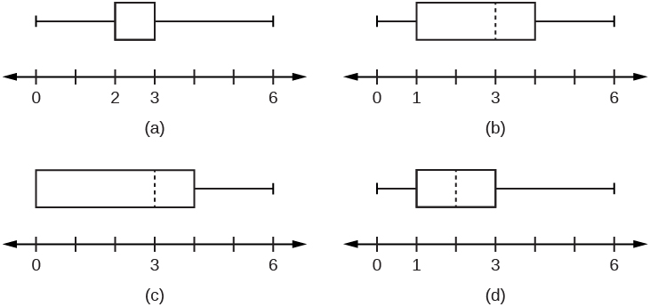
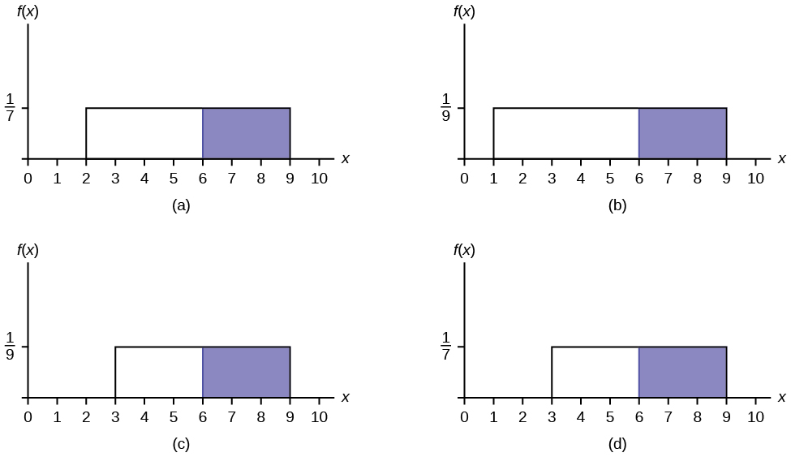
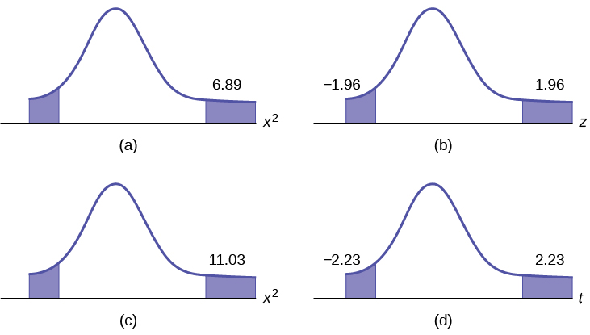

A study was done to determine the proportion of teenagers that own a car. The population proportion of teenagers that own a car is the:  statistic. parameter. population. variable. 

* * *
{: data-type="newline"}

*Use the following information to answer the next two exercises:*

| value | frequency |
|----------
| 0 | 1 |
| 1 | 4 |
| 2 | 7 |
| 3 | 9 |
| 6 | 4 |
{: #id7687162 summary=""}

The box plot for the data is:

{: #eip-idp120765168 data-media-type="image/jpg"}

If six were added to each value of the data in the table, the 15th percentile of the new list of values is:

1.  six
2.  one
3.  seven
4.  eight
{: data-number-style="lower-alpha"}

* * *
{: data-type="newline"}

*Use the following information to answer the next two exercises:* Suppose that the probability of a drought in any independent year is 20%. Out of those years in which a drought occurs, the probability of water rationing is ten percent. However, in any year, the probability of water rationing is five percent.

What is the probability of both a drought and water rationing occurring?

1.  0\.05
2.  0\.01
3.  0\.02
4.  0\.30
{: data-number-style="lower-alpha"}

Which of the following is true?

1.  Drought and water rationing are independent events.
2.  Drought and water rationing are mutually exclusive events.
3.  None of the above
{: data-number-style="lower-alpha"}

* * *
{: data-type="newline"}

*Use the following information to answer the next two exercises:* Suppose that a survey yielded the following data: <table id="id9329967" summary=""><caption>Favorite Pie</caption><thead>
            <tr>
              <th>gender</th>
              <th>apple</th>
              <th>pumpkin</th>
              <th>pecan</th>
            </tr>
</thead><tbody>
            <tr>
              <td>female</td>
              <td>40</td>
              <td>10</td>
              <td>30</td>
            </tr>
            <tr>
              <td>male</td>
              <td>20</td>
              <td>30</td>
              <td>10</td>
            </tr>
          </tbody></table>

Suppose that one individual is randomly chosen. The probability that the person’s favorite pie is apple or the person is male is \_\_\_\_\_.

1.  <math xmlns="http://www.w3.org/1998/Math/MathML"> <mrow> <mfrac> <mrow> <mn>40</mn> </mrow> <mrow> <mn>60</mn> </mrow> </mfrac> </mrow> </math>

2.  <math xmlns="http://www.w3.org/1998/Math/MathML"> <mrow> <mfrac> <mrow> <mn>60</mn> </mrow> <mrow> <mn>140</mn> </mrow> </mfrac> </mrow> </math>

3.  <math xmlns="http://www.w3.org/1998/Math/MathML"> <mrow> <mfrac> <mrow> <mn>120</mn> </mrow> <mrow> <mn>140</mn> </mrow> </mfrac> </mrow> </math>

4.  <math xmlns="http://www.w3.org/1998/Math/MathML"> <mrow> <mfrac> <mrow> <mn>100</mn> </mrow> <mrow> <mn>140</mn> </mrow> </mfrac> </mrow> </math>
{: data-number-style="lower-alpha"}

Suppose *H0* is: Favorite pie and gender are independent. The *p*-value is \_\_\_\_\_\_.

1.  ≈ 0
2.  1
3.  0\.05
4.  cannot be determined
{: data-number-style="lower-alpha"}

* * *
{: data-type="newline"}

*Use the following information to answer the next two exercises:* Let’s say that the probability that an adult watches the news at least once per week is 0.60. We randomly survey 14 people. Of interest is the number of people who watch the news at least once per week.

Which of the following statements is FALSE?

1.  *X* ~ *B*(14 0.60)
2.  The values for *x* are: {1 ,2 ,3 ,... ,14}.
3.  *μ* = 8.4
4.  *P*(*X* = 5) = 0.0408
{: data-number-style="lower-alpha"}

Find the probability that at least six adults watch the news at least once per week.

1.  <math xmlns="http://www.w3.org/1998/Math/MathML"> <mrow> <mfrac> <mn>6</mn> <mrow> <mn>14</mn> </mrow> </mfrac> </mrow> </math>

2.  0\.8499
3.  0\.9417
4.  0\.6429
{: data-number-style="lower-alpha"}

The following histogram is most likely to be a result of sampling from which distribution?

{: data-media-type="image/jpg"}

1.  chi-square with *df* = 6
2.  exponential
3.  uniform
4.  binomial
{: data-number-style="lower-alpha"}

The ages of campus day and evening students is known to be normally distributed. A sample of six campus day and evening students reported their ages (in years) as: {18, 35, 27, 45, 20, 20}. What is the error bound for the 90% confidence interval of the true average age?

1.  11\.2
2.  22\.3
3.  17\.5
4.  8\.7
{: data-number-style="lower-alpha"}

If a normally distributed random variable has *µ* = 0 and *σ* = 1, then 97.5% of the population values lie above:

1.  –1.96.
2.  1\.96.
3.  1\.
4.  –1.
{: data-number-style="lower-alpha"}

* * *
{: data-type="newline"}

*Use the following information to answer the next three exercises.* The amount of money a customer spends in one trip to the supermarket is known to have an exponential distribution. Suppose the average amount of money a customer spends in one trip to the supermarket is $72.

What is the probability that one customer spends less than $72 in one trip to the supermarket?

1.  0\.6321
2.  0\.5000
3.  0\.3714
4.  1
{: data-number-style="lower-alpha"}

How much money altogether would you expect the next five customers to spend in one trip to the supermarket (in dollars)?

1.  72
2.  <math xmlns="http://www.w3.org/1998/Math/MathML"> <mrow> <mfrac> <mrow> <msup> <mrow> <mn>72</mn> </mrow> <mn>2</mn> </msup> </mrow> <mn>5</mn> </mfrac> </mrow> </math>

3.  5184
4.  360
{: data-number-style="lower-alpha"}

If you want to find the probability that the mean amount of money 50 customers spend in one trip to the supermarket is less than $60, the distribution to use is:

1.  *N*(72, 72)
2.  <math xmlns="http://www.w3.org/1998/Math/MathML"> <mrow> <mi>N</mi><mrow><mo>(</mo> <mrow> <mn>72</mn><mo>,</mo><mfrac> <mrow> <mn>72</mn> </mrow> <mrow> <msqrt> <mrow> <mn>50</mn> </mrow> </msqrt> </mrow> </mfrac> </mrow> <mo>)</mo></mrow> </mrow> </math>

3.  *Exp*(72)
4.  <math xmlns="http://www.w3.org/1998/Math/MathML"> <mrow> <mi>E</mi><mi>x</mi><mi>p</mi><mrow><mo>(</mo> <mrow> <mfrac> <mn>1</mn> <mrow> <mn>72</mn> </mrow> </mfrac> </mrow> <mo>)</mo></mrow> </mrow> </math>
{: data-number-style="lower-alpha"}

* * *
{: data-type="newline"}

*Use the following information to answer the next three exercises:* The amount of time it takes a fourth grader to carry out the trash is uniformly distributed in the interval from one to ten minutes.

What is the probability that a randomly chosen fourth grader takes more than seven minutes to take out the trash?

1.  <math xmlns="http://www.w3.org/1998/Math/MathML"> <mrow> <mfrac> <mn>3</mn> <mn>9</mn> </mfrac> </mrow> </math>

2.  <math xmlns="http://www.w3.org/1998/Math/MathML"> <mrow> <mfrac> <mn>7</mn> <mn>9</mn> </mfrac> </mrow> </math>

3.  <math xmlns="http://www.w3.org/1998/Math/MathML"> <mrow> <mfrac> <mn>3</mn> <mrow> <mn>10</mn> </mrow> </mfrac> </mrow> </math>

4.  <math xmlns="http://www.w3.org/1998/Math/MathML"> <mrow> <mfrac> <mn>7</mn> <mrow> <mn>10</mn> </mrow> </mfrac> </mrow> </math>
{: data-number-style="lower-alpha"}

Which graph best shows the probability that a randomly chosen fourth grader takes more than six minutes to take out the trash given that he or she has already taken more than three minutes?

{: data-media-type="image/png"}

We should expect a fourth grader to take how many minutes to take out the trash?

1.  4\.5
2.  5\.5
3.  5
4.  10
{: data-number-style="lower-alpha"}

* * *
{: data-type="newline"}

*Use the following information to answer the next three exercises:* At the beginning of the quarter, the amount of time a student waits in line at the campus cafeteria is normally distributed with a mean of five minutes and a standard deviation of 1.5 minutes.

What is the 90th percentile of waiting times (in minutes)?

1.  1\.28
2.  90
3.  7\.47
4.  6\.92
{: data-number-style="lower-alpha"}

The median waiting time (in minutes) for one student is:

1.  5\.
2.  50\.
3.  2\.5.
4.  1\.5.
{: data-number-style="lower-alpha"}

Find the probability that the average wait time for ten students is at most 5.5 minutes.

1.  0\.6301
2.  0\.8541
3.  0\.3694
4.  0\.1459
{: data-number-style="lower-alpha"}

A sample of 80 software engineers in Silicon Valley is taken and it is found that 20% of them earn approximately $50,000 per year. A point estimate for the true proportion of engineers in Silicon Valley who earn $50,000 per year is:

1.  16\.
2.  0\.2.
3.  1\.
4.  0\.95.
{: data-number-style="lower-alpha"}

If *P*(*Z* &lt; *zα*) = 0.1587 where *Z* ~ *N*(0, 1), then *α* is equal to:

1.  –1.
2.  0\.1587.
3.  0\.8413.
4.  1\.
{: data-number-style="lower-alpha"}

A professor tested 35 students to determine their entering skills. At the end of the term, after completing the course, the same test was administered to the same 35 students to study their improvement. This would be a test of:

1.  independent groups.
2.  two proportions.
3.  matched pairs, dependent groups.
4.  exclusive groups.
{: data-number-style="lower-alpha"}

A math exam was given to all the third grade children attending ABC School. Two random samples of scores were taken.

|  | *n* | <math xmlns="http://www.w3.org/1998/Math/MathML"> <mover accent="true"> <mi>x</mi> <mo>¯</mo> </mover> </math>

 | *s* |
|----------
| **Boys** | 55 | 82 | 5 |
| **Girls** | 60 | 86 | 7 |
{: #id8344093 summary=""}

Which of the following correctly describes the results of a hypothesis test of the claim, “There is a difference between the mean scores obtained by third grade girls and boys at the 5% level of significance”?

1.  Do not reject *H0*. There is insufficient evidence to conclude that there is a difference in the mean scores.
2.  Do not reject *H0*. There is sufficient evidence to conclude that there is a difference in the mean scores.
3.  Reject *H0*. There is insufficient evidence to conclude that there is no difference in the mean scores.
4.  Reject *H0*. There is sufficient evidence to conclude that there is a difference in the mean scores.
{: data-number-style="lower-alpha"}

In a survey of 80 males, 45 had played an organized sport growing up. Of the 70 females surveyed, 25 had played an organized sport growing up. We are interested in whether the proportion for males is higher than the proportion for females. The correct conclusion is that:

1.  there is insufficient information to conclude that the proportion for males is the same as the proportion for females.
2.  there is insufficient information to conclude that the proportion for males is not the same as the proportion for females.
3.  there is sufficient evidence to conclude that the proportion for males is higher than the proportion for females.
4.  not enough information to make a conclusion.
{: data-number-style="lower-alpha"}

From past experience, a statistics teacher has found that the average score on a midterm is 81 with a standard deviation of 5.2. This term, a class of 49 students had a standard deviation of 5 on the midterm. Do the data indicate that we should reject the teacher’s claim that the standard deviation is 5.2? Use *α* = 0.05.

1.  Yes
2.  No
3.  Not enough information given to solve the problem
{: data-number-style="lower-alpha"}

Three loading machines are being compared. Ten samples were taken for each machine. Machine I took an average of 31 minutes to load packages with a standard deviation of two minutes. Machine II took an average of 28 minutes to load packages with a standard deviation of 1.5 minutes. Machine III took an average of 29 minutes to load packages with a standard deviation of one minute. Find the *p*-value when testing that the average loading times are the same.

1.  *p*-value is close to zero
2.  *p*-value is close to one
3.  not enough information given to solve the problem
{: data-number-style="lower-alpha"}

* * *
{: data-type="newline"}

*Use the following information to answer the next three exercises:* A corporation has offices in different parts of the country. It has gathered the following information concerning the number of bathrooms and the number of employees at seven sites: | **Number of employees *x*** | 650 | 730 | 810 | 900 | 102 | 107 | 1150 |
| **Number of bathrooms *y*** | 40 | 50 | 54 | 61 | 82 | 110 | 121 |
{: #id7723517 summary=""}

Is the correlation between the number of employees and the number of bathrooms significant?

1.  Yes
2.  No
3.  Not enough information to answer question
{: data-number-style="lower-alpha"}

The linear regression equation is:

1.  *ŷ* = 0.0094 − 79.96*x*
2.  *ŷ* = 79.96 + 0.0094*x*
3.  *ŷ* = 79.96 − 0.0094*x*
4.  *ŷ* = − 0.0094 + 79.96*x*
{: data-number-style="lower-alpha"}

If a site has 1,150 employees, approximately how many bathrooms should it have?

1.  69
2.  91
3.  91,954
4.  We should not be estimating here.
{: data-number-style="lower-alpha"}

Suppose that a sample of size ten was collected, with <math xmlns="http://www.w3.org/1998/Math/MathML"> <mover accent="true"> <mi>x</mi> <mo>¯</mo> </mover> </math>

 = 4.4 and *s* = 1.4. *H0*: *σ2* = 1.6 vs. *Ha*: *σ2* ≠ 1.6. Which graph best describes the results of the test?

{: data-media-type="image/png"}

Sixty-four backpackers were asked the number of days since their latest backpacking trip. The number of days is given in [[link]](#id7898848):

| # of days | 1 | 2 | 3 | 4 | 5 | 6 | 7 | 8 |
| Frequency | 5 | 9 | 6 | 12 | 7 | 10 | 5 | 10 |
{: #id7898848 summary=""}

* * *
{: data-type="newline"}

Conduct an appropriate test to determine if the distribution is uniform.

1.  The *p*-value is &gt; 0.10. There is insufficient information to conclude that the distribution is not uniform.
2.  The *p*-value is &lt; 0.01. There is sufficient information to conclude the distribution is not uniform.
3.  The *p*-value is between 0.01 and 0.10, but without alpha (*α*) there is not enough information
4.  There is no such test that can be conducted.
{: data-number-style="lower-alpha"}

Which of the following statements is true when using one-way ANOVA?

1.  The populations from which the samples are selected have different distributions.
2.  The sample sizes are large.
3.  The test is to determine if the different groups have the same means.
4.  There is a correlation between the factors of the experiment.
{: data-number-style="lower-alpha"}

