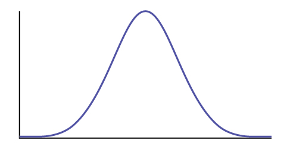
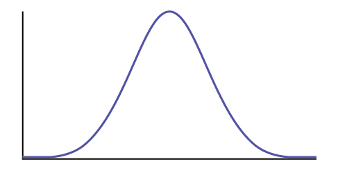
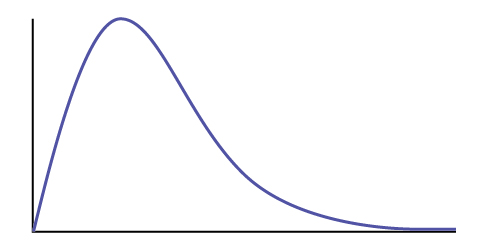
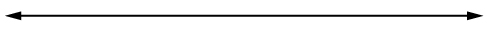

# Hypothesis Testing with One Sample 

Class Time: \\\_\\\_\\\_\\\_\\\_\\\_\\\_\\\_\\\_\\\_\\\_\\\_\\\_\\\_\\\_\\\_\\\_\\\_\\\_\\\_\\\_\\\_\\\_\\\_\\\_\\\_* * *
{: data-type="newline"}

 Name: \\\_\\\_\\\_\\\_\\\_\\\_\\\_\\\_\\\_\\\_\\\_\\\_\\\_\\\_\\\_\\\_\\\_\\\_\\\_\\\_\\\_\\\_\\\_\\\_\\\_\\\_\\\_\\\_\\\_\\\_\\\_\\\_\\\_\\\_\\\_\\\_\\\_

1.  *H0*\: \\\_\\\_\\\_\\\_\\\_\\\_\\\_
2.  *Ha*\: \\\_\\\_\\\_\\\_\\\_\\\_\\\_
3.  In words, **CLEARLY** state what your random variable
    <math xmlns="http://www.w3.org/1998/Math/MathML"> <mover accent="true"> <mi>X</mi> <mo>¯</mo> </mover> </math>
    
    or
    <math xmlns="http://www.w3.org/1998/Math/MathML"> <msup> <mi>P</mi> <mo>′</mo> </msup> </math>
    
    represents.
4.  State the distribution to use for the test.
5.  What is the test statistic?
6.  What is the *p*-value? In one or two complete sentences, explain what the *p*-value means for this problem.
7.  Use the previous information to sketch a picture of this situation. CLEARLY, label and scale the horizontal axis and shade the region(s) corresponding to the *p*-value. {: #id13552252}

8.  Indicate the correct decision (“reject” or “do not reject” the null hypothesis), the reason for it, and write an appropriate conclusion, using **complete sentences**.
    1.  Alpha: \\\_\\\_\\\_\\\_\\\_\\\_\\\_
    2.  Decision: \\\_\\\_\\\_\\\_\\\_\\\_\\\_
    3.  Reason for decision: \\\_\\\_\\\_\\\_\\\_\\\_\\\_
    4.  Conclusion: \\\_\\\_\\\_\\\_\\\_\\\_\\\_
    {: data-number-style="lower-roman"}

9.  Construct a 95% confidence interval for the true mean or proportion. Include a sketch of the graph of the situation. Label the point estimate and the lower and upper bounds of the confidence interval.{: #id13552369}

{: data-number-style="lower-alpha"}

# Hypothesis Testing with Two Samples    {#eip-422}

Class Time: \\\_\\\_\\\_\\\_\\\_\\\_\\\_\\\_\\\_\\\_\\\_\\\_\\\_\\\_\\\_\\\_\\\_\\\_\\\_\\\_\\\_\\\_\\\_\\\_\\\_\\\_* * *
{: data-type="newline"}

 Name: \\\_\\\_\\\_\\\_\\\_\\\_\\\_\\\_\\\_\\\_\\\_\\\_\\\_\\\_\\\_\\\_\\\_\\\_\\\_\\\_\\\_\\\_\\\_\\\_\\\_\\\_\\\_\\\_\\\_\\\_\\\_\\\_\\\_\\\_\\\_\\\_\\\_

1.  *H0*\: \\\_\\\_\\\_\\\_\\\_\\\_\\\_
2.  *Ha*\: \\\_\\\_\\\_\\\_\\\_\\\_\\\_
3.  In words, **clearly** state what your random variable
    <math xmlns="http://www.w3.org/1998/Math/MathML"> <mrow> <msub> <mover accent="true"> <mi>X</mi> <mo>¯</mo> </mover> <mn>1</mn> </msub> <mo>−</mo><msub> <mover accent="true"> <mi>X</mi> <mo>¯</mo> </mover> <mn>2</mn> </msub> </mrow> </math>
    
    ,
    <math xmlns="http://www.w3.org/1998/Math/MathML"> <mrow> <msub> <msup> <mi>P</mi> <mo>′</mo> </msup> <mn>1</mn> </msub> <mo>−</mo><msub> <msup> <mi>P</mi> <mo>′</mo> </msup> <mn>2</mn> </msub> </mrow> </math>
    
    or
    <math xmlns="http://www.w3.org/1998/Math/MathML"> <mrow> <msub> <mover accent="true"> <mi>X</mi> <mo>¯</mo> </mover> <mi>d</mi> </msub> </mrow> </math>
    
    represents.
4.  State the distribution to use for the test.
5.  What is the test statistic?
6.  What is the *p*-value? In one to two complete sentences, explain what the p-value means for this problem.
7.  Use the previous information to sketch a picture of this situation. **CLEARLY** label and scale the horizontal axis and shade the region(s) corresponding to the *p*-value. {: #id13017561}

8.  Indicate the correct decision (“reject” or “do not reject” the null hypothesis), the reason for it, and write an appropriate conclusion, using **complete sentences**.
    1.  Alpha: \\\_\\\_\\\_\\\_\\\_\\\_\\\_
    2.  Decision: \\\_\\\_\\\_\\\_\\\_\\\_\\\_
    3.  Reason for decision: \\\_\\\_\\\_\\\_\\\_\\\_\\\_
    4.  Conclusion: \\\_\\\_\\\_\\\_\\\_\\\_\\\_
    {: data-number-style="lower-alpha"}

9.  In complete sentences, explain how you determined which distribution to use.
{: data-number-style="lower-alpha"}

# The Chi-Square Distribution   {#eip-494}

Class Time: \\\_\\\_\\\_\\\_\\\_\\\_\\\_\\\_\\\_\\\_\\\_\\\_\\\_\\\_\\\_\\\_\\\_\\\_\\\_\\\_\\\_\\\_\\\_\\\_\\\_\\\_* * *
{: data-type="newline"}

 Name: \\\_\\\_\\\_\\\_\\\_\\\_\\\_\\\_\\\_\\\_\\\_\\\_\\\_\\\_\\\_\\\_\\\_\\\_\\\_\\\_\\\_\\\_\\\_\\\_\\\_\\\_\\\_\\\_\\\_\\\_\\\_\\\_\\\_\\\_\\\_\\\_

1.  *H0*\: \\\_\\\_\\\_\\\_\\\_\\\_\\\_
2.  *Ha*\: \\\_\\\_\\\_\\\_\\\_\\\_\\\_
3.  What are the degrees of freedom?
4.  State the distribution to use for the test.
5.  What is the test statistic?
6.  What is the *p*-value? In one to two complete sentences, explain what the *p*-value means for this problem.
7.  Use the previous information to sketch a picture of this situation. **Clearly** label and scale the horizontal axis and shade the region(s) corresponding to the *p*-value. {: #id10146455}

8.  Indicate the correct decision (“reject” or “do not reject” the null hypothesis) and write appropriate conclusions, using <strong>complete sentences. </strong>
    1.  Alpha: \\\_\\\_\\\_\\\_\\\_\\\_\\\_
    2.  Decision: \\\_\\\_\\\_\\\_\\\_\\\_\\\_
    3.  Reason for decision: \\\_\\\_\\\_\\\_\\\_\\\_\\\_
    4.  Conclusion: \\\_\\\_\\\_\\\_\\\_\\\_\\\_
    {: data-number-style="lower-roman"}
{: data-number-style="lower-alpha"}

# F Distribution and One-Way ANOVA   {#eip-893}

Class Time: \\\_\\\_\\\_\\\_\\\_\\\_\\\_\\\_\\\_\\\_\\\_\\\_\\\_\\\_\\\_\\\_\\\_\\\_\\\_\\\_\\\_\\\_\\\_\\\_\\\_\\\_* * *
{: data-type="newline"}

 Name: \\\_\\\_\\\_\\\_\\\_\\\_\\\_\\\_\\\_\\\_\\\_\\\_\\\_\\\_\\\_\\\_\\\_\\\_\\\_\\\_\\\_\\\_\\\_\\\_\\\_\\\_\\\_\\\_\\\_\\\_\\\_\\\_\\\_\\\_\\\_\\\_

1.  *H0*\: \\\_\\\_\\\_\\\_\\\_\\\_\\\_
2.  *Ha*\: \\\_\\\_\\\_\\\_\\\_\\\_\\\_
3.  *df*(*n*) = \\\_\\\_\\\_\\\_\\\_\\\_ *df*(*d*) = \\\_\\\_\\\_\\\_\\\_\\\_\\\_
4.  State the distribution to use for the test.
5.  What is the test statistic?
6.  What is the *p*-value?
7.  Use the previous information to sketch a picture of this situation. **Clearly** label and scale the horizontal axis and shade the region(s) corresponding to the *p*-value. {: #element-123123}

8.  Indicate the correct decision (“reject” or “do not reject” the null hypothesis) and write appropriate conclusions, using **complete sentences**.
    1.  Alpha: \\\_\\\_\\\_\\\_\\\_\\\_\\\_
    2.  Decision: \\\_\\\_\\\_\\\_\\\_\\\_\\\_
    3.  Reason for decision: \\\_\\\_\\\_\\\_\\\_\\\_\\\_
    4.  Conclusion: \\\_\\\_\\\_\\\_\\\_\\\_\\\_
    {: data-number-style="lower-alpha"}
{: data-number-style="lower-alpha"}

