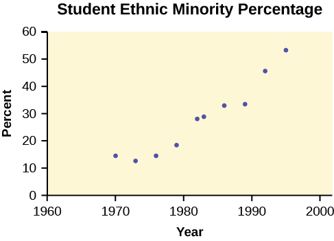

# Quick Tips

Legend  {: data-media-type="image/png"}   represents a button press `[ ]` represents yellow command or green letter behind a key `< >` represents items on the screen 

To adjust the contrast Press  {: data-media-type="image/png"}  , then hold  {: data-media-type="image/png"}   to increase the contrast or  {: data-media-type="image/png"}   to decrease the contrast.

To capitalize letters and words Press  {: data-media-type="image/png"}   to get one capital letter, or press  {: data-media-type="image/png"}  , then  {: data-media-type="image/png"}   to set all button presses to capital letters. You can return to the top-level button values by pressing  {: data-media-type="image/png"}   again.

To correct a mistake If you hit a wrong button, just hit  {: data-media-type="image/png"}   and start again.

To write in scientific notationNumbers in scientific notation are expressed on the TI-83, 83+, 84, and 84+ using E notation, such that... 4.321 E 4 = <math xmlns="http://www.w3.org/1998/Math/MathML"> <mrow> <mtext>4</mtext><mtext>.321</mtext><mo>×</mo><msup> <mrow> <mtext>10</mtext> </mrow> <mn>4</mn> </msup> </mrow> </math>
 4.321 E –4 = <math xmlns="http://www.w3.org/1998/Math/MathML"> <mrow> <mtext>4</mtext><mtext>.321</mtext><mo>×</mo><msup> <mrow> <mtext>10</mtext> </mrow> <mrow> <mn>–4</mn> </mrow> </msup> </mrow> </math>
  

To transfer programs or equations from one calculator to another:**Both calculators:** Insert your respective end of the link cable cable and press  {: data-media-type="image/png"}  , then `[LINK]`.

Calculator receiving information:Use the arrows to navigate to and select `<RECEIVE>`  Press  {: data-media-type="image/png"}  . 

Calculator sending information:Press appropriate number or letter. Use up and down arrows to access the appropriate item. Press  {: data-media-type="image/png"}   to select item to transfer. Press right arrow to navigate to and select `<TRANSMIT>`. Press  {: data-media-type="image/png"}  . 

Note

ERROR 35 LINK generally means that the cables have not been inserted far enough.

**Both calculators:** Insert your respective end of the link cable cable Both calculators: press  {: data-media-type="image/png"}  , then `[QUIT]` to exit when done.

# Manipulating One-Variable Statistics   {#eip-367}

Note

These directions are for entering data with the built-in statistical program.

<table id="eip-886" summary="A table of sample data used throughout the rest of this section. The first column is data, while the second column represents the frequency of that data."><caption>Sample DataWe are manipulating one-variable statistics.</caption><thead valign="top">
            <tr>
              <th>Data</th>
              <th>Frequency</th>
            </tr>
          </thead><tbody>
            <tr>
              <td>–2</td>
              <td>10</td>
            </tr>
            <tr>
              <td>–1</td>
              <td>3</td>
            </tr>
            <tr>
              <td>0</td>
              <td>4</td>
            </tr>
            <tr>
              <td>1</td>
              <td>5</td>
            </tr>
            <tr>
              <td>3</td>
              <td>8</td>
            </tr>
          </tbody></table>

To begin: Turn on the calculator.* * *
{: data-type="newline"}

  {: data-media-type="image/png"} 

   Access statistics mode.* * *
{: data-type="newline"}

  {: data-media-type="image/png"} 

   Select `<4:ClrList>` to clear data from lists, if desired. * * *
{: data-type="newline"}

 {: data-media-type="image/png"}  ,  {: data-media-type="image/png"} 

  Enter list `[L1]` to be cleared.* * *
{: data-type="newline"}

  {: data-media-type="image/png"}  , `[L1]` ,  {: data-media-type="image/png"} 

  Display last instruction.* * *
{: data-type="newline"}

  {: data-media-type="image/png"}  , `[ENTRY]`

  Continue clearing remaining lists in the same fashion, if desired.* * *
{: data-type="newline"}

  {: data-media-type="image/png"}  ,  {: data-media-type="image/png"}  , `[L2]` ,  {: data-media-type="image/png"} 

  Access statistics mode.* * *
{: data-type="newline"}

  {: data-media-type="image/png"} 

  Select `<1:Edit . . .>`* * *
{: data-type="newline"}

  {: data-media-type="image/png"} 

  Enter data. Data values go into `[L1]`. (You may need to arrow over to `[L1]`).  Type in a data value and enter it. (For negative numbers, use the negate (-) key at the bottom of the keypad).* * *
{: data-type="newline"}

  {: data-media-type="image/png"}  ,  {: data-media-type="image/png"}  ,  {: data-media-type="image/png"} 

  Continue in the same manner until all data values are entered. 

  In `[L2]`, enter the frequencies for each data value in `[L1]`.  Type in a frequency and enter it. (If a data value appears only once, the frequency is \"1\").* * *
{: data-type="newline"}

  {: data-media-type="image/png"}  ,  {: data-media-type="image/png"} 

  Continue in the same manner until all data values are entered. 

  Access statistics mode.* * *
{: data-type="newline"}

  {: data-media-type="image/png"} 

  Navigate to `<CALC>`. Access `<1:1-var Stats>`.* * *
{: data-type="newline"}

  {: data-media-type="image/png"} 

  Indicate that the data is in `[L1]`...* * *
{: data-type="newline"}

  {: data-media-type="image/png"}  , `[L1]` ,  {: data-media-type="image/png"} 

  ...and indicate that the frequencies are in `[L2]`.* * *
{: data-type="newline"}

  {: data-media-type="image/png"}  , `[L2]` ,  {: data-media-type="image/png"} 

  The statistics should be displayed. You may arrow down to get remaining statistics. Repeat as necessary.

# Drawing Histograms

Note

We will assume that the data is already entered.

We will construct two histograms with the built-in STATPLOT application. The first way will use the default ZOOM. The second way will involve customizing a new graph.

1.  Access graphing mode.* * *
    {: data-type="newline"}
    
      {: data-media-type="image/png"}  , `[STAT PLOT]`

2.  Select `<1:plot 1>` to access plotting - first graph.* * *
    {: data-type="newline"}
    
      {: data-media-type="image/png"} 

3.  Use the arrows navigate go to `<ON>` to turn on Plot 1.* * *
    {: data-type="newline"}
    
     `<ON>` ,  {: data-media-type="image/png"} 

4.  Use the arrows to go to the histogram picture and select the histogram.  {: data-media-type="image/png"} 
5.  Use the arrows to navigate to `<Xlist>`.
6.  If \"L1\" is not selected, select it.* * *
    {: data-type="newline"}
    
      {: data-media-type="image/png"}  , `[L1]` ,  {: data-media-type="image/png"} 

7.  Use the arrows to navigate to `<Freq>`.
8.  Assign the frequencies to `[L2]`.* * *
    {: data-type="newline"}
    
      {: data-media-type="image/png"}  , `[L2]` ,  {: data-media-type="image/png"} 

9.  Go back to access other graphs.* * *
    {: data-type="newline"}
    
      {: data-media-type="image/png"}  , `[STAT PLOT]`

10. Use the arrows to turn off the remaining plots.
11. **Be sure to deselect or clear all equations before graphing.**
{: data-number-style="arabic"}

To deselect equations:Access the list of equations.* * *
{: data-type="newline"}

  {: data-media-type="image/png"} 

  Select each equal sign (=).* * *
{: data-type="newline"}

  {: data-media-type="image/png"}   {: data-media-type="image/png"}   {: data-media-type="image/png"} 

  Continue, until all equations are deselected.

To clear equations:Access the list of equations.* * *
{: data-type="newline"}

  {: data-media-type="image/png"} 

  Use the arrow keys to navigate to the right of each equal sign (=) and clear them.* * *
{: data-type="newline"}

  {: data-media-type="image/png"}   {: data-media-type="image/png"}   {: data-media-type="image/png"} 

  Repeat until all equations are deleted.

To draw default histogram:Access the ZOOM menu.* * *
{: data-type="newline"}

  {: data-media-type="image/png"} 

  Select `<9:ZoomStat>`.* * *
{: data-type="newline"}

  {: data-media-type="image/png"} 

  The histogram will show with a window automatically set.

To draw custom histogram:Access window mode to set the graph parameters.* * *
{: data-type="newline"}

 {: data-media-type="image/png"}    <math xmlns="http://www.w3.org/1998/Math/MathML"><mrow> <msub> <mi>X</mi> <mrow> <mi>min</mi> </mrow> </msub> <mo>=</mo><mn>–2.5</mn> </mrow> </math>
   <math xmlns="http://www.w3.org/1998/Math/MathML"> <mrow> <msub> <mi>X</mi> <mrow> <mi>max</mi> </mrow> </msub> <mo>=</mo><mn>3.5</mn> </mrow> </math>
   <math xmlns="http://www.w3.org/1998/Math/MathML"> <mrow> <msub> <mi>X</mi> <mrow> <mi>s</mi><mi>c</mi><mi>l</mi> </mrow> </msub> <mo>=</mo><mn>1</mn> </mrow> </math>
 (width of bars)   <math xmlns="http://www.w3.org/1998/Math/MathML"> <mrow> <msub> <mi>Y</mi> <mrow> <mi>min</mi> </mrow> </msub> <mo>=</mo><mn>0</mn> </mrow> </math>
   <math xmlns="http://www.w3.org/1998/Math/MathML"> <mrow> <msub> <mi>Y</mi> <mrow> <mi>max</mi> </mrow> </msub> <mo>=</mo><mn>10</mn> </mrow> </math>
   <math xmlns="http://www.w3.org/1998/Math/MathML"> <mrow> <msub> <mi>Y</mi> <mrow> <mi>s</mi><mi>c</mi><mi>l</mi> </mrow> </msub> <mo>=</mo><mn>1</mn> </mrow> </math>
 (spacing of tick marks on *y*-axis)   <math xmlns="http://www.w3.org/1998/Math/MathML"> <mrow> <msub> <mi>X</mi> <mrow> <mi>r</mi><mi>e</mi><mi>s</mi> </mrow> </msub> <mo>=</mo><mn>1</mn> </mrow> </math>
    Access graphing mode to see the histogram.* * *
{: data-type="newline"}

  {: data-media-type="image/png"}  

To draw box plots:Access graphing mode.* * *
{: data-type="newline"}

  {: data-media-type="image/png"}  , `[STAT PLOT]`

  Select `<1:Plot 1>` to access the first graph.* * *
{: data-type="newline"}

  {: data-media-type="image/png"} 

  Use the arrows to select `<ON>` and turn on Plot 1.* * *
{: data-type="newline"}

  {: data-media-type="image/png"} 

  Use the arrows to select the box plot picture and enable it.* * *
{: data-type="newline"}

  {: data-media-type="image/png"} 

  Use the arrows to navigate to `<Xlist>`. If \"L1\" is not selected, select it.* * *
{: data-type="newline"}

  {: data-media-type="image/png"}  , `[L1]` ,  {: data-media-type="image/png"} 

  Use the arrows to navigate to `<Freq>`. Indicate that the frequencies are in `[L2]`.* * *
{: data-type="newline"}

  {: data-media-type="image/png"}  , `[L2]` ,  {: data-media-type="image/png"} 

  Go back to access other graphs.* * *
{: data-type="newline"}

  {: data-media-type="image/png"}  , `[STAT PLOT]`

  **Be sure to deselect or clear all equations before graphing** using the method mentioned above. View the box plot.* * *
{: data-type="newline"}

  {: data-media-type="image/png"}  , `[STAT PLOT]`

 

# Linear Regression

## Sample Data

The following data is real. The percent of declared ethnic minority students at De Anza College for selected years from 1970–1995 was:

<table summary=" The first column is data represents years, from 1970 to 1995, while the second column represents the percentage of declared ethnic minority students at De Anza College with respect to the entire student body for that year."><caption>The independent variable is "Year," while the independent variable is "Student Ethnic Minority Percent."</caption><thead valign="top">
              <tr>
                <th>Year</th>
                <th>Student Ethnic Minority Percentage</th>
              </tr>
            </thead><tbody>
              <tr>
                <td>1970</td>
                <td>14.13</td>
              </tr>
              <tr>
                <td>1973</td>
                <td>12.27</td>
              </tr>
              <tr>
                <td>1976</td>
                <td>14.08</td>
              </tr>
              <tr>
                <td>1979</td>
                <td>18.16</td>
              </tr>
              <tr>
                <td>1982</td>
                <td>27.64</td>
              </tr>
              <tr>
                <td>1983</td>
                <td>28.72</td>
              </tr>
              <tr>
                <td>1986</td>
                <td>31.86</td>
              </tr>
              <tr>
                <td>1989</td>
                <td>33.14</td>
              </tr>
              <tr>
                <td>1992</td>
                <td>45.37</td>
              </tr>
              <tr>
                <td>1995</td>
                <td>53.1</td>
              </tr>
            </tbody></table>

 {: data-media-type="image/png" data-title="Student Ethnic Minority Percentage"}

Note

The TI-83 has a built-in linear regression feature, which allows the data to be edited.The *x*-values will be in `[L1]`; the *y*-values in `[L2]`.

To enter data and do linear regression:ON Turns calculator on.* * *
{: data-type="newline"}

  {: data-media-type="image/png"} 

  Before accessing this program, be sure to turn off all plots.  Access graphing mode.* * *
{: data-type="newline"}

  {: data-media-type="image/png"}  , `[STAT PLOT]`

  Turn off all plots.* * *
{: data-type="newline"}

  {: data-media-type="image/png"}  ,  {: data-media-type="image/png"} 

    Round to three decimal places. To do so:  Access the mode menu.* * *
{: data-type="newline"}

  {: data-media-type="image/png"}  , `[STAT PLOT]`

   Navigate to `<Float>` and then to the right to `<3>`.* * *
{: data-type="newline"}

  {: data-media-type="image/png"}   {: data-media-type="image/png"} 

   All numbers will be rounded to three decimal places until changed.* * *
{: data-type="newline"}

  {: data-media-type="image/png"} 

     Enter statistics mode and clear lists `[L1]` and `[L2]`, as describe previously.* * *
{: data-type="newline"}

  {: data-media-type="image/png"}  ,  {: data-media-type="image/png"} 

   Enter editing mode to insert values for *x* and *y*.* * *
{: data-type="newline"}

  {: data-media-type="image/png"}  ,  {: data-media-type="image/png"} 

  Enter each value. Press  {: data-media-type="image/png"}  to continue. 

To display the correlation coefficient:Access the catalog.* * *
{: data-type="newline"}

  {: data-media-type="image/png"}  , `[CATALOG]`

  Arrow down and select `<DiagnosticOn>`* * *
{: data-type="newline"}

  {: data-media-type="image/png"} ... ,  {: data-media-type="image/png"}  ,  {: data-media-type="image/png"} 

   <math xmlns="http://www.w3.org/1998/Math/MathML"> <ci>r</ci> </math>
 and <math xmlns="http://www.w3.org/1998/Math/MathML"> <apply> <power /> <ci>r</ci> <cn>2</cn> </apply> </math>
 will be displayed during regression calculations.  Access linear regression.* * *
{: data-type="newline"}

  {: data-media-type="image/png"}   {: data-media-type="image/png"} 

   Select the form of *y* = *a* + *bx*.* * *
{: data-type="newline"}

  {: data-media-type="image/png"}  ,  {: data-media-type="image/png"} 

 

* * *
{: data-type="newline"}

The display will show:

LinReg *y* = *a* + *bx* *a* = –3176.909 *b* = 1.617  *r* = 2 0.924  *r* = 0.961  

* * *
{: data-type="newline"}

This means the Line of Best Fit (Least Squares Line) is:  *y* = –3176.909 + 1.617*x*  Percent = –3176.909 + 1.617 (year #)  The correlation coefficient *r* = 0.961

To see the scatter plot:  Access graphing mode.* * *
{: data-type="newline"}

  {: data-media-type="image/png"}  , `[STAT PLOT]`

   Select `<1:plot 1>` To access plotting - first graph.* * *
{: data-type="newline"}

  {: data-media-type="image/png"} 

   Navigate and select `<ON>` to turn on Plot 1.* * *
{: data-type="newline"}

 `<ON>`  {: data-media-type="image/png"} 

  Navigate to the first picture.  Select the scatter plot.* * *
{: data-type="newline"}

  {: data-media-type="image/png"} 

  Navigate to `<Xlist>`.  If `[L1]` is not selected, press  {: data-media-type="image/png"}  , `[L1]` to select it.   Confirm that the data values are in `[L1]`.* * *
{: data-type="newline"}

 `<ON>`  {: data-media-type="image/png"} 

  Navigate to `<Ylist>`.  Select that the frequencies are in `[L2]`.* * *
{: data-type="newline"}

  {: data-media-type="image/png"}  , `[L2]` ,  {: data-media-type="image/png"} 

   Go back to access other graphs.* * *
{: data-type="newline"}

  {: data-media-type="image/png"}  , `[STAT PLOT]`

  Use the arrows to turn off the remaining plots. Access window mode to set the graph parameters.* * *
{: data-type="newline"}

  {: data-media-type="image/png"}    <math xmlns="http://www.w3.org/1998/Math/MathML"> <mrow> <msub> <mi>X</mi> <mrow> <mi>min</mi> </mrow> </msub> <mo>=</mo><mn>1970</mn> </mrow> </math>
   <math xmlns="http://www.w3.org/1998/Math/MathML"> <mrow> <msub> <mi>X</mi> <mrow> <mi>max</mi> </mrow> </msub> <mo>=</mo><mn>2000</mn> </mrow> </math>
   <math xmlns="http://www.w3.org/1998/Math/MathML"> <mrow> <msub> <mi>X</mi> <mrow> <mi>s</mi><mi>c</mi><mi>l</mi> </mrow> </msub> <mo>=</mo><mn>10</mn> </mrow> </math>
 (spacing of tick marks on *x*-axis)   <math xmlns="http://www.w3.org/1998/Math/MathML"> <mrow> <msub> <mi>Y</mi> <mrow> <mi>min</mi> </mrow> </msub> <mo>=</mo><mo>−</mo><mn>0.05</mn> </mrow> </math>
   <math xmlns="http://www.w3.org/1998/Math/MathML"> <mrow> <msub> <mi>Y</mi> <mrow> <mi>max</mi> </mrow> </msub> <mo>=</mo><mn>60</mn> </mrow> </math>
   <math xmlns="http://www.w3.org/1998/Math/MathML"> <mrow> <msub> <mi>Y</mi> <mrow> <mi>s</mi><mi>c</mi><mi>l</mi> </mrow> </msub> <mo>=</mo><mn>10</mn> </mrow> </math>
 (spacing of tick marks on *y*-axis)   <math xmlns="http://www.w3.org/1998/Math/MathML"> <mrow> <msub> <mi>X</mi> <mrow> <mi>r</mi><mi>e</mi><mi>s</mi> </mrow> </msub> <mo>=</mo><mn>1</mn> </mrow> </math>
    Be sure to deselect or clear all equations before graphing, using the instructions above. Press the graph button to see the scatter plot.  {: data-media-type="image/png"}  

To see the regression graph:  Access the equation menu. The regression equation will be put into Y1.* * *
{: data-type="newline"}

  {: data-media-type="image/png"} 

   Access the vars menu and navigate to `<5: Statistics>`.* * *
{: data-type="newline"}

  {: data-media-type="image/png"}  ,  {: data-media-type="image/png"} 

  Navigate to `<EQ>`.  `<1: RegEQ>` contains the regression equation which will be entered in Y1.* * *
{: data-type="newline"}

  {: data-media-type="image/png"} 

  Press the graphing mode button. The regression line will be superimposed over the scatter plot.* * *
{: data-type="newline"}

  {: data-media-type="image/png"}  

To see the residuals and use them to calculate the critical point for an outlier: Access the list. RESID will be an item on the menu. Navigate to it.* * *
{: data-type="newline"}

  {: data-media-type="image/png"} , `[LIST]`, `<RESID>`

   Confirm twice to view the list of residuals. Use the arrows to select them.* * *
{: data-type="newline"}

  {: data-media-type="image/png"}  ,  {: data-media-type="image/png"} 

  The critical point for an outlier is: <math xmlns="http://www.w3.org/1998/Math/MathML"> <apply> <times /> <cn>1.9</cn> <ci>V</ci> <apply> <divide /> <ci>SSE</ci> <apply> <minus /> <ci>n</ci> <cn>2</cn> </apply> </apply> </apply> </math>
 where:   <math xmlns="http://www.w3.org/1998/Math/MathML"> <ci>n</ci> </math>
 = number of pairs of data   <math xmlns="http://www.w3.org/1998/Math/MathML"> <ci>SSE</ci> </math>
 = sum of the squared errors   <math xmlns="http://www.w3.org/1998/Math/MathML"> <apply> <sum /> <apply> <power /> <ci>residual</ci> <cn>2</cn> </apply> </apply> </math>
     Store the residuals in `[L3]`.* * *
{: data-type="newline"}

  {: data-media-type="image/png"}  ,  {: data-media-type="image/png"}  , `[L3]` ,  {: data-media-type="image/png"} 

   Calculate the <math xmlns="http://www.w3.org/1998/Math/MathML"> <apply> <divide /> <apply> <power /> <ci>(residual)</ci> <cn>2</cn> </apply> <apply> <minus /> <ci>n</ci> <cn>2</cn> </apply> </apply> </math>

. Note that <math xmlns="http://www.w3.org/1998/Math/MathML"> <apply> <eq /> <apply> <minus /> <ci>n</ci> <cn>2</cn> </apply> <cn>8</cn> </apply> </math>

 * * *
{: data-type="newline"}

  {: data-media-type="image/png"}  , `[L3]` ,  {: data-media-type="image/png"}  ,  {: data-media-type="image/png"}  ,  {: data-media-type="image/png"} 

   Store this value in `[L4]`.* * *
{: data-type="newline"}

  {: data-media-type="image/png"}  ,  {: data-media-type="image/png"}  , `[L4]` ,  {: data-media-type="image/png"} 

   Calculate the critical value using the equation above.* * *
{: data-type="newline"}

  {: data-media-type="image/png"}  ,  {: data-media-type="image/png"}  ,  {: data-media-type="image/png"}  ,  {: data-media-type="image/png"}  ,  {: data-media-type="image/png"}  , `[V]` ,  {: data-media-type="image/png"}  , `[LIST]`  {: data-media-type="image/png"}  ,  {: data-media-type="image/png"}  ,  {: data-media-type="image/png"}  ,  {: data-media-type="image/png"}  , `[L4]` ,  {: data-media-type="image/png"}  ,  {: data-media-type="image/png"}  ,  {: data-media-type="image/png"} 

  Verify that the calculator displays: 7.642669563. This is the critical value. Compare the absolute value of each residual value in `[L3]` to 7.64. If the absolute value is greater than 7.64, then the (x, y) corresponding point is an outlier. In this case, none of the points is an outlier.

To obtain estimates of *y* for various *x*-values:There are various ways to determine estimates for \"*y.*\" One way is to substitute values for \"*x*\" in the equation. Another way is to use the  {: data-media-type="image/png"}   on the graph of the regression line.

# TI-83, 83+, 84, 84+ instructions for distributions and tests

## Distributions

Access `DISTR`{: data-display="inline"} (for \"Distributions\").

For technical assistance, visit the Texas Instruments website at [http://www.ti.com][1]{: target="_window"} and enter your calculator model into the \"search\" box.

Binomial Distribution `binompdf(n,p,x)`{: data-display="inline"} corresponds to *P*(*X* = *x*) `binomcdf(n,p,x)`{: data-display="inline"} corresponds to *P*(X ≤ x) To see a list of all probabilities for *x*\: 0, 1, . . . , *n*, leave off the \"`x`{: data-display="inline"}\" parameter. 

Poisson Distribution `poissonpdf(λ,x)`{: data-display="inline"} corresponds to *P*(*X* = *x*) `poissoncdf(λ,x)`{: data-display="inline"} corresponds to *P*(*X* ≤ *x*) 

Continuous Distributions (general)  <math xmlns="http://www.w3.org/1998/Math/MathML"> <mrow> <mo>−</mo><mi>∞</mi> </mrow> </math>
 uses the value –1EE99 for left bound  <math xmlns="http://www.w3.org/1998/Math/MathML"> <apply> <plus /> <infinity /> </apply> </math>
 uses the value 1EE99 for right bound 

Normal Distribution `normalpdf(x,μ,σ)`{: data-display="inline"} yields a probability density function value (only useful to plot the normal curve, in which case \"`x`{: data-display="inline"}\" is the variable) `normalcdf(left bound, right bound, μ, σ)`{: data-display="inline"} corresponds to *P*(left bound &lt; *X* &lt; right bound) `normalcdf(left bound, right bound)`{: data-display="inline"} corresponds to *P*(left bound &lt; *Z* &lt; right bound) – standard normal `invNorm(p,μ,σ)`{: data-display="inline"} yields the critical value, *k*\: *P*(*X* &lt; *k*) = *p* `invNorm(p)`{: data-display="inline"} yields the critical value, *k*\: *P*(*Z* &lt; *k*) = *p* for the standard normal 

Student\'s *t*-Distribution `tpdf(x,df)`{: data-display="inline"} yields the probability density function value (only useful to plot the student-*t* curve, in which case \"`x`{: data-display="inline"}\" is the variable) `tcdf(left bound, right bound, df)`{: data-display="inline"} corresponds to *P*(left bound &lt; *t* &lt; right bound) 

Chi-square Distribution `Χ2pdf(x,df)`{: data-display="inline"} yields the probability density function value (only useful to plot the chi2 curve, in which case \"`x`{: data-display="inline"}\" is the variable) `Χ2cdf(left bound, right bound, df)`{: data-display="inline"} corresponds to *P*(left bound &lt; *Χ*2 &lt; right bound) 

F Distribution `Fpdf(x,dfnum,dfdenom)`{: data-display="inline"} yields the probability density function value (only useful to plot the *F* curve, in which case \"`x`{: data-display="inline"}\" is the variable) `Fcdf(left bound,right bound,dfnum,dfdenom)`{: data-display="inline"} corresponds to *P*(left bound &lt; *F* &lt; right bound) 

## Tests and Confidence Intervals

Access `STAT`{: data-display="inline"} and `TESTS`{: data-display="inline"}.

For the confidence intervals and hypothesis tests, you may enter the data into the appropriate lists and press `DATA`{: data-display="inline"} to have the calculator find the sample means and standard deviations. Or, you may enter the sample means and sample standard deviations directly by pressing `STAT`{: data-display="inline"} once in the appropriate tests.

Confidence Intervals `ZInterval`{: data-display="inline"} is the confidence interval for mean when σ is known. `TInterval`{: data-display="inline"} is the confidence interval for mean when σ is unknown; *s* estimates σ. `1-PropZInt`{: data-display="inline"} is the confidence interval for proportion. 

Note

The confidence levels should be given as percents (ex. enter \"`95`{: data-display="inline"}\" or \"`.95`{: data-display="inline"}\" for a 95% confidence level).

Hypothesis Tests `Z-Test`{: data-display="inline"} is the hypothesis test for single mean when σ is known. `T-Test`{: data-display="inline"} is the hypothesis test for single mean when σ is unknown; *s* estimates σ. `2-SampZTest`{: data-display="inline"} is the hypothesis test for two independent means when both σ\'s are known. `2-SampTTest`{: data-display="inline"} is the hypothesis test for two independent means when both σ\'s are unknown. `1-PropZTest`{: data-display="inline"} is the hypothesis test for single proportion. `2-PropZTest`{: data-display="inline"} is the hypothesis test for two proportions. `Χ2-Test`{: data-display="inline"} is the hypothesis test for independence. `Χ2GOF-Test`{: data-display="inline"} is the hypothesis test for goodness-of-fit (TI-84+ only). `LinRegTTEST`{: data-display="inline"} is the hypothesis test for Linear Regression (TI-84+ only).

Note

Input the null hypothesis value in the row below \"`Inpt`{: data-display="inline"}.\" For a test of a single mean, \"`μ∅`{: data-display="inline"}\" represents the null hypothesis. For a test of a single proportion, \"`p∅`{: data-display="inline"}\" represents the null hypothesis. Enter the alternate hypothesis on the bottom row.

[1]: http://www.ti.com
