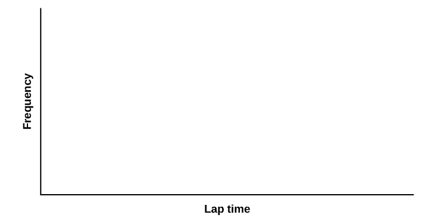

Normal Distribution (Lap Times)

Class Time:

Names:

Student Learning Outcome

* The student will compare and contrast empirical data and a theoretical distribution to determine if Terry Vogel\'s lap times fit a continuous distribution.

DirectionsRound the relative frequencies and probabilities to four decimal places. Carry all other decimal answers to two places.

Collect the Data

1.  Use the data from [Appendix C](/m47873). Use a stratified sampling method by lap (races 1 to 20) and a random number generator to pick six lap times from each stratum. Record the lap times below for laps two to seven.
    * * *
    {: data-type="newline"}
    
    | \\\_\\\_\\\_\\\_\\\_\\\_\\\_ | \\\_\\\_\\\_\\\_\\\_\\\_\\\_ | \\\_\\\_\\\_\\\_\\\_\\\_\\\_ | \\\_\\\_\\\_\\\_\\\_\\\_\\\_ | \\\_\\\_\\\_\\\_\\\_\\\_\\\_ | \\\_\\\_\\\_\\\_\\\_\\\_\\\_ |
    | \\\_\\\_\\\_\\\_\\\_\\\_\\\_ | \\\_\\\_\\\_\\\_\\\_\\\_\\\_ | \\\_\\\_\\\_\\\_\\\_\\\_\\\_ | \\\_\\\_\\\_\\\_\\\_\\\_\\\_ | \\\_\\\_\\\_\\\_\\\_\\\_\\\_ | \\\_\\\_\\\_\\\_\\\_\\\_\\\_ |
    | \\\_\\\_\\\_\\\_\\\_\\\_\\\_ | \\\_\\\_\\\_\\\_\\\_\\\_\\\_ | \\\_\\\_\\\_\\\_\\\_\\\_\\\_ | \\\_\\\_\\\_\\\_\\\_\\\_\\\_ | \\\_\\\_\\\_\\\_\\\_\\\_\\\_ | \\\_\\\_\\\_\\\_\\\_\\\_\\\_ |
    | \\\_\\\_\\\_\\\_\\\_\\\_\\\_ | \\\_\\\_\\\_\\\_\\\_\\\_\\\_ | \\\_\\\_\\\_\\\_\\\_\\\_\\\_ | \\\_\\\_\\\_\\\_\\\_\\\_\\\_ | \\\_\\\_\\\_\\\_\\\_\\\_\\\_ | \\\_\\\_\\\_\\\_\\\_\\\_\\\_ |
    | \\\_\\\_\\\_\\\_\\\_\\\_\\\_ | \\\_\\\_\\\_\\\_\\\_\\\_\\\_ | \\\_\\\_\\\_\\\_\\\_\\\_\\\_ | \\\_\\\_\\\_\\\_\\\_\\\_\\\_ | \\\_\\\_\\\_\\\_\\\_\\\_\\\_ | \\\_\\\_\\\_\\\_\\\_\\\_\\\_ |
    | \\\_\\\_\\\_\\\_\\\_\\\_\\\_ | \\\_\\\_\\\_\\\_\\\_\\\_\\\_ | \\\_\\\_\\\_\\\_\\\_\\\_\\\_ | \\\_\\\_\\\_\\\_\\\_\\\_\\\_ | \\\_\\\_\\\_\\\_\\\_\\\_\\\_ | \\\_\\\_\\\_\\\_\\\_\\\_\\\_ |
    {: #element-2352564535 summary="Blank table with 36 empty cells."}

2.  Construct a histogram. Make five to six intervals. Sketch the graph using a ruler and pencil. Scale the axes. {: #fig045324}

3.  Calculate the following:
    1.  <math xmlns="http://www.w3.org/1998/Math/MathML"> <mover accent="true"> <mi>x</mi> <mo>¯</mo> </mover> </math>
        
        = \\\_\\\_\\\_\\\_\\\_\\\_\\\_
    2.  *s* = \\\_\\\_\\\_\\\_\\\_\\\_\\\_
    {: type="a"}

4.  Draw a smooth curve through the tops of the bars of the histogram. Write one to two complete sentences to describe the general shape of the curve. (Keep it simple. Does the graph go straight across, does it have a v-shape, does it have a hump in the middle or at either end, and so on?)

Analyze the Distribution Using your sample mean, sample standard deviation, and histogram to help, what is the approximate theoretical distribution of the data?

* *X* ~ \\\_\\\_\\\_\\\_\\\_(\\\_\\\_\\\_\\\_\\\_,\\\_\\\_\\\_\\\_\\\_)
* How does the histogram help you arrive at the approximate distribution?

Describe the Data Use the data you collected to complete the following statements.

* The *IQR* goes from \\\_\\\_\\\_\\\_\\\_\\\_\\\_\\\_\\\_\\\_ to \\\_\\\_\\\_\\\_\\\_\\\_\\\_\\\_\\\_\\\_.
* *IQR* = \\\_\\\_\\\_\\\_\\\_\\\_\\\_\\\_\\\_\\\_. (*IQR* = *Q*3 – *Q*1)
* The 15th percentile is \\\_\\\_\\\_\\\_\\\_\\\_\\\_.
* The 85th percentile is \\\_\\\_\\\_\\\_\\\_\\\_\\\_.
* The median is \\\_\\\_\\\_\\\_\\\_\\\_\\\_.
* The empirical probability that a randomly chosen lap time is more than 130 seconds is \\\_\\\_\\\_\\\_\\\_\\\_\\\_.
* Explain the meaning of the 85th percentile of this data.

Theoretical Distribution Using the theoretical distribution, complete the following statements. You should use a normal approximation based on your sample data.

* The *IQR* goes from \\\_\\\_\\\_\\\_\\\_\\\_\\\_\\\_\\\_\\\_ to \\\_\\\_\\\_\\\_\\\_\\\_\\\_\\\_\\\_\\\_.
* *IQR* = \\\_\\\_\\\_\\\_\\\_\\\_\\\_.
* The 15th percentile is \\\_\\\_\\\_\\\_\\\_\\\_\\\_.
* The 85th percentile is \\\_\\\_\\\_\\\_\\\_\\\_\\\_.
* The median is \\\_\\\_\\\_\\\_\\\_\\\_\\\_.
* The probability that a randomly chosen lap time is more than 130 seconds is \\\_\\\_\\\_\\\_\\\_\\\_\\\_.
* Explain the meaning of the 85th percentile of this distribution.

Discussion QuestionsDo the data from the section titled [Collect the Data](#CollectData) give a close approximation to the theoretical distribution in the section titled [Analyze the Distribution](#AnalyzeDist)? In complete sentences and comparing the result in the sections titled [Describe the Data](#DescData) and [Theoretical Distribution](#TheoDist), explain why or why not.

