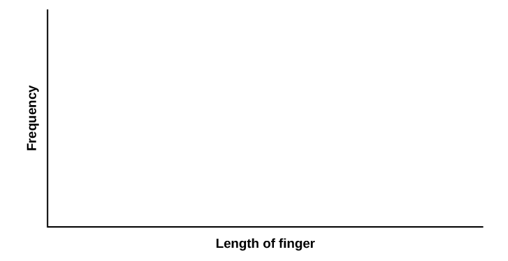

Normal Distribution (Pinkie Length)

Class Time:

Names:

Student Learning Outcomes

* The student will compare empirical data and a theoretical distribution to determine if data from the experiment follow a continuous distribution.

Collect the Data Measure the length of your pinky finger (in centimeters).

1.  Randomly survey 30 adults for their pinky finger lengths. Round the lengths to the nearest 0.5 cm.
    * * *
    {: data-type="newline"}
    
    | \\\_\\\_\\\_\\\_\\\_\\\_\\\_ | \\\_\\\_\\\_\\\_\\\_\\\_\\\_ | \\\_\\\_\\\_\\\_\\\_\\\_\\\_ | \\\_\\\_\\\_\\\_\\\_\\\_\\\_ | \\\_\\\_\\\_\\\_\\\_\\\_\\\_ |
    | \\\_\\\_\\\_\\\_\\\_\\\_\\\_ | \\\_\\\_\\\_\\\_\\\_\\\_\\\_ | \\\_\\\_\\\_\\\_\\\_\\\_\\\_ | \\\_\\\_\\\_\\\_\\\_\\\_\\\_ | \\\_\\\_\\\_\\\_\\\_\\\_\\\_ |
    | \\\_\\\_\\\_\\\_\\\_\\\_\\\_ | \\\_\\\_\\\_\\\_\\\_\\\_\\\_ | \\\_\\\_\\\_\\\_\\\_\\\_\\\_ | \\\_\\\_\\\_\\\_\\\_\\\_\\\_ | \\\_\\\_\\\_\\\_\\\_\\\_\\\_ |
    | \\\_\\\_\\\_\\\_\\\_\\\_\\\_ | \\\_\\\_\\\_\\\_\\\_\\\_\\\_ | \\\_\\\_\\\_\\\_\\\_\\\_\\\_ | \\\_\\\_\\\_\\\_\\\_\\\_\\\_ | \\\_\\\_\\\_\\\_\\\_\\\_\\\_ |
    | \\\_\\\_\\\_\\\_\\\_\\\_\\\_ | \\\_\\\_\\\_\\\_\\\_\\\_\\\_ | \\\_\\\_\\\_\\\_\\\_\\\_\\\_ | \\\_\\\_\\\_\\\_\\\_\\\_\\\_ | \\\_\\\_\\\_\\\_\\\_\\\_\\\_ |
    | \\\_\\\_\\\_\\\_\\\_\\\_\\\_ | \\\_\\\_\\\_\\\_\\\_\\\_\\\_ | \\\_\\\_\\\_\\\_\\\_\\\_\\\_ | \\\_\\\_\\\_\\\_\\\_\\\_\\\_ | \\\_\\\_\\\_\\\_\\\_\\\_\\\_ |
    {: #element-2352564535s summary="Blank table with 30 blank cells."}

2.  Construct a histogram. Make five to six intervals. Sketch the graph using a ruler and pencil. Scale the axes. {: #eip-idp99193136}

3.  Calculate the following.
    1.  <math xmlns="http://www.w3.org/1998/Math/MathML"> <mover accent="true"> <mi>x</mi> <mo>¯</mo> </mover> </math>
        
        = \\\_\\\_\\\_\\\_\\\_\\\_\\\_
    2.  *s* = \\\_\\\_\\\_\\\_\\\_\\\_\\\_
    {: data-number-style="lower-alpha"}

4.  Draw a smooth curve through the top of the bars of the histogram. Write one to two complete sentences to describe the general shape of the curve. (Keep it simple. Does the graph go straight across, does it have a v-shape, does it have a hump in the middle or at either end, and so on?)

Analyze the Distribution Using your sample mean, sample standard deviation, and histogram, what was the approximate theoretical distribution of the data you collected?

* *X* ~ \\\_\\\_\\\_\\\_\\\_(\\\_\\\_\\\_\\\_\\\_,\\\_\\\_\\\_\\\_\\\_)
* How does the histogram help you arrive at the approximate distribution?

Describe the Data Using the data you collected complete the following statements. (Hint: order the data)

Remember

(*IQR* = *Q*3 – *Q*1)

* *IQR* = \\\_\\\_\\\_\\\_\\\_\\\_\\\_
* The 15th percentile is \\\_\\\_\\\_\\\_\\\_\\\_\\\_.
* The 85th percentile is \\\_\\\_\\\_\\\_\\\_\\\_\\\_.
* Median is \\\_\\\_\\\_\\\_\\\_\\\_\\\_.
* What is the theoretical probability that a randomly chosen pinky length is more than 6.5 cm?
* Explain the meaning of the 85th percentile of this data.

Theoretical Distribution Using the theoretical distribution, complete the following statements. Use a normal approximation based on the sample mean and standard deviation.

* *IQR* = \\\_\\\_\\\_\\\_\\\_\\\_\\\_
* The 15th percentile is \\\_\\\_\\\_\\\_\\\_\\\_\\\_.
* The 85th percentile is \\\_\\\_\\\_\\\_\\\_\\\_\\\_.
* Median is \\\_\\\_\\\_\\\_\\\_\\\_\\\_.
* What is the theoretical probability that a randomly chosen pinky length is more than 6.5 cm?
* Explain the meaning of the 85th percentile of this data.

Discussion QuestionsDo the data you collected give a close approximation to the theoretical distribution? In complete sentences and comparing the results in the sections titled [Describe the Data](#DescData2) and [Theoretical Distribution](#TheoDist2), explain why or why not.

