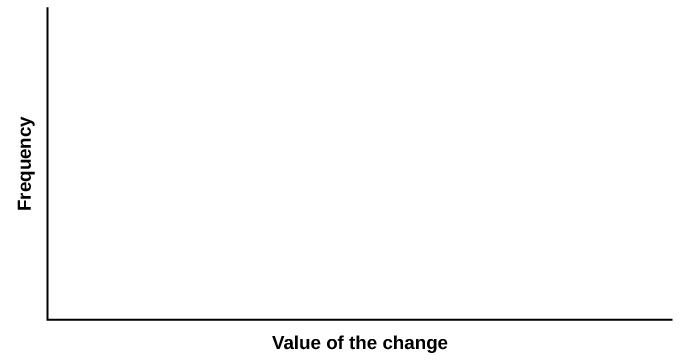

Central Limit Theorem (Pocket Change)

Class Time:

Names:

Student Learning Outcomes

* The student will demonstrate and compare properties of the central limit theorem.

Note

This lab works best when sampling from several classes and combining data.

Collect the Data

1.  Count the change in your pocket. (Do not include bills.)
2.  Randomly survey 30 classmates. Record the values of the change in [\[link\]](#Ch07_lab1_tbl001).
    | \\\_\\\_\\\_\\\_\\\_\\\_\\\_\\\_\\\_\\\_ | \\\_\\\_\\\_\\\_\\\_\\\_\\\_\\\_\\\_\\\_ | \\\_\\\_\\\_\\\_\\\_\\\_\\\_\\\_\\\_\\\_ | \\\_\\\_\\\_\\\_\\\_\\\_\\\_\\\_\\\_\\\_ | \\\_\\\_\\\_\\\_\\\_\\\_\\\_\\\_\\\_\\\_ |
    | \\\_\\\_\\\_\\\_\\\_\\\_\\\_\\\_\\\_\\\_ | \\\_\\\_\\\_\\\_\\\_\\\_\\\_\\\_\\\_\\\_ | \\\_\\\_\\\_\\\_\\\_\\\_\\\_\\\_\\\_\\\_ | \\\_\\\_\\\_\\\_\\\_\\\_\\\_\\\_\\\_\\\_ | \\\_\\\_\\\_\\\_\\\_\\\_\\\_\\\_\\\_\\\_ |
    | \\\_\\\_\\\_\\\_\\\_\\\_\\\_\\\_\\\_\\\_ | \\\_\\\_\\\_\\\_\\\_\\\_\\\_\\\_\\\_\\\_ | \\\_\\\_\\\_\\\_\\\_\\\_\\\_\\\_\\\_\\\_ | \\\_\\\_\\\_\\\_\\\_\\\_\\\_\\\_\\\_\\\_ | \\\_\\\_\\\_\\\_\\\_\\\_\\\_\\\_\\\_\\\_ |
    | \\\_\\\_\\\_\\\_\\\_\\\_\\\_\\\_\\\_\\\_ | \\\_\\\_\\\_\\\_\\\_\\\_\\\_\\\_\\\_\\\_ | \\\_\\\_\\\_\\\_\\\_\\\_\\\_\\\_\\\_\\\_ | \\\_\\\_\\\_\\\_\\\_\\\_\\\_\\\_\\\_\\\_ | \\\_\\\_\\\_\\\_\\\_\\\_\\\_\\\_\\\_\\\_ |
    | \\\_\\\_\\\_\\\_\\\_\\\_\\\_\\\_\\\_\\\_ | \\\_\\\_\\\_\\\_\\\_\\\_\\\_\\\_\\\_\\\_ | \\\_\\\_\\\_\\\_\\\_\\\_\\\_\\\_\\\_\\\_ | \\\_\\\_\\\_\\\_\\\_\\\_\\\_\\\_\\\_\\\_ | \\\_\\\_\\\_\\\_\\\_\\\_\\\_\\\_\\\_\\\_ |
    | \\\_\\\_\\\_\\\_\\\_\\\_\\\_\\\_\\\_\\\_ | \\\_\\\_\\\_\\\_\\\_\\\_\\\_\\\_\\\_\\\_ | \\\_\\\_\\\_\\\_\\\_\\\_\\\_\\\_\\\_\\\_ | \\\_\\\_\\\_\\\_\\\_\\\_\\\_\\\_\\\_\\\_ | \\\_\\\_\\\_\\\_\\\_\\\_\\\_\\\_\\\_\\\_ |
    {: #Ch07_lab1_tbl001 summary="Blank table with 30 empty cells."}

3.  Construct a histogram. Make five to six intervals. Sketch the graph using a ruler and pencil. Scale the axes.
    * * *
    {: data-type="newline"}
    
    {: #id17573354 data-media-type="image/png"}

4.  Calculate the following (*n* = 1; surveying one person at a time):
    1.  <math xmlns="http://www.w3.org/1998/Math/MathML"> <mover accent="true"> <mi>x</mi> <mo>¯</mo> </mover> </math>
        
        = \\\_\\\_\\\_\\\_\\\_\\\_\\\_
    2.  *s* = \\\_\\\_\\\_\\\_\\\_\\\_\\\_
    {: data-number-style="lower-alpha"}

5.  Draw a smooth curve through the tops of the bars of the histogram. Use one to two complete sentences to describe the general shape of the curve.

Collecting Averages of PairsRepeat steps one through five of the section [Collect the Data.](#CollectData) with one exception. Instead of recording the change of 30 classmates, record the average change of 30 pairs.

1.  Randomly survey 30 **pairs** of classmates.
2.  Record the values of the average of their change in [\[link\]](#Ch07_lab1_tbl002).
    | \\\_\\\_\\\_\\\_\\\_\\\_\\\_\\\_\\\_\\\_ | \\\_\\\_\\\_\\\_\\\_\\\_\\\_\\\_\\\_\\\_ | \\\_\\\_\\\_\\\_\\\_\\\_\\\_\\\_\\\_\\\_ | \\\_\\\_\\\_\\\_\\\_\\\_\\\_\\\_\\\_\\\_ | \\\_\\\_\\\_\\\_\\\_\\\_\\\_\\\_\\\_\\\_ |
    | \\\_\\\_\\\_\\\_\\\_\\\_\\\_\\\_\\\_\\\_ | \\\_\\\_\\\_\\\_\\\_\\\_\\\_\\\_\\\_\\\_ | \\\_\\\_\\\_\\\_\\\_\\\_\\\_\\\_\\\_\\\_ | \\\_\\\_\\\_\\\_\\\_\\\_\\\_\\\_\\\_\\\_ | \\\_\\\_\\\_\\\_\\\_\\\_\\\_\\\_\\\_\\\_ |
    | \\\_\\\_\\\_\\\_\\\_\\\_\\\_\\\_\\\_\\\_ | \\\_\\\_\\\_\\\_\\\_\\\_\\\_\\\_\\\_\\\_ | \\\_\\\_\\\_\\\_\\\_\\\_\\\_\\\_\\\_\\\_ | \\\_\\\_\\\_\\\_\\\_\\\_\\\_\\\_\\\_\\\_ | \\\_\\\_\\\_\\\_\\\_\\\_\\\_\\\_\\\_\\\_ |
    | \\\_\\\_\\\_\\\_\\\_\\\_\\\_\\\_\\\_\\\_ | \\\_\\\_\\\_\\\_\\\_\\\_\\\_\\\_\\\_\\\_ | \\\_\\\_\\\_\\\_\\\_\\\_\\\_\\\_\\\_\\\_ | \\\_\\\_\\\_\\\_\\\_\\\_\\\_\\\_\\\_\\\_ | \\\_\\\_\\\_\\\_\\\_\\\_\\\_\\\_\\\_\\\_ |
    | \\\_\\\_\\\_\\\_\\\_\\\_\\\_\\\_\\\_\\\_ | \\\_\\\_\\\_\\\_\\\_\\\_\\\_\\\_\\\_\\\_ | \\\_\\\_\\\_\\\_\\\_\\\_\\\_\\\_\\\_\\\_ | \\\_\\\_\\\_\\\_\\\_\\\_\\\_\\\_\\\_\\\_ | \\\_\\\_\\\_\\\_\\\_\\\_\\\_\\\_\\\_\\\_ |
    | \\\_\\\_\\\_\\\_\\\_\\\_\\\_\\\_\\\_\\\_ | \\\_\\\_\\\_\\\_\\\_\\\_\\\_\\\_\\\_\\\_ | \\\_\\\_\\\_\\\_\\\_\\\_\\\_\\\_\\\_\\\_ | \\\_\\\_\\\_\\\_\\\_\\\_\\\_\\\_\\\_\\\_ | \\\_\\\_\\\_\\\_\\\_\\\_\\\_\\\_\\\_\\\_ |
    {: #Ch07_lab1_tbl002 summary="Blank table containing 30 blank cells."}

3.  Construct a histogram. Scale the axes using the same scaling you used for the section titled [Collect the Data](#CollectData). Sketch the graph using a ruler and a pencil.
    * * *
    {: data-type="newline"}
    
    {: #id17561753 data-media-type="image/png"}

4.  Calculate the following (*n* = 2; surveying two people at a time):
    1.  <math xmlns="http://www.w3.org/1998/Math/MathML"> <mover accent="true"> <mi>x</mi> <mo>¯</mo> </mover> </math>
        
        = \\\_\\\_\\\_\\\_\\\_\\\_\\\_
    2.  *s* = \\\_\\\_\\\_\\\_\\\_\\\_\\\_
    {: data-number-style="lower-alpha"}

5.  Draw a smooth curve through tops of the bars of the histogram. Use one to two complete sentences to describe the general shape of the curve.

Collecting Averages of Groups of FiveRepeat steps one through five (of the section titled [Collect the Data](#CollectData)) with one exception. Instead of recording the change of 30 classmates, record the average change of 30 groups of five.

1.  Randomly survey 30 **groups of five** classmates.
2.  Record the values of the average of their change.
    | \\\_\\\_\\\_\\\_\\\_\\\_\\\_\\\_\\\_\\\_ | \\\_\\\_\\\_\\\_\\\_\\\_\\\_\\\_\\\_\\\_ | \\\_\\\_\\\_\\\_\\\_\\\_\\\_\\\_\\\_\\\_ | \\\_\\\_\\\_\\\_\\\_\\\_\\\_\\\_\\\_\\\_ | \\\_\\\_\\\_\\\_\\\_\\\_\\\_\\\_\\\_\\\_ |
    | \\\_\\\_\\\_\\\_\\\_\\\_\\\_\\\_\\\_\\\_ | \\\_\\\_\\\_\\\_\\\_\\\_\\\_\\\_\\\_\\\_ | \\\_\\\_\\\_\\\_\\\_\\\_\\\_\\\_\\\_\\\_ | \\\_\\\_\\\_\\\_\\\_\\\_\\\_\\\_\\\_\\\_ | \\\_\\\_\\\_\\\_\\\_\\\_\\\_\\\_\\\_\\\_ |
    | \\\_\\\_\\\_\\\_\\\_\\\_\\\_\\\_\\\_\\\_ | \\\_\\\_\\\_\\\_\\\_\\\_\\\_\\\_\\\_\\\_ | \\\_\\\_\\\_\\\_\\\_\\\_\\\_\\\_\\\_\\\_ | \\\_\\\_\\\_\\\_\\\_\\\_\\\_\\\_\\\_\\\_ | \\\_\\\_\\\_\\\_\\\_\\\_\\\_\\\_\\\_\\\_ |
    | \\\_\\\_\\\_\\\_\\\_\\\_\\\_\\\_\\\_\\\_ | \\\_\\\_\\\_\\\_\\\_\\\_\\\_\\\_\\\_\\\_ | \\\_\\\_\\\_\\\_\\\_\\\_\\\_\\\_\\\_\\\_ | \\\_\\\_\\\_\\\_\\\_\\\_\\\_\\\_\\\_\\\_ | \\\_\\\_\\\_\\\_\\\_\\\_\\\_\\\_\\\_\\\_ |
    | \\\_\\\_\\\_\\\_\\\_\\\_\\\_\\\_\\\_\\\_ | \\\_\\\_\\\_\\\_\\\_\\\_\\\_\\\_\\\_\\\_ | \\\_\\\_\\\_\\\_\\\_\\\_\\\_\\\_\\\_\\\_ | \\\_\\\_\\\_\\\_\\\_\\\_\\\_\\\_\\\_\\\_ | \\\_\\\_\\\_\\\_\\\_\\\_\\\_\\\_\\\_\\\_ |
    | \\\_\\\_\\\_\\\_\\\_\\\_\\\_\\\_\\\_\\\_ | \\\_\\\_\\\_\\\_\\\_\\\_\\\_\\\_\\\_\\\_ | \\\_\\\_\\\_\\\_\\\_\\\_\\\_\\\_\\\_\\\_ | \\\_\\\_\\\_\\\_\\\_\\\_\\\_\\\_\\\_\\\_ | \\\_\\\_\\\_\\\_\\\_\\\_\\\_\\\_\\\_\\\_ |
    {: #Ch07_lab1_tbl003 summary="Blank table containing 30 blank cells."}

3.  Construct a histogram. Scale the axes using the same scaling you used for the section titled [Collect the Data](#CollectData). Sketch the graph using a ruler and a pencil.{: #id17563881 data-media-type="image/png"}

4.  Calculate the following (*n* = 5; surveying five people at a time):
    1.  <math xmlns="http://www.w3.org/1998/Math/MathML"> <mover accent="true"> <mi>x</mi> <mo>¯</mo> </mover> </math>
        
        = \\\_\\\_\\\_\\\_\\\_\\\_\\\_
    2.  *s* = \\\_\\\_\\\_\\\_\\\_\\\_\\\_
    {: data-number-style="lower-alpha"}

5.  Draw a smooth curve through tops of the bars of the histogram. Use one to two complete sentences to describe the general shape of the curve.
{: data-number-style="arabic"}

Discussion Questions

1.  Why did the shape of the distribution of the data change, as *n* changed? Use one to two complete sentences to explain what happened.
2.  In the section titled [Collect the Data](#CollectData), what was the approximate distribution of the data? *X* ~ \\\_\\\_\\\_\\\_\\\_(\\\_\\\_\\\_\\\_\\\_,\\\_\\\_\\\_\\\_\\\_)
3.  In the section titled [Collecting Averages of Groups of Five](#element-505436759), what was the approximate distribution of the averages?
    <math xmlns="http://www.w3.org/1998/Math/MathML"> <mover accent="true"> <mi>X</mi> <mo>¯</mo> </mover> </math>
    
    ~ \\\_\\\_\\\_\\\_\\\_(\\\_\\\_\\\_\\\_\\\_,\\\_\\\_\\\_\\\_\\\_)
4.  In one to two complete sentences, explain any differences in your answers to the previous two questions.

