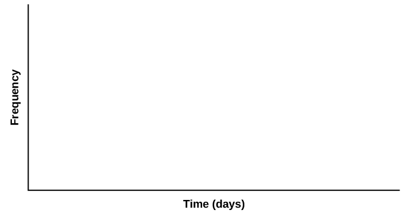

Central Limit Theorem (Cookie Recipes)

Class Time:

Names:

Student Learning Outcomes

* The student will demonstrate and compare properties of the central limit theorem.

Given*X* = length of time (in days) that a cookie recipe lasted at the Olmstead Homestead. (Assume that each of the different recipes makes the same quantity of cookies.)

| Recipe # | *X* |  | Recipe # | *X* |  | Recipe # | *X* |  | Recipe # | *X* |
|----------
| 1 | 1 |  | 16 | 2 |  | 31 | 3 |  | 46 | 2 |
| 2 | 5 |  | 17 | 2 |  | 32 | 4 |  | 47 | 2 |
| 3 | 2 |  | 18 | 4 |  | 33 | 5 |  | 48 | 11 |
| 4 | 5 |  | 19 | 6 |  | 34 | 6 |  | 49 | 5 |
| 5 | 6 |  | 20 | 1 |  | 35 | 6 |  | 50 | 5 |
| 6 | 1 |  | 21 | 6 |  | 36 | 1 |  | 51 | 4 |
| 7 | 2 |  | 22 | 5 |  | 37 | 1 |  | 52 | 6 |
| 8 | 6 |  | 23 | 2 |  | 38 | 2 |  | 53 | 5 |
| 9 | 5 |  | 24 | 5 |  | 39 | 1 |  | 54 | 1 |
| 10 | 2 |  | 25 | 1 |  | 40 | 6 |  | 55 | 1 |
| 11 | 5 |  | 26 | 6 |  | 41 | 1 |  | 56 | 2 |
| 12 | 1 |  | 27 | 4 |  | 42 | 6 |  | 57 | 4 |
| 13 | 1 |  | 28 | 1 |  | 43 | 2 |  | 58 | 3 |
| 14 | 3 |  | 29 | 6 |  | 44 | 6 |  | 59 | 6 |
| 15 | 2 |  | 30 | 2 |  | 45 | 2 |  | 60 | 5 |
{: #tableones23 summary="This table presents recipe data in the first column and X length of days data in the second column of 15 rows. These two columns repeat three more times in the same table."}

Calculate the following:  *μx* = \\\_\\\_\\\_\\\_\\\_\\\_\\\_ *σx* = \\\_\\\_\\\_\\\_\\\_\\\_\\\_ 

Collect the DataUse a random number generator to randomly select four samples of size *n* = 5 from the given population. Record your samples in [\[link\]](#Ch07_lab2_tbl002). Then, for each sample, calculate the mean to the nearest tenth. Record them in the spaces provided. Record the sample means for the rest of the class.
{: .finger}

1.  Complete the table:
    |  | Sample 1 | Sample 2 | Sample 3 | Sample 4 | Sample means from other groups: |
    |----------
    |  |  |  |  |  |  |
    |  |  |  |  |  |  |
    |  |  |  |  |  |  |
    |  |  |  |  |  |  |
    |  |  |  |  |  |  |
    | Means: | <math xmlns="http://www.w3.org/1998/Math/MathML"> <mover accent="true"> <mi>x</mi> <mo>¯</mo> </mover> </math>
    
     = \\\_\\\_\\\_\\\_ | <math xmlns="http://www.w3.org/1998/Math/MathML"> <mover accent="true"> <mi>x</mi> <mo>¯</mo> </mover> </math>
    
     = \\\_\\\_\\\_\\\_ | <math xmlns="http://www.w3.org/1998/Math/MathML"> <mover accent="true"> <mi>x</mi> <mo>¯</mo> </mover> </math>
    
     = \\\_\\\_\\\_\\\_ | <math xmlns="http://www.w3.org/1998/Math/MathML"> <mover accent="true"> <mi>x</mi> <mo>¯</mo> </mover> </math>
    
     = \\\_\\\_\\\_\\\_ |  |
    {: #Ch07_lab2_tbl002 summary="Partially filled table with samples (4) in columns and 5 blank rows plus a blank Means row."}

2.  Calculate the following:
    1.  <math xmlns="http://www.w3.org/1998/Math/MathML"> <mover accent="true"> <mi>x</mi> <mo>¯</mo> </mover> </math>
        
        = \\\_\\\_\\\_\\\_\\\_\\\_\\\_
    2.  *s*<math xmlns="http://www.w3.org/1998/Math/MathML"> <mover accent="true"> <mi>x</mi> <mo>¯</mo> </mover> </math>
         = \\\_\\\_\\\_\\\_\\\_\\\_\\\_
    {: data-number-style="lower-alpha"}

3.  {: .finger} Again, use a random number generator to randomly select four samples from the population. This time, make the samples of size *n* = 10. Record the samples in [\[link\]](#Ch07_lab2_tbl003). As before, for each sample, calculate the mean to the nearest tenth. Record them in the spaces provided. Record the sample means for the rest of the class.
    |  | Sample 1 | Sample 2 | Sample 3 | Sample 4 | Sample means from other groups |
    |----------
    |  |  |  |  |  |  |
    |  |  |  |  |  |  |
    |  |  |  |  |  |  |
    |  |  |  |  |  |  |
    |  |  |  |  |  |  |
    |  |  |  |  |  |  |
    |  |  |  |  |  |  |
    |  |  |  |  |  |  |
    |  |  |  |  |  |  |
    |  |  |  |  |  |  |
    | Means: | <math xmlns="http://www.w3.org/1998/Math/MathML"> <mover accent="true"> <mi>x</mi> <mo>¯</mo> </mover> </math>
    
     = \\\_\\\_\\\_\\\_ | <math xmlns="http://www.w3.org/1998/Math/MathML"> <mover accent="true"> <mi>x</mi> <mo>¯</mo> </mover> </math>
    
     = \\\_\\\_\\\_\\\_ | <math xmlns="http://www.w3.org/1998/Math/MathML"> <mover accent="true"> <mi>x</mi> <mo>¯</mo> </mover> </math>
    
     = \\\_\\\_\\\_\\\_ | <math xmlns="http://www.w3.org/1998/Math/MathML"> <mover accent="true"> <mi>x</mi> <mo>¯</mo> </mover> </math>
    
     = \\\_\\\_\\\_\\\_ |  |
    {: #Ch07_lab2_tbl003 summary="Same as the above table except with 10 blank rows and a means row."}

4.  Calculate the following:
    1.  <math xmlns="http://www.w3.org/1998/Math/MathML"> <mover accent="true"> <mi>x</mi> <mo>¯</mo> </mover> </math>
        
        = \\\_\\\_\\\_\\\_\\\_\\\_
    2.  *s*<math xmlns="http://www.w3.org/1998/Math/MathML"> <mover accent="true"> <mi>x</mi> <mo>¯</mo> </mover> </math>
         = \\\_\\\_\\\_\\\_\\\_\\\_
    {: data-number-style="lower-alpha"}

5.  For the original population, construct a histogram. Make intervals with a bar width of one day. Sketch the graph using a ruler and pencil. Scale the axes.
    * * *
    {: data-type="newline"}
    
    {: #id6597795 data-media-type="image/png"}

6.  Draw a smooth curve through the tops of the bars of the histogram. Use one to two complete sentences to describe the general shape of the curve.

Repeat the Procedure for *n* = 5

1.  For the sample of *n* = 5 days averaged together, construct a histogram of the averages (your means together with the means of the other groups). Make intervals with bar widths of
    <math xmlns="http://www.w3.org/1998/Math/MathML"> <mrow> <mfrac> <mn>1</mn> <mn>2</mn> </mfrac> </mrow> </math>
    
    a day. Sketch the graph using a ruler and pencil. Scale the axes. {: #id6597892 data-media-type="image/png"}

2.  Draw a smooth curve through the tops of the bars of the histogram. Use one to two complete sentences to describe the general shape of the curve.

Repeat the Procedure for *n* = 10

1.  For the sample of *n* = 10 days averaged together, construct a histogram of the averages (your means together with the means of the other groups). Make intervals with bar widths of
    <math xmlns="http://www.w3.org/1998/Math/MathML"> <mrow> <mfrac> <mn>1</mn> <mn>2</mn> </mfrac> </mrow> </math>
    
    a day. Sketch the graph using a ruler and pencil. Scale the axes.{: #id6597991 data-media-type="image/png"}

2.  Draw a smooth curve through the tops of the bars of the histogram. Use one to two complete sentences to describe the general shape of the curve.

Discussion Questions

1.  Compare the three histograms you have made, the one for the population and the two for the sample means. In three to five sentences, describe the similarities and differences.
2.  State the theoretical (according to the clt) distributions for the sample means.
    1.  *n* = 5:
        <math xmlns="http://www.w3.org/1998/Math/MathML"> <mover accent="true"> <mi>x</mi> <mo>¯</mo> </mover> </math>
        
        ~ \\\_\\\_\\\_\\\_\\\_(\\\_\\\_\\\_\\\_\\\_,\\\_\\\_\\\_\\\_\\\_)
    2.  *n* = 10:
        <math xmlns="http://www.w3.org/1998/Math/MathML"> <mover accent="true"> <mi>x</mi> <mo>¯</mo> </mover> </math>
        
        ~ \\\_\\\_\\\_\\\_\\\_(\\\_\\\_\\\_\\\_\\\_,\\\_\\\_\\\_\\\_\\\_)
    {: data-number-style="lower-alpha"}

3.  Are the sample means for *n* = 5 and *n* = 10 “close” to the theoretical mean, *μx*? Explain why or why not.
4.  Which of the two distributions of sample means has the smaller standard deviation? Why?
5.  As *n* changed, why did the shape of the distribution of the data change? Use one to two complete sentences to explain what happened.
{: data-mark-suffix="."}

