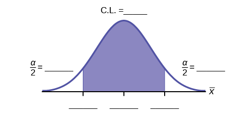

Confidence Interval (Home Costs)

Class Time:

Names:

Student Learning Outcomes

* The student will calculate the 90% confidence interval for the mean cost of a home in the area in which this school is located.
* The student will interpret confidence intervals.
* The student will determine the effects of changing conditions on the confidence interval.

Collect the Data Check the Real Estate section in your local newspaper. Record the sale prices for 35 randomly selected homes recently listed in the county.

Note

Many newspapers list them only one day per week. Also, we will assume that homes come up for sale randomly.

1.  Complete the table:
    | \\\_\\\_\\\_\\\_\\\_\\\_\\\_\\\_\\\_\\\_ | \\\_\\\_\\\_\\\_\\\_\\\_\\\_\\\_\\\_\\\_ | \\\_\\\_\\\_\\\_\\\_\\\_\\\_\\\_\\\_\\\_ | \\\_\\\_\\\_\\\_\\\_\\\_\\\_\\\_\\\_\\\_ | \\\_\\\_\\\_\\\_\\\_\\\_\\\_\\\_\\\_\\\_ |
    | \\\_\\\_\\\_\\\_\\\_\\\_\\\_\\\_\\\_\\\_ | \\\_\\\_\\\_\\\_\\\_\\\_\\\_\\\_\\\_\\\_ | \\\_\\\_\\\_\\\_\\\_\\\_\\\_\\\_\\\_\\\_ | \\\_\\\_\\\_\\\_\\\_\\\_\\\_\\\_\\\_\\\_ | \\\_\\\_\\\_\\\_\\\_\\\_\\\_\\\_\\\_\\\_ |
    | \\\_\\\_\\\_\\\_\\\_\\\_\\\_\\\_\\\_\\\_ | \\\_\\\_\\\_\\\_\\\_\\\_\\\_\\\_\\\_\\\_ | \\\_\\\_\\\_\\\_\\\_\\\_\\\_\\\_\\\_\\\_ | \\\_\\\_\\\_\\\_\\\_\\\_\\\_\\\_\\\_\\\_ | \\\_\\\_\\\_\\\_\\\_\\\_\\\_\\\_\\\_\\\_ |
    | \\\_\\\_\\\_\\\_\\\_\\\_\\\_\\\_\\\_\\\_ | \\\_\\\_\\\_\\\_\\\_\\\_\\\_\\\_\\\_\\\_ | \\\_\\\_\\\_\\\_\\\_\\\_\\\_\\\_\\\_\\\_ | \\\_\\\_\\\_\\\_\\\_\\\_\\\_\\\_\\\_\\\_ | \\\_\\\_\\\_\\\_\\\_\\\_\\\_\\\_\\\_\\\_ |
    | \\\_\\\_\\\_\\\_\\\_\\\_\\\_\\\_\\\_\\\_ | \\\_\\\_\\\_\\\_\\\_\\\_\\\_\\\_\\\_\\\_ | \\\_\\\_\\\_\\\_\\\_\\\_\\\_\\\_\\\_\\\_ | \\\_\\\_\\\_\\\_\\\_\\\_\\\_\\\_\\\_\\\_ | \\\_\\\_\\\_\\\_\\\_\\\_\\\_\\\_\\\_\\\_ |
    | \\\_\\\_\\\_\\\_\\\_\\\_\\\_\\\_\\\_\\\_ | \\\_\\\_\\\_\\\_\\\_\\\_\\\_\\\_\\\_\\\_ | \\\_\\\_\\\_\\\_\\\_\\\_\\\_\\\_\\\_\\\_ | \\\_\\\_\\\_\\\_\\\_\\\_\\\_\\\_\\\_\\\_ | \\\_\\\_\\\_\\\_\\\_\\\_\\\_\\\_\\\_\\\_ |
    | \\\_\\\_\\\_\\\_\\\_\\\_\\\_\\\_\\\_\\\_ | \\\_\\\_\\\_\\\_\\\_\\\_\\\_\\\_\\\_\\\_ | \\\_\\\_\\\_\\\_\\\_\\\_\\\_\\\_\\\_\\\_ | \\\_\\\_\\\_\\\_\\\_\\\_\\\_\\\_\\\_\\\_ | \\\_\\\_\\\_\\\_\\\_\\\_\\\_\\\_\\\_\\\_ |
    {: #tableone32 summary="Blank table of 35 empty cells"}

Describe the Data

1.  Compute the following:
    1.  <math xmlns="http://www.w3.org/1998/Math/MathML"> <mover accent="true"> <mi>x</mi> <mo>¯</mo> </mover> </math>
        
        = \\\_\\\_\\\_\\\_\\\_
    2.  <math xmlns="http://www.w3.org/1998/Math/MathML"> <mrow> <msub> <mi>s</mi> <mi>x</mi> </msub> </mrow> </math>
        
        = \\\_\\\_\\\_\\\_\\\_
    3.  *n* = \\\_\\\_\\\_\\\_\\\_
    {: type="a"}

2.  In words, define the random variable
    <math xmlns="http://www.w3.org/1998/Math/MathML"> <mover accent="true"> <mi>X</mi> <mo>¯</mo> </mover> </math>
    
    .
3.  State the estimated distribution to use. Use both words and symbols.

Find the Confidence Interval

1.  Calculate the confidence interval and the error bound.
    1.  Confidence Interval: \\\_\\\_\\\_\\\_\\\_
    2.  Error Bound: \\\_\\\_\\\_\\\_\\\_
    {: type="a"}

2.  How much area is in both tails (combined)? *α* = \\\_\\\_\\\_\\\_\\\_
3.  How much area is in each tail?
    <math xmlns="http://www.w3.org/1998/Math/MathML"> <mrow> <mfrac> <mi>α</mi> <mn>2</mn> </mfrac> </mrow> </math>
    
    = \\\_\\\_\\\_\\\_\\\_
4.  Fill in the blanks on the graph with the area in each section. Then, fill in the number line with the upper and lower limits of the confidence interval and the sample mean. {: #id7469736}

5.  Some students think that a 90% confidence interval contains 90% of the data. Use the list of data on the first page and count how many of the data values lie within the confidence interval. What percent is this? Is this percent close to 90%? Explain why this percent should or should not be close to 90%.

Describe the Confidence Interval

1.  In two to three complete sentences, explain what a confidence interval means (in general), as if you were talking to someone who has not taken statistics.
2.  In one to two complete sentences, explain what this confidence interval means for this particular study.

Use the Data to Construct Confidence Intervals

1.  Using the given information, construct a confidence interval for each confidence level given.
    | Confidence level | EBM/Error Bound | Confidence Interval |
    |----------
    | 50% |  |  |
    | 80% |  |  |
    | 95% |  |  |
    | 99% |  |  |
    {: #id3675asdffgh75848jhgf538 summary="Partially blank table with confidence level in the first column, EBM/Error Bound in the blank second column, and confidence interval in the blank third column."}

2.  What happens to the EBM as the confidence level increases? Does the width of the confidence interval increase or decrease? Explain why this happens.

