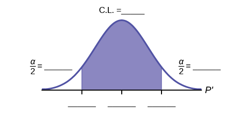

Confidence Interval (Place of Birth)

Class Time:

Names:

Student Learning Outcomes

* The student will calculate the 90% confidence interval the proportion of students in this school who were born in this state.
* The student will interpret confidence intervals.
* The student will determine the effects of changing conditions on the confidence interval.

Collect the Data

1.  Survey the students in your class, asking them if they were born in this state. Let *X* = the number that were born in this state.
    1.  *n* = \\\_\\\_\\\_\\\_\\\_\\\_\\\_\\\_\\\_\\\_\\\_\\\_
    2.  *x* = \\\_\\\_\\\_\\\_\\\_\\\_\\\_\\\_\\\_\\\_\\\_\\\_
    {: data-number-style="lower-alpha"}

2.  In words, define the random variable *P′*.
3.  State the estimated distribution to use.

Find the Confidence Interval and Error Bound

1.  Calculate the confidence interval and the error bound.
    1.  Confidence Interval: \\\_\\\_\\\_\\\_\\\_
    2.  Error Bound: \\\_\\\_\\\_\\\_\\\_
    {: data-number-style="lower-alpha"}

2.  How much area is in both tails (combined)? α = \\\_\\\_\\\_\\\_\\\_
3.  How much area is in each tail?
    <math xmlns="http://www.w3.org/1998/Math/MathML"> <mrow> <mfrac> <mi>α</mi> <mn>2</mn> </mfrac> </mrow> </math>
    
    = \\\_\\\_\\\_\\\_\\\_
4.  Fill in the blanks on the graph with the area in each section. Then, fill in the number line with the upper and lower limits of the confidence interval and the sample proportion. {: #id9596836}

Describe the Confidence Interval

1.  In two to three complete sentences, explain what a confidence interval means (in general), as though you were talking to someone who has not taken statistics.
2.  In one to two complete sentences, explain what this confidence interval means for this particular study.
3.  Construct a confidence interval for each confidence level given.
    | Confidence level | EBP/Error Bound | Confidence Interval |
    |----------
    | 50% |  |  |
    | 80% |  |  |
    | 95% |  |  |
    | 99% |  |  |
    {: #id6699poi200 summary="Partially blank table with confidence level in the first column, EBM/Error Bound in the blank second column, and confidence interval in the blank third column."}

4.  What happens to the EBP as the confidence level increases? Does the width of the confidence interval increase or decrease? Explain why this happens.

