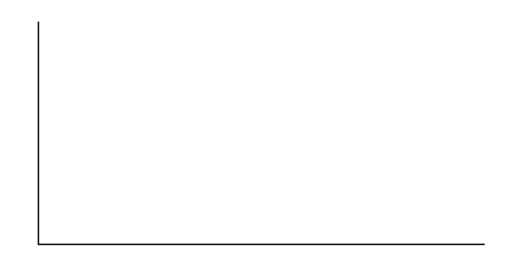

Hypothesis Testing for Two Means and Two Proportions

Class Time:

Names:

Student Learning Outcomes

* The student will select the appropriate distributions to use in each case.
* The student will conduct hypothesis tests and interpret the results.

Supplies:

* the business section from two consecutive days’ newspapers
* three small packages of M&amp;Ms®
* five small packages of Reese\'s Pieces®

Increasing Stocks Survey* * *
{: data-type="newline"}

Look at yesterday’s newspaper business section. Conduct a hypothesis test to determine if the proportion of New York Stock Exchange (NYSE) stocks that increased is greater than the proportion of NASDAQ stocks that increased. As randomly as possible, choose 40 NYSE stocks, and 32 NASDAQ stocks and complete the following statements.

1.  *H0\: \\\_\\\_\\\_\\\_\\\_\\\_\\\_\\\_\\\_*
2.  *Ha\: \\\_\\\_\\\_\\\_\\\_\\\_\\\_\\\_\\\_*
3.  In words, define the random variable.
4.  The distribution to use for the test is \\\_\\\_\\\_\\\_\\\_\\\_\\\_\\\_\\\_\\\_\\\_\\\_\\\_.
5.  Calculate the test statistic using your data.
6.  Draw a graph and label it appropriately. Shade the actual level of significance.
    1.  Graph: {: #id6690350 data-media-type="image/png"}

    2.  Calculate the *p*-value.
    {: data-number-style="lower-alpha"}

7.  Do you reject or not reject the null hypothesis? Why?
8.  Write a clear conclusion using a complete sentence.
{: data-mark-suffix="."}

Decreasing Stocks Survey * * *
{: data-type="newline"}

Randomly pick eight stocks from the newspaper. Using two consecutive days’ business sections, test whether the stocks went down, on average, for the second day.

1.  *H0*\: \\\_\\\_\\\_\\\_\\\_\\\_\\\_\\\_
2.  *Ha\: \\\_\\\_\\\_\\\_\\\_\\\_\\\_\\\_*
3.  In words, define the random variable.
4.  The distribution to use for the test is \\\_\\\_\\\_\\\_\\\_\\\_\\\_\\\_\\\_\\\_\\\_\\\_\\\_.
5.  Calculate the test statistic using your data.
6.  Draw a graph and label it appropriately. Shade the actual level of significance.
    1.  Graph:{: #id8343352 data-media-type="image/png"}

    2.  Calculate the *p*-value:
    {: data-number-style="lower-alpha"}

7.  Do you reject or not reject the null hypothesis? Why?
8.  Write a clear conclusion using a complete sentence.
{: data-mark-suffix="."}

Candy Survey Buy three small packages of M&amp;Ms and five small packages of Reese\'s Pieces (same net weight as the M&amp;Ms). Test whether or not the mean number of candy pieces per package is the same for the two brands.

1.  *H0*\: \\\_\\\_\\\_\\\_\\\_\\\_\\\_\\\_
2.  *Ha*\: \\\_\\\_\\\_\\\_\\\_\\\_\\\_\\\_
3.  In words, define the random variable.
4.  What distribution should be used for this test?
5.  Calculate the test statistic using your data.
6.  Draw a graph and label it appropriately. Shade the actual level of significance.
    1.  Graph:{: #id8343564 data-media-type="image/png"}

    2.  Calculate the *p*-value.
    {: data-number-style="lower-alpha"}

7.  Do you reject or not reject the null hypothesis? Why?
8.  Write a clear conclusion using a complete sentence.
{: data-mark-suffix="."}

Shoe Survey Test whether women have, on average, more pairs of shoes than men. Include all forms of sneakers, shoes, sandals, and boots. Use your class as the sample.

1.  *H0*\: \\\_\\\_\\\_\\\_\\\_\\\_\\\_\\\_
2.  *Ha*\: \\\_\\\_\\\_\\\_\\\_\\\_\\\_\\\_
3.  In words, define the random variable.
4.  The distribution to use for the test is \\\_\\\_\\\_\\\_\\\_\\\_\\\_\\\_\\\_\\\_\\\_\\\_\\\_\\\_\\\_\\\_.
5.  Calculate the test statistic using your data.
6.  Draw a graph and label it appropriately. Shade the actual level of significance.
    1.  Graph:{: #id8357842 data-media-type="image/png"}

    2.  Calculate the *p*-value.
    {: data-number-style="lower-alpha"}

7.  Do you reject or not reject the null hypothesis? Why?
8.  Write a clear conclusion using a complete sentence.
{: data-mark-suffix="."}

