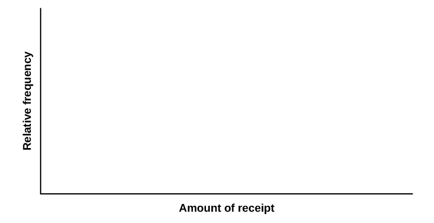

Lab 1: Chi-Square Goodness-of-Fit

Class Time:

Names:

Student Learning Outcome

* The student will evaluate data collected to determine if they fit either the uniform or exponential distributions.

Collect the Data Go to your local supermarket. Ask 30 people as they leave for the total amount on their grocery receipts. (Or, ask three cashiers for the last ten amounts. Be sure to include the express lane, if it is open.)

Note

You may need to combine two categories so that each cell has an expected value of at least five.

1.  Record the values.
    | \\\_\\\_\\\_\\\_\\\_\\\_\\\_\\\_\\\_\\\_ | \\\_\\\_\\\_\\\_\\\_\\\_\\\_\\\_\\\_\\\_ | \\\_\\\_\\\_\\\_\\\_\\\_\\\_\\\_\\\_\\\_ | \\\_\\\_\\\_\\\_\\\_\\\_\\\_\\\_\\\_\\\_ | \\\_\\\_\\\_\\\_\\\_\\\_\\\_\\\_\\\_\\\_ |
    | \\\_\\\_\\\_\\\_\\\_\\\_\\\_\\\_\\\_\\\_ | \\\_\\\_\\\_\\\_\\\_\\\_\\\_\\\_\\\_\\\_ | \\\_\\\_\\\_\\\_\\\_\\\_\\\_\\\_\\\_\\\_ | \\\_\\\_\\\_\\\_\\\_\\\_\\\_\\\_\\\_\\\_ | \\\_\\\_\\\_\\\_\\\_\\\_\\\_\\\_\\\_\\\_ |
    | \\\_\\\_\\\_\\\_\\\_\\\_\\\_\\\_\\\_\\\_ | \\\_\\\_\\\_\\\_\\\_\\\_\\\_\\\_\\\_\\\_ | \\\_\\\_\\\_\\\_\\\_\\\_\\\_\\\_\\\_\\\_ | \\\_\\\_\\\_\\\_\\\_\\\_\\\_\\\_\\\_\\\_ | \\\_\\\_\\\_\\\_\\\_\\\_\\\_\\\_\\\_\\\_ |
    | \\\_\\\_\\\_\\\_\\\_\\\_\\\_\\\_\\\_\\\_ | \\\_\\\_\\\_\\\_\\\_\\\_\\\_\\\_\\\_\\\_ | \\\_\\\_\\\_\\\_\\\_\\\_\\\_\\\_\\\_\\\_ | \\\_\\\_\\\_\\\_\\\_\\\_\\\_\\\_\\\_\\\_ | \\\_\\\_\\\_\\\_\\\_\\\_\\\_\\\_\\\_\\\_ |
    | \\\_\\\_\\\_\\\_\\\_\\\_\\\_\\\_\\\_\\\_ | \\\_\\\_\\\_\\\_\\\_\\\_\\\_\\\_\\\_\\\_ | \\\_\\\_\\\_\\\_\\\_\\\_\\\_\\\_\\\_\\\_ | \\\_\\\_\\\_\\\_\\\_\\\_\\\_\\\_\\\_\\\_ | \\\_\\\_\\\_\\\_\\\_\\\_\\\_\\\_\\\_\\\_ |
    | \\\_\\\_\\\_\\\_\\\_\\\_\\\_\\\_\\\_\\\_ | \\\_\\\_\\\_\\\_\\\_\\\_\\\_\\\_\\\_\\\_ | \\\_\\\_\\\_\\\_\\\_\\\_\\\_\\\_\\\_\\\_ | \\\_\\\_\\\_\\\_\\\_\\\_\\\_\\\_\\\_\\\_ | \\\_\\\_\\\_\\\_\\\_\\\_\\\_\\\_\\\_\\\_ |
    {: #table023865 summary="Blank table with 30 empty cells."}

2.  Construct a histogram of the data. Make five to six intervals. Sketch the graph using a ruler and pencil. Scale the axes. {: #id42008923}

3.  Calculate the following:
    1.  <math xmlns="http://www.w3.org/1998/Math/MathML"> <mrow> <mover accent="true"> <mi>x</mi> <mo>¯</mo> </mover> <mo>=</mo> </mrow> </math>
        
        \\\_\\\_\\\_\\\_\\\_\\\_\\\_\\\_
    2.  *s* = \\\_\\\_\\\_\\\_\\\_\\\_\\\_\\\_
    3.  *s*2 = \\\_\\\_\\\_\\\_\\\_\\\_\\\_\\\_
    {: data-number-style="lower-alpha"}
{: data-mark-suffix="."}

Uniform Distribution Test to see if grocery receipts follow the uniform distribution.

1.  Using your lowest and highest values, *X* ~ *U* (\\\_\\\_\\\_\\\_\\\_\\\_\\\_, \\\_\\\_\\\_\\\_\\\_\\\_\\\_)
2.  Divide the distribution into fifths.
3.  Calculate the following:
    1.  lowest value = \\\_\\\_\\\_\\\_\\\_\\\_\\\_\\\_\\\_
    2.  20th percentile = \\\_\\\_\\\_\\\_\\\_\\\_\\\_\\\_\\\_
    3.  40th percentile = \\\_\\\_\\\_\\\_\\\_\\\_\\\_\\\_\\\_
    4.  60th percentile = \\\_\\\_\\\_\\\_\\\_\\\_\\\_\\\_\\\_
    5.  80th percentile = \\\_\\\_\\\_\\\_\\\_\\\_\\\_\\\_\\\_
    6.  highest value = \\\_\\\_\\\_\\\_\\\_\\\_\\\_\\\_\\\_
    {: data-number-style="lower-alpha"}

4.  For each fifth, count the observed number of receipts and record it. Then determine the expected number of receipts and record that.
    | Fifth | Observed | Expected |
    |----------
    | 1st |  |  |
    | 2nd |  |  |
    | 3rd |  |  |
    | 4th |  |  |
    | 5th |  |  |
    {: #id58758asdfa533062 summary="The partially filled table presents each fifth in the first column, observed in the blank second column, and expected in the blank third column. There are 5 rows."}

5.  *H0*\: \\\_\\\_\\\_\\\_\\\_\\\_\\\_\\\_
6.  *Ha*\: \\\_\\\_\\\_\\\_\\\_\\\_\\\_\\\_
7.  What distribution should you use for a hypothesis test?
8.  Why did you choose this distribution?
9.  Calculate the test statistic.
10. Find the *p*-value.
11. Sketch a graph of the situation. Label and scale the *x*-axis. Shade the area corresponding to the *p*-value. {: #id40469669}

12. State your decision.
13. State your conclusion in a complete sentence.
{: data-mark-suffix="."}

Exponential Distribution Test to see if grocery receipts follow the exponential distribution with decay parameter <math xmlns="http://www.w3.org/1998/Math/MathML"> <mfrac> <mrow> <mn>1</mn> </mrow> <mrow> <apply> <conjugate /> <ci>x</ci> </apply> </mrow> </mfrac> </math>

.

1.  Using
    <math xmlns="http://www.w3.org/1998/Math/MathML"> <mrow> <mfrac> <mn>1</mn> <mover accent="true"> <mi>x</mi> <mo>¯</mo> </mover> </mfrac> </mrow> </math>
    
    as the decay parameter, *X* ~ *Exp*(\\\_\\\_\\\_\\\_\\\_\\\_\\\_\\\_\\\_).
2.  Calculate the following:
    1.  lowest value = \\\_\\\_\\\_\\\_\\\_\\\_\\\_\\\_
    2.  first quartile = \\\_\\\_\\\_\\\_\\\_\\\_\\\_\\\_
    3.  37th percentile = \\\_\\\_\\\_\\\_\\\_\\\_\\\_\\\_
    4.  median = \\\_\\\_\\\_\\\_\\\_\\\_\\\_\\\_
    5.  63rd percentile = \\\_\\\_\\\_\\\_\\\_\\\_\\\_\\\_
    6.  3rd quartile = \\\_\\\_\\\_\\\_\\\_\\\_\\\_\\\_
    7.  highest value = \\\_\\\_\\\_\\\_\\\_\\\_\\\_\\\_
    {: data-number-style="lower-alpha"}

3.  For each cell, count the observed number of receipts and record it. Then determine the expected number of receipts and record that.
    | Cell | Observed | Expected |
    |----------
    | 1st |  |  |
    | 2nd |  |  |
    | 3rd |  |  |
    | 4th |  |  |
    | 5th |  |  |
    | 6th |  |  |
    {: #id5asd875fasssff533783 summary="The partially filled table presents the cell in the first column, observed in the blank second column, and the expected in the blank third column. There are 6 rows."}

4.  *H0*\: \\\_\\\_\\\_\\\_\\\_\\\_\\\_\\\_
5.  *Ha*\: \\\_\\\_\\\_\\\_\\\_\\\_\\\_\\\_
6.  What distribution should you use for a hypothesis test?
7.  Why did you choose this distribution?
8.  Calculate the test statistic.
9.  Find the *p*-value.
10. Sketch a graph of the situation. Label and scale the *x*-axis. Shade the area corresponding to the *p*-value. {: #id42004364}

11. State your decision.
12. State your conclusion in a complete sentence.
{: data-mark-suffix="."}

Discussion Questions

1.  Did your data fit either distribution? If so, which?
2.  In general, do you think it’s likely that data could fit more than one distribution? In complete sentences, explain why or why not.

